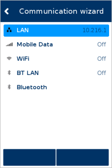
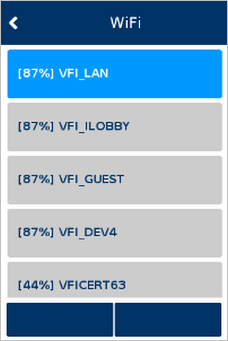

# adk_ccp_programmers_guide.dox


## Source code

```cpp
, char ** /*argv*/) {

    /* Init routine of this GUI application.
       Setup resource folders, setup default languages etc ... */
    prv_init_gui();

    /* call CCP configuration submenu without password protection */
    if(CCP_LIB_OK != ccp_show(CCP_MENU_CONFIGURATION_NO_PWD, "flash/info.db")) {

    fprintf(stderr, "FAILURE ON CALLING CCP_MENU_CONFIGURATION_NO_PWD MENU");
    return 1;
    }

    /* call CCP main menu dialog with own timeout for password entry characters. */
    vfigui::uiSetPropertyInt(vfigui::UI_PROP_PASSWORD_SHOW_CHAR, 5000);
    if(CCP_LIB_OK != ccp_show(CCP_MENU_MAIN_NO_PWD, "flash/info.db", false)) {

    fprintf(stderr, "FAILURE ON CALLING CCP_MENU_MAIN_NO_PWD MENU");
    return 1;
    }

    return 0;
}

\endcode

\subsubsection sec_ccp_sec_usingadkccp_api_mode Get your settings from CCP

If you integrated CCP menus to your application you may want to obtain the set data from CCP's network profiles.
You can access the following profiles via ADK_INFOSVC framework:

+ com/_internal/default/net/ETH0
+ com/_internal/default/net/ETH1
+ com/_internal/default/net/GPRS0
+ com/_internal/default/net/PPP0
+ com/_internal/default/net/BT/PAN
+ com/_internal/default/net/BT/DUN
+ com/_internal/default/net/BT/WLAN
+ com/_internal/default/net/BT/USBCLIENT
+ com/_internal/default/net/BT/USBHOST

\code
    static const string MY_ETH_PROF ("com/_internal/default/net/ETH0");

    InfoDB *db=info_opendb(dbname, INFO_READ_ONLY);

    char *out(NULL);
    info_readString(db, INFO_ROOT, MY_ETH_PROF + "/device_name", &out);
    /* some more readouts here */

    info_closedb(db);
\endcode

\subsection sec_ccp_sec_certificates CCP certificates and keyfiles
In V/OS and V/OS2 there are some features in the CCP which may require you to select certificates and/or keyfiles.
For example when connecting to a WiFi network which is using TLS you may need to specify CA/client-certificates and a client-keyfile.
CCP will look into directory /etc/config/adk/com/ccp/certs/ for both certificates and keyfiles. To be able to install files there the application
must create a user-signed configuration package and load it into the machine.


Example control file:
\code
Package: adkcom-certs
Version: 1.0.0
User: usr1
Type: config
\endcode

The directory structure within the download files package is as follows:
\code
adk/
    com/
        ccp/
            certs/
                key1.key
                key2.key
                ....
                cert1.pem
                cert2.pem
                ....
\endcode

Please refer to the secure-installer documentation for more information on how to create configuration packages.

Keys must have the ending ".der", ".pem", ".p12" or ".key",  to be selectable via ccp.
Certificates must have the ending ".der", ".pem", ".crt" or ".cer" to be selectable via ccp.

WiFi specific: To see which types of keyfiles are supported please refer to https://w1.fi/cgit/hostap/plain/wpa_supplicant/wpa_supplicant.conf (search for "private_key:")<br/>
<br/>

\section sec_ccp_usingadkwizard Using the ADK CCP Wizard
While the standard CCP function is an expert menu, the communication wizard makes it easier to setup network profiles. The CCP library is extended by a new function to invoke a Communication Setup Wizard by an application, e.g. to configure all needed communication interfaces on the first start of the terminal.

The ccp_wizard() API is showing a menu to guide the user through the network setup of the following communication interfaces:

+ ETH
+ Mobile Data
+ WiFi
+ Bluetooth PAN
<br/>
<br/>

<b>ccp_wizard</b>
\code
/*
 * While CCP is an expert menu, ccp_wizard should make it easier to setup network profiles.
 * Main menu of wizard is similar to main menu of CCP, but number of steps to configure one network
 * is reduced to a minimal number.
 *
 * @param infodb                    path to database for storing of the settings (eg. "flash/info.db")
 * @param useInternalKeyTimeout     Use an ccp internal timeout which specifies how long it takes for a character in
 *                                  a password dialog to transform from that character into a star (*).
 */
DllSpec void ccp_wizard(const char *infodb, bool useInternalKeyTimeout = true);
\endcode

\subsection sec_ccp_usingadkwizardccp_main_screen Communication Wizard Main Screen
The main menu and the used configuration screens of the Communication Wizard are similar to the CCP, but the number of steps to configure a network is reduced to a minimum.


| Screenshot                      | Hints                                                                |
| :-----------------------------: | :--------------------------------------------------------------------|
|  | The communication wizard comes up with a main screen similar to the standard CCP, which displays all available network interfaces of a device. <br/>The actual number of displayed interfaces can be limited by suppressing the unwanted ones with the existing "CCP whitelist" API.<br/>|
<br/>

\subsubsection sec_ccp_usingadkwizardccp_main_screen_wiz ccp_setWhiteList
\code
/*
 * Set the interfaces which should be shown in the CCP or wizard.
 *
 * Call with desired interfaces before calling ccp_show().
 * Should NOT be used while ccp_show is running. If you would like to disable the whitelist call the function
 * again with whitelist set to NULL and count to 0
 *
 * @brief                             Set the interfaces which should be shown in the CCP.
 * @param whitelist                   List of interfaces to be shown
 * @param count                       Number of interfaces in list
 *
 * @return                            will return CCP_LIB_FAIL if whitelist is non-NULL but count is 0.
 *                                    will return CCP_LIB_FAIL if whitelist is NULL but count is >0
 *                                    will return CCP_LIB_OK on success
 */

DllSpec enum CCPErrorCodes ccp_setWhiteList(CCPInterfaces *whitelist, unsigned int count);
\endcode


\subsection sec_ccp_usingadkwizardccp_lan_setup LAN Setup Wizard
\subsubsection sec_ccp_usingadkwizardccp_lan_setup_dhcp DHCP Address Configuration

|                                 |                                 |
| :-----------------------------: | :-------------------------------|
|  |  |
<br/>
<br/>
\subsubsection sec_ccp_usingadkwizardccp_lan_setup_statis Static IP Address Configuration

|                                 |                                 |                                 |                                 |                                 |                                 |
| :-----------------------------: | :-------------------------------| :-------------------------------| :-------------------------------| :-------------------------------| :-------------------------------|
|  |  |  |  |  |  |
<br/>
<br/>

\subsection sec_ccp_usingadkwizardccp_mobile_setup Mobile Data Setup Wizard
\subsubsection sec_ccp_usingadkwizardccp_mobile_setup_fullapn Full APN Setup

|                                 |                                 |                                 |                                 |                                 |                                 |
| :-----------------------------: | :-------------------------------| :-------------------------------| :-------------------------------| :-------------------------------| :-------------------------------|
|  |  |  |  |  |  |
<br/>
The standard way of configuring the Mobile Data network is guiding the user through the complete path of required parameters including the APN settings.
<br/>
<br/>

\subsubsection sec_ccp_usingadkwizardccp_mobile_setup_apnlist Predefined APN Setup
There is a new API, an application can specify the APN configuration to be used for a specific SIM card / operator. After these settings are applied, the actual configuration a user has to do reduced on just selecting the SIM PIN.<br/>
This list of APNs and corresponding parameters (user name, password, ...) is used for the automatic setup of the GPRS profile. If mobile network (MCC+MNC) matches first 5 digits of IMSI, corresponding profile is used, otherwise parameters must be set manually.<br/>
No further setup is needed and this is all done by the Wizard.
<br/>
<br/>
In special cases, e.g. with Multi-IMSI SIM cards, you may want to show a configuration always, no matter which MCC+MNC the SIM card reports. 
For this purpose you can set a wildcard, * or 0, as the mccMnc string. 
Configurations with * will show up in the list alongside all other (possible) matches.
Configurations with 0 will only be shown if there is not a single match via MCC+MNC and also no configuration with a * is provided. 
<br/>
<br/>


\subsubsection sec_ccp_usingadkwizardccp_mobile_setup_apn_list_set ccp_setApnList
\code
/*
 * set a list of APNs and corresponding parameters (user name, password, ...)
 * This list is used by ccp_wizard (mobile communication) for automatic setup of GPRS profile.
 * If mobile network (MCC+MNC) matches first 5 digits of IMSI, corresponding profile is used.
 * Otherwise parameters must be set manually.
 *
 * @param apnList list of APNs and corresponding parameters
 * @param number  number of entries in list
 */
DllSpec void ccp_setApnList(const CCPgprsParameter *apnList, unsigned int number);
\endcode
<br/>
<br/>

\subsubsection sec_ccp_usingadkwizardccp_mobile_setup_apn_list_set_start Set APN list and start CCP Wizard
\code
const CCPgprsParameter gprsProviders[] =
{
  {"T-Mobile D",       "26201", "internet.t-mobile", "td1",            "gprs",   "PAP"   },
  {"Vodafone D",       "26202", "web.vodafone.de",   "",               "",       "none"  },
  {"E Plus",           "26203", "internet.eplus.de", "eplus",          "gprs",   "PAP"   },
  {"O2",               "26207", "surfo2",            "",               "",       "none"  }
};
ccp_setApnList(gprsProviders, sizeof(gprsProviders)/sizeof(CCPgprsParameter));
ccp_wizard("flash/info.db", true);
\endcode
<br/>
<br/>

\subsubsection sec_ccp_usingadkwizardccp_mobile_setup_apn_list_file Set APN List via JSON encoded file
Besides ccp_setApnList(), APN configurations may also be provided via a JSON encoded file at:
\code
/mnt/flash/etc/config/adk-com/ccp-gprsparam.json
\endcode
The file should consist of an array with the name "gprsParameters". 
Here is an example file:
\code
{
    "gprsParameters": [
        {
            "name": "123Send",
            "mccMnc": "*",
            "apn": "Eseye1",
            "username": "USER",
            "password": "PASS",
            "authentication": "CHAP"
        },
        {
            "name": "PostMobile_IRL",
            "mccMnc": "0",
            "apn": "ISP.POSTFONE.IE"
        },
        {
            "name": "T-Mobile D",
            "mccMnc": "26201",
            "apn": "internet.t-mobile",
            "username": "td1",
            "password": "gprs",
            "authentication": "PAP"
        }
    ]
}
\endcode 
If not all key/value pairs are present, like in the second element, empty strings are set instead of that parameter.
Authentication is either set to PAP or CHAP, otherwise it will default to Automatic.
<br/>
<br/>

\subsection sec_ccp_usingadkwizardccp_wifi_setup WiFi Setup Wizard

|                                 |                                 |                                 |                                 |
| :-----------------------------: | :-------------------------------| :-------------------------------| :-------------------------------|
|  |  |  |  |
<br/>
In order to setup the WiFi network, the communication wizard is scanning for available SSIDs. Once the users has selected a WiFi network to connect to, the WiFi wizard function is detecting the required authentication method. Dependent on the method, the wizard is prompting for necessary parameters like EAP type, EAP identity and passphrase.
<br/>
<br/>

\subsection sec_ccp_usingadkwizardccp_btpan_setup BT LAN Setup Wizard

|                                 |                                 |                                 |                                 |
| :-----------------------------: | :-------------------------------| :-------------------------------| :-------------------------------|
|  |  |  |  |
<br/>
BT LAN setup always starts with a device scan to find any nearby visible BT devices. After the user selects one of the available devices, depending on the required pairing mechanism, the user is guided through the BT pairing dialogue.
Once the pairing succeeds, there is no further configuration needed.
<br/>
<br/>
<br/>

\subsection sec_ccp_custom_resources Use of custom resources with standalone CCP
By default, each CCP installation in standalone mode bring its own resource files.
For certain cases it might be necessary to use any customized resources. Here the problem arises that a normal application user (usr1, ...) is not allowed to change the default resource.
Therefor the CCP is capable to use custom resources which need to be stored under /etc/config/www/ccp. A special download file should be generated which will store the data to the designated location.
The secure installer on a V/OS based terminal supports so called "configuration packaged" (type must be set to "config"). Those packages will be automatically extracted to /etc/config on the terminal.
The user of such a package can be usr1 or anything similar. In addition, it is required that the package content must be belong to group "share". Both, user and group, are controlled via the CONTROL file of a download package.
Such a sample package can be found in the load section of a CCP binary release.


Example control file:
\code
Package: ccp_rsc_custom
Version: 1.0.0
User: usr1
Group: share
Type: config
\endcode

The directory structure within the download files package is as follows:
\code
www/
    ccp/
        ...
            
\endcode

Please refer to the secure-installer documentation for more information on how to create configuration packages.

\section sec_ccp_usingcustomconfig Using custom CCP configuration

Some behavior of the CCP can be modified. The standard CCP distribution includes additional configuration packages to activate/deactivate the self install wizard
and the database updater.

The following configuration packages are provided:

<b>1. Enable/Disable self install wizard</b>
    + dl.ccp-wizard-enable-1.0.0.tgz
    + dl.ccp-wizard-disable-1.0.0.tgz
<br>

<b>2. Enable/Disable database update functionality</b>
(Allow database configuration changes provided by ADK-INF import files)
    + dl.ccp-database-upd-enable-1.0.0.tgz
    + dl.ccp-database-upd-disable-1.0.0.tgz
<br>
<br>

Furthermore the behavior of the CCP can be modified by a configuration file. This configuration file is JSON encoded and has to be placed under "/etc/config/adk-com/ccp-config.json", resp. "/mnt/appdata/versioned/globalshare/adk-com/ccp-config.json" in V/OS3.
Some configurations are generic to the CCP while others only modify subcomponents.
If they modify only the behavior for a subcomponent they must be placed in a JSON subobject (see "wizard" in configuration example below).

Following options can be configured right now:
<table>
    <tr> <th>Option</th><th>Type</th><th>Possible Values</th><th>Default Value</th><th>Description</th> </tr>
    <tr> <td>version</td><td>integer</td><td>[0-9]+</td><td>1</td><td>Format version of the configuration. Don't change this until you totally know what you are doing!</td> </tr>
    <tr> <td>force_docked_pairing</td><td>boolean</td><td>true or false</td><td>false</td><td>Force the user to do backchannel pairing mechanism with base stations (only wizard subcomponent!)</td> </tr>
    <tr> <td>auto_com_setup</td><td>boolean</td><td>true or false</td><td>false</td><td>Force automatic setup of the communication interfaces (only wizard subcomponent!)</td> </tr>
    <tr> <td>force_touch_beep</td><td>boolean</td><td>true or false</td><td>false</td><td>Force beeping when touch event is detected. Otherwise use the system settings</td> </tr>
    <tr> <td>serial</td><td>boolean</td><td>true or false</td><td>true</td><td>Support configuration of USB mode "Serial Emulation"</td> </tr>
    <tr> <td>eth_rndis</td><td>boolean</td><td>true or false</td><td>true</td><td>Support configuration of USB mode "Ethernet (RNDIS)"</td> </tr>
    <tr> <td>serial_rndis</td><td>boolean</td><td>true or false</td><td>true</td><td>Support configuration of USB mode "Serial + Ethernet (RNDIS)"</td> </tr>
    <tr> <td>eth_ecm</td><td>boolean</td><td>true or false</td><td>true</td><td>Support configuration of USB mode "Ethernet (ECM)"</td> </tr>
    <tr> <td>serial_ecm</td><td>boolean</td><td>true or false</td><td>true</td><td>Support configuration of USB mode "Serial + Ethernet (ECM)"</td> </tr>
    <tr> <td>eth_ecm_x2</td><td>boolean</td><td>true or false</td><td>true</td><td>Support configuration of USB mode "Ethernet (ECMx2)"</td> </tr>
    <tr> <td>serial_ecm_x2</td><td>boolean</td><td>true or false</td><td>true</td><td>Support configuration of USB mode "Serial + Ethernet (ECMx2)"</td> </tr>
    <tr> <td>eth_ncm</td><td>boolean</td><td>true or false</td><td>true</td><td>Support configuration of USB mode "Ethernet (NCM)"</td> </tr>
    <tr> <td>serial_ncm</td><td>boolean</td><td>true or false</td><td>true</td><td>Support configuration of USB mode "Serial + Ethernet (NCM)"</td> </tr>
    <tr> <td>eth_eem</td><td>boolean</td><td>true or false</td><td>true</td><td>Support configuration of USB mode "Ethernet (EEM)"</td> </tr>
    <tr> <td>serial_eem</td><td>boolean</td><td>true or false</td><td>true</td><td>Support configuration of USB mode "Serial + Ethernet (EEM)"</td> </tr>
    <tr> <td>iap2</td><td>boolean</td><td>true or false</td><td>true</td><td>Support configuration of USB mode "Serial Emulation over iAP2"</td> </tr>
    <tr> <td>ext_diag</td><td>boolean</td><td>true or false</td><td>false</td><td>Enable extended diagnostics capabilities. New menu options in "Diagnostic" menu</td> </tr>
    <tr> <td>ip_config_incomplete</td><td>string</td><td>warn, block</td><td>false</td><td>Display a warning if DHCP is turned off and the IPv4 configuration is incomplete (IP Address, Subnet Mask, Gateway, DNS). <br> If set to "warn", it is possible to ignore the warning. <br> If set to "block" the 'Ignore' button is not available, the user has to fill all the required inputs in order to proceed.</td> </tr>
    <tr> <td>hide_footer_buttons</td><td>boolean</td><td>true or false</td><td>false, true in V/OS3</td><td>Hide blank/unused softkeys. See section \ref sec_ccp_usingcustomconfig_hide_footer_buttons </td> </tr>
    <tr> <td>802.1x_config</td><td>boolean</td><td>true or false</td><td>true</td><td>Support configuration of 802.1x authentication for LAN interface</td> </tr>
    <tr> <td>usb_mode</td><td>boolean</td><td>true or false</td><td>true</td><td>Support configuration of USB mode "Host/Device"</td> </tr>
    <tr> <td>wifi_roaming</td><td>boolean</td><td>true or false</td><td>true</td><td>Support configuration of WiFi Roaming</td> </tr>
    <tr> <td>wifi_max_networks</td><td>integer</td><td>[0-9]+</td><td>MAX_WLAN_SURVEY_COUNT</td><td>Maximum number of WiFi nodes to show by default (if more are found, then "Show All" button will be shown). Defaults to the value of MAX_WLAN_SURVEY_COUNT in libcom.h. Set to 0 to disable the limit</td> </tr>
</table>

Example configuration file looks like:
\code
{
    "version": 1,
    "wizard": {
        "force_docked_pairing": false,
        "auto_com_setup": false
    },
    "usb": {
        "serial": true,
        "eth_rndis": true,
        "serial_rndis": true,
        "eth_ecm": true,
        "serial_ecm": true,
        "eth_ecm_x2": true,
        "serial_ecm_x2": true,
        "eth_ncm": true,
        "serial_ncm": true,
        "eth_eem": true,
        "serial_eem": true,
        "iap2": true,
        "usb_mode": true
    },
    "802.1x_config": true,
    "ext_diag": false,
    "force_touch_beep": false,
    "hide_footer_buttons": false,
    "ip_config_incomplete": "warn",
    "wifi_roaming": true,
    "wifi_max_networks": 25
}
\endcode

\subsection sec_vos_package_generation V/OS and V/OS2 config package generation
If you wan't to use such custom configurations you'll have to create a special download file that will store the config to the designated location. Secure installer on V/OS
based terminals supports so called "configuration packages" (type must be set to "flashconfig") which will be extracted to /etc/config on the terminal. Those packages can be
created as usr1 or anything similar. Note: the group of such a package has to be "share".

Example control file for V/OS and V/OS2 download package:
\code
Package: ccp_config
Version: 1.0.0
User: usr1
Group: share
Type: flashconfig
\endcode

Package must follow the directory structure:
\code
adk-com/
       ccp-config.json
\endcode

On ADK 4.8, the Packman tool should be used to build and sign the config packages. Otherwise, use the older Package Manager.

\subsubsection sec_vos3_package_generation V/OS3 config package generation
On V/OS3 it is mandatory to use the Packman tool to generate a "share_all_versioned_data" type package.


\subsection sec_ccp_usingcustomconfig_hide_footer_buttons Hide footer buttons
By default, softkeys are displayed at the bottom of the screen. Since these buttons are not always used, it is possible to hide them. To do this, change the value of "hide_footer_buttons" to true. If only one button is used, it is displayed in the full width of the screen. If both buttons are unused, no button is displayed and the freed-up area is used for the content. The difference can be seen in the following pictures.

| <!--           --> | <!-- No header on purpose          --> | <!--                               --> |
|--------------------|----------------------------------------|----------------------------------------|
| __Default__        |            |          |
| __Buttons hidden__ |  |  |


\section sec_ccp_usingselfinstallwizard Using CCP Self Install Wizard
The CCP in standalone mode can be configured to setup the basic communication interfaces automatically during first start. Within this mode, the user is guided through the basic communication setup steps of an standard ADK deployed device.

The automatic setup flow tries to activate one of the available communication interfaces of the device. If none of these interfaces could be activated with the Wizard, the standard configuration menu of the CCP is shown.

This mode can be activated/deactivated with the provided Wizard enable/disable installation packages:
+ dl.ccp-wizard-enable-1.0.0.tgz
+ dl.ccp-wizard-disable-1.0.0.tgz

The configuration settings for the autostart wizard mode are set independently from the custom configuration:
+ "force_docked_pairing": true
+ "auto_com_setup": true
<br>
<br>

\section sec_ccp_usingdatabaseupdater Using the database updater
ADK-COM contains a mechanism designed to automatically apply (create or modify) interface configuration during deployment. A special package, containing a specially crafted XML file, has to be deployed to the terminal, and either CCP (on V/OS and V/OS2) or COM daemon (on V/OS3) will read this file, process it, and integrate its contents with ADK-COM internal configuration.

The feature, disabled by default, can be enabled (and later disabled) with two provided installation packages:

+ dl.ccp-database-upd-enable-1.0.0.tgz (to enable)
+ dl.ccp-database-upd-disable-1.0.0.tgz (to disable)

XML file format is compatible with the ADK-INF import file format, and on V/OS and V/OS2 is imported directly into the CCP database. File format is explained below.

If the update mode is active (enabled), then CCP or COM daemon will check for the presence of an import XML file during bootup. This file must have the name <i>ccp_update.xml</i> and be placed in <i>/mnt/flash/etc/config/adk-com/</i> (V/OS and V/OS2) or <i>/mnt/appdata/versioned/globalshare/adk-com/</i> (V/OS3) directory. The file is removed after processing, but if it can't be removed due to insufficient permissions, then ADK-COM will note its modification time and ignore it on subsequent boots, unless the file is modified again.

On V/OS3, interface configuration is stored directly in the comdaemon's database, so the update file is processed by the COM daemon instead of CCP, but the file format is the same, with minor differences highlighted below.

\subsection sec_ccp_usingdatabaseupdater_package Package generation

The database update file needs to be encapsulated into a download package of type <i>flashconfig</i>. Refer to V/OS Secure Installer documentation.

The <i>flashconfig</i> package is similar to the <i>config</i> package type, but it's a flash package, so it's authenticated and the contents is extracted to flash only once.

+ The <i>Type</i> field in the package control file must be set to <i>flashconfig</i>.
+ <i>User</i> and <i>Group</i> fields are as per <i>user</i> packages and determine the ownership of the files once extracted.
+ The contents will be extracted to the directory <i>/mnt/flash/etc/config/adk-com/</i> (V/OS and V/OS2) or <i>/mnt/appdata/versioned/globalshare/adk-com/</i> (V/OS3), and the package will be removed.
+ The directory <i>adk-com</i> must have correct access rights (0770: drwxrwx---).
+ The file <i>ccp_update.xml</i> must have correct access rights (0777: -rwxrwxrwx).

Example control file:
\code
Package: ccp_update_static_wifi
Version: 1.0.0
User: usr1
Group: share
Type: flashconfig
Umask: 000
\endcode

On ADK 4.8, the Packman tool should be used to build and sign the config packages. Otherwise, use the older Package Manager.

\subsection sec_ccp_usingdatabaseupdater_download Update process / package download

To apply the defined configuration to the system, the database update package needs to be downloaded and installed to the system.

+ download the package to the device using e.g. netloader
+ database import is started automatically after the device is rebooted
+ on successful database import, new network settings are applied automatically to the system

Please note that the contents of the update file is case-sensitive. Infodb keys should be lowercase, but with names of the interfaces written in uppercase, for example: <i>com/_internal/default/net/ETH0/dhcp_enabled</i>. See subsequent sections for more examples.

\subsection sec_ccp_usingdatabaseupdater_format Update file format

Update file, called <i>ccp_update.xml</i>, must start with:

\code
<data d:action="insert_or_update" xmlns:d="http://www.verifone.com/adk/information-service/action">
\endcode

And end with:

\code
</data>
\endcode

Between these lines, one or more lines with the following format must be present.

\code
<Tag d:condition="condition" Name="name" Value="value"/>
\endcode

<i>condition</i> is used to restrict the update to certain serial numbers. Examples:

+ * - to match every serial number
+ 111-222-333 - to match only specific serial number
+ 111-222-* - to match a range of serial numbers

<i>name</i> is the CCP database path. On V/OS and V/OS2 it's treated literally and stored in the database. On V/OS3
the internal COM (not CCP) database format is different, but COM daemon parses this file to retain compatibility with
V/OS and V/OS2.

Finally, <i>value</i> is the value assigned to each database path.

\subsection sec_ccp_usingdatabaseupdater_paths Update paths

There are four formats of the database update path.

+ com/_internal/...
+ com/_internal/default/config/...
+ com/_internal/default/net/<i>interface</i>/<i>key</i>
+ com/_internal/default/net/WLAN<i>x</i>/wlan_node/<i>y</i>/<i>key</i>

First format is used internally by the CCP on V/OS and V/OS2 and allows to:

+ Set CCP password (<i>com/_internal/password/conf</i>)
+ Set configuration for diagnostics (<i>com/_internal/diag/conf/...</i>)
+ Suppress wizard (<i>com/_internal/suppress_wizard</i> set to 1)

Diagnostics configuration paths (they correspond to menu entries in Configuration -> Diagnostic menu):

+ com/_internal/diag/conf/dns_lookup
+ com/_internal/diag/conf/host_lookup
+ com/_internal/diag/conf/tcp_addr
+ com/_internal/diag/conf/tcp_port
+ com/_internal/diag/conf/test_message_size
+ com/_internal/diag/conf/test_message_freq

Second format (com/_internal/default/config/...) is used only on V/OS3 (ignored on other systems) to store various configuration entries. Currently supported configuration paths:

+ com/_internal/default/config/USB1/mode
+ com/_internal/default/config/USB2/mode
+ com/_internal/default/config/USBGADGET/mode
+ com/_internal/default/config/orange/d3_usb_a_5v
+ com/_internal/default/config/orange/d2_d3_usb_rj45_5v
+ com/_internal/default/config/orange/d2_d3_usb_rj45_data
+ com/_internal/default/config/orange/d3_serial_data
+ com/_internal/default/config/orange/d2_d3_switch_port_1
+ com/_internal/default/config/orange/d2_d3_switch_port_2
+ com/_internal/default/config/orange/d2_d3_switch_port_3
+ com/_internal/default/config/orange/d2_d3_switch_port_4
+ com/_internal/default/config/orange/switch_uplink_port

First two paths (USB1/mode and USB2/mode) accept value <i>host</i> and <i>device</i>.

Accepted values for the last one (USBGADGET/mode):

+ acm
+ rndis
+ acm+rndis
+ acm+ecm
+ ecm+ecm
+ acm+ecm+ecm
+ ecm
+ ncm
+ acm+ncm
+ eem
+ acm+eem

Orange Dongle settings, except switch uplink port, accept values <i>0</i> or <i>1</i>. Their meanings:

+ d3_usb_a_5v - enable/disable 5V power output on USB-A port (D3 dongle)
+ d2_d3_usb_rj45_5v - enable/disable 5V power output on USB-RJ45 port (D2 and D3 dongles)
+ d2_d3_usb_rj45_data - enable/disable data lines on USB-RJ45 port (D2 and D3 dongles)
+ d3_serial_data - enable/disable serial port (D3 dongle)
+ d2_d3_switch_port_N - enable/disable Ethernet switch port N

Switch uplink port can be "none" (uplink feature disabled) or 1...4 (to select the port).

Third format (com/_internal/default/net/<i>interface</i>/<i>key</i>) is for setting interface configuration, with a special case for WiFi.

<i>interface</i> can be either an Ethernet-type interface, a PPP-type interface, a GPRS interface, or a WiFi interface. V/OS and V/OS2 supports also BT/DUN and PPP0 (for dial-up) interfaces, but they're not supported on V/OS3. Recognized Ethernet-type interfaces:

+ ETH0
+ ETH1
+ USBHOST
+ BT/PAN
+ BRIDGE0
+ USBCLIENT
+ USBCLIENT1

Recognized PPP-type interfaces:

+ COM1_SERIAL_PPP
+ COM2_SERIAL_PPP
+ COM3_SERIAL_PPP
+ COM4_SERIAL_PPP
+ COM5_SERIAL_PPP
+ COM6_SERIAL_PPP
+ BT/SPP
+ USBD_SERIAL_PPP
+ USBDYN

GPRS interface is always <i>GPRS0</i>, and WiFi interface is always <i>WLANx</i>, with <i>x</i> starting from 0 (more on it later).

All keys that are supported for different interface types are listed below. Please see the ADK-COM programmers guide for their meaning.

Supported keys for Ethernet-type interfaces:

+ IP configuration
  + ipv4_enabled
  + dhcp_enabled
  + manual_dns
  + ip_address
  + netmask
  + gateway
  + dhcp_hostname
  + dhcp_clientid
  + dhcp_ipv4_timeout
  + dhcp_ipv4_retry_count
  + dhcp_ipv4_retry_wait
  + dns_1
  + dns_2
  + ipv6_enabled
  + ipv6_mode
  + ipv6_dns_1
  + ipv6_dns_2
  + ipv6_global_address
  + ipv6_unique_local_address
  + ipv6_global_prefix
  + ipv6_unique_local_prefix
  + ipv6_gateway
+ EAP configuration
  + eap_type
  + eap_anonymous_id
  + eap_cacert
  + eap_clientcert
  + eap_identity
  + eap_privkey
  + eap_privkey_pwd
  + eap_password
  + eap_fast_pac_file
  + eap_allow_weak_key
  + eap_allow_tlsv1
+ Other configuration
  + device_name
  + startup_mode
  + timeout
  + mtu
  + bt_addr

Supported keys for PPP-type interfaces:

+ IP configuration - as for Ethernet
+ Serial configuration
  + serial_port
  + baudrate
  + databits
  + stopbits
  + parity
  + flowcontrol
+ PPP configuration
  + authentication
  + username
  + password
+ USB DYN configuration
  + serial_number
  + serial_usbdyn_vid
  + serial_usbdyn_pid
+ SPP configuration
  + bt_addr
  + service_name
  + channel
+ Other configuration
  + device_name
  + startup_mode
  + timeout
  + disable_compression

Supported keys for GPRS0:

+ IP configuration - as for Ethernet
+ PPP configuration - as for serial
+ GPRS configuration
  + apn
  + mode
  + mccmnc
  + sim_slot
+ Other configuration
  + device_name
  + startup_mode
  + timeout
  + dial_string
  + restart_network_on_host_failure

\subsection sec_ccp_usingdatabaseupdater_wifi WiFi

WiFi is a special case, because it can contain multiple networks. Configuration paths 
for a single network (without WiFi roaming) look like this:

com/_internal/default/net/WLAN0/<i>key</i> (interface configuration)

And:

com/_internal/default/net/WLAN0/wlan_node/0/<i>key</i> (node configuration)

On V/OS2, IP configuration is set on the interface, while on V/OS3 it's set
on a node.

On V/OS3, WiFi interface (<i>WLAN0</i>) contains:

+ device_name
+ startup_mode
+ timeout
+ country_code

And the rest is in individual nodes, starting from 0.

+ IP configuration - as for Ethernet
+ EAP configuration - as for Ethernet
+ Individual network configuration
  + ssid
  + psk
  + band
  + channel
  + key_mgmt
  + visibility
  + group
  + pairwise
  + proto
  + mtu

There's no way to enable individual nodes on V/OS3's update package. If 
more than one node exists, terminal will try to connect to all nodes, 
unless a node has been disabled manually in CCP.

On V/OS2, the configuration layout is different. First, the IP configuration
is stored in <i>WLANx</i> interface itself (but EAP configuration is stored per node).

Second, while on V/OS3 there's a single <i>WLAN0</i> interface with individual
nodes (0, 1, etc.), on V/OS2 there are many <i>WLANx</i> interfaces (<i>WLAN0</i>,
<i>WLAN1</i>, etc.), each with only one node (0).

Third, in order for WiFi roaming to work, node configuration must have the
<i>enabled</i> flag. It can be 1 to enable given node in roaming or 0 otherwise,
but it has to exist.

The logic, on V/OS2, when determining which networks should be enabled, is as
follows.

First, it's checked if at least one node contains <i>enabled</i> flag. If it
does, then new behavior (with possible roaming) is triggered. If not, then
old, legacy behavior is retained, where roaming profile is updated only if
it was manually enabled prior to installing the update.

If at least one <i>enabled</i> flag is found, then every node that doesn't have
this flag is assumed to be disabled. Then, if after the update only single network
is found, it's either synced with the OS (if enabled) or ignored when syncing (but
still added to the database) if disabled. If two or more networks are found and at
least one is enabled, then roaming profile containing enabled networks is created
and synced (but even disabled networks are still added to the database).

Furthermore, if roaming profile is enabled, then some configuration paths don't
matter anymore (although they still have to be specified for the profile to be
considered valid).

+ startup_mode (it's always set to AUTO)
+ timeout (it's always set to 60000)
+ IP configuration (it's always set to DHCP - dhcp_enabled is set to 1)

It might sound confusing, but has been done to retain compatibility. It should be
more clear after reading the examples below.

\subsection sec_ccp_usingdatabaseupdater_examples "ccp_update.xml" file examples

\subsubsection sec_ccp_usingdatabaseupdater_examples_1 Example 1: ETH IP address setup

The following example config package contains a list of devices which will get a unique IP address assignment for the Ethernet interface.
There are common settings for all devices of that particular serial number range (346-193-*), like netmask (255.255.255.0) and default
gateway (192.168.100.1). The own IP address is assigned per device in the list. (346-193-098 → 192.168.100.4).

\code
<data d:action="insert_or_update" xmlns:d="http://www.verifone.com/adk/information-service/action">
    <Tag d:condition="346-193-*" Name="com/_internal/default/net/ETH0/dhcp_enabled" Value="0"/>
    <Tag d:condition="346-193-*" Name="com/_internal/default/net/ETH0/netmask" Value="255.255.255.0"/>
    <Tag d:condition="346-193-*" Name="com/_internal/default/net/ETH0/gateway" Value="192.168.100.1"/>
    <Tag d:condition="346-193-096" Name="com/_internal/default/net/ETH0/ip_address" Value="192.168.100.2"/>
    <Tag d:condition="346-193-097" Name="com/_internal/default/net/ETH0/ip_address" Value="192.168.100.3"/>
    <Tag d:condition="346-193-098" Name="com/_internal/default/net/ETH0/ip_address" Value="192.168.100.4"/>
    <Tag d:condition="346-193-099" Name="com/_internal/default/net/ETH0/ip_address" Value="192.168.100.5"/>
</data>
\endcode


\subsubsection sec_ccp_usingdatabaseupdater_examples_2 Example 2: WiFi configuration with list of devices

The following example config package contains a list of devices which will get a unique IP address assignment for the WiFi interface.
There are common settings for all devices of that particular serial number range (346-193-*), like netmask (255.255.255.0) and default
gateway (192.168.101.1). The own IP address is assigned per device in the list. (346-193-098 → 192.168.101.4).

\code
<data d:action="insert_or_update" xmlns:d="http://www.verifone.com/adk/information-service/action">
    <Tag d:condition="346-193-*" Name="com/_internal/default/net/WLAN0/dhcp_enabled" Value="0"/>
    <Tag d:condition="346-193-*" Name="com/_internal/default/net/WLAN0/netmask" Value="255.255.255.0"/>
    <Tag d:condition="346-193-*" Name="com/_internal/default/net/WLAN0/gateway" Value="192.168.101.1"/>
    <Tag d:condition="346-193-096" Name="com/_internal/default/net/WLAN0/ip_address" Value="192.168.101.2"/>
    <Tag d:condition="346-193-097" Name="com/_internal/default/net/WLAN0/ip_address" Value="192.168.101.3"/>
    <Tag d:condition="346-193-098" Name="com/_internal/default/net/WLAN0/ip_address" Value="192.168.101.4"/>
    <Tag d:condition="346-193-099" Name="com/_internal/default/net/WLAN0/ip_address" Value="192.168.101.5"/>
</data>
\endcode


\subsubsection sec_ccp_usingdatabaseupdater_examples_3 Example 3: Ethernet and WiFi mixed configuration

The following example config package contains a generic setting to set both the Ethernet and WiFi interface to DHCP IP assignment on any device.

\code
<data d:action="insert_or_update" xmlns:d="http://www.verifone.com/adk/information-service/action">
    <Tag d:condition="*" Name="com/_internal/default/net/ETH0/dhcp_enabled" Value="1"/>
    <Tag d:condition="*" Name="com/_internal/default/net/WLAN0/dhcp_enabled" Value="1"/>
</data>
\endcode


\subsubsection sec_ccp_usingdatabaseupdater_examples_4 Example 4: WiFi configuration for different WiFi networks

The following example config package contains a list of devices which will get different WiFi network access parameters.
There are common settings for all devices, the DHCP IP address assignment and the WiFi node configuration.
Different serial number ranges will get assigned to different WiFi networks (SSIDs).

\code
<data d:action="insert_or_update" xmlns:d="http://www.verifone.com/adk/information-service/action">
    <Tag d:condition="*" Name="com/_internal/default/net/WLAN0/type" Value="WLAN"/>
    <Tag d:condition="*" Name="com/_internal/default/net/WLAN0/device_name" Value="wlan0"/>
    <Tag d:condition="*" Name="com/_internal/default/net/WLAN0/dhcp_enabled" Value="1"/>
    <Tag d:condition="*" Name="com/_internal/default/net/WLAN0/wlan_node/0/visibility" Value="VISIBLE"/>
    <Tag d:condition="*" Name="com/_internal/default/net/WLAN0/wlan_node/0/group" Value="CCMP"/>
    <Tag d:condition="*" Name="com/_internal/default/net/WLAN0/wlan_node/0/pairwise" Value="CCMP"/>
    <Tag d:condition="*" Name="com/_internal/default/net/WLAN0/wlan_node/0/bss_type" Value="INFRA"/>
    <Tag d:condition="*" Name="com/_internal/default/net/WLAN0/wlan_node/0/proto" Value="WPA2"/>
    <Tag d:condition="*" Name="com/_internal/default/net/WLAN0/wlan_node/0/key_mgmt" Value="PSK"/>
    <Tag d:condition="*" Name="com/_internal/default/net/WLAN0/wlan_node/0/auth_alg" Value="OPEN"/>
    <Tag d:condition="346-193-*" Name="com/_internal/default/net/WLAN0/wlan_node/0/ssid" Value="VFI_GUEST"/>
    <Tag d:condition="346-193-*" Name="com/_internal/default/net/WLAN0/wlan_node/0/psk" Value="Washington06"/>
    <Tag d:condition="346-194-*" Name="com/_internal/default/net/WLAN0/wlan_node/0/ssid" Value="ADK_GUEST"/>
    <Tag d:condition="346-194-*" Name="com/_internal/default/net/WLAN0/wlan_node/0/psk" Value="12345678"/>
</data>
\endcode

\subsubsection sec_ccp_usingdatabaseupdater_examples_5 Example 5: Ethernet over USB configuration

The following example config package adds USBCLIENT interface with default IPv4 settings.

\code
<data d:action="insert_or_update" xmlns:d="http://www.verifone.com/adk/information-service/action">
    <Tag d:condition="*" Name="com/_internal/default/net/USBCLIENT/startup_mode" Value="AUTO"/>
    <Tag d:condition="*" Name="com/_internal/default/net/USBCLIENT/ipv4_enabled" Value="1"/>
    <Tag d:condition="*" Name="com/_internal/default/net/USBCLIENT/dhcp_enabled" Value="1"/>
</data>
\endcode

\subsubsection sec_ccp_usingdatabaseupdater_examples_6 Example 6: USB mode configuration

The following example, valid only for V/OS3, contains settings that change the mode of USB ports and of the USB gadget. For V/OS and V/OS2 please refer to: https://confluence.verifone.com/pages/viewpage.action?pageId=236807488

\code
<data d:action="insert_or_update" xmlns:d="http://www.verifone.com/adk/information-service/action">
    <Tag d:condition="346-193-*" Name="com/_internal/default/config/USB1/mode" Value="HOST"/>
    <Tag d:condition="346-193-*" Name="com/_internal/default/config/USB2/mode" Value="DEVICE"/>
    <Tag d:condition="346-193-*" Name="com/_internal/default/config/USBGADGET/mode" Value="ACM+ECM+ECM"/>
</data>
\endcode

\subsubsection sec_ccp_usingdatabaseupdater_examples_7 Example 7: WiFi configuration with roaming on V/OS2

The following example config package contains a list of WiFi networks that the terminal will try to connect to.

\note
<i>enabled</i> setting must be present in the <i>wlan_node</i>. It's not propagated into the database, but
is needed to trigger the roaming. It's done this way to keep compatibility with older versions of CCP.

\note
IP configuration (<i>dhcp_enabled</i>, <i>ipv4_enabled</i>, etc.) and interface configuration (<i>startup_mode</i>,
<i>timeout</i>, <i>type</i>, etc.) must be present for all networks, but in case of WiFi roaming, default settings
are used (DHCP is always enabled, startup mode is always set to automatic, timeout is always set to 1 minute).

\code
<data d:action="insert_or_update" xmlns:d="http://www.verifone.com/adk/information-service/action">
    <Tag d:condition="*" Name="com/_internal/default/net/WLAN0/device_name" Value="wlan0"/>
    <Tag d:condition="*" Name="com/_internal/default/net/WLAN0/dhcp_enabled" Value="1"/>
    <Tag d:condition="*" Name="com/_internal/default/net/WLAN0/ipv4_enabled" Value="1"/>
    <Tag d:condition="*" Name="com/_internal/default/net/WLAN0/ipv6_enabled" Value="0"/>
    <Tag d:condition="*" Name="com/_internal/default/net/WLAN0/startup_mode" Value="auto"/>
    <Tag d:condition="*" Name="com/_internal/default/net/WLAN0/timeout" Value="100000"/>
    <Tag d:condition="*" Name="com/_internal/default/net/WLAN0/type" Value="WLAN"/>
    <Tag d:condition="*" Name="com/_internal/default/net/WLAN0/wlan_node/0/enabled" Value="1"/>
    <Tag d:condition="*" Name="com/_internal/default/net/WLAN0/wlan_node/0/ssid" Value="Network1"/>
    <Tag d:condition="*" Name="com/_internal/default/net/WLAN0/wlan_node/0/psk" Value="Password1"/>
    <Tag d:condition="*" Name="com/_internal/default/net/WLAN0/wlan_node/0/key_mgmt" Value="PSK"/>
    <Tag d:condition="*" Name="com/_internal/default/net/WLAN0/wlan_node/0/group" Value="AUTO"/>
    <Tag d:condition="*" Name="com/_internal/default/net/WLAN0/wlan_node/0/pairwise" Value="AUTO"/>
    <Tag d:condition="*" Name="com/_internal/default/net/WLAN0/wlan_node/0/proto" Value="AUTO"/>
    <Tag d:condition="*" Name="com/_internal/default/net/WLAN0/wlan_node/0/auth_alg" Value="OPEN"/>
    <Tag d:condition="*" Name="com/_internal/default/net/WLAN0/wlan_node/0/bss_type" Value="INFRA"/>
    <Tag d:condition="*" Name="com/_internal/default/net/WLAN1/device_name" Value="wlan0"/>
    <Tag d:condition="*" Name="com/_internal/default/net/WLAN1/dhcp_enabled" Value="1"/>
    <Tag d:condition="*" Name="com/_internal/default/net/WLAN1/ipv4_enabled" Value="1"/>
    <Tag d:condition="*" Name="com/_internal/default/net/WLAN1/ipv6_enabled" Value="0"/>
    <Tag d:condition="*" Name="com/_internal/default/net/WLAN1/startup_mode" Value="auto"/>
    <Tag d:condition="*" Name="com/_internal/default/net/WLAN1/timeout" Value="100000"/>
    <Tag d:condition="*" Name="com/_internal/default/net/WLAN1/type" Value="WLAN"/>
    <Tag d:condition="*" Name="com/_internal/default/net/WLAN1/wlan_node/0/enabled" Value="1"/>
    <Tag d:condition="*" Name="com/_internal/default/net/WLAN1/wlan_node/0/ssid" Value="Network2"/>
    <Tag d:condition="*" Name="com/_internal/default/net/WLAN1/wlan_node/0/psk" Value="Password2"/>
    <Tag d:condition="*" Name="com/_internal/default/net/WLAN1/wlan_node/0/key_mgmt" Value="PSK"/>
    <Tag d:condition="*" Name="com/_internal/default/net/WLAN1/wlan_node/0/group" Value="AUTO"/>
    <Tag d:condition="*" Name="com/_internal/default/net/WLAN1/wlan_node/0/pairwise" Value="AUTO"/>
    <Tag d:condition="*" Name="com/_internal/default/net/WLAN1/wlan_node/0/proto" Value="AUTO"/>
    <Tag d:condition="*" Name="com/_internal/default/net/WLAN1/wlan_node/0/auth_alg" Value="OPEN"/>
    <Tag d:condition="*" Name="com/_internal/default/net/WLAN1/wlan_node/0/bss_type" Value="INFRA"/>
</data>
\endcode

\subsubsection sec_ccp_usingdatabaseupdater_examples_8 Example 8: WiFi configuration with roaming on V/OS3

\note
<i>enabled</i> setting is not present here. All nodes are enabled.

\code
<data d:action="insert_or_update" xmlns:d="http://www.verifone.com/adk/information-service/action">
    <Tag d:condition="*" Name="com/_internal/default/net/WLAN0/device_name" Value="wlan0"/>
    <Tag d:condition="*" Name="com/_internal/default/net/WLAN0/dhcp_enabled" Value="1"/>
    <Tag d:condition="*" Name="com/_internal/default/net/WLAN0/ipv4_enabled" Value="1"/>
    <Tag d:condition="*" Name="com/_internal/default/net/WLAN0/ipv6_enabled" Value="0"/>
    <Tag d:condition="*" Name="com/_internal/default/net/WLAN0/startup_mode" Value="auto"/>
    <Tag d:condition="*" Name="com/_internal/default/net/WLAN0/timeout" Value="100000"/>
    <Tag d:condition="*" Name="com/_internal/default/net/WLAN0/type" Value="WLAN"/>
    <Tag d:condition="*" Name="com/_internal/default/net/WLAN0/wlan_node/0/ssid" Value="Network1"/>
    <Tag d:condition="*" Name="com/_internal/default/net/WLAN0/wlan_node/0/psk" Value="Password1"/>
    <Tag d:condition="*" Name="com/_internal/default/net/WLAN0/wlan_node/0/key_mgmt" Value="PSK"/>
    <Tag d:condition="*" Name="com/_internal/default/net/WLAN0/wlan_node/0/group" Value="AUTO"/>
    <Tag d:condition="*" Name="com/_internal/default/net/WLAN0/wlan_node/0/pairwise" Value="AUTO"/>
    <Tag d:condition="*" Name="com/_internal/default/net/WLAN0/wlan_node/0/proto" Value="AUTO"/>
    <Tag d:condition="*" Name="com/_internal/default/net/WLAN0/wlan_node/0/auth_alg" Value="OPEN"/>
    <Tag d:condition="*" Name="com/_internal/default/net/WLAN0/wlan_node/0/bss_type" Value="INFRA"/>
    <Tag d:condition="*" Name="com/_internal/default/net/WLAN0/wlan_node/1/ssid" Value="Network2"/>
    <Tag d:condition="*" Name="com/_internal/default/net/WLAN0/wlan_node/1/psk" Value="Password2"/>
    <Tag d:condition="*" Name="com/_internal/default/net/WLAN0/wlan_node/1/key_mgmt" Value="PSK"/>
    <Tag d:condition="*" Name="com/_internal/default/net/WLAN0/wlan_node/1/group" Value="AUTO"/>
    <Tag d:condition="*" Name="com/_internal/default/net/WLAN0/wlan_node/1/pairwise" Value="AUTO"/>
    <Tag d:condition="*" Name="com/_internal/default/net/WLAN0/wlan_node/1/proto" Value="AUTO"/>
    <Tag d:condition="*" Name="com/_internal/default/net/WLAN0/wlan_node/1/auth_alg" Value="OPEN"/>
    <Tag d:condition="*" Name="com/_internal/default/net/WLAN0/wlan_node/1/bss_type" Value="INFRA"/>
</data>
\endcode

\subsubsection sec_ccp_usingdatabaseupdater_examples_9 Example 9: Set CCP password on V/OS and V/OS2

\note
This has no effect on V/OS3, as on V/OS3 there's a separate, system-wide authentication component.

\code
<data d:action="insert_or_update" xmlns:d="http://www.verifone.com/adk/information-service/action">
    <Tag d:condition="*" Name="com/_internal/password/conf" Value="123456"/>
</data>
\endcode

<br>
<br>

\section sec_ccp_knownissues Known Issues and Restrictions
This version does not yet support the following CCP features:
+ Restricted WiFi functionality: only WPA2 standard on V/OS2 platforms (built-in OS restriction), only WPA2 and WPA3 standards on V/OS3
+ Restrictions in Status menu: no CA certificates information
+ Restrictions in Configuration menu: no Connection History function
+ Translations for languages other than English and German are not complete for versions above 1.0.x

\section subsec_ccp_relateddocs Related Documentation

To learn more about the general ADK framework and its componenents, please refer to the following documents:
\par

+ ADK SDI PINPad Interface API Programmers Guide
+ ADK EMV Contact Programmers Guide
+ ADK EMV Contactless Programmers Guide
+ ADK GUI Programmers Guide
+ ADK COM Programmers Guide
+ ADK Import/Export Utility Programmers Guide
+ ADK Information Service Programmers Guide
+ ADK IPC Programmers Guide
+ ADK LOGGING Programmers Guide
+ ADK MSR Programmers Guide
+ ADK Printer Programmers Guide
+ ADK SEC Programmers Guide
+ ADK SYS Programmers Guide
+ VHQ Agent Guide

\section sec_ccp_acronyms Acronyms Definition

Acronym | Definitions
--------|-------------
ADK | Application Development Kit
API | Application Programming Interface
CCP | Communication Control Panel
GPRS | General Packet Radio System
ICMP | Internet Control Message Protocol
LAN | Local Area Network
MAC | Multi Application Controller
OS | Operating System
V/OS | Linux based Verifone Terminal Operating System
WLAN | Wireless Local Area Network

*/
```


-------------------------------

Updated on 2025-06-17 at 11:52:24 +0100
