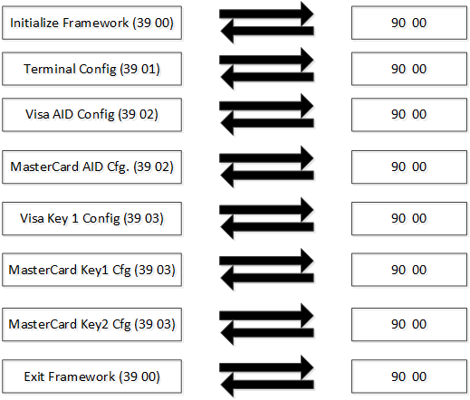
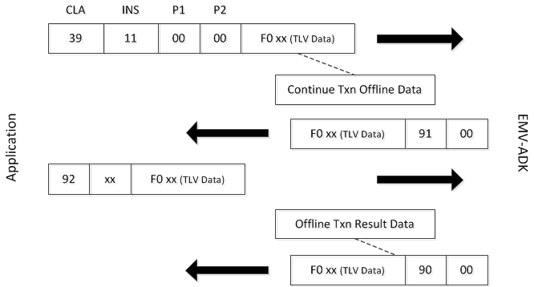
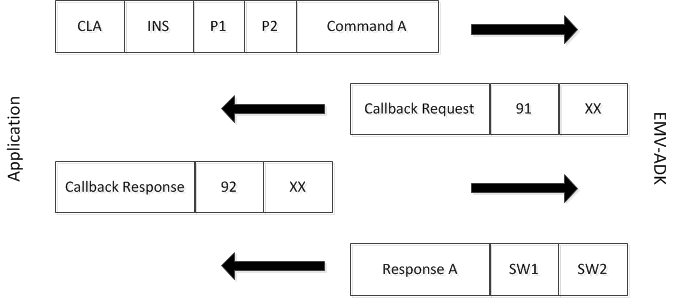

# adk_emv_contact_programmers_guide.dox


## Source code

```cpp

do
{
 // call kernel: select application from terminal- and card-/list
 eEMVInfo = EMV_CT_StartTransaction(&xterminaldata,  // IN:  terminaldata
                                    &xSelectRes);    // OUT: select info

 xterminaldata.Buildlist = FALSE;
} while(eEMVInfo == _EMV_BADAPP);

switch(eEMVInfo)
{
 case _EMV_OK: // application selected, everything OK
      break;
  ……
}
\endcode

<!-- ---------------------------------------------------------------------------------------------------------------- -->
\subsubsection subsubsec_emv_ct_Code_Snippets_Offline_Part_of_the_Transaction Offline Part of the Transaction
\code
/* Step 2: Performing EMV transaction */

// start EMV-payment
eEMVInfo = EMV_CT_ContinueOffline(&xEMVTransType, &xEMVTransRes);

// at this point, it is possible to select a new application
while(eEMVInfo == _EMV_BADAPP)
{
 // select new application
 xterminaldata.Buildlist = FALSE;

 eEMVInfo = EMV_CT_StartTransaction( &xterminaldata,  // IN:  dummy
                                     &xSelectRes);    // OUT: select info
 if(eEMVInfo == _EMV_OK)
 {
   memset((void*) &xEMVTransRes,  0, sizeof(EMV_TRANSRES_TYPE));

   eEMVInfo = EMV_CT_ContinueOffline(&xEMVTransType, &xEMVTransRes);
 }
}

switch(eEMVInfo)
{
  case _EMV_ARQC:                // go online

    /* transaction requires communication to the host */
    /* TRX not finished yet --> contact your host */
    /* no text to display */
    /* continue, see below */
    break;

  case _EMV_TC:                  // write offline-file
    /* transaction successfully finished */
…
}
\endcode

<!-- ---------------------------------------------------------------------------------------------------------------- -->
\subsubsection subsubsec_emv_ct_Online_Response_from_Host Online Response from Host

Authorization Response Code, Issuer Authentication Data, possible Scripts (critical + uncritical), following EMVCo formats:

\code
/* Step 3: Completing a transaction Online */

memcpy(pxTxnRec->xHostRespRec.AuthResp, "\x30\x30", 2);

pxTxnRec->xHostRespRec.LenAuth = 0x0A;
memcpy(ucAuth_Data, "\x91\x08\x11\x22\x33\x44\x55\x66\x77\x88", pxTxnRec->xHostRespRec.LenAuth);

pxTxnRec->xHostRespRec.LenScriptCrit = 26;
memcpy(ucCritScript_Data, "\x71\x18\x9F\x18\x04\x00\x00\x00\x01\x86\x0F\x84\x1E\x00\x00\x0A\x8E\x08\x11\x22\x33\x44\x55\x66\x77\x88", pxTxnRec->xHostRespRec.LenScriptCrit);

pxTxnRec->xHostRespRec.LenScriptUnCrit = 26;
memcpy(ucUnCritScript_Data, "\x72\x18\x9F\x18\x04\x00\x00\x00\x01\x86\x0F\x84\x1E\x00\x00\x0A\x8E\x08\x11\x22\x33\x44\x55\x66\x77\x88", pxTxnRec->xHostRespRec.LenScriptUnCrit);

…

eEMVInfo = EMV_CT_ContinueOnline(pxTxnRec, &xEMVOnlineRes);
\endcode


\subsubsection subsubsec_emv_ct_PIN_Entry PIN Entry
A code example for managing PIN entry. PIN entry is done using GUI-ADK ([ADK-GUI Programmers Guide]).
\n In case of offline PIN the EMV-ADK transmits the PIN from vault to card (for verification).
\code
unsigned char UIEnterPin(GuiPinParam *pinParam)
{
    int r = -1;

    int disp = getCardHolderDisplay();

    // if card holder display is separate, show cashier message
    if (disp)
        UI_ShowMessage(UI_STR_CARDHOLDER_INPUT, "card holder prompted for PIN input");

    {
        if(disp != UI_DISP_DEFAULT)
            disp = UI_DISP_DEFAULT;

        int digits;
        UIParams values;
        map<string,string>::iterator i;
        guiCb = pinParam->callback;

        uiSetPropertyInt(disp, UI_PROP_PIN_ALGORITHM, (int) pinParam->ucPinAlgo);
        uiSetPropertyInt(disp, UI_PROP_PASSWORD_CHAR, (int) pinParam->ulEchoChar);
        uiSetPropertyInt(disp, UI_PROP_PIN_AUTO_ENTER, (int) pinParam->ucAutoEnter);
        uiSetPropertyInt(disp, UI_PROP_PIN_BYPASS_KEY, (int) pinParam->ulBypassKey);
        uiSetPropertyInt(disp, UI_PROP_PIN_CLEAR_ALL, (int) pinParam->ucClearAll);
        uiSetPropertyInt(disp, UI_PROP_TIMEOUT, (int) pinParam->lTimeoutMs);

        std::string str = pinParam->currency;
        str += " ";
        str += pinParam->amount;
        str += " ";

        values.clear();
        values["msgPIN"] = UI_STR_ENTER_PIN;
        values["amount"] = str;
        values["caution_icon"] = "1";
        values["title"] = pinParam->appLabel;

        if(isKeypadExist())
        {
            while ((r = uiInvokeURL(disp, UI_REGION_ID_MAIN, values, "helper_pin.html", &guiCallback, NULL)) == UI_ERR_PERMISSION)
                usleep(1000);
        }
        else // X10, Carbon, Swordfish, e280
        {
            initializeUiRegions(UI_REGION_ID_MAIN|UI_REGION_ID_SOFTWARE_LEDS);
            while ((r = uiInvokeURL(disp, UI_REGION_ID_MAIN, values, "kbd_pin.html", &guiCallback, NULL)) == UI_ERR_PERMISSION)
                usleep(1000);
        }

        if(r == UI_ERR_OK)
        {
            for (i = values.begin(); i != values.end(); ++i) {
                if (!strcmp(i->first.c_str(), "pin")) {
                    break;
                }
            }
            if (i == values.end()) {
                return EMV_CT_PIN_INPUT_OTHER_ERR;
            }
            if (sscanf(i->second.c_str(), "%d", &digits) == 1) {
                Demo_SplashPleaseWait();
                return EMV_CT_PIN_INPUT_OKAY;
            }
            if (!strcmp(i->second.c_str(), "bypass")) {
                return EMV_CT_PIN_INPUT_BYPASS;
            }
            if (!strcmp(i->second.c_str(), "cancel")) {
                return EMV_CT_PIN_INPUT_ABORT;
            }
            return EMV_CT_PIN_INPUT_OTHER_ERR;
        }
    }

    switch (r) {
        case UI_ERR_TIMEOUT:
            return EMV_CT_PIN_INPUT_TIMEOUT;
        case UI_ERR_ABORT:
        case UI_ERR_CANCELLED:
            return EMV_CT_PIN_INPUT_ABORT;
        default:
            return EMV_CT_PIN_INPUT_OTHER_ERR;
    }
    return EMV_CT_PIN_INPUT_OTHER_ERR;
}

unsigned char _EMVADK_cbk_duringPINinput(void)
{
  if(EMV_CT_SmartDetect(0) != EMV_ADK_SMART_STATUS_OK)
  {
    APP_TRACE("--> WHERE IS THE CARD ???????");
    return true;
  }

  return false;
}

unsigned char ucInputPIN( unsigned char pintype,
                          unsigned char bypass,
                          unsigned char* pucPINResultData)
{
  unsigned char rsp;
  int r = 0;
  unsigned long BypassKey = 0;
  unsigned char tucAmount[6] = {0};
  unsigned char tucAmountAscii[13] = {0};
  char finalAmount[13] = {0};
  guiPinParam pinParam;
  unsigned long TAGR;
  unsigned char Buffer[32];
  unsigned short TAGL = 0;

  if (bypass)
  {
    APP_TRACE("start PIN entry: Bypass active: YES");
    BypassKey = 13; // Bypass activated with Enter Key 0 digits
  }
  else
  {
    APP_TRACE("start PIN entry: Bypass active: NO");
    BypassKey = 0;
  }

  pinParam.ucPinAlgo = EMV_PIN;
  pinParam.ucAutoEnter = 0;
  pinParam.ucClearAll = 0;
  pinParam.ulEchoChar = '*';
  pinParam.ulBypassKey = BypassKey;
  pinParam.lTimeoutMs = 30000;
  pinParam.callback = _EMVADK_cbk_duringPINinput;
  pinParam.currency = UI_STR_CURRENCY;

  TAGR = 0x9F02;

  if (pintype == EMV_CTLS_PIN_INPUT_ONLINE)
  {
    TAGL = 0;
    EMV_CTLS_fetchTxnTags(0, &TAGR, 1, Buffer, 32, &TAGL);
    if (TAGL > 0)
      memcpy(tucAmount, &Buffer[3], 6);
  }
  else
  {
    EMV_CT_fetchTxnTags(EMV_ADK_FETCHTAGS_NO_EMPTY, &TAGR, 1, Buffer, 32, &TAGL);
    if (TAGL > 0)
      memcpy(tucAmount, &Buffer[3], 6);
  }

  APP_TRACE("Amount extracted: %02X%02X%02X%02X%02X%02X",
                     Buffer[3], Buffer[4],
                     Buffer[5], Buffer[6],
                     Buffer[7], Buffer[8]);

  vAmountBCD2ASCII(tucAmount, tucAmountAscii, 6);
  vAmountForDisplay(finalAmount, sizeof(finalAmount), (char*)tucAmountAscii, 2);
  pinParam.amount = finalAmount;

  if ((pintype == EMV_CT_PIN_INPUT_ENCIPHERED) || (pintype == EMV_CT_PIN_INPUT_PLAIN))
  {
    // PIN Entry using GUI-ADK
    rsp = UIEnterPin(&pinParam);

    APP_TRACE("=== result of PIN entry: %d ===", rsp);

    if (rsp == EMV_CT_PIN_INPUT_BYPASS)
      APP_TRACE("PIN Bypass from customer");

    if (rsp != EMV_CT_PIN_INPUT_OKAY)
    {
      return(rsp);
    }

    rsp = EMV_CT_Send_PIN_Offline(pucPINResultData);

    APP_TRACE("=== result of PIN offline: %d ===", rsp);

    switch (rsp)
    {
      case EMV_ADK_SMART_STATUS_OK:
        if (pucPINResultData[0] == 0x63)
        {
          if (pucPINResultData[1] == 0xC1)
             r = UI_ShowOkCancelMessageExt(getCardHolderDisplay(), 100000, UI_STR_PIN, UI_STR_WRONG_PIN_TRY_LAST, NULL);
          else if (pucPINResultData[1] == 0xC0)
             r = UI_ShowOkCancelMessageExt(getCardHolderDisplay(), 100000, UI_STR_PIN, UI_STR_WRONG_PIN_GAME_OVER, NULL);
          else
            r = UI_ShowOkCancelMessageExt(getCardHolderDisplay(), 100000, UI_STR_PIN, UI_STR_WRONG_PIN_TRY_AGAIN, NULL);
          if (r == -1)
            return EMV_CT_PIN_INPUT_ABORT;
        }
        return EMV_CT_PIN_INPUT_OKAY; // need to check SW1 SW2

      default:
        return EMV_CT_PIN_INPUT_COMM_ERR;
    }
  }
  else if ((pintype == EMV_CT_PIN_INPUT_ONLINE) || (pintype == EMV_CTLS_PIN_INPUT_ONLINE))
  {
    // with Online PIN of CTLS there is no need to check card insertion
    if (pintype == EMV_CTLS_PIN_INPUT_ONLINE)
      pinParam.callback = NULL;

    rsp = UIEnterPin(&pinParam);

    APP_TRACE("=== result of PIN entry: %d ===", rsp);

    if (rsp != EMV_CT_PIN_INPUT_OKAY)
    {
      return rsp;
    }

    // Online PIN needs to be fetched by the local/domestic VSS script handling the online PIN block
    // transmission towards the acquirer/network provider
    return EMV_CT_PIN_INPUT_OKAY;
  }
  else if (pintype == EMV_CT_CVM_CUSTOM)
  {
    // custom CVM method
    APP_TRACE("=== result of custom CVM method: OK");
    return EMV_CT_PIN_INPUT_OKAY;
  }
  return EMV_CT_PIN_INPUT_OTHER_ERR;
}
\endcode

<!-- ---------------------------------------------------------------------------------------------------------------- -->
\section sec_emv_ct_Programming Programming

Here you can find flow-specific use cases and general guidance of scenarios that you may need for implementation.

<!-- ---------------------------------------------------------------------------------------------------------------- -->
\subsection sec_emv_ct_Programming_APIs Programming and API Principles

This section provides programming function reference for the ADK EMV Contact framework.

<!-- ---------------------------------------------------------------------------------------------------------------- -->
\subsubsection subsubsec_emv_ct_Configuration_Commands Configuration Commands

For schematic figure see \ref subsec_emv_ct_Intro_ConfigFlow

The EMV Configuration comprises the following steps:
- \ref anchor_emv_ct_Initialize_EMV_Framework "Initialize EMV Framework": Turns on EMV Framework
- \ref anchor_emv_ct_Configure_Terminal_Data "Configure Terminal Data": Configures terminal data.
- \ref anchor_emv_ct_Configure_Application_Data "Configure Application Data": Configures AID data.
- \ref anchor_emv_ct_Configure_CAP_Keys "Configure CAP Keys": Configures CAP Keys
- \b Exit \b Framework: Turns off the EMV Framework (\c EMV_CT_Exit_Framework())
 
The following sequence shows an EMV Configuration example for 2 AIDs and 3 CAP Keys:

  

The EMV configuration is stored permanently in flash files.

<!-- ---------------------------------------------------------------------------------------------------------------- -->
\anchor anchor_emv_ct_Initialize_EMV_Framework <b><u>Initialize EMV Framework</u></b>

You should initialize the ADK EMV Contact framework before usage, preferably during terminal startup.
In case of memory shortage, the application can separate initialization into two steps:
- \b Base \b initialization \n
Call with \c EMV_CT_INIT_OPT_BASE_INIT set in options \n
To be done at terminal startup, no memory allocation.
- \b Transaction \b initialization \n
To be done for every transaction. Must provide memory allocation. \n
After end of transaction, application calls \c EMV_CT_Exit_Framework().

<em>Serial Interface</em>

The command uses the following format:

<b>Table: Command</b>
 
CLA | INS | P1 | P2 | Data
----|-----|----|----|-----
x39 | x00 | x00 | x00/x01 | Data

<b>P2 = 0: Init Framework</b>

<b>P2 = 1: Exit Framework</b>

\n
<b>Table: Response</b>

Data | SW1 | SW2 | Comment
-----|-----|-----|--------
None | x90 | xXX | Function executed, xx = response code (P2=0)
None | x90 | x00 | Function executed, xx = response code (P2=1)

      
 
The parameters inside the tag F0 are identical to the structure in the functional interface.

\n
<em>Function Interface</em>

The function interface includes four parameters:
- The number of AIDs to support
- The function pointer for the callback
- An arbitrary pointer, which will be relayed unchanged to callback function call (useful for object-oriented applications)
- Initialization options.

\note
On the serial interface the callbacks are realized by intermediate messages.
Those are received by the EMV-client (use case 1 and 2 in @ref anchor_emv_ct_Use_Case_Samples_1to4).
If EMV-client is not used the application has to handle this data (use case 3 and 4).
In any case it's mandatory to call the Init and Exit functions.

\n 

#EMV_CT_Init_Framework, EMV_CT_Init_Framework_Client()

<!-- ---------------------------------------------------------------------------------------------------------------- -->
\anchor anchor_emv_ct_Configure_Terminal_Data <b><u>Configure Terminal Data</u></b>

This section presents an overview of the typical tags for terminal configuration. 

This function provides the ADK EMV Contact framework and subsequent kernel with the terminal data it needs. The framework checks and saves the provided data in an XML file. 
You can configure the XML file directly (file configuration), instead of using this function (dynamic configuration).

<em>Serial Interface</em>

The command uses the following format:

<b>Table: Command</b>
CLA | INS | P1 | P2 | Data
----|-----|----|----|-----
x39 | x01 | don’t care | x00/x01 | Data

<b>P2 = 0: Set Data

P2 = 1: Get Data</b>

<b>Table: Response</b>
Data | SW1 | SW2 | Comment
-----|-----|-----|--------
None | x90 | xXX | Function executed, xx = response code (P2=0) 
Terminal data | x90 | x00 | Function executed, xx = response code (P2=1)

The following illustration shows the Set/Get Terminal Data function.

    

The parameters inside the tag F0 are identical to the structure in the functional interface.

<em>Function Interface</em>

EMV_CT_SetTermData(), EMV_CT_GetTermData()

The members of the structures are identical to the parameters inside tag F0 in the serial interface.

<b>Defaults and Guides</b>

The default terminal data is an attended combined offline/online terminal, supporting all variants of CVM and card authentication:
- Currency: EUR
- Supported languages: English
- Country Code: France.

It is recommended to configure all terminal-wide parameters from the application. If any of the parameters are missing, the default will be used. 
The configuration will not fail because of a missing parameter.

The following table show samples of configuration values.

<b>Table: Configuration Values</b>
Tags |Size| Default Value | Description
-----|----|---------------|------------
9F35 | 1  | 0x22 | Terminal type
9F1A | 2  | 0x02, 0x50 (France) | Terminal country code according ISO 3166
9F33 | 3  | 0xE0, 0xF8, 0xC8 | Terminal capabilities
9F40 | 5  | 0xF0, 0x00, 0xB0, 0xA0, 0x01 | Additional Terminal capabilities
9F1C | 8  | "00000001" | Terminal Identification
5F2A | 2  | 0x09, 0x78 (EUR) | Transaction currency code according ISO 4217. For a single transaction this value may be overwritten.
5F36 | 1  | 0x02 | Transaction currency Exponent
DF67 | 20 | 0x01, 0x00, 0x00, 0x00, 0x00, 0x00, 0x00, 0x00 \n (Only 1 supported: English) | Supported languages by host (up to 20)
9F1E | 8  | < S/N (last 8 digits) > | IFD Serial Number
DF65 | 128| (response only) | Version of EMV kernel
DF11 | 128| (response only) | Version of EMV framework
DF6B | 128| (response only) | version of L1 Driver

\anchor anchor_emv_ct_EMV_Application__Terminal__Configuration_Examples <b>EMV Application Terminal Configuration Examples</b>

<em>Terminal Configuration Example – Set all but IFD serial number</em>
\code{text}
Command
39  01  00  00  F0  42  9F  35  01  22  5F  2A  02  08  40  5F    9....B.5."_*..@_
36  01  02  9F  1A  02  08  40  9F  33  03  E0  F8  C8  9F  40    6......@.3.....@
05  F0  00  B0  A0  01  9F  1C  08  32  32  32  32  32  32  32    .........2222222
32  DF  67  14  01  02  00  00  00  00  00  00  00  00  00  00    2.g.............
00  00  00  00  00  00  00  00                                    ........
Response                        
90  00                      
\endcode

<em>Terminal Configuration Example – Set Country</em>
\code
Command
39 01   00  00  F0  05  9F  1A  02  02  80                  

Response                        
90  00                      
\endcode

<em>Terminal Configuration Example – Get Current</em>

<!-- Note: The command \code{text} prevents doxygen from interpreting " as start
     of a string literal highlighted blue in HTML output. The dump was built with
     following command entered then ASCII hex data from a log output cut and
     pasted, enter pressed, followed by CTRL-D for stream end.
     > xxd -r -p - | xxd -c 16 -g 1 -u | cut -d ' ' -f 2-
-->
\code{text}
Command
39  01  00  01

Response
90  00  F0  81  B2  9F  35  01  22  5F  2A  02  08  40  5F  36    ......5."_*..@_6
01  02  9F  1A  02  08  40  9F  33  03  E0  F8  C8  9F  40  05    ......@.3.....@.
F0  00  B0  A0  01  9F  1C  08  30  30  30  30  30  30  30  31    ........00000001
DF  67  14  01  02  00  00  00  00  00  00  00  00  00  00  00    .g..............
00  00  00  00  00  00  00  9F  1E  08  30  31  31  30  30  32    ..........011002
30  39  DF  65  08  4C  32  37  2E  30  2E  33  72  DF  11  07    09.e.L27.0.3r...
34  2E  31  30  2E  32  39  DF  6B  3A  49  46  4D  31  38  63    4.10.29.k:IFM18c
2D  45  4D  56  34  2E  33  5F  41  30  30  2C  20  53  57  5F    -EMV4.3_A00, SW_
41  30  30  2C  20  48  57  5F  41  30  30  3B  30  31  2E  33    A00, HW_A00;01.3
37  20  30  34  2F  32  30  32  32  3B  56  32  30  30  63  20    7 04/2022;V200c 
43  54  4C  53  DF  6C  10  30  31  31  30  30  32  30  39  30    CTLS.l.011002090
30  30  30  30  30  32  62                                        000002b
\endcode

<!-- ---------------------------------------------------------------------------------------------------------------- -->
\anchor anchor_emv_ct_Configure_Application_Data <b><u>Configure Application Data</u></b>

This function provides the ADK EMV Contact framework and subsequent kernel with the application data it needs. 
The framework checks and saves the provided data in an XML file. You should configure one set of parameters per application (AID). 
You can configure the XML file directly (file configuration), instead of using this function (dynamic configuration).

<em>Serial Interface</em>

The command uses the following format:

<b>Table: Command</b>
 
CLA | INS | P1 | P2 | Data
----|-----|----|----|-----
x39 | x02 | x00 | x00/x01 | Data

<b>P2 = 0: Set Data</b>

<b>P2 = 1: Get Data</b>

\n
<b>Table: Response</b>
Data | SW1 | SW2 | Comment
-----|-----|-----|--------
None | x90 | xXX | Function executed, xx = response code (P2=0) 
Application data | x90 | x00 | Function executed, xx = response code (P2=1)

 

The parameters inside the tag F0 are identical to the structure in the functional interface.

\n
<em>Function Interface</em>

EMV_CT_SetAppliData(), EMV_CT_GetAppliData()

The members of the structures are identical to the parameters inside tag F0 in the serial interface.

\n
<b>Defaults and Guides</b>

The default application is named “Default App” and includes typical EMV parameters for TACs, CDA mode 3, floorlimit 0, partial selection supported, default DOLs == 9F37, 
no additional or mandatory tags and terminal-wide parameters as configured per terminal and not limited. You should configure almost all AID parameters from the application
because they might be changed if applicable.
If any of the parameters are missing, the default will be used. The configuration will not fail because of a missing parameter once a correct AID is available. 

The following table show samples of configuration values.

<b>Table: AID Configuration Control</b>
Tags | Size | Description
-----|------|------------
DF66 | 1 | AID Set Requests: \n 0x01 > Write one AID config 0x10 > Write/Clear AID config \n 0x20 > Write/Clear all AID configs
DF66 | 1 | AID Get Data Request: \n 0x00 > Read one AID config \n 0x01 > Read first AID config 0x02 > Read next AID config

<b>Table: AID Configuration Data</b>
Tags | Size | Default Value | Description
------|------------|--------|------------
4F |5..16 | \b Mandatory (\b No \b Default) | Application ID
9F09 | 2 | < none > <SUP> \ref fnEmvctTab10_1 "1)" \ref fnEmvctTab10_2 "2)"  </SUP> | Terminal application version number
50 | ..16 | "Default App" <SUP> \ref fnEmvctTab10_2 "2)"  </SUP> | Default application name to be used in case application label (tag 50) and application preferred name (tag 9F12) are not read from chip
DF20 | 1 | 0x01 | Application selection indicator (ASI)
9F15 | 2 | 0x59, 0x99 | Merchant category code
9F1C | 8 | 0x30, 0x30, 0x30, 0x30, 0x30, 0x30, 0x30, 0x31 | Terminal Identification
9F1B | 4 | 0x00, 0x00, 0x00, 0x00 | Terminal floor limit (binary coded)
DF24 | 4 | 0x00, 0x00, 0x00, 0x00 | Threshold Value for Biased Random Online Selection during risk management (binary coded)
DF26 | 1 | 0x00 | Target percentage (BCD coded) for random online selection during risk management
DF25 | 1 | 0x00 | Maximum target percentage (BCD coded) for random online selection during risk management
DF21 | 5 | 0x04, 0x00, 0x00, 0x00, 0x00 <SUP> \ref fnEmvctTab10_2 "2)"  </SUP> | Terminal Action Code - Denial
DF22 | 5 | 0xF8, 0x50, 0xAC, 0xF8, 0x00 <SUP> \ref fnEmvctTab10_2 "2)"  </SUP> | Terminal Action Code - Online
DF23 | 5 | 0xFC, 0x50, 0xAC, 0xA0, 0x00 <SUP> \ref fnEmvctTab10_2 "2)"  </SUP> | Terminal Action Code - Default
DF2D | 1 | 0x01 | 0xNN = EMV-Application (or similar) \n 0xFF = non-EMV-Application
DF27 |..80 | 0x9F, 0x37, 0x04 <SUP> \ref fnEmvctTab10_2 "2)"  </SUP> | Default TDOL
DF28 |..80 | 0x9F, 0x37, 0x04 | Default DDOL
9F16 | 15 | 0x20, 0x20, 0x20, 0x20, 0x20, 0x20, 0x20, 0x20, 0x20, 0x20, 0x20, 0x20, 0x20, 0x20, 0x20 | Merchant Identifier
DF3E | 1 | 0x02 | CDA processing, maximum security or maximum speed: \n 0x00 - CDA for ARQC: yes, for TC after successful online communication: yes \n 0x01 - CDA for ARQC: yes, for TC after successful online communication: no \n 0x02 - CDA for ARQC: no, for TC after successful online communication: no \n 0x03 - CDA for ARQC: no, for TC after successful online communication: yes
DF15 | 1 | 0x00 | TACIAC Default handling: \n 0x00 - process default action codes prior to 1st GENERATE AC \n 0x01 - process default action codes after 1st GENERATE AC
DF2E | 1 | 0x00 | Behavior for AIP 'CVM not supported': \n 0x00 - continue transaction 0x01 - execute CVM signature \n 0x02 - execute CVM online PIN 0x03 - abort transaction
9F39 | 1 | 0x05 | POS entry mode according ISO 8583:1987
DF5F |..20| < none > | Up to 10 additional terminal application version numbers (each two byte, network byte order)
DF2B | 5 | 0x01, 0x1A, 0x00, 0x00, 0x00 <SUP> \ref fnEmvctTab10_2 "2)"  </SUP> | See AID Application Flow Capabilities (see \ref APP_FLOW_CAPS)
DF29 |..255| < none > | Additional Tags, TLV encoded
DF2A |..40| 0 | Up to 20 mandatory tags (each two bytes, network byte order)
9F33 | 3 | 0xE0, 0xF8, 0xC8 <SUP> \ref fnEmvctTab10_2 "2)"  </SUP> | Application Specific Terminal capabilities
5F28 | 2 | 0x02, 0x50 | Application Specific Terminal country code
9F40 | 5 | 0xF0, 0x00, 0xB0, 0xA0, 0x01 <SUP> \ref fnEmvctTab10_2 "2)"  </SUP> | Application Specific Additional terminal capabilities
9F35 | 1 | 0x22 | Application Specific Terminal Type
DF1D |5..16| < none > | priority applications (tag might occur up to 5 times) <SUP> \ref fnEmvctTab10_3 "3)"  </SUP>
DF17 | 5 | 0, 0, 0 | 3 associated mag. stripe IDs, only non-Null values are relevant <SUP> \ref fnEmvctTab10_3 "3)"  </SUP>
DF1C | 8 | 0x21, 0x20, 0x11, 0x02, 0x00, 0x00, 0x00, 0x00 | 16 half bytes transaction use case filter <SUP> \ref fnEmvctTab10_3 "3)"  </SUP>
DF18 | 1 | 0x00 | settings for fallback from chip to mag. stripe in conjunction with DF17 <SUP> \ref fnEmvctTab10_3 "3)"  </SUP>
DF2F | 1 | 0x00 | code for custom (non-EMVCo defined) CVM method supported by this application
DF13 | 5 | 0x21, 0x05, 0x00, 0x00, 0x00 | flags for supplementary terminal capabilities affecting EMVCo configuration checksum
DF12 | 32| (response only) | EMVCo checksum
DFD004 |..3| 0x00, 0x00, 0x00 | Transaction types for sale (omitted in response if at default)
DFD005 |..3| 0x01, 0x01, 0x01 | Transaction types for cash-out (omitted in response if at default)
DFD006 |..3| 0x09, 0x09, 0x09 | Transaction types for cash back (omitted in response if at default)
DFD007 |..3| 0x20, 0x20, 0x20 | Transaction types for refund (omitted in response if at default)
DFAB58 |..88| < none > | Data Container Read IDs for D-PAS data exchange
DFAB59 |..88| < none > | Data Container Read ranges for D-PAS data exchange

\anchor fnEmvctTab10_1 <SUP> 1) </SUP> If none is configured card's application version is used during transaction

\anchor fnEmvctTab10_2 <SUP> 2) </SUP> Depending on AID and Terminal Type some default application data
settings get adapted values, e.g. a MasterCard application gets "Mastercard" as default application label.
Note that these default settings might change any time as ADK EMV evolves. Also note that especially
Terminal Capabilities and Additional Terminal Capabilities are not inherited from the terminal settings.
Therefore do not rely on and configure all fields as recommended above.

\anchor fnEmvctTab10_3 <SUP> 3) </SUP> Settings for special operation. Do not configure unless required.

\anchor anchor_emv_ct_EMV_Application__AID__Configuration_Examples_II_ <b>EMV Application (AID) Configuration Examples</b>
 
<em>AID Configuration Example – Set MC Data</em>
\code
Command – Configure Multiple Parameters
39  02  00  00  F0  81  A2  DF  66  01  01  4F  07  A0  00  00
00  04  10  10  9F  09  02  00  02  50  0B  4D  61  73  74  65
72  63  61  72  64  00  DF  20  01  01  9F  15  02  59  99  9F
1C  08  31  32  33  34  35  36  37  38  9F  1B  04  00  00  13
88  DF  24  04  00  00  01  F4  DF  26  01  00  DF  25  01  00
DF  21  05  04  00  00  00  00  DF  22  05  F8  50  AC  F8  00
DF  23  05  FC  50  AC  A0  00  DF  2D  01  01  DF  27  0F  9F
02  06  5F  2A  02  9A  03  9C  01  95  05  9F  37  04  DF  28
03  9F  37  04  9F  16  0F  20  20  20  20  20  20  20  20  20
20  20  20  20  20  20  DF  29  04  9F  53  01  52  DF  2A  01
8E  DF  2B  05  0E  00  22  00  00      
                    
Response 
90 00
\endcode

<em>AID Configuration Example – Set Visa Data</em>
\code{text}
Command – Configure    Label Only  
39  02  00  00  F0  1B  DF  66  01  01  4F  07  A0  00  00  00   9......f..O.....
03  10  10  50  0C  56  69  73  61  20  64  65  66  61  75  6C   ...P.Visa defaul
74                                                               t
Response 
90 00
\endcode

<em>AID Configuration Example – Get Visa Data</em>
\code{text}
Command
39  02  00  01  F0  0D  DF  66  01  00  4F  07  A0  00  00  00
03  10  10

Response
90  00  F0  82  01  28  4F  07  A0  00  00  00  03  10  10  9F    .....(O.........
09  02  00  8C  DF  5F  14  FF  FF  FF  FF  FF  FF  FF  FF  FF    ....._..........
FF  FF  FF  FF  FF  FF  FF  FF  FF  FF  FF  50  0C  56  69  73    ...........P.Vis
61  20  64  65  66  61  75  6C  74  DF  20  01  01  9F  15  02    a default. .....
59  99  9F  1C  08  30  30  30  30  30  30  30  31  9F  1B  04    Y....00000001...
00  00  00  00  DF  49  04  00  00  00  00  DF  4A  03  E0  F8    .....I......J...
C8  DF  24  04  00  00  00  00  DF  26  01  00  DF  25  01  00    ..$......&...%..
DF  21  05  00  10  00  00  00  DF  22  05  DC  40  04  F8  00    .!......."..@...
DF  23  05  DC  40  00  80  00  DF  2D  01  01  DF  27  03  9F    .#..@....-...'..
37  04  DF  28  03  9F  37  04  9F  16  0F  20  20  20  20  20    7..(..7....     
20  20  20  20  20  20  20  20  20  20  DF  15  01  00  9F  39              .....9
01  05  DF  3E  01  02  DF  29  00  DF  2C  00  DF  2A  00  9F    ...>...)..,..*..
33  03  E0  F8  C8  DF  2B  05  01  03  00  00  00  DF  2E  01    3.....+.........
00  9F  1A  02  02  50  5F  28  02  02  50  9F  40  05  F0  00    .....P_(..P.@...
B0  A0  01  9F  35  01  22  DF  17  03  00  00  00  DF  1C  08    ....5.".........
21  20  11  02  00  00  00  00  DF  18  01  00  DF  2F  01  00    ! .........../..
DF  13  05  21  05  00  00  00  DF  12  20  36  33  30  34  31    ...!...... 63041
38  41  45  37  30  38  42  38  38  45  38  35  36  45  34  37    8AE708B88E856E47
36  39  45  36  32  39  41  43  33  37  43  DF  04  00            69E629AC37C...
\endcode

<!-- ---------------------------------------------------------------------------------------------------------------- -->
\anchor anchor_emv_ct_Configure_CAP_Keys <b><u>Configure CAP Keys</u></b>

This function provides the ADK EMV Contact framework and subsequent kernel with the CAP keys it needs. The framework checks and saves the provided data in an XML file. 
You can configure the XML file directly (file configuration), instead of using this function (dynamic configuration). 
Additionally, you can add revoked certificates for each of the keys here, if the application supports the request. Currently, maximum number of CAP keys to be stored is 100 (for both: file and dynamic configuration).

<em>Serial Interface</em>

The command uses the following format:

<b>Table: Command</b>
 
CLA | INS | P1 | P2 | Data
----|-----|----|----|-----
x39 | x03 | x00 | x00/x01 | Data

<b>P2 = 0: Set Data</b>

<b>P2 = 1: Get Data</b>

\n
<b>Table: Response</b>
Data | SW1 | SW2 | Comment
-----|-----|-----|--------
None | x90 | xXX | Function executed, xx = response code (P2=0)
Key data | x90 | x00 | Function executed, xx = response code (P2=1)

 

The parameters inside the tag F0 are identical to the structure in the functional interface.

\n
<em>Function Interface</em>

EMV_CT_StoreCAPKey(), EMV_CT_ReadCAPKeys(), EMV_CT_GetCAPKeyInfo()

The members of the structures are identical to the parameters inside tag F0 in the serial interface.

<b>Table: CA Key Configuration Control</b>
 
Tags | Size | Description
-----|------|------------
DF66 | 1 | CA Key Set Request: \n 0x01 > Write one CA Key \n 0x10 > Clear one CA Key \n 0x20 > Clear all CA Keys

<b>Table: CA Key Configuration Data</b>
Tags | Size | Description
-----|------|------------
DF09 | 1 | Key Index
DF0B | 248 Max | Key Data (modulus)
DF0A | 5 | Associated RID
DF0D | 1 | 3 (0x03) or 65535 (0x01)
DF0C | 20 | SHA-1 of RID, Index, Key, Exp
DF0E | Var | Revocation Serial Numbers (3 bytes each)

\n
<em>Defaults and Example</em>

The default is an empty CAP Key list. Not configuring keys will result in card authentication failure and the corresponding TVR bits will be raised by the kernel. 
Once a hash is included to the CAP key injection, this will be cross checked. If not Ok, the injection will be rejected.

<b>EMV CA Key Configuration Example</b>

<em>CA Key Configuration Example – Set Visa Key 99</em>
\code
Command
39  03  44  00  F0  81  AF  DF  66  01  01  DF  09  01  99  DF
0A  05  A0  00  00  00  03  DF  0B  81  80  AB  79  FC  C9  52
08  96  96  7E  77  6E  64  44  4E  5D  CD  D6  E1  36  11  87
4F  39  85  72  25  20  42  52  95  EE  A4  BD  0C  27  81  DE
7F  31  CD  3D  04  1F  56  5F  74  73  06  EE  D6  29  54  B1
7E  DA  BA  3A  6C  5B  85  A1  DE  1B  EB  9A  34  14  1A  F3
8F  CF  82  79  C9  DE  A0  D5  A6  71  0D  08  DB  41  24  F0
41  94  55  87  E2  03  59  BA  B4  7B  75  75  AD  94  26  2D
4B  25  F2  64  AF  33  DE  DC  F2  8E  09  61  5E  93  7D  E3
2E  DC  03  C5  44  45  FE  7E  38  27  77  DF  0C  14  4A  BF
FD  6B  1C  51  21  2D  05  55  2E  43  1C  5B  17  00  7D  2F
5E  6D  DF  0D  01  03                                      

Response
90 00
\endcode 

<!-- ---------------------------------------------------------------------------------------------------------------- -->
\subsubsection subsubsec_emv_ct_Transaction_Commands Transaction Commands

The members of the structures are identical to the parameters inside tag F0 in the serial interface.

Use the following to implement Transaction Commands:
- \ref anchor_emv_ct_Starting_a_Transaction "Starting a Transaction"
- \ref anchor_emv_ct_Continue_a_Transaction__Offline_Part "Continue a Transaction Offline Part"
- \ref anchor_emv_ct_Continue_a_Transaction__Online_Part "Continue a Transaction Online Part"
- \ref anchor_emv_ct_Fetching_Additional_Tags "Fetching Additional Tags"
- \ref anchor_emv_ct_Send_EMV_PIN_to_Smart_Card "Send EMV PIN to Smart Card"
 
<!-- ---------------------------------------------------------------------------------------------------------------- -->
\subsubsection subsubsec_emv_ct_Transaction_Sequence Transaction Sequence

The following illustration shows the transaction sequence flow.


<!-- ---------------------------------------------------------------------------------------------------------------- -->
\anchor anchor_emv_ct_Starting_a_Transaction <b>Starting a Transaction</b>

You can use this function to start a transaction, which runs application selection. Terminals are usually configured with several applications, but on the ICC, the configuration may include one or several applications.

You should determine which application to use for payment transactions.

Use the following ways to find out how the ICC and the terminal (000candidate list) support AIDs:
- \b PSE \n
Only possible with the support of terminal and ICC.\n
ICC contains a directory including all supported applications. Find intersection with the terminal‘s supported AIDs.\n
- \b Explicit \b Select for all terminal-known applications.\n
If there are several candidates, a callback prompts the cardholder to choose the application.\n
The Final SELECT is done for the chosen application. The ICC works on the AID’s data.\n
 
<em>Serial Interface</em>

The command uses the following format:

<b>Table: Command</b>
 
CLA | INS | P1 | P2 | Data
----|-----|----|----|-----
x39 | x10 | x00 | x00 | Txn Data

<b>Table: Response</b>

Data | SW1 | SW2 | Comment
-----|-----|-----|--------
txn data (application selection) | x90 | xXX | Function executed, xx = response code

    
 
The parameters inside the tag F0 are identical to the structure in the functional interface.

<em>Function Interface</em>

EMV_CT_StartTransaction()

The members of the structures are identical to the parameters inside tag F0 in the serial interface.

<em>Defaults and Example</em>

Use this function to initialize a transaction. You can set the known amount, transaction type, currency, date, time and a number of transaction options. 
You should supply these essential transaction parameters at this point, although you can change parameters further during transaction processing. 
In contact mode this step performs application selection including the final select. 
Subsequently the application may proceed with its own apps kernel or use \c Continue_Offline to use the EMV kernel to process an EMV transaction.

<em>Typical tags</em>

This section presents an overview of typical tags for the Start transaction.

<b>Table: Start Transaction Command Data</b>
Tag | Size | Mandatory | Description
----|------|-----------|------------
9C | 1 | Y | Transaction type, according to ISO 8583 - Annex A: \n Processing Code, Position 1 + 2
9F02 | 6 | Y | Transaction amount auth
5F2A | 2 | - | Currency code to be used for transaction. \n Only needed in case of DCC
5F36 | 1 | - | Currency exponent to be used for transaction. Only needed in case of DCC
9A | 3 | Y | Transaction date (YYMMDD). \n E105 RTC does not supply transaction date.
9F21 | 3 | Y | Transaction time (HHMMSS). \n E105 RTC does not supply transaction time.
9F41 | 4 | Y | Transaction Sequence Counter \n Must be supplied. E105 does not keep sequence counter.
9F03 | 6 | - | Amount Other (CashBack)
DF40 | 1 | - | Force Online (if supported by AID config) 0x01 = True, 0x00 = False
DF43 | 1 | - | Force Accept (if supported by AID config) 0x01 = True, 0x00 = False
DF48 | 1 | - | ”Request ARQC from card, but don’t set “suspicious bit” \n 0x01 = True, 0x00 = False
DF57 | 1 | - | Account Type: \n > 0x00 Default \n > 0x10 Savings \n > 0x20 Cheque Debit \n > 0x30 Credit
DF47 | 1 | - | Preselected customer language. \n See \ref subsec_emv_ct_Different_Languages .
DF34 | 1 | - | Amount confirmation (if not PIN + Amount Confirm) not configured): \n > 0x00 Confirm Amount immediately after language selection before CVM \n > 0x01 Confirm Amount after cardholder verification
DF05 | 1 | - | Build App List: \n > 0x00 Reuse the existing list and remove the currently activated AID, e.g. 6985 at GPO \n > 0x01 Build a new candidate list (needs to be set on start of transaction) \n > 0xFn Reuse the existing list do not remove anything and select candidate n of the candidate list
DF45 | 1 | - | Do not process PSE (E105 default is False): 0x01 = True, 0x00 = False
DF4D | 1 | - | Cardholder confirmation: 0x00 = Yes, 0x01 = No
DF36 | 5 | - | See \ref TXN_OPTIONS .
DF37 | 3 | - | See \ref TXN_STEPS .

<b>Table: Start Transaction Response Data</b>
Tag | Size | Mandatory | Description
----|------|-----------|------------
84 | 17 | - | DF Name
50 | 17 | - | App Label (not App Label according to EMVCo)
DF33 | Var | - | App Name
9F11 | 1 | - | Issuer code table
9F12 | Var | - | App preferred name
5F2D | Var | - | Preferred language
DF62 | 15 | - | EMV Framework Error data
DF63 | 1 | - | Display Text Index
DF4E | - | - | 0x80 = final amount (9F02/81) is required for application initialization (GPO)
FF03 | var | - | Candidate list containing: \n DF04 - AID \n 50 - App Label (not App Label according to EMVCo)
DF04 | 17 | - | Selected AID Name

\anchor anchor_emv_ct_EMV_Start_Transaction_Examples <b>EMV Start Transaction Examples</b>

<em>Start Transaction Command for EUR 1.00 on Multi App Card</em>
\code
Start Command >>
39  10  00  00  F0  2C  9F  02  06  00  00  00  00  01  00  5F
2A  02  09  78  5F  36  01  02  9A  03  13  02  01  9F  21  03
12  00  00  9C  01  00  DF  05  01  01  DF  36  05  01  00  00
00  00                                                      

AppSel Callback Command <<
91  01  F0  34  BF  04  31  DF  74  01  01  50  0B  56  69  73
61  20  43  72  65  64  69  74  50  0A  4D  61  73  74  65  72
63  61  72  64  DF  04  07  A0  00  00  00  03  10  10  DF  04
07  A0  00  00  00  04  10  10                              

AppSel Callback Response >> 
92  01  F0  04  DF  75  01  01

Start Response <<
90  00  F0  66  84  07  A0  00  00  00  03  10  10  50  0B  56
69  73  61  20  43  72  65  64  69  74  9F  11  01  01  5F  2D
08  65  6E  65  73  64  65  66  72  DF  4E  01  00  FF  03  17
DF  04  07  A0  00  00  00  03  10  10  50  0B  56  69  73  61
20  43  72  65  64  69  74  FF  03  16  DF  04  07  A0  00  00
00  04  10  10  50  0A  4D  61  73  74  65  72  63  61  72  64
DF  04  07  A0  00  00  00  03  10  10                      


Start Transaction Command for EUR 1.00 on single app card 
Start Command >>
39  10  00  00  F0  24  9F  02  06  00  00  00  00  01  00  5F
2A  02  09  78  5F  36  01  02  9A  03  13  02  01  9F  21  03
12  00  00  9C  01  00  DF  05  01  01                      

Start Response <<
90  00  F0  48  84  07  A0  00  00  00  03  10  10  50  0F  43
52  45  44  49  54  4F  20  44  45  20  56  49  53  41  DF  33
0B  56  49  53  41  20  43  52  45  44  49  54  9F  11  01  01
9F  12  0F  43  52  45  44  49  54  4F  20  44  45  20  56  49
53  41  DF  04  07  A0  00  00  00  03  10  10              
\endcode

<!-- ---------------------------------------------------------------------------------------------------------------- -->
\anchor anchor_emv_ct_Continue_a_Transaction__Offline_Part <b>Continue a Transaction (Offline Part)</b>

This section presents an overview on typical tags for continuing the transaction after the final selection by using the EMVCo CT kernel.

If the “EMV Start Transaction” phase results in an EMV application being found on the card, then a transaction shall be performed. The EMV Offline Transaction performs the offline part of an EMV transaction.

During the EMV Offline Transaction various Callback shall be used. Some of the Callback require UI processing and checking by the host device. The potential callbacks are:
- \b Amount \b Conf: For Amount Confirmation
- \b Hotlist/Log: For Transaction Log and Hotlist
- \b Domestic/Local Checks: For local PAN checks
- \b DCC: For DCC processing.

You can use this function to perform offline EMV transactions. Possible results for Offline Transactions:
- Decline
- Accept offline
- Go online
- Terminate
- Fallback.

The following diagram shows the flow for offline transactions.

    

<em>Serial Interface</em>

The command uses the following format:

<b>Table: Command</b>
 
CLA | INS | P1 | P2 | Data
----|-----|----|----|-----
x39 | x11 | x00 | x00 | Txn Data

<b>Table: Response</b>

Data | SW1 | SW2 | Comment
-----|-----|-----|--------
txn data (txn result offline) | x90 | xXX | Function executed, xx = response code
 
      

The parameters inside the tag F0 are identical to the structure in the functional interface.

\n
<em>Function Interface</em>

EMV_CT_ContinueOffline()

The members of the structures are identical to the parameters inside tag F0 in the serial interface.

<em>Defaults and Example</em>

Use this section to determine how to continue an offline EMV transaction. 
You can change the amount, add a cashback amount, add the transaction counter for this AID and configure a few more transaction parameters (e.g., callbacks supported). 
In contact mode, this step performs the offline part of the transaction, ending with the 1st GAC. The payment is completed after this step.

<b>Table: EMV Transaction Offline Command Data</b>
Tag | Size | Mandatory | Description
----|------|-----------|------------
9F02 | 6 | - | Transaction amount auth
5F2A | 2 | - |  Currency code to be used for transaction. \n Only needed in case of DCC
5F36 | 1 | - |  Currency exponent to be used for transaction. Only needed in case of DCC
9A | 3 | - |  Transaction date (YYMMDD).
9F21 | 3 | - |  Transaction time (HHMMSS).
9F03 | 6 | - |  Amount Other (CashBack)
DF40 | 1 | - |  Force Online (if supported by AID config) \n 0x01 = True, 0x00 = False
DF43 | 1 | - |  Force Accept (if supported by AID config) \n 0x01 = True, 0x00 = False
DF48 | 1 | - |  Request ARQC from card, but don't set “suspicious bit” \n 0x01 = True, 0x00 = False
DF57 | 1 | - |  Account Type: \n > 0x00 Default \n > 0x10 Savings \n > 0x20 Cheque Debit \n > 0x30 Credit
DF47 | 1 | - |  Preselected customer language. \n See \ref subsec_emv_ct_Different_Languages .
DF34 | 1 | - |  Amount confirmation (if not PIN + Amount Confirm) not configured): \n > 0x00 Confirm Amount immediately after language selection before CVM \n > 0x01 Confirm Amount after cardholder verification
DF14 | Var | - |  Additional Tags
DF36 | 5 | - |  See EMV Transaction Options (Tag DF36)
DF37 | 3 | - |  See EMV Transaction Steps (Tag DF37)

<b>Table: EMV Transaction (offline and online) Response Data</b>
Tag | Size | Mandatory | Description
----|------|-----------|------------
- | - | - | For Card Data See: \n > Offline Transaction Card Data \n > Online Transaction Card Data \n > Online Transaction with Online PIN Card Data
DF42 | 4 | - | Status Info
9F27 | 1 | - | Cryptogram information data (CID)
9F36 | 2 | - | Application transaction counter (ATC)
9F26 | 8 | - | Application cryptogram
9F39 | 1 | - | POS entry mode
9F41 | 4 | - | Transaction Sequence Counter
5F34 | 1 | - | PAN sequence number
9F10 | 9 | - | Issuer Application Data
9F37 | 4 | - | Unpredictable Number
95 | 5 | - | Terminal Verification Results
9A | 3 | - | Transaction Date
9F21 | 3 | - | Transaction Time
9C | 1 | - | Transaction Type
5F2A | 2 | - | Transaction Currency Code
82 | 2 | - | Application Interchange Profile
9F1A | 2 | - | Terminal Country Code
9F34 | 3 | - | CVM Results
9F33 | 3 | - | Terminal Capabilities
9F35 | 1 | - | Terminal Type
9F1E | 8 | - | Interface Device (IFD) serial number
84 | 17 | - | 1 Byte Length. Dedicated File (DF) Name
9F09 | 2 | - | vApplication Version Number
DF08 | Var | - | Script Result Critical
DF07 | Var | - | Script Result Uncritical
9B | 2 | - | Transaction Status Information
9F06 | 17 | - | Application Identifier (AID)
DF29 | Var | - | Additional Tags
9F53 | 1 | - | Transaction Category Code
9F02 | 6 | - | Amount Auth Numeric
9F03 | 6 | - | Amount Auth Other
9F12 | 17 | - | Application name, zero terminated
5F25 | 3 | - | Application Effective Date
5F28 | 2 | - | Issuer Country Code
9F45 | 2 | - | Data Authentication Code, present if SDA card
9F4C | 9 | - | 1 Byte Length. optional: present if DDA/CDA card
DF21 | 5 | - | Terminal Action Code - Denial
DF22 | 5 | - | Terminal Action Code - Online
DF23 | 5 | - | Terminal Action Code - Default
9F0E | 5 | - | Issuer Action Code - Denial
9F0F | 5 | - | Issuer Action Code - Online
9F0D | 5 | - | Issuer Action Code - Default
9F40 | 5 | - | Additional Terminal Capabilities
5A | 10 | - | PAN
57 | 19 | - | Track 2 equivalent data
DF62 | 15 | - | Additional error data, filled if transaction is not successful
DF64 | 32 | - | Kernel Debug
9F16 | 15 | - | Merchant Identifier
DF63 | 1 | - | Filled with index of display text id if anything should be displayed
5F20 | 27 | - | 1 Byte Length. Cardholder Name
5F2D | 9 | - | Language Preference (zero terminated)
9F08 | 2 | - | ICC Application Version Number
5F36 | 1 | - | Transaction Currency Exponent
DF59 | 1 | - | Number of wrong PIN entries (only in case of offline PIN)
5F30 | 2 | - | Service code as defined in ISO/IEC 7813 for track 1 and track 2 format
DF17 | 1 | - | Fallback MID to be used.
8E | 28 | - | CVM list retrieved from ICC

\anchor anchor_emv_ct_EMV_Offline_Transaction_Example EMV Offline <b>Transaction Example</b>

<em>Offline Transaction Command</em>
\code
Offline Command >>
39  11  00  00  F0  2D  9F  41  04  00  00  00  01  DF  46  06
00  00  00  00  00  00  DF  58  06  00  00  00  00  00  00  DF
4E  01  00  DF  47  01  00  DF  34  01  00  DF  36  05  01  2C
0C  00  00                                                  

Amount Conf Callback Command <<
91  01  F0  20  BF  02  1D  DF  30  01  01  DF  31  01  02  9F
02  06  00  00  00  00  01  00  9F  03  06  00  00  00  00  00
00  9C  01  00                              

Amount Conf Callback Response >> 
92  01  F0  04  DF  71  01  01

Hotlist/Log Callback Command <<
91  01  F0  3D  BF  03  3A  DF  1A  08  47  61  73  FF  FF  FF
FF  FF  DF  3D  10  2B  D9  50  22  25  9D  58  31  6C  34  C2
2D  75  45  A3  10  DF  16  08  A3  EC  41  60  43  21  C9  8E
DF  3F  0A  DD  DD  98  76  54  22  22  E0  00  0E  5F  34  01
01                                                          

Hotlist/Log Callback Response >> 
92  01  F0  00

Offline Response <<
90  E3  F0  82  01  A0  DF  3D  10  2B  D9  50  22  25  9D  58
31  6C  34  C2  2D  75  45  A3  10  DF  16  08  A3  EC  41  60
43  21  C9  8E  DF  3F  0A  DD  DD  98  76  54  22  22  E0  00
0E  DF  1A  0A  47  61  73  FF  FF  FF  FF  FF  FF  FF  DF  42
02  00  00  9F  27  01  40  9F  36  02  00  02  9F  26  08  CE
D8  D6  C7  04  15  81  69  9F  39  01  05  9F  41  04  00  00
00  01  5F  34  01  01  9F  10  07  06  01  0A  03  60  00  00
9F  37  04  B9  C2  98  98  95  05  00  00  00  00  00  9A  03
13  02  01  9F  21  03  12  00  00  9C  01  00  5F  2A  02  09
78  82  02  5C  00  9F  1A  02  02  80  9F  34  03  41  03  02
9F  33  03  E0  F8  C8  9F  35  01  22  9F  1E  08  31  32  33
34  35  36  37  38  84  07  A0  00  00  00  03  10  10  9F  09
02  00  8C  9B  02  E8  00  9F  06  07  A0  00  00  00  03  10
10  9F  12  0B  56  69  73  61  20  43  72  65  64  69  74  5F
25  03  10  01  01  5F  28  02  08  40  9F  45  02  DA  C0  DF
21  05  00  10  00  00  00  DF  22  05  D8  40  04  F8  00  DF
23  05  D8  40  00  A8  00  9F  0E  05  00  50  88  00  00  9F
0F  05  F0  20  04  98  00  9F  0D  05  F0  20  04  00  00  9F
40  05  F0  00  B0  A0  01  DF  64  20  90  00  00  00  BA  C1
08  00  40  40  FF  FF  00  21  90  90  01  00  00  00  D1  85
6F  00  00  00  00  00  00  00  00  00  9F  16  0F  20  20  20
20  20  20  20  20  20  20  20  20  20  20  20  DF  63  01  03
5F  20  08  53  44  41  5F  4E  4F  52  4D  5F  2D  08  65  6E
65  73  64  65  66  72  9F  08  02  00  8C  5F  36  01  02  DF
59  01  00  5F  30  02  02  01  8E  1C  00  00  00  00  00  00
00  00  41  03  42  03  5E  03  43  03  1F  00  00  00  00  00
00 00   00  00  00  00
\endcode

<!-- ---------------------------------------------------------------------------------------------------------------- -->
\anchor anchor_emv_ct_Continue_a_Transaction__Online_Part <b>Continue a Transaction (Online Part)</b>

This section presents an overview of the typical tags for continuing the transaction after the host call.

If the “EMV Offline Transaction” results in “Go online“ then the host device must contact the Payment Host for a decision about the transaction. The Payment Host can return the following outcomes:
- Decline
- Approve
- Host not reachable

The Payment Host may send Authentication data that must be transferred to the ICC. The ICC will check Authentication data to assure authenticity of host response.

The Payment Host may also send issuer scripts, e.g. PIN (un)block, or any other proprietary commands. These must also be relayed to the ICC.

Two categories of issuer scripts:
- Critical scripts – to be sent to ICC before GENAC2
- Uncritical scripts – to be processed after GENAC2

You can use this function to perform online EMV transactions. Possible outcomes for Online Transactions:
- Decline
- Approve
- Host not reachable.

The host may send Authentication data to the ICC. The ICC will check the data to for authenticity of the host response.

The host may also send issuer scripts, e.g. PIN (un)block, or any other proprietary commands to the ICC.

Two categories of issuer scripts:
- Critical scripts – to be sent to ICC before GENAC2
- Uncritical scripts – to be processed after GENAC2.
 
The following diagram shows the flow for online transactions.

      

<em>Serial Interface</em>

The command uses the following format:

<b>Table: Command</b>
 
CLA | INS | P1 | P2 | Data
----|-----|----|----|-----
x39 | x12 | x00 | x00 | Host Data

<b>Table: Response</b>

Data | SW1 | SW2 | Comment
-----|-----|-----|--------
txn data (txn result online) | x90 | xXX | Function executed, xx = response code


The parameters inside the tag F0 are identical to the structure in the functional interface.

<em>Function Interface</em>

EMV_CT_ContinueOnline()

The members of the structures are identical to the parameters inside tag F0 in the serial interface.

<em>Defaults and Example</em>

Use this section to complete a transaction after host communication. The parameters do not have any default values because they are either received by the host or they are not available. 
This includes the response code from the host, issuer application data, as well as critical and uncritical scripts. 
In contact mode this step performs issuer authentication, script processing and the 2nd GAC. The transaction is completed with this step.

<b>Table: EMV Transaction Online Command Data (::EMV_CT_HOST_STRUCT)</b>
Tag | Size | Mandatory | Description
----|------|-----------|------------
DF50 | 4 | - | OnlineResult
  8A | 4 | - | AuthResp
DF52 | 4 | - | LenAuth, AuthData
DF53 | 4 | - | LenScriptCrit, ScriptCritData
DF54 | 4 | - | LenScriptUnCrit, ScriptUnCritData
  89 | 4 | - | AuthorizationCode
DF51 | 4 | - | Result_referral
DF55 | 4 | - | AuthResp_Referral
DF56 | 4 | - | AuthResp_Wrong_PIN
DF57 | 4 | - | AuthResp_Positive
9F02 | 4 | - | PreAuth_Amount
DF36 | 4 | - | TxnOptions
DF37 | 4 | - | TxnSteps

<b>Table: EMV Transaction Online Response Data (::EMV_CT_TRANSRES_STRUCT)</b>
Tag | Size | Mandatory | Description
----|------|-----------|------------
DF42 | 4 | - | Status Info
9F27 | 1 | - | Cryptogram information data (CID)
9F36 | 2 | - | Application transaction counter (ATC)
9F26 | 8 | - | Application cryptogram
9F39 | 1 | - | POS entry mode
9F41 | 4 | - | Transaction Sequence Counter
5F34 | 1 | - | PAN sequence number
9F10 | 9 | - | Issuer Application Data
9F37 | 4 | - | Unpredictable Number
95 | 5 | - | Terminal Verification Results
9A  | 3 | - | Transaction Date
9F21  | 3 | - | Transaction Time
9C  | 1 | - | Transaction Type
5F2A  | 2 | - | Transaction Currency Code
82 | 2 | - | Application Interchange Profile
9F1A | 2 | - | Terminal Country Code
9F34 | 3 | - | CVM Results
9F33 | 3 | - | Terminal Capabilities
9F35 | 1 | - | Terminal Type
9F1E | 8 | - | Interface Device (IFD) serial number
84 | 17 | - | 1 Byte Length. Dedicated File (DF) Name
9F09 | 2 | - | Application Version Number
DF08 | Var | - | Script Result Critical
DF07 | Var | - | Script Result Uncritical
9B | 2 | - | Transaction Status Information
9F06 | 17 | - | Application Identifier (AID)
DF29 | Var | - | Additional Tags
9F53 | 1 | - | Transaction Category Code
9F02 | 6 | - | Amount Auth Numeric
9F03 | 6 | - | Amount Auth Other
9F12 | 17 | - | Application name, zero terminated
5F25 | 3 | - | Application Effective Date
5F28 | 2 | - | Issuer Country Code
9F45 | 2 | - | Data Authentication Code, present if SDA card
9F4C | 9 | - | 1 Byte Length. optional: present if DDA/CDA card
DF21 | 5 | - | Terminal Action Code - Denial
DF22 | 5 | - | Terminal Action Code - Online
DF23 | 5 | - | Terminal Action Code - Default
9F0E | 5 | - | Issuer Action Code - Denial
9F0F | 5 | - | Issuer Action Code - Online
9F0D | 5 | - | Issuer Action Code - Default
9F40 | 5 | - | Additional Terminal Capabilities
5A | 10 | - | PAN
57 | 19 | - | Track 2 equivalent data
DF62 | 15 | - | Additional error data, filled if transaction is not successful
DF64 | 32 | - | Kernel Debug
9F16 | 15 | - | Merchant Identifier
DF63 | 1 | - | Filled with index of display text ID if anything should be displayed
5F20 | 27 | - | 1 Byte Length. Cardholder Name
5F2D | 9 | - | Language Preference (zero terminated)
9F08 | 2 | - | ICC Application Version Number
5F36 | 1 | - | Transaction Currency Exponent
DF59 | 1 | - | Number of wrong PIN entries (only in case of offline PIN)
5F30 | 2 | - | Service code as defined in ISO/IEC 7813 for track 1 and track 2 format
DF17 | 1 | - | Fallback MID to be used.
8E | 28 | - | CVM list retrieved from ICC

\anchor anchor_emv_ct_EMV_Online_Transaction_Example <b>EMV Online Transaction Example</b>

<em>Online Transaction Command</em>
\code
Online Command >>
39  12  00  00  F0  1D  DF  50  01  01  8A  02  30  30  DF  52
0A  91  08  11  22  33  44  55  66  77  88  89  06  00  00  00
00  00  00                                              

Online Response <<
90  E3  F0  82  01  9D  DF  42  02  00  01  DF  3D  10  6B  81
68  B8  97  D5  75  C6  80  F1  66  BE  7B  79  4F  76  DF  16
08  7C  F3  28  E0  A2  CB  C8  5D  DF  3F  0A  DD  DD  98  76
54  22  22  E0  00  0F  DF  1A  0A  47  61  73  FF  FF  FF  FF
FF  FF  FF  9F  27  01  40  9F  36  02  00  02  9F  26  08  72
40  46  E0  19  6D  06  7B  9F  39  01  05  9F  41  04  00  00
00  01  5F  34  01  01  9F  10  07  06  01  0A  03  60  00  00
9F  37  04  C4  21  8D  F1  95  05  00  00  04  00  40  9A  03
13  02  01  9F  21  03  12  00  00  9C  01  00  5F  2A  02  09
78  82  02  5C  00  9F  1A  02  02  80  9F  34  03  42  03  00
9F  33  03  E0  F8  C8  9F  35  01  22  9F  1E  08  31  32  33
34  35  36  37  38  84  07  A0  00  00  00  03  10  10  9F  09
02  00  8C  9B  02  F8  00  9F  06  07  A0  00  00  00  03  10
10  9F  12  0A  4F  4E  4C  49  4E  45  5F  50  49  4E  5F  25
03  10  01  01  5F  28  02  08  40  9F  45  02  DA  C0  DF  21
05  00  10  00  00  00  DF  22  05  D8  40  04  F8  00  DF  23
05  D8  40  00  A8  00  9F  0E  05  00  50  88  00  00  9F  0F
05  F0  20  04  98  00  9F  0D  05  F0  20  04  00  00  9F  40
05  F0  00  B0  A0  01  DF  64  20  90  00  00  00  BB  C1  20
00  80  80  40  40  00  21  90  90  02  00  00  00  D1  85  6F
00  00  00  00  00  00  00  00  00  9F  16  0F  20  20  20  20
20  20  20  20  20  20  20  20  20  20  20  5F  20  0A  4F  4E
4C  49  4E  45  5F  50  49  4E  5F  2D  08  65  6E  65  73  64
65  66  72  9F  08  02  00  8C  5F  36  01  02  DF  59  01  00
5F  30  02  02  01  8E  1C  00  00  00  00  00  00  00  00  42
03  5E  03  1F  00  00  00  00  00  00  00  00  00  00  00  00
00  00  00                                                  
\endcode
 
<!-- ---------------------------------------------------------------------------------------------------------------- -->
\anchor anchor_emv_ct_Fetching_Additional_Tags <b>Fetching Additional Tags</b>

Use this function access all ADK EMV Contact tags used during the transaction. 
The standard Transaction Flow already presents all needed tags for a standard EMV transaction in a readable way (without the need of tag crawling). 
This function allows you to read all tags from the various tag stores used. 
This is useful for application-specific tags, various environments, to complete access to all tags and allow a second possibility for implementation.

The requested tag is read from the kernels tag store. If the tag is not available there, the framework tag store is searched, and if not there, the configuration parameters are searched for the tag.

<em>Serial Interface</em>

The command uses the following format:

<b>Table: Command</b>
 
CLA | INS | P1 | P2 | Data
----|-----|----|----|-----
x39 | x14 | x00 | x00 | Tag(s) requested

<b>Table: Response</b>

Data | SW1 | SW2 | Comment
-----|-----|-----|--------
tag data | x90 | xXX | Function executed, xx = response code

  

The parameters inside the tag F0 are identical to the structure in the functional interface.

\n
<em>Function Interface</em>

EMV_CT_fetchTxnTags()

The members of the structures are identical to the parameters inside tag F0 in the serial interface.

<em>Defaults and Example</em>

Use this section to fetch transaction information once the transaction is complete. 
There are no defaults, but you can fetch a single tag and use it with several calls for each tag or you can you see it by providing a tag list (DOL) and fetch several tags with one call.

This is an additional function to fetch additional data or already presented data in a different way.

<!-- ---------------------------------------------------------------------------------------------------------------- -->
\anchor anchor_emv_ct_Send_EMV_PIN_to_Smart_Card <b>Send EMV PIN to Smart Card</b>

Use this command to send a PIN (stored in the vault) to the ICC (see also \ref subsec_emv_ct_PIN_Handling). 
This command supports both plaintext PIN and Enciphered Offline PIN. The functions need to be called after customer PIN entry. 
The verification result will be forwarded to the application. The encryption, forwarding and results handling are processed internally and can’t be altered.

<em>Serial Interface</em>

The command uses the following format:

<b>Table: Command</b>
 
CLA | INS | P1 | P2 | Data
----|-----|----|----|-----
x41 | x05 | 00 | x00 | ---

<b>Table: Response</b>

Data | SW1 | SW2 | Comment
-----|-----|-----|--------
Data | x90 | xXX | Function executed, xx = response code
 
  

The parameters inside the tag F0 are identical to the structure in the functional interface.

\n
<em>Function Interface</em>

EMV_CT_Send_PIN_Offline()

The parameters are identical to the parameters inside tag F0 in the serial interface.

<!-- ---------------------------------------------------------------------------------------------------------------- -->
\subsubsection subsubsec_emv_ct_Evaluating_Contact_Transaction_Results Evaluating Contact Transaction Results

The following status codes are returned by the EMV command interface:

<b>Table: EMV Command Interface Status Codes</b>
Value | Definition | Comment
------|------------|--------
0x00 | #EMV_ADK_OK | Function successful, no error.
0xE0 | #EMV_ADK_NOAPP | No common application card / terminal.
0xE2 | #EMV_ADK_ARQC | Transaction must be performed online.
0xE3 | #EMV_ADK_TC | Transaction performed (offline / online).
0xE4 | #EMV_ADK_AAC | Transaction cancellation.
0xE5 | #EMV_ADK_AAR | Transaction cancellation (former “card referral”).
0xE6 | #EMV_ADK_PARAM | Parameter error.
0xE7 | #EMV_ADK_CARDERR | Proprietary card error.
0xE8 | #EMV_ADK_BADAPP | Repeat \c EMV_Select function call-up because selected application on the proprietary card is erroneous.
0xE9 | #EMV_ADK_CVM | User abort during PIN input (cancel button, timeout, card removed).
0xEA | #EMV_ADK_ABORT | Current transaction must be aborted.
0xEB | #EMV_ADK_CARD_BLOCKED | Blocked card, regional dependent if fallback to magstripe should be done
0xEC | #EMV_ADK_CARDERR_FORMAT | Card error e.g. erroneous TLV coding, incorrect data. No transaction cancellation.
0xED | #EMV_ADK_INTERNAL | Erroneous communication to PINPad, internal error.
0xEE | #EMV_ADK_ONLINE_PIN_RETRY | Online PIN re-entered (PIN check).
0xEF | #EMV_ADK_SAVE_ERROR | Required TLV data object is missing. (has not been entered by the application). Implementation error, no process control information (only used by the config functions).
0xF0 | #EMV_ADK_APP_BLOCKED | Application blocked: AID evaluation at fallback, no global fallback because it is not allowed for this special blocked application.
0xF1 | #EMV_ADK_READ_ERROR | Error while reading EMV configuration.
0xF2 | #EMV_ADK_ERR_HSM | Erroneous communication to PINPad, internal error
0xF3 | #EMV_ADK_TLV_BUILD_ERR | Error in TLV data object = internal error. 
0xF4 | #EMV_ADK_FALLBACK | Fallback to magstripe must be performed.
0xF5 | #EMV_ADK_ONL_PIN_REPEAT | Wrong Online-PIN, repeat transaction (reduced) beginning with \c EMV_CT_StartTransaction().
0xF6 | #EMV_ADK_MAND_ELEM_MISSING | Mandatory (TLV) element missing (EMV- configuration).
0xF7 | #EMV_ADK_INVALID_TERM_CAP | Invalid terminal capabilities (EMV- configuration).
0xF8 | #EMV_ADK_REFERRAL | A referral of the application decides if the TRX is approved or not.

The following status codes are returned by the EMV command interface for the Re-entry feature:

<b>Table: Re-entry Status Codes</b>
Value | Definition | Comment
------|------------|--------
0xA0 | #EMV_ADK_APP_REQ_START | Application requested return start reserved codes.
0xA1 | #EMV_ADK_APP_REQ_CANDIDATE | Application requested return application selection.
0xA2 | #EMV_ADK_APP_REQ_READREC | Application requested return read records.
0xA3 | #EMV_ADK_APP_REQ_DATAAUTH | Application requested return data authentication.
0xA4 | #EMV_ADK_APP_REQ_ONL_PIN | Application requested return for online PIN entry.
0xA5 | #EMV_ADK_APP_REQ_OFL_PIN | Application requested return for offline PIN entry.
0xA6 | #EMV_ADK_APP_REQ_PLAIN_PIN | Application requested return for plaintext PIN entry.
0xA7 | #EMV_ADK_APP_REQ_CVM_END | Application requested return cardholder verification.
0xA8 | #EMV_ADK_APP_REQ_RISK_MAN | Application requested return risk management.
0xAF | #EMV_ADK_APP_REQ_END | Application requested return end of reserved codes.

<!-- ---------------------------------------------------------------------------------------------------------------- -->
\subsubsection subsubsec_emv_ct_Transaction_Callback_Command Transaction Callback Command

To learn about the different operation modes callback/reentrance see @ref subsubsec_emv_ct_Callback_and_Reentrance_Mode.

Transaction callbacks can be activated to provide intermediate transaction results and update transaction parameters.
@n All callbacks are handled in ONE function.
@n It is called with TLV data enclosed in a constructed tag which identifies the callback type.

<em>Serial Interface</em>

- The command uses the following format:

<b>Table: Request</b>
 
Data | SW1 | SW2 | Comment
-----|-----|-----|--------
Callback data | x91 | xXX | Callback Request, data includes info about the callback

- <b>SW2 = 0x01</b>: EMV Transaction Request
- <b>SW2 = 0x02</b>: External card reader request (future use)
- <b>SW2 = 0xFF</b>: Trace Data follows (see @ref subsec_emv_ct_Logging)

<b>Table: Response</b>

CLA | INS | P1 | P2 | Data
----|-----|----|----|-----
x92 | xXX | not applicable | not applicable | Data

- <b>INS = SW2</b>: From the request to indicate the response belongs to the request

  

The parameters inside the tag F0 are identical to the structure in the function interface (see below).

<em>Function Interface</em>

Application's callback is handed over as a function pointer to EMV_CT_Init_Framework().
@n It is called with a TLV stream as input.
@n This is enclosed in a constructed tag identifying the type of callback.

<em>Callback Types</em>

The callback types can be activated separately.
@n The contructed tags used as identifiers can be seen in following table:

Constructed tag              | Description
-----------------------------|-------------------------------
#TAG_BF01_CBK_MERCHINFO      | Progress information for the merchant
#TAG_BF02_CBK_AMOUNTCONF     | Request to let the cardholder confirm the amount
#TAG_BF03_CBK_LOG_HOTLIST    | EMVCo features "transaction log" and "hotlist" (blacklist, exception list)
#TAG_BF04_CBK_REDUCE_CAND    | Application candidate list created, calling application can modify it
#TAG_BF05_CBK_DOM_APPS       | Domestic app detected during application selection
#TAG_BF06_CBK_LOCAL_CHECKS   | Local checks after reading the PAN (and other card dat)
#TAG_BF07_CBK_DCC            | DCC (Dynamic Currency Conversion, see @ref subsec_emv_ct_Dynamic_Currency_Change)
#TAG_BF08_CBK_PIN            | Request to let the cardholder input the PIN
#TAG_BF09_CBK_CARDHOLDERINFO | Information to be shown to the cardholder
#TAG_BF7F_CBK_TRACE          | Traces (see @ref subsec_emv_ct_Logging)

For a detailed description refer to @ref CBCK_FCT_TAGS.

<!-- ---------------------------------------------------------------------------------------------------------------- -->
\subsubsection subsubsec_emv_ct_Transparent_ICC_Commands Transparent ICC Commands

Use the following to implement Transparent ICC Commands:
- \ref anchor_emv_ct_Detecting_a_Smart_Card "Detecting a Smart Card"
- \ref anchor_emv_ct_Activating_a_Smart_Card "Activating a Smart Card"
- \ref anchor_emv_ct_Send_an_ISO_Command_to_a_Smart_Card "ISO Command to a Smart Card"
- \ref anchor_emv_ct_Deactivate_a_Smart_Card "Deactivate a Smart Card"

\anchor anchor_emv_ct_Detecting_a_Smart_Card <b>Detecting a Smart Card</b>

Use the following information to implement the smart card detection function.

<em>Serial Interface</em>

The command uses the following format:

<b>Table: Command</b>
CLA | INS | P1 | P2 | Data
----|-----|----|----|-----
x41 | x01 | x00 | x00 | Data

<b>Table: Response</b>
Data | SW1 | SW2 | Comment
-----|-----|-----|--------
None | x90 | xXX | Function executed, xx = response code

  

The parameters inside the tag F0 are identical to the structure in the functional interface.

<em>Function Interface</em>

EMV_CT_SmartDetect()

The members of the structures are identical to the parameters inside tag F0 in the serial interface.

<!-- ---------------------------------------------------------------------------------------------------------------- -->
\anchor anchor_emv_ct_Activating_a_Smart_Card <b>Activating a Smart Card</b>
 
Use the following information to implement the smart card activation function.

<em>Serial Interface</em>

The command uses the following format:
 
<b>Table: Command</b>
CLA | INS | P1 | P2 | Data
----|-----|----|----|-----
x41 | x02 | x00 | x00 | Data

<b>Table: Response</b>
Data | SW1 | SW2 | Comment
-----|-----|-----|--------
Data | x90 | xXX | Function executed, xx = response code

The following illustration shows the data flow for the function.

  

The parameters inside the tag F0 are identical to the structure in the functional interface.

<em>Function Interface</em>

EMV_CT_SmartReset()

The members of the structures are identical to the parameters inside tag F0 in the serial interface.

<!-- ---------------------------------------------------------------------------------------------------------------- -->
\anchor anchor_emv_ct_Send_an_ISO_Command_to_a_Smart_Card <b>Send an ISO Command to a Smart Card</b>
 
Use the following information to implement the function.

<em>Serial Interface</em>

The command uses the following format:

<b>Table: Command</b>
CLA | INS | P1 | P2 | Data
----|-----|----|----|-----
x41 | x03 | x00 | x00 | Data

<b>Table: Response</b>
Data | SW1 | SW2 | Comment
-----|-----|-----|--------
Data | x90 | xXX | Function executed, xx = response code

  

The parameters inside the tag F0 are identical to the structure in the functional interface.

<em>Function Interface</em>

EMV_CT_SmartISO()

The members of the structures are identical to the parameters inside tag F0 in the serial interface.

<!-- ---------------------------------------------------------------------------------------------------------------- -->
\anchor anchor_emv_ct_Deactivate_a_Smart_Card <b>Deactivate a Smart Card</b>

Use the following information to implement the smart card deactivation function.

<em>Serial Interface</em>

The command uses the following format:

<b>Table: Command</b>
CLA | INS | P1 | P2 | Data
----|-----|----|----|-----
x41 | x01 | x04 | x00 | Data

<b>Table: Response</b>
Data | SW1 | SW2 | Comment
-----|-----|-----|--------
none | x90 | xXX | Function executed, xx = response code

The following illustration shows the Deactivate Smart Card function.

  
   
The parameters inside the tag F0 are identical to the structure in the functional interface.

<em>Function Interface</em>

EMV_CT_SmartPowerOff()

The members of the structures are identical to the parameters inside tag F0 in the serial interface.

<!-- ---------------------------------------------------------------------------------------------------------------- -->
\subsection subsec_emv_ct_Dynamic_Currency_Change Dynamic Currency Change
Depending on card parameters (e.g. PAN, customer selection ,...) the calling application needs 
to execute the running transaction in a currency different to the one configured in
EMV_CT_SetTermData() respectively EMV_CT_SetAppliData().

To enable DCC feature #DCC_CHECK must be activated in EMV_CT_APPLIDATA_STRUCT::App_FlowCap.

The following variants are supported:

\subsubsection subsubsec_emv_ct_dcc_decloc Decision at callback for local checks after READ RECORD
Decision about currency change is taken in callback @ref EMV_CT_CALLBACK_FnT with #TAG_BF06_CBK_LOCAL_CHECKS.

<B> Schematic flow diagram (with currency change): </B> @n
@image html 31_emv_ct_DCC_DecisionAtLocalCheck.png

<B> Detailed description: </B> @n
@li Amount confirmation must be done after DCC decision.
@n  Configure #EMV_CT_CONF_AMOUNT_PIN or #CONFIRM_AMOUNT_AFTER_CVM.
@li Transaction is going the normal way until @ref EMV_CT_CALLBACK_FnT with #TAG_BF06_CBK_LOCAL_CHECKS.
@li Calling application determines, if DCC has to be done for this transaction.
@n  This check is project dependent.
@n  For example #TAG_5A_APP_PAN and/or #TAG_9F42_APP_CURRENCY_CODE may be checked.
@n  And (if DCC is allowed for the used card) the cardholder is asked for the currency to be used.
@li In case <B> no DCC </B> has to be done, no special action is needed.
@n  Subsequent callback @ref EMV_CT_CALLBACK_FnT with #TAG_BF07_CBK_DCC will be called and
    has to be answered with #MODE_DCC_NO_TRX_CONTINUE.
@n  Transaction will be completed with configured terminal currency.
@li In case <B> DCC has to be done </B> calling application has to check input parameter #TAG_DF5B_DCC_PROHIBIT.
@li In case of @c FALSE (=0): no special action needed at this step.
@n  Subsequent callback @ref EMV_CT_CALLBACK_FnT with #TAG_BF07_CBK_DCC will be invoked.
@n  Calling application has to fill in new currency code (#TAG_5F2A_TRANS_CURRENCY) and
    exponent (#TAG_5F36_TRANS_CURRENCY_EXP).
@n  Amount (#TAG_9F02_NUM_AMOUNT_AUTH), floor limit (#TAG_9F1B_TRM_FLOOR_LIMIT) and
    threshold value (#TAG_DF24_THRESHHOLD)
@n  has to be converted and also given back.
@n  Return value (#TAG_DF7D_CBK_DCC_CHECK) must be #MODE_DCC_YES_TRX_CONTINUE.
@n  Transaction will be completed in the new currency.
@li In case of @c TRUE: Calling application has to set #TAG_DF76_CBK_MANIPUL_TRX to #EMV_ADK_AAC.
@li Running transaction will be terminated.
@li Calling application has to start a new transaction with EMV_CT_StartTransaction().
@n  As EMV_CT_PAYMENT_STRUCT::Amount the converted amount has to be filled in.
@n  EMV_CT_PAYMENT_STRUCT::CurrencyTrans and EMV_CT_PAYMENT_STRUCT::ExpTrans
    must be set according to the new currency to be used.
@li Local check callback (@ref EMV_CT_CALLBACK_FnT with #TAG_BF06_CBK_LOCAL_CHECKS) will be invoked as above.
@n  No special action needed for calling application.
@n  Just mirror the parameters.
@li DCC callback (@ref EMV_CT_CALLBACK_FnT with #TAG_BF07_CBK_DCC) will be invoked.
@n  Calling application has to give back converted values for floor limit (#TAG_9F1B_TRM_FLOOR_LIMIT) and threshold (#TAG_DF24_THRESHHOLD).
@n  Return value (#TAG_DF7D_CBK_DCC_CHECK) must be #MODE_DCC_YES_TRX_CONTINUE.
@n  Amount (#TAG_9F02_NUM_AMOUNT_AUTH) and currency (#TAG_5F2A_TRANS_CURRENCY, #TAG_5F36_TRANS_CURRENCY_EXP)
    must not be mirrored unchanged at this step!
@n  Otherwise transaction will abort.
@n  Transaction will be completed in the new currency.

\subsubsection subsubsec_emv_ct_dcc_deconline Decision at online connection

Transaction is handled online.
Host decides if dynamic currency change is allowed.
If yes: Transaction is terminated.
The cardholder is asked to select his favourite currency.
Transaction is restarted with this currency.

<B> Schematic flow diagram (with currency change): </B> @n
@image html 32_emv_ct_DCC_DecisionAtOnlineConnection.png

<B> Detailed description: </B> @n
@li Including the first cryptogram the transaction is going like usual.
@li In case of going online the host decides if DCC is allowed.
@li If no: The transaction continues as usually.
@li If yes: Host answers with protocol specific DCC information.
@li Calling application has to call EMV_CT_ContinueOnline() with any EMV_CT_HOST_STRUCT::AuthResp indicating "decline"
@n  (e.g. "88" for ZKA Germany).
@li Running transaction will be terminated.
@li If project requires: Cardholder is asked for the currency to be used.
@li Calling application has to start a new transaction with EMV_CT_StartTransaction().
@n  <I> In case of currency change: </I> As EMV_CT_PAYMENT_STRUCT::Amount the converted amount has to be filled in.
@n  EMV_CT_PAYMENT_STRUCT::CurrencyTrans and EMV_CT_PAYMENT_STRUCT::ExpTrans must be set according to the new currency to be used.
@n  <I> In case of NO currency change: </I> Fill EMV_CT_PAYMENT_STRUCT::Amount with the original value.
@li DCC callback (@ref EMV_CT_CALLBACK_FnT with #TAG_BF07_CBK_DCC):
@n  <I> In case of changed currency: </I> This function will be called unconditionally.
@n  Calling application has to give back converted values for floor limit (#TAG_9F1B_TRM_FLOOR_LIMIT) and threshold (#TAG_DF24_THRESHHOLD).
@n  Return value (#TAG_DF7D_CBK_DCC_CHECK) must be #MODE_DCC_YES_TRX_CONTINUE.
@n  Amount (#TAG_9F02_NUM_AMOUNT_AUTH) and currency (#TAG_5F2A_TRANS_CURRENCY, #TAG_5F36_TRANS_CURRENCY_EXP) must not be changed at this step!
@n  Otherwise transaction will abort.
@n  <I> In case of unchanged currency: </I> This function may be called, depending on other transaction conditions.
@n  All values shall be mirrored unchanged and return value (#TAG_DF7D_CBK_DCC_CHECK) must be #MODE_DCC_NO_TRX_CONTINUE.
@li Transaction will be completed in the chosen currency.

\subsubsection subsubsec_emv_ct_dcc_decbreak Decision after break at DCC callback

Transaction is aborted in case DCC is allowed.
Host contact and cardholder interaction can be done outside of any callbacks.
Transaction is restarted with new currency.

<B> Schematic flow diagram (with currency change): </B> @n
@image html 33_emv_ct_DCC_DecisionAfterBreakDCCCallback.png

@li Transaction is going the normal way until DCC callback (@ref EMV_CT_CALLBACK_FnT with #TAG_BF07_CBK_DCC).
@li Calling application determines, if DCC is possible for this transaction (e.g. check PAN).
@li <I> In case NO: </I> return value (#TAG_DF7D_CBK_DCC_CHECK) must be #MODE_DCC_NO_TRX_CONTINUE.
@n  Transaction will be completed without change of the currency.
@li <I> In case YES: </I> return #MODE_DCC_YES_TRX_ABORT.
@n  TransactionFlow will abort the transaction (no display to cardholder or cashier).
@n  Calling application has the possibility to contact host for DCC decision.
@n  And (if host allows DCC) ask the cardholder for the currency to be used.
@li Calling application has to start a new transaction with EMV_CT_StartTransaction().
@n  As EMV_CT_SELECT_STRUCT::TransType value #EMV_ADK_TRAN_TYPE_REPEAT_AMOUNT_CHANGE has to be used.
@n  <I> In case of currency change: </I> As EMV_CT_PAYMENT_STRUCT::Amount the converted amount has to be filled in.
@n  EMV_CT_PAYMENT_STRUCT::CurrencyTrans and EMV_CT_PAYMENT_STRUCT::ExpTrans must be set according to the new currency to be used.
@n  <I> In case of NO currency change: </I> Fill EMV_CT_PAYMENT_STRUCT::Amount with the original value.
@li DCC callback (@ref EMV_CT_CALLBACK_FnT with #TAG_BF07_CBK_DCC)
\n  <I> In case of changed currency: </I> This function will be called unconditionally.
@n  Calling application has to give back converted values for floor limit (#TAG_9F1B_TRM_FLOOR_LIMIT) and threshold (#TAG_DF24_THRESHHOLD).
@n  Return value (#TAG_DF7D_CBK_DCC_CHECK) must be #MODE_DCC_YES_TRX_CONTINUE.
@n  Amount (#TAG_9F02_NUM_AMOUNT_AUTH) and currency (#TAG_5F2A_TRANS_CURRENCY, #TAG_5F36_TRANS_CURRENCY_EXP) must not be changed at this step!
@n  Otherwise transaction will abort.
@n  <I> In case of unchanged currency: </I> This function may be called, depending on other transaction conditions.
@n  All values shall be mirrored unchanged and return value (#TAG_DF7D_CBK_DCC_CHECK) must be #MODE_DCC_NO_TRX_CONTINUE.
@li Transaction will be completed in the chosen currency.

<!-- ---------------------------------------------------------------------------------------------------------------- -->
\subsection subsec_emv_ct_PIN_Handling PIN Handling

A transaction may require cardholder PIN entry.
In this case EMV ADK will call the appropiate <b> callback function </b>
(@ref EMV_CT_CALLBACK_FnT with #TAG_BF08_CBK_PIN).

Input from EMV ADK (encapsulated in \c TAG_BF08_CBK_PIN):
- PIN Type (DF79)
- Bypass Info (DF41)
- Random number (9F37)
- Public Key Modulus (DF7A)
- Public key Exponent (DF7B)
- Amount (9F02) – only if the amount confirmation is processed together with PIN entry
- Cashback Amount (9F03) – only if the amount confirmation is processed together with PIN entry

Output to EMV ADK:
- PIN Outcome (DF79)
- Verify Result SW12 (DF6F)

The application must implement this callback function.
Three PIN methods are defined by EMV: offline plaintext, offline enciphered and online enciphered PIN.
The application has to use the <b> Vault </b> to realize PIN input.

How application shall implement the callback function @ref EMV_CT_CALLBACK_FnT with #TAG_BF08_CBK_PIN:
@li Check which <em> method of PIN </em> is required: #TAG_DF79_CBK_PIN_INFO
@n  The value is one of @ref ADK_PIN_INPUT

@li Check if PIN bypass shall be allowed: #TAG_DF41_PIN_BYPASS

@li <em> Version 1: Usage of GUI ADK </em>
@n  Realize PIN input into vault with the appropriate GUI ADK functions.
@n  <em> Version 2: without GUI ADK </em>
@n  Realize PIN input into vault with the appropriate OS functions.

@li Evaluate the PIN entry result (PIN outcome can be success, timeout, bypass, cancel)

@li If success and it is @c EMV_PIN:
@n Call @ref EMV_CT_Send_PIN_Offline to forward the entered offline PIN to the ICC for verification.

@li If success and it is @c POST_PROC_PIN:
@n  Use your local host encryption routines and scripts to handle the PIN and forward it once you receive an ARQC at the end of the transaction.

@li If no success, inform the EMV ADK about the outcome (#TAG_DF79_CBK_PIN_INFO):
@n  @ref EMV_CT_PIN_INPUT_OKAY, @ref EMV_CT_PIN_INPUT_COMM_ERR, @ref EMV_CT_PIN_INPUT_ABORT, @ref EMV_CT_PIN_INPUT_BYPASS,
    @ref EMV_CT_PIN_INPUT_TIMEOUT, @ref EMV_CT_PIN_INPUT_OTHER_ERR
    
@subsubsection subsubsec_emv_ct_pin_flow Schematic flow diagram
@image html 34_emv_ct_TLV_CallbackPin.png "callback flow"

<!-- ---------------------------------------------------------------------------------------------------------------- -->
\subsection subsec_emv_ct_Transaction_Status_Information Transaction Status Information
At the end of the transaction, the status information provides the results, including Online PIN entry.
\code
#define     EMV_ADK_SI_ONLINE_PIN_REQUIRED   0x0001u
    Online PIN processing to be done. 
#define     EMV_ADK_SI_SIGNATURE_REQUIRED   0x0002u
    Signature verification required. 
#define     EMV_ADK_SI_FORCED_ACCEPTANCE   0x0004u
    Forced acceptance. 
#define     EMV_ADK_SI_USER_DEFINED_CVM   0x0008u
    user defined CVM 
#define     EMV_ADK_SI_CUSTOMER_CARDWITHDRAWL   0x0080u
    Result is EMV_ADK_ABORT because customer has pulled out the card. 
#define     EMV_ADK_SI_GICC_TIPPABLE   0x0100u
    A tip transaction may follow this payment. 
#define     EMV_ADK_SI_PIN_FAILURE   0x0400u
    Last entered offline PIN was wrong. 
\endcode

<!-- ---------------------------------------------------------------------------------------------------------------- -->
\subsection subsec_emv_ct_Different_Languages Different Languages
Language selection is usually up the application, however, if not selected by the application, the EMV-ADK will run the selection during processing.

Explanation:

You can configure up to 20 languages in terminal configuration using the definitions in the header file:

\verbatim
#define EMV_ADK_LANG_NO_LANG            0x00 ///< internal use only
#define EMV_ADK_LANG_ENGLISH            0x01 ///< English
#define EMV_ADK_LANG_GERMAN             0x02 ///< German
#define EMV_ADK_LANG_FRENCH             0x03 ///< French
#define EMV_ADK_LANG_SPANISH            0x04 ///< Spanish
….
\endverbatim

However, this is to fulfill the EMVCo specs. In most cases it is expected that the application will use the config option to pre-select a language at the beginning of a transaction. 
This can be configured in the transaction data if the application needs to support more than one language.

There are two common ways to select the language:
- \anchor a a For unattended terminals, it is usually the customer who selects the language first, before starting a transaction. 
Once this selection is complete, the EMVCo language selection does not take place any more (pre-selected terminal language from customer).
- b For attended machines, the customer usually selects the language after the AID is known. 
Therefore the results of the \c StartTransaction includes the tag 5F2D and the application can handle this on its own 
(GUI is part of the application not of the EMV framework) and forward the preselected language at the beginning of \c ContinueOffline function, using the same parameter as in Step \ref a.

If either step is not performed, the framework will use the provided language list (as mentioned above) and compare it to the tag 5F2D internally to “fix” the language according to EMVCo needs.

However, there will be never a display from the framework, so it is just used for the subsequent callbacks 
(amount confirmation, PIN entry) to tell the application the currently selected language, which may be used by the application in customer displays.

<!-- ---------------------------------------------------------------------------------------------------------------- -->
\subsection subsec_emv_ct_Display_Messages Display Messages
The following codes present additional information about display messages. This is optional and the application may display messages based on this information but may use return codes and debug data as well for the command.

<b>Table: Display Messages</b>

Value | Definition | Comment
------|------------|--------
0x00 | \c EMV_TXT_NO_TXT | No text (internal use)
0x01 | \c EMV_TXT_REFUND_CONF_AMOUNT | Refund EUR XXXXXX, XX PLEASE CONFIRM.
0x02 | \c EMV_TXT_AMOUNT | AMOUNT EUR XXXXXX, XX PLEASE CONFIRM
0x03 | \c EMV_TXT_APPROVED | APPROVED
0xA3 | \c EMV_TXT_AUTH_APPROVED | Like \#EMV_TXT_APPROVED, but for reservation
0x04 | \c EMV_TXT_DECLINED | DECLINED
0xA4 | \c EMV_TXT_AUTH_DECLINED | Like \#EMV_TXT_DECLINED, but for reservation
0x05 | \c EMV_TXT_NOT_ACCEPTED | NOT ACCEPTED
0x06 | \c EMV_TXT_CARD_ERROR | CARD ERROR
0x07 | \c EMV_TXT_PROCESSING_ERROR | PROCESSING ERROR
0x08 | \c EMV_TXT_CARD_READ_OK | Card read ok
0x09 | \c EMV_TXT_AUTHORIZING | Authorizing, online txn CTLS
0x10 | \c EMV_TXT_REMOVE_CARD | REMOVE CARD
0x11 | \c EMV_TXT_USE_CHIP_READER | -
0x12 | \c EMV_TXT_USE_MAG_STRIPE | -
0x13 | \c EMV_TXT_VOICEAUT | Voice authorization in case of communication problem

<!-- ---------------------------------------------------------------------------------------------------------------- -->
\subsection subsec_emv_ct_Card_Deactivation Card Deactivation
The card is deactivated inside the ADK if:
- User aborts during Application Selection
- On internal errors
- If an AAC was requested explicitly
- If an AAC was delivered by card
- If a TC was the outcome of a transaction
- On any fallback decision or termination after GPO
- Any card read transaction after application selection process
- Always after Online processing
- On critical errors during apps selection process.
- See also chapter @ref subsec_ct_processtermination

The card is NOT deactivated when no common apps in the candidate list allow further processing in the application without resetting the card.

<!-- ---------------------------------------------------------------------------------------------------------------- -->
\subsection subsec_emv_ct_Additional_Tags Additional Tags
This chapter provides information how additional tags are handled using the EMV kernels and the ADK. 

\subsubsection subsubsec_emv_ct_Additional_Tags_Term Additional tags provided by the terminal
The EMV kernel allows to define an additional tag store for each AID. This concept also reflects in the ADK interface. For additional tags there is a special configuration field in the AID configuration interface, resulting in a separate XML tag for each AID in the XML configuration file. You can configure AIDs using the EMV_CT_SetAppliData function (for details refer to the ADK documentation).
The parameter for additional terminal tags is:
@n unsigned char Additional_Tags_TRM [EMV_ADK_ADD_TAG_SIZE]
@n Tag + Length + Value: Additional terminal data for special applications
@n Example: MasterCard 9F53, validity bit EMV_CT_INPUT_APL_ADD_TAGS 
@n Tag, Struct, XML Reference: 
@n TLV tag TAG_DF29_ADD_TAGS, 
@n Additional_Tags_TRM in EMV_CT_APPLIDATA_STRUCT::Additional_Tags_TRM, 
@n XML Tag: XML_TAG_APPLIDATA_ADDITIONAL_TAGS_TRM. 

You need to provide probable additional terminal tags for each AID when you configure the system. If you know the value already at that time (e.g. it will not change per transaction) you can provide the final value for this tag already. Otherwise simply configure a valuable default here and update the value at the time of transaction.

For updating tags during a transaction you simply start the transaction as usual. Once the application is selected (final select performed) you can update the tags for the selected AID as needed. Once EMV_CT_StartTransaction() is completed you can use EMV_CT_SetAppliData() with option #EMV_ADK_TEMP_UPDATE or EMV_CT_updateTxnTags() to update the tags according to your needs dynamically. In this way you can guarantee that in any DOL (PDOL, DDOL, CDOL, …) the correct values are provided to the ICC.

Example:
<tt> {unsigned char additionalTagsTerminal[] = {0x9F,0x53,0x01,0x52}; </tt>

\subsubsection subsubsec_emv_ct_Additional_Tags_ICC Additional tags provided by the ICC
Data sent by the card during SELECT, READ RECORDS and GENERATE AC operations is either stored by the L2 kernel or automatically stored by the EMV ADK automatic tag store.
In both cases EMV_CT_fetchTxnTags() with option #EMV_ADK_FETCHTAGS_KERNEL offers access to these tags, no matter which part stored the data.

@note Previous approaches to use #EMV_CT_APPLIDATA_STRUCT::Additional_Tags_CRD or #EMV_CT_INIT_OPT_L1_DUMP are deprecated or no more supported.

\subsubsection subsubsec_emv_ct_Additional_Tags_GetData Additional tags read with GET DATA
EMV_CT_fetchTxnTags() with option #EMV_ADK_FETCHTAGS_GET_DATA will cause a GET DATA command sent to ICC.

<!-- ---------------------------------------------------------------------------------------------------------------- -->
\subsection subsec_emv_ct_special_tags Handling of special tags

@subsubsection subsubsec_emv_ct_mand_ICC_tags Mandatory ICC tags
There are domestic specifications defining mandatory ICC tags.
@n In case the ICC does not provide them the transaction must be declined.
@n To realize this requirement one has to set these tags in EMV_CT_APPLIDATA_STRUCT::Mandatory_Tags_CRD.
@n EMV ADK will decline the transaction if any of these tags is not provided by the ICC.

<!-- ---------------------------------------------------------------------------------------------------------------- -->
\subsection subsec_emv_ct_prio_apps Priority applications

An EMV chipcard may include <i> several applications (AIDs) </i>.
@n In case the terminal supports more than one of them, the <i> cardholder has to select </i> one for the transaction.
@n In many countries the cards are equipped with one (or more) national application(s) and one (or more) international.
@n Example for Germany: national = girocard, international = maestro
@n@n In these countries it's usual to have <b> rules </b> in place like this:
@n <code>
if card_supports_national_issuer then use_national_issuer
@n else use_international_issuer
</code>

To realize this requirement the EMV Framework supports so called "priority applications".
@n@n <b> Example for configuration: </b>
@n <i> Requirement: </i>
   girocard (AID A0 00 00 00 03 59 10 10 02 80 01) shall take priority over maestro (AID A0 00 00 00 04 30 60).
@n <i> Configuration: </i>
@li Configure girocard as usual (with EMV_CT_SetAppliData()).
@li Configure maestro with desired parameters. As usually use EMV_CT_SetAppliData().
    @n In EMV_CT_APPLIDATA_STRUCT::xAIDPrio fill in girocard AID (A0 00 00 00 03 59 10 10 02 80 01).

<i> Transaction behavior: </i>
@n In case a card is inserted, which supports both girocard and maestro,
the transaction is (automatically) done with girocard (<i>without cardholder selection</i>).

<!-- ---------------------------------------------------------------------------------------------------------------- -->
\subsection subsec_emv_ct_virt_term_map Virtual terminal mapping table

There may be the need to use different parameter sets per transaction type or currency.
Typical use case is setting the floor limit to zero for refund.
And of course you have to set different floor limit for different currency.
This requirement can be realized by the "Virtual terminal mapping table". Approach lets you to have several parameter sets for the same application. 

It goes this way:
-# <b> Create a mapping table </b> @n for linkage between
   -# virtual terminal ID @n and
   -# transaction type respectively currency
   .
For each desired map entry call EMV_CT_MapVirtualTerminal(). Pre-condition: EMV_CT_Init_Framework() for any Virtual Terminal has been called before.
@n Don't use Virtual Terminal value zero as this is used as "default":
It's used in case the current transaction does not match any table entry.
-# <b> Set parameters for the virtual terminals </b>
@n For virtual terminal 0 and every entry in above created table you have to
   -# Set to virtual terminal: EMV_CT_Init_Framework(),
      @n set @c options accordingly (e.g. #EMV_CT_INIT_VIRT_1, #EMV_CT_INIT_VIRT_2, or ...)
      @n For virtual terminal 0: set most significant byte to zero.
   -# Set terminal data: EMV_CT_SetTermData()
   -# Set application data: EMV_CT_SetAppliData(), @n if needed clear history with #EMV_ADK_CLEAR_ALL_RECORDS
   -# Set keys: EMV_CT_StoreCAPKey(), @n if needed clear history with #EMV_ADK_CLEAR_ALL_RECORDS
-# <b> Reset virtual terminal to zero </b>
@n To have a defined state: EMV_CT_Init_Framework() with most significant byte set to zero
-# <b> Apply the configuration </b>
@n if #EMV_CT_INIT_OPT_CONFIG_MODE is set:
use EMV_CT_ApplyConfiguration() to write the configuration to disk
-# <b> Execute transactions </b>
@n Use transaction commands as usual:
@n EMV_CT_StartTransaction(), EMV_CT_ContinueOffline(), EMV_CT_ContinueOnline()
@n EMV ADK will take care that parameter set matching current transaction's currency/transaction type is used.

Remark: The order of 1. and 2. can be changed.

<!-- ---------------------------------------------------------------------------------------------------------------- -->
\subsection subsec_emv_ct_virt_term_approach "Original" Virtual Terminal Approach

\ref subsec_emv_ct_virt_term_map provides useful feature allowing application to map different input data (like currency or transaction type) with preconfigured parameters set. 
However, sometimes it is useful to have different parameter sets without mapping them to transaction data fields. In case we just want to have different parameter sets and switch between them on demand, we still can use the same approach, but this time without calling method EMV_CT_MapVirtualTerminal(), since there is no mapping anymore.

@note This functionality is supported by Vertex framework only.

So, in order to work with different parameter sets, first, we need to prepare them and save them in the terminal's flash memory. All parameters will be automatically saved with ids added to their parameter file names: EMV_CT_Applications.xml for virtual terminal 0, EMV_CT_Applications_01.xml - for virtual terminal with id == 1, etc.

Workflow should follow the algorithm described below:

-# <b> First, set parameters for your virtual terminals </b>
@n For each virtual terminal you have to
   -# Set Vertex framework into configuration mode first by calling EMV_CT_Init_Framework() with option #EMV_CT_INIT_OPT_CONFIG_MODE enabled,
      @n set other @c options accordingly (e.g. #EMV_CT_INIT_VIRT_1 for your first Virtual Terminal, #EMV_CT_INIT_VIRT_2 - for second and so on)
   -# Set terminal data: EMV_CT_SetTermData()
   -# Set application data: EMV_CT_SetAppliData(), @n if needed clear history with #EMV_ADK_CLEAR_ALL_RECORDS
   -# Set keys: EMV_CT_StoreCAPKey(), @n if needed clear history with #EMV_ADK_CLEAR_ALL_RECORDS
   -# Switch configuration mode off by calling method EMV_CT_Init_Framework() again, but this time without option #EMV_CT_INIT_OPT_CONFIG_MODE enabled.
   -# call EMV_CT_ApplyConfiguration() to write configuration to disk.
-# <b> Execute transactions </b>
@n Use transaction commands as usual:
@n EMV_CT_StartTransaction(), EMV_CT_ContinueOffline(), EMV_CT_ContinueOnline()
@n EMV ADK will take care that parameter set matching current Virtual Terminal will be used.
-# <b> Switch Virtual Terminal </b>
@n In order to switch to another set of parameters (to another Virtual Terminal), you need to call EMV_CT_Init_Framework() with appropriate Virtual Terminal ID (#EMV_CT_INIT_VIRT_1 for ID 1, #EMV_CT_INIT_VIRT_2 for ID 2 etc.).
Once done, transactions are performed using usual methods without any additional modifications (EMV_CT_StartTransaction(), EMV_CT_ContinueOffline(), EMV_CT_ContinueOnline()). 
@note There is no EMV_CT_INIT_VIRT_0 defined, since 0 is reserved for your default (real) terminal. In order to return back to your default terminal set most significant option byte to zero.

<!-- ---------------------------------------------------------------------------------------------------------------- -->
\subsection subsec_ct_processtermination Process Termination
On process exit the EMV-CT-Framework switches off customer contact card as well as SAM cards slots 1-3.
This is done by an exit function which is registered with Linux API function @c atexit. In order to make this function
be invoked the processes main function has to return or @c exit has to be called. For handling such events like switching
to sysmode it recommended to create an exit handler that calls @c exit and which is registered with @c signal(SIGTERM,my_exit_handler).

<!-- ---------------------------------------------------------------------------------------------------------------- -->
\section sec_emv_ct_System_Setup_and_Requirements System Setup and Requirements

\subsection subsec_emv_ct_Compiler_and_Linker_Settings Compiler and Linker Settings

Chapter is empty.

\subsection subsec_emv_ct_Hardware Hardware

The ADK EMV Contact framework is hardware platform agnostic and supports installation on V/OS, VOS2, Android, and VOS3 terminals.
@n
For currently supported platforms see release notes (emv-release-notes-x.x.x-xxx.pdf).

\subsection subsec_emv_ct_Software Software

The EMV framework requires installation of corresponding platform packages.
@n
For details please refer to the release notes (emv-release-notes-x.x.x-xxx.pdf).

<!-- ---------------------------------------------------------------------------------------------------------------- -->
\subsection subsec_emv_ct_Deliverables_and_Deployment Deliverables and Deployment

\subsubsection subsubsec_emv_ct_Deliver_Deploy_solutions_vos VOS/VOS2: ADK integration solution packages

Recommended way is to use ADK integration solution packages.
@n Those packages guarantee that all needed SW components are available and compatible.
@n They are named like @c adk-full-ext-x.x.x-xxxx.zip

| Package name                                           | Description
| ------------------------------------------------------ | -------------
| @b vos/                                                ||
| @c include/ , @c lib/                                  | development packages (header + libs)
| @b vos/load/solutions/                                 ||
| @c dl.adk-x.x.x-xxxx-vos-ux-prod.tgz                   | Usage without SDI
| @c dl.adk-x.x.x-xxxx-vos-sdi-prod.tgz                  | SDI in standard mode
| @c dl.adk-x.x.x-xxxx-vos-ux_sdi_hdl_solution-prod.tgz  | SDI in headless mode
| @b vos2/                                               ||
| @c include/ , @c lib/                                  | development packages (header + libs)
| @b vos2/load/solutions/                                ||
| @c dl.adk-x.x.x-xxxx-vos2-engage-prod.tgz              | Usage without SDI
| @c dl.adk-x.x.x-xxxx-vos2-sdi_solution-prod.tgz        | SDI in standard mode
| @c dl.adk-x.x.x-xxxx-vos2-sdi_hdl_solution-prod.tgz    | SDI in headless mode
| @c dl.adk-x.x.x-xxxx-vos2-sdi_epm_solution-prod.tgz    | Download package for external PINPad (EPP)

\subsubsection subsubsec_emv_ct_Deliver_Deploy_solutions_emv_desired emv-desired.xml

This file contains device specific lists of L2 kernels -- contact and contactless -- that a main
application needs to select. In contrast to contactless for the contact L2 kernel there is a
default (L27.0.3 at time of writing). Projects that require to keep the contact L1 driver at state of L3 certification
can additionally set an IFM version in an \<L1\> node.
A main application has to provide its own emv-desired.xml
and install it either as a user config package at /etc/config/emv-desired.xml (VOS, VOS2) or together with the
user-signed main application at $HOME/emv-desired.xml (VOS, VOS2) and $(HOME)/sdi/emv/emv-desired.xml (VOS3).
For Android see [ADK-SDI Programmers Guide]. The EMV-ADK documentation archive
(emv-doc-x.x.x-xxx.zip) contains a sample file and a corresponding XSD file (emv-desired.xsd) that
can be used to validate the formal correctness of the project specific emv-desired.xml.@n

Available certifications decide which kernel version is allowed to use on which terminal (see [EMVCo Homepage]).

Example
\code{.xml}
<?xml version="1.0" encoding="ISO-8859-1"?>
<!-- The value of attribute emv-desired is arbitrary text and is intended to identify the emv-desired.xml file. It will be printed to trace and warning messages if applicable. -->
<emv emv-desired = "my project and version">
<ct> <!-- no device specification for other, unlisted devices -->
    <L2>L27.0.3</L2> <!-- without trailing platform letter -->
</ct>
<ct> <!-- As L2 certifications are not device specific it is possible to give an entire platform, see emv-desired.xsd for possible values -->
    <platform>VOS</platform>
    <L2>L27.0.2</L2>
</ct>
<ct> <!-- device specific entry, especially required for freezing IFM version -->
    <device>V200c</device>
    <device>P200</device>
    <device>P400</device>
    <device>M400</device>
    <L1>IFM18c-EMV4.3_A00</L1> <!-- the beginning of the IFM version is sufficient, optional entry -->
    <L2>L27.0.3</L2> <!-- mandatory entry -->
</ct>
</emv>
\endcode

\subsubsection subsubsec_emv_ct_Deliver_Deploy_solutions_android Android

Android Applications are typically implemented in Java.
For those the Verifone PSDK is the recommended interface.
@n This documentation does not deal with PSDK but is written for C/C++ users.
Typically applications on vos/vos2 are using C/C++ and need to be migrated to Android.

On Android systems the ADK-EMV is integrated in the SDI service and therefore not directly accessible.
@n See Usecase 2 and 3 in  @ref anchor_emv_ct_Use_Case_Samples_1to4 "Usecases 1 to 4".
@n It's recommended to use \c libsdiclient ([ADK-SDI-Client Programmers Guide]) for SDI respectively EMV access.

Verifone Android Terminals come with a preloaded SDI service.
@n If needed this can be updated by installation of @c SDIService-(trinity|neo)-x.x.x-xxx.apk.

\subsubsection subsubsec_emv_ct_Deliver_Deploy_solutions_vos3 VOS3

Similar to Android the ADK-EMV is integrated in the SDI service and therefore not directly accessible.
@n See Usecase 2 and 3 in  @ref anchor_emv_ct_Use_Case_Samples_1to4 "Usecases 1 to 4".
@n SW to be loaded on the terminal:
- \c dl.adk-VOS3_x.x.x-CD-xxx-vos3-(m450|p630|ux700)-prod.tar
\n or 
- \c adk-VOS3_x.x.x-CD-xxx-vos3-(m450|p630|ux700)-fastboot-prod.tgz
\n or 
- \c adk-VOS3_x.x.x-CD-xxx-vos3-(m450|p630|ux700)-flatimage-prod.tgz

<b>Development headers and libs</b>
\n All EMV headers are included in SDK \c adk-sdk-vos3-VOS3_x.x.xx-CD-xxx.zip.
\n Also the needed libs, which are:
- \c libEMV_CT_Client.a
- \c libEMV_CT_Link.so, \c libEMV_CT_Link.so.x
- \c libTLV_Util.so, \c libTLV_Util.so.x

<b>VOS2 compatibility mode:</b>
\n \c libsdiclient ([ADK-SDI-Client Programmers Guide]) offers the interfaces from ADK-EMV, ADK-MSR and ADK-TEC.
\n To make use of this feature it's needed to load the vos3-cards-plugin to the terminal.

\subsubsection subsubsec_emv_ct_Deliver_Deploy_internal_packages VOS/VOS2: Internal structure of packages

ADK-EMV loading packages are also provided separately.
@n When using those the user is responsible for version compatibility to the other used SW components.
@n Packages delivered (x - version number digit):

| Package name                        | Description
| ----------------------------------- | -------------
| @c emv-doc-x.x.x-xxx.zip            | Documentation
| @c emv-vos-dev-x.x.x-xxx.zip        | VOS development package, to be installed in PC build environment
| @c emv-vos-load-x.x.x-xxx.zip       | VOS load package, to be installed on terminal
| @c emv-vos2-dev-x.x.x-xxx.zip       | VOS2 development package, to be installed in PC build environment
| @c emv-vos2-load-x.x.x-xxx.zip      | VOS2 load package, to be installed on terminal
| @c emv-vats-vos-load-x.x.x-xxx.zip  | VOS load package with VATS transaction simulation, to be installed on terminal
| @c emv-vats-vos2-load-x.x.x-xxx.zip | VOS2 load package with VATS transaction simulation, to be installed on terminal
| @c emv-full-x.x.x-xxx.zip           | Full package (Documentation, development and load packages for VOS, VOS2, Android, and VOS3)
| @c emv-vats-full-x.x.x-xxx.zip      | Full package with VATS transaction simulation (Load packages for VOS, VOS2, Android, and VOS3)

In these packages you can find:

- @b Development @b packages
  - Include headers
    @n@c include/emv
  - Libraries for linking
    - Usecase 1 and 2  (see @ref anchor_emv_ct_Use_Case_Samples_1to4 "Usecases 1 to 4")
      @n@c libEMV_CT_Client.a, @c libEMV_CT_Link.so
    - Usecase 4 (see @ref anchor_emv_ct_Use_Case_Samples_1to4 "Usecases 1 to 4")
      @n@c libEMV_CT_Framework.so
  - TLV utility
    @n To ease handling of BER TLV streams used on EMV ADK interface a library is provided:
    @n@c libTLV_Util.so
    @n Please note: This shared library is also used by the EMV-ADK components themselves and therefore has to be deployed to the target device.
    @n The predecessor @c libTLV_Util.a is @b deprecated and will by discontinued.
  - Special Use Case
    @n This library provides the EMV-ADK functional interface, serialize the commands in the EMV-ADK native way and calls @c EMV_CT_SerInterface.
    @n It is intended for payment applications that are split to multiple processes which do interprocess communication via an application specific protocol.
    @n@c libEmvSerialise.a
  - Internal use only
    @n Needed by TEC server: @c libEmvTecClient.a
    @n@n
- @b Load @b packages
  @n@n
  - VOS, VOS2
    - Components needed for Usecase 1 (see @ref anchor_emv_ct_Use_Case_Samples_1to4 "Usecases 1 to 4")
      - Framework linker
        @n@c dl.libEMV_CT_Link.so.x.x.x.tar
      - Framework
        @n@c dl.libEMV_CT_Framework.so.x.x.x+VEL.tar
      - L2 Kernel
        @n@c dl.EMV_CT_VERTEX-x.x.x-nnn.tar  (L2 kernel set)
        @n@c dl.emv-allowed-x.x.x.tar (list of certified L2 kernels)
        @n@c emv-desired.xml list of required L2 kernels)
        @n@c If EMV ADK framework init option EMV_CT_INIT_OPT_SHARED_CONFIG/EMV_CTLS_INIT_OPT_SHARED_CONFIG is active the primary location for the emv-desired is
        @n@c /etc/config/adkemv/emv-desired.xml (e.g. SDI Server usage) otherwise it is ${HOME}/emv-desired.xml
        @n@c In both cases the secondary search location is /etc/config/emv-desired.xml
    - Components needed for Usecase 2 (see @ref anchor_emv_ct_Use_Case_Samples_1to4 "Usecases 1 to 4")
      - Framework linker
        @n@c dl.libEMV_CT_Link.so.x.x.x.tar
    - Components needed for Usecase 4 (see @ref anchor_emv_ct_Use_Case_Samples_1to4 "Usecases 1 to 4")
      - Framework
        @n@c dl.libEMV_CT_Framework.so.x.x.x+VEL.tar
      - L2 Kernel
        @n@c dl.EMV_CT_VERTEX-x.x.x-nnn.tar  (L2 kernel set)
        @n@c dl.emv-allowed-x.x.x.tar (list of certified L2 kernels)
        @n@c /etc/config/emv-desired.xml or $HOME/emv-desired.xml (list of required L2 kernels)

  - VATS (Verifone Automatic test system) - internal use
    @n A special version of framework shared object is delivered.
    By means of VATS python test scripts the reponses of EMV ADK transaction functions can be simulated.
    @n@c dl.libEMV_CT_Framework.so.x.x.x+VEL_VATS.tar
    @n@n
  - Encryption manager: VTP / VSP
    @n See also [ADK-EMV Encryption Manager Programmers Guide].
    - VOS: VTP
      @n@c dl.libEMV_EM.so.x.x.x+VTPx.x.x.tar
    - Verix: VSP
      @n@c dl.libEMV_EM.so.x.x.x+VSPx.x.x.xx.zip


<!-- ---------------------------------------------------------------------------------------------------------------- -->
\section sec_emv_ct_Troubleshooting Troubleshooting

\subsection subsec_emv_ct_TS_1 How to start analyzing an EMV problem?
 - Fetch the basic information
   - which ADK EMV version is used and which L2 kernel is used
   - config XML files available
   - trace of the EMV transaction available
   - test case or card used
   - OS, terminal, ADK integration package used
   
\subsection subsec_emv_ct_TS_2 Guide for EMV Analysis
1. Double check the EMV version in the trace
If CTLS find out which kernels are loaded and which was used for the transaction
@n 
2. Try to understand the transaction
 - Transaction Type and Amount
 - Application selection (if relevant)
 - CVM performed
 - SDA or DDA or CDA
 - Outcome of the transaction
@n
3. Check especially the outcome as in the description there should be something like (expected outcome, real outcome)
Use the kernel debug data (This is most important)
 - Exit Code
 - Last SW12
 - ODA bitmaps
@n
4. Check the TVR, what happened during the transaction
 - Check if AAC,TC or ARQC was requested from terminal side and why (TAC/IAC analysis)
 - Check TSI and what is supported by the card
 - For CTLS check if there is something scheme specific to consider
 - Check the “outcome tags” of the transaction if you see something suspicious
@n
5. Now you may be know  why the txn outcome differs from the expected. Try to think what you would need to change in this transaction to come to the expected outcome.
 - Cross check with test case requirement
 - Cross check if you have the test card or Collis script available to reproduce the problem
@n
6. Now it might be XML file review time:
Check if you can see already something from the transaction parameters or XML config parameters of the AID that may be wrong configured and would lead to a wrong behavior.
@n
7. If everything is seems correct and you don’t detect obvious misconfiguration:
 - Try to reproduce the issue with the software stack given in the ticket
 - Try to reproduce with the latest software stack (newest) and see if still existing
@n
8. If not reproducible: Try to compare with customer environment and blame their application :D
If reproducible: Try to fix it with parameter changes or test app adoption
@n
9. If no help: Check if the test case is correctly chosen and if applicable or may be something wrong with test case
@n
10. If no help: Contact ADK guys and discuss

<!-- ---------------------------------------------------------------------------------------------------------------- -->
\subsection subsec_emv_ct_Frequently_Asked_Questions Frequently Asked Questions

\subsubsection subsubsec_emv_ct_FAQ_1 What is EMV?
 - The term EMV comes from Europay, MasterCard and Visa. These 3 credit card companies got together in 1994 to start to develop the EMV Specifications to apply chip card technology in payment transactions. 
 - EMVCo was later formed to manage the maintenance of the Specifications and administration of EMV type approval process. EMVCo, LLC, was formed in February 1999.
 - Europay became part of MasterCard in 2002. The current members of EMVCo are American Express, JCB, Discover, MasterCard, UnionPay and Visa. Each of these organizations owns an equal share of EMVCo and has representatives in the EMVCo organization at the management and working group levels.

\subsubsection subsubsec_emv_ct_FAQ_2 What is an ICC?
 - In EMV context, smart card, chip card, ICC (integrated circuit card) and EMV card are referred to the same thing. 
 - A chip card used in payment transactions is usually a card with a magstripe at the back (will disappear in future) plus a chip in front which is a self-contained microprocessor. 
 - A chip card can be, 
   - Contact only 
   - Contactless only 
   - Dual-interface, i.e. contact and contactless

\subsubsection subsubsec_emv_ct_FAQ_3 Why is EMV called Chip and PIN?
When EMV was rolled out in UK, it was given a marketing name of “Chip and PIN”. This is because of the chip on the card and that offline PIN verification is usually required during the transaction, even for credit card transactions. However, whether PIN is required for cardholder verification is up to the issuer to decide. In many Asian Pacific countries, EMV cards were issued with signature as the preferred CVM for POS transactions.

\subsubsection subsubsec_emv_ct_FAQ_4 What is an AID?
AID stands for Application Identifier. Every card application in EMV is identified by an AID. The structure of AID is defined in ISO 7816-4. It consists of 2parts, Rid and PIX. Samples:
 - { 7, {0xA0,0x00,0x00,0x00,0x04,0x10,0x10} };
 - { 7, {0xA0,0x00,0x00,0x00,0x03,0x10,0x10} };
 - { 7, {0xA0,0x00,0x00,0x00,0x04,0x30,0x60} };
 - { 7, {0xA0,0x00,0x00,0x00,0x04,0x60,0x00} };
 - { 7, {0xA0,0x00,0x00,0x00,0x03,0x20,0x10} };
 - { 7, {0xA0,0x00,0x00,0x00,0x03,0x20,0x20} };
 - { 7, {0xA0,0x00,0x00,0x00,0x03,0x30,0x10} };
 - { 7, {0xA0,0x00,0x00,0x00,0x03,0x80,0x10} };

\subsubsection subsubsec_emv_ct_FAQ_5 What is a PCD, PICC?
 - PCD which stands for Promixity Coupling Device is the contactless reader used in contactless payments. It generates RF field through which the contactless card (PICC) gets the power and communicates with the reader. 
 - PICC stands for Proximity ICC which is the contactless card used in contactless payments 

\subsubsection subsubsec_emv_ct_FAQ_6 Can A customer simply plug in a Verifone device and expect chip payment transactions to work immediately?
No, plug and play is not possible for EMV. 
 - Despite the fact that we have hardware and software ready for customers, customers will need to process the followings, through either a standalone or integrated payment application, 
 - Provide EMV terminal configurations, e.g. AID list supported, CAPKs, floor limit, etc 
 - Process callbacks for process customization 
 - Handle EMV data such as Application Cryptogram in host communication 
 - Process non-EMV requirements which are required for EMV transactions, e.g. reversal if host approval is rejected by the card 

\subsubsection subsubsec_emv_ct_FAQ_7 What kinds of certification are required for implementing contact EMV?
 - EMVCo defines and maintains EMV specifications. These provide global requirements to ensure interoperability. EMV Level 1 and Level 2 certifications are managed by EMVCo. The objective of these certifications is to prove that the device conforms to the EMV specifications. 
 - EMVCo does not own or operate any card scheme. Each card scheme defines its own implementation details in addition to the EMVCo's global requirements, e.g. 
 - Visa - VIS 
 - MasterCard - M/Chip 
 - Amex - AEIPS, etc 
Each card scheme manages its own End to End Certification for payment application that supports the card scheme's contact EMV requirements. All of the card schemes require EMV Level 1 and Level 2 certification as a pre-requisite for requesting the End to End Certification. End to End Certification is the responsibility of acquirers.

\subsubsection subsubsec_emv_ct_FAQ_8 What kinds of certification are required for implementing contactless payments?
Unlike contact EMV requirement which was started off in a cooperation manner from Europay, MasterCard and Visa, contactless payment requirements were started off as competition. As a result, each card scheme defines its own contactless requirements which are totally different from each other. Thus, while there is only one contact EMV kernel in the device, it requires one contactless kernel for each card scheme's contactless specification. The contactless kernel certification is managed by individual card scheme.  Certifications are per kernel AND per hardware (not per terminal family).

\subsubsection subsubsec_emv_ct_FAQ_9 What is a certified or approved terminal configuration?
 - Different EMV terminal configurations used may result in different ways an EMV transaction be processed. For example, an offline only terminal will never request for an online host authorization while an online only terminal will never approve a transaction without online processing. Because this, EMV Level 2 type approval request for an EMV kernel is submitted with an ICS (Implementation Conformance Statement) with a list configurations to be used. The listed configurations are tested during the certification process. 
 - A Letter of Approval will be issued with all the configurations tested after the certification is successful. These configurations are known as certified or approved terminal configurations of the certified EMV kernel. When the EMV kernel is used in a payment system, the terminal configuration used has to be one the certified configurations. Otherwise, it is running in non-compliant mode. 

\subsubsection subsubsec_emv_ct_FAQ_10 What is a major or minor EMV terminal configuration item?
 - EMVCo issued type approval bulletins TA11 and TA31 to classify EMV terminal configuration items into Major, Minor, Hide-able and Variable categories. Major items must be followed exactly as the certified configurations shown on Letter of Approval. Other types of items are allowed to be different. 

\subsubsection subsubsec_emv_ct_FAQ_11 What is required in an EMV application?
 - Bear in mind that all EMV requirements specified in the EMVCo’s Specifications have been implemented in the EMV kernel and the kernel has been certified. The application you’re going to create is to address the followings, 
 - Customize the transaction flow to meet the merchant or acquirer’s requirements, e.g. EMV related display messages, prompts, receipts etc 
 - EMV transaction related process that is not specified in EMV Specifications, e.g. enforcing to use chip technology, fallback to use magstripe in case of chip failure, etc 
 - Communicate with host with EMV specific transaction data

\subsubsection subsubsec_emv_ct_FAQ_12 What is fallback to MSR?
 - In EMV using chip card for MSR transactions is only allowed after attempting to process a chip transaction but failed due to chip malfunction or other issues. 
 - If CTLS fails there might be fallback scenarios to other technologies (Chip / msr) depending on the scheme. Also here MSR usage is allowed only if the chip part (CTLS chip or CTLS msr) is not working

\subsubsection subsubsec_emv_ct_FAQ_13 What Are Card Read Transactions?
 - A full EMV transaction involves validation processing steps such as data authentication, cardholder verification, terminal risk management etc. 
 - The purpose of non-EMV transaction using EMV functionality is only to read the PAN or track 2 equivalent data from the chip card. This involves only the first few steps such as Application Selection, Initiate Application Selection and then Read Application Data. As soon as the PAN is received from the rest of the EMV transaction steps will be skipped. Usually an AAC is requested.
 - Also the rest of the transaction will then be processed as if the PAN is read from the magnetic stripe, i.e. non-EMV. 
 - Reversal, Refund, Reservation Confirmation, separate tip, …

\subsubsection subsubsec_emv_ct_FAQ_14 Under which situation(s), is a host approval required to be reversed?
 - The chip card is required to stay in the chip reader throughout the whole transaction. The reason is that at the end of the transaction, the card is required to generate an Application Cryptogram (AC). The AC will be stored by payment systems to proof that such transaction was performed with the genuine card’s presence. 
 - After the online processing, if the host approves the transaction, the host decision (in the form of ARPC which is a type of AC) is required to be sent to the card. The card will authenticate the ARPC to make sure that the response is good before accepting the approval. 
 - If either the card rejects the decision or the card has been prematurely removed, a reversal is required to be sent back to the host. 

\subsubsection subsubsec_emv_ct_FAQ_15 What are common EMVCo Terms?
 - AIP is Application Interchange Profile. It specifies the application functions that are supported by the card application. 
 - AFL is Application File Locator. It consists of the list of files and related records for the currently selected application that shall be read by the terminal application for the subsequent transaction processing. 
 - TVR is Terminal Verification Results. It is a 5-byte data element which is used as a bitmap. Each bit records the result of a validation during Data Authentication, Processing Restrictions, Cardholder Verification and Terminal Risk Management. 
 - AC is Application Cryptogram. It is generated by the card using an Issuer specific algorithm and cryptographic keys. 
 - There are 3 types of AC, 
   - TC, Transaction Certificate, which is generated for an approved transaction 
   - ARQC, Authorization Request Cryptogram, which is generated for host authorization request 
   - AAC, Application Authentication Cryptogram, which is generated for a declined transaction

\subsubsection subsubsec_emv_ct_FAQ_16 What is TAC IAC processing?
 - TAC is Terminal Action Code and IAC is Issuer Action Code. Each of them comes in a set of 3, namely, 
 - TAC – Denial, TAC – Online, TAC – Default, and 
 - IAC – Denial, IAC – Online, IAC – Default 
 - Each of these data element has the exactly same structure as TVR. They are used in pairs, e.g. TAC – Denial and IAC – Denial, to compare to the TVR to decide if the specific action shall be taken.

\subsubsection subsubsec_emv_ct_FAQ_17 What is tearing?
 - During a chip payment transaction, the card has to communicate with the terminal throughout the transaction. 
 - For contact chip card, the card is required to stay in the reader. For contactless chip card, the card is required to stay within the RF field generated by the reader. 
 - Tearing occurs when the card removed such that the communication is no longer possible. Tearing is a lot easier to occur in contactless transactions.

\subsubsection subsubsec_emv_ct_FAQ_18 What is collision?
 - Collision occurs when more than one contactless chip card is moved within the RF field generated by the contactless reader and the reader is not able to establish a comms channel to any of the CTLS cards. This is not unusual in contactless transactions, e.g. a cardholder puts a Visa and a MasterCard contactless card in a wallet and presents the wallet to the reader during the transaction.
 - Collision only occurs in contactless transactions. Collision detection can not be guaranteed, especially if the contactless reader is able to communictae stable with one of the cards in the field it will progress with this card even there seems there are 2 cards inside the antenna range.

\subsubsection subsubsec_emv_ct_FAQ_19 What is contactless magstripe and contactless EMV?
 - Contactless payments were started off as competition. MasterCard and Visa defined separately their own requirements in applying contactless technology in payment. 
 - Early contactless chip specifications were designed for MSR payment network to address counterfeit fraud in MSR cards. A dynamic card verification code that can only be generated by a genuine card is added into the track 1 and track 2 data. The code is generated by the card and formatted by the reader into track data. The process is transparent to the existing terminal application. The dynamic code is verified by the issuer host. This code is known as CVC3 for MasterCard and dCVV for Visa. 
 - Both MasterCard and Visa later defined new requirements for EMV infrastructure. Visa called its requirement payWave qVSDC while MasterCard called it PayPass M/Chip. Their original requirement payWave MSD and PayPass magstripe respectively. 

\subsubsection subsubsec_emv_ct_FAQ_20 What are Callbacks?
 - Callbacks are used to customize EMV applications, e.g. for regional/domestic requirements.
 - Callbacks are used to provide intermediate transaction results to the terminal application and to fetch updated parameters from the terminal application depending on the transaction progress. 
 - Typical use case are
   - Specific processing one the PAN/BIN range is known
   - Language and application selection requirements
   - Co branded Cards
   - additional security checks, e.g. blacklist, online txn, …

\subsubsection subsubsec_emv_ct_FAQ_21 What are the most important callbacks for Contact EMV?
 - CVM (PIN Offline, Online, Biometrics)
 - Application Selection
 - Blacklist
 - DCC
 - Domestic Reconfig
Example:
Continue Transaction Offline CLIENT MSG CMD: 39 11 [ 30]
F01C9F410400000000DF5806000000000000DF4E0100DF470100DF340100
(Callback example, here: BF08 == PIN Input, Online PIN) CLIENT MSG CBK: 91 01 [13] F00BBF0808DF790100DF410101
CLIENT MSG CBKR: 92 00 [6] F004DF790100
CLIENT MSG RESP: 90 E2 [405] F0820193DF4204000000019F2701809F3602005E9F260845CFA9C81F28B5BD5A0A476173

\subsubsection subsubsec_emv_ct_FAQ_22 What are the most important callbacks for Contactless EMV?
 - Contactless Callbacks are avoided whenever possible because of the 500msecs txn time requirement
 - Application Selection (e.g. US Common Debit)
   - No customer involvement
 - Kernel Selection  (e.g. French Card Bancaire)
   - Same AID can point to different kernels

\subsubsection subsubsec_emv_ct_FAQ_23 How is the Configuration for EMV Working?
There are different kind of parameters
 - Terminal Wide
 - Application Specific
   - The same per scheme in CT
   - Different per scheme in CTLS
 - CAP Keys (used to secure the transaction)
 - You configure all those parameters as they come from your acquirer. Alternatively you can use TMS or a fixed configuration (file download).
 - Parameters must be updatable in the field.

\subsubsection subsubsec_emv_ct_FAQ_24 Why are there in CTLS so many different configuration Options?
 - In opposite to CT, there is an own kernel for each CTLS scheme
 - There are around 15 different kernels as per today, each having their own independent specification
 - Each kernel brings its own data and configuration
 - The specs are independent on each other and define their own flow and configuration tags and fields
 - Each of those must be configured indepedently

\subsubsection subsubsec_emv_ct_FAQ_25 Where do I find an overview on CTLS Kernel certifications?
 - Certification in CTLS have to be performed per terminal
 - different antenna layout per terminal
 - underlying CTLS L1
Ask your PM or support team for advice here

\subsubsection subsubsec_emv_ct_FAQ_26 How does the ADK cross check the used kernels (allowed XML)?
 - New kernels that are not yet certified are just provided after certification
 - During End of certification and LOA there are usually several weeks until the kernel becomes valid and allowed to be used
 - It happens that a kernel from one to the other product is unchanged (e.g. one common set of kernels for Engage as far as possible) ? Anyhow I am only allowed to use kernels that have LOA available
 - As soon as the LOA of a kernel is available the next ADK Cards release will add this kernel to the allowed file and activate this for official usage
 - Allowed XML file is system signed and part of the ADK release

\subsubsection subsubsec_emv_ct_FAQ_27 What happens if I use a not certified kernel?
 - If an uncertified kernel is used, then it will not be in the allowed XML and the ADK will recognize this
   - Add remarks/warnings to the trace
   - Issue a warning beep (Once on first Init Framework after bootup)
   - Display a Splash Screen with warning that uncertified kernels are loaded.
 - This will allow development with pre-released kernels but obviously will indicate if a wrong kernel is downloaded in the field (which is a requirement from the EMV team).

\subsubsection subsubsec_emv_ct_FAQ_28 How can I select the kernel I want to use (desired XML)?
 - Add your kernels to the desired XML file
   - Per terminal
   - One file for all
   - Sample/Default delivered with each EMV ADK release: “doc/emv/emv-desired.xml“ (also as load package in latest releases)
 - Payment applications might want to load only a subset of kernels or require to load fixed specific kernel versions as they were used for their national or bank approval. The payment application must specify this setting in the emv-desired.xml configuration file.

\subsubsection subsubsec_emv_ct_FAQ_29 What has an influence on transaction speed for EMV Contact (Contactless)?
There are many parameters that influence the speed of an EMV Chip transaction. Since the card processing time in EMV contact transactions is significantly bigger than the terminal processing time, the used card has a major influence on the overall transaction time of an EMV transaction.
 - transaction processing on terminal apps side
   - minimize processor load during transaction (no videos, animated HTMLS, ...)
   - NO TRACES!!!
   - cardholder interaction
   - no delay in between subsequent kernel calls / subsequent ADK calls (move apps processing that is not needed immediately after the end of the transaction)
   - have all transaction data available on card insertion and do not collect it during the transaction
 - used card
   - card supports SDA/DDA/CDA
   - PSE support
   - key length needed for private key operations
   - cards OS implementation
   - support of baudrate increase on L1
   - cards processor / crypto co processor / internal characteristics of the card
 - Contactless (similar to contact): 
   - baudrate of comms is higher
   - time critical: Cryptogram calculation on the ICC
   - PSE ALWAYS supported
   - Specs have speed optimized flow (e.g. no offline PIN, data authentication after card removal)
 - An up to date CT card is as fast as a CTLS card
   - 4 paramters go into the calculation
   - Terminal processing time
   - Card processing time
   - Terminal transmission time
   - Card transmission time

\subsubsection subsubsec_emv_ct_FAQ_30 What options do I have for LED usage, especially on screen LEDs?
 - The VERTEX kernels and the VFI-Reader have callbacks to indicate LED switches
 - On terminals with physical LEDs the ADK switches them automatically, fastest way and recommended
 - On terminals with screen LEDs you can invoke a callback and use ADK GUI to display the LEDs. There is a speed optimized display option implemented that will display the LEDs fast.

\subsubsection subsubsec_emv_ct_FAQ_31 What restrictions do apply with On Screen LEDs?
 - slower than physical LEDs
 - Screen refreshes only all xx msecs depending on scree refresh rate
 - Thus no consecutive switching possible but even if LEDs switche din order, they will be switched on at the same time.
 - Apps needs to consider LEDs in screen layout
 - ADK GUI solution reserves the border of the display for the LEDs, remaining screen free visible.
 - Example in EMV test app (function configureSoftLeds --> uiConfigLEDs)

\subsubsection subsubsec_emv_ct_FAQ_32 What do I need to consider with the CTLS logo positioning?
 - Location: CTLS Logo must be centered over the "landing zone" where the signal is strongest.
 - Size: Contactless Symbol image appears optimally when shown no smaller than 13mm in height and 22mm in width
 - Clear Space: A minimum clear space of ¼ the height of the Contactless Symbol should be maintained on all four sides of the image

\subsubsection subsubsec_emv_ct_FAQ_33 How to integrate MSR, CT, CTLS with technology selection?
 - Standard Use Cases
MSR and CT activation and CTLS (Auto) EMV-Transaction
MSR and CT activation and CTLS EMV ISO detection
 - To drive a complete EMV transaction via TECHSEL it is necessary to Setup the EMV transaction in advance
SetupCTLSTransaction
CallTechnologySelection Polls msr, CT and CTLS (performs complete CTLS txn)
Evaluate TECHSEL outcome
If(msr) 
  Handle Track Data 
else if (CT) 
  StartTransactionCT /ContinueOfflineCT (start CT transaction) 
else if (CTLS)
  ContinueOfflineCTLS (fetch CTLS data / handle CTLS txn)

\subsubsection subsubsec_emv_ct_FAQ_34 How does mobile EMV payment (Apple, Android, Samsung) work?
Tokenization
 - “virtual card” created on issuer side, which is connected to the originally photographed / entered card data
 - This is loaded to mobile and just at issuer backend the original card is referenced/mapped to the original card and bank account
 - Apple / Samsung have security module, card keys can be downloaded to device
 - Cheaper Android systems do not have this ? HCE (Host Cloud Emulation)

\subsubsection subsubsec_emv_ct_FAQ_35 From where to fetch the last Status Word from chipcard?
In response data of EMV_CT_ContinueOffline() the first two bytes of EMV_CT_TRANSRES_TYPE::T_DF64_KernelDebugData give the last status word from ICC.

<!-- ---------------------------------------------------------------------------------------------------------------- -->
\subsection subsec_emv_ct_Logging Traces

Traces are essential for all kind of analysis.
@n Please use ADK-LOG ([ADK-LOG Programmers Guide]) to fetch them.
@n Following logging channels contain EMV related data:
- EMVCT
- EMVCTLS
- TEC
- when using SDI:
  - SDI
  - SDICLT
  - SDIPROT

To fetch ALL traces use "Log Level = Trace".
@n To have timestamps with milliseconds use "Log format = RFC 5424".

\subsubsection subsubsec_emv_ct_Logging_callback For special needs: Trace callbacks

For compatibility reasons the trace callback mechanism is still available.
@n Please only use in case ADK-LOG functionality does not cover your needs.
@n Trace callback mechanism can be configured by
- #EMV_CT_INIT_OPT_TRACE,
- #EMV_CT_INIT_OPT_TRACE_CLT,
- #EMV_CT_INIT_OPT_TRACE_SYSLOG,
- #EMV_CT_INIT_OPT_TRACE_ADK_LOG.

\subsubsection subsubsec_emv_ct_Logging_timings Timing Traces

A trace option for timings is implemented: #EMV_CT_INIT_OPT_TIMINGS.

This will do the following:

Once activated automatically disables the EMV client logs and EMV transaction logs

Fetch time stamps at the begining of each CT and CTLS transaction call, e.g.

    StartTransaction / SetupTransaction
    ContinueOffline
    ContinueOnline

Fetch time stamps before and after each CT and CTLS L1 command

Fetch a time stamp at the end of the transaction (CT switched off (offline or online)), (CTLS field disabled and LED/Beep thread started)

All these data will be written just to RAM during the transaction. Just at the end when the card is deactivated and transaction completed it will be written to log (either to callback trace or to ADK-LOG as configured by the application). This way it will have alsmost zero influence on the transaction timing.

The above measure points allow to differ clearly in 
- card calculation time (slow card),
- ADK and kernel calculation time (slow ADK or kernel) and
- Application calculation time in between the ADK calls (slow application).

As long as the same card is used it also excludes the card itself since the card calclulation time can be removed from the process. We don't have any influence on card speed (except PPS procedure, which should be activated by application).

It allows application developers to create tests, where they can measure their application processing time. It also allows applications to find out with this log if they have an exceptional slow card for testing.

<!-- ---------------------------------------------------------------------------------------------------------------- -->
\subsection subsec_emv_ct_KernelDebugData Kernel Debug Data

Debug Data is part of the transaction results and can be used for evaluating the status and possible issues within the last transaction. 
Currently there are 32 bytes reserved for the Debug Data. It is recommended to have the debug data available for support, trace or analysis.

The debug data is composed of 2-byte ADK debug data and kernel debug data.

The 2-byte ADK debug data offers information on the ADK exit point and on the status or sub steps of the transaction. The trailing bytes are the ADK debug data.

The kernel debug data is stored in the leading bytes.

For the Vertex contact kernel there are 24 bytes of transaction information available:
\code
0   // ICC SW1

1   // ICC SW2

2   // Level 1 exit status

3   // Kernel exit status

4   // Bitmap indicating transaction progress

5   // Status of certificate recovery

6   // Status of CVM process

7   // Status of script processing

8   // 1st GenerateAC cryptogram type requested.

9   // 1st GenerateAC cryptogram type received.

10  // 2nd GenerateAC cryptogram type requested.

11  // 2nd GenerateAC cryptogram type received.

12  // Auxiliary debug data

13  // Cryptography operation

14  // Cryptography outcome (Data Authentication)

15  // ZKA debug "Step" data

16  // ZKA debug "Sub-step" data

17  // Yet another auxiliary debug data byte

18  // Cryptography outcome (Encrypted PIN)

19  // 'Control' byte of selected application

20  // Kernel configuration byte

21  // RFU

22  // RFU

23  // RFU
\endcode

\verbatim
// Kernel debug data
// Identifiers for each debug byte
EMVL2_STATUS_ICCSW1    0  // ICC SW1
EMVL2_STATUS_ICCSW2    1  // ICC SW2
EMVL2_STATUS_L1EXIT    2  // Level 1 exit status
EMVL2_STATUS_KEXIT     3  // Kernel exit status
EMVL2_STATUS_PROG      4  // Bitmap indicating transaction progress
EMVL2_STATUS_CRYPT     5  // Status of certificate recovery
EMVL2_STATUS_CVM       6  // Status of CVM process
EMVL2_STATUS_SCRIPT    7  // Status of script processing
EMVL2_STATUS_GAC1REQ   8  // 1st GenerateAC cryptogram type requested.
EMVL2_STATUS_GAC1RSP   9  // 1st GenerateAC cryptogram type received.
EMVL2_STATUS_GAC2REQ  10  // 2nd GenerateAC cryptogram type requested.
EMVL2_STATUS_GAC2RSP  11  // 2nd GenerateAC cryptogram type received.
EMVL2_STATUS_AUX1     12  // Auxiliary debug data
EMVL2_STATUS_CSTAGE   13  // Cryptography operation
EMVL2_STATUS_CSTAT1   14  // Cryptography outcome (Data Authentication)
EMVL2_STATUS_ZKASTEP1 15  // ZKA debug "Step" data
EMVL2_STATUS_ZKASTEP2 16  // ZKA debug "Sub-step" data
EMVL2_STATUS_AUX2     17  // Yet another auxiliary debug data byte
EMVL2_STATUS_CSTAT2   18  // Cryptography outcome (Encrypted PIN)
EMVL2_STATUS_ACONTROL 19  // 'Control' byte of selected application
EMVL2_STATUS_KCONFIG  20  // Kernel configuration byte
EMVL2_STATUS_AUX3     21  // RFU
EMVL2_STATUS_AUX4     22  // RFU
EMVL2_STATUS_AUX5     23  // RFU


// Kernel exit status values [byte 3]
L2ES_00  0x00 // Exit status not defined

// Select PSE (01 - 0F)
L2ES_01  0x01 // Select PSE, L1 Error 
L2ES_02  0x02 // Select PSE, Card blocked 
L2ES_03  0x03 // Select PSE, Non EMV card detected
L2ES_04  0x04 // Candidate list full
L2ES_05  0x05 // Candidate list empty 
L2ES_06  0x06 // Auto select only candidate
L2ES_07  0x07 // Auto select first candidate
L2ES_08  0x08 // Manual selection by user required
                      
// Final Select (10 - 1F)
L2ES_10  0x10 // Final select, L1 Error
L2ES_11  0x11 // Final select, application successfully selected
L2ES_12  0x12 // Final select, non EMV Card detected
L2ES_13  0x13 // Final select, card blocked
L2ES_14  0x14 // Final select, mandatory data (tag 84) missing
L2ES_15  0x15 // Final select, card AID differs from that requested
L2ES_16  0x16 // Final select, bad parameter values supplied by user
                      
// Get Processing Options (20 - 2F)
L2ES_20  0x20 // GPO, L1 error
L2ES_21  0x21 // GPO, Bad SW12 response 
L2ES_22  0x22 // GPO, Conditions of use not satisfied (6985)
L2ES_23  0x23 // GPO, parsing error
L2ES_24  0x24 // GPO, mandatory data missing (tag 82 and tag 94)
L2ES_25  0x25 // GPO, bad AFL length
L2ES_26  0x26 // GPO, bad AFL format

// Read Records (30 - 3F)
L2ES_30  0x30 // Read Records, L1 error
L2ES_31  0x31 // Read Records, Bad SW12 response 
L2ES_32  0x32 // Read Records, mandatory data Exp Date || PAN || CDOL1 || CDOL2 missing
L2ES_33  0x33 // Read Records, parsing error 

// Data authentication (40 - 4F)
L2ES_40  0x40 // Internal authenticate, L1 error
L2ES_41  0x41 // Internal authenticate, Bad SW12 response 
L2ES_42  0x42 // Internal authenticate, DDOL syntax error
L2ES_43  0x43 // Internal authenticate, parsing error

// Cardholder Verification (50 - 5F)
L2ES_50  0x50 // CVM, bad parameter supplied
L2ES_51  0x51 // CVM, bad CVM list format
L2ES_52  0x52 // Online PIN, unknown state encountered
L2ES_53  0x53 // User error, offline PIN, functionality no longer supported
L2ES_54  0x54 // External PED reports ICC L1 error
L2ES_55  0x55 // Get PTC, L1 error 
L2ES_56  0x56 // Verify, L1 error
L2ES_57  0x57 // Verify, bad SW12
L2ES_58  0x58 // Verify, SW1 = '63' but bad SW2 value    
L2ES_59  0x59 // Get Challenge, L1 error

// Validate transaction (60 - 6F)
L2ES_60  0x60 // VT, bad parameter supplied
L2ES_61  0x61 // Get Data ATC, L1 error
L2ES_62  0x62 // Get Data LOATC, L1 error

// Action analysis (70 - 8F)
L2ES_70  0x70 // Bad parameter supplied
L2ES_71  0x71 // GenAC1 CDOL1 syntax error
L2ES_72  0x72 // GenAC1 L1 error
L2ES_73  0x73 // GenAC1 Bad SW12
L2ES_74  0x74 // GenAC1 SW12 = 6985
L2ES_75  0x75 // GenAC1 parsing error
L2ES_76  0x76 // GenAC1 logic error
L2ES_77  0x77 // GenAC1 Mandatory data missing (9F26)
L2ES_78  0x78 // GenAC1 Mandatory data missing (9F27, 9F36)
L2ES_79  0x79 // GenAC1 Mandatory data missing (9F4B)
L2ES_7A  0x7A // GenAC1 Accept
L2ES_7B  0x7B // GenAC1 Decline
L2ES_7C  0x7C // GenAC1 Forced Decline
L2ES_7D  0x7D // GenAC1 Unknown card response
L2ES_7E  0x7E // GenAC1 Online

// Complete Online Txn (90 - AF)
L2ES_90  0x90 // Bad parameter supplied
L2ES_91  0x91 // GenAC2 CDOL2 syntax error
L2ES_92  0x92 // GenAC2 L1 error
L2ES_93  0x93 // GenAC2 Bad SW12
L2ES_94  0x94 // GenAC2 SW12 = 6985
L2ES_95  0x95 // GenAC2 parsing error
L2ES_96  0x96 // GenAC2 logic error
L2ES_97  0x97 // GenAC2 Mandatory data missing (9F26)
L2ES_98  0x98 // GenAC2 Mandatory data missing (9F27, 9F36)
L2ES_99  0x99 // GenAC2 Mandatory data missing (9F4B)
L2ES_9A  0x9A // GenAC2 Accept
L2ES_9B  0x9B // GenAC2 Decline
L2ES_9C  0x9C // GenAC2 Forced decline
L2ES_9D  0x9D // GenAC2 Unknown card response
                      
                      
// Bitmap values for transaction progress (PROG) byte [4] 
EMVL2_PROG_OT    0x01  // Complete online transaction has been attempted
EMVL2_PROG_AA    0x02  // Action analysis has been attempted
EMVL2_PROG_VT    0x04  // Validate transaction has been attempted
EMVL2_PROG_CV    0x08  // Cardholder verification has been attempted
EMVL2_PROG_DA    0x10  // Data authentication has been attempted
EMVL2_PROG_SA    0x20  // Final application selection has been attempted
EMVL2_PROG_LOA   0x40  // List of AIDs processing has been attempted
EMVL2_PROG_PSE   0x80  // PSE processing has been attempted 


// Values for cryptography (CRYPT) byte [5]
// Bits 0 and 1 used to store authentication method as follows
EMVL2_CRYPT_NONE         0  // (00)  No method performed
EMVL2_CRYPT_SDA          1  // (01)  SDA attempted
EMVL2_CRYPT_DDA          2  // (10)  DDA attempted
EMVL2_CRYPT_GENAC_DDA    3  // (11)  Combined GenAC/DDA attempted

// Bits 2 - 7 are a bitmap defined as follows
EMVL2_CRYPT_DD2_REC   0x04  // (Cert 05) Signed dynamic data (DDA/GenAC2)
EMVL2_CRYPT_DD1_REC   0x08  // (Cert 05) Signed dynamic data (DDA - DDA/GenAC1)
EMVL2_CRYPT_PIN_REC   0x10  // (Cert 04) PIN encryption public key recovered
EMVL2_CRYPT_ICC_REC   0x20  // (Cert 04) ICC public key recovered
EMVL2_CRYPT_SSD_REC   0x40  // (Cert 03) Signed static data recovered
EMVL2_CRYPT_ISS_REC   0x80  // (Cert 02) Issuer public key recovered

//Values for Cardholder Verification (CVM) byte [6]
EMVL2_CVM_NONE        0x01  // Method "No CVM Required" requested
EMVL2_CVM_FAIL        0x02  // Method "Fail CVM Always" requested
EMVL2_CVM_SIGN        0x04  // Method "Signatrue" requested
EMVL2_CVM_OFPP        0x08  // Method "Offline Plain text PIN" requested
EMVL2_CVM_OFEP        0x10  // Method "Offline encrypted PIN" requested
EMVL2_CVM_ONEP        0x20  // Method "Online encrypted requested"
EMVL2_CVM_SIGRQD      0x40  // Txn should request signature at end of txn                             
EMVL2_CVM_PINKEY      0x80  // PIN encryption key identified and successfully recovered

//Values for Script processing (SCRIPT) byte [7]
EMVL2_SCRIPT_71SREC   0x01  // Type 71 script received
EMVL2_SCRIPT_72SREC   0x02  // Type 72 script received
EMVL2_SCRIPT_71PERR   0x04  // Type 71 script parsing error
EMVL2_SCRIPT_72PERR   0x08  // Type 72 script parsing error
EMVL2_SCRIPT_71SRUN   0x10  // Type 71 script run
EMVL2_SCRIPT_72SRUN   0x20  // Type 72 script run
EMVL2_SCRIPT_71SERR   0x40  // Type 71 script run error
EMVL2_SCRIPT_72SERR   0x80  // Type 72 script run error

// Values for Aux byte 1 [12]
EMVL2_CAPK_MISSING    0x01  // Cert auth public key not found
EMVL2_CAPK_EXPIRED    0x02  // Cert auth PK expired
EMVL2_CAPK_BADHASH    0x04  // Cert auth PK has incorrect hash value
EMVL2_IPKC_REVOKED    0x08  // Issuer public key certificate revoked
EMVL2_AUTH_RECBAD     0x10  // Record nominated for data authentication not present in tag 70 
EMVL2_HASH_OVRFLOW    0x20  // Hash input data memory overflow
EMVL2_TDH_OVRFLOW     0x40  // TDH Hash input buffer overflow 
EMVL2_CERT_MISMATCH   0x80  // CDA encrypted and clear certificate types do not match 


// Values for cryptography operation byte  [13]
EMVL2_CRYPTO_NODATA   0x00 // No cryptography operation requested
EMVL2_CRYPTO_STORE1   0x01 // Store signed card records
EMVL2_CRYPTO_STORE2   0x02 // Store SDA Tag List
EMVL2_CRYPTO_STORE3   0x03 // Store TDOL input data (CDOL1)
EMVL2_CRYPTO_STORE4   0x04 // Store TDOL input data (CDOL2)
EMVL2_CRYPTO_STORE5   0x05 // Store TDH data (PDOL)
EMVL2_CRYPTO_STORE6   0x06 // Store TDH data (CDOL1)
EMVL2_CRYPTO_STORE7   0x07 // Store TDH data (CDOL2)
EMVL2_CRYPTO_STORE8   0x08 // Store TDH data (GenAC response)
EMVL2_CRYPTO_HASH0    0x0A // Hash kernel checksum 
EMVL2_CRYPTO_HASH1    0x0B // Hash public key

EMVL2_CRYPTO_RSA2     0x10 // Recover issuer public key certificate 02
EMVL2_CRYPTO_HASH2    0x11 // Hash issuer public key certificate 02
EMVL2_CRYPTO_RSA3     0x20 // Recover signed static data certificate 03
EMVL2_CRYPTO_HASH3    0x21 // Hash signed static data certificate 03
EMVL2_CRYPTO_RSA4a    0x30 // Recover ICC public key certificate 04
EMVL2_CRYPTO_HASH4a   0x31 // Hash ICC public key certificate 04   
EMVL2_CRYPTO_RSA4b    0x40 // Recover PIN public key certificate 04
EMVL2_CRYPTO_HASH4b   0x41 // Hash PIN public key certificate 04
EMVL2_CRYPTO_RSA5a    0x50 // Recover DDA certificate 05
EMVL2_CRYPTO_HASH5a   0x51 // Hash DDA signed certificate 05
EMVL2_CRYPTO_RSA5b    0x60 // Recover CDA certificate 05 (GenAC1)
EMVL2_CRYPTO_HASH6    0x61 // Hash TDOL in CDOL1         (GenAC1) 
EMVL2_CRYPTO_HASH5c   0x62 // Hash CDA certificate 05    (GenAC1)
EMVL2_CRYPTO_HASH5b   0x63 // Hash CDA transaction data  (GenAC1)
EMVL2_CRYPTO_RSA5c    0x70 // Recover CDA certificate 05 (GenAC2)
EMVL2_CRYPTO_HASH7    0x71 // Hash TDOL in CDOL2         (GenAC1) 
EMVL2_CRYPTO_HASH5e   0x72 // Hash CDA certificate 05    (GenAC2)
EMVL2_CRYPTO_HASH5d   0x73 // Hash CDA transaction data  (GenAC2)
EMVL2_CRYPTO_RSA6     0x80 // Encrypt PIN using ICC public key
EMVL2_CRYPTO_RSA7     0x90 // Encrypt PIN using PIN public key

// Kernel checksum
EMVL2_CHKSUM_PARAM    0xA0 // Bad parameters supplied
EMVL2_CHKSUM_TTYPE    0xA1 // Terminal type (tag 9F35) absent
EMVL2_CHKSUM_TCAP     0xA2 // Terminal Capabilities (tag 9F33) absent
EMVL2_CHKSUM_ATCAP    0xA3 // Additional terminal capabilities absent
EMVL2_CHKSUM_APCAP    0xA4 // Application capabilities absent
EMVL2_CHKSUM_HASH1    0xA5 // Hash checksum op 1
EMVL2_CHKSUM_HASH2    0xA6 // Hash checksum op 2
EMVL2_CHKSUM_HASH3    0xA7 // Hash checksum op 3
EMVL2_CHKSUM_HASH4    0xA8 // Hash checksum op 4
EMVL2_CHKSUM_HASH5    0xA9 // Hash checksum op 5
EMVL2_CHKSUM_HASH6    0xAA // Hash checksum op 6
EMVL2_CHKSUM_RSA1     0xAB // RSA  checksum op 1
EMVL2_CHKSUM_RSA2     0xAC // RSA  checksum op 2


// Values for cryptography result byte [14] 
//      EMVL2_CRYPTO_NODATA   0x00 // No cryptography result available

// Pre RSA Checks
EMVL2_CRYPTO_NOCERT   0x01 // Encrypted certificate missing
EMVL2_CRYPTO_NOINDEX  0x02 // Public key index missing
EMVL2_CRYPTO_PKERR    0x03 // Public key error (See aux byte 1 for error details)
EMVL2_CRYPRO_BADLEN   0x04 // Data and key lengths differ
EMVL2_CRYPTO_NOEXP    0x05 // Public exponent required to validate hash is missing
#define EMVL2_CRYPRO_BADEXP   0x06 // Public exponent value other than 3 or 2^16+1

// RSA or Hash in progress
EMVL2_CRYPTO_WAITING  0x10 // Crypto calculation in progress

// Post RSA Errors
EMVL2_CRYPTO_NOTBC    0x20 // Footer is not 'BC'
EMVL2_CRYPTO_NOT6A    0x21 // Header is not '6A'
EMVL2_CRYPTO_BADCERT  0x22 // Incorrect certificate type '02, 03' etc
EMVL2_CRYPTO_BADPKALG 0x23 // Unknown public key algorithm
EMVL2_CRYPTO_CERTEXPD 0x24 // Certificate has expired
EMVL2_CRYPTO_BADPAN   0x25 // Decrypted and Transaction PANs differ
EMVL2_CRYPTO_BADCID   0x26 // Plain text and encrypted CIDs do not match
EMVL2_CRYPTO_NOREMAIN 0x27 // Required remainder missing
EMVL2_CRYPTO_DDSHORT  0x28 // ICC Dynamic Data too short
EMVL2_CRYPTO_DNSHORT  0x29 // ICC Dynamic Number too short 
EMVL2_CRYPTO_DNLONG   0x2A // ICC Dynamic Number too long 
EMVL2_CRYPTO_BADDATE  0x2B // Incorrect expiry date format
EMVL2_CRYPTO_CERTRVKD 0x2C // Iss PK Cert revoked 
                                   
//----------------------------0x30 // RFU
//----------------------------0x31 // RFU
//----------------------------0x32 // RFU
//----------------------------0x33 // RFU

// SHA Errors
EMVL2_CRYPTO_MEMFULL  0x40 // Memory overflow while storing hash input data
EMVL2_CRYPTO_BADHASH  0x41 // Decrypted and calculated hash values differ

// Final outcomes
EMVL2_CRYPTO_SUCCESS  0x90 // Certificate successfully recovered and validated
EMVL2_CRYPTO_DONE     0x91 // Crypto operation complete
                                   
// Bytes [15] and [16]
// These bytes hold the ZKA Step and Sub-step information which can be used to determine the 
// most recent smart card command transmitted by the kernel.
// Byte [15]    Byte [16]   SmartCard Command
// 20              xx       List of AIDs - Select
// 21              xx       PSE - Select
// 22              xx       PSE - Read Record
// 30              00       Final Select
// 40              00       Get Processing Options
// 50              xx       Read Record
// 60              00       Internal Authenticate
// 70              01       Get Data - PIN Try Counter
// 71              00       Get Challenge
// 72              10       Verify - Encrypted offline PIN
// 72              20       Verify - Plaintext PIN
// 80              01       Get Data - ATC
// 80              02       Get Data - LOATC
// 90              01       GenerateAC1 (Non CDA)
// 90              11       GenerateAC1 (CDA)
// 90              02       GenerateAC2 (Non CDA)
// 90              12       GenerateAC2 (CDA)
// A0              00       External Authenticate
// B1              xx       Type 71 (Critical) Issuer script command
// B2              xx       Type 72 (Non critical) Issuer script command
// Note
// 'xx' indicates a counter value which is incremented each time that the corresponding 
// smart card command is transmitted by the kernel.
 

// Aux 2 Debug byte [17]
EMVL2_ADT_FORMERR     0x01 // Insufficient memory to format additional tag store
EMVL2_ADT_MULTI       0x02 // Multiple tag definition detected
EMVL2_ADT_TAGERR      0x04 // Additional tag definition error
EMVL2_SPR_MEMFULL     0x08 // Script processing results memory full
EMVL2_CVM_MISSING     0x10 // CVM list missing or contains only X and Y values
EMVL2_CVM_FORMAT      0x20 // CVM list contains format error
// -----------------------    0x80 // RFU
// -----------------------    0x80 // RFU
\endverbatim


<!-- ---------------------------------------------------------------------------------------------------------------- -->
\section sec_emv_ct_Appendix Appendix

<!-- ---------------------------------------------------------------------------------------------------------------- -->
\subsection subsec_ct_Serialized_Interface_Basics Serialized Interface Basics

This chapter contains programming guidelines for the ADK EMV Contactless framework.

\subsubsection subsubsec_ct_serif_Basic_Format Basic Format

The EMV Application Layer is based on ISO 7816 or APDU. The command and response pairs have the following formats:

<table>
    <tr>
        <td>CLA</td>
        <td>INS</td>
        <td>P1</td>
        <td>P2</td>
        <td>DATA</td>
    </tr>
</table>
<b>Figure: EMV Application Command</b>

<table>
    <tr>
        <td>DATA</td>
        <td>SW1</td>
        <td>SW2</td>
    </tr>
</table>
<b>Figure: EMV Application Response</b>

The main features are:
- \b CLA: Class of command
- \b INS: Specific Instruction within a class
- \b P1: Parameter 1
- \b P2: Parameter 2
- \b Data: Command data or Response data
- \b SW1: Status word 1
- \b SW2: Status word 2.

Values for CLA, INS, P1, P2 or defined in @ref ADK_TRANSPORT_TAGS

\subsubsection subsubsec_ct_serif_Basic_Flows Basic Flows

The command and response pair must have a standard flow:


The Application Protocol must also have a callback flow required for EMV:



\subsubsection subsubsec_ct_serif_Status_Words Status Words

The following standard status words are used:

SW1 | SW2 | Meaning
----|-----|--------
x90 | x00 | All OK
x90 | xXX | Function executed xx = response code
x91 | xXX | Callback Request
x92 | xXX | Callback Response
xXX | xXX | any other use case specific error code

\subsubsection subsubsec_ct_serif_Data_Coding Data Coding

The data stream is BER-TLV (ISO/IEC 8825) encoded. Both Primitive and Constructed TLVs are used. All data are included in the xF0 Constructed Tag.

\subsubsection subsubsec_ct_serif_P1_P2_Coding P1-P2 Coding

These 2 bytes are coded as:

    

\subsubsection subsubsec_ct_serif_Data_conversion Conversion Of Data Objects

All tags defined by EMVCo follow the EMVCo rules. For other 
tags please follow the length in the function description. 
The following rules for length apply: byte = 1 byte, short = 2  byte,
long = 4 byte. All serial data have in field[0] have the most 
significant value.
Example:, follow the 9F02 for the EMV amount of a transaction, where
in amount[5] is the cent value and in amount[0] the highest BCD number

<!-- ---------------------------------------------------------------------------------------------------------------- -->
\subsection subsec_emv_ct_Config_AppliData_specialTrx Configuration of application data: special transaction

See @ref EMV_CT_APPLIDATA_STRUCT::xuc_Special_TRX

Example how to interpret #EMV_ADK_TRX_CONFIG_DEFAULT

- Byte 1: 0x21
  - Higher nibble: 2
    \n \code xuc_Special_TRX[EMV_ADK_EMV_ADK_MANUAL_REVERSAL_BYTE] EMV_ADK_MANUAL_REVERSAL_NIBBLE) == EMV_ADK_MANUAL_REVERSAL_B \endcode
  - Lower nibble: 1
    \n \code
    xuc_Special_TRX[EMV_ADK_REFUND_BYTE] EMV_ADK_REFUND_NIBBLE) == EMV_ADK_REFUND_YES \endcode
- Byte 2: 0x20
  - Higher nibble: 2
    \n \code xuc_Special_TRX[EMV_ADK_EMV_ADK_RESERVATION_BYTE] EMV_ADK_RESERVATION_NIBBLE) == EMV_ADK_RESERVATION_A_PLUS \endcode
  - Lower nibble: 0
    \n \code xuc_Special_TRX[EMV_ADK_TIP_BYTE] EMV_ADK_TIP_NIBBLE) == EMV_ADK_TIP_NO \endcode
- Byte 3: 0x11
  - Higher nibble: 1
    \n \code xuc_Special_TRX[EMV_ADK_REFERRAL_BYTE] EMV_ADK_REFERRAL_NIBBLE) == EMV_ADK_REFERRAL_YES \endcode
  - Lower nibble: 1
    \n \code xuc_Special_TRX[EMV_ADK_VOICEAUT_BYTE] EMV_ADK_VOICEAUT_NIBBLE) == EMV_ADK_VOICEAUT_YES \endcode
- Byte 4: 0x00
  - Higher nibble: 0
    \n not used
  - Lower nibble: 0
    \n \code xuc_Special_TRX[EMV_ADK_FALLBACK_AFTER_CVM_BYTE] EMV_ADK_FALLBACK_AFTER_CVM_NIBBLE) == EMV_ADK_FALLBACK_AFTER_CVM_NO \endcode
- Byte 5: 0x00
  - Higher nibble: 0
    \n \code xuc_Special_TRX[EMV_ADK_IGNORE_CARD_ERROR_BYTE] EMV_ADK_IGNORE_CARD_ERROR_NIBBLE) == EMV_ADK_IGNORE_CARD_ERROR_NO \endcode
  - Lower nibble: 0
    \n not used

<!-- ---------------------------------------------------------------------------------------------------------------- -->
\subsection subsec_emv_ct_Related_Documentation Related Documentation

To learn more about the ADK EMV framework, please refer to the following documents:

@li [ADK-EMV Contact Programmers Guide] this document
@li [ADK-EMV Contactless Programmers Guide]
@li [ADK-TEC Programmers Guide]
@li [ADK-MSR Programmers Guide]
@li [ADK-NFC Programmers Guide]
@li [ADK-SDI Programmers Guide]
@li [ADK-SDI-Client Programmers Guide]

<!-- ---------------------------------------------------------------------------------------------------------------- -->
\subsection subsec_emv_ct_Acronym_Definitions Acronym Definitions

Acronym | Definitions
--------|------------
AAC | Application Authentication Cryptogram
AAR | Application Authorization Referral
AC | Application Cryptogram
ADK | Application Development Kit
AES | Advanced Encryption Standard
AFL | Algorithm Application File Locator
AID | Application Identifier
AIP | Application Interchange Profile 
APDU | Application Protocol Data Unit
API | Application Protocol Interface
ARM | Advanced RISC Machines
ARQC | Authorization Request Cryptogram
ASI | Application Selection Indicator
ATR | Answer To Reset
BER-TLV | Basic Encoding Rules - Tag Length Value
CAPK | Certification Authority Public Key as in the EMV standard
CBC | Cipher Block Chaining mode, as defined in ANSI X3.106
CDA | Combined Dynamic Data Authentication
CID | Cryptogram Information Data
CVM | Cardholder Verification Method
DA | Data Authentication
DDA | Dynamic Data Authentication
DEA/DES | Data Encryption Algorithm/Standard, as defined in ANSI X3.92 
DOL | Data Object List
DDOL | Dynamic Data Authentication Data Object List
DUKPT | Derived Unique Key Per Transaction
EMV | Joint Europay, MasterCard and Visa Standard
FCI | File Control Information
IAC | Issuer Action Code
ICC | Integrated Circuit Card (Smart Card)
IFD | Interface Device
MAC | Message Authentication Code, as defined in ANSI X9.19
MMU | Memory Management Unit
OS | Operating System
PAN | Primary Account Number
PED | PIN Entry Device
PDOL | Processing Options Data Object List
PIN | Personal Identification Number
POS | Point-of-Sale
PRD | Product Requirement Document
PSE | Payment System Environment
RID | Registered Application Provider Identifier
RSA | Rivest, Shamir and Adelman offline data authentication public key algorithm
SOC | System on Chip
SAM | Secure Access Module
SC | Smart Card (Integrated Chip Card)
SDA | Static Data Authentication
SDK | Software Development Kit
SW1, SW2 | Status Bytes
TAC | Terminal Action Code
TC | Transaction Certificate
TDOL | Transaction Certificate Data Object List
TLV | Tag Length Value
TVR | Terminal Verification Results
UI | User Interface
USB | Universal Serial Bus
XML | Extensible Markup Language

<!-- ---------------------------------------------------------------------------------------------------------------- -->
\section section_emv_ct_EMV_ADK_API_Table Table of API functions

<B> Interface functions: </B>                                                                                                                                                                                         
<table border="5" cellspacing="2" cellpadding="2">
<tr> <th align="left"> Topic </th> <th align="left"> CLA INS </th> <th colspan="2" align="left"> Structures respectively functions </th> </tr>
<tr><td colspan="4"></td></tr>
<tr> <th align="left"> INITIALIZE EMV FRAMEWORK   </th><th> 39 00 </th><td colspan="2"> EMV_CT_Init_Framework(), EMV_CT_Exit_Framework() </td> </tr>
<tr><td colspan="4"></td></tr>
<tr> <th align="left"> CONFIGURE TERMINAL DATA    </th><th> 39 01 </th><td> EMV_CT_TERMDATA_STRUCT  </td><td> EMV_CT_SetTermData(), EMV_CT_GetTermData() </td> </tr>
<tr> <th align="left"> CONFIGURE APPLICATION DATA </th><th> 39 02 </th><td> EMV_CT_APPLIDATA_STRUCT </td><td> EMV_CT_SetAppliData(), EMV_CT_GetAppliData()</td> </tr>
<tr> <th align="left"> CONFIGURE CAP KEYS         </th><th> 39 03 </th><td> EMV_CT_CAPKEY_STRUCT    </td><td> EMV_CT_StoreCAPKey(), EMV_CT_ReadCAPKeys(), EMV_CT_GetCAPKeyInfo() </td> </tr>
<tr> <th align="left"> SAVE ADK CONFIG            </th><th> 39 04 </th><td>  </td><td> EMV_CT_ApplyConfiguration()                    </td> </tr>
<tr> <th align="left"> GET ADK VERSION            </th><th> 39 05 </th><th colspan="2" align="left"> EMV_CT_FRAMEWORK_GetVersion(), without CLA INS: EMV_CT_CLIENT_GetVersion() </td> </tr>
<tr> <th align="left"> SET VIRTUAL TERMINAL MAP   </th><th> 39 06 </th><th colspan="2" align="left"> EMV_CT_MapVirtualTerminal() </td> </tr>
<tr><td colspan="4"></td></tr>
<tr> <th align="left" rowspan="9"> TRANSACTION COMMANDS </th><th> 39 10 </th><td> EMV_CT_SELECT_STRUCT, EMV_CT_SELECTRES_STRUCT </td><td>EMV_CT_StartTransaction()</td></tr>
<tr>                                                         <th> 39 11 </th><td> EMV_CT_TRANSAC_STRUCT, EMV_CT_TRANSRES_STRUCT </td><td>EMV_CT_ContinueOffline() </td> </tr>
<tr>                                                         <th> 39 12 </th><td> EMV_CT_HOST_STRUCT, EMV_CT_TRANSRES_STRUCT    </td><td>EMV_CT_ContinueOnline() </td> </tr>
<tr>                                                         <th> 39 13 </th><td colspan="2"> optional: EMV_CT_updateTxnTags() </td> </tr>
<tr>                                                         <th> 39 14 </th><td colspan="2"> optional: EMV_CT_fetchTxnTags() </td> </tr>
<tr>                                                         <th> 39 15 </th><td colspan="2"> optional: EMV_CT_EndTransaction() </td> </tr>
<tr>                                                         <th> 39 16 </th><td colspan="2"> optional: EMV_CT_GetCandidateData() </td> </tr>
<tr>                                                         <th> 39 17 </th><td colspan="2"> optional: EMV_CT_CheckSupportedAID() </td> </tr>
<tr>                                                         <th> 39 18 </th><td colspan="2"> optional: EMV_CT_fetchTxnDOL() </td> </tr>
<tr> <th align="left"> TRANSACTION CALLBACKS            </th><th></th><td colspan="2"> @ref EMV_CT_CALLBACK_FnT, PIN handling: EMV_CT_Send_PIN_Offline() </td> </tr>                              
<tr><td colspan="4"></td></tr>                                                                                                                                                                                        
<tr> <th align="left"> TRANSPARENT ICC COMMANDS         </th><th> 41 xx</th><td colspan="2"> EMV_CT_SmartISO() 41 03, EMV_CT_SmartDetect() 41 01, EMV_CT_SmartReset() 41 02, EMV_CT_SmartPowerOff() 41 04 </td> </tr> 
</table>                                                                                                                                                                                                              
  


*/


//  ===============================================================================================
//  ===============================================================================================
//  === GROUPS DEFINITIONS
//  ===============================================================================================
//  ===============================================================================================


//  ============================================================================

//  ============================================================================

//  ============================================================================


//  ============================================================================


//  ===============================================================================================
```


-------------------------------

Updated on 2025-06-17 at 11:52:24 +0100
