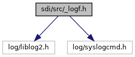
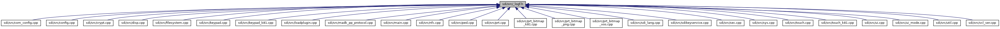

[Macros](#define-members) \| [Variables](#var-members)

`#include "log/liblog2.h"`
`#include "log/syslogcmd.h"`

Include dependency graph for \_logf.h:

This graph shows which files directly or indirectly include this file:

<a href="__logf_8h_source.md">Go to the source code of this file.</a>

|  |  |
|----|----|
| Macros |  |
| #define  | [SDI_LOG_CHANNEL](#a6d6f114e838fa3d69b35af94dd5d62ea)   \"SDI\" |
| #define  | [\_LOGF_TRACE](#ad81571c96cd42e7ac5d871b020e0b340)(format, \...)   LOGF_TRACE(<a href="main_8cpp.md#ab8518ee19337dc0debb1f831ada96dd6">logHandle</a>, format, \## \_\_VA_ARGS\_\_) |
| #define  | [\_LOGF_INFO](#abae321ba8d826ebb9d4e971a088f825c)(format, \...)   LOGF_INFO(<a href="main_8cpp.md#ab8518ee19337dc0debb1f831ada96dd6">logHandle</a>, format, \## \_\_VA_ARGS\_\_) |
| #define  | [\_LOGF_WARN](#a7ae8f39cedcfcc98a664c230188fdd40)(format, \...)   LOGF_WARN(<a href="main_8cpp.md#ab8518ee19337dc0debb1f831ada96dd6">logHandle</a>, format, \## \_\_VA_ARGS\_\_) |
| #define  | [\_LOGF_ERROR](#a701d2cf9d0913b973967b1e2eab7909d)(format, \...)   LOGF_ERROR(<a href="main_8cpp.md#ab8518ee19337dc0debb1f831ada96dd6">logHandle</a>, format, \## \_\_VA_ARGS\_\_) |
| #define  | [\_LOGAPI_HEXDUMP_TRACE](#aa1a704b853204e067c588f64cd14af5f)(title, data, size)   LOGAPI_HEXDUMP2(<a href="main_8cpp.md#ab8518ee19337dc0debb1f831ada96dd6">logHandle</a>, LOGAPI_TRACE, title, data, size) |
| #define  | [\_LOGAPI_HEXDUMP_INFO](#a49f5382c07d5a046e0521dd4878d0539)(title, data, size)   LOGAPI_HEXDUMP2(<a href="main_8cpp.md#ab8518ee19337dc0debb1f831ada96dd6">logHandle</a>, LOGAPI_INFO, title, data, size) |
| #define  | [\_LOGAPI_HEXDUMP_RAW_INFO](#a8a796221455d95533768ed0d8e60ad6e)(data, size)   LOGAPI_HEXDUMP_RAW2(<a href="main_8cpp.md#ab8518ee19337dc0debb1f831ada96dd6">logHandle</a>, LOGAPI_INFO, data, size) |
| #define  | [\_LOG_LEVEL_ENABLED](#a416d0b686725b50882323e4a8dd8fa9e)(level)   LogAPI_LevelEnough2(<a href="main_8cpp.md#ab8518ee19337dc0debb1f831ada96dd6">logHandle</a>,level) |

|               |                                                 |
|---------------|-------------------------------------------------|
| Variables     |                                                 |
| LibLogHandle  | [logHandle](#ab8518ee19337dc0debb1f831ada96dd6) |

## MacroDefinition Documentation {#macro-definition-documentation}

## \_LOG_LEVEL_ENABLED 

#define \_LOG_LEVEL_ENABLED

## \_LOGAPI_HEXDUMP_INFO 

#define \_LOGAPI_HEXDUMP_INFO

## \_LOGAPI_HEXDUMP_RAW_INFO 

#define \_LOGAPI_HEXDUMP_RAW_INFO

## \_LOGAPI_HEXDUMP_TRACE 

#define \_LOGAPI_HEXDUMP_TRACE

## \_LOGF_ERROR 

#define \_LOGF_ERROR

## \_LOGF_INFO 

#define \_LOGF_INFO

## \_LOGF_TRACE 

#define \_LOGF_TRACE

## \_LOGF_WARN 

#define \_LOGF_WARN

## SDI_LOG_CHANNEL 

#define SDI_LOG_CHANNEL   \"SDI\"

## VariableDocumentation {#variable-documentation}

## logHandle 

LibLogHandle logHandle

