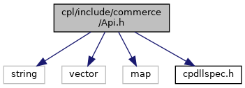

[Data Structures](#nested-classes) \| [Namespaces](#namespaces) \| [Enumerations](#enum-members)

`#include <string>`
`#include <vector>`
`#include <map>`
`#include "`<a href="cpdllspec_8h_source.md">cpdllspec.h</a>`"`

Include dependency graph for Api.h:

This graph shows which files directly or indirectly include this file:

<a href="_api_8h_source.md">Go to the source code of this file.</a>

|  |  |
|----|----|
| Data Structures |  |
| struct   | <a href="namespacevficpl.md#structvficpl_1_1_transaction_data">TransactionData</a> |
| class   | <a href="classvficpl_1_1_api.md">Api</a> |

|            |                                                  |
|------------|--------------------------------------------------|
| Namespaces |                                                  |
|            | <a href="namespacevficpl.md">vficpl</a> |

|  |  |
|----|----|
| Enumerations |  |
| enum   | <a href="namespacevficpl.md#a6aec14d1e03f2a2bf43eeae11b6a0ca4">ApiError</a> {   <a href="namespacevficpl.md#a6aec14d1e03f2a2bf43eeae11b6a0ca4aac6ea7cce7cfe7b490e5c7e9683c4356">API_OK</a>, <a href="namespacevficpl.md#a6aec14d1e03f2a2bf43eeae11b6a0ca4af9bef427ea9e87e17c542097262b2d9c">API_FAIL</a>, <a href="namespacevficpl.md#a6aec14d1e03f2a2bf43eeae11b6a0ca4a8aadbd1dd596c4cad93bbb5bdd6c14c9">API_SERVICE_TIMEOUT</a>, <a href="namespacevficpl.md#a6aec14d1e03f2a2bf43eeae11b6a0ca4aeb92fc9c99ff9c6c460a2ed82e1b8716">API_INVALID_PARAMETERS</a>,   <a href="namespacevficpl.md#a6aec14d1e03f2a2bf43eeae11b6a0ca4a77594044bb3a17ab6cce09dd1232bcda">API_UNSUPPORTED_REQUEST</a>, <a href="namespacevficpl.md#a6aec14d1e03f2a2bf43eeae11b6a0ca4a4296511c7cae9476c435c04c468e794e">API_ENCRYPTION_UNAVAILABLE</a>, <a href="namespacevficpl.md#a6aec14d1e03f2a2bf43eeae11b6a0ca4ae3326934d0cb3f4d23c8ef7a04ce52b3">API_NO_PAPER</a> } |

------------------------------------------------------------------------

## DataStructure Documentation {#data-structure-documentation}

## vficpl::TransactionData 

struct vficpl::TransactionData

<a href="namespacevficpl.md#structvficpl_1_1_transaction_data">TransactionData</a> container struct for defined return values of <a href="classvficpl_1_1_api.md">Api</a>

| Data Fields |  |  |
|----|----|----|
| string | currency | 
alphabetic currency code (ISO 4217)
 |
| string | errorDescription | 
description of error
 |
| string | gratuityAmount | 
tip value
 |
| string | invoice | 
invoice or bill number this transaction relates to
 |
| bool | manualEntry | 
true permits the payment application to obtain card data via manual card entry. false indicates that the manual card entry is not an option.
 |
| vector\< string \> | manualPromptOption | 
Only filled if manualEntry is true.
 
Possible values are
 • ZIP prompts to enter zipcode 
If ZIP is specified, the result of the AVS is returned in AVS_Code
 |
| string | panHandle | 
reference of payment application ehich refers to the PAN in question.
 |
| string | result | 
result of transaction
 |
| string | transactionAmount | 
amount of transaction
 |
| string | transactionId | 
transaction id provided by the payment gateway, which is a client specific transaction identifier.
 |
| string | transactionType | 
type of transaction executed by the payment application
 |
