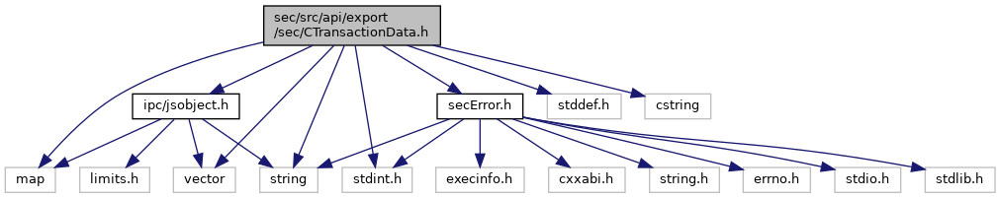
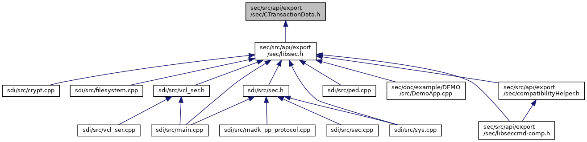

[Data Structures](#nested-classes) \| [Namespaces](#namespaces) \| [Macros](#define-members) \| [Typedefs](#typedef-members)

ADK Security Service Transaction Data. [More\...](#details)

`#include <stdint.h>`
`#include <stddef.h>`
`#include <map>`
`#include <vector>`
`#include <cstring>`
`#include <string>`
`#include <`<a href="ipc_2src_2ipc_2jsobject_8h_source.md">ipc/jsobject.h</a>`>`
`#include "`<a href="sec_error_8h_source.md">secError.h</a>`"`

Include dependency graph for CTransactionData.h:

This graph shows which files directly or indirectly include this file:

<a href="_c_transaction_data_8h_source.md">Go to the source code of this file.</a>

|  |  |
|----|----|
| Data Structures |  |
| class   | <a href="classcom__adksec__cmd_1_1_c_transaction_value.md">CTransactionValue</a> |
| class   | <a href="classcom__adksec__cmd_1_1_c_transaction_data.md">CTransactionData</a> |

|  |  |
|----|----|
| Namespaces |  |
|   | <a href="namespacecom__adksec__cmd.md">com_adksec_cmd</a> |

|          |                                                  |
|----------|--------------------------------------------------|
| Macros   |                                                  |
| #define  | [DllSpecSEC](#abcde1739ffe76c2296e21ce0b20f0ad3) |

|  |  |
|----|----|
| Typedefs |  |
| typedef uint32_t  | <a href="namespacecom__adksec__cmd.md#acc01edab4b0f73c92142d9d43dc7a7f7">secHandle_t</a> |
| typedef uint8_t  | <a href="namespacecom__adksec__cmd.md#af79ae13c5f9ec8424f44764288144041">bitMask_t</a> |
| typedef std::string  | <a href="namespacecom__adksec__cmd.md#ad15b3c697f22fd80a8a42e5547c5b8e4">secIndex_t</a> |
| typedef unsigned char  | <a href="namespacecom__adksec__cmd.md#a74b8a37bc3557f7d5fc9a2d70737ab33">eSecCommandtype</a> |
| typedef CTransactionValue  | <a href="namespacecom__adksec__cmd.md#abddf3fd58f8658a7475911ed80e0fe20">SecTransactionValue</a> |
| typedef CTransactionData  | <a href="namespacecom__adksec__cmd.md#a8963c1dd7c626a621a8033209294fcbd">SecTransactionData_t</a> |

## DetailedDescription {#detailed-description}

ADK Security Service Transaction Data.

### Author

JensW

### Date

11.04.2016

## MacroDefinition Documentation {#macro-definition-documentation}

## DllSpecSEC 

#define DllSpecSEC

