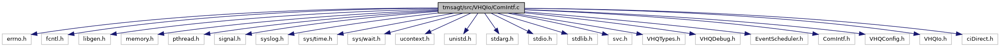

[Macros](#define-members) \| [Functions](#func-members) \| [Variables](#var-members)

`#include <errno.h>`
`#include <fcntl.h>`
`#include <libgen.h>`
`#include <memory.h>`
`#include <pthread.h>`
`#include <signal.h>`
`#include <syslog.h>`
`#include <sys/time.h>`
`#include <sys/wait.h>`
`#include <ucontext.h>`
`#include <unistd.h>`
`#include <stdarg.h>`
`#include <stdio.h>`
`#include <stdlib.h>`
`#include <svc.h>`
`#include "VHQTypes.h"`
`#include "VHQDebug.h"`
`#include "EventScheduler.h"`
`#include "ComIntf.h"`
`#include "VHQConfig.h"`
`#include "VHQIo.h"`
`#include "ciDirect.h"`

Include dependency graph for ComIntf.c:



|  |  |
|----|----|
| Macros |  |
| #define  | [ARRAY_SIZEOF](#a083b03c5af4ad6035a7b2879c523150c)(x)   (sizeof(x)/sizeof(x\[0\])) |

|  |  |
|----|----|
| Functions |  |
| void  | [CheckAndInitLog](#af8673306bb95c4811b31e9f1dc1a8ca3) () |
| void  | [StartNetwork](#a14218cafcf8cb7b241304a53c65c98a9) (void) |
| void  | [StartCommEngine](#a4e9cf7d5bfbf9b781773b0f768525a5d) (void) |
| int  | [CommInit](#a6f6bcd92cfbca713feb14635853d7fb9) (char \*pszOperatingMode, char \*pszSettings1, char \*pszSettings2, char \*pszSettings3, char \*pszSettings4) |
| int  | [CommDeinit](#ac333116610eb7d0056863b3a922eb7d5) (void) |
| int  | [CommOpen](#a2a165fe9ecfd9d0a3dff2174e65239da) (CommOpenData \*pData) |
| int  | [CommClose](#a76f97fa1c6daadbc4f8458957bdc4d30) (CommOpenData \*pData) |
| int  | [CommStatus](#a16f9e8a6cd24441d031ae50a22e463a8) (void \*pData, bool \*bUp, char \*pszIpAddress, char \*pszMacAddr) |
| bool  | [IsOnDemandProtocol](#ae929d73cf66fe1b964668c075385ac1a) () |
| int  | [CommNetConnect](#a3fe87f9ff21f10d6ebd7d26a7b14a7cc) (callback_t eCallback, event_set_id_t event_set_id, event_id_t event_id, bool app_approval_required) |
| int  | [CommNetDisconnect](#acfad3a7c0027b8665f841eae2d89fc7b) (bool bForceDisconnect) |
| const char \*  | [CommGetErrString](#af367fcd161fc82ac7c092586811c6c4f) (int err) |

|           |                                                   |
|-----------|---------------------------------------------------|
| Variables |                                                   |
| ComIntf   | [abComs](#ad1750e63792ee137ea1d36a3750b6b3f) \[\] |

## DetailedDescription {#detailed-description}

Main communication operations. Calls functions depending on operating mode.

## MacroDefinition Documentation {#macro-definition-documentation}

## ARRAY_SIZEOF <a href="#a083b03c5af4ad6035a7b2879c523150c" id="a083b03c5af4ad6035a7b2879c523150c"></a>

<p>#define ARRAY_SIZEOF</p>

## FunctionDocumentation {#function-documentation}

## CheckAndInitLog() <a href="#af8673306bb95c4811b31e9f1dc1a8ca3" id="af8673306bb95c4811b31e9f1dc1a8ca3"></a>

<p>void CheckAndInitLog</p>

## CommClose() <a href="#a76f97fa1c6daadbc4f8458957bdc4d30" id="a76f97fa1c6daadbc4f8458957bdc4d30"></a>

<p>int CommClose</p>

This function calls the CommClose function pointed to by ComIntf abComs to close a connection.

**Parameters**

\[in\] **pData** = pointer to curl details.

### Returns

int 1, if success

## CommDeinit() <a href="#ac333116610eb7d0056863b3a922eb7d5" id="ac333116610eb7d0056863b3a922eb7d5"></a>

<p>int CommDeinit</p>

This function calls the CommDeinit function pointed to by ComIntf abComs.

### Returns

int, 1 if success

## CommGetErrString() <a href="#af367fcd161fc82ac7c092586811c6c4f" id="af367fcd161fc82ac7c092586811c6c4f"></a>

<p>const char\* CommGetErrString</p>

## CommInit() <a href="#a6f6bcd92cfbca713feb14635853d7fb9" id="a6f6bcd92cfbca713feb14635853d7fb9"></a>

<p>int CommInit</p>

This function calls the CommInit function pointed to by ComIntf abComs depending on the operation mode existing.

**Parameters**

\[in\] **pszOperatingMode** = operating mode \[in\] **pszSettings1** = arg1 for init function \[in\] **pszSettings2** = arg2 for init function \[in\] **pszSettings3** = arg3 for init function \[in\] **pszSettings4** = arg4 for init function

### Returns

int 1,if success

## CommNetConnect() <a href="#a3fe87f9ff21f10d6ebd7d26a7b14a7cc" id="a3fe87f9ff21f10d6ebd7d26a7b14a7cc"></a>

<p>int CommNetConnect</p>

This function establishes the connection.

**Parameters**

\[in\] **event_set_id** = event set id \[in\] **event_id** = event id \[in\] **app_approval_required** = TRUE, if application approval requires for communicating with server.

### Returns

int 0, if connection failed.

## CommNetDisconnect() <a href="#acfad3a7c0027b8665f841eae2d89fc7b" id="acfad3a7c0027b8665f841eae2d89fc7b"></a>

<p>int CommNetDisconnect</p>

This function disconnects an active connection.

**Parameters**

\[in\] **bForceDisconnect** = TRUE, if force disconnect

### Returns

int 0, if connection disconnected.

## CommOpen() <a href="#a2a165fe9ecfd9d0a3dff2174e65239da" id="a2a165fe9ecfd9d0a3dff2174e65239da"></a>

<p>int CommOpen</p>

This function calls the CommOpen function pointed to by ComIntf abComs to open a connection.

**Parameters**

\[in\] **pData** = pointer to curl details.

### Returns

int 0, if success

## CommStatus() <a href="#a16f9e8a6cd24441d031ae50a22e463a8" id="a16f9e8a6cd24441d031ae50a22e463a8"></a>

<p>int CommStatus</p>

This function calls the CommStatus function pointed to by ComIntf abComs to get the status of a connection.

**Parameters**

\[in\] **pData** = pointer to curl details. \[out\] **bUp** = to store status, TRUE if active/IP address is present \[out\] **pszIpAddress** = to store IP address \[out\] **pszMacAddr** = to store Mac Address

### Returns

int -1, if invalid status; 0, if status found

## IsOnDemandProtocol() <a href="#ae929d73cf66fe1b964668c075385ac1a" id="ae929d73cf66fe1b964668c075385ac1a"></a>

<p>bool IsOnDemandProtocol</p>

## StartCommEngine() <a href="#a4e9cf7d5bfbf9b781773b0f768525a5d" id="a4e9cf7d5bfbf9b781773b0f768525a5d"></a>

<p>void StartCommEngine</p>

## StartNetwork() <a href="#a14218cafcf8cb7b241304a53c65c98a9" id="a14218cafcf8cb7b241304a53c65c98a9"></a>

<p>void StartNetwork</p>

## VariableDocumentation {#variable-documentation}

## abComs <a href="#ad1750e63792ee137ea1d36a3750b6b3f" id="ad1750e63792ee137ea1d36a3750b6b3f"></a>

<p>ComIntf abComs\[\]</p>

**Initial value:**

``` cpp
= { { "Direct", FALSE, Direct_init, Direct_deinit, Direct_open,
   Direct_close, Direct_status, Direct_NetConn, Direct_NetDisconn,
   Direct_ErrString },
   }
```
