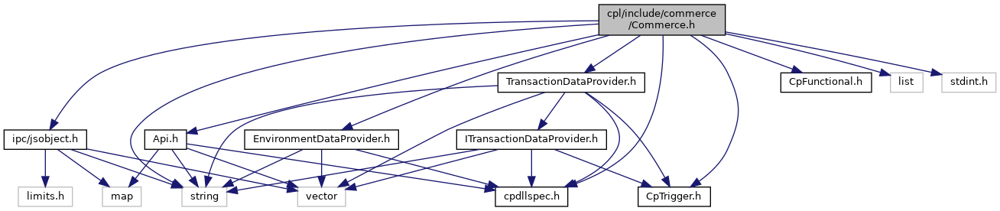

[Data Structures](#nested-classes) \| [Namespaces](#namespaces) \| [Macros](#define-members) \| [Enumerations](#enum-members) \| [Functions](#func-members)

`#include "`<a href="_api_8h_source.md">Api.h</a>`"`
`#include "`<a href="_cp_trigger_8h_source.md">CpTrigger.h</a>`"`
`#include "`<a href="_cp_functional_8h_source.md">CpFunctional.h</a>`"`
`#include "`<a href="_environment_data_provider_8h_source.md">EnvironmentDataProvider.h</a>`"`
`#include "`<a href="_transaction_data_provider_8h_source.md">TransactionDataProvider.h</a>`"`
`#include "`<a href="cpdllspec_8h_source.md">cpdllspec.h</a>`"`
`#include "`<a href="ipc_2src_2ipc_2jsobject_8h_source.md">ipc/jsobject.h</a>`"`
`#include <string>`
`#include <list>`
`#include <stdint.h>`

Include dependency graph for Commerce.h:

<a href="_commerce_8h_source.md">Go to the source code of this file.</a>

|  |  |
|----|----|
| Data Structures |  |
| struct   | <a href="structvficpl_1_1_invoke_result.md">InvokeResult</a> |
|   | Trigger invocation result. <a href="structvficpl_1_1_invoke_result.md#details">More...</a>  |
| struct   | <a href="structvficpl_1_1_invoke_request.md">InvokeRequest</a> |
| class   | <a href="classvficpl_1_1_barcode.md">Barcode</a> |
|   | Represents <a href="classvficpl_1_1_barcode.md">Barcode</a> object on CP-Payment communication. <a href="classvficpl_1_1_barcode.md#details">More...</a>  |
| class   | <a href="classvficpl_1_1_loyalty_identifier.md">LoyaltyIdentifier</a> |
|   | Represents <a href="classvficpl_1_1_loyalty_identifier.md">LoyaltyIdentifier</a> object on CP-Payment communication. <a href="classvficpl_1_1_loyalty_identifier.md#details">More...</a>  |
| class   | <a href="classvficpl_1_1_offer.md">Offer</a> |
|   | Represents the <a href="classvficpl_1_1_offer.md">Offer</a> object on CP-Payment communication. <a href="classvficpl_1_1_offer.md#details">More...</a>  |
| class   | <a href="classvficpl_1_1_merchandise.md">Merchandise</a> |
|   | Represents the <a href="classvficpl_1_1_merchandise.md">Merchandise</a> object on CP-Payment communication. <a href="classvficpl_1_1_merchandise.md#details">More...</a>  |
| class   | <a href="classvficpl_1_1_donation.md">Donation</a> |
|   | Represents the <a href="classvficpl_1_1_donation.md">Donation</a> object on CP-Payment communication. <a href="classvficpl_1_1_donation.md#details">More...</a>  |
| struct   | <a href="namespacevficpl.md#structvficpl_1_1_alt_payment_data">AltPaymentData</a> |
|   | Represents Alt Payment Data object on CP-Payment communication. <a href="namespacevficpl.md#structvficpl_1_1_alt_payment_data">More...</a>  |
| struct   | <a href="namespacevficpl.md#structvficpl_1_1_tech_alt_payment_data">TechAltPaymentData</a> |
|   | Represents Alt Payment trigger response. <a href="namespacevficpl.md#structvficpl_1_1_tech_alt_payment_data">More...</a>  |
| struct   | <a href="namespacevficpl.md#structvficpl_1_1_customer_identification">CustomerIdentification</a> |
|   | Customer identification to be used equivalent to a card pre-dip / pre-swipe. <a href="namespacevficpl.md#structvficpl_1_1_customer_identification">More...</a>  |
| struct   | <a href="namespacevficpl.md#structvficpl_1_1_payment_amount_adjustment">PaymentAmountAdjustment</a> |
|   | Payment amount adjustment Fx data. <a href="namespacevficpl.md#structvficpl_1_1_payment_amount_adjustment">More...</a>  |

|            |                                                  |
|------------|--------------------------------------------------|
| Namespaces |                                                  |
|            | <a href="namespacevficpl.md">vficpl</a> |

|  |  |
|----|----|
| Macros |  |
| #define  | [CPL_EXPLICIT_OPERATOR_BOOL](#a278739b9dd4ef39e58e5f7f7ea515d15)()   operator bool() |

|  |  |
|----|----|
| Enumerations |  |
| enum   | <a href="namespacevficpl.md#a59e56af19e754a6aa26a612ebf91d05f">ErrorCode</a> {   <a href="namespacevficpl.md#a59e56af19e754a6aa26a612ebf91d05fae086821aa37071bfbb216a0fb5643cc3">CP_INVOKE_SUCCESS</a>, <a href="namespacevficpl.md#a59e56af19e754a6aa26a612ebf91d05fa3e0843950e675d30cc04ab9c43327ed3">CP_INVOKE_FAILED</a>, <a href="namespacevficpl.md#a59e56af19e754a6aa26a612ebf91d05fa15a82fbea37fb093d565e0d9db9298e9">CP_INVOKE_TIMEOUT</a>, <a href="namespacevficpl.md#a59e56af19e754a6aa26a612ebf91d05fa74effbcc2afb8cff7bd2a511279b77b6">CP_INVOKE_MANDATORY_PARAMS_MISSING</a>,   <a href="namespacevficpl.md#a59e56af19e754a6aa26a612ebf91d05fa24981dca9214e9b22b8fe4515d8ceaa9">CP_INVOKE_SERVICE_SUCCESS</a>, <a href="namespacevficpl.md#a59e56af19e754a6aa26a612ebf91d05fa51518a55f4963bb63b166244ec3f23e9">CP_INVOKE_NATIVE_SUCCESS</a>, <a href="namespacevficpl.md#a59e56af19e754a6aa26a612ebf91d05fa348cffdd1862b4403ee65ee4b880f63c">CP_INVOKE_CANCELED</a>, <a href="namespacevficpl.md#a59e56af19e754a6aa26a612ebf91d05fa57c4ceaf23acc04bae1231f0c3a0d3ef">CP_INVOKE_BUSY</a>,   <a href="namespacevficpl.md#a59e56af19e754a6aa26a612ebf91d05faa8780beaab249baa6c45fc0108dcd8c7">CP_INVOKE_IDLE</a>, <a href="namespacevficpl.md#a59e56af19e754a6aa26a612ebf91d05fa1308487c375a59992f9a1157ec8c5392">CP_INVOKE_NOT_IMPLEMENTED</a> } |
|   | Represents possible error codes of invoke call. <a href="namespacevficpl.md#a59e56af19e754a6aa26a612ebf91d05f">More...</a>  |
| enum   | <a href="namespacevficpl.md#ad7c9d0eab3af08a96ce9fd9ce293de88">OFFER_TYPE</a> {   <a href="namespacevficpl.md#ad7c9d0eab3af08a96ce9fd9ce293de88ae836b3548e12b2e722918c0ba5db3bb0">OFFER_UNDEFINED</a>, <a href="namespacevficpl.md#ad7c9d0eab3af08a96ce9fd9ce293de88a055d7389ec059ad865fde1dd02504117">OFFER_MERCHANT_COUPON</a>, <a href="namespacevficpl.md#ad7c9d0eab3af08a96ce9fd9ce293de88a782450e10ad6812a794228dae173b2ea">OFFER_MANUFACTURER_COUPON</a>, <a href="namespacevficpl.md#ad7c9d0eab3af08a96ce9fd9ce293de88a16427e84542c1fe797b399a9a82ecd41">OFFER_OTHER_COUPON</a>,   <a href="namespacevficpl.md#ad7c9d0eab3af08a96ce9fd9ce293de88a16ee5740ffd2e9a2064a43f36c1d8cfa">OFFER_PRODUCT_DISCOUNT</a>, <a href="namespacevficpl.md#ad7c9d0eab3af08a96ce9fd9ce293de88a128bff6b7fa2474e01ba2fb6b3f957f3">OFFER_LOYALTY_CARD</a>, <a href="namespacevficpl.md#ad7c9d0eab3af08a96ce9fd9ce293de88abd542afe07b9f273f121ac6041511eab">OFFER_TRANSACTION_DISCOUNT</a> } |
|   | Represents the Offer object on CP-Payment communication. <a href="namespacevficpl.md#ad7c9d0eab3af08a96ce9fd9ce293de88">More...</a>  |

|  |  |
|----|----|
| Functions |  |
| <a href="cpdllspec_8h.md#a405283673573049b0d38f77c79ee0e06">CPDllSpec</a> Api &  | <a href="namespacevficpl.md#a42b69ad670428bf118b40a00cf59b496">getApi</a> () |
| <a href="cpdllspec_8h.md#a405283673573049b0d38f77c79ee0e06">CPDllSpec</a> bool  | <a href="namespacevficpl.md#a770b649a42bf6c1cf1d34e0c6165ff58">setEnvironmentDataProvider</a> (EnvironmentDataProvider &envData) |
| <a href="cpdllspec_8h.md#a405283673573049b0d38f77c79ee0e06">CPDllSpec</a> void  | <a href="namespacevficpl.md#a47c8903f6cf26144150fa99d21fd807e">setBasket</a> (const std::list\< Merchandise \> &merchandises, const std::list\< Offer \> &offers, const std::list\< Donation \> &donations) |
| <a href="cpdllspec_8h.md#a405283673573049b0d38f77c79ee0e06">CPDllSpec</a> bool  | <a href="namespacevficpl.md#ab1c5bc2e93eed8cd5c3356e1dd12f119">getBasket</a> (std::list\< Merchandise \> &merchandises, std::list\< Offer \> &offers, std::list\< Donation \> &donations) |
| <a href="cpdllspec_8h.md#a405283673573049b0d38f77c79ee0e06">CPDllSpec</a> bool  | <a href="namespacevficpl.md#aef8408b1629d19eaa27a183be2bef5e2">setApi</a> (Api &api) |
| <a href="cpdllspec_8h.md#a405283673573049b0d38f77c79ee0e06">CPDllSpec</a> std::string  | <a href="namespacevficpl.md#af3331180e3743ea6d16d29ff2427ac48">getProvision</a> () |
| <a href="cpdllspec_8h.md#a405283673573049b0d38f77c79ee0e06">CPDllSpec</a> std::string  | <a href="namespacevficpl.md#a3b3fc3a29c1354026365dd16bfc7e504">getPublisher</a> () |
| <a href="cpdllspec_8h.md#a405283673573049b0d38f77c79ee0e06">CPDllSpec</a> std::string  | <a href="namespacevficpl.md#a594d8e35680d4e7497544bc3d5ac8c46">getPublisherId</a> () |
| <a href="cpdllspec_8h.md#a405283673573049b0d38f77c79ee0e06">CPDllSpec</a> std::string  | <a href="namespacevficpl.md#a0277b25de7a0475fb50eb12c38b14181">getQrCodeString</a> () |
| <a href="cpdllspec_8h.md#a405283673573049b0d38f77c79ee0e06">CPDllSpec</a> std::list\< Offer \>  | <a href="namespacevficpl.md#a6c337b2d5da35972bb2ecee3c04f9a8a">getLoyaltyOffers</a> () |
| <a href="cpdllspec_8h.md#a405283673573049b0d38f77c79ee0e06">CPDllSpec</a> std::list\< LoyaltyIdentifier \>  | <a href="namespacevficpl.md#a0a7f7e7b82c6f3b755a81c7bfc7b7ab0">getLoyaltyIdentifiers</a> () |
| <a href="cpdllspec_8h.md#a405283673573049b0d38f77c79ee0e06">CPDllSpec</a> std::string  | <a href="namespacevficpl.md#a8e454211981744b922bae32f48d293e3">getFxAmount</a> () |
| <a href="cpdllspec_8h.md#a405283673573049b0d38f77c79ee0e06">CPDllSpec</a> std::string  | <a href="namespacevficpl.md#a168a379c94be7d795b0567e0890956ea">getFxCurrency</a> () |
| <a href="cpdllspec_8h.md#a405283673573049b0d38f77c79ee0e06">CPDllSpec</a> AltPaymentData  | <a href="namespacevficpl.md#a9de813115021e14784c242e92757d47f">getAltPaymentData</a> () |
| <a href="cpdllspec_8h.md#a405283673573049b0d38f77c79ee0e06">CPDllSpec</a> TechAltPaymentData  | <a href="namespacevficpl.md#a923e76d59a4651b0f30b2df42601f790">getTechAltPaymentData</a> () |
| <a href="cpdllspec_8h.md#a405283673573049b0d38f77c79ee0e06">CPDllSpec</a> CustomerIdentification  | <a href="namespacevficpl.md#aa2ddfbcdfec859501be40da14b462a9f">getCustomerIdentification</a> () |
| <a href="cpdllspec_8h.md#a405283673573049b0d38f77c79ee0e06">CPDllSpec</a> PaymentAmountAdjustment  | <a href="namespacevficpl.md#a5898fddd803a36971b95be0edb8d8876">getPaymentAmountAdjustment</a> () |
| <a href="cpdllspec_8h.md#a405283673573049b0d38f77c79ee0e06">CPDllSpec</a> bool  | <a href="namespacevficpl.md#a5ef71297d93fdd0099630254ef4f0aea">init</a> (const std::string &applicationId, TransactionDataProvider &trxData, Api &api, EnvironmentDataProvider &envData) |
| <a href="cpdllspec_8h.md#a405283673573049b0d38f77c79ee0e06">CPDllSpec</a> bool  | <a href="namespacevficpl.md#adc3b1693acfc9926b43d49177dddea69">init</a> (const std::string &applicationId, TransactionDataProvider &trxData, Api &api) |
| <a href="cpdllspec_8h.md#a405283673573049b0d38f77c79ee0e06">CPDllSpec</a> bool  | <a href="namespacevficpl.md#af3604b595253ea6907e5150e83155e8d">init</a> (const std::string &applicationId, TransactionDataProvider &trxData, EnvironmentDataProvider &envData) |
| <a href="cpdllspec_8h.md#a405283673573049b0d38f77c79ee0e06">CPDllSpec</a> bool  | <a href="namespacevficpl.md#a5b999c5309312eecb43d568bb14032bb">init</a> (const std::string &applicationId, TransactionDataProvider &trxData) |
| <a href="cpdllspec_8h.md#a405283673573049b0d38f77c79ee0e06">CPDllSpec</a> bool  | <a href="namespacevficpl.md#ad2968ca7d610c815f173414d645e8852">init</a> (const std::string &appid, ITransactionDataProvider &trxData, Api &api, EnvironmentDataProvider &envData) |
| <a href="cpdllspec_8h.md#a405283673573049b0d38f77c79ee0e06">CPDllSpec</a> bool  | <a href="namespacevficpl.md#a4fcf7041b913d34d9cb6cab1ffb422d3">init</a> (const std::string &appid, ITransactionDataProvider &trxData, Api &api) |
| <a href="cpdllspec_8h.md#a405283673573049b0d38f77c79ee0e06">CPDllSpec</a> bool  | <a href="namespacevficpl.md#ad8c7c8a15638521499c7c16ddd8705cb">init</a> (const std::string &appid, ITransactionDataProvider &trxData, EnvironmentDataProvider &envData) |
| <a href="cpdllspec_8h.md#a405283673573049b0d38f77c79ee0e06">CPDllSpec</a> bool  | <a href="namespacevficpl.md#a792f8eceedf83bd7416fd1c7f11eef87">init</a> (const std::string &appid, ITransactionDataProvider &trxData) |
| <a href="cpdllspec_8h.md#a405283673573049b0d38f77c79ee0e06">CPDllSpec</a> void  | <a href="namespacevficpl.md#a352ddaa2769fa08bbfa0e95d5d9cca6f">deinit</a> () |
| <a href="cpdllspec_8h.md#a405283673573049b0d38f77c79ee0e06">CPDllSpec</a> <a href="group__inf__util__public.md#ga59e56af19e754a6aa26a612ebf91d05f">ErrorCode</a>  | <a href="namespacevficpl.md#ab9d50d8d888d385d38a92e3d8b1974ba">invoke</a> (InvokeRequest &request) |
| <a href="cpdllspec_8h.md#a405283673573049b0d38f77c79ee0e06">CPDllSpec</a> InvokeResult  | <a href="namespacevficpl.md#a3795a53125b8ae4c1348294b60334aba">invoke</a> (const CpTrigger trigger) |
| <a href="cpdllspec_8h.md#a405283673573049b0d38f77c79ee0e06">CPDllSpec</a> InvokeResult  | <a href="namespacevficpl.md#a03bd564e57072915ec1c7b82574c04ae">invoke</a> (const CpTrigger trigger, bool sysToForground) |
| <a href="cpdllspec_8h.md#a405283673573049b0d38f77c79ee0e06">CPDllSpec</a> InvokeResult  | <a href="namespacevficpl.md#adc04dd7fe0a7a61093b18d8c74943621">invokeByName</a> (const CpTrigger trigger, const std::string &programName) |
| <a href="cpdllspec_8h.md#a405283673573049b0d38f77c79ee0e06">CPDllSpec</a> InvokeResult  | <a href="namespacevficpl.md#ae10e0edc808d5382d7a6b268b0fd5eef">invokeByName</a> (const CpTrigger trigger, const std::string &programName, bool sysToForground) |
| <a href="cpdllspec_8h.md#a405283673573049b0d38f77c79ee0e06">CPDllSpec</a> InvokeResult  | <a href="namespacevficpl.md#a571ac156101cdd0fb2361788064ac5e1">invokeFromDesktop</a> (const CpTrigger trigger) |
| <a href="cpdllspec_8h.md#a405283673573049b0d38f77c79ee0e06">CPDllSpec</a> InvokeResult  | <a href="namespacevficpl.md#a2b66f79671a09e00b3c5f65ca32bcb69">invokeFromDesktop</a> (const CpTrigger trigger, bool sysToForground) |
| <a href="cpdllspec_8h.md#a405283673573049b0d38f77c79ee0e06">CPDllSpec</a> std::vector\< std::string \>  | <a href="namespacevficpl.md#ab0b9912d7ee77961fb31ae13f9e34e18">getCpAppList</a> (const CpTrigger trigger) |
| <a href="cpdllspec_8h.md#a405283673573049b0d38f77c79ee0e06">CPDllSpec</a> <a href="classvfiipc_1_1_j_s_object.md">vfiipc::JSObject</a>  | <a href="namespacevficpl.md#a20d7f23a5f162116695a1192072f0d8f">getCpPropList</a> (const CpTrigger trigger) |
| <a href="cpdllspec_8h.md#a405283673573049b0d38f77c79ee0e06">CPDllSpec</a> <a href="classvfiipc_1_1_j_s_object.md">vfiipc::JSObject</a>  | <a href="namespacevficpl.md#a19a35b029151524c96d7131b3ddd4709">getCpExtraProps</a> (const std::string &appid) |

------------------------------------------------------------------------

## DataStructure Documentation {#data-structure-documentation}

## vficpl::AltPaymentData 

struct vficpl::AltPaymentData

Represents Alt Payment Data object on CP-Payment communication.

| Data Fields |  |  |
|----|----|----|
| string | approvedAmount | 
Amount approved by the Alternate Payment Commerce Application. This amount is returned as a negative number. String amount formatting applies.
 |
| string | authCode | 
The transaction Authorization Code usally provided by the Alternate Payment Service Provider.
 |
| string | methodsOfPayment | 
Description of Alternate Payment service.
 |
| string | redeemedUnits | 
Number of units of alternate currency consumed.
 |

## vficpl::TechAltPaymentData 

struct vficpl::TechAltPaymentData

Represents Alt Payment trigger response.

| Data Fields |                 |     |
|-------------|-----------------|-----|
| string      | approvedAmount  |     |
| string      | authCode        |     |
| string      | methodOfPayment |     |
| string      | redeemedUnits   |     |
| bool        | result          |     |
| string      | techHandle      |     |
| string      | techType        |     |

## vficpl::CustomerIdentification 

struct vficpl::CustomerIdentification

Customer identification to be used equivalent to a card pre-dip / pre-swipe.

| Data Fields |  |  |
|----|----|----|
| list\< string \> | ids | 
A customers identifier(s) unique in the service provider system.
 |
| string | par | 
Payment Account Reference (PAR) represents the Payment Account at the same level that PAN represents the Payment Account.
 |
| list\< string \> | tokens | 
Customer token(s) provided by the Verifone tokenization service.
 |

## vficpl::PaymentAmountAdjustment 

struct vficpl::PaymentAmountAdjustment

Payment amount adjustment Fx data.

| Data Fields |                       |     |
|-------------|-----------------------|-----|
| bool        | fxAccepted            |     |
| string      | fxAmount              |     |
| string      | fxCurrency            |     |
| double      | fxInvertedRate        |     |
| string      | fxMerchantId          |     |
| double      | fxPercentageCommision |     |
| double      | fxPercentageMargin    |     |
| double      | fxRate                |     |
| string      | fxTerminalId          |     |

## MacroDefinition Documentation {#macro-definition-documentation}

## CPL_EXPLICIT_OPERATOR_BOOL 

#define CPL_EXPLICIT_OPERATOR_BOOL

