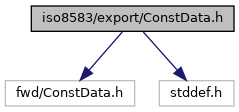
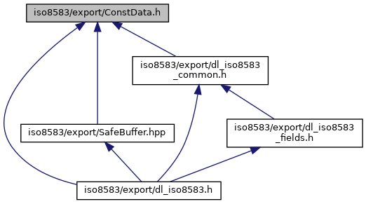

[Data Structures](#nested-classes) \| [Macros](#define-members)

Helper data types to export constant data buffers/string with its size. [More\...](#details)

`#include "fwd/ConstData.h"`
`#include <stddef.h>`

Include dependency graph for ConstData.h:

This graph shows which files directly or indirectly include this file:

<a href="_const_data_8h_source.md">Go to the source code of this file.</a>

|  |  |
|----|----|
| Data Structures |  |
| struct   | <a href="group___t_l_v_lite.md#struct_const_data__s">ConstData_s</a> |

|  |  |
|----|----|
| Macros |  |
| #define  | [ISO_EXP_DECL](#afd0131fdb432c83b6a30719f866ef15a) |
| #define  | <a href="group___t_l_v_lite.md#gac8dfb15824cad3ce1c27d6d0795d88d8">CONST_DATA_DET</a>(s)   ((s).buffer), ((s).size) |
| #define  | <a href="group___t_l_v_lite.md#ga6ce5011c9a3d1678fc8d4a6286749fc9">CONST_DATA_DET_CAST</a>(type, s)   (static_cast\<type\>(s.buffer)), ((s).size) |
| #define  | <a href="group___t_l_v_lite.md#ga2b5114f408dd03f025e0f0f433ea29ec">CONST_DATA_ARRAY_INIT</a>(arr)   {(arr), sizeof(arr)} |

## DetailedDescription {#detailed-description}

Helper data types to export constant data buffers/string with its size.

### Author

Tomasz Saniawa (<a href="#">tomas.nosp@m.z_s1.nosp@m.@veri.nosp@m.fone.nosp@m..com</a>)


Declarations are both C and C++ compatible


### Remarks

This file should be compliant with Verifone EMEA R&D C++ Coding
Standard 1.0.x

## MacroDefinition Documentation {#macro-definition-documentation}

## ISO_EXP_DECL 

#define ISO_EXP_DECL

