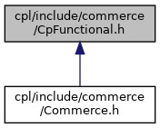

[Data Structures](#nested-classes) \| [Namespaces](#namespaces)

This graph shows which files directly or indirectly include this file:

<a href="_cp_functional_8h_source.md">Go to the source code of this file.</a>

|  |  |
|----|----|
| Data Structures |  |
| struct   | <a href="structvficpl_1_1_cp_base_fn_imp.md">CpBaseFnImp< R, A1, A2, A3 ></a> |
| struct   | <a href="structvficpl_1_1_cp_base_fn_imp_3_01_r_00_01_a1_00_01_a2_01_4.md">CpBaseFnImp< R, A1, A2 ></a> |
| struct   | <a href="structvficpl_1_1_cp_base_fn_imp_3_01_r_00_01_a1_01_4.md">CpBaseFnImp< R, A1 ></a> |
| struct   | <a href="structvficpl_1_1_cp_base_fn_imp_3_01_r_01_4.md">CpBaseFnImp< R ></a> |
| struct   | <a href="structvficpl_1_1_cp_free_fn_imp.md">CpFreeFnImp< F, R, A1, A2, A3 ></a> |
| struct   | <a href="structvficpl_1_1_cp_free_fn_imp_3_01_f_00_01_r_00_01_a1_00_01_a2_01_4.md">CpFreeFnImp< F, R, A1, A2 ></a> |
| struct   | <a href="structvficpl_1_1_cp_free_fn_imp_3_01_f_00_01_r_00_01_a1_01_4.md">CpFreeFnImp< F, R, A1 ></a> |
| struct   | <a href="structvficpl_1_1_cp_free_fn_imp_3_01_f_00_01_r_01_4.md">CpFreeFnImp< F, R ></a> |
| struct   | <a href="structvficpl_1_1_cp_member_fn_imp.md">CpMemberFnImp< M, T, R, A1, A2, A3 ></a> |
| struct   | <a href="structvficpl_1_1_cp_member_fn_imp_3_01_m_00_01_t_00_01_r_00_01_a1_00_01_a2_01_4.md">CpMemberFnImp< M, T, R, A1, A2 ></a> |
| struct   | <a href="structvficpl_1_1_cp_member_fn_imp_3_01_m_00_01_t_00_01_r_00_01_a1_01_4.md">CpMemberFnImp< M, T, R, A1 ></a> |
| struct   | <a href="structvficpl_1_1_cp_member_fn_imp_3_01_m_00_01_t_00_01_r_01_4.md">CpMemberFnImp< M, T, R ></a> |
| class   | <a href="classvficpl_1_1_cp_function.md">CpFunction< R, A1, A2, A3 ></a> |
| class   | <a href="classvficpl_1_1_cp_function_3_01_r_01_4.md">CpFunction< R ></a> |
| class   | <a href="classvficpl_1_1_cp_function_3_01_r_00_01_a1_01_4.md">CpFunction< R, A1 ></a> |
| class   | <a href="classvficpl_1_1_cp_function_3_01_r_00_01_a1_00_01_a2_01_4.md">CpFunction< R, A1, A2 ></a> |
| class   | <a href="classvficpl_1_1_cp_function.md">CpFunction< R, A1, A2, A3 ></a> |

|            |                                                  |
|------------|--------------------------------------------------|
| Namespaces |                                                  |
|            | <a href="namespacevficpl.md">vficpl</a> |
