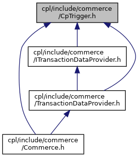

[Namespaces](#namespaces) \| [Enumerations](#enum-members)

This graph shows which files directly or indirectly include this file:

<a href="_cp_trigger_8h_source.md">Go to the source code of this file.</a>

|            |                                                  |
|------------|--------------------------------------------------|
| Namespaces |                                                  |
|            | <a href="namespacevficpl.md">vficpl</a> |

|  |  |
|----|----|
| Enumerations |  |
| enum   | <a href="namespacevficpl.md#aba55b083790f62440bcff1c23bbe2f12">CpTrigger</a> {   <a href="namespacevficpl.md#aba55b083790f62440bcff1c23bbe2f12a0c83cc2df29b61317293826c6ee3c3bb">NOTIF_IDLE</a> = 0, <a href="namespacevficpl.md#aba55b083790f62440bcff1c23bbe2f12a7d66bf00b2b1dca8764c98e307eeb515">NOTIF_MANUAL_LAUNCH</a> = 1, <a href="namespacevficpl.md#aba55b083790f62440bcff1c23bbe2f12a28ad135ffa26cbc612ad6b5a67f35738">REQUEST_CUSTOMER_IDENTIFICATION</a> = 16, <a href="namespacevficpl.md#aba55b083790f62440bcff1c23bbe2f12ac1d840abc773652f6f3794a7623aef20">NOTIF_TRX_STARTED</a> = 2,   <a href="namespacevficpl.md#aba55b083790f62440bcff1c23bbe2f12a40c848eab70a77518353ba8f697b8651">REQUEST_BASKET_ADJUSTMENT</a> = 3, <a href="namespacevficpl.md#aba55b083790f62440bcff1c23bbe2f12a1e97f9f6cda1c23da7383410a2d28723">NOTIF_BASKET_FINALIZED</a> = 4, <a href="namespacevficpl.md#aba55b083790f62440bcff1c23bbe2f12ae3f457de903c658874e4ec13451edbd0">REQUEST_LOYALTY</a> = 5, <a href="namespacevficpl.md#aba55b083790f62440bcff1c23bbe2f12afac0fd439ec03b243778d1bbeac5cf40">REQUEST_AMOUNT_ADJUSTMENT</a> = 6,   <a href="namespacevficpl.md#aba55b083790f62440bcff1c23bbe2f12a97b9f518144d0f9c9615d0216836bb35">NOTIF_AMOUNT_FINALIZED</a> = 7, <a href="namespacevficpl.md#aba55b083790f62440bcff1c23bbe2f12ac989d77f634b4dd93e6d44247c5622ef">REQUEST_ALT_PAYMENT</a> = 8, <a href="namespacevficpl.md#aba55b083790f62440bcff1c23bbe2f12a4061e229a1817948456ed525133e97a8">REQUEST_TECH_ALT_PAYMENT</a> = 17, <a href="namespacevficpl.md#aba55b083790f62440bcff1c23bbe2f12a6e9539d276d28ca7108f149b840ae05e">NOTIF_CARD_PRESENTED</a> = 9,   <a href="namespacevficpl.md#aba55b083790f62440bcff1c23bbe2f12a9c1699a9aa75d886d8527ffb3cbe956e">NOTIF_CARD_BIN_RECEIVED</a> = 10, <a href="namespacevficpl.md#aba55b083790f62440bcff1c23bbe2f12ada0fd4652c9773c4af9c1b7cc4fed3bf">REQUEST_PAYMENT_AMOUNT_ADJUSTMENT</a> = 11, <a href="namespacevficpl.md#aba55b083790f62440bcff1c23bbe2f12a171b25af4e1a59131598df4f16980904">NOTIF_AUTHORIZATION_COMPLETED</a> = 12, <a href="namespacevficpl.md#aba55b083790f62440bcff1c23bbe2f12af3df6e700a5f0c02be1c01f54b341fb0">NOTIF_PAYMENT_COMPLETED</a> = 13,   <a href="namespacevficpl.md#aba55b083790f62440bcff1c23bbe2f12a88b00393e9ec643b54ac79d79c98b079">REQUEST_RECEIPT_MANAGEMENT</a> = 14, <a href="namespacevficpl.md#aba55b083790f62440bcff1c23bbe2f12a4b08bcac62143f2549b4a99ba816cafb">NOTIF_TRX_ENDED</a> = 15 } |
|   | CpTrigger - contains all triggers used by commerce platform. <a href="namespacevficpl.md#aba55b083790f62440bcff1c23bbe2f12">More...</a>  |
