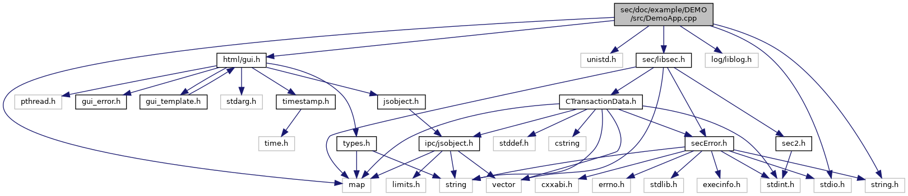

[Data Structures](#nested-classes) \| [Macros](#define-members) \| [Functions](#func-members)

Demo Application. [More\...](#details)

`#include <stdio.h>`
`#include <string.h>`
`#include <unistd.h>`
`#include <map>`
`#include <log/liblog.h>`
`#include <`<a href="gui_8h_source.md">html/gui.h</a>`>`
`#include <`<a href="libsec_8h_source.md">sec/libsec.h</a>`>`

Include dependency graph for DemoApp.cpp:

|                 |                                                |
|-----------------|------------------------------------------------|
| Data Structures |                                                |
| struct          | [ResponseFromHost](#struct_response_from_host) |

|          |                                                 |
|----------|-------------------------------------------------|
| Macros   |                                                 |
| #define  | [HOST1](#a2971da41865730e076908e0ae6757103)   1 |
| #define  | [HOST2](#a56e181a6989910c29ce3c2b3d0a7cf7a)   2 |

|  |  |
|----|----|
| Functions |  |
| std::string  | [sCard1BIN](#aa4b073f440f6c2862abf67eb5b46d194) (6, \'1\') |
| std::string  | [sCard2BIN](#ae83f72ff00a665e6ca516f5dc8cae287) (6, \'2\') |
| void  | [LOGAPI_init](#aaa25cc39a228e8195593efd0372915b7) (void) |
| bool  | [DEMO_RequestPIN](#a699416c756193ae1209f3331c89e52bd) (void) |
| void  | [DEMO_GetStatus](#a18dd623207dbc8ff071b7fa98973fd1c) (void) |
| int  | [readCardData](#ace0d2a7b66eed6e5dd9d1dc2b422ad73) (<a href="namespacecom__adksec__cmd.md#acc01edab4b0f73c92142d9d43dc7a7f7">secHandle_t</a> handle) |
| void  | [DEMO_HandlePaymentWithCard](#a59a7cd5ea075d5533e6854afe19007a6) (void) |
| void  | [DEMO_InjectKeys](#a0662130b4714f539176c568f6a5c260b) (void) |
| int  | [main](#a0ddf1224851353fc92bfbff6f499fa97) (int argc, char \*argv\[\]) |

## DetailedDescription {#detailed-description}

Demo Application.

# Demo Application 

The Demo Application performs a simple (virtual) payment transactions. Two security schemes will be used: IPP-DUKPT and VSS-MSK.

# Functionality 

Prefixed functions:

- [DEMO_GetStatus()](#a18dd623207dbc8ff071b7fa98973fd1c) - get status of security component (scapp) This function delivers information from scapp about
  - version of API and service
  - available modules (security schemes)
  - loaded VSS scripts
- [DEMO_InjectKeys()](#a0662130b4714f539176c568f6a5c260b) - key loading
  - loading DUKPT initial key and initial KSN for using IPP-DUKPT
  - loading Terminal Master Key (TMK) and session keys for using VSS-MSK

Payment functions:

- [DEMO_HandlePaymentWithCard()](#a59a7cd5ea075d5533e6854afe19007a6) - handle a payment transaction and use card data

  Following tasks are performed using IPP-DUKPT scheme:

  - read (virtual) card data PAN and BIN and put it to TD (not ADK-SEC functionality)
  - initiate PIN entry (not ADK-SEC functionality)
  - retrieve the encrypted PIN (PAN is retrieved from TD)
  - get acquirer BIN from Transaction Data (TD)

  Following tasks are performed using VSS-MSK scheme:

  - encrypt card data
  - generate the MAC of card data
  - send data to host (not ADK-SEC functionality)
  - verify a MAC

# Build the Demo Application 

Following components have to be available:

- <a href="_demo_app_8cpp.md">DemoApp.cpp</a> - Demo Application source
- sccfg.json - scapp configuration file
- TS010322.vss - VSS script for key management DUKPT

Put <a href="_demo_app_8cpp.md">DemoApp.cpp</a> in your makefile and build the DemoApp with linking one of the following libraries:

- libsec.so (shared ADK-SEC-API library) or
- libseccmd-static.a (static ADK-SEC-API library)

Convert VSS script to vso-format and create following application packages:

- Demo Application package (includes DemoApp)
- config package (incudes sccfg.json)
- VSS script package (includes TS010322.vso)

# Setup a VOS Device 

Prerequisites on the device:

- Provide following ADK components by loading the appropriate packages : liblog, libvfiipc, libguiprt, guiprtserver, libsysinfo
- Load the following ADK-SEC packages:
  - dl.sec-scapp-2.x.x.tar
  - dl.libsec-2.x.x.tar

Load the above listed application packages on the device.

# Run Demo Application 

The Demo Application is started automatically after system start.

------------------------------------------------------------------------

## DataStructure Documentation {#data-structure-documentation}

## ResponseFromHost 

struct ResponseFromHost

| Data Fields         |           |     |
|---------------------|-----------|-----|
| vector\< uint8_t \> | data      |     |
| vector\< uint8_t \> | signature |     |

## MacroDefinition Documentation {#macro-definition-documentation}

## HOST1 

#define HOST1   1

## HOST2 

#define HOST2   2

## FunctionDocumentation {#function-documentation}

## DEMO_GetStatus() 

void DEMO_GetStatus

## DEMO_HandlePaymentWithCard() 

void DEMO_HandlePaymentWithCard

## DEMO_InjectKeys() 

void DEMO_InjectKeys

## DEMO_RequestPIN() 

bool DEMO_RequestPIN

## LOGAPI_init() 

void LOGAPI_init

## main() 

int main

## readCardData() 

int readCardData

## sCard1BIN() 

std::string sCard1BIN

## sCard2BIN() 

std::string sCard2BIN

