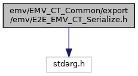
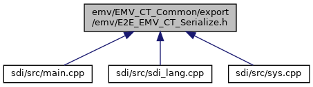

[Macros](#define-members)

`#include <stdarg.h>`

Include dependency graph for E2E_EMV_CT_Serialize.h:

This graph shows which files directly or indirectly include this file:

<a href="_e2_e___e_m_v___c_t___serialize_8h_source.md">Go to the source code of this file.</a>

|  |  |
|----|----|
| Macros |  |
| #define  | [HEADER_SIZE](#a49999be01380f41cc0d0f1f1406fb277)   (4) |
| #define  | [MAX_MESSAGE_SIZE](#acb84a306ee37479f97cf0b476560f027)   (2048) |
| #define  | [MAX_DATA_SIZE](#a87f68e96fb938eddc39ad1f19d923a96)   ([MAX_MESSAGE_SIZE](#acb84a306ee37479f97cf0b476560f027)-[HEADER_SIZE](#a49999be01380f41cc0d0f1f1406fb277)) |
| #define  | [MIN](#a3acffbd305ee72dcd4593c0d8af64a4f)(a, b)   ((a)\<(b)?(a):(b)) |
| #define  | <a href="group___e_m_v_c_o___t_a_g_s.md#ga15500b26a3968d2936b031cca37b93f2">TAG_42_ISSUER_ID</a>   0x42u |
|   | Issuer Identification Number (IIN) (**42**) used for <a href="group___a_d_k___t_r_x___e_x_e_c.md#a0c9b7f7b7001ce7a98a7a01e1276786b">EMV_CT_CANDIDATE_DATA_STRUCT::IIN</a>. <a href="group___e_m_v_c_o___t_a_g_s.md#ga15500b26a3968d2936b031cca37b93f2">More...</a>  |
| #define  | <a href="group___e_m_v_c_o___t_a_g_s.md#gaa1a0900aa13055b0b5199a8542ea2c64">TAG_4F_APP_ID</a>   0x4Fu |
|   | Application Identifier (AID) - Card (**4F**) <a href="group___e_m_v_c_o___t_a_g_s.md#gaa1a0900aa13055b0b5199a8542ea2c64">More...</a>  |
| #define  | <a href="group___e_m_v_c_o___t_a_g_s.md#ga70b6da94fde0a697b05755cdfc084023">TAG_50_APP_LABEL</a>   0x50u |
|   | Application Label (**50**) used for <a href="group___d_e_f___c_o_n_f___a_p_p_l_i.md#a1a933985680b099e926e54086a602c12">EMV_CT_APPLIDATA_STRUCT::AppName</a>, <a href="group___a_d_k___t_r_x___e_x_e_c.md#a84e55124aed375ea1277a675bff7cecf">EMV_CT_DOM_CHIP_STRUCT::ucAppName</a>, <a href="group___a_d_k___t_r_x___e_x_e_c.md#abb6b300f4e32bf0cceb25c0ce697dc93">EMV_CT_CANDIDATE_STRUCT::name</a>. <a href="group___e_m_v_c_o___t_a_g_s.md#ga70b6da94fde0a697b05755cdfc084023">More...</a>  |
| #define  | <a href="group___e_m_v_c_o___t_a_g_s.md#ga5c2e2c1e49e22fe51669eaceaa8fad9d">TAG_52_CMD_TO_PERFORM</a>   0x52u |
|   | Command to Perform (**52**) <a href="group___e_m_v_c_o___t_a_g_s.md#ga5c2e2c1e49e22fe51669eaceaa8fad9d">More...</a>  |
| #define  | <a href="group___e_m_v_c_o___t_a_g_s.md#ga2e6e79fb698c2021efe43366f6517b76">TAG_57_TRACK2_EQUIVALENT</a>   0x57u |
|   | Track 2 Equivalent Data (**57**) used as `T_57_DataTrack2` in <a href="group___a_d_k___t_r_x___e_x_e_c.md#struct_e_m_v___c_t___t_r_a_n_s_r_e_s___s_t_r_u_c_t">EMV_CT_TRANSRES_STRUCT</a>, and `puc57_track2` in <a href="adk__emv__contactless__programmers__guide_8dox.md#a591fd0f380cd390007ce78b47be923c4">EMV_CT_CALLBACK_FnT</a> (<a href="adk__emv__contactless__programmers__guide_8dox.md#ac82fa7e4064512e71e63fd647b817d97">TAG_BF06_CBK_LOCAL_CHECKS</a> ) <a href="group___e_m_v_c_o___t_a_g_s.md#ga2e6e79fb698c2021efe43366f6517b76">More...</a>  |
| #define  | <a href="group___e_m_v_c_o___t_a_g_s.md#ga4ccedb21a71fcb6ace22bac98ba548a5">TAG_5A_APP_PAN</a>   0x5Au |
|   | Application Primary Account Number (**5A**) used as `T_5A_PAN` in <a href="group___a_d_k___t_r_x___e_x_e_c.md#struct_e_m_v___c_t___t_r_a_n_s_r_e_s___s_t_r_u_c_t">EMV_CT_TRANSRES_STRUCT</a>, `puc5A_pan` in <a href="adk__emv__contactless__programmers__guide_8dox.md#a591fd0f380cd390007ce78b47be923c4">EMV_CT_CALLBACK_FnT</a> (<a href="adk__emv__contactless__programmers__guide_8dox.md#ac82fa7e4064512e71e63fd647b817d97">TAG_BF06_CBK_LOCAL_CHECKS</a> ), `puc5A_pan` in <a href="adk__emv__contactless__programmers__guide_8dox.md#a591fd0f380cd390007ce78b47be923c4">EMV_CT_CALLBACK_FnT</a> (<a href="adk__emv__contactless__programmers__guide_8dox.md#af335a870e9d2f299c848f76b843907f7">TAG_BF07_CBK_DCC</a>), and `puc5A_pan` in <a href="adk__emv__contactless__programmers__guide_8dox.md#a591fd0f380cd390007ce78b47be923c4">EMV_CT_CALLBACK_FnT</a> (<a href="adk__emv__contactless__programmers__guide_8dox.md#af335a870e9d2f299c848f76b843907f7">TAG_BF07_CBK_DCC</a>) <a href="group___e_m_v_c_o___t_a_g_s.md#ga4ccedb21a71fcb6ace22bac98ba548a5">More...</a>  |
| #define  | <a href="group___e_m_v_c_o___t_a_g_s.md#ga28d5c5d3a12cb3cf62e64ccb3e9258bc">TAG_5F20_CARDHOLDER_NAME</a>   0x5F20u |
|   | Cardholder Name (**5F20**) used as `T_5F20_Cardholder` in <a href="group___a_d_k___t_r_x___e_x_e_c.md#struct_e_m_v___c_t___t_r_a_n_s_r_e_s___s_t_r_u_c_t">EMV_CT_TRANSRES_STRUCT</a>, `puc5F24_expdate` in <a href="adk__emv__contactless__programmers__guide_8dox.md#a591fd0f380cd390007ce78b47be923c4">EMV_CT_CALLBACK_FnT</a> (<a href="adk__emv__contactless__programmers__guide_8dox.md#ac82fa7e4064512e71e63fd647b817d97">TAG_BF06_CBK_LOCAL_CHECKS</a> ), and `uc5F24_expdate` in <a href="adk__emv__contactless__programmers__guide_8dox.md#a591fd0f380cd390007ce78b47be923c4">EMV_CT_CALLBACK_FnT</a> (<a href="adk__emv__contactless__programmers__guide_8dox.md#afd0adcc12331559863dd65d8f7558645">TAG_BF05_CBK_DOM_APPS</a>) <a href="group___e_m_v_c_o___t_a_g_s.md#ga28d5c5d3a12cb3cf62e64ccb3e9258bc">More...</a>  |
| #define  | <a href="group___e_m_v_c_o___t_a_g_s.md#ga5eb2095961ebe9a91e560003f75358bb">TAG_5F24_APP_EXP_DATE</a>   0x5F24u |
|   | Application Expiration Data (**5F24**) used as `T_5F24_AppExpDate` in <a href="group___a_d_k___t_r_x___e_x_e_c.md#struct_e_m_v___c_t___t_r_a_n_s_r_e_s___s_t_r_u_c_t">EMV_CT_TRANSRES_STRUCT</a>, `puc5F24_expdate` in <a href="adk__emv__contactless__programmers__guide_8dox.md#a591fd0f380cd390007ce78b47be923c4">EMV_CT_CALLBACK_FnT</a> (<a href="adk__emv__contactless__programmers__guide_8dox.md#ac82fa7e4064512e71e63fd647b817d97">TAG_BF06_CBK_LOCAL_CHECKS</a> ), and `pucExpDate` in <a href="adk__emv__contactless__programmers__guide_8dox.md#a591fd0f380cd390007ce78b47be923c4">EMV_CT_CALLBACK_FnT</a> (<a href="adk__emv__contactless__programmers__guide_8dox.md#afd0adcc12331559863dd65d8f7558645">TAG_BF05_CBK_DOM_APPS</a>) <a href="group___e_m_v_c_o___t_a_g_s.md#ga5eb2095961ebe9a91e560003f75358bb">More...</a>  |
| #define  | <a href="group___e_m_v_c_o___t_a_g_s.md#gacd7028f61b8522799f207c7efa8e49d9">TAG_5F25_APP_EFF_DATE</a>   0x5F25u |
|   | Application Effective Data (**5F25**) used as `T_5F25_AppEffDate` in <a href="group___a_d_k___t_r_x___e_x_e_c.md#struct_e_m_v___c_t___t_r_a_n_s_r_e_s___s_t_r_u_c_t">EMV_CT_TRANSRES_STRUCT</a>. <a href="group___e_m_v_c_o___t_a_g_s.md#gacd7028f61b8522799f207c7efa8e49d9">More...</a>  |
| #define  | <a href="group___e_m_v_c_o___t_a_g_s.md#gaa35ef81cc90fe90126a537cbd611ead6">TAG_5F28_ISS_COUNTRY_CODE</a>   0x5F28u |
|   | Issuer Country Code (**5F28**) used as `T_5F28_IssCountryCode` in <a href="group___a_d_k___t_r_x___e_x_e_c.md#struct_e_m_v___c_t___t_r_a_n_s_r_e_s___s_t_r_u_c_t">EMV_CT_TRANSRES_STRUCT</a>, and `puc5F28_icc` in <a href="adk__emv__contactless__programmers__guide_8dox.md#a591fd0f380cd390007ce78b47be923c4">EMV_CT_CALLBACK_FnT</a> (<a href="adk__emv__contactless__programmers__guide_8dox.md#ac82fa7e4064512e71e63fd647b817d97">TAG_BF06_CBK_LOCAL_CHECKS</a> ) <a href="group___e_m_v_c_o___t_a_g_s.md#gaa35ef81cc90fe90126a537cbd611ead6">More...</a>  |
| #define  | <a href="group___e_m_v_c_o___t_a_g_s.md#ga369ab2cc83e9b220bdfa79753f1f3962">TAG_5F2A_TRANS_CURRENCY</a>   0x5F2Au |
|   | Transaction Currency Code (**5F2A**) Configured with `CurrencyTrans` in <a href="group___d_e_f___c_o_n_f___t_e_r_m.md#struct_e_m_v___c_t___t_e_r_m_d_a_t_a___s_t_r_u_c_t">EMV_CT_TERMDATA_STRUCT</a> (for DCC possibly in <a href="group___a_d_k___t_r_x___e_x_e_c.md#struct_e_m_v___c_t___s_e_l_e_c_t___s_t_r_u_c_t">EMV_CT_SELECT_STRUCT</a>). Used as `T_5F2A_CurrencyTrans` in <a href="group___a_d_k___t_r_x___e_x_e_c.md#struct_e_m_v___c_t___t_r_a_n_s_r_e_s___s_t_r_u_c_t">EMV_CT_TRANSRES_STRUCT</a>, `puc5F2A_tcc` in <a href="adk__emv__contactless__programmers__guide_8dox.md#a591fd0f380cd390007ce78b47be923c4">EMV_CT_CALLBACK_FnT</a> (<a href="adk__emv__contactless__programmers__guide_8dox.md#af335a870e9d2f299c848f76b843907f7">TAG_BF07_CBK_DCC</a>), and `puc5F2A_tcc` in <a href="adk__emv__contactless__programmers__guide_8dox.md#a591fd0f380cd390007ce78b47be923c4">EMV_CT_CALLBACK_FnT</a> (<a href="adk__emv__contactless__programmers__guide_8dox.md#af335a870e9d2f299c848f76b843907f7">TAG_BF07_CBK_DCC</a>) <a href="group___e_m_v_c_o___t_a_g_s.md#ga369ab2cc83e9b220bdfa79753f1f3962">More...</a>  |
| #define  | <a href="group___e_m_v_c_o___t_a_g_s.md#gaaa613c7ef00b768c88fe5cc3ee16107b">TAG_5F2D_LANGUAGE</a>   0x5F2Du |
|   | Language Preference (**5F2D**) used as `T_5F2D_Lang_Pref` in <a href="group___a_d_k___t_r_x___e_x_e_c.md#struct_e_m_v___c_t___t_r_a_n_s_r_e_s___s_t_r_u_c_t">EMV_CT_TRANSRES_STRUCT</a>. <a href="group___e_m_v_c_o___t_a_g_s.md#gaaa613c7ef00b768c88fe5cc3ee16107b">More...</a>  |
| #define  | <a href="group___e_m_v_c_o___t_a_g_s.md#gacc4c4f91bcb9bf9fef0ec1257292b93e">TAG_5F30_SERVICE_CODE</a>   0x5F30u |
|   | Service Code (**5F30**) <a href="group___e_m_v_c_o___t_a_g_s.md#gacc4c4f91bcb9bf9fef0ec1257292b93e">More...</a>  |
| #define  | <a href="group___e_m_v_c_o___t_a_g_s.md#ga17f22ccb8130cc68e45609afc6b58f00">TAG_5F34_PAN_SEQUENCE_NB</a>   0x5F34u |
|   | PAN Sequence Number (**5F34**) used as `T_5F34_PANSequenceNo` in <a href="group___a_d_k___t_r_x___e_x_e_c.md#struct_e_m_v___c_t___t_r_a_n_s_r_e_s___s_t_r_u_c_t">EMV_CT_TRANSRES_STRUCT</a>. <a href="group___e_m_v_c_o___t_a_g_s.md#ga17f22ccb8130cc68e45609afc6b58f00">More...</a>  |
| #define  | <a href="group___e_m_v_c_o___t_a_g_s.md#ga134c61ae2787b93c5def5bbf929f7cb4">TAG_5F36_TRANS_CURRENCY_EXP</a>   0x5F36u |
|   | Transaction Currency Exponent (**5F36**) Configured with `Exp_Trans` in <a href="group___d_e_f___c_o_n_f___t_e_r_m.md#struct_e_m_v___c_t___t_e_r_m_d_a_t_a___s_t_r_u_c_t">EMV_CT_TERMDATA_STRUCT</a> (for DCC possibly in <a href="group___a_d_k___t_r_x___e_x_e_c.md#struct_e_m_v___c_t___s_e_l_e_c_t___s_t_r_u_c_t">EMV_CT_SELECT_STRUCT</a>). Used as `T_5F36_Trx_Currency_Exp` in <a href="group___a_d_k___t_r_x___e_x_e_c.md#struct_e_m_v___c_t___t_r_a_n_s_r_e_s___s_t_r_u_c_t">EMV_CT_TRANSRES_STRUCT</a>, `puc5F36_tce` in <a href="adk__emv__contactless__programmers__guide_8dox.md#a591fd0f380cd390007ce78b47be923c4">EMV_CT_CALLBACK_FnT</a> (<a href="adk__emv__contactless__programmers__guide_8dox.md#af335a870e9d2f299c848f76b843907f7">TAG_BF07_CBK_DCC</a>), and `puc5F36_tce` in <a href="adk__emv__contactless__programmers__guide_8dox.md#a591fd0f380cd390007ce78b47be923c4">EMV_CT_CALLBACK_FnT</a> (<a href="adk__emv__contactless__programmers__guide_8dox.md#af335a870e9d2f299c848f76b843907f7">TAG_BF07_CBK_DCC</a>) <a href="group___e_m_v_c_o___t_a_g_s.md#ga134c61ae2787b93c5def5bbf929f7cb4">More...</a>  |
| #define  | <a href="group___e_m_v_c_o___t_a_g_s.md#ga15ecfca134c05f49a0ce50d5f0692355">TAG_5F50_ISSUER_URL</a>   0x5F50u |
|   | Issuer URL (**5F50**) <a href="group___e_m_v_c_o___t_a_g_s.md#ga15ecfca134c05f49a0ce50d5f0692355">More...</a>  |
| #define  | <a href="group___e_m_v_c_o___t_a_g_s.md#ga4c1beabb09d7dd5929f0947c3451378c">TAG_5F53_IBAN</a>   0x5F53u |
|   | International Bank Account Number (IBAN) (**5F53**) used for <a href="group___a_d_k___t_r_x___e_x_e_c.md#accc1d005f1b412f6c819f94555dbc25a">EMV_CT_CANDIDATE_DATA_STRUCT::IBAN</a>. <a href="group___e_m_v_c_o___t_a_g_s.md#ga4c1beabb09d7dd5929f0947c3451378c">More...</a>  |
| #define  | <a href="group___e_m_v_c_o___t_a_g_s.md#ga7c69e28da34f98b810cc96009ecdefe9">TAG_5F54_BIC</a>   0x5F54u |
|   | Bank Identifier Code (BIC) (**5F54**) used for <a href="group___a_d_k___t_r_x___e_x_e_c.md#ac465a1be252b46a02fce89851b6d60fb">EMV_CT_CANDIDATE_DATA_STRUCT::BIC</a>. <a href="group___e_m_v_c_o___t_a_g_s.md#ga7c69e28da34f98b810cc96009ecdefe9">More...</a>  |
| #define  | <a href="group___e_m_v_c_o___t_a_g_s.md#ga4a6770ebf323f538a78c12c78f3db783">TAG_5F55_ISSUER_COUNTRY_2</a>   0x5F55u |
|   | Issuer Country Code (alpha 2 format) (**5F55**) used for <a href="group___a_d_k___t_r_x___e_x_e_c.md#aa6458e13b23e10671e3c12ac21e69aaa">EMV_CT_CANDIDATE_DATA_STRUCT::country2</a>. <a href="group___e_m_v_c_o___t_a_g_s.md#ga4a6770ebf323f538a78c12c78f3db783">More...</a>  |
| #define  | <a href="group___e_m_v_c_o___t_a_g_s.md#gad5bedd694cd7c7658a9bdc865f542a50">TAG_5F56_ISSUER_COUNTRY_3</a>   0x5F56u |
|   | Issuer Country Code (alpha 3 format) (**5F56**) used for <a href="group___a_d_k___t_r_x___e_x_e_c.md#aab088343104c0c1631f846fa907bbc19">EMV_CT_CANDIDATE_DATA_STRUCT::country3</a>. <a href="group___e_m_v_c_o___t_a_g_s.md#gad5bedd694cd7c7658a9bdc865f542a50">More...</a>  |
| #define  | <a href="group___e_m_v_c_o___t_a_g_s.md#gad79ee95f2e225f2c320a93bb3ecca42b">TAG_5F56_ISSUER_COUNTRY_CODE</a>   0x5F56u |
|   | Issuer Country Code (**5F56**) <a href="group___e_m_v_c_o___t_a_g_s.md#gad79ee95f2e225f2c320a93bb3ecca42b">More...</a>  |
| #define  | <a href="group___e_m_v_c_o___t_a_g_s.md#ga18a257e1d8288f49eba5100e657039b6">TAG_5F57_ACCOUNT_TYPE</a>   0x5F57u |
|   | Account Type (**5F57**) <a href="group___e_m_v_c_o___t_a_g_s.md#ga18a257e1d8288f49eba5100e657039b6">More...</a>  |
| #define  | <a href="group___e_m_v_c_o___t_a_g_s.md#ga031f06652f6b1f5ede0a551c356e71b3">TAG_61_APP_TEMPLATE</a>   0x61u |
|   | Application Template (**61**) <a href="group___e_m_v_c_o___t_a_g_s.md#ga031f06652f6b1f5ede0a551c356e71b3">More...</a>  |
| #define  | <a href="group___e_m_v_c_o___t_a_g_s.md#ga9b09496d37327341a4d46ca4edf36182">TAG_6F_FCI_TEMPLATE</a>   0x6Fu |
|   | File Control Information (FCI) Template (**6F**) <a href="group___e_m_v_c_o___t_a_g_s.md#ga9b09496d37327341a4d46ca4edf36182">More...</a>  |
| #define  | <a href="group___e_m_v_c_o___t_a_g_s.md#ga125edde9dae6966577fe85d580e90403">TAG_70_AEF_DATA_TEMPLATE</a>   0x70u |
|   | AEF Data Template (**70**) <a href="group___e_m_v_c_o___t_a_g_s.md#ga125edde9dae6966577fe85d580e90403">More...</a>  |
| #define  | <a href="group___e_m_v_c_o___t_a_g_s.md#ga977d84f3059e283c2b48c22024892a53">TAG_71_ISS_SCRIPT_TPLT_1</a>   0x71u |
|   | Issuer Script Template 1 (**71**) <a href="group___e_m_v_c_o___t_a_g_s.md#ga977d84f3059e283c2b48c22024892a53">More...</a>  |
| #define  | <a href="group___e_m_v_c_o___t_a_g_s.md#ga8b38f1870f3d6cb7259759bb567315c0">TAG_72_ISS_SCRIPT_TPLT_2</a>   0x72u |
|   | Issuer Script Template 2 (**72**) <a href="group___e_m_v_c_o___t_a_g_s.md#ga8b38f1870f3d6cb7259759bb567315c0">More...</a>  |
| #define  | <a href="group___e_m_v_c_o___t_a_g_s.md#gaaa187c1d5255e009a402c6d727b4938f">TAG_73_DIR_DISCR_TEMPLATE</a>   0x73u |
|   | <a href="class_directory.md">Directory</a> Discretionary Template (**73**) <a href="group___e_m_v_c_o___t_a_g_s.md#gaaa187c1d5255e009a402c6d727b4938f">More...</a>  |
| #define  | <a href="group___e_m_v_c_o___t_a_g_s.md#ga33f61ca090446008781005b3bb12e264">TAG_77_RS_MSG_TPLT_FRMT_2</a>   0x77u |
|   | Response Message Template Format 2 (**77**) <a href="group___e_m_v_c_o___t_a_g_s.md#ga33f61ca090446008781005b3bb12e264">More...</a>  |
| #define  | <a href="group___e_m_v_c_o___t_a_g_s.md#gab8455feb7a5b1369aa97e5986745940f">TAG_80_RS_MSG_TPLT_FRMT_1</a>   0x80u |
|   | Response Message Template Format 1 (**80**) <a href="group___e_m_v_c_o___t_a_g_s.md#gab8455feb7a5b1369aa97e5986745940f">More...</a>  |
| #define  | <a href="group___e_m_v_c_o___t_a_g_s.md#ga4b82c7a87ee02736af6cd4e298c1ae13">TAG_81_BIN_AMOUNT_AUTH</a>   0x81u |
|   | Amount Authorization Binary (**81**) <a href="group___e_m_v_c_o___t_a_g_s.md#ga4b82c7a87ee02736af6cd4e298c1ae13">More...</a>  |
| #define  | <a href="group___e_m_v_c_o___t_a_g_s.md#gaa87267a7ce44cc525b3515a3549898c2">TAG_82_AIP</a>   0x82u |
|   | Application Interchange Profile (**82**) used as `T_82_AIP` in <a href="group___a_d_k___t_r_x___e_x_e_c.md#struct_e_m_v___c_t___t_r_a_n_s_r_e_s___s_t_r_u_c_t">EMV_CT_TRANSRES_STRUCT</a>. <a href="group___e_m_v_c_o___t_a_g_s.md#gaa87267a7ce44cc525b3515a3549898c2">More...</a>  |
| #define  | <a href="group___e_m_v_c_o___t_a_g_s.md#ga6a189bd2f9a0d77f24db3e88d89f5487">TAG_83_CMD_TPLT</a>   0x83u |
|   | Command Template (**83**) <a href="group___e_m_v_c_o___t_a_g_s.md#ga6a189bd2f9a0d77f24db3e88d89f5487">More...</a>  |
| #define  | <a href="group___e_m_v_c_o___t_a_g_s.md#ga69c4599943205d95394b62eef950e4c5">TAG_84_DF_NAME</a>   0x84u |
|   | Dedicated File Name (**84**) used as `T_84_DFName` in <a href="group___a_d_k___t_r_x___e_x_e_c.md#struct_e_m_v___c_t___t_r_a_n_s_r_e_s___s_t_r_u_c_t">EMV_CT_TRANSRES_STRUCT</a>. <a href="group___e_m_v_c_o___t_a_g_s.md#ga69c4599943205d95394b62eef950e4c5">More...</a>  |
| #define  | <a href="group___e_m_v_c_o___t_a_g_s.md#ga5fadc36c7f5dee1b8c89cf331ed67a46">TAG_86_ISS_SCRIPT_CMD</a>   0x86u |
|   | Issuer Script Command (**86**) <a href="group___e_m_v_c_o___t_a_g_s.md#ga5fadc36c7f5dee1b8c89cf331ed67a46">More...</a>  |
| #define  | <a href="group___e_m_v_c_o___t_a_g_s.md#gaa307388012402f6923efc2609e11fd29">TAG_87_APP_PRIORITY_ID</a>   0x87u |
|   | Application Priority Indicator (**87**) used for <a href="group___a_d_k___t_r_x___e_x_e_c.md#ae6e6847f31d7ad74362c2de216df1372">EMV_CT_CANDIDATE_DATA_STRUCT::API</a>. <a href="group___e_m_v_c_o___t_a_g_s.md#gaa307388012402f6923efc2609e11fd29">More...</a>  |
| #define  | <a href="group___e_m_v_c_o___t_a_g_s.md#ga5aea7b31fe53ca6a11f69329dac5a75c">TAG_88_SHORT_FILE_ID</a>   0x88u |
|   | Short File Identifier (SFI) (**88**) <a href="group___e_m_v_c_o___t_a_g_s.md#ga5aea7b31fe53ca6a11f69329dac5a75c">More...</a>  |
| #define  | <a href="group___e_m_v_c_o___t_a_g_s.md#ga8936aff551a261bc496fee1cc330486a">TAG_89_AUTH_CODE</a>   0x89u |
|   | Authorization Code (**89**) used as `AuthorizationCode` in <a href="group___a_d_k___t_r_x___e_x_e_c.md#struct_e_m_v___c_t___h_o_s_t___s_t_r_u_c_t">EMV_CT_HOST_STRUCT</a>. <a href="group___e_m_v_c_o___t_a_g_s.md#ga8936aff551a261bc496fee1cc330486a">More...</a>  |
| #define  | <a href="group___e_m_v_c_o___t_a_g_s.md#ga27bef53c14c4970b64ff44e4e78d20ba">TAG_8A_AUTH_RESP_CODE</a>   0x8Au |
|   | Authorization Response Code (**8A**) used as `AuthResp` in <a href="group___a_d_k___t_r_x___e_x_e_c.md#struct_e_m_v___c_t___h_o_s_t___s_t_r_u_c_t">EMV_CT_HOST_STRUCT</a>. <a href="group___e_m_v_c_o___t_a_g_s.md#ga27bef53c14c4970b64ff44e4e78d20ba">More...</a>  |
| #define  | <a href="group___e_m_v_c_o___t_a_g_s.md#ga2aac30055f056cf447f27cd31ba71d3c">TAG_8C_CDOL_1</a>   0x8Cu |
|   | CDOL 1 (**8C**) <a href="group___e_m_v_c_o___t_a_g_s.md#ga2aac30055f056cf447f27cd31ba71d3c">More...</a>  |
| #define  | <a href="group___e_m_v_c_o___t_a_g_s.md#gabd3001e707d2a1d10fcb130edc3b3d29">TAG_8D_CDOL_2</a>   0x8Du |
|   | CDOL 2 (**8D**) <a href="group___e_m_v_c_o___t_a_g_s.md#gabd3001e707d2a1d10fcb130edc3b3d29">More...</a>  |
| #define  | <a href="group___e_m_v_c_o___t_a_g_s.md#ga94548248d5f87864250eb58aa7f09907">TAG_8E_CVM_LIST</a>   0x8Eu |
|   | Cardholder Verification Method List (**8E**) <a href="group___e_m_v_c_o___t_a_g_s.md#ga94548248d5f87864250eb58aa7f09907">More...</a>  |
| #define  | <a href="group___e_m_v_c_o___t_a_g_s.md#ga3187732cabfd0142ed5023862e9f95ed">TAG_8F_CERTIF_AUTH_PK_ID</a>   0x8Fu |
|   | Certification Autority Public key Index (**8F**) <a href="group___e_m_v_c_o___t_a_g_s.md#ga3187732cabfd0142ed5023862e9f95ed">More...</a>  |
| #define  | <a href="group___e_m_v_c_o___t_a_g_s.md#ga168d90e4e8849e861c161c2a3c49a453">TAG_90_ISS_PK_CERTIF</a>   0x90u |
|   | Issuer Public Key Certificate (**90**) <a href="group___e_m_v_c_o___t_a_g_s.md#ga168d90e4e8849e861c161c2a3c49a453">More...</a>  |
| #define  | <a href="group___e_m_v_c_o___t_a_g_s.md#ga93aecd9e60fdb7fc4ab5a00fffee031b">TAG_91_ISS_AUTH_DATA</a>   0x91u |
|   | Issuer Authentication Data (**91**) used as `AuthData` in <a href="group___a_d_k___t_r_x___e_x_e_c.md#struct_e_m_v___c_t___h_o_s_t___s_t_r_u_c_t">EMV_CT_HOST_STRUCT</a>. <a href="group___e_m_v_c_o___t_a_g_s.md#ga93aecd9e60fdb7fc4ab5a00fffee031b">More...</a>  |
| #define  | <a href="group___e_m_v_c_o___t_a_g_s.md#ga5a4a55da5763dd2eead482efcb3f9f22">TAG_92_ISS_PK_REMAINDER</a>   0x92u |
|   | Issuer Public Key Remainder (**92**) <a href="group___e_m_v_c_o___t_a_g_s.md#ga5a4a55da5763dd2eead482efcb3f9f22">More...</a>  |
| #define  | <a href="group___e_m_v_c_o___t_a_g_s.md#ga9035588232752ac8152011dc9b2cf631">TAG_93_SGND_STAT_APP_DATA</a>   0x93u |
|   | Signed Static Application Data (**93**) <a href="group___e_m_v_c_o___t_a_g_s.md#ga9035588232752ac8152011dc9b2cf631">More...</a>  |
| #define  | <a href="group___e_m_v_c_o___t_a_g_s.md#ga18001e35a684a0041657e827a14ef456">TAG_94_AFL</a>   0x94u |
|   | Application File Locator (**94**) <a href="group___e_m_v_c_o___t_a_g_s.md#ga18001e35a684a0041657e827a14ef456">More...</a>  |
| #define  | <a href="group___e_m_v_c_o___t_a_g_s.md#ga3227240d53824d37d80b5f5a254daf2a">TAG_95_TVR</a>   0x95u |
|   | Terminal Verification Result (**95**) used as `T_95_TVR` in <a href="group___a_d_k___t_r_x___e_x_e_c.md#struct_e_m_v___c_t___t_r_a_n_s_r_e_s___s_t_r_u_c_t">EMV_CT_TRANSRES_STRUCT</a>. <a href="group___e_m_v_c_o___t_a_g_s.md#ga3227240d53824d37d80b5f5a254daf2a">More...</a>  |
| #define  | <a href="group___e_m_v_c_o___t_a_g_s.md#ga83a27d3f0c37cfdfe55bcd0901cb7a58">TAG_97_TDOL</a>   0x97u |
|   | TDOL (**97**) <a href="group___e_m_v_c_o___t_a_g_s.md#ga83a27d3f0c37cfdfe55bcd0901cb7a58">More...</a>  |
| #define  | <a href="group___e_m_v_c_o___t_a_g_s.md#gaab57f1b001e401de3ec7d24b90f378a7">TAG_98_TC_HASH_VALUE</a>   0x98u |
|   | Transaction Certificate Hash Value (**98**) <a href="group___e_m_v_c_o___t_a_g_s.md#gaab57f1b001e401de3ec7d24b90f378a7">More...</a>  |
| #define  | <a href="group___e_m_v_c_o___t_a_g_s.md#ga7691cae1ae03d3345deacc2300ba161e">TAG_99_TRANS_PIN_DATA</a>   0x99u |
|   | Transaction PIN Data (**99**) <a href="group___e_m_v_c_o___t_a_g_s.md#ga7691cae1ae03d3345deacc2300ba161e">More...</a>  |
| #define  | <a href="group___e_m_v_c_o___t_a_g_s.md#ga9b8dc8671fc9d3af99aefdf59659cd67">TAG_9A_TRANS_DATE</a>   0x9Au |
|   | Transaction Date (**9A**) used as `T_9A_Date` in <a href="group___a_d_k___t_r_x___e_x_e_c.md#struct_e_m_v___c_t___t_r_a_n_s_r_e_s___s_t_r_u_c_t">EMV_CT_TRANSRES_STRUCT</a>, and `Date` in <a href="group___a_d_k___t_r_x___e_x_e_c.md#struct_e_m_v___c_t___s_e_l_e_c_t___s_t_r_u_c_t">EMV_CT_SELECT_STRUCT</a>. <a href="group___e_m_v_c_o___t_a_g_s.md#ga9b8dc8671fc9d3af99aefdf59659cd67">More...</a>  |
| #define  | <a href="group___e_m_v_c_o___t_a_g_s.md#ga42e197884e26dbe7ef666d8f6881b376">TAG_9B_TSI</a>   0x9Bu |
|   | Transaction Status Information (**9B**) used as `T_9B_TSI` in <a href="group___a_d_k___t_r_x___e_x_e_c.md#struct_e_m_v___c_t___t_r_a_n_s_r_e_s___s_t_r_u_c_t">EMV_CT_TRANSRES_STRUCT</a>. <a href="group___e_m_v_c_o___t_a_g_s.md#ga42e197884e26dbe7ef666d8f6881b376">More...</a>  |
| #define  | <a href="group___e_m_v_c_o___t_a_g_s.md#ga4064d8681a4f0a40f4a3bf304f2a0902">TAG_9C_TRANS_TYPE</a>   0x9Cu |
|   | Transaction Type (**9C**) used as `TransType` in <a href="group___a_d_k___t_r_x___e_x_e_c.md#struct_e_m_v___c_t___s_e_l_e_c_t___s_t_r_u_c_t">EMV_CT_SELECT_STRUCT</a>, `T_9C_TransType` in <a href="group___a_d_k___t_r_x___e_x_e_c.md#struct_e_m_v___c_t___t_r_a_n_s_r_e_s___s_t_r_u_c_t">EMV_CT_TRANSRES_STRUCT</a>. <a href="group___e_m_v_c_o___t_a_g_s.md#ga4064d8681a4f0a40f4a3bf304f2a0902">More...</a>  |
| #define  | <a href="group___e_m_v_c_o___t_a_g_s.md#ga37efa7b9d05b931462f22fa75542845d">TAG_9D_DDF_NAME</a>   0x9Du |
|   | <a href="class_directory.md">Directory</a> Definition File Name (**9D**) <a href="group___e_m_v_c_o___t_a_g_s.md#ga37efa7b9d05b931462f22fa75542845d">More...</a>  |
| #define  | <a href="group___e_m_v_c_o___t_a_g_s.md#gaab4cf8e32535962270e6219bcbc08194">TAG_9F01_ACQ_ID</a>   0x9F01u |
|   | Acquirer Identifier (**9F01**) <a href="group___e_m_v_c_o___t_a_g_s.md#gaab4cf8e32535962270e6219bcbc08194">More...</a>  |
| #define  | <a href="group___e_m_v_c_o___t_a_g_s.md#ga6952b55733eff49c55768a6f7802f9e4">TAG_9F02_NUM_AMOUNT_AUTH</a>   0x9F02u |
|   | Amount Authorized (Numeric) (**9F02**) used as `Betrag_num` in <a href="group___a_d_k___t_r_x___e_x_e_c.md#struct_e_m_v___c_t___s_e_l_e_c_t___s_t_r_u_c_t">EMV_CT_SELECT_STRUCT</a>, `puc9F02_amount` in <a href="adk__emv__contactless__programmers__guide_8dox.md#a591fd0f380cd390007ce78b47be923c4">EMV_CT_CALLBACK_FnT</a> (<a href="adk__emv__contactless__programmers__guide_8dox.md#af335a870e9d2f299c848f76b843907f7">TAG_BF07_CBK_DCC</a>), and `puc9F02_amount` in <a href="adk__emv__contactless__programmers__guide_8dox.md#a591fd0f380cd390007ce78b47be923c4">EMV_CT_CALLBACK_FnT</a> (<a href="adk__emv__contactless__programmers__guide_8dox.md#af335a870e9d2f299c848f76b843907f7">TAG_BF07_CBK_DCC</a>) <a href="group___e_m_v_c_o___t_a_g_s.md#ga6952b55733eff49c55768a6f7802f9e4">More...</a>  |
| #define  | <a href="group___e_m_v_c_o___t_a_g_s.md#gaccc339b2226ade4b5ab935624377f800">TAG_9F03_NUM_AMOUNT_OTHER</a>   0x9F03u |
|   | Amount Other (Numeric) (**9F03**) <a href="group___e_m_v_c_o___t_a_g_s.md#gaccc339b2226ade4b5ab935624377f800">More...</a>  |
| #define  | <a href="group___e_m_v_c_o___t_a_g_s.md#ga19e6864aff86c11e64b2ba1685b2aaa0">TAG_9F04_BIN_AMOUNT_OTHER</a>   0x9F04u |
|   | Amount Other (Binary) (**9F04**) used as `T_9F06_AID` in <a href="group___a_d_k___t_r_x___e_x_e_c.md#struct_e_m_v___c_t___t_r_a_n_s_r_e_s___s_t_r_u_c_t">EMV_CT_TRANSRES_STRUCT</a>. <a href="group___e_m_v_c_o___t_a_g_s.md#ga19e6864aff86c11e64b2ba1685b2aaa0">More...</a>  |
| #define  | <a href="group___e_m_v_c_o___t_a_g_s.md#ga4bea514ddd3305a371b36e09a78bb560">TAG_9F05_APP_DISCR_DATA</a>   0x9F05u |
|   | Application Discretionary Data (**9F05**) <a href="group___e_m_v_c_o___t_a_g_s.md#ga4bea514ddd3305a371b36e09a78bb560">More...</a>  |
| #define  | <a href="group___e_m_v_c_o___t_a_g_s.md#ga7670871675627d7e74d29683fbacf01a">TAG_9F06_AID</a>   0x9F06u |
|   | Application Identifier (AID)-terminal (**9F06**) used as <a href="group___a_d_k___t_r_x___e_x_e_c.md#a01f5f1efd99e3e3be9139a95d5349941">EMV_CT_TRANSRES_STRUCT::T_9F06_AID</a> and <a href="group___a_d_k___t_r_x___e_x_e_c.md#a9169197c16d59f125de973dad0339531">EMV_CT_CANDIDATE_DATA_STRUCT::len9F06</a>. <a href="group___e_m_v_c_o___t_a_g_s.md#ga7670871675627d7e74d29683fbacf01a">More...</a>  |
| #define  | <a href="group___e_m_v_c_o___t_a_g_s.md#gacbc210315b12dab79eb6f8cc1cfe79f2">TAG_9F07_APP_USAGE_CONTROL</a>   0x9F07u |
|   | Application Usage Control (**9F07**) <a href="group___e_m_v_c_o___t_a_g_s.md#gacbc210315b12dab79eb6f8cc1cfe79f2">More...</a>  |
| #define  | <a href="group___e_m_v_c_o___t_a_g_s.md#ga49ac73f311523b949020821550b7cda8">TAG_9F08_ICC_APP_VERSION_NB</a>   0x9F08u |
|   | Application Version Number - ICC (**9F08**) used as <a href="group___a_d_k___t_r_x___e_x_e_c.md#ae24c7f2703201392ba5eaa2e0d2febd7">EMV_CT_TRANSRES_STRUCT::T_9F08_ICC_Appli_Vers_No</a>. <a href="group___e_m_v_c_o___t_a_g_s.md#ga49ac73f311523b949020821550b7cda8">More...</a>  |
| #define  | <a href="group___e_m_v_c_o___t_a_g_s.md#gac0fb6f2c9da5e835754d94e7edf4f7c2">TAG_9F09_TRM_APP_VERSION_NB</a>   0x9F09u |
|   | Application Version Number (**9F09**) used as <a href="group___d_e_f___c_o_n_f___a_p_p_l_i.md#a4a13940a43927f00f7c701cb98131588">EMV_CT_APPLIDATA_STRUCT::VerNum</a>, `T_9F09_VerNum` in <a href="group___a_d_k___t_r_x___e_x_e_c.md#struct_e_m_v___c_t___t_r_a_n_s_r_e_s___s_t_r_u_c_t">EMV_CT_TRANSRES_STRUCT</a>. <a href="group___e_m_v_c_o___t_a_g_s.md#gac0fb6f2c9da5e835754d94e7edf4f7c2">More...</a>  |
| #define  | <a href="group___e_m_v_c_o___t_a_g_s.md#gac5bdc3a443d2b32f1898d095609ec871">TAG_9F0A_ASRPD</a>   0x9F0Au |
|   | Application Selection Registered Proprietary Data (**9F0A**) EMV Specification Bulletin No. 175 (ID1, L1, V1, ID2, L2, V2, \...) ID: 2 byte, L: length, 1 byte used as <a href="group___a_d_k___t_r_x___e_x_e_c.md#a3e3bb2514827c49deb0057e9235980cc">EMV_CT_CANDIDATE_DATA_STRUCT::selData</a>. <a href="group___e_m_v_c_o___t_a_g_s.md#gac5bdc3a443d2b32f1898d095609ec871">More...</a>  |
| #define  | <a href="group___e_m_v_c_o___t_a_g_s.md#gae1a12d59719645310bdbe8c778460d8b">TAG_9F0B_CARDHOLDER_NAME_XT</a>   0x9F0Bu |
|   | Cardholder Name Extended (**9F0B**) <a href="group___e_m_v_c_o___t_a_g_s.md#gae1a12d59719645310bdbe8c778460d8b">More...</a>  |
| #define  | <a href="group___e_m_v_c_o___t_a_g_s.md#gaa2f5cfcf442860cea8e1021150b9e5c5">TAG_9F0C_ISSUER_ID_EXT</a>   0x9F0Cu |
|   | Issuer Identification Number Extended SB N°231 (**9F0C**) used for <a href="group___a_d_k___t_r_x___e_x_e_c.md#a0c9b7f7b7001ce7a98a7a01e1276786b">EMV_CT_CANDIDATE_DATA_STRUCT::IIN</a> when IIN length is 4. <a href="group___e_m_v_c_o___t_a_g_s.md#gaa2f5cfcf442860cea8e1021150b9e5c5">More...</a>  |
| #define  | <a href="group___e_m_v_c_o___t_a_g_s.md#gaf1f1b225dbba527e67b529d1b9bc0b41">TAG_9F0D_IAC_DEFAULT</a>   0x9F0Du |
|   | Issuer Action Code - Default (**9F0D**) used as `T_9F0D_IACDefault` in <a href="group___a_d_k___t_r_x___e_x_e_c.md#struct_e_m_v___c_t___t_r_a_n_s_r_e_s___s_t_r_u_c_t">EMV_CT_TRANSRES_STRUCT</a>. <a href="group___e_m_v_c_o___t_a_g_s.md#gaf1f1b225dbba527e67b529d1b9bc0b41">More...</a>  |
| #define  | <a href="group___e_m_v_c_o___t_a_g_s.md#ga56066a347d8d88263ea6340cccbae911">TAG_9F0E_IAC_DENIAL</a>   0x9F0Eu |
|   | Issuer Action Code - Denial (**9F0E**) used as `T_9F0E_IACDenial` in <a href="group___a_d_k___t_r_x___e_x_e_c.md#struct_e_m_v___c_t___t_r_a_n_s_r_e_s___s_t_r_u_c_t">EMV_CT_TRANSRES_STRUCT</a>. <a href="group___e_m_v_c_o___t_a_g_s.md#ga56066a347d8d88263ea6340cccbae911">More...</a>  |
| #define  | <a href="group___e_m_v_c_o___t_a_g_s.md#gaff475c053b8dce5ca076bc3613c3888a">TAG_9F0F_IAC_ONLINE</a>   0x9F0Fu |
|   | Issuer Action Code - Online (**9F0F**) used as `T_9F0F_IACOnline` in <a href="group___a_d_k___t_r_x___e_x_e_c.md#struct_e_m_v___c_t___t_r_a_n_s_r_e_s___s_t_r_u_c_t">EMV_CT_TRANSRES_STRUCT</a>. <a href="group___e_m_v_c_o___t_a_g_s.md#gaff475c053b8dce5ca076bc3613c3888a">More...</a>  |
| #define  | <a href="group___e_m_v_c_o___t_a_g_s.md#ga1ff0740aef66ba7bc912c7262abd86d0">TAG_9F10_ISS_APP_DATA</a>   0x9F10u |
|   | Issuer Application Data (**9F10**) used as `T_9F10_DataIssuer` in <a href="group___a_d_k___t_r_x___e_x_e_c.md#struct_e_m_v___c_t___t_r_a_n_s_r_e_s___s_t_r_u_c_t">EMV_CT_TRANSRES_STRUCT</a>. <a href="group___e_m_v_c_o___t_a_g_s.md#ga1ff0740aef66ba7bc912c7262abd86d0">More...</a>  |
| #define  | <a href="group___e_m_v_c_o___t_a_g_s.md#gaec3d1fc145f66b87ec5416b7d6cb69aa">TAG_9F11_ISS_CODE_TABLE_ID</a>   0x9F11u |
| #define  | <a href="group___e_m_v_c_o___t_a_g_s.md#gaf705ddff22734d558b161db19bf24038">TAG_9F12_APP_PREFERRED_NAME</a>   0x9F12u |
|   | Application Preferred Name (**9F12**) used as `T_9F12_PreferredName` in <a href="group___a_d_k___t_r_x___e_x_e_c.md#struct_e_m_v___c_t___s_e_l_e_c_t_r_e_s___s_t_r_u_c_t">EMV_CT_SELECTRES_STRUCT</a>. <a href="group___e_m_v_c_o___t_a_g_s.md#gaf705ddff22734d558b161db19bf24038">More...</a>  |
| #define  | <a href="group___e_m_v_c_o___t_a_g_s.md#ga657ab92f37b6da29874ecc2e40f66654">TAG_9F13_LAST_ONLINE_ATC</a>   0x9F13u |
|   | Last Online ATC Register (**9F13**) <a href="group___e_m_v_c_o___t_a_g_s.md#ga657ab92f37b6da29874ecc2e40f66654">More...</a>  |
| #define  | <a href="group___e_m_v_c_o___t_a_g_s.md#ga70f157218d7fdca32a6adea6d96d1815">TAG_9F14_LO_OFFLINE_LIMIT</a>   0x9F14u |
|   | Lower Consecutive Offline Limit (**9F14**) <a href="group___e_m_v_c_o___t_a_g_s.md#ga70f157218d7fdca32a6adea6d96d1815">More...</a>  |
| #define  | <a href="group___e_m_v_c_o___t_a_g_s.md#ga41481cf04242a0ba441c87f6a1569639">TAG_9F15_MERCH_CATEG_CODE</a>   0x9F15u |
|   | Merchant Category Code (**9F15**) used as <a href="group___d_e_f___c_o_n_f___a_p_p_l_i.md#aadaaf73921101bb812f90ec7c4a9d5dd">EMV_CT_APPLIDATA_STRUCT::BrKey</a>. <a href="group___e_m_v_c_o___t_a_g_s.md#ga41481cf04242a0ba441c87f6a1569639">More...</a>  |
| #define  | <a href="group___e_m_v_c_o___t_a_g_s.md#ga184ccaaef50ada9988bfd4af37b8c9fb">TAG_9F16_MERCHANT_ID</a>   0x9F16u |
|   | Merchant Identifier (**9F16**) used as <a href="group___d_e_f___c_o_n_f___a_p_p_l_i.md#a3e3c059a7e2f459a449ab7e746046cf7">EMV_CT_APPLIDATA_STRUCT::MerchIdent</a>, `T_9F16_MerchIdent` in <a href="group___a_d_k___t_r_x___e_x_e_c.md#struct_e_m_v___c_t___t_r_a_n_s_r_e_s___s_t_r_u_c_t">EMV_CT_TRANSRES_STRUCT</a>. <a href="group___e_m_v_c_o___t_a_g_s.md#ga184ccaaef50ada9988bfd4af37b8c9fb">More...</a>  |
| #define  | <a href="group___e_m_v_c_o___t_a_g_s.md#ga9fab68d1de5156b91a399f80ae4f0e9d">TAG_9F17_PIN_TRIES_LEFT</a>   0x9F17u |
|   | PIN Try Counter (**9F17**) <a href="group___e_m_v_c_o___t_a_g_s.md#ga9fab68d1de5156b91a399f80ae4f0e9d">More...</a>  |
| #define  | <a href="group___e_m_v_c_o___t_a_g_s.md#ga7a6c8f96bdd8a98f8122825695d6cb9b">TAG_9F18_ISS_SCRIPT_ID</a>   0x9F18u |
|   | Issuer Script Identifier (**9F18**) <a href="group___e_m_v_c_o___t_a_g_s.md#ga7a6c8f96bdd8a98f8122825695d6cb9b">More...</a>  |
| #define  | <a href="group___e_m_v_c_o___t_a_g_s.md#ga5bc987c3686fd5821f20d21015354787">TAG_9F1A_TRM_COUNTRY_CODE</a>   0x9F1Au |
|   | Terminal Country Code (**9F1A**) used as <a href="group___d_e_f___c_o_n_f___t_e_r_m.md#af11a6d7b3bb1f5438dca672b746aeb11">EMV_CT_TERMDATA_STRUCT::TermCountryCode</a>, <a href="group___d_e_f___c_o_n_f___a_p_p_l_i.md#a3cc1a7ad9805c9caf22a3164e3f1d326">EMV_CT_APPLIDATA_STRUCT::App_CountryCodeTerm</a>, and <a href="group___a_d_k___t_r_x___e_x_e_c.md#a9301d8a1bf495da0078826f0c1a981c8">EMV_CT_TRANSRES_STRUCT::T_9F1A_TermCountryCode</a>. <a href="group___e_m_v_c_o___t_a_g_s.md#ga5bc987c3686fd5821f20d21015354787">More...</a>  |
| #define  | <a href="group___e_m_v_c_o___t_a_g_s.md#gab275fa140f8e21bda8e1d0bdafe47602">TAG_9F1B_TRM_FLOOR_LIMIT</a>   0x9F1Bu |
|   | Terminal Floor Limit (**9F1B**) used as <a href="group___d_e_f___c_o_n_f___a_p_p_l_i.md#ac5fb4232c2d98685b61df7884ccfbaf5">EMV_CT_APPLIDATA_STRUCT::FloorLimit</a>, `puc9F1B_fl` in <a href="adk__emv__contactless__programmers__guide_8dox.md#a591fd0f380cd390007ce78b47be923c4">EMV_CT_CALLBACK_FnT</a> (<a href="adk__emv__contactless__programmers__guide_8dox.md#af335a870e9d2f299c848f76b843907f7">TAG_BF07_CBK_DCC</a>), and `puc9F1B_fl` in <a href="adk__emv__contactless__programmers__guide_8dox.md#a591fd0f380cd390007ce78b47be923c4">EMV_CT_CALLBACK_FnT</a> (<a href="adk__emv__contactless__programmers__guide_8dox.md#af335a870e9d2f299c848f76b843907f7">TAG_BF07_CBK_DCC</a>) <a href="group___e_m_v_c_o___t_a_g_s.md#gab275fa140f8e21bda8e1d0bdafe47602">More...</a>  |
| #define  | <a href="group___e_m_v_c_o___t_a_g_s.md#ga64f401e453e74b4ff1f727aa7cc449ac">TAG_9F1C_TRM_ID</a>   0x9F1Cu |
|   | Terminal Identification (**9F1C**) used as <a href="group___d_e_f___c_o_n_f___a_p_p_l_i.md#a9f0b41880fba4d452b3b9e7b4170a2e1">EMV_CT_APPLIDATA_STRUCT::TermIdent</a>. <a href="group___e_m_v_c_o___t_a_g_s.md#ga64f401e453e74b4ff1f727aa7cc449ac">More...</a>  |
| #define  | <a href="group___e_m_v_c_o___t_a_g_s.md#ga9d809ba2d6c28d0989f1bbffffe35a45">TAG_9F1D_TRM_RISK_MNGT_DATA</a>   0x9F1Du |
|   | Terminal Risk Management Data (**9F1D**) <a href="group___e_m_v_c_o___t_a_g_s.md#ga9d809ba2d6c28d0989f1bbffffe35a45">More...</a>  |
| #define  | <a href="group___e_m_v_c_o___t_a_g_s.md#ga1edb578c8df9ce5a55b3204cda45d198">TAG_9F1E_IFD_SERIAL_NB</a>   0x9F1Eu |
|   | Interface Device (IFD) Serial Number (**9F1E**) used as `SerNum` in <a href="group___d_e_f___c_o_n_f___t_e_r_m.md#struct_e_m_v___c_t___t_e_r_m_d_a_t_a___s_t_r_u_c_t">EMV_CT_TERMDATA_STRUCT</a>, `T_9F1E_SerNum` in <a href="group___a_d_k___t_r_x___e_x_e_c.md#struct_e_m_v___c_t___t_r_a_n_s_r_e_s___s_t_r_u_c_t">EMV_CT_TRANSRES_STRUCT</a>. <a href="group___e_m_v_c_o___t_a_g_s.md#ga1edb578c8df9ce5a55b3204cda45d198">More...</a>  |
| #define  | <a href="group___e_m_v_c_o___t_a_g_s.md#gac8f2609592cabb5c3a24b5133ac80ada">TAG_9F1F_TRACK_1_DISCR_DATA</a>   0x9F1Fu |
|   | Track 1 Discretionary Data (**9F1F**) <a href="group___e_m_v_c_o___t_a_g_s.md#gac8f2609592cabb5c3a24b5133ac80ada">More...</a>  |
| #define  | <a href="group___e_m_v_c_o___t_a_g_s.md#gab7edbeb7b44a8c24e58b717d73b2cffb">TAG_9F20_TRACK_2_DISCR_DATA</a>   0x9F20u |
|   | Track 2 Discretionary Data (**9F20**) <a href="group___e_m_v_c_o___t_a_g_s.md#gab7edbeb7b44a8c24e58b717d73b2cffb">More...</a>  |
| #define  | <a href="group___e_m_v_c_o___t_a_g_s.md#ga680a68f0ce959ac674f997968145a09c">TAG_9F21_TRANS_TIME</a>   0x9F21u |
|   | Transaction Time (**9F21**) used as `Time` in <a href="group___a_d_k___t_r_x___e_x_e_c.md#struct_e_m_v___c_t___s_e_l_e_c_t___s_t_r_u_c_t">EMV_CT_SELECT_STRUCT</a>, `T_9F21_Time` in <a href="group___a_d_k___t_r_x___e_x_e_c.md#struct_e_m_v___c_t___t_r_a_n_s_r_e_s___s_t_r_u_c_t">EMV_CT_TRANSRES_STRUCT</a>. <a href="group___e_m_v_c_o___t_a_g_s.md#ga680a68f0ce959ac674f997968145a09c">More...</a>  |
| #define  | <a href="group___e_m_v_c_o___t_a_g_s.md#ga14c698c859256684f32e839458068cd5">TAG_9F22_CERTIF_AUTH_PK_ID</a>   0x9F22u |
|   | Certification Authority Public Key Index (**9F22**) <a href="group___e_m_v_c_o___t_a_g_s.md#ga14c698c859256684f32e839458068cd5">More...</a>  |
| #define  | <a href="group___e_m_v_c_o___t_a_g_s.md#ga7b7e272aa0bc0787fa134364d0353f7a">TAG_9F23_HI_OFFLINE_LIMIT</a>   0x9F23u |
|   | Upper Consecutive Offline Limit (**9F23**) <a href="group___e_m_v_c_o___t_a_g_s.md#ga7b7e272aa0bc0787fa134364d0353f7a">More...</a>  |
| #define  | <a href="group___e_m_v_c_o___t_a_g_s.md#ga5b15a8b40aafbe917ef7aa6e10614115">TAG_9F24_PAYM_ACCOUNT_REF</a>   0x9F24u |
|   | Payment Account Reference (**9F24**) EMV Specification Bulletin No. 178, an29. <a href="group___e_m_v_c_o___t_a_g_s.md#ga5b15a8b40aafbe917ef7aa6e10614115">More...</a>  |
| #define  | <a href="group___e_m_v_c_o___t_a_g_s.md#gac5b1de965da383855ef078f7c001efe1">TAG_9F26_APP_CRYPTOGRAM</a>   0x9F26u |
|   | Application Cryptogram (**9F26**) used as `T_9F26_Cryptogramm` in <a href="group___a_d_k___t_r_x___e_x_e_c.md#struct_e_m_v___c_t___t_r_a_n_s_r_e_s___s_t_r_u_c_t">EMV_CT_TRANSRES_STRUCT</a>. <a href="group___e_m_v_c_o___t_a_g_s.md#gac5b1de965da383855ef078f7c001efe1">More...</a>  |
| #define  | <a href="group___e_m_v_c_o___t_a_g_s.md#gaa101e01de60c1261ba8324079a299e33">TAG_9F27_CRYPT_INFO_DATA</a>   0x9F27u |
|   | Cryptogram Information Data (**9F27**) used as `T_9F27_CryptInfo` in <a href="group___a_d_k___t_r_x___e_x_e_c.md#struct_e_m_v___c_t___t_r_a_n_s_r_e_s___s_t_r_u_c_t">EMV_CT_TRANSRES_STRUCT</a>. <a href="group___e_m_v_c_o___t_a_g_s.md#gaa101e01de60c1261ba8324079a299e33">More...</a>  |
| #define  | <a href="group___e_m_v_c_o___t_a_g_s.md#ga391f852dd1cd82d9e3db321d2e469fed">TAG_9F2D_ICC_PIN_PK_CERTIF</a>   0x9F2Du |
|   | ICC PIN Encipherment Public Key Certificate (**9F2D**) <a href="group___e_m_v_c_o___t_a_g_s.md#ga391f852dd1cd82d9e3db321d2e469fed">More...</a>  |
| #define  | <a href="group___e_m_v_c_o___t_a_g_s.md#gae00bfd84ee0e62edf15020fad073da0d">TAG_9F2E_ICC_PIN_PK_EXP</a>   0x9F2Eu |
|   | ICC PIN Encipherment Public Key Exponent (**9F2E**) <a href="group___e_m_v_c_o___t_a_g_s.md#gae00bfd84ee0e62edf15020fad073da0d">More...</a>  |
| #define  | <a href="group___e_m_v_c_o___t_a_g_s.md#ga851b285c89b77afb3cbaf3c2eec213ee">TAG_9F2F_ICC_PIN_PK_REMAIN</a>   0x9F2Fu |
|   | ICC PIN Encipherment Public Key Remainder (**9F2F**) <a href="group___e_m_v_c_o___t_a_g_s.md#ga851b285c89b77afb3cbaf3c2eec213ee">More...</a>  |
| #define  | <a href="group___e_m_v_c_o___t_a_g_s.md#ga795617047882a82433810ac8c329f4e7">TAG_9F32_ISS_PK_EXP</a>   0x9F32u |
|   | Issuer Public Key Exponent (**9F32**) <a href="group___e_m_v_c_o___t_a_g_s.md#ga795617047882a82433810ac8c329f4e7">More...</a>  |
| #define  | <a href="group___e_m_v_c_o___t_a_g_s.md#gad3ec876483505eb23aad4e1b210653f5">TAG_9F33_TRM_CAPABILITIES</a>   0x9F33u |
|   | Terminal Capabilities (**9F33**) used as `TermCap` in <a href="group___d_e_f___c_o_n_f___t_e_r_m.md#struct_e_m_v___c_t___t_e_r_m_d_a_t_a___s_t_r_u_c_t">EMV_CT_TERMDATA_STRUCT</a>, <a href="group___d_e_f___c_o_n_f___a_p_p_l_i.md#a7ac173f4a1d9a3845a18af806ee8bb31">EMV_CT_APPLIDATA_STRUCT::App_TermCap</a>, `T_9F33_TermCap` in <a href="group___a_d_k___t_r_x___e_x_e_c.md#struct_e_m_v___c_t___t_r_a_n_s_r_e_s___s_t_r_u_c_t">EMV_CT_TRANSRES_STRUCT</a>. <a href="group___e_m_v_c_o___t_a_g_s.md#gad3ec876483505eb23aad4e1b210653f5">More...</a>  |
| #define  | <a href="group___e_m_v_c_o___t_a_g_s.md#gabdd39eac033e163719eb2f845fffbf62">TAG_9F34_CVM_RESULTS</a>   0x9F34u |
|   | Cardholder Verification Method (CVM) Results (**9F34**) used as `T_9F34_CVM_Res` in <a href="group___a_d_k___t_r_x___e_x_e_c.md#struct_e_m_v___c_t___t_r_a_n_s_r_e_s___s_t_r_u_c_t">EMV_CT_TRANSRES_STRUCT</a>. <a href="group___e_m_v_c_o___t_a_g_s.md#gabdd39eac033e163719eb2f845fffbf62">More...</a>  |
| #define  | <a href="group___e_m_v_c_o___t_a_g_s.md#gace5b4ef50a58d29b2f5296c2c17273c9">TAG_9F35_TRM_TYPE</a>   0x9F35u |
|   | Terminal Type (**9F35**) used as `TermTyp` in <a href="group___d_e_f___c_o_n_f___t_e_r_m.md#struct_e_m_v___c_t___t_e_r_m_d_a_t_a___s_t_r_u_c_t">EMV_CT_TERMDATA_STRUCT</a>, `T_9F35_TermTyp` in <a href="group___a_d_k___t_r_x___e_x_e_c.md#struct_e_m_v___c_t___t_r_a_n_s_r_e_s___s_t_r_u_c_t">EMV_CT_TRANSRES_STRUCT</a>. <a href="group___e_m_v_c_o___t_a_g_s.md#gace5b4ef50a58d29b2f5296c2c17273c9">More...</a>  |
| #define  | <a href="group___e_m_v_c_o___t_a_g_s.md#ga776acfe7de52e4ec25163354ead04dcb">TAG_9F36_ATC</a>   0x9F36u |
|   | Application Transaction Counter (ATC) (**9F36**) used as `T_9F36_ATC` in <a href="group___a_d_k___t_r_x___e_x_e_c.md#struct_e_m_v___c_t___t_r_a_n_s_r_e_s___s_t_r_u_c_t">EMV_CT_TRANSRES_STRUCT</a>. <a href="group___e_m_v_c_o___t_a_g_s.md#ga776acfe7de52e4ec25163354ead04dcb">More...</a>  |
| #define  | <a href="group___e_m_v_c_o___t_a_g_s.md#gad08084306abcf29bb9517b75b0b5b189">TAG_9F37_UNPREDICTABLE_NB</a>   0x9F37u |
|   | Unpredictable Number (**9F37**) used as `T_9F37_RandomNumber` in <a href="group___a_d_k___t_r_x___e_x_e_c.md#struct_e_m_v___c_t___t_r_a_n_s_r_e_s___s_t_r_u_c_t">EMV_CT_TRANSRES_STRUCT</a>. <a href="group___e_m_v_c_o___t_a_g_s.md#gad08084306abcf29bb9517b75b0b5b189">More...</a>  |
| #define  | <a href="group___e_m_v_c_o___t_a_g_s.md#ga481f3da31ceffcdc7facf7a40da6a7a8">TAG_9F38_PDOL</a>   0x9F38u |
|   | Processing Options Data Object List (PDOL) (**9F38**) <a href="group___e_m_v_c_o___t_a_g_s.md#ga481f3da31ceffcdc7facf7a40da6a7a8">More...</a>  |
| #define  | <a href="group___e_m_v_c_o___t_a_g_s.md#ga52532bf55c516d8055dcba4695fdc159">TAG_9F39_POS_ENTRY_MODE</a>   0x9F39u |
|   | Point-of-Service (POS) Entry Mode (**9F39**) used as EMV_CT_APPLIDATA_STRUCT::POS_Eing, `T_9F39_POSEntryMode` in <a href="group___a_d_k___t_r_x___e_x_e_c.md#struct_e_m_v___c_t___t_r_a_n_s_r_e_s___s_t_r_u_c_t">EMV_CT_TRANSRES_STRUCT</a>. <a href="group___e_m_v_c_o___t_a_g_s.md#ga52532bf55c516d8055dcba4695fdc159">More...</a>  |
| #define  | <a href="group___e_m_v_c_o___t_a_g_s.md#ga9fb361d5d732411517cf1c33baa1ba42">TAG_9F3A_AMNT_REF_CURRENCY</a>   0x9F3Au |
|   | Amount, Reference Currency (**9F3A**) used as `Betrag_num` in <a href="group___a_d_k___t_r_x___e_x_e_c.md#struct_e_m_v___c_t___s_e_l_e_c_t___s_t_r_u_c_t">EMV_CT_SELECT_STRUCT</a>. <a href="group___e_m_v_c_o___t_a_g_s.md#ga9fb361d5d732411517cf1c33baa1ba42">More...</a>  |
| #define  | <a href="group___e_m_v_c_o___t_a_g_s.md#ga833bd7d1ca1d973bec1b42fc12c39f63">TAG_9F3B_APP_REF_CURRENCY</a>   0x9F3Bu |
|   | Application Reference Currency (**9F3B**) <a href="group___e_m_v_c_o___t_a_g_s.md#ga833bd7d1ca1d973bec1b42fc12c39f63">More...</a>  |
| #define  | <a href="group___e_m_v_c_o___t_a_g_s.md#ga5af69c050d6db276c4c9a111bd638003">TAG_9F3C_TRANS_REF_CURRENCY</a>   0x9F3Cu |
|   | Transaction Reference Currency Code (**9F3C**) In case CommonServices request this tag EMV ADK will give back same as <a href="group___e_m_v_c_o___t_a_g_s.md#ga369ab2cc83e9b220bdfa79753f1f3962">TAG_5F2A_TRANS_CURRENCY</a>. <a href="group___e_m_v_c_o___t_a_g_s.md#ga5af69c050d6db276c4c9a111bd638003">More...</a>  |
| #define  | <a href="group___e_m_v_c_o___t_a_g_s.md#gad22456b0beb48767f0f71fc0202dbddc">TAG_9F3D_TRANS_CURRENCY_EXP</a>   0x9F3Du |
|   | Transaction Reference Currency Exponent (**9F3D**) In case CommonServices request this tag EMV ADK will give back same as <a href="group___e_m_v_c_o___t_a_g_s.md#ga134c61ae2787b93c5def5bbf929f7cb4">TAG_5F36_TRANS_CURRENCY_EXP</a>. <a href="group___e_m_v_c_o___t_a_g_s.md#gad22456b0beb48767f0f71fc0202dbddc">More...</a>  |
| #define  | <a href="group___e_m_v_c_o___t_a_g_s.md#ga5670c7d223a0af749d5b8b251e32f870">TAG_9F40_ADD_TRM_CAP</a>   0x9F40u |
|   | Additional Terminal Capabilities (**9F40**) used as `TermAddCap` in <a href="group___d_e_f___c_o_n_f___t_e_r_m.md#struct_e_m_v___c_t___t_e_r_m_d_a_t_a___s_t_r_u_c_t">EMV_CT_TERMDATA_STRUCT</a>, <a href="group___d_e_f___c_o_n_f___a_p_p_l_i.md#aa137395f6cc0b7618d9fec892c3c8b00">EMV_CT_APPLIDATA_STRUCT::App_TermAddCap</a>, `T_9F40_AddTermCap` in <a href="group___a_d_k___t_r_x___e_x_e_c.md#struct_e_m_v___c_t___t_r_a_n_s_r_e_s___s_t_r_u_c_t">EMV_CT_TRANSRES_STRUCT</a>. <a href="group___e_m_v_c_o___t_a_g_s.md#ga5670c7d223a0af749d5b8b251e32f870">More...</a>  |
| #define  | <a href="group___e_m_v_c_o___t_a_g_s.md#gab382a6fa7762c3e7589ad7cf877d77fc">TAG_9F41_TRANS_SEQUENCE_NB</a>   0x9F41u |
|   | Transaction Sequence Counter (**9F41**) used as `TransCount` in <a href="group___a_d_k___t_r_x___e_x_e_c.md#struct_e_m_v___c_t___t_r_a_n_s_a_c___s_t_r_u_c_t">EMV_CT_TRANSAC_STRUCT</a>, `T_9F41_TransCount` in <a href="group___a_d_k___t_r_x___e_x_e_c.md#struct_e_m_v___c_t___t_r_a_n_s_r_e_s___s_t_r_u_c_t">EMV_CT_TRANSRES_STRUCT</a>. <a href="group___e_m_v_c_o___t_a_g_s.md#gab382a6fa7762c3e7589ad7cf877d77fc">More...</a>  |
| #define  | <a href="group___e_m_v_c_o___t_a_g_s.md#gac2b5ddfa533fc2ce2612d1f126b2ed5f">TAG_9F42_APP_CURRENCY_CODE</a>   0x9F42u |
|   | Application Currency Code (**9F42**) used as `puc9F42_acc` in <a href="adk__emv__contactless__programmers__guide_8dox.md#a591fd0f380cd390007ce78b47be923c4">EMV_CT_CALLBACK_FnT</a> (<a href="adk__emv__contactless__programmers__guide_8dox.md#af335a870e9d2f299c848f76b843907f7">TAG_BF07_CBK_DCC</a>), `puc9F42_acc` in <a href="adk__emv__contactless__programmers__guide_8dox.md#a591fd0f380cd390007ce78b47be923c4">EMV_CT_CALLBACK_FnT</a> (<a href="adk__emv__contactless__programmers__guide_8dox.md#af335a870e9d2f299c848f76b843907f7">TAG_BF07_CBK_DCC</a>) <a href="group___e_m_v_c_o___t_a_g_s.md#gac2b5ddfa533fc2ce2612d1f126b2ed5f">More...</a>  |
| #define  | <a href="group___e_m_v_c_o___t_a_g_s.md#ga4230108db4010ae0ac2b6db706eb8f5a">TAG_9F43_APP_REF_CURRCY_EXP</a>   0x9F43u |
|   | Application Reference Currency Exponent (**9F43**) <a href="group___e_m_v_c_o___t_a_g_s.md#ga4230108db4010ae0ac2b6db706eb8f5a">More...</a>  |
| #define  | <a href="group___e_m_v_c_o___t_a_g_s.md#ga4120687590bf9c322c44899b30415c3f">TAG_9F44_APP_CURRENCY_EXP</a>   0x9F44u |
|   | Application Currency Exponent (**9F44**) <a href="group___e_m_v_c_o___t_a_g_s.md#ga4120687590bf9c322c44899b30415c3f">More...</a>  |
| #define  | <a href="group___e_m_v_c_o___t_a_g_s.md#gafb250579afe8802f385c3c654980db4c">TAG_9F45_DATA_AUTHENT_CODE</a>   0x9F45u |
|   | Data Authentication Code (**9F45**) used as `T_9F45_DataAuthCode` in <a href="group___a_d_k___t_r_x___e_x_e_c.md#struct_e_m_v___c_t___t_r_a_n_s_r_e_s___s_t_r_u_c_t">EMV_CT_TRANSRES_STRUCT</a>. <a href="group___e_m_v_c_o___t_a_g_s.md#gafb250579afe8802f385c3c654980db4c">More...</a>  |
| #define  | <a href="group___e_m_v_c_o___t_a_g_s.md#ga7a894771929116e6d996a626211de03d">TAG_9F46_ICC_PK_CERTIF</a>   0x9F46u |
|   | ICC Public Key Certificate (**9F46**) <a href="group___e_m_v_c_o___t_a_g_s.md#ga7a894771929116e6d996a626211de03d">More...</a>  |
| #define  | <a href="group___e_m_v_c_o___t_a_g_s.md#ga11034b96c501139accb50579ce3695a5">TAG_9F47_ICC_PK_EXP</a>   0x9F47u |
|   | ICC Public Key Exponent (**9F47**) <a href="group___e_m_v_c_o___t_a_g_s.md#ga11034b96c501139accb50579ce3695a5">More...</a>  |
| #define  | <a href="group___e_m_v_c_o___t_a_g_s.md#ga6d18aea1c51bf6447e8006beff6357bf">TAG_9F48_ICC_PK_REMAINDER</a>   0x9F48u |
|   | ICC Public Key Remainder (**9F48**) <a href="group___e_m_v_c_o___t_a_g_s.md#ga6d18aea1c51bf6447e8006beff6357bf">More...</a>  |
| #define  | <a href="group___e_m_v_c_o___t_a_g_s.md#ga3a1c986ad7ea241d2c32a656fd2efc49">TAG_9F49_DDOL</a>   0x9F49u |
|   | Dynamic Data Authentication Data Object List (**9F49**) <a href="group___e_m_v_c_o___t_a_g_s.md#ga3a1c986ad7ea241d2c32a656fd2efc49">More...</a>  |
| #define  | <a href="group___e_m_v_c_o___t_a_g_s.md#ga37dc2d303ed0a83212ac1b0a4751d124">TAG_9F4A_SDA_TAG_LIST</a>   0x9F4Au |
|   | Static Data Authentication Tag List (**9F4A**) <a href="group___e_m_v_c_o___t_a_g_s.md#ga37dc2d303ed0a83212ac1b0a4751d124">More...</a>  |
| #define  | <a href="group___e_m_v_c_o___t_a_g_s.md#gaffa11c953890e255d8bab4aa2b0857e2">TAG_9F4B_SDA_DATA</a>   0x9F4Bu |
|   | Signed Dynamic Application Data (**9F4B**) <a href="group___e_m_v_c_o___t_a_g_s.md#gaffa11c953890e255d8bab4aa2b0857e2">More...</a>  |
| #define  | <a href="group___e_m_v_c_o___t_a_g_s.md#ga6582a8aec892abaaf7328da0a9160a1f">TAG_9F4C_ICC_DYNAMIC_NB</a>   0x9F4Cu |
|   | ICC Dynamic Number (**9F4C**) used as `T_9F4C_ICCDynNumber` in <a href="group___a_d_k___t_r_x___e_x_e_c.md#struct_e_m_v___c_t___t_r_a_n_s_r_e_s___s_t_r_u_c_t">EMV_CT_TRANSRES_STRUCT</a>. <a href="group___e_m_v_c_o___t_a_g_s.md#ga6582a8aec892abaaf7328da0a9160a1f">More...</a>  |
| #define  | <a href="group___e_m_v_c_o___t_a_g_s.md#gac3a7de1661225ab41a4529b68d1fda71">TAG_9F4E_TAC_MERCHANTLOC</a>   0x9F4Eu |
|   | Merchant name and location (VISA VCPS 2.1.1) (**9F4E**) <a href="group___e_m_v_c_o___t_a_g_s.md#gac3a7de1661225ab41a4529b68d1fda71">More...</a>  |
| #define  | <a href="group___e_m_v_c_o___t_a_g_s.md#gab03193acf8a5a09e20e9cf2478713bf4">TAG_A5_FCI_PROPR_TPLT</a>   0xA5u |
|   | FCI Proprietary Template (**A5**) <a href="group___e_m_v_c_o___t_a_g_s.md#gab03193acf8a5a09e20e9cf2478713bf4">More...</a>  |
| #define  | <a href="group___e_m_v_c_o___t_a_g_s.md#ga87cf97daaa2f8375a36dd08318cdb38d">TAG_BF0C_FCI_ISS_DISCR</a>   0xBF0Cu |
|   | FCI Issuer Discretionary Data (**BF0C**) <a href="group___e_m_v_c_o___t_a_g_s.md#ga87cf97daaa2f8375a36dd08318cdb38d">More...</a>  |
| #define  | <a href="group___m_c___t_a_g_s.md#ga47396b01e28e3eadd46f0f1a5f79662e">TAG_9F53_TRANS_CATEGORY_CODE</a>   0x9F53 |
|   | Transaction Category Code, 1 byte binary. <a href="group___m_c___t_a_g_s.md#ga47396b01e28e3eadd46f0f1a5f79662e">More...</a>  |
| #define  | <a href="group___v_e_r_i___c_o_n_s_t_r___t_a_g_s.md#gafc9636e2e6f07e6711a527883900e61c">TAG_E2_FORMAT_B</a>   0xE2 |
|   | Data objects with format \"b\" Used for EMV_CT_APPLIDATA_STRUCT::Additional_Tags. <a href="group___v_e_r_i___c_o_n_s_t_r___t_a_g_s.md#gafc9636e2e6f07e6711a527883900e61c">More...</a>  |
| #define  | <a href="group___v_e_r_i___c_o_n_s_t_r___t_a_g_s.md#ga921898c1164e3bcb44ca2a78bd28bf5a">TAG_E3_FORMAT_N</a>   0xE3 |
|   | Data objects with format \"n\" Used for EMV_CT_APPLIDATA_STRUCT::Additional_Tags. <a href="group___v_e_r_i___c_o_n_s_t_r___t_a_g_s.md#ga921898c1164e3bcb44ca2a78bd28bf5a">More...</a>  |
| #define  | <a href="group___v_e_r_i___c_o_n_s_t_r___t_a_g_s.md#ga6b04aad1b0a3d5fe14fc86f12b6ca2c6">TAG_E4_FORMAT_CN</a>   0xE4 |
|   | Data objects with format \"cn\" Used for EMV_CT_APPLIDATA_STRUCT::Additional_Tags. <a href="group___v_e_r_i___c_o_n_s_t_r___t_a_g_s.md#ga6b04aad1b0a3d5fe14fc86f12b6ca2c6">More...</a>  |
| #define  | <a href="group___v_e_r_i___c_o_n_s_t_r___t_a_g_s.md#gab684ebc7f6bfb422d1af2d1985563014">TAG_E5_FORMAT_A</a>   0xE5 |
|   | Data objects with format \"a\" Used for EMV_CT_APPLIDATA_STRUCT::Additional_Tags. <a href="group___v_e_r_i___c_o_n_s_t_r___t_a_g_s.md#gab684ebc7f6bfb422d1af2d1985563014">More...</a>  |
| #define  | <a href="group___v_e_r_i___c_o_n_s_t_r___t_a_g_s.md#ga6beb5c015ec1d897ac240bafe1ed9a53">TAG_E6_FORMAT_AN</a>   0xE6 |
|   | Data objects with format \"an\" Used for EMV_CT_APPLIDATA_STRUCT::Additional_Tags. <a href="group___v_e_r_i___c_o_n_s_t_r___t_a_g_s.md#ga6beb5c015ec1d897ac240bafe1ed9a53">More...</a>  |
| #define  | <a href="group___v_e_r_i___c_o_n_s_t_r___t_a_g_s.md#gaebdbe25c32f1af5298ac17278c9af80a">TAG_E7_FORMAT_ANS</a>   0xE7 |
|   | Data objects with format \"ans\" Used for EMV_CT_APPLIDATA_STRUCT::Additional_Tags. <a href="group___v_e_r_i___c_o_n_s_t_r___t_a_g_s.md#gaebdbe25c32f1af5298ac17278c9af80a">More...</a>  |
| #define  | <a href="group___v_e_r_i___c_o_n_s_t_r___t_a_g_s.md#ga08c17dcb68a90b0a1916a713c3d33219">TAG_F0_EMV_TEMPLATE</a>   0xF0 |
|   | All BER TLV streams are packed in this tag. <a href="group___v_e_r_i___c_o_n_s_t_r___t_a_g_s.md#ga08c17dcb68a90b0a1916a713c3d33219">More...</a>  |
| #define  | <a href="group___v_e_r_i___c_o_n_s_t_r___t_a_g_s.md#ga4867cbd479109dca0043fac71180f63e">TAG_DOM_CHIP</a>   0xFF01 |
|   | constructed tag for domestic chip applications <a href="group___v_e_r_i___c_o_n_s_t_r___t_a_g_s.md#ga4867cbd479109dca0043fac71180f63e">More...</a>  |
| #define  | <a href="group___v_e_r_i___c_o_n_s_t_r___t_a_g_s.md#ga6d9fe9c9623eb1558647e7c5913e11a5">TAG_FALLBACK_MSR</a>   0xFF02 |
|   | constructed tag for MSR data <a href="group___v_e_r_i___c_o_n_s_t_r___t_a_g_s.md#ga6d9fe9c9623eb1558647e7c5913e11a5">More...</a>  |
| #define  | <a href="group___v_e_r_i___c_o_n_s_t_r___t_a_g_s.md#ga6ac06f1d6d42a5e163c1be8d5323e7d6">TAG_CAND_LIST</a>   0xFF03 |
|   | constructed tag for candidate list, used for EMV_CT_CANDIDATE_TYPE, <a href="group___a_d_k___t_r_x___e_x_e_c.md#struct_e_m_v___c_t___cand_list_type">EMV_CT_CandListType</a> and within EMV_CT_updateTxnTags <a href="group___v_e_r_i___c_o_n_s_t_r___t_a_g_s.md#ga6ac06f1d6d42a5e163c1be8d5323e7d6">More...</a>  |
| #define  | <a href="group___v_e_r_i___c_o_n_s_t_r___t_a_g_s.md#ga9808b602dc1ad05f05054f288e80099e">TAG_KEY</a>   0xFF04 |
|   | constructed tag for CAP keys <a href="group___v_e_r_i___c_o_n_s_t_r___t_a_g_s.md#ga9808b602dc1ad05f05054f288e80099e">More...</a>  |
| #define  | <a href="group___v_e_r_i___p_r_i_m___t_a_g_s.md#ga1b30281b8c35ec19eff77088f39e3cc4">TAG_ISO_DATA</a>   0xDF01 |
|   | Tag for ISO data. <a href="group___v_e_r_i___p_r_i_m___t_a_g_s.md#ga1b30281b8c35ec19eff77088f39e3cc4">More...</a>  |
| #define  | <a href="group___v_e_r_i___p_r_i_m___t_a_g_s.md#gaee4e6d6b052dc25dce9ae63c41589ddd">TAG_TRACE</a>   0xDF02 |
|   | Tag for trace data. <a href="group___v_e_r_i___p_r_i_m___t_a_g_s.md#gaee4e6d6b052dc25dce9ae63c41589ddd">More...</a>  |
| #define  | <a href="group___v_e_r_i___p_r_i_m___t_a_g_s.md#ga59feef5f17f1c83a7a519e4d5857319d">TAG_KEY_NUMBER</a>   0xDF03 |
|   | CAP Key Number of Keys, 1 byte 0\...255. <a href="group___v_e_r_i___p_r_i_m___t_a_g_s.md#ga59feef5f17f1c83a7a519e4d5857319d">More...</a>  |
| #define  | <a href="group___v_e_r_i___p_r_i_m___t_a_g_s.md#ga939333f4c5c2e500beb9b06d6939fb23">TAG_DF04_AID</a>   0xDF04 |
|   | used for <a href="group___a_d_k___t_r_x___e_x_e_c.md#aac77c93f15db4cc050d669a9bb637950">EMV_CT_CANDIDATE_STRUCT::candidate</a>, AID in <a href="_e_m_v___c_t___interface_8h.md#struct_e_m_v___c_t___a_p_p_l_i___s_t_r_u_c_t">EMV_CT_APPLI_STRUCT</a>, TRM_GetAppliData(), TRM_SelAppli(), TRM_ReduceCandidateList() <a href="group___v_e_r_i___p_r_i_m___t_a_g_s.md#ga939333f4c5c2e500beb9b06d6939fb23">More...</a>  |
| #define  | <a href="group___v_e_r_i___p_r_i_m___t_a_g_s.md#gac04d740e116d581a24faa0380290a295">TAG_DF05_BUILD_APPLILIST</a>   0xDF05 |
|   | <a href="group___a_d_k___t_r_x___e_x_e_c.md#a50ed6530cd7bb4e149f0068a07c65dc5">EMV_CT_SELECT_STRUCT::InitTXN_Buildlist</a>. <a href="group___v_e_r_i___p_r_i_m___t_a_g_s.md#gac04d740e116d581a24faa0380290a295">More...</a>  |
| #define  | <a href="group___v_e_r_i___p_r_i_m___t_a_g_s.md#ga587dd4015878756c25a1d9ffebf0d1c5">TAG_DF06_CARDREADER_NUM</a>   0xDF06 |
|   | L1 reader options `ucOptions` in <a href="group___f_u_n_c___i_c_c.md#ga728923e6e6be8867cf954b7c8d4414d5">EMV_CT_SmartISO()</a> <a href="group___v_e_r_i___p_r_i_m___t_a_g_s.md#ga587dd4015878756c25a1d9ffebf0d1c5">More...</a>  |
| #define  | <a href="group___v_e_r_i___p_r_i_m___t_a_g_s.md#ga8533e1a9308749a3662b9303eb1c2bb3">TAG_DF07_UNCRIT_SCR</a>   0xDF07 |
|   | Script results of uncritical scripts in response to <a href="group___f_u_n_c___f_l_o_w.md#ga42f570d2b8e66841ab9e8de7736e92d4">EMV_CT_ContinueOnline()</a> <a href="group___a_d_k___t_r_x___e_x_e_c.md#a417f9968c3b4dc520fcb789d4b9d66d0">EMV_CT_SRCRIPTRES_TYPE::ScriptUnCritResult</a>. <a href="group___v_e_r_i___p_r_i_m___t_a_g_s.md#ga8533e1a9308749a3662b9303eb1c2bb3">More...</a>  |
| #define  | <a href="group___v_e_r_i___p_r_i_m___t_a_g_s.md#ga16d3cf0ff996313b8a4bfa9457273e44">TAG_DF08_CRIT_SCR</a>   0xDF08 |
|   | Script results of critical scripts in response to <a href="group___f_u_n_c___f_l_o_w.md#ga42f570d2b8e66841ab9e8de7736e92d4">EMV_CT_ContinueOnline()</a> <a href="group___a_d_k___t_r_x___e_x_e_c.md#a3d3f1827bcce20060ccc4413b3a12f40">EMV_CT_SRCRIPTRES_TYPE::ScriptCritResult</a>. <a href="group___v_e_r_i___p_r_i_m___t_a_g_s.md#ga16d3cf0ff996313b8a4bfa9457273e44">More...</a>  |
| #define  | <a href="group___v_e_r_i___p_r_i_m___t_a_g_s.md#ga7b2bdd988a89e21cd04afe12a30c0ddf">TAG_KEY_INDEX</a>   0xDF09 |
|   | CAP Key Index `Tag`, `Struct`, `XML` Reference: TLV tag <a href="group___v_e_r_i___p_r_i_m___t_a_g_s.md#ga7b2bdd988a89e21cd04afe12a30c0ddf">TAG_KEY_INDEX</a>, Index in <a href="group___d_e_f___c_a_r_d___c_o_n_f.md#ac24ea04d0a0218723498d1632c6875a9">EMV_CT_CAPKEY_STRUCT::Index</a>, XML Tag: <a href="group___a_d_k___x_m_l___t_a_g_s.md#ga2564b8002f03295e157b242ad2efa950">XML_TAG_CAP_KEYS_INDEX</a>. <a href="group___v_e_r_i___p_r_i_m___t_a_g_s.md#ga7b2bdd988a89e21cd04afe12a30c0ddf">More...</a>  |
| #define  | <a href="group___v_e_r_i___p_r_i_m___t_a_g_s.md#ga0c86b48955a7de5b01796ece1dd8157b">TAG_KEY_RID</a>   0xDF0A |
|   | CAP Key RID `Tag`, `Struct`, `XML` Reference: TLV tag <a href="group___v_e_r_i___p_r_i_m___t_a_g_s.md#ga0c86b48955a7de5b01796ece1dd8157b">TAG_KEY_RID</a>, RID in <a href="group___d_e_f___c_a_r_d___c_o_n_f.md#a7d507a69b2eb69015b1ced0f4c4d47fd">EMV_CT_CAPKEY_STRUCT::RID</a>, XML Tag: <a href="group___a_d_k___x_m_l___t_a_g_s.md#ga2acfa293c67d4c30b81f26f1fc51f677">XML_TAG_CAP_KEYS_RID</a>. <a href="group___v_e_r_i___p_r_i_m___t_a_g_s.md#ga0c86b48955a7de5b01796ece1dd8157b">More...</a>  |
| #define  | <a href="group___v_e_r_i___p_r_i_m___t_a_g_s.md#gaf84423fc102deeb813ec75aa301facca">TAG_KEY_KEY</a>   0xDF0B |
|   | CAP Key Modulus `Tag`, `Struct`, `XML` Reference: TLV tag <a href="group___v_e_r_i___p_r_i_m___t_a_g_s.md#gaf84423fc102deeb813ec75aa301facca">TAG_KEY_KEY</a>, Key in <a href="group___d_e_f___c_a_r_d___c_o_n_f.md#a0a3543353678a64e265f8d5a817c52db">EMV_CT_CAPKEY_STRUCT::Key</a>, XML Tag: <a href="group___a_d_k___x_m_l___t_a_g_s.md#ga151215aa136d44cb12e3ea1d392c744f">XML_TAG_CAP_KEYS_KEY</a>. <a href="group___v_e_r_i___p_r_i_m___t_a_g_s.md#gaf84423fc102deeb813ec75aa301facca">More...</a>  |
| #define  | <a href="group___v_e_r_i___p_r_i_m___t_a_g_s.md#gac037a26b7d73563286fb125d59f1265d">TAG_KEY_HASH</a>   0xDF0C |
|   | CAP Key Hash `Tag`, `Struct`, `XML` Reference: TLV tag <a href="group___v_e_r_i___p_r_i_m___t_a_g_s.md#gac037a26b7d73563286fb125d59f1265d">TAG_KEY_HASH</a>, Hash in <a href="group___d_e_f___c_a_r_d___c_o_n_f.md#aa04067e88f6cfe9465c0a92f7233ebee">EMV_CT_CAPKEY_STRUCT::Hash</a>, XML Tag: <a href="group___a_d_k___x_m_l___t_a_g_s.md#gad6a0497d2964a67cec810ea12c8279a1">XML_TAG_CAP_KEYS_HASH</a>. <a href="group___v_e_r_i___p_r_i_m___t_a_g_s.md#gac037a26b7d73563286fb125d59f1265d">More...</a>  |
| #define  | <a href="group___v_e_r_i___p_r_i_m___t_a_g_s.md#ga3301dc858f4033e7100dae7d71a7e1e0">TAG_KEY_EXPONENT</a>   0xDF0D |
|   | CAP Key Exponent `Tag`, `Struct`, `XML` Reference: TLV tag <a href="group___v_e_r_i___p_r_i_m___t_a_g_s.md#ga3301dc858f4033e7100dae7d71a7e1e0">TAG_KEY_EXPONENT</a>, Exponent in <a href="group___d_e_f___c_a_r_d___c_o_n_f.md#a65d7fb542cdae2f7104b266bbe3ac9b2">EMV_CT_CAPKEY_STRUCT::Exponent</a>, XML Tag: <a href="group___a_d_k___x_m_l___t_a_g_s.md#ga19533a461456afae8eb33ee784fd361b">XML_TAG_CAP_KEYS_EXPONENT</a>. <a href="group___v_e_r_i___p_r_i_m___t_a_g_s.md#ga3301dc858f4033e7100dae7d71a7e1e0">More...</a>  |
| #define  | <a href="group___v_e_r_i___p_r_i_m___t_a_g_s.md#gae92f2b4a70d0c2217bdcc751106477d1">TAG_KEY_CRL</a>   0xDF0E |
|   | CAP Key Certification Revocation List `Tag`, `Struct`, `XML` Reference: TLV tag <a href="group___v_e_r_i___p_r_i_m___t_a_g_s.md#gae92f2b4a70d0c2217bdcc751106477d1">TAG_KEY_CRL</a>, RevocEntries in <a href="group___d_e_f___c_a_r_d___c_o_n_f.md#aad05155fcd539c313f48260d8ebd2f76">EMV_CT_CAPKEY_STRUCT::RevocEntries</a>, XML Tag: <a href="group___a_d_k___x_m_l___t_a_g_s.md#ga1e433908dd992082b5a252f39d60f45d">XML_TAG_CAP_KEYS_REVOC_LIST</a>. <a href="group___v_e_r_i___p_r_i_m___t_a_g_s.md#gae92f2b4a70d0c2217bdcc751106477d1">More...</a>  |
| #define  | <a href="group___v_e_r_i___p_r_i_m___t_a_g_s.md#ga6f8f8ac35965ec091b3d1a3f4a4efe8d">TAG_DF11_LIB_VERSION</a>   0xDF11 |
|   | Library version given back from <a href="group___f_u_n_c___c_o_n_f.md#ga954c82bc82203115b10fcab356df0079">EMV_CT_GetTermData()</a> `Tag`, `Struct`, `XML` Reference: TLV tag <a href="group___v_e_r_i___p_r_i_m___t_a_g_s.md#ga6f8f8ac35965ec091b3d1a3f4a4efe8d">TAG_DF11_LIB_VERSION</a>, FrameworkVersion in <a href="group___d_e_f___c_o_n_f___t_e_r_m.md#a15d10a5c739bb6c45d9d0bf3f40c0021">EMV_CT_TERMDATA_STRUCT::FrameworkVersion</a>, XML Tag: <a href="group___a_d_k___x_m_l___t_a_g_s.md#ga7466ea82a873f9b06da23f703c800a17">XML_TAG_TERMDATA_FRAMEWORK_VERSION</a>. <a href="group___v_e_r_i___p_r_i_m___t_a_g_s.md#ga6f8f8ac35965ec091b3d1a3f4a4efe8d">More...</a>  |
| #define  | <a href="group___v_e_r_i___p_r_i_m___t_a_g_s.md#gaf795532d38b6fd7fe5e4b9aeeda03a58">TAG_DF12_CHECKSUM</a>   0xDF12 |
|   | EMVCo checksum given back from <a href="group___f_u_n_c___c_o_n_f.md#ga954c82bc82203115b10fcab356df0079">EMV_CT_GetTermData()</a> `Tag`, `Struct`, `XML` Reference: TLV tag <a href="group___v_e_r_i___p_r_i_m___t_a_g_s.md#gaf795532d38b6fd7fe5e4b9aeeda03a58">TAG_DF12_CHECKSUM</a>, ChksumASCIIEMVCO in <a href="group___d_e_f___c_o_n_f___a_p_p_l_i.md#ae6aab5905479e56d87c421779d57b603">EMV_CT_APPLIDATA_STRUCT::ChksumASCIIEMVCO</a>, XML Tag: <a href="group___a_d_k___x_m_l___t_a_g_s.md#ga9916553d54022e9ff269b4d9e82f7658">XML_TAG_APPLIDATA_CHKSUM_ASCII_EMVCO</a>. <a href="group___v_e_r_i___p_r_i_m___t_a_g_s.md#gaf795532d38b6fd7fe5e4b9aeeda03a58">More...</a>  |
| #define  | <a href="group___v_e_r_i___p_r_i_m___t_a_g_s.md#ga8d1957a446ea91132fb417a0d8d0cd87">TAG_DF13_TERM_PARAM</a>   0xDF13 |
|   | used for <a href="group___d_e_f___c_o_n_f___a_p_p_l_i.md#a906f3a211340298f467942b94e57010e">EMV_CT_APPLIDATA_STRUCT::Chksum_Params</a> <a href="group___v_e_r_i___p_r_i_m___t_a_g_s.md#ga8d1957a446ea91132fb417a0d8d0cd87">More...</a>  |
| #define  | <a href="group___v_e_r_i___p_r_i_m___t_a_g_s.md#ga3b649f2c9db2c72312623c1e45857243">TAG_DF14_ADD_TAGS_RES</a>   0xDF14 |
| #define  | <a href="group___v_e_r_i___p_r_i_m___t_a_g_s.md#gaa32dcaf965a2b7811278930e36be20af">TAG_DF15_OFFL_ONLY_PROCESS</a>   0xDF15 |
|   | used for EMV_CT_APPLIDATA_STRUCT::ucAC_before_after <a href="group___v_e_r_i___p_r_i_m___t_a_g_s.md#gaa32dcaf965a2b7811278930e36be20af">More...</a>  |
| #define  | <a href="group___v_e_r_i___p_r_i_m___t_a_g_s.md#gaae9648dee8748715de2de847955929f5">TAG_KEY_KEYLEN</a>   0xDF16 |
|   | CAP Key key length `Struct`, `XML` Reference: KeyLen in <a href="group___d_e_f___c_a_r_d___c_o_n_f.md#aeb6f1a41fb682dc06cfdc1d0c1bef18f">EMV_CT_CAPKEY_STRUCT::KeyLen</a>, XML Tag: <a href="group___a_d_k___x_m_l___t_a_g_s.md#ga94a87250bc33e6e85a09285f832fbfd9">XML_TAG_CAP_KEYS_KEYLEN</a>. <a href="group___v_e_r_i___p_r_i_m___t_a_g_s.md#gaae9648dee8748715de2de847955929f5">More...</a>  |
| #define  | <a href="group___v_e_r_i___p_r_i_m___t_a_g_s.md#gab4411c93fc374647cf05eac373bd9752">TAG_DF17_FALLBACK_MIDS</a>   0xDF17 |
|   | used for <a href="group___d_e_f___c_o_n_f___a_p_p_l_i.md#afe1309924816c148ef5665647e4b3f53">EMV_CT_APPLIDATA_STRUCT::tucFallbackMIDs</a> <a href="group___v_e_r_i___p_r_i_m___t_a_g_s.md#gab4411c93fc374647cf05eac373bd9752">More...</a>  |
| #define  | <a href="group___v_e_r_i___p_r_i_m___t_a_g_s.md#gaa606116b376f0e89c618e5477bb1e351">TAG_DF18_FALLABCK</a>   0xDF18 |
|   | tag for <a href="group___d_e_f___c_o_n_f___a_p_p_l_i.md#a9d0d4cedf99a248f40af087fdfa40b51">EMV_CT_APPLIDATA_STRUCT::uc_FallBack_Handling</a> <a href="group___v_e_r_i___p_r_i_m___t_a_g_s.md#gaa606116b376f0e89c618e5477bb1e351">More...</a>  |
| #define  | <a href="group___v_e_r_i___p_r_i_m___t_a_g_s.md#gaf19333fd4e33f5bb3092c61ea2c72ab1">TAG_DF19_PARAMETER_4</a>   0xDF19 |
|   | RFU. <a href="group___v_e_r_i___p_r_i_m___t_a_g_s.md#gaf19333fd4e33f5bb3092c61ea2c72ab1">More...</a>  |
| #define  | <a href="group___v_e_r_i___p_r_i_m___t_a_g_s.md#gab6d44f4c0940dd6d574a03820b2673dc">TAG_DF1C_SPECIAL_TRX</a>   0xDF1C |
|   | tag for <a href="group___d_e_f___c_o_n_f___a_p_p_l_i.md#ab10831fed2998962919365d261912869">EMV_CT_APPLIDATA_STRUCT::xuc_Special_TRX</a> <a href="group___v_e_r_i___p_r_i_m___t_a_g_s.md#gab6d44f4c0940dd6d574a03820b2673dc">More...</a>  |
| #define  | <a href="group___v_e_r_i___p_r_i_m___t_a_g_s.md#ga932e21a3b1b113c5eafd8abd4715bab4">TAG_DF1D_PRIO_APPLI</a>   0xDF1D |
|   | each element of <a href="group___d_e_f___c_o_n_f___a_p_p_l_i.md#aafdd60748ec764b0398657d3a87e0d19">EMV_CT_APPLIDATA_STRUCT::xAIDPrio</a> is packed in this tag <a href="group___v_e_r_i___p_r_i_m___t_a_g_s.md#ga932e21a3b1b113c5eafd8abd4715bab4">More...</a>  |
| #define  | <a href="group___v_e_r_i___p_r_i_m___t_a_g_s.md#ga3ec6eef8ef2baf5298bba904c5339614">TAG_DF20_ASI</a>   0xDF20 |
|   | used for <a href="group___d_e_f___c_o_n_f___a_p_p_l_i.md#a2000688e48cdadee86eb401946a71785">EMV_CT_APPLIDATA_STRUCT::ASI</a>, <a href="group___a_d_k___t_r_x___e_x_e_c.md#af42b69931936623d5f7be16828a20921">EMV_CT_DOM_CHIP_STRUCT::ucASI</a> <a href="group___v_e_r_i___p_r_i_m___t_a_g_s.md#ga3ec6eef8ef2baf5298bba904c5339614">More...</a>  |
| #define  | <a href="group___v_e_r_i___p_r_i_m___t_a_g_s.md#ga313084d02966bb6075d6a07b5e227ac3">TAG_DF21_TAC_DENIAL</a>   0xDF21 |
|   | see <a href="group___d_e_f___c_o_n_f___a_p_p_l_i.md#ab4a00313a90f392f78eb7517a136aae6">EMV_CT_APPLIDATA_STRUCT::TACDenial</a> and <a href="group___a_d_k___t_r_x___e_x_e_c.md#struct_e_m_v___c_t___t_r_a_n_s_r_e_s___s_t_r_u_c_t">EMV_CT_TRANSRES_STRUCT</a> also used for callback <a href="adk__emv__contactless__programmers__guide_8dox.md#a591fd0f380cd390007ce78b47be923c4">EMV_CT_CALLBACK_FnT</a> (<a href="adk__emv__contactless__programmers__guide_8dox.md#afd0adcc12331559863dd65d8f7558645">TAG_BF05_CBK_DOM_APPS</a>) <a href="group___v_e_r_i___p_r_i_m___t_a_g_s.md#ga313084d02966bb6075d6a07b5e227ac3">More...</a>  |
| #define  | <a href="group___v_e_r_i___p_r_i_m___t_a_g_s.md#ga0648261008c103074456b3c4bc431a66">TAG_DF21_TAC_ABLEHNUNG</a>   <a href="group___v_e_r_i___p_r_i_m___t_a_g_s.md#ga313084d02966bb6075d6a07b5e227ac3">TAG_DF21_TAC_DENIAL</a> |
| #define  | <a href="group___v_e_r_i___p_r_i_m___t_a_g_s.md#ga8300df6d32eb040757cce4594db2eea8">TAG_DF22_TAC_ONLINE</a>   0xDF22 |
|   | see <a href="group___d_e_f___c_o_n_f___a_p_p_l_i.md#a71a391d7f8da7dc0e5be8b97c14447da">EMV_CT_APPLIDATA_STRUCT::TACOnline</a> and <a href="group___a_d_k___t_r_x___e_x_e_c.md#struct_e_m_v___c_t___t_r_a_n_s_r_e_s___s_t_r_u_c_t">EMV_CT_TRANSRES_STRUCT</a> also used for callback <a href="adk__emv__contactless__programmers__guide_8dox.md#a591fd0f380cd390007ce78b47be923c4">EMV_CT_CALLBACK_FnT</a> (<a href="adk__emv__contactless__programmers__guide_8dox.md#afd0adcc12331559863dd65d8f7558645">TAG_BF05_CBK_DOM_APPS</a>) <a href="group___v_e_r_i___p_r_i_m___t_a_g_s.md#ga8300df6d32eb040757cce4594db2eea8">More...</a>  |
| #define  | <a href="group___v_e_r_i___p_r_i_m___t_a_g_s.md#ga588b92246f48302d61cc055baf122dda">TAG_DF23_TAC_DEFAULT</a>   0xDF23 |
|   | see <a href="group___d_e_f___c_o_n_f___a_p_p_l_i.md#a6ce1deed9d23bcc207bfb582f59cac6b">EMV_CT_APPLIDATA_STRUCT::TACDefault</a> and <a href="group___a_d_k___t_r_x___e_x_e_c.md#struct_e_m_v___c_t___t_r_a_n_s_r_e_s___s_t_r_u_c_t">EMV_CT_TRANSRES_STRUCT</a> also used for callback <a href="adk__emv__contactless__programmers__guide_8dox.md#a591fd0f380cd390007ce78b47be923c4">EMV_CT_CALLBACK_FnT</a> (<a href="adk__emv__contactless__programmers__guide_8dox.md#afd0adcc12331559863dd65d8f7558645">TAG_BF05_CBK_DOM_APPS</a>) <a href="group___v_e_r_i___p_r_i_m___t_a_g_s.md#ga588b92246f48302d61cc055baf122dda">More...</a>  |
| #define  | <a href="group___v_e_r_i___p_r_i_m___t_a_g_s.md#gab925ead3cc4b76ac55df0d4238c9f951">TAG_DF24_THRESHHOLD</a>   0xDF24 |
|   | see <a href="group___d_e_f___c_o_n_f___a_p_p_l_i.md#a0ff73036f6d3329cc1e8858761af2653">EMV_CT_APPLIDATA_STRUCT::Threshhold</a> also used for callback <a href="adk__emv__contactless__programmers__guide_8dox.md#a591fd0f380cd390007ce78b47be923c4">EMV_CT_CALLBACK_FnT</a> (<a href="adk__emv__contactless__programmers__guide_8dox.md#af335a870e9d2f299c848f76b843907f7">TAG_BF07_CBK_DCC</a>) <a href="group___v_e_r_i___p_r_i_m___t_a_g_s.md#gab925ead3cc4b76ac55df0d4238c9f951">More...</a>  |
| #define  | <a href="group___v_e_r_i___p_r_i_m___t_a_g_s.md#gacf7f922e89e073e7b095468414b8afbd">TAG_DF25_MAXPERCENT_ONL</a>   0xDF25 |
|   | see <a href="group___d_e_f___c_o_n_f___a_p_p_l_i.md#ae06a2f3428cf719f7fc1523a2e2b9fce">EMV_CT_APPLIDATA_STRUCT::MaxTargetPercentage</a> <a href="group___v_e_r_i___p_r_i_m___t_a_g_s.md#gacf7f922e89e073e7b095468414b8afbd">More...</a>  |
| #define  | <a href="group___v_e_r_i___p_r_i_m___t_a_g_s.md#ga76bc46fd4f87330d2ae8424900702e23">TAG_DF26_PERCENT_ONL</a>   0xDF26 |
|   | see <a href="group___d_e_f___c_o_n_f___a_p_p_l_i.md#accfd8d6023e6718726e1a736e0d54e8f">EMV_CT_APPLIDATA_STRUCT::TargetPercentage</a> <a href="group___v_e_r_i___p_r_i_m___t_a_g_s.md#ga76bc46fd4f87330d2ae8424900702e23">More...</a>  |
| #define  | <a href="group___v_e_r_i___p_r_i_m___t_a_g_s.md#ga10531a229294794d67f4d817ae2e7bac">TAG_DF27_DEFAULT_TDOL</a>   0xDF27 |
|   | see <a href="group___d_e_f___c_o_n_f___a_p_p_l_i.md#a9741f7d86efbb9dc20f687b6cad55f4c">EMV_CT_APPLIDATA_STRUCT::Default_TDOL</a> <a href="group___v_e_r_i___p_r_i_m___t_a_g_s.md#ga10531a229294794d67f4d817ae2e7bac">More...</a>  |
| #define  | <a href="group___v_e_r_i___p_r_i_m___t_a_g_s.md#ga3fcfb3993a3c7ff601286499651bca9a">TAG_DF28_DEFAULT_DDOL</a>   0xDF28 |
|   | see <a href="group___d_e_f___c_o_n_f___a_p_p_l_i.md#a27e03203f154c52be3abc2db49842a93">EMV_CT_APPLIDATA_STRUCT::Default_DDOL</a> <a href="group___v_e_r_i___p_r_i_m___t_a_g_s.md#ga3fcfb3993a3c7ff601286499651bca9a">More...</a>  |
| #define  | <a href="group___v_e_r_i___p_r_i_m___t_a_g_s.md#gabe548a652e3c1ccbb0c36443f0cab24e">TAG_DF29_ADD_TAGS</a>   0xDF29 |
|   | see <a href="group___d_e_f___c_o_n_f___a_p_p_l_i.md#ad7a6039ab1aa91113c012eab4293d664">EMV_CT_APPLIDATA_STRUCT::Additional_Tags_TRM</a> <a href="group___v_e_r_i___p_r_i_m___t_a_g_s.md#gabe548a652e3c1ccbb0c36443f0cab24e">More...</a>  |
| #define  | <a href="group___v_e_r_i___p_r_i_m___t_a_g_s.md#ga5bbea3e13a9e17f2227d3756a0c8665b">TAG_DF2A_DUTY_TAGS</a>   0xDF2A |
|   | see EMV_CT_APPLIDATA_STRUCT::Taglist <a href="group___v_e_r_i___p_r_i_m___t_a_g_s.md#ga5bbea3e13a9e17f2227d3756a0c8665b">More...</a>  |
| #define  | <a href="group___v_e_r_i___p_r_i_m___t_a_g_s.md#ga732d040746d77b79e9ab53e4ab4abcf6">TAG_DF2B_APP_FLOW_CAP</a>   0xDF2B |
|   | see <a href="group___d_e_f___c_o_n_f___a_p_p_l_i.md#a760a1211f0f7f2df285879a21e2fa9d8">EMV_CT_APPLIDATA_STRUCT::App_FlowCap</a> <a href="group___v_e_r_i___p_r_i_m___t_a_g_s.md#ga732d040746d77b79e9ab53e4ab4abcf6">More...</a>  |
| #define  | <a href="group___v_e_r_i___p_r_i_m___t_a_g_s.md#ga6dfa73e43cd6f1a0a956d8a20d42efeb">TAG_DF2C_ADD_TAGS_CRD</a>   0xDF2C |
|   | see <a href="group___d_e_f___c_o_n_f___a_p_p_l_i.md#acd89bdbc00f19a23befec2eed0ff7b00">EMV_CT_APPLIDATA_STRUCT::Additional_Tags_CRD</a> <a href="group___v_e_r_i___p_r_i_m___t_a_g_s.md#ga6dfa73e43cd6f1a0a956d8a20d42efeb">More...</a>  |
| #define  | <a href="group___v_e_r_i___p_r_i_m___t_a_g_s.md#ga85a1fd825ffae412a17f45249da1bc69">TAG_DF2D_EMV_APPLI</a>   0xDF2D |
|   | see <a href="group___d_e_f___c_o_n_f___a_p_p_l_i.md#a04624c8cc1358b3d029f8c77a930c0c6">EMV_CT_APPLIDATA_STRUCT::EMV_Application</a> <a href="group___v_e_r_i___p_r_i_m___t_a_g_s.md#ga85a1fd825ffae412a17f45249da1bc69">More...</a>  |
| #define  | <a href="group___v_e_r_i___p_r_i_m___t_a_g_s.md#ga3a9cba27229ecde4c3c6231eaf09e591">TAG_DF2E_CVM_NOT_SUPP</a>   0xDF2E |
|   | see <a href="group___d_e_f___c_o_n_f___a_p_p_l_i.md#a0cc466b7328ef1933036d1372ba99b00">EMV_CT_APPLIDATA_STRUCT::AIP_CVM_not_supported</a> <a href="group___v_e_r_i___p_r_i_m___t_a_g_s.md#ga3a9cba27229ecde4c3c6231eaf09e591">More...</a>  |
| #define  | <a href="group___v_e_r_i___p_r_i_m___t_a_g_s.md#gae344911761717940db3f2e07f3e6363a">TAG_DF2F_CVM_CUSTOM</a>   0xDF2F |
|   | see <a href="group___d_e_f___c_o_n_f___a_p_p_l_i.md#afbad69449ba81d43f2d6a43309443bc6">EMV_CT_APPLIDATA_STRUCT::Customer_CVM</a> <a href="group___v_e_r_i___p_r_i_m___t_a_g_s.md#gae344911761717940db3f2e07f3e6363a">More...</a>  |
| #define  | <a href="group___v_e_r_i___p_r_i_m___t_a_g_s.md#gadc58d877552c00f1f6b2586500bccf1b">TAG_DF30_LANG</a>   0xDF30 |
|   | see customer language index (<a href="group___t_f___l_a_n_g_u_a_g_e_s.md">Known languages</a>), format is like in <a href="group___a_d_k___t_r_x___e_x_e_c.md#a65d6b236583a3e4c90bef5c7043069a6">EMV_CT_PAYMENT_STRUCT::PreSelected_Language</a> <a href="group___v_e_r_i___p_r_i_m___t_a_g_s.md#gadc58d877552c00f1f6b2586500bccf1b">More...</a>  |
| #define  | <a href="group___v_e_r_i___p_r_i_m___t_a_g_s.md#ga2beb9a714e710507de77fa7d6ba7b342">TAG_DF31_TEXT_NUM</a>   0xDF31 |
|   | text index, format is like in <a href="group___a_d_k___t_r_x___e_x_e_c.md#a3f81899cf94ac8087ae118d0a74bd5a7">EMV_CT_SELECTRES_STRUCT::T_DF63_DisplayText</a> <a href="group___v_e_r_i___p_r_i_m___t_a_g_s.md#ga2beb9a714e710507de77fa7d6ba7b342">More...</a>  |
| #define  | <a href="group___v_e_r_i___p_r_i_m___t_a_g_s.md#ga868fb249cebb757046f377182b9d46ed">TAG_DF33_APPLICATION_TAG_50</a>   0xDF33 |
|   | <a href="group___a_d_k___t_r_x___e_x_e_c.md#a9ceca12ea3832abf7776d72645b86686">EMV_CT_SELECTRES_STRUCT::T_50_ApplicationName</a>. <a href="group___v_e_r_i___p_r_i_m___t_a_g_s.md#ga868fb249cebb757046f377182b9d46ed">More...</a>  |
| #define  | <a href="group___v_e_r_i___p_r_i_m___t_a_g_s.md#ga82b093b1f1011b311976571a3ea67eb7">TAG_DF34_AMOUNT_CONF</a>   0xDF34 |
|   | EMV_CT_TRANSAC_STRUCT::uc_AmountConfirmation. <a href="group___v_e_r_i___p_r_i_m___t_a_g_s.md#ga82b093b1f1011b311976571a3ea67eb7">More...</a>  |
| #define  | <a href="group___v_e_r_i___p_r_i_m___t_a_g_s.md#ga4708bfcc3ca0a498c047c169783a056b">TAG_DF36_TRX_OPTIONS</a>   0xDF36 |
|   | EMV_CT_TRANSAC_STRUCT::tucTxnOptions. <a href="group___v_e_r_i___p_r_i_m___t_a_g_s.md#ga4708bfcc3ca0a498c047c169783a056b">More...</a>  |
| #define  | <a href="group___v_e_r_i___p_r_i_m___t_a_g_s.md#ga7c085311c88756309e91779d5731ff72">TAG_DF37_TRX_STEPS</a>   0xDF37 |
|   | <a href="group___a_d_k___t_r_x___e_x_e_c.md#a07d050602c00dc417b16d40db60c6de4">EMV_CT_TRANSAC_STRUCT::TxnSteps</a>. <a href="group___v_e_r_i___p_r_i_m___t_a_g_s.md#ga7c085311c88756309e91779d5731ff72">More...</a>  |
| #define  | <a href="group___v_e_r_i___p_r_i_m___t_a_g_s.md#gaee093e3ed52127c68f1d09588512ee24">TAG_DF39_DCC_CBCK_INFO</a>   0xDF39 |
|   | <a href="adk__emv__contactless__programmers__guide_8dox.md#a591fd0f380cd390007ce78b47be923c4">EMV_CT_CALLBACK_FnT</a> (<a href="adk__emv__contactless__programmers__guide_8dox.md#af335a870e9d2f299c848f76b843907f7">TAG_BF07_CBK_DCC</a>) <a href="group___v_e_r_i___p_r_i_m___t_a_g_s.md#gaee093e3ed52127c68f1d09588512ee24">More...</a>  |
| #define  | <a href="group___v_e_r_i___p_r_i_m___t_a_g_s.md#ga800d7deb190d6781ea1eb1fa5cec3795">TAG_DF3A_FB_MSR_OPTIONS</a>   0xDF3A |
|   | <a href="group___a_d_k___t_r_x___e_x_e_c.md#a0ce15f8ce270bd4f01e39c8c8dd5953b">EMV_CT_APPS_SELECT_STRUCT::xFallback_MS</a> (partially, together with <a href="group___v_e_r_i___p_r_i_m___t_a_g_s.md#gadb3f10d235a704d3432c6c40b81ed6b2">TAG_DF4C_FALLB_MSR_APPLI</a>) <a href="group___v_e_r_i___p_r_i_m___t_a_g_s.md#ga800d7deb190d6781ea1eb1fa5cec3795">More...</a>  |
| #define  | <a href="group___v_e_r_i___p_r_i_m___t_a_g_s.md#gaeaaf508a20730c94b9be9320a9bdb17a">TAG_DF3B_PARAMETER_1</a>   0xDF3B |
|   | RFU. <a href="group___v_e_r_i___p_r_i_m___t_a_g_s.md#gaeaaf508a20730c94b9be9320a9bdb17a">More...</a>  |
| #define  | <a href="group___v_e_r_i___p_r_i_m___t_a_g_s.md#ga2357897b9b2f5cab4c56a5b156200ca8">TAG_DF3C_PARAMETER_2</a>   0xDF3C |
|   | RFU. <a href="group___v_e_r_i___p_r_i_m___t_a_g_s.md#ga2357897b9b2f5cab4c56a5b156200ca8">More...</a>  |
| #define  | <a href="group___v_e_r_i___p_r_i_m___t_a_g_s.md#gafb6b59bb9c65dfef56ec7a36753e2eb9">TAG_DF3C_EXT_LOGGING_DATA</a>   0xDF3C |
|   | Extended Logging data for DPAS Connect. <a href="group___v_e_r_i___p_r_i_m___t_a_g_s.md#gafb6b59bb9c65dfef56ec7a36753e2eb9">More...</a>  |
| #define  | <a href="group___v_e_r_i___p_r_i_m___t_a_g_s.md#ga891364abb9fd6c61edcefaeb0b8abbcc">TAG_DF3D_PARAMETER_3</a>   0xDF3D |
|   | RFU. <a href="group___v_e_r_i___p_r_i_m___t_a_g_s.md#ga891364abb9fd6c61edcefaeb0b8abbcc">More...</a>  |
| #define  | <a href="group___v_e_r_i___p_r_i_m___t_a_g_s.md#ga26b711050e9aefc38b967f67dffa6619">TAG_DF3E_CDA_PROC</a>   0xDF3E |
|   | EMV_CT_APPLIDATA_STRUCT::uc_CDA_Processing. <a href="group___v_e_r_i___p_r_i_m___t_a_g_s.md#ga26b711050e9aefc38b967f67dffa6619">More...</a>  |
| #define  | <a href="group___v_e_r_i___p_r_i_m___t_a_g_s.md#ga70504501885c69d7a6df4bbd00a74b89">TAG_DF40_FORCE_ONLINE</a>   0xDF40 |
|   | EMV_CT_SELECT_STRUCT::Force_Online. <a href="group___v_e_r_i___p_r_i_m___t_a_g_s.md#ga70504501885c69d7a6df4bbd00a74b89">More...</a>  |
| #define  | <a href="group___v_e_r_i___p_r_i_m___t_a_g_s.md#gade39b36895af55804c1fd7793695292a">TAG_DF41_PIN_BYPASS</a>   0xDF41 |
|   | If <a href="group___a_p_p___f_l_o_w___c_a_p_s.md#ga1b11ddaf81867095dd71695d2c8223c7">PIN_BYPASS</a> was configured in <a href="group___d_e_f___c_o_n_f___a_p_p_l_i.md#a760a1211f0f7f2df285879a21e2fa9d8">EMV_CT_APPLIDATA_STRUCT::App_FlowCap</a>: This tag is given by EMV ADK in PIN entry callback (<a href="adk__emv__contactless__programmers__guide_8dox.md#a591fd0f380cd390007ce78b47be923c4">EMV_CT_CALLBACK_FnT</a> with <a href="group___c_b_c_k___f_c_t___t_a_g_s.md#gadc9d6fed84456455586fb621722ae922">TAG_BF08_CBK_PIN</a>). <a href="group___v_e_r_i___p_r_i_m___t_a_g_s.md#gade39b36895af55804c1fd7793695292a">More...</a>  |
| #define  | <a href="group___v_e_r_i___p_r_i_m___t_a_g_s.md#ga119e82bf38d864a4b81d6e45d74f358d">TAG_DF42_STATUS</a>   0xDF42 |
|   | <a href="group___a_d_k___t_r_x___e_x_e_c.md#a89b6ee4a99c6f75514d803b0098aa2ed">EMV_CT_TRANSRES_STRUCT::StatusInfo</a>. <a href="group___v_e_r_i___p_r_i_m___t_a_g_s.md#ga119e82bf38d864a4b81d6e45d74f358d">More...</a>  |
| #define  | <a href="group___v_e_r_i___p_r_i_m___t_a_g_s.md#gab2dfae5c97a8a992eaec019302dd61c2">TAG_DF43_FORCE_ACCEPT</a>   0xDF43 |
|   | EMV_CT_SELECT_STRUCT::Force_Acceptance. <a href="group___v_e_r_i___p_r_i_m___t_a_g_s.md#gab2dfae5c97a8a992eaec019302dd61c2">More...</a>  |
| #define  | <a href="group___v_e_r_i___p_r_i_m___t_a_g_s.md#gad5e010491bb76a4f05d0b293d065bdae">TAG_DF45_NO_DIR_SELECT</a>   0xDF45 |
|   | EMV_CT_SELECT_STRUCT::No_DirectorySelect. <a href="group___v_e_r_i___p_r_i_m___t_a_g_s.md#gad5e010491bb76a4f05d0b293d065bdae">More...</a>  |
| #define  | <a href="group___v_e_r_i___p_r_i_m___t_a_g_s.md#gab7f8b68f86756d317cddaf2a05ce79b5">TAG_DF47_PRIOR_LANG_SEL</a>   0xDF47 |
|   | EMV_CT_SELECT_STRUCT::PreSelected_Language and EMV_CT_TRANSAC_STRUCT::PreSelected_Language. <a href="group___v_e_r_i___p_r_i_m___t_a_g_s.md#gab7f8b68f86756d317cddaf2a05ce79b5">More...</a>  |
| #define  | <a href="group___v_e_r_i___p_r_i_m___t_a_g_s.md#gaf10dd5509a29ca7e5672d7e0939eebe1">TAG_DF48_ONLINE_SWITCH</a>   0xDF48 |
|   | EMV_CT_SELECT_STRUCT::Online_Switch. <a href="group___v_e_r_i___p_r_i_m___t_a_g_s.md#gaf10dd5509a29ca7e5672d7e0939eebe1">More...</a>  |
| #define  | <a href="group___v_e_r_i___p_r_i_m___t_a_g_s.md#ga773accbac8ce408209a6e2e58d5370de">TAG_DF49_APL_SEC_LIMIT</a>   0xDF49 |
|   | <a href="group___d_e_f___c_o_n_f___a_p_p_l_i.md#afa6752c96d0046c68e76710aee5a070f">EMV_CT_APPLIDATA_STRUCT::Security_Limit</a>, limit below which other terminal capabilties apply (optional) <a href="group___v_e_r_i___p_r_i_m___t_a_g_s.md#ga773accbac8ce408209a6e2e58d5370de">More...</a>  |
| #define  | <a href="group___v_e_r_i___p_r_i_m___t_a_g_s.md#gad704c3335371f34032189ddcfa98c9d9">TAG_DF4A_APL_SEC_CAPS</a>   0xDF4A |
|   | <a href="group___d_e_f___c_o_n_f___a_p_p_l_i.md#aef46aa8782c04a197abd81f77dc5c8ed">EMV_CT_APPLIDATA_STRUCT::Capabilities_belowLimit</a>, terminal capabilties below the security limit (optio. <a href="group___v_e_r_i___p_r_i_m___t_a_g_s.md#gad704c3335371f34032189ddcfa98c9d9">More...</a>  |
| #define  | <a href="group___v_e_r_i___p_r_i_m___t_a_g_s.md#ga80f8fc374cf46a9ba5b8a27fc645d6f9">TAG_DF4B_DOM_CHIP_APPLI</a>   0xDF4B |
|   | EMV_CT_SELECT_STRUCT::countDomesticChip. <a href="group___v_e_r_i___p_r_i_m___t_a_g_s.md#ga80f8fc374cf46a9ba5b8a27fc645d6f9">More...</a>  |
| #define  | <a href="group___v_e_r_i___p_r_i_m___t_a_g_s.md#gadb3f10d235a704d3432c6c40b81ed6b2">TAG_DF4C_FALLB_MSR_APPLI</a>   0xDF4C |
|   | <a href="group___a_d_k___t_r_x___e_x_e_c.md#afc03bd4acdbf2ecf08cf25237e1c0672">EMV_CT_APPS_SELECT_STRUCT::countFallbackMS</a> and <a href="group___a_d_k___t_r_x___e_x_e_c.md#a0ce15f8ce270bd4f01e39c8c8dd5953b">EMV_CT_APPS_SELECT_STRUCT::xFallback_MS</a>, <a href="group___a_d_k___t_r_x___e_x_e_c.md#afc03bd4acdbf2ecf08cf25237e1c0672">EMV_CT_SELECTRES_STRUCT::countFallbackMS</a> and <a href="group___a_d_k___t_r_x___e_x_e_c.md#a0ce15f8ce270bd4f01e39c8c8dd5953b">EMV_CT_SELECTRES_STRUCT::xFallback_MS</a> (partially, together with <a href="group___v_e_r_i___p_r_i_m___t_a_g_s.md#ga800d7deb190d6781ea1eb1fa5cec3795">TAG_DF3A_FB_MSR_OPTIONS</a>) <a href="group___v_e_r_i___p_r_i_m___t_a_g_s.md#gadb3f10d235a704d3432c6c40b81ed6b2">More...</a>  |
| #define  | <a href="group___v_e_r_i___p_r_i_m___t_a_g_s.md#ga92f5f6794e1b18489123f3890ef2a24e">TAG_DF4D_CARD_CONF</a>   0xDF4D |
|   | EMV_CT_SELECT_STRUCT::ucCardholderConfirmation. <a href="group___v_e_r_i___p_r_i_m___t_a_g_s.md#ga92f5f6794e1b18489123f3890ef2a24e">More...</a>  |
| #define  | <a href="group___v_e_r_i___p_r_i_m___t_a_g_s.md#ga24fa368180bc47e2de671612ff7e352a">TAG_DF4E_PDOL_INFO</a>   0xDF4E |
|   | EMV_CT_SELECT_STRUCT::PDOL_tags. <a href="group___v_e_r_i___p_r_i_m___t_a_g_s.md#ga24fa368180bc47e2de671612ff7e352a">More...</a>  |
| #define  | <a href="group___v_e_r_i___p_r_i_m___t_a_g_s.md#ga21ffca50e278b9b2973627d048730006">TAG_DF50_ONL_RES</a>   0xDF50 |
|   | <a href="group___a_d_k___t_r_x___e_x_e_c.md#aa5f1fe97be1fb8a9c85bf53e241c4b7e">EMV_CT_HOST_STRUCT::OnlineResult</a>. <a href="group___v_e_r_i___p_r_i_m___t_a_g_s.md#ga21ffca50e278b9b2973627d048730006">More...</a>  |
| #define  | <a href="group___v_e_r_i___p_r_i_m___t_a_g_s.md#ga5a9c76df1f593106f328cbd2d6a2753d">TAG_DF51_ISS_REF_RES</a>   0xDF51 |
|   | <a href="group___a_d_k___t_r_x___e_x_e_c.md#a21f9d40183d72a1462d5152cf00f3b23">EMV_CT_HOST_STRUCT::Result_referral</a>. <a href="group___v_e_r_i___p_r_i_m___t_a_g_s.md#ga5a9c76df1f593106f328cbd2d6a2753d">More...</a>  |
| #define  | <a href="group___v_e_r_i___p_r_i_m___t_a_g_s.md#ga5dc0690e7dd888f982c2551dcfcf78ed">TAG_DF52_AUTH_DATA</a>   0xDF52 |
|   | <a href="group___a_d_k___t_r_x___e_x_e_c.md#aff51a4f2d77f5fbff6f94ee3f018139b">EMV_CT_HOST_STRUCT::LenAuth</a> and <a href="group___a_d_k___t_r_x___e_x_e_c.md#a9c0d8eae37200d205013e0a17f2d2ff1">EMV_CT_HOST_STRUCT::AuthData</a>. <a href="group___v_e_r_i___p_r_i_m___t_a_g_s.md#ga5dc0690e7dd888f982c2551dcfcf78ed">More...</a>  |
| #define  | <a href="group___v_e_r_i___p_r_i_m___t_a_g_s.md#ga6d123e21d40312eb49591fad17a052d3">TAG_DF53_SCRIPT_CRIT</a>   0xDF53 |
|   | <a href="group___a_d_k___t_r_x___e_x_e_c.md#a0979a9055eee5fafca56ef64345130af">EMV_CT_HOST_STRUCT::LenScriptCrit</a> and <a href="group___a_d_k___t_r_x___e_x_e_c.md#aebdbfdfe3e9b08ddae10d62d723c25f5">EMV_CT_HOST_STRUCT::ScriptCritData</a>. <a href="group___v_e_r_i___p_r_i_m___t_a_g_s.md#ga6d123e21d40312eb49591fad17a052d3">More...</a>  |
| #define  | <a href="group___v_e_r_i___p_r_i_m___t_a_g_s.md#gaad2f99ea7e9d6b31aee49e8adf672b88">TAG_DF54_SCRIPT_UNCRIT</a>   0xDF54 |
|   | <a href="group___a_d_k___t_r_x___e_x_e_c.md#af8b45a6f6579a84f6b601474fb5cb98c">EMV_CT_HOST_STRUCT::LenScriptUnCrit</a> and <a href="group___a_d_k___t_r_x___e_x_e_c.md#a3ef982ce26d673b8463978645a76962e">EMV_CT_HOST_STRUCT::ScriptUnCritData</a>. <a href="group___v_e_r_i___p_r_i_m___t_a_g_s.md#gaad2f99ea7e9d6b31aee49e8adf672b88">More...</a>  |
| #define  | <a href="group___v_e_r_i___p_r_i_m___t_a_g_s.md#ga6d9c67d40cc1b504e72538b1a04447ac">TAG_DF55_AC_ISS_REF</a>   0xDF55 |
|   | <a href="group___a_d_k___t_r_x___e_x_e_c.md#adf1d52bf324a6262866da8d78e5619f0">EMV_CT_HOST_STRUCT::AuthResp_Referral</a>. <a href="group___v_e_r_i___p_r_i_m___t_a_g_s.md#ga6d9c67d40cc1b504e72538b1a04447ac">More...</a>  |
| #define  | <a href="group___v_e_r_i___p_r_i_m___t_a_g_s.md#gacc339a100c0449884d3237a73f82e588">TAG_DF56_AC_WRONG_PIN</a>   0xDF56 |
|   | <a href="group___a_d_k___t_r_x___e_x_e_c.md#a4a45b2dc93e569bfabd0a5ec3188a706">EMV_CT_HOST_STRUCT::AuthResp_Wrong_PIN</a>. <a href="group___v_e_r_i___p_r_i_m___t_a_g_s.md#gacc339a100c0449884d3237a73f82e588">More...</a>  |
| #define  | <a href="group___v_e_r_i___p_r_i_m___t_a_g_s.md#ga221837ea5dc20ace2bc0413d59ef316e">TAG_DF57_AC_ADD_OK</a>   0xDF57 |
|   | <a href="group___a_d_k___t_r_x___e_x_e_c.md#a159e8303937fe013eee7c00aebc17483">EMV_CT_HOST_STRUCT::AuthResp_Positive</a>. <a href="group___v_e_r_i___p_r_i_m___t_a_g_s.md#ga221837ea5dc20ace2bc0413d59ef316e">More...</a>  |
| #define  | <a href="group___v_e_r_i___p_r_i_m___t_a_g_s.md#gac0f918d9ca358388b188d8f5fe1899ec">TAG_DF5A_DS_WRITE_DATA</a>   0xDF5A |
|   | EMV_CT_HOST_STRUCT::DataStorageWriteData. <a href="group___v_e_r_i___p_r_i_m___t_a_g_s.md#gac0f918d9ca358388b188d8f5fe1899ec">More...</a>  |
| #define  | <a href="group___v_e_r_i___p_r_i_m___t_a_g_s.md#ga2716b255b2f1fb0756493461a688091f">TAG_DF59_OFFL_PIN_ERRORS</a>   0xDF59 |
|   | Number of wrong PIN entries (only in case of offline PIN!!!) <a href="group___a_d_k___t_r_x___e_x_e_c.md#a984e4c593ad907f1c110657f73dd6437">EMV_CT_TRANSRES_STRUCT::T_DF59_Offl_PIN_errors</a>. <a href="group___v_e_r_i___p_r_i_m___t_a_g_s.md#ga2716b255b2f1fb0756493461a688091f">More...</a>  |
| #define  | <a href="group___v_e_r_i___p_r_i_m___t_a_g_s.md#ga6295466514899cd71991d081038ca021">TAG_DF5B_DCC_PROHIBIT</a>   0xDF5B |
|   | <a href="adk__emv__contactless__programmers__guide_8dox.md#a591fd0f380cd390007ce78b47be923c4">EMV_CT_CALLBACK_FnT</a> (<a href="adk__emv__contactless__programmers__guide_8dox.md#ac82fa7e4064512e71e63fd647b817d97">TAG_BF06_CBK_LOCAL_CHECKS</a>) <a href="group___v_e_r_i___p_r_i_m___t_a_g_s.md#ga6295466514899cd71991d081038ca021">More...</a>  |
| #define  | <a href="group___v_e_r_i___p_r_i_m___t_a_g_s.md#ga8f31676739de9253f1192a44eadaa19a">TAG_DF5C_DOM_INFO</a>   0xDF5C |
|   | <a href="adk__emv__contactless__programmers__guide_8dox.md#a591fd0f380cd390007ce78b47be923c4">EMV_CT_CALLBACK_FnT</a> (<a href="adk__emv__contactless__programmers__guide_8dox.md#ac82fa7e4064512e71e63fd647b817d97">TAG_BF06_CBK_LOCAL_CHECKS</a>) <a href="group___v_e_r_i___p_r_i_m___t_a_g_s.md#ga8f31676739de9253f1192a44eadaa19a">More...</a>  |
| #define  | <a href="group___v_e_r_i___p_r_i_m___t_a_g_s.md#gaf0830fa6ef53350bbe99ac9efcf38055">TAG_DF5D_DOM_OPTION</a>   0xDF5D |
|   | <a href="adk__emv__contactless__programmers__guide_8dox.md#a591fd0f380cd390007ce78b47be923c4">EMV_CT_CALLBACK_FnT</a> (<a href="adk__emv__contactless__programmers__guide_8dox.md#ac82fa7e4064512e71e63fd647b817d97">TAG_BF06_CBK_LOCAL_CHECKS</a>) <a href="group___v_e_r_i___p_r_i_m___t_a_g_s.md#gaf0830fa6ef53350bbe99ac9efcf38055">More...</a>  |
| #define  | <a href="group___v_e_r_i___p_r_i_m___t_a_g_s.md#ga1711621294dec8693e50c73502873cb8">TAG_DF5F_ADD_APP_VERSION</a>   0xDF5F |
|   | see <a href="group___d_e_f___c_o_n_f___a_p_p_l_i.md#a88b324674895d7548b40c7d597cdf84d">EMV_CT_APPLIDATA_STRUCT::Additional_Versions_No</a> <a href="group___v_e_r_i___p_r_i_m___t_a_g_s.md#ga1711621294dec8693e50c73502873cb8">More...</a>  |
| #define  | <a href="group___v_e_r_i___p_r_i_m___t_a_g_s.md#ga3a1054eb544cd6bec61e05af08f8fbe0">TAG_DF60_VELOCITY_ORIG_IDX</a>   0xDF60 |
|   | original candidate index in the list of application before it was presented to the Velocity kernel for applications selection (The kernel changes the order of the list according to different \"priority\" / \"partial select\" rules, the index keeps the refrence to the original candidate list <a href="group___v_e_r_i___p_r_i_m___t_a_g_s.md#ga3a1054eb544cd6bec61e05af08f8fbe0">More...</a>  |
| #define  | <a href="group___v_e_r_i___p_r_i_m___t_a_g_s.md#gaf8265103f3ade5067370ac85ec83cd4d">TAG_DF61_INF_REC_DATA</a>   0xDF61 |
|   | <a href="group___a_d_k___t_r_x___e_x_e_c.md#ab08da8ecbb047104d0c58e6f0ea141ee">EMV_CT_SELECTRES_STRUCT::T_DF61_Info_Received_Data</a>, <a href="group___a_d_k___t_r_x___e_x_e_c.md#ab08da8ecbb047104d0c58e6f0ea141ee">EMV_CT_TRANSRES_STRUCT::T_DF61_Info_Received_Data</a>. <a href="group___v_e_r_i___p_r_i_m___t_a_g_s.md#gaf8265103f3ade5067370ac85ec83cd4d">More...</a>  |
| #define  | <a href="group___v_e_r_i___p_r_i_m___t_a_g_s.md#gaeb2dd44504d8d8b44412163431a53644">TAG_DF62_ERROR_DATA</a>   0xDF62 |
|   | Transaction error information according to \"Fehlerkennung\" (German ZKA specification) <a href="group___a_d_k___t_r_x___e_x_e_c.md#ab039fd7178746c8616263dae202cde7b">EMV_CT_SELECTRES_STRUCT::T_DF62_ErrorData</a> and <a href="group___a_d_k___t_r_x___e_x_e_c.md#ab039fd7178746c8616263dae202cde7b">EMV_CT_TRANSRES_STRUCT::T_DF62_ErrorData</a>. <a href="group___v_e_r_i___p_r_i_m___t_a_g_s.md#gaeb2dd44504d8d8b44412163431a53644">More...</a>  |
| #define  | <a href="group___v_e_r_i___p_r_i_m___t_a_g_s.md#ga370bbfc060791c853bb6c8c959363faa">TAG_DF62_APPLI_SELECT_FLAG</a>   0xDF62u |
|   | Application Selection Flag (\'DF62\', Interac, Canada), <a href="group___a_d_k___t_r_x___e_x_e_c.md#a43f76d681e0ea674bedebe4182b8d895">EMV_CT_CANDIDATE_DATA_STRUCT::DF62_ASF</a>. <a href="group___v_e_r_i___p_r_i_m___t_a_g_s.md#ga370bbfc060791c853bb6c8c959363faa">More...</a>  |
| #define  | <a href="group___v_e_r_i___p_r_i_m___t_a_g_s.md#gac7979115c8352c8dcac4481c5b638f81">TAG_DF63_DISPLAY_TEXT</a>   0xDF63 |
|   | <a href="group___a_d_k___t_r_x___e_x_e_c.md#a3f81899cf94ac8087ae118d0a74bd5a7">EMV_CT_SELECTRES_STRUCT::T_DF63_DisplayText</a> and <a href="group___a_d_k___t_r_x___e_x_e_c.md#a3f81899cf94ac8087ae118d0a74bd5a7">EMV_CT_TRANSRES_STRUCT::T_DF63_DisplayText</a>. <a href="group___v_e_r_i___p_r_i_m___t_a_g_s.md#gac7979115c8352c8dcac4481c5b638f81">More...</a>  |
| #define  | <a href="group___v_e_r_i___p_r_i_m___t_a_g_s.md#gab0562bc9dcc3f6bb022244484d01db88">TAG_DF64_KERNEL_DEBUG</a>   0xDF64 |
|   | <a href="group___a_d_k___t_r_x___e_x_e_c.md#a5d30443bc2f23ca5b8e38843f5c9c9e3">EMV_CT_TRANSRES_STRUCT::T_DF64_KernelDebugData</a>. <a href="group___v_e_r_i___p_r_i_m___t_a_g_s.md#gab0562bc9dcc3f6bb022244484d01db88">More...</a>  |
| #define  | <a href="group___v_e_r_i___p_r_i_m___t_a_g_s.md#ga67a162b9d0b04eff880450e857dafb37">TAG_KERNEL_VERSION</a>   0xDF65 |
|   | Kernel version (<a href="group___d_e_f___c_o_n_f___t_e_r_m.md#a808cb5cde9cf6ac837ef81977f4a751c">EMV_CT_TERMDATA_STRUCT::KernelVersion</a>) <a href="group___v_e_r_i___p_r_i_m___t_a_g_s.md#ga67a162b9d0b04eff880450e857dafb37">More...</a>  |
| #define  | <a href="group___v_e_r_i___p_r_i_m___t_a_g_s.md#ga922c89b4319a58b5df3533a54dd21cc7">TAG_HANDLE_APPLI_TYPE</a>   0xDF66 |
|   | Configuration mode for applications <a href="group___a_p_p_l_i___c_o_n_f___m_o_d_e.md">Modes of application data and CAP key setting</a>, see `eHandleCAPKeyType` in call of <a href="group___f_u_n_c___c_o_n_f.md#gade5b2bbc6ab46c4b7d9efa991b696ad2">EMV_CT_StoreCAPKey()</a> <a href="group___v_e_r_i___p_r_i_m___t_a_g_s.md#ga922c89b4319a58b5df3533a54dd21cc7">More...</a>  |
| #define  | <a href="group___v_e_r_i___p_r_i_m___t_a_g_s.md#ga52707e76d2602d822429e98d653933c3">TAG_SUPP_LANG</a>   0xDF67 |
|   | Supported languages (<a href="group___d_e_f___c_o_n_f___t_e_r_m.md#a9d2672ac7a65bb39a13e450b4cb4737b">EMV_CT_TERMDATA_STRUCT::SuppLang</a>) <a href="group___v_e_r_i___p_r_i_m___t_a_g_s.md#ga52707e76d2602d822429e98d653933c3">More...</a>  |
| #define  | <a href="group___v_e_r_i___p_r_i_m___t_a_g_s.md#gab1407242b600fb767fd9fba4cbee2221">TAG_ATR</a>   0xDF68 |
|   | Answer to Reset from ICC (`EMV_CT_SmartReset` in call of <a href="group___f_u_n_c___i_c_c.md#gaa63515431ea6f33b113fa7af5562db11">EMV_CT_SmartReset()</a>), n byte binary. <a href="group___v_e_r_i___p_r_i_m___t_a_g_s.md#gab1407242b600fb767fd9fba4cbee2221">More...</a>  |
| #define  | <a href="group___v_e_r_i___p_r_i_m___t_a_g_s.md#ga8eb31891ddfb2ca9e4fd313c3a5064cc">TAG_EXCLUDE_AID</a>   0xDF69 |
|   | AIDs to exclude from the configuration list for this transaction (<a href="group___a_d_k___t_r_x___e_x_e_c.md#a58e0122d8211771ecfc3b84680d7992d">EMV_CT_APPS_SELECT_STRUCT::ExcludeEmvAIDs</a> inside <a href="group___a_d_k___t_r_x___e_x_e_c.md#a8753a5e6226c6aae1dbd68db619d9cc0">EMV_CT_SELECT_STRUCT::SEL_Data</a>) <a href="group___v_e_r_i___p_r_i_m___t_a_g_s.md#ga8eb31891ddfb2ca9e4fd313c3a5064cc">More...</a>  |
| #define  | <a href="group___v_e_r_i___p_r_i_m___t_a_g_s.md#ga927fb2eed14e8ae18b90305ea57cd212">TAG_EMV_CONFORM</a>   0xDF6A |
|   | EMV compliant app or not (e.g. domestic app) <a href="group___a_d_k___t_r_x___e_x_e_c.md#a57a915aa7287d1ad330e41ae8103e877">EMV_CT_DOM_CHIP_STRUCT::uc_EMVConformSelect</a>. <a href="group___v_e_r_i___p_r_i_m___t_a_g_s.md#ga927fb2eed14e8ae18b90305ea57cd212">More...</a>  |
| #define  | <a href="group___v_e_r_i___p_r_i_m___t_a_g_s.md#gac1ea086216b81ee8ac8b78f2fbe15daa">TAG_L1DRIVER_VERSION</a>   0xDF6B |
|   | L1 driver version given back from <a href="group___f_u_n_c___c_o_n_f.md#ga954c82bc82203115b10fcab356df0079">EMV_CT_GetTermData()</a> `Tag`, `Struct`, `XML` Reference: TLV tag <a href="group___v_e_r_i___p_r_i_m___t_a_g_s.md#gac1ea086216b81ee8ac8b78f2fbe15daa">TAG_L1DRIVER_VERSION</a>, L1DriverVersion in <a href="group___d_e_f___c_o_n_f___t_e_r_m.md#a534424c16f043292e2b4bf000b07ead3">EMV_CT_TERMDATA_STRUCT::L1DriverVersion</a>, XML Tag: <a href="group___a_d_k___x_m_l___t_a_g_s.md#ga1027f53b9fdf8329597f1a18fe49a316">XML_TAG_TERMDATA_L1DRIVER_VERSION</a>. <a href="group___v_e_r_i___p_r_i_m___t_a_g_s.md#gac1ea086216b81ee8ac8b78f2fbe15daa">More...</a>  |
| #define  | <a href="group___v_e_r_i___p_r_i_m___t_a_g_s.md#ga81e62193751233a890a34097d42a9a80">TAG_CONFIG_ID</a>   0xDF6C |
|   | Unique id generated when terminal configuration has changed and the option <a href="group___c_t_i_n_i_t___o_p_t_i_o_n_s.md#ga052005c388a903245d2162edc4720da5">EMV_CT_INIT_OPT_EPP_MASTER</a> is set. <a href="group___v_e_r_i___p_r_i_m___t_a_g_s.md#ga81e62193751233a890a34097d42a9a80">More...</a>  |
| #define  | <a href="group___v_e_r_i___p_r_i_m___t_a_g_s.md#ga3d5162b18f5b8293537de011db1de4b3">TAG_DF6D_MODEL_NAME</a>   0xDF6D |
|   | Model included in <a href="group___f_u_n_c___c_o_n_f.md#ga954c82bc82203115b10fcab356df0079">EMV_CT_GetTermData()</a> and <a href="group___f_u_n_c___c_o_n_f.md#gad690d9dec1818d4ffc7db35c12c3b610">EMV_CTLS_GetTermData()</a> derived for use with emv-desired.xml and emv-allowed.xml. <a href="group___v_e_r_i___p_r_i_m___t_a_g_s.md#ga3d5162b18f5b8293537de011db1de4b3">More...</a>  |
| #define  | <a href="group___v_e_r_i___p_r_i_m___t_a_g_s.md#gabb7361708c2b96909151124f76e2c294">TAG_DF6E_CONFIG_DESIRED</a>   0xDF6E |
|   | Desired L2 kernel list. <a href="group___v_e_r_i___p_r_i_m___t_a_g_s.md#gabb7361708c2b96909151124f76e2c294">More...</a>  |
| #define  | <a href="group___v_e_r_i___p_r_i_m___t_a_g_s.md#gae4ae3d27836d4d82c28240ff6f55a852">TAG_DF6F_SB308_FLAG</a>   0xDF6F |
|   | 1 byte, any value \> 0 enables Specification Bulletin in L2 kernel 7.0.4 on Titus. XML Tag: XML_TAG_TERMDATA_SB308_FLAG On other platforms the SB308 status can by read with this tag in the response of EMV_CT_SerGetTermData. <a href="group___v_e_r_i___p_r_i_m___t_a_g_s.md#gae4ae3d27836d4d82c28240ff6f55a852">More...</a>  |
| #define  | <a href="group___v_e_r_i___p_r_i_m___t_a_g_s.md#ga2583b264f4cd8af50a26980088295702">TAG_DF8F01_MANI_CANDLIST</a>   0xDF8F01 |
|   | Modified candidate list (only valid in reentrance mode using the candidate list manipulation option <a href="group___a_d_k___t_r_x___e_x_e_c.md#a4fe0d7ada26ddf2370e623d67a5f00d4">EMV_CT_APPS_SELECT_STRUCT::ModifiedCandidates</a> inside <a href="group___a_d_k___t_r_x___e_x_e_c.md#a8753a5e6226c6aae1dbd68db619d9cc0">EMV_CT_SELECT_STRUCT::SEL_Data</a>) <a href="group___v_e_r_i___p_r_i_m___t_a_g_s.md#ga2583b264f4cd8af50a26980088295702">More...</a>  |
| #define  | <a href="group___t_l_v___c_b_c_k___t_l_v.md#ga0658b15204497033996cde25fa51de70">TAG_DF6D_CBK_CARDHOLDER_RET</a>   0xDF6D |
|   | return value of cardholder information <a href="group___t_l_v___c_b_c_k___t_l_v.md#ga0658b15204497033996cde25fa51de70">More...</a>  |
| #define  | <a href="group___t_l_v___c_b_c_k___t_l_v.md#gab104c4f8b104fe62519f79eed1c0d865">TAG_DF6E_CBK_CARDHOLDERINFO</a>   0xDF6E |
|   | cardholder information during transaction, e.g. Wrong PIN, see <a href="group___c_a_r_d_h_o_l_d_e_r___i_n_f_o.md#gac55e7ad56ad5c7a9598bfd06615016c2">eCardholderInfo</a> <a href="group___t_l_v___c_b_c_k___t_l_v.md#gab104c4f8b104fe62519f79eed1c0d865">More...</a>  |
| #define  | <a href="group___t_l_v___c_b_c_k___t_l_v.md#ga4ccd96dda551451a84e7c7d21fbd6d11">TAG_DF6F_CBK_PIN_ICC_RESP</a>   0xDF6F |
| #define  | <a href="group___t_l_v___c_b_c_k___t_l_v.md#gadb20bec2ea43ca880918b66a83f9f9c9">TAG_DF70_CBK_MERCHINFO</a>   0xDF70 |
|   | MerchantInfo(), see <a href="group___m_e_r_c_h___i_n_f_o.md#ga148ac478aee8b4d199c94f412b67875a">EMV_ADK_MerchantInfo</a>. <a href="group___t_l_v___c_b_c_k___t_l_v.md#gadb20bec2ea43ca880918b66a83f9f9c9">More...</a>  |
| #define  | <a href="group___t_l_v___c_b_c_k___t_l_v.md#gaaa1584fd7168b5fc96f50a51b97b15f6">TAG_DF71_CBK_AMOUNTCONF</a>   0xDF71 |
|   | `amount` confirmation result (TRUE/FALSE) <a href="group___t_l_v___c_b_c_k___t_l_v.md#gaaa1584fd7168b5fc96f50a51b97b15f6">More...</a>  |
| #define  | <a href="group___t_l_v___c_b_c_k___t_l_v.md#ga1768b84097a1d50df88863566897c9eb">TAG_DF72_CBK_BLACKLIST</a>   0xDF72 |
|   | Indicator if used PAN is in blacklist, TRUE/FALSE. <a href="group___t_l_v___c_b_c_k___t_l_v.md#ga1768b84097a1d50df88863566897c9eb">More...</a>  |
| #define  | <a href="group___t_l_v___c_b_c_k___t_l_v.md#gabdaff06d3ecc07bc38b49eb7a6b3da44">TAG_DF73_CBK_TRANSLOG</a>   0xDF73 |
|   | `stored` amount of the selected PAN <a href="group___t_l_v___c_b_c_k___t_l_v.md#gabdaff06d3ecc07bc38b49eb7a6b3da44">More...</a>  |
| #define  | <a href="group___t_l_v___c_b_c_k___t_l_v.md#ga40ea6cec9913e25bd353e4adfd440451">TAG_DF74_CBK_SELECTOR</a>   0xDF74 |
|   | see `ucSelector`, allowed values see <a href="group___d_e_f___c_b_k___s_e_l.md">Types of external application selection</a> <a href="group___t_l_v___c_b_c_k___t_l_v.md#ga40ea6cec9913e25bd353e4adfd440451">More...</a>  |
| #define  | <a href="group___t_l_v___c_b_c_k___t_l_v.md#ga48500ab87c68d9e4042ba3420393e7bc">TAG_DF75_CBK_APP_NO</a>   0xDF75 |
|   | If length == 1: Return value of terminal selection process == chosen candidate, otherwise reduced candidate list. <a href="group___t_l_v___c_b_c_k___t_l_v.md#ga48500ab87c68d9e4042ba3420393e7bc">More...</a>  |
| #define  | <a href="group___t_l_v___c_b_c_k___t_l_v.md#ga6951c652d92531826b367791f40c35a6">TAG_DF6C_CBK_REPEAT</a>   0xDF6C |
|   | Decide if ADK should repeat the callback call or not (1 byte, 1=Repeat/0=Do not repeat). If absent: Do not repeat see <a href="group___c_b_c_k___f_c_t___t_a_g_s.md#gababcd780ecf1c9d400ecfde024d910fe">TAG_BF04_CBK_REDUCE_CAND</a>. <a href="group___t_l_v___c_b_c_k___t_l_v.md#ga6951c652d92531826b367791f40c35a6">More...</a>  |
| #define  | <a href="group___t_l_v___c_b_c_k___t_l_v.md#ga188ecff68e5b74f42c28d8faa67778d9">TAG_DF76_CBK_MANIPUL_TRX</a>   0xDF76 |
|   | Return value to EMV ADK in callback <a href="adk__emv__contactless__programmers__guide_8dox.md#a591fd0f380cd390007ce78b47be923c4">EMV_CT_CALLBACK_FnT</a> (<a href="adk__emv__contactless__programmers__guide_8dox.md#ac82fa7e4064512e71e63fd647b817d97">TAG_BF06_CBK_LOCAL_CHECKS</a>) Possible values: <a href="group___t_l_v___c_b_c_k___t_l_v.md#ga188ecff68e5b74f42c28d8faa67778d9">More...</a>  |
| #define  | <a href="group___t_l_v___c_b_c_k___t_l_v.md#ga5bee6d3b1dd2be64fc3ee28eac0ec7de">TAG_DF77_CBK_LANGUAGE</a>   0xDF77 |
| #define  | <a href="group___t_l_v___c_b_c_k___t_l_v.md#gac3d88f150879a4853741019de995b0f7">TAG_DF78_CBK_SEL_OPT</a>   0xDF78 |
|   | `tucOptions` in <a href="group___a_d_k___t_r_x___e_x_e_c.md#struct_e_m_v___c_t___s_e_l_e_c_t___s_t_r_u_c_t">EMV_CT_SELECT_STRUCT</a> <a href="group___t_l_v___c_b_c_k___t_l_v.md#gac3d88f150879a4853741019de995b0f7">More...</a>  |
| #define  | <a href="group___t_l_v___c_b_c_k___t_l_v.md#gae1140e3c457d68c0dd795ffad8c84b29">TAG_DF79_CBK_PIN_INFO</a>   0xDF79 |
|   | EMV ADK to application: PIN type requested (<a href="group___a_d_k___p_i_n___i_n_p_u_t.md">Input params for PIN entry</a>) Application to EMV ADK: PIN entry result (see <a href="group___a_d_k___p_i_n___r_e_t_u_r_n.md">Return values</a>) <a href="group___t_l_v___c_b_c_k___t_l_v.md#gae1140e3c457d68c0dd795ffad8c84b29">More...</a>  |
| #define  | <a href="group___t_l_v___c_b_c_k___t_l_v.md#ga265096b43775bdbc63d40542ecd1c182">TAG_DF7A_CBK_PIN_KEY_DATA</a>   0xDF7A |
|   | PIN (ICC) key modulus. <a href="group___t_l_v___c_b_c_k___t_l_v.md#ga265096b43775bdbc63d40542ecd1c182">More...</a>  |
| #define  | <a href="group___t_l_v___c_b_c_k___t_l_v.md#ga3a0fef9b855fb73018ddf60453df207c">TAG_DF7B_CBK_PIN_KEY_EXP</a>   0xDF7B |
|   | PIN (ICC) key exponent. <a href="group___t_l_v___c_b_c_k___t_l_v.md#ga3a0fef9b855fb73018ddf60453df207c">More...</a>  |
| #define  | <a href="group___t_l_v___c_b_c_k___t_l_v.md#ga27371b7e2a72e6c133f2c52fda3bb9f7">TAG_DF7C_CBK_MERCHINFO_RET</a>   0xDF7C |
|   | transfer return value of merchant information callback (EMV_CT_CALLBACK_FnT with TAG_BF01_CBK_MERCHINFO) to EMV ADK <a href="group___t_l_v___c_b_c_k___t_l_v.md#ga27371b7e2a72e6c133f2c52fda3bb9f7">More...</a>  |
| #define  | <a href="group___t_l_v___c_b_c_k___t_l_v.md#ga866150b1aa87d89f0783c4dd4eeb3d59">TAG_DF7D_CBK_DCC_CHECK</a>   0xDF7D |
|   | DCC mode, see <a href="group___d_c_c___m_o_d_e.md">DCC mode</a>. <a href="group___t_l_v___c_b_c_k___t_l_v.md#ga866150b1aa87d89f0783c4dd4eeb3d59">More...</a>  |
| #define  | <a href="group___t_l_v___c_b_c_k___t_l_v.md#gaa554c75ed30b7eeb73ff2a981b8878eb">TAG_DF7E_CBK_DOM_APP_RES</a>   0xDF7E |
|   | result of domestic app processing: keep in list or remove from list (<a href="group___d_e_f___c_b_k___d_o_m_a_p_p.md">Modes of domestic application handling</a>) <a href="group___t_l_v___c_b_c_k___t_l_v.md#gaa554c75ed30b7eeb73ff2a981b8878eb">More...</a>  |
| #define  | <a href="group___t_l_v___c_b_c_k___t_l_v.md#ga4f60c8e0ba68025a32ff0c793c13c5f5">TAG_DF7F_CBK_COMM_ERR</a>   0xDF7F |
|   | During execution of callback function a communication error occured. Indicator to be set by calling application. Will result in abort of transaction (<a href="group___a_d_k___r_e_t___c_o_d_e.md#gab0e8158b5e7019f0da44c5cbc37bae3d">EMV_ADK_INTERNAL</a>) <a href="group___t_l_v___c_b_c_k___t_l_v.md#ga4f60c8e0ba68025a32ff0c793c13c5f5">More...</a>  |
| #define  | <a href="group___t_l_v___c_b_c_k___t_l_v.md#ga6ffd0dbf05f4bc5f92c172be34fcedb5">TAG_DFD001_MANI_CANDLIST</a>   0xDFD001 |
|   | Modified candidate list (only valid in reentrance mode using the candidate list manipulation option <a href="group___a_d_k___t_r_x___e_x_e_c.md#a4fe0d7ada26ddf2370e623d67a5f00d4">EMV_CT_APPS_SELECT_STRUCT::ModifiedCandidates</a> inside <a href="group___a_d_k___t_r_x___e_x_e_c.md#a8753a5e6226c6aae1dbd68db619d9cc0">EMV_CT_SELECT_STRUCT::SEL_Data</a>) <a href="group___t_l_v___c_b_c_k___t_l_v.md#ga6ffd0dbf05f4bc5f92c172be34fcedb5">More...</a>  |
| #define  | <a href="group___t_l_v___c_b_c_k___t_l_v.md#ga6da91676c24b73c6264fa4868ce80114">TAG_DFD002_APPNAME_CHOSEN</a>   0xDFD002 |
|   | chosen application name, either 9F12, 50 or default label according EMVCo rules and application configuration, used in callback functions with application label <a href="group___t_l_v___c_b_c_k___t_l_v.md#ga6da91676c24b73c6264fa4868ce80114">More...</a>  |
| #define  | <a href="group___t_l_v___c_b_c_k___t_l_v.md#gab01e518c4b6844e4e0a4c256993a82c7">TAG_DFD003_STORED_AMOUNT</a>   0xDFD003 |
|   | configure transaction log amount via EMV_CT_updateTxnTag for the given card PAN when using re-entrance mode <a href="group___t_l_v___c_b_c_k___t_l_v.md#gab01e518c4b6844e4e0a4c256993a82c7">More...</a>  |
| #define  | <a href="group___t_l_v___c_b_c_k___t_l_v.md#gafa1df1b64dc7e2046cb76065c3eafcab">TAG_DFD00B_APPNAME_UFT8</a>   0xDFD00B |
|   | application name <a href="group___t_l_v___c_b_c_k___t_l_v.md#ga6da91676c24b73c6264fa4868ce80114">TAG_DFD002_APPNAME_CHOSEN</a> converted to UTF-8, used in callback functions with application label <a href="group___t_l_v___c_b_c_k___t_l_v.md#gafa1df1b64dc7e2046cb76065c3eafcab">More...</a>  |
| #define  | <a href="group___v_e_r_i___p_r_i_m___t_a_g_s__3_b_y_t_e.md#ga20c3d899e1759544b4fe9e9e4b95eeea">TAG_DFD004_TXN_TYPES_SALE</a>   0xDFD004 |
|   | Additional Transaction Types for sale (length 1..3). See description of <a href="group___d_e_f___c_o_n_f___a_p_p_l_i.md#a2747a88626df7b02d5a6c3a283972736">EMV_CT_APPLIDATA_STRUCT::TxnTypesSale</a>. <a href="group___v_e_r_i___p_r_i_m___t_a_g_s__3_b_y_t_e.md#ga20c3d899e1759544b4fe9e9e4b95eeea">More...</a>  |
| #define  | <a href="group___v_e_r_i___p_r_i_m___t_a_g_s__3_b_y_t_e.md#gad5e676bfc0893326b66dd1915c1230ce">TAG_DFD005_TXN_TYPES_CASH</a>   0xDFD005 |
|   | Additional Transaction Types for cash (length 1..3). See description of <a href="group___d_e_f___c_o_n_f___a_p_p_l_i.md#aaf06c0171381243a268293449aac83a3">EMV_CT_APPLIDATA_STRUCT::TxnTypesCash</a>. <a href="group___v_e_r_i___p_r_i_m___t_a_g_s__3_b_y_t_e.md#gad5e676bfc0893326b66dd1915c1230ce">More...</a>  |
| #define  | <a href="group___v_e_r_i___p_r_i_m___t_a_g_s__3_b_y_t_e.md#ga139574f5e46407ac2844efcb16c91d98">TAG_DFD006_TXN_TYPES_CASHBACK</a>   0xDFD006 |
|   | Additional Transaction Types for cashback (length 1..3). See description of <a href="group___d_e_f___c_o_n_f___a_p_p_l_i.md#a5c423eef2c409c104e37ae13ee5edc91">EMV_CT_APPLIDATA_STRUCT::TxnTypesCashback</a>. <a href="group___v_e_r_i___p_r_i_m___t_a_g_s__3_b_y_t_e.md#ga139574f5e46407ac2844efcb16c91d98">More...</a>  |
| #define  | <a href="group___v_e_r_i___p_r_i_m___t_a_g_s__3_b_y_t_e.md#gad06c010a334fdc3cdf73b3398fb696af">TAG_DFD007_TXN_TYPES_REFUND</a>   0xDFD007 |
|   | Additional Transaction Types for refund (length 1..3). See description of <a href="group___d_e_f___c_o_n_f___a_p_p_l_i.md#a80c8a1f9e2c537ecbc027981dc237c0b">EMV_CT_APPLIDATA_STRUCT::TxnTypesRefund</a>. <a href="group___v_e_r_i___p_r_i_m___t_a_g_s__3_b_y_t_e.md#gad06c010a334fdc3cdf73b3398fb696af">More...</a>  |
| #define  | <a href="group___v_e_r_i___p_r_i_m___t_a_g_s__3_b_y_t_e.md#gacca3b2f66195b57095be5242cc7c747e">TAG_DFAB58_DCR_LIST_IDS</a>   0xDFAB58 |
|   | Data Container Read List for DPAS-2 Data Storage: list of container IDs. See description of <a href="group___d_e_f___c_o_n_f___a_p_p_l_i.md#a94cdb96dc0c72d50b22bc9ee29c25b9f">EMV_CT_APPLIDATA_STRUCT::DataContainerReadIds</a>. <a href="group___v_e_r_i___p_r_i_m___t_a_g_s__3_b_y_t_e.md#gacca3b2f66195b57095be5242cc7c747e">More...</a>  |
| #define  | <a href="group___v_e_r_i___p_r_i_m___t_a_g_s__3_b_y_t_e.md#ga4e900f633bb23ee6490e0cfe6e7e32aa">TAG_DFAB59_DCR_LIST_RANGES</a>   0xDFAB59 |
|   | Data Container Read List for DPAS-2 Data Storage: list of container ID ranges. See description of <a href="group___d_e_f___c_o_n_f___a_p_p_l_i.md#a418acaa9bb3b4d2a70442c50205f69a3">EMV_CT_APPLIDATA_STRUCT::DataContainerReadRanges</a>. <a href="group___v_e_r_i___p_r_i_m___t_a_g_s__3_b_y_t_e.md#ga4e900f633bb23ee6490e0cfe6e7e32aa">More...</a>  |
| #define  | <a href="group___v_e_r_i___p_r_i_m___t_a_g_s__3_b_y_t_e.md#ga7809d602c4a9b6f1d35eac38754011fc">TAG_DF8F0A_EXIT_OPTIONS</a>   0xDF8F0A |
|   | Options send with Exit_Framework, see <a href="group___e_x_i_t___f_w___o_p_t_i_o_n_s.md">Options for Exit Framework</a>. <a href="group___v_e_r_i___p_r_i_m___t_a_g_s__3_b_y_t_e.md#ga7809d602c4a9b6f1d35eac38754011fc">More...</a>  |
| #define  | <a href="group___v_e_r_i___p_r_i_m___t_a_g_s__3_b_y_t_e.md#ga47ee9ec331037ee05887cfa8889c76b2">TAG_DF8F0F_APPLYCONFIG_OPTIONS</a>   0xDF8F0F |
|   | Options send with <a href="group___f_u_n_c___c_o_n_f.md#ga3170974cb7a73a9dec8f881295cc1cac">EMV_CT_ApplyConfiguration()</a>, unsigned long in functional interface, please use 4 byte in the serialization. <a href="group___v_e_r_i___p_r_i_m___t_a_g_s__3_b_y_t_e.md#ga47ee9ec331037ee05887cfa8889c76b2">More...</a>  |
| #define  | <a href="group___v_e_r_i___p_r_i_m___t_a_g_s__3_b_y_t_e.md#ga8de6a518ec47d3e50b97922c8a528be4">TAG_DF8F30_REQUESTED_TAGS</a>   0xDF8F30 |
|   | for requestedTags parameter in <a href="group___f_u_n_c___f_l_o_w.md#ga8c9f0640ed818c3dc19da528f5f0b406">EMV_CTLS_fetchTxnTags()</a> <a href="group___v_e_r_i___p_r_i_m___t_a_g_s__3_b_y_t_e.md#ga8de6a518ec47d3e50b97922c8a528be4">More...</a>  |
| #define  | <a href="group___v_e_r_i___l1___d_u_m_p___t_a_g_s.md#gaaa94c9eebde2387aa7484767eb99028e">TAG_DFDD01_L1_ISSUE</a>   0xDFDD01 |
| #define  | <a href="group___v_e_r_i___l1___d_u_m_p___t_a_g_s.md#ga6c242b456b2687ed505d3a71eb9e6828">TAG_DFDD02_L1_ISSUE_REASON</a>   0xDFDD02 |
| #define  | <a href="group___v_e_r_i___l1___d_u_m_p___t_a_g_s.md#gaa75712aef7d5d90da88e4e53939fa144">TAG_DFDD03_L1_ISSUE_COMMAND</a>   0xDFDD03 |
| #define  | <a href="group___v_e_r_i___l1___d_u_m_p___t_a_g_s.md#gaaab6ff8308580b7b1ac4b3ada19449b3">TAG_DFDD04_L1_LAST_COMMAND</a>   0xDFDD04 |
| #define  | <a href="group___v_e_r_i___l1___d_u_m_p___t_a_g_s.md#ga08c32a38ffc91ba454ca1207d9af121f">TAG_DFDD05_L1_LAST_SW12</a>   0xDFDD05 |
| #define  | <a href="group___v_e_r_i___l1___d_u_m_p___t_a_g_s.md#ga1df1f01640415fc066bdb2ff1b5a4ac4">NO_PSE_RECS</a>   10 |
| #define  | <a href="group___v_e_r_i___l1___d_u_m_p___t_a_g_s.md#ga970addaa76bf6210f9b068075a1ee2a4">TAG_DFDF01_PSE_1</a>   0xDFDF01 |
| #define  | <a href="group___v_e_r_i___l1___d_u_m_p___t_a_g_s.md#ga7005cf7d123b94b531f95c80516bf7b3">TAG_DFDF02_PSE_2</a>   0xDFDF02 |
| #define  | <a href="group___v_e_r_i___l1___d_u_m_p___t_a_g_s.md#ga3aa17154e02c773dae2caee01168e864">TAG_DFDF03_PSE_3</a>   0xDFDF03 |
| #define  | <a href="group___v_e_r_i___l1___d_u_m_p___t_a_g_s.md#gae792bcc176d3073558ba515580613a92">TAG_DFDF04_PSE_4</a>   0xDFDF04 |
| #define  | <a href="group___v_e_r_i___l1___d_u_m_p___t_a_g_s.md#ga96041f8f534ab5f59c3caf9d3fe266aa">TAG_DFDF05_PSE_5</a>   0xDFDF05 |
| #define  | <a href="group___v_e_r_i___l1___d_u_m_p___t_a_g_s.md#gaeb3387aa4523dc24fa1e748059704981">TAG_DFDF06_PSE_6</a>   0xDFDF06 |
| #define  | <a href="group___v_e_r_i___l1___d_u_m_p___t_a_g_s.md#gaafd932e5b69a1cabc94db2d5bf9aee2c">TAG_DFDF07_PSE_7</a>   0xDFDF07 |
| #define  | <a href="group___v_e_r_i___l1___d_u_m_p___t_a_g_s.md#ga4641ef65e81c6c986e80202ab8683f3f">TAG_DFDF08_PSE_8</a>   0xDFDF08 |
| #define  | <a href="group___v_e_r_i___l1___d_u_m_p___t_a_g_s.md#ga1297e64b672755e5483954dd17f283b9">TAG_DFDF09_PSE_9</a>   0xDFDF09 |
| #define  | <a href="group___v_e_r_i___l1___d_u_m_p___t_a_g_s.md#ga086adf7d7882eae57fb886b4ab6ee2e4">TAG_DFDF10_PSE_10</a>   0xDFDF0A |
| #define  | <a href="group___v_e_r_i___l1___d_u_m_p___t_a_g_s.md#ga1850bd94731ba9d6d34e6c52dd7d6010">NO_LOA_RECS</a>   15 |
| #define  | <a href="group___v_e_r_i___l1___d_u_m_p___t_a_g_s.md#ga1c1061d20caa1f68a41dce2eaa535f8a">TAG_DFDF11_LOA_1</a>   0xDFDF11 |
| #define  | <a href="group___v_e_r_i___l1___d_u_m_p___t_a_g_s.md#ga74b834e510261a43b8d9ba05ed0f90f7">TAG_DFDF12_LOA_2</a>   0xDFDF12 |
| #define  | <a href="group___v_e_r_i___l1___d_u_m_p___t_a_g_s.md#ga8a2f19cfb154f5f004450aa6da80fec5">TAG_DFDF13_LOA_3</a>   0xDFDF13 |
| #define  | <a href="group___v_e_r_i___l1___d_u_m_p___t_a_g_s.md#ga25a5459f0d7b6fd1d9fca5fe45ee2b5b">TAG_DFDF14_LOA_4</a>   0xDFDF14 |
| #define  | <a href="group___v_e_r_i___l1___d_u_m_p___t_a_g_s.md#gaa1d55fc0b85d84ce11c1403c7ddccc0c">TAG_DFDF15_LOA_5</a>   0xDFDF15 |
| #define  | <a href="group___v_e_r_i___l1___d_u_m_p___t_a_g_s.md#gaf7269583678bdd89b4a3eafec4001e2a">TAG_DFDF16_LOA_6</a>   0xDFDF16 |
| #define  | <a href="group___v_e_r_i___l1___d_u_m_p___t_a_g_s.md#gaabd72e1216249af1c80bc3279671bed5">TAG_DFDF17_LOA_7</a>   0xDFDF17 |
| #define  | <a href="group___v_e_r_i___l1___d_u_m_p___t_a_g_s.md#ga9864c27cd50f964e4178d99c055518f3">TAG_DFDF18_LOA_8</a>   0xDFDF18 |
| #define  | <a href="group___v_e_r_i___l1___d_u_m_p___t_a_g_s.md#gae4c8c24330b87fca71c935d21433cf28">TAG_DFDF19_LOA_9</a>   0xDFDF19 |
| #define  | <a href="group___v_e_r_i___l1___d_u_m_p___t_a_g_s.md#ga359d43575849ca365c9f01f26f49cd25">TAG_DFDF1A_LOA_10</a>   0xDFDF1A |
| #define  | <a href="group___v_e_r_i___l1___d_u_m_p___t_a_g_s.md#gab87029310e2c2152952be6867a36e548">TAG_DFDF1B_LOA_11</a>   0xDFDF1B |
| #define  | <a href="group___v_e_r_i___l1___d_u_m_p___t_a_g_s.md#ga45e04ca993e06996bff28fa754280c5c">TAG_DFDF1C_LOA_12</a>   0xDFDF1C |
| #define  | <a href="group___v_e_r_i___l1___d_u_m_p___t_a_g_s.md#ga61bea62a8882e87677e6d7b0cfa506fa">TAG_DFDF1D_LOA_13</a>   0xDFDF1D |
| #define  | <a href="group___v_e_r_i___l1___d_u_m_p___t_a_g_s.md#ga95fb2c417596901ff24a2bedf8ea6f46">TAG_DFDF1E_LOA_14</a>   0xDFDF1E |
| #define  | <a href="group___v_e_r_i___l1___d_u_m_p___t_a_g_s.md#gab3e7806ebda87e9283d561ee5858eff9">TAG_DFDF1F_LOA_15</a>   0xDFDF1F |
| #define  | <a href="group___v_e_r_i___l1___d_u_m_p___t_a_g_s.md#gac6badbf57c3338dd2352a70d894d3ae2">NO_FS_RECS</a>   5 |
| #define  | <a href="group___v_e_r_i___l1___d_u_m_p___t_a_g_s.md#ga9a6d7b8dafd443fff67f08123d069e4b">TAG_DFDF21_FINALS_1</a>   0xDFDF21 |
| #define  | <a href="group___v_e_r_i___l1___d_u_m_p___t_a_g_s.md#ga1e6525cd6fbf5b4f88f22f1a9e120e1c">TAG_DFDF22_FINALS_2</a>   0xDFDF22 |
| #define  | <a href="group___v_e_r_i___l1___d_u_m_p___t_a_g_s.md#ga69052595aa318ed23d12dc833a44d7c8">TAG_DFDF23_FINALS_3</a>   0xDFDF23 |
| #define  | <a href="group___v_e_r_i___l1___d_u_m_p___t_a_g_s.md#ga8f7a79fb8386fe4d5a72b75e94a0d16c">TAG_DFDF24_FINALS_4</a>   0xDFDF24 |
| #define  | <a href="group___v_e_r_i___l1___d_u_m_p___t_a_g_s.md#ga943bf700f70fda15a96bea90b785a172">TAG_DFDF25_FINALS_5</a>   0xDFDF25 |
| #define  | <a href="group___v_e_r_i___l1___d_u_m_p___t_a_g_s.md#ga6aa14dc78be5fe7df7b2142829055d5f">NO_GETPROC_RECS</a>   5 |
| #define  | <a href="group___v_e_r_i___l1___d_u_m_p___t_a_g_s.md#ga98814ddadcf2da926c46b9460c93df9c">TAG_DFDF29_GETPROC_1</a>   0xDFDF29 |
| #define  | <a href="group___v_e_r_i___l1___d_u_m_p___t_a_g_s.md#ga24321bfda8cc25ed037dc6bdda33d9af">TAG_DFDF2A_GETPROC_2</a>   0xDFDF2A |
| #define  | <a href="group___v_e_r_i___l1___d_u_m_p___t_a_g_s.md#ga59e2520840bd59fe7d326f944f0a0528">TAG_DFDF2B_GETPROC_3</a>   0xDFDF2B |
| #define  | <a href="group___v_e_r_i___l1___d_u_m_p___t_a_g_s.md#ga7edec9449d5bb8bce9dafb0eae1d0741">TAG_DFDF2C_GETPROC_4</a>   0xDFDF2C |
| #define  | <a href="group___v_e_r_i___l1___d_u_m_p___t_a_g_s.md#gae64db64538b1948f03616dda37a72fa7">TAG_DFDF2D_GETPROC_5</a>   0xDFDF2D |
| #define  | <a href="group___v_e_r_i___l1___d_u_m_p___t_a_g_s.md#ga961428e7b65a0a37fc5e14991a35ff8e">NO_RR_RECS</a>   15 |
| #define  | <a href="group___v_e_r_i___l1___d_u_m_p___t_a_g_s.md#ga7d6bf00e71a77815c0a60e0c9deef565">TAG_DFDF31_RR_1</a>   0xDFDF31 |
| #define  | <a href="group___v_e_r_i___l1___d_u_m_p___t_a_g_s.md#ga1e9c711e27a887ed68e26bed0b6fe8bf">TAG_DFDF32_RR_2</a>   0xDFDF32 |
| #define  | <a href="group___v_e_r_i___l1___d_u_m_p___t_a_g_s.md#gacaf7ba179dabedb6271ba20d61b82073">TAG_DFDF33_RR_3</a>   0xDFDF33 |
| #define  | <a href="group___v_e_r_i___l1___d_u_m_p___t_a_g_s.md#ga69dc31b3c7c6d81c9a1a979bab00beba">TAG_DFDF34_RR_4</a>   0xDFDF34 |
| #define  | <a href="group___v_e_r_i___l1___d_u_m_p___t_a_g_s.md#gaf93a2c7a722f9fb8d3cf703636701b4c">TAG_DFDF35_RR_5</a>   0xDFDF35 |
| #define  | <a href="group___v_e_r_i___l1___d_u_m_p___t_a_g_s.md#gab1c71b3abba5f21f6dff85476269eac9">TAG_DFDF36_RR_6</a>   0xDFDF36 |
| #define  | <a href="group___v_e_r_i___l1___d_u_m_p___t_a_g_s.md#gad3d76b4d25aacd7675960e7727b41c4a">TAG_DFDF37_RR_7</a>   0xDFDF37 |
| #define  | <a href="group___v_e_r_i___l1___d_u_m_p___t_a_g_s.md#ga018c163f929076b7fdf1fb16bae76a2f">TAG_DFDF38_RR_8</a>   0xDFDF38 |
| #define  | <a href="group___v_e_r_i___l1___d_u_m_p___t_a_g_s.md#ga131ea0c4d7ff7b639860071c56257dca">TAG_DFDF39_RR_9</a>   0xDFDF39 |
| #define  | <a href="group___v_e_r_i___l1___d_u_m_p___t_a_g_s.md#gada0405ca46e66ef5c6892de80a8c4ddc">TAG_DFDF3A_RR_10</a>   0xDFDF3A |
| #define  | <a href="group___v_e_r_i___l1___d_u_m_p___t_a_g_s.md#ga895dbe2bbf59014bba0e3f035298eb24">TAG_DFDF3B_RR_11</a>   0xDFDF3B |
| #define  | <a href="group___v_e_r_i___l1___d_u_m_p___t_a_g_s.md#gad8a3f2e7286644f0fe6e213796b3ac44">TAG_DFDF3C_RR_12</a>   0xDFDF3C |
| #define  | <a href="group___v_e_r_i___l1___d_u_m_p___t_a_g_s.md#ga811c95976a3b01625552738f26d59618">TAG_DFDF3D_RR_13</a>   0xDFDF3D |
| #define  | <a href="group___v_e_r_i___l1___d_u_m_p___t_a_g_s.md#gadf57928b125e02cdcc26687db29049e1">TAG_DFDF3E_RR_14</a>   0xDFDF3E |
| #define  | <a href="group___v_e_r_i___l1___d_u_m_p___t_a_g_s.md#ga7b63db0c7b97d73e99568e0145e285ea">TAG_DFDF3F_RR_15</a>   0xDFDF3F |
| #define  | <a href="group___v_e_r_i___l1___d_u_m_p___t_a_g_s.md#gaed5969edf411d0c89d9407f14c88370d">NO_GETD_RECS</a>   8 |
| #define  | <a href="group___v_e_r_i___l1___d_u_m_p___t_a_g_s.md#gae86e7078523b310aec3efb4f27b0e8b7">TAG_DFDF41_GETD_1</a>   0xDFDF41 |
| #define  | <a href="group___v_e_r_i___l1___d_u_m_p___t_a_g_s.md#gaa161f2436f32bbcf21c011586f1acc4f">TAG_DFDF42_GETD_2</a>   0xDFDF42 |
| #define  | <a href="group___v_e_r_i___l1___d_u_m_p___t_a_g_s.md#gaa000326b149f7faba6e2174613161f8f">TAG_DFDF43_GETD_3</a>   0xDFDF43 |
| #define  | <a href="group___v_e_r_i___l1___d_u_m_p___t_a_g_s.md#ga696752969f6f6313381eec810cd7df93">TAG_DFDF44_GETD_4</a>   0xDFDF44 |
| #define  | <a href="group___v_e_r_i___l1___d_u_m_p___t_a_g_s.md#gadc23e40831f4cfcf4f991fea140afe45">TAG_DFDF45_GETD_5</a>   0xDFDF45 |
| #define  | <a href="group___v_e_r_i___l1___d_u_m_p___t_a_g_s.md#gad6493d0c2d0202aa02ffd3707e21921b">TAG_DFDF46_GETD_6</a>   0xDFDF46 |
| #define  | <a href="group___v_e_r_i___l1___d_u_m_p___t_a_g_s.md#ga738e60973c81265f4f68bbb9adb508c7">TAG_DFDF47_GETD_7</a>   0xDFDF47 |
| #define  | <a href="group___v_e_r_i___l1___d_u_m_p___t_a_g_s.md#ga2a6c4a954c301d404425a2da5523d447">TAG_DFDF48_GETD_8</a>   0xDFDF48 |
| #define  | <a href="group___v_e_r_i___l1___d_u_m_p___t_a_g_s.md#gabea1d7b17b69cd5331529f5ce87b9577">TAG_DFDF51_INTAUTH</a>   0xDFDF51 |
| #define  | <a href="group___v_e_r_i___l1___d_u_m_p___t_a_g_s.md#gaee16696c08670cbc3326b71ed8cd0ccc">TAG_DFDF52_EXTAUTH</a>   0xDFDF52 |
| #define  | <a href="group___v_e_r_i___l1___d_u_m_p___t_a_g_s.md#ga52f5c6ed9507445d02b0a1be57c15dad">TAG_DFDF53_GENAC1</a>   0xDFDF53 |
| #define  | <a href="group___v_e_r_i___l1___d_u_m_p___t_a_g_s.md#gaece5e3d9c038a66cc6da32fc60a39f0d">TAG_DFDF54_GENAC2</a>   0xDFDF54 |
| #define  | <a href="group___v_e_r_i___l1___d_u_m_p___t_a_g_s.md#gafc278aa4e2a0dc6e6e1edb8c4b77e6a7">TAG_DFDF55_CHALL</a>   0xDFDF55 |
| #define  | <a href="group___v_e_r_i___l1___d_u_m_p___t_a_g_s.md#ga614e40f14c9ec29be99ac90654fbad34">TAG_DFDF5F_UNKNOW_TAG_LIST</a>   0xDFDF5F |
| #define  | <a href="group___v_e_r_i___l1___d_u_m_p___t_a_g_s.md#gad8768da7cc2f43342337c754055b27c4">NO_SCRIPT_RECS</a>   10 |
| #define  | <a href="group___v_e_r_i___l1___d_u_m_p___t_a_g_s.md#ga71b919c925868361e06a850398fea923">TAG_DFDF61_SCRIPT_1</a>   0xDFDF61 |
| #define  | <a href="group___v_e_r_i___l1___d_u_m_p___t_a_g_s.md#gad7abfeb99dfb5910079ce74c7709a812">TAG_DFDF62_SCRIPT_2</a>   0xDFDF62 |
| #define  | <a href="group___v_e_r_i___l1___d_u_m_p___t_a_g_s.md#ga853c5fea03fab7d1c127e03e17323867">TAG_DFDF63_SCRIPT_3</a>   0xDFDF63 |
| #define  | <a href="group___v_e_r_i___l1___d_u_m_p___t_a_g_s.md#ga9b33f5649118894c6382966414ea4b27">TAG_DFDF64_SCRIPT_4</a>   0xDFDF64 |
| #define  | <a href="group___v_e_r_i___l1___d_u_m_p___t_a_g_s.md#gacc1baad1c13d671b0f0d23be11285fe7">TAG_DFDF65_SCRIPT_5</a>   0xDFDF65 |
| #define  | <a href="group___v_e_r_i___l1___d_u_m_p___t_a_g_s.md#gab8d22901765bbbcf9a5d2b5e3a7690bb">TAG_DFDF69_SCRIPT_6</a>   0xDFDF69 |
| #define  | <a href="group___v_e_r_i___l1___d_u_m_p___t_a_g_s.md#ga28ddd459466c322fded49fb0b19af35a">TAG_DFDF6A_SCRIPT_7</a>   0xDFDF6A |
| #define  | <a href="group___v_e_r_i___l1___d_u_m_p___t_a_g_s.md#gab10e4c3b7a0e227942dee1026e39d245">TAG_DFDF6B_SCRIPT_8</a>   0xDFDF6B |
| #define  | <a href="group___v_e_r_i___l1___d_u_m_p___t_a_g_s.md#gac2899a3460d8e3147c4a90f35e66060c">TAG_DFDF6C_SCRIPT_9</a>   0xDFDF6C |
| #define  | <a href="group___v_e_r_i___l1___d_u_m_p___t_a_g_s.md#ga6aa0d07e46c927e867c75fa9638dbd9d">TAG_DFDF6D_SCRIPT_10</a>   0xDFDF6D |
| #define  | <a href="group___v_e_r_i___l1___d_u_m_p___t_a_g_s.md#ga990eea5fa2320f59950e192b28c95df2">NO_UNKNOW_RECS</a>   15 |
| #define  | <a href="group___v_e_r_i___l1___d_u_m_p___t_a_g_s.md#ga2ffa29830cbc48801c540eadd9c9bd32">TAG_DFDF71_UNKNOW_1</a>   0xDFDF71 |
| #define  | <a href="group___v_e_r_i___l1___d_u_m_p___t_a_g_s.md#ga68df87705c771a8c4fcb80cc5482ccd4">TAG_DFDF72_UNKNOW_2</a>   0xDFDF72 |
| #define  | <a href="group___v_e_r_i___l1___d_u_m_p___t_a_g_s.md#ga46aaed0ff5077dbc78404d779077e936">TAG_DFDF73_UNKNOW_3</a>   0xDFDF73 |
| #define  | <a href="group___v_e_r_i___l1___d_u_m_p___t_a_g_s.md#ga8acd7d5d9c31bb3b8f9329b069ec1ba7">TAG_DFDF74_UNKNOW_4</a>   0xDFDF74 |
| #define  | <a href="group___v_e_r_i___l1___d_u_m_p___t_a_g_s.md#gaed31c75005d597bcf94d339d97e834ce">TAG_DFDF75_UNKNOW_5</a>   0xDFDF75 |
| #define  | <a href="group___v_e_r_i___l1___d_u_m_p___t_a_g_s.md#ga320d239770aea859951b249fa11fec6c">TAG_DFDF76_UNKNOW_6</a>   0xDFDF76 |
| #define  | <a href="group___v_e_r_i___l1___d_u_m_p___t_a_g_s.md#gabd379156f1ca154a84a9aa7ef2320ed1">TAG_DFDF77_UNKNOW_7</a>   0xDFDF77 |
| #define  | <a href="group___v_e_r_i___l1___d_u_m_p___t_a_g_s.md#gade0ef2a63b5cdbafcbe66057e06caa04">TAG_DFDF78_UNKNOW_8</a>   0xDFDF78 |
| #define  | <a href="group___v_e_r_i___l1___d_u_m_p___t_a_g_s.md#gabcc9ec44908fec99d2e592bfe8428a84">TAG_DFDF79_UNKNOW_9</a>   0xDFDF79 |
| #define  | <a href="group___v_e_r_i___l1___d_u_m_p___t_a_g_s.md#gafc0044ffc8346e6ca7927968b06f1ca8">TAG_DFDF7A_UNKNOW_10</a>   0xDFDF7A |
| #define  | <a href="group___v_e_r_i___l1___d_u_m_p___t_a_g_s.md#ga075802a4502fed1c4b9a83f956bc183e">TAG_DFDF7B_UNKNOW_11</a>   0xDFDF7B |
| #define  | <a href="group___v_e_r_i___l1___d_u_m_p___t_a_g_s.md#gac124246f90c487903e25dd6853a665c8">TAG_DFDF7C_UNKNOW_12</a>   0xDFDF7C |
| #define  | <a href="group___v_e_r_i___l1___d_u_m_p___t_a_g_s.md#gab2debdc985d848822cc1dac4683f2db4">TAG_DFDF7D_UNKNOW_13</a>   0xDFDF7D |
| #define  | <a href="group___v_e_r_i___l1___d_u_m_p___t_a_g_s.md#gabe03223ec3331a70f27aa4be9ae22801">TAG_DFDF7E_UNKNOW_14</a>   0xDFDF7E |
| #define  | <a href="group___v_e_r_i___l1___d_u_m_p___t_a_g_s.md#gac661645c08b6492dcc8ef996c5f14d7b">TAG_DFDF7F_UNKNOW_15</a>   0xDFDF7F |
| #define  | <a href="group___a_d_k___t_r_a_n_s_p_o_r_t___t_a_g_s.md#ga7ca54f43b657f0cc8b1ad98ecf60491f">CLA_EMV</a>   0x39 |
|   | Class for requests to EMV ADK. <a href="group___a_d_k___t_r_a_n_s_p_o_r_t___t_a_g_s.md#ga7ca54f43b657f0cc8b1ad98ecf60491f">More...</a>  |
| #define  | <a href="group___a_d_k___t_r_a_n_s_p_o_r_t___t_a_g_s.md#ga5bba87bf3fef52692566815cace38934">CLA_CRD</a>   0x41 |
|   | Class for ICC functions. <a href="group___a_d_k___t_r_a_n_s_p_o_r_t___t_a_g_s.md#ga5bba87bf3fef52692566815cace38934">More...</a>  |
| #define  | <a href="group___a_d_k___t_r_a_n_s_p_o_r_t___t_a_g_s.md#gad1c3412f36620771889c9691889f80b1">CLA_LED</a>   0x43 |
|   | Class for LED functions. <a href="group___a_d_k___t_r_a_n_s_p_o_r_t___t_a_g_s.md#gad1c3412f36620771889c9691889f80b1">More...</a>  |
| #define  | <a href="group___a_d_k___t_r_a_n_s_p_o_r_t___t_a_g_s.md#ga975cd4206f0b6b238b340178ad792c78">EMV_CT_CLA_CBCK_REQ</a>   0x91 |
|   | Class for callback requests from EMV ADK to calling application (see <a href="group___t_l_v___c_a_l_l_b_c_k.md">Callback functions</a>) <a href="group___a_d_k___t_r_a_n_s_p_o_r_t___t_a_g_s.md#ga975cd4206f0b6b238b340178ad792c78">More...</a>  |
| #define  | <a href="group___a_d_k___t_r_a_n_s_p_o_r_t___t_a_g_s.md#ga0fe23ca596d2bf6ff3d483c6eb6a63ea">EMV_CT_CLA_CBCK_RESP</a>   0x92 |
|   | Class for callback responses (see <a href="group___t_l_v___c_a_l_l_b_c_k.md">Callback functions</a>) <a href="group___a_d_k___t_r_a_n_s_p_o_r_t___t_a_g_s.md#ga0fe23ca596d2bf6ff3d483c6eb6a63ea">More...</a>  |
| #define  | <a href="group___a_d_k___t_r_a_n_s_p_o_r_t___t_a_g_s.md#gaf0ba91f2a3df6af70463601679417fd4">P2_SET</a>   0x00 |
|   | Used for config command, e.g. <a href="group___f_u_n_c___c_o_n_f.md#ga351c2deba9865081c314d818463f20c9">EMV_CT_SetTermData</a>. <a href="group___a_d_k___t_r_a_n_s_p_o_r_t___t_a_g_s.md#gaf0ba91f2a3df6af70463601679417fd4">More...</a>  |
| #define  | <a href="group___a_d_k___t_r_a_n_s_p_o_r_t___t_a_g_s.md#ga2a2911f7e67d626c4c5f4ec1bd69dff6">P2_GET</a>   0x01 |
|   | Used for config command, e.g. <a href="group___f_u_n_c___c_o_n_f.md#ga954c82bc82203115b10fcab356df0079">EMV_CT_GetTermData</a>. <a href="group___a_d_k___t_r_a_n_s_p_o_r_t___t_a_g_s.md#ga2a2911f7e67d626c4c5f4ec1bd69dff6">More...</a>  |
| #define  | <a href="group___a_d_k___t_r_a_n_s_p_o_r_t___t_a_g_s.md#ga3171d7e1bf6ef77813a8fd2ac595961b">P2_CLONE</a>   0x02 |
|   | Used reading configuration data that shall be transfered to another system (internal use, serialised API only) <a href="group___a_d_k___t_r_a_n_s_p_o_r_t___t_a_g_s.md#ga3171d7e1bf6ef77813a8fd2ac595961b">More...</a>  |
| #define  | <a href="group___a_d_k___t_r_a_n_s_p_o_r_t___t_a_g_s.md#gace07d6cfd34efe7b0e594324c4e1b303">INS_CBCK_FCT</a>   0x01 |
|   | Instruction byte used for callback functions, used with <a href="group___a_d_k___t_r_a_n_s_p_o_r_t___t_a_g_s.md#ga975cd4206f0b6b238b340178ad792c78">EMV_CT_CLA_CBCK_REQ</a>. <a href="group___a_d_k___t_r_a_n_s_p_o_r_t___t_a_g_s.md#gace07d6cfd34efe7b0e594324c4e1b303">More...</a>  |
| #define  | <a href="group___a_d_k___t_r_a_n_s_p_o_r_t___t_a_g_s.md#gac530d3a642a780e6430f2a9fd1f57dce">INS_CBCK_CRD</a>   0x02 |
|   | Instruction byte used for callbacks to cardreader, used with <a href="group___a_d_k___t_r_a_n_s_p_o_r_t___t_a_g_s.md#ga975cd4206f0b6b238b340178ad792c78">EMV_CT_CLA_CBCK_REQ</a>. <a href="group___a_d_k___t_r_a_n_s_p_o_r_t___t_a_g_s.md#gac530d3a642a780e6430f2a9fd1f57dce">More...</a>  |
| #define  | <a href="group___a_d_k___t_r_a_n_s_p_o_r_t___t_a_g_s.md#gacf7e3a366c458c27e002776330e84cbb">INS_CBCK_TRACE</a>   0xFF |
|   | Instruction byte used for trace output, used with <a href="group___a_d_k___t_r_a_n_s_p_o_r_t___t_a_g_s.md#ga975cd4206f0b6b238b340178ad792c78">EMV_CT_CLA_CBCK_REQ</a>. Also used with <a href="group___a_d_k___t_r_a_n_s_p_o_r_t___t_a_g_s.md#ga7ca54f43b657f0cc8b1ad98ecf60491f">CLA_EMV</a> in header field passed to EMV_CT_IF_BERTLV for client traces. <a href="group___a_d_k___t_r_a_n_s_p_o_r_t___t_a_g_s.md#gacf7e3a366c458c27e002776330e84cbb">More...</a>  |
| #define  | <a href="group___a_d_k___t_r_a_n_s_p_o_r_t___t_a_g_s.md#gaffb63d3b2d98277221a603a0a6c48fff">INS_INIT</a>   0x00 |
|   | Instruction byte for <a href="group___f_u_n_c___i_n_i_t.md#ga514e39585c5a6b79632ac317593ff592">EMV_CT_Init_Framework()</a>, respectively EMV_CT_Init_FrameworkClient(), used with <a href="group___a_d_k___t_r_a_n_s_p_o_r_t___t_a_g_s.md#ga7ca54f43b657f0cc8b1ad98ecf60491f">CLA_EMV</a>. <a href="group___a_d_k___t_r_a_n_s_p_o_r_t___t_a_g_s.md#gaffb63d3b2d98277221a603a0a6c48fff">More...</a>  |
| #define  | <a href="group___a_d_k___t_r_a_n_s_p_o_r_t___t_a_g_s.md#gaf2a42e0a1c524294cde7ae3ed4c9c45f">INS_TERM_CFG</a>   0x01 |
|   | Instruction byte for <a href="group___f_u_n_c___c_o_n_f.md#ga351c2deba9865081c314d818463f20c9">EMV_CT_SetTermData</a>, <a href="group___f_u_n_c___c_o_n_f.md#ga954c82bc82203115b10fcab356df0079">EMV_CT_GetTermData</a>, used with <a href="group___a_d_k___t_r_a_n_s_p_o_r_t___t_a_g_s.md#ga7ca54f43b657f0cc8b1ad98ecf60491f">CLA_EMV</a>. <a href="group___a_d_k___t_r_a_n_s_p_o_r_t___t_a_g_s.md#gaf2a42e0a1c524294cde7ae3ed4c9c45f">More...</a>  |
| #define  | <a href="group___a_d_k___t_r_a_n_s_p_o_r_t___t_a_g_s.md#ga6795399515af157c4fb02c2141290935">INS_APPLI_CFG</a>   0x02 |
|   | Instruction byte for <a href="group___f_u_n_c___c_o_n_f.md#ga73ca1735defbb65a1aae2ead1de70233">EMV_CT_SetAppliData</a>, <a href="group___f_u_n_c___c_o_n_f.md#ga363163e375895b7d3ad03ace5df5d0d3">EMV_CT_GetAppliData</a>, used with <a href="group___a_d_k___t_r_a_n_s_p_o_r_t___t_a_g_s.md#ga7ca54f43b657f0cc8b1ad98ecf60491f">CLA_EMV</a>. <a href="group___a_d_k___t_r_a_n_s_p_o_r_t___t_a_g_s.md#ga6795399515af157c4fb02c2141290935">More...</a>  |
| #define  | <a href="group___a_d_k___t_r_a_n_s_p_o_r_t___t_a_g_s.md#ga6f9fe9144b546c050a5cfdd516c26b01">INS_CAPKEY_CFG</a>   0x03 |
|   | Instruction byte for <a href="group___f_u_n_c___c_o_n_f.md#gade5b2bbc6ab46c4b7d9efa991b696ad2">EMV_CT_StoreCAPKey</a>, used with <a href="group___a_d_k___t_r_a_n_s_p_o_r_t___t_a_g_s.md#ga7ca54f43b657f0cc8b1ad98ecf60491f">CLA_EMV</a>. <a href="group___a_d_k___t_r_a_n_s_p_o_r_t___t_a_g_s.md#ga6f9fe9144b546c050a5cfdd516c26b01">More...</a>  |
| #define  | <a href="group___a_d_k___t_r_a_n_s_p_o_r_t___t_a_g_s.md#ga523b4877cb4ce370ff00f343a16cc021">INS_APPLY_CFG</a>   0x04 |
|   | Instruction byte for <a href="group___f_u_n_c___c_o_n_f.md#ga3170974cb7a73a9dec8f881295cc1cac">EMV_CT_ApplyConfiguration</a>, used with <a href="group___a_d_k___t_r_a_n_s_p_o_r_t___t_a_g_s.md#ga7ca54f43b657f0cc8b1ad98ecf60491f">CLA_EMV</a>. <a href="group___a_d_k___t_r_a_n_s_p_o_r_t___t_a_g_s.md#ga523b4877cb4ce370ff00f343a16cc021">More...</a>  |
| #define  | <a href="group___a_d_k___t_r_a_n_s_p_o_r_t___t_a_g_s.md#ga45cf078d40876821a8c2d6c997b117e7">INS_GET_VER</a>   0x05 |
|   | Instruction byte for <a href="group___f_u_n_c___i_n_i_t.md#ga36754df7722826d8264b5a00f7455312">EMV_CT_FRAMEWORK_GetVersion</a>, used with <a href="group___a_d_k___t_r_a_n_s_p_o_r_t___t_a_g_s.md#ga7ca54f43b657f0cc8b1ad98ecf60491f">CLA_EMV</a>. <a href="group___a_d_k___t_r_a_n_s_p_o_r_t___t_a_g_s.md#ga45cf078d40876821a8c2d6c997b117e7">More...</a>  |
| #define  | <a href="group___a_d_k___t_r_a_n_s_p_o_r_t___t_a_g_s.md#ga12fb1f55ae937a04c8385a5c6974ac1b">INS_VIRT_CFG</a>   0x06 |
|   | Instruction byte for <a href="group___f_u_n_c___c_o_n_f.md#gab5d29810043af901c08736d4e9337353">EMV_CT_MapVirtualTerminal</a>, used with <a href="group___a_d_k___t_r_a_n_s_p_o_r_t___t_a_g_s.md#ga7ca54f43b657f0cc8b1ad98ecf60491f">CLA_EMV</a>. <a href="group___a_d_k___t_r_a_n_s_p_o_r_t___t_a_g_s.md#ga12fb1f55ae937a04c8385a5c6974ac1b">More...</a>  |
| #define  | <a href="group___a_d_k___t_r_a_n_s_p_o_r_t___t_a_g_s.md#gaef01811fe4398a2410cb8a841f623bd3">INS_SELECT</a>   0x10 |
|   | Instruction byte for <a href="group___f_u_n_c___f_l_o_w.md#gac13472c2a4aea6475fe7bb52627e97eb">EMV_CT_StartTransaction</a>, used with <a href="group___a_d_k___t_r_a_n_s_p_o_r_t___t_a_g_s.md#ga7ca54f43b657f0cc8b1ad98ecf60491f">CLA_EMV</a>. <a href="group___a_d_k___t_r_a_n_s_p_o_r_t___t_a_g_s.md#gaef01811fe4398a2410cb8a841f623bd3">More...</a>  |
| #define  | <a href="group___a_d_k___t_r_a_n_s_p_o_r_t___t_a_g_s.md#ga153f7430e35ff29a88b352f6bc3f2e93">INS_TRANSAC</a>   0x11 |
|   | Instruction byte for <a href="group___f_u_n_c___f_l_o_w.md#ga8be6df6babc587a19f63f284b2a6f006">EMV_CT_ContinueOffline</a>, used with <a href="group___a_d_k___t_r_a_n_s_p_o_r_t___t_a_g_s.md#ga7ca54f43b657f0cc8b1ad98ecf60491f">CLA_EMV</a>. <a href="group___a_d_k___t_r_a_n_s_p_o_r_t___t_a_g_s.md#ga153f7430e35ff29a88b352f6bc3f2e93">More...</a>  |
| #define  | <a href="group___a_d_k___t_r_a_n_s_p_o_r_t___t_a_g_s.md#ga6deba1f9808c46b51e95b93128f80233">INS_ONLINE</a>   0x12 |
|   | Instruction byte for <a href="group___f_u_n_c___f_l_o_w.md#ga42f570d2b8e66841ab9e8de7736e92d4">EMV_CT_ContinueOnline</a>, used with <a href="group___a_d_k___t_r_a_n_s_p_o_r_t___t_a_g_s.md#ga7ca54f43b657f0cc8b1ad98ecf60491f">CLA_EMV</a>. <a href="group___a_d_k___t_r_a_n_s_p_o_r_t___t_a_g_s.md#ga6deba1f9808c46b51e95b93128f80233">More...</a>  |
| #define  | <a href="group___a_d_k___t_r_a_n_s_p_o_r_t___t_a_g_s.md#ga54dcb30d6ef6f0954a6589ff7933daee">INS_UPDATE_TAG</a>   0x13 |
|   | Instruction byte for <a href="group___f_u_n_c___f_l_o_w.md#gad3dd36d27d5fa94d3f302dc4a4546b70">EMV_CT_updateTxnTags</a>, used with <a href="group___a_d_k___t_r_a_n_s_p_o_r_t___t_a_g_s.md#ga7ca54f43b657f0cc8b1ad98ecf60491f">CLA_EMV</a>. <a href="group___a_d_k___t_r_a_n_s_p_o_r_t___t_a_g_s.md#ga54dcb30d6ef6f0954a6589ff7933daee">More...</a>  |
| #define  | <a href="group___a_d_k___t_r_a_n_s_p_o_r_t___t_a_g_s.md#ga108262bd90a9b17cfd6e0c3c15094c01">INS_FETCH_TAG</a>   0x14 |
|   | Instruction byte for <a href="group___f_u_n_c___f_l_o_w.md#gab005fdec183a0c8fef18ae677cce6dc5">EMV_CT_fetchTxnTags</a>, used with <a href="group___a_d_k___t_r_a_n_s_p_o_r_t___t_a_g_s.md#ga7ca54f43b657f0cc8b1ad98ecf60491f">CLA_EMV</a>. <a href="group___a_d_k___t_r_a_n_s_p_o_r_t___t_a_g_s.md#ga108262bd90a9b17cfd6e0c3c15094c01">More...</a>  |
| #define  | <a href="group___a_d_k___t_r_a_n_s_p_o_r_t___t_a_g_s.md#ga2fae6a4de2eb26c2c5d30d475ccc19c5">INS_END_TRX</a>   0x15 |
|   | Instruction byte for <a href="group___f_u_n_c___f_l_o_w.md#gaec319989542c7681715566de387d7f69">EMV_CT_EndTransaction</a>, used with <a href="group___a_d_k___t_r_a_n_s_p_o_r_t___t_a_g_s.md#ga7ca54f43b657f0cc8b1ad98ecf60491f">CLA_EMV</a>. <a href="group___a_d_k___t_r_a_n_s_p_o_r_t___t_a_g_s.md#ga2fae6a4de2eb26c2c5d30d475ccc19c5">More...</a>  |
| #define  | <a href="group___a_d_k___t_r_a_n_s_p_o_r_t___t_a_g_s.md#ga365fd99d486ce39e53c107e46de14ee5">INS_CND_DATA</a>   0x16 |
|   | Instruction byte for <a href="group___f_u_n_c___f_l_o_w.md#gac8f6430c652d6dad621ca3c0cf367346">EMV_CT_GetCandidateData</a>, used with <a href="group___a_d_k___t_r_a_n_s_p_o_r_t___t_a_g_s.md#ga7ca54f43b657f0cc8b1ad98ecf60491f">CLA_EMV</a>. <a href="group___a_d_k___t_r_a_n_s_p_o_r_t___t_a_g_s.md#ga365fd99d486ce39e53c107e46de14ee5">More...</a>  |
| #define  | <a href="group___a_d_k___t_r_a_n_s_p_o_r_t___t_a_g_s.md#ga8f34305a68eaabfa66bf18f13f248ff6">INS_CHECK_AID</a>   0x17 |
|   | Instruction byte for <a href="group___f_u_n_c___f_l_o_w.md#gad55c11dd44dbba66d6fefeb48b01a9e4">EMV_CT_CheckSupportedAID</a>, used with <a href="group___a_d_k___t_r_a_n_s_p_o_r_t___t_a_g_s.md#ga7ca54f43b657f0cc8b1ad98ecf60491f">CLA_EMV</a>. <a href="group___a_d_k___t_r_a_n_s_p_o_r_t___t_a_g_s.md#ga8f34305a68eaabfa66bf18f13f248ff6">More...</a>  |
| #define  | <a href="group___a_d_k___t_r_a_n_s_p_o_r_t___t_a_g_s.md#gac3d226ab26f6649ab60a7412dde79bef">INS_FETCH_DOL</a>   0x18 |
|   | Instruction byte for <a href="group___f_u_n_c___f_l_o_w.md#ga1af2b496d37337cff4fb8b9407ed933d">EMV_CT_fetchTxnDOL</a>, used with <a href="group___a_d_k___t_r_a_n_s_p_o_r_t___t_a_g_s.md#ga7ca54f43b657f0cc8b1ad98ecf60491f">CLA_EMV</a>. <a href="group___a_d_k___t_r_a_n_s_p_o_r_t___t_a_g_s.md#gac3d226ab26f6649ab60a7412dde79bef">More...</a>  |
| #define  | <a href="group___a_d_k___t_r_a_n_s_p_o_r_t___t_a_g_s.md#gafbe849dd3c9a3eb3dedbc48c0d43625c">INS_ICC_DETECT</a>   0x01 |
|   | Instruction byte for <a href="group___f_u_n_c___i_c_c.md#ga62577d8d938685a65dd2b326cb03522d">EMV_CT_SmartDetect</a>, used with <a href="group___a_d_k___t_r_a_n_s_p_o_r_t___t_a_g_s.md#ga5bba87bf3fef52692566815cace38934">CLA_CRD</a>. <a href="group___a_d_k___t_r_a_n_s_p_o_r_t___t_a_g_s.md#gafbe849dd3c9a3eb3dedbc48c0d43625c">More...</a>  |
| #define  | <a href="group___a_d_k___t_r_a_n_s_p_o_r_t___t_a_g_s.md#ga93317ba7df100e161844932dbd20698f">INS_ICC_RESET</a>   0x02 |
|   | Instruction byte for <a href="group___f_u_n_c___i_c_c.md#gaa63515431ea6f33b113fa7af5562db11">EMV_CT_SmartReset</a>, used with <a href="group___a_d_k___t_r_a_n_s_p_o_r_t___t_a_g_s.md#ga5bba87bf3fef52692566815cace38934">CLA_CRD</a>. <a href="group___a_d_k___t_r_a_n_s_p_o_r_t___t_a_g_s.md#ga93317ba7df100e161844932dbd20698f">More...</a>  |
| #define  | <a href="group___a_d_k___t_r_a_n_s_p_o_r_t___t_a_g_s.md#gabca70fa6b551edc49bd98ac79f50bfbf">INS_ICC_ISO</a>   0x03 |
|   | Instruction byte for <a href="group___f_u_n_c___i_c_c.md#ga728923e6e6be8867cf954b7c8d4414d5">EMV_CT_SmartISO</a>, used with <a href="group___a_d_k___t_r_a_n_s_p_o_r_t___t_a_g_s.md#ga5bba87bf3fef52692566815cace38934">CLA_CRD</a>. <a href="group___a_d_k___t_r_a_n_s_p_o_r_t___t_a_g_s.md#gabca70fa6b551edc49bd98ac79f50bfbf">More...</a>  |
| #define  | <a href="group___a_d_k___t_r_a_n_s_p_o_r_t___t_a_g_s.md#gad4ec43d9380ec71d8c396270b5d34bc2">INS_ICC_OFF</a>   0x04 |
|   | Instruction byte for <a href="group___f_u_n_c___i_c_c.md#gab99f6946bd7815a64a54be66652c2840">EMV_CT_SmartPowerOff</a>, used with <a href="group___a_d_k___t_r_a_n_s_p_o_r_t___t_a_g_s.md#ga5bba87bf3fef52692566815cace38934">CLA_CRD</a>. <a href="group___a_d_k___t_r_a_n_s_p_o_r_t___t_a_g_s.md#gad4ec43d9380ec71d8c396270b5d34bc2">More...</a>  |
| #define  | <a href="group___a_d_k___t_r_a_n_s_p_o_r_t___t_a_g_s.md#ga34d4eeacd4b59981be2a96960ff38bbf">INS_ICC_PIN</a>   0x05 |
|   | Instruction byte for <a href="group___f_u_n_c___f_l_o_w.md#ga895cb054c344d011e9e3c6acc4aadafe">EMV_CT_Send_PIN_Offline</a>, used with <a href="group___a_d_k___t_r_a_n_s_p_o_r_t___t_a_g_s.md#ga5bba87bf3fef52692566815cace38934">CLA_CRD</a>. <a href="group___a_d_k___t_r_a_n_s_p_o_r_t___t_a_g_s.md#ga34d4eeacd4b59981be2a96960ff38bbf">More...</a>  |
| #define  | <a href="group___a_d_k___t_r_a_n_s_p_o_r_t___t_a_g_s.md#gacc08078ca12aa8c8a11044abad0dac88">INS_ICC_PIN_DIRECT</a>   0x08 |
|   | Instruction byte for <a href="group___f_u_n_c___i_c_c.md#ga1399e33e4c57a10554adbb2aa16d4dcb">EMV_CT_SmartPIN</a>, used with <a href="group___a_d_k___t_r_a_n_s_p_o_r_t___t_a_g_s.md#ga5bba87bf3fef52692566815cace38934">CLA_CRD</a>. <a href="group___a_d_k___t_r_a_n_s_p_o_r_t___t_a_g_s.md#gacc08078ca12aa8c8a11044abad0dac88">More...</a>  |
| #define  | <a href="group___a_d_k___t_r_a_n_s_p_o_r_t___t_a_g_s.md#gaead5042ef855394387af73ecd8fba1de">INS_ICC_LED_SWITCH</a>   0x09 |
|   | Instruction byte for <a href="group___f_u_n_c___c_o_n_f.md#gaa7a875eed1a49cff8fdf70c81100be2f">EMV_CT_LED</a>, used with <a href="group___a_d_k___t_r_a_n_s_p_o_r_t___t_a_g_s.md#ga5bba87bf3fef52692566815cace38934">CLA_CRD</a>. <a href="group___a_d_k___t_r_a_n_s_p_o_r_t___t_a_g_s.md#gaead5042ef855394387af73ecd8fba1de">More...</a>  |
| #define  | <a href="group___a_d_k___t_r_a_n_s_p_o_r_t___t_a_g_s.md#ga0c455b1cdcb1ad1513e54c823f1d07a8">INS_LED_SWITCH</a>   0x03 |
|   | Instruction byte for <a href="group___f_u_n_c___c_o_n_f.md#gaa7a875eed1a49cff8fdf70c81100be2f">EMV_CT_LED</a>, used with <a href="group___a_d_k___t_r_a_n_s_p_o_r_t___t_a_g_s.md#gad1c3412f36620771889c9691889f80b1">CLA_LED</a>. <a href="group___a_d_k___t_r_a_n_s_p_o_r_t___t_a_g_s.md#ga0c455b1cdcb1ad1513e54c823f1d07a8">More...</a>  |

## MacroDefinition Documentation {#macro-definition-documentation}

## HEADER_SIZE 

#define HEADER_SIZE   (4)

## MAX_DATA_SIZE 

#define MAX_DATA_SIZE   ([MAX_MESSAGE_SIZE](#acb84a306ee37479f97cf0b476560f027)-[HEADER_SIZE](#a49999be01380f41cc0d0f1f1406fb277))

## MAX_MESSAGE_SIZE 

#define MAX_MESSAGE_SIZE   (2048)

## MIN 

#define MIN

