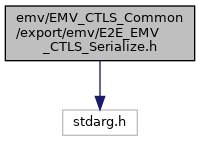
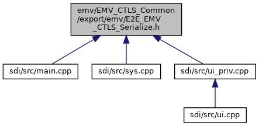

[Macros](#define-members)

`#include <stdarg.h>`

Include dependency graph for E2E_EMV_CTLS_Serialize.h:

This graph shows which files directly or indirectly include this file:

<a href="_e2_e___e_m_v___c_t_l_s___serialize_8h_source.md">Go to the source code of this file.</a>

|  |  |
|----|----|
| Macros |  |
| #define  | [HEADER_SIZE](#a49999be01380f41cc0d0f1f1406fb277)   (4) |
| #define  | [MAX_MESSAGE_SIZE](#acb84a306ee37479f97cf0b476560f027)   (2048) |
| #define  | [MAX_DATA_SIZE](#a87f68e96fb938eddc39ad1f19d923a96)   (<a href="_e2_e___e_m_v___c_t___serialize_8h.md#acb84a306ee37479f97cf0b476560f027">MAX_MESSAGE_SIZE</a>-<a href="_e2_e___e_m_v___c_t___serialize_8h.md#a49999be01380f41cc0d0f1f1406fb277">HEADER_SIZE</a>) |
| #define  | [CALLBACK_MESSAGE_SIZE](#abc524e22c372fb97e6171123fff884ac)   (2048) |
|   | for unidirectional callback [More\...](#abc524e22c372fb97e6171123fff884ac)  |
| #define  | [CALLBACK_MESSAGE_SIZE_STM32](#a1e9ac382003e2e86abc46406c1e34a7d)   100 |
|   | Titus does not support trace callback. [More\...](#a1e9ac382003e2e86abc46406c1e34a7d)  |
| #define  | [MIN](#a3acffbd305ee72dcd4593c0d8af64a4f)(a, b)   ((a)\<(b)?(a):(b)) |
| #define  | <a href="group___e_m_v_c_o___t_a_g_s.md#ga15500b26a3968d2936b031cca37b93f2">TAG_42_ISSUER_ID</a>   0x42u |
|   | Issuer Identification Number (IIN) (**42**) used as <a href="group___f_u_n_c___f_l_o_w.md#a0c9b7f7b7001ce7a98a7a01e1276786b">EMV_CTLS_CANDIDATE_DATA_STRUCT::IIN</a>. <a href="group___e_m_v_c_o___t_a_g_s.md#ga15500b26a3968d2936b031cca37b93f2">More...</a>  |
| #define  | <a href="group___e_m_v_c_o___t_a_g_s.md#gaa1a0900aa13055b0b5199a8542ea2c64">TAG_4F_APP_ID</a>   0x4Fu |
|   | Application Identifier (AID) - Card (**4F**) used to serialize <a href="_e_m_v___c_t_l_s___interface_8h.md#struct_e_m_v___c_t_l_s___a_p_p_l_i___s_t_r_u_c_t">EMV_CTLS_APPLI_STRUCT</a>. <a href="group___e_m_v_c_o___t_a_g_s.md#gaa1a0900aa13055b0b5199a8542ea2c64">More...</a>  |
| #define  | <a href="group___e_m_v_c_o___t_a_g_s.md#ga70b6da94fde0a697b05755cdfc084023">TAG_50_APP_LABEL</a>   0x50u |
|   | Application Label (**50**) used in callbacks <a href="group___c_b_c_k___f_c_t___t_a_g_s.md#ga2ef5c305dbfcabbea00a6d9e3c544547">TAG_BF12_CBK_MODIFY_CAND</a> and <a href="group___c_b_c_k___f_c_t___t_a_g_s.md#gaf101b44707dcb098e311d65bd7ac817e">TAG_BF0C_CTLS_CBK_APP_SELECTED</a>. <a href="group___e_m_v_c_o___t_a_g_s.md#ga70b6da94fde0a697b05755cdfc084023">More...</a>  |
| #define  | <a href="group___e_m_v_c_o___t_a_g_s.md#ga5c2e2c1e49e22fe51669eaceaa8fad9d">TAG_52_CMD_TO_PERFORM</a>   0x52u |
|   | Command to Perform (**52**) <a href="group___e_m_v_c_o___t_a_g_s.md#ga5c2e2c1e49e22fe51669eaceaa8fad9d">More...</a>  |
| #define  | <a href="group___e_m_v_c_o___t_a_g_s.md#gabfbfe2c06ddf1454164340744d5eb61a">TAG_56_TRACK1_EQUIVALENT</a>   0x56u |
|   | Track 1 Equivalent Data (MChip card) <a href="group___e_m_v_c_o___t_a_g_s.md#gabfbfe2c06ddf1454164340744d5eb61a">More...</a>  |
| #define  | <a href="group___e_m_v_c_o___t_a_g_s.md#ga2e6e79fb698c2021efe43366f6517b76">TAG_57_TRACK2_EQUIVALENT</a>   0x57u |
|   | Track 2 Equivalent Data (**57**) used as <a href="group___d_e_f___f_l_o_w___o_u_t_p_u_t.md#ae570117bb33a013b49ca02baa24d8c23">EMV_CTLS_TRANSRES_STRUCT::T_57_DataTrack2</a>. <a href="group___e_m_v_c_o___t_a_g_s.md#ga2e6e79fb698c2021efe43366f6517b76">More...</a>  |
| #define  | <a href="group___e_m_v_c_o___t_a_g_s.md#ga4ccedb21a71fcb6ace22bac98ba548a5">TAG_5A_APP_PAN</a>   0x5Au |
|   | Application Primary Account Number (**5A**) used as <a href="group___d_e_f___f_l_o_w___o_u_t_p_u_t.md#af0bc634797380c801e22c4d7fbf5255f">EMV_CTLS_TRANSRES_STRUCT::T_5A_PAN</a>. <a href="group___e_m_v_c_o___t_a_g_s.md#ga4ccedb21a71fcb6ace22bac98ba548a5">More...</a>  |
| #define  | <a href="group___e_m_v_c_o___t_a_g_s.md#ga28d5c5d3a12cb3cf62e64ccb3e9258bc">TAG_5F20_CARDHOLDER_NAME</a>   0x5F20u |
|   | Cardholder Name (**5F20**) used as <a href="group___d_e_f___f_l_o_w___o_u_t_p_u_t.md#adfd7eab71b1fc8059259da6704ae0f6f">EMV_CTLS_TRANSRES_STRUCT::T_5F20_Cardholder</a>. <a href="group___e_m_v_c_o___t_a_g_s.md#ga28d5c5d3a12cb3cf62e64ccb3e9258bc">More...</a>  |
| #define  | <a href="group___e_m_v_c_o___t_a_g_s.md#ga5eb2095961ebe9a91e560003f75358bb">TAG_5F24_APP_EXP_DATE</a>   0x5F24u |
|   | Application Expiration Data (**5F24**) used as <a href="group___d_e_f___f_l_o_w___o_u_t_p_u_t.md#a9976182c24eef231d092afe3a7c8d348">EMV_CTLS_TRANSRES_STRUCT::T_5F24_AppExpDate</a>. <a href="group___e_m_v_c_o___t_a_g_s.md#ga5eb2095961ebe9a91e560003f75358bb">More...</a>  |
| #define  | <a href="group___e_m_v_c_o___t_a_g_s.md#gacd7028f61b8522799f207c7efa8e49d9">TAG_5F25_APP_EFF_DATE</a>   0x5F25u |
|   | Application Effective Data (**5F25**) used as <a href="group___d_e_f___f_l_o_w___o_u_t_p_u_t.md#a3a483d3884951300b21443c7a72003ce">EMV_CTLS_TRANSRES_STRUCT::T_5F25_AppEffDate</a>. <a href="group___e_m_v_c_o___t_a_g_s.md#gacd7028f61b8522799f207c7efa8e49d9">More...</a>  |
| #define  | <a href="group___e_m_v_c_o___t_a_g_s.md#gaa35ef81cc90fe90126a537cbd611ead6">TAG_5F28_ISS_COUNTRY_CODE</a>   0x5F28u |
|   | Issuer Country Code (**5F28**) used as <a href="group___d_e_f___f_l_o_w___o_u_t_p_u_t.md#af6458a2407613872574dccbfb6bef9b9">EMV_CTLS_TRANSRES_STRUCT::T_5F28_IssCountryCode</a>. <a href="group___e_m_v_c_o___t_a_g_s.md#gaa35ef81cc90fe90126a537cbd611ead6">More...</a>  |
| #define  | <a href="group___e_m_v_c_o___t_a_g_s.md#ga369ab2cc83e9b220bdfa79753f1f3962">TAG_5F2A_TRANS_CURRENCY</a>   0x5F2Au |
|   | Transaction Currency Code (**5F2A**) Configured with <a href="group___d_e_f___c_o_n_f___t_e_r_m.md#ae1f191741d0c4b9351e7f52d69b20d73">EMV_CTLS_TERMDATA_STRUCT::CurrencyTrans</a> (for DCC possibly in <a href="group___d_e_f___f_l_o_w___i_n_p_u_t.md#struct_e_m_v___c_t_l_s___s_t_a_r_t___s_t_r_u_c_t">EMV_CTLS_START_STRUCT</a>). Used as <a href="group___d_e_f___f_l_o_w___o_u_t_p_u_t.md#a4ff59afe014dcaa2f469e45abd2a2cb7">EMV_CTLS_TRANSRES_STRUCT::T_5F2A_CurrencyTrans</a>. <a href="group___e_m_v_c_o___t_a_g_s.md#ga369ab2cc83e9b220bdfa79753f1f3962">More...</a>  |
| #define  | <a href="group___e_m_v_c_o___t_a_g_s.md#gaaa613c7ef00b768c88fe5cc3ee16107b">TAG_5F2D_LANGUAGE</a>   0x5F2Du |
|   | Language Preference (**5F2D**) used as <a href="group___d_e_f___f_l_o_w___o_u_t_p_u_t.md#ab78d27dc34487f922049e2708780f0b5">EMV_CTLS_TRANSRES_STRUCT::T_5F2D_Lang_Pref</a>. <a href="group___e_m_v_c_o___t_a_g_s.md#gaaa613c7ef00b768c88fe5cc3ee16107b">More...</a>  |
| #define  | <a href="group___e_m_v_c_o___t_a_g_s.md#gacc4c4f91bcb9bf9fef0ec1257292b93e">TAG_5F30_SERVICE_CODE</a>   0x5F30u |
|   | Service Code (**5F30**) used as <a href="group___d_e_f___f_l_o_w___o_u_t_p_u_t.md#aba95bf6078aac2295b51ba4f1b7aaff9">EMV_CTLS_TRANSRES_STRUCT::T_5F30_ServiceCode</a>. <a href="group___e_m_v_c_o___t_a_g_s.md#gacc4c4f91bcb9bf9fef0ec1257292b93e">More...</a>  |
| #define  | <a href="group___e_m_v_c_o___t_a_g_s.md#ga17f22ccb8130cc68e45609afc6b58f00">TAG_5F34_PAN_SEQUENCE_NB</a>   0x5F34u |
|   | PAN Sequence Number (**5F34**) used as <a href="group___d_e_f___f_l_o_w___o_u_t_p_u_t.md#abc4cec20fd3b19b4eb973817adc30eb7">EMV_CTLS_TRANSRES_STRUCT::T_5F34_PANSequenceNo</a>. <a href="group___e_m_v_c_o___t_a_g_s.md#ga17f22ccb8130cc68e45609afc6b58f00">More...</a>  |
| #define  | <a href="group___e_m_v_c_o___t_a_g_s.md#ga134c61ae2787b93c5def5bbf929f7cb4">TAG_5F36_TRANS_CURRENCY_EXP</a>   0x5F36u |
|   | Transaction Currency Exponent (**5F36**) Configured with <a href="group___d_e_f___c_o_n_f___t_e_r_m.md#aaa3e0774e163e148c88b989c3ada3b76">EMV_CTLS_TERMDATA_STRUCT::ExpTrans</a> (for DCC possibly in <a href="group___d_e_f___f_l_o_w___i_n_p_u_t.md#struct_e_m_v___c_t_l_s___s_t_a_r_t___s_t_r_u_c_t">EMV_CTLS_START_STRUCT</a>). Used as <a href="group___d_e_f___f_l_o_w___o_u_t_p_u_t.md#af3c15997b72a0912020557a700633e18">EMV_CTLS_TRANSRES_STRUCT::T_5F36_Trx_Currency_Exp</a>. <a href="group___e_m_v_c_o___t_a_g_s.md#ga134c61ae2787b93c5def5bbf929f7cb4">More...</a>  |
| #define  | <a href="group___e_m_v_c_o___t_a_g_s.md#ga15ecfca134c05f49a0ce50d5f0692355">TAG_5F50_ISSUER_URL</a>   0x5F50u |
|   | Issuer URL (**5F50**) <a href="group___e_m_v_c_o___t_a_g_s.md#ga15ecfca134c05f49a0ce50d5f0692355">More...</a>  |
| #define  | <a href="group___e_m_v_c_o___t_a_g_s.md#ga4c1beabb09d7dd5929f0947c3451378c">TAG_5F53_IBAN</a>   0x5F53u |
|   | International Bank Account Number (IBAN) (**5F53**) <a href="group___e_m_v_c_o___t_a_g_s.md#ga4c1beabb09d7dd5929f0947c3451378c">More...</a>  |
| #define  | <a href="group___e_m_v_c_o___t_a_g_s.md#ga7c69e28da34f98b810cc96009ecdefe9">TAG_5F54_BIC</a>   0x5F54u |
|   | Bank Identifier Code (BIC) (**5F54**) <a href="group___e_m_v_c_o___t_a_g_s.md#ga7c69e28da34f98b810cc96009ecdefe9">More...</a>  |
| #define  | <a href="group___e_m_v_c_o___t_a_g_s.md#ga4a6770ebf323f538a78c12c78f3db783">TAG_5F55_ISSUER_COUNTRY_2</a>   0x5F55u |
|   | Issuer Country Code (alpha 2 format) (**5F55**) used as <a href="group___f_u_n_c___f_l_o_w.md#aa6458e13b23e10671e3c12ac21e69aaa">EMV_CTLS_CANDIDATE_DATA_STRUCT::country2</a>. <a href="group___e_m_v_c_o___t_a_g_s.md#ga4a6770ebf323f538a78c12c78f3db783">More...</a>  |
| #define  | <a href="group___e_m_v_c_o___t_a_g_s.md#gad5bedd694cd7c7658a9bdc865f542a50">TAG_5F56_ISSUER_COUNTRY_3</a>   0x5F56u |
|   | Issuer Country Code (alpha 3 format) (**5F56**) used as <a href="group___f_u_n_c___f_l_o_w.md#aab088343104c0c1631f846fa907bbc19">EMV_CTLS_CANDIDATE_DATA_STRUCT::country3</a>. <a href="group___e_m_v_c_o___t_a_g_s.md#gad5bedd694cd7c7658a9bdc865f542a50">More...</a>  |
| #define  | <a href="group___e_m_v_c_o___t_a_g_s.md#ga18a257e1d8288f49eba5100e657039b6">TAG_5F57_ACCOUNT_TYPE</a>   0x5F57u |
|   | Account Type (**5F57**) used as <a href="group___d_e_f___f_l_o_w___i_n_p_u_t.md#a720e112c31478ed6c1a4ed18cb16db2f">EMV_CTLS_PAYMENT_STRUCT::uc_AccountType</a>. <a href="group___e_m_v_c_o___t_a_g_s.md#ga18a257e1d8288f49eba5100e657039b6">More...</a>  |
| #define  | <a href="group___e_m_v_c_o___t_a_g_s.md#ga031f06652f6b1f5ede0a551c356e71b3">TAG_61_APP_TEMPLATE</a>   0x61u |
|   | Application Template (**61**) <a href="group___e_m_v_c_o___t_a_g_s.md#ga031f06652f6b1f5ede0a551c356e71b3">More...</a>  |
| #define  | <a href="group___e_m_v_c_o___t_a_g_s.md#ga9b09496d37327341a4d46ca4edf36182">TAG_6F_FCI_TEMPLATE</a>   0x6Fu |
|   | File Control Information (FCI) Template (**6F**) <a href="group___e_m_v_c_o___t_a_g_s.md#ga9b09496d37327341a4d46ca4edf36182">More...</a>  |
| #define  | <a href="group___e_m_v_c_o___t_a_g_s.md#ga125edde9dae6966577fe85d580e90403">TAG_70_AEF_DATA_TEMPLATE</a>   0x70u |
|   | AEF Data Template (**70**) <a href="group___e_m_v_c_o___t_a_g_s.md#ga125edde9dae6966577fe85d580e90403">More...</a>  |
| #define  | <a href="group___e_m_v_c_o___t_a_g_s.md#ga977d84f3059e283c2b48c22024892a53">TAG_71_ISS_SCRIPT_TPLT_1</a>   0x71u |
|   | Issuer Script Template 1 (**71**) to be used to fill <a href="group___d_e_f___f_l_o_w___i_n_p_u_t.md#afd420a16596fd515042c455eaf81dbc5">EMV_CTLS_HOST_STRUCT::ScriptData</a>. <a href="group___e_m_v_c_o___t_a_g_s.md#ga977d84f3059e283c2b48c22024892a53">More...</a>  |
| #define  | <a href="group___e_m_v_c_o___t_a_g_s.md#ga8b38f1870f3d6cb7259759bb567315c0">TAG_72_ISS_SCRIPT_TPLT_2</a>   0x72u |
|   | Issuer Script Template 2 (**72**) to be used to fill <a href="group___d_e_f___f_l_o_w___i_n_p_u_t.md#afd420a16596fd515042c455eaf81dbc5">EMV_CTLS_HOST_STRUCT::ScriptData</a>. <a href="group___e_m_v_c_o___t_a_g_s.md#ga8b38f1870f3d6cb7259759bb567315c0">More...</a>  |
| #define  | <a href="group___e_m_v_c_o___t_a_g_s.md#gaaa187c1d5255e009a402c6d727b4938f">TAG_73_DIR_DISCR_TEMPLATE</a>   0x73u |
|   | Dirctory Discretionary Template (**73**) <a href="group___e_m_v_c_o___t_a_g_s.md#gaaa187c1d5255e009a402c6d727b4938f">More...</a>  |
| #define  | <a href="group___e_m_v_c_o___t_a_g_s.md#ga33f61ca090446008781005b3bb12e264">TAG_77_RS_MSG_TPLT_FRMT_2</a>   0x77u |
|   | Response Message Template Format 2 (**77**) <a href="group___e_m_v_c_o___t_a_g_s.md#ga33f61ca090446008781005b3bb12e264">More...</a>  |
| #define  | <a href="group___e_m_v_c_o___t_a_g_s.md#gab8455feb7a5b1369aa97e5986745940f">TAG_80_RS_MSG_TPLT_FRMT_1</a>   0x80u |
|   | Response Message Template Format 1 (**80**) <a href="group___e_m_v_c_o___t_a_g_s.md#gab8455feb7a5b1369aa97e5986745940f">More...</a>  |
| #define  | <a href="group___e_m_v_c_o___t_a_g_s.md#ga4b82c7a87ee02736af6cd4e298c1ae13">TAG_81_BIN_AMOUNT_AUTH</a>   0x81u |
|   | Amount Authorization Binary (**81**) <a href="group___e_m_v_c_o___t_a_g_s.md#ga4b82c7a87ee02736af6cd4e298c1ae13">More...</a>  |
| #define  | <a href="group___e_m_v_c_o___t_a_g_s.md#gaa87267a7ce44cc525b3515a3549898c2">TAG_82_AIP</a>   0x82u |
|   | Application Interchange Profile (**82**) used as <a href="group___d_e_f___f_l_o_w___o_u_t_p_u_t.md#a4fc70aee9c7e870519b10c2471ae44f2">EMV_CTLS_TRANSRES_STRUCT::T_82_AIP</a>. <a href="group___e_m_v_c_o___t_a_g_s.md#gaa87267a7ce44cc525b3515a3549898c2">More...</a>  |
| #define  | <a href="group___e_m_v_c_o___t_a_g_s.md#ga6a189bd2f9a0d77f24db3e88d89f5487">TAG_83_CMD_TPLT</a>   0x83u |
|   | Command Template (**83**) <a href="group___e_m_v_c_o___t_a_g_s.md#ga6a189bd2f9a0d77f24db3e88d89f5487">More...</a>  |
| #define  | <a href="group___e_m_v_c_o___t_a_g_s.md#ga69c4599943205d95394b62eef950e4c5">TAG_84_DF_NAME</a>   0x84u |
|   | Dedicated File Name (**84**) used as <a href="group___d_e_f___f_l_o_w___o_u_t_p_u_t.md#a1d5a242b67594b2901691e00b41c2c69">EMV_CTLS_TRANSRES_STRUCT::T_84_DFName</a>. <a href="group___e_m_v_c_o___t_a_g_s.md#ga69c4599943205d95394b62eef950e4c5">More...</a>  |
| #define  | <a href="group___e_m_v_c_o___t_a_g_s.md#ga5fadc36c7f5dee1b8c89cf331ed67a46">TAG_86_ISS_SCRIPT_CMD</a>   0x86u |
|   | Issuer Script Command (**86**) <a href="group___e_m_v_c_o___t_a_g_s.md#ga5fadc36c7f5dee1b8c89cf331ed67a46">More...</a>  |
| #define  | <a href="group___e_m_v_c_o___t_a_g_s.md#gaa307388012402f6923efc2609e11fd29">TAG_87_APP_PRIORITY_ID</a>   0x87u |
|   | Application Priority Indicator (**87**) used as <a href="group___f_u_n_c___f_l_o_w.md#ae6e6847f31d7ad74362c2de216df1372">EMV_CTLS_CANDIDATE_DATA_STRUCT::API</a>. <a href="group___e_m_v_c_o___t_a_g_s.md#gaa307388012402f6923efc2609e11fd29">More...</a>  |
| #define  | <a href="group___e_m_v_c_o___t_a_g_s.md#ga5aea7b31fe53ca6a11f69329dac5a75c">TAG_88_SHORT_FILE_ID</a>   0x88u |
|   | Short File Identifier (SFI) (**88**) <a href="group___e_m_v_c_o___t_a_g_s.md#ga5aea7b31fe53ca6a11f69329dac5a75c">More...</a>  |
| #define  | <a href="group___e_m_v_c_o___t_a_g_s.md#ga8936aff551a261bc496fee1cc330486a">TAG_89_AUTH_CODE</a>   0x89u |
|   | Authorization Code (**89**) <a href="group___e_m_v_c_o___t_a_g_s.md#ga8936aff551a261bc496fee1cc330486a">More...</a>  |
| #define  | <a href="group___e_m_v_c_o___t_a_g_s.md#ga27bef53c14c4970b64ff44e4e78d20ba">TAG_8A_AUTH_RESP_CODE</a>   0x8Au |
|   | Authorization Response Code (**8A**) used as <a href="group___d_e_f___f_l_o_w___i_n_p_u_t.md#a50f253cd97f2612f2d5abe02959e130f">EMV_CTLS_HOST_STRUCT::AuthResp</a>. <a href="group___e_m_v_c_o___t_a_g_s.md#ga27bef53c14c4970b64ff44e4e78d20ba">More...</a>  |
| #define  | <a href="group___e_m_v_c_o___t_a_g_s.md#ga54b024713e6b8dd6d99e3c1d18005496">TAG_8B_POI_INFORMATION</a>   0x8Bu |
|   | POI information (**8B**) used as <a href="group___d_e_f___c_o_n_f___t_e_r_m.md#aaf88e302e58d70d28ed59a53cdca2f2e">EMV_CTLS_TERMDATA_STRUCT::poiInformation</a>. <a href="group___e_m_v_c_o___t_a_g_s.md#ga54b024713e6b8dd6d99e3c1d18005496">More...</a>  |
| #define  | <a href="group___e_m_v_c_o___t_a_g_s.md#ga2aac30055f056cf447f27cd31ba71d3c">TAG_8C_CDOL_1</a>   0x8Cu |
|   | CDOL 1 (**8C**) <a href="group___e_m_v_c_o___t_a_g_s.md#ga2aac30055f056cf447f27cd31ba71d3c">More...</a>  |
| #define  | <a href="group___e_m_v_c_o___t_a_g_s.md#gabd3001e707d2a1d10fcb130edc3b3d29">TAG_8D_CDOL_2</a>   0x8Du |
|   | CDOL 2 (**8D**) <a href="group___e_m_v_c_o___t_a_g_s.md#gabd3001e707d2a1d10fcb130edc3b3d29">More...</a>  |
| #define  | <a href="group___e_m_v_c_o___t_a_g_s.md#ga94548248d5f87864250eb58aa7f09907">TAG_8E_CVM_LIST</a>   0x8Eu |
|   | Cardholder Verification Method List (**8E**) <a href="group___e_m_v_c_o___t_a_g_s.md#ga94548248d5f87864250eb58aa7f09907">More...</a>  |
| #define  | <a href="group___e_m_v_c_o___t_a_g_s.md#ga3187732cabfd0142ed5023862e9f95ed">TAG_8F_CERTIF_AUTH_PK_ID</a>   0x8Fu |
|   | Certification Autority Public key Index (**8F**) <a href="group___e_m_v_c_o___t_a_g_s.md#ga3187732cabfd0142ed5023862e9f95ed">More...</a>  |
| #define  | <a href="group___e_m_v_c_o___t_a_g_s.md#ga168d90e4e8849e861c161c2a3c49a453">TAG_90_ISS_PK_CERTIF</a>   0x90u |
|   | Issuer Public Key Certificate (**90**) <a href="group___e_m_v_c_o___t_a_g_s.md#ga168d90e4e8849e861c161c2a3c49a453">More...</a>  |
| #define  | <a href="group___e_m_v_c_o___t_a_g_s.md#ga93aecd9e60fdb7fc4ab5a00fffee031b">TAG_91_ISS_AUTH_DATA</a>   0x91u |
|   | Issuer Authentication Data (**91**) used as <a href="group___d_e_f___f_l_o_w___i_n_p_u_t.md#a3e5fe321afd3d5b2db35d2d2bcdc800e">EMV_CTLS_HOST_STRUCT::AuthData</a>. <a href="group___e_m_v_c_o___t_a_g_s.md#ga93aecd9e60fdb7fc4ab5a00fffee031b">More...</a>  |
| #define  | <a href="group___e_m_v_c_o___t_a_g_s.md#ga5a4a55da5763dd2eead482efcb3f9f22">TAG_92_ISS_PK_REMAINDER</a>   0x92u |
|   | Issuer Public Key Remainder (**92**) <a href="group___e_m_v_c_o___t_a_g_s.md#ga5a4a55da5763dd2eead482efcb3f9f22">More...</a>  |
| #define  | <a href="group___e_m_v_c_o___t_a_g_s.md#ga9035588232752ac8152011dc9b2cf631">TAG_93_SGND_STAT_APP_DATA</a>   0x93u |
|   | Signed Static Application Data (**93**) <a href="group___e_m_v_c_o___t_a_g_s.md#ga9035588232752ac8152011dc9b2cf631">More...</a>  |
| #define  | <a href="group___e_m_v_c_o___t_a_g_s.md#ga18001e35a684a0041657e827a14ef456">TAG_94_AFL</a>   0x94u |
|   | Application File Locator (**94**) <a href="group___e_m_v_c_o___t_a_g_s.md#ga18001e35a684a0041657e827a14ef456">More...</a>  |
| #define  | <a href="group___e_m_v_c_o___t_a_g_s.md#ga3227240d53824d37d80b5f5a254daf2a">TAG_95_TVR</a>   0x95u |
|   | Terminal Verification Result (**95**) used as <a href="group___d_e_f___f_l_o_w___o_u_t_p_u_t.md#ab7c83532ed5caeb00101916a4d20c862">EMV_CTLS_TRANSRES_STRUCT::T_95_TVR</a>. <a href="group___e_m_v_c_o___t_a_g_s.md#ga3227240d53824d37d80b5f5a254daf2a">More...</a>  |
| #define  | <a href="group___e_m_v_c_o___t_a_g_s.md#ga83a27d3f0c37cfdfe55bcd0901cb7a58">TAG_97_TDOL</a>   0x97u |
|   | TDOL (**97**) <a href="group___e_m_v_c_o___t_a_g_s.md#ga83a27d3f0c37cfdfe55bcd0901cb7a58">More...</a>  |
| #define  | <a href="group___e_m_v_c_o___t_a_g_s.md#gaab57f1b001e401de3ec7d24b90f378a7">TAG_98_TC_HASH_VALUE</a>   0x98u |
|   | Transaction Certificate Hash Value (**98**) <a href="group___e_m_v_c_o___t_a_g_s.md#gaab57f1b001e401de3ec7d24b90f378a7">More...</a>  |
| #define  | <a href="group___e_m_v_c_o___t_a_g_s.md#ga7691cae1ae03d3345deacc2300ba161e">TAG_99_TRANS_PIN_DATA</a>   0x99u |
|   | Transaction PIN Data (**99**) <a href="group___e_m_v_c_o___t_a_g_s.md#ga7691cae1ae03d3345deacc2300ba161e">More...</a>  |
| #define  | <a href="group___e_m_v_c_o___t_a_g_s.md#ga9b8dc8671fc9d3af99aefdf59659cd67">TAG_9A_TRANS_DATE</a>   0x9Au |
|   | Transaction Date (**9A**) used as <a href="group___d_e_f___f_l_o_w___o_u_t_p_u_t.md#a82dfa85492013ef19f23e3446d470a4a">EMV_CTLS_TRANSRES_STRUCT::T_9A_Date</a>, and <a href="group___d_e_f___f_l_o_w___i_n_p_u_t.md#a775d3e156bcce4f815658cbaca54de4f">EMV_CTLS_PAYMENT_STRUCT::Date</a>. <a href="group___e_m_v_c_o___t_a_g_s.md#ga9b8dc8671fc9d3af99aefdf59659cd67">More...</a>  |
| #define  | <a href="group___e_m_v_c_o___t_a_g_s.md#ga42e197884e26dbe7ef666d8f6881b376">TAG_9B_TSI</a>   0x9Bu |
|   | Transaction Status Information (**9B**) used as <a href="group___d_e_f___f_l_o_w___o_u_t_p_u_t.md#a3a483bca9d788db046219dc80b8251e0">EMV_CTLS_TRANSRES_STRUCT::T_9B_TSI</a>. <a href="group___e_m_v_c_o___t_a_g_s.md#ga42e197884e26dbe7ef666d8f6881b376">More...</a>  |
| #define  | <a href="group___e_m_v_c_o___t_a_g_s.md#ga4064d8681a4f0a40f4a3bf304f2a0902">TAG_9C_TRANS_TYPE</a>   0x9Cu |
|   | Transaction Type (**9C**) used as <a href="group___d_e_f___f_l_o_w___i_n_p_u_t.md#ae9357fb5fbb42943ac347ea3b2cd4d6a">EMV_CTLS_START_STRUCT::TransType</a>, <a href="group___d_e_f___f_l_o_w___o_u_t_p_u_t.md#a89e1907a3fb369ef96d8ae2de716acad">EMV_CTLS_TRANSRES_STRUCT::T_9C_TransType</a>. <a href="group___e_m_v_c_o___t_a_g_s.md#ga4064d8681a4f0a40f4a3bf304f2a0902">More...</a>  |
| #define  | <a href="group___e_m_v_c_o___t_a_g_s.md#ga37efa7b9d05b931462f22fa75542845d">TAG_9D_DDF_NAME</a>   0x9Du |
|   | <a href="class_directory.md">Directory</a> Definition File Name (**9D**) <a href="group___e_m_v_c_o___t_a_g_s.md#ga37efa7b9d05b931462f22fa75542845d">More...</a>  |
| #define  | <a href="group___e_m_v_c_o___t_a_g_s.md#gaab4cf8e32535962270e6219bcbc08194">TAG_9F01_ACQ_ID</a>   0x9F01u |
|   | Acquirer Identifier (**9F01**) <a href="group___e_m_v_c_o___t_a_g_s.md#gaab4cf8e32535962270e6219bcbc08194">More...</a>  |
| #define  | <a href="group___e_m_v_c_o___t_a_g_s.md#ga6952b55733eff49c55768a6f7802f9e4">TAG_9F02_NUM_AMOUNT_AUTH</a>   0x9F02u |
|   | Amount Authorized (Numeric) (**9F02**) used as <a href="group___d_e_f___f_l_o_w___i_n_p_u_t.md#a30d37bb81b40a6e53cb3081ee862ddef">EMV_CTLS_PAYMENT_STRUCT::Amount</a>. <a href="group___e_m_v_c_o___t_a_g_s.md#ga6952b55733eff49c55768a6f7802f9e4">More...</a>  |
| #define  | <a href="group___e_m_v_c_o___t_a_g_s.md#gaccc339b2226ade4b5ab935624377f800">TAG_9F03_NUM_AMOUNT_OTHER</a>   0x9F03u |
|   | Amount Other (Numeric) (**9F03**) used as <a href="group___d_e_f___f_l_o_w___i_n_p_u_t.md#aa3226314fccbb9ce083892654db4c0a4">EMV_CTLS_PAYMENT_STRUCT::Cashback_Amount</a>. <a href="group___e_m_v_c_o___t_a_g_s.md#gaccc339b2226ade4b5ab935624377f800">More...</a>  |
| #define  | <a href="group___e_m_v_c_o___t_a_g_s.md#ga19e6864aff86c11e64b2ba1685b2aaa0">TAG_9F04_BIN_AMOUNT_OTHER</a>   0x9F04u |
|   | Amount Other (Binary) (**9F04**) can be used to fetch <a href="group___d_e_f___f_l_o_w___i_n_p_u_t.md#aa3226314fccbb9ce083892654db4c0a4">EMV_CTLS_PAYMENT_STRUCT::Cashback_Amount</a> as 4-byte-binary-coded value by <a href="group___f_u_n_c___f_l_o_w.md#ga8c9f0640ed818c3dc19da528f5f0b406">EMV_CTLS_fetchTxnTags()</a> <a href="group___e_m_v_c_o___t_a_g_s.md#ga19e6864aff86c11e64b2ba1685b2aaa0">More...</a>  |
| #define  | <a href="group___e_m_v_c_o___t_a_g_s.md#ga4bea514ddd3305a371b36e09a78bb560">TAG_9F05_APP_DISCR_DATA</a>   0x9F05u |
|   | Application Discretionary Data (**9F05**) <a href="group___e_m_v_c_o___t_a_g_s.md#ga4bea514ddd3305a371b36e09a78bb560">More...</a>  |
| #define  | <a href="group___e_m_v_c_o___t_a_g_s.md#ga7670871675627d7e74d29683fbacf01a">TAG_9F06_AID</a>   0x9F06u |
|   | Application Identifier (AID)-terminal (**9F06**) used as <a href="group___d_e_f___f_l_o_w___o_u_t_p_u_t.md#a6f049fe2417bdca3916cf4414f79a3e2">EMV_CTLS_TRANSRES_STRUCT::T_9F06_AID</a>. <a href="group___e_m_v_c_o___t_a_g_s.md#ga7670871675627d7e74d29683fbacf01a">More...</a>  |
| #define  | <a href="group___e_m_v_c_o___t_a_g_s.md#gacbc210315b12dab79eb6f8cc1cfe79f2">TAG_9F07_APP_USAGE_CONTROL</a>   0x9F07u |
|   | Application Usage Control (**9F07**) <a href="group___e_m_v_c_o___t_a_g_s.md#gacbc210315b12dab79eb6f8cc1cfe79f2">More...</a>  |
| #define  | <a href="group___e_m_v_c_o___t_a_g_s.md#ga49ac73f311523b949020821550b7cda8">TAG_9F08_ICC_APP_VERSION_NB</a>   0x9F08u |
|   | Application Version Number - ICC (**9F08**) used as <a href="group___d_e_f___f_l_o_w___o_u_t_p_u_t.md#ae24c7f2703201392ba5eaa2e0d2febd7">EMV_CTLS_TRANSRES_STRUCT::T_9F08_ICC_Appli_Vers_No</a>. <a href="group___e_m_v_c_o___t_a_g_s.md#ga49ac73f311523b949020821550b7cda8">More...</a>  |
| #define  | <a href="group___e_m_v_c_o___t_a_g_s.md#gac0fb6f2c9da5e835754d94e7edf4f7c2">TAG_9F09_TRM_APP_VERSION_NB</a>   0x9F09u |
|   | Application Version Number (**9F09**) used in most schemes of <a href="group___d_e_f___c_o_n_f___a_p_p_l_i.md#a85e80490e4f5516c7cb1966011d0c359">EMV_CTLS_APPLIDATA_SCHEME_SPECIFIC_STRUCT::Scheme</a>. <a href="group___e_m_v_c_o___t_a_g_s.md#gac0fb6f2c9da5e835754d94e7edf4f7c2">More...</a>  |
| #define  | <a href="group___e_m_v_c_o___t_a_g_s.md#gac5bdc3a443d2b32f1898d095609ec871">TAG_9F0A_ASRPD</a>   0x9F0Au |
|   | Application Selection Registered Proprietary Data (**9F0A**) EMV Specification Bulletin No. 175 (ID1, L1, V1, ID2, L2, V2, \...) ID: 2 byte, L: length, 1 byte. <a href="group___e_m_v_c_o___t_a_g_s.md#gac5bdc3a443d2b32f1898d095609ec871">More...</a>  |
| #define  | <a href="group___e_m_v_c_o___t_a_g_s.md#gae1a12d59719645310bdbe8c778460d8b">TAG_9F0B_CARDHOLDER_NAME_XT</a>   0x9F0Bu |
|   | Cardholder Name Extended (**9F0B**) <a href="group___e_m_v_c_o___t_a_g_s.md#gae1a12d59719645310bdbe8c778460d8b">More...</a>  |
| #define  | <a href="group___e_m_v_c_o___t_a_g_s.md#gaa2f5cfcf442860cea8e1021150b9e5c5">TAG_9F0C_ISSUER_ID_EXT</a>   0x9F0Cu |
|   | Issuer Identification Number Extended SB N°231 (**9F0C**) used for <a href="group___f_u_n_c___f_l_o_w.md#a0c9b7f7b7001ce7a98a7a01e1276786b">EMV_CTLS_CANDIDATE_DATA_STRUCT::IIN</a> when IIN length is 4. <a href="group___e_m_v_c_o___t_a_g_s.md#gaa2f5cfcf442860cea8e1021150b9e5c5">More...</a>  |
| #define  | <a href="group___e_m_v_c_o___t_a_g_s.md#gaf1f1b225dbba527e67b529d1b9bc0b41">TAG_9F0D_IAC_DEFAULT</a>   0x9F0Du |
|   | Issuer Action Code - Default (**9F0D**) used as <a href="group___d_e_f___f_l_o_w___o_u_t_p_u_t.md#a78cc77069e865792d6bfa5d54b7fd3a7">EMV_CTLS_TRANSRES_STRUCT::T_9F0D_IACDefault</a>. <a href="group___e_m_v_c_o___t_a_g_s.md#gaf1f1b225dbba527e67b529d1b9bc0b41">More...</a>  |
| #define  | <a href="group___e_m_v_c_o___t_a_g_s.md#ga56066a347d8d88263ea6340cccbae911">TAG_9F0E_IAC_DENIAL</a>   0x9F0Eu |
|   | Issuer Action Code - Denial (**9F0E**) used as <a href="group___d_e_f___f_l_o_w___o_u_t_p_u_t.md#a21b49faa952c458dcf2743473486817c">EMV_CTLS_TRANSRES_STRUCT::T_9F0E_IACDenial</a>. <a href="group___e_m_v_c_o___t_a_g_s.md#ga56066a347d8d88263ea6340cccbae911">More...</a>  |
| #define  | <a href="group___e_m_v_c_o___t_a_g_s.md#gaff475c053b8dce5ca076bc3613c3888a">TAG_9F0F_IAC_ONLINE</a>   0x9F0Fu |
|   | Issuer Action Code - Online (**9F0F**) used as <a href="group___d_e_f___f_l_o_w___o_u_t_p_u_t.md#a685a012758034411221da9ae0b667277">EMV_CTLS_TRANSRES_STRUCT::T_9F0F_IACOnline</a>. <a href="group___e_m_v_c_o___t_a_g_s.md#gaff475c053b8dce5ca076bc3613c3888a">More...</a>  |
| #define  | <a href="group___e_m_v_c_o___t_a_g_s.md#ga1ff0740aef66ba7bc912c7262abd86d0">TAG_9F10_ISS_APP_DATA</a>   0x9F10u |
|   | Issuer Application Data (**9F10**) used as <a href="group___d_e_f___f_l_o_w___o_u_t_p_u_t.md#ab2e7ecdb8e54b69dfa718f6f7fb7fed7">EMV_CTLS_TRANSRES_STRUCT::T_9F10_DataIssuer</a>. <a href="group___e_m_v_c_o___t_a_g_s.md#ga1ff0740aef66ba7bc912c7262abd86d0">More...</a>  |
| #define  | <a href="group___e_m_v_c_o___t_a_g_s.md#gaec3d1fc145f66b87ec5416b7d6cb69aa">TAG_9F11_ISS_CODE_TABLE_ID</a>   0x9F11u |
|   | Issuer Code Table Index (**9F11**) <a href="group___e_m_v_c_o___t_a_g_s.md#gaec3d1fc145f66b87ec5416b7d6cb69aa">More...</a>  |
| #define  | <a href="group___e_m_v_c_o___t_a_g_s.md#gaf705ddff22734d558b161db19bf24038">TAG_9F12_APP_PREFERRED_NAME</a>   0x9F12u |
|   | Application Preferred Name (**9F12**) used as <a href="group___d_e_f___f_l_o_w___o_u_t_p_u_t.md#a1a933985680b099e926e54086a602c12">EMV_CTLS_TRANSRES_STRUCT::AppName</a>. <a href="group___e_m_v_c_o___t_a_g_s.md#gaf705ddff22734d558b161db19bf24038">More...</a>  |
| #define  | <a href="group___e_m_v_c_o___t_a_g_s.md#ga657ab92f37b6da29874ecc2e40f66654">TAG_9F13_LAST_ONLINE_ATC</a>   0x9F13u |
|   | Last Online ATC Register (**9F13**) <a href="group___e_m_v_c_o___t_a_g_s.md#ga657ab92f37b6da29874ecc2e40f66654">More...</a>  |
| #define  | <a href="group___e_m_v_c_o___t_a_g_s.md#ga70f157218d7fdca32a6adea6d96d1815">TAG_9F14_LO_OFFLINE_LIMIT</a>   0x9F14u |
|   | Lower Consecutive Offline Limit (**9F14**) <a href="group___e_m_v_c_o___t_a_g_s.md#ga70f157218d7fdca32a6adea6d96d1815">More...</a>  |
| #define  | <a href="group___e_m_v_c_o___t_a_g_s.md#ga41481cf04242a0ba441c87f6a1569639">TAG_9F15_MERCH_CATEG_CODE</a>   0x9F15u |
|   | Merchant Category Code (**9F15**) <a href="group___e_m_v_c_o___t_a_g_s.md#ga41481cf04242a0ba441c87f6a1569639">More...</a>  |
| #define  | <a href="group___e_m_v_c_o___t_a_g_s.md#ga184ccaaef50ada9988bfd4af37b8c9fb">TAG_9F16_MERCHANT_ID</a>   0x9F16u |
|   | Merchant Identifier (**9F16**) <a href="group___e_m_v_c_o___t_a_g_s.md#ga184ccaaef50ada9988bfd4af37b8c9fb">More...</a>  |
| #define  | <a href="group___e_m_v_c_o___t_a_g_s.md#ga9fab68d1de5156b91a399f80ae4f0e9d">TAG_9F17_PIN_TRIES_LEFT</a>   0x9F17u |
|   | PIN Try Counter (**9F17**) <a href="group___e_m_v_c_o___t_a_g_s.md#ga9fab68d1de5156b91a399f80ae4f0e9d">More...</a>  |
| #define  | <a href="group___e_m_v_c_o___t_a_g_s.md#ga7a6c8f96bdd8a98f8122825695d6cb9b">TAG_9F18_ISS_SCRIPT_ID</a>   0x9F18u |
|   | Issuer Script Identifier (**9F18**) to be used to fill <a href="group___d_e_f___f_l_o_w___i_n_p_u_t.md#afd420a16596fd515042c455eaf81dbc5">EMV_CTLS_HOST_STRUCT::ScriptData</a>. <a href="group___e_m_v_c_o___t_a_g_s.md#ga7a6c8f96bdd8a98f8122825695d6cb9b">More...</a>  |
| #define  | <a href="group___e_m_v_c_o___t_a_g_s.md#ga5bc987c3686fd5821f20d21015354787">TAG_9F1A_TRM_COUNTRY_CODE</a>   0x9F1Au |
|   | Terminal Country Code (**9F1A**) Configured with <a href="group___d_e_f___c_o_n_f___t_e_r_m.md#a0cd015d4fd7fa26a9c13d6687dcc1aea">EMV_CTLS_TERMDATA_STRUCT::CountryCodeTerm</a>. <a href="group___e_m_v_c_o___t_a_g_s.md#ga5bc987c3686fd5821f20d21015354787">More...</a>  |
| #define  | <a href="group___e_m_v_c_o___t_a_g_s.md#gab275fa140f8e21bda8e1d0bdafe47602">TAG_9F1B_TRM_FLOOR_LIMIT</a>   0x9F1Bu |
|   | Terminal Floor Limit (**9F1B**) not used anymore for contactless interface. <a href="group___e_m_v_c_o___t_a_g_s.md#gab275fa140f8e21bda8e1d0bdafe47602">More...</a>  |
| #define  | <a href="group___e_m_v_c_o___t_a_g_s.md#ga64f401e453e74b4ff1f727aa7cc449ac">TAG_9F1C_TRM_ID</a>   0x9F1Cu |
|   | Terminal Identification (**9F1C**) <a href="group___e_m_v_c_o___t_a_g_s.md#ga64f401e453e74b4ff1f727aa7cc449ac">More...</a>  |
| #define  | <a href="group___e_m_v_c_o___t_a_g_s.md#ga9d809ba2d6c28d0989f1bbffffe35a45">TAG_9F1D_TRM_RISK_MNGT_DATA</a>   0x9F1Du |
|   | Terminal Risk Management Data (**9F1D**) used as <a href="group___d_e_f___c_o_n_f___a_p_p_l_i.md#ad71cd39800ac88311b925feaeafef835">EMV_CTLS_APPLIDATA_MK_STRUCT::TerminalRiskManagementData_9F1D</a>. <a href="group___e_m_v_c_o___t_a_g_s.md#ga9d809ba2d6c28d0989f1bbffffe35a45">More...</a>  |
| #define  | <a href="group___e_m_v_c_o___t_a_g_s.md#ga1edb578c8df9ce5a55b3204cda45d198">TAG_9F1E_IFD_SERIAL_NB</a>   0x9F1Eu |
|   | Interface Device (IFD) Serial Number (**9F1E**) used as <a href="group___d_e_f___c_o_n_f___t_e_r_m.md#a67d893f7b2cd705d266455f171ff7657">EMV_CTLS_TERMDATA_STRUCT::IFDSerialNumber</a>, <a href="group___d_e_f___f_l_o_w___o_u_t_p_u_t.md#a291c422cae05265d91a2b025867c32b4">EMV_CTLS_TRANSRES_STRUCT::T_9F1E_IFDSerialNumber</a>. <a href="group___e_m_v_c_o___t_a_g_s.md#ga1edb578c8df9ce5a55b3204cda45d198">More...</a>  |
| #define  | <a href="group___e_m_v_c_o___t_a_g_s.md#gac8f2609592cabb5c3a24b5133ac80ada">TAG_9F1F_TRACK_1_DISCR_DATA</a>   0x9F1Fu |
|   | Track 1 Discretionary Data (**9F1F**) <a href="group___e_m_v_c_o___t_a_g_s.md#gac8f2609592cabb5c3a24b5133ac80ada">More...</a>  |
| #define  | <a href="group___e_m_v_c_o___t_a_g_s.md#gab7edbeb7b44a8c24e58b717d73b2cffb">TAG_9F20_TRACK_2_DISCR_DATA</a>   0x9F20u |
|   | Track 2 Discretionary Data (**9F20**) <a href="group___e_m_v_c_o___t_a_g_s.md#gab7edbeb7b44a8c24e58b717d73b2cffb">More...</a>  |
| #define  | <a href="group___e_m_v_c_o___t_a_g_s.md#ga680a68f0ce959ac674f997968145a09c">TAG_9F21_TRANS_TIME</a>   0x9F21u |
|   | Transaction Time (**9F21**) used as <a href="group___d_e_f___f_l_o_w___i_n_p_u_t.md#ab2e402d904a352a99a517cf77ed2d875">EMV_CTLS_PAYMENT_STRUCT::Time</a>, <a href="group___d_e_f___f_l_o_w___o_u_t_p_u_t.md#a174ff228cb3d664e05bbc093fcdd9a3a">EMV_CTLS_TRANSRES_STRUCT::T_9F21_Time</a>. <a href="group___e_m_v_c_o___t_a_g_s.md#ga680a68f0ce959ac674f997968145a09c">More...</a>  |
| #define  | <a href="group___e_m_v_c_o___t_a_g_s.md#ga14c698c859256684f32e839458068cd5">TAG_9F22_CERTIF_AUTH_PK_ID</a>   0x9F22u |
|   | Certification Authority Public Key Index (**9F22**) <a href="group___e_m_v_c_o___t_a_g_s.md#ga14c698c859256684f32e839458068cd5">More...</a>  |
| #define  | <a href="group___e_m_v_c_o___t_a_g_s.md#ga7b7e272aa0bc0787fa134364d0353f7a">TAG_9F23_HI_OFFLINE_LIMIT</a>   0x9F23u |
|   | Upper Consecutive Offline Limit (**9F23**) <a href="group___e_m_v_c_o___t_a_g_s.md#ga7b7e272aa0bc0787fa134364d0353f7a">More...</a>  |
| #define  | <a href="group___e_m_v_c_o___t_a_g_s.md#ga5b15a8b40aafbe917ef7aa6e10614115">TAG_9F24_PAYM_ACCOUNT_REF</a>   0x9F24u |
|   | Payment Account Reference (**9F24**) EMV Specification Bulletin No. 178, an29. <a href="group___e_m_v_c_o___t_a_g_s.md#ga5b15a8b40aafbe917ef7aa6e10614115">More...</a>  |
| #define  | <a href="group___e_m_v_c_o___t_a_g_s.md#gac5b1de965da383855ef078f7c001efe1">TAG_9F26_APP_CRYPTOGRAM</a>   0x9F26u |
|   | Application Cryptogram (**9F26**) used as <a href="group___d_e_f___f_l_o_w___o_u_t_p_u_t.md#a10c360689ac25ffda269b58686ccfda9">EMV_CTLS_TRANSRES_STRUCT::T_9F26_Cryptogramm</a>. <a href="group___e_m_v_c_o___t_a_g_s.md#gac5b1de965da383855ef078f7c001efe1">More...</a>  |
| #define  | <a href="group___e_m_v_c_o___t_a_g_s.md#gaa101e01de60c1261ba8324079a299e33">TAG_9F27_CRYPT_INFO_DATA</a>   0x9F27u |
|   | Cryptogram Information Data (**9F27**) used as <a href="group___d_e_f___f_l_o_w___o_u_t_p_u_t.md#a2dbcdd3fc07a3872b2409d8f10cf2120">EMV_CTLS_TRANSRES_STRUCT::T_9F27_CryptInfo</a>. <a href="group___e_m_v_c_o___t_a_g_s.md#gaa101e01de60c1261ba8324079a299e33">More...</a>  |
| #define  | <a href="group___e_m_v_c_o___t_a_g_s.md#ga391f852dd1cd82d9e3db321d2e469fed">TAG_9F2D_ICC_PIN_PK_CERTIF</a>   0x9F2Du |
|   | ICC PIN Encipherment Public Key Certificate (**9F2D**) <a href="group___e_m_v_c_o___t_a_g_s.md#ga391f852dd1cd82d9e3db321d2e469fed">More...</a>  |
| #define  | <a href="group___e_m_v_c_o___t_a_g_s.md#gae00bfd84ee0e62edf15020fad073da0d">TAG_9F2E_ICC_PIN_PK_EXP</a>   0x9F2Eu |
|   | ICC PIN Encipherment Public Key Exponent (**9F2E**) <a href="group___e_m_v_c_o___t_a_g_s.md#gae00bfd84ee0e62edf15020fad073da0d">More...</a>  |
| #define  | <a href="group___e_m_v_c_o___t_a_g_s.md#ga851b285c89b77afb3cbaf3c2eec213ee">TAG_9F2F_ICC_PIN_PK_REMAIN</a>   0x9F2Fu |
|   | ICC PIN Encipherment Public Key Remainder (**9F2F**) <a href="group___e_m_v_c_o___t_a_g_s.md#ga851b285c89b77afb3cbaf3c2eec213ee">More...</a>  |
| #define  | <a href="group___e_m_v_c_o___t_a_g_s.md#ga795617047882a82433810ac8c329f4e7">TAG_9F32_ISS_PK_EXP</a>   0x9F32u |
|   | Issuer Public Key Exponent (**9F32**) <a href="group___e_m_v_c_o___t_a_g_s.md#ga795617047882a82433810ac8c329f4e7">More...</a>  |
| #define  | <a href="group___e_m_v_c_o___t_a_g_s.md#gad3ec876483505eb23aad4e1b210653f5">TAG_9F33_TRM_CAPABILITIES</a>   0x9F33u |
|   | Terminal Capabilities (**9F33**) <a href="group___e_m_v_c_o___t_a_g_s.md#gad3ec876483505eb23aad4e1b210653f5">More...</a>  |
| #define  | <a href="group___e_m_v_c_o___t_a_g_s.md#gabdd39eac033e163719eb2f845fffbf62">TAG_9F34_CVM_RESULTS</a>   0x9F34u |
|   | Cardholder Verification Method (CVM) Results (**9F34**) used as <a href="group___d_e_f___f_l_o_w___o_u_t_p_u_t.md#aff7dce3be9087c81bbf864aa71c7574d">EMV_CTLS_TRANSRES_STRUCT::T_9F34_CVM_Res</a>. <a href="group___e_m_v_c_o___t_a_g_s.md#gabdd39eac033e163719eb2f845fffbf62">More...</a>  |
| #define  | <a href="group___e_m_v_c_o___t_a_g_s.md#gace5b4ef50a58d29b2f5296c2c17273c9">TAG_9F35_TRM_TYPE</a>   0x9F35u |
|   | Terminal Type (**9F35**) used as <a href="group___d_e_f___c_o_n_f___t_e_r_m.md#aedfef0baa468f4fff2d56821c55f8726">EMV_CTLS_TERMDATA_STRUCT::TermTyp</a>, <a href="group___d_e_f___f_l_o_w___o_u_t_p_u_t.md#a4ae8c1f40415ecbca8b6664a3bfadcc7">EMV_CTLS_TRANSRES_STRUCT::T_9F35_TermTyp</a>. <a href="group___e_m_v_c_o___t_a_g_s.md#gace5b4ef50a58d29b2f5296c2c17273c9">More...</a>  |
| #define  | <a href="group___e_m_v_c_o___t_a_g_s.md#ga776acfe7de52e4ec25163354ead04dcb">TAG_9F36_ATC</a>   0x9F36u |
|   | Application Transaction Counter (ATC) (**9F36**) used as <a href="group___d_e_f___f_l_o_w___o_u_t_p_u_t.md#aae70ced9d0c58160e46c79790ce36d1c">EMV_CTLS_TRANSRES_STRUCT::T_9F36_ATC</a>. <a href="group___e_m_v_c_o___t_a_g_s.md#ga776acfe7de52e4ec25163354ead04dcb">More...</a>  |
| #define  | <a href="group___e_m_v_c_o___t_a_g_s.md#gad08084306abcf29bb9517b75b0b5b189">TAG_9F37_UNPREDICTABLE_NB</a>   0x9F37u |
|   | Unpredictable Number (**9F37**) used as <a href="group___d_e_f___f_l_o_w___o_u_t_p_u_t.md#aeb4a47c49c6c551d25b2fca5be2da26d">EMV_CTLS_TRANSRES_STRUCT::T_9F37_RandomNumber</a>. <a href="group___e_m_v_c_o___t_a_g_s.md#gad08084306abcf29bb9517b75b0b5b189">More...</a>  |
| #define  | <a href="group___e_m_v_c_o___t_a_g_s.md#ga481f3da31ceffcdc7facf7a40da6a7a8">TAG_9F38_PDOL</a>   0x9F38u |
|   | Processing Options Data Object List (PDOL) (**9F38**) <a href="group___e_m_v_c_o___t_a_g_s.md#ga481f3da31ceffcdc7facf7a40da6a7a8">More...</a>  |
| #define  | <a href="group___e_m_v_c_o___t_a_g_s.md#ga52532bf55c516d8055dcba4695fdc159">TAG_9F39_POS_ENTRY_MODE</a>   0x9F39u |
|   | Point-of-Service (POS) Entry Mode (**9F39**) used as <a href="group___d_e_f___f_l_o_w___o_u_t_p_u_t.md#a81dbb9b0eba94a7659f91f570a48a4d4">EMV_CTLS_TRANSRES_STRUCT::T_9F39_POSEntryMode</a>. <a href="group___e_m_v_c_o___t_a_g_s.md#ga52532bf55c516d8055dcba4695fdc159">More...</a>  |
| #define  | <a href="group___e_m_v_c_o___t_a_g_s.md#ga9fb361d5d732411517cf1c33baa1ba42">TAG_9F3A_AMNT_REF_CURRENCY</a>   0x9F3Au |
|   | Amount, Reference Currency (**9F3A**) <a href="group___e_m_v_c_o___t_a_g_s.md#ga9fb361d5d732411517cf1c33baa1ba42">More...</a>  |
| #define  | <a href="group___e_m_v_c_o___t_a_g_s.md#ga833bd7d1ca1d973bec1b42fc12c39f63">TAG_9F3B_APP_REF_CURRENCY</a>   0x9F3Bu |
|   | Application Reference Currency (**9F3B**) <a href="group___e_m_v_c_o___t_a_g_s.md#ga833bd7d1ca1d973bec1b42fc12c39f63">More...</a>  |
| #define  | <a href="group___e_m_v_c_o___t_a_g_s.md#ga5af69c050d6db276c4c9a111bd638003">TAG_9F3C_TRANS_REF_CURRENCY</a>   0x9F3Cu |
|   | Transaction Reference Currency Code (**9F3C**) <a href="group___e_m_v_c_o___t_a_g_s.md#ga5af69c050d6db276c4c9a111bd638003">More...</a>  |
| #define  | <a href="group___e_m_v_c_o___t_a_g_s.md#gad22456b0beb48767f0f71fc0202dbddc">TAG_9F3D_TRANS_CURRENCY_EXP</a>   0x9F3Du |
|   | Transaction Reference Currency Exponent (**9F3D**) <a href="group___e_m_v_c_o___t_a_g_s.md#gad22456b0beb48767f0f71fc0202dbddc">More...</a>  |
| #define  | <a href="group___e_m_v_c_o___t_a_g_s.md#ga5670c7d223a0af749d5b8b251e32f870">TAG_9F40_ADD_TRM_CAP</a>   0x9F40u |
|   | Additional Terminal Capabilities (**9F40**) <a href="group___e_m_v_c_o___t_a_g_s.md#ga5670c7d223a0af749d5b8b251e32f870">More...</a>  |
| #define  | <a href="group___e_m_v_c_o___t_a_g_s.md#gab382a6fa7762c3e7589ad7cf877d77fc">TAG_9F41_TRANS_SEQUENCE_NB</a>   0x9F41u |
|   | Transaction Sequence Counter (**9F41**) used as <a href="group___d_e_f___f_l_o_w___i_n_p_u_t.md#abe3243bfe7a5470e7218711c199bddc7">EMV_CTLS_PAYMENT_STRUCT::TransCount</a>, <a href="group___d_e_f___f_l_o_w___o_u_t_p_u_t.md#aa2802e6fa5a5b2f01dd1abcda266a614">EMV_CTLS_TRANSRES_STRUCT::T_9F41_TransCount</a>. <a href="group___e_m_v_c_o___t_a_g_s.md#gab382a6fa7762c3e7589ad7cf877d77fc">More...</a>  |
| #define  | <a href="group___e_m_v_c_o___t_a_g_s.md#gac2b5ddfa533fc2ce2612d1f126b2ed5f">TAG_9F42_APP_CURRENCY_CODE</a>   0x9F42u |
|   | Application Currency Code (**9F42**) <a href="group___e_m_v_c_o___t_a_g_s.md#gac2b5ddfa533fc2ce2612d1f126b2ed5f">More...</a>  |
| #define  | <a href="group___e_m_v_c_o___t_a_g_s.md#ga4230108db4010ae0ac2b6db706eb8f5a">TAG_9F43_APP_REF_CURRCY_EXP</a>   0x9F43u |
|   | Application Reference Currency Exponent (**9F43**) <a href="group___e_m_v_c_o___t_a_g_s.md#ga4230108db4010ae0ac2b6db706eb8f5a">More...</a>  |
| #define  | <a href="group___e_m_v_c_o___t_a_g_s.md#ga4120687590bf9c322c44899b30415c3f">TAG_9F44_APP_CURRENCY_EXP</a>   0x9F44u |
|   | Application Currency Exponent (**9F44**) <a href="group___e_m_v_c_o___t_a_g_s.md#ga4120687590bf9c322c44899b30415c3f">More...</a>  |
| #define  | <a href="group___e_m_v_c_o___t_a_g_s.md#gafb250579afe8802f385c3c654980db4c">TAG_9F45_DATA_AUTHENT_CODE</a>   0x9F45u |
|   | Data Authentication Code (**9F45**) used as <a href="group___d_e_f___f_l_o_w___o_u_t_p_u_t.md#a47e963c2b1eeea3a0c3cfa5b96e9a0b9">EMV_CTLS_TRANSRES_STRUCT::T_9F45_DataAuthCode</a>. <a href="group___e_m_v_c_o___t_a_g_s.md#gafb250579afe8802f385c3c654980db4c">More...</a>  |
| #define  | <a href="group___e_m_v_c_o___t_a_g_s.md#ga7a894771929116e6d996a626211de03d">TAG_9F46_ICC_PK_CERTIF</a>   0x9F46u |
|   | ICC Public Key Certificate (**9F46**) <a href="group___e_m_v_c_o___t_a_g_s.md#ga7a894771929116e6d996a626211de03d">More...</a>  |
| #define  | <a href="group___e_m_v_c_o___t_a_g_s.md#ga11034b96c501139accb50579ce3695a5">TAG_9F47_ICC_PK_EXP</a>   0x9F47u |
|   | ICC Public Key Exponent (**9F47**) <a href="group___e_m_v_c_o___t_a_g_s.md#ga11034b96c501139accb50579ce3695a5">More...</a>  |
| #define  | <a href="group___e_m_v_c_o___t_a_g_s.md#ga6d18aea1c51bf6447e8006beff6357bf">TAG_9F48_ICC_PK_REMAINDER</a>   0x9F48u |
|   | ICC Public Key Remainder (**9F48**) <a href="group___e_m_v_c_o___t_a_g_s.md#ga6d18aea1c51bf6447e8006beff6357bf">More...</a>  |
| #define  | <a href="group___e_m_v_c_o___t_a_g_s.md#ga3a1c986ad7ea241d2c32a656fd2efc49">TAG_9F49_DDOL</a>   0x9F49u |
|   | Dynamic Data Authentication Data Object List (**9F49**) <a href="group___e_m_v_c_o___t_a_g_s.md#ga3a1c986ad7ea241d2c32a656fd2efc49">More...</a>  |
| #define  | <a href="group___e_m_v_c_o___t_a_g_s.md#ga37dc2d303ed0a83212ac1b0a4751d124">TAG_9F4A_SDA_TAG_LIST</a>   0x9F4Au |
|   | Static Data Authentication Tag List (**9F4A**) <a href="group___e_m_v_c_o___t_a_g_s.md#ga37dc2d303ed0a83212ac1b0a4751d124">More...</a>  |
| #define  | <a href="group___e_m_v_c_o___t_a_g_s.md#gaffa11c953890e255d8bab4aa2b0857e2">TAG_9F4B_SDA_DATA</a>   0x9F4Bu |
|   | Signed Dynamic Application Data (**9F4B**) <a href="group___e_m_v_c_o___t_a_g_s.md#gaffa11c953890e255d8bab4aa2b0857e2">More...</a>  |
| #define  | <a href="group___e_m_v_c_o___t_a_g_s.md#ga6582a8aec892abaaf7328da0a9160a1f">TAG_9F4C_ICC_DYNAMIC_NB</a>   0x9F4Cu |
|   | ICC Dynamic Number (**9F4C**) used as <a href="group___d_e_f___f_l_o_w___o_u_t_p_u_t.md#abb125f84afc30b4103bf1c25ff052e82">EMV_CTLS_TRANSRES_STRUCT::T_9F4C_ICCDynNumber</a>. <a href="group___e_m_v_c_o___t_a_g_s.md#ga6582a8aec892abaaf7328da0a9160a1f">More...</a>  |
| #define  | <a href="group___e_m_v_c_o___t_a_g_s.md#gac3a7de1661225ab41a4529b68d1fda71">TAG_9F4E_TAC_MERCHANTLOC</a>   0x9F4Eu |
|   | Merchant name and location (VISA VCPS 2.1.1) (**9F4E**) <a href="group___e_m_v_c_o___t_a_g_s.md#gac3a7de1661225ab41a4529b68d1fda71">More...</a>  |
| #define  | <a href="group___e_m_v_c_o___t_a_g_s.md#gab03193acf8a5a09e20e9cf2478713bf4">TAG_A5_FCI_PROPR_TPLT</a>   0xA5u |
|   | FCI Proprietary Template (**A5**) <a href="group___e_m_v_c_o___t_a_g_s.md#gab03193acf8a5a09e20e9cf2478713bf4">More...</a>  |
| #define  | <a href="group___e_m_v_c_o___t_a_g_s.md#ga87cf97daaa2f8375a36dd08318cdb38d">TAG_BF0C_FCI_ISS_DISCR</a>   0xBF0Cu |
|   | FCI Issuer Discretionary Data (**BF0C**) <a href="group___e_m_v_c_o___t_a_g_s.md#ga87cf97daaa2f8375a36dd08318cdb38d">More...</a>  |
| #define  | <a href="group___v_i_s_a___t_a_g_s.md#ga139390165050f732efd3ae2ec2418634">TAG_9F51_APP_CURRENCY_CODE</a>   0x9F51 |
|   | Application Currency Code. <a href="group___v_i_s_a___t_a_g_s.md#ga139390165050f732efd3ae2ec2418634">More...</a>  |
| #define  | <a href="group___v_i_s_a___t_a_g_s.md#gaa1834fd73125f470c7205db305fd8202">TAG_9F52_DEFAULT_ACTION</a>   0x9F52 |
|   | Application Default Action (ADA) <a href="group___v_i_s_a___t_a_g_s.md#gaa1834fd73125f470c7205db305fd8202">More...</a>  |
| #define  | <a href="group___v_i_s_a___t_a_g_s.md#ga3ef6440dcd667069daac0bd9ce7fa724">TAG_9F53_CONSECUTIVE_LIM_TRANS_INT</a>   0x9F53 |
|   | Consecutive Transaction Limit (International) <a href="group___v_i_s_a___t_a_g_s.md#ga3ef6440dcd667069daac0bd9ce7fa724">More...</a>  |
| #define  | <a href="group___v_i_s_a___t_a_g_s.md#ga10ce7e78c2c6251e3a0161f08b3962f9">TAG_9F54_CUMULATIVE_TRANS_LIMET</a>   0x9F54 |
|   | Cumulative Total Transaction Amount Limit. <a href="group___v_i_s_a___t_a_g_s.md#ga10ce7e78c2c6251e3a0161f08b3962f9">More...</a>  |
| #define  | <a href="group___v_i_s_a___t_a_g_s.md#ga783c672ef82c5769eddff3c4009999aa">TAG_9F56_ISS_AUTH_INCATOR</a>   0x9F56 |
|   | Issuer Authentication Indicator. <a href="group___v_i_s_a___t_a_g_s.md#ga783c672ef82c5769eddff3c4009999aa">More...</a>  |
| #define  | <a href="group___v_i_s_a___t_a_g_s.md#gab2e09e3e34f3443924d6cd79016cadec">TAG_9F5A_APP_PROGRAM_ID</a>   0x9F5A |
|   | Application Program Identifier. <a href="group___v_i_s_a___t_a_g_s.md#gab2e09e3e34f3443924d6cd79016cadec">More...</a>  |
| #define  | <a href="group___v_i_s_a___t_a_g_s.md#gaf91a05658cd7bfa54c3670018779e15c">TAG_9F5D_VISA_AOSA</a>   0x9F5D |
|   | Contactless: Available Offline Spending Amount (AOSA) used as <a href="group___d_e_f___f_l_o_w___o_u_t_p_u_t.md#aef18e9908577cfd63de0f526111ed110">EMV_CTLS_TRANSRES_STRUCT::T_9F5D_CL_VISA_AOSA</a>. <a href="group___v_i_s_a___t_a_g_s.md#gaf91a05658cd7bfa54c3670018779e15c">More...</a>  |
| #define  | <a href="group___v_i_s_a___t_a_g_s.md#ga30362da6e863c342f262adc3cafb680e">TAG_9F66_TTQ</a>   0x9F66 |
|   | VISA TTQ (Contactless only) <a href="group___v_i_s_a___t_a_g_s.md#ga30362da6e863c342f262adc3cafb680e">More...</a>  |
| #define  | <a href="group___v_i_s_a___t_a_g_s.md#ga9f71361a75edb14683a5b2e3049ee1b0">TAG_9F6C_VISA_CTQ</a>   0x9F6C |
|   | VISA CTQ (Contactless only) used as <a href="group___d_e_f___f_l_o_w___o_u_t_p_u_t.md#a1c4c877fb876a73190afc8f7465b11ec">EMV_CTLS_TRANSRES_STRUCT::T_9F6C_CL_VISA_CTQ</a>. <a href="group___v_i_s_a___t_a_g_s.md#ga9f71361a75edb14683a5b2e3049ee1b0">More...</a>  |
| #define  | <a href="group___v_i_s_a___t_a_g_s.md#ga730c9d269d7399e534a6d1aad81f4fef">TAG_9F6D_TRM_APP_VERSION_NB</a>   0x9F6D |
|   | Terminal application version number. <a href="group___v_i_s_a___t_a_g_s.md#ga730c9d269d7399e534a6d1aad81f4fef">More...</a>  |
| #define  | <a href="group___v_i_s_a___t_a_g_s.md#gad00d4584c8dece99bc5afe17252560c0">TAG_DF04_PK_CVM_REQUIREMENTS</a>   0xDF04 |
|   | Visa Asia/Pacific: CVM requirements, see <a href="group___d_e_f___c_o_n_f___a_p_p_l_i.md#afbcb816298915570ae5e47a12805913d">EMV_CTLS_APPLIDATA_PK_STRUCT::CvmRequirements_DF04</a>. <a href="group___v_i_s_a___t_a_g_s.md#gad00d4584c8dece99bc5afe17252560c0">More...</a>  |
| #define  | <a href="group___v_i_s_a___t_a_g_s.md#gaefbade1401fdfc9c4f1f95779a8a8262">TAG_DF02_PK_FLOOR_LIMIT</a>   0xDF02 |
|   | Visa Asia/Pacific: Floor limit, see <a href="group___d_e_f___c_o_n_f___a_p_p_l_i.md#a5cd219dce6240490e80e2580f9328966">EMV_CTLS_APPLIDATA_PK_STRUCT::ContactlessFloorLimit_DF02</a>. <a href="group___v_i_s_a___t_a_g_s.md#gaefbade1401fdfc9c4f1f95779a8a8262">More...</a>  |
| #define  | <a href="group___v_i_s_a___t_a_g_s.md#ga7c31703a767a4eb7a8de7a708f601633">TAG_DF01_PK_CVM_REQ_LIMIT</a>   0xDF01 |
|   | Visa Asia/Pacific: CVM required limit, see <a href="group___d_e_f___c_o_n_f___a_p_p_l_i.md#aebed9ba683c113382c9a5c521d63ec27">EMV_CTLS_APPLIDATA_PK_STRUCT::ContactlessCVMRequiredLimit_DF01</a>. <a href="group___v_i_s_a___t_a_g_s.md#ga7c31703a767a4eb7a8de7a708f601633">More...</a>  |
| #define  | <a href="group___m_c___t_a_g_s.md#ga47396b01e28e3eadd46f0f1a5f79662e">TAG_9F53_TRANS_CATEGORY_CODE</a>   0x9F53 |
|   | Transaction Category Code <a href="group___m_c___t_a_g_s.md#ga47396b01e28e3eadd46f0f1a5f79662e">More...</a>  |
| #define  | <a href="group___m_c___t_a_g_s.md#gae00c981e176eff37b3fe4ab9b4a6fab1">TAG_9F5E_DS_ID</a>   0x9F5E |
|   | Data Storage ID = Application PAN (without any \'F\' padding) & Application PAN Sequence Number. <a href="group___m_c___t_a_g_s.md#gae00c981e176eff37b3fe4ab9b4a6fab1">More...</a>  |
| #define  | <a href="group___m_c___t_a_g_s.md#gaa3665e5db97afb028429d5d0b8fb14b9">TAG_9F6B_TRACK2_DATA</a>   0x9F6B |
|   | Track 2 Data contains the data objects of the track 2 according to \[ISO/IEC 7813\], excluding start sentinel, end sentinel and LRC. <a href="group___m_c___t_a_g_s.md#gaa3665e5db97afb028429d5d0b8fb14b9">More...</a>  |
| #define  | <a href="group___m_c___t_a_g_s.md#gad65f96e73f89dae30c874870e0f97cb2">TAG_9F6D_TRM_APP_MSR_VERSION_NB</a>   0x9F6D |
|   | Terminal application MSR version number used as <a href="group___d_e_f___c_o_n_f___a_p_p_l_i.md#adfde93ebf20039feac2f95c2d0184277">EMV_CTLS_APPLIDATA_MK_STRUCT::MSRVersionNumber_9F6D</a>. <a href="group___m_c___t_a_g_s.md#gad65f96e73f89dae30c874870e0f97cb2">More...</a>  |
| #define  | <a href="group___m_c___t_a_g_s.md#ga77800c9d29af03e0ae6d5375e77d0eae">TAG_9F6E_DEVICE_TYPE_INDICATOR</a>   0x9F6E |
|   | Amex device type indicator used as <a href="group___d_e_f___c_o_n_f___a_p_p_l_i.md#a5b96a70efc27aea80f2807131bc3232f">EMV_CTLS_APPLIDATA_AK_STRUCT::AmexTerminalTransactionCapabilities_9F6E</a>. <a href="group___m_c___t_a_g_s.md#ga77800c9d29af03e0ae6d5375e77d0eae">More...</a>  |
| #define  | <a href="group___m_c___t_a_g_s.md#gaaf73d59c995066da07abf99efa722e3d">TAG_DF8104_BALANCE_BEFORE</a>   0xDF8104 |
|   | Balance Read Before Gen AC used as <a href="group___d_e_f___f_l_o_w___o_u_t_p_u_t.md#aaa2b980589b22306e765e0d5a78d99be">EMV_CTLS_TRANSRES_STRUCT::T_DF8104_CL_MC_BALANCE</a>. <a href="group___m_c___t_a_g_s.md#gaaf73d59c995066da07abf99efa722e3d">More...</a>  |
| #define  | <a href="group___m_c___t_a_g_s.md#ga41d02c35cdd7230bee2bd6d19ac33719">TAG_DF8105_BALANCE_AFTER</a>   0xDF8105 |
|   | Balance Read After Gen AC used as <a href="group___d_e_f___f_l_o_w___o_u_t_p_u_t.md#a22bf7f2806cda0300c9e8a4c31338468">EMV_CTLS_TRANSRES_STRUCT::T_DF8105_CL_MC_BALANCE</a>. <a href="group___m_c___t_a_g_s.md#ga41d02c35cdd7230bee2bd6d19ac33719">More...</a>  |
| #define  | <a href="group___m_c___t_a_g_s.md#ga42d1ee853afeb21f585492a4c8428382">TAG_DF8106_DE_DATA_NEEDED</a>   0xDF8106 |
|   | DataExchange, data needed, used in <a href="group___t_l_v___c_a_l_l_b_c_k.md#ga6557e914101768d67635ca44e54362ab">EMV_CTLS_CALLBACK_FnT</a>, <a href="group___c_b_c_k___f_c_t___t_a_g_s.md#ga32719fcef354a44723c8b6561716f5bd">TAG_BF0E_CBK_DATA_EXCHANGE</a>. <a href="group___m_c___t_a_g_s.md#ga42d1ee853afeb21f585492a4c8428382">More...</a>  |
| #define  | <a href="group___m_c___t_a_g_s.md#ga1ac3033fda29e12b9fecdc62b2744d46">TAG_DF810C_KERNEL_ID</a>   0xDF810C |
|   | MasterCard Kernel ID used in <a href="group___d_e_f___c_o_n_f___a_p_p_l_i.md#a2ada17f52aa7c3dbdd8b774922168c09">EMV_CTLS_APPLIDATA_MK_STRUCT::KernelID_DF810C</a>. <a href="group___m_c___t_a_g_s.md#ga1ac3033fda29e12b9fecdc62b2744d46">More...</a>  |
| #define  | <a href="group___m_c___t_a_g_s.md#gafff11ef6c6a52560ea8ba92fdc979a4f">TAG_DF8115_ERROR_INDICATION</a>   0xDF8115 |
|   | MasterCard Error Indication (part of Discretionary Data) <a href="group___m_c___t_a_g_s.md#gafff11ef6c6a52560ea8ba92fdc979a4f">More...</a>  |
| #define  | <a href="group___m_c___t_a_g_s.md#ga342edb773029edb17d4c969216e5a78d">TAG_DF8116_UI_DATA</a>   0xDF8116 |
|   | User Interface Request Data. <a href="group___m_c___t_a_g_s.md#ga342edb773029edb17d4c969216e5a78d">More...</a>  |
| #define  | <a href="group___m_c___t_a_g_s.md#ga42b2457c0910cc5d33ad04ec5ca22974">TAG_DF8117_CARD_DATA_INPUT_CAPABILITY</a>   0xDF8117 |
|   | Card data input capability (same as Terminal capability, byte 1) used as <a href="group___d_e_f___c_o_n_f___a_p_p_l_i.md#aae06d72d84f8cd4b1c6dbec8b6595e50">EMV_CTLS_APPLIDATA_MK_STRUCT::CardDataInputCapability_DF8117</a>. <a href="group___m_c___t_a_g_s.md#ga42b2457c0910cc5d33ad04ec5ca22974">More...</a>  |
| #define  | <a href="group___m_c___t_a_g_s.md#gae26b009b2e8fbc3f96890a6f8f05f917">TAG_DF8118_CVM_CAPABILITY__CVM_REQUIRED</a>   0xDF8118 |
|   | CVM Capability - CVM Required used as <a href="group___d_e_f___c_o_n_f___a_p_p_l_i.md#afd2cc1051e044d0ef00f4f0713abea9b">EMV_CTLS_APPLIDATA_MK_STRUCT::ChipCVM_aboveLimit_DF8118</a>. <a href="group___m_c___t_a_g_s.md#gae26b009b2e8fbc3f96890a6f8f05f917">More...</a>  |
| #define  | <a href="group___m_c___t_a_g_s.md#ga891bf29200fdd3a0e520e68bb06d5a8d">TAG_DF8119_CVM_CAPABILITY__NO_CVM_REQUIRED</a>   0xDF8119 |
|   | CVM Capability - No CVM Required used as <a href="group___d_e_f___c_o_n_f___a_p_p_l_i.md#a51dce31dfdd9f05c79f0b3eba62cea89">EMV_CTLS_APPLIDATA_MK_STRUCT::ChipCVM_belowLimit_DF8119</a>. <a href="group___m_c___t_a_g_s.md#ga891bf29200fdd3a0e520e68bb06d5a8d">More...</a>  |
| #define  | <a href="group___m_c___t_a_g_s.md#gaf54761e0bb859b84f08931b53ea2bcb3">TAG_DF811B_KERNEL_CONFIGURATION</a>   0xDF811B |
|   | Kernel Configuration used as <a href="group___d_e_f___c_o_n_f___a_p_p_l_i.md#a896642c3eff7c8a2bb637aea4a3cf625">EMV_CTLS_APPLIDATA_MK_STRUCT::KernelConfiguration_DF811B</a>. <a href="group___m_c___t_a_g_s.md#gaf54761e0bb859b84f08931b53ea2bcb3">More...</a>  |
| #define  | <a href="group___m_c___t_a_g_s.md#ga8aaa1d9ac0acc2a512ea7c4292942818">TAG_DF811C_TRN_TXN_LIFETIME</a>   0xDF811C |
|   | Torn transaction life time used as <a href="group___d_e_f___c_o_n_f___a_p_p_l_i.md#ae7ce805109961212fd3b81f2893f854c">EMV_CTLS_APPLIDATA_MK_STRUCT::TornTransactionLifetime_DF811C</a>. <a href="group___m_c___t_a_g_s.md#ga8aaa1d9ac0acc2a512ea7c4292942818">More...</a>  |
| #define  | <a href="group___m_c___t_a_g_s.md#gaafcebff672b6d27983cfd3ffe9568112">TAG_DF811D_TRN_TXN_NUMBER</a>   0xDF811D |
|   | Torn transaction max. number used as <a href="group___d_e_f___c_o_n_f___a_p_p_l_i.md#a2961d7ec31ba7257e02df650186fa2cf">EMV_CTLS_APPLIDATA_MK_STRUCT::TornTransactionNumber_DF811D</a>. <a href="group___m_c___t_a_g_s.md#gaafcebff672b6d27983cfd3ffe9568112">More...</a>  |
| #define  | <a href="group___m_c___t_a_g_s.md#gaafb1df3552503b65888886ebc175c2eb">TAG_DF811E_MSR_CVM_ABOVE_LIMIT</a>   0xDF811E |
|   | Mag-stripe CVM Capability - CVM Required. <a href="group___m_c___t_a_g_s.md#gaafb1df3552503b65888886ebc175c2eb">More...</a>  |
| #define  | <a href="group___m_c___t_a_g_s.md#gaf663ad885385fe9b0764fd5e159c1b3a">TAG_DF811F_SECURITY_CAPABILITY</a>   0xDF811F |
|   | Security Capability Used as <a href="group___d_e_f___c_o_n_f___a_p_p_l_i.md#afb9be05d474bc208569ed6f61ea55a9f">EMV_CTLS_APPLIDATA_MK_STRUCT::SecurityCapability_DF811F</a>. <a href="group___m_c___t_a_g_s.md#gaf663ad885385fe9b0764fd5e159c1b3a">More...</a>  |
| #define  | <a href="group___m_c___t_a_g_s.md#ga8de41e2b23c67abd4560ad0e210ebcc0">TAG_DF8120_TAC_DEFAULT</a>   0xDF8120 |
|   | TAC Default Used as <a href="group___d_e_f___c_o_n_f___a_p_p_l_i.md#a7680fabfb53533dd8b3bb0c71a7484fe">EMV_CTLS_APPLIDATA_MK_STRUCT::TACDefault_DF8120</a>. <a href="group___m_c___t_a_g_s.md#ga8de41e2b23c67abd4560ad0e210ebcc0">More...</a>  |
| #define  | <a href="group___m_c___t_a_g_s.md#gaf7567abd6f21a6c76f4cf7c5be314b34">TAG_DF8121_TAC_DENIAL</a>   0xDF8121 |
|   | TAC Denial Used as <a href="group___d_e_f___c_o_n_f___a_p_p_l_i.md#a78079e1470342e9c9677c8cecb4e5580">EMV_CTLS_APPLIDATA_MK_STRUCT::TACDenial_DF8121</a>. <a href="group___m_c___t_a_g_s.md#gaf7567abd6f21a6c76f4cf7c5be314b34">More...</a>  |
| #define  | <a href="group___m_c___t_a_g_s.md#ga223085b47b7d8ef1a7f4ec69f9a32efb">TAG_DF8122_TAC_ONLINE</a>   0xDF8122 |
|   | TAC Online Used as <a href="group___d_e_f___c_o_n_f___a_p_p_l_i.md#aa15ba42840580205287542f74ee37b66">EMV_CTLS_APPLIDATA_MK_STRUCT::TACOnline_DF8122</a>. <a href="group___m_c___t_a_g_s.md#ga223085b47b7d8ef1a7f4ec69f9a32efb">More...</a>  |
| #define  | <a href="group___m_c___t_a_g_s.md#ga7e3bc2b53045bb7f683762fdb53a4358">TAG_DF8123_FLOOR_LIMIT</a>   0xDF8123 |
|   | Reader Contactless Floor Limit Used as <a href="group___d_e_f___c_o_n_f___a_p_p_l_i.md#a120bc0b391b6eb0b1dc88076cd460664">EMV_CTLS_APPLIDATA_MK_STRUCT::FloorLimit_DF8123</a>. <a href="group___m_c___t_a_g_s.md#ga7e3bc2b53045bb7f683762fdb53a4358">More...</a>  |
| #define  | <a href="group___m_c___t_a_g_s.md#ga97bfc09582df37b5cc75822f4efbfeb3">TAG_DF8124_READER_CTLS_TRX_LIMIT__NO_ON_DEV_CVM</a>   0xDF8124 |
|   | Reader Contactless Transaction Limit (No On-device CVM) Used as <a href="group___d_e_f___c_o_n_f___a_p_p_l_i.md#a0c42a791bdd3497f5518e08ff7e6f18e">EMV_CTLS_APPLIDATA_MK_STRUCT::TransactionLimitNoOnDevice_DF8124</a>. <a href="group___m_c___t_a_g_s.md#ga97bfc09582df37b5cc75822f4efbfeb3">More...</a>  |
| #define  | <a href="group___m_c___t_a_g_s.md#ga55d133646b780225892a8e430d85ed71">TAG_DF8125_READER_CTLS_TRX_LIMIT__ON_DEVICE_CVM</a>   0xDF8125 |
|   | Reader Contactless Transaction Limit (On-device CVM) Used as <a href="group___d_e_f___c_o_n_f___a_p_p_l_i.md#aad3ddefb848e37af03377938289edbfc">EMV_CTLS_APPLIDATA_MK_STRUCT::TransactionLimitOnDevice_DF8125</a>. <a href="group___m_c___t_a_g_s.md#ga55d133646b780225892a8e430d85ed71">More...</a>  |
| #define  | <a href="group___m_c___t_a_g_s.md#ga30158fe6b585cce6e0f823d6f3893821">TAG_DF8126_CVM_REQUIRED_LIMIT</a>   0xDF8126 |
|   | Reader Contactless CVM Required Limit Used as <a href="group___d_e_f___c_o_n_f___a_p_p_l_i.md#abb20a04d178dc35df1a42c2d564f2440">EMV_CTLS_APPLIDATA_MK_STRUCT::CVMRequiredLimit_DF8126</a>. <a href="group___m_c___t_a_g_s.md#ga30158fe6b585cce6e0f823d6f3893821">More...</a>  |
| #define  | <a href="group___m_c___t_a_g_s.md#ga7c0a8175026a96896948fddbf814b2e3">TAG_DF8129_OUTCOME_P_SET</a>   0xDF8129 |
|   | Outcome Parameter Set. <a href="group___m_c___t_a_g_s.md#ga7c0a8175026a96896948fddbf814b2e3">More...</a>  |
| #define  | <a href="group___m_c___t_a_g_s.md#gab4ad1694319aab79dd087cd77de574b9">TAG_DF812C_MSR_CVM_BELOW_LIMIT</a>   0xDF812C |
|   | Mag-stripe CVM Capability - No CVM Required. <a href="group___m_c___t_a_g_s.md#gab4ad1694319aab79dd087cd77de574b9">More...</a>  |
| #define  | <a href="group___m_c___t_a_g_s.md#gab6639b6014ddbc22057a1ad2ed9f21f1">TAG_DF812D_MESSAGE_HOLD_TIME</a>   0xDF812D |
|   | Message Hold Time Used as <a href="group___d_e_f___c_o_n_f___a_p_p_l_i.md#a1b020166d324dd6547910c8a661ee8e0">EMV_CTLS_APPLIDATA_MK_STRUCT::MessageHoldTime_DF812D</a>. <a href="group___m_c___t_a_g_s.md#gab6639b6014ddbc22057a1ad2ed9f21f1">More...</a>  |
| #define  | <a href="group___m_c___t_a_g_s.md#ga14b2bd792d60d8cba426bccfc2546ffa">TAG_DF8130_HOLD_TIME_VALUE</a>   0xDF8130 |
|   | Hold Time Value Used as <a href="group___d_e_f___c_o_n_f___a_p_p_l_i.md#a65466db9794ad80b1497f1d20d32e2e9">EMV_CTLS_APPLIDATA_MK_STRUCT::HoldTimeValue_DF8130</a>. <a href="group___m_c___t_a_g_s.md#ga14b2bd792d60d8cba426bccfc2546ffa">More...</a>  |
| #define  | <a href="group___m_c___t_a_g_s.md#ga19265599710cf038895aea974b000166">TAG_DF8131_PHONE_MSG_TABLE</a>   0xDF8131 |
|   | Phone Message Table Used as <a href="group___d_e_f___c_o_n_f___a_p_p_l_i.md#ac229a9f37336fc77ec29829b7ef38d21">EMV_CTLS_APPLIDATA_MK_STRUCT::PhoneMessageTable_DF8131</a>. <a href="group___m_c___t_a_g_s.md#ga19265599710cf038895aea974b000166">More...</a>  |
| #define  | <a href="group___m_c___t_a_g_s.md#ga634f6329a34aa4633f4514a41f31a0e3">TAG_DF8112_TAGS_TO_READ</a>   0xDF8112 |
|   | Tags To Read Used as <a href="group___d_e_f___c_o_n_f___a_p_p_l_i.md#ac3fe9ed51d7b7d75ea949a449311d7bd">EMV_CTLS_APPLIDATA_MK_STRUCT::TagsToRead_DF8112</a>. <a href="group___m_c___t_a_g_s.md#ga634f6329a34aa4633f4514a41f31a0e3">More...</a>  |
| #define  | <a href="group___m_c___t_a_g_s.md#ga91e87ea5c33e41742332a70c9e9b25e4">TAG_FF8102_TAGS_TO_WRITE_BEFORE_GEN_AC</a>   0xFF8102 |
|   | Tags To Write Before Gen AC Used as <a href="group___d_e_f___c_o_n_f___a_p_p_l_i.md#a7521fa6374def935989383f7c5ce25e3">EMV_CTLS_APPLIDATA_MK_STRUCT::TagsToWriteBeforeGenAC_FF8102</a>. <a href="group___m_c___t_a_g_s.md#ga91e87ea5c33e41742332a70c9e9b25e4">More...</a>  |
| #define  | <a href="group___m_c___t_a_g_s.md#ga59594ea453d6ad2452b61008edaf17f0">TAG_FF8103_TAGS_TO_WRITE_AFTER_GEN_AC</a>   0xFF8103 |
|   | Tags To Write After Gen AC Used as <a href="group___d_e_f___c_o_n_f___a_p_p_l_i.md#a6bb13b23e1ca9c0f8f501dddcf36834e">EMV_CTLS_APPLIDATA_MK_STRUCT::TagsToWriteAfterGenAC_FF8103</a>. <a href="group___m_c___t_a_g_s.md#ga59594ea453d6ad2452b61008edaf17f0">More...</a>  |
| #define  | <a href="group___m_c___t_a_g_s.md#ga3c18d291635a36adf3d61b16ad5e9ee2">TAG_DF8110_PROCEED_TO_FIRST_WRITE_FLAG</a>   0xDF8110 |
|   | Proceed To First Write Flag Used as <a href="group___d_e_f___c_o_n_f___a_p_p_l_i.md#a331f32df08bf0303f3cf092352d219ba">EMV_CTLS_APPLIDATA_MK_STRUCT::ProceedToFirstWriteFlag_DF8110</a>. <a href="group___m_c___t_a_g_s.md#ga3c18d291635a36adf3d61b16ad5e9ee2">More...</a>  |
| #define  | <a href="group___m_c___t_a_g_s.md#gad2d7ce1db7335ee1a52bf833461268e6">TAG_DF810D_DSVN_TERM</a>   0xDF810D |
|   | DSVN Term. <a href="group___m_c___t_a_g_s.md#gad2d7ce1db7335ee1a52bf833461268e6">More...</a>  |
| #define  | <a href="group___m_c___t_a_g_s.md#gae3ff1dcce86b00807abf063eb2a6de2f">TAG_9F5C_DS_REQUESTED_OPERATOR_ID</a>   0x9F5C |
|   | DS Requested Operator ID Used as <a href="group___d_e_f___c_o_n_f___a_p_p_l_i.md#a80e6584bda848e756f8c9d5a5b832812">EMV_CTLS_APPLIDATA_MK_STRUCT::DSRequestedOperatorID_9F5C</a>. <a href="group___m_c___t_a_g_s.md#gae3ff1dcce86b00807abf063eb2a6de2f">More...</a>  |
| #define  | <a href="group___m_c___t_a_g_s.md#ga4f61ce936421c5a1abfea829e94e5567">TAG_DF8127_DE_TIMEOUT_VALUE</a>   0xDF8127 |
|   | Data Exchange Time Out Value Used as <a href="group___d_e_f___c_o_n_f___a_p_p_l_i.md#ac5cc8d2ff01a1967ba0e0b5eba8e3487">EMV_CTLS_APPLIDATA_MK_STRUCT::DETimeoutValue_DF8127</a>. <a href="group___m_c___t_a_g_s.md#ga4f61ce936421c5a1abfea829e94e5567">More...</a>  |
| #define  | <a href="group___m_c___t_a_g_s.md#gad002d7cb64f70850b6b57e2afe610eb2">TAG_DF8132_RR_MIN_GRACE_PERIOD</a>   0xDF8132 |
|   | Minimum Relay Resistance Grace Period \[1/100 ms\] Used as <a href="group___d_e_f___c_o_n_f___a_p_p_l_i.md#a2bb03c9482e6fc62c5683eaef07c8e37">EMV_CTLS_APPLIDATA_MK_STRUCT::RR_MinGracePeriod_DF8132</a>. <a href="group___m_c___t_a_g_s.md#gad002d7cb64f70850b6b57e2afe610eb2">More...</a>  |
| #define  | <a href="group___m_c___t_a_g_s.md#gaff8cee533b36d5c16c57f9238ef5287f">TAG_DF8133_RR_MAX_GRACE_PERIOD</a>   0xDF8133 |
|   | Maximum Relay Resistance Grace Period \[1/100 ms\] Used as <a href="group___d_e_f___c_o_n_f___a_p_p_l_i.md#a32193ead58f5038dbcb61f81eb5e28ae">EMV_CTLS_APPLIDATA_MK_STRUCT::RR_MaxGracePeriod_DF8133</a>. <a href="group___m_c___t_a_g_s.md#gaff8cee533b36d5c16c57f9238ef5287f">More...</a>  |
| #define  | <a href="group___m_c___t_a_g_s.md#gaeb20fef28673994edbc531e8e1deef45">TAG_DF8134_RR_TERM_EXPECTED_TRANS_TIME_CAPDU</a>   0xDF8134 |
|   | Terminal Expected Transmission Time For Relay Resistance C-APDU \[1/10 ms\] Used as <a href="group___d_e_f___c_o_n_f___a_p_p_l_i.md#af860b71c8466de6cfb4aaae655be44e4">EMV_CTLS_APPLIDATA_MK_STRUCT::RR_ExpectedTransTime_CAPDU_DF8134</a>. <a href="group___m_c___t_a_g_s.md#gaeb20fef28673994edbc531e8e1deef45">More...</a>  |
| #define  | <a href="group___m_c___t_a_g_s.md#ga884b0eba03de051b0c696f740431e651">TAG_DF8135_RR_TERM_EXPECTED_TRANS_TIME_RAPDU</a>   0xDF8135 |
|   | Terminal Expected Transmission Time For Relay Resistance R-APDU \[1/10 ms\] Used as <a href="group___d_e_f___c_o_n_f___a_p_p_l_i.md#a99c98ba33d7b823984a9d3435666d65f">EMV_CTLS_APPLIDATA_MK_STRUCT::RR_ExpectedTransTime_RAPDU_DF8135</a>. <a href="group___m_c___t_a_g_s.md#ga884b0eba03de051b0c696f740431e651">More...</a>  |
| #define  | <a href="group___m_c___t_a_g_s.md#gaa8edcf63c6c6e3573a87c1eb06d2c6b1">TAG_DF8136_RR_ACCURACY_THRESHOLD</a>   0xDF8136 |
|   | Relay Resistance Accuracy Threshold \[1/10 ms\] Used as <a href="group___d_e_f___c_o_n_f___a_p_p_l_i.md#aa07f0821f57d18b5d1a8c0c02ee1c62a">EMV_CTLS_APPLIDATA_MK_STRUCT::RR_AccuracyThreshold_DF8136</a>. <a href="group___m_c___t_a_g_s.md#gaa8edcf63c6c6e3573a87c1eb06d2c6b1">More...</a>  |
| #define  | <a href="group___m_c___t_a_g_s.md#ga13ac475cae84818b777e7d7a697f7001">TAG_DF8137_RR_TRANS_TIME_MISMATCH_THRESHOLD</a>   0xDF8137 |
|   | Relay Resistance Transmission Time Mismatch Threshold \[%\] Used as <a href="group___d_e_f___c_o_n_f___a_p_p_l_i.md#ae4e57b81456960fa9bf5ba1eef3bc0ff">EMV_CTLS_APPLIDATA_MK_STRUCT::RR_TransTimeMismatchThreshold_DF8137</a>. <a href="group___m_c___t_a_g_s.md#ga13ac475cae84818b777e7d7a697f7001">More...</a>  |
| #define  | <a href="group___m_c___t_a_g_s.md#ga2435383081cf37654c6665bbc1b53334">TAG_DF8306_RR_MEASURED_TIME</a>   0xDF8306 |
|   | Measured Relay Resistance Processing Time. <a href="group___m_c___t_a_g_s.md#ga2435383081cf37654c6665bbc1b53334">More...</a>  |
| #define  | <a href="group___m_c___t_a_g_s.md#ga347a4ace211c5abd340cc2c2f47e20f0">TAG_9F7C_MERCHANT_CUSTOM_DATA</a>   0x9F7C |
|   | Merchant Custom Data Used as <a href="group___d_e_f___c_o_n_f___a_p_p_l_i.md#aec9159fa9d8ddc9e72887eec78e0466a">EMV_CTLS_APPLIDATA_MK_STRUCT::MerchantCustomData_9F7C</a>. <a href="group___m_c___t_a_g_s.md#ga347a4ace211c5abd340cc2c2f47e20f0">More...</a>  |
| #define  | <a href="group___m_c___t_a_g_s.md#ga31cbc9b6d96370b74c32970e1967b42d">TAG_FF8104_DE_DATA_TO_SEND</a>   0xFF8104 |
|   | DataExchange, data to send, used in <a href="group___t_l_v___c_a_l_l_b_c_k.md#ga6557e914101768d67635ca44e54362ab">EMV_CTLS_CALLBACK_FnT</a>, <a href="group___c_b_c_k___f_c_t___t_a_g_s.md#ga32719fcef354a44723c8b6561716f5bd">TAG_BF0E_CBK_DATA_EXCHANGE</a>. <a href="group___m_c___t_a_g_s.md#ga31cbc9b6d96370b74c32970e1967b42d">More...</a>  |
| #define  | <a href="group___m_c___t_a_g_s.md#gaa905c75ee960312b405985befc1cdbde">TAG_FF8105_DATA_RECORD</a>   0xFF8105 |
|   | Data Record, The Data Record is a list of TLV encoded data objects returned with the Outcome Parameter Set on the completion of transaction processing. <a href="group___m_c___t_a_g_s.md#gaa905c75ee960312b405985befc1cdbde">More...</a>  |
| #define  | <a href="group___j_k___t_a_g_s.md#ga46908b906437ae7972c9a6aa93f0678c">TAG_9F53_TRM_INTERCHANGE_PROFILE</a>   0x9F53 |
|   | Terminal Interchange Profile. <a href="group___j_k___t_a_g_s.md#ga46908b906437ae7972c9a6aa93f0678c">More...</a>  |
| #define  | <a href="group___i_n_t_e_r_a_c___t_a_g_s.md#ga3ed9a0cea5a7839c74d034c22605ba7e">TAG_9F58_MERCH_TYPE_INDICATOR</a>   0x9F58 |
|   | Merchant type indicator, used as <a href="group___d_e_f___c_o_n_f___a_p_p_l_i.md#a465adca1bc35480a254eb4838faebcc3">EMV_CTLS_APPLIDATA_IK_STRUCT::MerchantTypeIndicator_9F58</a>. <a href="group___i_n_t_e_r_a_c___t_a_g_s.md#ga3ed9a0cea5a7839c74d034c22605ba7e">More...</a>  |
| #define  | <a href="group___i_n_t_e_r_a_c___t_a_g_s.md#ga265e19e0b9a6af6ef7419d91671beb5b">TAG_9F59_TERM_TRANS_INFO</a>   0x9F59 |
|   | Terminal transaction Information, used as <a href="group___d_e_f___c_o_n_f___a_p_p_l_i.md#ade0c4ac55e26f27eac5de04d17e3abd4">EMV_CTLS_APPLIDATA_IK_STRUCT::TerminalTransactionInformation_9F59</a>. <a href="group___i_n_t_e_r_a_c___t_a_g_s.md#ga265e19e0b9a6af6ef7419d91671beb5b">More...</a>  |
| #define  | <a href="group___i_n_t_e_r_a_c___t_a_g_s.md#gae3a0c1352ba2253bf4989940364d079c">TAG_9F5A_TERM_TRANS_TYPE</a>   0x9F5A |
|   | Terminal transaction type, used as <a href="group___d_e_f___c_o_n_f___a_p_p_l_i.md#a4f0a93ccab7b6ac23efaf3f217334b85">EMV_CTLS_APPLIDATA_IK_STRUCT::TerminalTransactionType_9F5A</a>. <a href="group___i_n_t_e_r_a_c___t_a_g_s.md#gae3a0c1352ba2253bf4989940364d079c">More...</a>  |
| #define  | <a href="group___i_n_t_e_r_a_c___t_a_g_s.md#gadd1fedce8a2aa1b6490126943b541121">TAG_9F5E_TERM_OPTION_STATUS</a>   0x9F5E |
|   | Terminal option status, used as <a href="group___d_e_f___c_o_n_f___a_p_p_l_i.md#a0cad3c3036a97f0d58b6833899a022ae">EMV_CTLS_APPLIDATA_IK_STRUCT::TerminalOptionStatus_9F5E</a>. <a href="group___i_n_t_e_r_a_c___t_a_g_s.md#gadd1fedce8a2aa1b6490126943b541121">More...</a>  |
| #define  | <a href="group___i_n_t_e_r_a_c___t_a_g_s.md#ga81000799324cec4dab00c2953f56cb3a">TAG_9F5F_READER_CTLS_FLOOR_LIMIT</a>   0x9F5F |
|   | Contactless floor limit, used as <a href="group___d_e_f___c_o_n_f___a_p_p_l_i.md#aa5083de092cef846211943e89a6ce570">EMV_CTLS_APPLIDATA_IK_STRUCT::ContactlessFloorLimit_9F5F</a>. <a href="group___i_n_t_e_r_a_c___t_a_g_s.md#ga81000799324cec4dab00c2953f56cb3a">More...</a>  |
| #define  | <a href="group___i_n_t_e_r_a_c___t_a_g_s.md#ga9f229147f1568804b2dd19cd5e107d86">TAG_9F5D_TERM_CTLS_RECEIPT_REQUIRED_LIMIT</a>   0x9F5D |
|   | Contactless receipt required limit, used as <a href="group___d_e_f___c_o_n_f___a_p_p_l_i.md#ab8bfa6b648fce4c5fd7101c9204b609a">EMV_CTLS_APPLIDATA_IK_STRUCT::ReceiptRequiredLimit_9F5D</a>. <a href="group___i_n_t_e_r_a_c___t_a_g_s.md#ga9f229147f1568804b2dd19cd5e107d86">More...</a>  |
| #define  | <a href="group___e_x_p_r_e_s_s_p_a_y___t_a_g_s.md#ga33be7c69a6e1ffd03b22640e08745fff">TAG_9F6D_AMEX_CAPABILITIES</a>   0xDF9F6D |
|   | Not used anymore in contactless interface. <a href="group___e_x_p_r_e_s_s_p_a_y___t_a_g_s.md#ga33be7c69a6e1ffd03b22640e08745fff">More...</a>  |
| #define  | <a href="group___e_x_p_r_e_s_s_p_a_y___t_a_g_s.md#ga4ef2ef0cae4f0f667bd0eeccdf18faaf">TAG_9F6E_AMEX_ENHANCED_CAPABILITIES</a>   0xDF9F6E |
|   | Not used anymore in contactless interface. <a href="group___e_x_p_r_e_s_s_p_a_y___t_a_g_s.md#ga4ef2ef0cae4f0f667bd0eeccdf18faaf">More...</a>  |
| #define  | <a href="group___g_e_m_a_l_t_o___t_a_g_s.md#gad32151033eea1b96361b934efb607732">TAG_9F71_PURE_GDDOL_RESULTS</a>   0x9F71 |
|   | GDDOL Resulting Buffer. Its content is the result of the concatenation of the data elements listed in GDDOL. See <a href="group___c_b_c_k___f_c_t___t_a_g_s.md#gab3c66f8374aaddaef98194d8135acd79">TAG_BF18_CBK_PURE_GET_PUT_DATA</a>. <a href="group___g_e_m_a_l_t_o___t_a_g_s.md#gad32151033eea1b96361b934efb607732">More...</a>  |
| #define  | <a href="group___g_e_m_a_l_t_o___t_a_g_s.md#gaeedc5961a9f7c8350b38f8578bbf8d17">TAG_9F74_PURE_DATA_UPDATE_RESULT</a>   0x9F74 |
|   | Data Elements Update Result. Result of the data element update requested by the reader using Memory Slot Update Template. See <a href="group___c_b_c_k___f_c_t___t_a_g_s.md#gab3c66f8374aaddaef98194d8135acd79">TAG_BF18_CBK_PURE_GET_PUT_DATA</a>. <a href="group___g_e_m_a_l_t_o___t_a_g_s.md#gaeedc5961a9f7c8350b38f8578bbf8d17">More...</a>  |
| #define  | <a href="group___g_e_m_a_l_t_o___t_a_g_s.md#ga2481f5687b7d5ecaef77e9b9bdca2155">TAG_9F76_PURE_TERM_TRX_DATA</a>   0x9F76 |
|   | Terminal transaction data. <a href="group___g_e_m_a_l_t_o___t_a_g_s.md#ga2481f5687b7d5ecaef77e9b9bdca2155">More...</a>  |
| #define  | <a href="group___g_e_m_a_l_t_o___t_a_g_s.md#gaca9e3bd5d28bc64cc520763e71144630">TAG_BF70_PURE_PUT_DATA_MSUT</a>   0xBF70 |
|   | Used in <a href="group___c_b_c_k___f_c_t___t_a_g_s.md#gab3c66f8374aaddaef98194d8135acd79">TAG_BF18_CBK_PURE_GET_PUT_DATA</a>. <a href="group___g_e_m_a_l_t_o___t_a_g_s.md#gaca9e3bd5d28bc64cc520763e71144630">More...</a>  |
| #define  | <a href="group___g_e_m_a_l_t_o___t_a_g_s.md#ga7a020ead3ac5f45c250ea24b2e86e0f0">TAG_BF71_PURE_GET_DATA_MSRT</a>   0xBF71 |
|   | Memory Slot Read Template. This data element provides to the PURE kernel, the list of data elements to read. Used in <a href="group___c_b_c_k___f_c_t___t_a_g_s.md#gab3c66f8374aaddaef98194d8135acd79">TAG_BF18_CBK_PURE_GET_PUT_DATA</a>. <a href="group___g_e_m_a_l_t_o___t_a_g_s.md#ga7a020ead3ac5f45c250ea24b2e86e0f0">More...</a>  |
| #define  | <a href="group___v_e_r_i___t_a_g_s.md#ga1d0660ada78e32c5aeb3da312a47f4e1">TAG_C0_TRM_CL_CVM_LIMIT</a>   0xC0 |
|   | CVM limit. <a href="group___v_e_r_i___t_a_g_s.md#ga1d0660ada78e32c5aeb3da312a47f4e1">More...</a>  |
| #define  | <a href="group___v_e_r_i___t_a_g_s.md#ga884cb0f58da629345ed68b59f9be86e1">TAG_C1_TRM_CL_CEIL_LIMIT</a>   0xC1 |
|   | Ceiling limit (Contactless transaction limit) <a href="group___v_e_r_i___t_a_g_s.md#ga884cb0f58da629345ed68b59f9be86e1">More...</a>  |
| #define  | <a href="group___v_e_r_i___t_a_g_s.md#gaa66039efd92d9d68efc76d60ed6bfef5">TAG_C2_TRM_CL_MODES</a>   0xC2 |
| #define  | <a href="group___v_e_r_i___t_a_g_s.md#ga55680befcbec0e54e06c2e1bd5ec1aa3">TAG_C3_INDEX</a>   0xC3 |
| #define  | <a href="group___v_e_r_i___t_a_g_s.md#gaf9ec8be82e854fe74855f73fed9b8b66">TAG_C4_APP_PRG_ID_LEN</a>   0xC4 |
| #define  | <a href="group___v_e_r_i___t_a_g_s.md#ga7644b2476aa05aec2b1f9b587d839d90">TAG_C5_APP_PRG_ID</a>   0xC5 |
| #define  | <a href="group___v_e_r_i___t_a_g_s.md#ga6939f0b90d5f52e5e90c8cb25c9016f8">TAG_C6_TXN_LIMIT</a>   0xC6 |
| #define  | <a href="group___v_e_r_i___t_a_g_s.md#ga0483788e02fd99a29e35901f3e629ee5">TAG_C7_LED_ID</a>   0xC7 |
|   | <a href="group___a_d_k___l_e_d.md#gabd80a7d1c3dbc5604604b02c20620f51">EMV_CTLS_LED()</a>: `ucLedId`. <a href="group___v_e_r_i___t_a_g_s.md#ga0483788e02fd99a29e35901f3e629ee5">More...</a>  |
| #define  | <a href="group___v_e_r_i___t_a_g_s.md#ga2f34280866aca01da43759de83289fd6">TAG_C8_LED_STATE</a>   0xC8 |
|   | <a href="group___a_d_k___l_e_d.md#gabd80a7d1c3dbc5604604b02c20620f51">EMV_CTLS_LED()</a>: `ucLedState` resp. <a href="group___c_b_c_k___f_c_t___t_a_g_s.md#ga1ed48d32ca46560f8dacd954fc485bcf">TAG_BF10_CTLS_CBK_LEDS</a>. <a href="group___v_e_r_i___t_a_g_s.md#ga2f34280866aca01da43759de83289fd6">More...</a>  |
| #define  | <a href="group___v_e_r_i___t_a_g_s.md#gabee88da49445eeaf676bb183cdafc283">TAG_C9_POLL_TIMEOUT</a>   0xC9 |
|   | <a href="group___d_e_f___f_l_o_w___i_n_p_u_t.md#a55288d912bcb810932a421b632af84aa">EMV_CTLS_START_STRUCT::ServerPollTimeout</a>. <a href="group___v_e_r_i___t_a_g_s.md#gabee88da49445eeaf676bb183cdafc283">More...</a>  |
| #define  | <a href="group___v_e_r_i___t_a_g_s.md#gab0c43ce81a48ba0774878ef74fc09152">TAG_CA_DRL_ON_OFF</a>   0xCA |
|   | EMV_CTLS_VISA_DRL_STRUCT::OnOffSwitch. <a href="group___v_e_r_i___t_a_g_s.md#gab0c43ce81a48ba0774878ef74fc09152">More...</a>  |
| #define  | <a href="group___v_e_r_i___t_a_g_s.md#ga0b724e7079eee112657fd53f1e4d909e">TAG_CB_BEEP_SCENARIO</a>   0xCB |
|   | Buzzer scenario in callback <a href="group___c_b_c_k___f_c_t___t_a_g_s.md#ga805fd29bb45bbc706fefd6533ee3c69f">TAG_BF19_CTLS_CBK_BEEP</a>. <a href="group___v_e_r_i___t_a_g_s.md#ga0b724e7079eee112657fd53f1e4d909e">More...</a>  |
| #define  | <a href="group___v_e_r_i___t_a_g_s.md#ga7c527bbe5b8cb5b50773bc455c233fb3">TAG_FA_VISA_DRL_RISK</a>   0xFA |
| #define  | <a href="group___v_e_r_i___t_a_g_s.md#gaaac63d67c7434add9b7f514500990e6e">TAG_FB_PP3_PMSG_TABLE</a>   0xFB |
| #define  | <a href="group___v_e_r_i___t_a_g_s.md#gacf1d8b1b365dc96d993cf1fcdbeab8c1">TAG_FC_EP_BF0C_FINAL_SELECT</a>   0xFC |
|   | BF0C from SELECT response, can be used with <a href="group___f_u_n_c___f_l_o_w.md#ga8c9f0640ed818c3dc19da528f5f0b406">EMV_CTLS_fetchTxnTags()</a> <a href="group___v_e_r_i___t_a_g_s.md#gacf1d8b1b365dc96d993cf1fcdbeab8c1">More...</a>  |
| #define  | <a href="group___v_e_r_i___t_a_g_s.md#ga548f2f4a92327e8026b1aaf0aa99093b">TAG_FD_AMEX_DRL_RISK</a>   0xFD |
| #define  | <a href="group___v_e_r_i___c_o_n_s_t_r___t_a_g_s.md#gafc9636e2e6f07e6711a527883900e61c">TAG_E2_FORMAT_B</a>   0xE2 |
|   | Format: Binary. <a href="group___v_e_r_i___c_o_n_s_t_r___t_a_g_s.md#gafc9636e2e6f07e6711a527883900e61c">More...</a>  |
| #define  | <a href="group___v_e_r_i___c_o_n_s_t_r___t_a_g_s.md#ga921898c1164e3bcb44ca2a78bd28bf5a">TAG_E3_FORMAT_N</a>   0xE3 |
|   | Format: Numeric. <a href="group___v_e_r_i___c_o_n_s_t_r___t_a_g_s.md#ga921898c1164e3bcb44ca2a78bd28bf5a">More...</a>  |
| #define  | <a href="group___v_e_r_i___c_o_n_s_t_r___t_a_g_s.md#ga6b04aad1b0a3d5fe14fc86f12b6ca2c6">TAG_E4_FORMAT_CN</a>   0xE4 |
|   | Format: Compressed Numeric. <a href="group___v_e_r_i___c_o_n_s_t_r___t_a_g_s.md#ga6b04aad1b0a3d5fe14fc86f12b6ca2c6">More...</a>  |
| #define  | <a href="group___v_e_r_i___c_o_n_s_t_r___t_a_g_s.md#gab684ebc7f6bfb422d1af2d1985563014">TAG_E5_FORMAT_A</a>   0xE5 |
|   | Format: Alphabetic. <a href="group___v_e_r_i___c_o_n_s_t_r___t_a_g_s.md#gab684ebc7f6bfb422d1af2d1985563014">More...</a>  |
| #define  | <a href="group___v_e_r_i___c_o_n_s_t_r___t_a_g_s.md#ga6beb5c015ec1d897ac240bafe1ed9a53">TAG_E6_FORMAT_AN</a>   0xE6 |
|   | Format: Alpha Numeric. <a href="group___v_e_r_i___c_o_n_s_t_r___t_a_g_s.md#ga6beb5c015ec1d897ac240bafe1ed9a53">More...</a>  |
| #define  | <a href="group___v_e_r_i___c_o_n_s_t_r___t_a_g_s.md#gaebdbe25c32f1af5298ac17278c9af80a">TAG_E7_FORMAT_ANS</a>   0xE7 |
|   | Format: Alphanumeric Special data elements. <a href="group___v_e_r_i___c_o_n_s_t_r___t_a_g_s.md#gaebdbe25c32f1af5298ac17278c9af80a">More...</a>  |
| #define  | <a href="group___v_e_r_i___c_o_n_s_t_r___t_a_g_s.md#ga08c17dcb68a90b0a1916a713c3d33219">TAG_F0_EMV_TEMPLATE</a>   0xF0 |
|   | All BER TLV streams are packed in this tag. <a href="group___v_e_r_i___c_o_n_s_t_r___t_a_g_s.md#ga08c17dcb68a90b0a1916a713c3d33219">More...</a>  |
| #define  | <a href="group___v_e_r_i___c_o_n_s_t_r___t_a_g_s.md#ga4867cbd479109dca0043fac71180f63e">TAG_DOM_CHIP</a>   0xFF01 |
|   | Contact only: Domestic chip applications. <a href="group___v_e_r_i___c_o_n_s_t_r___t_a_g_s.md#ga4867cbd479109dca0043fac71180f63e">More...</a>  |
| #define  | <a href="group___v_e_r_i___c_o_n_s_t_r___t_a_g_s.md#ga6d9fe9c9623eb1558647e7c5913e11a5">TAG_FALLBACK_MSR</a>   0xFF02 |
|   | Contact only: MSR data. <a href="group___v_e_r_i___c_o_n_s_t_r___t_a_g_s.md#ga6d9fe9c9623eb1558647e7c5913e11a5">More...</a>  |
| #define  | <a href="group___v_e_r_i___c_o_n_s_t_r___t_a_g_s.md#ga6ac06f1d6d42a5e163c1be8d5323e7d6">TAG_CAND_LIST</a>   0xFF03 |
|   | Contact only: Candidate list. <a href="group___v_e_r_i___c_o_n_s_t_r___t_a_g_s.md#ga6ac06f1d6d42a5e163c1be8d5323e7d6">More...</a>  |
| #define  | <a href="group___v_e_r_i___c_o_n_s_t_r___t_a_g_s.md#ga9808b602dc1ad05f05054f288e80099e">TAG_KEY</a>   0xFF04 |
|   | CAP keys, usd to enclose data of <a href="group___d_e_f___c_a_r_d___c_o_n_f.md#struct_e_m_v___c_t_l_s___c_a_p_r_e_a_d___s_t_r_u_c_t">EMV_CTLS_CAPREAD_STRUCT</a>. <a href="group___v_e_r_i___c_o_n_s_t_r___t_a_g_s.md#ga9808b602dc1ad05f05054f288e80099e">More...</a>  |
| #define  | <a href="group___v_e_r_i___c_o_n_s_t_r___t_a_g_s.md#ga0f16662930e6aee415115b531fcefa47">TAG_HOTLIST</a>   0xFF05 |
|   | Hot list, used as <a href="group___d_e_f___c_o_n_f___t_e_r_m.md#ad0009ae39ab506b4158d8002d4b33da5">EMV_CTLS_TERMDATA_STRUCT::Hotlist</a>. <a href="group___v_e_r_i___c_o_n_s_t_r___t_a_g_s.md#ga0f16662930e6aee415115b531fcefa47">More...</a>  |
| #define  | <a href="group___v_e_r_i___c_o_n_s_t_r___t_a_g_s.md#ga8cba9e04a32675f7ed16d81f3af7ebed">TAG_FF10_DE_DET_DATA</a>   0xFF10 |
|   | DataExchange, constructed tag for DET data, used in <a href="group___t_l_v___c_a_l_l_b_c_k.md#ga6557e914101768d67635ca44e54362ab">EMV_CTLS_CALLBACK_FnT</a>, <a href="group___c_b_c_k___f_c_t___t_a_g_s.md#ga32719fcef354a44723c8b6561716f5bd">TAG_BF0E_CBK_DATA_EXCHANGE</a>. <a href="group___v_e_r_i___c_o_n_s_t_r___t_a_g_s.md#ga8cba9e04a32675f7ed16d81f3af7ebed">More...</a>  |
| #define  | <a href="group___v_e_r_i___c_o_n_s_t_r___t_a_g_s.md#ga13bc9955418fefffabd468d2608411c5">TAG_EXCLUDE_COMBO</a>   0xFF69 |
|   | used to serialise data from <a href="group___d_e_f___f_l_o_w___i_n_p_u_t.md#ad87415ec2bcc2e988462d432a46f8065">EMV_CTLS_APPS_SELECT_TYPE::ExcludeCombos</a> <a href="group___v_e_r_i___c_o_n_s_t_r___t_a_g_s.md#ga13bc9955418fefffabd468d2608411c5">More...</a>  |
| #define  | <a href="group___v_e_r_i___c_o_n_s_t_r___t_a_g_s.md#gafbd7dbf0777c05e3767966068ce6d1a7">TAG_FF8F13_SIGNAL_MSG</a>   0xFF8F13 |
|   | PayPass 3, tag for reading list of User Interface Request Signals with <a href="group___f_u_n_c___f_l_o_w.md#ga8c9f0640ed818c3dc19da528f5f0b406">EMV_CTLS_fetchTxnTags</a>. <a href="group___v_e_r_i___c_o_n_s_t_r___t_a_g_s.md#gafbd7dbf0777c05e3767966068ce6d1a7">More...</a>  |
| #define  | <a href="group___v_e_r_i___c_o_n_s_t_r___t_a_g_s.md#ga338143e80bd209946f38173c58585d8f">TAG_FF8F14_SIGNAL_OUT</a>   0xFF8F14 |
|   | PayPass 3, tag for reading list of Outcome Signals with <a href="group___f_u_n_c___f_l_o_w.md#ga8c9f0640ed818c3dc19da528f5f0b406">EMV_CTLS_fetchTxnTags</a>. <a href="group___v_e_r_i___c_o_n_s_t_r___t_a_g_s.md#ga338143e80bd209946f38173c58585d8f">More...</a>  |
| #define  | <a href="group___v_e_r_i___c_o_n_s_t_r___t_a_g_s.md#ga21557a8556930c9e5b4c372ab421b5a4">TAG_FF8013_SIGNAL_MSG</a>   <a href="group___v_e_r_i___c_o_n_s_t_r___t_a_g_s.md#gafbd7dbf0777c05e3767966068ce6d1a7">TAG_FF8F13_SIGNAL_MSG</a> |
| #define  | <a href="group___v_e_r_i___c_o_n_s_t_r___t_a_g_s.md#gac96efced4e96c5919ea42bdddd2252a4">TAG_FF8014_SIGNAL_OUT</a>   <a href="group___v_e_r_i___c_o_n_s_t_r___t_a_g_s.md#ga338143e80bd209946f38173c58585d8f">TAG_FF8F14_SIGNAL_OUT</a> |
| #define  | <a href="group___v_e_r_i___c_o_n_s_t_r___t_a_g_s___c_a_r_d___l_o_g.md#ga922f1190b409db9ccca03b07339d5aa4">TAG_FFDC01_LOG_ENTRY_1</a>   0xFFDC01 |
|   | 1st Transaction log entry. Used as input for <a href="group___f_u_n_c___f_l_o_w.md#ga8c9f0640ed818c3dc19da528f5f0b406">EMV_CTLS_fetchTxnTags()</a> after a transaction with <a href="group___t_r_a_n_s___t_y_p_e_s.md#ga10f4233c84dcf3c6602d29f97fffcb54">EMV_ADK_TRAN_TYPE_READ_CARD_LOG</a>. See also <a href="group___v_e_r_i___t_r_x___l_o_g___s_u_b_f_i_e_l_d_s.md">Tags for Transaction Log subfields</a>. <a href="group___v_e_r_i___c_o_n_s_t_r___t_a_g_s___c_a_r_d___l_o_g.md#ga922f1190b409db9ccca03b07339d5aa4">More...</a>  |
| #define  | <a href="group___v_e_r_i___c_o_n_s_t_r___t_a_g_s___c_a_r_d___l_o_g.md#gac977c17f473e9fb0a0b6f021f7a8c024">TAG_FFDC02_LOG_ENTRY_2</a>   0xFFDC02 |
|   | 2nd Transaction log entry. Used as input for <a href="group___f_u_n_c___f_l_o_w.md#ga8c9f0640ed818c3dc19da528f5f0b406">EMV_CTLS_fetchTxnTags()</a> after a transaction with <a href="group___t_r_a_n_s___t_y_p_e_s.md#ga10f4233c84dcf3c6602d29f97fffcb54">EMV_ADK_TRAN_TYPE_READ_CARD_LOG</a>. See also <a href="group___v_e_r_i___t_r_x___l_o_g___s_u_b_f_i_e_l_d_s.md">Tags for Transaction Log subfields</a>. <a href="group___v_e_r_i___c_o_n_s_t_r___t_a_g_s___c_a_r_d___l_o_g.md#gac977c17f473e9fb0a0b6f021f7a8c024">More...</a>  |
| #define  | <a href="group___v_e_r_i___c_o_n_s_t_r___t_a_g_s___c_a_r_d___l_o_g.md#gac2c5ac0468545f6d2c391651223a6695">TAG_FFDC03_LOG_ENTRY_3</a>   0xFFDC03 |
|   | 3rd Transaction log entry. Used as input for <a href="group___f_u_n_c___f_l_o_w.md#ga8c9f0640ed818c3dc19da528f5f0b406">EMV_CTLS_fetchTxnTags()</a> after a transaction with <a href="group___t_r_a_n_s___t_y_p_e_s.md#ga10f4233c84dcf3c6602d29f97fffcb54">EMV_ADK_TRAN_TYPE_READ_CARD_LOG</a>. See also <a href="group___v_e_r_i___t_r_x___l_o_g___s_u_b_f_i_e_l_d_s.md">Tags for Transaction Log subfields</a>. <a href="group___v_e_r_i___c_o_n_s_t_r___t_a_g_s___c_a_r_d___l_o_g.md#gac2c5ac0468545f6d2c391651223a6695">More...</a>  |
| #define  | <a href="group___v_e_r_i___c_o_n_s_t_r___t_a_g_s___c_a_r_d___l_o_g.md#ga749e33340ba3b16f256d350c053c344c">TAG_FFDC04_LOG_ENTRY_4</a>   0xFFDC04 |
|   | 4th Transaction log entry. Used as input for <a href="group___f_u_n_c___f_l_o_w.md#ga8c9f0640ed818c3dc19da528f5f0b406">EMV_CTLS_fetchTxnTags()</a> after a transaction with <a href="group___t_r_a_n_s___t_y_p_e_s.md#ga10f4233c84dcf3c6602d29f97fffcb54">EMV_ADK_TRAN_TYPE_READ_CARD_LOG</a>. See also <a href="group___v_e_r_i___t_r_x___l_o_g___s_u_b_f_i_e_l_d_s.md">Tags for Transaction Log subfields</a>. <a href="group___v_e_r_i___c_o_n_s_t_r___t_a_g_s___c_a_r_d___l_o_g.md#ga749e33340ba3b16f256d350c053c344c">More...</a>  |
| #define  | <a href="group___v_e_r_i___c_o_n_s_t_r___t_a_g_s___c_a_r_d___l_o_g.md#gad721072cd36cf15ebd32c82aee976d60">TAG_FFDC05_LOG_ENTRY_5</a>   0xFFDC05 |
|   | 5th Transaction log entry. Used as input for <a href="group___f_u_n_c___f_l_o_w.md#ga8c9f0640ed818c3dc19da528f5f0b406">EMV_CTLS_fetchTxnTags()</a> after a transaction with <a href="group___t_r_a_n_s___t_y_p_e_s.md#ga10f4233c84dcf3c6602d29f97fffcb54">EMV_ADK_TRAN_TYPE_READ_CARD_LOG</a>. See also <a href="group___v_e_r_i___t_r_x___l_o_g___s_u_b_f_i_e_l_d_s.md">Tags for Transaction Log subfields</a>. <a href="group___v_e_r_i___c_o_n_s_t_r___t_a_g_s___c_a_r_d___l_o_g.md#gad721072cd36cf15ebd32c82aee976d60">More...</a>  |
| #define  | <a href="group___v_e_r_i___c_o_n_s_t_r___t_a_g_s___c_a_r_d___l_o_g.md#ga5f69defbfafe5bd35fdf97aed931641c">TAG_FFDC06_LOG_ENTRY_6</a>   0xFFDC06 |
|   | 6th Transaction log entry. Used as input for <a href="group___f_u_n_c___f_l_o_w.md#ga8c9f0640ed818c3dc19da528f5f0b406">EMV_CTLS_fetchTxnTags()</a> after a transaction with <a href="group___t_r_a_n_s___t_y_p_e_s.md#ga10f4233c84dcf3c6602d29f97fffcb54">EMV_ADK_TRAN_TYPE_READ_CARD_LOG</a>. See also <a href="group___v_e_r_i___t_r_x___l_o_g___s_u_b_f_i_e_l_d_s.md">Tags for Transaction Log subfields</a>. <a href="group___v_e_r_i___c_o_n_s_t_r___t_a_g_s___c_a_r_d___l_o_g.md#ga5f69defbfafe5bd35fdf97aed931641c">More...</a>  |
| #define  | <a href="group___v_e_r_i___c_o_n_s_t_r___t_a_g_s___c_a_r_d___l_o_g.md#ga04105ae1b510400d65dd185ff495268e">TAG_FFDC07_LOG_ENTRY_7</a>   0xFFDC07 |
|   | 7th Transaction log entry. Used as input for <a href="group___f_u_n_c___f_l_o_w.md#ga8c9f0640ed818c3dc19da528f5f0b406">EMV_CTLS_fetchTxnTags()</a> after a transaction with <a href="group___t_r_a_n_s___t_y_p_e_s.md#ga10f4233c84dcf3c6602d29f97fffcb54">EMV_ADK_TRAN_TYPE_READ_CARD_LOG</a>. See also <a href="group___v_e_r_i___t_r_x___l_o_g___s_u_b_f_i_e_l_d_s.md">Tags for Transaction Log subfields</a>. <a href="group___v_e_r_i___c_o_n_s_t_r___t_a_g_s___c_a_r_d___l_o_g.md#ga04105ae1b510400d65dd185ff495268e">More...</a>  |
| #define  | <a href="group___v_e_r_i___c_o_n_s_t_r___t_a_g_s___c_a_r_d___l_o_g.md#ga3dc61e6fee78f11e7064e8d6a7cf3916">TAG_FFDC08_LOG_ENTRY_8</a>   0xFFDC08 |
|   | 8th Transaction log entry. Used as input for <a href="group___f_u_n_c___f_l_o_w.md#ga8c9f0640ed818c3dc19da528f5f0b406">EMV_CTLS_fetchTxnTags()</a> after a transaction with <a href="group___t_r_a_n_s___t_y_p_e_s.md#ga10f4233c84dcf3c6602d29f97fffcb54">EMV_ADK_TRAN_TYPE_READ_CARD_LOG</a>. See also <a href="group___v_e_r_i___t_r_x___l_o_g___s_u_b_f_i_e_l_d_s.md">Tags for Transaction Log subfields</a>. <a href="group___v_e_r_i___c_o_n_s_t_r___t_a_g_s___c_a_r_d___l_o_g.md#ga3dc61e6fee78f11e7064e8d6a7cf3916">More...</a>  |
| #define  | <a href="group___v_e_r_i___c_o_n_s_t_r___t_a_g_s___c_a_r_d___l_o_g.md#ga177d5dd7c2c5418630cb248c5e4ca9d0">TAG_FFDC09_LOG_ENTRY_9</a>   0xFFDC09 |
|   | 9th Transaction log entry. Used as input for <a href="group___f_u_n_c___f_l_o_w.md#ga8c9f0640ed818c3dc19da528f5f0b406">EMV_CTLS_fetchTxnTags()</a> after a transaction with <a href="group___t_r_a_n_s___t_y_p_e_s.md#ga10f4233c84dcf3c6602d29f97fffcb54">EMV_ADK_TRAN_TYPE_READ_CARD_LOG</a>. See also <a href="group___v_e_r_i___t_r_x___l_o_g___s_u_b_f_i_e_l_d_s.md">Tags for Transaction Log subfields</a>. <a href="group___v_e_r_i___c_o_n_s_t_r___t_a_g_s___c_a_r_d___l_o_g.md#ga177d5dd7c2c5418630cb248c5e4ca9d0">More...</a>  |
| #define  | <a href="group___v_e_r_i___c_o_n_s_t_r___t_a_g_s___c_a_r_d___l_o_g.md#ga0af944a0747435f649e1adffcb5443fa">TAG_FFDC0A_LOG_ENTRY_A</a>   0xFFDC0A |
|   | 10th Transaction log entry. Used as input for <a href="group___f_u_n_c___f_l_o_w.md#ga8c9f0640ed818c3dc19da528f5f0b406">EMV_CTLS_fetchTxnTags()</a> after a transaction with <a href="group___t_r_a_n_s___t_y_p_e_s.md#ga10f4233c84dcf3c6602d29f97fffcb54">EMV_ADK_TRAN_TYPE_READ_CARD_LOG</a>. See also <a href="group___v_e_r_i___t_r_x___l_o_g___s_u_b_f_i_e_l_d_s.md">Tags for Transaction Log subfields</a>. <a href="group___v_e_r_i___c_o_n_s_t_r___t_a_g_s___c_a_r_d___l_o_g.md#ga0af944a0747435f649e1adffcb5443fa">More...</a>  |
| #define  | <a href="group___v_e_r_i___c_o_n_s_t_r___t_a_g_s___c_a_r_d___l_o_g.md#ga07d4f43ab2363694c9ce0741745de19a">TAG_FFDC0B_LOG_ENTRY_B</a>   0xFFDC0B |
|   | 11th Transaction log entry. Used as input for <a href="group___f_u_n_c___f_l_o_w.md#ga8c9f0640ed818c3dc19da528f5f0b406">EMV_CTLS_fetchTxnTags()</a> after a transaction with <a href="group___t_r_a_n_s___t_y_p_e_s.md#ga10f4233c84dcf3c6602d29f97fffcb54">EMV_ADK_TRAN_TYPE_READ_CARD_LOG</a>. See also <a href="group___v_e_r_i___t_r_x___l_o_g___s_u_b_f_i_e_l_d_s.md">Tags for Transaction Log subfields</a>. <a href="group___v_e_r_i___c_o_n_s_t_r___t_a_g_s___c_a_r_d___l_o_g.md#ga07d4f43ab2363694c9ce0741745de19a">More...</a>  |
| #define  | <a href="group___v_e_r_i___c_o_n_s_t_r___t_a_g_s___c_a_r_d___l_o_g.md#ga5d059d16d1500c48b7e8a286af1bb4d1">TAG_FFDC0C_LOG_ENTRY_C</a>   0xFFDC0C |
|   | 12th Transaction log entry. Used as input for <a href="group___f_u_n_c___f_l_o_w.md#ga8c9f0640ed818c3dc19da528f5f0b406">EMV_CTLS_fetchTxnTags()</a> after a transaction with <a href="group___t_r_a_n_s___t_y_p_e_s.md#ga10f4233c84dcf3c6602d29f97fffcb54">EMV_ADK_TRAN_TYPE_READ_CARD_LOG</a>. See also <a href="group___v_e_r_i___t_r_x___l_o_g___s_u_b_f_i_e_l_d_s.md">Tags for Transaction Log subfields</a>. <a href="group___v_e_r_i___c_o_n_s_t_r___t_a_g_s___c_a_r_d___l_o_g.md#ga5d059d16d1500c48b7e8a286af1bb4d1">More...</a>  |
| #define  | <a href="group___v_e_r_i___c_o_n_s_t_r___t_a_g_s___c_a_r_d___l_o_g.md#gad700bb485883b6d99dd7590adef23f27">TAG_FFDC0D_LOG_ENTRY_D</a>   0xFFDC0D |
|   | 13th Transaction log entry. Used as input for <a href="group___f_u_n_c___f_l_o_w.md#ga8c9f0640ed818c3dc19da528f5f0b406">EMV_CTLS_fetchTxnTags()</a> after a transaction with <a href="group___t_r_a_n_s___t_y_p_e_s.md#ga10f4233c84dcf3c6602d29f97fffcb54">EMV_ADK_TRAN_TYPE_READ_CARD_LOG</a>. See also <a href="group___v_e_r_i___t_r_x___l_o_g___s_u_b_f_i_e_l_d_s.md">Tags for Transaction Log subfields</a>. <a href="group___v_e_r_i___c_o_n_s_t_r___t_a_g_s___c_a_r_d___l_o_g.md#gad700bb485883b6d99dd7590adef23f27">More...</a>  |
| #define  | <a href="group___v_e_r_i___c_o_n_s_t_r___t_a_g_s___c_a_r_d___l_o_g.md#ga76fd62f419b986a2240f886aa74604b5">TAG_FFDC0E_LOG_ENTRY_E</a>   0xFFDC0E |
|   | 14th Transaction log entry. Used as input for <a href="group___f_u_n_c___f_l_o_w.md#ga8c9f0640ed818c3dc19da528f5f0b406">EMV_CTLS_fetchTxnTags()</a> after a transaction with <a href="group___t_r_a_n_s___t_y_p_e_s.md#ga10f4233c84dcf3c6602d29f97fffcb54">EMV_ADK_TRAN_TYPE_READ_CARD_LOG</a>. See also <a href="group___v_e_r_i___t_r_x___l_o_g___s_u_b_f_i_e_l_d_s.md">Tags for Transaction Log subfields</a>. <a href="group___v_e_r_i___c_o_n_s_t_r___t_a_g_s___c_a_r_d___l_o_g.md#ga76fd62f419b986a2240f886aa74604b5">More...</a>  |
| #define  | <a href="group___v_e_r_i___c_o_n_s_t_r___t_a_g_s___c_a_r_d___l_o_g.md#ga9a324cce7cef51b609e81305e1705d20">TAG_FFDC0F_LOG_ENTRY_F</a>   0xFFDC0F |
|   | 15th Transaction log entry. Used as input for <a href="group___f_u_n_c___f_l_o_w.md#ga8c9f0640ed818c3dc19da528f5f0b406">EMV_CTLS_fetchTxnTags()</a> after a transaction with <a href="group___t_r_a_n_s___t_y_p_e_s.md#ga10f4233c84dcf3c6602d29f97fffcb54">EMV_ADK_TRAN_TYPE_READ_CARD_LOG</a>. See also <a href="group___v_e_r_i___t_r_x___l_o_g___s_u_b_f_i_e_l_d_s.md">Tags for Transaction Log subfields</a>. <a href="group___v_e_r_i___c_o_n_s_t_r___t_a_g_s___c_a_r_d___l_o_g.md#ga9a324cce7cef51b609e81305e1705d20">More...</a>  |
| #define  | <a href="group___v_e_r_i___p_r_i_m___t_a_g_s.md#ga1b30281b8c35ec19eff77088f39e3cc4">TAG_ISO_DATA</a>   0xDF01 |
|   | Tag for ISO data. <a href="group___v_e_r_i___p_r_i_m___t_a_g_s.md#ga1b30281b8c35ec19eff77088f39e3cc4">More...</a>  |
| #define  | <a href="group___v_e_r_i___p_r_i_m___t_a_g_s.md#gaee4e6d6b052dc25dce9ae63c41589ddd">TAG_TRACE</a>   0xDF02 |
|   | Tag for trace data. <a href="group___v_e_r_i___p_r_i_m___t_a_g_s.md#gaee4e6d6b052dc25dce9ae63c41589ddd">More...</a>  |
| #define  | <a href="group___v_e_r_i___p_r_i_m___t_a_g_s.md#ga59feef5f17f1c83a7a519e4d5857319d">TAG_KEY_NUMBER</a>   0xDF03 |
|   | CAP Key Number of Keys, 1 byte 0\...255. <a href="group___v_e_r_i___p_r_i_m___t_a_g_s.md#ga59feef5f17f1c83a7a519e4d5857319d">More...</a>  |
| #define  | <a href="group___v_e_r_i___p_r_i_m___t_a_g_s.md#ga939333f4c5c2e500beb9b06d6939fb23">TAG_DF04_AID</a>   0xDF04 |
|   | AID in <a href="_e_m_v___c_t_l_s___interface_8h.md#struct_e_m_v___c_t_l_s___a_p_p_l_i___s_t_r_u_c_t">EMV_CTLS_APPLI_STRUCT</a>, TRM_SetAppliData(), TRM_GetAppliData(), TRM_SelAppli(), TRM_ReduceCandidateList() <a href="group___v_e_r_i___p_r_i_m___t_a_g_s.md#ga939333f4c5c2e500beb9b06d6939fb23">More...</a>  |
| #define  | <a href="group___v_e_r_i___p_r_i_m___t_a_g_s.md#gac04d740e116d581a24faa0380290a295">TAG_DF05_BUILD_APPLILIST</a>   0xDF05 |
|   | not applicable for CTLS <a href="group___v_e_r_i___p_r_i_m___t_a_g_s.md#gac04d740e116d581a24faa0380290a295">More...</a>  |
| #define  | <a href="group___v_e_r_i___p_r_i_m___t_a_g_s.md#ga587dd4015878756c25a1d9ffebf0d1c5">TAG_DF06_CARDREADER_NUM</a>   0xDF06 |
|   | L1 reader options `ucOptions` in <a href="group___f_u_n_c___i_c_c.md#gafbcdb0278723b9629eb7c12532119e2d">EMV_CTLS_SmartISO()</a> <a href="group___v_e_r_i___p_r_i_m___t_a_g_s.md#ga587dd4015878756c25a1d9ffebf0d1c5">More...</a>  |
| #define  | <a href="group___v_e_r_i___p_r_i_m___t_a_g_s.md#ga8533e1a9308749a3662b9303eb1c2bb3">TAG_DF07_UNCRIT_SCR</a>   0xDF07 |
|   | Script results of uncritical scripts in response to <a href="group___f_u_n_c___f_l_o_w.md#ga297b6843994afaa2e7a6f5e0e4a8af3e">EMV_CTLS_ContinueOnline()</a> <a href="group___d_e_f___f_l_o_w___o_u_t_p_u_t.md#a68c7b5761f3919b25c16e80b0b89551e">EMV_CTLS_TRANSRES_STRUCT::ScriptResults</a>. <a href="group___v_e_r_i___p_r_i_m___t_a_g_s.md#ga8533e1a9308749a3662b9303eb1c2bb3">More...</a>  |
| #define  | <a href="group___v_e_r_i___p_r_i_m___t_a_g_s.md#ga16d3cf0ff996313b8a4bfa9457273e44">TAG_DF08_CRIT_SCR</a>   0xDF08 |
|   | Script results of uncritical scripts `Future` use. <a href="group___v_e_r_i___p_r_i_m___t_a_g_s.md#ga16d3cf0ff996313b8a4bfa9457273e44">More...</a>  |
| #define  | <a href="group___v_e_r_i___p_r_i_m___t_a_g_s.md#ga7b2bdd988a89e21cd04afe12a30c0ddf">TAG_KEY_INDEX</a>   0xDF09 |
|   | CAP Key Index `Tag`, `Struct`, `XML` Reference: TLV tag <a href="group___v_e_r_i___p_r_i_m___t_a_g_s.md#ga7b2bdd988a89e21cd04afe12a30c0ddf">TAG_KEY_INDEX</a>, Index in <a href="group___d_e_f___c_a_r_d___c_o_n_f.md#ac24ea04d0a0218723498d1632c6875a9">EMV_CTLS_CAPKEY_STRUCT::Index</a>, XML Tag: <a href="group___a_d_k___x_m_l___t_a_g_s.md#ga2564b8002f03295e157b242ad2efa950">XML_TAG_CAP_KEYS_INDEX</a>. <a href="group___v_e_r_i___p_r_i_m___t_a_g_s.md#ga7b2bdd988a89e21cd04afe12a30c0ddf">More...</a>  |
| #define  | <a href="group___v_e_r_i___p_r_i_m___t_a_g_s.md#ga0c86b48955a7de5b01796ece1dd8157b">TAG_KEY_RID</a>   0xDF0A |
|   | CAP Key RID `Tag`, `Struct`, `XML` Reference: TLV tag <a href="group___v_e_r_i___p_r_i_m___t_a_g_s.md#ga0c86b48955a7de5b01796ece1dd8157b">TAG_KEY_RID</a>, RID in <a href="group___d_e_f___c_a_r_d___c_o_n_f.md#a7d507a69b2eb69015b1ced0f4c4d47fd">EMV_CTLS_CAPKEY_STRUCT::RID</a>, XML Tag: <a href="group___a_d_k___x_m_l___t_a_g_s.md#ga2acfa293c67d4c30b81f26f1fc51f677">XML_TAG_CAP_KEYS_RID</a>. <a href="group___v_e_r_i___p_r_i_m___t_a_g_s.md#ga0c86b48955a7de5b01796ece1dd8157b">More...</a>  |
| #define  | <a href="group___v_e_r_i___p_r_i_m___t_a_g_s.md#gaf84423fc102deeb813ec75aa301facca">TAG_KEY_KEY</a>   0xDF0B |
|   | CAP Key Modulus `Tag`, `Struct`, `XML` Reference: TLV tag <a href="group___v_e_r_i___p_r_i_m___t_a_g_s.md#gaf84423fc102deeb813ec75aa301facca">TAG_KEY_KEY</a>, Key in <a href="group___d_e_f___c_a_r_d___c_o_n_f.md#a0a3543353678a64e265f8d5a817c52db">EMV_CTLS_CAPKEY_STRUCT::Key</a>, XML Tag: <a href="group___a_d_k___x_m_l___t_a_g_s.md#ga151215aa136d44cb12e3ea1d392c744f">XML_TAG_CAP_KEYS_KEY</a>. <a href="group___v_e_r_i___p_r_i_m___t_a_g_s.md#gaf84423fc102deeb813ec75aa301facca">More...</a>  |
| #define  | <a href="group___v_e_r_i___p_r_i_m___t_a_g_s.md#gac037a26b7d73563286fb125d59f1265d">TAG_KEY_HASH</a>   0xDF0C |
|   | CAP Key Hash `Tag`, `Struct`, `XML` Reference: TLV tag <a href="group___v_e_r_i___p_r_i_m___t_a_g_s.md#gac037a26b7d73563286fb125d59f1265d">TAG_KEY_HASH</a>, Hash in <a href="group___d_e_f___c_a_r_d___c_o_n_f.md#aa04067e88f6cfe9465c0a92f7233ebee">EMV_CTLS_CAPKEY_STRUCT::Hash</a>, XML Tag: <a href="group___a_d_k___x_m_l___t_a_g_s.md#gad6a0497d2964a67cec810ea12c8279a1">XML_TAG_CAP_KEYS_HASH</a>. <a href="group___v_e_r_i___p_r_i_m___t_a_g_s.md#gac037a26b7d73563286fb125d59f1265d">More...</a>  |
| #define  | <a href="group___v_e_r_i___p_r_i_m___t_a_g_s.md#ga3301dc858f4033e7100dae7d71a7e1e0">TAG_KEY_EXPONENT</a>   0xDF0D |
|   | CAP Key Exponent `Tag`, `Struct`, `XML` Reference: TLV tag <a href="group___v_e_r_i___p_r_i_m___t_a_g_s.md#ga3301dc858f4033e7100dae7d71a7e1e0">TAG_KEY_EXPONENT</a>, Exponent in <a href="group___d_e_f___c_a_r_d___c_o_n_f.md#a65d7fb542cdae2f7104b266bbe3ac9b2">EMV_CTLS_CAPKEY_STRUCT::Exponent</a>, XML Tag: <a href="group___a_d_k___x_m_l___t_a_g_s.md#ga19533a461456afae8eb33ee784fd361b">XML_TAG_CAP_KEYS_EXPONENT</a>. <a href="group___v_e_r_i___p_r_i_m___t_a_g_s.md#ga3301dc858f4033e7100dae7d71a7e1e0">More...</a>  |
| #define  | <a href="group___v_e_r_i___p_r_i_m___t_a_g_s.md#gae92f2b4a70d0c2217bdcc751106477d1">TAG_KEY_CRL</a>   0xDF0E |
|   | CAP Key Certification Revocation List `Tag`, `Struct`, `XML` Reference: TLV tag <a href="group___v_e_r_i___p_r_i_m___t_a_g_s.md#gae92f2b4a70d0c2217bdcc751106477d1">TAG_KEY_CRL</a>, RevocEntries in <a href="group___d_e_f___c_a_r_d___c_o_n_f.md#aad05155fcd539c313f48260d8ebd2f76">EMV_CTLS_CAPKEY_STRUCT::RevocEntries</a>, XML Tag: <a href="group___a_d_k___x_m_l___t_a_g_s.md#ga1e433908dd992082b5a252f39d60f45d">XML_TAG_CAP_KEYS_REVOC_LIST</a>. <a href="group___v_e_r_i___p_r_i_m___t_a_g_s.md#gae92f2b4a70d0c2217bdcc751106477d1">More...</a>  |
| #define  | <a href="group___v_e_r_i___p_r_i_m___t_a_g_s.md#gac366ac5482a497d729c843acd15338bc">TAG_DF10_MSR_CVM_BELOW</a>   0xDF10 |
| #define  | <a href="group___v_e_r_i___p_r_i_m___t_a_g_s.md#ga6f8f8ac35965ec091b3d1a3f4a4efe8d">TAG_DF11_LIB_VERSION</a>   0xDF11 |
|   | Library version given back from <a href="group___f_u_n_c___c_o_n_f.md#gad690d9dec1818d4ffc7db35c12c3b610">EMV_CTLS_GetTermData()</a> `Tag`, `Struct`, `XML` Reference: TLV tag <a href="group___v_e_r_i___p_r_i_m___t_a_g_s.md#ga6f8f8ac35965ec091b3d1a3f4a4efe8d">TAG_DF11_LIB_VERSION</a>, FrameworkVersion in <a href="group___d_e_f___c_o_n_f___t_e_r_m.md#a15d10a5c739bb6c45d9d0bf3f40c0021">EMV_CTLS_TERMDATA_STRUCT::FrameworkVersion</a>, XML Tag: <a href="group___a_d_k___x_m_l___t_a_g_s.md#ga7466ea82a873f9b06da23f703c800a17">XML_TAG_TERMDATA_FRAMEWORK_VERSION</a>. <a href="group___v_e_r_i___p_r_i_m___t_a_g_s.md#ga6f8f8ac35965ec091b3d1a3f4a4efe8d">More...</a>  |
| #define  | <a href="group___v_e_r_i___p_r_i_m___t_a_g_s.md#gaf795532d38b6fd7fe5e4b9aeeda03a58">TAG_DF12_CHECKSUM</a>   0xDF12 |
|   | EMVCo checksum given back from <a href="group___f_u_n_c___c_o_n_f.md#gad690d9dec1818d4ffc7db35c12c3b610">EMV_CTLS_GetTermData()</a> `Tag`, `Struct`, `XML` Reference: TLV tag <a href="group___v_e_r_i___p_r_i_m___t_a_g_s.md#gaf795532d38b6fd7fe5e4b9aeeda03a58">TAG_DF12_CHECKSUM</a>, XML Tag: <a href="group___a_d_k___x_m_l___t_a_g_s.md#ga0fea1088c31e410280b94828e0c7444a">XML_TAG_APPLIDATA_CHKSUM_ASCII_KERNEL</a>. <a href="group___v_e_r_i___p_r_i_m___t_a_g_s.md#gaf795532d38b6fd7fe5e4b9aeeda03a58">More...</a>  |
| #define  | <a href="group___v_e_r_i___p_r_i_m___t_a_g_s.md#ga8d1957a446ea91132fb417a0d8d0cd87">TAG_DF13_TERM_PARAM</a>   0xDF13 |
| #define  | <a href="group___v_e_r_i___p_r_i_m___t_a_g_s.md#ga3b649f2c9db2c72312623c1e45857243">TAG_DF14_ADD_TAGS_RES</a>   0xDF14 |
|   | additional tag list requested for result data <a href="group___d_e_f___f_l_o_w___i_n_p_u_t.md#ac99d6e6b09a0e3fcbe4d2ec8336a30e2">EMV_CTLS_PAYMENT_STRUCT::Additional_Result_Tags</a> <a href="group___v_e_r_i___p_r_i_m___t_a_g_s.md#ga3b649f2c9db2c72312623c1e45857243">More...</a>  |
| #define  | <a href="group___v_e_r_i___p_r_i_m___t_a_g_s.md#gaa32dcaf965a2b7811278930e36be20af">TAG_DF15_OFFL_ONLY_PROCESS</a>   0xDF15 |
| #define  | <a href="group___v_e_r_i___p_r_i_m___t_a_g_s.md#gaae9648dee8748715de2de847955929f5">TAG_KEY_KEYLEN</a>   0xDF16 |
|   | CAP Key key length `Struct`, `XML` Reference: KeyLen in <a href="group___d_e_f___c_a_r_d___c_o_n_f.md#aeb6f1a41fb682dc06cfdc1d0c1bef18f">EMV_CTLS_CAPKEY_STRUCT::KeyLen</a>, XML Tag: <a href="group___a_d_k___x_m_l___t_a_g_s.md#ga94a87250bc33e6e85a09285f832fbfd9">XML_TAG_CAP_KEYS_KEYLEN</a>. <a href="group___v_e_r_i___p_r_i_m___t_a_g_s.md#gaae9648dee8748715de2de847955929f5">More...</a>  |
| #define  | <a href="group___v_e_r_i___p_r_i_m___t_a_g_s.md#gab4411c93fc374647cf05eac373bd9752">TAG_DF17_FALLBACK_MIDS</a>   0xDF17 |
| #define  | <a href="group___v_e_r_i___p_r_i_m___t_a_g_s.md#gaa606116b376f0e89c618e5477bb1e351">TAG_DF18_FALLABCK</a>   0xDF18 |
| #define  | <a href="group___v_e_r_i___p_r_i_m___t_a_g_s.md#gaf19333fd4e33f5bb3092c61ea2c72ab1">TAG_DF19_PARAMETER_4</a>   0xDF19 |
|   | universal tag no. 4 <a href="group___v_e_r_i___p_r_i_m___t_a_g_s.md#gaf19333fd4e33f5bb3092c61ea2c72ab1">More...</a>  |
| #define  | <a href="group___v_e_r_i___p_r_i_m___t_a_g_s.md#gab6d44f4c0940dd6d574a03820b2673dc">TAG_DF1C_SPECIAL_TRX</a>   0xDF1C |
| #define  | <a href="group___v_e_r_i___p_r_i_m___t_a_g_s.md#ga932e21a3b1b113c5eafd8abd4715bab4">TAG_DF1D_PRIO_APPLI</a>   0xDF1D |
| #define  | <a href="group___v_e_r_i___p_r_i_m___t_a_g_s.md#ga3ec6eef8ef2baf5298bba904c5339614">TAG_DF20_ASI</a>   0xDF20 |
| #define  | <a href="group___v_e_r_i___p_r_i_m___t_a_g_s.md#ga313084d02966bb6075d6a07b5e227ac3">TAG_DF21_TAC_DENIAL</a>   0xDF21 |
|   | <a href="group___d_e_f___f_l_o_w___o_u_t_p_u_t.md#ab4a00313a90f392f78eb7517a136aae6">EMV_CTLS_TRANSRES_STRUCT::TACDenial</a>. <a href="group___v_e_r_i___p_r_i_m___t_a_g_s.md#ga313084d02966bb6075d6a07b5e227ac3">More...</a>  |
| #define  | <a href="group___v_e_r_i___p_r_i_m___t_a_g_s.md#ga0648261008c103074456b3c4bc431a66">TAG_DF21_TAC_ABLEHNUNG</a>   <a href="group___v_e_r_i___p_r_i_m___t_a_g_s.md#ga313084d02966bb6075d6a07b5e227ac3">TAG_DF21_TAC_DENIAL</a> |
| #define  | <a href="group___v_e_r_i___p_r_i_m___t_a_g_s.md#ga8300df6d32eb040757cce4594db2eea8">TAG_DF22_TAC_ONLINE</a>   0xDF22 |
|   | <a href="group___d_e_f___f_l_o_w___o_u_t_p_u_t.md#a71a391d7f8da7dc0e5be8b97c14447da">EMV_CTLS_TRANSRES_STRUCT::TACOnline</a>. <a href="group___v_e_r_i___p_r_i_m___t_a_g_s.md#ga8300df6d32eb040757cce4594db2eea8">More...</a>  |
| #define  | <a href="group___v_e_r_i___p_r_i_m___t_a_g_s.md#ga588b92246f48302d61cc055baf122dda">TAG_DF23_TAC_DEFAULT</a>   0xDF23 |
|   | <a href="group___d_e_f___f_l_o_w___o_u_t_p_u_t.md#a6ce1deed9d23bcc207bfb582f59cac6b">EMV_CTLS_TRANSRES_STRUCT::TACDefault</a>. <a href="group___v_e_r_i___p_r_i_m___t_a_g_s.md#ga588b92246f48302d61cc055baf122dda">More...</a>  |
| #define  | <a href="group___v_e_r_i___p_r_i_m___t_a_g_s.md#gab925ead3cc4b76ac55df0d4238c9f951">TAG_DF24_THRESHHOLD</a>   0xDF24 |
| #define  | <a href="group___v_e_r_i___p_r_i_m___t_a_g_s.md#gacf7f922e89e073e7b095468414b8afbd">TAG_DF25_MAXPERCENT_ONL</a>   0xDF25 |
| #define  | <a href="group___v_e_r_i___p_r_i_m___t_a_g_s.md#ga76bc46fd4f87330d2ae8424900702e23">TAG_DF26_PERCENT_ONL</a>   0xDF26 |
| #define  | <a href="group___v_e_r_i___p_r_i_m___t_a_g_s.md#ga10531a229294794d67f4d817ae2e7bac">TAG_DF27_DEFAULT_TDOL</a>   0xDF27 |
| #define  | <a href="group___v_e_r_i___p_r_i_m___t_a_g_s.md#ga3fcfb3993a3c7ff601286499651bca9a">TAG_DF28_DEFAULT_DDOL</a>   0xDF28 |
| #define  | <a href="group___v_e_r_i___p_r_i_m___t_a_g_s.md#gabe548a652e3c1ccbb0c36443f0cab24e">TAG_DF29_ADD_TAGS</a>   0xDF29 |
| #define  | <a href="group___v_e_r_i___p_r_i_m___t_a_g_s.md#ga732d040746d77b79e9ab53e4ab4abcf6">TAG_DF2B_APP_FLOW_CAP</a>   0xDF2B |
| #define  | <a href="group___v_e_r_i___p_r_i_m___t_a_g_s.md#ga6dfa73e43cd6f1a0a956d8a20d42efeb">TAG_DF2C_ADD_TAGS_CRD</a>   0xDF2C |
| #define  | <a href="group___v_e_r_i___p_r_i_m___t_a_g_s.md#ga85a1fd825ffae412a17f45249da1bc69">TAG_DF2D_EMV_APPLI</a>   0xDF2D |
| #define  | <a href="group___v_e_r_i___p_r_i_m___t_a_g_s.md#ga3a9cba27229ecde4c3c6231eaf09e591">TAG_DF2E_CVM_NOT_SUPP</a>   0xDF2E |
| #define  | <a href="group___v_e_r_i___p_r_i_m___t_a_g_s.md#ga67a2d34dfcf36745bf34b583c9214dbd">TAG_DF2F_MSR_CVM_ABOVE</a>   0xDF2F |
| #define  | <a href="group___v_e_r_i___p_r_i_m___t_a_g_s.md#ga07ce453c8d3d7aca1eced9c7bf7d41ac">TAG_DF30_RETAP_FIELD_OFF</a>   0xDF30 |
| #define  | <a href="group___v_e_r_i___p_r_i_m___t_a_g_s.md#gaa0b1f60a25e66ad57498ff4cf8087265">TAG_DF32_MC_BALANCE_8104</a>   0xDF32 |
|   | see <a href="group___d_e_f___f_l_o_w___o_u_t_p_u_t.md#aaa2b980589b22306e765e0d5a78d99be">EMV_CTLS_TRANSRES_STRUCT::T_DF8104_CL_MC_BALANCE</a> <a href="group___v_e_r_i___p_r_i_m___t_a_g_s.md#gaa0b1f60a25e66ad57498ff4cf8087265">More...</a>  |
| #define  | <a href="group___v_e_r_i___p_r_i_m___t_a_g_s.md#ga868fb249cebb757046f377182b9d46ed">TAG_DF33_APPLICATION_TAG_50</a>   0xDF33 |
|   | EMV_CTLS_STARTRES_STRUCT::T_50_ApplicationName. <a href="group___v_e_r_i___p_r_i_m___t_a_g_s.md#ga868fb249cebb757046f377182b9d46ed">More...</a>  |
| #define  | <a href="group___v_e_r_i___p_r_i_m___t_a_g_s.md#ga4708bfcc3ca0a498c047c169783a056b">TAG_DF36_TRX_OPTIONS</a>   0xDF36 |
|   | EMV_CTLS_TRANSAC_STRUCT::TxnOptions. <a href="group___v_e_r_i___p_r_i_m___t_a_g_s.md#ga4708bfcc3ca0a498c047c169783a056b">More...</a>  |
| #define  | <a href="group___v_e_r_i___p_r_i_m___t_a_g_s.md#gaaa299fe425a7bc683473ae8677ed1e57">TAG_DF38_MC_BALANCE_8105</a>   0xDF38 |
|   | see <a href="group___d_e_f___f_l_o_w___o_u_t_p_u_t.md#a22bf7f2806cda0300c9e8a4c31338468">EMV_CTLS_TRANSRES_STRUCT::T_DF8105_CL_MC_BALANCE</a> <a href="group___v_e_r_i___p_r_i_m___t_a_g_s.md#gaaa299fe425a7bc683473ae8677ed1e57">More...</a>  |
| #define  | <a href="group___v_e_r_i___p_r_i_m___t_a_g_s.md#ga800d7deb190d6781ea1eb1fa5cec3795">TAG_DF3A_FB_MSR_OPTIONS</a>   0xDF3A |
|   | EMV_CTLS_APPS_SELECT_STRUCT::xFallback_MS (partially, together with <a href="group___v_e_r_i___p_r_i_m___t_a_g_s.md#gadb3f10d235a704d3432c6c40b81ed6b2">TAG_DF4C_FALLB_MSR_APPLI</a>) <a href="group___v_e_r_i___p_r_i_m___t_a_g_s.md#ga800d7deb190d6781ea1eb1fa5cec3795">More...</a>  |
| #define  | <a href="group___v_e_r_i___p_r_i_m___t_a_g_s.md#ga9c54250ab313a2fa165a42e89fa51945">TAG_DF3A_ADD_TRM_CAP_EXT</a>   0xDF3A |
|   | <a href="group___d_e_f___c_o_n_f___a_p_p_l_i.md#aa067675fcb990973520ebd4bd342fa91">EMV_CTLS_APPLIDATA_RK_STRUCT::AdditionalTerminalCapabilitiesExt_DF3A</a>: Rupay Additional Terminal Capabilities Extension. <a href="group___v_e_r_i___p_r_i_m___t_a_g_s.md#ga9c54250ab313a2fa165a42e89fa51945">More...</a>  |
| #define  | <a href="group___v_e_r_i___p_r_i_m___t_a_g_s.md#gaeaaf508a20730c94b9be9320a9bdb17a">TAG_DF3B_PARAMETER_1</a>   0xDF3B |
|   | universal tag no. 1 used for `numberOfAIDs` in <a href="group___f_u_n_c___i_n_i_t.md#ga63240773908b46180eeec866ef33f93f">EMV_CTLS_Init_Framework()</a>, respectively EMV_CTLS_Init_FrameworkClient() Also used for `VirtualTermMapType` in <a href="group___f_u_n_c___c_o_n_f.md#ga6fbd51a31dd89f11d137adab3ed4d733">EMV_CTLS_MapVirtualTerminal()</a> <a href="group___v_e_r_i___p_r_i_m___t_a_g_s.md#gaeaaf508a20730c94b9be9320a9bdb17a">More...</a>  |
| #define  | <a href="group___v_e_r_i___p_r_i_m___t_a_g_s.md#ga2357897b9b2f5cab4c56a5b156200ca8">TAG_DF3C_PARAMETER_2</a>   0xDF3C |
|   | universal tag no. 2 used for options in <a href="group___f_u_n_c___i_n_i_t.md#ga63240773908b46180eeec866ef33f93f">EMV_CTLS_Init_Framework()</a>, respectively EMV_CTLS_Init_FrameworkClient() Also used for `TLVSwitchValue` in <a href="group___f_u_n_c___c_o_n_f.md#ga6fbd51a31dd89f11d137adab3ed4d733">EMV_CTLS_MapVirtualTerminal()</a> <a href="group___v_e_r_i___p_r_i_m___t_a_g_s.md#ga2357897b9b2f5cab4c56a5b156200ca8">More...</a>  |
| #define  | <a href="group___v_e_r_i___p_r_i_m___t_a_g_s.md#ga891364abb9fd6c61edcefaeb0b8abbcc">TAG_DF3D_PARAMETER_3</a>   0xDF3D |
|   | universal tag no. 3 Used for `VirtualTerminal` in <a href="group___f_u_n_c___c_o_n_f.md#ga6fbd51a31dd89f11d137adab3ed4d733">EMV_CTLS_MapVirtualTerminal()</a> <a href="group___v_e_r_i___p_r_i_m___t_a_g_s.md#ga891364abb9fd6c61edcefaeb0b8abbcc">More...</a>  |
| #define  | <a href="group___v_e_r_i___p_r_i_m___t_a_g_s.md#ga70504501885c69d7a6df4bbd00a74b89">TAG_DF40_FORCE_ONLINE</a>   0xDF40 |
|   | <a href="group___d_e_f___f_l_o_w___i_n_p_u_t.md#ac9379ba99fde04b446f004946e00cb7f">EMV_CTLS_PAYMENT_STRUCT::Force_Online</a>. <a href="group___v_e_r_i___p_r_i_m___t_a_g_s.md#ga70504501885c69d7a6df4bbd00a74b89">More...</a>  |
| #define  | <a href="group___v_e_r_i___p_r_i_m___t_a_g_s.md#ga119e82bf38d864a4b81d6e45d74f358d">TAG_DF42_STATUS</a>   0xDF42 |
|   | <a href="group___d_e_f___f_l_o_w___o_u_t_p_u_t.md#a89b6ee4a99c6f75514d803b0098aa2ed">EMV_CTLS_TRANSRES_STRUCT::StatusInfo</a>, also used for EMV results in callback <a href="group___c_b_c_k___f_c_t___t_a_g_s.md#ga62e41db8f2248fd9a247ace09c1e0f7f">TAG_BF15_CBK_CARD_TAPPED</a>. <a href="group___v_e_r_i___p_r_i_m___t_a_g_s.md#ga119e82bf38d864a4b81d6e45d74f358d">More...</a>  |
| #define  | <a href="group___v_e_r_i___p_r_i_m___t_a_g_s.md#ga7f5ce5adb04e1c935c14a9209c2f8047">TAG_DF44_CHIP_CVM_BELOW</a>   0xDF44 |
| #define  | <a href="group___v_e_r_i___p_r_i_m___t_a_g_s.md#ga2f3d255a6713647ec32024a3891fd1fc">TAG_DF45_CHIP_TXN_LIFETIME</a>   0xDF45 |
| #define  | <a href="group___v_e_r_i___p_r_i_m___t_a_g_s.md#gaa22621264d6647ac4d4a6aecd325e4a6">TAG_DF46_CHIP_TXN_NO</a>   0xDF46 |
| #define  | <a href="group___v_e_r_i___p_r_i_m___t_a_g_s.md#gaf10dd5509a29ca7e5672d7e0939eebe1">TAG_DF48_ONLINE_SWITCH</a>   0xDF48 |
|   | <a href="group___d_e_f___f_l_o_w___i_n_p_u_t.md#a21582d26b3baf84a6bf36e1597415195">EMV_CTLS_PAYMENT_STRUCT::Online_Switch</a>. <a href="group___v_e_r_i___p_r_i_m___t_a_g_s.md#gaf10dd5509a29ca7e5672d7e0939eebe1">More...</a>  |
| #define  | <a href="group___v_e_r_i___p_r_i_m___t_a_g_s.md#ga12f39c6e1d54541b5d23d852fc54a59e">TAG_DF49_CEIL_LIMIT_MOBILE</a>   0xDF49 |
| #define  | <a href="group___v_e_r_i___p_r_i_m___t_a_g_s.md#ga80f8fc374cf46a9ba5b8a27fc645d6f9">TAG_DF4B_DOM_CHIP_APPLI</a>   0xDF4B |
|   | not used in CTLS environment <a href="group___v_e_r_i___p_r_i_m___t_a_g_s.md#ga80f8fc374cf46a9ba5b8a27fc645d6f9">More...</a>  |
| #define  | <a href="group___v_e_r_i___p_r_i_m___t_a_g_s.md#gadb3f10d235a704d3432c6c40b81ed6b2">TAG_DF4C_FALLB_MSR_APPLI</a>   0xDF4C |
|   | not used in CTLS environment <a href="group___v_e_r_i___p_r_i_m___t_a_g_s.md#gadb3f10d235a704d3432c6c40b81ed6b2">More...</a>  |
| #define  | <a href="group___v_e_r_i___p_r_i_m___t_a_g_s.md#ga92f5f6794e1b18489123f3890ef2a24e">TAG_DF4D_CARD_CONF</a>   0xDF4D |
|   | not used in CTLS environment <a href="group___v_e_r_i___p_r_i_m___t_a_g_s.md#ga92f5f6794e1b18489123f3890ef2a24e">More...</a>  |
| #define  | <a href="group___v_e_r_i___p_r_i_m___t_a_g_s.md#ga70eceb1aeba6231a9b6eba210a07f043">TAG_DF4E_PASSTROUGH</a>   0xDF4E |
|   | EMV_CTLS_START_STRUCT::passtroughCardTypes. <a href="group___v_e_r_i___p_r_i_m___t_a_g_s.md#ga70eceb1aeba6231a9b6eba210a07f043">More...</a>  |
| #define  | <a href="group___v_e_r_i___p_r_i_m___t_a_g_s.md#gaccafa2f2bd67f5f75801004aa29fd02b">TAG_DF4F_CARDTYPE</a>   0xDF4F |
|   | <a href="group___d_e_f___f_l_o_w___o_u_t_p_u_t.md#a0e43dc3092a4111fb7a44508a16676fa">EMV_CTLS_TRANSRES_STRUCT::ctlsCardType</a>. <a href="group___v_e_r_i___p_r_i_m___t_a_g_s.md#gaccafa2f2bd67f5f75801004aa29fd02b">More...</a>  |
| #define  | <a href="group___v_e_r_i___p_r_i_m___t_a_g_s.md#ga21ffca50e278b9b2973627d048730006">TAG_DF50_ONL_RES</a>   0xDF50 |
|   | <a href="group___d_e_f___f_l_o_w___i_n_p_u_t.md#aa5f1fe97be1fb8a9c85bf53e241c4b7e">EMV_CTLS_HOST_STRUCT::OnlineResult</a>. <a href="group___v_e_r_i___p_r_i_m___t_a_g_s.md#ga21ffca50e278b9b2973627d048730006">More...</a>  |
| #define  | <a href="group___v_e_r_i___p_r_i_m___t_a_g_s.md#gac95e1b554b209bd2c9202986341689c9">TAG_DF52_AUTH_DATA_CLESS</a>   0xDF52 |
|   | <a href="group___d_e_f___f_l_o_w___i_n_p_u_t.md#a3e5fe321afd3d5b2db35d2d2bcdc800e">EMV_CTLS_HOST_STRUCT::AuthData</a>, duplicated by <a href="group___v_e_r_i___p_r_i_m___t_a_g_s.md#ga3bfb98b307995cefd6d6c715531bb9ce">TAG_DF52_TRM_NOCVM_LIMIT</a>. <a href="group___v_e_r_i___p_r_i_m___t_a_g_s.md#gac95e1b554b209bd2c9202986341689c9">More...</a>  |
| #define  | <a href="group___v_e_r_i___p_r_i_m___t_a_g_s.md#ga364687434d234d550142475d63ddacf8">TAG_DF54_SCRIPT_CLESS</a>   0xDF54 |
|   | EMV_CTLS_HOST_STRUCT::LenScript and <a href="group___d_e_f___f_l_o_w___i_n_p_u_t.md#afd420a16596fd515042c455eaf81dbc5">EMV_CTLS_HOST_STRUCT::ScriptData</a> Duplicated by <a href="group___v_e_r_i___p_r_i_m___t_a_g_s.md#ga729abdd1acc5d0d5693bd0071cf84ffb">TAG_DF54_TRM_CTLS_LIMIT_CDCVM</a>. <a href="group___v_e_r_i___p_r_i_m___t_a_g_s.md#ga364687434d234d550142475d63ddacf8">More...</a>  |
| #define  | <a href="group___v_e_r_i___p_r_i_m___t_a_g_s.md#gaaacf1630f97fbc07f7caadba71d533db">TAG_DF55_AC_SWITCH_IF</a>   0xDF55 |
|   | <a href="group___d_e_f___f_l_o_w___i_n_p_u_t.md#a37473dcadabfbafff56a7180afba0e30">EMV_CTLS_HOST_STRUCT::AuthResp_SwitchInterface</a>, duplicated by <a href="group___v_e_r_i___p_r_i_m___t_a_g_s.md#gaa8699891579c92d5f94f9b4ecb5bfd00">TAG_DF55_TRM_TPM_CAPABILITIES</a>. <a href="group___v_e_r_i___p_r_i_m___t_a_g_s.md#gaaacf1630f97fbc07f7caadba71d533db">More...</a>  |
| #define  | <a href="group___v_e_r_i___p_r_i_m___t_a_g_s.md#ga07192a963c709df36dec32613a3e5e81">TAG_DF56_AC_ONLINE_PIN</a>   0xDF56 |
|   | <a href="group___d_e_f___f_l_o_w___i_n_p_u_t.md#a319a55d188b9bc5e6c1698638169f0d0">EMV_CTLS_HOST_STRUCT::AuthResp_OnlinePIN</a>, duplicated by <a href="group___v_e_r_i___p_r_i_m___t_a_g_s.md#gab9aeb6926d2b56dd0803b57cb8221c2d">TAG_DF56_TRANSACTION_RECOVERY_LIMIT</a>. <a href="group___v_e_r_i___p_r_i_m___t_a_g_s.md#ga07192a963c709df36dec32613a3e5e81">More...</a>  |
| #define  | <a href="group___v_e_r_i___p_r_i_m___t_a_g_s.md#ga72b7b15faece90d7601ca9c5697f0d4d">TAG_DF57_AC_ADD_OK_CLESS</a>   0xDF57 |
|   | <a href="group___d_e_f___f_l_o_w___i_n_p_u_t.md#a7732f5779810f1f81941cda574764137">EMV_CTLS_HOST_STRUCT::AuthResp_Positive</a>. <a href="group___v_e_r_i___p_r_i_m___t_a_g_s.md#ga72b7b15faece90d7601ca9c5697f0d4d">More...</a>  |
| #define  | <a href="group___v_e_r_i___p_r_i_m___t_a_g_s.md#ga82e4aee2afd1697ee6dc7e268c7c3774">TAG_DF5D_CL_MAGSTRIPE_T2</a>   0xDF5D |
|   | reserved for CTLS magstripe data, duplicated to DF5E <a href="group___v_e_r_i___p_r_i_m___t_a_g_s.md#ga82e4aee2afd1697ee6dc7e268c7c3774">More...</a>  |
| #define  | <a href="group___v_e_r_i___p_r_i_m___t_a_g_s.md#ga06bae8054588b8ee4199225c35766228">TAG_DF5E_CL_MAGSTRIPE_T2</a>   0xDF5E |
|   | contactless magstripe data in <a href="group___d_e_f___f_l_o_w___o_u_t_p_u_t.md#struct_e_m_v___c_t_l_s___t_r_a_n_s_r_e_s___s_t_r_u_c_t">EMV_CTLS_TRANSRES_STRUCT</a> <a href="group___v_e_r_i___p_r_i_m___t_a_g_s.md#ga06bae8054588b8ee4199225c35766228">More...</a>  |
| #define  | <a href="group___v_e_r_i___p_r_i_m___t_a_g_s.md#ga1711621294dec8693e50c73502873cb8">TAG_DF5F_ADD_APP_VERSION</a>   0xDF5F |
|   | see <a href="group___d_e_f___c_o_n_f___a_p_p_l_i.md#a88b324674895d7548b40c7d597cdf84d">EMV_CT_APPLIDATA_STRUCT::Additional_Versions_No</a> <a href="group___v_e_r_i___p_r_i_m___t_a_g_s.md#ga1711621294dec8693e50c73502873cb8">More...</a>  |
| #define  | <a href="group___v_e_r_i___p_r_i_m___t_a_g_s.md#ga7d90711c100776189f4cfa5331084120">TAG_DF41_TRANSACTION_RECOVERY_CNTR</a>   0xDF41 |
|   | MIR private kernel tag: Transaction Recovery Counter (TRC), can be used in <a href="group___f_u_n_c___f_l_o_w.md#ga8c9f0640ed818c3dc19da528f5f0b406">EMV_CTLS_fetchTxnTags()</a> <a href="group___v_e_r_i___p_r_i_m___t_a_g_s.md#ga7d90711c100776189f4cfa5331084120">More...</a>  |
| #define  | <a href="group___v_e_r_i___p_r_i_m___t_a_g_s.md#ga4dd15e9ee3a30a6777961d6fdf59df84">TAG_DF51_TRM_FLOOR_LIMIT</a>   0xDF51 |
|   | MIR configuration: Terminal Floor Limit, <a href="group___d_e_f___c_o_n_f___a_p_p_l_i.md#a74e27e1b76b0bd686b3a781d75c62d8b">EMV_CTLS_APPLIDATA_MR_STRUCT::TerminalFloorLimit_DF51</a>. <a href="group___v_e_r_i___p_r_i_m___t_a_g_s.md#ga4dd15e9ee3a30a6777961d6fdf59df84">More...</a>  |
| #define  | <a href="group___v_e_r_i___p_r_i_m___t_a_g_s.md#ga3bfb98b307995cefd6d6c715531bb9ce">TAG_DF52_TRM_NOCVM_LIMIT</a>   0xDF52 |
|   | MIR configuration: Terminal Floor Limit, <a href="group___d_e_f___c_o_n_f___a_p_p_l_i.md#a8b07f4d4d545a9f208a534028a536300">EMV_CTLS_APPLIDATA_MR_STRUCT::TerminalNoCVMLimit_DF52</a> Duplicated by <a href="group___v_e_r_i___p_r_i_m___t_a_g_s.md#gac95e1b554b209bd2c9202986341689c9">TAG_DF52_AUTH_DATA_CLESS</a>. <a href="group___v_e_r_i___p_r_i_m___t_a_g_s.md#ga3bfb98b307995cefd6d6c715531bb9ce">More...</a>  |
| #define  | <a href="group___v_e_r_i___p_r_i_m___t_a_g_s.md#ga8bbe0e0821128b275e0839b729ac88e9">TAG_DF53_TRM_CTLS_LIMIT_NON_CDCVM</a>   0xDF53 |
|   | MIR configuration: Terminal Floor Limit, <a href="group___d_e_f___c_o_n_f___a_p_p_l_i.md#a002ee8e4ab4ea2a88f81832a19039f59">EMV_CTLS_APPLIDATA_MR_STRUCT::TerminalContactlessLimitNonCDCVM_DF53</a>. <a href="group___v_e_r_i___p_r_i_m___t_a_g_s.md#ga8bbe0e0821128b275e0839b729ac88e9">More...</a>  |
| #define  | <a href="group___v_e_r_i___p_r_i_m___t_a_g_s.md#ga729abdd1acc5d0d5693bd0071cf84ffb">TAG_DF54_TRM_CTLS_LIMIT_CDCVM</a>   0xDF54 |
|   | MIR configuration: Terminal Floor Limit, <a href="group___d_e_f___c_o_n_f___a_p_p_l_i.md#a23cc0c55ff19d5ed96f407d7d358e69c">EMV_CTLS_APPLIDATA_MR_STRUCT::TerminalContactlessLimitCDCVM_DF54</a> Duplicated by <a href="group___v_e_r_i___p_r_i_m___t_a_g_s.md#ga364687434d234d550142475d63ddacf8">TAG_DF54_SCRIPT_CLESS</a>. <a href="group___v_e_r_i___p_r_i_m___t_a_g_s.md#ga729abdd1acc5d0d5693bd0071cf84ffb">More...</a>  |
| #define  | <a href="group___v_e_r_i___p_r_i_m___t_a_g_s.md#gaa8699891579c92d5f94f9b4ecb5bfd00">TAG_DF55_TRM_TPM_CAPABILITIES</a>   0xDF55 |
|   | MIR configuration: Terminal Floor Limit, <a href="group___d_e_f___c_o_n_f___a_p_p_l_i.md#a62356837c0aca2e30fa7012244c4d0a0">EMV_CTLS_APPLIDATA_MR_STRUCT::TerminalTPMCapabilities_DF55</a> Duplicated by <a href="group___v_e_r_i___p_r_i_m___t_a_g_s.md#gaaacf1630f97fbc07f7caadba71d533db">TAG_DF55_AC_SWITCH_IF</a>. <a href="group___v_e_r_i___p_r_i_m___t_a_g_s.md#gaa8699891579c92d5f94f9b4ecb5bfd00">More...</a>  |
| #define  | <a href="group___v_e_r_i___p_r_i_m___t_a_g_s.md#gab9aeb6926d2b56dd0803b57cb8221c2d">TAG_DF56_TRANSACTION_RECOVERY_LIMIT</a>   0xDF56 |
|   | MIR configuration: Terminal Floor Limit, <a href="group___d_e_f___c_o_n_f___a_p_p_l_i.md#ac36341c56813c028334361fcec6aea8e">EMV_CTLS_APPLIDATA_MR_STRUCT::TransactionRecoveryLimit_DF56</a> Duplicated by <a href="group___v_e_r_i___p_r_i_m___t_a_g_s.md#ga07192a963c709df36dec32613a3e5e81">TAG_DF56_AC_ONLINE_PIN</a>. <a href="group___v_e_r_i___p_r_i_m___t_a_g_s.md#gab9aeb6926d2b56dd0803b57cb8221c2d">More...</a>  |
| #define  | <a href="group___v_e_r_i___p_r_i_m___t_a_g_s.md#ga3a1054eb544cd6bec61e05af08f8fbe0">TAG_DF60_VELOCITY_ORIG_IDX</a>   0xDF60 |
|   | original candidate index in the list of application before it was presented to the Velocity kernel for applications selection (The kernel changes the order of the list according to different \"priority\" / \"partial select\" rules, the index keeps the refrence to the original candidate list <a href="group___v_e_r_i___p_r_i_m___t_a_g_s.md#ga3a1054eb544cd6bec61e05af08f8fbe0">More...</a>  |
| #define  | <a href="group___v_e_r_i___p_r_i_m___t_a_g_s.md#gaf8265103f3ade5067370ac85ec83cd4d">TAG_DF61_INF_REC_DATA</a>   0xDF61 |
|   | in <a href="group___d_e_f___f_l_o_w___o_u_t_p_u_t.md#ab08da8ecbb047104d0c58e6f0ea141ee">EMV_CTLS_STARTRES_STRUCT::T_DF61_Info_Received_Data</a>, in <a href="group___d_e_f___f_l_o_w___o_u_t_p_u_t.md#ab08da8ecbb047104d0c58e6f0ea141ee">EMV_CTLS_TRANSRES_STRUCT::T_DF61_Info_Received_Data</a> <a href="group___v_e_r_i___p_r_i_m___t_a_g_s.md#gaf8265103f3ade5067370ac85ec83cd4d">More...</a>  |
| #define  | <a href="group___v_e_r_i___p_r_i_m___t_a_g_s.md#gac3f64e7a2f4fc6ae2911cf8809aa97de">TAG_DF62_BUZZER_VOLUME</a>   0xDF62 |
|   | Buzzer Volume, <a href="group___d_e_f___c_o_n_f___t_e_r_m.md#a93d1982261d2afed6ce0b169b9f89541">EMV_CTLS_TERMDATA_STRUCT::BeepVolume</a>. <a href="group___v_e_r_i___p_r_i_m___t_a_g_s.md#gac3f64e7a2f4fc6ae2911cf8809aa97de">More...</a>  |
| #define  | <a href="group___v_e_r_i___p_r_i_m___t_a_g_s.md#ga9fa431f39dfd3f302d379995a919dc41">TAG_DF63_VELOCITY_EP_PRB</a>   0xDF63 |
|   | processing result bitmap from the Entry point kernel <a href="group___v_e_r_i___p_r_i_m___t_a_g_s.md#ga9fa431f39dfd3f302d379995a919dc41">More...</a>  |
| #define  | <a href="group___v_e_r_i___p_r_i_m___t_a_g_s.md#gab0562bc9dcc3f6bb022244484d01db88">TAG_DF64_KERNEL_DEBUG</a>   0xDF64 |
|   | <a href="group___d_e_f___f_l_o_w___o_u_t_p_u_t.md#a558a9d3945e1233063c57d26a329ad55">EMV_CTLS_TRANSRES_STRUCT::T_DF64_KernelDebugData</a>. <a href="group___v_e_r_i___p_r_i_m___t_a_g_s.md#gab0562bc9dcc3f6bb022244484d01db88">More...</a>  |
| #define  | <a href="group___v_e_r_i___p_r_i_m___t_a_g_s.md#ga67a162b9d0b04eff880450e857dafb37">TAG_KERNEL_VERSION</a>   0xDF65 |
|   | kernel version, see <a href="group___d_e_f___c_o_n_f___t_e_r_m.md#a75c365e8a1aca8672ee83242dfb3fe42">EMV_CTLS_TERMDATA_STRUCT::KernelVersion</a> <a href="group___v_e_r_i___p_r_i_m___t_a_g_s.md#ga67a162b9d0b04eff880450e857dafb37">More...</a>  |
| #define  | <a href="group___v_e_r_i___p_r_i_m___t_a_g_s.md#ga922c89b4319a58b5df3533a54dd21cc7">TAG_HANDLE_APPLI_TYPE</a>   0xDF66 |
|   | Configuration mode for applications and CAP keys, see <a href="group___a_p_p_l_i___c_o_n_f___m_o_d_e.md">Modes of application data and CAP key setting</a> Used in EMV_CTLS_SetAppliData(), EMV_CTLS_GetAppliData(), <a href="group___f_u_n_c___c_o_n_f.md#ga3e03f6dd283e873cbcd6b8e4bb78f09a">EMV_CTLS_StoreCAPKey()</a> <a href="group___v_e_r_i___p_r_i_m___t_a_g_s.md#ga922c89b4319a58b5df3533a54dd21cc7">More...</a>  |
| #define  | <a href="group___v_e_r_i___p_r_i_m___t_a_g_s.md#ga52707e76d2602d822429e98d653933c3">TAG_SUPP_LANG</a>   0xDF67 |
|   | supported languages, see <a href="group___d_e_f___c_o_n_f___t_e_r_m.md#a9d2672ac7a65bb39a13e450b4cb4737b">EMV_CTLS_TERMDATA_STRUCT::SuppLang</a> <a href="group___v_e_r_i___p_r_i_m___t_a_g_s.md#ga52707e76d2602d822429e98d653933c3">More...</a>  |
| #define  | <a href="group___v_e_r_i___p_r_i_m___t_a_g_s.md#gab1407242b600fb767fd9fba4cbee2221">TAG_ATR</a>   0xDF68 |
|   | not used in CTLS environment <a href="group___v_e_r_i___p_r_i_m___t_a_g_s.md#gab1407242b600fb767fd9fba4cbee2221">More...</a>  |
| #define  | <a href="group___v_e_r_i___p_r_i_m___t_a_g_s.md#ga8eb31891ddfb2ca9e4fd313c3a5064cc">TAG_EXCLUDE_AID</a>   0xDF69 |
|   | AIDs to exclude from the configuration list for this transaction, <a href="group___d_e_f___f_l_o_w___i_n_p_u_t.md#a8c1843ea36091b75459472cb4077e61e">EMV_CTLS_APPS_SELECT_STRUCT::ExcludeEmvAIDs</a>. <a href="group___v_e_r_i___p_r_i_m___t_a_g_s.md#ga8eb31891ddfb2ca9e4fd313c3a5064cc">More...</a>  |
| #define  | <a href="group___v_e_r_i___p_r_i_m___t_a_g_s.md#ga927fb2eed14e8ae18b90305ea57cd212">TAG_EMV_CONFORM</a>   0xDF6A |
|   | not used in CTLS environment <a href="group___v_e_r_i___p_r_i_m___t_a_g_s.md#ga927fb2eed14e8ae18b90305ea57cd212">More...</a>  |
| #define  | <a href="group___v_e_r_i___p_r_i_m___t_a_g_s.md#gaeb8b8324d774ddd6e29561549f84cc42">TAG_DF6B_TRACK1_EQUIVALENT</a>   0xDF6B |
|   | Track 1 Equivalent Data, ASCII ..79 characters (=76 w/ or w/o start/end sentinal, LRC) <a href="group___v_e_r_i___p_r_i_m___t_a_g_s.md#gaeb8b8324d774ddd6e29561549f84cc42">More...</a>  |
| #define  | <a href="group___v_e_r_i___p_r_i_m___t_a_g_s.md#ga6397f8ce7519d090f487f868cc154275">TAG_DF6C_CONFIG_ID</a>   0xDF6C |
|   | Unique id generated when terminal configuration has changed and the option <a href="group___c_l_i_n_i_t___o_p_t_i_o_n_s.md#gaa12baf9ad86666879d0a0e53edc835cc">EMV_CTLS_INIT_OPT_EPP_MASTER</a> is set. <a href="group___v_e_r_i___p_r_i_m___t_a_g_s.md#ga6397f8ce7519d090f487f868cc154275">More...</a>  |
| #define  | <a href="group___v_e_r_i___p_r_i_m___t_a_g_s.md#ga27032ebc43b42c7d230e78a6a7831bb1">TAG_DF6D_TRY_AGAIN_LIMIT</a>   0xDF6D |
|   | <a href="group___d_e_f___c_o_n_f___a_p_p_l_i.md#ab96b5ddc67e3ecf968b1d2896d8a2d8a">EMV_CTLS_APPLIDATA_IK_STRUCT::TryAgainLimit_DF6D</a>. <a href="group___v_e_r_i___p_r_i_m___t_a_g_s.md#ga27032ebc43b42c7d230e78a6a7831bb1">More...</a>  |
| #define  | <a href="group___v_e_r_i___p_r_i_m___t_a_g_s.md#ga3d5162b18f5b8293537de011db1de4b3">TAG_DF6D_MODEL_NAME</a>   0xDF6D |
|   | Model included in <a href="group___f_u_n_c___c_o_n_f.md#ga954c82bc82203115b10fcab356df0079">EMV_CT_GetTermData()</a> and <a href="group___f_u_n_c___c_o_n_f.md#gad690d9dec1818d4ffc7db35c12c3b610">EMV_CTLS_GetTermData()</a> derived for use with emv-desired.xml and emv-allowed.xml. <a href="group___v_e_r_i___p_r_i_m___t_a_g_s.md#ga3d5162b18f5b8293537de011db1de4b3">More...</a>  |
| #define  | <a href="group___v_e_r_i___p_r_i_m___t_a_g_s.md#gabb7361708c2b96909151124f76e2c294">TAG_DF6E_CONFIG_DESIRED</a>   0xDF6E |
|   | Desired L2 kernel list to be sent from EPP master with <a href="group___f_u_n_c___c_o_n_f.md#ga351c2deba9865081c314d818463f20c9">EMV_CT_SetTermData()</a> and <a href="group___f_u_n_c___c_o_n_f.md#gac5ce9781bba083028538f9e77c2d58f3">EMV_CTLS_SetTermData()</a> <a href="group___v_e_r_i___p_r_i_m___t_a_g_s.md#gabb7361708c2b96909151124f76e2c294">More...</a>  |
| #define  | <a href="group___v_e_r_i___p_r_i_m___t_a_g_s.md#ga98c97d3f0c1e4c324c37971b6d90bc7b">TAG_DF6E_ADDITIONAL_UI_INFO</a>   0xDF6E |
|   | Tag for reading Interac additional UI info from Interac kernel via <a href="group___f_u_n_c___f_l_o_w.md#ga8c9f0640ed818c3dc19da528f5f0b406">EMV_CTLS_fetchTxnTags()</a> (mapped to TAG_IK0A) <a href="group___v_e_r_i___p_r_i_m___t_a_g_s.md#ga98c97d3f0c1e4c324c37971b6d90bc7b">More...</a>  |
| #define  | <a href="group___v_e_r_i___p_r_i_m___t_a_g_s.md#ga1a279b58a27d0cc9146e89c6106035dc">TAG_DF6F_L1DRIVER_VERSION</a>   0xDF6F |
|   | L1 driver version given back from <a href="group___f_u_n_c___c_o_n_f.md#gad690d9dec1818d4ffc7db35c12c3b610">EMV_CTLS_GetTermData()</a> `Tag`, `Struct`, `XML` Reference: TLV tag <a href="group___v_e_r_i___p_r_i_m___t_a_g_s.md#ga1a279b58a27d0cc9146e89c6106035dc">TAG_DF6F_L1DRIVER_VERSION</a>, L1DriverVersion in <a href="group___d_e_f___c_o_n_f___t_e_r_m.md#a534424c16f043292e2b4bf000b07ead3">EMV_CTLS_TERMDATA_STRUCT::L1DriverVersion</a>, XML Tag: <a href="group___a_d_k___x_m_l___t_a_g_s.md#ga1027f53b9fdf8329597f1a18fe49a316">XML_TAG_TERMDATA_L1DRIVER_VERSION</a>. <a href="group___v_e_r_i___p_r_i_m___t_a_g_s.md#ga1a279b58a27d0cc9146e89c6106035dc">More...</a>  |
| #define  | <a href="group___v_e_r_i___p_r_i_m___t_a_g_s.md#ga6da91676c24b73c6264fa4868ce80114">TAG_DFD002_APPNAME_CHOSEN</a>   0xDFD002 |
|   | chosen application name based on the combination 9F12, 9F11, 50, application default name, up to 16 byte ASCII string <a href="group___v_e_r_i___p_r_i_m___t_a_g_s.md#ga6da91676c24b73c6264fa4868ce80114">More...</a>  |
| #define  | <a href="group___v_e_r_i___p_r_i_m___t_a_g_s.md#ga4638f726fef86334fe54d19d3b18713e">TAG_DFD003_Kernel_ID</a>   0xDFD003 |
|   | chosen (Velocity) kernel ID based on the EP processing in combination with probable domestic processing, 3 byte binary according to the EMVCo specified kernel ID <a href="group___v_e_r_i___p_r_i_m___t_a_g_s.md#ga4638f726fef86334fe54d19d3b18713e">More...</a>  |
| #define  | <a href="group___v_e_r_i___p_r_i_m___t_a_g_s.md#ga1b29521cbdfd1bcdf13a91464033dc66">TAG_DFD004_TANSPARENT_SEND</a>   0xDFD004 |
|   | for <a href="group___f_u_n_c___i_c_c.md#ga91409ddd42bd277e1be3157f6c3bd445">EMV_CTLS_TransparentSend</a> <a href="group___v_e_r_i___p_r_i_m___t_a_g_s.md#ga1b29521cbdfd1bcdf13a91464033dc66">More...</a>  |
| #define  | <a href="group___v_e_r_i___p_r_i_m___t_a_g_s.md#ga82ac11d0a4096bddada6983aecb5a52d">TAG_DFD005_TANSPARENT_RECEIVE</a>   0xDFD005 |
|   | for <a href="group___f_u_n_c___i_c_c.md#ga13fd81242d6f2012ffade242f069a7f0">EMV_CTLS_TransparentReceive</a> <a href="group___v_e_r_i___p_r_i_m___t_a_g_s.md#ga82ac11d0a4096bddada6983aecb5a52d">More...</a>  |
| #define  | <a href="group___v_e_r_i___p_r_i_m___t_a_g_s.md#gac4d4fa824c7ddadf3c1b83ea682c991c">TAG_DFD006_BEEP_FREQ_SUCCESS</a>   0xDFD006 |
|   | <a href="group___d_e_f___c_o_n_f___t_e_r_m.md#a82bafc9160b85144ec5a62a8ae28e49f">EMV_CTLS_TERMDATA_STRUCT::BeepFrequencySuccess</a>. <a href="group___v_e_r_i___p_r_i_m___t_a_g_s.md#gac4d4fa824c7ddadf3c1b83ea682c991c">More...</a>  |
| #define  | <a href="group___v_e_r_i___p_r_i_m___t_a_g_s.md#ga637b56c5915d91922ad0a6b03316baeb">TAG_DFD007_BEEP_FREQ_ALERT</a>   0xDFD007 |
|   | <a href="group___d_e_f___c_o_n_f___t_e_r_m.md#a2d2a207c6b103e0f8e9b21301150c5a6">EMV_CTLS_TERMDATA_STRUCT::BeepFrequencyAlert</a>. <a href="group___v_e_r_i___p_r_i_m___t_a_g_s.md#ga637b56c5915d91922ad0a6b03316baeb">More...</a>  |
| #define  | <a href="group___v_e_r_i___p_r_i_m___t_a_g_s.md#ga4026965f91b1424004ecd2b376349c78">TAG_DFD008_SECOND_TAP_DELAY</a>   0xDFD008 |
|   | <a href="group___d_e_f___c_o_n_f___t_e_r_m.md#a7c7bd56336bc0c080bab48db9a1aa2a3">EMV_CTLS_TERMDATA_STRUCT::SecondTapDelay</a>. <a href="group___v_e_r_i___p_r_i_m___t_a_g_s.md#ga4026965f91b1424004ecd2b376349c78">More...</a>  |
| #define  | <a href="group___v_e_r_i___p_r_i_m___t_a_g_s.md#ga5abfcf66eecc5c5eb457ef24d01a6ea2">TAG_DFD009_HOST_COMM_TIMEOUT</a>   0xDFD009 |
|   | <a href="group___d_e_f___c_o_n_f___t_e_r_m.md#a5296f4f7b31fa3553a4fb502be8bccde">EMV_CTLS_TERMDATA_STRUCT::HostCommunicationTimeout</a>. <a href="group___v_e_r_i___p_r_i_m___t_a_g_s.md#ga5abfcf66eecc5c5eb457ef24d01a6ea2">More...</a>  |
| #define  | <a href="group___t_l_v___c_b_c_k.md#ga48500ab87c68d9e4042ba3420393e7bc">TAG_DF75_CBK_APP_NO</a>   0xDF75 |
|   | If length == 1: Return value of terminal selection process == chosen candidate, otherwise reduced candidate list index is 1-based (1=first, 2=second, \...) also see <a href="group___c_b_c_k___f_c_t___t_a_g_s.md#ga2ef5c305dbfcabbea00a6d9e3c544547">TAG_BF12_CBK_MODIFY_CAND</a>. <a href="group___t_l_v___c_b_c_k.md#ga48500ab87c68d9e4042ba3420393e7bc">More...</a>  |
| #define  | <a href="group___t_l_v___c_b_c_k.md#ga0660b592558683068d51d05ee1673f15">TAG_DF76_CBK_APP_POSTPROC</a>   0xDF76 |
|   | Decide if post processing for the candidates applies (longest match, priority application, \...) or not (1 byte, 1=TRUE/0=FALSE) not supported for VFI reader see <a href="group___c_b_c_k___f_c_t___t_a_g_s.md#ga2ef5c305dbfcabbea00a6d9e3c544547">TAG_BF12_CBK_MODIFY_CAND</a>. <a href="group___t_l_v___c_b_c_k.md#ga0660b592558683068d51d05ee1673f15">More...</a>  |
| #define  | <a href="group___t_l_v___c_b_c_k.md#ga6951c652d92531826b367791f40c35a6">TAG_DF6C_CBK_REPEAT</a>   0xDF6C |
|   | Decide if ADK should repeat the callback call or not (1 byte, 1=Repeat/0=Do not repeat). If absent: Do not repeat see <a href="group___c_b_c_k___f_c_t___t_a_g_s.md#ga2ef5c305dbfcabbea00a6d9e3c544547">TAG_BF12_CBK_MODIFY_CAND</a>. <a href="group___t_l_v___c_b_c_k.md#ga6951c652d92531826b367791f40c35a6">More...</a>  |
| #define  | <a href="group___t_l_v___c_b_c_k.md#gab8411e36258d5c7d3291e9ea22e17863">TAG_DF7E_KERNEL_TO_USE</a>   0xDF7E |
|   | Set which Kernel should be used. <a href="group___t_l_v___c_b_c_k.md#gab8411e36258d5c7d3291e9ea22e17863">More...</a>  |
| #define  | <a href="group___t_l_v___c_b_c_k.md#ga4f60c8e0ba68025a32ff0c793c13c5f5">TAG_DF7F_CBK_COMM_ERR</a>   0xDF7F |
|   | During execution of callback function a communication error occured. Indicator to be set by calling application (1 byte TRUE/FALSE value). Will result in abort of transaction (<a href="group___a_d_k___r_e_t___c_o_d_e.md#gab0e8158b5e7019f0da44c5cbc37bae3d">EMV_ADK_INTERNAL</a>) <a href="group___t_l_v___c_b_c_k.md#ga4f60c8e0ba68025a32ff0c793c13c5f5">More...</a>  |
| #define  | <a href="group___t_l_v___c_b_c_k.md#ga39a89f82a43d278d55f4a30ef988428d">TAG_DF8F58_DE_REQUEST</a>   0xDF8F58 |
|   | DataExchange, type of request <a href="group___c_b_c_k___d_e___r_e_q_u_e_s_t.md">Options for DataExchange request</a>, used in <a href="group___t_l_v___c_a_l_l_b_c_k.md#ga6557e914101768d67635ca44e54362ab">EMV_CTLS_CALLBACK_FnT</a>, <a href="group___c_b_c_k___f_c_t___t_a_g_s.md#ga32719fcef354a44723c8b6561716f5bd">TAG_BF0E_CBK_DATA_EXCHANGE</a>. <a href="group___t_l_v___c_b_c_k.md#ga39a89f82a43d278d55f4a30ef988428d">More...</a>  |
| #define  | <a href="group___t_l_v___c_b_c_k.md#ga350252d0754af29e65491c61efafd681">TAG_DF8F59_DE_STATE</a>   0xDF8F59 |
|   | DataExchange, kernel state <a href="group___c_b_c_k___d_e___s_t_a_t_e.md">Options for DataExchange state</a>, used in <a href="group___t_l_v___c_a_l_l_b_c_k.md#ga6557e914101768d67635ca44e54362ab">EMV_CTLS_CALLBACK_FnT</a>, <a href="group___c_b_c_k___f_c_t___t_a_g_s.md#ga32719fcef354a44723c8b6561716f5bd">TAG_BF0E_CBK_DATA_EXCHANGE</a>. <a href="group___t_l_v___c_b_c_k.md#ga350252d0754af29e65491c61efafd681">More...</a>  |
| #define  | <a href="group___t_l_v___c_b_c_k.md#gaa5adbd002c7e040e248be3fb7fe7f5ad">TAG_DF8F5A_DE_MODE</a>   0xDF8F5A |
|   | DataExchange, mode <a href="group___c_b_c_k___d_e___m_o_d_e.md">Options for DataExchange mode</a>, used in <a href="group___t_l_v___c_a_l_l_b_c_k.md#ga6557e914101768d67635ca44e54362ab">EMV_CTLS_CALLBACK_FnT</a>, <a href="group___c_b_c_k___f_c_t___t_a_g_s.md#ga32719fcef354a44723c8b6561716f5bd">TAG_BF0E_CBK_DATA_EXCHANGE</a>. <a href="group___t_l_v___c_b_c_k.md#gaa5adbd002c7e040e248be3fb7fe7f5ad">More...</a>  |
| #define  | <a href="group___t_l_v___c_b_c_k.md#gad48383e6581198120c73814045b1a61a">TAG_DF8F50_RUPAY_GPO</a>   0xDF8F50 |
|   | RuPay DataExchange service shortlist before GPO, used in <a href="group___t_l_v___c_a_l_l_b_c_k.md#ga6557e914101768d67635ca44e54362ab">EMV_CTLS_CALLBACK_FnT</a>, <a href="group___c_b_c_k___f_c_t___t_a_g_s.md#gac2ac8ae81521b54bfa5abf043b323916">TAG_BF16_CBK_SERVICE_SHORTLIST</a>. <a href="group___t_l_v___c_b_c_k.md#gad48383e6581198120c73814045b1a61a">More...</a>  |
| #define  | <a href="group___t_l_v___c_b_c_k.md#gad69547ab3e017ea8fbf40aecc8bfec7a">TAG_DF8F51_RUPAY_GENAC</a>   0xDF8F51 |
|   | RuPay DataExchange Rupay additional CDOL Parameters, used in <a href="group___t_l_v___c_a_l_l_b_c_k.md#ga6557e914101768d67635ca44e54362ab">EMV_CTLS_CALLBACK_FnT</a>, <a href="group___c_b_c_k___f_c_t___t_a_g_s.md#gae0841093e4002162f3eebdd567efdbdf">TAG_BF17_CBK_SERVICE_FOR_GENAC</a>. <a href="group___t_l_v___c_b_c_k.md#gad69547ab3e017ea8fbf40aecc8bfec7a">More...</a>  |
| #define  | <a href="group___t_l_v___c_b_c_k.md#ga49b42df1c0b4c78b9e954b1c24aa8e3d">TAG_DF8F60_LED_ADD_INFO</a>   0xDF8F60 |
|   | LED callback <a href="group___c_b_c_k___f_c_t___t_a_g_s.md#ga1ed48d32ca46560f8dacd954fc485bcf">TAG_BF10_CTLS_CBK_LEDS</a>: Additional information, see <a href="group___t_l_v___c_b_c_k___l_e_d___a_d_d___i_n_f_o.md">LED callback: Additional information</a>. <a href="group___t_l_v___c_b_c_k.md#ga49b42df1c0b4c78b9e954b1c24aa8e3d">More...</a>  |
| #define  | <a href="group___t_l_v___c_b_c_k.md#gacc4ea38b9f0e534b6e7f0557b940a8e7">TAG_DF8010_DE_REQUEST</a>   <a href="group___t_l_v___c_b_c_k.md#ga39a89f82a43d278d55f4a30ef988428d">TAG_DF8F58_DE_REQUEST</a> |
| #define  | <a href="group___t_l_v___c_b_c_k.md#gaef6750de64554639092bcec2fa989d46">TAG_DF8011_DE_STATE</a>   <a href="group___t_l_v___c_b_c_k.md#ga350252d0754af29e65491c61efafd681">TAG_DF8F59_DE_STATE</a> |
| #define  | <a href="group___t_l_v___c_b_c_k.md#ga4c885ee5ec157ba6e748070e562e50df">TAG_DF8012_DE_MODE</a>   <a href="group___t_l_v___c_b_c_k.md#gaa5adbd002c7e040e248be3fb7fe7f5ad">TAG_DF8F5A_DE_MODE</a> |
| #define  | <a href="group___t_l_v___c_b_c_k.md#ga7017b26b4fe864c69d626ac33612f20d">TAG_DF8020_RUPAY_GPO</a>   <a href="group___t_l_v___c_b_c_k.md#gad48383e6581198120c73814045b1a61a">TAG_DF8F50_RUPAY_GPO</a> |
| #define  | <a href="group___t_l_v___c_b_c_k.md#ga160216f35fb57d780609b3684057aa7b">TAG_DF8021_RUPAY_GENAC</a>   <a href="group___t_l_v___c_b_c_k.md#gad69547ab3e017ea8fbf40aecc8bfec7a">TAG_DF8F51_RUPAY_GENAC</a> |
| #define  | <a href="group___t_l_v___c_b_c_k.md#ga63e4679e18027c50563fa8856a2dd04a">TAG_DF8030_LED_ADD_INFO</a>   <a href="group___t_l_v___c_b_c_k.md#ga49b42df1c0b4c78b9e954b1c24aa8e3d">TAG_DF8F60_LED_ADD_INFO</a> |
| #define  | <a href="group___t_l_v___c_b_c_k___l_e_d___a_d_d___i_n_f_o.md#gacdd5936384668992cd4a8e21cd835495">CBCK_LED_ADD_INFO_DONT_TRACE</a>   0x01 |
|   | Don\'t trace this callback in client interface trace, reason: e.g. LED blinking would fill trace buffer with needless information. <a href="group___t_l_v___c_b_c_k___l_e_d___a_d_d___i_n_f_o.md#gacdd5936384668992cd4a8e21cd835495">More...</a>  |
| #define  | [TAG_1F70_PASS_TROUGH_CARD_TYPES](#ae7ffff1658e5298ef0dc26e9870478fa)   0x1F70 |
| #define  | [TAG_1F74_ADDITIONAL_ACTIVATE_OPTIONS_BITMAP](#a0303cb734d148c92a03bf76be65f177d)   0x1F74 |
| #define  | <a href="group___p_r_i_m___t_a_g_s__3_b_y_t_e.md#ga7809d602c4a9b6f1d35eac38754011fc">TAG_DF8F0A_EXIT_OPTIONS</a>   0xDF8F0A |
|   | Options send with Exit_Framework, see <a href="group___e_x_i_t___f_w___o_p_t_i_o_n_s.md">Options for Exit Framework</a>. <a href="group___p_r_i_m___t_a_g_s__3_b_y_t_e.md#ga7809d602c4a9b6f1d35eac38754011fc">More...</a>  |
| #define  | <a href="group___p_r_i_m___t_a_g_s__3_b_y_t_e.md#gad0e9f205f2fcb246b6c958150d8a6338">TAG_DF8F0B_TERM_FLOW_OPTIONS</a>   0xDF8F0B |
|   | <a href="group___d_e_f___c_o_n_f___t_e_r_m.md#a347abf8f0129f37f17279ef981765674">EMV_CTLS_TERMDATA_STRUCT::FlowOptions</a>. <a href="group___p_r_i_m___t_a_g_s__3_b_y_t_e.md#gad0e9f205f2fcb246b6c958150d8a6338">More...</a>  |
| #define  | <a href="group___p_r_i_m___t_a_g_s__3_b_y_t_e.md#gaf3d1fb007cf86ad6f77f98b47c92a28d">TAG_DF8F0C_INIT_RESULT_FLAGS</a>   0xDF8F0C |
|   | Parameter `ulResult` in function <a href="group___f_u_n_c___i_n_i_t.md#ga63240773908b46180eeec866ef33f93f">EMV_CTLS_Init_Framework()</a>, respectively EMV_CTLS_Init_FrameworkClient() <a href="group___p_r_i_m___t_a_g_s__3_b_y_t_e.md#gaf3d1fb007cf86ad6f77f98b47c92a28d">More...</a>  |
| #define  | <a href="group___p_r_i_m___t_a_g_s__3_b_y_t_e.md#ga09cc2c6f9177f39a058659a665ef3ca6">TAG_DF8F0D_SETUP_RES_TRXINFO</a>   0xDF8F0D |
|   | <a href="group___d_e_f___f_l_o_w___o_u_t_p_u_t.md#a4c3b4d68baeb7717fc9788908b491929">EMV_CTLS_STARTRES_STRUCT::TxnInformation</a>. <a href="group___p_r_i_m___t_a_g_s__3_b_y_t_e.md#ga09cc2c6f9177f39a058659a665ef3ca6">More...</a>  |
| #define  | <a href="group___p_r_i_m___t_a_g_s__3_b_y_t_e.md#ga6a3a4411ca48ce2fe52c516dbeed0ebc">TAG_DF8F0E_TERM_MAXCTLS_TRANSLIMIT</a>   0xDF8F0E |
|   | <a href="group___d_e_f___c_o_n_f___t_e_r_m.md#a3a9583914dda18129d8a82c8a1ebd679">EMV_CTLS_TERMDATA_STRUCT::MaxCTLSTranslimit</a>. <a href="group___p_r_i_m___t_a_g_s__3_b_y_t_e.md#ga6a3a4411ca48ce2fe52c516dbeed0ebc">More...</a>  |
| #define  | <a href="group___p_r_i_m___t_a_g_s__3_b_y_t_e.md#ga47ee9ec331037ee05887cfa8889c76b2">TAG_DF8F0F_APPLYCONFIG_OPTIONS</a>   0xDF8F0F |
|   | Options send with <a href="group___f_u_n_c___c_o_n_f.md#gaa5352e4331b8fd16eaa02b1bbb7027c2">EMV_CTLS_ApplyConfiguration()</a>, unsigned long in functional interface, please use 4 byte in the serialization. <a href="group___p_r_i_m___t_a_g_s__3_b_y_t_e.md#ga47ee9ec331037ee05887cfa8889c76b2">More...</a>  |
| #define  | <a href="group___p_r_i_m___t_a_g_s__3_b_y_t_e.md#gabddb29b906900dd6f383ae14e45158b5">TAG_DF8F10_LED_DESIGN_WIDTH</a>   0xDF8F10 |
|   | LED width, parameter `width` in <a href="group___a_d_k___l_e_d.md#gaabbf98fcb94592b96bee2c680bfccee9">EMV_CTLS_LED_ConfigDesign()</a> <a href="group___p_r_i_m___t_a_g_s__3_b_y_t_e.md#gabddb29b906900dd6f383ae14e45158b5">More...</a>  |
| #define  | <a href="group___p_r_i_m___t_a_g_s__3_b_y_t_e.md#gaacbe78ed95540d999b7824dc3986a2f0">TAG_DF8F11_LED_DESIGN_HEIGHT</a>   0xDF8F11 |
|   | LED height, parameter `height` in <a href="group___a_d_k___l_e_d.md#gaabbf98fcb94592b96bee2c680bfccee9">EMV_CTLS_LED_ConfigDesign()</a> <a href="group___p_r_i_m___t_a_g_s__3_b_y_t_e.md#gaacbe78ed95540d999b7824dc3986a2f0">More...</a>  |
| #define  | <a href="group___p_r_i_m___t_a_g_s__3_b_y_t_e.md#ga37bfbd1b7197048b8d6a5a250899d225">TAG_DF8F12_LED_DESIGN_OFF_COL</a>   0xDF8F12 |
|   | color off LED when off, parameter `color_off` in <a href="group___a_d_k___l_e_d.md#gaabbf98fcb94592b96bee2c680bfccee9">EMV_CTLS_LED_ConfigDesign()</a> <a href="group___p_r_i_m___t_a_g_s__3_b_y_t_e.md#ga37bfbd1b7197048b8d6a5a250899d225">More...</a>  |
| #define  | <a href="group___p_r_i_m___t_a_g_s__3_b_y_t_e.md#ga407ccb23a0ce3a575fb2fdf5af749546">TAG_DF8F13_LED_DESIGN_ON_COL</a>   0xDF8F13 |
|   | color off LED when on, parameter `color_on` in <a href="group___a_d_k___l_e_d.md#gaabbf98fcb94592b96bee2c680bfccee9">EMV_CTLS_LED_ConfigDesign()</a> <a href="group___p_r_i_m___t_a_g_s__3_b_y_t_e.md#ga407ccb23a0ce3a575fb2fdf5af749546">More...</a>  |
| #define  | <a href="group___p_r_i_m___t_a_g_s__3_b_y_t_e.md#ga6da3a481e01b60fe6261fcc8e4bd924a">TAG_DF8F14_LED_REGION_WIDTH</a>   0xDF8F14 |
|   | Region width, parameter `wRegion` in <a href="group___a_d_k___l_e_d.md#gaabbf98fcb94592b96bee2c680bfccee9">EMV_CTLS_LED_ConfigDesign()</a> <a href="group___p_r_i_m___t_a_g_s__3_b_y_t_e.md#ga6da3a481e01b60fe6261fcc8e4bd924a">More...</a>  |
| #define  | <a href="group___p_r_i_m___t_a_g_s__3_b_y_t_e.md#ga49f2a26e2885aaf85fa3e21eb151ffe3">TAG_DF8F15_LED_REGION_HEIGHT</a>   0xDF8F15 |
|   | Region height, parameter `hRegion` in <a href="group___a_d_k___l_e_d.md#gaabbf98fcb94592b96bee2c680bfccee9">EMV_CTLS_LED_ConfigDesign()</a> <a href="group___p_r_i_m___t_a_g_s__3_b_y_t_e.md#ga49f2a26e2885aaf85fa3e21eb151ffe3">More...</a>  |
| #define  | <a href="group___p_r_i_m___t_a_g_s__3_b_y_t_e.md#ga6833fe74f7fe5c38bfc532d1016936de">TAG_DF8F16_LED_REGION_XCOORD</a>   0xDF8F16 |
|   | Region upper left corner x-coordinate, parameter `xRegion` in <a href="group___a_d_k___l_e_d.md#gaabbf98fcb94592b96bee2c680bfccee9">EMV_CTLS_LED_ConfigDesign()</a> <a href="group___p_r_i_m___t_a_g_s__3_b_y_t_e.md#ga6833fe74f7fe5c38bfc532d1016936de">More...</a>  |
| #define  | <a href="group___p_r_i_m___t_a_g_s__3_b_y_t_e.md#gaa542cecea81a37af42ac4dc2feca346e">TAG_DF8F17_LED_REGION_YCOORD</a>   0xDF8F17 |
|   | Region upper left corner y-coordinate, parameter `yRegion` in <a href="group___a_d_k___l_e_d.md#gaabbf98fcb94592b96bee2c680bfccee9">EMV_CTLS_LED_ConfigDesign()</a> <a href="group___p_r_i_m___t_a_g_s__3_b_y_t_e.md#gaa542cecea81a37af42ac4dc2feca346e">More...</a>  |
| #define  | <a href="group___p_r_i_m___t_a_g_s__3_b_y_t_e.md#ga8f2738ad39431b3f7845f60ce91609e7">TAG_DF8F18_LED_DESIGN_SHAPE</a>   0xDF8F18 |
|   | Shape, parameter `shape` in <a href="group___a_d_k___l_e_d.md#ga8b647b4c8f995795b250bd2df10c2796">EMV_CTLS_LED_ConfigDesign_Extended()</a> <a href="group___p_r_i_m___t_a_g_s__3_b_y_t_e.md#ga8f2738ad39431b3f7845f60ce91609e7">More...</a>  |
| #define  | <a href="group___p_r_i_m___t_a_g_s__3_b_y_t_e.md#gaf57957b82a976cc5eaa91946a9c8b609">TAG_DF8F19_LED_DESIGN_SHAPE_PARAM</a>   0xDF8F19 |
|   | Shape parameters, parameter `shape_params` in <a href="group___a_d_k___l_e_d.md#ga8b647b4c8f995795b250bd2df10c2796">EMV_CTLS_LED_ConfigDesign_Extended()</a> <a href="group___p_r_i_m___t_a_g_s__3_b_y_t_e.md#gaf57957b82a976cc5eaa91946a9c8b609">More...</a>  |
| #define  | <a href="group___p_r_i_m___t_a_g_s__3_b_y_t_e.md#gaafba839ce0ca99fce079fa6b8a276215">TAG_DF8F1A_LED_DESIGN_OPTIONS</a>   0xDF8F1A |
|   | options, parameter `options` in <a href="group___a_d_k___l_e_d.md#ga8b647b4c8f995795b250bd2df10c2796">EMV_CTLS_LED_ConfigDesign_Extended()</a> <a href="group___p_r_i_m___t_a_g_s__3_b_y_t_e.md#gaafba839ce0ca99fce079fa6b8a276215">More...</a>  |
| #define  | <a href="group___p_r_i_m___t_a_g_s__3_b_y_t_e.md#ga23f9dc5045772fb04fcbd0971bb343b3">TAG_DF8F1B_LED_DESIGN_BG_COL</a>   0xDF8F1B |
|   | background color, parameter `bg_color` in <a href="group___a_d_k___l_e_d.md#ga8b647b4c8f995795b250bd2df10c2796">EMV_CTLS_LED_ConfigDesign_Extended()</a> <a href="group___p_r_i_m___t_a_g_s__3_b_y_t_e.md#ga23f9dc5045772fb04fcbd0971bb343b3">More...</a>  |
| #define  | <a href="group___p_r_i_m___t_a_g_s__3_b_y_t_e.md#gaf08138de4ca9161fd3e04c927857275c">TAG_DF8F12_DISPLAY_TEXT</a>   0xDF8F12 |
|   | used in <a href="group___t_l_v___c_a_l_l_b_c_k.md#ga6557e914101768d67635ca44e54362ab">EMV_CTLS_CALLBACK_FnT</a>, <a href="group___c_b_c_k___f_c_t___t_a_g_s.md#ga694e27a1370530d36c245cc0cb2288bd">TAG_BF14_CBK_TEXT_DISPLAY</a> <a href="group___p_r_i_m___t_a_g_s__3_b_y_t_e.md#gaf08138de4ca9161fd3e04c927857275c">More...</a>  |
| #define  | <a href="group___p_r_i_m___t_a_g_s__3_b_y_t_e.md#ga16f8318678468a0229965cb44c6855e1">TAG_DF8F13_UI_MSG_ID</a>   0xDF8F13 |
|   | EMVCo Book A UI request message id, used in <a href="group___t_l_v___c_a_l_l_b_c_k.md#ga6557e914101768d67635ca44e54362ab">EMV_CTLS_CALLBACK_FnT</a>, <a href="group___c_b_c_k___f_c_t___t_a_g_s.md#ga694e27a1370530d36c245cc0cb2288bd">TAG_BF14_CBK_TEXT_DISPLAY</a>. <a href="group___p_r_i_m___t_a_g_s__3_b_y_t_e.md#ga16f8318678468a0229965cb44c6855e1">More...</a>  |
| #define  | <a href="group___p_r_i_m___t_a_g_s__3_b_y_t_e.md#ga3eaeac5f0914159a807f4838d20fae0b">TAG_DF8F14_UI_MSG_ID_RESTART</a>   0xDF8F14 |
|   | EMVCo Book A UI request message id for restart, used in <a href="group___t_l_v___c_a_l_l_b_c_k.md#ga6557e914101768d67635ca44e54362ab">EMV_CTLS_CALLBACK_FnT</a>, <a href="group___c_b_c_k___f_c_t___t_a_g_s.md#ga694e27a1370530d36c245cc0cb2288bd">TAG_BF14_CBK_TEXT_DISPLAY</a>. <a href="group___p_r_i_m___t_a_g_s__3_b_y_t_e.md#ga3eaeac5f0914159a807f4838d20fae0b">More...</a>  |
| #define  | <a href="group___p_r_i_m___t_a_g_s__3_b_y_t_e.md#gadfb6528a081a54ee72ab86165bf1dbfa">TAG_DF8F20_CTLS_CARD_TPYE</a>   0xDF8F20 |
|   | Detailed CTLS card type, available if a CTLS non EMV card is detected,. <a href="group___p_r_i_m___t_a_g_s__3_b_y_t_e.md#gadfb6528a081a54ee72ab86165bf1dbfa">More...</a>  |
| #define  | <a href="group___p_r_i_m___t_a_g_s__3_b_y_t_e.md#ga963df2db97422cae015c3149815b7a20">TAG_DF8F21_CTLS_MIFARE_SN</a>   0xDF8F21 |
|   | Mifare Card Serial number, available if a CTLS non EMV card is detected AND the detected card turns our as Mifare AND the card incldues a serial number. <a href="group___p_r_i_m___t_a_g_s__3_b_y_t_e.md#ga963df2db97422cae015c3149815b7a20">More...</a>  |
| #define  | <a href="group___p_r_i_m___t_a_g_s__3_b_y_t_e.md#ga8de6a518ec47d3e50b97922c8a528be4">TAG_DF8F30_REQUESTED_TAGS</a>   0xDF8F30 |
|   | for requestedTags parameter in <a href="group___f_u_n_c___f_l_o_w.md#ga8c9f0640ed818c3dc19da528f5f0b406">EMV_CTLS_fetchTxnTags()</a> <a href="group___p_r_i_m___t_a_g_s__3_b_y_t_e.md#ga8de6a518ec47d3e50b97922c8a528be4">More...</a>  |
| #define  | <a href="group___p_r_i_m___t_a_g_s__3_b_y_t_e.md#ga3b0e2d661287e04cdfa1f280145ef333">TAG_DF8F40_VIRTUAL_TVR</a>   0xDF8F40 |
|   |  Also used for Epal to fetch internal kernel TVR (tag 95 is always forced to zero). <a href="group___p_r_i_m___t_a_g_s__3_b_y_t_e.md#ga3b0e2d661287e04cdfa1f280145ef333">More...</a>  |
| #define  | <a href="group___p_r_i_m___t_a_g_s__3_b_y_t_e.md#ga0b7acd76b69c2cb2eaecda27cc477589">TAG_DF8F41_VISA_STATUS_BITMAP</a>   0xDF8F41 |
|   | Visa Status Bitmap generated by Visa kernel on Transit Transaction, 3 bytes. <a href="group___p_r_i_m___t_a_g_s__3_b_y_t_e.md#ga0b7acd76b69c2cb2eaecda27cc477589">More...</a>  |
| #define  | <a href="group___p_r_i_m___t_a_g_s__3_b_y_t_e.md#ga99601e9f7320ad48de08f1f6c6de2f4c">TAG_DF8F42_DISCOVER_STATUS_BITMAP</a>   0xDF8F42 |
|   | Discover Status Bitmap generated by Discover Connect kernel, 4 bytes. <a href="group___p_r_i_m___t_a_g_s__3_b_y_t_e.md#ga99601e9f7320ad48de08f1f6c6de2f4c">More...</a>  |
| #define  | <a href="group___t_a_g_s___n_e_w___c_f_g___i_n_t_f___p_r_i_m.md#gaa5dcebd8d4d4bd17eab87fdc7a3ddc6b">TAG_DFAB01_KERNEL_ID</a>   0xDFAB01 |
| #define  | <a href="group___t_a_g_s___n_e_w___c_f_g___i_n_t_f___p_r_i_m.md#gafe5da15801bec2bd77d947a157834b93">TAG_DFAB02_ASI</a>   0xDFAB02 |
| #define  | <a href="group___t_a_g_s___n_e_w___c_f_g___i_n_t_f___p_r_i_m.md#ga3c45ab910372e62b487333c0547c7355">TAG_DFAB03_APP_FLOW_CAP</a>   0xDFAB03 |
| #define  | <a href="group___t_a_g_s___n_e_w___c_f_g___i_n_t_f___p_r_i_m.md#ga51c09305fb6284eccc1aab2e693ab15f">TAG_DFAB04_PRIO_APPS</a>   0xDFAB04 |
| #define  | <a href="group___t_a_g_s___n_e_w___c_f_g___i_n_t_f___p_r_i_m.md#ga0a0c8010bd0c0f86b71adbbaa9000918">TAG_DFAB05_SPECIAL_TRX_CFG</a>   0xDFAB05 |
| #define  | <a href="group___t_a_g_s___n_e_w___c_f_g___i_n_t_f___p_r_i_m.md#ga14258ef6983f51928a2a6c99948e0d9c">TAG_DFAB06_CHKSUM_EP</a>   0xDFAB06 |
| #define  | <a href="group___t_a_g_s___n_e_w___c_f_g___i_n_t_f___p_r_i_m.md#ga34a29c6ff84372970b499ccdc9db16ef">TAG_DFAB07_CHKSUM_KERNEL</a>   0xDFAB07 |
| #define  | <a href="group___t_a_g_s___n_e_w___c_f_g___i_n_t_f___p_r_i_m.md#gacf23191e16912c5b79d4dc131273929a">TAG_DFAB08_RETAP_FIELD_OFF</a>   0xDFAB08 |
| #define  | <a href="group___t_a_g_s___n_e_w___c_f_g___i_n_t_f___p_r_i_m.md#ga45084da5a6be45a9d8f698c784f9b533">TAG_DFAB20_ADD_TAGS_TRM</a>   0xDFAB20 |
| #define  | <a href="group___t_a_g_s___n_e_w___c_f_g___i_n_t_f___p_r_i_m.md#ga97704bb8567e8fde98dba20e8e5d579c">TAG_DFAB21_ADD_TAGS_CRD</a>   0xDFAB21 |
| #define  | <a href="group___t_a_g_s___n_e_w___c_f_g___i_n_t_f___p_r_i_m.md#ga08d9f5d4309c6574e292b8f93f49b886">TAG_DFAB22_DEF_APP_NAME</a>   0xDFAB22 |
| #define  | <a href="group___t_a_g_s___n_e_w___c_f_g___i_n_t_f___p_r_i_m.md#gac55e826d40fc1c8e1ea51869fa1bc6cb">TAG_DFAB23_INTERNAL_KERNEL_ID</a>   0xDFAB23 |
| #define  | <a href="group___t_a_g_s___n_e_w___c_f_g___i_n_t_f___p_r_i_m.md#gab9f0400d266ebde31ce4c0b6c2290a67">TAG_DFAB30_TEC_SUPPORT</a>   0xDFAB30 |
| #define  | <a href="group___t_a_g_s___n_e_w___c_f_g___i_n_t_f___p_r_i_m.md#gaf35f7d22b485b509c980566dba2eea1a">TAG_DFAB31_APP_FLOW_CAP</a>   0xDFAB31 |
| #define  | <a href="group___t_a_g_s___n_e_w___c_f_g___i_n_t_f___p_r_i_m.md#ga4fbadad5ae4dad262274c4c74dc6deb2">TAG_DFAB40_CTLS_FLOOR_LIMIT</a>   0xDFAB40 |
| #define  | <a href="group___t_a_g_s___n_e_w___c_f_g___i_n_t_f___p_r_i_m.md#gac0ad8ae2d5bd130f089f010278a99b4e">TAG_DFAB41_CTLS_TRX_LIMIT</a>   0xDFAB41 |
| #define  | <a href="group___t_a_g_s___n_e_w___c_f_g___i_n_t_f___p_r_i_m.md#gaf8082e86422522353c6f242f63f71b46">TAG_DFAB42_CTLS_CVM_REQ_LIMIT</a>   0xDFAB42 |
| #define  | <a href="group___t_a_g_s___n_e_w___c_f_g___i_n_t_f___p_r_i_m.md#ga885632db95d4e5e768eb59582123ab4c">TAG_DFAB43_TAC_DEFAULT</a>   0xDFAB43 |
| #define  | <a href="group___t_a_g_s___n_e_w___c_f_g___i_n_t_f___p_r_i_m.md#ga6c4ffbdb026c264681d2c8da01607e9f">TAG_DFAB44_TAC_DENIAL</a>   0xDFAB44 |
| #define  | <a href="group___t_a_g_s___n_e_w___c_f_g___i_n_t_f___p_r_i_m.md#ga53c8a7f59827691e78e3a9d452da187a">TAG_DFAB45_TAC_ONLINE</a>   0xDFAB45 |
| #define  | <a href="group___t_a_g_s___n_e_w___c_f_g___i_n_t_f___p_r_i_m.md#ga03c938e159dbea0a48e833d5205f2529">TAG_DFAB46_RISK_MGMT_THRESHOLD</a>   0xDFAB46 |
| #define  | <a href="group___t_a_g_s___n_e_w___c_f_g___i_n_t_f___p_r_i_m.md#ga4795ddca7a863da46b56a3a34d3b9c39">TAG_DFAB47_RISK_MGMT_TRGT_PRCT</a>   0xDFAB47 |
| #define  | <a href="group___t_a_g_s___n_e_w___c_f_g___i_n_t_f___p_r_i_m.md#gad755eca2cea7087042166526654c7291">TAG_DFAB48_RISK_MGMT_MAX_TRGT_PRCT</a>   0xDFAB48 |
| #define  | <a href="group___t_a_g_s___n_e_w___c_f_g___i_n_t_f___p_r_i_m.md#ga8ce5508c4959532fae6923215be6b978">TAG_DFAB49_DRL_SWITCHES</a>   0xDFAB49 |
| #define  | <a href="group___t_a_g_s___n_e_w___c_f_g___i_n_t_f___p_r_i_m.md#gade3e980a887d630e918a1d9dd8e43cd8">TAG_DFAB4A_CTLS_TRX_LIMIT_CASH</a>   0xDFAB4A |
| #define  | <a href="group___t_a_g_s___n_e_w___c_f_g___i_n_t_f___p_r_i_m.md#ga9b6162a27a6c326c49610edda2e763c4">TAG_DFAB4B_COMBINATION_OPTIONS</a>   0xDFAB4B |
| #define  | <a href="group___t_a_g_s___n_e_w___c_f_g___i_n_t_f___p_r_i_m.md#ga1b5114f265187889b782c5a8a86fb42b">TAG_DFAB4C_REMOVAL_TIMEOUT</a>   0xDFAB4C |
| #define  | <a href="group___t_a_g_s___n_e_w___c_f_g___i_n_t_f___p_r_i_m.md#ga8c003bdaed26f44ad570217a763680cd">TAG_DFAB4D_RUPAY_CALLBACK_TIMEOUT</a>   0xDFAB4D |
| #define  | <a href="group___t_a_g_s___n_e_w___c_f_g___i_n_t_f___p_r_i_m.md#gaa552982c326d11acd8cdb672c94447fc">TAG_DFAB4E_RUPAY_TORN_TRX_INTERVAL</a>   0xDFAB4E |
| #define  | <a href="group___t_a_g_s___n_e_w___c_f_g___i_n_t_f___p_r_i_m.md#gabd7f05113879dd0978d4a67080016d9e">TAG_DFAB4F_PURE_CTLS_APP_KERN_CAP</a>   0xDFAB4F |
| #define  | <a href="group___t_a_g_s___n_e_w___c_f_g___i_n_t_f___p_r_i_m.md#ga8d850ebb1abbb370cbdf60477d618496">TAG_DFAB50_PURE_MTOL</a>   0xDFAB50 |
| #define  | <a href="group___t_a_g_s___n_e_w___c_f_g___i_n_t_f___p_r_i_m.md#gaaee6cefc61301ecd90247b1a26496c0f">TAG_DFAB51_CTLS_DEFAULT_DDOL</a>   0xDFAB51 |
| #define  | <a href="group___t_a_g_s___n_e_w___c_f_g___i_n_t_f___p_r_i_m.md#ga7e1311335c8c779b33eac469bd872cf8">TAG_DFAB52_AMEX_UN_RANGE</a>   0xDFAB52 |
| #define  | <a href="group___t_a_g_s___n_e_w___c_f_g___i_n_t_f___p_r_i_m.md#ga506a475aaf82c498cbaf4ac0f594c89f">TAG_DFAB53_TERMCAP_ABOVE_CVM_LIMIT</a>   0xDFAB53 |
| #define  | <a href="group___t_a_g_s___n_e_w___c_f_g___i_n_t_f___p_r_i_m.md#gaf262237efee4fe45b97bfa7ee4ba206e">TAG_DFAB54_TERMCAP_BELOW_CVM_LIMIT</a>   0xDFAB54 |
| #define  | <a href="group___t_a_g_s___n_e_w___c_f_g___i_n_t_f___p_r_i_m.md#ga514e6b0aa34219d0bccd9b01ec4de45e">TAG_DFAB55_TAC_SWITCH_INTERFACE</a>   0xDFAB55 |
| #define  | <a href="group___t_a_g_s___n_e_w___c_f_g___i_n_t_f___p_r_i_m.md#ga432cbf60b986d8829f530241dc24f37e">TAG_DFAB56_IAC_SWITCH_INTERFACE</a>   0xDFAB56 |
| #define  | <a href="group___t_a_g_s___n_e_w___c_f_g___i_n_t_f___p_r_i_m.md#ga23c364ffc5ecb5da1c56852ee45a167a">TAG_DFAB57_MIR_DATA_EXCHANGE_TAGS</a>   0xDFAB57 |
| #define  | <a href="group___t_a_g_s___n_e_w___c_f_g___i_n_t_f___p_r_i_m.md#gab369deb5cfb1151b852c9fefd39f1137">TAG_DFAB58_ID_LIST</a>   0xDFAB58 |
| #define  | <a href="group___t_a_g_s___n_e_w___c_f_g___i_n_t_f___p_r_i_m.md#ga9825a781e8501bf908e3a8bfef211740">TAG_DFAB59_RANGE_LIST</a>   0xDFAB59 |
| #define  | <a href="group___t_a_g_s___n_e_w___c_f_g___i_n_t_f___p_r_i_m.md#ga244302289feb32ded58d5f1e232b41af">TAG_DFAB5A_PURE_APPLI_AUTH_TRX_TYPE</a>   0xDFAB5A |
| #define  | <a href="group___t_a_g_s___n_e_w___c_f_g___i_n_t_f___p_r_i_m.md#ga7eb63c89a56b7f491d9f29abe6604b61">TAG_DFAB5B_CTLS_TRX_LIMIT_ODCVM</a>   0xDFAB5B |
| #define  | <a href="group___t_a_g_s___n_e_w___c_f_g___i_n_t_f___c_o_n_s_t_r.md#ga6da72379bdf0faa5dfcec68ec4dd4510">TAG_FFAB01_DRL_PARAMETER</a>   0xFFAB01 |
| #define  | <a href="group___v_e_r_i___t_r_x___l_o_g___s_u_b_f_i_e_l_d_s.md#ga2fa9354035fe8450e431e5840ce79929">TAG_DFDC01_SFI</a>   0xDFDC01 |
|   | SFI from Transaction log entry. Used as output by <a href="group___f_u_n_c___f_l_o_w.md#ga8c9f0640ed818c3dc19da528f5f0b406">EMV_CTLS_fetchTxnTags()</a> after a transaction with <a href="group___t_r_a_n_s___t_y_p_e_s.md#ga10f4233c84dcf3c6602d29f97fffcb54">EMV_ADK_TRAN_TYPE_READ_CARD_LOG</a>. See also <a href="group___v_e_r_i___c_o_n_s_t_r___t_a_g_s___c_a_r_d___l_o_g.md">Card Transaction Log dump (China union pay)</a>. <a href="group___v_e_r_i___t_r_x___l_o_g___s_u_b_f_i_e_l_d_s.md#ga2fa9354035fe8450e431e5840ce79929">More...</a>  |
| #define  | <a href="group___v_e_r_i___t_r_x___l_o_g___s_u_b_f_i_e_l_d_s.md#gaf6a538df0efd2081b5000843eb75c404">TAG_DFDC02_RECORD_NB</a>   0xDFDC02 |
|   | Record no. from Transaction log entry. Used as output by <a href="group___f_u_n_c___f_l_o_w.md#ga8c9f0640ed818c3dc19da528f5f0b406">EMV_CTLS_fetchTxnTags()</a> after a transaction with <a href="group___t_r_a_n_s___t_y_p_e_s.md#ga10f4233c84dcf3c6602d29f97fffcb54">EMV_ADK_TRAN_TYPE_READ_CARD_LOG</a>. See also <a href="group___v_e_r_i___c_o_n_s_t_r___t_a_g_s___c_a_r_d___l_o_g.md">Card Transaction Log dump (China union pay)</a>. <a href="group___v_e_r_i___t_r_x___l_o_g___s_u_b_f_i_e_l_d_s.md#gaf6a538df0efd2081b5000843eb75c404">More...</a>  |
| #define  | <a href="group___v_e_r_i___t_r_x___l_o_g___s_u_b_f_i_e_l_d_s.md#ga7f88ef10e189382d8b9ae7e316989002">TAG_DFDC03_READ_STATUS</a>   0xDFDC03 |
|   | Read status from Transaction log entry. Used as output by <a href="group___f_u_n_c___f_l_o_w.md#ga8c9f0640ed818c3dc19da528f5f0b406">EMV_CTLS_fetchTxnTags()</a> after a transaction with <a href="group___t_r_a_n_s___t_y_p_e_s.md#ga10f4233c84dcf3c6602d29f97fffcb54">EMV_ADK_TRAN_TYPE_READ_CARD_LOG</a>. See also <a href="group___v_e_r_i___c_o_n_s_t_r___t_a_g_s___c_a_r_d___l_o_g.md">Card Transaction Log dump (China union pay)</a>. <a href="group___v_e_r_i___t_r_x___l_o_g___s_u_b_f_i_e_l_d_s.md#ga7f88ef10e189382d8b9ae7e316989002">More...</a>  |
| #define  | <a href="group___v_e_r_i___t_r_x___l_o_g___s_u_b_f_i_e_l_d_s.md#ga543924fad2051befc66a9b79feaf203b">TAG_DFDC04_SW12</a>   0xDFDC04 |
|   | Status word (SW1/2)from Transaction log entry. Used as output by <a href="group___f_u_n_c___f_l_o_w.md#ga8c9f0640ed818c3dc19da528f5f0b406">EMV_CTLS_fetchTxnTags()</a> after a transaction with <a href="group___t_r_a_n_s___t_y_p_e_s.md#ga10f4233c84dcf3c6602d29f97fffcb54">EMV_ADK_TRAN_TYPE_READ_CARD_LOG</a>. See also <a href="group___v_e_r_i___c_o_n_s_t_r___t_a_g_s___c_a_r_d___l_o_g.md">Card Transaction Log dump (China union pay)</a>. <a href="group___v_e_r_i___t_r_x___l_o_g___s_u_b_f_i_e_l_d_s.md#ga543924fad2051befc66a9b79feaf203b">More...</a>  |
| #define  | <a href="group___v_e_r_i___t_r_x___l_o_g___s_u_b_f_i_e_l_d_s.md#ga34db94c6a9bb55ee664733e7bdc164a0">TAG_DFDC05_RECORD</a>   0xDFDC05 |
|   | Transaction log entry. Used as output by <a href="group___f_u_n_c___f_l_o_w.md#ga8c9f0640ed818c3dc19da528f5f0b406">EMV_CTLS_fetchTxnTags()</a> after a transaction with <a href="group___t_r_a_n_s___t_y_p_e_s.md#ga10f4233c84dcf3c6602d29f97fffcb54">EMV_ADK_TRAN_TYPE_READ_CARD_LOG</a>. See also <a href="group___v_e_r_i___c_o_n_s_t_r___t_a_g_s___c_a_r_d___l_o_g.md">Card Transaction Log dump (China union pay)</a>. <a href="group___v_e_r_i___t_r_x___l_o_g___s_u_b_f_i_e_l_d_s.md#ga34db94c6a9bb55ee664733e7bdc164a0">More...</a>  |
| #define  | <a href="group___v_e_r_i___t_r_x___l_o_g___s_u_b_f_i_e_l_d_s.md#gae8aa65a9cab0b529dbedebce394959bb">TAG_DFDC06_LOG_FORMAT</a>   0xDFDC06 |
|   | Format of Transaction log entry. Used as output by <a href="group___f_u_n_c___f_l_o_w.md#ga8c9f0640ed818c3dc19da528f5f0b406">EMV_CTLS_fetchTxnTags()</a> after a transaction with <a href="group___t_r_a_n_s___t_y_p_e_s.md#ga10f4233c84dcf3c6602d29f97fffcb54">EMV_ADK_TRAN_TYPE_READ_CARD_LOG</a>. See also <a href="group___v_e_r_i___c_o_n_s_t_r___t_a_g_s___c_a_r_d___l_o_g.md">Card Transaction Log dump (China union pay)</a>. <a href="group___v_e_r_i___t_r_x___l_o_g___s_u_b_f_i_e_l_d_s.md#gae8aa65a9cab0b529dbedebce394959bb">More...</a>  |
| #define  | <a href="group___v_e_r_i___l1___d_u_m_p___t_a_g_s.md#gaaa94c9eebde2387aa7484767eb99028e">TAG_DFDD01_L1_ISSUE</a>   0xDFDD01 |
| #define  | <a href="group___v_e_r_i___l1___d_u_m_p___t_a_g_s.md#ga6c242b456b2687ed505d3a71eb9e6828">TAG_DFDD02_L1_ISSUE_REASON</a>   0xDFDD02 |
| #define  | <a href="group___v_e_r_i___l1___d_u_m_p___t_a_g_s.md#gaa75712aef7d5d90da88e4e53939fa144">TAG_DFDD03_L1_ISSUE_COMMAND</a>   0xDFDD03 |
| #define  | <a href="group___v_e_r_i___l1___d_u_m_p___t_a_g_s.md#gaaab6ff8308580b7b1ac4b3ada19449b3">TAG_DFDD04_L1_LAST_COMMAND</a>   0xDFDD04 |
| #define  | <a href="group___v_e_r_i___l1___d_u_m_p___t_a_g_s.md#ga08c32a38ffc91ba454ca1207d9af121f">TAG_DFDD05_L1_LAST_SW12</a>   0xDFDD05 |
| #define  | <a href="group___v_e_r_i___l1___d_u_m_p___t_a_g_s.md#ga7e84d29a9b1a1c795deca48f27f61bbf">TAG_DFDE01_HYPERCOM_CONSTRUCTED</a>   0xDFDE01 |
| #define  | <a href="group___v_e_r_i___l1___d_u_m_p___t_a_g_s.md#ga5be59a67b2c113ac80266893f157bad1">TAG_DFDE01_KERNEL_PRIVATE_NON_BER</a>   0xDFDE01 |
| #define  | <a href="group___v_e_r_i___l1___d_u_m_p___t_a_g_s.md#ga1df1f01640415fc066bdb2ff1b5a4ac4">NO_PSE_RECS</a>   10 |
| #define  | <a href="group___v_e_r_i___l1___d_u_m_p___t_a_g_s.md#ga970addaa76bf6210f9b068075a1ee2a4">TAG_DFDF01_PSE_1</a>   0xDFDF01 |
| #define  | <a href="group___v_e_r_i___l1___d_u_m_p___t_a_g_s.md#ga7005cf7d123b94b531f95c80516bf7b3">TAG_DFDF02_PSE_2</a>   0xDFDF02 |
| #define  | <a href="group___v_e_r_i___l1___d_u_m_p___t_a_g_s.md#ga3aa17154e02c773dae2caee01168e864">TAG_DFDF03_PSE_3</a>   0xDFDF03 |
| #define  | <a href="group___v_e_r_i___l1___d_u_m_p___t_a_g_s.md#gae792bcc176d3073558ba515580613a92">TAG_DFDF04_PSE_4</a>   0xDFDF04 |
| #define  | <a href="group___v_e_r_i___l1___d_u_m_p___t_a_g_s.md#ga96041f8f534ab5f59c3caf9d3fe266aa">TAG_DFDF05_PSE_5</a>   0xDFDF05 |
| #define  | <a href="group___v_e_r_i___l1___d_u_m_p___t_a_g_s.md#gaeb3387aa4523dc24fa1e748059704981">TAG_DFDF06_PSE_6</a>   0xDFDF06 |
| #define  | <a href="group___v_e_r_i___l1___d_u_m_p___t_a_g_s.md#gaafd932e5b69a1cabc94db2d5bf9aee2c">TAG_DFDF07_PSE_7</a>   0xDFDF07 |
| #define  | <a href="group___v_e_r_i___l1___d_u_m_p___t_a_g_s.md#ga4641ef65e81c6c986e80202ab8683f3f">TAG_DFDF08_PSE_8</a>   0xDFDF08 |
| #define  | <a href="group___v_e_r_i___l1___d_u_m_p___t_a_g_s.md#ga1297e64b672755e5483954dd17f283b9">TAG_DFDF09_PSE_9</a>   0xDFDF09 |
| #define  | <a href="group___v_e_r_i___l1___d_u_m_p___t_a_g_s.md#ga086adf7d7882eae57fb886b4ab6ee2e4">TAG_DFDF10_PSE_10</a>   0xDFDF0A |
| #define  | <a href="group___v_e_r_i___l1___d_u_m_p___t_a_g_s.md#ga1850bd94731ba9d6d34e6c52dd7d6010">NO_LOA_RECS</a>   15 |
| #define  | <a href="group___v_e_r_i___l1___d_u_m_p___t_a_g_s.md#ga1c1061d20caa1f68a41dce2eaa535f8a">TAG_DFDF11_LOA_1</a>   0xDFDF11 |
| #define  | <a href="group___v_e_r_i___l1___d_u_m_p___t_a_g_s.md#ga74b834e510261a43b8d9ba05ed0f90f7">TAG_DFDF12_LOA_2</a>   0xDFDF12 |
| #define  | <a href="group___v_e_r_i___l1___d_u_m_p___t_a_g_s.md#ga8a2f19cfb154f5f004450aa6da80fec5">TAG_DFDF13_LOA_3</a>   0xDFDF13 |
| #define  | <a href="group___v_e_r_i___l1___d_u_m_p___t_a_g_s.md#ga25a5459f0d7b6fd1d9fca5fe45ee2b5b">TAG_DFDF14_LOA_4</a>   0xDFDF14 |
| #define  | <a href="group___v_e_r_i___l1___d_u_m_p___t_a_g_s.md#gaa1d55fc0b85d84ce11c1403c7ddccc0c">TAG_DFDF15_LOA_5</a>   0xDFDF15 |
| #define  | <a href="group___v_e_r_i___l1___d_u_m_p___t_a_g_s.md#gaf7269583678bdd89b4a3eafec4001e2a">TAG_DFDF16_LOA_6</a>   0xDFDF16 |
| #define  | <a href="group___v_e_r_i___l1___d_u_m_p___t_a_g_s.md#gaabd72e1216249af1c80bc3279671bed5">TAG_DFDF17_LOA_7</a>   0xDFDF17 |
| #define  | <a href="group___v_e_r_i___l1___d_u_m_p___t_a_g_s.md#ga9864c27cd50f964e4178d99c055518f3">TAG_DFDF18_LOA_8</a>   0xDFDF18 |
| #define  | <a href="group___v_e_r_i___l1___d_u_m_p___t_a_g_s.md#gae4c8c24330b87fca71c935d21433cf28">TAG_DFDF19_LOA_9</a>   0xDFDF19 |
| #define  | <a href="group___v_e_r_i___l1___d_u_m_p___t_a_g_s.md#ga359d43575849ca365c9f01f26f49cd25">TAG_DFDF1A_LOA_10</a>   0xDFDF1A |
| #define  | <a href="group___v_e_r_i___l1___d_u_m_p___t_a_g_s.md#gab87029310e2c2152952be6867a36e548">TAG_DFDF1B_LOA_11</a>   0xDFDF1B |
| #define  | <a href="group___v_e_r_i___l1___d_u_m_p___t_a_g_s.md#ga45e04ca993e06996bff28fa754280c5c">TAG_DFDF1C_LOA_12</a>   0xDFDF1C |
| #define  | <a href="group___v_e_r_i___l1___d_u_m_p___t_a_g_s.md#ga61bea62a8882e87677e6d7b0cfa506fa">TAG_DFDF1D_LOA_13</a>   0xDFDF1D |
| #define  | <a href="group___v_e_r_i___l1___d_u_m_p___t_a_g_s.md#ga95fb2c417596901ff24a2bedf8ea6f46">TAG_DFDF1E_LOA_14</a>   0xDFDF1E |
| #define  | <a href="group___v_e_r_i___l1___d_u_m_p___t_a_g_s.md#gab3e7806ebda87e9283d561ee5858eff9">TAG_DFDF1F_LOA_15</a>   0xDFDF1F |
| #define  | <a href="group___v_e_r_i___l1___d_u_m_p___t_a_g_s.md#gac6badbf57c3338dd2352a70d894d3ae2">NO_FS_RECS</a>   5 |
| #define  | <a href="group___v_e_r_i___l1___d_u_m_p___t_a_g_s.md#ga9a6d7b8dafd443fff67f08123d069e4b">TAG_DFDF21_FINALS_1</a>   0xDFDF21 |
| #define  | <a href="group___v_e_r_i___l1___d_u_m_p___t_a_g_s.md#ga1e6525cd6fbf5b4f88f22f1a9e120e1c">TAG_DFDF22_FINALS_2</a>   0xDFDF22 |
| #define  | <a href="group___v_e_r_i___l1___d_u_m_p___t_a_g_s.md#ga69052595aa318ed23d12dc833a44d7c8">TAG_DFDF23_FINALS_3</a>   0xDFDF23 |
| #define  | <a href="group___v_e_r_i___l1___d_u_m_p___t_a_g_s.md#ga8f7a79fb8386fe4d5a72b75e94a0d16c">TAG_DFDF24_FINALS_4</a>   0xDFDF24 |
| #define  | <a href="group___v_e_r_i___l1___d_u_m_p___t_a_g_s.md#ga943bf700f70fda15a96bea90b785a172">TAG_DFDF25_FINALS_5</a>   0xDFDF25 |
| #define  | <a href="group___v_e_r_i___l1___d_u_m_p___t_a_g_s.md#ga6aa14dc78be5fe7df7b2142829055d5f">NO_GETPROC_RECS</a>   5 |
| #define  | <a href="group___v_e_r_i___l1___d_u_m_p___t_a_g_s.md#ga98814ddadcf2da926c46b9460c93df9c">TAG_DFDF29_GETPROC_1</a>   0xDFDF29 |
| #define  | <a href="group___v_e_r_i___l1___d_u_m_p___t_a_g_s.md#ga24321bfda8cc25ed037dc6bdda33d9af">TAG_DFDF2A_GETPROC_2</a>   0xDFDF2A |
| #define  | <a href="group___v_e_r_i___l1___d_u_m_p___t_a_g_s.md#ga59e2520840bd59fe7d326f944f0a0528">TAG_DFDF2B_GETPROC_3</a>   0xDFDF2B |
| #define  | <a href="group___v_e_r_i___l1___d_u_m_p___t_a_g_s.md#ga7edec9449d5bb8bce9dafb0eae1d0741">TAG_DFDF2C_GETPROC_4</a>   0xDFDF2C |
| #define  | <a href="group___v_e_r_i___l1___d_u_m_p___t_a_g_s.md#gae64db64538b1948f03616dda37a72fa7">TAG_DFDF2D_GETPROC_5</a>   0xDFDF2D |
| #define  | <a href="group___v_e_r_i___l1___d_u_m_p___t_a_g_s.md#ga961428e7b65a0a37fc5e14991a35ff8e">NO_RR_RECS</a>   15 |
| #define  | <a href="group___v_e_r_i___l1___d_u_m_p___t_a_g_s.md#ga7d6bf00e71a77815c0a60e0c9deef565">TAG_DFDF31_RR_1</a>   0xDFDF31 |
| #define  | <a href="group___v_e_r_i___l1___d_u_m_p___t_a_g_s.md#ga1e9c711e27a887ed68e26bed0b6fe8bf">TAG_DFDF32_RR_2</a>   0xDFDF32 |
| #define  | <a href="group___v_e_r_i___l1___d_u_m_p___t_a_g_s.md#gacaf7ba179dabedb6271ba20d61b82073">TAG_DFDF33_RR_3</a>   0xDFDF33 |
| #define  | <a href="group___v_e_r_i___l1___d_u_m_p___t_a_g_s.md#ga69dc31b3c7c6d81c9a1a979bab00beba">TAG_DFDF34_RR_4</a>   0xDFDF34 |
| #define  | <a href="group___v_e_r_i___l1___d_u_m_p___t_a_g_s.md#gaf93a2c7a722f9fb8d3cf703636701b4c">TAG_DFDF35_RR_5</a>   0xDFDF35 |
| #define  | <a href="group___v_e_r_i___l1___d_u_m_p___t_a_g_s.md#gab1c71b3abba5f21f6dff85476269eac9">TAG_DFDF36_RR_6</a>   0xDFDF36 |
| #define  | <a href="group___v_e_r_i___l1___d_u_m_p___t_a_g_s.md#gad3d76b4d25aacd7675960e7727b41c4a">TAG_DFDF37_RR_7</a>   0xDFDF37 |
| #define  | <a href="group___v_e_r_i___l1___d_u_m_p___t_a_g_s.md#ga018c163f929076b7fdf1fb16bae76a2f">TAG_DFDF38_RR_8</a>   0xDFDF38 |
| #define  | <a href="group___v_e_r_i___l1___d_u_m_p___t_a_g_s.md#ga131ea0c4d7ff7b639860071c56257dca">TAG_DFDF39_RR_9</a>   0xDFDF39 |
| #define  | <a href="group___v_e_r_i___l1___d_u_m_p___t_a_g_s.md#gada0405ca46e66ef5c6892de80a8c4ddc">TAG_DFDF3A_RR_10</a>   0xDFDF3A |
| #define  | <a href="group___v_e_r_i___l1___d_u_m_p___t_a_g_s.md#ga895dbe2bbf59014bba0e3f035298eb24">TAG_DFDF3B_RR_11</a>   0xDFDF3B |
| #define  | <a href="group___v_e_r_i___l1___d_u_m_p___t_a_g_s.md#gad8a3f2e7286644f0fe6e213796b3ac44">TAG_DFDF3C_RR_12</a>   0xDFDF3C |
| #define  | <a href="group___v_e_r_i___l1___d_u_m_p___t_a_g_s.md#ga811c95976a3b01625552738f26d59618">TAG_DFDF3D_RR_13</a>   0xDFDF3D |
| #define  | <a href="group___v_e_r_i___l1___d_u_m_p___t_a_g_s.md#gadf57928b125e02cdcc26687db29049e1">TAG_DFDF3E_RR_14</a>   0xDFDF3E |
| #define  | <a href="group___v_e_r_i___l1___d_u_m_p___t_a_g_s.md#ga7b63db0c7b97d73e99568e0145e285ea">TAG_DFDF3F_RR_15</a>   0xDFDF3F |
| #define  | <a href="group___v_e_r_i___l1___d_u_m_p___t_a_g_s.md#gaed5969edf411d0c89d9407f14c88370d">NO_GETD_RECS</a>   8 |
| #define  | <a href="group___v_e_r_i___l1___d_u_m_p___t_a_g_s.md#gae86e7078523b310aec3efb4f27b0e8b7">TAG_DFDF41_GETD_1</a>   0xDFDF41 |
| #define  | <a href="group___v_e_r_i___l1___d_u_m_p___t_a_g_s.md#gaa161f2436f32bbcf21c011586f1acc4f">TAG_DFDF42_GETD_2</a>   0xDFDF42 |
| #define  | <a href="group___v_e_r_i___l1___d_u_m_p___t_a_g_s.md#gaa000326b149f7faba6e2174613161f8f">TAG_DFDF43_GETD_3</a>   0xDFDF43 |
| #define  | <a href="group___v_e_r_i___l1___d_u_m_p___t_a_g_s.md#ga696752969f6f6313381eec810cd7df93">TAG_DFDF44_GETD_4</a>   0xDFDF44 |
| #define  | <a href="group___v_e_r_i___l1___d_u_m_p___t_a_g_s.md#gadc23e40831f4cfcf4f991fea140afe45">TAG_DFDF45_GETD_5</a>   0xDFDF45 |
| #define  | <a href="group___v_e_r_i___l1___d_u_m_p___t_a_g_s.md#gad6493d0c2d0202aa02ffd3707e21921b">TAG_DFDF46_GETD_6</a>   0xDFDF46 |
| #define  | <a href="group___v_e_r_i___l1___d_u_m_p___t_a_g_s.md#ga738e60973c81265f4f68bbb9adb508c7">TAG_DFDF47_GETD_7</a>   0xDFDF47 |
| #define  | <a href="group___v_e_r_i___l1___d_u_m_p___t_a_g_s.md#ga2a6c4a954c301d404425a2da5523d447">TAG_DFDF48_GETD_8</a>   0xDFDF48 |
| #define  | <a href="group___v_e_r_i___l1___d_u_m_p___t_a_g_s.md#gabea1d7b17b69cd5331529f5ce87b9577">TAG_DFDF51_INTAUTH</a>   0xDFDF51 |
| #define  | <a href="group___v_e_r_i___l1___d_u_m_p___t_a_g_s.md#gaee16696c08670cbc3326b71ed8cd0ccc">TAG_DFDF52_EXTAUTH</a>   0xDFDF52 |
| #define  | <a href="group___v_e_r_i___l1___d_u_m_p___t_a_g_s.md#ga52f5c6ed9507445d02b0a1be57c15dad">TAG_DFDF53_GENAC1</a>   0xDFDF53 |
| #define  | <a href="group___v_e_r_i___l1___d_u_m_p___t_a_g_s.md#gaece5e3d9c038a66cc6da32fc60a39f0d">TAG_DFDF54_GENAC2</a>   0xDFDF54 |
| #define  | <a href="group___v_e_r_i___l1___d_u_m_p___t_a_g_s.md#gafc278aa4e2a0dc6e6e1edb8c4b77e6a7">TAG_DFDF55_CHALL</a>   0xDFDF55 |
| #define  | <a href="group___v_e_r_i___l1___d_u_m_p___t_a_g_s.md#ga614e40f14c9ec29be99ac90654fbad34">TAG_DFDF5F_UNKNOW_TAG_LIST</a>   0xDFDF5F |
| #define  | <a href="group___v_e_r_i___l1___d_u_m_p___t_a_g_s.md#gad8768da7cc2f43342337c754055b27c4">NO_SCRIPT_RECS</a>   10 |
| #define  | <a href="group___v_e_r_i___l1___d_u_m_p___t_a_g_s.md#ga71b919c925868361e06a850398fea923">TAG_DFDF61_SCRIPT_1</a>   0xDFDF61 |
| #define  | <a href="group___v_e_r_i___l1___d_u_m_p___t_a_g_s.md#gad7abfeb99dfb5910079ce74c7709a812">TAG_DFDF62_SCRIPT_2</a>   0xDFDF62 |
| #define  | <a href="group___v_e_r_i___l1___d_u_m_p___t_a_g_s.md#ga853c5fea03fab7d1c127e03e17323867">TAG_DFDF63_SCRIPT_3</a>   0xDFDF63 |
| #define  | <a href="group___v_e_r_i___l1___d_u_m_p___t_a_g_s.md#ga9b33f5649118894c6382966414ea4b27">TAG_DFDF64_SCRIPT_4</a>   0xDFDF64 |
| #define  | <a href="group___v_e_r_i___l1___d_u_m_p___t_a_g_s.md#gacc1baad1c13d671b0f0d23be11285fe7">TAG_DFDF65_SCRIPT_5</a>   0xDFDF65 |
| #define  | <a href="group___v_e_r_i___l1___d_u_m_p___t_a_g_s.md#gab8d22901765bbbcf9a5d2b5e3a7690bb">TAG_DFDF69_SCRIPT_6</a>   0xDFDF69 |
| #define  | <a href="group___v_e_r_i___l1___d_u_m_p___t_a_g_s.md#ga28ddd459466c322fded49fb0b19af35a">TAG_DFDF6A_SCRIPT_7</a>   0xDFDF6A |
| #define  | <a href="group___v_e_r_i___l1___d_u_m_p___t_a_g_s.md#gab10e4c3b7a0e227942dee1026e39d245">TAG_DFDF6B_SCRIPT_8</a>   0xDFDF6B |
| #define  | <a href="group___v_e_r_i___l1___d_u_m_p___t_a_g_s.md#gac2899a3460d8e3147c4a90f35e66060c">TAG_DFDF6C_SCRIPT_9</a>   0xDFDF6C |
| #define  | <a href="group___v_e_r_i___l1___d_u_m_p___t_a_g_s.md#ga6aa0d07e46c927e867c75fa9638dbd9d">TAG_DFDF6D_SCRIPT_10</a>   0xDFDF6D |
| #define  | <a href="group___v_e_r_i___l1___d_u_m_p___t_a_g_s.md#ga990eea5fa2320f59950e192b28c95df2">NO_UNKNOW_RECS</a>   15 |
| #define  | <a href="group___v_e_r_i___l1___d_u_m_p___t_a_g_s.md#ga2ffa29830cbc48801c540eadd9c9bd32">TAG_DFDF71_UNKNOW_1</a>   0xDFDF71 |
| #define  | <a href="group___v_e_r_i___l1___d_u_m_p___t_a_g_s.md#ga68df87705c771a8c4fcb80cc5482ccd4">TAG_DFDF72_UNKNOW_2</a>   0xDFDF72 |
| #define  | <a href="group___v_e_r_i___l1___d_u_m_p___t_a_g_s.md#ga46aaed0ff5077dbc78404d779077e936">TAG_DFDF73_UNKNOW_3</a>   0xDFDF73 |
| #define  | <a href="group___v_e_r_i___l1___d_u_m_p___t_a_g_s.md#ga8acd7d5d9c31bb3b8f9329b069ec1ba7">TAG_DFDF74_UNKNOW_4</a>   0xDFDF74 |
| #define  | <a href="group___v_e_r_i___l1___d_u_m_p___t_a_g_s.md#gaed31c75005d597bcf94d339d97e834ce">TAG_DFDF75_UNKNOW_5</a>   0xDFDF75 |
| #define  | <a href="group___v_e_r_i___l1___d_u_m_p___t_a_g_s.md#ga320d239770aea859951b249fa11fec6c">TAG_DFDF76_UNKNOW_6</a>   0xDFDF76 |
| #define  | <a href="group___v_e_r_i___l1___d_u_m_p___t_a_g_s.md#gabd379156f1ca154a84a9aa7ef2320ed1">TAG_DFDF77_UNKNOW_7</a>   0xDFDF77 |
| #define  | <a href="group___v_e_r_i___l1___d_u_m_p___t_a_g_s.md#gade0ef2a63b5cdbafcbe66057e06caa04">TAG_DFDF78_UNKNOW_8</a>   0xDFDF78 |
| #define  | <a href="group___v_e_r_i___l1___d_u_m_p___t_a_g_s.md#gabcc9ec44908fec99d2e592bfe8428a84">TAG_DFDF79_UNKNOW_9</a>   0xDFDF79 |
| #define  | <a href="group___v_e_r_i___l1___d_u_m_p___t_a_g_s.md#gafc0044ffc8346e6ca7927968b06f1ca8">TAG_DFDF7A_UNKNOW_10</a>   0xDFDF7A |
| #define  | <a href="group___v_e_r_i___l1___d_u_m_p___t_a_g_s.md#ga075802a4502fed1c4b9a83f956bc183e">TAG_DFDF7B_UNKNOW_11</a>   0xDFDF7B |
| #define  | <a href="group___v_e_r_i___l1___d_u_m_p___t_a_g_s.md#gac124246f90c487903e25dd6853a665c8">TAG_DFDF7C_UNKNOW_12</a>   0xDFDF7C |
| #define  | <a href="group___v_e_r_i___l1___d_u_m_p___t_a_g_s.md#gab2debdc985d848822cc1dac4683f2db4">TAG_DFDF7D_UNKNOW_13</a>   0xDFDF7D |
| #define  | <a href="group___v_e_r_i___l1___d_u_m_p___t_a_g_s.md#gabe03223ec3331a70f27aa4be9ae22801">TAG_DFDF7E_UNKNOW_14</a>   0xDFDF7E |
| #define  | <a href="group___v_e_r_i___l1___d_u_m_p___t_a_g_s.md#gac661645c08b6492dcc8ef996c5f14d7b">TAG_DFDF7F_UNKNOW_15</a>   0xDFDF7F |
| #define  | <a href="group___a_d_k___t_r_a_n_s_p_o_r_t___t_a_g_s.md#ga7ca54f43b657f0cc8b1ad98ecf60491f">CLA_EMV</a>   0x39 |
|   | Class for requests to EMV ADK. <a href="group___a_d_k___t_r_a_n_s_p_o_r_t___t_a_g_s.md#ga7ca54f43b657f0cc8b1ad98ecf60491f">More...</a>  |
| #define  | <a href="group___a_d_k___t_r_a_n_s_p_o_r_t___t_a_g_s.md#ga43723b2d17804e3934b43e370aa96e31">CLA_EMV_ALT</a>   0x40 |
|   | Alternative class for requests to EMV ADK. <a href="group___a_d_k___t_r_a_n_s_p_o_r_t___t_a_g_s.md#ga43723b2d17804e3934b43e370aa96e31">More...</a>  |
| #define  | <a href="group___a_d_k___t_r_a_n_s_p_o_r_t___t_a_g_s.md#ga5bba87bf3fef52692566815cace38934">CLA_CRD</a>   0x41 |
|   | Class for ICC functions. <a href="group___a_d_k___t_r_a_n_s_p_o_r_t___t_a_g_s.md#ga5bba87bf3fef52692566815cace38934">More...</a>  |
| #define  | <a href="group___a_d_k___t_r_a_n_s_p_o_r_t___t_a_g_s.md#gae25dbca0f06ecd523fc9e26216b3fae1">CLA_CRD_ALT</a>   0x42 |
|   | Alternative class for ICC functions. <a href="group___a_d_k___t_r_a_n_s_p_o_r_t___t_a_g_s.md#gae25dbca0f06ecd523fc9e26216b3fae1">More...</a>  |
| #define  | <a href="group___a_d_k___t_r_a_n_s_p_o_r_t___t_a_g_s.md#gad1c3412f36620771889c9691889f80b1">CLA_LED</a>   0x43 |
|   | Class for LED functions. <a href="group___a_d_k___t_r_a_n_s_p_o_r_t___t_a_g_s.md#gad1c3412f36620771889c9691889f80b1">More...</a>  |
| #define  | <a href="group___a_d_k___t_r_a_n_s_p_o_r_t___t_a_g_s.md#ga3824324397d1922e125aa46661a6b2ee">EMV_CTLS_CLA_CBCK_REQ</a>   0x91 |
|   | Class for callback requests from EMV ADK to calling application (see <a href="group___c_b_c_k___f_c_t___t_a_g_s.md">Constructed tags for callback functions</a>) <a href="group___a_d_k___t_r_a_n_s_p_o_r_t___t_a_g_s.md#ga3824324397d1922e125aa46661a6b2ee">More...</a>  |
| #define  | <a href="group___a_d_k___t_r_a_n_s_p_o_r_t___t_a_g_s.md#ga01497e2819acf0fcac29d6d3e3a46956">EMV_CTLS_CLA_CBCK_RESP</a>   0x92 |
|   | Class for callback responses (see <a href="group___c_b_c_k___f_c_t___t_a_g_s.md">Constructed tags for callback functions</a>) <a href="group___a_d_k___t_r_a_n_s_p_o_r_t___t_a_g_s.md#ga01497e2819acf0fcac29d6d3e3a46956">More...</a>  |
| #define  | <a href="group___a_d_k___t_r_a_n_s_p_o_r_t___t_a_g_s.md#ga4cd968e98897402a9505b20d07a3d29f">EMV_CTLS_CLA_RET_OK</a>   0x90 |
|   | Class for Return with no error. <a href="group___a_d_k___t_r_a_n_s_p_o_r_t___t_a_g_s.md#ga4cd968e98897402a9505b20d07a3d29f">More...</a>  |
| #define  | <a href="group___a_d_k___t_r_a_n_s_p_o_r_t___t_a_g_s.md#gad98eb5908db925500050141833b9dc91">EMV_CTLS_CLA_RET_ERROR</a>   0x94 |
|   | Class for Return with error (function not available / parameter error, \...) <a href="group___a_d_k___t_r_a_n_s_p_o_r_t___t_a_g_s.md#gad98eb5908db925500050141833b9dc91">More...</a>  |
| #define  | <a href="group___a_d_k___t_r_a_n_s_p_o_r_t___t_a_g_s.md#gaf0ba91f2a3df6af70463601679417fd4">P2_SET</a>   0x00 |
|   | Uaed for config command, e.g. <a href="group___f_u_n_c___c_o_n_f.md#gac5ce9781bba083028538f9e77c2d58f3">EMV_CTLS_SetTermData</a>. <a href="group___a_d_k___t_r_a_n_s_p_o_r_t___t_a_g_s.md#gaf0ba91f2a3df6af70463601679417fd4">More...</a>  |
| #define  | <a href="group___a_d_k___t_r_a_n_s_p_o_r_t___t_a_g_s.md#ga2a2911f7e67d626c4c5f4ec1bd69dff6">P2_GET</a>   0x01 |
|   | Uaed for config command, e.g. <a href="group___f_u_n_c___c_o_n_f.md#gad690d9dec1818d4ffc7db35c12c3b610">EMV_CTLS_GetTermData</a>. <a href="group___a_d_k___t_r_a_n_s_p_o_r_t___t_a_g_s.md#ga2a2911f7e67d626c4c5f4ec1bd69dff6">More...</a>  |
| #define  | <a href="group___a_d_k___t_r_a_n_s_p_o_r_t___t_a_g_s.md#ga3171d7e1bf6ef77813a8fd2ac595961b">P2_CLONE</a>   0x02 |
|   | Used reading configuration data that shall be transfered to another system (internal use, serialised API only) <a href="group___a_d_k___t_r_a_n_s_p_o_r_t___t_a_g_s.md#ga3171d7e1bf6ef77813a8fd2ac595961b">More...</a>  |
| #define  | <a href="group___a_d_k___t_r_a_n_s_p_o_r_t___t_a_g_s.md#gace07d6cfd34efe7b0e594324c4e1b303">INS_CBCK_FCT</a>   0x01 |
|   | Instruction byte used for callback functions, used with <a href="group___a_d_k___t_r_a_n_s_p_o_r_t___t_a_g_s.md#ga3824324397d1922e125aa46661a6b2ee">EMV_CTLS_CLA_CBCK_REQ</a>. <a href="group___a_d_k___t_r_a_n_s_p_o_r_t___t_a_g_s.md#gace07d6cfd34efe7b0e594324c4e1b303">More...</a>  |
| #define  | <a href="group___a_d_k___t_r_a_n_s_p_o_r_t___t_a_g_s.md#gac530d3a642a780e6430f2a9fd1f57dce">INS_CBCK_CRD</a>   0x02 |
|   | Instruction byte used for callbacks to cardreader, used with <a href="group___a_d_k___t_r_a_n_s_p_o_r_t___t_a_g_s.md#ga3824324397d1922e125aa46661a6b2ee">EMV_CTLS_CLA_CBCK_REQ</a>. <a href="group___a_d_k___t_r_a_n_s_p_o_r_t___t_a_g_s.md#gac530d3a642a780e6430f2a9fd1f57dce">More...</a>  |
| #define  | <a href="group___a_d_k___t_r_a_n_s_p_o_r_t___t_a_g_s.md#gacf7e3a366c458c27e002776330e84cbb">INS_CBCK_TRACE</a>   0xFF |
|   | Instruction byte used for trace output, used with <a href="group___a_d_k___t_r_a_n_s_p_o_r_t___t_a_g_s.md#ga3824324397d1922e125aa46661a6b2ee">EMV_CTLS_CLA_CBCK_REQ</a>. Also used with <a href="group___a_d_k___t_r_a_n_s_p_o_r_t___t_a_g_s.md#ga7ca54f43b657f0cc8b1ad98ecf60491f">CLA_EMV</a> in header field passed to EMV_CTLS_IF_BERTLV for client traces. <a href="group___a_d_k___t_r_a_n_s_p_o_r_t___t_a_g_s.md#gacf7e3a366c458c27e002776330e84cbb">More...</a>  |
| #define  | <a href="group___a_d_k___t_r_a_n_s_p_o_r_t___t_a_g_s.md#gaffb63d3b2d98277221a603a0a6c48fff">INS_INIT</a>   0x00 |
|   | Instruction byte for <a href="group___f_u_n_c___i_n_i_t.md#ga63240773908b46180eeec866ef33f93f">EMV_CTLS_Init_Framework</a>, used with <a href="group___a_d_k___t_r_a_n_s_p_o_r_t___t_a_g_s.md#ga7ca54f43b657f0cc8b1ad98ecf60491f">CLA_EMV</a>. <a href="group___a_d_k___t_r_a_n_s_p_o_r_t___t_a_g_s.md#gaffb63d3b2d98277221a603a0a6c48fff">More...</a>  |
| #define  | <a href="group___a_d_k___t_r_a_n_s_p_o_r_t___t_a_g_s.md#gaf2a42e0a1c524294cde7ae3ed4c9c45f">INS_TERM_CFG</a>   0x01 |
|   | Instruction byte for <a href="group___f_u_n_c___c_o_n_f.md#gac5ce9781bba083028538f9e77c2d58f3">EMV_CTLS_SetTermData</a>, <a href="group___f_u_n_c___c_o_n_f.md#gad690d9dec1818d4ffc7db35c12c3b610">EMV_CTLS_GetTermData</a>, used with <a href="group___a_d_k___t_r_a_n_s_p_o_r_t___t_a_g_s.md#ga7ca54f43b657f0cc8b1ad98ecf60491f">CLA_EMV</a>. <a href="group___a_d_k___t_r_a_n_s_p_o_r_t___t_a_g_s.md#gaf2a42e0a1c524294cde7ae3ed4c9c45f">More...</a>  |
| #define  | <a href="group___a_d_k___t_r_a_n_s_p_o_r_t___t_a_g_s.md#ga6795399515af157c4fb02c2141290935">INS_APPLI_CFG</a>   0x02 |
|   | Instruction byte for <a href="group___f_u_n_c___c_o_n_f.md#gadc7f2eba5fd3e941d0ddb65a936a0776">EMV_CTLS_SetAppliDataSchemeSpecific</a>, <a href="group___f_u_n_c___c_o_n_f.md#gae76efd9464ef90029a0dddb8d845d4d8">EMV_CTLS_GetAppliDataSchemeSpecific</a>, used with <a href="group___a_d_k___t_r_a_n_s_p_o_r_t___t_a_g_s.md#ga7ca54f43b657f0cc8b1ad98ecf60491f">CLA_EMV</a>. <a href="group___a_d_k___t_r_a_n_s_p_o_r_t___t_a_g_s.md#ga6795399515af157c4fb02c2141290935">More...</a>  |
| #define  | <a href="group___a_d_k___t_r_a_n_s_p_o_r_t___t_a_g_s.md#ga6f9fe9144b546c050a5cfdd516c26b01">INS_CAPKEY_CFG</a>   0x03 |
|   | Instruction byte for <a href="group___f_u_n_c___c_o_n_f.md#ga3e03f6dd283e873cbcd6b8e4bb78f09a">EMV_CTLS_StoreCAPKey</a>, <a href="group___f_u_n_c___c_o_n_f.md#gacaf6e34b74f3c446ca7f877223cf4724">EMV_CTLS_ReadCAPKeys</a>, used with <a href="group___a_d_k___t_r_a_n_s_p_o_r_t___t_a_g_s.md#ga7ca54f43b657f0cc8b1ad98ecf60491f">CLA_EMV</a>. <a href="group___a_d_k___t_r_a_n_s_p_o_r_t___t_a_g_s.md#ga6f9fe9144b546c050a5cfdd516c26b01">More...</a>  |
| #define  | <a href="group___a_d_k___t_r_a_n_s_p_o_r_t___t_a_g_s.md#ga523b4877cb4ce370ff00f343a16cc021">INS_APPLY_CFG</a>   0x04 |
|   | Instruction byte for <a href="group___f_u_n_c___c_o_n_f.md#gaa5352e4331b8fd16eaa02b1bbb7027c2">EMV_CTLS_ApplyConfiguration</a>, used with <a href="group___a_d_k___t_r_a_n_s_p_o_r_t___t_a_g_s.md#ga7ca54f43b657f0cc8b1ad98ecf60491f">CLA_EMV</a>. <a href="group___a_d_k___t_r_a_n_s_p_o_r_t___t_a_g_s.md#ga523b4877cb4ce370ff00f343a16cc021">More...</a>  |
| #define  | <a href="group___a_d_k___t_r_a_n_s_p_o_r_t___t_a_g_s.md#ga45cf078d40876821a8c2d6c997b117e7">INS_GET_VER</a>   0x05 |
|   | Instruction byte for <a href="group___f_u_n_c___i_n_i_t.md#ga986ef3db0e4168cb9dc3868b06cea0d5">EMV_CTLS_FRAMEWORK_GetVersion</a>, used with <a href="group___a_d_k___t_r_a_n_s_p_o_r_t___t_a_g_s.md#ga7ca54f43b657f0cc8b1ad98ecf60491f">CLA_EMV</a>. <a href="group___a_d_k___t_r_a_n_s_p_o_r_t___t_a_g_s.md#ga45cf078d40876821a8c2d6c997b117e7">More...</a>  |
| #define  | <a href="group___a_d_k___t_r_a_n_s_p_o_r_t___t_a_g_s.md#ga12fb1f55ae937a04c8385a5c6974ac1b">INS_VIRT_CFG</a>   0x06 |
|   | Instruction byte for <a href="group___f_u_n_c___c_o_n_f.md#ga6fbd51a31dd89f11d137adab3ed4d733">EMV_CTLS_MapVirtualTerminal</a>, used with <a href="group___a_d_k___t_r_a_n_s_p_o_r_t___t_a_g_s.md#ga7ca54f43b657f0cc8b1ad98ecf60491f">CLA_EMV</a>. <a href="group___a_d_k___t_r_a_n_s_p_o_r_t___t_a_g_s.md#ga12fb1f55ae937a04c8385a5c6974ac1b">More...</a>  |
| #define  | <a href="group___a_d_k___t_r_a_n_s_p_o_r_t___t_a_g_s.md#gaef01811fe4398a2410cb8a841f623bd3">INS_SELECT</a>   0x10 |
|   | Instruction byte for <a href="group___f_u_n_c___f_l_o_w.md#ga1a86c76dcf8fec6e97ead6cf8f2717ff">EMV_CTLS_SetupTransaction</a>, used with <a href="group___a_d_k___t_r_a_n_s_p_o_r_t___t_a_g_s.md#ga7ca54f43b657f0cc8b1ad98ecf60491f">CLA_EMV</a>. <a href="group___a_d_k___t_r_a_n_s_p_o_r_t___t_a_g_s.md#gaef01811fe4398a2410cb8a841f623bd3">More...</a>  |
| #define  | <a href="group___a_d_k___t_r_a_n_s_p_o_r_t___t_a_g_s.md#ga153f7430e35ff29a88b352f6bc3f2e93">INS_TRANSAC</a>   0x11 |
|   | Instruction byte for <a href="group___f_u_n_c___f_l_o_w.md#gaf23f6f87fe90619810470fad7d11f321">EMV_CTLS_ContinueOffline</a>, used with <a href="group___a_d_k___t_r_a_n_s_p_o_r_t___t_a_g_s.md#ga7ca54f43b657f0cc8b1ad98ecf60491f">CLA_EMV</a>. <a href="group___a_d_k___t_r_a_n_s_p_o_r_t___t_a_g_s.md#ga153f7430e35ff29a88b352f6bc3f2e93">More...</a>  |
| #define  | <a href="group___a_d_k___t_r_a_n_s_p_o_r_t___t_a_g_s.md#ga6deba1f9808c46b51e95b93128f80233">INS_ONLINE</a>   0x12 |
|   | Instruction byte for <a href="group___f_u_n_c___f_l_o_w.md#ga297b6843994afaa2e7a6f5e0e4a8af3e">EMV_CTLS_ContinueOnline</a>, used with <a href="group___a_d_k___t_r_a_n_s_p_o_r_t___t_a_g_s.md#ga7ca54f43b657f0cc8b1ad98ecf60491f">CLA_EMV</a>. <a href="group___a_d_k___t_r_a_n_s_p_o_r_t___t_a_g_s.md#ga6deba1f9808c46b51e95b93128f80233">More...</a>  |
| #define  | <a href="group___a_d_k___t_r_a_n_s_p_o_r_t___t_a_g_s.md#ga67230d89e515a3b2b7fcb85008a568f5">INS_RFU</a>   0x13 |
|   | Instruction byte used in CT mode only. <a href="group___a_d_k___t_r_a_n_s_p_o_r_t___t_a_g_s.md#ga67230d89e515a3b2b7fcb85008a568f5">More...</a>  |
| #define  | <a href="group___a_d_k___t_r_a_n_s_p_o_r_t___t_a_g_s.md#ga108262bd90a9b17cfd6e0c3c15094c01">INS_FETCH_TAG</a>   0x14 |
|   | Instruction byte for <a href="group___f_u_n_c___f_l_o_w.md#ga8c9f0640ed818c3dc19da528f5f0b406">EMV_CTLS_fetchTxnTags</a>, used with <a href="group___a_d_k___t_r_a_n_s_p_o_r_t___t_a_g_s.md#ga7ca54f43b657f0cc8b1ad98ecf60491f">CLA_EMV</a>. <a href="group___a_d_k___t_r_a_n_s_p_o_r_t___t_a_g_s.md#ga108262bd90a9b17cfd6e0c3c15094c01">More...</a>  |
| #define  | <a href="group___a_d_k___t_r_a_n_s_p_o_r_t___t_a_g_s.md#ga2fae6a4de2eb26c2c5d30d475ccc19c5">INS_END_TRX</a>   0x15 |
|   | Instruction byte for <a href="group___f_u_n_c___f_l_o_w.md#gaa7aed3c7f0c3ac0f26cc46efff422dd9">EMV_CTLS_EndTransaction</a>, used with <a href="group___a_d_k___t_r_a_n_s_p_o_r_t___t_a_g_s.md#ga7ca54f43b657f0cc8b1ad98ecf60491f">CLA_EMV</a>. <a href="group___a_d_k___t_r_a_n_s_p_o_r_t___t_a_g_s.md#ga2fae6a4de2eb26c2c5d30d475ccc19c5">More...</a>  |
| #define  | <a href="group___a_d_k___t_r_a_n_s_p_o_r_t___t_a_g_s.md#ga365fd99d486ce39e53c107e46de14ee5">INS_CND_DATA</a>   0x16 |
|   | Instruction byte for <a href="group___f_u_n_c___f_l_o_w.md#gab1600b67271771658ce682b9cfeb660e">EMV_CTLS_GetCandidateData</a>, used with <a href="group___a_d_k___t_r_a_n_s_p_o_r_t___t_a_g_s.md#ga7ca54f43b657f0cc8b1ad98ecf60491f">CLA_EMV</a>. <a href="group___a_d_k___t_r_a_n_s_p_o_r_t___t_a_g_s.md#ga365fd99d486ce39e53c107e46de14ee5">More...</a>  |
| #define  | <a href="group___a_d_k___t_r_a_n_s_p_o_r_t___t_a_g_s.md#gac3d226ab26f6649ab60a7412dde79bef">INS_FETCH_DOL</a>   0x18 |
|   | Instruction byte for <a href="group___f_u_n_c___f_l_o_w.md#ga41af1fb74c44d7e154ee5ee774ec9460">EMV_CTLS_fetchTxnDOL</a>, used with <a href="group___a_d_k___t_r_a_n_s_p_o_r_t___t_a_g_s.md#ga7ca54f43b657f0cc8b1ad98ecf60491f">CLA_EMV</a>. <a href="group___a_d_k___t_r_a_n_s_p_o_r_t___t_a_g_s.md#gac3d226ab26f6649ab60a7412dde79bef">More...</a>  |
| #define  | <a href="group___a_d_k___t_r_a_n_s_p_o_r_t___t_a_g_s.md#ga319c151884f9cdcd12fb3c7e3ec244bd">INS_BREAK</a>   0x20 |
|   | Instruction byte for <a href="group___f_u_n_c___f_l_o_w.md#ga2b4820be53959b56fb7f672bd54f4e63">EMV_CTLS_Break</a>, used wih <a href="group___a_d_k___t_r_a_n_s_p_o_r_t___t_a_g_s.md#ga7ca54f43b657f0cc8b1ad98ecf60491f">CLA_EMV</a>. <a href="group___a_d_k___t_r_a_n_s_p_o_r_t___t_a_g_s.md#ga319c151884f9cdcd12fb3c7e3ec244bd">More...</a>  |
| #define  | <a href="group___a_d_k___t_r_a_n_s_p_o_r_t___t_a_g_s.md#ga93317ba7df100e161844932dbd20698f">INS_ICC_RESET</a>   0x02 |
|   | Instruction byte for <a href="group___f_u_n_c___i_c_c.md#gae2c93f30f24ceb94c930a7cae2b36116">EMV_CTLS_SmartReset</a>, used with <a href="group___a_d_k___t_r_a_n_s_p_o_r_t___t_a_g_s.md#ga5bba87bf3fef52692566815cace38934">CLA_CRD</a>. <a href="group___a_d_k___t_r_a_n_s_p_o_r_t___t_a_g_s.md#ga93317ba7df100e161844932dbd20698f">More...</a>  |
| #define  | <a href="group___a_d_k___t_r_a_n_s_p_o_r_t___t_a_g_s.md#gabca70fa6b551edc49bd98ac79f50bfbf">INS_ICC_ISO</a>   0x03 |
|   | Instruction byte for <a href="group___f_u_n_c___i_c_c.md#gafbcdb0278723b9629eb7c12532119e2d">EMV_CTLS_SmartISO</a>, used with <a href="group___a_d_k___t_r_a_n_s_p_o_r_t___t_a_g_s.md#ga5bba87bf3fef52692566815cace38934">CLA_CRD</a>. <a href="group___a_d_k___t_r_a_n_s_p_o_r_t___t_a_g_s.md#gabca70fa6b551edc49bd98ac79f50bfbf">More...</a>  |
| #define  | <a href="group___a_d_k___t_r_a_n_s_p_o_r_t___t_a_g_s.md#gad4ec43d9380ec71d8c396270b5d34bc2">INS_ICC_OFF</a>   0x04 |
|   | Instruction byte for <a href="group___f_u_n_c___i_c_c.md#gadd0716253a50b2791ac4e2a1627d1e8d">EMV_CTLS_SmartPowerOff</a>, used with <a href="group___a_d_k___t_r_a_n_s_p_o_r_t___t_a_g_s.md#ga5bba87bf3fef52692566815cace38934">CLA_CRD</a>. <a href="group___a_d_k___t_r_a_n_s_p_o_r_t___t_a_g_s.md#gad4ec43d9380ec71d8c396270b5d34bc2">More...</a>  |
| #define  | <a href="group___a_d_k___t_r_a_n_s_p_o_r_t___t_a_g_s.md#gaa274137086fb28a0e9697deb17555113">INS_ICC_TRANS</a>   0x07 |
|   | Instruction byte for <a href="group___f_u_n_c___i_c_c.md#ga5290215f61c323842d712a8ad130c758">EMV_CTLS_TransparentCommand</a>, used with <a href="group___a_d_k___t_r_a_n_s_p_o_r_t___t_a_g_s.md#ga5bba87bf3fef52692566815cace38934">CLA_CRD</a>. <a href="group___a_d_k___t_r_a_n_s_p_o_r_t___t_a_g_s.md#gaa274137086fb28a0e9697deb17555113">More...</a>  |
| #define  | <a href="group___a_d_k___t_r_a_n_s_p_o_r_t___t_a_g_s.md#ga25d2323eddf0061e3eadabbbfe766638">INS_ICC_SEND</a>   0x08 |
|   | Instruction byte for <a href="group___f_u_n_c___i_c_c.md#ga91409ddd42bd277e1be3157f6c3bd445">EMV_CTLS_TransparentSend</a>, used with <a href="group___a_d_k___t_r_a_n_s_p_o_r_t___t_a_g_s.md#ga5bba87bf3fef52692566815cace38934">CLA_CRD</a>. <a href="group___a_d_k___t_r_a_n_s_p_o_r_t___t_a_g_s.md#ga25d2323eddf0061e3eadabbbfe766638">More...</a>  |
| #define  | <a href="group___a_d_k___t_r_a_n_s_p_o_r_t___t_a_g_s.md#gab3ddc4213a9aaf815a80fcf39dffa699">INS_ICC_RECEIVE</a>   0x09 |
|   | Instruction byte for <a href="group___f_u_n_c___i_c_c.md#ga13fd81242d6f2012ffade242f069a7f0">EMV_CTLS_TransparentReceive</a>, used with <a href="group___a_d_k___t_r_a_n_s_p_o_r_t___t_a_g_s.md#ga5bba87bf3fef52692566815cace38934">CLA_CRD</a>. <a href="group___a_d_k___t_r_a_n_s_p_o_r_t___t_a_g_s.md#gab3ddc4213a9aaf815a80fcf39dffa699">More...</a>  |
| #define  | <a href="group___a_d_k___t_r_a_n_s_p_o_r_t___t_a_g_s.md#gab7f57823771b2c97055b030f09228548">INS_ICC_REMOVAL</a>   0x0A |
|   | Instruction byte for <a href="group___f_u_n_c___f_l_o_w.md#gaf9ca19bc9d77bfe1dfec28c030b18059">EMV_CTLS_CardRemoval</a>, used with <a href="group___a_d_k___t_r_a_n_s_p_o_r_t___t_a_g_s.md#ga5bba87bf3fef52692566815cace38934">CLA_CRD</a>. <a href="group___a_d_k___t_r_a_n_s_p_o_r_t___t_a_g_s.md#gab7f57823771b2c97055b030f09228548">More...</a>  |
| #define  | <a href="group___a_d_k___t_r_a_n_s_p_o_r_t___t_a_g_s.md#ga0c455b1cdcb1ad1513e54c823f1d07a8">INS_LED_SWITCH</a>   0x03 |
|   | Instruction byte for <a href="group___a_d_k___l_e_d.md#gabd80a7d1c3dbc5604604b02c20620f51">EMV_CTLS_LED</a>, used with <a href="group___a_d_k___t_r_a_n_s_p_o_r_t___t_a_g_s.md#gad1c3412f36620771889c9691889f80b1">CLA_LED</a>. <a href="group___a_d_k___t_r_a_n_s_p_o_r_t___t_a_g_s.md#ga0c455b1cdcb1ad1513e54c823f1d07a8">More...</a>  |
| #define  | <a href="group___a_d_k___t_r_a_n_s_p_o_r_t___t_a_g_s.md#ga62d51f45ace79bf1afa60498d84b17ad">INS_LED_MODE</a>   0x04 |
|   | Instruction byte for <a href="group___a_d_k___l_e_d.md#ga62eb0e6232dad59e94b75205493fa06d">EMV_CTLS_LED_SetMode</a>, used with <a href="group___a_d_k___t_r_a_n_s_p_o_r_t___t_a_g_s.md#gad1c3412f36620771889c9691889f80b1">CLA_LED</a>. <a href="group___a_d_k___t_r_a_n_s_p_o_r_t___t_a_g_s.md#ga62d51f45ace79bf1afa60498d84b17ad">More...</a>  |
| #define  | <a href="group___a_d_k___t_r_a_n_s_p_o_r_t___t_a_g_s.md#gac4b89905db7b0371dba0ec2a42f73071">INS_LED_CONF_DESIGN</a>   0x05 |
|   | Instruction byte for <a href="group___a_d_k___l_e_d.md#gaabbf98fcb94592b96bee2c680bfccee9">EMV_CTLS_LED_ConfigDesign</a>, used with <a href="group___a_d_k___t_r_a_n_s_p_o_r_t___t_a_g_s.md#gad1c3412f36620771889c9691889f80b1">CLA_LED</a>. <a href="group___a_d_k___t_r_a_n_s_p_o_r_t___t_a_g_s.md#gac4b89905db7b0371dba0ec2a42f73071">More...</a>  |

## MacroDefinition Documentation {#macro-definition-documentation}

## CALLBACK_MESSAGE_SIZE 

#define CALLBACK_MESSAGE_SIZE   (2048)

for unidirectional callback

## CALLBACK_MESSAGE_SIZE_STM32 

#define CALLBACK_MESSAGE_SIZE_STM32   100

Titus does not support trace callback.

## HEADER_SIZE 

#define HEADER_SIZE   (4)

## MAX_DATA_SIZE 

#define MAX_DATA_SIZE   (<a href="_e2_e___e_m_v___c_t___serialize_8h.md#acb84a306ee37479f97cf0b476560f027">MAX_MESSAGE_SIZE</a>-<a href="_e2_e___e_m_v___c_t___serialize_8h.md#a49999be01380f41cc0d0f1f1406fb277">HEADER_SIZE</a>)

## MAX_MESSAGE_SIZE 

#define MAX_MESSAGE_SIZE   (2048)

## MIN 

#define MIN

## TAG_1F70_PASS_TROUGH_CARD_TYPES 

#define TAG_1F70_PASS_TROUGH_CARD_TYPES   0x1F70

## TAG_1F74_ADDITIONAL_ACTIVATE_OPTIONS_BITMAP 

#define TAG_1F74_ADDITIONAL_ACTIVATE_OPTIONS_BITMAP   0x1F74

