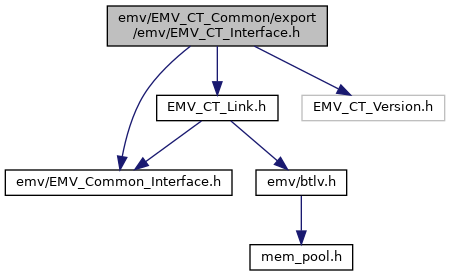
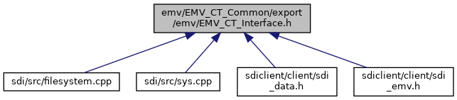

[Data Structures](#nested-classes) \| [Macros](#define-members) \| [Typedefs](#typedef-members) \| [Functions](#func-members)

Interface of CT-Client. [More\...](#details)

`#include "`<a href="_e_m_v___common___interface_8h_source.md">emv/EMV_Common_Interface.h</a>`"`
`#include "`<a href="_e_m_v___c_t___link_8h_source.md">EMV_CT_Link.h</a>`"`
`#include "EMV_CT_Version.h"`

Include dependency graph for EMV_CT_Interface.h:

This graph shows which files directly or indirectly include this file:

<a href="_e_m_v___c_t___interface_8h_source.md">Go to the source code of this file.</a>

|  |  |
|----|----|
| Data Structures |  |
| struct   | [EMV_CT_APPLI_STRUCT](#struct_e_m_v___c_t___a_p_p_l_i___s_t_r_u_c_t) |
|   | 9F06, AID (5 bytes RID + n bytes PIX) [More\...](#struct_e_m_v___c_t___a_p_p_l_i___s_t_r_u_c_t)  |
| struct   | <a href="group___a_d_k___t_r_x___e_x_e_c.md#struct_e_m_v___c_t___c_a_n_d_i_d_a_t_e___s_t_r_u_c_t">EMV_CT_CANDIDATE_STRUCT</a> |
|   | Candidate list structure. <a href="group___a_d_k___t_r_x___e_x_e_c.md#struct_e_m_v___c_t___c_a_n_d_i_d_a_t_e___s_t_r_u_c_t">More...</a>  |
| struct   | <a href="group___a_d_k___t_r_x___e_x_e_c.md#struct_e_m_v___c_t___c_a_n_d_i_d_a_t_e___d_a_t_a___s_t_r_u_c_t">EMV_CT_CANDIDATE_DATA_STRUCT</a> |
|   | Candidate list additional data Output of <a href="group___f_u_n_c___f_l_o_w.md#gac8f6430c652d6dad621ca3c0cf367346">EMV_CT_GetCandidateData()</a> To be used in conjunction with <a href="group___a_d_k___t_r_x___e_x_e_c.md#ad45fa4ce538993473540188bd35612b3">EMV_CT_SELECTRES_STRUCT::T_BF04_Candidates</a>. <a href="group___a_d_k___t_r_x___e_x_e_c.md#struct_e_m_v___c_t___c_a_n_d_i_d_a_t_e___d_a_t_a___s_t_r_u_c_t">More...</a>  |
| struct   | [EMV_CT_DOL_STRUCT](#struct_e_m_v___c_t___d_o_l___s_t_r_u_c_t) |
|   | data object list [More\...](#struct_e_m_v___c_t___d_o_l___s_t_r_u_c_t)  |
| struct   | [EMV_CT_TRACK2_STRUCT](#struct_e_m_v___c_t___t_r_a_c_k2___s_t_r_u_c_t) |
|   | track 2 data [More\...](#struct_e_m_v___c_t___t_r_a_c_k2___s_t_r_u_c_t)  |
| struct   | [EMV_CT_CRDNAME_STRUCT](#struct_e_m_v___c_t___c_r_d_n_a_m_e___s_t_r_u_c_t) |
|   | cardholder name [More\...](#struct_e_m_v___c_t___c_r_d_n_a_m_e___s_t_r_u_c_t)  |
| struct   | [EMV_CT_ICCRND_STRUCT](#struct_e_m_v___c_t___i_c_c_r_n_d___s_t_r_u_c_t) |
|   | icc dynamic number [More\...](#struct_e_m_v___c_t___i_c_c_r_n_d___s_t_r_u_c_t)  |
| struct   | [EMV_CT_ISSDATA_STRUCT](#struct_e_m_v___c_t___i_s_s_d_a_t_a___s_t_r_u_c_t) |
|   | issuer application data [More\...](#struct_e_m_v___c_t___i_s_s_d_a_t_a___s_t_r_u_c_t)  |
| struct   | <a href="group___d_e_f___c_o_n_f___t_e_r_m.md#struct_e_m_v___c_t___t_e_r_m_d_a_t_a___s_t_r_u_c_t">EMV_CT_TERMDATA_STRUCT</a> |
|   | struct for interface to <a href="group___f_u_n_c___c_o_n_f.md#ga351c2deba9865081c314d818463f20c9">EMV_CT_SetTermData()</a> and <a href="group___f_u_n_c___c_o_n_f.md#ga954c82bc82203115b10fcab356df0079">EMV_CT_GetTermData()</a> <a href="group___d_e_f___c_o_n_f___t_e_r_m.md#struct_e_m_v___c_t___t_e_r_m_d_a_t_a___s_t_r_u_c_t">More...</a>  |
| struct   | [EMV_CT_TAGLIST_STRUCT](#struct_e_m_v___c_t___t_a_g_l_i_s_t___s_t_r_u_c_t) |
|   | structure for <a href="group___d_e_f___c_o_n_f___a_p_p_l_i.md#a15601aa3b54c9da3032a3ed1d43b0b6b">EMV_CT_APPLIDATA_STRUCT::Mandatory_Tags_CRD</a> and <a href="group___a_d_k___t_r_x___e_x_e_c.md#abd31d434ee96e0662b86d4ef82017e33">EMV_CT_PAYMENT_STRUCT::Additional_Result_Tags</a> [More\...](#struct_e_m_v___c_t___t_a_g_l_i_s_t___s_t_r_u_c_t)  |
| struct   | <a href="group___d_e_f___c_o_n_f___a_p_p_l_i.md#struct_e_m_v___c_t___a_p_p_l_i_d_a_t_a___s_t_r_u_c_t">EMV_CT_APPLIDATA_STRUCT</a> |
|   | Structure for configuration of one single application see <a href="group___f_u_n_c___c_o_n_f.md#ga73ca1735defbb65a1aae2ead1de70233">EMV_CT_SetAppliData()</a> <a href="group___d_e_f___c_o_n_f___a_p_p_l_i.md#struct_e_m_v___c_t___a_p_p_l_i_d_a_t_a___s_t_r_u_c_t">More...</a>  |
| struct   | <a href="group___a_d_k___t_r_x___e_x_e_c.md#struct_e_m_v___c_t___d_o_m___c_h_i_p___s_t_r_u_c_t">EMV_CT_DOM_CHIP_STRUCT</a> |
|   | Domestic non-EMV chip applications supporting AID selection see <a href="group___a_d_k___t_r_x___e_x_e_c.md#a383caf30fab1895ac0b58becb208a758">EMV_CT_APPS_SELECT_STRUCT::xDomestic_Chip</a> TLV tag <a href="group___v_e_r_i___p_r_i_m___t_a_g_s.md#ga927fb2eed14e8ae18b90305ea57cd212">TAG_EMV_CONFORM</a>. <a href="group___a_d_k___t_r_x___e_x_e_c.md#struct_e_m_v___c_t___d_o_m___c_h_i_p___s_t_r_u_c_t">More...</a>  |
| struct   | <a href="group___a_d_k___t_r_x___e_x_e_c.md#struct_e_m_v___c_t___f_a_l_l_b_c_k___m_s_r___s_t_r_u_c_t">EMV_CT_FALLBCK_MSR_STRUCT</a> |
|   | list of MID applications supported by terminal DF4C, see `xFallback_MS` in <a href="group___a_d_k___t_r_x___e_x_e_c.md#struct_e_m_v___c_t___s_e_l_e_c_t___s_t_r_u_c_t">EMV_CT_SELECT_STRUCT</a> and <a href="group___a_d_k___t_r_x___e_x_e_c.md#struct_e_m_v___c_t___s_e_l_e_c_t_r_e_s___s_t_r_u_c_t">EMV_CT_SELECTRES_STRUCT</a> <a href="group___a_d_k___t_r_x___e_x_e_c.md#struct_e_m_v___c_t___f_a_l_l_b_c_k___m_s_r___s_t_r_u_c_t">More...</a>  |
| struct   | <a href="group___a_d_k___t_r_x___e_x_e_c.md#struct_e_m_v___c_t___p_a_y_m_e_n_t___s_t_r_u_c_t">EMV_CT_PAYMENT_STRUCT</a> |
|   | Transaction parameters of an EMV transaction. <a href="group___a_d_k___t_r_x___e_x_e_c.md#struct_e_m_v___c_t___p_a_y_m_e_n_t___s_t_r_u_c_t">More...</a>  |
| struct   | <a href="group___a_d_k___t_r_x___e_x_e_c.md#struct_e_m_v___c_t___a_p_p_s___s_e_l_e_c_t___s_t_r_u_c_t">EMV_CT_APPS_SELECT_STRUCT</a> |
|   | Application selection parameters of an EMV transaction used for <a href="group___a_d_k___t_r_x___e_x_e_c.md#a8753a5e6226c6aae1dbd68db619d9cc0">EMV_CT_SELECT_STRUCT::SEL_Data</a>. <a href="group___a_d_k___t_r_x___e_x_e_c.md#struct_e_m_v___c_t___a_p_p_s___s_e_l_e_c_t___s_t_r_u_c_t">More...</a>  |
| struct   | <a href="group___a_d_k___t_r_x___e_x_e_c.md#struct_e_m_v___c_t___s_e_l_e_c_t___s_t_r_u_c_t">EMV_CT_SELECT_STRUCT</a> |
|   | struct for interface to <a href="group___f_u_n_c___f_l_o_w.md#gac13472c2a4aea6475fe7bb52627e97eb">EMV_CT_StartTransaction()</a> <a href="group___a_d_k___t_r_x___e_x_e_c.md#struct_e_m_v___c_t___s_e_l_e_c_t___s_t_r_u_c_t">More...</a>  |
| struct   | <a href="group___a_d_k___t_r_x___e_x_e_c.md#struct_e_m_v___c_t___s_e_l_e_c_t_r_e_s___s_t_r_u_c_t">EMV_CT_SELECTRES_STRUCT</a> |
|   | result data of <a href="group___f_u_n_c___f_l_o_w.md#gac13472c2a4aea6475fe7bb52627e97eb">EMV_CT_StartTransaction()</a> <a href="group___a_d_k___t_r_x___e_x_e_c.md#struct_e_m_v___c_t___s_e_l_e_c_t_r_e_s___s_t_r_u_c_t">More...</a>  |
| struct   | <a href="group___a_d_k___t_r_x___e_x_e_c.md#struct_e_m_v___c_t___t_r_a_n_s_a_c___s_t_r_u_c_t">EMV_CT_TRANSAC_STRUCT</a> |
|   | Structure for call of <a href="group___f_u_n_c___f_l_o_w.md#ga8be6df6babc587a19f63f284b2a6f006">EMV_CT_ContinueOffline()</a> <a href="group___a_d_k___t_r_x___e_x_e_c.md#struct_e_m_v___c_t___t_r_a_n_s_a_c___s_t_r_u_c_t">More...</a>  |
| struct   | <a href="group___a_d_k___t_r_x___e_x_e_c.md#struct_e_m_v___c_t___s_r_c_r_i_p_t_r_e_s___s_t_r_u_c_t">EMV_CT_SRCRIPTRES_STRUCT</a> |
|   | Data structure for issuer script results. Used in <a href="group___a_d_k___t_r_x___e_x_e_c.md#a6257b8c91140f05c572607aff48a301e">EMV_CT_TRANSRES_STRUCT::scriptresults</a>. <a href="group___a_d_k___t_r_x___e_x_e_c.md#struct_e_m_v___c_t___s_r_c_r_i_p_t_r_e_s___s_t_r_u_c_t">More...</a>  |
| struct   | <a href="group___a_d_k___t_r_x___e_x_e_c.md#struct_e_m_v___c_t___h_o_s_t___s_t_r_u_c_t">EMV_CT_HOST_STRUCT</a> |
|   | Data structure for host response data. Input for <a href="group___f_u_n_c___f_l_o_w.md#ga42f570d2b8e66841ab9e8de7736e92d4">EMV_CT_ContinueOnline()</a> <a href="group___a_d_k___t_r_x___e_x_e_c.md#struct_e_m_v___c_t___h_o_s_t___s_t_r_u_c_t">More...</a>  |
| struct   | <a href="group___a_d_k___t_r_x___e_x_e_c.md#struct_e_m_v___c_t___t_r_a_n_s_r_e_s___s_t_r_u_c_t">EMV_CT_TRANSRES_STRUCT</a> |
|   | Data structure for output data of <a href="group___f_u_n_c___f_l_o_w.md#ga8be6df6babc587a19f63f284b2a6f006">EMV_CT_ContinueOffline()</a> and <a href="group___f_u_n_c___f_l_o_w.md#ga42f570d2b8e66841ab9e8de7736e92d4">EMV_CT_ContinueOnline()</a> <a href="group___a_d_k___t_r_x___e_x_e_c.md#struct_e_m_v___c_t___t_r_a_n_s_r_e_s___s_t_r_u_c_t">More...</a>  |
| struct   | <a href="group___d_e_f___c_a_r_d___c_o_n_f.md#struct_e_m_v___c_t___c_a_p_k_e_y___s_t_r_u_c_t">EMV_CT_CAPKEY_STRUCT</a> |
|   | Data structure CAP keys. <a href="group___d_e_f___c_a_r_d___c_o_n_f.md#struct_e_m_v___c_t___c_a_p_k_e_y___s_t_r_u_c_t">More...</a>  |
| struct   | <a href="group___d_e_f___c_a_r_d___c_o_n_f.md#struct_e_m_v___c_t___c_a_p_r_e_a_d___s_t_r_u_c_t">EMV_CT_CAPREAD_STRUCT</a> |
|   | Data structure CAP keys. <a href="group___d_e_f___c_a_r_d___c_o_n_f.md#struct_e_m_v___c_t___c_a_p_r_e_a_d___s_t_r_u_c_t">More...</a>  |
| struct   | <a href="group___a_d_k___t_r_x___e_x_e_c.md#struct_e_m_v___c_t___cand_list_type">EMV_CT_CandListType</a> |
|   | Data structure for output of EMV_CT_CheckSupportedAID. <a href="group___a_d_k___t_r_x___e_x_e_c.md#struct_e_m_v___c_t___cand_list_type">More...</a>  |

|  |  |
|----|----|
| Macros |  |
| #define  | [DLL_CTC](#aba0ead6baeabe51c5f4fe870feb9ec16) |
| #define  | [EMV_CT_SUPPORTED_SIZE_9F0A](#a5a1c0c45b228906e2d0ad242ebee0c3f)   50 |
|   | limit for Application Section Registered Proprietary Data size (has been 20 before) [More\...](#a5a1c0c45b228906e2d0ad242ebee0c3f)  |
| #define  | [EMV_CT_COMMON_CANDS](#a73aac817e0b96c40ce27ad8b87a5b2e2)   10 |
|   | Maximum number of mutual candidates in application selection process, see <a href="group___a_d_k___t_r_x___e_x_e_c.md#a4fe0d7ada26ddf2370e623d67a5f00d4">EMV_CT_APPS_SELECT_STRUCT::ModifiedCandidates</a> and <a href="group___a_d_k___t_r_x___e_x_e_c.md#ad45fa4ce538993473540188bd35612b3">EMV_CT_SELECTRES_STRUCT::T_BF04_Candidates</a>. [More\...](#a73aac817e0b96c40ce27ad8b87a5b2e2)  |
| #define  | <a href="group___a_d_k___p_i_n___i_n_p_u_t.md#ga6e50037ec9acfb5dc5af7e8738ce3f12">EMV_CT_PIN_INPUT_ONLINE</a>   0 |
|   | Online enciphered PIN. <a href="group___a_d_k___p_i_n___i_n_p_u_t.md#ga6e50037ec9acfb5dc5af7e8738ce3f12">More...</a>  |
| #define  | <a href="group___a_d_k___p_i_n___i_n_p_u_t.md#ga5e82e9ba31d25d95371f61030d0132b2">EMV_CT_PIN_INPUT_PLAIN</a>   1 |
|   | Offline plaintext PIN. <a href="group___a_d_k___p_i_n___i_n_p_u_t.md#ga5e82e9ba31d25d95371f61030d0132b2">More...</a>  |
| #define  | <a href="group___a_d_k___p_i_n___i_n_p_u_t.md#gaf2bc706ea385477040fc5fa2a0b272c2">EMV_CT_PIN_INPUT_ENCIPHERED</a>   2 |
|   | Offline enciphered PIN. <a href="group___a_d_k___p_i_n___i_n_p_u_t.md#gaf2bc706ea385477040fc5fa2a0b272c2">More...</a>  |
| #define  | <a href="group___a_d_k___p_i_n___i_n_p_u_t.md#gabd2fa8d295e9f978983a061974de8e1e">EMV_CT_PIN_INPUT_PLAIN_EXT</a>   3 |
|   | Offline plaintext PIN at external device (old Verix devices only) <a href="group___a_d_k___p_i_n___i_n_p_u_t.md#gabd2fa8d295e9f978983a061974de8e1e">More...</a>  |
| #define  | <a href="group___a_d_k___p_i_n___i_n_p_u_t.md#ga9822d5331d14c0b6c81a3f1f9519fe6c">EMV_CT_PIN_INPUT_ENCIPHERED_EXT</a>   4 |
|   | Offline enciphered PIN at external device (old Verix devices only) <a href="group___a_d_k___p_i_n___i_n_p_u_t.md#ga9822d5331d14c0b6c81a3f1f9519fe6c">More...</a>  |
| #define  | <a href="group___a_d_k___p_i_n___i_n_p_u_t.md#ga370e1133a282c765ec9f12605b172e3a">EMV_CT_CVM_CUSTOM</a>   5 |
|   | Custom CVM, the highest bit indicates the custom CVM, byte 0\...3 indicates the custom CVM method. <a href="group___a_d_k___p_i_n___i_n_p_u_t.md#ga370e1133a282c765ec9f12605b172e3a">More...</a>  |
| #define  | <a href="group___a_d_k___p_i_n___r_e_t_u_r_n.md#ga6d46e6b2aa75de94de0855301068a093">EMV_CT_PIN_INPUT_OKAY</a>   0 |
|   | PIN input was successful. <a href="group___a_d_k___p_i_n___r_e_t_u_r_n.md#ga6d46e6b2aa75de94de0855301068a093">More...</a>  |
| #define  | <a href="group___a_d_k___p_i_n___r_e_t_u_r_n.md#ga6e1606e2c165d4f4af132d23f6585e37">EMV_CT_PIN_INPUT_COMM_ERR</a>   1 |
|   | Communication error. <a href="group___a_d_k___p_i_n___r_e_t_u_r_n.md#ga6e1606e2c165d4f4af132d23f6585e37">More...</a>  |
| #define  | <a href="group___a_d_k___p_i_n___r_e_t_u_r_n.md#gaed61dc1a7482b607ebad612b3f2d7508">EMV_CT_PIN_INPUT_ABORT</a>   2 |
|   | Customer canceled. <a href="group___a_d_k___p_i_n___r_e_t_u_r_n.md#gaed61dc1a7482b607ebad612b3f2d7508">More...</a>  |
| #define  | <a href="group___a_d_k___p_i_n___r_e_t_u_r_n.md#ga5364807f6ce1265fa8f8e0228db9717c">EMV_CT_PIN_INPUT_BYPASS</a>   3 |
|   | Customer chose \"bypass PIN entry\". <a href="group___a_d_k___p_i_n___r_e_t_u_r_n.md#ga5364807f6ce1265fa8f8e0228db9717c">More...</a>  |
| #define  | <a href="group___a_d_k___p_i_n___r_e_t_u_r_n.md#ga71e47e61824568f46a9c9ed547ef206b">EMV_CT_PIN_INPUT_TIMEOUT</a>   4 |
|   | Timeout. <a href="group___a_d_k___p_i_n___r_e_t_u_r_n.md#ga71e47e61824568f46a9c9ed547ef206b">More...</a>  |
| #define  | <a href="group___a_d_k___p_i_n___r_e_t_u_r_n.md#ga783dde28172a0a5cbe376bd56ece1a90">EMV_CT_PIN_INPUT_OTHER_ERR</a>   5 |
|   | Other error. <a href="group___a_d_k___p_i_n___r_e_t_u_r_n.md#ga783dde28172a0a5cbe376bd56ece1a90">More...</a>  |
| #define  | <a href="group___a_d_k___p_i_n___r_e_t_u_r_n.md#ga032c595c93f6ef2e1a3661fe9de0f197">EMV_CT_PIN_UNCRIT_TIMEOUT</a>   6 |
|   | uncritical timeout (no immediate abort on timeout) <a href="group___a_d_k___p_i_n___r_e_t_u_r_n.md#ga032c595c93f6ef2e1a3661fe9de0f197">More...</a>  |
| #define  | <a href="group___e_m_v___m_o_d_e_s.md#ga11ef026100201895e5b6a3c6b93cddb1">EMV_CT_EMV_0</a>   0x00 |
|   | EMV Application. <a href="group___e_m_v___m_o_d_e_s.md#ga11ef026100201895e5b6a3c6b93cddb1">More...</a>  |
| #define  | <a href="group___e_m_v___m_o_d_e_s.md#ga93504d8f32f108ccc83034ac387853f5">EMV_CT_EMV_1</a>   0x01 |
|   | EMV Application. <a href="group___e_m_v___m_o_d_e_s.md#ga93504d8f32f108ccc83034ac387853f5">More...</a>  |
| #define  | <a href="group___e_m_v___m_o_d_e_s.md#ga7ad6a427e3f4f7df47835522c7896879">EMV_CT_NON_EMV</a>   0xFF |
|   | NON EMV Application. <a href="group___e_m_v___m_o_d_e_s.md#ga7ad6a427e3f4f7df47835522c7896879">More...</a>  |
| #define  | <a href="group___d_e_f___a_d_k___d_e_b_u_g___e_x_i_t.md#ga6602cb6affc875d582c75685aa8fe2b2">EMV_ADK_INF_INIT</a>   0x80 |
|   | Initialization. <a href="group___d_e_f___a_d_k___d_e_b_u_g___e_x_i_t.md#ga6602cb6affc875d582c75685aa8fe2b2">More...</a>  |
| #define  | <a href="group___d_e_f___a_d_k___d_e_b_u_g___e_x_i_t.md#ga62ffd08cc1c86d86aa6d23bb08de23a2">EMV_ADK_INF_SEL_TERMDATA</a>   0x81 |
|   | Application selection: terminal data. <a href="group___d_e_f___a_d_k___d_e_b_u_g___e_x_i_t.md#ga62ffd08cc1c86d86aa6d23bb08de23a2">More...</a>  |
| #define  | <a href="group___d_e_f___a_d_k___d_e_b_u_g___e_x_i_t.md#ga5f7f9380b727ef31f36916ae0141a0bc">EMV_ADK_INF_SEL_TEXTE</a>   0x82 |
|   | Application selection: texts. <a href="group___d_e_f___a_d_k___d_e_b_u_g___e_x_i_t.md#ga5f7f9380b727ef31f36916ae0141a0bc">More...</a>  |
| #define  | <a href="group___d_e_f___a_d_k___d_e_b_u_g___e_x_i_t.md#gafb9e217b84a4f26da5eafe8c87166bb4">EMV_ADK_INF_SEL_PAYINIT_OK</a>   0x83 |
|   | Application selection: Init Payment OK. <a href="group___d_e_f___a_d_k___d_e_b_u_g___e_x_i_t.md#gafb9e217b84a4f26da5eafe8c87166bb4">More...</a>  |
| #define  | <a href="group___d_e_f___a_d_k___d_e_b_u_g___e_x_i_t.md#ga2aa426abc1ee83fa341c831a082ed3b0">EMV_ADK_INF_SEL_CHECK_OK</a>   0x85 |
|   | Application selection: Check OK. <a href="group___d_e_f___a_d_k___d_e_b_u_g___e_x_i_t.md#ga2aa426abc1ee83fa341c831a082ed3b0">More...</a>  |
| #define  | <a href="group___d_e_f___a_d_k___d_e_b_u_g___e_x_i_t.md#ga643014d0b63dd043260ca151cf399498">EMV_ADK_INF_SEL_BUILD_APPLI_LIST</a>   0x86 |
|   | Application selection: Build Application List. <a href="group___d_e_f___a_d_k___d_e_b_u_g___e_x_i_t.md#ga643014d0b63dd043260ca151cf399498">More...</a>  |
| #define  | <a href="group___d_e_f___a_d_k___d_e_b_u_g___e_x_i_t.md#gab7721c37bdc6168b9f7cbeb0b6dcbdaa">EMV_ADK_INF_SEL_ANOTHER</a>   0x87 |
|   | Application selection: Other. <a href="group___d_e_f___a_d_k___d_e_b_u_g___e_x_i_t.md#gab7721c37bdc6168b9f7cbeb0b6dcbdaa">More...</a>  |
| #define  | <a href="group___d_e_f___a_d_k___d_e_b_u_g___e_x_i_t.md#ga686efde9ca4fb2a8bb06f70d8399de13">EMV_ADK_INF_SEL_FINAL</a>   0x88 |
|   | Application selection: Final. <a href="group___d_e_f___a_d_k___d_e_b_u_g___e_x_i_t.md#ga686efde9ca4fb2a8bb06f70d8399de13">More...</a>  |
| #define  | <a href="group___d_e_f___a_d_k___d_e_b_u_g___e_x_i_t.md#ga958c11e50684d4075d6266cb0aa4ff20">EMV_ADK_INF_SEL_NO</a>   0x89 |
|   | Application selection: NO. <a href="group___d_e_f___a_d_k___d_e_b_u_g___e_x_i_t.md#ga958c11e50684d4075d6266cb0aa4ff20">More...</a>  |
| #define  | <a href="group___d_e_f___a_d_k___d_e_b_u_g___e_x_i_t.md#ga1a3dc2a615021755f73e3033fb06394d">EMV_ADK_INF_SEL_FINISH_OK</a>   0x8A |
|   | Application selection: Finished OK. <a href="group___d_e_f___a_d_k___d_e_b_u_g___e_x_i_t.md#ga1a3dc2a615021755f73e3033fb06394d">More...</a>  |
| #define  | <a href="group___d_e_f___a_d_k___d_e_b_u_g___e_x_i_t.md#gaf443e0e3ef07304c9bae011d31dbfebf">EMV_ADK_INF_SEL_BLOCK_APPLI</a>   0x8B |
|   | Application selection: Blocked Application. <a href="group___d_e_f___a_d_k___d_e_b_u_g___e_x_i_t.md#gaf443e0e3ef07304c9bae011d31dbfebf">More...</a>  |
| #define  | <a href="group___d_e_f___a_d_k___d_e_b_u_g___e_x_i_t.md#gafe47de61dbb4dc29fac5ba3d9de98dbf">EMV_ADK_INF_SEL_BLOCK_CARD</a>   0x8C |
|   | Application selection: Blocked Card. <a href="group___d_e_f___a_d_k___d_e_b_u_g___e_x_i_t.md#gafe47de61dbb4dc29fac5ba3d9de98dbf">More...</a>  |
| #define  | <a href="group___d_e_f___a_d_k___d_e_b_u_g___e_x_i_t.md#ga438e058ad5bfc491dc0da2dfc300655e">EMV_ADK_INF_SEL_LOA_PROC</a>   0x8D |
|   | Application selection: LOA Processing. <a href="group___d_e_f___a_d_k___d_e_b_u_g___e_x_i_t.md#ga438e058ad5bfc491dc0da2dfc300655e">More...</a>  |
| #define  | <a href="group___d_e_f___a_d_k___d_e_b_u_g___e_x_i_t.md#ga2ee635804863064e40dc342f3e1b23d0">EMV_ADK_INF_SEL_UI_LOA_PROC</a>   0x8E |
|   | Application selection: LOA Processing (uninterrupted) <a href="group___d_e_f___a_d_k___d_e_b_u_g___e_x_i_t.md#ga2ee635804863064e40dc342f3e1b23d0">More...</a>  |
| #define  | <a href="group___d_e_f___a_d_k___d_e_b_u_g___e_x_i_t.md#ga3e78bd24c572d9a6cb635f739672ac26">EMV_ADK_INF_TRANS_CHECK_OK</a>   0x91 |
|   | Offline transaction processing: Check OK. <a href="group___d_e_f___a_d_k___d_e_b_u_g___e_x_i_t.md#ga3e78bd24c572d9a6cb635f739672ac26">More...</a>  |
| #define  | <a href="group___d_e_f___a_d_k___d_e_b_u_g___e_x_i_t.md#ga03f66e43638de051b961ae0b2881a8c8">EMV_ADK_INF_TRANS_READ_TERM</a>   0x92 |
|   | offline transaction processing: Read Terminal Data <a href="group___d_e_f___a_d_k___d_e_b_u_g___e_x_i_t.md#ga03f66e43638de051b961ae0b2881a8c8">More...</a>  |
| #define  | <a href="group___d_e_f___a_d_k___d_e_b_u_g___e_x_i_t.md#gadfd189ae19924101808b148a07585459">EMV_ADK_INF_TRANS_READ_APPLI</a>   0x93 |
|   | offline transaction processing: Read Application <a href="group___d_e_f___a_d_k___d_e_b_u_g___e_x_i_t.md#gadfd189ae19924101808b148a07585459">More...</a>  |
| #define  | <a href="group___d_e_f___a_d_k___d_e_b_u_g___e_x_i_t.md#ga23db50fccd6b2e548dd9e6b5963e4691">EMV_ADK_INF_TRANS_SEL_LANG</a>   0x95 |
|   | offline transaction processing: Select Language <a href="group___d_e_f___a_d_k___d_e_b_u_g___e_x_i_t.md#ga23db50fccd6b2e548dd9e6b5963e4691">More...</a>  |
| #define  | <a href="group___d_e_f___a_d_k___d_e_b_u_g___e_x_i_t.md#gaf89739d76223fb274b0458a378150e16">EMV_ADK_INF_TRANS_CONF_AMOUNT</a>   0x96 |
|   | offline transaction processing: Confirm Amount <a href="group___d_e_f___a_d_k___d_e_b_u_g___e_x_i_t.md#gaf89739d76223fb274b0458a378150e16">More...</a>  |
| #define  | <a href="group___d_e_f___a_d_k___d_e_b_u_g___e_x_i_t.md#ga73a56d618e59e1607b059f536d793286">EMV_ADK_INF_TRANS_INITIATE</a>   0x97 |
|   | offline transaction processing: Initiation <a href="group___d_e_f___a_d_k___d_e_b_u_g___e_x_i_t.md#ga73a56d618e59e1607b059f536d793286">More...</a>  |
| #define  | <a href="group___d_e_f___a_d_k___d_e_b_u_g___e_x_i_t.md#ga2a8dd6c4431056092298496e9776f8ca">EMV_ADK_INF_TRANS_READ_CARD_DATA</a>   0x98 |
|   | offline transaction processing: Read Card Data <a href="group___d_e_f___a_d_k___d_e_b_u_g___e_x_i_t.md#ga2a8dd6c4431056092298496e9776f8ca">More...</a>  |
| #define  | <a href="group___d_e_f___a_d_k___d_e_b_u_g___e_x_i_t.md#ga4997d00a96dd1e33f2c2e6fe3a70c6df">EMV_ADK_INF_TRANS_CHECK_APPLI_DATA</a>   0x99 |
|   | offline transaction processing: Check Application Data <a href="group___d_e_f___a_d_k___d_e_b_u_g___e_x_i_t.md#ga4997d00a96dd1e33f2c2e6fe3a70c6df">More...</a>  |
| #define  | <a href="group___d_e_f___a_d_k___d_e_b_u_g___e_x_i_t.md#ga04e6bb212d270ca4f17ce240bd998a6a">EMV_ADK_INF_TRANS_PROC_RESTRICTION</a>   0x9A |
|   | offline transaction processing: Process Restriction <a href="group___d_e_f___a_d_k___d_e_b_u_g___e_x_i_t.md#ga04e6bb212d270ca4f17ce240bd998a6a">More...</a>  |
| #define  | <a href="group___d_e_f___a_d_k___d_e_b_u_g___e_x_i_t.md#ga07549de9e64e1da3639bb6300a74f48b">EMV_ADK_INF_TRANS_CARD_AUTH</a>   0x9B |
|   | offline transaction processing: Card Authentication <a href="group___d_e_f___a_d_k___d_e_b_u_g___e_x_i_t.md#ga07549de9e64e1da3639bb6300a74f48b">More...</a>  |
| #define  | <a href="group___d_e_f___a_d_k___d_e_b_u_g___e_x_i_t.md#ga87af85259224132a9a3611d5acd7db56">EMV_ADK_INF_TRANS_VERIFY</a>   0x9C |
|   | offline transaction processing: Verification <a href="group___d_e_f___a_d_k___d_e_b_u_g___e_x_i_t.md#ga87af85259224132a9a3611d5acd7db56">More...</a>  |
| #define  | <a href="group___d_e_f___a_d_k___d_e_b_u_g___e_x_i_t.md#ga123e1b804a77373df214dea47ac8aa01">EMV_ADK_INF_TRANS_RISK</a>   0x9D |
|   | offline transaction processing: Risk <a href="group___d_e_f___a_d_k___d_e_b_u_g___e_x_i_t.md#ga123e1b804a77373df214dea47ac8aa01">More...</a>  |
| #define  | <a href="group___d_e_f___a_d_k___d_e_b_u_g___e_x_i_t.md#ga435486941eef16274ca408aed90af957">EMV_ADK_INF_TRANS_AAT</a>   0x9E |
|   | offline transaction processing: AAT (action analysis terminal) <a href="group___d_e_f___a_d_k___d_e_b_u_g___e_x_i_t.md#ga435486941eef16274ca408aed90af957">More...</a>  |
| #define  | <a href="group___d_e_f___a_d_k___d_e_b_u_g___e_x_i_t.md#gabefd3e6bbcc1aec39e22098aef583043">EMV_ADK_INF_TRANS_1GENAC</a>   0x9F |
|   | offline transaction processing: 1st Genac <a href="group___d_e_f___a_d_k___d_e_b_u_g___e_x_i_t.md#gabefd3e6bbcc1aec39e22098aef583043">More...</a>  |
| #define  | <a href="group___d_e_f___a_d_k___d_e_b_u_g___e_x_i_t.md#ga8354bdf7f43ec922f5d87a15bf045f6c">EMV_ADK_INF_TRANS_VERIFY_CARD</a>   0xA0 |
|   | offline transaction processing: Verify Cardholder <a href="group___d_e_f___a_d_k___d_e_b_u_g___e_x_i_t.md#ga8354bdf7f43ec922f5d87a15bf045f6c">More...</a>  |
| #define  | <a href="group___d_e_f___a_d_k___d_e_b_u_g___e_x_i_t.md#ga072483cf14b90ca69af8336c91c17397">EMV_ADK_INF_TRANS_VERIFY_ABANDON</a>   0xA1 |
|   | offline transaction processing: Verify Abandon <a href="group___d_e_f___a_d_k___d_e_b_u_g___e_x_i_t.md#ga072483cf14b90ca69af8336c91c17397">More...</a>  |
| #define  | <a href="group___d_e_f___a_d_k___d_e_b_u_g___e_x_i_t.md#ga2166c7bf15292621abe4b96af4a37728">EMV_ADK_INF_TRANS_VERIFY_OTHER</a>   0xA2 |
|   | offline transaction processing: Verify Other <a href="group___d_e_f___a_d_k___d_e_b_u_g___e_x_i_t.md#ga2166c7bf15292621abe4b96af4a37728">More...</a>  |
| #define  | <a href="group___d_e_f___a_d_k___d_e_b_u_g___e_x_i_t.md#gafd1e670cb6f036931d1db4894e191251">EMV_ADK_INF_TRANS_VERIFY_ONLINE</a>   0xA3 |
|   | offline transaction processing: Verify Online <a href="group___d_e_f___a_d_k___d_e_b_u_g___e_x_i_t.md#gafd1e670cb6f036931d1db4894e191251">More...</a>  |
| #define  | <a href="group___d_e_f___a_d_k___d_e_b_u_g___e_x_i_t.md#gaa4d9697e3f2adad8b357d170f44cebce">EMV_ADK_INF_TRANS_VERIFY_NOK</a>   0xA4 |
|   | offline transaction processing: Verify NOT OK <a href="group___d_e_f___a_d_k___d_e_b_u_g___e_x_i_t.md#gaa4d9697e3f2adad8b357d170f44cebce">More...</a>  |
| #define  | <a href="group___d_e_f___a_d_k___d_e_b_u_g___e_x_i_t.md#ga30eb017975004c89caa188cedb648d4f">EMV_ADK_INF_TRANS_VERIFY_OK</a>   0xA5 |
|   | offline transaction processing: Verify OK <a href="group___d_e_f___a_d_k___d_e_b_u_g___e_x_i_t.md#ga30eb017975004c89caa188cedb648d4f">More...</a>  |
| #define  | <a href="group___d_e_f___a_d_k___d_e_b_u_g___e_x_i_t.md#gaec2811cd12368efabe3726e89a8c5217">EMV_ADK_INF_TRANS_VERIFY_SIGNATURE</a>   0xA6 |
|   | offline transaction processing: Verify Signature <a href="group___d_e_f___a_d_k___d_e_b_u_g___e_x_i_t.md#gaec2811cd12368efabe3726e89a8c5217">More...</a>  |
| #define  | <a href="group___d_e_f___a_d_k___d_e_b_u_g___e_x_i_t.md#ga28325a4435449f101415279faa83c062">EMV_ADK_INF_TRANS_1CRYPT_TC</a>   0xA7 |
|   | offline transaction processing: 1st Cryptography TC <a href="group___d_e_f___a_d_k___d_e_b_u_g___e_x_i_t.md#ga28325a4435449f101415279faa83c062">More...</a>  |
| #define  | <a href="group___d_e_f___a_d_k___d_e_b_u_g___e_x_i_t.md#gaa3263aa33de98fe32c3d3bc2d23377a8">EMV_ADK_INF_TRANS_1CRYPT_ARQC_CDA</a>   0xA8 |
|   | offline transaction processing: 1st Cryptography ARQC CDA <a href="group___d_e_f___a_d_k___d_e_b_u_g___e_x_i_t.md#gaa3263aa33de98fe32c3d3bc2d23377a8">More...</a>  |
| #define  | <a href="group___d_e_f___a_d_k___d_e_b_u_g___e_x_i_t.md#ga5d835442584edea1ed72dad8b0da3206">EMV_ADK_INF_TRANS_1CRYPT_ARQC_OTHER</a>   0xA9 |
|   | offline transaction processing: 1st Cryptography ARQC Other <a href="group___d_e_f___a_d_k___d_e_b_u_g___e_x_i_t.md#ga5d835442584edea1ed72dad8b0da3206">More...</a>  |
| #define  | <a href="group___d_e_f___a_d_k___d_e_b_u_g___e_x_i_t.md#ga04d000a552cad9a44bf90d8f3549eec6">EMV_ADK_INF_TRANS_1CRYPT_AAC</a>   0xAA |
|   | offline transaction processing: 1st Cryptography AAC <a href="group___d_e_f___a_d_k___d_e_b_u_g___e_x_i_t.md#ga04d000a552cad9a44bf90d8f3549eec6">More...</a>  |
| #define  | <a href="group___d_e_f___a_d_k___d_e_b_u_g___e_x_i_t.md#ga749c67a5070985176e7f9d2d480920b1">EMV_ADK_INF_TRANS_1CRYPT_AAR</a>   0xAB |
|   | offline transaction processing: 1st Cryptography AAC <a href="group___d_e_f___a_d_k___d_e_b_u_g___e_x_i_t.md#ga749c67a5070985176e7f9d2d480920b1">More...</a>  |
| #define  | <a href="group___d_e_f___a_d_k___d_e_b_u_g___e_x_i_t.md#gad9fe857e32dc8a67d4159e2b4fc66a06">EMV_ADK_INF_TRANS_1CRYPT_UNKNOWN</a>   0xAC |
|   | offline transaction processing: 1st Cryptography Unknown <a href="group___d_e_f___a_d_k___d_e_b_u_g___e_x_i_t.md#gad9fe857e32dc8a67d4159e2b4fc66a06">More...</a>  |
| #define  | <a href="group___d_e_f___a_d_k___d_e_b_u_g___e_x_i_t.md#ga20d6ab77e6d85face640f43cd97e2a61">EMV_ADK_INF_ONL_CHECK_OK</a>   0xB1 |
|   | Processing the host response: Check OK. <a href="group___d_e_f___a_d_k___d_e_b_u_g___e_x_i_t.md#ga20d6ab77e6d85face640f43cd97e2a61">More...</a>  |
| #define  | <a href="group___d_e_f___a_d_k___d_e_b_u_g___e_x_i_t.md#gae9b055097a586dc955d8c33d32e572a7">EMV_ADK_INF_ONL_FALSE</a>   0xB3 |
|   | Processing the host response: False. <a href="group___d_e_f___a_d_k___d_e_b_u_g___e_x_i_t.md#gae9b055097a586dc955d8c33d32e572a7">More...</a>  |
| #define  | <a href="group___d_e_f___a_d_k___d_e_b_u_g___e_x_i_t.md#ga4c9a5066e077cfb1fdb1664cfdff31cc">EMV_ADK_INF_ONL_TRUE</a>   0xB4 |
|   | Processing the host response: True. <a href="group___d_e_f___a_d_k___d_e_b_u_g___e_x_i_t.md#ga4c9a5066e077cfb1fdb1664cfdff31cc">More...</a>  |
| #define  | <a href="group___d_e_f___a_d_k___d_e_b_u_g___e_x_i_t.md#ga3736efc005393eafa95196fceb4e93a6">EMV_ADK_INF_ONL_PIN</a>   0xB5 |
|   | Processing the host response: PIN. <a href="group___d_e_f___a_d_k___d_e_b_u_g___e_x_i_t.md#ga3736efc005393eafa95196fceb4e93a6">More...</a>  |
| #define  | <a href="group___d_e_f___a_d_k___d_e_b_u_g___e_x_i_t.md#ga55d6f6da6eef66610ae0ef9b7e2d0343">EMV_ADK_INF_ONL_HOST_AUTH</a>   0xB6 |
|   | Processing the host response: Host Authorization. <a href="group___d_e_f___a_d_k___d_e_b_u_g___e_x_i_t.md#ga55d6f6da6eef66610ae0ef9b7e2d0343">More...</a>  |
| #define  | <a href="group___d_e_f___a_d_k___d_e_b_u_g___e_x_i_t.md#ga6a9cef0034422acd6bdbef57d1fecd8e">EMV_ADK_INF_ONL_CRIT_SC</a>   0xB7 |
|   | Processing the host response: Cirtical Script. <a href="group___d_e_f___a_d_k___d_e_b_u_g___e_x_i_t.md#ga6a9cef0034422acd6bdbef57d1fecd8e">More...</a>  |
| #define  | <a href="group___d_e_f___a_d_k___d_e_b_u_g___e_x_i_t.md#gab24fa6e68a24758fd836f3ed095befb5">EMV_ADK_INF_ONL_AC</a>   0xB8 |
|   | Processing the host response: AC. <a href="group___d_e_f___a_d_k___d_e_b_u_g___e_x_i_t.md#gab24fa6e68a24758fd836f3ed095befb5">More...</a>  |
| #define  | <a href="group___d_e_f___a_d_k___d_e_b_u_g___e_x_i_t.md#ga38c4a30e693b501790284da3d0b89ddd">EMV_ADK_INF_ONL_2GENAC</a>   0xB9 |
|   | Processing the host response: 2nd Generate AC. <a href="group___d_e_f___a_d_k___d_e_b_u_g___e_x_i_t.md#ga38c4a30e693b501790284da3d0b89ddd">More...</a>  |
| #define  | <a href="group___d_e_f___a_d_k___d_e_b_u_g___e_x_i_t.md#ga2f53248d2a91418a8c4b988f24ce97d7">EMV_ADK_INF_ONL_UNCRIT_SC</a>   0xBA |
|   | Processing the host response: Uncritical Script. <a href="group___d_e_f___a_d_k___d_e_b_u_g___e_x_i_t.md#ga2f53248d2a91418a8c4b988f24ce97d7">More...</a>  |
| #define  | <a href="group___d_e_f___a_d_k___d_e_b_u_g___e_x_i_t.md#ga7c06c2aca08194d46e8a52a3161fb120">EMV_ADK_INF_TRANS_VERIFY_PARAM</a>   0xBB |
|   | Processing the host response: Verify Parameter. <a href="group___d_e_f___a_d_k___d_e_b_u_g___e_x_i_t.md#ga7c06c2aca08194d46e8a52a3161fb120">More...</a>  |
| #define  | <a href="group___d_e_f___a_d_k___d_e_b_u_g___e_x_i_t.md#gade7e4a26239abcc90ca7c32b6a1af9d5">EMV_ADK_INF_FETCH_TXN_TAG_DATA</a>   0xBC |
|   | Function `EMV_CT_fetchTxnTags`. <a href="group___d_e_f___a_d_k___d_e_b_u_g___e_x_i_t.md#gade7e4a26239abcc90ca7c32b6a1af9d5">More...</a>  |
| #define  | <a href="group___d_e_f___a_d_k___d_e_b_u_g___s_t_a_t_u_s.md#ga4a42e50cb4721b233893ee8255cffec2">EMV_ADK_STEP_01</a>   1 |
|   | sub step 1 <a href="group___d_e_f___a_d_k___d_e_b_u_g___s_t_a_t_u_s.md#ga4a42e50cb4721b233893ee8255cffec2">More...</a>  |
| #define  | <a href="group___d_e_f___a_d_k___d_e_b_u_g___s_t_a_t_u_s.md#gafd3c0e1bbd8f4845d87e5009ad303723">EMV_ADK_STEP_02</a>   2 |
|   | sub step 2 <a href="group___d_e_f___a_d_k___d_e_b_u_g___s_t_a_t_u_s.md#gafd3c0e1bbd8f4845d87e5009ad303723">More...</a>  |
| #define  | <a href="group___d_e_f___a_d_k___d_e_b_u_g___s_t_a_t_u_s.md#ga5ff6eb5f9c5c12b6e663fd902eb20362">EMV_ADK_STEP_03</a>   3 |
|   | sub step 3 <a href="group___d_e_f___a_d_k___d_e_b_u_g___s_t_a_t_u_s.md#ga5ff6eb5f9c5c12b6e663fd902eb20362">More...</a>  |
| #define  | <a href="group___d_e_f___a_d_k___d_e_b_u_g___s_t_a_t_u_s.md#ga9498a8ece888a4a92df3ed479190c724">EMV_ADK_STEP_04</a>   4 |
|   | sub step 4 <a href="group___d_e_f___a_d_k___d_e_b_u_g___s_t_a_t_u_s.md#ga9498a8ece888a4a92df3ed479190c724">More...</a>  |
| #define  | <a href="group___d_e_f___a_d_k___d_e_b_u_g___s_t_a_t_u_s.md#ga1a6ad6c591dd150761ab4ee50dc941d7">EMV_ADK_STEP_05</a>   5 |
|   | sub step 5 <a href="group___d_e_f___a_d_k___d_e_b_u_g___s_t_a_t_u_s.md#ga1a6ad6c591dd150761ab4ee50dc941d7">More...</a>  |
| #define  | <a href="group___d_e_f___a_d_k___d_e_b_u_g___s_t_a_t_u_s.md#ga690ec73b6fdd2695883814515de6a5d1">EMV_ADK_STEP_06</a>   6 |
|   | sub step 6 <a href="group___d_e_f___a_d_k___d_e_b_u_g___s_t_a_t_u_s.md#ga690ec73b6fdd2695883814515de6a5d1">More...</a>  |
| #define  | <a href="group___d_e_f___a_d_k___d_e_b_u_g___s_t_a_t_u_s.md#ga41fac3819cd6b6770352a64fa4693503">EMV_ADK_STEP_07</a>   7 |
|   | sub step 7 <a href="group___d_e_f___a_d_k___d_e_b_u_g___s_t_a_t_u_s.md#ga41fac3819cd6b6770352a64fa4693503">More...</a>  |
| #define  | <a href="group___d_e_f___a_d_k___d_e_b_u_g___s_t_a_t_u_s.md#ga8623dbe31b1ca72079f0179466aa1c83">EMV_ADK_STEP_08</a>   8 |
|   | sub step 8 <a href="group___d_e_f___a_d_k___d_e_b_u_g___s_t_a_t_u_s.md#ga8623dbe31b1ca72079f0179466aa1c83">More...</a>  |
| #define  | <a href="group___d_e_f___a_d_k___d_e_b_u_g___s_t_a_t_u_s.md#ga2c9a6ee80463df9b60d9afab8ff69178">EMV_ADK_STEP_09</a>   9 |
|   | sub step 9 <a href="group___d_e_f___a_d_k___d_e_b_u_g___s_t_a_t_u_s.md#ga2c9a6ee80463df9b60d9afab8ff69178">More...</a>  |
| #define  | <a href="group___d_e_f___a_d_k___d_e_b_u_g___s_t_a_t_u_s.md#gaa81b04054f5e62a9034a6580bac94a74">EMV_ADK_STEP_10</a>   10 |
|   | sub step 10 <a href="group___d_e_f___a_d_k___d_e_b_u_g___s_t_a_t_u_s.md#gaa81b04054f5e62a9034a6580bac94a74">More...</a>  |
| #define  | <a href="group___d_e_f___a_d_k___d_e_b_u_g___s_t_a_t_u_s.md#gafab88f33018b79e8a082ad6ba556cd1a">EMV_ADK_STEP_11</a>   11 |
|   | sub step 11 <a href="group___d_e_f___a_d_k___d_e_b_u_g___s_t_a_t_u_s.md#gafab88f33018b79e8a082ad6ba556cd1a">More...</a>  |
| #define  | <a href="group___d_e_f___a_d_k___d_e_b_u_g___s_t_a_t_u_s.md#ga6e06d72af81b63312616ea1b6a09ab3d">EMV_ADK_STEP_12</a>   12 |
|   | sub step 12 <a href="group___d_e_f___a_d_k___d_e_b_u_g___s_t_a_t_u_s.md#ga6e06d72af81b63312616ea1b6a09ab3d">More...</a>  |
| #define  | <a href="group___d_e_f___a_d_k___d_e_b_u_g___s_t_a_t_u_s.md#ga02f76fee190806b556811ac005e7dcf7">EMV_ADK_STEP_13</a>   13 |
|   | sub step 13 <a href="group___d_e_f___a_d_k___d_e_b_u_g___s_t_a_t_u_s.md#ga02f76fee190806b556811ac005e7dcf7">More...</a>  |
| #define  | <a href="group___d_e_f___a_d_k___d_e_b_u_g___s_t_a_t_u_s.md#ga6e79dd3ecc1c4c9a0eac24dbe6683917">EMV_ADK_STEP_14</a>   14 |
|   | sub step 14 <a href="group___d_e_f___a_d_k___d_e_b_u_g___s_t_a_t_u_s.md#ga6e79dd3ecc1c4c9a0eac24dbe6683917">More...</a>  |
| #define  | <a href="group___d_e_f___a_d_k___d_e_b_u_g___s_t_a_t_u_s.md#ga107040e049864a9dad335b573b2d232a">EMV_ADK_STEP_15</a>   15 |
|   | sub step 15 <a href="group___d_e_f___a_d_k___d_e_b_u_g___s_t_a_t_u_s.md#ga107040e049864a9dad335b573b2d232a">More...</a>  |
| #define  | <a href="group___d_e_f___a_d_k___d_e_b_u_g___s_t_a_t_u_s.md#ga57b558adeed74332972cb895edd4af07">EMV_ADK_STEP_16</a>   16 |
|   | sub step 16 <a href="group___d_e_f___a_d_k___d_e_b_u_g___s_t_a_t_u_s.md#ga57b558adeed74332972cb895edd4af07">More...</a>  |
| #define  | <a href="group___d_e_f___a_d_k___d_e_b_u_g___s_t_a_t_u_s.md#ga1c28e2c0232ee607634cbc8483709036">EMV_ADK_STEP_17</a>   17 |
|   | sub step 17 <a href="group___d_e_f___a_d_k___d_e_b_u_g___s_t_a_t_u_s.md#ga1c28e2c0232ee607634cbc8483709036">More...</a>  |
| #define  | <a href="group___d_e_f___a_d_k___d_e_b_u_g___s_t_a_t_u_s.md#gae52daa6b6de3370f8754ae3361b03eee">EMV_ADK_STEP_18</a>   18 |
|   | sub step 18 <a href="group___d_e_f___a_d_k___d_e_b_u_g___s_t_a_t_u_s.md#gae52daa6b6de3370f8754ae3361b03eee">More...</a>  |
| #define  | <a href="group___d_e_f___a_d_k___d_e_b_u_g___s_t_a_t_u_s.md#ga8d2c16229ae7e896f7b160a05532b12f">EMV_ADK_STEP_19</a>   19 |
|   | sub step 19 <a href="group___d_e_f___a_d_k___d_e_b_u_g___s_t_a_t_u_s.md#ga8d2c16229ae7e896f7b160a05532b12f">More...</a>  |
| #define  | <a href="group___d_e_f___a_d_k___d_e_b_u_g___s_t_a_t_u_s.md#ga62001a2b89e6f6a9f26f4bbb339dda05">EMV_ADK_STEP_20</a>   20 |
|   | sub step 20 <a href="group___d_e_f___a_d_k___d_e_b_u_g___s_t_a_t_u_s.md#ga62001a2b89e6f6a9f26f4bbb339dda05">More...</a>  |
| #define  | <a href="group___d_e_f___a_d_k___d_e_b_u_g___s_t_a_t_u_s.md#gafec176bbb21eed2d4abe701d6eb97b92">EMV_ADK_STEP_21</a>   21 |
|   | sub step 21 <a href="group___d_e_f___a_d_k___d_e_b_u_g___s_t_a_t_u_s.md#gafec176bbb21eed2d4abe701d6eb97b92">More...</a>  |
| #define  | <a href="group___d_e_f___a_d_k___d_e_b_u_g___s_t_a_t_u_s.md#ga96656cddf63f06b058c8707848fab583">EMV_ADK_STEP_22</a>   22 |
|   | sub step 22 <a href="group___d_e_f___a_d_k___d_e_b_u_g___s_t_a_t_u_s.md#ga96656cddf63f06b058c8707848fab583">More...</a>  |
| #define  | <a href="group___d_e_f___a_d_k___d_e_b_u_g___s_t_a_t_u_s.md#ga689907110dcaf362f049e88f26850183">EMV_ADK_STEP_23</a>   23 |
|   | sub step 23 <a href="group___d_e_f___a_d_k___d_e_b_u_g___s_t_a_t_u_s.md#ga689907110dcaf362f049e88f26850183">More...</a>  |
| #define  | <a href="group___d_e_f___a_d_k___d_e_b_u_g___s_t_a_t_u_s.md#ga67bb368d1ea2698e1418aa23d0f351bb">EMV_ADK_STEP_24</a>   24 |
|   | sub step 24 <a href="group___d_e_f___a_d_k___d_e_b_u_g___s_t_a_t_u_s.md#ga67bb368d1ea2698e1418aa23d0f351bb">More...</a>  |
| #define  | <a href="group___d_e_f___a_d_k___d_e_b_u_g___s_t_a_t_u_s.md#ga1a9c90236879f298c2cd1dfb5cf51ebf">EMV_ADK_STEP_25</a>   25 |
|   | sub step 25 <a href="group___d_e_f___a_d_k___d_e_b_u_g___s_t_a_t_u_s.md#ga1a9c90236879f298c2cd1dfb5cf51ebf">More...</a>  |
| #define  | <a href="group___d_e_f___a_d_k___d_e_b_u_g___s_t_a_t_u_s.md#ga7f3a8eed3b667f49a0ef1beee39820a4">EMV_ADK_STEP_26</a>   26 |
|   | sub step 26 <a href="group___d_e_f___a_d_k___d_e_b_u_g___s_t_a_t_u_s.md#ga7f3a8eed3b667f49a0ef1beee39820a4">More...</a>  |
| #define  | <a href="group___d_e_f___a_d_k___d_e_b_u_g___s_t_a_t_u_s.md#ga08a5ee4a41fcad57a488c58d761d1afe">EMV_ADK_STEP_27</a>   27 |
|   | sub step 27 <a href="group___d_e_f___a_d_k___d_e_b_u_g___s_t_a_t_u_s.md#ga08a5ee4a41fcad57a488c58d761d1afe">More...</a>  |
| #define  | <a href="group___d_e_f___a_d_k___d_e_b_u_g___s_t_a_t_u_s.md#gac4d8b4059b790359e4d999a40b2d0dad">EMV_ADK_STEP_28</a>   28 |
|   | sub step 28 <a href="group___d_e_f___a_d_k___d_e_b_u_g___s_t_a_t_u_s.md#gac4d8b4059b790359e4d999a40b2d0dad">More...</a>  |
| #define  | <a href="group___d_e_f___a_d_k___d_e_b_u_g___s_t_a_t_u_s.md#gaa184b638d173c26077e52fb0372a7d89">EMV_ADK_STEP_29</a>   29 |
|   | sub step 29 <a href="group___d_e_f___a_d_k___d_e_b_u_g___s_t_a_t_u_s.md#gaa184b638d173c26077e52fb0372a7d89">More...</a>  |
| #define  | <a href="group___d_e_f___a_d_k___d_e_b_u_g___s_t_a_t_u_s.md#gacabaf6b5bcc80f8b2c52989ab93d1919">EMV_ADK_STEP_30</a>   30 |
|   | sub step 30 <a href="group___d_e_f___a_d_k___d_e_b_u_g___s_t_a_t_u_s.md#gacabaf6b5bcc80f8b2c52989ab93d1919">More...</a>  |
| #define  | <a href="group___d_e_f___d_f62___p_o_s1.md#ga491f031248d8ef4fe63ad43847a7b9ee">EMV_ADK_DF62_ERR_POS1_CHIP_RESET</a>   0x1000u |
|   | reset (ATR) during technology selection <a href="group___d_e_f___d_f62___p_o_s1.md#ga491f031248d8ef4fe63ad43847a7b9ee">More...</a>  |
| #define  | <a href="group___d_e_f___d_f62___p_o_s1.md#ga08ca19f0cdbfb6efb2409d04ab45898c">EMV_ADK_DF62_ERR_POS1_SEL_LIST_AID</a>   0x2000u |
|   | SELECT during build of candidate list using explicit mode. <a href="group___d_e_f___d_f62___p_o_s1.md#ga08ca19f0cdbfb6efb2409d04ab45898c">More...</a>  |
| #define  | <a href="group___d_e_f___d_f62___p_o_s1.md#ga6b65bfca2a3d3d4c87f0739801c3c3eb">EMV_ADK_DF62_ERR_POS1_SEL_LIST_PSE</a>   0x2100u |
|   | SELECT during build of candidate list using PSE. <a href="group___d_e_f___d_f62___p_o_s1.md#ga6b65bfca2a3d3d4c87f0739801c3c3eb">More...</a>  |
| #define  | <a href="group___d_e_f___d_f62___p_o_s1.md#gaf0b551570ee1171e7c7356b91e61e4ad">EMV_ADK_DF62_ERR_POS1_READ_LIST_PSE</a>   0x2200u |
|   | READ RECORD during build of candidate list using PSE. <a href="group___d_e_f___d_f62___p_o_s1.md#gaf0b551570ee1171e7c7356b91e61e4ad">More...</a>  |
| #define  | <a href="group___d_e_f___d_f62___p_o_s1.md#gac687265b650f549102ecc0547fdf2bb2">EMV_ADK_DF62_ERR_POS1_SEL_FINAL</a>   0x3000u |
|   | SELECT during final selection. <a href="group___d_e_f___d_f62___p_o_s1.md#gac687265b650f549102ecc0547fdf2bb2">More...</a>  |
| #define  | <a href="group___d_e_f___d_f62___p_o_s1.md#gaa19e8a460b225ea33af9fefca4dfbeff">EMV_ADK_DF62_ERR_POS1_GPO</a>   0x4000u |
|   | GET PROCESSING OPTIONS. <a href="group___d_e_f___d_f62___p_o_s1.md#gaa19e8a460b225ea33af9fefca4dfbeff">More...</a>  |
| #define  | <a href="group___d_e_f___d_f62___p_o_s1.md#ga56f0e715826c9b9ce612d67c34c951f4">EMV_ADK_DF62_ERR_POS1_READ</a>   0x5000u |
|   | READ RECORD. <a href="group___d_e_f___d_f62___p_o_s1.md#ga56f0e715826c9b9ce612d67c34c951f4">More...</a>  |
| #define  | <a href="group___d_e_f___d_f62___p_o_s1.md#gaf0e18681abf89502cb3f154e6478b38a">EMV_ADK_DF62_ERR_POS1_INT_AUTH</a>   0x6000u |
|   | INTERNAL AUTHENTICATE. <a href="group___d_e_f___d_f62___p_o_s1.md#gaf0e18681abf89502cb3f154e6478b38a">More...</a>  |
| #define  | <a href="group___d_e_f___d_f62___p_o_s1.md#ga9f96b90edd7e4eda9db8495e8f8fc484">EMV_ADK_DF62_ERR_POS1_GETDATA_PTC</a>   0x7001u |
|   | GET DATA for PIN try counter. <a href="group___d_e_f___d_f62___p_o_s1.md#ga9f96b90edd7e4eda9db8495e8f8fc484">More...</a>  |
| #define  | <a href="group___d_e_f___d_f62___p_o_s1.md#ga07418af7510d16e5084853446b8af411">EMV_ADK_DF62_ERR_POS1_GETCHALLENGE</a>   0x7100u |
|   | GET CHALLENGE. <a href="group___d_e_f___d_f62___p_o_s1.md#ga07418af7510d16e5084853446b8af411">More...</a>  |
| #define  | <a href="group___d_e_f___d_f62___p_o_s1.md#ga430923f72823938e61ef907a0b246424">EMV_ADK_DF62_ERR_POS1_VERIFY_ENC_PIN</a>   0x7210u |
|   | VERIFY for enciphered PIN. <a href="group___d_e_f___d_f62___p_o_s1.md#ga430923f72823938e61ef907a0b246424">More...</a>  |
| #define  | <a href="group___d_e_f___d_f62___p_o_s1.md#ga8b2868d8080ec89377c8b755457b2e47">EMV_ADK_DF62_ERR_POS1_VERIFY_PLAIN_PIN</a>   0x7220u |
|   | VERIFY for plaintext PIN. <a href="group___d_e_f___d_f62___p_o_s1.md#ga8b2868d8080ec89377c8b755457b2e47">More...</a>  |
| #define  | <a href="group___d_e_f___d_f62___p_o_s1.md#gae03fae9a8bbf070ad1390a56ee31816d">EMV_ADK_DF62_ERR_POS1_GETDATA_ATC</a>   0x8001u |
|   | GET DATA for ATC. <a href="group___d_e_f___d_f62___p_o_s1.md#gae03fae9a8bbf070ad1390a56ee31816d">More...</a>  |
| #define  | <a href="group___d_e_f___d_f62___p_o_s1.md#ga2fa3ca79964ff5a4576e79f27f223e64">EMV_ADK_DF62_ERR_POS1_GETDATA_LOATC</a>   0x8002u |
|   | GET DATA for LOATC. <a href="group___d_e_f___d_f62___p_o_s1.md#ga2fa3ca79964ff5a4576e79f27f223e64">More...</a>  |
| #define  | <a href="group___d_e_f___d_f62___p_o_s1.md#ga8c1e73eb021b3850d47b75c0e7f0e793">EMV_ADK_DF62_ERR_POS1_GENAC_1</a>   0x9001u |
|   | 1st GENERATE AC without CDA <a href="group___d_e_f___d_f62___p_o_s1.md#ga8c1e73eb021b3850d47b75c0e7f0e793">More...</a>  |
| #define  | <a href="group___d_e_f___d_f62___p_o_s1.md#ga3c06e0de2995d2a9b147e8534593d2b6">EMV_ADK_DF62_ERR_POS1_GENAC_1_CDA</a>   0x9011u |
|   | 1st GENERATE AC with CDA <a href="group___d_e_f___d_f62___p_o_s1.md#ga3c06e0de2995d2a9b147e8534593d2b6">More...</a>  |
| #define  | <a href="group___d_e_f___d_f62___p_o_s1.md#ga5d81317c5ec89fb4ce1150cca53f06b0">EMV_ADK_DF62_ERR_POS1_EXTAUTH</a>   0xA000u |
|   | EXTERNAL AUTHENTICATE. <a href="group___d_e_f___d_f62___p_o_s1.md#ga5d81317c5ec89fb4ce1150cca53f06b0">More...</a>  |
| #define  | <a href="group___d_e_f___d_f62___p_o_s1.md#ga1addcfbfdfa866e533df9cf7b9614849">EMV_ADK_DF62_ERR_POS1_CRIT_SCRIPT</a>   0xB100u |
|   | critical script command <a href="group___d_e_f___d_f62___p_o_s1.md#ga1addcfbfdfa866e533df9cf7b9614849">More...</a>  |
| #define  | <a href="group___d_e_f___d_f62___p_o_s1.md#ga9f85ceca2cae32d3f3f403db5909aa98">EMV_ADK_DF62_ERR_POS1_GENAC_2</a>   0x9002u |
|   | 2nd GENERATE AC without CDA <a href="group___d_e_f___d_f62___p_o_s1.md#ga9f85ceca2cae32d3f3f403db5909aa98">More...</a>  |
| #define  | <a href="group___d_e_f___d_f62___p_o_s1.md#gaad6efa8e60e69a4f62f9dac23019a928">EMV_ADK_DF62_ERR_POS1_GENAC_2_CDA</a>   0x9012u |
|   | 2nd GENERATE AC with CDA <a href="group___d_e_f___d_f62___p_o_s1.md#gaad6efa8e60e69a4f62f9dac23019a928">More...</a>  |
| #define  | <a href="group___d_e_f___d_f62___p_o_s1.md#ga70d0ed5281e57c2dd5bb04c0e7263a6e">EMV_ADK_DF62_ERR_POS1_NON_CRIT_SCRIPT</a>   0xB200u |
|   | non critical script command <a href="group___d_e_f___d_f62___p_o_s1.md#ga70d0ed5281e57c2dd5bb04c0e7263a6e">More...</a>  |
| #define  | <a href="group___d_e_f___d_f62___p_o_s2.md#ga0a7522e908ddb8dfb41618af3aceb480">EMV_ADK_DF62_ERR_POS2_TRANSPORT_LAYER</a>   0x0000u |
|   | error in transport layer (T=0, T=1) <a href="group___d_e_f___d_f62___p_o_s2.md#ga0a7522e908ddb8dfb41618af3aceb480">More...</a>  |
| #define  | <a href="group___d_e_f___d_f62___p_o_s2.md#gab3b1f3c48eab201e16fb66c241e8c851">EMV_ADK_DF62_ERR_POS2_BASE_ERROR</a>   0x0001u |
|   | base error (wrong length of R-APDU) <a href="group___d_e_f___d_f62___p_o_s2.md#gab3b1f3c48eab201e16fb66c241e8c851">More...</a>  |
| #define  | <a href="group___d_e_f___d_f62___p_o_s2.md#gaf8ee8f301a95f2901203c1bbe4ada40e">EMV_ADK_DF62_ERR_POS2_RAPDU</a>   0xFFFFu |
|   | R-APDU data with wrong content. <a href="group___d_e_f___d_f62___p_o_s2.md#gaf8ee8f301a95f2901203c1bbe4ada40e">More...</a>  |
| #define  | <a href="group___d_e_f___d_f62___p_o_s3.md#ga0934e0e1ea63e50e2b2a78760c18bdb7">EMV_ADK_DF62_ERR_POS3_CHIPCARD</a>   0x01 |
|   | chipcard :-) <a href="group___d_e_f___d_f62___p_o_s3.md#ga0934e0e1ea63e50e2b2a78760c18bdb7">More...</a>  |
| #define  | <a href="group___d_e_f___d_f62___p_o_s3.md#gaa3115d2f139d1519b47c975f41c41c35">EMV_ADK_DF62_ERR_POS3_TERMINAL</a>   0x02 |
|   | terminal <a href="group___d_e_f___d_f62___p_o_s3.md#gaa3115d2f139d1519b47c975f41c41c35">More...</a>  |
| #define  | <a href="group___d_e_f___d_f62___p_o_s3.md#gaa10719ccf592aa1c1080bf8216536b83">EMV_ADK_DF62_ERR_POS3_ACQUIRER</a>   0x03 |
|   | Authorization system. <a href="group___d_e_f___d_f62___p_o_s3.md#gaa10719ccf592aa1c1080bf8216536b83">More...</a>  |
| #define  | <a href="group___d_e_f___d_f62___p_o_s3.md#ga08e1c50381bbece9ea93e258cca623c4">EMV_ADK_DF62_ERR_POS3_CARDHOLDER</a>   0x04 |
|   | cardholder <a href="group___d_e_f___d_f62___p_o_s3.md#ga08e1c50381bbece9ea93e258cca623c4">More...</a>  |
| #define  | <a href="group___d_e_f___d_f62___p_o_s7.md#gad84704aa784b6c4bf1bc1358b4ccfe93">EMV_ADK_DF62_ERR_POS7_ABORT</a>   0x01 |
|   | abort of transaction or end of transaction without TC <a href="group___d_e_f___d_f62___p_o_s7.md#gad84704aa784b6c4bf1bc1358b4ccfe93">More...</a>  |
| #define  | <a href="group___d_e_f___d_f62___p_o_s7.md#ga6867dbc8ffb5d124f6efdbc0470f9081">EMV_ADK_DF62_ERR_POS7_MAG_FALLBACK</a>   0x02 |
|   | magstripe fallback transaction <a href="group___d_e_f___d_f62___p_o_s7.md#ga6867dbc8ffb5d124f6efdbc0470f9081">More...</a>  |
| #define  | <a href="group___d_e_f___i_n_p_u_t___t_e_r_m.md#gaa97540390db40f0c46a6900ade205799">EMV_CT_INPUT_TRM_TYPE</a>   0x01 |
|   | B1b1: <a href="group___d_e_f___c_o_n_f___t_e_r_m.md#aedfef0baa468f4fff2d56821c55f8726">EMV_CT_TERMDATA_STRUCT::TermTyp</a>. <a href="group___d_e_f___i_n_p_u_t___t_e_r_m.md#gaa97540390db40f0c46a6900ade205799">More...</a>  |
| #define  | <a href="group___d_e_f___i_n_p_u_t___t_e_r_m.md#ga25a46ef790b6f8f85d6b5fc357cac05c">EMV_CT_INPUT_TRM_CURRENCY</a>   0x02 |
|   | B1b2: <a href="group___d_e_f___c_o_n_f___t_e_r_m.md#ae1f191741d0c4b9351e7f52d69b20d73">EMV_CT_TERMDATA_STRUCT::CurrencyTrans</a>. <a href="group___d_e_f___i_n_p_u_t___t_e_r_m.md#ga25a46ef790b6f8f85d6b5fc357cac05c">More...</a>  |
| #define  | <a href="group___d_e_f___i_n_p_u_t___t_e_r_m.md#gaba078690f9ef9be7c2a4c7b3c3bd0141">EMV_CT_INPUT_TRM_EXP_CURRENCY</a>   0x04 |
|   | B1b3: <a href="group___d_e_f___c_o_n_f___t_e_r_m.md#aaa3e0774e163e148c88b989c3ada3b76">EMV_CT_TERMDATA_STRUCT::ExpTrans</a>. <a href="group___d_e_f___i_n_p_u_t___t_e_r_m.md#gaba078690f9ef9be7c2a4c7b3c3bd0141">More...</a>  |
| #define  | <a href="group___d_e_f___i_n_p_u_t___t_e_r_m.md#gaaf0058ba5369f88f64da1051553123b4">EMV_CT_INPUT_TRM_COUNTRY_CODE</a>   0x08 |
|   | B1b4: <a href="group___d_e_f___c_o_n_f___t_e_r_m.md#af11a6d7b3bb1f5438dca672b746aeb11">EMV_CT_TERMDATA_STRUCT::TermCountryCode</a>. <a href="group___d_e_f___i_n_p_u_t___t_e_r_m.md#gaaf0058ba5369f88f64da1051553123b4">More...</a>  |
| #define  | <a href="group___d_e_f___i_n_p_u_t___t_e_r_m.md#ga43add8cec7260c4f1dc11c34dc56812b">EMV_CT_INPUT_TRM_CAPABILITIES</a>   0x10 |
|   | B1b5: <a href="group___d_e_f___c_o_n_f___t_e_r_m.md#aa98172f43b850403ff2e6aba0340281f">EMV_CT_TERMDATA_STRUCT::TermCap</a>. <a href="group___d_e_f___i_n_p_u_t___t_e_r_m.md#ga43add8cec7260c4f1dc11c34dc56812b">More...</a>  |
| #define  | <a href="group___d_e_f___i_n_p_u_t___t_e_r_m.md#gae7fb207afea249c2b5384928e7d22bfa">EMV_CT_INPUT_TRM_ADD_CAPS</a>   0x20 |
|   | B1b6: <a href="group___d_e_f___c_o_n_f___t_e_r_m.md#a9cafd59682bd260f14ce67e716046538">EMV_CT_TERMDATA_STRUCT::TermAddCap</a>. <a href="group___d_e_f___i_n_p_u_t___t_e_r_m.md#gae7fb207afea249c2b5384928e7d22bfa">More...</a>  |
| #define  | <a href="group___d_e_f___i_n_p_u_t___t_e_r_m.md#ga6153c89871467b83f3c9de7aeb5ce6c7">EMV_CT_INPUT_TRM_ID</a>   0x40 |
|   | B1b7: <a href="group___d_e_f___c_o_n_f___t_e_r_m.md#a9f0b41880fba4d452b3b9e7b4170a2e1">EMV_CT_TERMDATA_STRUCT::TermIdent</a>. <a href="group___d_e_f___i_n_p_u_t___t_e_r_m.md#ga6153c89871467b83f3c9de7aeb5ce6c7">More...</a>  |
| #define  | <a href="group___d_e_f___i_n_p_u_t___t_e_r_m.md#gadfc1ccfc70eccb63d83e6999efea5b68">EMV_CT_INPUT_TRM_LANGUAGES</a>   0x01 |
|   | B2b1: <a href="group___d_e_f___c_o_n_f___t_e_r_m.md#a9d2672ac7a65bb39a13e450b4cb4737b">EMV_CT_TERMDATA_STRUCT::SuppLang</a>. <a href="group___d_e_f___i_n_p_u_t___t_e_r_m.md#gadfc1ccfc70eccb63d83e6999efea5b68">More...</a>  |
| #define  | <a href="group___d_e_f___i_n_p_u_t___t_e_r_m.md#ga7f8a513612c7ecdca5911e7b3ea65a5d">EMV_CT_INPUT_TRM_IFD_SERIAL</a>   0x02 |
|   | B2b2: <a href="group___d_e_f___c_o_n_f___t_e_r_m.md#a67d893f7b2cd705d266455f171ff7657">EMV_CT_TERMDATA_STRUCT::IFDSerialNumber</a>. <a href="group___d_e_f___i_n_p_u_t___t_e_r_m.md#ga7f8a513612c7ecdca5911e7b3ea65a5d">More...</a>  |
| #define  | <a href="group___d_e_f___i_n_p_u_t___t_e_r_m.md#ga77efe02efa12d9bbafb97deb3ac7b995">EMV_CT_INPUT_TRM_KERNEL_VERSION</a>   0x04 |
|   | B2b3: <a href="group___d_e_f___c_o_n_f___t_e_r_m.md#a808cb5cde9cf6ac837ef81977f4a751c">EMV_CT_TERMDATA_STRUCT::KernelVersion</a>. <a href="group___d_e_f___i_n_p_u_t___t_e_r_m.md#ga77efe02efa12d9bbafb97deb3ac7b995">More...</a>  |
| #define  | <a href="group___d_e_f___i_n_p_u_t___t_e_r_m.md#ga74be00aeb0c765185114c099af576d1b">EMV_CT_INPUT_TRM_FRAMEWORK_VERSION</a>   0x08 |
|   | B2b4: <a href="group___d_e_f___c_o_n_f___t_e_r_m.md#a15d10a5c739bb6c45d9d0bf3f40c0021">EMV_CT_TERMDATA_STRUCT::FrameworkVersion</a>. <a href="group___d_e_f___i_n_p_u_t___t_e_r_m.md#ga74be00aeb0c765185114c099af576d1b">More...</a>  |
| #define  | <a href="group___d_e_f___i_n_p_u_t___t_e_r_m.md#ga88945d9d7fa24549ffbe8abba40c17d9">EMV_CT_INPUT_TRM_L1DRIVER_VERSION</a>   0x10 |
|   | B2b5: <a href="group___d_e_f___c_o_n_f___t_e_r_m.md#a534424c16f043292e2b4bf000b07ead3">EMV_CT_TERMDATA_STRUCT::L1DriverVersion</a>. <a href="group___d_e_f___i_n_p_u_t___t_e_r_m.md#ga88945d9d7fa24549ffbe8abba40c17d9">More...</a>  |
| #define  | <a href="group___t_a_c___i_a_c___d_e_n_i_a_l.md#gac37332da209f939658ada2df8890eb73">EMV_CT_PROCESS_TACIAC_DEFAULT_BEFORE</a>   0x00 |
|   | process default action codes prior to 1st GENERATE AC <a href="group___t_a_c___i_a_c___d_e_n_i_a_l.md#gac37332da209f939658ada2df8890eb73">More...</a>  |
| #define  | <a href="group___t_a_c___i_a_c___d_e_n_i_a_l.md#gacd9cfed9e7b2516bb6d3f7316970a29a">EMV_CT_PROCESS_TACIAC_DEFAULT_AFTER</a>   0x01 |
|   | process default action codes after 1st GENERATE AC <a href="group___t_a_c___i_a_c___d_e_n_i_a_l.md#gacd9cfed9e7b2516bb6d3f7316970a29a">More...</a>  |
| #define  | <a href="group___c_h_k_s_u_m___d_e_f_s.md#ga20cbdc14e89aff9075b318fda4f017a4">EMV_CT_CHECKSUM_DEFAULT</a>   \"\\x00\\x00\\x00\\x00\\x00\" |
|   | 0x00 means: default \--\> when initialized with 0x00 0x00 0x00 then all params set as default mentioned in comment. For changing the default the corresponding Bit must be set: e.g. for Transaction Log disabling, the corresponding Bit must be activated = 1 <a href="group___c_h_k_s_u_m___d_e_f_s.md#ga20cbdc14e89aff9075b318fda4f017a4">More...</a>  |
| #define  | <a href="group___c_h_k_s_u_m___d_e_f_s.md#gab0f66aabe5ca57ac9803cc7843ba8099">EMV_CT_CHECKSUM_INCLUDE_VERSION</a>   0x01 |
|   | B1b1, default: NO \--\> For checksum only. <a href="group___c_h_k_s_u_m___d_e_f_s.md#gab0f66aabe5ca57ac9803cc7843ba8099">More...</a>  |
| #define  | <a href="group___c_h_k_s_u_m___d_e_f_s.md#ga2ed44f63eb470372105fb66907bb15bf">EMV_CT_CHECKSUM_TRANSACTION_LOG</a>   0x02 |
|   | B1b2, default: YES \--\> De/activated per application. <a href="group___c_h_k_s_u_m___d_e_f_s.md#ga2ed44f63eb470372105fb66907bb15bf">More...</a>  |
| #define  | <a href="group___c_h_k_s_u_m___d_e_f_s.md#ga924ff7802b8658820ee293a0e3c38d64">EMV_CT_CHECKSUM_EXCEPTION_FILE</a>   0x04 |
|   | B1b3, default: YES \--\> De/activated per application. <a href="group___c_h_k_s_u_m___d_e_f_s.md#ga924ff7802b8658820ee293a0e3c38d64">More...</a>  |
| #define  | <a href="group___c_h_k_s_u_m___d_e_f_s.md#gaa427d9773f4391c39abca358dabef5ea">EMV_CT_CHECKSUM_FORCE_ONLINE</a>   0x08 |
|   | B1b4, default: YES \--\> De/activated per application and by merchant. <a href="group___c_h_k_s_u_m___d_e_f_s.md#gaa427d9773f4391c39abca358dabef5ea">More...</a>  |
| #define  | <a href="group___c_h_k_s_u_m___d_e_f_s.md#gaedadae44ad15775bd93c589dcfffa460">EMV_CT_CHECKSUM_FORCE_ACCEPTANCE</a>   0x10 |
|   | B1b5, default: YES \--\> De/activated per application and by merchant. <a href="group___c_h_k_s_u_m___d_e_f_s.md#gaedadae44ad15775bd93c589dcfffa460">More...</a>  |
| #define  | <a href="group___c_h_k_s_u_m___d_e_f_s.md#ga28a24b448756bfd1554c0419f5ea4b8d">EMV_CT_CHECKSUM_SUPPORT_ONL_DATA_CAPTURE</a>   0x20 |
|   | B1b6, default: NO \--\> For checksum only \--\> application related decision. <a href="group___c_h_k_s_u_m___d_e_f_s.md#ga28a24b448756bfd1554c0419f5ea4b8d">More...</a>  |
| #define  | <a href="group___c_h_k_s_u_m___d_e_f_s.md#ga45425a687faa00648eaaf48d4b35a4a5">EMV_CT_CHECKSUM_SUPPORT_PSE</a>   0x40 |
|   | B1b7, default: YES \--\> De/activated per transaction (EMV_Select) <a href="group___c_h_k_s_u_m___d_e_f_s.md#ga45425a687faa00648eaaf48d4b35a4a5">More...</a>  |
| #define  | <a href="group___c_h_k_s_u_m___d_e_f_s.md#ga7807a9611c8d73665d1d8927da1a65a0">EMV_CT_CHECKSUM_ACCOUNT_TYPE</a>   0x80 |
|   | B1b8, default: YES \--\> De/activated per application. <a href="group___c_h_k_s_u_m___d_e_f_s.md#ga7807a9611c8d73665d1d8927da1a65a0">More...</a>  |
| #define  | <a href="group___c_h_k_s_u_m___d_e_f_s.md#ga30522e8e212e24a0ad2df937192d3950">EMV_CT_CHECKSUM_SUPPORT_ADVICES</a>   0x01 |
|   | B2b1, default: NO \--\> Support of advices on host prot. <a href="group___c_h_k_s_u_m___d_e_f_s.md#ga30522e8e212e24a0ad2df937192d3950">More...</a>  |
| #define  | <a href="group___c_h_k_s_u_m___d_e_f_s.md#ga6589ddc798be9f8005f4dc1f7a2a6c4c">EMV_CT_CHECKSUM_SUPPORT_CARDHOLDER_CONF</a>   0x02 |
|   | B2b2, default: YES \--\> Cardholder Confirmation. <a href="group___c_h_k_s_u_m___d_e_f_s.md#ga6589ddc798be9f8005f4dc1f7a2a6c4c">More...</a>  |
| #define  | <a href="group___c_h_k_s_u_m___d_e_f_s.md#ga9ef094089eae952238bc36f961c10117">EMV_CT_CHECKSUM_PIN_BYPASS</a>   0x04 |
|   | B2b3, default: NO \--\> PIN bypass. <a href="group___c_h_k_s_u_m___d_e_f_s.md#ga9ef094089eae952238bc36f961c10117">More...</a>  |
| #define  | <a href="group___c_h_k_s_u_m___d_e_f_s.md#ga54b2067bcf84a9d704ffd4779b866dcc">EMV_CT_CHECKSUM_SUPPORT_DEFAULT_TDOL</a>   0x08 |
|   | B2b4, default: YES \--\> Default TDOL. <a href="group___c_h_k_s_u_m___d_e_f_s.md#ga54b2067bcf84a9d704ffd4779b866dcc">More...</a>  |
| #define  | <a href="group___c_h_k_s_u_m___d_e_f_s.md#gad5a962fbebbc8d7082bd51c29bfaaf63">EMV_CT_CHECKSUM_SUPPORT_BATCH_DATA_CAPTURE</a>   0x10 |
|   | B2b5, default: YES \--\> Batch data capture. <a href="group___c_h_k_s_u_m___d_e_f_s.md#gad5a962fbebbc8d7082bd51c29bfaaf63">More...</a>  |
| #define  | <a href="group___c_h_k_s_u_m___d_e_f_s.md#ga0d61a27e5822ac246e19ca4cb4d0b20b">EMV_CT_CHECKSUM_SUPPORT_VOICE_REF_ISS</a>   0x20 |
|   | B2b6, default: YES \--\> Issuer initiated referrals. <a href="group___c_h_k_s_u_m___d_e_f_s.md#ga0d61a27e5822ac246e19ca4cb4d0b20b">More...</a>  |
| #define  | <a href="group___c_h_k_s_u_m___d_e_f_s.md#ga745eee1820113c5b33456f6f88167272">EMV_CT_CHECKSUM_SUPPORT_VOICE_REF_CARD</a>   0x40 |
|   | B2b7, default: NO \--\> Card initiated referrals. <a href="group___c_h_k_s_u_m___d_e_f_s.md#ga745eee1820113c5b33456f6f88167272">More...</a>  |
| #define  | <a href="group___c_h_k_s_u_m___d_e_f_s.md#gaad2a208a6e39d8442e2478d14f814e59">EMV_CT_CHECKSUM_MULTILANG_SUPPORT</a>   0x80 |
|   | B2b7, default: YES since L2 7.0.2. <a href="group___c_h_k_s_u_m___d_e_f_s.md#gaad2a208a6e39d8442e2478d14f814e59">More...</a>  |
| #define  | <a href="group___c_h_k_s_u_m___d_e_f_s.md#ga1869068463843812df2bb29b57a21b19">EMV_CT_CHECKSUM_PIN_BYPASS_ONCE</a>   0x01 |
|   | B3b1, default: NO \--\> No subsequent PIN bypass when PIN bypass is active. <a href="group___c_h_k_s_u_m___d_e_f_s.md#ga1869068463843812df2bb29b57a21b19">More...</a>  |
| #define  | <a href="group___t_a_g_s___n_o_n___e_m_v_c_o.md#gac7db871f8a9da3da95c13bc1dbd052ca">EMV_CT_MAX_NO_OF_NON_EMVCO_TAGS</a>   20 |
|   | Max. number of non-EMVCo-tags included in additional tags (<a href="group___d_e_f___c_o_n_f___a_p_p_l_i.md#ad7a6039ab1aa91113c012eab4293d664">EMV_CT_APPLIDATA_STRUCT::Additional_Tags_TRM</a> and <a href="group___d_e_f___c_o_n_f___a_p_p_l_i.md#acd89bdbc00f19a23befec2eed0ff7b00">EMV_CT_APPLIDATA_STRUCT::Additional_Tags_CRD</a>) <a href="group___t_a_g_s___n_o_n___e_m_v_c_o.md#gac7db871f8a9da3da95c13bc1dbd052ca">More...</a>  |
| #define  | [EMV_CT_MAX_TAGLIST_SIZE](#a1d73dc33281e9093c6158343bec0b4c9)   20 |
|   | Maximum number of tags used in [EMV_CT_TAGLIST_STRUCT](#struct_e_m_v___c_t___t_a_g_l_i_s_t___s_t_r_u_c_t "structure for EMV_CT_APPLIDATA_STRUCT::Mandatory_Tags_CRD and EMV_CT_PAYMENT_STRUCT::Additional_Resul..."). [More\...](#a1d73dc33281e9093c6158343bec0b4c9)  |
| #define  | [EMV_CT_MAX_APP_VERS](#a87b0e0708e0690ad0c48e3a60bd165a5)   10 |
| #define  | <a href="group___d_e_f___i_n_p_u_t___a_p_p_l_i.md#ga2e5e1749c8ce9516611741592c7a7ea2">EMV_CT_INPUT_APL_VERSION</a>   0x01 |
|   | B1b1: <a href="group___d_e_f___c_o_n_f___a_p_p_l_i.md#a4a13940a43927f00f7c701cb98131588">EMV_CT_APPLIDATA_STRUCT::VerNum</a>, application version number. <a href="group___d_e_f___i_n_p_u_t___a_p_p_l_i.md#ga2e5e1749c8ce9516611741592c7a7ea2">More...</a>  |
| #define  | <a href="group___d_e_f___i_n_p_u_t___a_p_p_l_i.md#ga932af997ee523cd74556f8e8c2d4ecee">EMV_CT_INPUT_APL_NAME</a>   0x02 |
|   | B1b2: <a href="group___d_e_f___c_o_n_f___a_p_p_l_i.md#a1a933985680b099e926e54086a602c12">EMV_CT_APPLIDATA_STRUCT::AppName</a>, application name. <a href="group___d_e_f___i_n_p_u_t___a_p_p_l_i.md#ga932af997ee523cd74556f8e8c2d4ecee">More...</a>  |
| #define  | <a href="group___d_e_f___i_n_p_u_t___a_p_p_l_i.md#gad2248942bf630be611652aeb8860cfc2">EMV_CT_INPUT_APL_ASI</a>   0x04 |
|   | B1b3: <a href="group___d_e_f___c_o_n_f___a_p_p_l_i.md#a2000688e48cdadee86eb401946a71785">EMV_CT_APPLIDATA_STRUCT::ASI</a>, ASI. <a href="group___d_e_f___i_n_p_u_t___a_p_p_l_i.md#gad2248942bf630be611652aeb8860cfc2">More...</a>  |
| #define  | <a href="group___d_e_f___i_n_p_u_t___a_p_p_l_i.md#ga4ad26154aa32520b74498b9d80a2b9d2">EMV_CT_INPUT_APL_MERCHANT_CATCODE</a>   0x08 |
|   | B1b4: <a href="group___d_e_f___c_o_n_f___a_p_p_l_i.md#aadaaf73921101bb812f90ec7c4a9d5dd">EMV_CT_APPLIDATA_STRUCT::BrKey</a>, merchant category code. <a href="group___d_e_f___i_n_p_u_t___a_p_p_l_i.md#ga4ad26154aa32520b74498b9d80a2b9d2">More...</a>  |
| #define  | <a href="group___d_e_f___i_n_p_u_t___a_p_p_l_i.md#ga9a19ef45dfdba542e2d536279f1beeae">EMV_CT_INPUT_APL_TID</a>   0x10 |
|   | B1b5: <a href="group___d_e_f___c_o_n_f___a_p_p_l_i.md#a9f0b41880fba4d452b3b9e7b4170a2e1">EMV_CT_APPLIDATA_STRUCT::TermIdent</a>, terminal ID. <a href="group___d_e_f___i_n_p_u_t___a_p_p_l_i.md#ga9a19ef45dfdba542e2d536279f1beeae">More...</a>  |
| #define  | <a href="group___d_e_f___i_n_p_u_t___a_p_p_l_i.md#ga65b5bab068258243ab5dabe904abea37">EMV_CT_INPUT_APL_FLOOR_LIMIT</a>   0x20 |
|   | B1b6: <a href="group___d_e_f___c_o_n_f___a_p_p_l_i.md#ac5fb4232c2d98685b61df7884ccfbaf5">EMV_CT_APPLIDATA_STRUCT::FloorLimit</a>, floor limt. <a href="group___d_e_f___i_n_p_u_t___a_p_p_l_i.md#ga65b5bab068258243ab5dabe904abea37">More...</a>  |
| #define  | <a href="group___d_e_f___i_n_p_u_t___a_p_p_l_i.md#gabca6575e6a688a2db26dc1a853b1879b">EMV_CT_INPUT_APL_THRESH</a>   0x40 |
|   | B1b7: <a href="group___d_e_f___c_o_n_f___a_p_p_l_i.md#a0ff73036f6d3329cc1e8858761af2653">EMV_CT_APPLIDATA_STRUCT::Threshhold</a>, threshhold value. <a href="group___d_e_f___i_n_p_u_t___a_p_p_l_i.md#gabca6575e6a688a2db26dc1a853b1879b">More...</a>  |
| #define  | <a href="group___d_e_f___i_n_p_u_t___a_p_p_l_i.md#ga1775beadd5b4c87f0b04f6c373242840">EMV_CT_INPUT_APL_TARGET</a>   0x80 |
|   | B1b8: <a href="group___d_e_f___c_o_n_f___a_p_p_l_i.md#accfd8d6023e6718726e1a736e0d54e8f">EMV_CT_APPLIDATA_STRUCT::TargetPercentage</a>, target percentage. <a href="group___d_e_f___i_n_p_u_t___a_p_p_l_i.md#ga1775beadd5b4c87f0b04f6c373242840">More...</a>  |
| #define  | <a href="group___d_e_f___i_n_p_u_t___a_p_p_l_i.md#ga7ca0d41a5e2de3c3b9f34d9f3c90c35f">EMV_CT_INPUT_APL_MAXTARGET</a>   0x01 |
|   | B2b1: <a href="group___d_e_f___c_o_n_f___a_p_p_l_i.md#ae06a2f3428cf719f7fc1523a2e2b9fce">EMV_CT_APPLIDATA_STRUCT::MaxTargetPercentage</a>, maximum target percentage. <a href="group___d_e_f___i_n_p_u_t___a_p_p_l_i.md#ga7ca0d41a5e2de3c3b9f34d9f3c90c35f">More...</a>  |
| #define  | <a href="group___d_e_f___i_n_p_u_t___a_p_p_l_i.md#gab264ef83adc481b1afd16edde0886a08">EMV_CT_INPUT_APL_TAC_DENIAL</a>   0x02 |
|   | B2b2: <a href="group___d_e_f___c_o_n_f___a_p_p_l_i.md#ab4a00313a90f392f78eb7517a136aae6">EMV_CT_APPLIDATA_STRUCT::TACDenial</a>, TAC Denial. <a href="group___d_e_f___i_n_p_u_t___a_p_p_l_i.md#gab264ef83adc481b1afd16edde0886a08">More...</a>  |
| #define  | <a href="group___d_e_f___i_n_p_u_t___a_p_p_l_i.md#gab0021c0422bb71c965abc0078a9faf77">EMV_CT_INPUT_APL_TAC_ONLINE</a>   0x04 |
|   | B2b3: <a href="group___d_e_f___c_o_n_f___a_p_p_l_i.md#a71a391d7f8da7dc0e5be8b97c14447da">EMV_CT_APPLIDATA_STRUCT::TACOnline</a>, TAC Online. <a href="group___d_e_f___i_n_p_u_t___a_p_p_l_i.md#gab0021c0422bb71c965abc0078a9faf77">More...</a>  |
| #define  | <a href="group___d_e_f___i_n_p_u_t___a_p_p_l_i.md#ga9e349187d15d9a7d1d50f852f87dd5d2">EMV_CT_INPUT_APL_TAC_DEFAULT</a>   0x08 |
|   | B2b4: <a href="group___d_e_f___c_o_n_f___a_p_p_l_i.md#a6ce1deed9d23bcc207bfb582f59cac6b">EMV_CT_APPLIDATA_STRUCT::TACDefault</a>, TAC Default. <a href="group___d_e_f___i_n_p_u_t___a_p_p_l_i.md#ga9e349187d15d9a7d1d50f852f87dd5d2">More...</a>  |
| #define  | <a href="group___d_e_f___i_n_p_u_t___a_p_p_l_i.md#ga66b7fd71d420257e69f289b2dc56d5e7">EMV_CT_INPUT_APL_TDOL</a>   0x10 |
|   | B2b5: <a href="group___d_e_f___c_o_n_f___a_p_p_l_i.md#a9741f7d86efbb9dc20f687b6cad55f4c">EMV_CT_APPLIDATA_STRUCT::Default_TDOL</a>, Default TDOL. <a href="group___d_e_f___i_n_p_u_t___a_p_p_l_i.md#ga66b7fd71d420257e69f289b2dc56d5e7">More...</a>  |
| #define  | <a href="group___d_e_f___i_n_p_u_t___a_p_p_l_i.md#ga2d3455d96b50bbe6534326fb64dafd20">EMV_CT_INPUT_APL_DDOL</a>   0x20 |
|   | B2b6: <a href="group___d_e_f___c_o_n_f___a_p_p_l_i.md#a27e03203f154c52be3abc2db49842a93">EMV_CT_APPLIDATA_STRUCT::Default_DDOL</a>, Default DDOL. <a href="group___d_e_f___i_n_p_u_t___a_p_p_l_i.md#ga2d3455d96b50bbe6534326fb64dafd20">More...</a>  |
| #define  | <a href="group___d_e_f___i_n_p_u_t___a_p_p_l_i.md#ga932404bc4568e388b35d46434ee7ccf2">EMV_CT_INPUT_APL_MERCHANT_IDENT</a>   0x40 |
|   | B2b7: <a href="group___d_e_f___c_o_n_f___a_p_p_l_i.md#a3e3c059a7e2f459a449ab7e746046cf7">EMV_CT_APPLIDATA_STRUCT::MerchIdent</a>, merchant identification. <a href="group___d_e_f___i_n_p_u_t___a_p_p_l_i.md#ga932404bc4568e388b35d46434ee7ccf2">More...</a>  |
| #define  | <a href="group___d_e_f___i_n_p_u_t___a_p_p_l_i.md#ga6524e8d2866539c261df0e931efbdbd3">EMV_CT_INPUT_APL_ADD_TAGS</a>   0x80 |
|   | B2b8: <a href="group___d_e_f___c_o_n_f___a_p_p_l_i.md#ad7a6039ab1aa91113c012eab4293d664">EMV_CT_APPLIDATA_STRUCT::Additional_Tags_TRM</a>, additional terminal tags. <a href="group___d_e_f___i_n_p_u_t___a_p_p_l_i.md#ga6524e8d2866539c261df0e931efbdbd3">More...</a>  |
| #define  | <a href="group___d_e_f___i_n_p_u_t___a_p_p_l_i.md#ga7a26a94b830ad72eb8a219b0a7aef026">EMV_CT_INPUT_APL_MAND_TAGS</a>   0x01 |
|   | B3b1: <a href="group___d_e_f___c_o_n_f___a_p_p_l_i.md#a15601aa3b54c9da3032a3ed1d43b0b6b">EMV_CT_APPLIDATA_STRUCT::Mandatory_Tags_CRD</a>, mandatory tags. <a href="group___d_e_f___i_n_p_u_t___a_p_p_l_i.md#ga7a26a94b830ad72eb8a219b0a7aef026">More...</a>  |
| #define  | <a href="group___d_e_f___i_n_p_u_t___a_p_p_l_i.md#ga9a89428b080a0f8b7a12058a0fa96e3d">EMV_CT_INPUT_APL_TERM_CAPS</a>   0x02 |
|   | B3b2: <a href="group___d_e_f___c_o_n_f___a_p_p_l_i.md#a7ac173f4a1d9a3845a18af806ee8bb31">EMV_CT_APPLIDATA_STRUCT::App_TermCap</a>, terminal capabilities for app. <a href="group___d_e_f___i_n_p_u_t___a_p_p_l_i.md#ga9a89428b080a0f8b7a12058a0fa96e3d">More...</a>  |
| #define  | <a href="group___d_e_f___i_n_p_u_t___a_p_p_l_i.md#ga90eda81c6374249fce8a0bde0803c342">EMV_CT_INPUT_APL_FLOW_CAPS</a>   0x04 |
|   | B3b3: <a href="group___d_e_f___c_o_n_f___a_p_p_l_i.md#a760a1211f0f7f2df285879a21e2fa9d8">EMV_CT_APPLIDATA_STRUCT::App_FlowCap</a>, flow capabilities. <a href="group___d_e_f___i_n_p_u_t___a_p_p_l_i.md#ga90eda81c6374249fce8a0bde0803c342">More...</a>  |
| #define  | <a href="group___d_e_f___i_n_p_u_t___a_p_p_l_i.md#ga12b949b39aa59affaf8ea075d858a7fd">EMV_CT_INPUT_APL_AIP_CVM_NOTSUPP</a>   0x08 |
|   | B3b4: <a href="group___d_e_f___c_o_n_f___a_p_p_l_i.md#a0cc466b7328ef1933036d1372ba99b00">EMV_CT_APPLIDATA_STRUCT::AIP_CVM_not_supported</a>, CVM in AIP disabled. <a href="group___d_e_f___i_n_p_u_t___a_p_p_l_i.md#ga12b949b39aa59affaf8ea075d858a7fd">More...</a>  |
| #define  | <a href="group___d_e_f___i_n_p_u_t___a_p_p_l_i.md#ga23fbe1e0df3ae5908386f073e82fbffc">EMV_CT_INPUT_APL_COUNTRY_CODE</a>   0x10 |
|   | B3b5: <a href="group___d_e_f___c_o_n_f___a_p_p_l_i.md#a3cc1a7ad9805c9caf22a3164e3f1d326">EMV_CT_APPLIDATA_STRUCT::App_CountryCodeTerm</a>, country code. <a href="group___d_e_f___i_n_p_u_t___a_p_p_l_i.md#ga23fbe1e0df3ae5908386f073e82fbffc">More...</a>  |
| #define  | <a href="group___d_e_f___i_n_p_u_t___a_p_p_l_i.md#ga6214399bb522a66553de15f268663d87">EMV_CT_INPUT_APL_ADD_TERM_CAPS</a>   0x20 |
|   | B3b6: <a href="group___d_e_f___c_o_n_f___a_p_p_l_i.md#aa137395f6cc0b7618d9fec892c3c8b00">EMV_CT_APPLIDATA_STRUCT::App_TermAddCap</a>, addtional terminal capabilties for tapp. <a href="group___d_e_f___i_n_p_u_t___a_p_p_l_i.md#ga6214399bb522a66553de15f268663d87">More...</a>  |
| #define  | <a href="group___d_e_f___i_n_p_u_t___a_p_p_l_i.md#gad2089aa2e0295189f3700d0ef5c24241">EMV_CT_INPUT_APL_PRIO_APPS</a>   0x40 |
|   | B3b7: <a href="group___d_e_f___c_o_n_f___a_p_p_l_i.md#aafdd60748ec764b0398657d3a87e0d19">EMV_CT_APPLIDATA_STRUCT::xAIDPrio</a>, priority application. <a href="group___d_e_f___i_n_p_u_t___a_p_p_l_i.md#gad2089aa2e0295189f3700d0ef5c24241">More...</a>  |
| #define  | <a href="group___d_e_f___i_n_p_u_t___a_p_p_l_i.md#ga9d30ced82f3d642fbc4bf272cb05a75b">EMV_CT_INPUT_APL_MID</a>   0x80 |
|   | B3b8: <a href="group___d_e_f___c_o_n_f___a_p_p_l_i.md#afe1309924816c148ef5665647e4b3f53">EMV_CT_APPLIDATA_STRUCT::tucFallbackMIDs</a>, MID relation. <a href="group___d_e_f___i_n_p_u_t___a_p_p_l_i.md#ga9d30ced82f3d642fbc4bf272cb05a75b">More...</a>  |
| #define  | <a href="group___d_e_f___i_n_p_u_t___a_p_p_l_i.md#ga8d7f564f9da500647def2ae7ac3d214f">EMV_CT_INPUT_APL_EMV_APPKIND</a>   0x01 |
|   | B4b1: <a href="group___d_e_f___c_o_n_f___a_p_p_l_i.md#a04624c8cc1358b3d029f8c77a930c0c6">EMV_CT_APPLIDATA_STRUCT::EMV_Application</a>, EMV Application Type. <a href="group___d_e_f___i_n_p_u_t___a_p_p_l_i.md#ga8d7f564f9da500647def2ae7ac3d214f">More...</a>  |
| #define  | <a href="group___d_e_f___i_n_p_u_t___a_p_p_l_i.md#ga8a7ba244f40aec4bf4845e5d88e9eca5">EMV_CT_INPUT_APL_SPECIAL_TXN</a>   0x02 |
|   | B4b2: <a href="group___d_e_f___c_o_n_f___a_p_p_l_i.md#ab10831fed2998962919365d261912869">EMV_CT_APPLIDATA_STRUCT::xuc_Special_TRX</a>, configuration of special transactions. <a href="group___d_e_f___i_n_p_u_t___a_p_p_l_i.md#ga8a7ba244f40aec4bf4845e5d88e9eca5">More...</a>  |
| #define  | <a href="group___d_e_f___i_n_p_u_t___a_p_p_l_i.md#gaad2c597ff9d332afe12a853c4a98f560">EMV_CT_INPUT_APL_FALLBACK</a>   0x04 |
|   | B4b3: <a href="group___d_e_f___c_o_n_f___a_p_p_l_i.md#a9d0d4cedf99a248f40af087fdfa40b51">EMV_CT_APPLIDATA_STRUCT::uc_FallBack_Handling</a>, fallback handling for this app. <a href="group___d_e_f___i_n_p_u_t___a_p_p_l_i.md#gaad2c597ff9d332afe12a853c4a98f560">More...</a>  |
| #define  | <a href="group___d_e_f___i_n_p_u_t___a_p_p_l_i.md#ga321282e3d102e5aab562ed1e11895825">EMV_CT_INPUT_APL_CDA</a>   0x08 |
|   | B4b4: <a href="group___d_e_f___c_o_n_f___a_p_p_l_i.md#a2673654f6fac8e005bb4cb45dec325ed">EMV_CT_APPLIDATA_STRUCT::CDAProcessing</a>, CDA mode. <a href="group___d_e_f___i_n_p_u_t___a_p_p_l_i.md#ga321282e3d102e5aab562ed1e11895825">More...</a>  |
| #define  | <a href="group___d_e_f___i_n_p_u_t___a_p_p_l_i.md#gad02ef5b9192f47789039e1dc2bb0a122">EMV_CT_INPUT_APL_AC_BEFOREAFTER</a>   0x10 |
|   | B4b5: <a href="group___d_e_f___c_o_n_f___a_p_p_l_i.md#aac6e17c9e053521b910b1eeb6a75c74c">EMV_CT_APPLIDATA_STRUCT::ACBeforeAfter</a>, TAC processing for offline only. <a href="group___d_e_f___i_n_p_u_t___a_p_p_l_i.md#gad02ef5b9192f47789039e1dc2bb0a122">More...</a>  |
| #define  | <a href="group___d_e_f___i_n_p_u_t___a_p_p_l_i.md#ga6afd6ee616691cf5fb77ff9b34ae0870">EMV_CT_INPUT_APL_POS_ENTRY</a>   0x20 |
|   | B4b6: <a href="group___d_e_f___c_o_n_f___a_p_p_l_i.md#a9cec52ed8e47c79a53adb21646bf136e">EMV_CT_APPLIDATA_STRUCT::POS_EntryMode</a>, POS entry mode. <a href="group___d_e_f___i_n_p_u_t___a_p_p_l_i.md#ga6afd6ee616691cf5fb77ff9b34ae0870">More...</a>  |
| #define  | <a href="group___d_e_f___i_n_p_u_t___a_p_p_l_i.md#gac8489e7df9188cc84c052acd86c4d99a">EMV_CT_INPUT_APL_TRM_TYPE</a>   0x40 |
|   | B4b7: <a href="group___d_e_f___c_o_n_f___a_p_p_l_i.md#ae3ea58006297dfb1045a9ff86831112e">EMV_CT_APPLIDATA_STRUCT::App_TermTyp</a>, terminal type. <a href="group___d_e_f___i_n_p_u_t___a_p_p_l_i.md#gac8489e7df9188cc84c052acd86c4d99a">More...</a>  |
| #define  | <a href="group___d_e_f___i_n_p_u_t___a_p_p_l_i.md#gad4324ccb06107ffc964212f1c8f5db18">EMV_CT_INPUT_APL_CUSTOMER_CVM</a>   0x80 |
|   | B4b8: <a href="group___d_e_f___c_o_n_f___a_p_p_l_i.md#afbad69449ba81d43f2d6a43309443bc6">EMV_CT_APPLIDATA_STRUCT::Customer_CVM</a>, customer CVM. <a href="group___d_e_f___i_n_p_u_t___a_p_p_l_i.md#gad4324ccb06107ffc964212f1c8f5db18">More...</a>  |
| #define  | <a href="group___d_e_f___i_n_p_u_t___a_p_p_l_i.md#ga43c0ab0709a8a2b49d98fa878c4604de">EMV_CT_INPUT_APL_CHECKSUM_PARAMS</a>   0x01 |
|   | B5b1: <a href="group___d_e_f___c_o_n_f___a_p_p_l_i.md#a906f3a211340298f467942b94e57010e">EMV_CT_APPLIDATA_STRUCT::Chksum_Params</a>, checksum parmeters. <a href="group___d_e_f___i_n_p_u_t___a_p_p_l_i.md#ga43c0ab0709a8a2b49d98fa878c4604de">More...</a>  |
| #define  | <a href="group___d_e_f___i_n_p_u_t___a_p_p_l_i.md#ga164fc93a15b4268f04cb133ef89f6988">EMV_CT_INPUT_APL_CHECKSUM</a>   0x02 |
|   | B5b2: <a href="group___d_e_f___c_o_n_f___a_p_p_l_i.md#ae6aab5905479e56d87c421779d57b603">EMV_CT_APPLIDATA_STRUCT::ChksumASCIIEMVCO</a>, EMVCo checksum for this app. <a href="group___d_e_f___i_n_p_u_t___a_p_p_l_i.md#ga164fc93a15b4268f04cb133ef89f6988">More...</a>  |
| #define  | <a href="group___d_e_f___i_n_p_u_t___a_p_p_l_i.md#gac94317348011c3e8528affa8f5846787">EMV_CT_INPUT_APL_MASTER_AID</a>   0x04 |
|   | B5b3: <a href="group___d_e_f___c_o_n_f___a_p_p_l_i.md#a4844ee77295b43631df410adb1beaf41">EMV_CT_APPLIDATA_STRUCT::MasterAID</a>, Master AID for groups. <a href="group___d_e_f___i_n_p_u_t___a_p_p_l_i.md#gac94317348011c3e8528affa8f5846787">More...</a>  |
| #define  | <a href="group___d_e_f___i_n_p_u_t___a_p_p_l_i.md#ga5cd4646f7f4cf0d43df97abec7be72bf">EMV_CT_INPUT_APL_ADD_CRD_TAGS</a>   0x08 |
|   | B5b4: <a href="group___d_e_f___c_o_n_f___a_p_p_l_i.md#acd89bdbc00f19a23befec2eed0ff7b00">EMV_CT_APPLIDATA_STRUCT::Additional_Tags_CRD</a>, additional tags available on the ICC. <a href="group___d_e_f___i_n_p_u_t___a_p_p_l_i.md#ga5cd4646f7f4cf0d43df97abec7be72bf">More...</a>  |
| #define  | <a href="group___d_e_f___i_n_p_u_t___a_p_p_l_i.md#gab54d7a9bba15c1fe593246139740229c">EMV_CT_INPUT_APL_ADD_VERSIONS</a>   0x10 |
|   | B5b5: <a href="group___d_e_f___c_o_n_f___a_p_p_l_i.md#a88b324674895d7548b40c7d597cdf84d">EMV_CT_APPLIDATA_STRUCT::Additional_Versions_No</a>, additional version number of AID (optional) <a href="group___d_e_f___i_n_p_u_t___a_p_p_l_i.md#gab54d7a9bba15c1fe593246139740229c">More...</a>  |
| #define  | <a href="group___d_e_f___i_n_p_u_t___a_p_p_l_i.md#gacf94afe7627d9ca7af878e65f1c0616b">EMV_CT_INPUT_APL_SEC_LIMIT</a>   0x20 |
|   | B5b6: <a href="group___d_e_f___c_o_n_f___a_p_p_l_i.md#afa6752c96d0046c68e76710aee5a070f">EMV_CT_APPLIDATA_STRUCT::Security_Limit</a>, limit below which other terminal capabilties apply (optional) <a href="group___d_e_f___i_n_p_u_t___a_p_p_l_i.md#gacf94afe7627d9ca7af878e65f1c0616b">More...</a>  |
| #define  | <a href="group___d_e_f___i_n_p_u_t___a_p_p_l_i.md#ga530a800dd545eecc4b1c239c9d350e77">EMV_CT_INPUT_APL_SEC_CAPS</a>   0x40 |
|   | B5b7: <a href="group___d_e_f___c_o_n_f___a_p_p_l_i.md#aef46aa8782c04a197abd81f77dc5c8ed">EMV_CT_APPLIDATA_STRUCT::Capabilities_belowLimit</a>, terminal capabilties below the security limit (optional) <a href="group___d_e_f___i_n_p_u_t___a_p_p_l_i.md#ga530a800dd545eecc4b1c239c9d350e77">More...</a>  |
| #define  | <a href="group___d_e_f___i_n_p_u_t___a_p_p_l_i.md#gade53080e487f377b98ac9a73e5ecd839">EMV_CT_INPUT_APL_TXN_TYPES_SALE</a>   0x01 |
|   | B6b1: <a href="group___d_e_f___c_o_n_f___a_p_p_l_i.md#a2747a88626df7b02d5a6c3a283972736">EMV_CT_APPLIDATA_STRUCT::TxnTypesSale</a> additional transaction types handled as sale (optional) <a href="group___d_e_f___i_n_p_u_t___a_p_p_l_i.md#gade53080e487f377b98ac9a73e5ecd839">More...</a>  |
| #define  | <a href="group___d_e_f___i_n_p_u_t___a_p_p_l_i.md#gab176e19aa0b87f7aa212186197ac6e3f">EMV_CT_INPUT_APL_TXN_TYPES_CASH</a>   0x02 |
|   | B6b2: <a href="group___d_e_f___c_o_n_f___a_p_p_l_i.md#aaf06c0171381243a268293449aac83a3">EMV_CT_APPLIDATA_STRUCT::TxnTypesCash</a> additional transaction types handled as cash (optional) <a href="group___d_e_f___i_n_p_u_t___a_p_p_l_i.md#gab176e19aa0b87f7aa212186197ac6e3f">More...</a>  |
| #define  | <a href="group___d_e_f___i_n_p_u_t___a_p_p_l_i.md#ga45cbd51e4f959d8e39cc05f09783e3c7">EMV_CT_INPUT_APL_TXN_TYPES_CASHBACK</a>   0x04 |
|   | B6b3: <a href="group___d_e_f___c_o_n_f___a_p_p_l_i.md#a5c423eef2c409c104e37ae13ee5edc91">EMV_CT_APPLIDATA_STRUCT::TxnTypesCashback</a> additional transaction types handled as cashack (optional) <a href="group___d_e_f___i_n_p_u_t___a_p_p_l_i.md#ga45cbd51e4f959d8e39cc05f09783e3c7">More...</a>  |
| #define  | <a href="group___d_e_f___i_n_p_u_t___a_p_p_l_i.md#gaed82c8a9378a9516ad8320176c3a992b">EMV_CT_INPUT_APL_TXN_TYPES_REFUND</a>   0x08 |
|   | B6b4: <a href="group___d_e_f___c_o_n_f___a_p_p_l_i.md#a80c8a1f9e2c537ecbc027981dc237c0b">EMV_CT_APPLIDATA_STRUCT::TxnTypesRefund</a> additional transaction types handled as refund (optional) <a href="group___d_e_f___i_n_p_u_t___a_p_p_l_i.md#gaed82c8a9378a9516ad8320176c3a992b">More...</a>  |
| #define  | <a href="group___d_e_f___i_n_p_u_t___a_p_p_l_i.md#gaf749792412c8972eef629ee6a87c3354">EMV_CT_INPUT_APL_DCR_LIST_IDS</a>   0x10 |
|   | B6b5: <a href="group___d_e_f___c_o_n_f___a_p_p_l_i.md#a94cdb96dc0c72d50b22bc9ee29c25b9f">EMV_CT_APPLIDATA_STRUCT::DataContainerReadIds</a> Data Container Read List for DPAS-2 Data Storage: list of container IDs. <a href="group___d_e_f___i_n_p_u_t___a_p_p_l_i.md#gaf749792412c8972eef629ee6a87c3354">More...</a>  |
| #define  | <a href="group___d_e_f___i_n_p_u_t___a_p_p_l_i.md#gad50c4a902dd130e7204317f31ec43a98">EMV_CT_INPUT_APL_DCR_LIST_RANGES</a>   0x20 |
|   | B6b6: <a href="group___d_e_f___c_o_n_f___a_p_p_l_i.md#a418acaa9bb3b4d2a70442c50205f69a3">EMV_CT_APPLIDATA_STRUCT::DataContainerReadRanges</a> Data Container Read List for DPAS-2 Data Storage: list of container ID ranges. <a href="group___d_e_f___i_n_p_u_t___a_p_p_l_i.md#gad50c4a902dd130e7204317f31ec43a98">More...</a>  |
| #define  | <a href="group___c_v_m___n_o_t___s_u_p_p.md#ga8bb1eae462533aa3795f253764ebac7a">CVM_CONTINUE</a>   0x00 |
|   | continue transaction <a href="group___c_v_m___n_o_t___s_u_p_p.md#ga8bb1eae462533aa3795f253764ebac7a">More...</a>  |
| #define  | <a href="group___c_v_m___n_o_t___s_u_p_p.md#ga1921854389d265d4f73a5a728a15b2f0">CVM_DEFAULT_SIGN</a>   0x01 |
|   | execute CVM signature <a href="group___c_v_m___n_o_t___s_u_p_p.md#ga1921854389d265d4f73a5a728a15b2f0">More...</a>  |
| #define  | <a href="group___c_v_m___n_o_t___s_u_p_p.md#ga5ce67948ce3aed3618597288da18479b">CVM_DEFAULT_ONLINE_PIN</a>   0x02 |
|   | execute CVM online PIN <a href="group___c_v_m___n_o_t___s_u_p_p.md#ga5ce67948ce3aed3618597288da18479b">More...</a>  |
| #define  | <a href="group___c_v_m___n_o_t___s_u_p_p.md#gaefe55babdfa8be334b3b7e51c68b7eee">CVM_ABORT</a>   0x03 |
|   | abort transaction (only for `AIP_CVM_not_supported`) <a href="group___c_v_m___n_o_t___s_u_p_p.md#gaefe55babdfa8be334b3b7e51c68b7eee">More...</a>  |
| #define  | <a href="group___a_p_p___f_l_o_w___c_a_p_s.md#gaee08b26f25b7ab243cb6eefff31ae558">FORCE_RISK_MANAGEMENT</a>   0x01 |
|   | B1b1: Perform Terminal Risk Management regardless of Application Interchange Profile bit \"Terminal risk management is to be performed\". **Important Note** Enable this flag because it is required according EMVCo Book 3, chapter 10.6 Terminal Risk Management. <a href="group___a_p_p___f_l_o_w___c_a_p_s.md#gaee08b26f25b7ab243cb6eefff31ae558">More...</a>  |
| #define  | <a href="group___a_p_p___f_l_o_w___c_a_p_s.md#ga1c2ca65e5df29a89ba04a0ae398a7b6a">BLACKLIST</a>   0x02 |
|   | B1b2: Enables blacklist/transaction log callback (aka exception list, hot list), <a href="adk__emv__contactless__programmers__guide_8dox.md#a591fd0f380cd390007ce78b47be923c4">EMV_CT_CALLBACK_FnT</a> (<a href="group___c_b_c_k___f_c_t___t_a_g_s.md#ga7db951ffee1aa377131cd752468145a4">TAG_BF03_CBK_LOG_HOTLIST</a>) will be invoked Depends on <a href="group___t_x_n___o_p_t_i_o_n_s.md#gae29197978a50277b7ebbcb8c3890be9d">EMV_CT_TRXOP_HOTLST_LOG_CALLBACK</a> and <a href="group___t_x_n___s_t_e_p_s.md#gaddc20bcb42b1a9a5ec97e7514f2d4504">MS_RETURN_CALLBACKS</a>. <a href="group___a_p_p___f_l_o_w___c_a_p_s.md#ga1c2ca65e5df29a89ba04a0ae398a7b6a">More...</a>  |
| #define  | <a href="group___a_p_p___f_l_o_w___c_a_p_s.md#gad94a1aceb2a0229425243ca4327e2070">TRANSACTION_LOG</a>   0x04 |
|   | B1b3: Enables blacklist/transaction log callback for avoiding spit payments according EMVCo Book 3, chapter 10.6.1 Floor Limits. <a href="adk__emv__contactless__programmers__guide_8dox.md#a591fd0f380cd390007ce78b47be923c4">EMV_CT_CALLBACK_FnT</a> (<a href="group___c_b_c_k___f_c_t___t_a_g_s.md#ga7db951ffee1aa377131cd752468145a4">TAG_BF03_CBK_LOG_HOTLIST</a>) will be invoked Depends on <a href="group___t_x_n___o_p_t_i_o_n_s.md#gae29197978a50277b7ebbcb8c3890be9d">EMV_CT_TRXOP_HOTLST_LOG_CALLBACK</a> and <a href="group___t_x_n___s_t_e_p_s.md#gaddc20bcb42b1a9a5ec97e7514f2d4504">MS_RETURN_CALLBACKS</a>. <a href="group___a_p_p___f_l_o_w___c_a_p_s.md#gad94a1aceb2a0229425243ca4327e2070">More...</a>  |
| #define  | <a href="group___a_p_p___f_l_o_w___c_a_p_s.md#ga1b11ddaf81867095dd71695d2c8223c7">PIN_BYPASS</a>   0x08 |
|   | B1b4: PIN bypass supported. <a href="group___a_p_p___f_l_o_w___c_a_p_s.md#ga1b11ddaf81867095dd71695d2c8223c7">More...</a>  |
| #define  | <a href="group___a_p_p___f_l_o_w___c_a_p_s.md#ga47602479dfd6ef2e6e8abc888ff9b0b7">FORCE_ONLINE</a>   0x10 |
|   | B1b5: Feature \"Force online\" supported (suspicious customer). This relates to Terminal Verification Result B4b4 \"Merchant forced transaction online\". Note: Force Online is performed if both flags are set, the support flag here and the transaction flow option <a href="group___a_d_k___t_r_x___e_x_e_c.md#ac9379ba99fde04b446f004946e00cb7f">EMV_CT_PAYMENT_STRUCT::Force_Online</a>. <a href="group___a_p_p___f_l_o_w___c_a_p_s.md#ga47602479dfd6ef2e6e8abc888ff9b0b7">More...</a>  |
| #define  | <a href="group___a_p_p___f_l_o_w___c_a_p_s.md#ga4f9335f46418db8ef04c027ce9765c57">FORCE_ACCEPTANCE</a>   0x20 |
|   | B1b6: Feature \"Force acceptance\" supported (accept on merchant\'s risk). **Use with care**: This overrules the card\'s or terminal or authorisation host decision. Note: Force Acceptance is performed if both flags are set, the support flag here and the transaction flow option <a href="group___a_d_k___t_r_x___e_x_e_c.md#a9d831c8180100292e2f5e0f198eb3197">EMV_CT_PAYMENT_STRUCT::Force_Acceptance</a>. <a href="group___a_p_p___f_l_o_w___c_a_p_s.md#ga4f9335f46418db8ef04c027ce9765c57">More...</a>  |
| #define  | <a href="group___a_p_p___f_l_o_w___c_a_p_s.md#ga489ba3e503cc62c324283b817e4ce9d5">CASH_SUPPORT</a>   0x01 |
|   | B2b1: Support of cash transactions. <a href="group___a_p_p___f_l_o_w___c_a_p_s.md#ga489ba3e503cc62c324283b817e4ce9d5">More...</a>  |
| #define  | <a href="group___a_p_p___f_l_o_w___c_a_p_s.md#ga71389d5558bb1342c2f7ffa8fb3be889">CASHBACK_SUPPORT</a>   0x02 |
|   | B2b2: Support of cashback transactions. <a href="group___a_p_p___f_l_o_w___c_a_p_s.md#ga71389d5558bb1342c2f7ffa8fb3be889">More...</a>  |
| #define  | <a href="group___a_p_p___f_l_o_w___c_a_p_s.md#gaee3e506de58eb8bf23ed8b28de286cf7">EMV_CT_CHECK_INCONS_TRACK2_PAN</a>   0x04 |
|   | B2b3: Check consistency of track2 equivalent data (<a href="group___e_m_v_c_o___t_a_g_s.md#ga2e6e79fb698c2021efe43366f6517b76">TAG_57_TRACK2_EQUIVALENT</a>) provided by ICC. Mandated for MasterCard and Amex. Validate format and that contents matches to <a href="group___e_m_v_c_o___t_a_g_s.md#ga4ccedb21a71fcb6ace22bac98ba548a5">TAG_5A_APP_PAN</a> and <a href="group___e_m_v_c_o___t_a_g_s.md#ga5eb2095961ebe9a91e560003f75358bb">TAG_5F24_APP_EXP_DATE</a>. See also <a href="group___a_p_p___f_l_o_w___c_a_p_s.md#ga72dbff18249409a98bfb36ad8dbc120c">EMV_CT_FALLBACK_ON_INCONS_TRACK2</a>. <a href="group___a_p_p___f_l_o_w___c_a_p_s.md#gaee3e506de58eb8bf23ed8b28de286cf7">More...</a>  |
| #define  | <a href="group___a_p_p___f_l_o_w___c_a_p_s.md#ga646066dcb5ff2196f23e81697ece0fa0">EMV_CT_CONF_AMOUNT_PIN</a>   0x08 |
|   | B2b4: Confirm amount and enter PIN in one display. Invoking callback for amount confirmation depends on <a href="group___t_x_n___o_p_t_i_o_n_s.md#gab7245d9aa5ebca9d6947cfe8af8717d1">EMV_CT_TRXOP_AMOUNT_CONF</a>. May be deactivated by <a href="group___t_x_n___s_t_e_p_s.md#gaddc20bcb42b1a9a5ec97e7514f2d4504">MS_RETURN_CALLBACKS</a>. <a href="group___a_p_p___f_l_o_w___c_a_p_s.md#ga646066dcb5ff2196f23e81697ece0fa0">More...</a>  |
| #define  | <a href="group___a_p_p___f_l_o_w___c_a_p_s.md#ga6bef1f7d609844cde9f398ca3de81925">EMV_CT_DOMESTIC_CHECK</a>   0x10 |
|   | B2b5: Callback function <a href="adk__emv__contactless__programmers__guide_8dox.md#a591fd0f380cd390007ce78b47be923c4">EMV_CT_CALLBACK_FnT</a> (<a href="group___c_b_c_k___f_c_t___t_a_g_s.md#gac82fa7e4064512e71e63fd647b817d97">TAG_BF06_CBK_LOCAL_CHECKS</a>) will be called. Needs to be activated per transaction by <a href="group___t_x_n___o_p_t_i_o_n_s.md#gab25c0778e85a9cc2c72c33cd0616bf89">EMV_CT_TRXOP_LOCAL_CHCK_CALLBACK</a>. May be deactivated by <a href="group___t_x_n___s_t_e_p_s.md#gaddc20bcb42b1a9a5ec97e7514f2d4504">MS_RETURN_CALLBACKS</a>. <a href="group___a_p_p___f_l_o_w___c_a_p_s.md#ga6bef1f7d609844cde9f398ca3de81925">More...</a>  |
| #define  | <a href="group___a_p_p___f_l_o_w___c_a_p_s.md#ga1f725b084f3a2c3bb96f88682d9771b7">TRANSACTION_TYPE_17_FOR_CASH</a>   0x20 |
|   | B2b6: Transaction type 17 for MasterCard cash transactions. <a href="group___a_p_p___f_l_o_w___c_a_p_s.md#ga1f725b084f3a2c3bb96f88682d9771b7">More...</a>  |
| #define  | <a href="group___a_p_p___f_l_o_w___c_a_p_s.md#gaa9a21400bb4e6af566b3d70db1562f95">EMV_CT_CHECK_INCONS_TRACK2_NO_EXP</a>   0x40 |
|   | B2b7: Check consistency of track2 equivalent data (<a href="group___e_m_v_c_o___t_a_g_s.md#ga2e6e79fb698c2021efe43366f6517b76">TAG_57_TRACK2_EQUIVALENT</a>) provided by ICC. Mandated for MasterCard and Amex. Validate format and that contents matches to <a href="group___e_m_v_c_o___t_a_g_s.md#ga4ccedb21a71fcb6ace22bac98ba548a5">TAG_5A_APP_PAN</a> Only effective if <a href="group___a_p_p___f_l_o_w___c_a_p_s.md#gaee3e506de58eb8bf23ed8b28de286cf7">EMV_CT_CHECK_INCONS_TRACK2_PAN</a> is deactivated. See also <a href="group___a_p_p___f_l_o_w___c_a_p_s.md#ga72dbff18249409a98bfb36ad8dbc120c">EMV_CT_FALLBACK_ON_INCONS_TRACK2</a>. <a href="group___a_p_p___f_l_o_w___c_a_p_s.md#gaa9a21400bb4e6af566b3d70db1562f95">More...</a>  |
| #define  | <a href="group___a_p_p___f_l_o_w___c_a_p_s.md#gae14fcda0b3386fb802c3f17ec5ac9d89">TRANSACTION_TYPE_30_FOR_PREAUTH</a>   0x80 |
|   | B2b8: Amex Pre-Authorization with transaction type 30. <a href="group___a_p_p___f_l_o_w___c_a_p_s.md#gae14fcda0b3386fb802c3f17ec5ac9d89">More...</a>  |
| #define  | <a href="group___a_p_p___f_l_o_w___c_a_p_s.md#ga12aa86ad3046acf00e6471607b47af26">REFERRAL_AFTER_TRX</a>   0x01 |
|   | B3b1: In case voice referral is required: Chip transaction is terminated with AAC. Referral transaction is performed subsequently as \"CardNotPresent\" (German handling). <a href="group___a_p_p___f_l_o_w___c_a_p_s.md#ga12aa86ad3046acf00e6471607b47af26">More...</a>  |
| #define  | <a href="group___a_p_p___f_l_o_w___c_a_p_s.md#gab46cea653620bce1d34685cb1ab851d9">DCC_CHECK</a>   0x02 |
|   | B3b2: Enable DCC (Dynamic currency conversion). Invocation depends on <a href="group___t_x_n___s_t_e_p_s.md#gaddc20bcb42b1a9a5ec97e7514f2d4504">MS_RETURN_CALLBACKS</a>, <a href="group___t_x_n___o_p_t_i_o_n_s.md#ga37fe06e4949f5a341274dbe45c208b84">EMV_CT_TRXOP_DCC_CALLBACK</a>, and <a href="group___t_x_n___o_p_t_i_o_n_s.md#ga8507bff64333d12639114aa6b18feb07">EMV_CT_TRXOP_DCC_CALLBACK_ALWAYS</a>. <a href="group___a_p_p___f_l_o_w___c_a_p_s.md#gab46cea653620bce1d34685cb1ab851d9">More...</a>  |
| #define  | <a href="group___a_p_p___f_l_o_w___c_a_p_s.md#ga4edf2c5ac7045ec648b60ad31aee30d5">REFUND_CONFIRM_AMOUNT</a>   0x04 |
|   | B3b3: Confirm amount during refund transaction Invoking callback for amount confirmation depends on <a href="group___t_x_n___o_p_t_i_o_n_s.md#gab7245d9aa5ebca9d6947cfe8af8717d1">EMV_CT_TRXOP_AMOUNT_CONF</a> and <a href="group___t_x_n___s_t_e_p_s.md#gaddc20bcb42b1a9a5ec97e7514f2d4504">MS_RETURN_CALLBACKS</a>. <a href="group___a_p_p___f_l_o_w___c_a_p_s.md#ga4edf2c5ac7045ec648b60ad31aee30d5">More...</a>  |
| #define  | <a href="group___a_p_p___f_l_o_w___c_a_p_s.md#ga22763bc1e7f83bf17f8ee093f5d221be">EMV_CT_USE_CFG_APPL_NAME</a>   0x08 |
|   | B3b4: **Use with care**: Do not use card\'s application name (EMVCo rule: 9F12 prior to 50) but always the default label. Effective for cardholder\'s application selection. <a href="group___a_p_p___f_l_o_w___c_a_p_s.md#ga22763bc1e7f83bf17f8ee093f5d221be">More...</a>  |
| #define  | <a href="group___a_p_p___f_l_o_w___c_a_p_s.md#ga72dbff18249409a98bfb36ad8dbc120c">EMV_CT_FALLBACK_ON_INCONS_TRACK2</a>   0x10 |
|   | B3b5: Valid only in case of activated <a href="group___a_p_p___f_l_o_w___c_a_p_s.md#gaee3e506de58eb8bf23ed8b28de286cf7">EMV_CT_CHECK_INCONS_TRACK2_PAN</a>. If activated: Check will be done before Cardholder Verification. In case of fail EMV ADK will process fallback handling (may result in <a href="group___a_d_k___r_e_t___c_o_d_e.md#ga5f6c47c1042b70f3753191850219e745">EMV_ADK_FALLBACK</a>). E.g. required for German dcpos 2.4, may be used for \"M/Chip Functional Architecture\", AMEX ED-031 in test plan ver. 4.2. If not activated: Check will be done just before processing 1st cryptogram. If fail: GENAC1 will be requested with AAC. E.g. required for MasterCard REQ22, AMEX ED-031 in Swedish AMEX test plan 1.0. <a href="group___a_p_p___f_l_o_w___c_a_p_s.md#ga72dbff18249409a98bfb36ad8dbc120c">More...</a>  |
| #define  | <a href="group___a_p_p___f_l_o_w___c_a_p_s.md#ga8285318caacc7779fb5856347821f002">EMV_CT_AMOUNT_CONFIRM_ON_SIGNATURE</a>   0x20 |
|   | B3b6: Customer amount confirmation in case of CVM signature Invoking callback for amount confirmation depends on <a href="group___t_x_n___o_p_t_i_o_n_s.md#gab7245d9aa5ebca9d6947cfe8af8717d1">EMV_CT_TRXOP_AMOUNT_CONF</a> and <a href="group___t_x_n___s_t_e_p_s.md#gaddc20bcb42b1a9a5ec97e7514f2d4504">MS_RETURN_CALLBACKS</a>. <a href="group___a_p_p___f_l_o_w___c_a_p_s.md#ga8285318caacc7779fb5856347821f002">More...</a>  |
| #define  | <a href="group___a_p_p___f_l_o_w___c_a_p_s.md#gaa620439dcd310cd5da916263133cf34e">EMV_CT_SDA_SELECTED_TVR_ON</a>   0x40 |
|   | B3b7: Activate the support of the TVR byte SDA selected, introduced in Nov 2013 for kernels not yet supporting this feature, configurable per AID (for kernels supporting this it\'ll be always activated, config is don\'t care) <a href="group___a_p_p___f_l_o_w___c_a_p_s.md#gaa620439dcd310cd5da916263133cf34e">More...</a>  |
| #define  | <a href="group___a_p_p___f_l_o_w___c_a_p_s.md#ga44d3a9d86f6ec48aaa1cb8e10c959866">EMV_CASHBACK_OFFLINE_SUPPORT</a>   0x80 |
|   | B3b8: If set cash back transactions are not automatically forced online. **Use with care**: Usual business rules require online processing. <a href="group___a_p_p___f_l_o_w___c_a_p_s.md#ga44d3a9d86f6ec48aaa1cb8e10c959866">More...</a>  |
| #define  | <a href="group___a_p_p___f_l_o_w___c_a_p_s.md#gaf3c86af213c3448eb97e2e9974675b12">REFUND_PROCESSING_RESTRICTIONS</a>   0x01 |
|   | B4b1: Perform Processing restrictions for Refund transactions (French Refund Requirements). <a href="group___a_p_p___f_l_o_w___c_a_p_s.md#gaf3c86af213c3448eb97e2e9974675b12">More...</a>  |
| #define  | <a href="group___a_p_p___f_l_o_w___c_a_p_s.md#gabfeb6fa819ae4435dc04517213f300e9">REFUND_NO_GENERATE_AC</a>   0x02 |
|   | B4b2: Do not perform Generate AC when finishing Refund transactions (French Refund Requirements). <a href="group___a_p_p___f_l_o_w___c_a_p_s.md#gabfeb6fa819ae4435dc04517213f300e9">More...</a>  |
| #define  | <a href="group___a_p_p___f_l_o_w___c_a_p_s.md#ga3ebc4a9d9f3ba1e966a2f6c5e11aaa17">REFUND_FLOW_INTERAC</a>   0x04 |
|   | B4b3: Perform full EMV transaction although transaction type is refund. **Use with care**: Is is recommended by EMVCo to abort the transaction once the account data has been read. Activation of the \"full\" flow requires that all cards and background systems support it. <a href="group___a_p_p___f_l_o_w___c_a_p_s.md#ga3ebc4a9d9f3ba1e966a2f6c5e11aaa17">More...</a>  |
| #define  | <a href="group___a_p_p___f_l_o_w___c_a_p_s.md#gae91301339a147a2e8f63939ebc0c5e5b">REFUND_NO_ZERO_AMOUNT</a>   0x08 |
|   | B4b4: Do NOT set the amount to zero in CDOL1 for Refund transactions with Generate AC. **Use with care**: Card read transactions are just for getting the account data and it is best practice to \"close\" the card session by requesting an ARQC with zero amount. <a href="group___a_p_p___f_l_o_w___c_a_p_s.md#gae91301339a147a2e8f63939ebc0c5e5b">More...</a>  |
| #define  | <a href="group___a_p_p___f_l_o_w___c_a_p_s.md#ga925d41cbe427c6b1fd6b70925b9042f7">DPAS_DATA_STORAGE_SUPPORT</a>   0x10 |
|   | B4b5: Support of Data Storage for D-PAS Connect. Useful only for Discover AIDs. <a href="group___a_p_p___f_l_o_w___c_a_p_s.md#ga925d41cbe427c6b1fd6b70925b9042f7">More...</a>  |
| #define  | <a href="group___a_p_p___f_l_o_w___c_a_p_s.md#ga11aa53fe15a844eee0042676294c5309">DPAS_EXTENDED_LOGGING_SUPPORT</a>   0x20 |
|   | B4b6: Support of Extended Logging for D-PAS Connect. Useful only for Discover AIDs. <a href="group___a_p_p___f_l_o_w___c_a_p_s.md#ga11aa53fe15a844eee0042676294c5309">More...</a>  |
| #define  | <a href="group___a_p_p___f_l_o_w___c_a_p_s.md#ga0ec1bd03b13c6fe605fd8ef7c6b71f86">DPAS_CDCVM_SUPPORT</a>   0x40 |
|   | B4b7: Support of Consumer Device CVM for D-PAS Connect. Useful only for Discover AIDs. <a href="group___a_p_p___f_l_o_w___c_a_p_s.md#ga0ec1bd03b13c6fe605fd8ef7c6b71f86">More...</a>  |
| #define  | <a href="group___a_p_p___f_l_o_w___c_a_p_s.md#ga24450fe87751bb38723f6a228c75fa5d">APP_FLOW_VISA_QUASI_CASH</a>   0x80 |
|   | B4b8: Convert transaction type from \'01\' to \'11\' indicating VISA Quasi Cash. Use in conjunction with <a href="group___d_e_f___c_o_n_f___a_p_p_l_i.md#aaf06c0171381243a268293449aac83a3">EMV_CT_APPLIDATA_TYPE.TxnTypesCash</a> if AUC checks shall be applied, that is both values \'01\' and \'11\' should be set. <a href="group___a_p_p___f_l_o_w___c_a_p_s.md#ga24450fe87751bb38723f6a228c75fa5d">More...</a>  |
| #define  | <a href="group___a_p_p___f_l_o_w___c_a_p_s.md#gad331c040ae5508bd4074e6a782b7946e">APP_FLOW_CASHBACK_TRANS_TYPE_00</a>   0x01 |
|   | B5b1: For cashback transaction (amount other != 0) use transaction type \'00\' as required by Visa. <a href="group___a_p_p___f_l_o_w___c_a_p_s.md#gad331c040ae5508bd4074e6a782b7946e">More...</a>  |
| #define  | <a href="group___a_p_p___f_l_o_w___c_a_p_s.md#ga33642d9af66d745a6b1b8b8ec04efaf2">REFUND_FLOW_ARQC</a>   0x02 |
|   | B5b2: Like standard refund flow but request ARQC at first Generate AC (Discover requirement) <a href="group___a_p_p___f_l_o_w___c_a_p_s.md#ga33642d9af66d745a6b1b8b8ec04efaf2">More...</a>  |
| #define  | <a href="group___c_d_a___m_o_d_e_s.md#gaf4e4adcb8dba96f4ad804dc4332fce06">CDA_EMV_MODE_1</a>   0 |
|   | EMVCo CDA mode 1: do CDA for ARQC: yes, for TC after successful online communication: yes. <a href="group___c_d_a___m_o_d_e_s.md#gaf4e4adcb8dba96f4ad804dc4332fce06">More...</a>  |
| #define  | <a href="group___c_d_a___m_o_d_e_s.md#gaaf80f922201edaafe4b14c7e4609c853">CDA_EMV_MODE_2</a>   1 |
|   | EMVCo CDA mode 2: do CDA for ARQC: yes, for TC after successful online communication: no. <a href="group___c_d_a___m_o_d_e_s.md#gaaf80f922201edaafe4b14c7e4609c853">More...</a>  |
| #define  | <a href="group___c_d_a___m_o_d_e_s.md#ga92def0243da1dbd619c1f3196dc97342">CDA_EMV_MODE_3</a>   2 |
|   | EMVCo CDA mode 3: do CDA for ARQC: no, for TC after successful online communication: no. <a href="group___c_d_a___m_o_d_e_s.md#ga92def0243da1dbd619c1f3196dc97342">More...</a>  |
| #define  | <a href="group___c_d_a___m_o_d_e_s.md#ga194ba072d406952b851d7c5302c6870d">CDA_EMV_MODE_4</a>   3 |
|   | EMVCo CDA mode 4: do CDA for ARQC: no, for TC after successful online communication: yes. <a href="group___c_d_a___m_o_d_e_s.md#ga194ba072d406952b851d7c5302c6870d">More...</a>  |
| #define  | <a href="group___f_b___f_i_n_a_l___s_e_l.md#ga08667940126100a6e23c7bfefcbcf3cc">FB_DEFAULT_EMVCO</a>   0x00 |
|   | Fallback handling like described by EMVCo. <a href="group___f_b___f_i_n_a_l___s_e_l.md#ga08667940126100a6e23c7bfefcbcf3cc">More...</a>  |
| #define  | <a href="group___f_b___f_i_n_a_l___s_e_l.md#gabad71f7d9fd5a4875f7806317632ba87">FB_GERMAN_POS_SPEC</a>   0x01 |
|   | Fallback handling according to German spec. Additional specification is done by <a href="group___s_p_e_c_i_a_l___t_r_x_s.md#ga9415cd28524e3d7ddf572591090e92a4">EMV_ADK_FALLBACK_AFTER_CVM_NO</a> and <a href="group___s_p_e_c_i_a_l___t_r_x_s.md#gaf275cc990cffcb01ac21d09d97303089">EMV_ADK_FALLBACK_AFTER_CVM_YES</a>. <a href="group___f_b___f_i_n_a_l___s_e_l.md#gabad71f7d9fd5a4875f7806317632ba87">More...</a>  |
| #define  | <a href="group___f_b___f_i_n_a_l___s_e_l.md#gaca4468d50f8e9a2fbcded608eb8767fb">FB_NO_UNATTENDED_FALLB</a>   0x80 |
|   | Unattended terminal: Fallback forbidden. <a href="group___f_b___f_i_n_a_l___s_e_l.md#gaca4468d50f8e9a2fbcded608eb8767fb">More...</a>  |
| #define  | <a href="group___f_b___o_p_t_i_o_n_s.md#gaf411b8d08cfd9258bfc1b8eb2464e6f4">FB_NEVER</a>   0x00 |
|   | fallback to magstripe forbidden <a href="group___f_b___o_p_t_i_o_n_s.md#gaf411b8d08cfd9258bfc1b8eb2464e6f4">More...</a>  |
| #define  | <a href="group___f_b___o_p_t_i_o_n_s.md#gaf3221678e060b661672ae4ba67503528">FB_CHIP_APP</a>   0x01 |
|   | fallback allowed, but not in case of <a href="group___f_b___o_p_t_i_o_n_s.md#gaf3221678e060b661672ae4ba67503528">More...</a>  |
| #define  | <a href="group___f_b___o_p_t_i_o_n_s.md#ga2a96d63475c69a7696c1178100c4b036">FB_APP</a>   0x02 |
|   | fallback allowed, but not in case a chip application assigned to this magstripe application is blocked <a href="group___f_b___o_p_t_i_o_n_s.md#ga2a96d63475c69a7696c1178100c4b036">More...</a>  |
| #define  | <a href="group___f_b___o_p_t_i_o_n_s.md#ga0cd181faf46ced33324004003baee1c4">FB_CHIP</a>   0x03 |
|   | fallback allowed but not in case of blocked chip <a href="group___f_b___o_p_t_i_o_n_s.md#ga0cd181faf46ced33324004003baee1c4">More...</a>  |
| #define  | <a href="group___f_b___o_p_t_i_o_n_s.md#gabe684801add6449fabd08f948214543a">FB_ALWAYS</a>   0x04 |
|   | fallback allowed in every case <a href="group___f_b___o_p_t_i_o_n_s.md#gabe684801add6449fabd08f948214543a">More...</a>  |
| #define  | <a href="group___f_b___m_s_r___o_p_t_i_o_n_s.md#ga8b9bbf3db1ef94942cae97ff866b037b">FB_OPT_CASHBACK</a>   0x01 |
|   | fallback magstripe application supports payment with cash back <a href="group___f_b___m_s_r___o_p_t_i_o_n_s.md#ga8b9bbf3db1ef94942cae97ff866b037b">More...</a>  |
| #define  | <a href="group___d_e_f___i_n_p_u_t___s_e_l_e_c_t.md#ga4be577369c3fc99b0b161b161b5d314a">INPUT_SEL_AMOUNT</a>   0x01 |
|   | B1b1: `txn` amount, <a href="group___a_d_k___t_r_x___e_x_e_c.md#a30d37bb81b40a6e53cb3081ee862ddef">EMV_CT_PAYMENT_STRUCT::Amount</a>. <a href="group___d_e_f___i_n_p_u_t___s_e_l_e_c_t.md#ga4be577369c3fc99b0b161b161b5d314a">More...</a>  |
| #define  | <a href="group___d_e_f___i_n_p_u_t___s_e_l_e_c_t.md#gaceeb44913d0adc4134207b7c748efee3">INPUT_SEL_AMOUNT_CURRENCY</a>   0x02 |
|   | B1b2: `currency` of txn, <a href="group___a_d_k___t_r_x___e_x_e_c.md#ae1f191741d0c4b9351e7f52d69b20d73">EMV_CT_PAYMENT_STRUCT::CurrencyTrans</a>. <a href="group___d_e_f___i_n_p_u_t___s_e_l_e_c_t.md#gaceeb44913d0adc4134207b7c748efee3">More...</a>  |
| #define  | <a href="group___d_e_f___i_n_p_u_t___s_e_l_e_c_t.md#ga5a6e5c8d88db13eed8757d13d0f47668">INPUT_SEL_CUREXPONENT</a>   0x04 |
|   | B1b3: `currency` exponent of txn, <a href="group___a_d_k___t_r_x___e_x_e_c.md#aaa3e0774e163e148c88b989c3ada3b76">EMV_CT_PAYMENT_STRUCT::ExpTrans</a>. <a href="group___d_e_f___i_n_p_u_t___s_e_l_e_c_t.md#ga5a6e5c8d88db13eed8757d13d0f47668">More...</a>  |
| #define  | <a href="group___d_e_f___i_n_p_u_t___s_e_l_e_c_t.md#gacab8dafc7b1a7bb94a7f72af368ad641">INPUT_SEL_DATE</a>   0x08 |
|   | B1b4: `date` of txn, <a href="group___a_d_k___t_r_x___e_x_e_c.md#a775d3e156bcce4f815658cbaca54de4f">EMV_CT_PAYMENT_STRUCT::Date</a>. <a href="group___d_e_f___i_n_p_u_t___s_e_l_e_c_t.md#gacab8dafc7b1a7bb94a7f72af368ad641">More...</a>  |
| #define  | <a href="group___d_e_f___i_n_p_u_t___s_e_l_e_c_t.md#gafb1affe1e305682c7c7e0b9622b95bcb">INPUT_SEL_TIME</a>   0x10 |
|   | B1b5: `time` of txn, <a href="group___a_d_k___t_r_x___e_x_e_c.md#ab2e402d904a352a99a517cf77ed2d875">EMV_CT_PAYMENT_STRUCT::Time</a>. <a href="group___d_e_f___i_n_p_u_t___s_e_l_e_c_t.md#gafb1affe1e305682c7c7e0b9622b95bcb">More...</a>  |
| #define  | <a href="group___d_e_f___i_n_p_u_t___s_e_l_e_c_t.md#ga99ca24bdbf2b6eafc3fa398d9d5d2dc5">INPUT_SEL_TTYPE</a>   0x20 |
|   | B1b6: `transaction` type of txn, <a href="group___a_d_k___t_r_x___e_x_e_c.md#ae9357fb5fbb42943ac347ea3b2cd4d6a">EMV_CT_SELECT_STRUCT::TransType</a>. <a href="group___d_e_f___i_n_p_u_t___s_e_l_e_c_t.md#ga99ca24bdbf2b6eafc3fa398d9d5d2dc5">More...</a>  |
| #define  | <a href="group___d_e_f___i_n_p_u_t___s_e_l_e_c_t.md#ga32781e03116bb3073016e044d77f829f">INPUT_SEL_EXCLUDE_AID</a>   0x40 |
|   | B1b7: `AIDs` to exclude for this transaction, <a href="group___a_d_k___t_r_x___e_x_e_c.md#a58e0122d8211771ecfc3b84680d7992d">EMV_CT_APPS_SELECT_STRUCT::ExcludeEmvAIDs</a>. <a href="group___d_e_f___i_n_p_u_t___s_e_l_e_c_t.md#ga32781e03116bb3073016e044d77f829f">More...</a>  |
| #define  | <a href="group___d_e_f___i_n_p_u_t___s_e_l_e_c_t.md#ga049debda9849fcee50b8f56594b671d6">INPUT_SEL_BUILDLIST</a>   0x80 |
|   | B1b8: `build` the candidate list or not, <a href="group___a_d_k___t_r_x___e_x_e_c.md#a50ed6530cd7bb4e149f0068a07c65dc5">EMV_CT_SELECT_STRUCT::InitTXN_Buildlist</a>. <a href="group___d_e_f___i_n_p_u_t___s_e_l_e_c_t.md#ga049debda9849fcee50b8f56594b671d6">More...</a>  |
| #define  | <a href="group___d_e_f___i_n_p_u_t___s_e_l_e_c_t.md#gabd0c6f1cd8caf927fdb0f26a1a80251c">INPUT_SEL_FORCE_ONLINE</a>   0x01 |
|   | B2b1: `force` it online (suspicious, EMVCo), <a href="group___a_d_k___t_r_x___e_x_e_c.md#ac9379ba99fde04b446f004946e00cb7f">EMV_CT_PAYMENT_STRUCT::Force_Online</a>. <a href="group___d_e_f___i_n_p_u_t___s_e_l_e_c_t.md#gabd0c6f1cd8caf927fdb0f26a1a80251c">More...</a>  |
| #define  | <a href="group___d_e_f___i_n_p_u_t___s_e_l_e_c_t.md#ga8b24499fd2984a2cf9ffead4735882e9">INPUT_SEL_FORCE_ACCEPT</a>   0x02 |
|   | B2b2: `force` acceptance, <a href="group___a_d_k___t_r_x___e_x_e_c.md#a9d831c8180100292e2f5e0f198eb3197">EMV_CT_PAYMENT_STRUCT::Force_Acceptance</a>. <a href="group___d_e_f___i_n_p_u_t___s_e_l_e_c_t.md#ga8b24499fd2984a2cf9ffead4735882e9">More...</a>  |
| #define  | <a href="group___d_e_f___i_n_p_u_t___s_e_l_e_c_t.md#ga9fa58b794bb2b9ee976eb3065327f3b1">INPUT_SEL_NO_PSE</a>   0x04 |
|   | B2b3: `no` PSE, <a href="group___a_d_k___t_r_x___e_x_e_c.md#a33fba9827a2b69f4b5db6f8e10843acb">EMV_CT_APPS_SELECT_STRUCT::No_DirectorySelect</a>. <a href="group___d_e_f___i_n_p_u_t___s_e_l_e_c_t.md#ga9fa58b794bb2b9ee976eb3065327f3b1">More...</a>  |
| #define  | <a href="group___d_e_f___i_n_p_u_t___s_e_l_e_c_t.md#gadff110ae2c5c2ae96f434f99e29ec0d5">INPUT_SEL_CARDCONF</a>   0x08 |
|   | B2b4: `cardholder` confirmation, <a href="group___a_d_k___t_r_x___e_x_e_c.md#a8718e6f6b475c9e4b2bbbe8030e0ee6f">EMV_CT_APPS_SELECT_STRUCT::ucCardholderConfirmation</a>. <a href="group___d_e_f___i_n_p_u_t___s_e_l_e_c_t.md#gadff110ae2c5c2ae96f434f99e29ec0d5">More...</a>  |
| #define  | <a href="group___d_e_f___i_n_p_u_t___s_e_l_e_c_t.md#gaa8a5326904f538cbe14dba7c282ec708">INPUT_SEL_ONLINE_SWITCH</a>   0x10 |
|   | B2b5: `force` it online (domestic need), <a href="group___a_d_k___t_r_x___e_x_e_c.md#a21582d26b3baf84a6bf36e1597415195">EMV_CT_PAYMENT_STRUCT::Online_Switch</a>. <a href="group___d_e_f___i_n_p_u_t___s_e_l_e_c_t.md#gaa8a5326904f538cbe14dba7c282ec708">More...</a>  |
| #define  | <a href="group___d_e_f___i_n_p_u_t___s_e_l_e_c_t.md#gacc38773171d970d4b081a2755b2cdc04">INPUT_SEL_TXN_OPTIONS</a>   0x20 |
|   | B2b6: `transaction` options, <a href="group___a_d_k___t_r_x___e_x_e_c.md#ac9ddf19e79cf70f6331fdb822fdf1d4f">EMV_CT_SELECT_STRUCT::TxnOptions</a>. <a href="group___d_e_f___i_n_p_u_t___s_e_l_e_c_t.md#gacc38773171d970d4b081a2755b2cdc04">More...</a>  |
| #define  | <a href="group___d_e_f___i_n_p_u_t___s_e_l_e_c_t.md#ga54bbf3121b15a137b11c604536447d10">INPUT_SEL_DOMCHIP</a>   0x40 |
|   | B2b7: `domestic` chip apps included, <a href="group___a_d_k___t_r_x___e_x_e_c.md#a7844a2b4a0ea6c994313c5aec4a934a6">EMV_CT_APPS_SELECT_STRUCT::countDomesticChip</a> and <a href="group___a_d_k___t_r_x___e_x_e_c.md#struct_e_m_v___c_t___a_p_p_s___s_e_l_e_c_t___s_t_r_u_c_t">EMV_CT_APPS_SELECT_STRUCT</a>:: xDomestic_Chip. <a href="group___d_e_f___i_n_p_u_t___s_e_l_e_c_t.md#ga54bbf3121b15a137b11c604536447d10">More...</a>  |
| #define  | <a href="group___d_e_f___i_n_p_u_t___s_e_l_e_c_t.md#ga62140604780131b6fbcdfa5c21adf936">INPUT_SEL_FALLBACK_MSR</a>   0x80 |
|   | B2b8: `fallback` msr apps included, <a href="group___a_d_k___t_r_x___e_x_e_c.md#struct_e_m_v___c_t___a_p_p_s___s_e_l_e_c_t___s_t_r_u_c_t">EMV_CT_APPS_SELECT_STRUCT</a>:: countFallbackMS and <a href="group___a_d_k___t_r_x___e_x_e_c.md#a0ce15f8ce270bd4f01e39c8c8dd5953b">EMV_CT_APPS_SELECT_STRUCT::xFallback_MS</a>. <a href="group___d_e_f___i_n_p_u_t___s_e_l_e_c_t.md#ga62140604780131b6fbcdfa5c21adf936">More...</a>  |
| #define  | <a href="group___d_e_f___i_n_p_u_t___s_e_l_e_c_t.md#ga0746ea2abb72667a11f8c9aaba4c69c7">INPUT_SEL_TXN_COUNTER</a>   0x01 |
|   | B3b1: `transaction` counter, <a href="group___a_d_k___t_r_x___e_x_e_c.md#abe3243bfe7a5470e7218711c199bddc7">EMV_CT_PAYMENT_STRUCT::TransCount</a>. <a href="group___d_e_f___i_n_p_u_t___s_e_l_e_c_t.md#ga0746ea2abb72667a11f8c9aaba4c69c7">More...</a>  |
| #define  | <a href="group___d_e_f___i_n_p_u_t___s_e_l_e_c_t.md#ga350faef1acac0cfffca3d4938ed7de87">INPUT_SEL_TXN_STEPS</a>   0x02 |
|   | B3b2: `transaction` steps if interrupt needed instead of 1 step processing, <a href="group___a_d_k___t_r_x___e_x_e_c.md#a07d050602c00dc417b16d40db60c6de4">EMV_CT_SELECT_STRUCT::TxnSteps</a>. <a href="group___d_e_f___i_n_p_u_t___s_e_l_e_c_t.md#ga350faef1acac0cfffca3d4938ed7de87">More...</a>  |
| #define  | <a href="group___d_e_f___i_n_p_u_t___s_e_l_e_c_t.md#gaa60e8591fa1cede1a8341d7dfb3cb65f">INPUT_SEL_CB_AMOUNT</a>   0x04 |
|   | B3b3: `cashback` amount, <a href="group___a_d_k___t_r_x___e_x_e_c.md#aa3226314fccbb9ce083892654db4c0a4">EMV_CT_PAYMENT_STRUCT::Cashback_Amount</a>. <a href="group___d_e_f___i_n_p_u_t___s_e_l_e_c_t.md#gaa60e8591fa1cede1a8341d7dfb3cb65f">More...</a>  |
| #define  | <a href="group___d_e_f___i_n_p_u_t___s_e_l_e_c_t.md#gafddbf7477d318c2ba4c603ca5a373518">INPUT_SEL_ACCOUNT_TYPE</a>   0x08 |
|   | B3b4: `account` type, <a href="group___a_d_k___t_r_x___e_x_e_c.md#a720e112c31478ed6c1a4ed18cb16db2f">EMV_CT_PAYMENT_STRUCT::uc_AccountType</a>. <a href="group___d_e_f___i_n_p_u_t___s_e_l_e_c_t.md#gafddbf7477d318c2ba4c603ca5a373518">More...</a>  |
| #define  | <a href="group___d_e_f___i_n_p_u_t___s_e_l_e_c_t.md#ga45c04203d94208acb87630f321088264">INPUT_SEL_LANGUAGE</a>   0x10 |
|   | B3b5: `language` preselected, <a href="group___a_d_k___t_r_x___e_x_e_c.md#a65d6b236583a3e4c90bef5c7043069a6">EMV_CT_PAYMENT_STRUCT::PreSelected_Language</a>. <a href="group___d_e_f___i_n_p_u_t___s_e_l_e_c_t.md#ga45c04203d94208acb87630f321088264">More...</a>  |
| #define  | <a href="group___d_e_f___i_n_p_u_t___s_e_l_e_c_t.md#gad70acaf9db9c7f8e9b7804bd36a399fc">INPUT_SEL_AMOUNT_CONF</a>   0x20 |
|   | B3b6: `amount` confirmation, <a href="group___a_d_k___t_r_x___e_x_e_c.md#a0bec90f2919a87c70759a313709d4708">EMV_CT_PAYMENT_STRUCT::uc_AmountConfirmation</a>. <a href="group___d_e_f___i_n_p_u_t___s_e_l_e_c_t.md#gad70acaf9db9c7f8e9b7804bd36a399fc">More...</a>  |
| #define  | <a href="group___d_e_f___i_n_p_u_t___s_e_l_e_c_t.md#ga566db851d45f21e153451cf8d69901a2">INPUT_SEL_ADD_TAGS</a>   0x40 |
|   | B3b7: <a href="group___d_e_f___i_n_p_u_t___s_e_l_e_c_t.md#ga566db851d45f21e153451cf8d69901a2">More...</a>  |
| #define  | <a href="group___d_e_f___i_n_p_u_t___s_e_l_e_c_t.md#ga47a2ff9abed01ed7ef8ae94117498707">INPUT_SEL_MOD_CANDLIST</a>   0x80 |
|   | B3b8: `modified` candidate list (only valid in reentrance mode using the candidate list manipulation option <a href="group___t_x_n___s_t_e_p_s.md#ga8936aac92ebd19fa3666653d34d6216f">RETURN_CAND_LIST_PREPROC</a>) <a href="group___d_e_f___i_n_p_u_t___s_e_l_e_c_t.md#ga47a2ff9abed01ed7ef8ae94117498707">More...</a>  |
| #define  | <a href="group___d_e_f___c_a_r_d___c_o_n_f.md#ga34d11839da6a5658907809a64d00abb3">CARD_CONF_YES</a>   0x00 |
|   | **default** support of cardholder confirmation <a href="group___d_e_f___c_a_r_d___c_o_n_f.md#ga34d11839da6a5658907809a64d00abb3">More...</a>  |
| #define  | <a href="group___d_e_f___c_a_r_d___c_o_n_f.md#gac6be81480e56217a190f5176c952baed">CARD_CONF_NO</a>   0x01 |
|   | no cardholder confirmation, e.g. no cardholder display <a href="group___d_e_f___c_a_r_d___c_o_n_f.md#gac6be81480e56217a190f5176c952baed">More...</a>  |
| #define  | <a href="group___b_u_i_l_d___l_i_s_t___o_p_t_i_o_n_s.md#ga424a190e27b573d98004e395db003687">REUSE_LIST_REMOVE_AID</a>   0x00 |
|   | Reuse the existing list and remove the used AID, e.g. after card answered with Status Word 6985 at GPO. <a href="group___b_u_i_l_d___l_i_s_t___o_p_t_i_o_n_s.md#ga424a190e27b573d98004e395db003687">More...</a>  |
| #define  | <a href="group___b_u_i_l_d___l_i_s_t___o_p_t_i_o_n_s.md#gac80c4b15fc999aaa7a7e08268cd5804a">BUILD_NEW</a>   0x01 |
|   | Build a new candidate list (needs to be set on start of transaction) <a href="group___b_u_i_l_d___l_i_s_t___o_p_t_i_o_n_s.md#gac80c4b15fc999aaa7a7e08268cd5804a">More...</a>  |
| #define  | <a href="group___b_u_i_l_d___l_i_s_t___o_p_t_i_o_n_s.md#ga7b5eb66aadc5488f59577c94b178b35f">REUSE_EXISTING_LIST_SEL_0</a>   0xF0 |
|   | Reentrance mode, if EMV ADK returned EMV_ADK_APP_REQ_CANDIDATE: reuse the existing list do not remove anything and select candidate 1 of the candidate list. <a href="group___b_u_i_l_d___l_i_s_t___o_p_t_i_o_n_s.md#ga7b5eb66aadc5488f59577c94b178b35f">More...</a>  |
| #define  | <a href="group___b_u_i_l_d___l_i_s_t___o_p_t_i_o_n_s.md#gab72a8df31dfed1bf5c508745dff70970">REUSE_EXISTING_LIST_SEL_1</a>   0xF1 |
|   | Reentrance mode, if EMV ADK returned EMV_ADK_APP_REQ_CANDIDATE: reuse the existing list do not remove anything and select candidate 2 of the candidate list. <a href="group___b_u_i_l_d___l_i_s_t___o_p_t_i_o_n_s.md#gab72a8df31dfed1bf5c508745dff70970">More...</a>  |
| #define  | <a href="group___b_u_i_l_d___l_i_s_t___o_p_t_i_o_n_s.md#gae405c146f924f44570d9f2254cbbc133">REUSE_EXISTING_LIST_SEL_2</a>   0xF2 |
|   | Reentrance mode, if EMV ADK returned EMV_ADK_APP_REQ_CANDIDATE: reuse the existing list do not remove anything and select candidate 3 of the candidate list. <a href="group___b_u_i_l_d___l_i_s_t___o_p_t_i_o_n_s.md#gae405c146f924f44570d9f2254cbbc133">More...</a>  |
| #define  | <a href="group___b_u_i_l_d___l_i_s_t___o_p_t_i_o_n_s.md#gabe2b4f1f57a00d22cff1861b3cfabe5d">REUSE_EXISTING_LIST_SEL_3</a>   0xF3 |
|   | Reentrance mode, if EMV ADK returned EMV_ADK_APP_REQ_CANDIDATE: reuse the existing list do not remove anything and select candidate 4 of the candidate list. <a href="group___b_u_i_l_d___l_i_s_t___o_p_t_i_o_n_s.md#gabe2b4f1f57a00d22cff1861b3cfabe5d">More...</a>  |
| #define  | <a href="group___b_u_i_l_d___l_i_s_t___o_p_t_i_o_n_s.md#ga2cd00e1aaa1f6557fb3903d69afb3c71">REUSE_EXISTING_LIST_SEL_4</a>   0xF4 |
|   | Reentrance mode, if EMV ADK returned EMV_ADK_APP_REQ_CANDIDATE: reuse the existing list do not remove anything and select candidate 5 of the candidate list. <a href="group___b_u_i_l_d___l_i_s_t___o_p_t_i_o_n_s.md#ga2cd00e1aaa1f6557fb3903d69afb3c71">More...</a>  |
| #define  | [EMV_SELECTRES_PDOL_TAG_TRANSTYPE](#a2c06b1a6b761ccc9d739e39b2d00bac4)   0x20 |
|   | B1b6: Transaction Type is requested in PDOL. [More\...](#a2c06b1a6b761ccc9d739e39b2d00bac4)  |
| #define  | [EMV_SELECTRES_PDOL_TAG_ACCOUNTTYPE](#acb9ae2b3a0d4653d734fb4867bfe98e0)   0x40 |
|   | B1b7: Account Type is requested in PDOL. [More\...](#acb9ae2b3a0d4653d734fb4867bfe98e0)  |
| #define  | [EMV_SELECTRES_PDOL_TAG_AMOUNT](#abe74607fe5b152e473649ff033ce8a14)   0x80 |
|   | B1b8: Amount is requested in PDOL. [More\...](#abe74607fe5b152e473649ff033ce8a14)  |
| #define  | <a href="group___d_e_f___d_f61___s_e_l_e_c_t.md#gae16afced77441224b7e157570e996cc1">DF61_SEL_DF62_ERRORDATA</a>   0x01 |
|   | B1b1: <a href="group___a_d_k___t_r_x___e_x_e_c.md#ab039fd7178746c8616263dae202cde7b">EMV_CT_SELECTRES_STRUCT::T_DF62_ErrorData</a>. <a href="group___d_e_f___d_f61___s_e_l_e_c_t.md#gae16afced77441224b7e157570e996cc1">More...</a>  |
| #define  | <a href="group___d_e_f___d_f61___s_e_l_e_c_t.md#ga2378e97de62fd2f6cea91be559d35f88">DF61_SEL_AGREED_APPNAME</a>   0x02 |
|   | B1b2: <a href="group___a_d_k___t_r_x___e_x_e_c.md#a1a933985680b099e926e54086a602c12">EMV_CT_SELECTRES_STRUCT::AppName</a>. <a href="group___d_e_f___d_f61___s_e_l_e_c_t.md#ga2378e97de62fd2f6cea91be559d35f88">More...</a>  |
| #define  | <a href="group___d_e_f___d_f61___s_e_l_e_c_t.md#ga2a136de4b885bf0efb99812105a2dbf9">DF61_SEL_50_APPLICATION_NAME</a>   0x04 |
|   | B1b3: <a href="group___a_d_k___t_r_x___e_x_e_c.md#a9ceca12ea3832abf7776d72645b86686">EMV_CT_SELECTRES_STRUCT::T_50_ApplicationName</a>. <a href="group___d_e_f___d_f61___s_e_l_e_c_t.md#ga2a136de4b885bf0efb99812105a2dbf9">More...</a>  |
| #define  | <a href="group___d_e_f___d_f61___s_e_l_e_c_t.md#ga6f2019836faeb7c75c5d00fe56a7aa78">DF61_SEL_9F11_CODE_TABLE</a>   0x08 |
|   | B1b4: <a href="group___a_d_k___t_r_x___e_x_e_c.md#a77254a708d1c2d25bb365a8599c6789a">EMV_CT_SELECTRES_STRUCT::T_9F11_CodeTable</a>. <a href="group___d_e_f___d_f61___s_e_l_e_c_t.md#ga6f2019836faeb7c75c5d00fe56a7aa78">More...</a>  |
| #define  | <a href="group___d_e_f___d_f61___s_e_l_e_c_t.md#gafcefbcbc00c29d564087846a0a82c51e">DF61_SEL_5F2D_LANG_PREF</a>   0x10 |
|   | B1b5: <a href="group___a_d_k___t_r_x___e_x_e_c.md#ab78d27dc34487f922049e2708780f0b5">EMV_CT_SELECTRES_STRUCT::T_5F2D_Lang_Pref</a>. <a href="group___d_e_f___d_f61___s_e_l_e_c_t.md#gafcefbcbc00c29d564087846a0a82c51e">More...</a>  |
| #define  | <a href="group___d_e_f___d_f61___s_e_l_e_c_t.md#gad8fc10e41c5b76dd2ce850889ee55740">DF61_SEL_84_DF_NAME</a>   0x20 |
|   | B1b6: <a href="group___a_d_k___t_r_x___e_x_e_c.md#a461cb8e7a2ca9d6005f976b490a4bf9f">EMV_CT_SELECTRES_STRUCT::T_84_DFName</a>. <a href="group___d_e_f___d_f61___s_e_l_e_c_t.md#gad8fc10e41c5b76dd2ce850889ee55740">More...</a>  |
| #define  | <a href="group___d_e_f___d_f61___s_e_l_e_c_t.md#gaae585dbc65a76a43d4db141d251dd241">DF61_SEL_9F12_PREF_NAME</a>   0x40 |
|   | B1b7: <a href="group___a_d_k___t_r_x___e_x_e_c.md#a28ecfde503701d9121a947f569c269f5">EMV_CT_SELECTRES_STRUCT::T_9F12_PreferredName</a>. <a href="group___d_e_f___d_f61___s_e_l_e_c_t.md#gaae585dbc65a76a43d4db141d251dd241">More...</a>  |
| #define  | <a href="group___d_e_f___d_f61___s_e_l_e_c_t.md#ga49f1c3ce5ba96754ae16bcdc63fc8a18">DF61_SEL_9F63_DISPTXT</a>   0x80 |
|   | B1b8: <a href="group___a_d_k___t_r_x___e_x_e_c.md#a3f81899cf94ac8087ae118d0a74bd5a7">EMV_CT_SELECTRES_STRUCT::T_DF63_DisplayText</a>. <a href="group___d_e_f___d_f61___s_e_l_e_c_t.md#ga49f1c3ce5ba96754ae16bcdc63fc8a18">More...</a>  |
| #define  | <a href="group___d_e_f___d_f61___s_e_l_e_c_t.md#gab5055a2e8156f9bc4d8046062b7cff34">DF61_SEL_MID_DATA</a>   0x01 |
|   | B2b1: MID data, <a href="group___a_d_k___t_r_x___e_x_e_c.md#afc03bd4acdbf2ecf08cf25237e1c0672">EMV_CT_SELECTRES_STRUCT::countFallbackMS</a>, <a href="group___a_d_k___t_r_x___e_x_e_c.md#a0ce15f8ce270bd4f01e39c8c8dd5953b">EMV_CT_SELECTRES_STRUCT::xFallback_MS</a>. <a href="group___d_e_f___d_f61___s_e_l_e_c_t.md#gab5055a2e8156f9bc4d8046062b7cff34">More...</a>  |
| #define  | <a href="group___d_e_f___d_f61___s_e_l_e_c_t.md#ga4af2dc6442c7ca54af02b6a86ad0d609">DF61_SEL_PDOL</a>   0x02 |
|   | B2b2: PDOL info, <a href="group___a_d_k___t_r_x___e_x_e_c.md#af6254dc7c96cee5696e56da49cd643d7">EMV_CT_SELECTRES_STRUCT::PDOL_tags</a>. <a href="group___d_e_f___d_f61___s_e_l_e_c_t.md#ga4af2dc6442c7ca54af02b6a86ad0d609">More...</a>  |
| #define  | <a href="group___d_e_f___d_f61___s_e_l_e_c_t.md#ga81ed11f4cb6d5283679be158b8ee9afe">DF61_SEL_AID</a>   0x04 |
|   | B2b3: selected AID, <a href="group___a_d_k___t_r_x___e_x_e_c.md#ad8a8786ab1f6da49f730d02490857d10">EMV_CT_SELECTRES_STRUCT::T_DF04_Aidselected</a>. <a href="group___d_e_f___d_f61___s_e_l_e_c_t.md#ga81ed11f4cb6d5283679be158b8ee9afe">More...</a>  |
| #define  | <a href="group___d_e_f___d_f61___s_e_l_e_c_t.md#gaf3edcff6fa8fb5b900af301310f2a113">DF61_SEL_CANDIDATES</a>   0x08 |
|   | B2b4: candidate list, <a href="group___a_d_k___t_r_x___e_x_e_c.md#ad45fa4ce538993473540188bd35612b3">EMV_CT_SELECTRES_STRUCT::T_BF04_Candidates</a>. <a href="group___d_e_f___d_f61___s_e_l_e_c_t.md#gaf3edcff6fa8fb5b900af301310f2a113">More...</a>  |
| #define  | <a href="group___t_x_n___o_p_t_i_o_n_s.md#gaab785578dcd744eb56754e0be88d63c3">EMV_CT_SELOP_CBCK_APPLI_SEL</a>   0x01 |
|   | B1b1: Callback function for customer application selection <a href="adk__emv__contactless__programmers__guide_8dox.md#a591fd0f380cd390007ce78b47be923c4">EMV_CT_CALLBACK_FnT</a> (<a href="group___c_b_c_k___f_c_t___t_a_g_s.md#gababcd780ecf1c9d400ecfde024d910fe">TAG_BF04_CBK_REDUCE_CAND</a>) will be generated, if there are several application possible. Depends on <a href="group___t_x_n___s_t_e_p_s.md#gaddc20bcb42b1a9a5ec97e7514f2d4504">MS_RETURN_CALLBACKS</a>, <a href="group___a_d_k___t_r_x___e_x_e_c.md#a8718e6f6b475c9e4b2bbbe8030e0ee6f">EMV_CT_APPS_SELECT_STRUCT::ucCardholderConfirmation</a>. <a href="group___t_x_n___o_p_t_i_o_n_s.md#gaab785578dcd744eb56754e0be88d63c3">More...</a>  |
| #define  | <a href="group___t_x_n___o_p_t_i_o_n_s.md#gafd6620501e88ce7edf4aa584ee0151b6">EMV_CT_SELOP_RESERV_ALLOW_B_ON_A</a>   0x02 |
|   | B1b2: allow reservation type B even in case only type A is activated via configuration (see <a href="group___s_p_e_c_i_a_l___t_r_x_s.md">Defines for special transaction configuration</a>) <a href="group___t_x_n___o_p_t_i_o_n_s.md#gafd6620501e88ce7edf4aa584ee0151b6">More...</a>  |
| #define  | <a href="group___t_x_n___o_p_t_i_o_n_s.md#gaac4024c63ae6e2d9e8919089801d65dd">EMV_CT_SELOP_CBCK_DOMESTIC_APPS</a>   0x04 |
|   | B1b3: Activate callback function for cross check if a domestic app remains in the candidate list or not (<a href="adk__emv__contactless__programmers__guide_8dox.md#a591fd0f380cd390007ce78b47be923c4">EMV_CT_CALLBACK_FnT</a> (<a href="group___c_b_c_k___f_c_t___t_a_g_s.md#gafd0adcc12331559863dd65d8f7558645">TAG_BF05_CBK_DOM_APPS</a>)) Depends on <a href="group___t_x_n___s_t_e_p_s.md#gaddc20bcb42b1a9a5ec97e7514f2d4504">MS_RETURN_CALLBACKS</a>. <a href="group___t_x_n___o_p_t_i_o_n_s.md#gaac4024c63ae6e2d9e8919089801d65dd">More...</a>  |
| #define  | <a href="group___t_x_n___o_p_t_i_o_n_s.md#gaaa8736d021f077fce38f8337f0860f3a">EMV_CT_SELOP_ADDALL</a>   0x08 |
|   | B1b4: Add all PSE applications to the candidate list (Cartes Bancaires - France) <a href="group___t_x_n___o_p_t_i_o_n_s.md#gaaa8736d021f077fce38f8337f0860f3a">More...</a>  |
| #define  | <a href="group___t_x_n___o_p_t_i_o_n_s.md#gaa07dad984f2e97c498dfcc01a63c7ec0">EMV_CT_SELOP_ADDBLO</a>   0x10 |
|   | B1b5: Add blocked LOA applications to the candidate list (Interac - Canada) <a href="group___t_x_n___o_p_t_i_o_n_s.md#gaa07dad984f2e97c498dfcc01a63c7ec0">More...</a>  |
| #define  | <a href="group___t_x_n___o_p_t_i_o_n_s.md#ga80468b37019369b2b265c16d15350876">EMV_CT_NO_LONGEST_AID_MATCH</a>   0x20 |
|   | B1b6: Do not perform the longest AID match (technical nonsense but needed for a few domestic certifications) <a href="group___t_x_n___o_p_t_i_o_n_s.md#ga80468b37019369b2b265c16d15350876">More...</a>  |
| #define  | <a href="group___t_x_n___o_p_t_i_o_n_s.md#ga83110c966e16c9c01117fa848c502e1e">EMV_CT_ALLOW_BLOCKED</a>   0x40 |
|   | B1b7: Allow blocked application to be processed (in Bank controlled terminals to enable script processing to unblock blocked cards) <a href="group___t_x_n___o_p_t_i_o_n_s.md#ga83110c966e16c9c01117fa848c502e1e">More...</a>  |
| #define  | <a href="group___t_x_n___o_p_t_i_o_n_s.md#ga4aa574972cad5f04f5547af700f21805">EMV_CT_SELOP_REMOVEALL_BUT_EXCLUDED</a>   0x80 |
|   | B1b8: Remove all candidates from terminal list except those which are contained in excluded AID list. This allows transactions restricted to one, two or three AIDs without terminal reconfiguration. <a href="group___t_x_n___o_p_t_i_o_n_s.md#ga4aa574972cad5f04f5547af700f21805">More...</a>  |
| #define  | <a href="group___t_x_n___o_p_t_i_o_n_s.md#gaf460da399146017f2c2792ddf0559430">EMV_CT_TRXOP_PIN_BYPASS_NO_SUBSEQUENT</a>   0x01 |
|   | B2b1: If PIN bypass is supported it usually is for subsequent PIN entries, too. However some ICS (even if minor change) may announce no subsequent PIN Bypass, so you can configure here. <a href="group___t_x_n___o_p_t_i_o_n_s.md#gaf460da399146017f2c2792ddf0559430">More...</a>  |
| #define  | <a href="group___t_x_n___o_p_t_i_o_n_s.md#ga32476627563a64adc5073f9cb9d0acf5">EMV_CT_TRXOP_MULTIPLE_RANDOM_NUMBERS</a>   0x02 |
|   | B2b2: Create a new value for 9F37, each time a random number is requested by the ICC. Per default one random number per transaction is generated. It is recommended to use multiple random numbers for security reasons. <a href="group___t_x_n___o_p_t_i_o_n_s.md#ga32476627563a64adc5073f9cb9d0acf5">More...</a>  |
| #define  | <a href="group___t_x_n___o_p_t_i_o_n_s.md#ga37fe06e4949f5a341274dbe45c208b84">EMV_CT_TRXOP_DCC_CALLBACK</a>   0x04 |
| #define  | <a href="group___t_x_n___o_p_t_i_o_n_s.md#ga8507bff64333d12639114aa6b18feb07">EMV_CT_TRXOP_DCC_CALLBACK_ALWAYS</a>   0x08 |
|   | B2b4: DCC callback function <a href="adk__emv__contactless__programmers__guide_8dox.md#a591fd0f380cd390007ce78b47be923c4">EMV_CT_CALLBACK_FnT</a> (<a href="group___c_b_c_k___f_c_t___t_a_g_s.md#gaf335a870e9d2f299c848f76b843907f7">TAG_BF07_CBK_DCC</a>) will be called always. Depends on <a href="group___t_x_n___s_t_e_p_s.md#gaddc20bcb42b1a9a5ec97e7514f2d4504">MS_RETURN_CALLBACKS</a> and <a href="group___a_p_p___f_l_o_w___c_a_p_s.md#gab46cea653620bce1d34685cb1ab851d9">DCC_CHECK</a>. <a href="group___t_x_n___o_p_t_i_o_n_s.md#ga8507bff64333d12639114aa6b18feb07">More...</a>  |
| #define  | <a href="group___t_x_n___o_p_t_i_o_n_s.md#gab5d354020b753e4fb9029e961fb36f1d">EMV_CT_TRXOP_NO_FALLBACK_AFTER_CVM</a>   0x10 |
|   | B2b5: Despite fallback after CVM allowed by application configuration stop transaction with card error. This is required in case of separate readers if mag. stripe has not been read prior to chip. <a href="group___t_x_n___o_p_t_i_o_n_s.md#gab5d354020b753e4fb9029e961fb36f1d">More...</a>  |
| #define  | <a href="group___t_x_n___o_p_t_i_o_n_s.md#gab7245d9aa5ebca9d6947cfe8af8717d1">EMV_CT_TRXOP_AMOUNT_CONF</a>   0x20 |
|   | B2b6: The callback for the amount confirmation <a href="adk__emv__contactless__programmers__guide_8dox.md#a591fd0f380cd390007ce78b47be923c4">EMV_CT_CALLBACK_FnT</a> (<a href="group___c_b_c_k___f_c_t___t_a_g_s.md#ga626da7fbed5c5a9a5563cf0b9d45a4a4">TAG_BF02_CBK_AMOUNTCONF</a>) will be generated, e.g. to be deactivated if terminal is unattended. Invoking this callback depends on <a href="group___a_p_p___f_l_o_w___c_a_p_s.md#ga646066dcb5ff2196f23e81697ece0fa0">EMV_CT_CONF_AMOUNT_PIN</a>, <a href="group___a_p_p___f_l_o_w___c_a_p_s.md#ga4edf2c5ac7045ec648b60ad31aee30d5">REFUND_CONFIRM_AMOUNT</a>, <a href="group___a_p_p___f_l_o_w___c_a_p_s.md#ga8285318caacc7779fb5856347821f002">EMV_CT_AMOUNT_CONFIRM_ON_SIGNATURE</a>, <a href="group___t_x_n___s_t_e_p_s.md#gaddc20bcb42b1a9a5ec97e7514f2d4504">MS_RETURN_CALLBACKS</a>. <a href="group___t_x_n___o_p_t_i_o_n_s.md#gab7245d9aa5ebca9d6947cfe8af8717d1">More...</a>  |
| #define  | <a href="group___t_x_n___o_p_t_i_o_n_s.md#gab0a54a9f76ab9912ab499357eaa3189e">EMV_CT_TRXOP_ENFORCE_PIN</a>   0x40 |
|   | B2b7: Austrian (EPA) domestic feature: force PIN usage In case no PIN entry was done during Cardholder Verification: EMV ADK will force online PIN entry, that is flag bit <a href="group___s_t_a_t_u_s___i_n_f_o.md#gad65bcb7485b33d671da3acadc03ce784">EMV_ADK_SI_ONLINE_PIN_REQUIRED</a> in <a href="group___a_d_k___t_r_x___e_x_e_c.md#a89b6ee4a99c6f75514d803b0098aa2ed">EMV_CT_TRANSRES_STRUCT::StatusInfo</a>. <a href="group___t_x_n___o_p_t_i_o_n_s.md#gab0a54a9f76ab9912ab499357eaa3189e">More...</a>  |
| #define  | <a href="group___t_x_n___o_p_t_i_o_n_s.md#gae50854b31f1a4727af3ec85cb3272760">EMV_CT_TRXOP_FALLBACK_GOODSERVICE</a>   0x80 |
|   | B2b8: German domestic feature: Execute cash transaction with transaction type \"Goods & Services\" (in case application\'s background system does not support cash) <a href="group___t_x_n___o_p_t_i_o_n_s.md#gae50854b31f1a4727af3ec85cb3272760">More...</a>  |
| #define  | <a href="group___t_x_n___o_p_t_i_o_n_s.md#gab687ffddde3bcdd5b299b6ffd5411338">EMV_CT_TRXOP_MERCHINFO_CALLBACK</a>   0x01 |
|   | B3b1: The callback for the intermediate merchant information will be generated (<a href="adk__emv__contactless__programmers__guide_8dox.md#a591fd0f380cd390007ce78b47be923c4">EMV_CT_CALLBACK_FnT</a> <a href="group___c_b_c_k___f_c_t___t_a_g_s.md#gaf8eeceb6363ca4e9b124d67334c09f57">TAG_BF01_CBK_MERCHINFO</a>) Depends on <a href="group___t_x_n___s_t_e_p_s.md#gaddc20bcb42b1a9a5ec97e7514f2d4504">MS_RETURN_CALLBACKS</a>. <a href="group___t_x_n___o_p_t_i_o_n_s.md#gab687ffddde3bcdd5b299b6ffd5411338">More...</a>  |
| #define  | <a href="group___t_x_n___o_p_t_i_o_n_s.md#ga6abd07279b04c5fd38bb58edc02d2f78">EMV_CT_TRXOP_RND_CALLBACK</a>   0x02 |
|   | B3b2: Use own random number generator instead of OS one (not recommended but for debug purposes useful), only for velocity kernel, see <a href="group___c_b_c_k___f_c_t___t_a_g_s.md#ga8da23b41b13c8e47e14f5976422cf4a1">TAG_BF13_CBK_RND</a>. <a href="group___t_x_n___o_p_t_i_o_n_s.md#ga6abd07279b04c5fd38bb58edc02d2f78">More...</a>  |
| #define  | <a href="group___t_x_n___o_p_t_i_o_n_s.md#gae29197978a50277b7ebbcb8c3890be9d">EMV_CT_TRXOP_HOTLST_LOG_CALLBACK</a>   0x04 |
|   | B3b3: The callback for the transaction log / hotlist will be generated <a href="adk__emv__contactless__programmers__guide_8dox.md#a591fd0f380cd390007ce78b47be923c4">EMV_CT_CALLBACK_FnT</a> (<a href="group___c_b_c_k___f_c_t___t_a_g_s.md#ga7db951ffee1aa377131cd752468145a4">TAG_BF03_CBK_LOG_HOTLIST</a>) Depends on the AID parameters <a href="group___a_p_p___f_l_o_w___c_a_p_s.md#gad94a1aceb2a0229425243ca4327e2070">TRANSACTION_LOG</a> and <a href="group___a_p_p___f_l_o_w___c_a_p_s.md#ga1c2ca65e5df29a89ba04a0ae398a7b6a">BLACKLIST</a>, and on <a href="group___t_x_n___s_t_e_p_s.md#gaddc20bcb42b1a9a5ec97e7514f2d4504">MS_RETURN_CALLBACKS</a>. <a href="group___t_x_n___o_p_t_i_o_n_s.md#gae29197978a50277b7ebbcb8c3890be9d">More...</a>  |
| #define  | <a href="group___t_x_n___o_p_t_i_o_n_s.md#gab25c0778e85a9cc2c72c33cd0616bf89">EMV_CT_TRXOP_LOCAL_CHCK_CALLBACK</a>   0x08 |
|   | B3b4: The callback for the domestic and local checks will be generated <a href="adk__emv__contactless__programmers__guide_8dox.md#a591fd0f380cd390007ce78b47be923c4">EMV_CT_CALLBACK_FnT</a> (<a href="group___c_b_c_k___f_c_t___t_a_g_s.md#gafd0adcc12331559863dd65d8f7558645">TAG_BF05_CBK_DOM_APPS</a>) Depends on the AID parameter <a href="group___a_p_p___f_l_o_w___c_a_p_s.md#ga6bef1f7d609844cde9f398ca3de81925">EMV_CT_DOMESTIC_CHECK</a> and on <a href="group___t_x_n___s_t_e_p_s.md#gaddc20bcb42b1a9a5ec97e7514f2d4504">MS_RETURN_CALLBACKS</a>. <a href="group___t_x_n___o_p_t_i_o_n_s.md#gab25c0778e85a9cc2c72c33cd0616bf89">More...</a>  |
| #define  | <a href="group___t_x_n___o_p_t_i_o_n_s.md#gafe4002b35de58d1aca8e329a348052e6">EMV_CT_TRXOP_CARDHINFO_CALLBACK</a>   0x10 |
|   | B3b5: The callback for the intermediate cardholder information will be generated <a href="adk__emv__contactless__programmers__guide_8dox.md#a591fd0f380cd390007ce78b47be923c4">EMV_CT_CALLBACK_FnT</a> (<a href="group___c_b_c_k___f_c_t___t_a_g_s.md#ga03bf78609c19ba9c07772fcd74d8c1f1">TAG_BF09_CBK_CARDHOLDERINFO</a>) Depends on <a href="group___t_x_n___s_t_e_p_s.md#gaddc20bcb42b1a9a5ec97e7514f2d4504">MS_RETURN_CALLBACKS</a>. <a href="group___t_x_n___o_p_t_i_o_n_s.md#gafe4002b35de58d1aca8e329a348052e6">More...</a>  |
| #define  | <a href="group___t_x_n___o_p_t_i_o_n_s.md#ga151fe5a57d565d50dc33f3de94fff5fc">EMV_CT_TRXOP_EARLY_PIN_ENTRY</a>   0x20 |
|   | B3b6: Early PIN entry. PIN entry is done (by application) in parallel to steps \"Read application data\" and \"Offline data authentication\". Depends on <a href="group___t_x_n___o_p_t_i_o_n_s.md#ga84bb3d58ce74ec4f0010342be6c31c55">EMV_CT_TRXOP_DELAYED_EARLY_PIN</a>. If set: Application starts PIN entry after GPO, in callback \"merchant info - start read record\" (<a href="adk__emv__contactless__programmers__guide_8dox.md#a591fd0f380cd390007ce78b47be923c4">EMV_CT_CALLBACK_FnT</a> <a href="group___c_b_c_k___f_c_t___t_a_g_s.md#gaf8eeceb6363ca4e9b124d67334c09f57">TAG_BF01_CBK_MERCHINFO</a> with <a href="group___m_e_r_c_h___i_n_f_o.md#ga322e5af777fcd826a43cabd502877e16">eEMVMerReadAppData</a>) <a href="group___t_x_n___o_p_t_i_o_n_s.md#ga151fe5a57d565d50dc33f3de94fff5fc">More...</a>  |
| #define  | <a href="group___t_x_n___o_p_t_i_o_n_s.md#ga84bb3d58ce74ec4f0010342be6c31c55">EMV_CT_TRXOP_DELAYED_EARLY_PIN</a>   0x40 |
|   | B3b7: Delayed early PIN entry. PIN entry is done (by application) after callback \"local checks\" (<a href="adk__emv__contactless__programmers__guide_8dox.md#a591fd0f380cd390007ce78b47be923c4">EMV_CT_CALLBACK_FnT</a> with <a href="group___c_b_c_k___f_c_t___t_a_g_s.md#gac82fa7e4064512e71e63fd647b817d97">TAG_BF06_CBK_LOCAL_CHECKS</a>). Precondition: <a href="group___t_x_n___o_p_t_i_o_n_s.md#ga151fe5a57d565d50dc33f3de94fff5fc">EMV_CT_TRXOP_EARLY_PIN_ENTRY</a> is active. <a href="group___t_x_n___o_p_t_i_o_n_s.md#ga84bb3d58ce74ec4f0010342be6c31c55">More...</a>  |
| #define  | <a href="group___t_x_n___o_p_t_i_o_n_s.md#gacbb9593e910c0b54c0ac72638e235693">EMV_CT_TRXOP_KERNEL_PARSE_UNKNOWN_TLV</a>   0x80 |
|   | B3b8: Let the kernel parse and store unknown TLV templates so that unknown tags can be retrieved by EMV_CT_fetchTxnTags. Precondition is that those tags are configured in the additional tag store (Additional_Tags_CRD) <a href="group___t_x_n___o_p_t_i_o_n_s.md#gacbb9593e910c0b54c0ac72638e235693">More...</a>  |
| #define  | <a href="group___t_x_n___o_p_t_i_o_n_s.md#gade4aa691ae49dc65a56a21a07ad85bf1">EMV_CT_SELOP_NO_UTF8</a>   0x01 |
|   | B4b1: Omit UTF-8 converted application labels in application selection callback <a href="group___c_b_c_k___f_c_t___t_a_g_s.md#gababcd780ecf1c9d400ecfde024d910fe">TAG_BF04_CBK_REDUCE_CAND</a>. <a href="group___t_x_n___o_p_t_i_o_n_s.md#gade4aa691ae49dc65a56a21a07ad85bf1">More...</a>  |
| #define  | <a href="group___t_x_n___o_p_t_i_o_n_s.md#ga1ec3abeedb29210a9e70e643df93c2d2">EMV_CT_TRXOP_NO_UTF8</a>   0x01 |
|   | B4b1: Omit UTF-8 converted application labels in amount confirmation and PIN input callback functions (<a href="group___c_b_c_k___f_c_t___t_a_g_s.md#ga626da7fbed5c5a9a5563cf0b9d45a4a4">TAG_BF02_CBK_AMOUNTCONF</a>, <a href="group___c_b_c_k___f_c_t___t_a_g_s.md#gadc9d6fed84456455586fb621722ae922">TAG_BF08_CBK_PIN</a>) <a href="group___t_x_n___o_p_t_i_o_n_s.md#ga1ec3abeedb29210a9e70e643df93c2d2">More...</a>  |
| #define  | <a href="group___t_x_n___o_p_t_i_o_n_s.md#ga81c8c3c4139ee2680bd56889434e4a81">EMV_CT_TRXOP_TIP_AMOUNT_ZERO</a>   0x02 |
|   | B4b2: Card holder confirmed zero amount within tip amount input dialog. In case of TIP setting DF22 position 4 = 3 the transaction shall not be made suitable for a tip follow-up. <a href="group___t_x_n___o_p_t_i_o_n_s.md#ga81c8c3c4139ee2680bd56889434e4a81">More...</a>  |
| #define  | <a href="group___t_x_n___o_p_t_i_o_n_s.md#ga3216300de39251f0ef1606d85a0a90fd">EMV_CT_TRXOP_NO_CHECK_BB_PADDING</a>   0x04 |
|   | B4b3: Omit check for BB padding in card data authentication certificates - This check is obliged in some regions but not generally by EMVCo. <a href="group___t_x_n___o_p_t_i_o_n_s.md#ga3216300de39251f0ef1606d85a0a90fd">More...</a>  |
| #define  | <a href="group___t_x_n___o_p_t_i_o_n_s.md#ga7f0301eb86735885a24d5830c2b82d90">EMV_CT_TRXOP_NO_CHECK_DDLEN</a>   0x08 |
|   | B4b4: Omit check if dynamic data length in card data authentication certificates is too big. <a href="group___t_x_n___o_p_t_i_o_n_s.md#ga7f0301eb86735885a24d5830c2b82d90">More...</a>  |
| #define  | <a href="group___t_x_n___o_p_t_i_o_n_s.md#ga702fafaf6ff1b19d7d3ce40426e9ea47">ONL_OPTS_LAST_PIN_TRY</a>   0x01 |
|   | B5b1 : Host detected \"last PIN try\" for online PIN. <a href="group___t_x_n___o_p_t_i_o_n_s.md#ga702fafaf6ff1b19d7d3ce40426e9ea47">More...</a>  |
| #define  | <a href="group___t_x_n___o_p_t_i_o_n_s.md#gaeb40759f3a7af92242e054bbb058d8a7">EMV_CT_TRXOP_PERFORM_ISS_ACQ_CVM</a>   0x02 |
|   | B5b2 : For Custom CVM processing. This flag is not used so far, but might be needed one day. For instance on Custom CVM a PIN input callback with PIN mode <a href="group___a_d_k___p_i_n___i_n_p_u_t.md#ga370e1133a282c765ec9f12605b172e3a">EMV_CT_CVM_CUSTOM</a> is sent under the same condition as a PIN input callback. <a href="group___t_x_n___o_p_t_i_o_n_s.md#gaeb40759f3a7af92242e054bbb058d8a7">More...</a>  |
| #define  | <a href="group___t_x_n___o_p_t_i_o_n_s.md#ga12c04d6976c6f9f7f5d8bf58a32d0d73">EMV_CT_TRXOP_WRITE_DS_OFFLINE_TXN</a>   0x08 |
|   | B5b4 : Write data storage data for offline transactions. Relevant only by Continue Online. When this option is set, EMV_CTLS_ContinueOnline will only write the DS data and will not perform the kernel online processing. <a href="group___t_x_n___o_p_t_i_o_n_s.md#ga12c04d6976c6f9f7f5d8bf58a32d0d73">More...</a>  |
| #define  | <a href="group___t_x_n___o_p_t_i_o_n_s.md#ga57c0557acfe8908d64194c2d0dccfa32">EMV_CT_TRXOP_FORCE_TACIAC_DEFAULT</a>   0x10 |
|   | B5b5 : After Host Connection: Force TAC IAC Default processing even the host was reached, e.g. service provider host is available and returns valid AC but the issuer host was not reached for cryptogram verification. <a href="group___t_x_n___o_p_t_i_o_n_s.md#ga57c0557acfe8908d64194c2d0dccfa32">More...</a>  |
| #define  | <a href="group___t_x_n___o_p_t_i_o_n_s.md#ga5132fd21d8102b5d29a282ec52582d6f">EMV_CT_SELOP_WEEK_PRIORITY_APPS</a>   0x20 |
|   | B5b6 : Ignore priority applications that are not part of the terminal candidate list. <a href="group___t_x_n___o_p_t_i_o_n_s.md#ga5132fd21d8102b5d29a282ec52582d6f">More...</a>  |
| #define  | <a href="group___t_x_n___o_p_t_i_o_n_s.md#gaa03c9899e766c13e9ec167cbaeab6faa">EMV_CT_CUST_APPLI_SELECTION_PERFORMED</a>   0x40 |
|   | B5b7 : This is a possibility that allows the app to indicate that a customer application selection has been performed. If this is set, the callback / Reentrance for candidate selection will be even called if only one candidate is left. This is to inform the customer that the prior selected application was withdrawn from the candidate list after customer confirmation. In this special case a single candidate must not be selected automatically. <a href="group___t_x_n___o_p_t_i_o_n_s.md#gaa03c9899e766c13e9ec167cbaeab6faa">More...</a>  |
| #define  | <a href="group___t_x_n___o_p_t_i_o_n_s.md#ga588b8a05778297a7f42312b762fccec2">EMV_CT_SELOP_DETECT_EMPTY_LIST</a>   0x80 |
|   | B5b8 : Without this bit in case of card error and in case of no common candidate <a href="group___a_d_k___r_e_t___c_o_d_e.md#ga5f6c47c1042b70f3753191850219e745">EMV_ADK_FALLBACK</a> is returned for backwards compatibility. If enabled, the second case results in return code <a href="group___a_d_k___r_e_t___c_o_d_e.md#ga321bbf465c50cf89772989dec678ae60">EMV_ADK_TXN_EMPTY_LIST</a>. <a href="group___t_x_n___o_p_t_i_o_n_s.md#ga588b8a05778297a7f42312b762fccec2">More...</a>  |
| #define  | <a href="group___t_x_n___s_t_e_p_s.md#ga2fcaeb6dbd43fde799d243d0ff1c223e">RETURN_CANDIDATE_LIST</a>   0x01 |
|   | B1b1: return for selecting the candidate on application level. <a href="group___t_x_n___s_t_e_p_s.md#ga2fcaeb6dbd43fde799d243d0ff1c223e">More...</a>  |
| #define  | <a href="group___t_x_n___s_t_e_p_s.md#ga242a275c33fc187bc155a62f1b117ded">RETURN_AFTER_GPO</a>   0x02 |
|   | B1b2: return after finishing GPO. <a href="group___t_x_n___s_t_e_p_s.md#ga242a275c33fc187bc155a62f1b117ded">More...</a>  |
| #define  | <a href="group___t_x_n___s_t_e_p_s.md#ga034cedd9b2f9196288f02f76c5fe38ae">RETURN_AFTER_READ_RECORD</a>   0x04 |
|   | B1b3: return after finishing ReadRecords. <a href="group___t_x_n___s_t_e_p_s.md#ga034cedd9b2f9196288f02f76c5fe38ae">More...</a>  |
| #define  | <a href="group___t_x_n___s_t_e_p_s.md#ga7b5030355cb76586dc00a45adc88a42e">RETURN_AFTER_DATA_AUTH</a>   0x08 |
|   | B1b4: return after finishing Data Authentication. <a href="group___t_x_n___s_t_e_p_s.md#ga7b5030355cb76586dc00a45adc88a42e">More...</a>  |
| #define  | <a href="group___t_x_n___s_t_e_p_s.md#gab1f1530a8f022054521575d32f1cce11">RETURN_FOR_CVM_PROCESS</a>   0x10 |
|   | B1b5: for each selected CV PIN method the control is given to the application to handle it. <a href="group___t_x_n___s_t_e_p_s.md#gab1f1530a8f022054521575d32f1cce11">More...</a>  |
| #define  | <a href="group___t_x_n___s_t_e_p_s.md#gaa698e670b797ef1b9ea264e79e9f4424">RETURN_FOR_CVM_FINISH</a>   0x20 |
|   | B1b6: CV finished. <a href="group___t_x_n___s_t_e_p_s.md#gaa698e670b797ef1b9ea264e79e9f4424">More...</a>  |
| #define  | <a href="group___t_x_n___s_t_e_p_s.md#gae4a2d66cd15dbf9caddc6b8f84519a75">RETURN_AFTER_RISK_MANGEMENT</a>   0x80 |
|   | B1b8: return after finishing the terminal risk management (before 1st GAC) <a href="group___t_x_n___s_t_e_p_s.md#gae4a2d66cd15dbf9caddc6b8f84519a75">More...</a>  |
| #define  | <a href="group___t_x_n___s_t_e_p_s.md#ga8936aac92ebd19fa3666653d34d6216f">RETURN_CAND_LIST_PREPROC</a>   0x01 |
|   | B2b1: return once the candidate list is known to manipulate the list. <a href="group___t_x_n___s_t_e_p_s.md#ga8936aac92ebd19fa3666653d34d6216f">More...</a>  |
| #define  | <a href="group___t_x_n___s_t_e_p_s.md#ga35175331617a57b7eac76191bff8cac1">RETURN_CAND_LIST_SKIP</a>   0x02 |
|   | B2b2: Candidate list building by calling application. <a href="group___t_x_n___s_t_e_p_s.md#ga35175331617a57b7eac76191bff8cac1">More...</a>  |
| #define  | <a href="group___t_x_n___s_t_e_p_s.md#gaddc20bcb42b1a9a5ec97e7514f2d4504">MS_RETURN_CALLBACKS</a>   0x80 |
|   | B3b8: If Set: All callbacks are disabled completely, otherwise they are used as configured in the parameter set. <a href="group___t_x_n___s_t_e_p_s.md#gaddc20bcb42b1a9a5ec97e7514f2d4504">More...</a>  |
| #define  | <a href="group___t_x_n___s_t_e_p_s.md#ga22a9d0a36089697f9bae206011b8c628">MS_ADD_TO_HOTLIST</a>   0x01 |
|   | B3b1: If Set: The card of this txn will be added to the hotlist (processed after ReadRecords) <a href="group___t_x_n___s_t_e_p_s.md#ga22a9d0a36089697f9bae206011b8c628">More...</a>  |
| #define  | <a href="group___t_x_n___s_t_e_p_s.md#gae5e90ef0b75bc669777a3720159fe7cd">MS_DECLINE_AAC</a>   0x02 |
|   | B3b2: If Set: The transaction will be declined with requesting an AAC. <a href="group___t_x_n___s_t_e_p_s.md#gae5e90ef0b75bc669777a3720159fe7cd">More...</a>  |
| #define  | <a href="group___t_x_n___s_t_e_p_s.md#ga05ed3897d8e47b0d0b319b76a6e023a8">MS_ABORT_TXN</a>   0x04 |
|   | B3b3: If Set: The transaction will be terminated immediately. <a href="group___t_x_n___s_t_e_p_s.md#ga05ed3897d8e47b0d0b319b76a6e023a8">More...</a>  |
| #define  | <a href="group___t_x_n___s_t_e_p_s.md#ga50caba2cc0982774a282c2680078e664">MS_PIN_BYPASS</a>   0x08 |
|   | B3b4: If Set: Customer or Merchant bypassed PIN entry. <a href="group___t_x_n___s_t_e_p_s.md#ga50caba2cc0982774a282c2680078e664">More...</a>  |
| #define  | <a href="group___t_x_n___s_t_e_p_s.md#ga3793cdb806c561ffee4255c59adbeaa1">MS_CUST_CVM_OK</a>   0x10 |
|   | B3b5: If Set: Customer CVM method success. <a href="group___t_x_n___s_t_e_p_s.md#ga3793cdb806c561ffee4255c59adbeaa1">More...</a>  |
| #define  | <a href="group___t_x_n___s_t_e_p_s.md#ga07b574bd58625df1325514965fc34d86">MS_PINPAD_NOTPRESENT</a>   0x20 |
|   | B3b6: If Set: external PINPad was not detected for PIN processing. <a href="group___t_x_n___s_t_e_p_s.md#ga07b574bd58625df1325514965fc34d86">More...</a>  |
| #define  | <a href="group___t_x_n___s_t_e_p_s.md#gac763ebcce456feede041f410bc648425">MS_PINICC_STOP</a>   0x40 |
|   | B3b7: If Set: ICC stopped working during PIN processing. <a href="group___t_x_n___s_t_e_p_s.md#gac763ebcce456feede041f410bc648425">More...</a>  |
| #define  | <a href="group___c_o_n_f_i_r_m___a_m_o_u_n_t___w_h_e_n.md#ga6f09c9ceeb53c88fe75a0b98f057e68c">CONFIRM_AMOUNT_BEFORE_CVM</a>   0x00 |
|   | **default** immediately after language selection before CVM <a href="group___c_o_n_f_i_r_m___a_m_o_u_n_t___w_h_e_n.md#ga6f09c9ceeb53c88fe75a0b98f057e68c">More...</a>  |
| #define  | <a href="group___c_o_n_f_i_r_m___a_m_o_u_n_t___w_h_e_n.md#ga3c236b770965440b570922685ba301d8">CONFIRM_AMOUNT_AFTER_CVM</a>   0x01 |
|   | after cardholder verification <a href="group___c_o_n_f_i_r_m___a_m_o_u_n_t___w_h_e_n.md#ga3c236b770965440b570922685ba301d8">More...</a>  |
| #define  | <a href="group___d_c_c___m_o_d_e.md#gab16895363cf9883dd307f4636575467d">MODE_DCC_NO_TRX_CONTINUE</a>   0 |
|   | No DCC: Continue transaction with original amount, floor limit, \... <a href="group___d_c_c___m_o_d_e.md#gab16895363cf9883dd307f4636575467d">More...</a>  |
| #define  | <a href="group___d_c_c___m_o_d_e.md#ga3013f7c194336abee82578c1f8472bd8">MODE_DCC_YES_TRX_CONTINUE</a>   1 |
|   | DCC requested: Continue transaction with returned amount, floor limit, \... <a href="group___d_c_c___m_o_d_e.md#ga3013f7c194336abee82578c1f8472bd8">More...</a>  |
| #define  | <a href="group___d_c_c___m_o_d_e.md#gab553f1d2e907b985fd0b3ba9b600b830">MODE_DCC_NO_TRX_ABORT</a>   2 |
|   | Cashier requested abort: Transaction abort, display <a href="group___a_p_p_l_i___t_e_x_t_s.md#gafc7f3b612dd3b550ffe3c68c5cf091cb">EMV_ADK_TXT_PROCESSING_ERROR</a> and <a href="group___a_p_p_l_i___t_e_x_t_s.md#gae9a6dcc7dff865a5dc948c5ff0dd93ae">EMV_ADK_TXT_REMOVE_CARD</a>. <a href="group___d_c_c___m_o_d_e.md#gab553f1d2e907b985fd0b3ba9b600b830">More...</a>  |
| #define  | <a href="group___d_c_c___m_o_d_e.md#ga39f2bb07ab592bed46fc75aeb756da19">MODE_DCC_YES_TRX_ABORT</a>   3 |
|   | DCC requested, but transaction must be restarted: Transaction abort, no text display. <a href="group___d_c_c___m_o_d_e.md#ga39f2bb07ab592bed46fc75aeb756da19">More...</a>  |
| #define  | <a href="group___d_e_f___i_n_p_u_t___t_r_x.md#gace86d326747fe03587db12ceb0f3e188">INPUT_OFL_TXN_COUNTER</a>   0x01 |
|   | B1b1: transaction counter, <a href="group___a_d_k___t_r_x___e_x_e_c.md#abe3243bfe7a5470e7218711c199bddc7">EMV_CT_PAYMENT_STRUCT::TransCount</a>. <a href="group___d_e_f___i_n_p_u_t___t_r_x.md#gace86d326747fe03587db12ceb0f3e188">More...</a>  |
| #define  | <a href="group___d_e_f___i_n_p_u_t___t_r_x.md#gae610bdfcda33c7ecd70b90cfa166affd">INPUT_OFL_ADD_TAGS</a>   0x02 |
|   | B1b2: <a href="group___d_e_f___i_n_p_u_t___t_r_x.md#gae610bdfcda33c7ecd70b90cfa166affd">More...</a>  |
| #define  | <a href="group___d_e_f___i_n_p_u_t___t_r_x.md#gacafaeeff52bbad962e082a79b32333b4">INPUT_OFL_CB_AMOUNT</a>   0x04 |
|   | B1b3: cashback amount, <a href="group___a_d_k___t_r_x___e_x_e_c.md#aa3226314fccbb9ce083892654db4c0a4">EMV_CT_PAYMENT_STRUCT::Cashback_Amount</a>. <a href="group___d_e_f___i_n_p_u_t___t_r_x.md#gacafaeeff52bbad962e082a79b32333b4">More...</a>  |
| #define  | <a href="group___d_e_f___i_n_p_u_t___t_r_x.md#gac14b07cb292c195bbfc63ff267e8659a">INPUT_OFL_ACCOUNT_TYPE</a>   0x08 |
|   | B1b4: account type, <a href="group___a_d_k___t_r_x___e_x_e_c.md#a720e112c31478ed6c1a4ed18cb16db2f">EMV_CT_PAYMENT_STRUCT::uc_AccountType</a>. <a href="group___d_e_f___i_n_p_u_t___t_r_x.md#gac14b07cb292c195bbfc63ff267e8659a">More...</a>  |
| #define  | <a href="group___d_e_f___i_n_p_u_t___t_r_x.md#ga66c501cd412aef1787c0151c851720b6">INPUT_OFL_LANGUAGE</a>   0x10 |
|   | B1b5: language preselected, <a href="group___a_d_k___t_r_x___e_x_e_c.md#a65d6b236583a3e4c90bef5c7043069a6">EMV_CT_PAYMENT_STRUCT::PreSelected_Language</a>. <a href="group___d_e_f___i_n_p_u_t___t_r_x.md#ga66c501cd412aef1787c0151c851720b6">More...</a>  |
| #define  | <a href="group___d_e_f___i_n_p_u_t___t_r_x.md#gac2fa1972e352ab402c72f04050401660">INPUT_OFL_AMOUNT_CONF</a>   0x20 |
|   | B1b6: amount confirmation, <a href="group___a_d_k___t_r_x___e_x_e_c.md#a0bec90f2919a87c70759a313709d4708">EMV_CT_PAYMENT_STRUCT::uc_AmountConfirmation</a>. <a href="group___d_e_f___i_n_p_u_t___t_r_x.md#gac2fa1972e352ab402c72f04050401660">More...</a>  |
| #define  | <a href="group___d_e_f___i_n_p_u_t___t_r_x.md#ga09b7a235f230898129dea06903d18416">INPUT_OFL_TXN_OPTIONS</a>   0x40 |
|   | B1b7: transaction options, <a href="group___a_d_k___t_r_x___e_x_e_c.md#ac9ddf19e79cf70f6331fdb822fdf1d4f">EMV_CT_TRANSAC_STRUCT::TxnOptions</a>. <a href="group___d_e_f___i_n_p_u_t___t_r_x.md#ga09b7a235f230898129dea06903d18416">More...</a>  |
| #define  | <a href="group___d_e_f___i_n_p_u_t___t_r_x.md#ga75ef405b76b3decc6676c8f7c3f6c85d">INPUT_OFL_TXN_STEPS</a>   0x80 |
|   | B1b8: transaction steps if interrupt needed instead of 1 step processing, <a href="group___a_d_k___t_r_x___e_x_e_c.md#a07d050602c00dc417b16d40db60c6de4">EMV_CT_TRANSAC_STRUCT::TxnSteps</a>. <a href="group___d_e_f___i_n_p_u_t___t_r_x.md#ga75ef405b76b3decc6676c8f7c3f6c85d">More...</a>  |
| #define  | <a href="group___d_e_f___i_n_p_u_t___t_r_x.md#gaf0ada32e4102eb4facbf159e4b3f0aba">INPUT_OFL_AMOUNT</a>   0x01 |
|   | B2b1: txn amount, <a href="group___a_d_k___t_r_x___e_x_e_c.md#a30d37bb81b40a6e53cb3081ee862ddef">EMV_CT_PAYMENT_STRUCT::Amount</a>. <a href="group___d_e_f___i_n_p_u_t___t_r_x.md#gaf0ada32e4102eb4facbf159e4b3f0aba">More...</a>  |
| #define  | <a href="group___d_e_f___i_n_p_u_t___t_r_x.md#ga5125e54ddf8ba905668ae87529bd6626">INPUT_OFL_AMOUNT_CURRENCY</a>   0x02 |
|   | B2b2: currency of txn, <a href="group___a_d_k___t_r_x___e_x_e_c.md#ae1f191741d0c4b9351e7f52d69b20d73">EMV_CT_PAYMENT_STRUCT::CurrencyTrans</a>. <a href="group___d_e_f___i_n_p_u_t___t_r_x.md#ga5125e54ddf8ba905668ae87529bd6626">More...</a>  |
| #define  | <a href="group___d_e_f___i_n_p_u_t___t_r_x.md#gae9290cb42cf39578bde6152be6c25ef1">INPUT_OFL_CUREXPONENT</a>   0x04 |
|   | B2b3: currency exponent of txn, <a href="group___a_d_k___t_r_x___e_x_e_c.md#aaa3e0774e163e148c88b989c3ada3b76">EMV_CT_PAYMENT_STRUCT::ExpTrans</a>. <a href="group___d_e_f___i_n_p_u_t___t_r_x.md#gae9290cb42cf39578bde6152be6c25ef1">More...</a>  |
| #define  | <a href="group___d_e_f___i_n_p_u_t___t_r_x.md#gaf81492c0273d2a1132c2490fd44ec955">INPUT_OFL_DATE</a>   0x08 |
|   | B2b4: date of txn, <a href="group___a_d_k___t_r_x___e_x_e_c.md#a775d3e156bcce4f815658cbaca54de4f">EMV_CT_PAYMENT_STRUCT::Date</a>. <a href="group___d_e_f___i_n_p_u_t___t_r_x.md#gaf81492c0273d2a1132c2490fd44ec955">More...</a>  |
| #define  | <a href="group___d_e_f___i_n_p_u_t___t_r_x.md#ga683eca47594e411453e312c309e15a06">INPUT_OFL_TIME</a>   0x10 |
|   | B2b5: time of txn, <a href="group___a_d_k___t_r_x___e_x_e_c.md#ab2e402d904a352a99a517cf77ed2d875">EMV_CT_PAYMENT_STRUCT::Time</a>. <a href="group___d_e_f___i_n_p_u_t___t_r_x.md#ga683eca47594e411453e312c309e15a06">More...</a>  |
| #define  | <a href="group___d_e_f___i_n_p_u_t___t_r_x.md#gad89906906f236a4bd8bd1be2c59995f3">INPUT_OFL_FORCE_ONLINE</a>   0x20 |
|   | B2b6: force it online (suspicious, EMVCo), <a href="group___a_d_k___t_r_x___e_x_e_c.md#ac9379ba99fde04b446f004946e00cb7f">EMV_CT_PAYMENT_STRUCT::Force_Online</a>. <a href="group___d_e_f___i_n_p_u_t___t_r_x.md#gad89906906f236a4bd8bd1be2c59995f3">More...</a>  |
| #define  | <a href="group___d_e_f___i_n_p_u_t___t_r_x.md#gaebe39aebc949f5e277b3cfa6880815ac">INPUT_OFL_FORCE_ACCEPT</a>   0x40 |
|   | B2b7: force acceptance, <a href="group___a_d_k___t_r_x___e_x_e_c.md#a9d831c8180100292e2f5e0f198eb3197">EMV_CT_PAYMENT_STRUCT::Force_Acceptance</a>. <a href="group___d_e_f___i_n_p_u_t___t_r_x.md#gaebe39aebc949f5e277b3cfa6880815ac">More...</a>  |
| #define  | <a href="group___d_e_f___i_n_p_u_t___t_r_x.md#ga8d080f2581cfb3b702acc8f7ee222c50">INPUT_OFL_ONLINE_SWITCH</a>   0x80 |
|   | B2b8: force it online (domestic need), <a href="group___a_d_k___t_r_x___e_x_e_c.md#a21582d26b3baf84a6bf36e1597415195">EMV_CT_PAYMENT_STRUCT::Online_Switch</a>. <a href="group___d_e_f___i_n_p_u_t___t_r_x.md#ga8d080f2581cfb3b702acc8f7ee222c50">More...</a>  |
| #define  | <a href="group___d_e_f___i_n_p_u_t___o_n_l_i_n_e.md#ga98ca729b5fe7aa42496848f5a5dcad76">INPUT_ONL_ONLINE_RESP</a>   0x01 |
|   | B1b1: <a href="group___a_d_k___t_r_x___e_x_e_c.md#aa5f1fe97be1fb8a9c85bf53e241c4b7e">EMV_CT_HOST_STRUCT::OnlineResult</a>. <a href="group___d_e_f___i_n_p_u_t___o_n_l_i_n_e.md#ga98ca729b5fe7aa42496848f5a5dcad76">More...</a>  |
| #define  | <a href="group___d_e_f___i_n_p_u_t___o_n_l_i_n_e.md#ga752c13179b89b1600dee161658ca8845">INPUT_ONL_ONLINE_AC</a>   0x02 |
|   | B1b2: <a href="group___a_d_k___t_r_x___e_x_e_c.md#a50f253cd97f2612f2d5abe02959e130f">EMV_CT_HOST_STRUCT::AuthResp</a>. <a href="group___d_e_f___i_n_p_u_t___o_n_l_i_n_e.md#ga752c13179b89b1600dee161658ca8845">More...</a>  |
| #define  | <a href="group___d_e_f___i_n_p_u_t___o_n_l_i_n_e.md#gace44b7a66114473828ecd9013427ea3b">INPUT_ONL_AUTHDATA</a>   0x04 |
|   | B1b3: <a href="group___a_d_k___t_r_x___e_x_e_c.md#a9c0d8eae37200d205013e0a17f2d2ff1">EMV_CT_HOST_STRUCT::AuthData</a>. <a href="group___d_e_f___i_n_p_u_t___o_n_l_i_n_e.md#gace44b7a66114473828ecd9013427ea3b">More...</a>  |
| #define  | <a href="group___d_e_f___i_n_p_u_t___o_n_l_i_n_e.md#ga0b132296227343c954936efa25aef9c3">INPUT_ONL_SCRIPTCRIT</a>   0x08 |
|   | B1b4: <a href="group___a_d_k___t_r_x___e_x_e_c.md#aebdbfdfe3e9b08ddae10d62d723c25f5">EMV_CT_HOST_STRUCT::ScriptCritData</a>. <a href="group___d_e_f___i_n_p_u_t___o_n_l_i_n_e.md#ga0b132296227343c954936efa25aef9c3">More...</a>  |
| #define  | <a href="group___d_e_f___i_n_p_u_t___o_n_l_i_n_e.md#ga9de29596c87d45928f095f28ca6b3ef6">INPUT_ONL_SCRIPTUNCRIT</a>   0x10 |
|   | B1b5: <a href="group___a_d_k___t_r_x___e_x_e_c.md#a3ef982ce26d673b8463978645a76962e">EMV_CT_HOST_STRUCT::ScriptUnCritData</a>. <a href="group___d_e_f___i_n_p_u_t___o_n_l_i_n_e.md#ga9de29596c87d45928f095f28ca6b3ef6">More...</a>  |
| #define  | <a href="group___d_e_f___i_n_p_u_t___o_n_l_i_n_e.md#ga3018bf4e37626be54a1ec843f43e8585">INPUT_ONL_AUTHCODE</a>   0x20 |
|   | B1b6: <a href="group___a_d_k___t_r_x___e_x_e_c.md#a49703db8aea6f6b5cb2b40690d7c7f1a">EMV_CT_HOST_STRUCT::AuthorizationCode</a>. <a href="group___d_e_f___i_n_p_u_t___o_n_l_i_n_e.md#ga3018bf4e37626be54a1ec843f43e8585">More...</a>  |
| #define  | <a href="group___d_e_f___i_n_p_u_t___o_n_l_i_n_e.md#ga05d966eb9c501a618f015b912e440293">INPUT_ONL_RESULT_REFERRAL</a>   0x40 |
|   | B1b7: <a href="group___a_d_k___t_r_x___e_x_e_c.md#a21f9d40183d72a1462d5152cf00f3b23">EMV_CT_HOST_STRUCT::Result_referral</a>. <a href="group___d_e_f___i_n_p_u_t___o_n_l_i_n_e.md#ga05d966eb9c501a618f015b912e440293">More...</a>  |
| #define  | <a href="group___d_e_f___i_n_p_u_t___o_n_l_i_n_e.md#ga46b0d7ef9f3b37f2fc62cec19c613a68">INPUT_ONL_ARC_REFERRAL</a>   0x80 |
|   | B1b8: <a href="group___a_d_k___t_r_x___e_x_e_c.md#adf1d52bf324a6262866da8d78e5619f0">EMV_CT_HOST_STRUCT::AuthResp_Referral</a>. <a href="group___d_e_f___i_n_p_u_t___o_n_l_i_n_e.md#ga46b0d7ef9f3b37f2fc62cec19c613a68">More...</a>  |
| #define  | <a href="group___d_e_f___i_n_p_u_t___o_n_l_i_n_e.md#ga56090280a382475c499c2cba27dcc4a0">INPUT_ONL_ARC_WRONGPIN</a>   0x01 |
|   | B2b1: <a href="group___a_d_k___t_r_x___e_x_e_c.md#a4a45b2dc93e569bfabd0a5ec3188a706">EMV_CT_HOST_STRUCT::AuthResp_Wrong_PIN</a>. <a href="group___d_e_f___i_n_p_u_t___o_n_l_i_n_e.md#ga56090280a382475c499c2cba27dcc4a0">More...</a>  |
| #define  | <a href="group___d_e_f___i_n_p_u_t___o_n_l_i_n_e.md#ga87b94cd4be2d5b1460107ee925485d09">INPUT_ONL_TXN_OPTIONS</a>   0x02 |
|   | B2b2: <a href="group___a_d_k___t_r_x___e_x_e_c.md#ac9ddf19e79cf70f6331fdb822fdf1d4f">EMV_CT_HOST_STRUCT::TxnOptions</a>. <a href="group___d_e_f___i_n_p_u_t___o_n_l_i_n_e.md#ga87b94cd4be2d5b1460107ee925485d09">More...</a>  |
| #define  | <a href="group___d_e_f___i_n_p_u_t___o_n_l_i_n_e.md#ga699a36bb2041de7bcb0dff77c942fe3e">INPUT_ONL_AMOUNT_GAC2</a>   0x04 |
|   | B2b3: <a href="group___a_d_k___t_r_x___e_x_e_c.md#a30e81fd1e6591284b3122a39e3d5a9e2">EMV_CT_HOST_STRUCT::PreAuth_Amount</a>. <a href="group___d_e_f___i_n_p_u_t___o_n_l_i_n_e.md#ga699a36bb2041de7bcb0dff77c942fe3e">More...</a>  |
| #define  | <a href="group___d_e_f___i_n_p_u_t___o_n_l_i_n_e.md#gae3c61af9c1bf07c0ba0848f2daa55711">INPUT_ONL_TXN_STEPS</a>   0x08 |
|   | B2b4: <a href="group___a_d_k___t_r_x___e_x_e_c.md#a07d050602c00dc417b16d40db60c6de4">EMV_CT_HOST_STRUCT::TxnSteps</a>. <a href="group___d_e_f___i_n_p_u_t___o_n_l_i_n_e.md#gae3c61af9c1bf07c0ba0848f2daa55711">More...</a>  |
| #define  | <a href="group___d_e_f___i_n_p_u_t___o_n_l_i_n_e.md#ga7d5d36a7e6195b14e0d98977f7c18623">INPUT_ONL_ARC_POSITIVE</a>   0x10 |
|   | B2b5: <a href="group___a_d_k___t_r_x___e_x_e_c.md#a159e8303937fe013eee7c00aebc17483">EMV_CT_HOST_STRUCT::AuthResp_Positive</a>. <a href="group___d_e_f___i_n_p_u_t___o_n_l_i_n_e.md#ga7d5d36a7e6195b14e0d98977f7c18623">More...</a>  |
| #define  | <a href="group___d_e_f___i_n_p_u_t___o_n_l_i_n_e.md#gae77bd582b0f3db081dd65a23271dd796">INPUT_ONL_WRITE_DS_DATA</a>   0x20 |
|   | B2b6: <a href="group___a_d_k___t_r_x___e_x_e_c.md#afe256808b40eb152d0293d76b904ef8c">EMV_CT_HOST_STRUCT::WriteDataStorageData</a>. <a href="group___d_e_f___i_n_p_u_t___o_n_l_i_n_e.md#gae77bd582b0f3db081dd65a23271dd796">More...</a>  |
| #define  | <a href="group___d_e_f___i_n_p_u_t___o_n_l_i_n_e.md#ga9f952ec74b265a98a9a60a6f1aba87a5">INPUT_ONL_AMOUNT_OTH</a>   0x40 |
|   | B2b7: <a href="group___a_d_k___t_r_x___e_x_e_c.md#af4c05d872e15a85655bf94ea4b34a0f5">EMV_CT_HOST_STRUCT::amountOthUpd</a>. <a href="group___d_e_f___i_n_p_u_t___o_n_l_i_n_e.md#ga9f952ec74b265a98a9a60a6f1aba87a5">More...</a>  |
| #define  | <a href="group___d_e_f___d_f61___t_r_a_n_s_r_e_s.md#ga85aa74edf5d00ef78256ba6a41b8648d">TRX_STATUSINFO</a>   0x01 |
|   | B1b1: <a href="group___a_d_k___t_r_x___e_x_e_c.md#a89b6ee4a99c6f75514d803b0098aa2ed">EMV_CT_TRANSRES_STRUCT::StatusInfo</a>. <a href="group___d_e_f___d_f61___t_r_a_n_s_r_e_s.md#ga85aa74edf5d00ef78256ba6a41b8648d">More...</a>  |
| #define  | <a href="group___d_e_f___d_f61___t_r_a_n_s_r_e_s.md#gaf0e3187b176002f7271c12e96a166feb">TRX_9F27_CRYPTINFO</a>   0x02 |
|   | B1b2: <a href="group___a_d_k___t_r_x___e_x_e_c.md#a2dbcdd3fc07a3872b2409d8f10cf2120">EMV_CT_TRANSRES_STRUCT::T_9F27_CryptInfo</a>. <a href="group___d_e_f___d_f61___t_r_a_n_s_r_e_s.md#gaf0e3187b176002f7271c12e96a166feb">More...</a>  |
| #define  | <a href="group___d_e_f___d_f61___t_r_a_n_s_r_e_s.md#gaa5ea66621354d37745371cc0d1ed55ce">TRX_9F36_ATC</a>   0x04 |
|   | B1b3: <a href="group___a_d_k___t_r_x___e_x_e_c.md#aae70ced9d0c58160e46c79790ce36d1c">EMV_CT_TRANSRES_STRUCT::T_9F36_ATC</a>. <a href="group___d_e_f___d_f61___t_r_a_n_s_r_e_s.md#gaa5ea66621354d37745371cc0d1ed55ce">More...</a>  |
| #define  | <a href="group___d_e_f___d_f61___t_r_a_n_s_r_e_s.md#gae377e82ee401d7ad4526261b34da349d">TRX_9F26_CRYPTOGRAMM</a>   0x08 |
|   | B1b4: <a href="group___a_d_k___t_r_x___e_x_e_c.md#a10c360689ac25ffda269b58686ccfda9">EMV_CT_TRANSRES_STRUCT::T_9F26_Cryptogramm</a>. <a href="group___d_e_f___d_f61___t_r_a_n_s_r_e_s.md#gae377e82ee401d7ad4526261b34da349d">More...</a>  |
| #define  | <a href="group___d_e_f___d_f61___t_r_a_n_s_r_e_s.md#ga6bf80541362352747351cf3d15898470">TRX_5A_PAN</a>   0x10 |
|   | B1b5: <a href="group___a_d_k___t_r_x___e_x_e_c.md#af0bc634797380c801e22c4d7fbf5255f">EMV_CT_TRANSRES_STRUCT::T_5A_PAN</a>. <a href="group___d_e_f___d_f61___t_r_a_n_s_r_e_s.md#ga6bf80541362352747351cf3d15898470">More...</a>  |
| #define  | <a href="group___d_e_f___d_f61___t_r_a_n_s_r_e_s.md#ga9417b309d854dc15bd41946305f78f65">TRX_9F39_POS_ENTRY_MODE</a>   0x20 |
|   | B1b6: <a href="group___a_d_k___t_r_x___e_x_e_c.md#a81dbb9b0eba94a7659f91f570a48a4d4">EMV_CT_TRANSRES_STRUCT::T_9F39_POSEntryMode</a>. <a href="group___d_e_f___d_f61___t_r_a_n_s_r_e_s.md#ga9417b309d854dc15bd41946305f78f65">More...</a>  |
| #define  | <a href="group___d_e_f___d_f61___t_r_a_n_s_r_e_s.md#gac08886f32a00109539aa176ab5f2e9a9">TRX_5F24_APPEXPDATE</a>   0x40 |
|   | B1b7: <a href="group___a_d_k___t_r_x___e_x_e_c.md#a9976182c24eef231d092afe3a7c8d348">EMV_CT_TRANSRES_STRUCT::T_5F24_AppExpDate</a>. <a href="group___d_e_f___d_f61___t_r_a_n_s_r_e_s.md#gac08886f32a00109539aa176ab5f2e9a9">More...</a>  |
| #define  | <a href="group___d_e_f___d_f61___t_r_a_n_s_r_e_s.md#ga3510ac98d11d29ddfa9e2f9f821ecf1e">TRX_9F41_TRANSCOUNT</a>   0x80 |
|   | B1b8: <a href="group___a_d_k___t_r_x___e_x_e_c.md#aa2802e6fa5a5b2f01dd1abcda266a614">EMV_CT_TRANSRES_STRUCT::T_9F41_TransCount</a>. <a href="group___d_e_f___d_f61___t_r_a_n_s_r_e_s.md#ga3510ac98d11d29ddfa9e2f9f821ecf1e">More...</a>  |
| #define  | <a href="group___d_e_f___d_f61___t_r_a_n_s_r_e_s.md#ga2572515be64a8a8d0c92c636d9c85874">TRX_5F34_PAN_SEQ_NUMBER</a>   0x01 |
|   | B2b1: <a href="group___a_d_k___t_r_x___e_x_e_c.md#abc4cec20fd3b19b4eb973817adc30eb7">EMV_CT_TRANSRES_STRUCT::T_5F34_PANSequenceNo</a>. <a href="group___d_e_f___d_f61___t_r_a_n_s_r_e_s.md#ga2572515be64a8a8d0c92c636d9c85874">More...</a>  |
| #define  | <a href="group___d_e_f___d_f61___t_r_a_n_s_r_e_s.md#ga0db6d81302224d011f44d9e0ad9c0548">TRX_57_DATA_TRACK2</a>   0x02 |
|   | B2b2: <a href="group___a_d_k___t_r_x___e_x_e_c.md#a202b3375b38874e88fc09b60d4ac0619">EMV_CT_TRANSRES_STRUCT::T_57_DataTrack2</a>. <a href="group___d_e_f___d_f61___t_r_a_n_s_r_e_s.md#ga0db6d81302224d011f44d9e0ad9c0548">More...</a>  |
| #define  | <a href="group___d_e_f___d_f61___t_r_a_n_s_r_e_s.md#gaa6f6f2af452fe77f30da545acc94075f">TRX_9F10_DATAISSUER</a>   0x04 |
|   | B2b3: <a href="group___a_d_k___t_r_x___e_x_e_c.md#a5d5a74c79c116d6f888eede9a4fab7b4">EMV_CT_TRANSRES_STRUCT::T_9F10_DataIssuer</a>. <a href="group___d_e_f___d_f61___t_r_a_n_s_r_e_s.md#gaa6f6f2af452fe77f30da545acc94075f">More...</a>  |
| #define  | <a href="group___d_e_f___d_f61___t_r_a_n_s_r_e_s.md#gaf367dbe23ef3515c6315e6f013ec34b0">TRX_9F37_RANDOM_NUMBER</a>   0x08 |
|   | B2b4: <a href="group___a_d_k___t_r_x___e_x_e_c.md#aeb4a47c49c6c551d25b2fca5be2da26d">EMV_CT_TRANSRES_STRUCT::T_9F37_RandomNumber</a>. <a href="group___d_e_f___d_f61___t_r_a_n_s_r_e_s.md#gaf367dbe23ef3515c6315e6f013ec34b0">More...</a>  |
| #define  | <a href="group___d_e_f___d_f61___t_r_a_n_s_r_e_s.md#ga11d82153d86a298ab139737e39df6984">TRX_95_TVR</a>   0x10 |
|   | B2b5: <a href="group___a_d_k___t_r_x___e_x_e_c.md#ab7c83532ed5caeb00101916a4d20c862">EMV_CT_TRANSRES_STRUCT::T_95_TVR</a>. <a href="group___d_e_f___d_f61___t_r_a_n_s_r_e_s.md#ga11d82153d86a298ab139737e39df6984">More...</a>  |
| #define  | <a href="group___d_e_f___d_f61___t_r_a_n_s_r_e_s.md#ga7109db7ce9e5c2bd02c3e02fc8822d1c">TRX_9A_DATE</a>   0x20 |
|   | B2b6: <a href="group___a_d_k___t_r_x___e_x_e_c.md#a82dfa85492013ef19f23e3446d470a4a">EMV_CT_TRANSRES_STRUCT::T_9A_Date</a>. <a href="group___d_e_f___d_f61___t_r_a_n_s_r_e_s.md#ga7109db7ce9e5c2bd02c3e02fc8822d1c">More...</a>  |
| #define  | <a href="group___d_e_f___d_f61___t_r_a_n_s_r_e_s.md#ga588c6d5f32f3b529e7b699775ca30dd5">TRX_9F21_TIME</a>   0x40 |
|   | B2b7: <a href="group___a_d_k___t_r_x___e_x_e_c.md#a174ff228cb3d664e05bbc093fcdd9a3a">EMV_CT_TRANSRES_STRUCT::T_9F21_Time</a>. <a href="group___d_e_f___d_f61___t_r_a_n_s_r_e_s.md#ga588c6d5f32f3b529e7b699775ca30dd5">More...</a>  |
| #define  | <a href="group___d_e_f___d_f61___t_r_a_n_s_r_e_s.md#gae3e8f14d26ff8441ad79c3b57a876176">TRX_9C_TRANSTYPE</a>   0x80 |
|   | B2b8: <a href="group___a_d_k___t_r_x___e_x_e_c.md#a89e1907a3fb369ef96d8ae2de716acad">EMV_CT_TRANSRES_STRUCT::T_9C_TransType</a>. <a href="group___d_e_f___d_f61___t_r_a_n_s_r_e_s.md#gae3e8f14d26ff8441ad79c3b57a876176">More...</a>  |
| #define  | <a href="group___d_e_f___d_f61___t_r_a_n_s_r_e_s.md#gaa6da8718840b2b3ef88c8a384ff12309">TRX_5F2A_TRX_CURRENCY</a>   0x01 |
|   | B3b1: <a href="group___a_d_k___t_r_x___e_x_e_c.md#a4ff59afe014dcaa2f469e45abd2a2cb7">EMV_CT_TRANSRES_STRUCT::T_5F2A_CurrencyTrans</a>. <a href="group___d_e_f___d_f61___t_r_a_n_s_r_e_s.md#gaa6da8718840b2b3ef88c8a384ff12309">More...</a>  |
| #define  | <a href="group___d_e_f___d_f61___t_r_a_n_s_r_e_s.md#ga206a414c0b0c025cd7b7ccb7cce69a2b">TRX_82_AIP</a>   0x02 |
|   | B3b2: <a href="group___a_d_k___t_r_x___e_x_e_c.md#a4fc70aee9c7e870519b10c2471ae44f2">EMV_CT_TRANSRES_STRUCT::T_82_AIP</a>. <a href="group___d_e_f___d_f61___t_r_a_n_s_r_e_s.md#ga206a414c0b0c025cd7b7ccb7cce69a2b">More...</a>  |
| #define  | <a href="group___d_e_f___d_f61___t_r_a_n_s_r_e_s.md#gacef4ed33ea21168991060e59bebe77d5">TRX_9F1A_TERM_COUNTRY_CODE</a>   0x04 |
|   | B3b3: <a href="group___a_d_k___t_r_x___e_x_e_c.md#a9301d8a1bf495da0078826f0c1a981c8">EMV_CT_TRANSRES_STRUCT::T_9F1A_TermCountryCode</a>. <a href="group___d_e_f___d_f61___t_r_a_n_s_r_e_s.md#gacef4ed33ea21168991060e59bebe77d5">More...</a>  |
| #define  | <a href="group___d_e_f___d_f61___t_r_a_n_s_r_e_s.md#ga7543da8df46ea8d4bb9e0a63db74f1a7">TRX_9F34_CVM_RES</a>   0x08 |
|   | B3b4: <a href="group___a_d_k___t_r_x___e_x_e_c.md#aff7dce3be9087c81bbf864aa71c7574d">EMV_CT_TRANSRES_STRUCT::T_9F34_CVM_Res</a>. <a href="group___d_e_f___d_f61___t_r_a_n_s_r_e_s.md#ga7543da8df46ea8d4bb9e0a63db74f1a7">More...</a>  |
| #define  | <a href="group___d_e_f___d_f61___t_r_a_n_s_r_e_s.md#ga717562fa4431c1ee62a26f9184d50b44">TRX_9F33_TERMCAP</a>   0x10 |
|   | B3b5: <a href="group___a_d_k___t_r_x___e_x_e_c.md#a9bafc60d1b92fc94619b5f80f664f001">EMV_CT_TRANSRES_STRUCT::T_9F33_TermCap</a>. <a href="group___d_e_f___d_f61___t_r_a_n_s_r_e_s.md#ga717562fa4431c1ee62a26f9184d50b44">More...</a>  |
| #define  | <a href="group___d_e_f___d_f61___t_r_a_n_s_r_e_s.md#gac9af36222843f99ca5f20a6285ec8436">TRX_9F35_TERMTYP</a>   0x20 |
|   | B3b6: <a href="group___a_d_k___t_r_x___e_x_e_c.md#a4ae8c1f40415ecbca8b6664a3bfadcc7">EMV_CT_TRANSRES_STRUCT::T_9F35_TermTyp</a>. <a href="group___d_e_f___d_f61___t_r_a_n_s_r_e_s.md#gac9af36222843f99ca5f20a6285ec8436">More...</a>  |
| #define  | <a href="group___d_e_f___d_f61___t_r_a_n_s_r_e_s.md#ga26fb0c6c62724c8de85493bc9d286c56">TRX_9F1E_IFDSERIALNUMBER</a>   0x40 |
|   | B3b7: <a href="group___a_d_k___t_r_x___e_x_e_c.md#a291c422cae05265d91a2b025867c32b4">EMV_CT_TRANSRES_STRUCT::T_9F1E_IFDSerialNumber</a>. <a href="group___d_e_f___d_f61___t_r_a_n_s_r_e_s.md#ga26fb0c6c62724c8de85493bc9d286c56">More...</a>  |
| #define  | <a href="group___d_e_f___d_f61___t_r_a_n_s_r_e_s.md#ga51cb9cc5128d991be65fcfec1ffa4114">TRX_84_DFNAME</a>   0x80 |
|   | B3b8: <a href="group___a_d_k___t_r_x___e_x_e_c.md#a461cb8e7a2ca9d6005f976b490a4bf9f">EMV_CT_TRANSRES_STRUCT::T_84_DFName</a>. <a href="group___d_e_f___d_f61___t_r_a_n_s_r_e_s.md#ga51cb9cc5128d991be65fcfec1ffa4114">More...</a>  |
| #define  | <a href="group___d_e_f___d_f61___t_r_a_n_s_r_e_s.md#ga96ee22496be0dda0a2505d138392391d">TRX_9F09_VERNUM</a>   0x01 |
|   | B4b1: <a href="group___a_d_k___t_r_x___e_x_e_c.md#a8956aa2ecd06d431a8dac0a799edc944">EMV_CT_TRANSRES_STRUCT::T_9F09_VerNum</a>. <a href="group___d_e_f___d_f61___t_r_a_n_s_r_e_s.md#ga96ee22496be0dda0a2505d138392391d">More...</a>  |
| #define  | <a href="group___d_e_f___d_f61___t_r_a_n_s_r_e_s.md#ga2d0578cbb375799e872a5c9e4506de26">TRX_SCRIPTRESULTS</a>   0x02 |
|   | B4b2: <a href="group___a_d_k___t_r_x___e_x_e_c.md#a6257b8c91140f05c572607aff48a301e">EMV_CT_TRANSRES_STRUCT::scriptresults</a>. <a href="group___d_e_f___d_f61___t_r_a_n_s_r_e_s.md#ga2d0578cbb375799e872a5c9e4506de26">More...</a>  |
| #define  | <a href="group___d_e_f___d_f61___t_r_a_n_s_r_e_s.md#gadc1cfbf14ae4ac69969409b775c86494">TRX_9B_TSI</a>   0x04 |
|   | B4b3: <a href="group___a_d_k___t_r_x___e_x_e_c.md#a3a483bca9d788db046219dc80b8251e0">EMV_CT_TRANSRES_STRUCT::T_9B_TSI</a>. <a href="group___d_e_f___d_f61___t_r_a_n_s_r_e_s.md#gadc1cfbf14ae4ac69969409b775c86494">More...</a>  |
| #define  | <a href="group___d_e_f___d_f61___t_r_a_n_s_r_e_s.md#ga06425678c6f00810b8c18da0eef47d6a">TRX_9F06_AID</a>   0x08 |
|   | B4b4: <a href="group___a_d_k___t_r_x___e_x_e_c.md#a01f5f1efd99e3e3be9139a95d5349941">EMV_CT_TRANSRES_STRUCT::T_9F06_AID</a>. <a href="group___d_e_f___d_f61___t_r_a_n_s_r_e_s.md#ga06425678c6f00810b8c18da0eef47d6a">More...</a>  |
| #define  | <a href="group___d_e_f___d_f61___t_r_a_n_s_r_e_s.md#gadb443691224a95b2750673813749ad2d">TRX_ADDITIONAL_TAGS</a>   0x10 |
|   | B4b5: EMV_CT_TRANSRES_STRUCT::Additional_Tags. <a href="group___d_e_f___d_f61___t_r_a_n_s_r_e_s.md#gadb443691224a95b2750673813749ad2d">More...</a>  |
| #define  | <a href="group___d_e_f___d_f61___t_r_a_n_s_r_e_s.md#gac80c6271abd613f58d3595def608d858">TRX_APPNAME</a>   0x20 |
|   | B4b6: <a href="group___a_d_k___t_r_x___e_x_e_c.md#a1a933985680b099e926e54086a602c12">EMV_CT_TRANSRES_STRUCT::AppName</a>. <a href="group___d_e_f___d_f61___t_r_a_n_s_r_e_s.md#gac80c6271abd613f58d3595def608d858">More...</a>  |
| #define  | <a href="group___d_e_f___d_f61___t_r_a_n_s_r_e_s.md#ga3740b4602d44fc12c4bf2d0ee846836e">TRX_5F25_APPEFFDATE</a>   0x40 |
|   | B4b7: <a href="group___a_d_k___t_r_x___e_x_e_c.md#a3a483d3884951300b21443c7a72003ce">EMV_CT_TRANSRES_STRUCT::T_5F25_AppEffDate</a>. <a href="group___d_e_f___d_f61___t_r_a_n_s_r_e_s.md#ga3740b4602d44fc12c4bf2d0ee846836e">More...</a>  |
| #define  | <a href="group___d_e_f___d_f61___t_r_a_n_s_r_e_s.md#ga07f24fb59c10586b363c532507c4e0fa">TRX_5F28_ISSCOUNTRYCODE</a>   0x80 |
|   | B4b8: <a href="group___a_d_k___t_r_x___e_x_e_c.md#af6458a2407613872574dccbfb6bef9b9">EMV_CT_TRANSRES_STRUCT::T_5F28_IssCountryCode</a>. <a href="group___d_e_f___d_f61___t_r_a_n_s_r_e_s.md#ga07f24fb59c10586b363c532507c4e0fa">More...</a>  |
| #define  | <a href="group___d_e_f___d_f61___t_r_a_n_s_r_e_s.md#ga73e339aea4484d38bcbb068687fe280d">TRX_9F45_DATAAUTHCODE</a>   0x01 |
|   | B5b1: <a href="group___a_d_k___t_r_x___e_x_e_c.md#a47e963c2b1eeea3a0c3cfa5b96e9a0b9">EMV_CT_TRANSRES_STRUCT::T_9F45_DataAuthCode</a>. <a href="group___d_e_f___d_f61___t_r_a_n_s_r_e_s.md#ga73e339aea4484d38bcbb068687fe280d">More...</a>  |
| #define  | <a href="group___d_e_f___d_f61___t_r_a_n_s_r_e_s.md#ga7f314f4f4f16d8824ff18bf819204a2d">TRX_9F4C_ICCDYNNUMBER</a>   0x02 |
|   | B5b2: <a href="group___a_d_k___t_r_x___e_x_e_c.md#a4b37f4c0025ccefe02bc0df045e6c95e">EMV_CT_TRANSRES_STRUCT::T_9F4C_ICCDynNumber</a>. <a href="group___d_e_f___d_f61___t_r_a_n_s_r_e_s.md#ga7f314f4f4f16d8824ff18bf819204a2d">More...</a>  |
| #define  | <a href="group___d_e_f___d_f61___t_r_a_n_s_r_e_s.md#ga52652f439aed9dec78149eb5d0bd3506">TRX_TAC_DENIAL</a>   0x04 |
|   | B5b3: <a href="group___a_d_k___t_r_x___e_x_e_c.md#ab4a00313a90f392f78eb7517a136aae6">EMV_CT_TRANSRES_STRUCT::TACDenial</a>. <a href="group___d_e_f___d_f61___t_r_a_n_s_r_e_s.md#ga52652f439aed9dec78149eb5d0bd3506">More...</a>  |
| #define  | <a href="group___d_e_f___d_f61___t_r_a_n_s_r_e_s.md#gabcb002a600b7c79dc278b8727b6317d4">TRX_TAC_ONLINE</a>   0x08 |
|   | B5b4: <a href="group___a_d_k___t_r_x___e_x_e_c.md#a71a391d7f8da7dc0e5be8b97c14447da">EMV_CT_TRANSRES_STRUCT::TACOnline</a>. <a href="group___d_e_f___d_f61___t_r_a_n_s_r_e_s.md#gabcb002a600b7c79dc278b8727b6317d4">More...</a>  |
| #define  | <a href="group___d_e_f___d_f61___t_r_a_n_s_r_e_s.md#ga7d221bfee796bcf6dcd59daec1cc7b5d">TRX_TAC_DEFAULT</a>   0x10 |
|   | B5b5: <a href="group___a_d_k___t_r_x___e_x_e_c.md#a6ce1deed9d23bcc207bfb582f59cac6b">EMV_CT_TRANSRES_STRUCT::TACDefault</a>. <a href="group___d_e_f___d_f61___t_r_a_n_s_r_e_s.md#ga7d221bfee796bcf6dcd59daec1cc7b5d">More...</a>  |
| #define  | <a href="group___d_e_f___d_f61___t_r_a_n_s_r_e_s.md#gaad6f4d87fa5690cb2b98dd259808b281">TRX_9F0E_IAC_DENIAL</a>   0x20 |
|   | B5b6: <a href="group___a_d_k___t_r_x___e_x_e_c.md#a21b49faa952c458dcf2743473486817c">EMV_CT_TRANSRES_STRUCT::T_9F0E_IACDenial</a>. <a href="group___d_e_f___d_f61___t_r_a_n_s_r_e_s.md#gaad6f4d87fa5690cb2b98dd259808b281">More...</a>  |
| #define  | <a href="group___d_e_f___d_f61___t_r_a_n_s_r_e_s.md#ga247d34dff4ae4bdb4cc3d981bfca7abf">TRX_9F0F_IAC_ONLINE</a>   0x40 |
|   | B5b7: <a href="group___a_d_k___t_r_x___e_x_e_c.md#a685a012758034411221da9ae0b667277">EMV_CT_TRANSRES_STRUCT::T_9F0F_IACOnline</a>. <a href="group___d_e_f___d_f61___t_r_a_n_s_r_e_s.md#ga247d34dff4ae4bdb4cc3d981bfca7abf">More...</a>  |
| #define  | <a href="group___d_e_f___d_f61___t_r_a_n_s_r_e_s.md#ga45fa27c4b9c64d0597572bc1945d2563">TRX_9F0D_IAC_DEFAULT</a>   0x80 |
|   | B5b8: <a href="group___a_d_k___t_r_x___e_x_e_c.md#a78cc77069e865792d6bfa5d54b7fd3a7">EMV_CT_TRANSRES_STRUCT::T_9F0D_IACDefault</a>. <a href="group___d_e_f___d_f61___t_r_a_n_s_r_e_s.md#ga45fa27c4b9c64d0597572bc1945d2563">More...</a>  |
| #define  | <a href="group___d_e_f___d_f61___t_r_a_n_s_r_e_s.md#ga37e4503339b5e6d72abbfeabeeade9f9">TRX_9F40_TERMCAP</a>   0x02 |
|   | B6b2: <a href="group___a_d_k___t_r_x___e_x_e_c.md#af48770f2326a1db0c70846dc10a621dd">EMV_CT_TRANSRES_STRUCT::T_9F40_AddTermCap</a>. <a href="group___d_e_f___d_f61___t_r_a_n_s_r_e_s.md#ga37e4503339b5e6d72abbfeabeeade9f9">More...</a>  |
| #define  | <a href="group___d_e_f___d_f61___t_r_a_n_s_r_e_s.md#ga87442f4796a27405357fa814dbd678db">TRX_DF62_ERRORDATA_TRANS</a>   0x04 |
|   | B6b3: <a href="group___a_d_k___t_r_x___e_x_e_c.md#ab039fd7178746c8616263dae202cde7b">EMV_CT_TRANSRES_STRUCT::T_DF62_ErrorData</a>. <a href="group___d_e_f___d_f61___t_r_a_n_s_r_e_s.md#ga87442f4796a27405357fa814dbd678db">More...</a>  |
| #define  | <a href="group___d_e_f___d_f61___t_r_a_n_s_r_e_s.md#ga53cf57b0f0e8f8f68ab2eb3172340d25">TRX_9F16_MERCHANT_ID</a>   0x08 |
|   | B6b4: <a href="group___a_d_k___t_r_x___e_x_e_c.md#a0dc88736d1944c738ad64ea76bf55a82">EMV_CT_TRANSRES_STRUCT::T_9F16_MerchIdent</a>. <a href="group___d_e_f___d_f61___t_r_a_n_s_r_e_s.md#ga53cf57b0f0e8f8f68ab2eb3172340d25">More...</a>  |
| #define  | <a href="group___d_e_f___d_f61___t_r_a_n_s_r_e_s.md#gade31ad62eb3c198c3e92e61789998987">TRX_5F20_CARDHOLDER</a>   0x10 |
|   | B6b5: <a href="group___a_d_k___t_r_x___e_x_e_c.md#a219a6df022068d85d7f4acfa5d705585">EMV_CT_TRANSRES_STRUCT::T_5F20_Cardholder</a>. <a href="group___d_e_f___d_f61___t_r_a_n_s_r_e_s.md#gade31ad62eb3c198c3e92e61789998987">More...</a>  |
| #define  | <a href="group___d_e_f___d_f61___t_r_a_n_s_r_e_s.md#gae82877d3d32ef895433aacf68f5a1102">TRX_5F2D_LANG_PREFERENCE</a>   0x20 |
|   | B6b6: <a href="group___a_d_k___t_r_x___e_x_e_c.md#ab78d27dc34487f922049e2708780f0b5">EMV_CT_TRANSRES_STRUCT::T_5F2D_Lang_Pref</a>. <a href="group___d_e_f___d_f61___t_r_a_n_s_r_e_s.md#gae82877d3d32ef895433aacf68f5a1102">More...</a>  |
| #define  | <a href="group___d_e_f___d_f61___t_r_a_n_s_r_e_s.md#gab2086366e1e9a41859d5b5136e2c8acb">TRX_9F08_ICC_APPLI_VERS_NO</a>   0x40 |
|   | B6b7: <a href="group___a_d_k___t_r_x___e_x_e_c.md#ae24c7f2703201392ba5eaa2e0d2febd7">EMV_CT_TRANSRES_STRUCT::T_9F08_ICC_Appli_Vers_No</a>. <a href="group___d_e_f___d_f61___t_r_a_n_s_r_e_s.md#gab2086366e1e9a41859d5b5136e2c8acb">More...</a>  |
| #define  | <a href="group___d_e_f___d_f61___t_r_a_n_s_r_e_s.md#ga825aa4e407c94d7a093d875ad2442ce7">TRX_5F36_TRX_CURRENCY_EXPO</a>   0x80 |
|   | B6b8: <a href="group___a_d_k___t_r_x___e_x_e_c.md#af3c15997b72a0912020557a700633e18">EMV_CT_TRANSRES_STRUCT::T_5F36_Trx_Currency_Exp</a>. <a href="group___d_e_f___d_f61___t_r_a_n_s_r_e_s.md#ga825aa4e407c94d7a093d875ad2442ce7">More...</a>  |
| #define  | <a href="group___d_e_f___d_f61___t_r_a_n_s_r_e_s.md#ga6f17f844620bb8b8f96bb4749d941d13">TRX_5F30_SERVICE_CODE</a>   0x01 |
|   | B7b1: <a href="group___a_d_k___t_r_x___e_x_e_c.md#aba95bf6078aac2295b51ba4f1b7aaff9">EMV_CT_TRANSRES_STRUCT::T_5F30_ServiceCode</a>. <a href="group___d_e_f___d_f61___t_r_a_n_s_r_e_s.md#ga6f17f844620bb8b8f96bb4749d941d13">More...</a>  |
| #define  | <a href="group___d_e_f___d_f61___t_r_a_n_s_r_e_s.md#gacd56e74df31c017a4d26fc9c60daacf9">EMV_CT_TRX_DF17_FALLBACK_MID</a>   0x02 |
|   | B7b2: <a href="group___a_d_k___t_r_x___e_x_e_c.md#afabfa1c4e4ce44bfb0050a604bdaf3e5">EMV_CT_TRANSRES_STRUCT::T_DF17_FallbackMID</a>. <a href="group___d_e_f___d_f61___t_r_a_n_s_r_e_s.md#gacd56e74df31c017a4d26fc9c60daacf9">More...</a>  |
| #define  | <a href="group___d_e_f___d_f61___t_r_a_n_s_r_e_s.md#gab62aa967584441d8fd99f4dfe896c682">EMV_CT_TRX_8E_CVM_List</a>   0x04 |
|   | B7b3: <a href="group___a_d_k___t_r_x___e_x_e_c.md#a43475fc383c8af04a791babac2e7d139">EMV_CT_TRANSRES_STRUCT::T_8E_CVM_List</a>. <a href="group___d_e_f___d_f61___t_r_a_n_s_r_e_s.md#gab62aa967584441d8fd99f4dfe896c682">More...</a>  |
| #define  | <a href="group___d_e_f___d_f61___t_r_a_n_s_r_e_s.md#ga066ba655f3d6bf064e487499366facc7">TRX_DF63_DISPLAY_ID</a>   0x08 |
|   | B7b4: <a href="group___a_d_k___t_r_x___e_x_e_c.md#a3f81899cf94ac8087ae118d0a74bd5a7">EMV_CT_TRANSRES_STRUCT::T_DF63_DisplayText</a>. <a href="group___d_e_f___d_f61___t_r_a_n_s_r_e_s.md#ga066ba655f3d6bf064e487499366facc7">More...</a>  |
| #define  | <a href="group___d_e_f___d_f61___t_r_a_n_s_r_e_s.md#ga27d556633b00a01f9827213c7d5e7deb">TRX_DF64_KERNEL_DEBUG</a>   0x10 |
|   | B7b5: <a href="group___a_d_k___t_r_x___e_x_e_c.md#a5d30443bc2f23ca5b8e38843f5c9c9e3">EMV_CT_TRANSRES_STRUCT::T_DF64_KernelDebugData</a>. <a href="group___d_e_f___d_f61___t_r_a_n_s_r_e_s.md#ga27d556633b00a01f9827213c7d5e7deb">More...</a>  |
| #define  | <a href="group___d_e_f___d_f61___t_r_a_n_s_r_e_s.md#gae97a6a24976c8eabcb36c9b3b2b53b9d">TRX_9F02_AMOUNT</a>   0x20 |
|   | B7b6: <a href="group___a_d_k___t_r_x___e_x_e_c.md#afed4175ef9f37cfe22f013b6587ed799">EMV_CT_TRANSRES_STRUCT::T_9F02_TXNAmount</a>. <a href="group___d_e_f___d_f61___t_r_a_n_s_r_e_s.md#gae97a6a24976c8eabcb36c9b3b2b53b9d">More...</a>  |
| #define  | <a href="group___d_e_f___d_f61___t_r_a_n_s_r_e_s.md#gace3da9eaa3d44ac4ba89572043707178">TRX_9F03_CB_AMOUNT</a>   0x40 |
|   | B7b7: <a href="group___a_d_k___t_r_x___e_x_e_c.md#a57e16e1b7d78d281fe8390adece90e2f">EMV_CT_TRANSRES_STRUCT::T_9F03_TXNAdditionalAmount</a>. <a href="group___d_e_f___d_f61___t_r_a_n_s_r_e_s.md#gace3da9eaa3d44ac4ba89572043707178">More...</a>  |
| #define  | <a href="group___d_e_f___d_f61___t_r_a_n_s_r_e_s.md#ga55a6c5cd85e566c93571869b39e70543">TRX_9F53_MC_CATCODE</a>   0x80 |
|   | B7b8: <a href="group___a_d_k___t_r_x___e_x_e_c.md#aeaa27f93433bbe147f581a6165f6f63c">EMV_CT_TRANSRES_STRUCT::T_9F53_MC_CatCode</a>. <a href="group___d_e_f___d_f61___t_r_a_n_s_r_e_s.md#ga55a6c5cd85e566c93571869b39e70543">More...</a>  |
| #define  | <a href="group___d_e_f___d_f61___t_r_a_n_s_r_e_s.md#gab3b6923cae97fedb89048a8b1a40b050">TRX_DF59_OFFLINE_PIN_ERRORS</a>   0x01 |
|   | B8b1: <a href="group___a_d_k___t_r_x___e_x_e_c.md#a984e4c593ad907f1c110657f73dd6437">EMV_CT_TRANSRES_STRUCT::T_DF59_Offl_PIN_errors</a>. <a href="group___d_e_f___d_f61___t_r_a_n_s_r_e_s.md#gab3b6923cae97fedb89048a8b1a40b050">More...</a>  |
| #define  | <a href="group___m_e_r_c_h___i_n_f_o.md#ga92a91480d386cbc459c1b0a9d5efa3c8">eEMVMerCustSelApp</a>   0 |
|   | Customer has to select Application, not used anymore. <a href="group___m_e_r_c_h___i_n_f_o.md#ga92a91480d386cbc459c1b0a9d5efa3c8">More...</a>  |
| #define  | <a href="group___m_e_r_c_h___i_n_f_o.md#ga2b7628c4331907741bd44b67ccbaae1a">eEMVMerConfAmount</a>   1 |
|   | Customer has to confirm amount. <a href="group___m_e_r_c_h___i_n_f_o.md#ga2b7628c4331907741bd44b67ccbaae1a">More...</a>  |
| #define  | <a href="group___m_e_r_c_h___i_n_f_o.md#gab3fd51c1cb0ca797580f6635ef44276b">eEMVMerCrdhldVerif</a>   2 |
|   | EMV step \"Cardholder Verification\" will be started. <a href="group___m_e_r_c_h___i_n_f_o.md#gab3fd51c1cb0ca797580f6635ef44276b">More...</a>  |
| #define  | <a href="group___m_e_r_c_h___i_n_f_o.md#ga322e5af777fcd826a43cabd502877e16">eEMVMerReadAppData</a>   3 |
|   | EMV step \"Read Application Data\" will be started. <a href="group___m_e_r_c_h___i_n_f_o.md#ga322e5af777fcd826a43cabd502877e16">More...</a>  |
| #define  | <a href="group___m_e_r_c_h___i_n_f_o.md#ga4d213be2d5a688d4b3f3b692bedf190f">eEMVMerOffAuth</a>   4 |
|   | EMV step \"Offline Data Authentication\" will be started. <a href="group___m_e_r_c_h___i_n_f_o.md#ga4d213be2d5a688d4b3f3b692bedf190f">More...</a>  |
| #define  | <a href="group___m_e_r_c_h___i_n_f_o.md#gaaa61dde998d29bce6435f852f3a7ec8d">eEMVMer1stGAC</a>   5 |
|   | 1st GENERATE AC will be done <a href="group___m_e_r_c_h___i_n_f_o.md#gaaa61dde998d29bce6435f852f3a7ec8d">More...</a>  |
| #define  | <a href="group___m_e_r_c_h___i_n_f_o.md#gafb62897461019543202defbd3d4231fa">eEMVMer2ndGAC</a>   6 |
|   | 2nd GENERATE AC will be done <a href="group___m_e_r_c_h___i_n_f_o.md#gafb62897461019543202defbd3d4231fa">More...</a>  |
| #define  | <a href="group___m_e_r_c_h___i_n_f_o.md#ga1b3bb8258a238ebfdc06b165e68fd132">eEMVMerSelect</a>   7 |
|   | \"Application Selection\" is finished <a href="group___m_e_r_c_h___i_n_f_o.md#ga1b3bb8258a238ebfdc06b165e68fd132">More...</a>  |
| #define  | <a href="group___m_e_r_c_h___i_n_f_o.md#ga21f052d4ba0f1a5b292331ae1f4d4d5b">eEMVMerPINProgress</a>   8 |
|   | Input of PIN in progress, not used anymore. <a href="group___m_e_r_c_h___i_n_f_o.md#ga21f052d4ba0f1a5b292331ae1f4d4d5b">More...</a>  |
| #define  | <a href="group___m_e_r_c_h___i_n_f_o.md#gaa9cbf421a5e8ac4216da4f49dd654dcc">eEMVMerCustConf</a>   9 |
|   | Wait for customer confirmation, not used anymore. <a href="group___m_e_r_c_h___i_n_f_o.md#gaa9cbf421a5e8ac4216da4f49dd654dcc">More...</a>  |
| #define  | <a href="group___m_e_r_c_h___i_n_f_o.md#gab830a7d247d68d0e32880edf1b16e08d">eEMVMerPINInput</a>   10 |
|   | Customer is asked for PIN entry. <a href="group___m_e_r_c_h___i_n_f_o.md#gab830a7d247d68d0e32880edf1b16e08d">More...</a>  |
| #define  | <a href="group___m_e_r_c_h___i_n_f_o.md#ga75b0cf1ca7dd63d1449948e789163cd7">eEMVMerLangSelect</a>   11 |
|   | Customer has to select language. <a href="group___m_e_r_c_h___i_n_f_o.md#ga75b0cf1ca7dd63d1449948e789163cd7">More...</a>  |
| #define  | <a href="group___m_e_r_c_h___i_n_f_o.md#ga7a0c0b31ef3ae1cb505123478b7a5f9b">eEMVMerCustLang</a>   0x80 |
|   | customer language selected = 0x80 + language ID (e.g. EMV_LANG_ITALIAN) <a href="group___m_e_r_c_h___i_n_f_o.md#ga7a0c0b31ef3ae1cb505123478b7a5f9b">More...</a>  |
| #define  | <a href="group___c_a_r_d_h_o_l_d_e_r___i_n_f_o.md#gaa309a81a78e72f63e55e2ec617343643">eEMVCrdWrongPIN</a>   0 |
|   | Customer info: wrong PIN. <a href="group___c_a_r_d_h_o_l_d_e_r___i_n_f_o.md#gaa309a81a78e72f63e55e2ec617343643">More...</a>  |
| #define  | <a href="group___c_a_r_d_h_o_l_d_e_r___i_n_f_o.md#gad4bbd00d0dbc50510fec71bd0ec9b702">eEMVCrdCorrectPIN</a>   1 |
|   | Customer info: correct PIN. <a href="group___c_a_r_d_h_o_l_d_e_r___i_n_f_o.md#gad4bbd00d0dbc50510fec71bd0ec9b702">More...</a>  |
| #define  | <a href="group___c_a_r_d_h_o_l_d_e_r___i_n_f_o.md#ga9e2021d00efc18caa1ac904c73410964">eEMVCrdAppChange</a>   2 |
|   | Customer info: explicit selected application is changed. <a href="group___c_a_r_d_h_o_l_d_e_r___i_n_f_o.md#ga9e2021d00efc18caa1ac904c73410964">More...</a>  |
| #define  | <a href="group___c_a_r_d_h_o_l_d_e_r___i_n_f_o.md#ga0d0b71673b210ace78250dc578163862">eEMVCrdLastTryPIN</a>   3 |
|   | Customer info: last PIN try. <a href="group___c_a_r_d_h_o_l_d_e_r___i_n_f_o.md#ga0d0b71673b210ace78250dc578163862">More...</a>  |
| #define  | <a href="group___d_e_f___c_b_k___s_e_l.md#gaac1486bf963308d52f694ceb1d631a5f">CBK_SEL_MERCHANT</a>   0x00 |
|   | Merchant has to select. <a href="group___d_e_f___c_b_k___s_e_l.md#gaac1486bf963308d52f694ceb1d631a5f">More...</a>  |
| #define  | <a href="group___d_e_f___c_b_k___s_e_l.md#ga4c6005739c97351e79a3e8a7419d9638">CBK_SEL_CUSTOMER</a>   0x01 |
|   | Customer has to select. <a href="group___d_e_f___c_b_k___s_e_l.md#ga4c6005739c97351e79a3e8a7419d9638">More...</a>  |
| #define  | <a href="group___d_e_f___c_b_k___d_o_m_a_p_p.md#ga9df562a61a3941870ed28d1db0ab93d2">CBK_DOMAPP_REMAIN</a>   0 |
|   | Don\'t remove from candidate list. <a href="group___d_e_f___c_b_k___d_o_m_a_p_p.md#ga9df562a61a3941870ed28d1db0ab93d2">More...</a>  |
| #define  | <a href="group___d_e_f___c_b_k___d_o_m_a_p_p.md#ga6177c7304bd1b81ce2826f3310e56c90">CBK_DOMAPP_REMOVE</a>   1 |
|   | Remove from candidate list. <a href="group___d_e_f___c_b_k___d_o_m_a_p_p.md#ga6177c7304bd1b81ce2826f3310e56c90">More...</a>  |
| #define  | <a href="group___d_e_f___c_b_k___d_o_m_a_p_p.md#ga71c41dde86db0739cedd9a8ca7f9a47a">CBK_DOMAPP_REMAIN2</a>   2 |
|   | Don\'t remove from candidate list. Additionally suppress final SELECT. Needed e.g. for German ec card. Transaction processing is done outside EMV kernel. <a href="group___d_e_f___c_b_k___d_o_m_a_p_p.md#ga71c41dde86db0739cedd9a8ca7f9a47a">More...</a>  |
| #define  | <a href="group___d_e_f___c_b_k___d_o_m_a_p_p.md#ga5a401e87789e333246ddd1b39755d004">CBK_DOMAPP_REMAIN3</a>   3 |
|   | Don\'t remove from candidate list. Additionally suppress all following SELECTs. Used for enhancing performance in case it\'s clear that transaction will be done outside EMV kernel. <a href="group___d_e_f___c_b_k___d_o_m_a_p_p.md#ga5a401e87789e333246ddd1b39755d004">More...</a>  |
| #define  | <a href="group___c_b_c_k___d_o_m___o_p_t_i_o_n.md#gafedbc0e41ccab2706d5e5cf65893f506">DOM_OPTION_LEN</a>   3 |
|   | Length of `pucDomOption` in bytes. <a href="group___c_b_c_k___d_o_m___o_p_t_i_o_n.md#gafedbc0e41ccab2706d5e5cf65893f506">More...</a>  |
| #define  | <a href="group___c_b_c_k___d_o_m___o_p_t_i_o_n.md#gae73c669e0402299c4832fdb4210354bc">DOM_OPTION_AUSTRIAN_NGV</a>   0x01 |
|   | B1b1: Continue transaction as Austrian Non Guaranteed Payment. <a href="group___c_b_c_k___d_o_m___o_p_t_i_o_n.md#gae73c669e0402299c4832fdb4210354bc">More...</a>  |
| #define  | <a href="group___c_b_c_k___d_o_m___o_p_t_i_o_n.md#ga24620bac9d70ac65d32489a717944433">DOM_OPTION_TRX_INTERCEPT</a>   0x02 |
|   | B1b2: Intercept transaction. Context will remain. Repetition trx must be started with <a href="group___t_r_a_n_s___t_y_p_e_s.md#ga82cd8d9a5c42444fa1461d5afc5a311a">EMV_ADK_TRAN_TYPE_REPEAT_TRX_INTERCEPT</a>. <a href="group___c_b_c_k___d_o_m___o_p_t_i_o_n.md#ga24620bac9d70ac65d32489a717944433">More...</a>  |
| #define  | <a href="group___c_b_c_k___d_o_m___o_p_t_i_o_n.md#gae712580240b3496ff0c8d3ea22f4fea9">DOM_OPTION_ABORT_NO_TEXT</a>   0x04 |
|   | B1b3: if <a href="adk__emv__contactless__programmers__guide_8dox.md#a591fd0f380cd390007ce78b47be923c4">EMV_CT_CALLBACK_FnT</a> (<a href="group___c_b_c_k___f_c_t___t_a_g_s.md#gac82fa7e4064512e71e63fd647b817d97">TAG_BF06_CBK_LOCAL_CHECKS</a>) returns <a href="group___a_d_k___r_e_t___c_o_d_e.md#ga7045deba09a19eea4f7df8881a08b807">EMV_ADK_ABORT</a> in <a href="group___t_l_v___c_b_c_k___t_l_v.md#ga188ecff68e5b74f42c28d8faa67778d9">TAG_DF76_CBK_MANIPUL_TRX</a>: Don\'t display texts <a href="group___a_p_p_l_i___t_e_x_t_s.md#gafc7f3b612dd3b550ffe3c68c5cf091cb">EMV_ADK_TXT_PROCESSING_ERROR</a> and <a href="group___a_p_p_l_i___t_e_x_t_s.md#gae9a6dcc7dff865a5dc948c5ff0dd93ae">EMV_ADK_TXT_REMOVE_CARD</a>. <a href="group___c_b_c_k___d_o_m___o_p_t_i_o_n.md#gae712580240b3496ff0c8d3ea22f4fea9">More...</a>  |
| #define  | <a href="group___c_b_c_k___d_o_m___o_p_t_i_o_n.md#gae9fa3993b2c1c6417f5e237a6c138cb9">DOM_OPTION_TIP_OFF</a>   0x08 |
|   | B1b4: convert a tip capable transaction back to sale transaction (used for countries where tip with signature is done outside the scope of EMV and returns the txn to a normal sale transaction) <a href="group___c_b_c_k___d_o_m___o_p_t_i_o_n.md#gae9fa3993b2c1c6417f5e237a6c138cb9">More...</a>  |
| #define  | <a href="group___c_b_c_k___d_o_m___i_n_f_o.md#ga80a09039edb34fb64145aa9235cf0b79">DOM_INFO_LEN</a>   3 |
|   | Length of `pucDomInfo` in bytes. <a href="group___c_b_c_k___d_o_m___i_n_f_o.md#ga80a09039edb34fb64145aa9235cf0b79">More...</a>  |
| #define  | <a href="group___c_b_c_k___d_o_m___i_n_f_o.md#gaeb3b36a8f69dd8add72da9aba3ec3c71">DOM_INFO_ICC_REQ_AMOUNT</a>   0x01 |
|   | ICC already requested transaction amount (e.g. in PDOL). Amount change for running transaction is forbidden. <a href="group___c_b_c_k___d_o_m___i_n_f_o.md#gaeb3b36a8f69dd8add72da9aba3ec3c71">More...</a>  |
| #define  | <a href="group___c_b_c_k___d_o_m___i_n_f_o.md#ga6e2647169399c0dde5bf1b4ed78d8c62">DOM_INFO_ICC_REQ_TRANSTYPE</a>   0x02 |
|   | ICC already requested transaction type (e.g. in PDOL). Transaction type change for running transaction is forbidden. <a href="group___c_b_c_k___d_o_m___i_n_f_o.md#ga6e2647169399c0dde5bf1b4ed78d8c62">More...</a>  |
| #define  | <a href="group___c_b_c_k___d_c_c___i_n_f_o.md#gab73c5753d6f75eff121f419375029d4a">DCC_CBCK_INFO_LEN</a>   3 |
|   | Length of `pucDomOption` in bytes. <a href="group___c_b_c_k___d_c_c___i_n_f_o.md#gab73c5753d6f75eff121f419375029d4a">More...</a>  |
| #define  | <a href="group___c_b_c_k___d_c_c___i_n_f_o.md#ga75a19c7a2fa1f0cc270623760bfc89c7">DCC_CBCK_INFO_PDOL_FORBIT</a>   0x01 |
|   | B1b1: Currency change not allowed for this transaction. Reason is PDOL containing amount or currency. <a href="group___c_b_c_k___d_c_c___i_n_f_o.md#ga75a19c7a2fa1f0cc270623760bfc89c7">More...</a>  |
| #define  | [MAX_CONF_KEYS](#a7efd9caa561bb196095fa82188c8448d)   60 |
| #define  | <a href="group___c_b_c_k___f_c_t___t_a_g_s.md#gaf8eeceb6363ca4e9b124d67334c09f57">TAG_BF01_CBK_MERCHINFO</a>   0xBF01 |
|   | Transaction progress information for the merchant. <a href="group___c_b_c_k___f_c_t___t_a_g_s.md#gaf8eeceb6363ca4e9b124d67334c09f57">More...</a>  |
| #define  | <a href="group___c_b_c_k___f_c_t___t_a_g_s.md#ga626da7fbed5c5a9a5563cf0b9d45a4a4">TAG_BF02_CBK_AMOUNTCONF</a>   0xBF02 |
|   | The cardholder has to confirm the amount. <a href="group___c_b_c_k___f_c_t___t_a_g_s.md#ga626da7fbed5c5a9a5563cf0b9d45a4a4">More...</a>  |
| #define  | <a href="group___c_b_c_k___f_c_t___t_a_g_s.md#ga7db951ffee1aa377131cd752468145a4">TAG_BF03_CBK_LOG_HOTLIST</a>   0xBF03 |
|   | EMVCo features \"transaction log\" and \"hotlist\". <a href="group___c_b_c_k___f_c_t___t_a_g_s.md#ga7db951ffee1aa377131cd752468145a4">More...</a>  |
| #define  | <a href="group___c_b_c_k___f_c_t___t_a_g_s.md#gababcd780ecf1c9d400ecfde024d910fe">TAG_BF04_CBK_REDUCE_CAND</a>   0xBF04 |
|   | Application Candidate List Reduction/Modification. <a href="group___c_b_c_k___f_c_t___t_a_g_s.md#gababcd780ecf1c9d400ecfde024d910fe">More...</a>  |
| #define  | <a href="group___c_b_c_k___f_c_t___t_a_g_s.md#gafd0adcc12331559863dd65d8f7558645">TAG_BF05_CBK_DOM_APPS</a>   0xBF05 |
|   | Domestic app detected during application selection. <a href="group___c_b_c_k___f_c_t___t_a_g_s.md#gafd0adcc12331559863dd65d8f7558645">More...</a>  |
| #define  | <a href="group___c_b_c_k___f_c_t___t_a_g_s.md#gac82fa7e4064512e71e63fd647b817d97">TAG_BF06_CBK_LOCAL_CHECKS</a>   0xBF06 |
|   | Callback for local checks after reading the PAN. <a href="group___c_b_c_k___f_c_t___t_a_g_s.md#gac82fa7e4064512e71e63fd647b817d97">More...</a>  |
| #define  | <a href="group___c_b_c_k___f_c_t___t_a_g_s.md#gaf335a870e9d2f299c848f76b843907f7">TAG_BF07_CBK_DCC</a>   0xBF07 |
|   | Dynamic currency conversion (DCC) <a href="group___c_b_c_k___f_c_t___t_a_g_s.md#gaf335a870e9d2f299c848f76b843907f7">More...</a>  |
| #define  | <a href="group___c_b_c_k___f_c_t___t_a_g_s.md#gadc9d6fed84456455586fb621722ae922">TAG_BF08_CBK_PIN</a>   0xBF08 |
|   | PIN Input request. <a href="group___c_b_c_k___f_c_t___t_a_g_s.md#gadc9d6fed84456455586fb621722ae922">More...</a>  |
| #define  | <a href="group___c_b_c_k___f_c_t___t_a_g_s.md#ga03bf78609c19ba9c07772fcd74d8c1f1">TAG_BF09_CBK_CARDHOLDERINFO</a>   0xBF09 |
|   | A text information has to be displayed to the cardholder. <a href="group___c_b_c_k___f_c_t___t_a_g_s.md#ga03bf78609c19ba9c07772fcd74d8c1f1">More...</a>  |
| #define  | <a href="group___c_b_c_k___f_c_t___t_a_g_s.md#ga2bdf296e1436b64373715038c87263b2">TAG_BF7F_CBK_TRACE</a>   0xBF7F |
|   | Callback for Traces. <a href="group___c_b_c_k___f_c_t___t_a_g_s.md#ga2bdf296e1436b64373715038c87263b2">More...</a>  |
| #define  | <a href="group___c_b_c_k___f_c_t___t_a_g_s.md#ga8da23b41b13c8e47e14f5976422cf4a1">TAG_BF13_CBK_RND</a>   0xBF13 |
|   | Random number provided by the calling application. <a href="group___c_b_c_k___f_c_t___t_a_g_s.md#ga8da23b41b13c8e47e14f5976422cf4a1">More...</a>  |
| #define  | [FS_CALLBACK_DATA_RECORD](#a28d6233ee0053178cef44e3869e885e9)   0xFF |
| #define  | [EMV_CT_SER_Init_Framework](#ada5a38c269db1166a853c72342a5095c)(dataIn, dataInLen, dataOut, dataOutLen)   [EMV_CT_SER_Init_Framework_Client](#a3a3b5f3fbb0c6be4f7a543f9fc02b8cf)(EMV_CT_FRAMEWORK_VERSION, (dataIn), (dataInLen), (dataOut), (dataOutLen)) |
| #define  | <a href="group___c_t_i_n_i_t___o_p_t_i_o_n_s.md#gaddbf06b75108654b48044e5f701fcbfc">EMV_CT_INIT_OPT_BASE_INIT</a>   0x00000001 |
|   | base init: set options and register callback, but do not allocate memory. Useful on devices without contact EMV like UX410 and UX412. <a href="group___c_t_i_n_i_t___o_p_t_i_o_n_s.md#gaddbf06b75108654b48044e5f701fcbfc">More...</a>  |
| #define  | <a href="group___c_t_i_n_i_t___o_p_t_i_o_n_s.md#ga8cb0828f8f3a9d40dd0ec4695c992123">EMV_CT_INIT_OPT_L1_DUMP</a>   0x00000002 |
| #define  | <a href="group___c_t_i_n_i_t___o_p_t_i_o_n_s.md#gab256e2810f51ed6cc87ea9d5536b7e1e">EMV_CT_INIT_OPT_CONFIG_MODE</a>   0x00000008 |
| #define  | <a href="group___c_t_i_n_i_t___o_p_t_i_o_n_s.md#gaa9161ab2fddd06c1978efe082c4e1dd4">EMV_CT_INIT_OPT_USE_DEF_VT_CAPK</a>   0x00000010 |
|   | Use \"EMV_Keys.xml\" for the CAPKeys of ALL virtual terminals. This option is to be set by the initialization of the virtual terminal 0 only. Once set this feature applies to all virtual terminals. <a href="group___c_t_i_n_i_t___o_p_t_i_o_n_s.md#gaa9161ab2fddd06c1978efe082c4e1dd4">More...</a>  |
| #define  | <a href="group___c_t_i_n_i_t___o_p_t_i_o_n_s.md#ga5236fbbb2436ad2514e8fea6ab95391c">EMV_CT_INIT_OPT_DELETE_ALL</a>   0x00000020 |
|   | delete all existing configuration files using the same virtual terminal <a href="group___c_t_i_n_i_t___o_p_t_i_o_n_s.md#ga5236fbbb2436ad2514e8fea6ab95391c">More...</a>  |
| #define  | <a href="group___c_t_i_n_i_t___o_p_t_i_o_n_s.md#ga2e45cc21dd0264a8d3a8c90c733d4f8c">EMV_CT_INIT_OPT_TRACE</a>   0x00000100 |
|   | Callback trace (<a href="group___c_b_c_k___f_c_t___t_a_g_s.md#ga2bdf296e1436b64373715038c87263b2">TAG_BF7F_CBK_TRACE</a>), switch on EMV trace. Only effective in case of deactivated <a href="group___c_t_i_n_i_t___o_p_t_i_o_n_s.md#gafc7596039c1ae075f46cb4e23fd5a1a1">EMV_CT_INIT_OPT_TRACE_ADK_LOG</a> or log configuration file missing or read error. <a href="group___c_t_i_n_i_t___o_p_t_i_o_n_s.md#ga2e45cc21dd0264a8d3a8c90c733d4f8c">More...</a>  |
| #define  | <a href="group___c_t_i_n_i_t___o_p_t_i_o_n_s.md#ga9b2576e36b0771a53249ff7b448197fd">EMV_CT_INIT_OPT_TRACE_CLT</a>   0x00000200 |
|   | Callback trace (<a href="group___c_b_c_k___f_c_t___t_a_g_s.md#ga2bdf296e1436b64373715038c87263b2">TAG_BF7F_CBK_TRACE</a>), switch on client trace. Only effective in case of deactivated <a href="group___c_t_i_n_i_t___o_p_t_i_o_n_s.md#gafc7596039c1ae075f46cb4e23fd5a1a1">EMV_CT_INIT_OPT_TRACE_ADK_LOG</a> or log configuration file missing or read error. <a href="group___c_t_i_n_i_t___o_p_t_i_o_n_s.md#ga9b2576e36b0771a53249ff7b448197fd">More...</a>  |
| #define  | <a href="group___c_t_i_n_i_t___o_p_t_i_o_n_s.md#gadb67c45ce3f0e228db2585ecb885b0dd">EMV_CT_INIT_OPT_TRACE_SYSLOG</a>   0x00000800 |
|   | Callback trace (<a href="group___c_b_c_k___f_c_t___t_a_g_s.md#ga2bdf296e1436b64373715038c87263b2">TAG_BF7F_CBK_TRACE</a>), additionally write to syslog. Only effective in case of deactivated <a href="group___c_t_i_n_i_t___o_p_t_i_o_n_s.md#gafc7596039c1ae075f46cb4e23fd5a1a1">EMV_CT_INIT_OPT_TRACE_ADK_LOG</a> or log configuration file missing or read error. <a href="group___c_t_i_n_i_t___o_p_t_i_o_n_s.md#gadb67c45ce3f0e228db2585ecb885b0dd">More...</a>  |
| #define  | <a href="group___c_t_i_n_i_t___o_p_t_i_o_n_s.md#gafc7596039c1ae075f46cb4e23fd5a1a1">EMV_CT_INIT_OPT_TRACE_ADK_LOG</a>   0x00080000 |
|   | Solely use ADK-LOG for tracing. Deactivates trace callback (<a href="group___c_b_c_k___f_c_t___t_a_g_s.md#ga2bdf296e1436b64373715038c87263b2">TAG_BF7F_CBK_TRACE</a>). De-/Activation of ADK-LOG traces is determined by ADK-LOG config file \"EMVCT\". <a href="group___c_t_i_n_i_t___o_p_t_i_o_n_s.md#gafc7596039c1ae075f46cb4e23fd5a1a1">More...</a>  |
| #define  | <a href="group___c_t_i_n_i_t___o_p_t_i_o_n_s.md#ga10ed9429c080a6f23be83f0bb732703e">EMV_CT_INIT_OPT_TIMINGS</a>   0x00100000 |
|   | measure card and terminal performance. Note: For this feature other trace output is switched off <a href="group___c_t_i_n_i_t___o_p_t_i_o_n_s.md#ga10ed9429c080a6f23be83f0bb732703e">More...</a>  |
| #define  | <a href="group___c_t_i_n_i_t___o_p_t_i_o_n_s.md#gaedec4507cd04ea68483e090a2d80ee0a">EMV_CT_INIT_OPT_SHARED_CONFIG</a>   0x00200000 |
| #define  | <a href="group___c_t_i_n_i_t___o_p_t_i_o_n_s.md#ga052005c388a903245d2162edc4720da5">EMV_CT_INIT_OPT_EPP_MASTER</a>   0x00400000 |
| #define  | <a href="group___c_t_i_n_i_t___o_p_t_i_o_n_s.md#gaf4074eda84324e107cb5ad73458868c8">EMV_CT_INIT_VIRT_1</a>   0x01000000 |
|   | virtual terminal 1: configuration and transaction not done with the standard terminal but virtual terminal No X <a href="group___c_t_i_n_i_t___o_p_t_i_o_n_s.md#gaf4074eda84324e107cb5ad73458868c8">More...</a>  |
| #define  | <a href="group___c_t_i_n_i_t___o_p_t_i_o_n_s.md#ga3fe310b168e70a4bf7e383bdd7d78494">EMV_CT_INIT_VIRT_2</a>   0x02000000 |
|   | virtual terminal 2: configuration and transaction not done with the standard terminal but virtual terminal No X <a href="group___c_t_i_n_i_t___o_p_t_i_o_n_s.md#ga3fe310b168e70a4bf7e383bdd7d78494">More...</a>  |
| #define  | <a href="group___c_t_i_n_i_t___o_p_t_i_o_n_s.md#gadfb539bb567e7cbc66c420e6e8609746">EMV_CT_INIT_VIRT_3</a>   0x03000000 |
|   | virtual terminal 3: configuration and transaction not done with the standard terminal but virtual terminal No X <a href="group___c_t_i_n_i_t___o_p_t_i_o_n_s.md#gadfb539bb567e7cbc66c420e6e8609746">More...</a>  |
| #define  | <a href="group___c_t_i_n_i_t___o_p_t_i_o_n_s.md#gaf78a68179956ccea8b140447ce8a8df7">EMV_CT_INIT_VIRT_4</a>   0x04000000 |
|   | virtual terminal 4: configuration and transaction not done with the standard terminal but virtual terminal No X <a href="group___c_t_i_n_i_t___o_p_t_i_o_n_s.md#gaf78a68179956ccea8b140447ce8a8df7">More...</a>  |
| #define  | <a href="group___c_t_i_n_i_t___o_p_t_i_o_n_s.md#ga68748bd3ffd80a668cd08e2b309af14a">EMV_CT_INIT_VIRT_5</a>   0x05000000 |
|   | virtual terminal 5: configuration and transaction not done with the standard terminal but virtual terminal No X <a href="group___c_t_i_n_i_t___o_p_t_i_o_n_s.md#ga68748bd3ffd80a668cd08e2b309af14a">More...</a>  |
| #define  | <a href="group___c_t_i_n_i_t___o_p_t_i_o_n_s.md#gade0e72705f57e5aba0a03a718af7ca43">EMV_CT_INIT_VIRT_6</a>   0x06000000 |
|   | virtual terminal 6: configuration and transaction not done with the standard terminal but virtual terminal No X <a href="group___c_t_i_n_i_t___o_p_t_i_o_n_s.md#gade0e72705f57e5aba0a03a718af7ca43">More...</a>  |
| #define  | <a href="group___c_t_i_n_i_t___o_p_t_i_o_n_s.md#gae8bc89f157593ae9a4503cd945b772c0">EMV_CT_INIT_VIRT_7</a>   0x07000000 |
|   | virtual terminal 7: configuration and transaction not done with the standard terminal but virtual terminal No X <a href="group___c_t_i_n_i_t___o_p_t_i_o_n_s.md#gae8bc89f157593ae9a4503cd945b772c0">More...</a>  |
| #define  | <a href="group___c_t_i_n_i_t___o_p_t_i_o_n_s.md#ga9b6907d36b64a3bf5b55375da4f62cf0">EMV_CT_INIT_VIRT_8</a>   0x08000000 |
|   | virtual terminal 8: configuration and transaction not done with the standard terminal but virtual terminal No X <a href="group___c_t_i_n_i_t___o_p_t_i_o_n_s.md#ga9b6907d36b64a3bf5b55375da4f62cf0">More...</a>  |
| #define  | <a href="group___c_t_i_n_i_t___o_p_t_i_o_n_s.md#gafb0cf5af8d97f4ac36931604c455e35b">EMV_CT_INIT_VIRT_9</a>   0x09000000 |
|   | virtual terminal 9: configuration and transaction not done with the standard terminal but virtual terminal No X <a href="group___c_t_i_n_i_t___o_p_t_i_o_n_s.md#gafb0cf5af8d97f4ac36931604c455e35b">More...</a>  |
| #define  | <a href="group___c_t_i_n_i_t___o_p_t_i_o_n_s.md#gafc896d861dc8a017aa8c1ed9de1decee">EMV_CT_INIT_VIRT_10</a>   0x0A000000 |
|   | virtual terminal 10: configuration and transaction not done with the standard terminal but virtual terminal No X <a href="group___c_t_i_n_i_t___o_p_t_i_o_n_s.md#gafc896d861dc8a017aa8c1ed9de1decee">More...</a>  |
| #define  | <a href="group___c_t_i_n_i_t___o_p_t_i_o_n_s.md#gaa08f3bc2ab0917e251c95d666eac1041">EMV_CT_INIT_VIRT_11</a>   0x0B000000 |
|   | virtual terminal 11: configuration and transaction not done with the standard terminal but virtual terminal No X <a href="group___c_t_i_n_i_t___o_p_t_i_o_n_s.md#gaa08f3bc2ab0917e251c95d666eac1041">More...</a>  |
| #define  | <a href="group___c_t_i_n_i_t___o_p_t_i_o_n_s.md#gad756d46b48eb70ba4ee338865afebc0e">EMV_CT_INIT_VIRT_12</a>   0x0C000000 |
|   | virtual terminal 12: configuration and transaction not done with the standard terminal but virtual terminal No X <a href="group___c_t_i_n_i_t___o_p_t_i_o_n_s.md#gad756d46b48eb70ba4ee338865afebc0e">More...</a>  |
| #define  | <a href="group___c_t_i_n_i_t___o_p_t_i_o_n_s.md#ga1251380b21bd223d400237e71f372f55">EMV_CT_INIT_VIRT_13</a>   0x0D000000 |
|   | virtual terminal 13: configuration and transaction not done with the standard terminal but virtual terminal No X <a href="group___c_t_i_n_i_t___o_p_t_i_o_n_s.md#ga1251380b21bd223d400237e71f372f55">More...</a>  |
| #define  | <a href="group___c_t_i_n_i_t___o_p_t_i_o_n_s.md#ga0a6053430eb5a2b093531990cda55d28">EMV_CT_INIT_VIRT_14</a>   0x0E000000 |
|   | virtual terminal 14: configuration and transaction not done with the standard terminal but virtual terminal No X <a href="group___c_t_i_n_i_t___o_p_t_i_o_n_s.md#ga0a6053430eb5a2b093531990cda55d28">More...</a>  |
| #define  | <a href="group___c_t_i_n_i_t___o_p_t_i_o_n_s.md#ga14e5e5aa6a35eaa167364dcd4d9eedea">EMV_CT_INIT_VIRT_15</a>   0x0F000000 |
|   | virtual terminal 15: configuration and transaction not done with the standard terminal but virtual terminal No X <a href="group___c_t_i_n_i_t___o_p_t_i_o_n_s.md#ga14e5e5aa6a35eaa167364dcd4d9eedea">More...</a>  |
| #define  | <a href="group___c_t_i_n_i_t___o_p_t_i_o_n_s.md#ga918de4e9d785cc751fa0dcae608e02f4">EMV_CT_INIT_VIRT_16</a>   0x10000000 |
|   | virtual terminal 16: configuration and transaction not done with the standard terminal but virtual terminal No X <a href="group___c_t_i_n_i_t___o_p_t_i_o_n_s.md#ga918de4e9d785cc751fa0dcae608e02f4">More...</a>  |
| #define  | <a href="group___c_t_i_n_i_t___o_p_t_i_o_n_s.md#ga14eec11a44d4256f2274d369275ab985">EMV_CT_INIT_VIRT_17</a>   0x11000000 |
|   | virtual terminal 17: configuration and transaction not done with the standard terminal but virtual terminal No X <a href="group___c_t_i_n_i_t___o_p_t_i_o_n_s.md#ga14eec11a44d4256f2274d369275ab985">More...</a>  |
| #define  | <a href="group___c_t_i_n_i_t___o_p_t_i_o_n_s.md#gae0372764625afbfcfd0f41b8a54cef36">EMV_CT_INIT_VIRT_18</a>   0x12000000 |
|   | virtual terminal 18: configuration and transaction not done with the standard terminal but virtual terminal No X <a href="group___c_t_i_n_i_t___o_p_t_i_o_n_s.md#gae0372764625afbfcfd0f41b8a54cef36">More...</a>  |
| #define  | <a href="group___c_t_i_n_i_t___o_p_t_i_o_n_s.md#ga03a31f33c5e1f698833a97259146afc2">EMV_CT_INIT_VIRT_19</a>   0x13000000 |
|   | virtual terminal 19: configuration and transaction not done with the standard terminal but virtual terminal No X <a href="group___c_t_i_n_i_t___o_p_t_i_o_n_s.md#ga03a31f33c5e1f698833a97259146afc2">More...</a>  |
| #define  | <a href="group___c_t_i_n_i_t___o_p_t_i_o_n_s.md#gaf66865fbf38e8181deda9086e2369462">EMV_CT_INIT_VIRT_20</a>   0x14000000 |
|   | virtual terminal 20: configuration and transaction not done with the standard terminal but virtual terminal No X <a href="group___c_t_i_n_i_t___o_p_t_i_o_n_s.md#gaf66865fbf38e8181deda9086e2369462">More...</a>  |
| #define  | <a href="group___f_u_n_c___i_n_i_t.md#ga514e39585c5a6b79632ac317593ff592">EMV_CT_Init_Framework</a>(numberOfAIDs, EMV_Callback, externalData, options)   [EMV_CT_Init_Framework_Client](#aa32731a2b868db59639385b8853170e4)(EMV_CT_FRAMEWORK_VERSION, (numberOfAIDs), (EMV_Callback), (externalData), (options)) |
|   | Initialize EMV ADK. <a href="group___f_u_n_c___i_n_i_t.md#ga514e39585c5a6b79632ac317593ff592">More...</a>  |
| #define  | <a href="group___e_x_i_t___f_w___o_p_t_i_o_n_s.md#gab856684812a80803b38ceb5ed4db8ff9">EXIT_CT_BASE</a>   0x00 |
| #define  | <a href="group___e_x_i_t___f_w___o_p_t_i_o_n_s.md#gac611449024c44063379ad513c60d2983">EXIT_CT_COMPLETE</a>   0x01 |
|   | dlclose all modules <a href="group___e_x_i_t___f_w___o_p_t_i_o_n_s.md#gac611449024c44063379ad513c60d2983">More...</a>  |
| #define  | <a href="group___a_d_k___i_c_c___o_p_t_i_o_n.md#ga0fb1e8f354f6daa1a1e27a6f3f4e5791">EMV_CT_CUSTOMER</a>   0x00 |
|   | bit 1,2 used for reader selection: Customer Card Slot <a href="group___a_d_k___i_c_c___o_p_t_i_o_n.md#ga0fb1e8f354f6daa1a1e27a6f3f4e5791">More...</a>  |
| #define  | <a href="group___a_d_k___i_c_c___o_p_t_i_o_n.md#ga4553f713afcd52219ad6976a668da074">EMV_CT_SAM_1</a>   0x01 |
|   | bit 1,2 used for reader selection: SAM1 <a href="group___a_d_k___i_c_c___o_p_t_i_o_n.md#ga4553f713afcd52219ad6976a668da074">More...</a>  |
| #define  | <a href="group___a_d_k___i_c_c___o_p_t_i_o_n.md#gacce6d2500ac47825e0a346e406dae7d7">EMV_CT_SAM_2</a>   0x02 |
|   | bit 1,2 used for reader selection: SAM2 <a href="group___a_d_k___i_c_c___o_p_t_i_o_n.md#gacce6d2500ac47825e0a346e406dae7d7">More...</a>  |
| #define  | <a href="group___a_d_k___i_c_c___o_p_t_i_o_n.md#gac3f05a0e8f6cb8c9d6e4265ad40d3937">EMV_CT_SAM_3</a>   (<a href="group___a_d_k___i_c_c___o_p_t_i_o_n.md#ga4553f713afcd52219ad6976a668da074">EMV_CT_SAM_1</a>\|<a href="group___a_d_k___i_c_c___o_p_t_i_o_n.md#gacce6d2500ac47825e0a346e406dae7d7">EMV_CT_SAM_2</a>) |
|   | bit 1,2 used for reader selection: SAM3 <a href="group___a_d_k___i_c_c___o_p_t_i_o_n.md#gac3f05a0e8f6cb8c9d6e4265ad40d3937">More...</a>  |
| #define  | <a href="group___a_d_k___i_c_c___o_p_t_i_o_n.md#ga18848d859bedd2555f2cebcb29df60e6">EMV_CT_TRY_PPS</a>   0x04 |
|   | Try to increase the baudrate by using PPS. <a href="group___a_d_k___i_c_c___o_p_t_i_o_n.md#ga18848d859bedd2555f2cebcb29df60e6">More...</a>  |
| #define  | <a href="group___a_d_k___i_c_c___o_p_t_i_o_n.md#ga0687104bd6093e0c9868594cc3010310">EMV_CT_SKIP_ATR</a>   0x08 |
|   | Skip ATR reading, not included in response. <a href="group___a_d_k___i_c_c___o_p_t_i_o_n.md#ga0687104bd6093e0c9868594cc3010310">More...</a>  |
| #define  | <a href="group___a_d_k___i_c_c___o_p_t_i_o_n.md#ga9a1dc8c5c0566cea2d166eb73a4c6f6c">EMV_CT_TRY_PPS_EPA</a>   0x10 |
|   | PPS handling for Austrian Maestro Cards. <a href="group___a_d_k___i_c_c___o_p_t_i_o_n.md#ga9a1dc8c5c0566cea2d166eb73a4c6f6c">More...</a>  |
| #define  | <a href="group___a_d_k___i_c_c___o_p_t_i_o_n.md#ga914a7e0c888d6275a663b0bca56b66a5">EMV_CT_WARMRESET</a>   0x20 |
|   | Warm Reset to ICC (Cold reset must have been applied before) <a href="group___a_d_k___i_c_c___o_p_t_i_o_n.md#ga914a7e0c888d6275a663b0bca56b66a5">More...</a>  |
| #define  | <a href="group___a_d_k___i_c_c___o_p_t_i_o_n.md#ga590b842ca30d9ca04457ced54f42734b">EMV_CT_DETECT_WRONG_ATR</a>   0x40 |
|   | Distinguish between wrong ATR and card wrong side/no chip and return applicable return value (for customer slot only) <a href="group___a_d_k___i_c_c___o_p_t_i_o_n.md#ga590b842ca30d9ca04457ced54f42734b">More...</a>  |
| #define  | <a href="group___a_d_k___i_c_c___o_p_t_i_o_n.md#ga7bb140c63ae7545a48d906acef705430">EMV_CT_ID0_ISO_MODE</a>   0x80 |
|   | The customer card (ID 0) is reset in mode EMV per default, use this bit to switch to ISO 7816 (for ID0 only) <a href="group___a_d_k___i_c_c___o_p_t_i_o_n.md#ga7bb140c63ae7545a48d906acef705430">More...</a>  |
| #define  | <a href="group___a_d_k___i_c_c___o_p_t_i_o_n.md#gae8e0cc1cdccb94f550be5eac2a91fdbd">EMV_CT_SAM_EMV_MODE</a>   0x40 |
|   | SAMs are reset in mode ISO 7816 per default, use this bit to switch to EMV 311 (for SAMs only) <a href="group___a_d_k___i_c_c___o_p_t_i_o_n.md#gae8e0cc1cdccb94f550be5eac2a91fdbd">More...</a>  |
| #define  | <a href="group___a_d_k___i_c_c___o_p_t_i_o_n.md#gaf456e23115416fced94c465a2b217905">EMV_CT_CARD_CLASS_B_3V</a>   0x80 |
|   | For class B (3V) cards. <a href="group___a_d_k___i_c_c___o_p_t_i_o_n.md#gaf456e23115416fced94c465a2b217905">More...</a>  |
| #define  | <a href="group___a_d_k___l_e_d___d_e_f_i_n_e_s.md#ga7735366355c1ae515cc555943a8d275a">CONTACT_LED_ID_0</a>   0x00 |
|   | There is currently maximum one CT Slot. <a href="group___a_d_k___l_e_d___d_e_f_i_n_e_s.md#ga7735366355c1ae515cc555943a8d275a">More...</a>  |
| #define  | <a href="group___a_d_k___l_e_d___d_e_f_i_n_e_s.md#gaf02c0852596ae917302924721119aef4">CONTACT_LED_OFF</a>   0x00 |
|   | Switch LED Off. <a href="group___a_d_k___l_e_d___d_e_f_i_n_e_s.md#gaf02c0852596ae917302924721119aef4">More...</a>  |
| #define  | <a href="group___a_d_k___l_e_d___d_e_f_i_n_e_s.md#ga89bab8973dc250de34438258846200e8">CONTACT_LED_ON</a>   0x01 |
|   | Switch LED On. <a href="group___a_d_k___l_e_d___d_e_f_i_n_e_s.md#ga89bab8973dc250de34438258846200e8">More...</a>  |
| #define  | <a href="group___a_d_k___l_e_d___d_e_f_i_n_e_s.md#ga0bd348dfe14988b3afdcffe805bcff20">CONTACT_LED_BLINK</a>   0x02 |
|   | Enable blinking, fixed timing. <a href="group___a_d_k___l_e_d___d_e_f_i_n_e_s.md#ga0bd348dfe14988b3afdcffe805bcff20">More...</a>  |
| #define  | <a href="group___a_d_k___l_e_d___d_e_f_i_n_e_s.md#ga21193bea30fae15e60519282ab6e6374">CONTACT_LED_COLOR_WHITE</a>   0x01 |
|   | white led <a href="group___a_d_k___l_e_d___d_e_f_i_n_e_s.md#ga21193bea30fae15e60519282ab6e6374">More...</a>  |
| #define  | <a href="group___a_d_k___l_e_d___d_e_f_i_n_e_s.md#gadcad723f627a329d22fcd168162bb849">CONTACT_LED_COLOR_RED</a>   0x02 |
|   | red led <a href="group___a_d_k___l_e_d___d_e_f_i_n_e_s.md#gadcad723f627a329d22fcd168162bb849">More...</a>  |
| #define  | <a href="group___a_d_k___l_e_d___d_e_f_i_n_e_s.md#ga4ae737d4d93cb8a198b7f67d168bd9e9">CONTACT_LED_COLOR_GREEN</a>   0x03 |
|   | green led <a href="group___a_d_k___l_e_d___d_e_f_i_n_e_s.md#ga4ae737d4d93cb8a198b7f67d168bd9e9">More...</a>  |
| #define  | <a href="group___a_d_k___l_e_d___d_e_f_i_n_e_s.md#ga3b727641d9451f94e180d0af7f09325f">CONTACT_LED_COLOR_BLUE</a>   0x04 |
|   | blue led <a href="group___a_d_k___l_e_d___d_e_f_i_n_e_s.md#ga3b727641d9451f94e180d0af7f09325f">More...</a>  |
| #define  | <a href="group___a_d_k___l_e_d___d_e_f_i_n_e_s.md#ga63a1fda85b2a6e9126b1f6c04f5e5b9f">CONTACT_LED_COLOR_YELLOW</a>   0x05 |
|   | yellow led <a href="group___a_d_k___l_e_d___d_e_f_i_n_e_s.md#ga63a1fda85b2a6e9126b1f6c04f5e5b9f">More...</a>  |

|  |  |
|----|----|
| Typedefs |  |
| typedef struct [EMV_CT_APPLI_STRUCT](#struct_e_m_v___c_t___a_p_p_l_i___s_t_r_u_c_t)  | [EMV_CT_APPLI_TYPE](#ae836cd33e4343219ad6106a383afd876) |
|   | 9F06, AID (5 bytes RID + n bytes PIX) [More\...](#ae836cd33e4343219ad6106a383afd876)  |
| typedef struct <a href="group___a_d_k___t_r_x___e_x_e_c.md#struct_e_m_v___c_t___c_a_n_d_i_d_a_t_e___s_t_r_u_c_t">EMV_CT_CANDIDATE_STRUCT</a>  | <a href="group___a_d_k___t_r_x___e_x_e_c.md#ga7f04265d8f496a90e15a9e83cb6be044">EMV_CT_CANDIDATE_TYPE</a> |
|   | Candidate list structure. <a href="group___a_d_k___t_r_x___e_x_e_c.md#ga7f04265d8f496a90e15a9e83cb6be044">More...</a>  |
| typedef struct <a href="group___a_d_k___t_r_x___e_x_e_c.md#struct_e_m_v___c_t___c_a_n_d_i_d_a_t_e___d_a_t_a___s_t_r_u_c_t">EMV_CT_CANDIDATE_DATA_STRUCT</a>  | <a href="group___a_d_k___t_r_x___e_x_e_c.md#ga27bfe240213c6d19faa79f347c30715e">EMV_CT_CANDIDATE_DATA_TYPE</a> |
|   | Candidate list additional data Output of <a href="group___f_u_n_c___f_l_o_w.md#gac8f6430c652d6dad621ca3c0cf367346">EMV_CT_GetCandidateData()</a> To be used in conjunction with <a href="group___a_d_k___t_r_x___e_x_e_c.md#ad45fa4ce538993473540188bd35612b3">EMV_CT_SELECTRES_STRUCT::T_BF04_Candidates</a>. <a href="group___a_d_k___t_r_x___e_x_e_c.md#ga27bfe240213c6d19faa79f347c30715e">More...</a>  |
| typedef struct [EMV_CT_DOL_STRUCT](#struct_e_m_v___c_t___d_o_l___s_t_r_u_c_t)  | [EMV_CT_DOL_TYPE](#a8dcc98031fe2890b13bc479ba57f311e) |
|   | data object list [More\...](#a8dcc98031fe2890b13bc479ba57f311e)  |
| typedef struct [EMV_CT_TRACK2_STRUCT](#struct_e_m_v___c_t___t_r_a_c_k2___s_t_r_u_c_t)  | [EMV_CT_TRACK2_TYPE](#ac49901d7f2c5d521826d56c6174b1545) |
|   | track 2 data [More\...](#ac49901d7f2c5d521826d56c6174b1545)  |
| typedef struct [EMV_CT_CRDNAME_STRUCT](#struct_e_m_v___c_t___c_r_d_n_a_m_e___s_t_r_u_c_t)  | [EMV_CT_CRDNAME_TYPE](#a5cf3413f0340d0afcf33cb46ab54c1c4) |
|   | cardholder name [More\...](#a5cf3413f0340d0afcf33cb46ab54c1c4)  |
| typedef struct [EMV_CT_ICCRND_STRUCT](#struct_e_m_v___c_t___i_c_c_r_n_d___s_t_r_u_c_t)  | [EMV_CT_ICCRND_TYPE](#a83e0194c21ff416b9172e28faf27b44c) |
|   | icc dynamic number [More\...](#a83e0194c21ff416b9172e28faf27b44c)  |
| typedef struct [EMV_CT_ISSDATA_STRUCT](#struct_e_m_v___c_t___i_s_s_d_a_t_a___s_t_r_u_c_t)  | [EMV_CT_ISSDATA_TYPE](#a9b06c4fef7ad849bf74951e13cbcbbe7) |
|   | issuer application data [More\...](#a9b06c4fef7ad849bf74951e13cbcbbe7)  |
| typedef struct <a href="group___d_e_f___c_o_n_f___t_e_r_m.md#struct_e_m_v___c_t___t_e_r_m_d_a_t_a___s_t_r_u_c_t">EMV_CT_TERMDATA_STRUCT</a>  | <a href="group___d_e_f___c_o_n_f___t_e_r_m.md#gafdbb8cf654b659b9830896a7f82e5e24">EMV_CT_TERMDATA_TYPE</a> |
|   | struct for interface to <a href="group___f_u_n_c___c_o_n_f.md#ga351c2deba9865081c314d818463f20c9">EMV_CT_SetTermData()</a> and <a href="group___f_u_n_c___c_o_n_f.md#ga954c82bc82203115b10fcab356df0079">EMV_CT_GetTermData()</a> <a href="group___d_e_f___c_o_n_f___t_e_r_m.md#gafdbb8cf654b659b9830896a7f82e5e24">More...</a>  |
| typedef struct [EMV_CT_TAGLIST_STRUCT](#struct_e_m_v___c_t___t_a_g_l_i_s_t___s_t_r_u_c_t)  | [EMV_CT_TAGLIST_TYPE](#a7c8023f182acd35c88eb93cec83b694f) |
|   | structure for <a href="group___d_e_f___c_o_n_f___a_p_p_l_i.md#a15601aa3b54c9da3032a3ed1d43b0b6b">EMV_CT_APPLIDATA_STRUCT::Mandatory_Tags_CRD</a> and <a href="group___a_d_k___t_r_x___e_x_e_c.md#abd31d434ee96e0662b86d4ef82017e33">EMV_CT_PAYMENT_STRUCT::Additional_Result_Tags</a> [More\...](#a7c8023f182acd35c88eb93cec83b694f)  |
| typedef struct <a href="group___d_e_f___c_o_n_f___a_p_p_l_i.md#struct_e_m_v___c_t___a_p_p_l_i_d_a_t_a___s_t_r_u_c_t">EMV_CT_APPLIDATA_STRUCT</a>  | <a href="group___d_e_f___c_o_n_f___a_p_p_l_i.md#gaa8587e7da8f3e6d6dc3c4b1e803ce1b3">EMV_CT_APPLIDATA_TYPE</a> |
|   | Structure for configuration of one single application see <a href="group___f_u_n_c___c_o_n_f.md#ga73ca1735defbb65a1aae2ead1de70233">EMV_CT_SetAppliData()</a> <a href="group___d_e_f___c_o_n_f___a_p_p_l_i.md#gaa8587e7da8f3e6d6dc3c4b1e803ce1b3">More...</a>  |
| typedef struct <a href="group___a_d_k___t_r_x___e_x_e_c.md#struct_e_m_v___c_t___d_o_m___c_h_i_p___s_t_r_u_c_t">EMV_CT_DOM_CHIP_STRUCT</a>  | <a href="group___a_d_k___t_r_x___e_x_e_c.md#ga930c35de610cfdd929e6baa6a93d9d53">EMV_CT_DOM_CHIP_TYPE</a> |
|   | Domestic non-EMV chip applications supporting AID selection see <a href="group___a_d_k___t_r_x___e_x_e_c.md#a383caf30fab1895ac0b58becb208a758">EMV_CT_APPS_SELECT_STRUCT::xDomestic_Chip</a> TLV tag <a href="group___v_e_r_i___p_r_i_m___t_a_g_s.md#ga927fb2eed14e8ae18b90305ea57cd212">TAG_EMV_CONFORM</a>. <a href="group___a_d_k___t_r_x___e_x_e_c.md#ga930c35de610cfdd929e6baa6a93d9d53">More...</a>  |
| typedef struct <a href="group___a_d_k___t_r_x___e_x_e_c.md#struct_e_m_v___c_t___f_a_l_l_b_c_k___m_s_r___s_t_r_u_c_t">EMV_CT_FALLBCK_MSR_STRUCT</a>  | <a href="group___a_d_k___t_r_x___e_x_e_c.md#ga0c65aff49d9df61c17f0b6b85b52e9a9">EMV_CT_FALLBCK_MSR_TYPE</a> |
|   | list of MID applications supported by terminal DF4C, see `xFallback_MS` in <a href="group___a_d_k___t_r_x___e_x_e_c.md#struct_e_m_v___c_t___s_e_l_e_c_t___s_t_r_u_c_t">EMV_CT_SELECT_STRUCT</a> and <a href="group___a_d_k___t_r_x___e_x_e_c.md#struct_e_m_v___c_t___s_e_l_e_c_t_r_e_s___s_t_r_u_c_t">EMV_CT_SELECTRES_STRUCT</a> <a href="group___a_d_k___t_r_x___e_x_e_c.md#ga0c65aff49d9df61c17f0b6b85b52e9a9">More...</a>  |
| typedef struct <a href="group___a_d_k___t_r_x___e_x_e_c.md#struct_e_m_v___c_t___p_a_y_m_e_n_t___s_t_r_u_c_t">EMV_CT_PAYMENT_STRUCT</a>  | <a href="group___a_d_k___t_r_x___e_x_e_c.md#ga05175ed4b2a36fb179320170ab992f36">EMV_CT_PAYMENT_TYPE</a> |
|   | Transaction parameters of an EMV transaction. <a href="group___a_d_k___t_r_x___e_x_e_c.md#ga05175ed4b2a36fb179320170ab992f36">More...</a>  |
| typedef struct <a href="group___a_d_k___t_r_x___e_x_e_c.md#struct_e_m_v___c_t___a_p_p_s___s_e_l_e_c_t___s_t_r_u_c_t">EMV_CT_APPS_SELECT_STRUCT</a>  | <a href="group___a_d_k___t_r_x___e_x_e_c.md#ga4ad034a23ce48436443f668f8c1b71cc">EMV_CT_APPS_SELECT_TYPE</a> |
|   | Application selection parameters of an EMV transaction used for <a href="group___a_d_k___t_r_x___e_x_e_c.md#a8753a5e6226c6aae1dbd68db619d9cc0">EMV_CT_SELECT_STRUCT::SEL_Data</a>. <a href="group___a_d_k___t_r_x___e_x_e_c.md#ga4ad034a23ce48436443f668f8c1b71cc">More...</a>  |
| typedef struct <a href="group___a_d_k___t_r_x___e_x_e_c.md#struct_e_m_v___c_t___s_e_l_e_c_t___s_t_r_u_c_t">EMV_CT_SELECT_STRUCT</a>  | <a href="group___a_d_k___t_r_x___e_x_e_c.md#ga58431469c9e1e41d6e419cbc246fd4bb">EMV_CT_SELECT_TYPE</a> |
|   | struct for interface to <a href="group___f_u_n_c___f_l_o_w.md#gac13472c2a4aea6475fe7bb52627e97eb">EMV_CT_StartTransaction()</a> <a href="group___a_d_k___t_r_x___e_x_e_c.md#ga58431469c9e1e41d6e419cbc246fd4bb">More...</a>  |
| typedef struct <a href="group___a_d_k___t_r_x___e_x_e_c.md#struct_e_m_v___c_t___s_e_l_e_c_t_r_e_s___s_t_r_u_c_t">EMV_CT_SELECTRES_STRUCT</a>  | <a href="group___a_d_k___t_r_x___e_x_e_c.md#ga7e8a721d6043e021fcc24b36f2aca33f">EMV_CT_SELECTRES_TYPE</a> |
|   | result data of <a href="group___f_u_n_c___f_l_o_w.md#gac13472c2a4aea6475fe7bb52627e97eb">EMV_CT_StartTransaction()</a> <a href="group___a_d_k___t_r_x___e_x_e_c.md#ga7e8a721d6043e021fcc24b36f2aca33f">More...</a>  |
| typedef struct <a href="group___a_d_k___t_r_x___e_x_e_c.md#struct_e_m_v___c_t___t_r_a_n_s_a_c___s_t_r_u_c_t">EMV_CT_TRANSAC_STRUCT</a>  | <a href="group___a_d_k___t_r_x___e_x_e_c.md#gae6382746c700031a73d619e7bda2c5af">EMV_CT_TRANSAC_TYPE</a> |
|   | Structure for call of <a href="group___f_u_n_c___f_l_o_w.md#ga8be6df6babc587a19f63f284b2a6f006">EMV_CT_ContinueOffline()</a> <a href="group___a_d_k___t_r_x___e_x_e_c.md#gae6382746c700031a73d619e7bda2c5af">More...</a>  |
| typedef struct <a href="group___a_d_k___t_r_x___e_x_e_c.md#struct_e_m_v___c_t___s_r_c_r_i_p_t_r_e_s___s_t_r_u_c_t">EMV_CT_SRCRIPTRES_STRUCT</a>  | <a href="group___a_d_k___t_r_x___e_x_e_c.md#gac323cc64b18e7d5fb266182ceeb77932">EMV_CT_SRCRIPTRES_TYPE</a> |
|   | Data structure for issuer script results. Used in <a href="group___a_d_k___t_r_x___e_x_e_c.md#a6257b8c91140f05c572607aff48a301e">EMV_CT_TRANSRES_STRUCT::scriptresults</a>. <a href="group___a_d_k___t_r_x___e_x_e_c.md#gac323cc64b18e7d5fb266182ceeb77932">More...</a>  |
| typedef struct <a href="group___a_d_k___t_r_x___e_x_e_c.md#struct_e_m_v___c_t___h_o_s_t___s_t_r_u_c_t">EMV_CT_HOST_STRUCT</a>  | <a href="group___a_d_k___t_r_x___e_x_e_c.md#ga87fb8729a9792ab70bdae526f3a938c2">EMV_CT_HOST_TYPE</a> |
|   | Data structure for host response data. Input for <a href="group___f_u_n_c___f_l_o_w.md#ga42f570d2b8e66841ab9e8de7736e92d4">EMV_CT_ContinueOnline()</a> <a href="group___a_d_k___t_r_x___e_x_e_c.md#ga87fb8729a9792ab70bdae526f3a938c2">More...</a>  |
| typedef struct <a href="group___a_d_k___t_r_x___e_x_e_c.md#struct_e_m_v___c_t___t_r_a_n_s_r_e_s___s_t_r_u_c_t">EMV_CT_TRANSRES_STRUCT</a>  | <a href="group___a_d_k___t_r_x___e_x_e_c.md#ga3361b4c859aae10793dce6803138150f">EMV_CT_TRANSRES_TYPE</a> |
|   | Data structure for output data of <a href="group___f_u_n_c___f_l_o_w.md#ga8be6df6babc587a19f63f284b2a6f006">EMV_CT_ContinueOffline()</a> and <a href="group___f_u_n_c___f_l_o_w.md#ga42f570d2b8e66841ab9e8de7736e92d4">EMV_CT_ContinueOnline()</a> <a href="group___a_d_k___t_r_x___e_x_e_c.md#ga3361b4c859aae10793dce6803138150f">More...</a>  |
| typedef unsigned char  | <a href="group___m_e_r_c_h___i_n_f_o.md#ga148ac478aee8b4d199c94f412b67875a">EMV_ADK_MerchantInfo</a> |
| typedef unsigned char  | <a href="group___c_a_r_d_h_o_l_d_e_r___i_n_f_o.md#gac55e7ad56ad5c7a9598bfd06615016c2">eCardholderInfo</a> |
| typedef struct <a href="group___d_e_f___c_a_r_d___c_o_n_f.md#struct_e_m_v___c_t___c_a_p_k_e_y___s_t_r_u_c_t">EMV_CT_CAPKEY_STRUCT</a>  | <a href="group___d_e_f___c_a_r_d___c_o_n_f.md#gaec114225658dc96eade72d72c1a7ca58">EMV_CT_CAPKEY_TYPE</a> |
|   | Data structure CAP keys. <a href="group___d_e_f___c_a_r_d___c_o_n_f.md#gaec114225658dc96eade72d72c1a7ca58">More...</a>  |
| typedef struct <a href="group___d_e_f___c_a_r_d___c_o_n_f.md#struct_e_m_v___c_t___c_a_p_r_e_a_d___s_t_r_u_c_t">EMV_CT_CAPREAD_STRUCT</a>  | <a href="group___d_e_f___c_a_r_d___c_o_n_f.md#ga1d17166f51e2bc35511368552eab687a">EMV_CT_CAPREAD_TYPE</a> |
|   | Data structure CAP keys. <a href="group___d_e_f___c_a_r_d___c_o_n_f.md#ga1d17166f51e2bc35511368552eab687a">More...</a>  |

|  |  |
|----|----|
| Functions |  |
| [DLL_CTC](#aba0ead6baeabe51c5f4fe870feb9ec16) <a href="group___a_d_k___r_e_t___c_o_d_e.md#gaa5ed8ecc7a31f36a8927e6e258187810">EMV_ADK_INFO</a>  | [EMV_CT_SER_Init_Framework_Client](#a3a3b5f3fbb0c6be4f7a543f9fc02b8cf) (const char \*version, const unsigned char \*dataIn, unsigned short dataInLen, unsigned char \*dataOut, unsigned short \*dataOutLen) |
| [DLL_CTC](#aba0ead6baeabe51c5f4fe870feb9ec16) void  | [EMV_CT_SER_Exit_Framework](#a254d6b462985245d543e7193981f1bf4) (const unsigned char \*dataIn, unsigned short dataInLen, unsigned char \*dataOut, unsigned short \*dataOutLen) |
| [DLL_CTC](#aba0ead6baeabe51c5f4fe870feb9ec16) <a href="group___a_d_k___r_e_t___c_o_d_e.md#gaa5ed8ecc7a31f36a8927e6e258187810">EMV_ADK_INFO</a>  | [EMV_CT_SER_MapVirtualTerminal](#a37989831f8aee9a201bde0fb0ef32922) (const unsigned char \*dataIn, unsigned short dataInLen, unsigned char \*dataOut, unsigned short \*dataOutLen) |
| [DLL_CTC](#aba0ead6baeabe51c5f4fe870feb9ec16) <a href="group___a_d_k___r_e_t___c_o_d_e.md#gaa5ed8ecc7a31f36a8927e6e258187810">EMV_ADK_INFO</a>  | [EMV_CT_SER_StoreCAPKey](#adc7dd4b44ec1275c1f886b26a8584ccf) (const unsigned char \*dataIn, unsigned short dataInLen, unsigned char \*dataOut, unsigned short \*dataOutLen) |
| [DLL_CTC](#aba0ead6baeabe51c5f4fe870feb9ec16) <a href="group___a_d_k___r_e_t___c_o_d_e.md#gaa5ed8ecc7a31f36a8927e6e258187810">EMV_ADK_INFO</a>  | [EMV_CT_SER_ReadCAPKeys](#af4e55d785d384c8f3d0d624460549bc7) (const unsigned char \*dataIn, unsigned short dataInLen, unsigned char \*dataOut, unsigned short \*dataOutLen) |
| [DLL_CTC](#aba0ead6baeabe51c5f4fe870feb9ec16) <a href="group___a_d_k___r_e_t___c_o_d_e.md#gaa5ed8ecc7a31f36a8927e6e258187810">EMV_ADK_INFO</a>  | [EMV_CT_SER_SetTermData](#a5eca4c1a58448c4b45d5574ccc8639f7) (const unsigned char \*dataIn, unsigned short dataInLen, unsigned char \*dataOut, unsigned short \*dataOutLen) |
| [DLL_CTC](#aba0ead6baeabe51c5f4fe870feb9ec16) <a href="group___a_d_k___r_e_t___c_o_d_e.md#gaa5ed8ecc7a31f36a8927e6e258187810">EMV_ADK_INFO</a>  | [EMV_CT_SER_GetTermData](#af675a5265557f0ce006476e644c631e6) (const unsigned char \*dataIn, unsigned short dataInLen, unsigned char \*dataOut, unsigned short \*dataOutLen) |
| [DLL_CTC](#aba0ead6baeabe51c5f4fe870feb9ec16) <a href="group___a_d_k___r_e_t___c_o_d_e.md#gaa5ed8ecc7a31f36a8927e6e258187810">EMV_ADK_INFO</a>  | [EMV_CT_SER_SetAppliData](#a6a11eb85ddcfac6b6eb5c9c81a03076f) (const unsigned char \*dataIn, unsigned short dataInLen, unsigned char \*dataOut, unsigned short \*dataOutLen) |
| [DLL_CTC](#aba0ead6baeabe51c5f4fe870feb9ec16) <a href="group___a_d_k___r_e_t___c_o_d_e.md#gaa5ed8ecc7a31f36a8927e6e258187810">EMV_ADK_INFO</a>  | [EMV_CT_SER_GetAppliData](#a092475ec2effa8b935023f76e44c2135) (const unsigned char \*dataIn, unsigned short dataInLen, unsigned char \*dataOut, unsigned short \*dataOutLen) |
| [DLL_CTC](#aba0ead6baeabe51c5f4fe870feb9ec16) <a href="group___a_d_k___r_e_t___c_o_d_e.md#gaa5ed8ecc7a31f36a8927e6e258187810">EMV_ADK_INFO</a>  | [EMV_CT_SER_StartTransaction](#a174092d7cb13564bf4f07b71d4bd11c4) (const unsigned char \*dataIn, unsigned short dataInLen, unsigned char \*dataOut, unsigned short \*dataOutLen) |
| [DLL_CTC](#aba0ead6baeabe51c5f4fe870feb9ec16) <a href="group___a_d_k___r_e_t___c_o_d_e.md#gaa5ed8ecc7a31f36a8927e6e258187810">EMV_ADK_INFO</a>  | [EMV_CT_SER_GetCandidateData](#a9978041865a072b32afa312a4eec009f) (const unsigned char \*dataIn, unsigned short dataInLen, unsigned char \*dataOut, unsigned short \*dataOutLen) |
| [DLL_CTC](#aba0ead6baeabe51c5f4fe870feb9ec16) <a href="group___a_d_k___r_e_t___c_o_d_e.md#gaa5ed8ecc7a31f36a8927e6e258187810">EMV_ADK_INFO</a>  | [EMV_CT_SER_ContinueOffline](#a5f720573c946f470e5f4ee4f778957ee) (const unsigned char \*dataIn, unsigned short dataInLen, unsigned char \*dataOut, unsigned short \*dataOutLen) |
| [DLL_CTC](#aba0ead6baeabe51c5f4fe870feb9ec16) <a href="group___a_d_k___r_e_t___c_o_d_e.md#gaa5ed8ecc7a31f36a8927e6e258187810">EMV_ADK_INFO</a>  | [EMV_CT_SER_ContinueOnline](#a03ae04275c6d2928668fb6a4444b40fe) (const unsigned char \*dataIn, unsigned short dataInLen, unsigned char \*dataOut, unsigned short \*dataOutLen) |
| [DLL_CTC](#aba0ead6baeabe51c5f4fe870feb9ec16) <a href="group___a_d_k___r_e_t___c_o_d_e.md#gaa5ed8ecc7a31f36a8927e6e258187810">EMV_ADK_INFO</a>  | [EMV_CT_SER_fetchTxnTags](#aec57d53f177ec91c756af7cccd30ab77) (const unsigned char \*dataIn, unsigned short dataInLen, unsigned char \*dataOut, unsigned short \*dataOutLen) |
| [DLL_CTC](#aba0ead6baeabe51c5f4fe870feb9ec16) <a href="group___a_d_k___r_e_t___c_o_d_e.md#gaa5ed8ecc7a31f36a8927e6e258187810">EMV_ADK_INFO</a>  | [EMV_CT_SER_fetchTxnDOL](#aa7f9442f84a67aed9bd6a97e6c98e26f) (const unsigned char \*dataIn, unsigned short dataInLen, unsigned char \*dataOut, unsigned short \*dataOutLen) |
| [DLL_CTC](#aba0ead6baeabe51c5f4fe870feb9ec16) <a href="group___a_d_k___r_e_t___c_o_d_e.md#gaa5ed8ecc7a31f36a8927e6e258187810">EMV_ADK_INFO</a>  | [EMV_CT_SER_updateTxnTags](#a11bf1da07055081cca9191a9602e84d2) (const unsigned char \*dataIn, unsigned short dataInLen, unsigned char \*dataOut, unsigned short \*dataOutLen) |
| [DLL_CTC](#aba0ead6baeabe51c5f4fe870feb9ec16) <a href="group___a_d_k___r_e_t___c_o_d_e.md#gaa5ed8ecc7a31f36a8927e6e258187810">EMV_ADK_INFO</a>  | [EMV_CT_SER_CheckSupportedAID](#ae85feebc8d05b9867b21ec5aaee4f6f4) (const unsigned char \*dataIn, unsigned short dataInLen, unsigned char \*dataOut, unsigned short \*dataOutLen) |
| [DLL_CTC](#aba0ead6baeabe51c5f4fe870feb9ec16) <a href="group___a_d_k___r_e_t___c_o_d_e.md#gaa5ed8ecc7a31f36a8927e6e258187810">EMV_ADK_INFO</a>  | [EMV_CT_SER_EndTransaction](#a1cd53e008faa4c14c35134d65220b39e) (const unsigned char \*dataIn, unsigned short dataInLen, unsigned char \*dataOut, unsigned short \*dataOutLen) |
| [DLL_CTC](#aba0ead6baeabe51c5f4fe870feb9ec16) unsigned char  | [EMV_CT_SER_SmartISO](#a55b424a2d8461113e429f28142aef249) (const unsigned char \*dataIn, unsigned short dataInLen, unsigned char \*dataOut, unsigned short \*dataOutLen) |
| [DLL_CTC](#aba0ead6baeabe51c5f4fe870feb9ec16) unsigned char  | [EMV_CT_SER_SmartDetect](#a21e679b8b26b99a22a133c7912095cac) (const unsigned char \*dataIn, unsigned short dataInLen, unsigned char \*dataOut, unsigned short \*dataOutLen) |
| [DLL_CTC](#aba0ead6baeabe51c5f4fe870feb9ec16) unsigned char  | [EMV_CT_SER_SmartReset](#aab4c8f1997c8310d1235f83e5dea6627) (const unsigned char \*dataIn, unsigned short dataInLen, unsigned char \*dataOut, unsigned short \*dataOutLen) |
| [DLL_CTC](#aba0ead6baeabe51c5f4fe870feb9ec16) unsigned char  | [EMV_CT_SER_SmartPowerOff](#adcd51264fbf7559dc93b9554d146573b) (const unsigned char \*dataIn, unsigned short dataInLen, unsigned char \*dataOut, unsigned short \*dataOutLen) |
| [DLL_CTC](#aba0ead6baeabe51c5f4fe870feb9ec16) unsigned char  | [EMV_CT_SER_SmartPIN](#a46e9b26e243f32f5f8dd0253d6037c16) (const unsigned char \*dataIn, unsigned short dataInLen, unsigned char \*dataOut, unsigned short \*dataOutLen) |
| [DLL_CTC](#aba0ead6baeabe51c5f4fe870feb9ec16) unsigned char  | [EMV_CT_SER_Send_PIN_Offline](#af1fb19ef2049e4ef4ef65daafe226597) (const unsigned char \*dataIn, unsigned short dataInLen, unsigned char \*dataOut, unsigned short \*dataOutLen) |
| [DLL_CTC](#aba0ead6baeabe51c5f4fe870feb9ec16) <a href="group___a_d_k___r_e_t___c_o_d_e.md#gaa5ed8ecc7a31f36a8927e6e258187810">EMV_ADK_INFO</a>  | [EMV_CT_Init_Framework_Client](#aa32731a2b868db59639385b8853170e4) (const char \*version, unsigned char numberOfAIDs, <a href="adk__emv__contactless__programmers__guide_8dox.md#a591fd0f380cd390007ce78b47be923c4">EMV_CT_CALLBACK_FnT</a> EMV_Callback, void \*externalData, unsigned long options) |
|   | Internal function for initialization Don\'t call direct\! Instead use <a href="group___f_u_n_c___i_n_i_t.md#ga514e39585c5a6b79632ac317593ff592">EMV_CT_Init_Framework</a>. [More\...](#aa32731a2b868db59639385b8853170e4)  |
| [DLL_CTC](#aba0ead6baeabe51c5f4fe870feb9ec16) void  | <a href="group___f_u_n_c___i_n_i_t.md#gaad2d6cdd1249528199d5dc969e48b43c">EMV_CT_Exit_Framework</a> (void) |
|   | Kernel deactivation. <a href="group___f_u_n_c___i_n_i_t.md#gaad2d6cdd1249528199d5dc969e48b43c">More...</a>  |
| [DLL_CTC](#aba0ead6baeabe51c5f4fe870feb9ec16) void  | <a href="group___f_u_n_c___i_n_i_t.md#ga151d98c3faeb382103f4bd9ae6b5b708">EMV_CT_Exit_Framework_extended</a> (unsigned char options) |
|   | Kernel deactivation. <a href="group___f_u_n_c___i_n_i_t.md#ga151d98c3faeb382103f4bd9ae6b5b708">More...</a>  |
| const [DLL_CTC](#aba0ead6baeabe51c5f4fe870feb9ec16) char \*  | <a href="group___f_u_n_c___i_n_i_t.md#ga732afcde31cd447a8221c0d19a1463b3">EMV_CT_CLIENT_GetVersion</a> (void) |
|   | Get contact client version. <a href="group___f_u_n_c___i_n_i_t.md#ga732afcde31cd447a8221c0d19a1463b3">More...</a>  |
| const [DLL_CTC](#aba0ead6baeabe51c5f4fe870feb9ec16) char \*  | <a href="group___f_u_n_c___i_n_i_t.md#ga36754df7722826d8264b5a00f7455312">EMV_CT_FRAMEWORK_GetVersion</a> (void) |
|   | Get contact framework version. <a href="group___f_u_n_c___i_n_i_t.md#ga36754df7722826d8264b5a00f7455312">More...</a>  |
| [DLL_CTC](#aba0ead6baeabe51c5f4fe870feb9ec16) <a href="group___a_d_k___r_e_t___c_o_d_e.md#gaa5ed8ecc7a31f36a8927e6e258187810">EMV_ADK_INFO</a>  | <a href="group___f_u_n_c___c_o_n_f.md#gab5d29810043af901c08736d4e9337353">EMV_CT_MapVirtualTerminal</a> (<a href="group___v_i_r_t_u_a_l_t_e_r_m_m_a_p___m_o_d_e.md#ga8549dc337b3e6382af882edd8a4ef5dc">EMV_ADK_VIRTUALTERMMAP_TYPE</a> VirtualTermMapType, unsigned char \*TLVSwitchValue, unsigned int TLVBufLen, unsigned char VirtualTerminal) |
|   | Changes the Virtual Terminal Map. <a href="group___f_u_n_c___c_o_n_f.md#gab5d29810043af901c08736d4e9337353">More...</a>  |
| [DLL_CTC](#aba0ead6baeabe51c5f4fe870feb9ec16) <a href="group___a_d_k___r_e_t___c_o_d_e.md#gaa5ed8ecc7a31f36a8927e6e258187810">EMV_ADK_INFO</a>  | <a href="group___f_u_n_c___c_o_n_f.md#gade5b2bbc6ab46c4b7d9efa991b696ad2">EMV_CT_StoreCAPKey</a> (<a href="group___a_p_p_l_i___c_o_n_f___m_o_d_e.md#gadcf8867daf908d411db4651db09aaa54">EMV_ADK_HANDLE_RECORD_TYPE</a> eHandleCAPKeyType, const <a href="group___d_e_f___c_a_r_d___c_o_n_f.md#gaec114225658dc96eade72d72c1a7ca58">EMV_CT_CAPKEY_TYPE</a> \*pxKeyData) |
|   | Stores the specified CAP key. <a href="group___f_u_n_c___c_o_n_f.md#gade5b2bbc6ab46c4b7d9efa991b696ad2">More...</a>  |
| [DLL_CTC](#aba0ead6baeabe51c5f4fe870feb9ec16) <a href="group___a_d_k___r_e_t___c_o_d_e.md#gaa5ed8ecc7a31f36a8927e6e258187810">EMV_ADK_INFO</a>  | <a href="group___f_u_n_c___c_o_n_f.md#ga429a19bcd6b86ff1f165ff681ae6c79a">EMV_CT_ReadCAPKeys</a> (<a href="group___d_e_f___c_a_r_d___c_o_n_f.md#ga1d17166f51e2bc35511368552eab687a">EMV_CT_CAPREAD_TYPE</a> \*pxKeyData, unsigned char \*pucMaxnum) |
|   | Reads CAP keys. <a href="group___f_u_n_c___c_o_n_f.md#ga429a19bcd6b86ff1f165ff681ae6c79a">More...</a>  |
| [DLL_CTC](#aba0ead6baeabe51c5f4fe870feb9ec16) <a href="group___a_d_k___r_e_t___c_o_d_e.md#gaa5ed8ecc7a31f36a8927e6e258187810">EMV_ADK_INFO</a>  | <a href="group___f_u_n_c___c_o_n_f.md#ga597af0018e1df21cfbd7e52fd4756c9a">EMV_CT_GetCAPKeyInfo</a> (<a href="group___d_e_f___c_a_r_d___c_o_n_f.md#ga1d17166f51e2bc35511368552eab687a">EMV_CT_CAPREAD_TYPE</a> \*pxKeyInfo, unsigned capacity, unsigned offset, unsigned \*received, unsigned \*configured) |
|   | Reads CAP key information. <a href="group___f_u_n_c___c_o_n_f.md#ga597af0018e1df21cfbd7e52fd4756c9a">More...</a>  |
| [DLL_CTC](#aba0ead6baeabe51c5f4fe870feb9ec16) <a href="group___a_d_k___r_e_t___c_o_d_e.md#gaa5ed8ecc7a31f36a8927e6e258187810">EMV_ADK_INFO</a>  | <a href="group___f_u_n_c___c_o_n_f.md#ga351c2deba9865081c314d818463f20c9">EMV_CT_SetTermData</a> (<a href="group___d_e_f___c_o_n_f___t_e_r_m.md#gafdbb8cf654b659b9830896a7f82e5e24">EMV_CT_TERMDATA_TYPE</a> \*pxTermData) |
|   | Set terminal specific data and perform verification and saving of data. <a href="group___f_u_n_c___c_o_n_f.md#ga351c2deba9865081c314d818463f20c9">More...</a>  |
| [DLL_CTC](#aba0ead6baeabe51c5f4fe870feb9ec16) <a href="group___a_d_k___r_e_t___c_o_d_e.md#gaa5ed8ecc7a31f36a8927e6e258187810">EMV_ADK_INFO</a>  | <a href="group___f_u_n_c___c_o_n_f.md#ga954c82bc82203115b10fcab356df0079">EMV_CT_GetTermData</a> (<a href="group___d_e_f___c_o_n_f___t_e_r_m.md#gafdbb8cf654b659b9830896a7f82e5e24">EMV_CT_TERMDATA_TYPE</a> \*pxTermData) |
|   | Get configured terminal data. <a href="group___f_u_n_c___c_o_n_f.md#ga954c82bc82203115b10fcab356df0079">More...</a>  |
| [DLL_CTC](#aba0ead6baeabe51c5f4fe870feb9ec16) <a href="group___a_d_k___r_e_t___c_o_d_e.md#gaa5ed8ecc7a31f36a8927e6e258187810">EMV_ADK_INFO</a>  | <a href="group___f_u_n_c___c_o_n_f.md#ga73ca1735defbb65a1aae2ead1de70233">EMV_CT_SetAppliData</a> (<a href="group___a_p_p_l_i___c_o_n_f___m_o_d_e.md#gadcf8867daf908d411db4651db09aaa54">EMV_ADK_HANDLE_RECORD_TYPE</a> eHandleAppliType, [EMV_CT_APPLI_TYPE](#ae836cd33e4343219ad6106a383afd876) \*pxAID, <a href="group___d_e_f___c_o_n_f___a_p_p_l_i.md#gaa8587e7da8f3e6d6dc3c4b1e803ce1b3">EMV_CT_APPLIDATA_TYPE</a> \*pxAppliData) |
|   | Set application specific data and perform verification and saving of data. Has to be called once per application (Visa, MasterCard, \...). <a href="group___f_u_n_c___c_o_n_f.md#ga73ca1735defbb65a1aae2ead1de70233">More...</a>  |
| [DLL_CTC](#aba0ead6baeabe51c5f4fe870feb9ec16) <a href="group___a_d_k___r_e_t___c_o_d_e.md#gaa5ed8ecc7a31f36a8927e6e258187810">EMV_ADK_INFO</a>  | <a href="group___f_u_n_c___c_o_n_f.md#ga363163e375895b7d3ad03ace5df5d0d3">EMV_CT_GetAppliData</a> (<a href="group___r_e_a_d___a_p_p_l_i___t_y_p_e.md#ga10b4ef6968ff77acaf7f70ff9d95ad03">EMV_ADK_READAPPLI_TYPE</a> eReadAppliType, [EMV_CT_APPLI_TYPE](#ae836cd33e4343219ad6106a383afd876) \*pxAID, <a href="group___d_e_f___c_o_n_f___a_p_p_l_i.md#gaa8587e7da8f3e6d6dc3c4b1e803ce1b3">EMV_CT_APPLIDATA_TYPE</a> \*pxAppliData) |
|   | Get configured application data Has to be called once per application (Visa, MasterCard, \...). <a href="group___f_u_n_c___c_o_n_f.md#ga363163e375895b7d3ad03ace5df5d0d3">More...</a>  |
| [DLL_CTC](#aba0ead6baeabe51c5f4fe870feb9ec16) <a href="group___a_d_k___r_e_t___c_o_d_e.md#gaa5ed8ecc7a31f36a8927e6e258187810">EMV_ADK_INFO</a>  | <a href="group___f_u_n_c___c_o_n_f.md#ga3170974cb7a73a9dec8f881295cc1cac">EMV_CT_ApplyConfiguration</a> (unsigned long options) |
|   | Write configuration to files. <a href="group___f_u_n_c___c_o_n_f.md#ga3170974cb7a73a9dec8f881295cc1cac">More...</a>  |
| [DLL_CTC](#aba0ead6baeabe51c5f4fe870feb9ec16) <a href="group___a_d_k___r_e_t___c_o_d_e.md#gaa5ed8ecc7a31f36a8927e6e258187810">EMV_ADK_INFO</a>  | <a href="group___f_u_n_c___f_l_o_w.md#gac13472c2a4aea6475fe7bb52627e97eb">EMV_CT_StartTransaction</a> (<a href="group___a_d_k___t_r_x___e_x_e_c.md#ga58431469c9e1e41d6e419cbc246fd4bb">EMV_CT_SELECT_TYPE</a> \*pxSelectInput, <a href="group___a_d_k___t_r_x___e_x_e_c.md#ga7e8a721d6043e021fcc24b36f2aca33f">EMV_CT_SELECTRES_TYPE</a> \*pxSelectRes) |
|   | EMV Application Selection. <a href="group___f_u_n_c___f_l_o_w.md#gac13472c2a4aea6475fe7bb52627e97eb">More...</a>  |
| [DLL_CTC](#aba0ead6baeabe51c5f4fe870feb9ec16) <a href="group___a_d_k___r_e_t___c_o_d_e.md#gaa5ed8ecc7a31f36a8927e6e258187810">EMV_ADK_INFO</a>  | <a href="group___f_u_n_c___f_l_o_w.md#gac8f6430c652d6dad621ca3c0cf367346">EMV_CT_GetCandidateData</a> (<a href="group___a_d_k___t_r_x___e_x_e_c.md#ga27bfe240213c6d19faa79f347c30715e">EMV_CT_CANDIDATE_DATA_TYPE</a> \*candidateData) |
|   | Get additional candidate information for reducing, resorting or displaying the mutual candidate list. <a href="group___f_u_n_c___f_l_o_w.md#gac8f6430c652d6dad621ca3c0cf367346">More...</a>  |
| [DLL_CTC](#aba0ead6baeabe51c5f4fe870feb9ec16) <a href="group___a_d_k___r_e_t___c_o_d_e.md#gaa5ed8ecc7a31f36a8927e6e258187810">EMV_ADK_INFO</a>  | <a href="group___f_u_n_c___f_l_o_w.md#ga8be6df6babc587a19f63f284b2a6f006">EMV_CT_ContinueOffline</a> (<a href="group___a_d_k___t_r_x___e_x_e_c.md#gae6382746c700031a73d619e7bda2c5af">EMV_CT_TRANSAC_TYPE</a> \*pxTransactionInput, <a href="group___a_d_k___t_r_x___e_x_e_c.md#ga3361b4c859aae10793dce6803138150f">EMV_CT_TRANSRES_TYPE</a> \*pxTransRes) |
|   | EMV transaction (offline part including 1st cryptogram) <a href="group___f_u_n_c___f_l_o_w.md#ga8be6df6babc587a19f63f284b2a6f006">More...</a>  |
| [DLL_CTC](#aba0ead6baeabe51c5f4fe870feb9ec16) <a href="group___a_d_k___r_e_t___c_o_d_e.md#gaa5ed8ecc7a31f36a8927e6e258187810">EMV_ADK_INFO</a>  | <a href="group___f_u_n_c___f_l_o_w.md#ga42f570d2b8e66841ab9e8de7736e92d4">EMV_CT_ContinueOnline</a> (<a href="group___a_d_k___t_r_x___e_x_e_c.md#ga87fb8729a9792ab70bdae526f3a938c2">EMV_CT_HOST_TYPE</a> \*pxOnlineInput, <a href="group___a_d_k___t_r_x___e_x_e_c.md#ga3361b4c859aae10793dce6803138150f">EMV_CT_TRANSRES_TYPE</a> \*pxTransRes) |
|   | EMV transaction (handling of host response including 2nd cryptogram) <a href="group___f_u_n_c___f_l_o_w.md#ga42f570d2b8e66841ab9e8de7736e92d4">More...</a>  |
| [DLL_CTC](#aba0ead6baeabe51c5f4fe870feb9ec16) <a href="group___a_d_k___r_e_t___c_o_d_e.md#gaa5ed8ecc7a31f36a8927e6e258187810">EMV_ADK_INFO</a>  | <a href="group___f_u_n_c___f_l_o_w.md#gab005fdec183a0c8fef18ae677cce6dc5">EMV_CT_fetchTxnTags</a> (unsigned long options, unsigned long \*requestedTags, unsigned short noOfRequestedTags, unsigned char \*tlvBuffer, unsigned short bufferLength, unsigned short \*tlvDataLength) |
|   | Fetch one or several tags at the end of the transaction. <a href="group___f_u_n_c___f_l_o_w.md#gab005fdec183a0c8fef18ae677cce6dc5">More...</a>  |
| [DLL_CTC](#aba0ead6baeabe51c5f4fe870feb9ec16) <a href="group___a_d_k___r_e_t___c_o_d_e.md#gaa5ed8ecc7a31f36a8927e6e258187810">EMV_ADK_INFO</a>  | <a href="group___f_u_n_c___f_l_o_w.md#ga1af2b496d37337cff4fb8b9407ed933d">EMV_CT_fetchTxnDOL</a> (unsigned long options, const unsigned char \*DOL, unsigned dolLen, unsigned char \*buffer, unsigned bufferSize, unsigned \*dataLength) |
|   | Retrieve formatted transaction data at the end of the transaction. <a href="group___f_u_n_c___f_l_o_w.md#ga1af2b496d37337cff4fb8b9407ed933d">More...</a>  |
| [DLL_CTC](#aba0ead6baeabe51c5f4fe870feb9ec16) <a href="group___a_d_k___r_e_t___c_o_d_e.md#gaa5ed8ecc7a31f36a8927e6e258187810">EMV_ADK_INFO</a>  | <a href="group___f_u_n_c___f_l_o_w.md#gad3dd36d27d5fa94d3f302dc4a4546b70">EMV_CT_updateTxnTags</a> (unsigned long options, unsigned char \*tlvBuffer, unsigned short bufferLength) |
|   | Update one or several kernel tags during transaction. <a href="group___f_u_n_c___f_l_o_w.md#gad3dd36d27d5fa94d3f302dc4a4546b70">More...</a>  |
| [DLL_CTC](#aba0ead6baeabe51c5f4fe870feb9ec16) <a href="group___a_d_k___r_e_t___c_o_d_e.md#gaa5ed8ecc7a31f36a8927e6e258187810">EMV_ADK_INFO</a>  | <a href="group___f_u_n_c___f_l_o_w.md#gad55c11dd44dbba66d6fefeb48b01a9e4">EMV_CT_CheckSupportedAID</a> (const [EMV_CT_APPLI_TYPE](#ae836cd33e4343219ad6106a383afd876) \*aid, unsigned char ASI, const unsigned char \*defaultLabel, <a href="group___a_d_k___t_r_x___e_x_e_c.md#struct_e_m_v___c_t___cand_list_type">EMV_CT_CandListType</a> \*pCandList, unsigned char MaxCand, unsigned char \*pCandidateCount, unsigned short \*sw12, const unsigned char \*adtCardTagList) |
|   | Do List Of Application processing for a single terminal AID. <a href="group___f_u_n_c___f_l_o_w.md#gad55c11dd44dbba66d6fefeb48b01a9e4">More...</a>  |
| [DLL_CTC](#aba0ead6baeabe51c5f4fe870feb9ec16) <a href="group___a_d_k___r_e_t___c_o_d_e.md#gaa5ed8ecc7a31f36a8927e6e258187810">EMV_ADK_INFO</a>  | <a href="group___f_u_n_c___f_l_o_w.md#gaec319989542c7681715566de387d7f69">EMV_CT_EndTransaction</a> (unsigned long options) |
|   | End transaction. <a href="group___f_u_n_c___f_l_o_w.md#gaec319989542c7681715566de387d7f69">More...</a>  |
| [DLL_CTC](#aba0ead6baeabe51c5f4fe870feb9ec16) unsigned char  | <a href="group___f_u_n_c___i_c_c.md#ga728923e6e6be8867cf954b7c8d4414d5">EMV_CT_SmartISO</a> (unsigned char ucOptions, unsigned short usInDataLen, unsigned char \*pucDataIn, unsigned short \*pusOutDataLen, unsigned char \*pucDataOut, unsigned short usOutBufferLength) |
|   | send chip card command and receive response <a href="group___f_u_n_c___i_c_c.md#ga728923e6e6be8867cf954b7c8d4414d5">More...</a>  |
| [DLL_CTC](#aba0ead6baeabe51c5f4fe870feb9ec16) unsigned char  | <a href="group___f_u_n_c___i_c_c.md#ga62577d8d938685a65dd2b326cb03522d">EMV_CT_SmartDetect</a> (unsigned char ucOptions) |
|   | Detect if chip card is inserted in card reader (in readable position) <a href="group___f_u_n_c___i_c_c.md#ga62577d8d938685a65dd2b326cb03522d">More...</a>  |
| [DLL_CTC](#aba0ead6baeabe51c5f4fe870feb9ec16) unsigned char  | <a href="group___f_u_n_c___i_c_c.md#gaa63515431ea6f33b113fa7af5562db11">EMV_CT_SmartReset</a> (unsigned char ucOptions, unsigned char \*pucATR, unsigned long \*pnATRLength) |
|   | Detect if chip card is inserted in card reader (read ATR) <a href="group___f_u_n_c___i_c_c.md#gaa63515431ea6f33b113fa7af5562db11">More...</a>  |
| [DLL_CTC](#aba0ead6baeabe51c5f4fe870feb9ec16) unsigned char  | <a href="group___f_u_n_c___i_c_c.md#gab99f6946bd7815a64a54be66652c2840">EMV_CT_SmartPowerOff</a> (unsigned char ucOptions) |
|   | Deactivate chip card. <a href="group___f_u_n_c___i_c_c.md#gab99f6946bd7815a64a54be66652c2840">More...</a>  |
| [DLL_CTC](#aba0ead6baeabe51c5f4fe870feb9ec16) unsigned char  | <a href="group___f_u_n_c___i_c_c.md#ga1399e33e4c57a10554adbb2aa16d4dcb">EMV_CT_SmartPIN</a> (const unsigned char \*INICCRandom, const unsigned char \*PubKeyData, int PubKeyLen, int Exponent, unsigned char \*pucPINResultData) |
|   | Encipher PIN and send VERIFY command. <a href="group___f_u_n_c___i_c_c.md#ga1399e33e4c57a10554adbb2aa16d4dcb">More...</a>  |
| [DLL_CTC](#aba0ead6baeabe51c5f4fe870feb9ec16) unsigned char  | <a href="group___f_u_n_c___f_l_o_w.md#ga895cb054c344d011e9e3c6acc4aadafe">EMV_CT_Send_PIN_Offline</a> (unsigned char \*pucPINResultData) |
|   | Send entered (offline) PIN to chip card for verification. <a href="group___f_u_n_c___f_l_o_w.md#ga895cb054c344d011e9e3c6acc4aadafe">More...</a>  |
| [DLL_CTC](#aba0ead6baeabe51c5f4fe870feb9ec16) unsigned char  | <a href="group___f_u_n_c___c_o_n_f.md#gaa7a875eed1a49cff8fdf70c81100be2f">EMV_CT_LED</a> (unsigned char ucLedId, unsigned char ucLedState, unsigned char ucLedColor, unsigned long ulTimeoutMs) |
|   | Control the Smart Card Reader LEDs. <a href="group___f_u_n_c___c_o_n_f.md#gaa7a875eed1a49cff8fdf70c81100be2f">More...</a>  |

## DetailedDescription {#detailed-description}

Interface of CT-Client.

------------------------------------------------------------------------

## DataStructure Documentation {#data-structure-documentation}

## EMV_CT_APPLI_STRUCT 

struct EMV_CT_APPLI_STRUCT

9F06, AID (5 bytes RID + n bytes PIX)

| Data Fields |  |  |
|----|----|----|
| unsigned char | AID\[16\] | AID data TLV tag <a href="group___v_e_r_i___p_r_i_m___t_a_g_s.md#ga939333f4c5c2e500beb9b06d6939fb23">TAG_DF04_AID</a>. |
| unsigned char | aidlen | length of AID length of value from <a href="group___v_e_r_i___p_r_i_m___t_a_g_s.md#ga939333f4c5c2e500beb9b06d6939fb23">TAG_DF04_AID</a> |

## EMV_CT_DOL_STRUCT 

struct EMV_CT_DOL_STRUCT

data object list

| Data Fields |  |  |
|----|----|----|
| unsigned char | DOL\[<a href="group___a_d_k___l_i_m_i_t_s.md#gaa08617397087858bb1ca9c3a7830bb12">EMV_ADK_MAX_LG_DDOL</a>\] | DOL data. |
| unsigned char | dollen | length of DOL data |

## EMV_CT_TRACK2_STRUCT 

struct EMV_CT_TRACK2_STRUCT

track 2 data

| Data Fields   |               |                        |
|---------------|---------------|------------------------|
| unsigned char | tr2data\[19\] | track 2 data           |
| unsigned char | tr2len        | length of track 2 data |

## EMV_CT_CRDNAME_STRUCT 

struct EMV_CT_CRDNAME_STRUCT

cardholder name

| Data Fields   |               |                           |
|---------------|---------------|---------------------------|
| unsigned char | crdName\[26\] | cardholder name           |
| unsigned char | crdNameLen    | length of cardholder name |

## EMV_CT_ICCRND_STRUCT 

struct EMV_CT_ICCRND_STRUCT

icc dynamic number

| Data Fields   |             |                           |
|---------------|-------------|---------------------------|
| unsigned char | iccRND\[8\] | ICC dynamic number.       |
| unsigned char | iccRNDLen   | length ICC dynamic number |

## EMV_CT_ISSDATA_STRUCT 

struct EMV_CT_ISSDATA_STRUCT

issuer application data

| Data Fields   |               |                                   |
|---------------|---------------|-----------------------------------|
| unsigned char | issData\[32\] | issuer application data           |
| unsigned char | issDataLen    | length of issuer application data |

## EMV_CT_TAGLIST_STRUCT 

struct EMV_CT_TAGLIST_STRUCT

structure for <a href="group___d_e_f___c_o_n_f___a_p_p_l_i.md#a15601aa3b54c9da3032a3ed1d43b0b6b">EMV_CT_APPLIDATA_STRUCT::Mandatory_Tags_CRD</a> and <a href="group___a_d_k___t_r_x___e_x_e_c.md#abd31d434ee96e0662b86d4ef82017e33">EMV_CT_PAYMENT_STRUCT::Additional_Result_Tags</a>

| Data Fields |  |  |
|----|----|----|
| unsigned char | anztag | Number of tags included in `tags`. |
| unsigned short | tags\[[EMV_CT_MAX_TAGLIST_SIZE](#a1d73dc33281e9093c6158343bec0b4c9)\] | Buffer for tags (no length, no value) max. number of tags: [EMV_CT_MAX_TAGLIST_SIZE](#a1d73dc33281e9093c6158343bec0b4c9 "Maximum number of tags used in EMV_CT_TAGLIST_STRUCT."). |

## MacroDefinition Documentation {#macro-definition-documentation}

## DLL_CTC 

#define DLL_CTC

## EMV_CT_COMMON_CANDS 

#define EMV_CT_COMMON_CANDS   10

Maximum number of mutual candidates in application selection process, see <a href="group___a_d_k___t_r_x___e_x_e_c.md#a4fe0d7ada26ddf2370e623d67a5f00d4">EMV_CT_APPS_SELECT_STRUCT::ModifiedCandidates</a> and <a href="group___a_d_k___t_r_x___e_x_e_c.md#ad45fa4ce538993473540188bd35612b3">EMV_CT_SELECTRES_STRUCT::T_BF04_Candidates</a>.

## EMV_CT_MAX_APP_VERS 

#define EMV_CT_MAX_APP_VERS   10

## EMV_CT_MAX_TAGLIST_SIZE 

#define EMV_CT_MAX_TAGLIST_SIZE   20

Maximum number of tags used in [EMV_CT_TAGLIST_STRUCT](#struct_e_m_v___c_t___t_a_g_l_i_s_t___s_t_r_u_c_t "structure for EMV_CT_APPLIDATA_STRUCT::Mandatory_Tags_CRD and EMV_CT_PAYMENT_STRUCT::Additional_Resul...").

## EMV_CT_SER_Init_Framework 

#define EMV_CT_SER_Init_Framework

## EMV_CT_SUPPORTED_SIZE_9F0A 

#define EMV_CT_SUPPORTED_SIZE_9F0A   50

limit for Application Section Registered Proprietary Data size (has been 20 before)

## EMV_SELECTRES_PDOL_TAG_ACCOUNTTYPE 

#define EMV_SELECTRES_PDOL_TAG_ACCOUNTTYPE   0x40

B1b7: Account Type is requested in PDOL.

## EMV_SELECTRES_PDOL_TAG_AMOUNT 

#define EMV_SELECTRES_PDOL_TAG_AMOUNT   0x80

B1b8: Amount is requested in PDOL.

## EMV_SELECTRES_PDOL_TAG_TRANSTYPE 

#define EMV_SELECTRES_PDOL_TAG_TRANSTYPE   0x20

B1b6: Transaction Type is requested in PDOL.

## FS_CALLBACK_DATA_RECORD 

#define FS_CALLBACK_DATA_RECORD   0xFF

## MAX_CONF_KEYS 

#define MAX_CONF_KEYS   60

## TypedefDocumentation {#typedef-documentation}

## EMV_CT_APPLI_TYPE 

typedef struct [EMV_CT_APPLI_STRUCT](#struct_e_m_v___c_t___a_p_p_l_i___s_t_r_u_c_t) [EMV_CT_APPLI_TYPE](#ae836cd33e4343219ad6106a383afd876)

9F06, AID (5 bytes RID + n bytes PIX)

## EMV_CT_CRDNAME_TYPE 

typedef struct [EMV_CT_CRDNAME_STRUCT](#struct_e_m_v___c_t___c_r_d_n_a_m_e___s_t_r_u_c_t) [EMV_CT_CRDNAME_TYPE](#a5cf3413f0340d0afcf33cb46ab54c1c4)

cardholder name

## EMV_CT_DOL_TYPE 

typedef struct [EMV_CT_DOL_STRUCT](#struct_e_m_v___c_t___d_o_l___s_t_r_u_c_t) [EMV_CT_DOL_TYPE](#a8dcc98031fe2890b13bc479ba57f311e)

data object list

## EMV_CT_ICCRND_TYPE 

typedef struct [EMV_CT_ICCRND_STRUCT](#struct_e_m_v___c_t___i_c_c_r_n_d___s_t_r_u_c_t) [EMV_CT_ICCRND_TYPE](#a83e0194c21ff416b9172e28faf27b44c)

icc dynamic number

## EMV_CT_ISSDATA_TYPE 

typedef struct [EMV_CT_ISSDATA_STRUCT](#struct_e_m_v___c_t___i_s_s_d_a_t_a___s_t_r_u_c_t) [EMV_CT_ISSDATA_TYPE](#a9b06c4fef7ad849bf74951e13cbcbbe7)

issuer application data

## EMV_CT_TAGLIST_TYPE 

typedef struct [EMV_CT_TAGLIST_STRUCT](#struct_e_m_v___c_t___t_a_g_l_i_s_t___s_t_r_u_c_t) [EMV_CT_TAGLIST_TYPE](#a7c8023f182acd35c88eb93cec83b694f)

structure for <a href="group___d_e_f___c_o_n_f___a_p_p_l_i.md#a15601aa3b54c9da3032a3ed1d43b0b6b">EMV_CT_APPLIDATA_STRUCT::Mandatory_Tags_CRD</a> and <a href="group___a_d_k___t_r_x___e_x_e_c.md#abd31d434ee96e0662b86d4ef82017e33">EMV_CT_PAYMENT_STRUCT::Additional_Result_Tags</a>

## EMV_CT_TRACK2_TYPE 

typedef struct [EMV_CT_TRACK2_STRUCT](#struct_e_m_v___c_t___t_r_a_c_k2___s_t_r_u_c_t) [EMV_CT_TRACK2_TYPE](#ac49901d7f2c5d521826d56c6174b1545)

track 2 data

## FunctionDocumentation {#function-documentation}

## EMV_CT_Init_Framework_Client() 

[DLL_CTC](#aba0ead6baeabe51c5f4fe870feb9ec16) <a href="group___a_d_k___r_e_t___c_o_d_e.md#gaa5ed8ecc7a31f36a8927e6e258187810">EMV_ADK_INFO</a> EMV_CT_Init_Framework_Client

Internal function for initialization
Don\'t call direct!
Instead use <a href="group___f_u_n_c___i_n_i_t.md#ga514e39585c5a6b79632ac317593ff592">EMV_CT_Init_Framework</a>.

## EMV_CT_SER_CheckSupportedAID() 

[DLL_CTC](#aba0ead6baeabe51c5f4fe870feb9ec16) <a href="group___a_d_k___r_e_t___c_o_d_e.md#gaa5ed8ecc7a31f36a8927e6e258187810">EMV_ADK_INFO</a> EMV_CT_SER_CheckSupportedAID

## EMV_CT_SER_ContinueOffline() 

[DLL_CTC](#aba0ead6baeabe51c5f4fe870feb9ec16) <a href="group___a_d_k___r_e_t___c_o_d_e.md#gaa5ed8ecc7a31f36a8927e6e258187810">EMV_ADK_INFO</a> EMV_CT_SER_ContinueOffline

## EMV_CT_SER_ContinueOnline() 

[DLL_CTC](#aba0ead6baeabe51c5f4fe870feb9ec16) <a href="group___a_d_k___r_e_t___c_o_d_e.md#gaa5ed8ecc7a31f36a8927e6e258187810">EMV_ADK_INFO</a> EMV_CT_SER_ContinueOnline

## EMV_CT_SER_EndTransaction() 

[DLL_CTC](#aba0ead6baeabe51c5f4fe870feb9ec16) <a href="group___a_d_k___r_e_t___c_o_d_e.md#gaa5ed8ecc7a31f36a8927e6e258187810">EMV_ADK_INFO</a> EMV_CT_SER_EndTransaction

## EMV_CT_SER_Exit_Framework() 

[DLL_CTC](#aba0ead6baeabe51c5f4fe870feb9ec16) void EMV_CT_SER_Exit_Framework

## EMV_CT_SER_fetchTxnDOL() 

[DLL_CTC](#aba0ead6baeabe51c5f4fe870feb9ec16) <a href="group___a_d_k___r_e_t___c_o_d_e.md#gaa5ed8ecc7a31f36a8927e6e258187810">EMV_ADK_INFO</a> EMV_CT_SER_fetchTxnDOL

## EMV_CT_SER_fetchTxnTags() 

[DLL_CTC](#aba0ead6baeabe51c5f4fe870feb9ec16) <a href="group___a_d_k___r_e_t___c_o_d_e.md#gaa5ed8ecc7a31f36a8927e6e258187810">EMV_ADK_INFO</a> EMV_CT_SER_fetchTxnTags

## EMV_CT_SER_GetAppliData() 

[DLL_CTC](#aba0ead6baeabe51c5f4fe870feb9ec16) <a href="group___a_d_k___r_e_t___c_o_d_e.md#gaa5ed8ecc7a31f36a8927e6e258187810">EMV_ADK_INFO</a> EMV_CT_SER_GetAppliData

## EMV_CT_SER_GetCandidateData() 

[DLL_CTC](#aba0ead6baeabe51c5f4fe870feb9ec16) <a href="group___a_d_k___r_e_t___c_o_d_e.md#gaa5ed8ecc7a31f36a8927e6e258187810">EMV_ADK_INFO</a> EMV_CT_SER_GetCandidateData

## EMV_CT_SER_GetTermData() 

[DLL_CTC](#aba0ead6baeabe51c5f4fe870feb9ec16) <a href="group___a_d_k___r_e_t___c_o_d_e.md#gaa5ed8ecc7a31f36a8927e6e258187810">EMV_ADK_INFO</a> EMV_CT_SER_GetTermData

## EMV_CT_SER_Init_Framework_Client() 

[DLL_CTC](#aba0ead6baeabe51c5f4fe870feb9ec16) <a href="group___a_d_k___r_e_t___c_o_d_e.md#gaa5ed8ecc7a31f36a8927e6e258187810">EMV_ADK_INFO</a> EMV_CT_SER_Init_Framework_Client

## EMV_CT_SER_MapVirtualTerminal() 

[DLL_CTC](#aba0ead6baeabe51c5f4fe870feb9ec16) <a href="group___a_d_k___r_e_t___c_o_d_e.md#gaa5ed8ecc7a31f36a8927e6e258187810">EMV_ADK_INFO</a> EMV_CT_SER_MapVirtualTerminal

## EMV_CT_SER_ReadCAPKeys() 

[DLL_CTC](#aba0ead6baeabe51c5f4fe870feb9ec16) <a href="group___a_d_k___r_e_t___c_o_d_e.md#gaa5ed8ecc7a31f36a8927e6e258187810">EMV_ADK_INFO</a> EMV_CT_SER_ReadCAPKeys

## EMV_CT_SER_Send_PIN_Offline() 

[DLL_CTC](#aba0ead6baeabe51c5f4fe870feb9ec16) unsigned char EMV_CT_SER_Send_PIN_Offline

## EMV_CT_SER_SetAppliData() 

[DLL_CTC](#aba0ead6baeabe51c5f4fe870feb9ec16) <a href="group___a_d_k___r_e_t___c_o_d_e.md#gaa5ed8ecc7a31f36a8927e6e258187810">EMV_ADK_INFO</a> EMV_CT_SER_SetAppliData

## EMV_CT_SER_SetTermData() 

[DLL_CTC](#aba0ead6baeabe51c5f4fe870feb9ec16) <a href="group___a_d_k___r_e_t___c_o_d_e.md#gaa5ed8ecc7a31f36a8927e6e258187810">EMV_ADK_INFO</a> EMV_CT_SER_SetTermData

## EMV_CT_SER_SmartDetect() 

[DLL_CTC](#aba0ead6baeabe51c5f4fe870feb9ec16) unsigned char EMV_CT_SER_SmartDetect

## EMV_CT_SER_SmartISO() 

[DLL_CTC](#aba0ead6baeabe51c5f4fe870feb9ec16) unsigned char EMV_CT_SER_SmartISO

## EMV_CT_SER_SmartPIN() 

[DLL_CTC](#aba0ead6baeabe51c5f4fe870feb9ec16) unsigned char EMV_CT_SER_SmartPIN

## EMV_CT_SER_SmartPowerOff() 

[DLL_CTC](#aba0ead6baeabe51c5f4fe870feb9ec16) unsigned char EMV_CT_SER_SmartPowerOff

## EMV_CT_SER_SmartReset() 

[DLL_CTC](#aba0ead6baeabe51c5f4fe870feb9ec16) unsigned char EMV_CT_SER_SmartReset

## EMV_CT_SER_StartTransaction() 

[DLL_CTC](#aba0ead6baeabe51c5f4fe870feb9ec16) <a href="group___a_d_k___r_e_t___c_o_d_e.md#gaa5ed8ecc7a31f36a8927e6e258187810">EMV_ADK_INFO</a> EMV_CT_SER_StartTransaction

## EMV_CT_SER_StoreCAPKey() 

[DLL_CTC](#aba0ead6baeabe51c5f4fe870feb9ec16) <a href="group___a_d_k___r_e_t___c_o_d_e.md#gaa5ed8ecc7a31f36a8927e6e258187810">EMV_ADK_INFO</a> EMV_CT_SER_StoreCAPKey

## EMV_CT_SER_updateTxnTags() 

[DLL_CTC](#aba0ead6baeabe51c5f4fe870feb9ec16) <a href="group___a_d_k___r_e_t___c_o_d_e.md#gaa5ed8ecc7a31f36a8927e6e258187810">EMV_ADK_INFO</a> EMV_CT_SER_updateTxnTags

