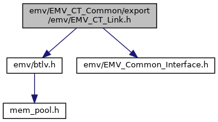
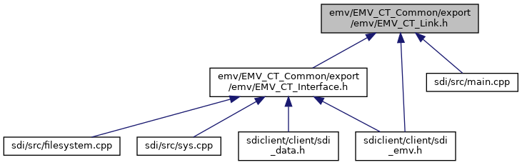

[Macros](#define-members) \| [Typedefs](#typedef-members) \| [Functions](#func-members)

`#include "`<a href="btlv_8h_source.md">emv/btlv.h</a>`"`
`#include "`<a href="_e_m_v___common___interface_8h_source.md">emv/EMV_Common_Interface.h</a>`"`

Include dependency graph for EMV_CT_Link.h:

This graph shows which files directly or indirectly include this file:

<a href="_e_m_v___c_t___link_8h_source.md">Go to the source code of this file.</a>

|          |                                               |
|----------|-----------------------------------------------|
| Macros   |                                               |
| #define  | [DLL_CTL](#afe87027abfbdba4e0878ab58013aef55) |

|  |  |
|----|----|
| Typedefs |  |
| typedef void(\*  | <a href="group___t_l_v___c_a_l_l_b_c_k.md#ga3ff52ae040bd291d348e505e057f02ef">EMV_CT_CALLBACK_FnT</a>) (unsigned char \*pucSend, unsigned short sSendSize, unsigned char \*pucReceive, unsigned short \*psReceiveSize, void \*externalData) |
|   | Common callback function: send/receive TLV stream to/from calling application. <a href="group___t_l_v___c_a_l_l_b_c_k.md#ga3ff52ae040bd291d348e505e057f02ef">More...</a>  |

|  |  |
|----|----|
| Functions |  |
| <a href="group___a_d_k___r_e_t___c_o_d_e.md#gaa5ed8ecc7a31f36a8927e6e258187810">EMV_ADK_INFO</a>  | [EMV_CT_Interface](#af3a3a3705aca214ef5f2e2d7d2aed417) (const unsigned char \*dataIn, unsigned short dataInLen, unsigned char \*dataOut, unsigned short \*dataOutLen) |
|   | Serial interface to EMV functions. [More\...](#af3a3a3705aca214ef5f2e2d7d2aed417)  |
| <a href="group___a_d_k___r_e_t___c_o_d_e.md#gaa5ed8ecc7a31f36a8927e6e258187810">EMV_ADK_INFO</a>  | [EMV_CT_IF_Header](#a7ac79106dfcb44120f03947e2a87a66a) (const unsigned char \*header, const unsigned char \*dataIn, unsigned short dataInLen, unsigned char \*response, unsigned short \*responseLen) |
|   | Serial interface to EMV functions. [More\...](#a7ac79106dfcb44120f03947e2a87a66a)  |
| <a href="group___a_d_k___r_e_t___c_o_d_e.md#gaa5ed8ecc7a31f36a8927e6e258187810">EMV_ADK_INFO</a>  | [EMV_CT_IF_BERTLV](#a23666818abd044733c057104ed2272c1) (const unsigned char \*header, const struct <a href="struct_b_t_l_v_node.md">BTLVNode</a> \*dataIn, struct <a href="struct_b_t_l_v_node.md">BTLVNode</a> \*dataOut) |
|   | Serial interface to EMV functions. [More\...](#a23666818abd044733c057104ed2272c1)  |
| void  | <a href="group___f_u_n_c___f_l_o_w.md#ga9d88559e5ab793338241d554dbcfcf81">EMV_CT_Disconnect</a> (void) |
|   | Disconnect from EMV server. <a href="group___f_u_n_c___f_l_o_w.md#ga9d88559e5ab793338241d554dbcfcf81">More...</a>  |
| void  | <a href="group___f_u_n_c___f_l_o_w.md#ga2204cedafe3383303c043852f3ceebb9">EMV_CT_SetClientMode</a> (enum <a href="_e_m_v___common___interface_8h.md#aa5ecae39726aadf1805b96849d3d28f5">EMV_CLIENT_MODE</a> mode) |
|   | Switch to Client-Server mode. <a href="group___f_u_n_c___f_l_o_w.md#ga2204cedafe3383303c043852f3ceebb9">More...</a>  |
| enum <a href="_e_m_v___common___interface_8h.md#aa5ecae39726aadf1805b96849d3d28f5">EMV_CLIENT_MODE</a>  | <a href="group___f_u_n_c___f_l_o_w.md#ga3dfeec9544bea2b365ef31fbaf3b81e2">EMV_CT_GetClientMode</a> () |
|   | Query the client mode. <a href="group___f_u_n_c___f_l_o_w.md#ga3dfeec9544bea2b365ef31fbaf3b81e2">More...</a>  |
| void  | <a href="group___f_u_n_c___f_l_o_w.md#gae51e43ae5d6598d3350458286925aba9">EMV_CT_SetCallback</a> (<a href="adk__emv__contactless__programmers__guide_8dox.md#a591fd0f380cd390007ce78b47be923c4">EMV_CT_CALLBACK_FnT</a> EMV_Callback, void \*context) |
|   | Set Callback Function and activate Callback <a href="class_thread.md">Thread</a>. <a href="group___f_u_n_c___f_l_o_w.md#gae51e43ae5d6598d3350458286925aba9">More...</a>  |
| unsigned long  | <a href="group___f_u_n_c___f_l_o_w.md#gad050ccbed4f332f10f2a081991c3203d">EMV_CT_GetInitOptions</a> (void) |
|   | Getter to Init Options from EMV_CT_Init_Framework. <a href="group___f_u_n_c___f_l_o_w.md#gad050ccbed4f332f10f2a081991c3203d">More...</a>  |
| unsigned  | <a href="group___f_u_n_c___f_l_o_w.md#ga584e4aff7e4e384a3442e904b9098305">EMV_CT_GetSdiSW12</a> () |
|   | Access SDI status word. <a href="group___f_u_n_c___f_l_o_w.md#ga584e4aff7e4e384a3442e904b9098305">More...</a>  |

## MacroDefinition Documentation {#macro-definition-documentation}

## DLL_CTL 

#define DLL_CTL

## FunctionDocumentation {#function-documentation}

## EMV_CT_IF_BERTLV() 

<a href="group___a_d_k___r_e_t___c_o_d_e.md#gaa5ed8ecc7a31f36a8927e6e258187810">EMV_ADK_INFO</a> EMV_CT_IF_BERTLV

Serial interface to EMV functions.

### Author

GSS R&D Germany

**Parameters**

\[in\] **header** for serial interface, 4 byte: CLA, INS, P1, P2. If CLA=CLA_EMV and INS=INS_CBCK_TRACE, the function is used to trace data encapsulated in \"F0/DF02\" tag contained in dataIn field \[in\] **dataIn** input TLV Node (may be NULL) \[out\] **dataOut** output TLV (may be NULL and may be same as input)

### Returns

EMV_ADK_OK, EMV_ADK_INTERNAL, EMV_ADK_PARAM

## EMV_CT_IF_Header() 

<a href="group___a_d_k___r_e_t___c_o_d_e.md#gaa5ed8ecc7a31f36a8927e6e258187810">EMV_ADK_INFO</a> EMV_CT_IF_Header

Serial interface to EMV functions.

### Author

GSS R&D Germany

**Parameters**

\[in\] **header** for serial interface, 4 byte: CLA, INS, P1, P2 \[in\] **dataIn** input TLV buffer (may be NULL) \[in\] **dataInLen** length of dataIn \[out\] **response** output TLV buffer (may be NULL) \[in,out\] **responseLen** length of dataOut

### Returns

EMV_ADK_OK, EMV_ADK_INTERNAL, EMV_ADK_PARAM

## EMV_CT_Interface() 

<a href="group___a_d_k___r_e_t___c_o_d_e.md#gaa5ed8ecc7a31f36a8927e6e258187810">EMV_ADK_INFO</a> EMV_CT_Interface

Serial interface to EMV functions.

### Author

GSS R&D Germany

**Parameters**

\[in\] **dataIn** input TLV buffer \[in\] **dataInLen** length of dataIn \[out\] **dataOut** output TLV buffer \[in,out\] **dataOutLen** length of dataOut

### Returns

EMV_ADK_OK, EMV_ADK_INTERNAL, EMV_ADK_PARAM
