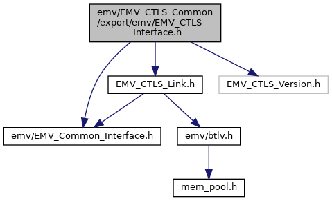

[Data Structures](#nested-classes) \| [Macros](#define-members) \| [Typedefs](#typedef-members) \| [Functions](#func-members)

Interface of CTLS-Client. [More\...](#details)

`#include "`<a href="_e_m_v___common___interface_8h_source.md">emv/EMV_Common_Interface.h</a>`"`
`#include "`<a href="_e_m_v___c_t_l_s___link_8h_source.md">EMV_CTLS_Link.h</a>`"`
`#include "EMV_CTLS_Version.h"`

Include dependency graph for EMV_CTLS_Interface.h:



This graph shows which files directly or indirectly include this file:


<a href="_e_m_v___c_t_l_s___interface_8h_source.md">Go to the source code of this file.</a>

|  |  |
|----|----|
| Data Structures |  |
| struct   | [EMV_CTLS_APPLI_STRUCT](#struct_e_m_v___c_t_l_s___a_p_p_l_i___s_t_r_u_c_t) |
|   | 9F06, AID (5 bytes RID + n bytes PIX) [More\...](#struct_e_m_v___c_t_l_s___a_p_p_l_i___s_t_r_u_c_t)<br/> |
| struct   | [EMV_CTLS_APPLI_KERNEL_STRUCT](#struct_e_m_v___c_t_l_s___a_p_p_l_i___k_e_r_n_e_l___s_t_r_u_c_t) |
|   | AID (9F06) and kernel ID. [More\...](#struct_e_m_v___c_t_l_s___a_p_p_l_i___k_e_r_n_e_l___s_t_r_u_c_t)<br/> |
| struct   | [EMV_CTLS_DATA_STRUCT](#struct_e_m_v___c_t_l_s___d_a_t_a___s_t_r_u_c_t) |
| struct   | [EMV_CTLS_DOL_STRUCT](#struct_e_m_v___c_t_l_s___d_o_l___s_t_r_u_c_t) |
|   | data object list [More\...](#struct_e_m_v___c_t_l_s___d_o_l___s_t_r_u_c_t)<br/> |
| struct   | [EMV_CTLS_TRACK2_STRUCT](#struct_e_m_v___c_t_l_s___t_r_a_c_k2___s_t_r_u_c_t) |
|   | track 2 data [More\...](#struct_e_m_v___c_t_l_s___t_r_a_c_k2___s_t_r_u_c_t)<br/> |
| struct   | [EMV_CTLS_CRDNAME_STRUCT](#struct_e_m_v___c_t_l_s___c_r_d_n_a_m_e___s_t_r_u_c_t) |
|   | cardholder name [More\...](#struct_e_m_v___c_t_l_s___c_r_d_n_a_m_e___s_t_r_u_c_t)<br/> |
| struct   | [EMV_CTLS_ICCRND_STRUCT](#struct_e_m_v___c_t_l_s___i_c_c_r_n_d___s_t_r_u_c_t) |
|   | icc dynamic number [More\...](#struct_e_m_v___c_t_l_s___i_c_c_r_n_d___s_t_r_u_c_t)<br/> |
| struct   | [EMV_CTLS_ISSDATA_STRUCT](#struct_e_m_v___c_t_l_s___i_s_s_d_a_t_a___s_t_r_u_c_t) |
|   | issuer application data [More\...](#struct_e_m_v___c_t_l_s___i_s_s_d_a_t_a___s_t_r_u_c_t)<br/> |
| struct   | <a href="group___d_e_f___c_o_n_f___t_e_r_m.md#struct_e_m_v___c_t_l_s___t_e_r_m_d_a_t_a___s_t_r_u_c_t">EMV_CTLS_TERMDATA_STRUCT</a> |
|   | struct for interface to <a href="group___f_u_n_c___c_o_n_f.md#gac5ce9781bba083028538f9e77c2d58f3">EMV_CTLS_SetTermData()</a> and <a href="group___f_u_n_c___c_o_n_f.md#gad690d9dec1818d4ffc7db35c12c3b610">EMV_CTLS_GetTermData()</a> <a href="group___d_e_f___c_o_n_f___t_e_r_m.md#struct_e_m_v___c_t_l_s___t_e_r_m_d_a_t_a___s_t_r_u_c_t">More...</a><br/> |
| struct   | <a href="group___d_e_f___c_o_n_f___a_p_p_l_i.md#struct_e_m_v___c_t_l_s___t_a_g_l_i_s_t___s_t_r_u_c_t">EMV_CTLS_TAGLIST_STRUCT</a> |
|   | structure for <a href="group___d_e_f___f_l_o_w___i_n_p_u_t.md#ac99d6e6b09a0e3fcbe4d2ec8336a30e2">EMV_CTLS_PAYMENT_TYPE::Additional_Result_Tags</a> <a href="group___d_e_f___c_o_n_f___a_p_p_l_i.md#struct_e_m_v___c_t_l_s___t_a_g_l_i_s_t___s_t_r_u_c_t">More...</a><br/> |
| struct   | <a href="group___d_e_f___c_o_n_f___a_p_p_l_i.md#struct_e_m_v___c_t_l_s___a_p_p_l_i_d_a_t_a___m_k___s_t_r_u_c_t">EMV_CTLS_APPLIDATA_MK_STRUCT</a> |
|   | Structure for configuration of one single application, MK specific part. See see Book C-2, Kernel 2 Specification at <a href="http://www.emvco.com/">[EMVCo Homepage]</a>. See <a href="group___f_u_n_c___c_o_n_f.md#gadc7f2eba5fd3e941d0ddb65a936a0776">EMV_CTLS_SetAppliDataSchemeSpecific()</a> <a href="group___d_e_f___c_o_n_f___a_p_p_l_i.md#struct_e_m_v___c_t_l_s___a_p_p_l_i_d_a_t_a___m_k___s_t_r_u_c_t">More...</a><br/> |
| struct   | <a href="group___d_e_f___c_o_n_f___a_p_p_l_i.md#struct_e_m_v___c_t_l_s___v_k___d_r_l___e_n_t_r_y___s_t_r_u_c_t">EMV_CTLS_VK_DRL_ENTRY_STRUCT</a> |
|   | Visa Dynamic Reader Limits, single entry Element of <a href="group___d_e_f___c_o_n_f___a_p_p_l_i.md#struct_e_m_v___c_t_l_s___v_k___d_r_l___s_t_r_u_c_t">EMV_CTLS_VK_DRL_STRUCT</a>. <a href="group___d_e_f___c_o_n_f___a_p_p_l_i.md#struct_e_m_v___c_t_l_s___v_k___d_r_l___e_n_t_r_y___s_t_r_u_c_t">More...</a><br/> |
| struct   | <a href="group___d_e_f___c_o_n_f___a_p_p_l_i.md#struct_e_m_v___c_t_l_s___v_k___d_r_l___s_t_r_u_c_t">EMV_CTLS_VK_DRL_STRUCT</a> |
|   | Visa Dynamic Reader Limits Used in <a href="group___d_e_f___c_o_n_f___a_p_p_l_i.md#a125164cdd7dd17625739afaed890ac0f">EMV_CTLS_APPLIDATA_VK_STRUCT::VisaDRLParams_FFAB01</a>. <a href="group___d_e_f___c_o_n_f___a_p_p_l_i.md#struct_e_m_v___c_t_l_s___v_k___d_r_l___s_t_r_u_c_t">More...</a><br/> |
| struct   | <a href="group___d_e_f___c_o_n_f___a_p_p_l_i.md#struct_e_m_v___c_t_l_s___a_p_p_l_i_d_a_t_a___v_k___s_t_r_u_c_t">EMV_CTLS_APPLIDATA_VK_STRUCT</a> |
|   | Structure for configuration of one single application, VK specific part. See see Book C-3, Kernel 3 Specification at <a href="http://www.emvco.com/">[EMVCo Homepage]</a>. See <a href="group___f_u_n_c___c_o_n_f.md#gadc7f2eba5fd3e941d0ddb65a936a0776">EMV_CTLS_SetAppliDataSchemeSpecific()</a> <a href="group___d_e_f___c_o_n_f___a_p_p_l_i.md#struct_e_m_v___c_t_l_s___a_p_p_l_i_d_a_t_a___v_k___s_t_r_u_c_t">More...</a><br/> |
| struct   | <a href="group___d_e_f___c_o_n_f___a_p_p_l_i.md#struct_e_m_v___c_t_l_s___a_k___d_r_l___e_n_t_r_y___s_t_r_u_c_t">EMV_CTLS_AK_DRL_ENTRY_STRUCT</a> |
|   | Amex Dynamic Reader Limits, single entry Element of <a href="group___d_e_f___c_o_n_f___a_p_p_l_i.md#struct_e_m_v___c_t_l_s___a_k___d_r_l___s_t_r_u_c_t">EMV_CTLS_AK_DRL_STRUCT</a>. <a href="group___d_e_f___c_o_n_f___a_p_p_l_i.md#struct_e_m_v___c_t_l_s___a_k___d_r_l___e_n_t_r_y___s_t_r_u_c_t">More...</a><br/> |
| struct   | <a href="group___d_e_f___c_o_n_f___a_p_p_l_i.md#struct_e_m_v___c_t_l_s___a_k___d_r_l___s_t_r_u_c_t">EMV_CTLS_AK_DRL_STRUCT</a> |
|   | Amex Dynamic Reader Limits Used in <a href="group___d_e_f___c_o_n_f___a_p_p_l_i.md#adb7925c29affa71ae450ef807bd07e85">EMV_CTLS_APPLIDATA_AK_STRUCT::AmexDRLParams_FFAB01</a>. <a href="group___d_e_f___c_o_n_f___a_p_p_l_i.md#struct_e_m_v___c_t_l_s___a_k___d_r_l___s_t_r_u_c_t">More...</a><br/> |
| struct   | <a href="group___d_e_f___c_o_n_f___a_p_p_l_i.md#struct_e_m_v___c_t_l_s___a_p_p_l_i_d_a_t_a___a_k___s_t_r_u_c_t">EMV_CTLS_APPLIDATA_AK_STRUCT</a> |
|   | Structure for configuration of one single application, AK specific part. See see Book C-4, Kernel 4 Specification at <a href="http://www.emvco.com/">[EMVCo Homepage]</a>. See <a href="group___f_u_n_c___c_o_n_f.md#gadc7f2eba5fd3e941d0ddb65a936a0776">EMV_CTLS_SetAppliDataSchemeSpecific()</a> <a href="group___d_e_f___c_o_n_f___a_p_p_l_i.md#struct_e_m_v___c_t_l_s___a_p_p_l_i_d_a_t_a___a_k___s_t_r_u_c_t">More...</a><br/> |
| struct   | <a href="group___d_e_f___c_o_n_f___a_p_p_l_i.md#struct_e_m_v___c_t_l_s___a_p_p_l_i_d_a_t_a___j_k___s_t_r_u_c_t">EMV_CTLS_APPLIDATA_JK_STRUCT</a> |
|   | Structure for configuration of one single application, JK specific part. See see Book C-5, Kernel 5 Specification at <a href="http://www.emvco.com/">[EMVCo Homepage]</a>. See <a href="group___f_u_n_c___c_o_n_f.md#gadc7f2eba5fd3e941d0ddb65a936a0776">EMV_CTLS_SetAppliDataSchemeSpecific()</a> <a href="group___d_e_f___c_o_n_f___a_p_p_l_i.md#struct_e_m_v___c_t_l_s___a_p_p_l_i_d_a_t_a___j_k___s_t_r_u_c_t">More...</a><br/> |
| struct   | <a href="group___d_e_f___c_o_n_f___a_p_p_l_i.md#struct_e_m_v___c_t_l_s___a_p_p_l_i_d_a_t_a___d_k___s_t_r_u_c_t">EMV_CTLS_APPLIDATA_DK_STRUCT</a> |
|   | Structure for configuration of one single application, DK specific part. See see Book C-6, Kernel 6 Specification at <a href="http://www.emvco.com/">[EMVCo Homepage]</a>. See <a href="group___f_u_n_c___c_o_n_f.md#gadc7f2eba5fd3e941d0ddb65a936a0776">EMV_CTLS_SetAppliDataSchemeSpecific()</a> <a href="group___d_e_f___c_o_n_f___a_p_p_l_i.md#struct_e_m_v___c_t_l_s___a_p_p_l_i_d_a_t_a___d_k___s_t_r_u_c_t">More...</a><br/> |
| struct   | <a href="group___d_e_f___c_o_n_f___a_p_p_l_i.md#struct_e_m_v___c_t_l_s___a_p_p_l_i_d_a_t_a___i_k___s_t_r_u_c_t">EMV_CTLS_APPLIDATA_IK_STRUCT</a> |
|   | Structure for configuration of one single application, IK specific part. See <a href="group___f_u_n_c___c_o_n_f.md#gadc7f2eba5fd3e941d0ddb65a936a0776">EMV_CTLS_SetAppliDataSchemeSpecific()</a> <a href="group___d_e_f___c_o_n_f___a_p_p_l_i.md#struct_e_m_v___c_t_l_s___a_p_p_l_i_d_a_t_a___i_k___s_t_r_u_c_t">More...</a><br/> |
| struct   | <a href="group___d_e_f___c_o_n_f___a_p_p_l_i.md#struct_e_m_v___c_t_l_s___a_p_p_l_i_d_a_t_a___e_k___s_t_r_u_c_t">EMV_CTLS_APPLIDATA_EK_STRUCT</a> |
|   | Structure for configuration of one single application, EK specific part. See <a href="group___f_u_n_c___c_o_n_f.md#gadc7f2eba5fd3e941d0ddb65a936a0776">EMV_CTLS_SetAppliDataSchemeSpecific()</a> <a href="group___d_e_f___c_o_n_f___a_p_p_l_i.md#struct_e_m_v___c_t_l_s___a_p_p_l_i_d_a_t_a___e_k___s_t_r_u_c_t">More...</a><br/> |
| struct   | <a href="group___d_e_f___c_o_n_f___a_p_p_l_i.md#struct_e_m_v___c_t_l_s___a_p_p_l_i_d_a_t_a___p_k___s_t_r_u_c_t">EMV_CTLS_APPLIDATA_PK_STRUCT</a> |
|   | Structure for configuration of one single application, PK specific part (VisaAP resp. Visa Asia/Pacific resp. Visa Wave 2). See <a href="group___f_u_n_c___c_o_n_f.md#gadc7f2eba5fd3e941d0ddb65a936a0776">EMV_CTLS_SetAppliDataSchemeSpecific()</a> <a href="group___d_e_f___c_o_n_f___a_p_p_l_i.md#struct_e_m_v___c_t_l_s___a_p_p_l_i_d_a_t_a___p_k___s_t_r_u_c_t">More...</a><br/> |
| struct   | <a href="group___d_e_f___c_o_n_f___a_p_p_l_i.md#struct_e_m_v___c_t_l_s___a_p_p_l_i_d_a_t_a___c_k___s_t_r_u_c_t">EMV_CTLS_APPLIDATA_CK_STRUCT</a> |
|   | Structure for configuration of one single application, CK specific part. See see Book C-7, Kernel 7 Specification at <a href="http://www.emvco.com/">[EMVCo Homepage]</a>. See <a href="group___f_u_n_c___c_o_n_f.md#gadc7f2eba5fd3e941d0ddb65a936a0776">EMV_CTLS_SetAppliDataSchemeSpecific()</a> <a href="group___d_e_f___c_o_n_f___a_p_p_l_i.md#struct_e_m_v___c_t_l_s___a_p_p_l_i_d_a_t_a___c_k___s_t_r_u_c_t">More...</a><br/> |
| struct   | <a href="group___d_e_f___c_o_n_f___a_p_p_l_i.md#struct_e_m_v___c_t_l_s___a_p_p_l_i_d_a_t_a___g_k___s_t_r_u_c_t">EMV_CTLS_APPLIDATA_GK_STRUCT</a> |
|   | Structure for configuration of one single application, GK specific part. See <a href="group___f_u_n_c___c_o_n_f.md#gadc7f2eba5fd3e941d0ddb65a936a0776">EMV_CTLS_SetAppliDataSchemeSpecific()</a> <a href="group___d_e_f___c_o_n_f___a_p_p_l_i.md#struct_e_m_v___c_t_l_s___a_p_p_l_i_d_a_t_a___g_k___s_t_r_u_c_t">More...</a><br/> |
| struct   | <a href="group___d_e_f___c_o_n_f___a_p_p_l_i.md#struct_e_m_v___c_t_l_s___a_p_p_l_i_d_a_t_a___r_k___s_t_r_u_c_t">EMV_CTLS_APPLIDATA_RK_STRUCT</a> |
|   | Structure for configuration of one single application, RK specific part. See <a href="group___f_u_n_c___c_o_n_f.md#gadc7f2eba5fd3e941d0ddb65a936a0776">EMV_CTLS_SetAppliDataSchemeSpecific()</a> <a href="group___d_e_f___c_o_n_f___a_p_p_l_i.md#struct_e_m_v___c_t_l_s___a_p_p_l_i_d_a_t_a___r_k___s_t_r_u_c_t">More...</a><br/> |
| struct   | <a href="group___d_e_f___c_o_n_f___a_p_p_l_i.md#struct_e_m_v___c_t_l_s___a_p_p_l_i_d_a_t_a___s_k___s_t_r_u_c_t">EMV_CTLS_APPLIDATA_SK_STRUCT</a> |
|   | Structure for configuration of one single application, SK specific part. See <a href="group___f_u_n_c___c_o_n_f.md#gadc7f2eba5fd3e941d0ddb65a936a0776">EMV_CTLS_SetAppliDataSchemeSpecific()</a> <a href="group___d_e_f___c_o_n_f___a_p_p_l_i.md#struct_e_m_v___c_t_l_s___a_p_p_l_i_d_a_t_a___s_k___s_t_r_u_c_t">More...</a><br/> |
| struct   | <a href="group___d_e_f___c_o_n_f___a_p_p_l_i.md#struct_e_m_v___c_t_l_s___a_p_p_l_i_d_a_t_a___p_b___s_t_r_u_c_t">EMV_CTLS_APPLIDATA_PB_STRUCT</a> |
|   | Structure for configuration of one single application, PagoBancomat specific part. See <a href="group___f_u_n_c___c_o_n_f.md#gadc7f2eba5fd3e941d0ddb65a936a0776">EMV_CTLS_SetAppliDataSchemeSpecific()</a> <a href="group___d_e_f___c_o_n_f___a_p_p_l_i.md#struct_e_m_v___c_t_l_s___a_p_p_l_i_d_a_t_a___p_b___s_t_r_u_c_t">More...</a><br/> |
| struct   | <a href="group___d_e_f___c_o_n_f___a_p_p_l_i.md#struct_e_m_v___c_t_l_s___a_p_p_l_i_d_a_t_a___w_k___s_t_r_u_c_t">EMV_CTLS_APPLIDATA_WK_STRUCT</a> |
|   | Structure for configuration of one single application, WISE specific part. <a href="group___d_e_f___c_o_n_f___a_p_p_l_i.md#struct_e_m_v___c_t_l_s___a_p_p_l_i_d_a_t_a___w_k___s_t_r_u_c_t">More...</a><br/> |
| struct   | <a href="group___d_e_f___c_o_n_f___a_p_p_l_i.md#struct_e_m_v___c_t_l_s___a_p_p_l_i_d_a_t_a___b_k___s_t_r_u_c_t">EMV_CTLS_APPLIDATA_BK_STRUCT</a> |
|   | Structure for configuration of one single application, CPACE specific part. <a href="group___d_e_f___c_o_n_f___a_p_p_l_i.md#struct_e_m_v___c_t_l_s___a_p_p_l_i_d_a_t_a___b_k___s_t_r_u_c_t">More...</a><br/> |
| struct   | <a href="group___d_e_f___c_o_n_f___a_p_p_l_i.md#struct_e_m_v___c_t_l_s___a_p_p_l_i_d_a_t_a___m_r___s_t_r_u_c_t">EMV_CTLS_APPLIDATA_MR_STRUCT</a> |
|   | Structure for configuration of one single application, MIR specific part. See <a href="group___f_u_n_c___c_o_n_f.md#gadc7f2eba5fd3e941d0ddb65a936a0776">EMV_CTLS_SetAppliDataSchemeSpecific()</a> <a href="group___d_e_f___c_o_n_f___a_p_p_l_i.md#struct_e_m_v___c_t_l_s___a_p_p_l_i_d_a_t_a___m_r___s_t_r_u_c_t">More...</a><br/> |
| struct   | <a href="group___d_e_f___c_o_n_f___a_p_p_l_i.md#struct_e_m_v___c_t_l_s___a_p_p_l_i_d_a_t_a___d_o_m___s_t_r_u_c_t">EMV_CTLS_APPLIDATA_DOM_STRUCT</a> |
|   | Structure for configuration of one single domestic application See <a href="group___f_u_n_c___c_o_n_f.md#gadc7f2eba5fd3e941d0ddb65a936a0776">EMV_CTLS_SetAppliDataSchemeSpecific()</a> <a href="group___d_e_f___c_o_n_f___a_p_p_l_i.md#struct_e_m_v___c_t_l_s___a_p_p_l_i_d_a_t_a___d_o_m___s_t_r_u_c_t">More...</a><br/> |
| struct   | <a href="group___d_e_f___c_o_n_f___a_p_p_l_i.md#struct_e_m_v___c_t_l_s___a_p_p_l_i_d_a_t_a___s_c_h_e_m_e___s_p_e_c_i_f_i_c___s_t_r_u_c_t">EMV_CTLS_APPLIDATA_SCHEME_SPECIFIC_STRUCT</a> |
|   | Structure for configuration of one single application. See <a href="group___f_u_n_c___c_o_n_f.md#gadc7f2eba5fd3e941d0ddb65a936a0776">EMV_CTLS_SetAppliDataSchemeSpecific()</a><br/>XML tag <a href="group___a_d_k___x_m_l___t_a_g_s.md#gac59e08c61f80cea0bfd193fea694fcb9">XML_TAG_AD_APP</a><br/>no TLV tag is used. <a href="group___d_e_f___c_o_n_f___a_p_p_l_i.md#struct_e_m_v___c_t_l_s___a_p_p_l_i_d_a_t_a___s_c_h_e_m_e___s_p_e_c_i_f_i_c___s_t_r_u_c_t">More...</a><br/> |
| struct   | <a href="group___d_e_f___f_l_o_w___i_n_p_u_t.md#struct_e_m_v___c_t_l_s___p_a_y_m_e_n_t___s_t_r_u_c_t">EMV_CTLS_PAYMENT_STRUCT</a> |
|   | Transaction parameters of an EMV transaction. <a href="group___d_e_f___f_l_o_w___i_n_p_u_t.md#struct_e_m_v___c_t_l_s___p_a_y_m_e_n_t___s_t_r_u_c_t">More...</a><br/> |
| struct   | <a href="group___d_e_f___f_l_o_w___i_n_p_u_t.md#struct_e_m_v___c_t_l_s___a_p_p_s___s_e_l_e_c_t___s_t_r_u_c_t">EMV_CTLS_APPS_SELECT_STRUCT</a> |
|   | Application selection parameters of an EMV transaction. <a href="group___d_e_f___f_l_o_w___i_n_p_u_t.md#struct_e_m_v___c_t_l_s___a_p_p_s___s_e_l_e_c_t___s_t_r_u_c_t">More...</a><br/> |
| struct   | <a href="group___d_e_f___f_l_o_w___i_n_p_u_t.md#struct_e_m_v___c_t_l_s___s_t_a_r_t___s_t_r_u_c_t">EMV_CTLS_START_STRUCT</a> |
|   | struct for interface to <a href="group___f_u_n_c___f_l_o_w.md#ga1a86c76dcf8fec6e97ead6cf8f2717ff">EMV_CTLS_SetupTransaction()</a> <a href="group___d_e_f___f_l_o_w___i_n_p_u_t.md#struct_e_m_v___c_t_l_s___s_t_a_r_t___s_t_r_u_c_t">More...</a><br/> |
| struct   | <a href="group___d_e_f___f_l_o_w___o_u_t_p_u_t.md#struct_e_m_v___c_t_l_s___s_t_a_r_t_r_e_s___s_t_r_u_c_t">EMV_CTLS_STARTRES_STRUCT</a> |
|   | Result data of <a href="group___f_u_n_c___f_l_o_w.md#ga1a86c76dcf8fec6e97ead6cf8f2717ff">EMV_CTLS_SetupTransaction()</a> <a href="group___d_e_f___f_l_o_w___o_u_t_p_u_t.md#struct_e_m_v___c_t_l_s___s_t_a_r_t_r_e_s___s_t_r_u_c_t">More...</a><br/> |
| struct   | <a href="group___d_e_f___f_l_o_w___i_n_p_u_t.md#struct_e_m_v___c_t_l_s___h_o_s_t___s_t_r_u_c_t">EMV_CTLS_HOST_STRUCT</a> |
|   | Data structure for host response data. Input for <a href="group___f_u_n_c___f_l_o_w.md#ga297b6843994afaa2e7a6f5e0e4a8af3e">EMV_CTLS_ContinueOnline()</a> <a href="group___d_e_f___f_l_o_w___i_n_p_u_t.md#struct_e_m_v___c_t_l_s___h_o_s_t___s_t_r_u_c_t">More...</a><br/> |
| struct   | <a href="group___d_e_f___f_l_o_w___i_n_p_u_t.md#struct_e_m_v___c_t_l_s___c_o_n_t___o_f_f_l___s_t_r_u_c_t">EMV_CTLS_CONT_OFFL_STRUCT</a> |
|   | Transaction parameters of an EMV transaction at <a href="group___f_u_n_c___f_l_o_w.md#gabb14366b95c72086719f894d09027e84">EMV_CTLS_ContinueOfflineExt()</a> <a href="group___d_e_f___f_l_o_w___i_n_p_u_t.md#struct_e_m_v___c_t_l_s___c_o_n_t___o_f_f_l___s_t_r_u_c_t">More...</a><br/> |
| struct   | <a href="group___d_e_f___f_l_o_w___o_u_t_p_u_t.md#struct_e_m_v___c_t_l_s___t_r_a_n_s_r_e_s___s_t_r_u_c_t">EMV_CTLS_TRANSRES_STRUCT</a> |
|   | Data structure for output data of <a href="group___f_u_n_c___f_l_o_w.md#gaf23f6f87fe90619810470fad7d11f321">EMV_CTLS_ContinueOffline()</a> and <a href="group___f_u_n_c___f_l_o_w.md#ga297b6843994afaa2e7a6f5e0e4a8af3e">EMV_CTLS_ContinueOnline()</a> <a href="group___d_e_f___f_l_o_w___o_u_t_p_u_t.md#struct_e_m_v___c_t_l_s___t_r_a_n_s_r_e_s___s_t_r_u_c_t">More...</a><br/> |
| struct   | <a href="group___d_e_f___c_a_r_d___c_o_n_f.md#struct_e_m_v___c_t_l_s___c_a_p_k_e_y___s_t_r_u_c_t">EMV_CTLS_CAPKEY_STRUCT</a> |
|   | Data structure CAP keys. <a href="group___d_e_f___c_a_r_d___c_o_n_f.md#struct_e_m_v___c_t_l_s___c_a_p_k_e_y___s_t_r_u_c_t">More...</a><br/> |
| struct   | <a href="group___d_e_f___c_a_r_d___c_o_n_f.md#struct_e_m_v___c_t_l_s___c_a_p_r_e_a_d___s_t_r_u_c_t">EMV_CTLS_CAPREAD_STRUCT</a> |
|   | Data structure CAP keys. <a href="group___d_e_f___c_a_r_d___c_o_n_f.md#struct_e_m_v___c_t_l_s___c_a_p_r_e_a_d___s_t_r_u_c_t">More...</a><br/> |
| struct   | <a href="group___a_d_k___l_e_d.md#struct_e_m_v___c_t_l_s___l_e_d___c_o_l_o_r_s___s_t_r_u_c_t">EMV_CTLS_LED_COLORS_STRUCT</a> |
|   | Data structure for LED colors. Input for <a href="group___a_d_k___l_e_d.md#ga8b647b4c8f995795b250bd2df10c2796">EMV_CTLS_LED_ConfigDesign_Extended()</a> <a href="group___a_d_k___l_e_d.md#struct_e_m_v___c_t_l_s___l_e_d___c_o_l_o_r_s___s_t_r_u_c_t">More...</a><br/> |
| struct   | <a href="group___a_d_k___l_e_d.md#struct_e_m_v___c_t_l_s___l_e_d___c_o_n_f_i_g___s_t_r_u_c_t">EMV_CTLS_LED_CONFIG_STRUCT</a> |
|   | Data structure for LED configuration. Input for <a href="group___a_d_k___l_e_d.md#ga8b647b4c8f995795b250bd2df10c2796">EMV_CTLS_LED_ConfigDesign_Extended()</a> <a href="group___a_d_k___l_e_d.md#struct_e_m_v___c_t_l_s___l_e_d___c_o_n_f_i_g___s_t_r_u_c_t">More...</a><br/> |
| struct   | <a href="group___f_u_n_c___f_l_o_w.md#struct_e_m_v___c_t_l_s___c_a_n_d_i_d_a_t_e___d_a_t_a___s_t_r_u_c_t">EMV_CTLS_CANDIDATE_DATA_STRUCT</a> |
|   | Candidate list additional data. <a href="group___f_u_n_c___f_l_o_w.md#struct_e_m_v___c_t_l_s___c_a_n_d_i_d_a_t_e___d_a_t_a___s_t_r_u_c_t">More...</a><br/> |
| union   | <a href="group___d_e_f___c_o_n_f___a_p_p_l_i.md#union_e_m_v___c_t_l_s___a_p_p_l_i_d_a_t_a___s_c_h_e_m_e___s_p_e_c_i_f_i_c___s_t_r_u_c_t_8_scheme">EMV_CTLS_APPLIDATA_SCHEME_SPECIFIC_STRUCT.Scheme</a> |

  ----------------------------------- ------------------------------------------------------------------------------------------------------------------------------------------------------------------------------------------------------------------------------------------------------------------------------------------------------------------------------------------------------------------------------------------------------------------------------------------------------------------------------------------------------------------------------------------------------------------------------------------
  Macros                              

  #define                             [DLL_CLC](#a0c075561565f443dd054da7871da8462)

  #define                             <a href="group___d_e_f___a_d_k___d_e_b_u_g___e_x_i_t.md#ga11842edc6cebc295e1c183d47411796b">EMV_CTLS_ADK_SETUP_START</a>   0x80

                                      Initialization Setup. <a href="group___d_e_f___a_d_k___d_e_b_u_g___e_x_i_t.md#ga11842edc6cebc295e1c183d47411796b">More...</a><br/>

  #define                             <a href="group___d_e_f___a_d_k___d_e_b_u_g___e_x_i_t.md#ga0ad492a9973c6d785cf05539047c2635">EMV_CTLS_ADK_SETUP_NO_CONTEXT</a>   0x81

                                      Setup: context missing. <a href="group___d_e_f___a_d_k___d_e_b_u_g___e_x_i_t.md#ga0ad492a9973c6d785cf05539047c2635">More...</a><br/>

  #define                             <a href="group___d_e_f___a_d_k___d_e_b_u_g___e_x_i_t.md#gae258e027119aec245c5a90eb44fd1e58">EMV_CTLS_ADK_SETUP_NO_INIT</a>   0x82

                                      Setup: not initialized. <a href="group___d_e_f___a_d_k___d_e_b_u_g___e_x_i_t.md#gae258e027119aec245c5a90eb44fd1e58">More...</a><br/>

  #define                             <a href="group___d_e_f___a_d_k___d_e_b_u_g___e_x_i_t.md#ga80ad94c04f7546c93f13a8df13e81b12">EMV_CTLS_ADK_SETUP_TERMDATA</a>   0x83

                                      Setup: terminal data not available. <a href="group___d_e_f___a_d_k___d_e_b_u_g___e_x_i_t.md#ga80ad94c04f7546c93f13a8df13e81b12">More...</a><br/>

  #define                             <a href="group___d_e_f___a_d_k___d_e_b_u_g___e_x_i_t.md#ga6e399ef7e4830d80b7440b810e6c90ab">EMV_CTLS_ADK_SETUP_ABOVE_CEILING_EMV_ONLY</a>   0x85

                                      Setup: above ceiling limit EMV. <a href="group___d_e_f___a_d_k___d_e_b_u_g___e_x_i_t.md#ga6e399ef7e4830d80b7440b810e6c90ab">More...</a><br/>

  #define                             <a href="group___d_e_f___a_d_k___d_e_b_u_g___e_x_i_t.md#gab77f760cce48bbed04f007ef336446c0">EMV_CTLS_ADK_SETUP_ABOVE_CEILING_NO_DOM</a>   0x86

                                      Setup: above ceiling limit no domestic app. <a href="group___d_e_f___a_d_k___d_e_b_u_g___e_x_i_t.md#gab77f760cce48bbed04f007ef336446c0">More...</a><br/>

  #define                             <a href="group___d_e_f___a_d_k___d_e_b_u_g___e_x_i_t.md#ga95bed8dc421f57c0306c17fc1466a196">EMV_CTLS_ADK_SETUP_RND_FAIL</a>   0x87

                                      Setup: RND failed. <a href="group___d_e_f___a_d_k___d_e_b_u_g___e_x_i_t.md#ga95bed8dc421f57c0306c17fc1466a196">More...</a><br/>

  #define                             <a href="group___d_e_f___a_d_k___d_e_b_u_g___e_x_i_t.md#gaf5d1c8f33ab201fa7371faab14d27557">EMV_CTLS_ADK_SETUP_DETECT</a>   0x88

                                      Setup: detect failed. <a href="group___d_e_f___a_d_k___d_e_b_u_g___e_x_i_t.md#gaf5d1c8f33ab201fa7371faab14d27557">More...</a><br/>

  #define                             <a href="group___d_e_f___a_d_k___d_e_b_u_g___e_x_i_t.md#gac64c0713654734e1bc8d9cbf07aabb9e">EMV_CTLS_ADK_SETUP_SET_PARAM_FAIL</a>   0x89

                                      Setup: txn setup failure. <a href="group___d_e_f___a_d_k___d_e_b_u_g___e_x_i_t.md#gac64c0713654734e1bc8d9cbf07aabb9e">More...</a><br/>

  #define                             <a href="group___d_e_f___a_d_k___d_e_b_u_g___e_x_i_t.md#ga2cd5ca45bfb82f00fd2ed700d6efffda">EMV_CTLS_ADK_SETUP_OK</a>   0x8A

                                      Setup: OK. <a href="group___d_e_f___a_d_k___d_e_b_u_g___e_x_i_t.md#ga2cd5ca45bfb82f00fd2ed700d6efffda">More...</a><br/>

  #define                             <a href="group___d_e_f___a_d_k___d_e_b_u_g___e_x_i_t.md#ga85f6e6cb3d055a47004852dd7b7466f6">EMV_CTLS_ADK_TXN_START</a>   0xA0

                                      TXN: Start. <a href="group___d_e_f___a_d_k___d_e_b_u_g___e_x_i_t.md#ga85f6e6cb3d055a47004852dd7b7466f6">More...</a><br/>

  #define                             <a href="group___d_e_f___a_d_k___d_e_b_u_g___e_x_i_t.md#ga28ef02ff7d324621406075110c025249">EMV_CTLS_ADK_TXN_NO_ATR</a>   0xA1

                                      TXN: no ATR. <a href="group___d_e_f___a_d_k___d_e_b_u_g___e_x_i_t.md#ga28ef02ff7d324621406075110c025249">More...</a><br/>

  #define                             <a href="group___d_e_f___a_d_k___d_e_b_u_g___e_x_i_t.md#ga0f65d288d8777ab3562179c15f70cd08">EMV_CTLS_ADK_TXN_2_CARDS</a>   0xA2

                                      TXN: 2 cards in field. <a href="group___d_e_f___a_d_k___d_e_b_u_g___e_x_i_t.md#ga0f65d288d8777ab3562179c15f70cd08">More...</a><br/>

  #define                             <a href="group___d_e_f___a_d_k___d_e_b_u_g___e_x_i_t.md#gaaf371ff9b9d55f094c31698ff5f14c64">EMV_CTLS_ADK_TXN_CAND_LIST_EMPTY</a>   0xA3

                                      TXN: empty candidate list of terminal. <a href="group___d_e_f___a_d_k___d_e_b_u_g___e_x_i_t.md#gaaf371ff9b9d55f094c31698ff5f14c64">More...</a><br/>

  #define                             <a href="group___d_e_f___a_d_k___d_e_b_u_g___e_x_i_t.md#gab7918ecbe2bfeb5204fd500753e6185e">EMV_CTLS_ADK_TXN_DOM_ONE_APP_SELECTED</a>   0xA4

                                      TXN: a single domestic app is selected. <a href="group___d_e_f___a_d_k___d_e_b_u_g___e_x_i_t.md#gab7918ecbe2bfeb5204fd500753e6185e">More...</a><br/>

  #define                             <a href="group___d_e_f___a_d_k___d_e_b_u_g___e_x_i_t.md#ga898de46bf97884411ad6fa072cd17271">EMV_CTLS_ADK_TXN_DOM_ONE_APP_FAIL</a>   0xA5

                                      TXN: single domestic app failed. <a href="group___d_e_f___a_d_k___d_e_b_u_g___e_x_i_t.md#ga898de46bf97884411ad6fa072cd17271">More...</a><br/>

  #define                             <a href="group___d_e_f___a_d_k___d_e_b_u_g___e_x_i_t.md#gab5a725f6061c9f343e5f3ada29675715">EMV_CTLS_ADK_TXN_L1_DIR_READING</a>   0xA6

                                      TXN: L1 error at directory reading. <a href="group___d_e_f___a_d_k___d_e_b_u_g___e_x_i_t.md#gab5a725f6061c9f343e5f3ada29675715">More...</a><br/>

  #define                             <a href="group___d_e_f___a_d_k___d_e_b_u_g___e_x_i_t.md#ga907131abb010e3de041f9dfac093fb5d">EMV_CTLS_ADK_TXN_L1_CAND_LIST</a>   0xA7

                                      TXN: L1 error candidate list building. <a href="group___d_e_f___a_d_k___d_e_b_u_g___e_x_i_t.md#ga907131abb010e3de041f9dfac093fb5d">More...</a><br/>

  #define                             <a href="group___d_e_f___a_d_k___d_e_b_u_g___e_x_i_t.md#ga7deb45d9d930e27ba007e7004c793531">EMV_CTLS_ADK_TXN_DOM_APP_NOT_SELECTED</a>   0xA8

                                      TXN: domestic application selection failed. <a href="group___d_e_f___a_d_k___d_e_b_u_g___e_x_i_t.md#ga7deb45d9d930e27ba007e7004c793531">More...</a><br/>

  #define                             <a href="group___d_e_f___a_d_k___d_e_b_u_g___e_x_i_t.md#gafbfcf301bdcbef78b79ba7ddfd3053e0">EMV_CTLS_ADK_TXN_DOM_APP_SELECTED</a>   0xA9

                                      TXN: domestic application selected. <a href="group___d_e_f___a_d_k___d_e_b_u_g___e_x_i_t.md#gafbfcf301bdcbef78b79ba7ddfd3053e0">More...</a><br/>

  #define                             <a href="group___d_e_f___a_d_k___d_e_b_u_g___e_x_i_t.md#gaf480fe63080b67e93d44e8c8d5af997c">EMV_CTLS_ADK_TXN_NO_COMBO_EMPTY_LIST</a>   0xAA

                                      TXN: empty combo list. <a href="group___d_e_f___a_d_k___d_e_b_u_g___e_x_i_t.md#gaf480fe63080b67e93d44e8c8d5af997c">More...</a><br/>

  #define                             <a href="group___d_e_f___a_d_k___d_e_b_u_g___e_x_i_t.md#gada931924909da87f0b87e283aacdad6c">EMV_CTLS_ADK_TXN_NO_DOM_APP_SELECT_NO_FINAL</a>   0xAB

                                      TXN: domestic app select failed no final select issued. <a href="group___d_e_f___a_d_k___d_e_b_u_g___e_x_i_t.md#gada931924909da87f0b87e283aacdad6c">More...</a><br/>

  #define                             <a href="group___d_e_f___a_d_k___d_e_b_u_g___e_x_i_t.md#gade14b6cd179f21f5bc51f5bfde6a0721">EMV_CTLS_ADK_TXN_L1_FINAL_SELECT</a>   0xAC

                                      TXN: L1 error final select. <a href="group___d_e_f___a_d_k___d_e_b_u_g___e_x_i_t.md#gade14b6cd179f21f5bc51f5bfde6a0721">More...</a><br/>

  #define                             <a href="group___d_e_f___a_d_k___d_e_b_u_g___e_x_i_t.md#ga29510f1b5221feae4104cd7ecb189bba">EMV_CTLS_ADK_TXN_AID_NOT_READ_EMPTY</a>   0xAD

                                      TXN: AID parameter reading failed, list empty. <a href="group___d_e_f___a_d_k___d_e_b_u_g___e_x_i_t.md#ga29510f1b5221feae4104cd7ecb189bba">More...</a><br/>

  #define                             <a href="group___d_e_f___a_d_k___d_e_b_u_g___e_x_i_t.md#ga6a0f89a63a637866a46dae410e6a13c8">EMV_CTLS_ADK_TXN_AID_SKIP_DOM_EMPTY</a>   0xAE

                                      TXN: domestic app skipped, list empty. <a href="group___d_e_f___a_d_k___d_e_b_u_g___e_x_i_t.md#ga6a0f89a63a637866a46dae410e6a13c8">More...</a><br/>

  #define                             <a href="group___d_e_f___a_d_k___d_e_b_u_g___e_x_i_t.md#ga8904f8ea285a6ddff1b4735374af54f1">EMV_CTLS_ADK_TXN_AID_SKIP_EMV_EMPTY</a>   0xAF

                                      TXN: emv app skipped, list empty. <a href="group___d_e_f___a_d_k___d_e_b_u_g___e_x_i_t.md#ga8904f8ea285a6ddff1b4735374af54f1">More...</a><br/>

  #define                             <a href="group___d_e_f___a_d_k___d_e_b_u_g___e_x_i_t.md#ga693e28c727c60d44d6d510644cc94d69">EMV_CTLS_ADK_TXN_DOM_FINAL_SEL_OK</a>   0xB0

                                      TXN: domestic application with final select ok. <a href="group___d_e_f___a_d_k___d_e_b_u_g___e_x_i_t.md#ga693e28c727c60d44d6d510644cc94d69">More...</a><br/>

  #define                             <a href="group___d_e_f___a_d_k___d_e_b_u_g___e_x_i_t.md#ga1ea47db9914c6d10dc159f2802703e52">EMV_CTLS_ADK_TXN_UNKNOW_KERNEL</a>   0xB1

                                      TXN: unknown kernel. <a href="group___d_e_f___a_d_k___d_e_b_u_g___e_x_i_t.md#ga1ea47db9914c6d10dc159f2802703e52">More...</a><br/>

  #define                             <a href="group___d_e_f___a_d_k___d_e_b_u_g___e_x_i_t.md#gaa1a8b6b0c32ee79324050cf2e53456d6">EMV_CTLS_ADK_TXN_EP_INIT_FAILED</a>   0xB2

                                      TXN: Entry Point Init failed. <a href="group___d_e_f___a_d_k___d_e_b_u_g___e_x_i_t.md#gaa1a8b6b0c32ee79324050cf2e53456d6">More...</a><br/>

  #define                             <a href="group___d_e_f___a_d_k___d_e_b_u_g___e_x_i_t.md#ga3af698359c88186828781d80f5e53472">EMV_CTLS_ADK_TXN_LIST_ITERATION_KO</a>   0xB3

                                      TXN: error list iteration. <a href="group___d_e_f___a_d_k___d_e_b_u_g___e_x_i_t.md#ga3af698359c88186828781d80f5e53472">More...</a><br/>

  #define                             <a href="group___d_e_f___a_d_k___d_e_b_u_g___e_x_i_t.md#ga0cbc77376eeb48a59b7021f039b034e8">EMV_CTLS_ADK_TXN_CANDIDATE_EVAL</a>   0xB4

                                      TXN: candidate list evaluation. <a href="group___d_e_f___a_d_k___d_e_b_u_g___e_x_i_t.md#ga0cbc77376eeb48a59b7021f039b034e8">More...</a><br/>

  #define                             <a href="group___d_e_f___a_d_k___d_e_b_u_g___e_x_i_t.md#ga8a0bc3b8976631823c343198844fa839">EMV_CTLS_ADK_TXN_CANDIDATE_FINAL_SELECT</a>   0xB5

                                      TXN: final select. <a href="group___d_e_f___a_d_k___d_e_b_u_g___e_x_i_t.md#ga8a0bc3b8976631823c343198844fa839">More...</a><br/>

  #define                             <a href="group___d_e_f___a_d_k___d_e_b_u_g___e_x_i_t.md#ga9ca32c6802d6baa91c58e1b100c510a5">EMV_CTLS_ADK_TXN_MK_START</a>   0xC0

                                      TXN: Start of PayPass. <a href="group___d_e_f___a_d_k___d_e_b_u_g___e_x_i_t.md#ga9ca32c6802d6baa91c58e1b100c510a5">More...</a><br/>

  #define                             <a href="group___d_e_f___a_d_k___d_e_b_u_g___e_x_i_t.md#ga14750b4ec2191c10b8bc731fd2067713">EMV_CTLS_ADK_TXN_MK_NEW_SEL</a>   0xC1

                                      TXN: new select. <a href="group___d_e_f___a_d_k___d_e_b_u_g___e_x_i_t.md#ga14750b4ec2191c10b8bc731fd2067713">More...</a><br/>

  #define                             <a href="group___d_e_f___a_d_k___d_e_b_u_g___e_x_i_t.md#ga9c9d58abc59628e8f98a44b8528a4820">EMV_CTLS_ADK_TXN_MK_RETAP_START</a>   0xC2

                                      TXN: retap required. <a href="group___d_e_f___a_d_k___d_e_b_u_g___e_x_i_t.md#ga9c9d58abc59628e8f98a44b8528a4820">More...</a><br/>

  #define                             <a href="group___d_e_f___a_d_k___d_e_b_u_g___e_x_i_t.md#ga830feab32d9882d2571b661a4ec2ea1a">EMV_CTLS_ADK_TXN_MK_MOBILE_START</a>   0xC3

                                      TXN: mobile requested. <a href="group___d_e_f___a_d_k___d_e_b_u_g___e_x_i_t.md#ga830feab32d9882d2571b661a4ec2ea1a">More...</a><br/>

  #define                             <a href="group___d_e_f___a_d_k___d_e_b_u_g___e_x_i_t.md#ga2024a708fe97e6a6a16c8c9d1b503a63">EMV_CTLS_ADK_TXN_MK_L1_START</a>   0xC4

                                      TXN: L1 error. <a href="group___d_e_f___a_d_k___d_e_b_u_g___e_x_i_t.md#ga2024a708fe97e6a6a16c8c9d1b503a63">More...</a><br/>

  #define                             <a href="group___d_e_f___a_d_k___d_e_b_u_g___e_x_i_t.md#ga480be5a47a13bbc8c343227c04d631ea">EMV_CTLS_ADK_TXN_MK_RETAP_MSD</a>   0xC5

                                      TXN: retap reuired MSD. <a href="group___d_e_f___a_d_k___d_e_b_u_g___e_x_i_t.md#ga480be5a47a13bbc8c343227c04d631ea">More...</a><br/>

  #define                             <a href="group___d_e_f___a_d_k___d_e_b_u_g___e_x_i_t.md#gafab93520ba999716111b2502c3a2dd74">EMV_CTLS_ADK_TXN_MK_MOBILE_MSD</a>   0xC6

                                      TXN: mobile requested MSD. <a href="group___d_e_f___a_d_k___d_e_b_u_g___e_x_i_t.md#gafab93520ba999716111b2502c3a2dd74">More...</a><br/>

  #define                             <a href="group___d_e_f___a_d_k___d_e_b_u_g___e_x_i_t.md#ga48fef82407c346744fd1aed2bf73f652">EMV_CTLS_ADK_TXN_MK_L1_MSD</a>   0xC7

                                      TXN: L1 error MSD. <a href="group___d_e_f___a_d_k___d_e_b_u_g___e_x_i_t.md#ga48fef82407c346744fd1aed2bf73f652">More...</a><br/>

  #define                             <a href="group___d_e_f___a_d_k___d_e_b_u_g___e_x_i_t.md#ga72f3aba316de1f712f294a1bf6f2cfad">EMV_CTLS_ADK_TXN_MK_NO_DATA_MSD</a>   0xC8

                                      TXN: no data MSD. <a href="group___d_e_f___a_d_k___d_e_b_u_g___e_x_i_t.md#ga72f3aba316de1f712f294a1bf6f2cfad">More...</a><br/>

  #define                             <a href="group___d_e_f___a_d_k___d_e_b_u_g___e_x_i_t.md#ga263bb236032e48cae08459146b073800">EMV_CTLS_ADK_TXN_MK_DECLINE_MSD</a>   0xC9

                                      TXN: decline MSD. <a href="group___d_e_f___a_d_k___d_e_b_u_g___e_x_i_t.md#ga263bb236032e48cae08459146b073800">More...</a><br/>

  #define                             <a href="group___d_e_f___a_d_k___d_e_b_u_g___e_x_i_t.md#ga2ee49b50f59c6cb1c6665849cced3e2b">EMV_CTLS_ADK_TXN_MK_OK_MSD</a>   0xCA

                                      TXN: ok MSD. <a href="group___d_e_f___a_d_k___d_e_b_u_g___e_x_i_t.md#ga2ee49b50f59c6cb1c6665849cced3e2b">More...</a><br/>

  #define                             <a href="group___d_e_f___a_d_k___d_e_b_u_g___e_x_i_t.md#ga86e10e547e605c62f2d6d6e3b5659dcf">EMV_CTLS_ADK_TXN_MK_ONLINE_MSD</a>   0xCB

                                      TXN: online MSD. <a href="group___d_e_f___a_d_k___d_e_b_u_g___e_x_i_t.md#ga86e10e547e605c62f2d6d6e3b5659dcf">More...</a><br/>

  #define                             <a href="group___d_e_f___a_d_k___d_e_b_u_g___e_x_i_t.md#gae6e906a38aa334f3a3a355bae9679932">EMV_CTLS_ADK_TXN_MK_OTHER_MSD</a>   0xCC

                                      TXN: other MSD. <a href="group___d_e_f___a_d_k___d_e_b_u_g___e_x_i_t.md#gae6e906a38aa334f3a3a355bae9679932">More...</a><br/>

  #define                             <a href="group___d_e_f___a_d_k___d_e_b_u_g___e_x_i_t.md#ga92151fc2e52db9b617b506206ee35ea1">EMV_CTLS_ADK_TXN_MK_RETAP_CHP</a>   0xCD

                                      TXN: retap reuired CHP. <a href="group___d_e_f___a_d_k___d_e_b_u_g___e_x_i_t.md#ga92151fc2e52db9b617b506206ee35ea1">More...</a><br/>

  #define                             <a href="group___d_e_f___a_d_k___d_e_b_u_g___e_x_i_t.md#gae726b4f219785dc144e6e77fa448319b">EMV_CTLS_ADK_TXN_MK_MOBILE_CHP</a>   0xCE

                                      TXN: mobile requested CHP. <a href="group___d_e_f___a_d_k___d_e_b_u_g___e_x_i_t.md#gae726b4f219785dc144e6e77fa448319b">More...</a><br/>

  #define                             <a href="group___d_e_f___a_d_k___d_e_b_u_g___e_x_i_t.md#ga10dbdd0c6e228781247992d3db532e96">EMV_CTLS_ADK_TXN_MK_L1_CHP</a>   0xCF

                                      TXN: L1 error CHP. <a href="group___d_e_f___a_d_k___d_e_b_u_g___e_x_i_t.md#ga10dbdd0c6e228781247992d3db532e96">More...</a><br/>

  #define                             <a href="group___d_e_f___a_d_k___d_e_b_u_g___e_x_i_t.md#ga7be897d9de25062495695ac6a7b9dce2">EMV_CTLS_ADK_TXN_MK_CARDREAD_CHP</a>   0xD0

                                      TXN: card data read CHP. <a href="group___d_e_f___a_d_k___d_e_b_u_g___e_x_i_t.md#ga7be897d9de25062495695ac6a7b9dce2">More...</a><br/>

  #define                             <a href="group___d_e_f___a_d_k___d_e_b_u_g___e_x_i_t.md#gad624609fa3ab58c79779da9104775bef">EMV_CTLS_ADK_TXN_MK_DECLINE_CHP</a>   0xD1

                                      TXN: decline CHP. <a href="group___d_e_f___a_d_k___d_e_b_u_g___e_x_i_t.md#gad624609fa3ab58c79779da9104775bef">More...</a><br/>

  #define                             <a href="group___d_e_f___a_d_k___d_e_b_u_g___e_x_i_t.md#ga11e998c43a5e8b8e349ff2e7aa2edd36">EMV_CTLS_ADK_TXN_MK_ONLINE_CHP</a>   0xD2

                                      TXN: online CHP. <a href="group___d_e_f___a_d_k___d_e_b_u_g___e_x_i_t.md#ga11e998c43a5e8b8e349ff2e7aa2edd36">More...</a><br/>

  #define                             <a href="group___d_e_f___a_d_k___d_e_b_u_g___e_x_i_t.md#gaf5e2ec55aca233d4dc0845061416cb97">EMV_CTLS_ADK_TXN_MK_OK_CHP</a>   0xD3

                                      TXN: ok CHP. <a href="group___d_e_f___a_d_k___d_e_b_u_g___e_x_i_t.md#gaf5e2ec55aca233d4dc0845061416cb97">More...</a><br/>

  #define                             <a href="group___d_e_f___a_d_k___d_e_b_u_g___e_x_i_t.md#gaab3441255ae0c6beedcb1923bc6dd752">EMV_CTLS_ADK_TXN_MK_INTERFACE_CHP</a>   0xD4

                                      TXN: use other interface. <a href="group___d_e_f___a_d_k___d_e_b_u_g___e_x_i_t.md#gaab3441255ae0c6beedcb1923bc6dd752">More...</a><br/>

  #define                             <a href="group___d_e_f___a_d_k___d_e_b_u_g___e_x_i_t.md#ga1282473ef32ef45ef3da7e373d436cff">EMV_CTLS_ADK_TXN_MK_NEW_SEL_CHP</a>   0xD5

                                      TXN: new select CHP. <a href="group___d_e_f___a_d_k___d_e_b_u_g___e_x_i_t.md#ga1282473ef32ef45ef3da7e373d436cff">More...</a><br/>

  #define                             <a href="group___d_e_f___a_d_k___d_e_b_u_g___e_x_i_t.md#gac356101532c545069cde6165d1428774">EMV_CTLS_ADK_TXN_MK_OTHER_CHP</a>   0xD6

                                      TXN: other error CHP. <a href="group___d_e_f___a_d_k___d_e_b_u_g___e_x_i_t.md#gac356101532c545069cde6165d1428774">More...</a><br/>

  #define                             <a href="group___d_e_f___a_d_k___d_e_b_u_g___e_x_i_t.md#gafd99671d0e7864cdff2a0573b83bef6e">EMV_CTLS_ADK_TXN_MK_DECLINE_BEFORE_GAC</a>   0xD7

                                      TXN: decline start. <a href="group___d_e_f___a_d_k___d_e_b_u_g___e_x_i_t.md#gafd99671d0e7864cdff2a0573b83bef6e">More...</a><br/>

  #define                             <a href="group___d_e_f___a_d_k___d_e_b_u_g___e_x_i_t.md#ga4bedaace6e848b44e8e979b90bad8995">EMV_CTLS_ADK_TXN_MK_FALLBACK_START</a>   0xD8

                                      TXN: fallback start. <a href="group___d_e_f___a_d_k___d_e_b_u_g___e_x_i_t.md#ga4bedaace6e848b44e8e979b90bad8995">More...</a><br/>

  #define                             <a href="group___d_e_f___a_d_k___d_e_b_u_g___e_x_i_t.md#ga01ac3c42aaaf79c40b7bb4d36718dc54">EMV_CTLS_ADK_TXN_MK_INIT_FAIL</a>   0xD9

                                      TXN: Init failed. <a href="group___d_e_f___a_d_k___d_e_b_u_g___e_x_i_t.md#ga01ac3c42aaaf79c40b7bb4d36718dc54">More...</a><br/>

  #define                             <a href="group___d_e_f___a_d_k___d_e_b_u_g___e_x_i_t.md#ga0b7d687773f40fea6e5ccecd5517272b">EMV_CTLS_ADK_TXN_MK_GPO_RR</a>   0xDA

                                      TXN: Step ReadRecords and GPO. <a href="group___d_e_f___a_d_k___d_e_b_u_g___e_x_i_t.md#ga0b7d687773f40fea6e5ccecd5517272b">More...</a><br/>

  #define                             <a href="group___d_e_f___a_d_k___d_e_b_u_g___e_x_i_t.md#ga7ce423bafda30eb0337493783158ed05">EMV_CTLS_ADK_TXN_MK_FALLBACK_OTHERCARD</a>   0xDB

                                      TXN: use other interface or other card. <a href="group___d_e_f___a_d_k___d_e_b_u_g___e_x_i_t.md#ga7ce423bafda30eb0337493783158ed05">More...</a><br/>

  #define                             <a href="group___d_e_f___a_d_k___d_e_b_u_g___e_x_i_t.md#ga28bb1fbe49e72b1e1981b12c1521e2d7">EMV_CTLS_ADK_TXN_VK_START</a>   0x10

                                      TXN: Start of payWave. <a href="group___d_e_f___a_d_k___d_e_b_u_g___e_x_i_t.md#ga28bb1fbe49e72b1e1981b12c1521e2d7">More...</a><br/>

  #define                             <a href="group___d_e_f___a_d_k___d_e_b_u_g___e_x_i_t.md#ga97c0d8eb4fdaa30e9a3b8c117e76429b">EMV_CTLS_ADK_TXN_VK_NEW_SEL</a>   0x11

                                      TXN: new select. <a href="group___d_e_f___a_d_k___d_e_b_u_g___e_x_i_t.md#ga97c0d8eb4fdaa30e9a3b8c117e76429b">More...</a><br/>

  #define                             <a href="group___d_e_f___a_d_k___d_e_b_u_g___e_x_i_t.md#ga4f12efa6d4325edd1acb0911cbabb93e">EMV_CTLS_ADK_TXN_VK_MOBILE_START</a>   0x12

                                      TXN: mobile requested. <a href="group___d_e_f___a_d_k___d_e_b_u_g___e_x_i_t.md#ga4f12efa6d4325edd1acb0911cbabb93e">More...</a><br/>

  #define                             <a href="group___d_e_f___a_d_k___d_e_b_u_g___e_x_i_t.md#gaf1bf2f8c8a4c46e5c4491f7c75eb0d93">EMV_CTLS_ADK_TXN_VK_L1_START</a>   0x13

                                      TXN: L1 error. <a href="group___d_e_f___a_d_k___d_e_b_u_g___e_x_i_t.md#gaf1bf2f8c8a4c46e5c4491f7c75eb0d93">More...</a><br/>

  #define                             <a href="group___d_e_f___a_d_k___d_e_b_u_g___e_x_i_t.md#gaeed75fb6d2ba51a11fa2ad1e42914eaf">EMV_CTLS_ADK_TXN_VK_L1_MSD</a>   0x14

                                      TXN: L1 error MSD. <a href="group___d_e_f___a_d_k___d_e_b_u_g___e_x_i_t.md#gaeed75fb6d2ba51a11fa2ad1e42914eaf">More...</a><br/>

  #define                             <a href="group___d_e_f___a_d_k___d_e_b_u_g___e_x_i_t.md#gad415d2cb995ecd35cff63e14aad548e4">EMV_CTLS_ADK_TXN_VK_FALLBACK_MSD</a>   0x15

                                      TXN: Start of PayPass. <a href="group___d_e_f___a_d_k___d_e_b_u_g___e_x_i_t.md#gad415d2cb995ecd35cff63e14aad548e4">More...</a><br/>

  #define                             <a href="group___d_e_f___a_d_k___d_e_b_u_g___e_x_i_t.md#gaa9110a3afe90b6de3df1640058bbec99">EMV_CTLS_ADK_TXN_VK_DECLINE_MSD</a>   0x16

                                      TXN: decline MSD. <a href="group___d_e_f___a_d_k___d_e_b_u_g___e_x_i_t.md#gaa9110a3afe90b6de3df1640058bbec99">More...</a><br/>

  #define                             <a href="group___d_e_f___a_d_k___d_e_b_u_g___e_x_i_t.md#gad7cd4dedcbbad925e155f1ddba481aba">EMV_CTLS_ADK_TXN_VK_OK_MSD</a>   0x17

                                      TXN: ok MSD. <a href="group___d_e_f___a_d_k___d_e_b_u_g___e_x_i_t.md#gad7cd4dedcbbad925e155f1ddba481aba">More...</a><br/>

  #define                             <a href="group___d_e_f___a_d_k___d_e_b_u_g___e_x_i_t.md#ga0325ba18a603008c51eb881bd4ea2709">EMV_CTLS_ADK_TXN_VK_ONLINE_MSD</a>   0x18

                                      TXN: online MSD. <a href="group___d_e_f___a_d_k___d_e_b_u_g___e_x_i_t.md#ga0325ba18a603008c51eb881bd4ea2709">More...</a><br/>

  #define                             <a href="group___d_e_f___a_d_k___d_e_b_u_g___e_x_i_t.md#gaac48fc4727a406bee690b640d3df6506">EMV_CTLS_ADK_TXN_VK_OTHER_MSD</a>   0x19

                                      TXN: other error MSD. <a href="group___d_e_f___a_d_k___d_e_b_u_g___e_x_i_t.md#gaac48fc4727a406bee690b640d3df6506">More...</a><br/>

  #define                             <a href="group___d_e_f___a_d_k___d_e_b_u_g___e_x_i_t.md#ga06963aab97b48c9799d15ce84b2acb71">EMV_CTLS_ADK_TXN_VK_L1_CHP</a>   0x1A

                                      TXN: L1 error CHP. <a href="group___d_e_f___a_d_k___d_e_b_u_g___e_x_i_t.md#ga06963aab97b48c9799d15ce84b2acb71">More...</a><br/>

  #define                             <a href="group___d_e_f___a_d_k___d_e_b_u_g___e_x_i_t.md#ga705cfb96130098083d0a3f089363e2ec">EMV_CTLS_ADK_TXN_VK_READCARD_CHP</a>   0x1B

                                      TXN: read card CHP. <a href="group___d_e_f___a_d_k___d_e_b_u_g___e_x_i_t.md#ga705cfb96130098083d0a3f089363e2ec">More...</a><br/>

  #define                             <a href="group___d_e_f___a_d_k___d_e_b_u_g___e_x_i_t.md#gaf4037a481d6b5167e159997bcd361a88">EMV_CTLS_ADK_TXN_VK_DECLINE_CHP</a>   0x1C

                                      TXN: decline CHP. <a href="group___d_e_f___a_d_k___d_e_b_u_g___e_x_i_t.md#gaf4037a481d6b5167e159997bcd361a88">More...</a><br/>

  #define                             <a href="group___d_e_f___a_d_k___d_e_b_u_g___e_x_i_t.md#ga13e3d58490bf7f1f9265384bc849ba29">EMV_CTLS_ADK_TXN_VK_ONLINE_CHP</a>   0x1D

                                      TXN: online CHP. <a href="group___d_e_f___a_d_k___d_e_b_u_g___e_x_i_t.md#ga13e3d58490bf7f1f9265384bc849ba29">More...</a><br/>

  #define                             <a href="group___d_e_f___a_d_k___d_e_b_u_g___e_x_i_t.md#ga1cfbe4beeb6d65605deb66313fa98f93">EMV_CTLS_ADK_TXN_VK_OK_CHP</a>   0x1E

                                      TXN: ok CHP. <a href="group___d_e_f___a_d_k___d_e_b_u_g___e_x_i_t.md#ga1cfbe4beeb6d65605deb66313fa98f93">More...</a><br/>

  #define                             <a href="group___d_e_f___a_d_k___d_e_b_u_g___e_x_i_t.md#gad54acb87584cf35dd32445d34ba4acbd">EMV_CTLS_ADK_TXN_VK_FALLBACK_CHP</a>   0x1F

                                      TXN: fallback CHP. <a href="group___d_e_f___a_d_k___d_e_b_u_g___e_x_i_t.md#gad54acb87584cf35dd32445d34ba4acbd">More...</a><br/>

  #define                             <a href="group___d_e_f___a_d_k___d_e_b_u_g___e_x_i_t.md#ga0d8841f9e90192dc17b14fc76dec7f92">EMV_CTLS_ADK_TXN_VK_OTHER_CHP</a>   0x20

                                      TXN: other error CHP. <a href="group___d_e_f___a_d_k___d_e_b_u_g___e_x_i_t.md#ga0d8841f9e90192dc17b14fc76dec7f92">More...</a><br/>

  #define                             <a href="group___d_e_f___a_d_k___d_e_b_u_g___e_x_i_t.md#ga58874de5af26ec0bca77de0e7c807db7">EMV_CTLS_ADK_TXN_VK_DECLINE_START</a>   0x21

                                      TXN: decline start. <a href="group___d_e_f___a_d_k___d_e_b_u_g___e_x_i_t.md#ga58874de5af26ec0bca77de0e7c807db7">More...</a><br/>

  #define                             <a href="group___d_e_f___a_d_k___d_e_b_u_g___e_x_i_t.md#ga3827bb37262d8fb05c54c1308f2d16be">EMV_CTLS_ADK_TXN_VK_FALLBACK_START</a>   0x22

                                      TXN: fallback start. <a href="group___d_e_f___a_d_k___d_e_b_u_g___e_x_i_t.md#ga3827bb37262d8fb05c54c1308f2d16be">More...</a><br/>

  #define                             <a href="group___d_e_f___a_d_k___d_e_b_u_g___e_x_i_t.md#ga717383ad982c35f07f6c9bf384635df3">EMV_CTLS_ADK_TXN_VK_OTHER_START</a>   0x23

                                      TXN: other error start. <a href="group___d_e_f___a_d_k___d_e_b_u_g___e_x_i_t.md#ga717383ad982c35f07f6c9bf384635df3">More...</a><br/>

  #define                             <a href="group___d_e_f___a_d_k___d_e_b_u_g___e_x_i_t.md#ga059ea05d5ebd155c13e2d09a5f96a45e">EMV_CTLS_ADK_TXN_VK_INIT_FAIL</a>   0x24

                                      TXN: Init failed. <a href="group___d_e_f___a_d_k___d_e_b_u_g___e_x_i_t.md#ga059ea05d5ebd155c13e2d09a5f96a45e">More...</a><br/>

  #define                             <a href="group___d_e_f___a_d_k___d_e_b_u_g___e_x_i_t.md#ga30149d742bded09302fb7948942e5d52">EMV_CTLS_ADK_TXN_VK_GPO_RR</a>   0x25

                                      TXN: Step ReadRecords and GPO. <a href="group___d_e_f___a_d_k___d_e_b_u_g___e_x_i_t.md#ga30149d742bded09302fb7948942e5d52">More...</a><br/>

  #define                             <a href="group___d_e_f___a_d_k___d_e_b_u_g___e_x_i_t.md#gad0536f085c10bd38736273f6ea23e177">EMV_CTLS_ADK_TXN_VK_INCONS_TRACK2</a>   0x26

                                      TXN: inconsisten track 2 and PAN. <a href="group___d_e_f___a_d_k___d_e_b_u_g___e_x_i_t.md#gad0536f085c10bd38736273f6ea23e177">More...</a><br/>

  #define                             <a href="group___d_e_f___a_d_k___d_e_b_u_g___e_x_i_t.md#gac9da01e82d2192989dbdf4442d8d9602">EMV_CTLS_ADK_TXN_VK_READCARD_MSD</a>   0x27

                                      TXN: card read MSD. <a href="group___d_e_f___a_d_k___d_e_b_u_g___e_x_i_t.md#gac9da01e82d2192989dbdf4442d8d9602">More...</a><br/>

  #define                             <a href="group___d_e_f___a_d_k___d_e_b_u_g___e_x_i_t.md#ga0621161710d35823a1cf8a72abe3fa9f">EMV_CTLS_ADK_TXN_VK_RETAP_START</a>   0x28

                                      TXN: retap required. <a href="group___d_e_f___a_d_k___d_e_b_u_g___e_x_i_t.md#ga0621161710d35823a1cf8a72abe3fa9f">More...</a><br/>

  #define                             <a href="group___d_e_f___a_d_k___d_e_b_u_g___e_x_i_t.md#gabbc619f35b1fa3eb3a6328e25cc7d200">EMV_CTLS_ADK_TXN_VK_FALLBACK_CARD_LOG</a>   0x29

                                      TXN: fallback because of failed card log reading. <a href="group___d_e_f___a_d_k___d_e_b_u_g___e_x_i_t.md#gabbc619f35b1fa3eb3a6328e25cc7d200">More...</a><br/>

  #define                             <a href="group___d_e_f___a_d_k___d_e_b_u_g___e_x_i_t.md#ga56203b86183984e41c7a7a29e029bc97">EMV_CTLS_ADK_TXN_KERNEL_START</a>   0x30

                                      TXN: Start of Kernel Processing. <a href="group___d_e_f___a_d_k___d_e_b_u_g___e_x_i_t.md#ga56203b86183984e41c7a7a29e029bc97">More...</a><br/>

  #define                             <a href="group___d_e_f___a_d_k___d_e_b_u_g___e_x_i_t.md#ga90e6739fcc17ad1f4813e9deb1c93d2f">EMV_CTLS_ADK_TXN_KERNEL_NEW_SEL</a>   0x31

                                      TXN: new select. <a href="group___d_e_f___a_d_k___d_e_b_u_g___e_x_i_t.md#ga90e6739fcc17ad1f4813e9deb1c93d2f">More...</a><br/>

  #define                             <a href="group___d_e_f___a_d_k___d_e_b_u_g___e_x_i_t.md#gaf79e0f937dbab4a7829688e7a4881e40">EMV_CTLS_ADK_TXN_KERNEL_RETAP_START</a>   0x32

                                      TXN: retap required. <a href="group___d_e_f___a_d_k___d_e_b_u_g___e_x_i_t.md#gaf79e0f937dbab4a7829688e7a4881e40">More...</a><br/>

  #define                             <a href="group___d_e_f___a_d_k___d_e_b_u_g___e_x_i_t.md#ga9b4c3c4528b9d4e429e084b017eb8b08">EMV_CTLS_ADK_TXN_KERNEL_MOBILE_START</a>   0x33

                                      TXN: mobile requested. <a href="group___d_e_f___a_d_k___d_e_b_u_g___e_x_i_t.md#ga9b4c3c4528b9d4e429e084b017eb8b08">More...</a><br/>

  #define                             <a href="group___d_e_f___a_d_k___d_e_b_u_g___e_x_i_t.md#ga8846491e46b9925550cc4d85e861b10e">EMV_CTLS_ADK_TXN_KERNEL_L1_START</a>   0x34

                                      TXN: L1 error. <a href="group___d_e_f___a_d_k___d_e_b_u_g___e_x_i_t.md#ga8846491e46b9925550cc4d85e861b10e">More...</a><br/>

  #define                             <a href="group___d_e_f___a_d_k___d_e_b_u_g___e_x_i_t.md#gaae452767098559b44287814517242516">EMV_CTLS_ADK_TXN_KERNEL_RETAP_MSD</a>   0x35

                                      TXN: retap reuired MSD. <a href="group___d_e_f___a_d_k___d_e_b_u_g___e_x_i_t.md#gaae452767098559b44287814517242516">More...</a><br/>

  #define                             <a href="group___d_e_f___a_d_k___d_e_b_u_g___e_x_i_t.md#gaab13a7b8238a4cadadfceb453e194ba7">EMV_CTLS_ADK_TXN_KERNEL_MOBILE_MSD</a>   0x36

                                      TXN: mobile requested MSD. <a href="group___d_e_f___a_d_k___d_e_b_u_g___e_x_i_t.md#gaab13a7b8238a4cadadfceb453e194ba7">More...</a><br/>

  #define                             <a href="group___d_e_f___a_d_k___d_e_b_u_g___e_x_i_t.md#ga2d6aea1a05367b22b1537e37d0b9b0f8">EMV_CTLS_ADK_TXN_KERNEL_L1_MSD</a>   0x37

                                      TXN: L1 error MSD. <a href="group___d_e_f___a_d_k___d_e_b_u_g___e_x_i_t.md#ga2d6aea1a05367b22b1537e37d0b9b0f8">More...</a><br/>

  #define                             <a href="group___d_e_f___a_d_k___d_e_b_u_g___e_x_i_t.md#ga619740d3b254be527e4b01ca9d3b2785">EMV_CTLS_ADK_TXN_KERNEL_NO_DATA_MSD</a>   0x38

                                      TXN: no data MSD. <a href="group___d_e_f___a_d_k___d_e_b_u_g___e_x_i_t.md#ga619740d3b254be527e4b01ca9d3b2785">More...</a><br/>

  #define                             <a href="group___d_e_f___a_d_k___d_e_b_u_g___e_x_i_t.md#gaae06ec5ea8b8636a7e3da935832db02c">EMV_CTLS_ADK_TXN_KERNEL_DECLINE_MSD</a>   0x39

                                      TXN: decline MSD. <a href="group___d_e_f___a_d_k___d_e_b_u_g___e_x_i_t.md#gaae06ec5ea8b8636a7e3da935832db02c">More...</a><br/>

  #define                             <a href="group___d_e_f___a_d_k___d_e_b_u_g___e_x_i_t.md#gabce488bff639e385c3ad1a5d7c0baaf8">EMV_CTLS_ADK_TXN_KERNEL_OK_MSD</a>   0x3A

                                      TXN: ok MSD. <a href="group___d_e_f___a_d_k___d_e_b_u_g___e_x_i_t.md#gabce488bff639e385c3ad1a5d7c0baaf8">More...</a><br/>

  #define                             <a href="group___d_e_f___a_d_k___d_e_b_u_g___e_x_i_t.md#gaeb16d9c08e7477e596b7dd9ed45c5c18">EMV_CTLS_ADK_TXN_KERNEL_ONLINE_MSD</a>   0x3B

                                      TXN: online MSD. <a href="group___d_e_f___a_d_k___d_e_b_u_g___e_x_i_t.md#gaeb16d9c08e7477e596b7dd9ed45c5c18">More...</a><br/>

  #define                             <a href="group___d_e_f___a_d_k___d_e_b_u_g___e_x_i_t.md#gaf9805f9648a71ccc3fb883b9d39e451a">EMV_CTLS_ADK_TXN_KERNEL_OTHER_MSD</a>   0x3C

                                      TXN: other MSD. <a href="group___d_e_f___a_d_k___d_e_b_u_g___e_x_i_t.md#gaf9805f9648a71ccc3fb883b9d39e451a">More...</a><br/>

  #define                             <a href="group___d_e_f___a_d_k___d_e_b_u_g___e_x_i_t.md#ga1802f73cf1188155005b618ae86e724a">EMV_CTLS_ADK_TXN_KERNEL_RETAP_CHP</a>   0x3D

                                      TXN: retap reuired CHP. <a href="group___d_e_f___a_d_k___d_e_b_u_g___e_x_i_t.md#ga1802f73cf1188155005b618ae86e724a">More...</a><br/>

  #define                             <a href="group___d_e_f___a_d_k___d_e_b_u_g___e_x_i_t.md#gabbee18c9da230ec83031eec55e132722">EMV_CTLS_ADK_TXN_KERNEL_MOBILE_CHP</a>   0x3E

                                      TXN: mobile requested CHP. <a href="group___d_e_f___a_d_k___d_e_b_u_g___e_x_i_t.md#gabbee18c9da230ec83031eec55e132722">More...</a><br/>

  #define                             <a href="group___d_e_f___a_d_k___d_e_b_u_g___e_x_i_t.md#gaa6257a2a84734e668f4b131e58f906e4">EMV_CTLS_ADK_TXN_KERNEL_L1_CHP</a>   0x3F

                                      TXN: L1 error CHP. <a href="group___d_e_f___a_d_k___d_e_b_u_g___e_x_i_t.md#gaa6257a2a84734e668f4b131e58f906e4">More...</a><br/>

  #define                             <a href="group___d_e_f___a_d_k___d_e_b_u_g___e_x_i_t.md#ga037034c9ce386446e6e3bb64775e0c99">EMV_CTLS_ADK_TXN_KERNEL_CARDREAD_CHP</a>   0x40

                                      TXN: card data read CHP. <a href="group___d_e_f___a_d_k___d_e_b_u_g___e_x_i_t.md#ga037034c9ce386446e6e3bb64775e0c99">More...</a><br/>

  #define                             <a href="group___d_e_f___a_d_k___d_e_b_u_g___e_x_i_t.md#ga0c1bfff75f15b75ba97fc6c1eb9ad042">EMV_CTLS_ADK_TXN_KERNEL_DECLINE_CHP</a>   0x41

                                      TXN: decline CHP. <a href="group___d_e_f___a_d_k___d_e_b_u_g___e_x_i_t.md#ga0c1bfff75f15b75ba97fc6c1eb9ad042">More...</a><br/>

  #define                             <a href="group___d_e_f___a_d_k___d_e_b_u_g___e_x_i_t.md#gafb008f13fe30aa8dae87fb68d08f12bb">EMV_CTLS_ADK_TXN_KERNEL_ONLINE_CHP</a>   0x42

                                      TXN: online CHP. <a href="group___d_e_f___a_d_k___d_e_b_u_g___e_x_i_t.md#gafb008f13fe30aa8dae87fb68d08f12bb">More...</a><br/>

  #define                             <a href="group___d_e_f___a_d_k___d_e_b_u_g___e_x_i_t.md#ga4ffdc8af082ed96d8e867cf678f8f9f7">EMV_CTLS_ADK_TXN_KERNEL_OK_CHP</a>   0x43

                                      TXN: ok CHP. <a href="group___d_e_f___a_d_k___d_e_b_u_g___e_x_i_t.md#ga4ffdc8af082ed96d8e867cf678f8f9f7">More...</a><br/>

  #define                             <a href="group___d_e_f___a_d_k___d_e_b_u_g___e_x_i_t.md#ga5693a350d6fb6786e868a0b68247dde3">EMV_CTLS_ADK_TXN_KERNEL_INTERFACE_CHP</a>   0x44

                                      TXN: use other interface. <a href="group___d_e_f___a_d_k___d_e_b_u_g___e_x_i_t.md#ga5693a350d6fb6786e868a0b68247dde3">More...</a><br/>

  #define                             <a href="group___d_e_f___a_d_k___d_e_b_u_g___e_x_i_t.md#ga835eedd082ba2a23ec469104bba3cd95">EMV_CTLS_ADK_TXN_KERNEL_NEW_SEL_CHP</a>   0x45

                                      TXN: new select CHP. <a href="group___d_e_f___a_d_k___d_e_b_u_g___e_x_i_t.md#ga835eedd082ba2a23ec469104bba3cd95">More...</a><br/>

  #define                             <a href="group___d_e_f___a_d_k___d_e_b_u_g___e_x_i_t.md#ga41b9d8e742eea964e8eb179dc73d23f8">EMV_CTLS_ADK_TXN_KERNEL_OTHER_CHP</a>   0x46

                                      TXN: other error CHP. <a href="group___d_e_f___a_d_k___d_e_b_u_g___e_x_i_t.md#ga41b9d8e742eea964e8eb179dc73d23f8">More...</a><br/>

  #define                             <a href="group___d_e_f___a_d_k___d_e_b_u_g___e_x_i_t.md#ga12ff957c3d2f59201a68c322dad2ea41">EMV_CTLS_ADK_TXN_KERNEL_DECLINE_BEFORE_GAC</a>   0x47

                                      TXN: decline start. <a href="group___d_e_f___a_d_k___d_e_b_u_g___e_x_i_t.md#ga12ff957c3d2f59201a68c322dad2ea41">More...</a><br/>

  #define                             <a href="group___d_e_f___a_d_k___d_e_b_u_g___e_x_i_t.md#gabf1b757b5805802ba1ded0eb94ed3a36">EMV_CTLS_ADK_TXN_KERNEL_FALLBACK_START</a>   0x48

                                      TXN: fallback start. <a href="group___d_e_f___a_d_k___d_e_b_u_g___e_x_i_t.md#gabf1b757b5805802ba1ded0eb94ed3a36">More...</a><br/>

  #define                             <a href="group___d_e_f___a_d_k___d_e_b_u_g___e_x_i_t.md#ga2dfc86c44ba556faf83ae79b9550cd19">EMV_CTLS_ADK_TXN_KERNEL_INIT_FAIL</a>   0x49

                                      TXN: Init failed. <a href="group___d_e_f___a_d_k___d_e_b_u_g___e_x_i_t.md#ga2dfc86c44ba556faf83ae79b9550cd19">More...</a><br/>

  #define                             <a href="group___d_e_f___a_d_k___d_e_b_u_g___e_x_i_t.md#ga613a58744df7898e62f675a64c0f8e03">EMV_CTLS_ADK_TXN_KERNEL_GPO_RR</a>   0x4A

                                      TXN: Step ReadRecords and GPO. <a href="group___d_e_f___a_d_k___d_e_b_u_g___e_x_i_t.md#ga613a58744df7898e62f675a64c0f8e03">More...</a><br/>

  #define                             <a href="group___d_e_f___a_d_k___d_e_b_u_g___e_x_i_t.md#ga9497df334048a6bcc186f622b739f845">EMV_CTLS_ADK_TXN_KERNEL_FALLBACK_OTHERCARD</a>   0x4B

                                      TXN: use other card. <a href="group___d_e_f___a_d_k___d_e_b_u_g___e_x_i_t.md#ga9497df334048a6bcc186f622b739f845">More...</a><br/>

  #define                             <a href="group___d_e_f___a_d_k___d_e_b_u_g___e_x_i_t.md#ga8127fac3b82937a1fafdfe77b1124117">EMV_CTLS_ADK_TXN_KERNEL_TRY_ZIP</a>   0x4C

                                      TXN: try Discover ZIP. <a href="group___d_e_f___a_d_k___d_e_b_u_g___e_x_i_t.md#ga8127fac3b82937a1fafdfe77b1124117">More...</a><br/>

  #define                             <a href="group___d_e_f___a_d_k___d_e_b_u_g___e_x_i_t.md#ga2e16eedd2d4ef1599e3a374006aea137">EMV_CTLS_ADK_TXN_KERNEL_FALLBACK_MSD</a>   0x4D

                                      TXN: fallback MSD. <a href="group___d_e_f___a_d_k___d_e_b_u_g___e_x_i_t.md#ga2e16eedd2d4ef1599e3a374006aea137">More...</a><br/>

  #define                             <a href="group___d_e_f___a_d_k___d_e_b_u_g___e_x_i_t.md#gadebfb96cb6e5f70fab3f60019ac2a189">EMV_CTLS_ADK_TXN_KERNEL_DECLINE_START</a>   0x4E

                                      TXN: decline before EOT. <a href="group___d_e_f___a_d_k___d_e_b_u_g___e_x_i_t.md#gadebfb96cb6e5f70fab3f60019ac2a189">More...</a><br/>

  #define                             <a href="group___d_e_f___a_d_k___d_e_b_u_g___e_x_i_t.md#ga84f3e396deb9940b019f61ead36b1b5f">EMV_CTLS_ADK_TXN_KERNEL_READCARD_MSD</a>   0x4F

                                      TXN: read card MSD. <a href="group___d_e_f___a_d_k___d_e_b_u_g___e_x_i_t.md#ga84f3e396deb9940b019f61ead36b1b5f">More...</a><br/>

  #define                             <a href="group___d_e_f___a_d_k___d_e_b_u_g___e_x_i_t.md#gad0fae5dc8b640adeef108b7b58394ffa">EMV_CTLS_ADK_TXN_KERNEL_FALLBACK_CHP</a>   0x50

                                      TXN: use other interface or other card. <a href="group___d_e_f___a_d_k___d_e_b_u_g___e_x_i_t.md#gad0fae5dc8b640adeef108b7b58394ffa">More...</a><br/>

  #define                             <a href="group___d_e_f___a_d_k___d_e_b_u_g___e_x_i_t.md#ga699abfc228c0d59bf04204bd39a4e668">EMV_CTLS_ADK_TXN_KERNEL_START_FALLBACK_OTHERCARD</a>   0x51

                                      TXN: use other interface or other card. <a href="group___d_e_f___a_d_k___d_e_b_u_g___e_x_i_t.md#ga699abfc228c0d59bf04204bd39a4e668">More...</a><br/>

  #define                             <a href="group___d_e_f___a_d_k___d_e_b_u_g___e_x_i_t.md#ga3258985648d4f0ec715ec6f2257346ca">EMV_CTLS_ADK_TXN_KERNEL_OTHER_TERM_CHP</a>   0x52

                                      TXN: advice merchant to use other terminal. <a href="group___d_e_f___a_d_k___d_e_b_u_g___e_x_i_t.md#ga3258985648d4f0ec715ec6f2257346ca">More...</a><br/>

  #define                             <a href="group___d_e_f___a_d_k___d_e_b_u_g___e_x_i_t.md#ga55297e101d843eb4ea179efa385e1c77">EMV_CTLS_ADK_TXN_KERNEL_TOO_MANY_TAPS</a>   0x53

                                      TXN: card holder exceeded number of taps allowed for one transaction. <a href="group___d_e_f___a_d_k___d_e_b_u_g___e_x_i_t.md#ga55297e101d843eb4ea179efa385e1c77">More...</a><br/>

  #define                             <a href="group___d_e_f___a_d_k___d_e_b_u_g___e_x_i_t.md#gab242a1e59445a6d1950701dfe252be74">EMV_CTLS_ADK_TXN_KERNEL_BAD_FFI</a>   0x54

                                      TXN: Interac bad FFI. <a href="group___d_e_f___a_d_k___d_e_b_u_g___e_x_i_t.md#gab242a1e59445a6d1950701dfe252be74">More...</a><br/>

  #define                             <a href="group___d_e_f___a_d_k___d_e_b_u_g___e_x_i_t.md#gadd9d347e21e080e89dd91a8189df467a">EMV_CTLS_ADK_TXN_GK_GET_DATA_OKAY</a>   0x70

                                      TXN: Gemalto, special transaction GET DATA finished okay. <a href="group___d_e_f___a_d_k___d_e_b_u_g___e_x_i_t.md#gadd9d347e21e080e89dd91a8189df467a">More...</a><br/>

  #define                             <a href="group___d_e_f___a_d_k___d_e_b_u_g___e_x_i_t.md#ga426cfa68bb2df8e3095ada29f267cfeb">EMV_CTLS_ADK_TXN_GK_GET_DATA_FAIL</a>   0x71

                                      TXN: Gemalto, special transaction GET DATA finished fail. <a href="group___d_e_f___a_d_k___d_e_b_u_g___e_x_i_t.md#ga426cfa68bb2df8e3095ada29f267cfeb">More...</a><br/>

  #define                             <a href="group___d_e_f___a_d_k___d_e_b_u_g___e_x_i_t.md#ga3bee21a782d20c6f8b39ac885a607ca1">EMV_CTLS_ADK_TXN_GK_PUT_DATA_OKAY</a>   0x72

                                      TXN: Gemalto, special transaction PUT DATA finished okay. <a href="group___d_e_f___a_d_k___d_e_b_u_g___e_x_i_t.md#ga3bee21a782d20c6f8b39ac885a607ca1">More...</a><br/>

  #define                             <a href="group___d_e_f___a_d_k___d_e_b_u_g___e_x_i_t.md#ga1c69db36d68e819e8b7988be9ad9eb85">EMV_CTLS_ADK_TXN_GK_PUT_DATA_FAIL</a>   0x73

                                      TXN: Gemalto, special transaction PUT DATA finished fail. <a href="group___d_e_f___a_d_k___d_e_b_u_g___e_x_i_t.md#ga1c69db36d68e819e8b7988be9ad9eb85">More...</a><br/>

  #define                             <a href="group___d_e_f___a_d_k___d_e_b_u_g___e_x_i_t.md#gaa055163d1b96df4790ea658aa80fe158">EMV_CTLS_ADK_ONL_START</a>   0xF0

                                      Online: Start. <a href="group___d_e_f___a_d_k___d_e_b_u_g___e_x_i_t.md#gaa055163d1b96df4790ea658aa80fe158">More...</a><br/>

  #define                             <a href="group___d_e_f___a_d_k___d_e_b_u_g___e_x_i_t.md#gaf64d339dc74df083595b95229546ba0a">EMV_CTLS_ADK_ONL_NO_CTLS_TXN</a>   0xF1

                                      Online: No Ctls transaction happened before call. <a href="group___d_e_f___a_d_k___d_e_b_u_g___e_x_i_t.md#gaf64d339dc74df083595b95229546ba0a">More...</a><br/>

  #define                             <a href="group___d_e_f___a_d_k___d_e_b_u_g___e_x_i_t.md#ga702838d6dd0c51405f4f949eeef4381e">EMV_CTLS_ADK_ONL_NO_HOST</a>   0xF2

                                      Online: no answer from host. <a href="group___d_e_f___a_d_k___d_e_b_u_g___e_x_i_t.md#ga702838d6dd0c51405f4f949eeef4381e">More...</a><br/>

  #define                             <a href="group___d_e_f___a_d_k___d_e_b_u_g___e_x_i_t.md#ga4cc4a1b584b001c08fc546e5814fdb11">EMV_CTLS_ADK_ONL_HOST_OK</a>   0xF3

                                      Online: host approved. <a href="group___d_e_f___a_d_k___d_e_b_u_g___e_x_i_t.md#ga4cc4a1b584b001c08fc546e5814fdb11">More...</a><br/>

  #define                             <a href="group___d_e_f___a_d_k___d_e_b_u_g___e_x_i_t.md#ga5fc3f6b08b2e18b2f71ea18ba9f3545a">EMV_CTLS_ADK_ONL_HOST_DECLINE</a>   0xF4

                                      Online: host declined. <a href="group___d_e_f___a_d_k___d_e_b_u_g___e_x_i_t.md#ga5fc3f6b08b2e18b2f71ea18ba9f3545a">More...</a><br/>

  #define                             <a href="group___d_e_f___a_d_k___d_e_b_u_g___e_x_i_t.md#ga6ced780664a67700ce7ab438b4f91d1d">EMV_CTLS_ADK_ONL_HOST_SWITCH_IF</a>   0xF5

                                      Online: Strong Consumer Authentication - switch interface. <a href="group___d_e_f___a_d_k___d_e_b_u_g___e_x_i_t.md#ga6ced780664a67700ce7ab438b4f91d1d">More...</a><br/>

  #define                             <a href="group___d_e_f___a_d_k___d_e_b_u_g___e_x_i_t.md#ga798d8bbae9978c3647cd3a944cde1651">EMV_CTLS_ADK_ONL_HOST_ONLINE_PIN</a>   0xF6

                                      Online: Strong Consumer Authentication - Online PIN. <a href="group___d_e_f___a_d_k___d_e_b_u_g___e_x_i_t.md#ga798d8bbae9978c3647cd3a944cde1651">More...</a><br/>

  #define                             <a href="group___d_e_f___a_d_k___d_e_b_u_g___e_x_i_t.md#ga0a3ca6b1e706dc3cfc711ef0d137216b">EMV_CTLS_ADK_END_TXN</a>   0xFE

                                      TXN: End Transaction called. <a href="group___d_e_f___a_d_k___d_e_b_u_g___e_x_i_t.md#ga0a3ca6b1e706dc3cfc711ef0d137216b">More...</a><br/>

  #define                             <a href="group___d_e_f___a_d_k___d_e_b_u_g___s_t_a_t_u_s.md#gae338fda1a2168c139a465815ecda5951">EMV_CTLS_ADK_STEP_01</a>   1

                                      sub step 1 <a href="group___d_e_f___a_d_k___d_e_b_u_g___s_t_a_t_u_s.md#gae338fda1a2168c139a465815ecda5951">More...</a><br/>

  #define                             <a href="group___d_e_f___a_d_k___d_e_b_u_g___s_t_a_t_u_s.md#gadaf6167e7fd6125510d120ac32b32aeb">EMV_CTLS_ADK_STEP_02</a>   2

                                      sub step 2 <a href="group___d_e_f___a_d_k___d_e_b_u_g___s_t_a_t_u_s.md#gadaf6167e7fd6125510d120ac32b32aeb">More...</a><br/>

  #define                             <a href="group___d_e_f___a_d_k___d_e_b_u_g___s_t_a_t_u_s.md#ga7832628f7a35a40bfa14dd331fbca329">EMV_CTLS_ADK_STEP_03</a>   3

                                      sub step 3 <a href="group___d_e_f___a_d_k___d_e_b_u_g___s_t_a_t_u_s.md#ga7832628f7a35a40bfa14dd331fbca329">More...</a><br/>

  #define                             <a href="group___d_e_f___a_d_k___d_e_b_u_g___s_t_a_t_u_s.md#ga6d178b567db6b89d377de7cf42056594">EMV_CTLS_ADK_STEP_04</a>   4

                                      sub step 4 <a href="group___d_e_f___a_d_k___d_e_b_u_g___s_t_a_t_u_s.md#ga6d178b567db6b89d377de7cf42056594">More...</a><br/>

  #define                             <a href="group___d_e_f___a_d_k___d_e_b_u_g___s_t_a_t_u_s.md#ga0bd5b41571cfe0b60ff7d1654ec3cdc8">EMV_CTLS_ADK_STEP_05</a>   5

                                      sub step 5 <a href="group___d_e_f___a_d_k___d_e_b_u_g___s_t_a_t_u_s.md#ga0bd5b41571cfe0b60ff7d1654ec3cdc8">More...</a><br/>

  #define                             <a href="group___d_e_f___a_d_k___d_e_b_u_g___s_t_a_t_u_s.md#gabb315833c986e5d19feb056671836175">EMV_CTLS_ADK_STEP_06</a>   6

                                      sub step 6 <a href="group___d_e_f___a_d_k___d_e_b_u_g___s_t_a_t_u_s.md#gabb315833c986e5d19feb056671836175">More...</a><br/>

  #define                             <a href="group___d_e_f___a_d_k___d_e_b_u_g___s_t_a_t_u_s.md#ga604db63f251caa0717b84e12a9879380">EMV_CTLS_ADK_STEP_07</a>   7

                                      sub step 7 <a href="group___d_e_f___a_d_k___d_e_b_u_g___s_t_a_t_u_s.md#ga604db63f251caa0717b84e12a9879380">More...</a><br/>

  #define                             <a href="group___d_e_f___a_d_k___d_e_b_u_g___s_t_a_t_u_s.md#gacfe92d5f3e6c67000c08bebafd259b2c">EMV_CTLS_ADK_STEP_08</a>   8

                                      sub step 8 <a href="group___d_e_f___a_d_k___d_e_b_u_g___s_t_a_t_u_s.md#gacfe92d5f3e6c67000c08bebafd259b2c">More...</a><br/>

  #define                             <a href="group___d_e_f___a_d_k___d_e_b_u_g___s_t_a_t_u_s.md#gaccbb16c932eb74457e0ee42f342e1a87">EMV_CTLS_ADK_STEP_09</a>   9

                                      sub step 9 <a href="group___d_e_f___a_d_k___d_e_b_u_g___s_t_a_t_u_s.md#gaccbb16c932eb74457e0ee42f342e1a87">More...</a><br/>

  #define                             <a href="group___d_e_f___a_d_k___d_e_b_u_g___s_t_a_t_u_s.md#ga66abca9770679bc45cf1edb9a7ed87ea">EMV_CTLS_ADK_STEP_10</a>   10

                                      sub step 10 <a href="group___d_e_f___a_d_k___d_e_b_u_g___s_t_a_t_u_s.md#ga66abca9770679bc45cf1edb9a7ed87ea">More...</a><br/>

  #define                             <a href="group___d_e_f___a_d_k___d_e_b_u_g___s_t_a_t_u_s.md#gabbed6f293efd79f1edffef8e8cca261e">EMV_CTLS_ADK_STEP_11</a>   11

                                      sub step 11 <a href="group___d_e_f___a_d_k___d_e_b_u_g___s_t_a_t_u_s.md#gabbed6f293efd79f1edffef8e8cca261e">More...</a><br/>

  #define                             <a href="group___d_e_f___a_d_k___d_e_b_u_g___s_t_a_t_u_s.md#ga0777a8459aea0322df6e42986bd9e821">EMV_CTLS_ADK_STEP_12</a>   12

                                      sub step 12 <a href="group___d_e_f___a_d_k___d_e_b_u_g___s_t_a_t_u_s.md#ga0777a8459aea0322df6e42986bd9e821">More...</a><br/>

  #define                             <a href="group___d_e_f___a_d_k___d_e_b_u_g___s_t_a_t_u_s.md#ga6ec64e905c9fb82f40d88f6fa1efdc16">EMV_CTLS_ADK_STEP_13</a>   13

                                      sub step 13 <a href="group___d_e_f___a_d_k___d_e_b_u_g___s_t_a_t_u_s.md#ga6ec64e905c9fb82f40d88f6fa1efdc16">More...</a><br/>

  #define                             <a href="group___d_e_f___a_d_k___d_e_b_u_g___s_t_a_t_u_s.md#ga286e1df1eb8258f5e3137ee2b5c32143">EMV_CTLS_ADK_STEP_14</a>   14

                                      sub step 14 <a href="group___d_e_f___a_d_k___d_e_b_u_g___s_t_a_t_u_s.md#ga286e1df1eb8258f5e3137ee2b5c32143">More...</a><br/>

  #define                             <a href="group___d_e_f___a_d_k___d_e_b_u_g___s_t_a_t_u_s.md#ga797783db3adac2a9798c24381f735c98">EMV_CTLS_ADK_STEP_15</a>   15

                                      sub step 15 <a href="group___d_e_f___a_d_k___d_e_b_u_g___s_t_a_t_u_s.md#ga797783db3adac2a9798c24381f735c98">More...</a><br/>

  #define                             <a href="group___d_e_f___a_d_k___d_e_b_u_g___s_t_a_t_u_s.md#ga4478f5769276e367d091f73451bb1ece">EMV_CTLS_ADK_STEP_16</a>   16

                                      sub step 16 <a href="group___d_e_f___a_d_k___d_e_b_u_g___s_t_a_t_u_s.md#ga4478f5769276e367d091f73451bb1ece">More...</a><br/>

  #define                             <a href="group___d_e_f___a_d_k___d_e_b_u_g___s_t_a_t_u_s.md#ga4ebb58af1ed262ff313dd97fe6532e2f">EMV_CTLS_ADK_STEP_17</a>   17

                                      sub step 17 <a href="group___d_e_f___a_d_k___d_e_b_u_g___s_t_a_t_u_s.md#ga4ebb58af1ed262ff313dd97fe6532e2f">More...</a><br/>

  #define                             <a href="group___d_e_f___a_d_k___d_e_b_u_g___s_t_a_t_u_s.md#gad5f8dc39bb3f98ecc61c181b02b47f24">EMV_CTLS_ADK_STEP_18</a>   18

                                      sub step 18 <a href="group___d_e_f___a_d_k___d_e_b_u_g___s_t_a_t_u_s.md#gad5f8dc39bb3f98ecc61c181b02b47f24">More...</a><br/>

  #define                             <a href="group___d_e_f___a_d_k___d_e_b_u_g___s_t_a_t_u_s.md#gaa1164ba0e254b3ea078fbfa306db4f87">EMV_CTLS_ADK_STEP_19</a>   19

                                      sub step 19 <a href="group___d_e_f___a_d_k___d_e_b_u_g___s_t_a_t_u_s.md#gaa1164ba0e254b3ea078fbfa306db4f87">More...</a><br/>

  #define                             <a href="group___d_e_f___a_d_k___d_e_b_u_g___s_t_a_t_u_s.md#ga3045db3e62bfe39f90c110a0456f60c4">EMV_CTLS_ADK_STEP_20</a>   20

                                      sub step 20 <a href="group___d_e_f___a_d_k___d_e_b_u_g___s_t_a_t_u_s.md#ga3045db3e62bfe39f90c110a0456f60c4">More...</a><br/>

  #define                             <a href="group___d_e_f___i_n_p_u_t___t_e_r_m.md#gaf496f57b91c9f395f0722d64b6053a35">INPUT_CTLS_TRM_SUPPORTED_CTLS</a>   0x01

                                      B1b1: <a href="group___d_e_f___c_o_n_f___t_e_r_m.md#a032cb9d200c633fda5088968eafb4f18">EMV_CTLS_TERMDATA_STRUCT::CL_Modes_Supported</a>. <a href="group___d_e_f___i_n_p_u_t___t_e_r_m.md#gaf496f57b91c9f395f0722d64b6053a35">More...</a><br/>

  #define                             <a href="group___d_e_f___i_n_p_u_t___t_e_r_m.md#ga984520d076c445ff9c734734242b1461">INPUT_CTLS_TRM_TYPE</a>   0x02

                                      B1b2: <a href="group___d_e_f___c_o_n_f___t_e_r_m.md#aedfef0baa468f4fff2d56821c55f8726">EMV_CTLS_TERMDATA_STRUCT::TermTyp</a>. <a href="group___d_e_f___i_n_p_u_t___t_e_r_m.md#ga984520d076c445ff9c734734242b1461">More...</a><br/>

  #define                             <a href="group___d_e_f___i_n_p_u_t___t_e_r_m.md#ga5974d5c2ce1835883799e206b4b342f0">INPUT_CTLS_TRM_CURRENCY</a>   0x04

                                      B1b3: <a href="group___d_e_f___c_o_n_f___t_e_r_m.md#ae1f191741d0c4b9351e7f52d69b20d73">EMV_CTLS_TERMDATA_STRUCT::CurrencyTrans</a>. <a href="group___d_e_f___i_n_p_u_t___t_e_r_m.md#ga5974d5c2ce1835883799e206b4b342f0">More...</a><br/>

  #define                             <a href="group___d_e_f___i_n_p_u_t___t_e_r_m.md#ga92251f0b4d8f1283cbb48555ddd097ee">INPUT_CTLS_TRM_EXP_CURRENCY</a>   0x08

                                      B1b4: <a href="group___d_e_f___c_o_n_f___t_e_r_m.md#aaa3e0774e163e148c88b989c3ada3b76">EMV_CTLS_TERMDATA_STRUCT::ExpTrans</a>. <a href="group___d_e_f___i_n_p_u_t___t_e_r_m.md#ga92251f0b4d8f1283cbb48555ddd097ee">More...</a><br/>

  #define                             <a href="group___d_e_f___i_n_p_u_t___t_e_r_m.md#gae3d351171b1502a01d5efb52fa2b7302">INPUT_CTLS_TRM_COUNTRY_CODE</a>   0x10

                                      B1b5: <a href="group___d_e_f___c_o_n_f___t_e_r_m.md#a0cd015d4fd7fa26a9c13d6687dcc1aea">EMV_CTLS_TERMDATA_STRUCT::CountryCodeTerm</a>. <a href="group___d_e_f___i_n_p_u_t___t_e_r_m.md#gae3d351171b1502a01d5efb52fa2b7302">More...</a><br/>

  #define                             <a href="group___d_e_f___i_n_p_u_t___t_e_r_m.md#gafc158a2e5ada57ef35e334bfc19a5c9a">INPUT_CTLS_TRM_FLOW_OPTIONS</a>   0x20

                                      B1b6: <a href="group___d_e_f___c_o_n_f___t_e_r_m.md#a347abf8f0129f37f17279ef981765674">EMV_CTLS_TERMDATA_STRUCT::FlowOptions</a>. <a href="group___d_e_f___i_n_p_u_t___t_e_r_m.md#gafc158a2e5ada57ef35e334bfc19a5c9a">More...</a><br/>

  #define                             <a href="group___d_e_f___i_n_p_u_t___t_e_r_m.md#gaf3a1ff600113e5829e8b2bb6bb06f63c">INPUT_CTLS_TRM_MAXCTLS_TRANSLIMIT</a>   0x40

                                      B1b7: <a href="group___d_e_f___c_o_n_f___t_e_r_m.md#a3a9583914dda18129d8a82c8a1ebd679">EMV_CTLS_TERMDATA_STRUCT::MaxCTLSTranslimit</a>. <a href="group___d_e_f___i_n_p_u_t___t_e_r_m.md#gaf3a1ff600113e5829e8b2bb6bb06f63c">More...</a><br/>

  #define                             <a href="group___d_e_f___i_n_p_u_t___t_e_r_m.md#gaa1fa9622841d79d1a4399364e59fc394">INPUT_CTLS_TRM_BEEP_VOLUME</a>   0x80

                                      B1b8: <a href="group___d_e_f___c_o_n_f___t_e_r_m.md#a93d1982261d2afed6ce0b169b9f89541">EMV_CTLS_TERMDATA_STRUCT::BeepVolume</a>. <a href="group___d_e_f___i_n_p_u_t___t_e_r_m.md#gaa1fa9622841d79d1a4399364e59fc394">More...</a><br/>

  #define                             <a href="group___d_e_f___i_n_p_u_t___t_e_r_m.md#ga397a524f5c3329ff08f19471a825138c">INPUT_CTLS_TRM_LANGUAGES</a>   0x01

                                      B2b1: <a href="group___d_e_f___c_o_n_f___t_e_r_m.md#a9d2672ac7a65bb39a13e450b4cb4737b">EMV_CTLS_TERMDATA_STRUCT::SuppLang</a>. <a href="group___d_e_f___i_n_p_u_t___t_e_r_m.md#ga397a524f5c3329ff08f19471a825138c">More...</a><br/>

  #define                             <a href="group___d_e_f___i_n_p_u_t___t_e_r_m.md#ga6f4225cb93a4793a8e1c54eaac432053">INPUT_CTLS_TRM_IFD_SERIAL</a>   0x02

                                      B2b2: <a href="group___d_e_f___c_o_n_f___t_e_r_m.md#a67d893f7b2cd705d266455f171ff7657">EMV_CTLS_TERMDATA_STRUCT::IFDSerialNumber</a>. <a href="group___d_e_f___i_n_p_u_t___t_e_r_m.md#ga6f4225cb93a4793a8e1c54eaac432053">More...</a><br/>

  #define                             <a href="group___d_e_f___i_n_p_u_t___t_e_r_m.md#gac02be862ed45087ed271d9201837fe80">INPUT_CTLS_TRM_KERNEL_VERSION</a>   0x04

                                      B2b3: <a href="group___d_e_f___c_o_n_f___t_e_r_m.md#a75c365e8a1aca8672ee83242dfb3fe42">EMV_CTLS_TERMDATA_STRUCT::KernelVersion</a>. <a href="group___d_e_f___i_n_p_u_t___t_e_r_m.md#gac02be862ed45087ed271d9201837fe80">More...</a><br/>

  #define                             <a href="group___d_e_f___i_n_p_u_t___t_e_r_m.md#ga85f1566e3aff548dd77765f2d461adbf">INPUT_CTLS_TRM_FRAMEWORK_VERSION</a>   0x08

                                      B2b4: <a href="group___d_e_f___c_o_n_f___t_e_r_m.md#a15d10a5c739bb6c45d9d0bf3f40c0021">EMV_CTLS_TERMDATA_STRUCT::FrameworkVersion</a>. <a href="group___d_e_f___i_n_p_u_t___t_e_r_m.md#ga85f1566e3aff548dd77765f2d461adbf">More...</a><br/>

  #define                             <a href="group___d_e_f___i_n_p_u_t___t_e_r_m.md#ga6e7dac5e3c9a950008778dd2d44f1851">INPUT_CTLS_TRM_HOTLIST</a>   0x10

                                      B2b5: <a href="group___d_e_f___c_o_n_f___t_e_r_m.md#ad0009ae39ab506b4158d8002d4b33da5">EMV_CTLS_TERMDATA_STRUCT::Hotlist</a>. <a href="group___d_e_f___i_n_p_u_t___t_e_r_m.md#ga6e7dac5e3c9a950008778dd2d44f1851">More...</a><br/>

  #define                             <a href="group___d_e_f___i_n_p_u_t___t_e_r_m.md#gaaadf18997faa3575d3326943a8001e32">INPUT_CTLS_TRM_BEEP_FREQ_SUCCESS</a>   0x20

                                      B2b6: <a href="group___d_e_f___c_o_n_f___t_e_r_m.md#a82bafc9160b85144ec5a62a8ae28e49f">EMV_CTLS_TERMDATA_STRUCT::BeepFrequencySuccess</a>. <a href="group___d_e_f___i_n_p_u_t___t_e_r_m.md#gaaadf18997faa3575d3326943a8001e32">More...</a><br/>

  #define                             <a href="group___d_e_f___i_n_p_u_t___t_e_r_m.md#ga962d9c776e06203268ba24a9b16eb242">INPUT_CTLS_TRM_BEEP_FREQ_ALERT</a>   0x40

                                      B2b7: <a href="group___d_e_f___c_o_n_f___t_e_r_m.md#a2d2a207c6b103e0f8e9b21301150c5a6">EMV_CTLS_TERMDATA_STRUCT::BeepFrequencyAlert</a>. <a href="group___d_e_f___i_n_p_u_t___t_e_r_m.md#ga962d9c776e06203268ba24a9b16eb242">More...</a><br/>

  #define                             <a href="group___d_e_f___i_n_p_u_t___t_e_r_m.md#ga1fd12967fecf739984724ce8aba031a7">INPUT_CTLS_TRM_L1DRIVER_VERSION</a>   0x80

                                      B2b8: <a href="group___d_e_f___c_o_n_f___t_e_r_m.md#a534424c16f043292e2b4bf000b07ead3">EMV_CTLS_TERMDATA_STRUCT::L1DriverVersion</a>. <a href="group___d_e_f___i_n_p_u_t___t_e_r_m.md#ga1fd12967fecf739984724ce8aba031a7">More...</a><br/>

  #define                             <a href="group___d_e_f___i_n_p_u_t___t_e_r_m.md#gaebad415ab6843a40f12019aae094b9c5">INPUT_CTLS_TRM_SECOND_TAP_DELAY</a>   0x01

                                      B3b1: <a href="group___d_e_f___c_o_n_f___t_e_r_m.md#a7c7bd56336bc0c080bab48db9a1aa2a3">EMV_CTLS_TERMDATA_STRUCT::SecondTapDelay</a>. <a href="group___d_e_f___i_n_p_u_t___t_e_r_m.md#gaebad415ab6843a40f12019aae094b9c5">More...</a><br/>

  #define                             <a href="group___d_e_f___i_n_p_u_t___t_e_r_m.md#gaf7e4c7d41da73915d58e0c5fc9c4de6c">INPUT_CTLS_TRM_HOST_COMM_TIMEOUT</a>   0x02

                                      B3b2: <a href="group___d_e_f___c_o_n_f___t_e_r_m.md#a5296f4f7b31fa3553a4fb502be8bccde">EMV_CTLS_TERMDATA_STRUCT::HostCommunicationTimeout</a>. <a href="group___d_e_f___i_n_p_u_t___t_e_r_m.md#gaf7e4c7d41da73915d58e0c5fc9c4de6c">More...</a><br/>

  #define                             <a href="group___d_e_f___i_n_p_u_t___t_e_r_m.md#ga3e62f0f7d25ba7802e55360c3beedccc">INPUT_CTLS_TRM_POI_INFORMATION</a>   0x04

                                      B3b3: <a href="group___d_e_f___c_o_n_f___t_e_r_m.md#aaf88e302e58d70d28ed59a53cdca2f2e">EMV_CTLS_TERMDATA_STRUCT::poiInformation</a>. <a href="group___d_e_f___i_n_p_u_t___t_e_r_m.md#ga3e62f0f7d25ba7802e55360c3beedccc">More...</a><br/>

  #define                             <a href="group___c_l___m_o_d_e_s.md#gac7d2e08668ac77db34ab72e7bbabbc2f">CL_DISABLED</a>   0x00

                                      Contactless TXNs are disabled, all other contactless parameters are ignored. <a href="group___c_l___m_o_d_e_s.md#gac7d2e08668ac77db34ab72e7bbabbc2f">More...</a><br/>

  #define                             <a href="group___c_l___m_o_d_e_s.md#ga9b20d30ba40054adb79a1c263b740144">CL_MC_PAYPASS_CHIP</a>   0x01

                                      Maestro Paypass enabled (chip only, e.g. Maestro definiton) <a href="group___c_l___m_o_d_e_s.md#ga9b20d30ba40054adb79a1c263b740144">More...</a><br/>

  #define                             <a href="group___c_l___m_o_d_e_s.md#gaa4e43dedad78ab6a90c4cf2d81c0fec3">CL_MC_PAYPASS_MSR</a>   0x02

                                      Mastercard Paypass enabled, msr only. <a href="group___c_l___m_o_d_e_s.md#gaa4e43dedad78ab6a90c4cf2d81c0fec3">More...</a><br/>

  #define                             <a href="group___c_l___m_o_d_e_s.md#ga82e308a9fdb26cbd1201b82d9b8028d3">CL_MC_PAYPASS_COMBINED</a>   0x03

                                      Mastercard Paypass enabled (MC mandates to support chip and msr per standard) <a href="group___c_l___m_o_d_e_s.md#ga82e308a9fdb26cbd1201b82d9b8028d3">More...</a><br/>

  #define                             <a href="group___c_l___m_o_d_e_s.md#gadeef9fb61bc7c3c41affe085e18245fd">CL_VISA_CHIP</a>   0x04

                                      VISA qVSDC enabled (no magstripe, VISA mandates using chip only in Europe) <a href="group___c_l___m_o_d_e_s.md#gadeef9fb61bc7c3c41affe085e18245fd">More...</a><br/>

  #define                             <a href="group___c_l___m_o_d_e_s.md#gaaa6f0ebd66e65a9778b2737421d2582e">CL_VISA_MSR</a>   0x08

                                      VISA magstripe enabled, msr only. <a href="group___c_l___m_o_d_e_s.md#gaaa6f0ebd66e65a9778b2737421d2582e">More...</a><br/>

  #define                             <a href="group___c_l___m_o_d_e_s.md#ga930e8f7e53add5970dd6416f7c93efae">CL_VISA_COMBINED</a>   0x0C

                                      VISA chip and magstripe enabled. <a href="group___c_l___m_o_d_e_s.md#ga930e8f7e53add5970dd6416f7c93efae">More...</a><br/>

  #define                             <a href="group___c_l___m_o_d_e_s.md#gad3a16e62be89248157bdab308210010e">CL_AMEX_COMBINED</a>   0x10

                                      Amex enabled, chip and msr (this is the Amex default) <a href="group___c_l___m_o_d_e_s.md#gad3a16e62be89248157bdab308210010e">More...</a><br/>

  #define                             <a href="group___c_l___m_o_d_e_s.md#ga63550a53973decbf9d7c44200cfa737b">CL_DISCOVER_ZIP</a>   0x20

                                      Discover Zip enabled (msr only system) <a href="group___c_l___m_o_d_e_s.md#ga63550a53973decbf9d7c44200cfa737b">More...</a><br/>

  #define                             <a href="group___c_l___m_o_d_e_s.md#gae9011919bb1dff138ae04a0b05d3d632">CL_INTERAC</a>   0x40

                                      Interac (Canada) enabled (always chip and msr) <a href="group___c_l___m_o_d_e_s.md#gae9011919bb1dff138ae04a0b05d3d632">More...</a><br/>

  #define                             <a href="group___c_l___m_o_d_e_s.md#ga893a69e78b2c5aeaf771f9640bd9ab0b">CL_QPBOC_COMBINED</a>   0x80

                                      China PBOC/UnionPay enabled (msr and chip) <a href="group___c_l___m_o_d_e_s.md#ga893a69e78b2c5aeaf771f9640bd9ab0b">More...</a><br/>

  #define                             <a href="group___c_l___m_o_d_e_s.md#ga837fa26ca8d02ff502ceb7b16dc0e31c">CL_JCB</a>   0x100

                                      JCB enabled. <a href="group___c_l___m_o_d_e_s.md#ga837fa26ca8d02ff502ceb7b16dc0e31c">More...</a><br/>

  #define                             <a href="group___c_l___m_o_d_e_s.md#gaf2a724a9a2d3e81f2fd30c9478c171d9">CL_EPAL</a>   0x200

                                      EPAL (Australia) enabled. <a href="group___c_l___m_o_d_e_s.md#gaf2a724a9a2d3e81f2fd30c9478c171d9">More...</a><br/>

  #define                             <a href="group___c_l___m_o_d_e_s.md#gaf7469cced7bcc5a1565d46d1ee1bd4d4">CL_AMEX_MSR</a>   0x400

                                      Amex enable, msr only enabled (either use Amex combined or Amex msr) <a href="group___c_l___m_o_d_e_s.md#gaf7469cced7bcc5a1565d46d1ee1bd4d4">More...</a><br/>

  #define                             <a href="group___c_l___m_o_d_e_s.md#ga0b0e5ebbed23285aaf2fe0b86ddd4b02">CL_DISCOVER_DPAS_CHIP</a>   0x800

                                      D-PAS (Discover) chip enabled, chip only. <a href="group___c_l___m_o_d_e_s.md#ga0b0e5ebbed23285aaf2fe0b86ddd4b02">More...</a><br/>

  #define                             <a href="group___c_l___m_o_d_e_s.md#ga120491aa1b56026cd428e7365442d501">CL_DISCOVER_DPAS_MSR</a>   0x1000

                                      D-PAS (Discover) magstripe enabled, msr only. <a href="group___c_l___m_o_d_e_s.md#ga120491aa1b56026cd428e7365442d501">More...</a><br/>

  #define                             <a href="group___c_l___m_o_d_e_s.md#gae0f56968599671f5d41117aa733107bb">CL_DISCOVER_DPAS_COMBINED</a>   0x1800

                                      D-PAS (Discover) chip and magstripe enabled. <a href="group___c_l___m_o_d_e_s.md#gae0f56968599671f5d41117aa733107bb">More...</a><br/>

  #define                             <a href="group___c_l___m_o_d_e_s.md#ga1cf0105b37a5a389f7a7cbe9da66896b">CL_RUPAY</a>   0x2000

                                      RuPay (India) enabled. <a href="group___c_l___m_o_d_e_s.md#ga1cf0105b37a5a389f7a7cbe9da66896b">More...</a><br/>

  #define                             <a href="group___c_l___m_o_d_e_s.md#gab7c5b37058cbf1f45ea4ea9374231961">CL_JCB_EMV</a>   0x4000

                                      JCB with EMV mode. <a href="group___c_l___m_o_d_e_s.md#gab7c5b37058cbf1f45ea4ea9374231961">More...</a><br/>

  #define                             <a href="group___c_l___m_o_d_e_s.md#ga65e8ee03485edb00fbd8c1c5cb8b47d2">CL_JCB_LEGACY</a>   0x8000

                                      JCB with Legacy mode. <a href="group___c_l___m_o_d_e_s.md#ga65e8ee03485edb00fbd8c1c5cb8b47d2">More...</a><br/>

  #define                             <a href="group___c_l___m_o_d_e_s.md#ga4b673a8854bde1a99ef2671da0d13888">CL_GEMALTO</a>   0x010000

                                      Gemalto kernel. <a href="group___c_l___m_o_d_e_s.md#ga4b673a8854bde1a99ef2671da0d13888">More...</a><br/>

  #define                             <a href="group___c_l___m_o_d_e_s.md#ga0d087e1b67cb6dd8bada181ded6f8491">CL_GIROCARD</a>   0x020000

                                      girocard (German debit brand) kernel based on PayPass <a href="group___c_l___m_o_d_e_s.md#ga0d087e1b67cb6dd8bada181ded6f8491">More...</a><br/>

  #define                             <a href="group___c_l___m_o_d_e_s.md#gaa401179e28f844f6e75fdfe4ce08c639">CL_SIBS</a>   0x040000

                                      SIBS (chip only) <a href="group___c_l___m_o_d_e_s.md#gaa401179e28f844f6e75fdfe4ce08c639">More...</a><br/>

  #define                             <a href="group___c_l___m_o_d_e_s.md#ga41caf4e9cd0f6ba74d2eeaf219ebe41e">CL_PAGOBANCOMAT</a>   0x080000

                                      PagoBancomat. <a href="group___c_l___m_o_d_e_s.md#ga41caf4e9cd0f6ba74d2eeaf219ebe41e">More...</a><br/>

  #define                             <a href="group___c_l___m_o_d_e_s.md#ga6cc169e05ca8d8ce87737fc5d356a28c">CL_MIR</a>   0x100000

                                      MIR. <a href="group___c_l___m_o_d_e_s.md#ga6cc169e05ca8d8ce87737fc5d356a28c">More...</a><br/>

  #define                             <a href="group___c_l___m_o_d_e_s.md#gab36efbdf4fae7662602e9bdb2a209690">CL_SUPPORTED_VELOCITY</a>   0xFFFFFF

                                      (used internally) <a href="group___c_l___m_o_d_e_s.md#gab36efbdf4fae7662602e9bdb2a209690">More...</a><br/>

  #define                             <a href="group___c_l___m_o_d_e_s.md#ga6b948e4592d360e25d93f00bf0dc97a3">CL_SUPPORTED_VFI</a>   0xFFFFFF

                                      (used internally) <a href="group___c_l___m_o_d_e_s.md#ga6b948e4592d360e25d93f00bf0dc97a3">More...</a><br/>

  #define                             <a href="group___c_l___m_o_d_e_s.md#gab133081f05f9e61966d22bd5278358a7">CL_ALL</a>   0xFFFFFF

                                      This can be used to configure Terminal to support all modes. <a href="group___c_l___m_o_d_e_s.md#gab133081f05f9e61966d22bd5278358a7">More...</a><br/>

  #define                             <a href="group___c_l___m_o_d_e_s.md#ga08a5c3e3d2d31183b0ed789a0667ffec">CL_UNKNOWN</a>   0x40000000

                                      unknown kernel <a href="group___c_l___m_o_d_e_s.md#ga08a5c3e3d2d31183b0ed789a0667ffec">More...</a><br/>

  #define                             <a href="group___c_l___m_o_d_e_s.md#gad81f79bd6458c7bcc5049abb55cf7995">CL_APPS_KERNEL</a>   0x80000000

                                      kernel is handled by the application, entry point returns to app if this AID is selected <a href="group___c_l___m_o_d_e_s.md#gad81f79bd6458c7bcc5049abb55cf7995">More...</a><br/>

  #define                             <a href="group___t_e_r_m___f_l_o_w___o_p_t_i_o_n_s.md#gabf31745f2f19c5f982a10f8a313832ea">INPUT_CTLS_TRM_FLOWOPT_VISA_WAVE</a>   0x01

                                      B1b1: Support for Visa wave<br/>for VFI reader or enabling Raptor VISA AP kernel (PDOL decision)<br/>Info: VFI reader tag DF64, 1FF0 and others - This feature is not configurable per AID only global. <a href="group___t_e_r_m___f_l_o_w___o_p_t_i_o_n_s.md#gabf31745f2f19c5f982a10f8a313832ea">More...</a><br/>

  #define                             <a href="group___t_e_r_m___f_l_o_w___o_p_t_i_o_n_s.md#gab37f0552224ab596bf5a58fa529baf45">INPUT_CTLS_CKO_AMEXEMV_OR_NONEMV_MARKET</a>   0x02

                                      B1b2: Support for Amex EMV or NON EMV market<br/>Map to Byte2 BIT1 of Contactless Kernel Options(1FF0)<br/>Info: VFI reader tag 1FF0 - This feature is not configurable per AID only global. <a href="group___t_e_r_m___f_l_o_w___o_p_t_i_o_n_s.md#gab37f0552224ab596bf5a58fa529baf45">More...</a><br/>

  #define                             <a href="group___t_e_r_m___f_l_o_w___o_p_t_i_o_n_s.md#gab76a9e8e1c16629067e6c5ec8296636a">INPUT_CTLS_TRM_FLOWOPT_UI_SCHEME_DEFAULT</a>   0x04

                                      B1b3: VFI reader only: Use reader\'s UI scheme \"default\", as standard \"EMEA\" is used.<br/>Visa Europe tests will fail if this is activated. But it\'s needed for display callback \"L1 error\" (<a href="group___a_p_p_l_i___t_e_x_t_s.md#ga8bb77717dbe26d78fb082d5a91d9bb3c">EMV_ADK_TXT_RETAP_SAME_L1</a>) <a href="group___t_e_r_m___f_l_o_w___o_p_t_i_o_n_s.md#gab76a9e8e1c16629067e6c5ec8296636a">More...</a><br/>

  #define                             <a href="group___t_e_r_m___f_l_o_w___o_p_t_i_o_n_s.md#gae87e8c7742de78f74973babf687a0ecb">INPUT_CTLS_TRM_IFD_SERIAL_USE_TID</a>   0x08

                                      B1b4: Use the TID as IFD Serial number. Background: If application can not provide IFD_Serial this can be used as replacement to have a unique value available (not for VFI-Reader). <a href="group___t_e_r_m___f_l_o_w___o_p_t_i_o_n_s.md#gae87e8c7742de78f74973babf687a0ecb">More...</a><br/>

  #define                             <a href="group___t_e_r_m___f_l_o_w___o_p_t_i_o_n_s.md#ga0c2b5ce8b4271a0c59fa530474f5ed4b">INPUT_CTLS_TRM_FLOWOPT_LED_NON_VISA_EUROPE</a>   0x10

                                      B1b5: Switch off Visa Europe work around for LED2. This option is like INPUT_CTLS_TRM_FLOWOPT_UI_SCHEME_DEFAULT but for VERTEX. <a href="group___t_e_r_m___f_l_o_w___o_p_t_i_o_n_s.md#ga0c2b5ce8b4271a0c59fa530474f5ed4b">More...</a><br/>

  #define                             <a href="group___t_e_r_m___f_l_o_w___o_p_t_i_o_n_s.md#ga2c5f919832e3ec1d5c5054291b27191c">INPUT_CTLS_TRM_FLOWOPT_LED_EP_OPTION_2</a>   0x20

                                      B1b6: Use LED scheme option 2 as defined in Entry Point spec \[EMV BB\]. Coloured LEDs similar to Visa Wave 2 (Visa Asia Pacific). For LED configuration see <a href="group___a_d_k___l_e_d.md#ga8b647b4c8f995795b250bd2df10c2796">EMV_CTLS_LED_ConfigDesign_Extended()</a>. <a href="group___t_e_r_m___f_l_o_w___o_p_t_i_o_n_s.md#ga2c5f919832e3ec1d5c5054291b27191c">More...</a><br/>

  #define                             <a href="group___t_e_r_m___f_l_o_w___o_p_t_i_o_n_s.md#ga51476014d19340841fdf92369dd538ff">INPUT_CTLS_TRM_FLOWOPT_LED_INTERAC</a>   0x40

                                      B1b7: Use LED blinking scheme for Interac (Canada) <a href="group___t_e_r_m___f_l_o_w___o_p_t_i_o_n_s.md#ga51476014d19340841fdf92369dd538ff">More...</a><br/>

  #define                             <a href="group___t_e_r_m___f_l_o_w___o_p_t_i_o_n_s.md#ga0a42b49696f769bb600ab13e08d4a09b">INPUT_CTLS_TRM_FLOWOPT_FORWARD_VFI_FAIL</a>   0x80

                                      B1b8: VFI Reader final scenario \"Fail\" is forwarded to the application by returning EMV_ADK_VFI_FAIL instead of per default EMV_ADK_AAC. Additionnally the ADK provides the SW12 in T_DF64_KernelDebugData\[0\]&\[1\], VFI Reader Error Code in T_DF64_KernelDebugData\[3\], and VFI Reader RF State Code in T_DF64_KernelDebugData\[30\]. <a href="group___t_e_r_m___f_l_o_w___o_p_t_i_o_n_s.md#ga0a42b49696f769bb600ab13e08d4a09b">More...</a><br/>

  #define                             <a href="group___t_e_r_m___f_l_o_w___o_p_t_i_o_n_s.md#ga7f2064836610d8c8a4acb54b4912c021">INPUT_CTLS_TRM_FLOWOPT_DISABLE_DISCOVER_ZIP_CHECK</a>   0x01

                                      B2b1: VFI Reader only: Disable the check according to D-PAS 1.0 Bulletin TAS-002 v1.0 which requires to consider the legacy Discover ZIP application as mandatory on any card/phone with the Discover/Diners D-PAS AID, and to reject the card if ZIP is not present. <a href="group___t_e_r_m___f_l_o_w___o_p_t_i_o_n_s.md#ga7f2064836610d8c8a4acb54b4912c021">More...</a><br/>

  #define                             <a href="group___c_l___t_t_q.md#gab2d06189bcbe614376de851ea511b1a9">VISA_TTQ_MAGSTRIPE_SUPPORTED</a>   0x80

                                      B1b8: Contactless magnetic stripe (MSD) supported. <a href="group___c_l___t_t_q.md#gab2d06189bcbe614376de851ea511b1a9">More...</a><br/>

  #define                             <a href="group___c_l___t_t_q.md#ga766a5db2d013e8b536f9fe1e485784ef">VISA_TTQ_VSDC_SUPPORTED</a>   0x40

                                      B1b7: Contactless VSDC supported. <a href="group___c_l___t_t_q.md#ga766a5db2d013e8b536f9fe1e485784ef">More...</a><br/>

  #define                             <a href="group___c_l___t_t_q.md#gaed286384ae0f977b312ee2f7e64bef34">VISA_TTQ_qVSDC_SUPPORTED</a>   0x20

                                      B1b6: Contactless qVSDC supported. <a href="group___c_l___t_t_q.md#gaed286384ae0f977b312ee2f7e64bef34">More...</a><br/>

  #define                             <a href="group___c_l___t_t_q.md#ga5175796b380221c9eea4af373fd6687d">VISA_TTQ_CONTACT_VSDC_SUPPORTED</a>   0x10

                                      B1b5: Contact VSDC supported. <a href="group___c_l___t_t_q.md#ga5175796b380221c9eea4af373fd6687d">More...</a><br/>

  #define                             <a href="group___c_l___t_t_q.md#ga566ac388b21e3029af17cf0c418444be">VISA_TTQ_OFFLINE_ONLY</a>   0x08

                                      B1b4: Reader is Offline Only. <a href="group___c_l___t_t_q.md#ga566ac388b21e3029af17cf0c418444be">More...</a><br/>

  #define                             <a href="group___c_l___t_t_q.md#ga8cf1bd5bd5c1b1bb0172699e2d017829">VISA_TTQ_ONLINE_PIN_SUPPORTED</a>   0x04

                                      B1b3: Online PIN supported. <a href="group___c_l___t_t_q.md#ga8cf1bd5bd5c1b1bb0172699e2d017829">More...</a><br/>

  #define                             <a href="group___c_l___t_t_q.md#ga535f54e24028f7eb44498fbf4d3b77ad">VISA_TTQ_SIGNATURE_SUPPORTED</a>   0x02

                                      B1b2: Signature supported. <a href="group___c_l___t_t_q.md#ga535f54e24028f7eb44498fbf4d3b77ad">More...</a><br/>

  #define                             <a href="group___c_l___t_t_q.md#gadeee233d09c7041798bd1687df390853">VISA_TTQ_ODA_ONLINE_SUPPORTED</a>   0x01

                                      B1b1: ODA for Online Authorizations supported. <a href="group___c_l___t_t_q.md#gadeee233d09c7041798bd1687df390853">More...</a><br/>

  #define                             <a href="group___c_l___t_t_q.md#ga80df5172f0a12a0791509b3546d77fb6">VISA_TTQ_ONLINE_FORCED</a>   0x80

                                      B2b8: Online cryptogram required. <a href="group___c_l___t_t_q.md#ga80df5172f0a12a0791509b3546d77fb6">More...</a><br/>

  #define                             <a href="group___c_l___t_t_q.md#ga1f3bc27a0554046cc1148f4e07f1b735">VISA_TTQ_CVM_FORCED</a>   0x40

                                      B2b7: CVM required. <a href="group___c_l___t_t_q.md#ga1f3bc27a0554046cc1148f4e07f1b735">More...</a><br/>

  #define                             <a href="group___c_l___t_t_q.md#ga2d382a2fca116b8dbd54e9b157e6fa79">VISA_TTQ_CONTACT_PINOFFL</a>   0x20

                                      B2b6: (Contact Chip) Offline PIN supported. <a href="group___c_l___t_t_q.md#ga2d382a2fca116b8dbd54e9b157e6fa79">More...</a><br/>

  #define                             <a href="group___t_t_q.md#ga931471ff815c44731bafe158317dba35">TTQ_MAGSTRIPE_MODE_SUPPORTED</a>   0x80

                                      B1b8: Mag-stripe mode supported. <a href="group___t_t_q.md#ga931471ff815c44731bafe158317dba35">More...</a><br/>

  #define                             <a href="group___t_t_q.md#ga84745aad051b2dcd52a1b52cfcfec24d">TTQ_EMV_MODE_SUPPORTED</a>   0x20

                                      B1b6: EMV mode supported. <a href="group___t_t_q.md#ga84745aad051b2dcd52a1b52cfcfec24d">More...</a><br/>

  #define                             <a href="group___t_t_q.md#ga55b25fd5d3128cb5b0824807915efe54">TTQ_CONTACT_CHIP_SUPPORTED</a>   0x10

                                      B1b5: EMV contact chip supported. <a href="group___t_t_q.md#ga55b25fd5d3128cb5b0824807915efe54">More...</a><br/>

  #define                             <a href="group___t_t_q.md#gacecf765763bbaa2b92d2c00ad2a2d688">TTQ_OFFLINE_ONLY</a>   0x08

                                      B1b4: Offline-only reader. <a href="group___t_t_q.md#gacecf765763bbaa2b92d2c00ad2a2d688">More...</a><br/>

  #define                             <a href="group___t_t_q.md#ga87a68635a0a8c8f92d9e182e37f04b64">TTQ_ONLINE_PIN_SUPPORTED</a>   0x04

                                      B1b3: Online PIN supported. <a href="group___t_t_q.md#ga87a68635a0a8c8f92d9e182e37f04b64">More...</a><br/>

  #define                             <a href="group___t_t_q.md#gad7dbf7a8d2339853a1ea5a5cc7fb5874">TTQ_SIGNATURE_SUPPORTED</a>   0x02

                                      B1b2: Signature supported. <a href="group___t_t_q.md#gad7dbf7a8d2339853a1ea5a5cc7fb5874">More...</a><br/>

  #define                             <a href="group___t_t_q.md#ga9acc92645d47d361f46fe3f034a883cd">TTQ_ODA_SUPPORTED</a>   0x01

                                      B1b1: Offline Data Authentication for Online Authorisations supported (WISE: without \"for online\") <a href="group___t_t_q.md#ga9acc92645d47d361f46fe3f034a883cd">More...</a><br/>

  #define                             <a href="group___t_t_q.md#ga86fdb2de945bb479db913772c95301c8">TTQ_ONLINE_CRYPTOGRAM_REQUIRED</a>   0x80

                                      B2b8: Online cryptogram required. <a href="group___t_t_q.md#ga86fdb2de945bb479db913772c95301c8">More...</a><br/>

  #define                             <a href="group___t_t_q.md#ga0d0ab4047e5b8b4a510930f693ffc5a8">TTQ_CVM_REQUIRED</a>   0x40

                                      B2b7: CVM required. <a href="group___t_t_q.md#ga0d0ab4047e5b8b4a510930f693ffc5a8">More...</a><br/>

  #define                             <a href="group___t_t_q.md#ga5d9c55aba29632815b95982f6e051dd0">TTQ_CONTACT_OFFLINE_PIN</a>   0x20

                                      B2b6: (Contact Chip) Offline PIN supported. <a href="group___t_t_q.md#ga5d9c55aba29632815b95982f6e051dd0">More...</a><br/>

  #define                             <a href="group___t_t_q.md#gace25d3f0710d089edc30094c0f8eaa01">TTQ_ISSUER_UPDATE_SUPPORTED</a>   0x80

                                      B3b8: Issuer Update Processing supported. <a href="group___t_t_q.md#gace25d3f0710d089edc30094c0f8eaa01">More...</a><br/>

  #define                             <a href="group___t_t_q.md#ga2c2c05e902e673619569ab0b35935950">TTQ_CD_CVM_SUPPORTED</a>   0x40

                                      B3b7: Consumer Device CVM supported. <a href="group___t_t_q.md#ga2c2c05e902e673619569ab0b35935950">More...</a><br/>

  #define                             <a href="group___d_r_l___f_e_a_t_u_r_e___s_w_i_t_c_h_s.md#ga12ec383641cfec38120306a3c8b32e56">VISA_DRL_DISABLE_ZERO_AMOUNT_CHECK</a>   0x01

                                      b1: bit set: VISA: Disable the Zero Amount Check for this DRL entry (Visa default is on) <a href="group___d_r_l___f_e_a_t_u_r_e___s_w_i_t_c_h_s.md#ga12ec383641cfec38120306a3c8b32e56">More...</a><br/>

  #define                             <a href="group___d_r_l___f_e_a_t_u_r_e___s_w_i_t_c_h_s.md#ga2db98c4e380461a5394133a050a09851">VISA_DRL_ENABLE_STATUS_CHECK</a>   0x02

                                      b2: bit set: VISA: Enable the Status Check for this DRL entry (Visa default is off) <a href="group___d_r_l___f_e_a_t_u_r_e___s_w_i_t_c_h_s.md#ga2db98c4e380461a5394133a050a09851">More...</a><br/>

  #define                             <a href="group___d_r_l___f_e_a_t_u_r_e___s_w_i_t_c_h_s.md#ga5385adc1ae127ed1e5fa41f18aaa0b09">VISA_AMEX_DRL_DISABLE_FLOOR_LIMIT_CHECK</a>   0x20

                                      b6: bit set: AMEX and VISA: Disable the floor limit Check for this DRL entry (Default is on) <a href="group___d_r_l___f_e_a_t_u_r_e___s_w_i_t_c_h_s.md#ga5385adc1ae127ed1e5fa41f18aaa0b09">More...</a><br/>

  #define                             <a href="group___d_r_l___f_e_a_t_u_r_e___s_w_i_t_c_h_s.md#ga7dab75a40d8700958668700f4291285b">VISA_AMEX_DRL_DISABLE_TRANS_LIMIT_CHECK</a>   0x40

                                      b7: bit set: AMEX and VISA: Disable the transaction limit Check for this DRL entry (Default is on) <a href="group___d_r_l___f_e_a_t_u_r_e___s_w_i_t_c_h_s.md#ga7dab75a40d8700958668700f4291285b">More...</a><br/>

  #define                             <a href="group___d_r_l___f_e_a_t_u_r_e___s_w_i_t_c_h_s.md#gaacea127ca1a6798446fc3cbcc17ada87">VISA_AMEX_DRL_DISABLE_CV_LIMIT_CHECK</a>   0x80

                                      b8: bit set: AMEX and VISA: Disable the cardholder verification limit Check for this DRL entry (Default is on) <a href="group___d_r_l___f_e_a_t_u_r_e___s_w_i_t_c_h_s.md#gaacea127ca1a6798446fc3cbcc17ada87">More...</a><br/>

  #define                             <a href="group___d_r_l___m_a_x___e_n_t_r_i_e_s.md#ga4b25a3b0f01a081c9c1a6add56e94284">EMV_ADK_DRL_ENTRIES_VISA</a>   4

                                      Maximal number of entries in <a href="group___d_e_f___c_o_n_f___a_p_p_l_i.md#a125164cdd7dd17625739afaed890ac0f">EMV_CTLS_APPLIDATA_VK_STRUCT::VisaDRLParams_FFAB01</a> supported for VFI-Reader configuration. <a href="group___d_r_l___m_a_x___e_n_t_r_i_e_s.md#ga4b25a3b0f01a081c9c1a6add56e94284">More...</a><br/>

  #define                             <a href="group___d_r_l___m_a_x___e_n_t_r_i_e_s.md#ga34516e6287cdcb0a372196096d612134">EMV_ADK_DRL_ENTRIES_AMEX</a>   16

                                      Maximal number of entries in <a href="group___d_e_f___c_o_n_f___a_p_p_l_i.md#adb7925c29affa71ae450ef807bd07e85">EMV_CTLS_APPLIDATA_AK_STRUCT::AmexDRLParams_FFAB01</a>. <a href="group___d_r_l___m_a_x___e_n_t_r_i_e_s.md#ga34516e6287cdcb0a372196096d612134">More...</a><br/>

  #define                             <a href="group___p_p3___p_m_t___n_o___o_f___e_n_t_r_i_e_s.md#ga40f8d917bed243d9605867dbe9d5f2bb">EMV_ADK_PMSG_ENTRIES</a>   10

  #define                             <a href="group___t_a_g_s___n_o_n___e_m_v_c_o.md#ga8ef29971a38240cf487e6bbbc683836f">EMV_CTLS_MAX_NO_OF_NON_EMVCO_TAGS</a>   25

                                      Max. number of non-EMVCo-tags included in additional tags (<a href="group___d_e_f___c_o_n_f___a_p_p_l_i.md#abb1d4cd4bf1913ad2a42cb0764fcc619">EMV_CTLS_APPLIDATA_SCHEME_SPECIFIC_STRUCT::AdditionalTagsTRM_DFAB20</a> and <a href="group___d_e_f___c_o_n_f___a_p_p_l_i.md#a04b972642e943c8509ed2d1802f2edc1">EMV_CTLS_APPLIDATA_SCHEME_SPECIFIC_STRUCT::AdditionalTagsCRD_DFAB21</a>) <a href="group___t_a_g_s___n_o_n___e_m_v_c_o.md#ga8ef29971a38240cf487e6bbbc683836f">More...</a><br/>

  #define                             <a href="group___t_a_g_s___n_o_n___e_m_v_c_o.md#ga21e810f71a8b5c69843e782fe4b5c75e">EMV_CTLS_BUFFER_FOR_NON_EMVCO_TAGS</a>   1230

                                      Calculation rule: max. tag value size + 10 bytes/tag. <a href="group___t_a_g_s___n_o_n___e_m_v_c_o.md#ga21e810f71a8b5c69843e782fe4b5c75e">More...</a><br/>

  #define                             [EMV_CTLS_MAX_TAGLIST_SIZE](#a9ec7bd63edc2dd5055a7c596df99a810)   20

                                      Maximum number of tags in mandatory tag list, used for <a href="group___d_e_f___c_o_n_f___a_p_p_l_i.md#a31a7c1f79b501a69859b0f763389d8f0">EMV_CTLS_TAGLIST_STRUCT::tags</a>. [More\...](#a9ec7bd63edc2dd5055a7c596df99a810)<br/>

  #define                             [EMV_CTLS_MAX_APP_VERS](#a01aefcde9b880f166817e82c8f2eac99)   10

                                      Maximum number of application versions. [More\...](#a01aefcde9b880f166817e82c8f2eac99)<br/>

  #define                             <a href="group___a_p_p_l_y___c_o_n_f_i_g___o_p_t_i_o_n.md#gac78b6f3f7eabec24d2d96a0ddb38e056">CTLS_APPLY_CFG_APPS</a>   0x00000001

                                      Apply data from <a href="group___d_e_f___c_o_n_f___a_p_p_l_i.md#struct_e_m_v___c_t_l_s___a_p_p_l_i_d_a_t_a___s_c_h_e_m_e___s_p_e_c_i_f_i_c___s_t_r_u_c_t">EMV_CTLS_APPLIDATA_SCHEME_SPECIFIC_STRUCT</a> if something changed since last configuration to the reader. <a href="group___a_p_p_l_y___c_o_n_f_i_g___o_p_t_i_o_n.md#gac78b6f3f7eabec24d2d96a0ddb38e056">More...</a><br/>

  #define                             <a href="group___a_p_p_l_y___c_o_n_f_i_g___o_p_t_i_o_n.md#gaa79928b6d877ad025e20295b446d6e36">CTLS_APPLY_CFG_TERM</a>   0x00000002

                                      Apply data from <a href="group___d_e_f___c_o_n_f___t_e_r_m.md#struct_e_m_v___c_t_l_s___t_e_r_m_d_a_t_a___s_t_r_u_c_t">EMV_CTLS_TERMDATA_STRUCT</a> if something changed since last configuration to the reader. <a href="group___a_p_p_l_y___c_o_n_f_i_g___o_p_t_i_o_n.md#gaa79928b6d877ad025e20295b446d6e36">More...</a><br/>

  #define                             <a href="group___a_p_p_l_y___c_o_n_f_i_g___o_p_t_i_o_n.md#gafd0ffcbf41e65e0a2c24abb42a8a1246">CTLS_APPLY_CFG_CAPK</a>   0x00000004

                                      Apply data from <a href="group___d_e_f___c_a_r_d___c_o_n_f.md#struct_e_m_v___c_t_l_s___c_a_p_k_e_y___s_t_r_u_c_t">EMV_CTLS_CAPKEY_STRUCT</a> if something changed since last configuration to the reader. <a href="group___a_p_p_l_y___c_o_n_f_i_g___o_p_t_i_o_n.md#gafd0ffcbf41e65e0a2c24abb42a8a1246">More...</a><br/>

  #define                             <a href="group___a_p_p_l_y___c_o_n_f_i_g___o_p_t_i_o_n.md#ga37fe77e1f609a08848bc7fc16f12654a">CTLS_APPLY_CFG_ALL</a>   0x00000007

                                      Apply all configuration data if something changed since last configuration to the reader. <a href="group___a_p_p_l_y___c_o_n_f_i_g___o_p_t_i_o_n.md#ga37fe77e1f609a08848bc7fc16f12654a">More...</a><br/>

  #define                             <a href="group___a_p_p_l_y___c_o_n_f_i_g___o_p_t_i_o_n.md#gaf034e27ffaf03ce3015b7a33e95be83e">CTLS_APPLY_CFG_FORCE</a>   0x00000008

                                      Apply all configuration data even in case nothing changed since last reader configuration. <a href="group___a_p_p_l_y___c_o_n_f_i_g___o_p_t_i_o_n.md#gaf034e27ffaf03ce3015b7a33e95be83e">More...</a><br/>

  #define                             <a href="group___d_e_f___k_e_r_n_e_l___i_d.md#ga6a1913b69c899e302a91711d29cdc932">EMV_CTLS_KERN_EP</a>   0x00

                                      Entry Point, not applicable for application configuration. <a href="group___d_e_f___k_e_r_n_e_l___i_d.md#ga6a1913b69c899e302a91711d29cdc932">More...</a><br/>

  #define                             <a href="group___d_e_f___k_e_r_n_e_l___i_d.md#gac9453d6101882bd30822ad44278b9e07">EMV_CTLS_KERN_PK</a>   0x01

                                      Visa Asia/Pacific. <a href="group___d_e_f___k_e_r_n_e_l___i_d.md#gac9453d6101882bd30822ad44278b9e07">More...</a><br/>

  #define                             <a href="group___d_e_f___k_e_r_n_e_l___i_d.md#gab57309cf6fa7fb5c3119a8e34f32a42d">EMV_CTLS_KERN_MK</a>   0x02

                                      PayPass (MasterCard, maestro, \...) <a href="group___d_e_f___k_e_r_n_e_l___i_d.md#gab57309cf6fa7fb5c3119a8e34f32a42d">More...</a><br/>

  #define                             <a href="group___d_e_f___k_e_r_n_e_l___i_d.md#ga9ceb7bbf91789d4113dba164f90fe72f">EMV_CTLS_KERN_VK</a>   0x03

                                      payWave (Visa, Visa electron, V-PAY, \...) <a href="group___d_e_f___k_e_r_n_e_l___i_d.md#ga9ceb7bbf91789d4113dba164f90fe72f">More...</a><br/>

  #define                             <a href="group___d_e_f___k_e_r_n_e_l___i_d.md#gae9ee77139694cb99096f70ec9512a9ad">EMV_CTLS_KERN_AK</a>   0x04

                                      Expresspay (American Express) <a href="group___d_e_f___k_e_r_n_e_l___i_d.md#gae9ee77139694cb99096f70ec9512a9ad">More...</a><br/>

  #define                             <a href="group___d_e_f___k_e_r_n_e_l___i_d.md#gaf3627e7b50b92d9836692a7d91f67215">EMV_CTLS_KERN_JK</a>   0x05

                                      JCB. <a href="group___d_e_f___k_e_r_n_e_l___i_d.md#gaf3627e7b50b92d9836692a7d91f67215">More...</a><br/>

  #define                             <a href="group___d_e_f___k_e_r_n_e_l___i_d.md#gafae24fe51b7115f172222248de5dfc97">EMV_CTLS_KERN_DK</a>   0x06

                                      Discover. <a href="group___d_e_f___k_e_r_n_e_l___i_d.md#gafae24fe51b7115f172222248de5dfc97">More...</a><br/>

  #define                             <a href="group___d_e_f___k_e_r_n_e_l___i_d.md#gae83fea487b0e3f07e693fc3c3ccf9086">EMV_CTLS_KERN_CK</a>   0x07

                                      China Union Pay (CUP, UnionPay International) <a href="group___d_e_f___k_e_r_n_e_l___i_d.md#gae83fea487b0e3f07e693fc3c3ccf9086">More...</a><br/>

  #define                             <a href="group___d_e_f___k_e_r_n_e_l___i_d.md#ga89abf011cb60db387335b722f5eb2534">EMV_CTLS_KERN_IK</a>   0x10

                                      Interac (Canada) <a href="group___d_e_f___k_e_r_n_e_l___i_d.md#ga89abf011cb60db387335b722f5eb2534">More...</a><br/>

  #define                             <a href="group___d_e_f___k_e_r_n_e_l___i_d.md#gaa3e8c869bc5d305143c40eb4edb9d65b">EMV_CTLS_KERN_EK</a>   0x11

                                      EPAL (Australia) <a href="group___d_e_f___k_e_r_n_e_l___i_d.md#gaa3e8c869bc5d305143c40eb4edb9d65b">More...</a><br/>

  #define                             <a href="group___d_e_f___k_e_r_n_e_l___i_d.md#gacd3fd06d268e21a2af5cb5306bab6635">EMV_CTLS_KERN_RK</a>   0x12

                                      RuPay (India) <a href="group___d_e_f___k_e_r_n_e_l___i_d.md#gacd3fd06d268e21a2af5cb5306bab6635">More...</a><br/>

  #define                             <a href="group___d_e_f___k_e_r_n_e_l___i_d.md#ga3f55cc1e6d58675029002362bd931d46">EMV_CTLS_KERN_GK</a>   0x13

                                      gemalto PURE <a href="group___d_e_f___k_e_r_n_e_l___i_d.md#ga3f55cc1e6d58675029002362bd931d46">More...</a><br/>

  #define                             <a href="group___d_e_f___k_e_r_n_e_l___i_d.md#ga83a12ad7d23eee6ccda8eef62d827872">EMV_CTLS_KERN_PB</a>   0x14

                                      PagoBANCOMAT (Italy) <a href="group___d_e_f___k_e_r_n_e_l___i_d.md#ga83a12ad7d23eee6ccda8eef62d827872">More...</a><br/>

  #define                             <a href="group___d_e_f___k_e_r_n_e_l___i_d.md#ga31ca0aecf7471cf3102552170eeaa136">EMV_CTLS_KERN_WK</a>   0x16

                                      reserved for WISE <a href="group___d_e_f___k_e_r_n_e_l___i_d.md#ga31ca0aecf7471cf3102552170eeaa136">More...</a><br/>

  #define                             <a href="group___d_e_f___k_e_r_n_e_l___i_d.md#gab3b5f3156598750a603e420820417db5">EMV_CTLS_KERN_BK</a>   0x17

                                      reserved for CPACE <a href="group___d_e_f___k_e_r_n_e_l___i_d.md#gab3b5f3156598750a603e420820417db5">More...</a><br/>

  #define                             <a href="group___d_e_f___k_e_r_n_e_l___i_d.md#ga66565fa6c5a9df42fa728d55691f0862">EMV_CTLS_KERN_GC</a>   0x2A

                                      girocard (Germany) <a href="group___d_e_f___k_e_r_n_e_l___i_d.md#ga66565fa6c5a9df42fa728d55691f0862">More...</a><br/>

  #define                             <a href="group___d_e_f___k_e_r_n_e_l___i_d.md#ga8126332364e248c77eddb28fb50206f5">EMV_CTLS_KERN_SAMA</a>   0x2D

                                      Saudi Arabian Monetary Authority, automatically mapped to internal kernel Id <a href="group___d_e_f___k_e_r_n_e_l___i_d.md#ga3f55cc1e6d58675029002362bd931d46">EMV_CTLS_KERN_GK</a>. <a href="group___d_e_f___k_e_r_n_e_l___i_d.md#ga8126332364e248c77eddb28fb50206f5">More...</a><br/>

  #define                             <a href="group___d_e_f___k_e_r_n_e_l___i_d.md#ga1cc83c703219da4ef8ef195b2b13c02a">EMV_CTLS_KERN_CPACE</a>   0x2E

                                      European Card Payment Cooperation AV, automatically mapped to internal kernel Id <a href="group___d_e_f___k_e_r_n_e_l___i_d.md#gab3b5f3156598750a603e420820417db5">EMV_CTLS_KERN_BK</a>. <a href="group___d_e_f___k_e_r_n_e_l___i_d.md#ga1cc83c703219da4ef8ef195b2b13c02a">More...</a><br/>

  #define                             <a href="group___d_e_f___k_e_r_n_e_l___i_d.md#ga4b9723f06bb52bbc2d362686f3b39aef">EMV_CTLS_KERN_WLA</a>   0x31

                                      WLA kernel by IDEMIA, automatically mapped to internal kernel id <a href="group___d_e_f___k_e_r_n_e_l___i_d.md#ga31ca0aecf7471cf3102552170eeaa136">EMV_CTLS_KERN_WK</a>. <a href="group___d_e_f___k_e_r_n_e_l___i_d.md#ga4b9723f06bb52bbc2d362686f3b39aef">More...</a><br/>

  #define                             <a href="group___d_e_f___k_e_r_n_e_l___i_d.md#gabf24ebfab936ee4ccbd6160743982447">EMV_CTLS_KERN_DOM</a>   0xF0

                                      Domestic kernel. <a href="group___d_e_f___k_e_r_n_e_l___i_d.md#gabf24ebfab936ee4ccbd6160743982447">More...</a><br/>

  #define                             <a href="group___d_e_f___k_e_r_n_e_l___i_d.md#gab87d72a3143750dc71804a4c568b71c6">EMV_CTLS_KERN_MR</a>   0x810643

                                      MIR (Russia) <a href="group___d_e_f___k_e_r_n_e_l___i_d.md#gab87d72a3143750dc71804a4c568b71c6">More...</a><br/>

  #define                             <a href="group___d_e_f___k_e_r_n_e_l___i_d.md#ga056a4738c75a52b8b41edc642c63db62">EMV_CTLS_KERN_SK</a>   0xC1

                                      SIBS (Portugal) <a href="group___d_e_f___k_e_r_n_e_l___i_d.md#ga056a4738c75a52b8b41edc642c63db62">More...</a><br/>

  #define                             <a href="group___d_e_f___k_e_r_n_e_l___i_d.md#ga8016533ec70ab010c3fbb95a3b23fbde">EMV_CTLS_KERN_SB</a>   0xC14D42

                                      SIBS MB (MULTIBANCO, Portugal) <a href="group___d_e_f___k_e_r_n_e_l___i_d.md#ga8016533ec70ab010c3fbb95a3b23fbde">More...</a><br/>

  #define                             [KERNEL_ID_TO_BYTE_ARRAY](#a276fe3f090c8e09414086937b11a03b6)(kernelId, byteArray)

  #define                             [KERNEL_ID_TO_INT](#ad50404003b20c7507e7650645dcc7a7d)(byteArray)

  #define                             <a href="group___d_e_f___t_e_c.md#gab459c64a86e4a8b83c94e5cc7db0909b">EMV_CTLS_TEC_CHIP</a>   0x01

                                      Chip Support. <a href="group___d_e_f___t_e_c.md#gab459c64a86e4a8b83c94e5cc7db0909b">More...</a><br/>

  #define                             <a href="group___d_e_f___t_e_c.md#ga20e71bf0a9eaf98eaf4ae60e8fd87e96">EMV_CTLS_TEC_MSR</a>   0x02

                                      MSR Support. <a href="group___d_e_f___t_e_c.md#ga20e71bf0a9eaf98eaf4ae60e8fd87e96">More...</a><br/>

  #define                             <a href="group___d_e_f___m_k___k_e_r_n_c_f_g.md#ga027702d9c8eca66b03552e1b8f19093c">EMV_CTLS_MK_CFG_NOMSR</a>   0x80

                                      No MSR Support. <a href="group___d_e_f___m_k___k_e_r_n_c_f_g.md#ga027702d9c8eca66b03552e1b8f19093c">More...</a><br/>

  #define                             <a href="group___d_e_f___m_k___k_e_r_n_c_f_g.md#gab8a245a5a798841f3edbd3e802fca9fc">EMV_CTLS_MK_CFG_NOCHIP</a>   0x40

                                      No Chip Support. <a href="group___d_e_f___m_k___k_e_r_n_c_f_g.md#gab8a245a5a798841f3edbd3e802fca9fc">More...</a><br/>

  #define                             <a href="group___d_e_f___m_k___k_e_r_n_c_f_g.md#gad1c3cdbd18d61ad16002ac4cabe2ff23">EMV_CTLS_MK_CFG_ONDEVCVM</a>   0x20

                                      On Device Cardholder Verification Support. <a href="group___d_e_f___m_k___k_e_r_n_c_f_g.md#gad1c3cdbd18d61ad16002ac4cabe2ff23">More...</a><br/>

  #define                             <a href="group___d_e_f___m_k___k_e_r_n_c_f_g.md#gaeca365517c1c2735f391c488d76eacbc">EMV_CTLS_MK_CFG_RRP</a>   0x10

                                      Relay Resistance Protocal supported. <a href="group___d_e_f___m_k___k_e_r_n_c_f_g.md#gaeca365517c1c2735f391c488d76eacbc">More...</a><br/>

  #define                             <a href="group___d_e_f___r_k___k_e_r_n_c_f_g.md#gaecd4639fe1b2ea19a109e4306f24b8c8">EMV_CTLS_RK_CFG_ONDEVCVM</a>   0x20

                                      On Device Cardholder Verification Support. <a href="group___d_e_f___r_k___k_e_r_n_c_f_g.md#gaecd4639fe1b2ea19a109e4306f24b8c8">More...</a><br/>

  #define                             <a href="group___d_e_f___f_l_o_w___g_l_o_b.md#gafe048f18a1079275fe1e5446b3cb14cd">EMV_CTLS_FLOW_GLOB_DOM_NO_FINAL_SELECT_0</a>   0x01

                                      B1b1: (Vel: y VFI: n) Do not perform the final select if the AID belongs to a nonEMV/Domestic kernel. <a href="group___d_e_f___f_l_o_w___g_l_o_b.md#gafe048f18a1079275fe1e5446b3cb14cd">More...</a><br/>

  #define                             <a href="group___d_e_f___f_l_o_w___g_l_o_b.md#ga2a08e27d16b9915644193ffc7cc024d9">EMV_CTLS_FLOW_GLOB_LOA_ENABLE_0</a>   0x02

                                      B1b2: (Vel: y VFI: y) Enable list of applications processing for this AID (per default not recommended for CTLS txns because directory file is available) <a href="group___d_e_f___f_l_o_w___g_l_o_b.md#ga2a08e27d16b9915644193ffc7cc024d9">More...</a><br/>

  #define                             <a href="group___d_e_f___f_l_o_w___g_l_o_b.md#ga41036a790a664f3b9f6ab8bb48c8921d">EMV_CTLS_FLOW_GLOB_CASH_SUPPORT_0</a>   0x04

                                      B1b3: (Vel: y VFI: y) Support of cash transactions. <a href="group___d_e_f___f_l_o_w___g_l_o_b.md#ga41036a790a664f3b9f6ab8bb48c8921d">More...</a><br/>

  #define                             <a href="group___d_e_f___f_l_o_w___g_l_o_b.md#gadce6a58c5b62df83195d60e7fddf0875">EMV_CTLS_FLOW_GLOB_CASHBACK_SUPPORT_0</a>   0x08

                                      B1b4: (Vel: y VFI: y) Support of cashback transactions. <a href="group___d_e_f___f_l_o_w___g_l_o_b.md#gadce6a58c5b62df83195d60e7fddf0875">More...</a><br/>

  #define                             <a href="group___d_e_f___f_l_o_w___g_l_o_b.md#gae686e4e9ed9cee9442206a56f32a0f78">EMV_CTLS_FLOW_GLOB_OMIT_NOT_ALLOWED_SELECTION_0</a>   0x10

                                      B1b5: (Vel: y VFI: n) Omit not allowed candidates already during Entry Point selection process, e.g. above CTLS transaction limit. However: Warning: The EP defines Contactless transaction Limit \>=, while MasterCard PP3 defines it as \>. So do not set it for MasterCard AIDs. <a href="group___d_e_f___f_l_o_w___g_l_o_b.md#gae686e4e9ed9cee9442206a56f32a0f78">More...</a><br/>

  #define                             <a href="group___d_e_f___f_l_o_w___g_l_o_b.md#gae685292a75308ee42f40c281348a11a9">EMV_CTLS_FLOW_GLOB_FORCE_ENTRY_POINT_0</a>   0x20

                                      B1b6: (Vel: y VFI: n) Force Entry Point processing of the former EMVCo Entry Point specification. It has the effect like <a href="group___d_e_f___f_l_o_w___g_l_o_b.md#gae686e4e9ed9cee9442206a56f32a0f78">EMV_CTLS_FLOW_GLOB_OMIT_NOT_ALLOWED_SELECTION_0</a> plus continue with START_B after L1 error at Combination Selection. <a href="group___d_e_f___f_l_o_w___g_l_o_b.md#gae685292a75308ee42f40c281348a11a9">More...</a><br/>

  #define                             <a href="group___d_e_f___f_l_o_w___g_l_o_b.md#gac038968db661ff18dc956cb63b37ec25">EMV_CTLS_FLOW_GLOB_FORCE_KERNEL_USAGE_0</a>   0x40

                                      B1b7: (Vel: y VFI: n) Force Kernel ID to be used, even if EP tag 9F2A is available. <a href="group___d_e_f___f_l_o_w___g_l_o_b.md#gac038968db661ff18dc956cb63b37ec25">More...</a><br/>

  #define                             <a href="group___d_e_f___f_l_o_w___g_l_o_b.md#ga2616770379ceb74361920fd8579639a0">EMV_CTLS_FLOW_GLOB_LIST_OF_AIDS_IF_PPSE_MISSING_ONLY_0</a>   0x80

                                      B1b8: (Vel: y VFI: y) List of AIDs method only if PPSE directory does not exist in a card with the corresponding AID. Precondition: <a href="group___d_e_f___f_l_o_w___g_l_o_b.md#ga2a08e27d16b9915644193ffc7cc024d9">EMV_CTLS_FLOW_GLOB_LOA_ENABLE_0</a> is set. <a href="group___d_e_f___f_l_o_w___g_l_o_b.md#ga2616770379ceb74361920fd8579639a0">More...</a><br/>

  #define                             <a href="group___d_e_f___f_l_o_w___g_l_o_b.md#ga06f5d8d035ade9e0d78d8b82f988beeb">EMV_CTLS_FLOW_GLOB_LIST_OF_AIDS_IF_PPSE_FAILED_ONLY_1</a>   0x01

                                      B2b1: (Vel: n VFI: y) List of AIDs method only if PPSE directory exists in the card but a response for PPSE request was badly formatted and PPSE stage failed. Precondition: <a href="group___d_e_f___f_l_o_w___g_l_o_b.md#ga2a08e27d16b9915644193ffc7cc024d9">EMV_CTLS_FLOW_GLOB_LOA_ENABLE_0</a> is set. <a href="group___d_e_f___f_l_o_w___g_l_o_b.md#ga06f5d8d035ade9e0d78d8b82f988beeb">More...</a><br/>

  #define                             <a href="group___d_e_f___f_l_o_w___g_l_o_b.md#ga7d05dfc1345e2a62960b36dfdb062ce6">EMV_CTLS_FLOW_GLOB_CARD_READ_TXN_ZERO_AMOUNT_1</a>   0x02

                                      B2b2: (Vel: y VFI: y) If this bit is set then the reader will send an amount of zero to the card for card read transactions, otherwise the reader will send the normal amount. <a href="group___d_e_f___f_l_o_w___g_l_o_b.md#ga7d05dfc1345e2a62960b36dfdb062ce6">More...</a><br/>

  #define                             <a href="group___d_e_f___f_l_o_w___g_l_o_b.md#ga3911ea17b1a71f72a581270bfa2f0dcd">EMV_CTLS_FLOW_GLOB_SKIP_CARDSELECTION_APPS_1</a>   0x04

                                      B2b3: (Vel: y VFI: n) If this bit is set this AID will be skipped if requiring explicit cardholder selection. <a href="group___d_e_f___f_l_o_w___g_l_o_b.md#ga3911ea17b1a71f72a581270bfa2f0dcd">More...</a><br/>

  #define                             <a href="group___d_e_f___f_l_o_w___g_l_o_b.md#gaefcec3e87a4f0a582b2f6fa8ecc1c3c7">EMV_CTLS_FLOW_GLOB_SKIP_TXN_LIMIT_CHECK_1</a>   0x08

                                      B2b4: (Vel: y VFI: n) If this bit is set for this AID the transaction limit check will be skipped and the AID remains in the candidate list. <a href="group___d_e_f___f_l_o_w___g_l_o_b.md#gaefcec3e87a4f0a582b2f6fa8ecc1c3c7">More...</a><br/>

  #define                             <a href="group___d_e_f___f_l_o_w___g_l_o_b.md#ga9e863273c6424cc3a0b50c66174a874b">EMV_CTLS_FLOW_GLOB_FORCE_ONLINE_1</a>   0x10

                                      B2b5: (Vel: y VFI: n) Feature \"Force online\" supported (suspicious customer). This relates to Terminal Verification Result B4b4 \"Merchant forced transaction online\". Note: Force Online is performed if both flags are set, the support flag here and the transaction flow option <a href="group___d_e_f___f_l_o_w___i_n_p_u_t.md#ac9379ba99fde04b446f004946e00cb7f">EMV_CTLS_PAYMENT_STRUCT::Force_Online</a>. <a href="group___d_e_f___f_l_o_w___g_l_o_b.md#ga9e863273c6424cc3a0b50c66174a874b">More...</a><br/>

  #define                             <a href="group___d_e_f___f_l_o_w___g_l_o_b.md#ga539e94bdac1c16d0aa1d8647c3772509">EMV_CTLS_FLOW_GLOB_WAIT_CARD_REMOVAL_END_1</a>   0x20

                                      B2b6: (Vel: y VFI: y) Wait for card removal at the end of an EMV transaction before returning to application (on TC, AAC and ARQC \--\> Card Read Complete) <a href="group___d_e_f___f_l_o_w___g_l_o_b.md#ga539e94bdac1c16d0aa1d8647c3772509">More...</a><br/>

  #define                             <a href="group___d_e_f___f_l_o_w___g_l_o_b.md#ga1ca36e437fe85a3cf8b3322004b2b154">EMV_CTLS_FLOW_GLOB_START_REMOVAL_DETECTION_1</a>   0x40

                                      B2b7: (Vel: y VFI: n) Start card removal procedure after kernel processing. This enables the service <a href="group___f_u_n_c___f_l_o_w.md#gaf9ca19bc9d77bfe1dfec28c030b18059">EMV_CTLS_CardRemoval</a>.<br/>Only effective on deactivated <a href="group___d_e_f___f_l_o_w___g_l_o_b.md#ga539e94bdac1c16d0aa1d8647c3772509">EMV_CTLS_FLOW_GLOB_WAIT_CARD_REMOVAL_END_1</a>. <a href="group___d_e_f___f_l_o_w___g_l_o_b.md#ga1ca36e437fe85a3cf8b3322004b2b154">More...</a><br/>

  #define                             <a href="group___d_e_f___f_l_o_w___g_l_o_b.md#gafeaea6d01272cff810a834a5b280a0fd">EMV_CTLS_FLOW_GLOB_EP_EXTENDED_SELECTION_1</a>   0x80

                                      B2b8: (Vel: y VFI: n) Enable the Entry Point extended selection (9F29 is used if present on ICC) <a href="group___d_e_f___f_l_o_w___g_l_o_b.md#gafeaea6d01272cff810a834a5b280a0fd">More...</a><br/>

  #define                             <a href="group___d_e_f___f_l_o_w___g_l_o_b.md#ga2cf4e47b4b2438f8841529479aad7708">EMV_CTLS_FLOW_GLOB_MULTIPLE_AID_KERNEL_ID_2</a>   0x01

                                      B3b1: (Vel: y VFI: n) byte 3 of kernel id is used to store multiple configurations of same kernel Id-AID pair. If this flag is set the 3rd byte of the kernel id is set to zero in the Terminal Candidate List which is presented to the EntryPoint while the original value is used towards application interface. <a href="group___d_e_f___f_l_o_w___g_l_o_b.md#ga2cf4e47b4b2438f8841529479aad7708">More...</a><br/>

  #define                             <a href="group___d_e_f___f_l_o_w___g_l_o_b.md#ga380ac93ce8daa7b5ed631fcb0bc1e9d4">EMV_CTLS_FLOW_GLOB_ENABLE_OFFLINE_CASHBACK_2</a>   0x02

  #define                             <a href="group___d_e_f___f_l_o_w___g_l_o_b.md#ga9371e67e024495ec2c2469ab2d032234">EMV_CTLS_FLOW_GLOB_RESET_TXN_TYPE_2</a>   0x04

  #define                             <a href="group___d_e_f___f_l_o_w___g_l_o_b.md#ga2c170aa2bc8bdf5fbb8b3ab594e49439">EMV_CTLS_FLOW_GLOB_CFG_APPL_NAME_2</a>   0x08

  #define                             <a href="group___d_e_f___f_l_o_w___g_l_o_b.md#gae23a2e76973d32f52b15a85ab6b44abc">EMV_CTLS_FLOW_GLOB_CARD_READ_SKIP_TXN_LIMIT_CHECK_2</a>   0x10

                                      B3b5: (Vel: y VFI: n) If this bit is set for this AID the transaction limit check will be skipped for card read transactions and the AID remains in the candidate list. <a href="group___d_e_f___f_l_o_w___g_l_o_b.md#gae23a2e76973d32f52b15a85ab6b44abc">More...</a><br/>

  #define                             <a href="group___d_e_f___f_l_o_w___m_k.md#gaded317dee8088fe2d87dd2009d8b6340">EMV_CTLS_FLOW_MK_READ_BALANCE_BEFORE_GAC_0</a>   0x01

                                      B1b1: (Vel: y VFI: y) Feature Read Balance before GenAC. <a href="group___d_e_f___f_l_o_w___m_k.md#gaded317dee8088fe2d87dd2009d8b6340">More...</a><br/>

  #define                             <a href="group___d_e_f___f_l_o_w___m_k.md#ga0f4f5ca0e203affb770f73a2d57cdf22">EMV_CTLS_FLOW_MK_READ_BALANCE_AFTER_GAC_0</a>   0x02

                                      B1b2: (Vel: y VFI: y) Feature Read Balance after GenAC. <a href="group___d_e_f___f_l_o_w___m_k.md#ga0f4f5ca0e203affb770f73a2d57cdf22">More...</a><br/>

  #define                             <a href="group___d_e_f___f_l_o_w___m_k.md#gaa43ef9549ae63dd49b6d18549f1b6c8b">EMV_CTLS_FLOW_MK_ENABLE_DATA_EXCHANGE_0</a>   0x04

                                      B1b3: (Vel: y VFI: n) Enable DataExchange (<a href="group___c_b_c_k___f_c_t___t_a_g_s.md#ga32719fcef354a44723c8b6561716f5bd">TAG_BF0E_CBK_DATA_EXCHANGE</a>) <a href="group___d_e_f___f_l_o_w___m_k.md#gaa43ef9549ae63dd49b6d18549f1b6c8b">More...</a><br/>

  #define                             <a href="group___d_e_f___f_l_o_w___m_k.md#ga55f37593bf09818eebce6cae9686a4a9">EMV_CTLS_FLOW_MK_TRANSACTION_TYPE_17_FOR_CASH_0</a>   0x08

                                      B1b4: (Vel: y VFI: n) Transaction type 17 for MasterCard cash transactions. <a href="group___d_e_f___f_l_o_w___m_k.md#ga55f37593bf09818eebce6cae9686a4a9">More...</a><br/>

  #define                             <a href="group___d_e_f___f_l_o_w___m_k.md#ga92950ae6a3cffa6afd857b9c5641fb44">EMV_CTLS_FLOW_MK_CARD_READ_ACTION_ANALYSIS_0</a>   0x10

                                      B1b5: (Vel: y VFI: n) On card read transaction do not force decline but let the kernel do TAC/IAC Action Analysis. <a href="group___d_e_f___f_l_o_w___m_k.md#ga92950ae6a3cffa6afd857b9c5641fb44">More...</a><br/>

  #define                             <a href="group___d_e_f___f_l_o_w___v_k.md#ga5d69b60626c7f797e2286ef0dcba4cae">EMV_CTLS_FLOW_VK_STATUS_CHECK_ENABLE_0</a>   0x01

                                      B1b1: (Vel: y VFI: y) Enable status check for one single unit of currency (1\$ txn is going online for status check) <a href="group___d_e_f___f_l_o_w___v_k.md#ga5d69b60626c7f797e2286ef0dcba4cae">More...</a><br/>

  #define                             <a href="group___d_e_f___f_l_o_w___v_k.md#ga2a2975f6aa1664ce95006f9f46420e08">EMV_CTLS_FLOW_VK_ZERO_CHECK_ENABLE_SKIP_0</a>   0x02

                                      B1b2: (Vel: y VFI: y) Enable zero check for zero amount transaction, Option 2: skip AID for zero amount txns. Can\'t be combined with Option 2 in B1b3. <a href="group___d_e_f___f_l_o_w___v_k.md#ga2a2975f6aa1664ce95006f9f46420e08">More...</a><br/>

  #define                             <a href="group___d_e_f___f_l_o_w___v_k.md#ga2a1b94cb2bed8bde9425e0768713810d">EMV_CTLS_FLOW_VK_ZERO_CHECK_ENABLE_ONLINE_0</a>   0x04

                                      B1b3: (Vel: y VFI: y) Enable zero check for zero amount transaction, Option 1: going online for zero amount txns. Can\'t be combined with Option 1 in B1b2. This is the default option. This is the prioritary option if both options are set. <a href="group___d_e_f___f_l_o_w___v_k.md#ga2a1b94cb2bed8bde9425e0768713810d">More...</a><br/>

  #define                             <a href="group___d_e_f___f_l_o_w___v_k.md#gafc3ed4111417370d6376eeba3ac79dfd">EMV_CTLS_FLOW_VK_CHECK_INCONS_TRACK2_PAN_0</a>   0x08

                                      B1b4: (Vel: y VFI: n) Check consistency of track2 equivalent data (<a href="group___e_m_v_c_o___t_a_g_s.md#ga2e6e79fb698c2021efe43366f6517b76">TAG_57_TRACK2_EQUIVALENT</a>) provided by ICC. Validate format and that contents matches to <a href="group___e_m_v_c_o___t_a_g_s.md#ga4ccedb21a71fcb6ace22bac98ba548a5">TAG_5A_APP_PAN</a>. Visa Europe stuff VppT. <a href="group___d_e_f___f_l_o_w___v_k.md#gafc3ed4111417370d6376eeba3ac79dfd">More...</a><br/>

  #define                             <a href="group___d_e_f___f_l_o_w___v_k.md#gafd3bbc00eeb93c5317a0d01b7518128d">EMV_CTLS_FLOW_VK_CASHBACK_NOT_FORCED_CVM_0</a>   0x10

                                      B1b5: (Vel: y VFI: n) Per default cashback transactions require CVM and are forced online by setting floorlimit to 0, you can use standard CVM limit and floorlimit if you set this flag. <a href="group___d_e_f___f_l_o_w___v_k.md#gafd3bbc00eeb93c5317a0d01b7518128d">More...</a><br/>

  #define                             <a href="group___d_e_f___f_l_o_w___v_k.md#gaa454c34bb27f34df3f59744602e78dad">EMV_CTLS_FLOW_VK_SUCCESS_TONE_ON_DECLINE</a>   0x20

                                      B1b6: <a href="group___d_e_f___f_l_o_w___v_k.md#gaa454c34bb27f34df3f59744602e78dad">More...</a><br/>

  #define                             <a href="group___d_e_f___f_l_o_w___v_k.md#ga99f4b117131e617954edcb36bed73668">EMV_CTLS_FLOW_VK_ALERT_TONE_ON_DECLINE</a>   0x40

  #define                             <a href="group___d_e_f___f_l_o_w___v_k.md#gaaa6fb016ffe6b78962e16dae32cfbc66">EMV_CTLS_FLOW_VK_GET_DATA_9F68_0</a>   0x80

                                      B1b8: (Vel: y VFI: n) Card Read Flow initiated with <a href="group___t_r_a_n_s___t_y_p_e_s.md#gae0e3dc5d03cdc24cd8767d6f372c8cc4">EMV_ADK_TRAN_TYPE_READ_CARD_DATA</a> for retrieval of tag 9F68 (Card Additional Processes) <a href="group___d_e_f___f_l_o_w___v_k.md#gaaa6fb016ffe6b78962e16dae32cfbc66">More...</a><br/>

  #define                             <a href="group___d_e_f___f_l_o_w___v_k.md#gad8d12a8621a689f46b711d79ebe9ffdd">EMV_CTLS_FLOW_VK_ENABLE_TAGS_AT_GPO</a>   0x01

                                      B2b1: (Vel: y VFI: n) Apply workaround that Visa kernel up to version 2.1.5 accepts certain tags at GPO step. These are 9F07 & 5F28 for instance. <a href="group___d_e_f___f_l_o_w___v_k.md#gad8d12a8621a689f46b711d79ebe9ffdd">More...</a><br/>

  #define                             <a href="group___d_e_f___f_l_o_w___v_k.md#ga0fd98a01b74c75d4e415543eb1a79b57">EMV_CTLS_FLOW_VK_ZERO_CHECK_DISABLE_1</a>   0x02

                                      B2b2: (Vel: y VFI: n) Disable Visa zero check. <a href="group___d_e_f___f_l_o_w___v_k.md#ga0fd98a01b74c75d4e415543eb1a79b57">More...</a><br/>

  #define                             <a href="group___d_e_f___f_l_o_w___v_k.md#ga338770bcabcb99e2eeb442dbcc35a716">EMV_CTLS_FLOW_VK_ODO_SUPPORT_1</a>   0x08

                                      B2b4: (Vel: y VFI n) VK2.2.3 only: Enable Offline Data Authentication for online transactions (ODO) according \"Visa ODA for qVSDC Online Specification\". Note: To enable this feature, additionally TTQ B1b1 (9F66, Offline Data Authentication for Online Authorizations supported) must be set. <a href="group___d_e_f___f_l_o_w___v_k.md#ga338770bcabcb99e2eeb442dbcc35a716">More...</a><br/>

  #define                             <a href="group___d_e_f___f_l_o_w___v_k.md#ga6bbf95e1ae4f1b2ea403a31682618709">EMV_CTLS_FLOW_VK_ODO_SDA_1</a>   0x10

                                      B2b5: (Vel: y VFI n) VK2.2.3 only: Enable SDA for ODO. <a href="group___d_e_f___f_l_o_w___v_k.md#ga6bbf95e1ae4f1b2ea403a31682618709">More...</a><br/>

  #define                             <a href="group___d_e_f___f_l_o_w___v_k.md#ga1f8f437abf21c8d6c420c5127210aa9c">EMV_CTLS_FLOW_VK_ODO_DDA_1</a>   0x20

                                      B2b6: (Vel: y VFI n) VK2.2.3 only: Enable fDDA for ODO. <a href="group___d_e_f___f_l_o_w___v_k.md#ga1f8f437abf21c8d6c420c5127210aa9c">More...</a><br/>

  #define                             <a href="group___d_e_f___f_l_o_w___v_k.md#gaeb31ce94e928855cddcf8ef8b39256a0">EMV_CTLS_FLOW_VK_ODO_SDA_ERR_ONLINE_1</a>   0x40

                                      B2b7: (Vel: y VFI n) VK2.2.3 only: Outcome for ODO SDA error: 0 = Decline, 1 = Go online. <a href="group___d_e_f___f_l_o_w___v_k.md#gaeb31ce94e928855cddcf8ef8b39256a0">More...</a><br/>

  #define                             <a href="group___d_e_f___f_l_o_w___v_k.md#gafca83538dd2bfa53c33ceed5ad138b43">EMV_CTLS_FLOW_VK_ODO_DDA_ERR_ONLINE_1</a>   0x80

                                      B2b8: (Vel: y VFI n) VK2.2.3 only: Outcome for ODO fDDA error: 0 = Decline, 1 = Go online. <a href="group___d_e_f___f_l_o_w___v_k.md#gafca83538dd2bfa53c33ceed5ad138b43">More...</a><br/>

  #define                             <a href="group___d_e_f___f_l_o_w___v_k.md#ga5d8445a251f828da07d374af15147a88">EMV_CTLS_FLOW_VK_OMIT_AUC_INT_CASH_2</a>   0x01

                                      B3b1: (Vel: y VFI n) Omit AUC \"International Cash\" check. <a href="group___d_e_f___f_l_o_w___v_k.md#ga5d8445a251f828da07d374af15147a88">More...</a><br/>

  #define                             <a href="group___d_e_f___f_l_o_w___v_k.md#gac7712924c49b643690ad66321b5b38af">EMV_CTLS_FLOW_VK_OMIT_AUC_INT_CASHBACK_2</a>   0x02

                                      B3b2: (Vel: y VFI n) Omit AUC \"International Cashback\" check. <a href="group___d_e_f___f_l_o_w___v_k.md#gac7712924c49b643690ad66321b5b38af">More...</a><br/>

  #define                             <a href="group___d_e_f___f_l_o_w___v_k.md#ga251b93e189a4ecd953185c7635baac18">EMV_CTLS_FLOW_VK_OMIT_AUC_DOM_CASH_2</a>   0x04

                                      B3b3: (Vel: y VFI n) Omit AUC \"Domestic Cash\" check. <a href="group___d_e_f___f_l_o_w___v_k.md#ga251b93e189a4ecd953185c7635baac18">More...</a><br/>

  #define                             <a href="group___d_e_f___f_l_o_w___v_k.md#ga4d400bb832d850daeebbcf33fdef04d9">EMV_CTLS_FLOW_VK_OMIT_AUC_DOM_CASHBACK_2</a>   0x08

                                      B3b4: (Vel: y VFI n) Omit AUC \"Domestic Cashback\" check. <a href="group___d_e_f___f_l_o_w___v_k.md#ga4d400bb832d850daeebbcf33fdef04d9">More...</a><br/>

  #define                             <a href="group___d_e_f___f_l_o_w___v_k.md#gadcdaeddc4f61e2886c60c2a2a1ba3452">EMV_CTLS_FLOW_VK_ZERO_CASHBACK_AMOUNT_2</a>   0x10

                                      B3b5: (Vel: y VFI n) Set Cashback amount to zero for Cashback transactions. Workaround to allow Cashback transactions with Russian cards not supporting domestic Cashback. <a href="group___d_e_f___f_l_o_w___v_k.md#gadcdaeddc4f61e2886c60c2a2a1ba3452">More...</a><br/>

  #define                             <a href="group___d_e_f___f_l_o_w___v_k.md#gae43c7cd568c9425f0b7c1e4ecfc0c761">EMV_CTLS_FLOW_VK_CASHBACK_TRANS_TYPE_09_2</a>   0x20

                                      B3b6: (Vel: y VFI n) Use Transaction Type 09 for cashback transactions. VCSP 2.2 mandates Transaction Type 00. <a href="group___d_e_f___f_l_o_w___v_k.md#gae43c7cd568c9425f0b7c1e4ecfc0c761">More...</a><br/>

  #define                             <a href="group___d_e_f___f_l_o_w___v_k.md#ga9959738a5b1f8896185fa92c262a144d">EMV_CTLS_FLOW_VK_QUASI_CASH_2</a>   0x40

                                      B3b7: (Vel: y VFI n) Convert transaction type from \'01\' to \'11\' indicating VISA Quasi Cash. If supported by L2 kernel AUC checks for cash will be applied. <a href="group___d_e_f___f_l_o_w___v_k.md#ga9959738a5b1f8896185fa92c262a144d">More...</a><br/>

  #define                             <a href="group___d_e_f___f_l_o_w___v_k.md#gac1ce7c4d5f89f1bfeea6ea2188006a3b">EMV_CTLS_FLOW_VK_DO_NOT_CFG_9F21_TIME_2</a>   0x80

                                      B3b8: (Vel: y VFI n) Set Transaction Time tag 9F21 to \"000000\". <a href="group___d_e_f___f_l_o_w___v_k.md#gac1ce7c4d5f89f1bfeea6ea2188006a3b">More...</a><br/>

  #define                             <a href="group___d_e_f___f_l_o_w___a_k.md#gae8e9e9e0662145e30d3496e425b010b5">EMV_CTLS_FLOW_AK_CARDREAD_GENAC1_ARQC_0</a>   0x01

                                      B1b1: (Vel: y VFI: n) Card read transaction (e.g. refund): request ARQC in GENAC1, usually AAC is requested. <a href="group___d_e_f___f_l_o_w___a_k.md#gae8e9e9e0662145e30d3496e425b010b5">More...</a><br/>

  #define                             <a href="group___d_e_f___f_l_o_w___a_k.md#ga8332705ff23ab0e61a0f443e90dc7f91">EMV_CTLS_FLOW_AK_TRANSACTION_TYPE_30_FOR_PREAUTH_0</a>   0x02

                                      B1b2: (Vel: y VFI: n) Amex Pre-Authorization with transaction type 30. <a href="group___d_e_f___f_l_o_w___a_k.md#ga8332705ff23ab0e61a0f443e90dc7f91">More...</a><br/>

  #define                             <a href="group___d_e_f___f_l_o_w___a_k.md#ga6dcee63318164b41f8faa56677924555">EMV_CTLS_FLOW_AK_STATUS_CHECK_ENABLE_0</a>   0x04

                                      B1b3: (Vel: y VFI: y) Enable status check for one single unit of currency (1\$ txn is going online for status check) <a href="group___d_e_f___f_l_o_w___a_k.md#ga6dcee63318164b41f8faa56677924555">More...</a><br/>

  #define                             <a href="group___d_e_f___f_l_o_w___a_k.md#ga243c60222970749ec9bede5d26acc334">EMV_CTLS_FLOW_AK_ZERO_CHECK_ENABLE_ONLINE_0</a>   0x08

                                      B1b4: (Vel: y VFI: y) Enable zero check for zero amount transaction, going online for zero amount txns. <a href="group___d_e_f___f_l_o_w___a_k.md#ga243c60222970749ec9bede5d26acc334">More...</a><br/>

  #define                             <a href="group___d_e_f___f_l_o_w___a_k.md#ga9497aee1e89df6b2c6ac443460173ffa">EMV_CTLS_FLOW_AK_DISABLE_9F6E_KERNEL_VERSION_0</a>   0x10

  #define                             <a href="group___d_e_f___f_l_o_w___j_k.md#gaf009060022cd2d35839b7f085c3938f8">EMV_CTLS_FLOW_JK_MULTIPLE_RANDOM_NUMBERS_0</a>   0x01

                                      B1b1: (Vel: y VFI: ?) Generate new random number (\'9F37\') with each kernel activation, that is 2nd GAC. <a href="group___d_e_f___f_l_o_w___j_k.md#gaf009060022cd2d35839b7f085c3938f8">More...</a><br/>

  #define                             <a href="group___d_e_f___f_l_o_w___d_k.md#ga65769e0f149655db7aa96fb0d538ebeb">EMV_CTLS_FLOW_DK_CASHBACK_NOT_FORCED_CVM_0</a>   0x01

                                      B1b1: (Vel: y VFI: n) Per default cashback transactions require CVM and are forced online by setting floorlimit to 0, you can use standard CVM limit and floorlimit if you set this flag. <a href="group___d_e_f___f_l_o_w___d_k.md#ga65769e0f149655db7aa96fb0d538ebeb">More...</a><br/>

  #define                             <a href="group___d_e_f___f_l_o_w___d_k.md#ga89cea067a12893a7b8d6a1b6c16e56cb">EMV_CTLS_FLOW_DK_DATA_STORAGE_0</a>   0x02

                                      B1b2: (Vel: y VFI: n) DPAS-2: Activate kernel feature Data Storage. <a href="group___d_e_f___f_l_o_w___d_k.md#ga89cea067a12893a7b8d6a1b6c16e56cb">More...</a><br/>

  #define                             <a href="group___d_e_f___f_l_o_w___d_k.md#gabe22ef68a0ff600e98137b7f991de73e">EMV_CTLS_FLOW_DK_EXTENDED_LOGGGING_0</a>   0x04

                                      B1b3: (Vel: y VFI: n) DPAS-2: Activate kernel feature Extended Logging. <a href="group___d_e_f___f_l_o_w___d_k.md#gabe22ef68a0ff600e98137b7f991de73e">More...</a><br/>

  #define                             <a href="group___d_e_f___f_l_o_w___d_k.md#gab1fb9acc549e5d4ddb8d655c2ee16256">EMV_CTLS_FLOW_DK_TORN_TXN_RECOVERY_0</a>   0x08

                                      B1b4: (Vel: y VFI: n) DPAS-2: Activate kernel feature Torn Transaction Recovery. <a href="group___d_e_f___f_l_o_w___d_k.md#gab1fb9acc549e5d4ddb8d655c2ee16256">More...</a><br/>

  #define                             <a href="group___d_e_f___f_l_o_w___d_k.md#ga8190973658aa76f6d2a178316dc136cb">EMV_CTLS_FLOW_DK_DEFERRED_AUTHORISATION_0</a>   0x10

                                      B1b5: (Vel: y VFI: n) DPAS-2: Activate kernel feature Deferred Authorisation. <a href="group___d_e_f___f_l_o_w___d_k.md#ga8190973658aa76f6d2a178316dc136cb">More...</a><br/>

  #define                             <a href="group___d_e_f___f_l_o_w___d_k.md#gaa3830f4c8980209a5fad6cdafe035523">EMV_CTLS_FLOW_DK_STATUS_CHECK_ENABLE_0</a>   0x20

                                      B1b6: (Vel: y VFI: y) Enable status check for one single unit of currency (1\$ txn is going online for status check) <a href="group___d_e_f___f_l_o_w___d_k.md#gaa3830f4c8980209a5fad6cdafe035523">More...</a><br/>

  #define                             <a href="group___d_e_f___f_l_o_w___d_k.md#ga3a7b12de3cd0af9ed7c2fee514c880b2">EMV_CTLS_FLOW_DK_ZERO_CHECK_ENABLE_SKIP_0</a>   0x40

                                      B1b7: (Vel: y VFI: y) Enable zero check for zero amount transaction, skip AID for zero amount - not to be used together with <a href="group___d_e_f___f_l_o_w___d_k.md#ga0b341f033ad1139d78163ba236f6b0cf">EMV_CTLS_FLOW_DK_ZERO_CHECK_ENABLE_ONLINE_0</a>. <a href="group___d_e_f___f_l_o_w___d_k.md#ga3a7b12de3cd0af9ed7c2fee514c880b2">More...</a><br/>

  #define                             <a href="group___d_e_f___f_l_o_w___d_k.md#ga0b341f033ad1139d78163ba236f6b0cf">EMV_CTLS_FLOW_DK_ZERO_CHECK_ENABLE_ONLINE_0</a>   0x80

                                      B1b8: (Vel: y VFI: y) Enable zero check for zero amount transaction, going online for zero amount txns - not to be used together with <a href="group___d_e_f___f_l_o_w___d_k.md#ga3a7b12de3cd0af9ed7c2fee514c880b2">EMV_CTLS_FLOW_DK_ZERO_CHECK_ENABLE_SKIP_0</a>. <a href="group___d_e_f___f_l_o_w___d_k.md#ga0b341f033ad1139d78163ba236f6b0cf">More...</a><br/>

  #define                             <a href="group___d_e_f___f_l_o_w___i_k.md#gadb106fadd7e2b4501de5b470d2ff39d6">EMV_CTLS_FLOW_IK_REQUEST_CDA_WITH_ARQC_0</a>   0x01

                                      B1b1: (Vel: y VFI: n) On first GAC do request CDA despite cryptogram type is ARQC (P1 = \'90\'). <a href="group___d_e_f___f_l_o_w___i_k.md#gadb106fadd7e2b4501de5b470d2ff39d6">More...</a><br/>

  #define                             <a href="group___d_e_f___f_l_o_w___i_k.md#ga948f6468b159e95a5d38148cbfe4a4ba">EMV_CTLS_FLOW_IK_REFUND_FLOW_INTERAC_0</a>   0x02

                                      B1b2: (Vel: y VFI: n) Do not force AppAction to decline and do not modify and TAC or limit. Note: Unless otherwise specified by regional needs, Interac flow should be enabled for Interac AIDs. <a href="group___d_e_f___f_l_o_w___i_k.md#ga948f6468b159e95a5d38148cbfe4a4ba">More...</a><br/>

  #define                             <a href="group___d_e_f___f_l_o_w___e_k.md#ga677cdb5666e8d632e1eb292ed57700a9">EMV_CTLS_FLOW_EK_READ_CARD_REFUND_0</a>   0x01

                                      B1b1: (Vel: y VFI: n) Work-around: Use transaction type refund for card read transactions as the terminal ignores AppAction parameter. <a href="group___d_e_f___f_l_o_w___e_k.md#ga677cdb5666e8d632e1eb292ed57700a9">More...</a><br/>

  #define                             <a href="group___d_e_f___f_l_o_w___p_k.md#ga8ed160abfb84cdb673fc9df5a9f2fcbd">EMV_CTLS_FLOW_PK_CHECK_INCONS_TRACK2_PAN_0</a>   0x01

                                      B1b1: (Vel: y VFI: n) Check consistency of track2 equivalent data (<a href="group___e_m_v_c_o___t_a_g_s.md#ga2e6e79fb698c2021efe43366f6517b76">TAG_57_TRACK2_EQUIVALENT</a>) provided by ICC. Validate format and that contents matches to <a href="group___e_m_v_c_o___t_a_g_s.md#ga4ccedb21a71fcb6ace22bac98ba548a5">TAG_5A_APP_PAN</a>. Visa Europe stuff VppT. <a href="group___d_e_f___f_l_o_w___p_k.md#ga8ed160abfb84cdb673fc9df5a9f2fcbd">More...</a><br/>

  #define                             <a href="group___d_e_f___f_l_o_w___p_k.md#gae4afb564084f77f676762e5d7c4ab708">EMV_CTLS_FLOW_PK_CASHBACK_NOT_FORCED_CVM_0</a>   0x02

                                      B1b2: (Vel: y VFI: n) Per default cashback transactions require CVM and are forced online by setting floorlimit to 0, you can use standard CVM limit and floorlimit if you set this flag. <a href="group___d_e_f___f_l_o_w___p_k.md#gae4afb564084f77f676762e5d7c4ab708">More...</a><br/>

  #define                             <a href="group___d_e_f___f_l_o_w___c_k.md#gad274a21065d347a9023a31458db330ff">EMV_CTLS_FLOW_CK_STATUS_CHECK_ENABLE_0</a>   0x01

                                      B1b1: (Vel: y VFI: y) Enable status check for one single unit of currency (1\$ txn is going online for status check) <a href="group___d_e_f___f_l_o_w___c_k.md#gad274a21065d347a9023a31458db330ff">More...</a><br/>

  #define                             <a href="group___d_e_f___f_l_o_w___c_k.md#ga80ff1a33c4be7c7b4a8201e761ceff87">EMV_CTLS_FLOW_CK_ZERO_CHECK_ENABLE_SKIP_0</a>   0x02

                                      B1b2: (Vel: y VFI: y) Enable zero check for zero amount transaction, skip AID for zero amount. <a href="group___d_e_f___f_l_o_w___c_k.md#ga80ff1a33c4be7c7b4a8201e761ceff87">More...</a><br/>

  #define                             <a href="group___d_e_f___f_l_o_w___c_k.md#gac3183c01380da65c97a1b9de5006a445">EMV_CTLS_FLOW_CK_ZERO_CHECK_ENABLE_ONLINE_0</a>   0x04

                                      B1b3: (Vel: y VFI: y) Enable zero check for zero amount transaction, going online for zero amount txns. <a href="group___d_e_f___f_l_o_w___c_k.md#gac3183c01380da65c97a1b9de5006a445">More...</a><br/>

  #define                             <a href="group___d_e_f___f_l_o_w___c_k.md#gaec283c839f46ed8e424c3c2d45960ff2">EMV_CTLS_FLOW_CK_CHECK_INCONS_TRACK2_PAN_0</a>   0x08

                                      B1b4: (Vel: y VFI: n) Check consistency of track2 equivalent data (<a href="group___e_m_v_c_o___t_a_g_s.md#ga2e6e79fb698c2021efe43366f6517b76">TAG_57_TRACK2_EQUIVALENT</a>) provided by ICC. Validate format and that contents matches to <a href="group___e_m_v_c_o___t_a_g_s.md#ga4ccedb21a71fcb6ace22bac98ba548a5">TAG_5A_APP_PAN</a>. Visa Europe stuff VppT. <a href="group___d_e_f___f_l_o_w___c_k.md#gaec283c839f46ed8e424c3c2d45960ff2">More...</a><br/>

  #define                             <a href="group___d_e_f___f_l_o_w___c_k.md#ga435a00a783da416db3c802519b9b8c4d">EMV_CTLS_FLOW_CK_CASHBACK_NOT_FORCED_CVM_0</a>   0x10

                                      B1b5: (Vel: y VFI: n) Per default cashback transactions require CVM and are forced online by setting floorlimit to 0, you can use standard CVM limit and floorlimit if you set this flag. <a href="group___d_e_f___f_l_o_w___c_k.md#ga435a00a783da416db3c802519b9b8c4d">More...</a><br/>

  #define                             <a href="group___d_e_f___f_l_o_w___c_k.md#gaec6910d2373066b07fc29eb8ccf7810c">EMV_CTLS_FLOW_CK_ENABLE_FDDA_VERSION_0</a>   0x20

                                      B1b6: (Vel: y VFI: n) Per default the legacy fDDA version 0 is switched off. If you want to support it on top of the up date fDDA version 1. you can enable it by setting this bit. <a href="group___d_e_f___f_l_o_w___c_k.md#gaec6910d2373066b07fc29eb8ccf7810c">More...</a><br/>

  #define                             <a href="group___d_e_f___f_l_o_w___c_k.md#gaf2b418afb788de9fd5160fe2f77879dd">EMV_CTLS_FLOW_CK_DISABLE_PIN_BELOW_CVM_0</a>   0x40

                                      B1b7: (Vel: y VFI: y) Do not ask for online PIN and Signature for transactions below CVM Limit when this was requested by card. This bit should be set for Credit / Quasi Credit AIDs according to Ref. \"UPI QuickPass Implementation Guide for Acquirers v1.3.9\": Terminals shall not ask for online PIN when all of below situations are met -QuickPass credit/Quasi credit cards are accepted, -Contactless transaction amount is below CVM limit of the terminal. <a href="group___d_e_f___f_l_o_w___c_k.md#gaf2b418afb788de9fd5160fe2f77879dd">More...</a><br/>

  #define                             <a href="group___d_e_f___f_l_o_w___g_k.md#ga796429ceafb2a3b7d3f36068236e1d7d">EMV_CTLS_FLOW_GK_SUPPORT_APPLI_AUTHENTICATE_0</a>   0x01

                                      B1b1: (Vel: y VFI: y) Support for special transaction type \"Application Authentication Transaction\", see also <a href="group___c_l_t_r_x___s_c_h_e_m_e___t_r_x___t_y_p_e_s.md#ga6d08c321aeb6c47f6a671cebd429dc60">EMV_CTLS_TRAN_TYPE_PURE_AUTHENTICATE</a>. <a href="group___d_e_f___f_l_o_w___g_k.md#ga796429ceafb2a3b7d3f36068236e1d7d">More...</a><br/>

  #define                             <a href="group___d_e_f___f_l_o_w___g_k.md#ga8a1ccff65b5848f71423b936748cc368">EMV_CTLS_FLOW_GK_SUPPORT_GETDATA_0</a>   0x02

                                      B1b2: (Vel: y VFI: y) Support for special transaction type \"Retrieve application data elements using GET DATA command\", see also <a href="group___c_l_t_r_x___s_c_h_e_m_e___t_r_x___t_y_p_e_s.md#ga6930bb03d82f6791da8103559c05d2f9">EMV_CTLS_TRAN_TYPE_PURE_GETDATA</a>, leads to invocation of <a href="group___c_b_c_k___f_c_t___t_a_g_s.md#gab3c66f8374aaddaef98194d8135acd79">TAG_BF18_CBK_PURE_GET_PUT_DATA</a>. <a href="group___d_e_f___f_l_o_w___g_k.md#ga8a1ccff65b5848f71423b936748cc368">More...</a><br/>

  #define                             <a href="group___d_e_f___f_l_o_w___g_k.md#ga0080e3ed4b67038be346185c35c3af30">EMV_CTLS_FLOW_GK_SUPPORT_PUTDATA_0</a>   0x04

                                      B1b3: (Vel: y VFI: y) Support for special transaction type \"Update application data elements using PUT DATA command\", see also <a href="group___c_l_t_r_x___s_c_h_e_m_e___t_r_x___t_y_p_e_s.md#gaabdbe05a2180b0f425d63013b45d68e4">EMV_CTLS_TRAN_TYPE_PURE_PUTDATA</a>, leads to invocation of <a href="group___c_b_c_k___f_c_t___t_a_g_s.md#gab3c66f8374aaddaef98194d8135acd79">TAG_BF18_CBK_PURE_GET_PUT_DATA</a>. <a href="group___d_e_f___f_l_o_w___g_k.md#ga0080e3ed4b67038be346185c35c3af30">More...</a><br/>

  #define                             <a href="group___d_e_f___f_l_o_w___g_k.md#gad9d9812c9da870136a822c5ef0ad6083">EMV_CTLS_FLOW_GK_AMOUNT_MULTIPLY_100_0</a>   0x08

                                      B1b4: (Vel: y VFI: n) Vietnam VCCS special feature: Multiply amount by 100 before using it in GENAC1. <a href="group___d_e_f___f_l_o_w___g_k.md#gad9d9812c9da870136a822c5ef0ad6083">More...</a><br/>

  #define                             <a href="group___d_e_f___f_l_o_w___r_k.md#ga33282fc4b7fd1dad49860f706162f428">EMV_CTLS_FLOW_RK_SERVICE_FEATURE_ENABLE_0</a>   0x01

                                      B1b1: (Vel: y VFI: y) Rupay Service Feature Enable/Disable. <a href="group___d_e_f___f_l_o_w___r_k.md#ga33282fc4b7fd1dad49860f706162f428">More...</a><br/>

  #define                             <a href="group___d_e_f___f_l_o_w___r_k.md#ga0884bb99d89739151fe5c798c4d4b38d">EMV_CTLS_FLOW_RK_TORN_TRANSACTION_INDICATOR_0</a>   0x02

                                      B1b2: (Vel: y VFI: y) Rupay Torn Transaction Indicator. <a href="group___d_e_f___f_l_o_w___r_k.md#ga0884bb99d89739151fe5c798c4d4b38d">More...</a><br/>

  #define                             <a href="group___d_e_f___f_l_o_w___r_k.md#ga73077e22849c31bc1f4da58cf85c2a20">EMV_CTLS_FLOW_RK_READ_RECORD_SFI1_QDDA_0</a>   0x04

                                      B1b3: (Vel: n VFI: y) Perform READ RECORD of SFI 1 only when qDDA is disabled. <a href="group___d_e_f___f_l_o_w___r_k.md#ga73077e22849c31bc1f4da58cf85c2a20">More...</a><br/>

  #define                             <a href="group___d_e_f___f_l_o_w___r_k.md#gad8d0cfd112058cb710197b8553ba3e6d">EMV_CTLS_FLOW_RK_MULTIPLE_RANDOM_NUMBERS_0</a>   0x08

                                      B1b4: (Vel: y VFI: n) Generate new random number (\'9F37\') with each kernel activation, that is 2nd GAC. <a href="group___d_e_f___f_l_o_w___r_k.md#gad8d0cfd112058cb710197b8553ba3e6d">More...</a><br/>

  #define                             <a href="group___d_e_f___f_l_o_w___r_k.md#gae3fee247f392ef08bc6fd36d668d21ab">EMV_CTLS_FLOW_RK_ONLINE_PIN_SUPPORTED_0</a>   0x10

                                      B1b5: (Vel: y VFI: n) Online PIN supported. <a href="group___d_e_f___f_l_o_w___r_k.md#gae3fee247f392ef08bc6fd36d668d21ab">More...</a><br/>

  #define                             <a href="group___d_e_f___f_l_o_w___r_k.md#ga04d1d48aa25dd29cbc70183b0ded3f9a">EMV_CTLS_FLOW_RK_SIGNATURE_SUPPORTED_0</a>   0x20

                                      B1b6: (Vel: y VFI: n) Signature supported. <a href="group___d_e_f___f_l_o_w___r_k.md#ga04d1d48aa25dd29cbc70183b0ded3f9a">More...</a><br/>

  #define                             <a href="group___d_e_f___f_l_o_w___r_k.md#ga950e51466cfc41cb550ffe30dd4afc68">EMV_CTLS_FLOW_RK_ON_DEVICE_CVM_SUPPORTED_0</a>   0x40

                                      B1b7: (Vel: y VFI: n) On-Device CVM (mobile CVM) supported. <a href="group___d_e_f___f_l_o_w___r_k.md#ga950e51466cfc41cb550ffe30dd4afc68">More...</a><br/>

  #define                             <a href="group___d_e_f___f_l_o_w___r_k.md#gacc3495c7520930f881519bfdb5c418eb">EMV_CTLS_FLOW_RK_CVM_REQUIRED_0</a>   0x80

                                      B1b8: (Vel: y VFI: n) CVM required, transaction will fail in case card decision is \"no CVM) <a href="group___d_e_f___f_l_o_w___r_k.md#gacc3495c7520930f881519bfdb5c418eb">More...</a><br/>

  #define                             <a href="group___d_e_f___f_l_o_w___r_k.md#gad5011bbb80264100d12859ca1f3cb0da">EMV_CTLS_FLOW_RK_ISSUER_UPDATE_SUPPORTED_1</a>   0x01

                                      B2b1: (Vel: y VFI: n) Issuer script processing supported. <a href="group___d_e_f___f_l_o_w___r_k.md#gad5011bbb80264100d12859ca1f3cb0da">More...</a><br/>

  #define                             <a href="group___d_e_f___f_l_o_w___w_k.md#gae6f27f493540ac95df5a8cf0f842c3ff">EMV_CTLS_FLOW_WK_STATUS_CHECK_ENABLE_0</a>   0x01

                                      B1b1: Enable status check for one single unit of currency (one major currency unit, e.g. 1€ is going online for status check). If TTQ \'online capable reader\' is not set, \'Contactless Application Not Allowed\' indicator will be set. <a href="group___d_e_f___f_l_o_w___w_k.md#gae6f27f493540ac95df5a8cf0f842c3ff">More...</a><br/>

  #define                             <a href="group___d_e_f___f_l_o_w___w_k.md#ga47d451040e4be79320ac9bd8e944633e">EMV_CTLS_FLOW_WK_ZERO_CHECK_ENABLE_SKIP_0</a>   0x02

                                      B1b2: Enable zero check for zero amount transaction, Option 2: Set \'Contactless Application Not Allowed\' indicator. <a href="group___d_e_f___f_l_o_w___w_k.md#ga47d451040e4be79320ac9bd8e944633e">More...</a><br/>

  #define                             <a href="group___d_e_f___f_l_o_w___w_k.md#ga71fb8b15e809f34a1e915651081c8c51">EMV_CTLS_FLOW_WK_ZERO_CHECK_ENABLE_ONLINE_0</a>   0x04

                                      B1b3: Enable zero check for zero amount transaction, Option 1: Set TTQ \'Online cryptogram required\', only possible if TTQ \'online capable reader\' is set, otherwise \'Contactless Application Not Allowed\' indicator is set. <a href="group___d_e_f___f_l_o_w___w_k.md#ga71fb8b15e809f34a1e915651081c8c51">More...</a><br/>

  #define                             <a href="group___d_e_f___f_l_o_w___w_k.md#ga6e19926fb239545ae1bd04ae2fd9baa3">EMV_CTLS_FLOW_WK_NO_CDCVM</a>   0x08

                                      B1b4: Do not set TTQ B3b7. <a href="group___d_e_f___f_l_o_w___w_k.md#ga6e19926fb239545ae1bd04ae2fd9baa3">More...</a><br/>

  #define                             [EMV_CTLS_APPLIDATA_GC_TYPE](#a83d1a6f6e409290e92bdb01e30eb2c2f)   <a href="group___d_e_f___c_o_n_f___a_p_p_l_i.md#gaba56e669e89822b4f48bc30f5c2ebae1">EMV_CTLS_APPLIDATA_MK_TYPE</a>

  #define                             <a href="group___d_e_f___i_n_p_u_t___a_p_p_l_i___m_k.md#gacd90371fb73b993c9a18c24bdf11441d">INPUT_CTLS_APL_MK_9F1C_0</a>   0x01

                                      B1b1: <a href="group___d_e_f___c_o_n_f___a_p_p_l_i.md#ae32a650d025e785fd81accc4c7f6dd4d">EMV_CTLS_APPLIDATA_MK_STRUCT::TermIdent_9F1C</a>. <a href="group___d_e_f___i_n_p_u_t___a_p_p_l_i___m_k.md#gacd90371fb73b993c9a18c24bdf11441d">More...</a><br/>

  #define                             <a href="group___d_e_f___i_n_p_u_t___a_p_p_l_i___m_k.md#ga2ec4e055285c4f72ba92fde8bdab452e">INPUT_CTLS_APL_MK_9F1A_0</a>   0x02

                                      B1b2: <a href="group___d_e_f___c_o_n_f___a_p_p_l_i.md#a6d350b969875642fb796e422c8604c8f">EMV_CTLS_APPLIDATA_MK_STRUCT::TerminalCountryCode_9F1A</a>. <a href="group___d_e_f___i_n_p_u_t___a_p_p_l_i___m_k.md#ga2ec4e055285c4f72ba92fde8bdab452e">More...</a><br/>

  #define                             <a href="group___d_e_f___i_n_p_u_t___a_p_p_l_i___m_k.md#gad658ff98a05557f86b0f3c31a92cd045">INPUT_CTLS_APL_MK_9F35_0</a>   0x04

                                      B1b3: <a href="group___d_e_f___c_o_n_f___a_p_p_l_i.md#a97776f987c035d49a92c1e01a4694811">EMV_CTLS_APPLIDATA_MK_STRUCT::TerminalType_9F35</a>. <a href="group___d_e_f___i_n_p_u_t___a_p_p_l_i___m_k.md#gad658ff98a05557f86b0f3c31a92cd045">More...</a><br/>

  #define                             <a href="group___d_e_f___i_n_p_u_t___a_p_p_l_i___m_k.md#gac8450b2e7c7a8d2173016baf2312b6ee">INPUT_CTLS_APL_MK_9F40_0</a>   0x08

                                      B1b4: <a href="group___d_e_f___c_o_n_f___a_p_p_l_i.md#a6d26c3945bec16db3c198f51a7b998aa">EMV_CTLS_APPLIDATA_MK_STRUCT::AdditionalTerminalCapabilities_9F40</a>. <a href="group___d_e_f___i_n_p_u_t___a_p_p_l_i___m_k.md#gac8450b2e7c7a8d2173016baf2312b6ee">More...</a><br/>

  #define                             <a href="group___d_e_f___i_n_p_u_t___a_p_p_l_i___m_k.md#ga4310c82b53d69d449f026175bf002e56">INPUT_CTLS_APL_MK_DF811E_0</a>   0x10

                                      B1b5: <a href="group___d_e_f___c_o_n_f___a_p_p_l_i.md#a82fc51540e28fb76b48dd01347e13f43">EMV_CTLS_APPLIDATA_MK_STRUCT::MagstripeCVM_aboveLimit_DF811E</a>. <a href="group___d_e_f___i_n_p_u_t___a_p_p_l_i___m_k.md#ga4310c82b53d69d449f026175bf002e56">More...</a><br/>

  #define                             <a href="group___d_e_f___i_n_p_u_t___a_p_p_l_i___m_k.md#ga933e525b717e0d53207fa5e70d7695b9">INPUT_CTLS_APL_MK_DF812C_0</a>   0x20

                                      B1b6: <a href="group___d_e_f___c_o_n_f___a_p_p_l_i.md#adf50b490082b4ad86b03ed2e044f1b98">EMV_CTLS_APPLIDATA_MK_STRUCT::MagstripeCVM_belowLimit_DF812C</a>. <a href="group___d_e_f___i_n_p_u_t___a_p_p_l_i___m_k.md#ga933e525b717e0d53207fa5e70d7695b9">More...</a><br/>

  #define                             <a href="group___d_e_f___i_n_p_u_t___a_p_p_l_i___m_k.md#ga81e86b3041e659cd5964026830c79d77">INPUT_CTLS_APL_MK_DF8118_0</a>   0x40

                                      B1b7: <a href="group___d_e_f___c_o_n_f___a_p_p_l_i.md#afd2cc1051e044d0ef00f4f0713abea9b">EMV_CTLS_APPLIDATA_MK_STRUCT::ChipCVM_aboveLimit_DF8118</a>. <a href="group___d_e_f___i_n_p_u_t___a_p_p_l_i___m_k.md#ga81e86b3041e659cd5964026830c79d77">More...</a><br/>

  #define                             <a href="group___d_e_f___i_n_p_u_t___a_p_p_l_i___m_k.md#ga8cbea8489586b551dab2b5ca4cec7a2d">INPUT_CTLS_APL_MK_DF8119_0</a>   0x80

                                      B1b8: <a href="group___d_e_f___c_o_n_f___a_p_p_l_i.md#a51dce31dfdd9f05c79f0b3eba62cea89">EMV_CTLS_APPLIDATA_MK_STRUCT::ChipCVM_belowLimit_DF8119</a>. <a href="group___d_e_f___i_n_p_u_t___a_p_p_l_i___m_k.md#ga8cbea8489586b551dab2b5ca4cec7a2d">More...</a><br/>

  #define                             <a href="group___d_e_f___i_n_p_u_t___a_p_p_l_i___m_k.md#ga3cb7df70f18eadef218ea6a135bc0263">INPUT_CTLS_APL_MK_DF811F_1</a>   0x01

                                      B2b1: <a href="group___d_e_f___c_o_n_f___a_p_p_l_i.md#afb9be05d474bc208569ed6f61ea55a9f">EMV_CTLS_APPLIDATA_MK_STRUCT::SecurityCapability_DF811F</a>. <a href="group___d_e_f___i_n_p_u_t___a_p_p_l_i___m_k.md#ga3cb7df70f18eadef218ea6a135bc0263">More...</a><br/>

  #define                             <a href="group___d_e_f___i_n_p_u_t___a_p_p_l_i___m_k.md#gaf17f62b5934b81459f2ad4261002a6bd">INPUT_CTLS_APL_MK_DF8117_1</a>   0x02

                                      B2b2: <a href="group___d_e_f___c_o_n_f___a_p_p_l_i.md#aae06d72d84f8cd4b1c6dbec8b6595e50">EMV_CTLS_APPLIDATA_MK_STRUCT::CardDataInputCapability_DF8117</a>. <a href="group___d_e_f___i_n_p_u_t___a_p_p_l_i___m_k.md#gaf17f62b5934b81459f2ad4261002a6bd">More...</a><br/>

  #define                             <a href="group___d_e_f___i_n_p_u_t___a_p_p_l_i___m_k.md#gae8083f64cec697fe11cffa017750fae6">INPUT_CTLS_APL_MK_DF8123_1</a>   0x04

                                      B2b3: <a href="group___d_e_f___c_o_n_f___a_p_p_l_i.md#a120bc0b391b6eb0b1dc88076cd460664">EMV_CTLS_APPLIDATA_MK_STRUCT::FloorLimit_DF8123</a>. <a href="group___d_e_f___i_n_p_u_t___a_p_p_l_i___m_k.md#gae8083f64cec697fe11cffa017750fae6">More...</a><br/>

  #define                             <a href="group___d_e_f___i_n_p_u_t___a_p_p_l_i___m_k.md#ga7aaf40eef4b51d8429e299742f94de8b">INPUT_CTLS_APL_MK_DF8124_1</a>   0x08

                                      B2b4: <a href="group___d_e_f___c_o_n_f___a_p_p_l_i.md#a0c42a791bdd3497f5518e08ff7e6f18e">EMV_CTLS_APPLIDATA_MK_STRUCT::TransactionLimitNoOnDevice_DF8124</a>. <a href="group___d_e_f___i_n_p_u_t___a_p_p_l_i___m_k.md#ga7aaf40eef4b51d8429e299742f94de8b">More...</a><br/>

  #define                             <a href="group___d_e_f___i_n_p_u_t___a_p_p_l_i___m_k.md#gabb402aa9bc421aeb0dab69ae5791a49f">INPUT_CTLS_APL_MK_DF8125_1</a>   0x10

                                      B2b5: <a href="group___d_e_f___c_o_n_f___a_p_p_l_i.md#aad3ddefb848e37af03377938289edbfc">EMV_CTLS_APPLIDATA_MK_STRUCT::TransactionLimitOnDevice_DF8125</a>. <a href="group___d_e_f___i_n_p_u_t___a_p_p_l_i___m_k.md#gabb402aa9bc421aeb0dab69ae5791a49f">More...</a><br/>

  #define                             <a href="group___d_e_f___i_n_p_u_t___a_p_p_l_i___m_k.md#gac9b363b55356b4fe128737d02782aabc">INPUT_CTLS_APL_MK_DF8126_1</a>   0x20

                                      B2b6: <a href="group___d_e_f___c_o_n_f___a_p_p_l_i.md#abb20a04d178dc35df1a42c2d564f2440">EMV_CTLS_APPLIDATA_MK_STRUCT::CVMRequiredLimit_DF8126</a>. <a href="group___d_e_f___i_n_p_u_t___a_p_p_l_i___m_k.md#gac9b363b55356b4fe128737d02782aabc">More...</a><br/>

  #define                             <a href="group___d_e_f___i_n_p_u_t___a_p_p_l_i___m_k.md#ga65d59b0bd5ab783f761712f17310949d">INPUT_CTLS_APL_MK_9F09_1</a>   0x40

                                      B2b7: <a href="group___d_e_f___c_o_n_f___a_p_p_l_i.md#afebfd05421c4847bf81521a92ac3d8ee">EMV_CTLS_APPLIDATA_MK_STRUCT::ChipVersionNumber_9F09</a>. <a href="group___d_e_f___i_n_p_u_t___a_p_p_l_i___m_k.md#ga65d59b0bd5ab783f761712f17310949d">More...</a><br/>

  #define                             <a href="group___d_e_f___i_n_p_u_t___a_p_p_l_i___m_k.md#ga39dc40210657bff23d97fa8a7063e28e">INPUT_CTLS_APL_MK_9F6D_1</a>   0x80

                                      B2b8: <a href="group___d_e_f___c_o_n_f___a_p_p_l_i.md#adfde93ebf20039feac2f95c2d0184277">EMV_CTLS_APPLIDATA_MK_STRUCT::MSRVersionNumber_9F6D</a>. <a href="group___d_e_f___i_n_p_u_t___a_p_p_l_i___m_k.md#ga39dc40210657bff23d97fa8a7063e28e">More...</a><br/>

  #define                             <a href="group___d_e_f___i_n_p_u_t___a_p_p_l_i___m_k.md#ga7df744768bbc477cc0abe1cd071f1e09">INPUT_CTLS_APL_MK_DF811B_2</a>   0x01

                                      B3b1: <a href="group___d_e_f___c_o_n_f___a_p_p_l_i.md#a896642c3eff7c8a2bb637aea4a3cf625">EMV_CTLS_APPLIDATA_MK_STRUCT::KernelConfiguration_DF811B</a>. <a href="group___d_e_f___i_n_p_u_t___a_p_p_l_i___m_k.md#ga7df744768bbc477cc0abe1cd071f1e09">More...</a><br/>

  #define                             <a href="group___d_e_f___i_n_p_u_t___a_p_p_l_i___m_k.md#ga1f5dbcd4c732ab6cc65b959b1638d1df">INPUT_CTLS_APL_MK_9F53_2</a>   0x02

                                      B3b2: <a href="group___d_e_f___c_o_n_f___a_p_p_l_i.md#ac6b7c2240547bac95c5b696d14049a3b">EMV_CTLS_APPLIDATA_MK_STRUCT::TransactionCategoryCode_9F53</a>. <a href="group___d_e_f___i_n_p_u_t___a_p_p_l_i___m_k.md#ga1f5dbcd4c732ab6cc65b959b1638d1df">More...</a><br/>

  #define                             <a href="group___d_e_f___i_n_p_u_t___a_p_p_l_i___m_k.md#gab2bec67e566e202bbb7ce5d246594a86">INPUT_CTLS_APL_MK_DF8120_2</a>   0x04

                                      B3b3: <a href="group___d_e_f___c_o_n_f___a_p_p_l_i.md#a7680fabfb53533dd8b3bb0c71a7484fe">EMV_CTLS_APPLIDATA_MK_STRUCT::TACDefault_DF8120</a>. <a href="group___d_e_f___i_n_p_u_t___a_p_p_l_i___m_k.md#gab2bec67e566e202bbb7ce5d246594a86">More...</a><br/>

  #define                             <a href="group___d_e_f___i_n_p_u_t___a_p_p_l_i___m_k.md#gad3b41eb479e40b9828136beacf169688">INPUT_CTLS_APL_MK_DF8121_2</a>   0x08

                                      B3b4: <a href="group___d_e_f___c_o_n_f___a_p_p_l_i.md#a78079e1470342e9c9677c8cecb4e5580">EMV_CTLS_APPLIDATA_MK_STRUCT::TACDenial_DF8121</a>. <a href="group___d_e_f___i_n_p_u_t___a_p_p_l_i___m_k.md#gad3b41eb479e40b9828136beacf169688">More...</a><br/>

  #define                             <a href="group___d_e_f___i_n_p_u_t___a_p_p_l_i___m_k.md#ga7c50edd0bf68d84e3722d5b40a44860e">INPUT_CTLS_APL_MK_DF8122_2</a>   0x10

                                      B3b5: <a href="group___d_e_f___c_o_n_f___a_p_p_l_i.md#aa15ba42840580205287542f74ee37b66">EMV_CTLS_APPLIDATA_MK_STRUCT::TACOnline_DF8122</a>. <a href="group___d_e_f___i_n_p_u_t___a_p_p_l_i___m_k.md#ga7c50edd0bf68d84e3722d5b40a44860e">More...</a><br/>

  #define                             <a href="group___d_e_f___i_n_p_u_t___a_p_p_l_i___m_k.md#ga71ef8fb16b2e2af0e1efb74a0718119e">INPUT_CTLS_APL_MK_DF810C_2</a>   0x20

                                      B3b6: <a href="group___d_e_f___c_o_n_f___a_p_p_l_i.md#a2ada17f52aa7c3dbdd8b774922168c09">EMV_CTLS_APPLIDATA_MK_STRUCT::KernelID_DF810C</a>. <a href="group___d_e_f___i_n_p_u_t___a_p_p_l_i___m_k.md#ga71ef8fb16b2e2af0e1efb74a0718119e">More...</a><br/>

  #define                             <a href="group___d_e_f___i_n_p_u_t___a_p_p_l_i___m_k.md#gace6fd301faa993f74e41456a5d0f33ed">INPUT_CTLS_APL_MK_9F1D_2</a>   0x40

                                      B3b7: <a href="group___d_e_f___c_o_n_f___a_p_p_l_i.md#ad71cd39800ac88311b925feaeafef835">EMV_CTLS_APPLIDATA_MK_STRUCT::TerminalRiskManagementData_9F1D</a>. <a href="group___d_e_f___i_n_p_u_t___a_p_p_l_i___m_k.md#gace6fd301faa993f74e41456a5d0f33ed">More...</a><br/>

  #define                             <a href="group___d_e_f___i_n_p_u_t___a_p_p_l_i___m_k.md#ga052dbaf10b7d6098ab9736d96c6cd7fc">INPUT_CTLS_APL_MK_9F15_2</a>   0x80

                                      B3b8: <a href="group___d_e_f___c_o_n_f___a_p_p_l_i.md#a84da5b354dd3258920611cde310a6682">EMV_CTLS_APPLIDATA_MK_STRUCT::MerchantCategoryCode_9F15</a>. <a href="group___d_e_f___i_n_p_u_t___a_p_p_l_i___m_k.md#ga052dbaf10b7d6098ab9736d96c6cd7fc">More...</a><br/>

  #define                             <a href="group___d_e_f___i_n_p_u_t___a_p_p_l_i___m_k.md#ga7cd6ee1685086691177128f8c6c68f4d">INPUT_CTLS_APL_MK_9F16_3</a>   0x01

                                      B4b1: <a href="group___d_e_f___c_o_n_f___a_p_p_l_i.md#a97841a4ff9423ac32cff97cbd692930a">EMV_CTLS_APPLIDATA_MK_STRUCT::MerchantIdentifier_9F16</a>. <a href="group___d_e_f___i_n_p_u_t___a_p_p_l_i___m_k.md#ga7cd6ee1685086691177128f8c6c68f4d">More...</a><br/>

  #define                             <a href="group___d_e_f___i_n_p_u_t___a_p_p_l_i___m_k.md#ga5d7816ce26f4063a5e8da0a0cd9f4565">INPUT_CTLS_APL_MK_9F4E_3</a>   0x02

                                      B4b2: <a href="group___d_e_f___c_o_n_f___a_p_p_l_i.md#acb923ec08caea6869e68eb5019ae108b">EMV_CTLS_APPLIDATA_MK_STRUCT::MerchantNameAndLocation_9F4E</a>. <a href="group___d_e_f___i_n_p_u_t___a_p_p_l_i___m_k.md#ga5d7816ce26f4063a5e8da0a0cd9f4565">More...</a><br/>

  #define                             <a href="group___d_e_f___i_n_p_u_t___a_p_p_l_i___m_k.md#ga0ee137ba711edb5c369e07e8d9b21fd3">INPUT_CTLS_APL_MK_9F01_3</a>   0x04

                                      B4b3: <a href="group___d_e_f___c_o_n_f___a_p_p_l_i.md#a60d3aeba5739afbe3c429fd39d005b9e">EMV_CTLS_APPLIDATA_MK_STRUCT::AcquirerIdentifier_9F01</a>. <a href="group___d_e_f___i_n_p_u_t___a_p_p_l_i___m_k.md#ga0ee137ba711edb5c369e07e8d9b21fd3">More...</a><br/>

  #define                             <a href="group___d_e_f___i_n_p_u_t___a_p_p_l_i___m_k.md#ga357777d03c596b8a802eb1e159dc577d">INPUT_CTLS_APL_MK_DF8130_3</a>   0x08

                                      B4b4: <a href="group___d_e_f___c_o_n_f___a_p_p_l_i.md#a65466db9794ad80b1497f1d20d32e2e9">EMV_CTLS_APPLIDATA_MK_STRUCT::HoldTimeValue_DF8130</a>. <a href="group___d_e_f___i_n_p_u_t___a_p_p_l_i___m_k.md#ga357777d03c596b8a802eb1e159dc577d">More...</a><br/>

  #define                             <a href="group___d_e_f___i_n_p_u_t___a_p_p_l_i___m_k.md#gaf497ff6b04e63ac262a69c72b90ab660">INPUT_CTLS_APL_MK_DF812D_3</a>   0x10

                                      B4b5: <a href="group___d_e_f___c_o_n_f___a_p_p_l_i.md#a1b020166d324dd6547910c8a661ee8e0">EMV_CTLS_APPLIDATA_MK_STRUCT::MessageHoldTime_DF812D</a>. <a href="group___d_e_f___i_n_p_u_t___a_p_p_l_i___m_k.md#gaf497ff6b04e63ac262a69c72b90ab660">More...</a><br/>

  #define                             <a href="group___d_e_f___i_n_p_u_t___a_p_p_l_i___m_k.md#gaeacc29ba701e5c91270d0d5d631f5b6b">INPUT_CTLS_APL_MK_DF811C_3</a>   0x20

                                      B4b6: <a href="group___d_e_f___c_o_n_f___a_p_p_l_i.md#ae7ce805109961212fd3b81f2893f854c">EMV_CTLS_APPLIDATA_MK_STRUCT::TornTransactionLifetime_DF811C</a>. <a href="group___d_e_f___i_n_p_u_t___a_p_p_l_i___m_k.md#gaeacc29ba701e5c91270d0d5d631f5b6b">More...</a><br/>

  #define                             <a href="group___d_e_f___i_n_p_u_t___a_p_p_l_i___m_k.md#ga23c92909dd85a29f224f04cb2f060386">INPUT_CTLS_APL_MK_DF811D_3</a>   0x40

                                      B4b7: <a href="group___d_e_f___c_o_n_f___a_p_p_l_i.md#a2961d7ec31ba7257e02df650186fa2cf">EMV_CTLS_APPLIDATA_MK_STRUCT::TornTransactionNumber_DF811D</a>. <a href="group___d_e_f___i_n_p_u_t___a_p_p_l_i___m_k.md#ga23c92909dd85a29f224f04cb2f060386">More...</a><br/>

  #define                             <a href="group___d_e_f___i_n_p_u_t___a_p_p_l_i___m_k.md#ga5d5c6d4e8a43cdb6bfe60586fce71331">INPUT_CTLS_APL_MK_DF8131_3</a>   0x80

                                      B4b8: <a href="group___d_e_f___c_o_n_f___a_p_p_l_i.md#ac229a9f37336fc77ec29829b7ef38d21">EMV_CTLS_APPLIDATA_MK_STRUCT::PhoneMessageTable_DF8131</a>. <a href="group___d_e_f___i_n_p_u_t___a_p_p_l_i___m_k.md#ga5d5c6d4e8a43cdb6bfe60586fce71331">More...</a><br/>

  #define                             <a href="group___d_e_f___i_n_p_u_t___a_p_p_l_i___m_k.md#gac012d456ef238f3ba5f1db3650041e1f">INPUT_CTLS_APL_MK_DFAB31_4</a>   0x01

                                      B5b1: <a href="group___d_e_f___c_o_n_f___a_p_p_l_i.md#a2ecdf1dde8e274003bee99e35551f0e8">EMV_CTLS_APPLIDATA_MK_STRUCT::AppFlowCap_DFAB31</a>. <a href="group___d_e_f___i_n_p_u_t___a_p_p_l_i___m_k.md#gac012d456ef238f3ba5f1db3650041e1f">More...</a><br/>

  #define                             <a href="group___d_e_f___i_n_p_u_t___a_p_p_l_i___m_k.md#gac3466cc11d3019044c7d4f1cedba4dc6">INPUT_CTLS_APL_MK_DF8112_4</a>   0x02

                                      B5b2: <a href="group___d_e_f___c_o_n_f___a_p_p_l_i.md#ac3fe9ed51d7b7d75ea949a449311d7bd">EMV_CTLS_APPLIDATA_MK_STRUCT::TagsToRead_DF8112</a>. <a href="group___d_e_f___i_n_p_u_t___a_p_p_l_i___m_k.md#gac3466cc11d3019044c7d4f1cedba4dc6">More...</a><br/>

  #define                             <a href="group___d_e_f___i_n_p_u_t___a_p_p_l_i___m_k.md#ga328bdc67243b432eb3d3f60812b57186">INPUT_CTLS_APL_MK_FF8102_4</a>   0x04

                                      B5b3: <a href="group___d_e_f___c_o_n_f___a_p_p_l_i.md#a7521fa6374def935989383f7c5ce25e3">EMV_CTLS_APPLIDATA_MK_STRUCT::TagsToWriteBeforeGenAC_FF8102</a>. <a href="group___d_e_f___i_n_p_u_t___a_p_p_l_i___m_k.md#ga328bdc67243b432eb3d3f60812b57186">More...</a><br/>

  #define                             <a href="group___d_e_f___i_n_p_u_t___a_p_p_l_i___m_k.md#gadc823291131f924f02eac76f8049a6d7">INPUT_CTLS_APL_MK_FF8103_4</a>   0x08

                                      B5b4: <a href="group___d_e_f___c_o_n_f___a_p_p_l_i.md#a6bb13b23e1ca9c0f8f501dddcf36834e">EMV_CTLS_APPLIDATA_MK_STRUCT::TagsToWriteAfterGenAC_FF8103</a>. <a href="group___d_e_f___i_n_p_u_t___a_p_p_l_i___m_k.md#gadc823291131f924f02eac76f8049a6d7">More...</a><br/>

  #define                             <a href="group___d_e_f___i_n_p_u_t___a_p_p_l_i___m_k.md#ga140109096315cf8796cc04c7f679a9a2">INPUT_CTLS_APL_MK_DF8110_4</a>   0x10

                                      B5b5: <a href="group___d_e_f___c_o_n_f___a_p_p_l_i.md#a331f32df08bf0303f3cf092352d219ba">EMV_CTLS_APPLIDATA_MK_STRUCT::ProceedToFirstWriteFlag_DF8110</a>. <a href="group___d_e_f___i_n_p_u_t___a_p_p_l_i___m_k.md#ga140109096315cf8796cc04c7f679a9a2">More...</a><br/>

  #define                             <a href="group___d_e_f___i_n_p_u_t___a_p_p_l_i___m_k.md#gae117465ae208ee5a64df0dd45b8c9ad7">INPUT_CTLS_APL_MK_9F5C_4</a>   0x20

                                      B5b6: <a href="group___d_e_f___c_o_n_f___a_p_p_l_i.md#a80e6584bda848e756f8c9d5a5b832812">EMV_CTLS_APPLIDATA_MK_STRUCT::DSRequestedOperatorID_9F5C</a>. <a href="group___d_e_f___i_n_p_u_t___a_p_p_l_i___m_k.md#gae117465ae208ee5a64df0dd45b8c9ad7">More...</a><br/>

  #define                             <a href="group___d_e_f___i_n_p_u_t___a_p_p_l_i___m_k.md#gab9b1faa48ac643187bb68d944e9f8932">INPUT_CTLS_APL_MK_DF8127_4</a>   0x40

                                      B5b7: <a href="group___d_e_f___c_o_n_f___a_p_p_l_i.md#ac5cc8d2ff01a1967ba0e0b5eba8e3487">EMV_CTLS_APPLIDATA_MK_STRUCT::DETimeoutValue_DF8127</a>. <a href="group___d_e_f___i_n_p_u_t___a_p_p_l_i___m_k.md#gab9b1faa48ac643187bb68d944e9f8932">More...</a><br/>

  #define                             <a href="group___d_e_f___i_n_p_u_t___a_p_p_l_i___m_k.md#ga2a6458b320cc752bfa2c3d69f036aee0">INPUT_CTLS_APL_MK_DF8132_5</a>   0x01

                                      B5b1: <a href="group___d_e_f___c_o_n_f___a_p_p_l_i.md#a2bb03c9482e6fc62c5683eaef07c8e37">EMV_CTLS_APPLIDATA_MK_STRUCT::RR_MinGracePeriod_DF8132</a>. <a href="group___d_e_f___i_n_p_u_t___a_p_p_l_i___m_k.md#ga2a6458b320cc752bfa2c3d69f036aee0">More...</a><br/>

  #define                             <a href="group___d_e_f___i_n_p_u_t___a_p_p_l_i___m_k.md#gadd2406bbb140700282fa57068d320d7c">INPUT_CTLS_APL_MK_DF8133_5</a>   0x02

                                      B5b2: <a href="group___d_e_f___c_o_n_f___a_p_p_l_i.md#a32193ead58f5038dbcb61f81eb5e28ae">EMV_CTLS_APPLIDATA_MK_STRUCT::RR_MaxGracePeriod_DF8133</a>. <a href="group___d_e_f___i_n_p_u_t___a_p_p_l_i___m_k.md#gadd2406bbb140700282fa57068d320d7c">More...</a><br/>

  #define                             <a href="group___d_e_f___i_n_p_u_t___a_p_p_l_i___m_k.md#ga9e6575c191d67c680c73908a15bef211">INPUT_CTLS_APL_MK_DF8134_5</a>   0x04

                                      B5b3: <a href="group___d_e_f___c_o_n_f___a_p_p_l_i.md#af860b71c8466de6cfb4aaae655be44e4">EMV_CTLS_APPLIDATA_MK_STRUCT::RR_ExpectedTransTime_CAPDU_DF8134</a>. <a href="group___d_e_f___i_n_p_u_t___a_p_p_l_i___m_k.md#ga9e6575c191d67c680c73908a15bef211">More...</a><br/>

  #define                             <a href="group___d_e_f___i_n_p_u_t___a_p_p_l_i___m_k.md#gaa64f77cac3079d93e925edfe28d8132d">INPUT_CTLS_APL_MK_DF8135_5</a>   0x08

                                      B5b4: <a href="group___d_e_f___c_o_n_f___a_p_p_l_i.md#a99c98ba33d7b823984a9d3435666d65f">EMV_CTLS_APPLIDATA_MK_STRUCT::RR_ExpectedTransTime_RAPDU_DF8135</a>. <a href="group___d_e_f___i_n_p_u_t___a_p_p_l_i___m_k.md#gaa64f77cac3079d93e925edfe28d8132d">More...</a><br/>

  #define                             <a href="group___d_e_f___i_n_p_u_t___a_p_p_l_i___m_k.md#ga84c20652dda71b16987f5fb8a1a94a44">INPUT_CTLS_APL_MK_DF8136_5</a>   0x10

                                      B5b5: <a href="group___d_e_f___c_o_n_f___a_p_p_l_i.md#aa07f0821f57d18b5d1a8c0c02ee1c62a">EMV_CTLS_APPLIDATA_MK_STRUCT::RR_AccuracyThreshold_DF8136</a>. <a href="group___d_e_f___i_n_p_u_t___a_p_p_l_i___m_k.md#ga84c20652dda71b16987f5fb8a1a94a44">More...</a><br/>

  #define                             <a href="group___d_e_f___i_n_p_u_t___a_p_p_l_i___m_k.md#gac66ec3b118e175ab0d9d60768efb5b44">INPUT_CTLS_APL_MK_DF8137_5</a>   0x20

                                      B5b6: <a href="group___d_e_f___c_o_n_f___a_p_p_l_i.md#ae4e57b81456960fa9bf5ba1eef3bc0ff">EMV_CTLS_APPLIDATA_MK_STRUCT::RR_TransTimeMismatchThreshold_DF8137</a>. <a href="group___d_e_f___i_n_p_u_t___a_p_p_l_i___m_k.md#gac66ec3b118e175ab0d9d60768efb5b44">More...</a><br/>

  #define                             <a href="group___d_e_f___i_n_p_u_t___a_p_p_l_i___m_k.md#gaa2a6d047e37c9b92ed9f5690d9e245c3">INPUT_CTLS_APL_MK_9F7C_5</a>   0x40

                                      B5b7: <a href="group___d_e_f___c_o_n_f___a_p_p_l_i.md#aec9159fa9d8ddc9e72887eec78e0466a">EMV_CTLS_APPLIDATA_MK_STRUCT::MerchantCustomData_9F7C</a>. <a href="group___d_e_f___i_n_p_u_t___a_p_p_l_i___m_k.md#gaa2a6d047e37c9b92ed9f5690d9e245c3">More...</a><br/>

  #define                             <a href="group___d_e_f___i_n_p_u_t___a_p_p_l_i___m_k___p_r_o_c_e_e_d___f_l_a_g.md#ga31e6ee52ca63522ac5373704a3cc9b51">INPUT_CTLS_MK_PROCEED_TO_FIRST_WRITE_NO</a>   0x00

                                      Kernel shall wait for DET signal, specification says that no DEK shall be sent. <a href="group___d_e_f___i_n_p_u_t___a_p_p_l_i___m_k___p_r_o_c_e_e_d___f_l_a_g.md#ga31e6ee52ca63522ac5373704a3cc9b51">More...</a><br/>

  #define                             <a href="group___d_e_f___i_n_p_u_t___a_p_p_l_i___m_k___p_r_o_c_e_e_d___f_l_a_g.md#gad747b63686a7b52714dbf5a03beb97d3">INPUT_CTLS_MK_PROCEED_TO_FIRST_WRITE_YES</a>   0x01

                                      Kernel shall proceed without sending DEK signal. <a href="group___d_e_f___i_n_p_u_t___a_p_p_l_i___m_k___p_r_o_c_e_e_d___f_l_a_g.md#gad747b63686a7b52714dbf5a03beb97d3">More...</a><br/>

  #define                             <a href="group___d_e_f___i_n_p_u_t___a_p_p_l_i___m_k___p_r_o_c_e_e_d___f_l_a_g.md#ga989060220417fb6df1552631eb7430bb">INPUT_CTLS_MK_PROCEED_TO_FIRST_WRITE_EMPTY</a>   0xFF

                                      Kernel shall send DEK signal before first write. <a href="group___d_e_f___i_n_p_u_t___a_p_p_l_i___m_k___p_r_o_c_e_e_d___f_l_a_g.md#ga989060220417fb6df1552631eb7430bb">More...</a><br/>

  #define                             <a href="group___d_e_f___i_n_p_u_t___a_p_p_l_i___m_k___p_r_o_c_e_e_d___f_l_a_g.md#gaea3207032fc0d99310c8896b63fffec3">INPUT_CTLS_MK_PROCEED_TO_FIRST_WRITE_ABSENT</a>   0xFE

                                      Any other value makes the flag absent. Kernel shall act like <a href="group___d_e_f___i_n_p_u_t___a_p_p_l_i___m_k___p_r_o_c_e_e_d___f_l_a_g.md#gad747b63686a7b52714dbf5a03beb97d3">INPUT_CTLS_MK_PROCEED_TO_FIRST_WRITE_YES</a>. <a href="group___d_e_f___i_n_p_u_t___a_p_p_l_i___m_k___p_r_o_c_e_e_d___f_l_a_g.md#gaea3207032fc0d99310c8896b63fffec3">More...</a><br/>

  #define                             <a href="group___d_e_f___i_n_p_u_t___a_p_p_l_i___v_k.md#gaa4691c952c3ed471f57eb5a6f30655ea">INPUT_CTLS_APL_VK_9F1C_0</a>   0x01

                                      B1b1: <a href="group___d_e_f___c_o_n_f___a_p_p_l_i.md#ae32a650d025e785fd81accc4c7f6dd4d">EMV_CTLS_APPLIDATA_VK_STRUCT::TermIdent_9F1C</a>. <a href="group___d_e_f___i_n_p_u_t___a_p_p_l_i___v_k.md#gaa4691c952c3ed471f57eb5a6f30655ea">More...</a><br/>

  #define                             <a href="group___d_e_f___i_n_p_u_t___a_p_p_l_i___v_k.md#gaf0142f503b6060bfd909ff30f5a7265a">INPUT_CTLS_APL_VK_9F1A_0</a>   0x02

                                      B1b2: <a href="group___d_e_f___c_o_n_f___a_p_p_l_i.md#a6d350b969875642fb796e422c8604c8f">EMV_CTLS_APPLIDATA_VK_STRUCT::TerminalCountryCode_9F1A</a>. <a href="group___d_e_f___i_n_p_u_t___a_p_p_l_i___v_k.md#gaf0142f503b6060bfd909ff30f5a7265a">More...</a><br/>

  #define                             <a href="group___d_e_f___i_n_p_u_t___a_p_p_l_i___v_k.md#ga98098d6c15136694fc8b780507aaf298">INPUT_CTLS_APL_VK_9F35_0</a>   0x04

                                      B1b3: <a href="group___d_e_f___c_o_n_f___a_p_p_l_i.md#a97776f987c035d49a92c1e01a4694811">EMV_CTLS_APPLIDATA_VK_STRUCT::TerminalType_9F35</a>. <a href="group___d_e_f___i_n_p_u_t___a_p_p_l_i___v_k.md#ga98098d6c15136694fc8b780507aaf298">More...</a><br/>

  #define                             <a href="group___d_e_f___i_n_p_u_t___a_p_p_l_i___v_k.md#ga941ac3b6baba37bf0f4c65fd4076674c">INPUT_CTLS_APL_VK_9F66_0</a>   0x08

                                      B1b4: <a href="group___d_e_f___c_o_n_f___a_p_p_l_i.md#a81ada881cb9cb5271821724dbc124fe0">EMV_CTLS_APPLIDATA_VK_STRUCT::TerminalTransactionQualifier_9F66</a>. <a href="group___d_e_f___i_n_p_u_t___a_p_p_l_i___v_k.md#ga941ac3b6baba37bf0f4c65fd4076674c">More...</a><br/>

  #define                             <a href="group___d_e_f___i_n_p_u_t___a_p_p_l_i___v_k.md#ga998cc8d1e3ce01f7aaad7ce7d477ba9d">INPUT_CTLS_APL_VK_9F33_0</a>   0x10

                                      B1b5: <a href="group___d_e_f___c_o_n_f___a_p_p_l_i.md#ab194b1a9a21f02602da018f990b6c188">EMV_CTLS_APPLIDATA_VK_STRUCT::TerminalCapabilities_9F33</a>. <a href="group___d_e_f___i_n_p_u_t___a_p_p_l_i___v_k.md#ga998cc8d1e3ce01f7aaad7ce7d477ba9d">More...</a><br/>

  #define                             <a href="group___d_e_f___i_n_p_u_t___a_p_p_l_i___v_k.md#ga09132ed01c1c62d055a068b5e57bb4d9">INPUT_CTLS_APL_VK_9F40_0</a>   0x20

                                      B1b6: <a href="group___d_e_f___c_o_n_f___a_p_p_l_i.md#a6d26c3945bec16db3c198f51a7b998aa">EMV_CTLS_APPLIDATA_VK_STRUCT::AdditionalTerminalCapabilities_9F40</a>. <a href="group___d_e_f___i_n_p_u_t___a_p_p_l_i___v_k.md#ga09132ed01c1c62d055a068b5e57bb4d9">More...</a><br/>

  #define                             <a href="group___d_e_f___i_n_p_u_t___a_p_p_l_i___v_k.md#ga541ca0ee9a8f0147bd3a31dfced80fe2">INPUT_CTLS_APL_VK_9F09_0</a>   0x40

                                      B1b7: <a href="group___d_e_f___c_o_n_f___a_p_p_l_i.md#a585cc4800408a4cb205c05232d623d3d">EMV_CTLS_APPLIDATA_VK_STRUCT::VersionNumber_9F09</a>. <a href="group___d_e_f___i_n_p_u_t___a_p_p_l_i___v_k.md#ga541ca0ee9a8f0147bd3a31dfced80fe2">More...</a><br/>

  #define                             <a href="group___d_e_f___i_n_p_u_t___a_p_p_l_i___v_k.md#ga8f0c6ca199a42309e0a3744defbb122b">INPUT_CTLS_APL_VK_9F15_0</a>   0x80

                                      B1b8: <a href="group___d_e_f___c_o_n_f___a_p_p_l_i.md#a84da5b354dd3258920611cde310a6682">EMV_CTLS_APPLIDATA_VK_STRUCT::MerchantCategoryCode_9F15</a>. <a href="group___d_e_f___i_n_p_u_t___a_p_p_l_i___v_k.md#ga8f0c6ca199a42309e0a3744defbb122b">More...</a><br/>

  #define                             <a href="group___d_e_f___i_n_p_u_t___a_p_p_l_i___v_k.md#ga029816fb72c20c033c9a795c9f60df8a">INPUT_CTLS_APL_VK_9F16_1</a>   0x01

                                      B2b1: <a href="group___d_e_f___c_o_n_f___a_p_p_l_i.md#a97841a4ff9423ac32cff97cbd692930a">EMV_CTLS_APPLIDATA_VK_STRUCT::MerchantIdentifier_9F16</a>. <a href="group___d_e_f___i_n_p_u_t___a_p_p_l_i___v_k.md#ga029816fb72c20c033c9a795c9f60df8a">More...</a><br/>

  #define                             <a href="group___d_e_f___i_n_p_u_t___a_p_p_l_i___v_k.md#ga4c2e4d1b1179380f92e0aa25a9416828">INPUT_CTLS_APL_VK_9F4E_1</a>   0x02

                                      B2b2: <a href="group___d_e_f___c_o_n_f___a_p_p_l_i.md#acb923ec08caea6869e68eb5019ae108b">EMV_CTLS_APPLIDATA_VK_STRUCT::MerchantNameAndLocation_9F4E</a>. <a href="group___d_e_f___i_n_p_u_t___a_p_p_l_i___v_k.md#ga4c2e4d1b1179380f92e0aa25a9416828">More...</a><br/>

  #define                             <a href="group___d_e_f___i_n_p_u_t___a_p_p_l_i___v_k.md#ga8c4a19e90c2a8d0929fe2a1e53470ad4">INPUT_CTLS_APL_VK_DFAB30_1</a>   0x04

                                      B2b3: <a href="group___d_e_f___c_o_n_f___a_p_p_l_i.md#a8951efd96bfad7c790084e6aee4f2bb7">EMV_CTLS_APPLIDATA_VK_STRUCT::TecSupport_DFAB30</a>. <a href="group___d_e_f___i_n_p_u_t___a_p_p_l_i___v_k.md#ga8c4a19e90c2a8d0929fe2a1e53470ad4">More...</a><br/>

  #define                             <a href="group___d_e_f___i_n_p_u_t___a_p_p_l_i___v_k.md#gaf1469d3deb20ec6e788e2c804236f1ae">INPUT_CTLS_APL_VK_DFAB31_1</a>   0x08

                                      B2b4: <a href="group___d_e_f___c_o_n_f___a_p_p_l_i.md#a2ecdf1dde8e274003bee99e35551f0e8">EMV_CTLS_APPLIDATA_VK_STRUCT::AppFlowCap_DFAB31</a>. <a href="group___d_e_f___i_n_p_u_t___a_p_p_l_i___v_k.md#gaf1469d3deb20ec6e788e2c804236f1ae">More...</a><br/>

  #define                             <a href="group___d_e_f___i_n_p_u_t___a_p_p_l_i___v_k.md#ga243885382a53a88ba6fd72c12c021d4b">INPUT_CTLS_APL_VK_DFAB40_1</a>   0x10

                                      B2b5: <a href="group___d_e_f___c_o_n_f___a_p_p_l_i.md#afc0645a233390f03e59a2c7d82d7a666">EMV_CTLS_APPLIDATA_VK_STRUCT::ContactlessFloorLimit_DFAB40</a>. <a href="group___d_e_f___i_n_p_u_t___a_p_p_l_i___v_k.md#ga243885382a53a88ba6fd72c12c021d4b">More...</a><br/>

  #define                             <a href="group___d_e_f___i_n_p_u_t___a_p_p_l_i___v_k.md#ga61942cb88cbd0e775681070b6155b336">INPUT_CTLS_APL_VK_DFAB41_1</a>   0x20

                                      B2b6: <a href="group___d_e_f___c_o_n_f___a_p_p_l_i.md#a7fd9415fef3456b4a178de80f27f9575">EMV_CTLS_APPLIDATA_VK_STRUCT::ContactlessTransactionLimit_DFAB41</a>. <a href="group___d_e_f___i_n_p_u_t___a_p_p_l_i___v_k.md#ga61942cb88cbd0e775681070b6155b336">More...</a><br/>

  #define                             <a href="group___d_e_f___i_n_p_u_t___a_p_p_l_i___v_k.md#ga9c92ef79344c4a1b1615c60c7bf74224">INPUT_CTLS_APL_VK_DFAB42_1</a>   0x40

                                      B2b7: <a href="group___d_e_f___c_o_n_f___a_p_p_l_i.md#ad1166499037fd57eb9e4ad82963b4554">EMV_CTLS_APPLIDATA_VK_STRUCT::ContactlessCVMRequiredLimit_DFAB42</a>. <a href="group___d_e_f___i_n_p_u_t___a_p_p_l_i___v_k.md#ga9c92ef79344c4a1b1615c60c7bf74224">More...</a><br/>

  #define                             <a href="group___d_e_f___i_n_p_u_t___a_p_p_l_i___v_k.md#gae1c87294a289555801a8081c0463ebf8">INPUT_CTLS_APL_VK_FFAB01_1</a>   0x80

                                      B2b8: <a href="group___d_e_f___c_o_n_f___a_p_p_l_i.md#a125164cdd7dd17625739afaed890ac0f">EMV_CTLS_APPLIDATA_VK_STRUCT::VisaDRLParams_FFAB01</a>. <a href="group___d_e_f___i_n_p_u_t___a_p_p_l_i___v_k.md#gae1c87294a289555801a8081c0463ebf8">More...</a><br/>

  #define                             <a href="group___d_e_f___i_n_p_u_t___a_p_p_l_i___a_k.md#ga570e80d0e6347753ba11f2ee3769ff2e">INPUT_CTLS_APL_AK_9F1C_0</a>   0x01

                                      B1b1: <a href="group___d_e_f___c_o_n_f___a_p_p_l_i.md#ae32a650d025e785fd81accc4c7f6dd4d">EMV_CTLS_APPLIDATA_AK_STRUCT::TermIdent_9F1C</a>. <a href="group___d_e_f___i_n_p_u_t___a_p_p_l_i___a_k.md#ga570e80d0e6347753ba11f2ee3769ff2e">More...</a><br/>

  #define                             <a href="group___d_e_f___i_n_p_u_t___a_p_p_l_i___a_k.md#ga9dd1b674fb11e8f29158bf5cb2ea6362">INPUT_CTLS_APL_AK_9F1A_0</a>   0x02

                                      B1b2: <a href="group___d_e_f___c_o_n_f___a_p_p_l_i.md#a6d350b969875642fb796e422c8604c8f">EMV_CTLS_APPLIDATA_AK_STRUCT::TerminalCountryCode_9F1A</a>. <a href="group___d_e_f___i_n_p_u_t___a_p_p_l_i___a_k.md#ga9dd1b674fb11e8f29158bf5cb2ea6362">More...</a><br/>

  #define                             <a href="group___d_e_f___i_n_p_u_t___a_p_p_l_i___a_k.md#gaf57fd348fd73d48534d3dd110554045a">INPUT_CTLS_APL_AK_9F35_0</a>   0x04

                                      B1b3: <a href="group___d_e_f___c_o_n_f___a_p_p_l_i.md#a97776f987c035d49a92c1e01a4694811">EMV_CTLS_APPLIDATA_AK_STRUCT::TerminalType_9F35</a>. <a href="group___d_e_f___i_n_p_u_t___a_p_p_l_i___a_k.md#gaf57fd348fd73d48534d3dd110554045a">More...</a><br/>

  #define                             <a href="group___d_e_f___i_n_p_u_t___a_p_p_l_i___a_k.md#gac284efde12e6e05b39cee2d7b844899b">INPUT_CTLS_APL_AK_9F6D_0</a>   0x08

                                      B1b4: <a href="group___d_e_f___c_o_n_f___a_p_p_l_i.md#aea125d099b77a199d403ce4f3e82b4cc">EMV_CTLS_APPLIDATA_AK_STRUCT::AmexContactlessReaderCapabilities_9F6D</a>. <a href="group___d_e_f___i_n_p_u_t___a_p_p_l_i___a_k.md#gac284efde12e6e05b39cee2d7b844899b">More...</a><br/>

  #define                             <a href="group___d_e_f___i_n_p_u_t___a_p_p_l_i___a_k.md#gad0fa600a676065867b31190d856d8c42">INPUT_CTLS_APL_AK_9F6E_0</a>   0x10

                                      B1b5: <a href="group___d_e_f___c_o_n_f___a_p_p_l_i.md#a5b96a70efc27aea80f2807131bc3232f">EMV_CTLS_APPLIDATA_AK_STRUCT::AmexTerminalTransactionCapabilities_9F6E</a>. <a href="group___d_e_f___i_n_p_u_t___a_p_p_l_i___a_k.md#gad0fa600a676065867b31190d856d8c42">More...</a><br/>

  #define                             <a href="group___d_e_f___i_n_p_u_t___a_p_p_l_i___a_k.md#ga50cd9f89ab553e15ded7e2570a5ab43b">INPUT_CTLS_APL_AK_9F33_0</a>   0x20

                                      B1b6: <a href="group___d_e_f___c_o_n_f___a_p_p_l_i.md#ab194b1a9a21f02602da018f990b6c188">EMV_CTLS_APPLIDATA_AK_STRUCT::TerminalCapabilities_9F33</a>. <a href="group___d_e_f___i_n_p_u_t___a_p_p_l_i___a_k.md#ga50cd9f89ab553e15ded7e2570a5ab43b">More...</a><br/>

  #define                             <a href="group___d_e_f___i_n_p_u_t___a_p_p_l_i___a_k.md#ga21119a0e18ecf06164208c26b43b6331">INPUT_CTLS_APL_AK_9F40_0</a>   0x40

                                      B1b7: <a href="group___d_e_f___c_o_n_f___a_p_p_l_i.md#a6d26c3945bec16db3c198f51a7b998aa">EMV_CTLS_APPLIDATA_AK_STRUCT::AdditionalTerminalCapabilities_9F40</a>. <a href="group___d_e_f___i_n_p_u_t___a_p_p_l_i___a_k.md#ga21119a0e18ecf06164208c26b43b6331">More...</a><br/>

  #define                             <a href="group___d_e_f___i_n_p_u_t___a_p_p_l_i___a_k.md#ga886537849c562d8891af2287768cb17c">INPUT_CTLS_APL_AK_9F09_0</a>   0x80

                                      B1b8: <a href="group___d_e_f___c_o_n_f___a_p_p_l_i.md#a585cc4800408a4cb205c05232d623d3d">EMV_CTLS_APPLIDATA_AK_STRUCT::VersionNumber_9F09</a>. <a href="group___d_e_f___i_n_p_u_t___a_p_p_l_i___a_k.md#ga886537849c562d8891af2287768cb17c">More...</a><br/>

  #define                             <a href="group___d_e_f___i_n_p_u_t___a_p_p_l_i___a_k.md#ga1246319aa40bed473bb593ebb8aa9e95">INPUT_CTLS_APL_AK_9F15_1</a>   0x01

                                      B2b1: <a href="group___d_e_f___c_o_n_f___a_p_p_l_i.md#a84da5b354dd3258920611cde310a6682">EMV_CTLS_APPLIDATA_AK_STRUCT::MerchantCategoryCode_9F15</a>. <a href="group___d_e_f___i_n_p_u_t___a_p_p_l_i___a_k.md#ga1246319aa40bed473bb593ebb8aa9e95">More...</a><br/>

  #define                             <a href="group___d_e_f___i_n_p_u_t___a_p_p_l_i___a_k.md#ga578b0d73411749c3b765ffdef4c5ccb9">INPUT_CTLS_APL_AK_9F16_1</a>   0x02

                                      B2b2: <a href="group___d_e_f___c_o_n_f___a_p_p_l_i.md#a97841a4ff9423ac32cff97cbd692930a">EMV_CTLS_APPLIDATA_AK_STRUCT::MerchantIdentifier_9F16</a>. <a href="group___d_e_f___i_n_p_u_t___a_p_p_l_i___a_k.md#ga578b0d73411749c3b765ffdef4c5ccb9">More...</a><br/>

  #define                             <a href="group___d_e_f___i_n_p_u_t___a_p_p_l_i___a_k.md#gae61661774e9dda91bb3833bea407b529">INPUT_CTLS_APL_AK_9F4E_1</a>   0x04

                                      B2b3: <a href="group___d_e_f___c_o_n_f___a_p_p_l_i.md#acb923ec08caea6869e68eb5019ae108b">EMV_CTLS_APPLIDATA_AK_STRUCT::MerchantNameAndLocation_9F4E</a>. <a href="group___d_e_f___i_n_p_u_t___a_p_p_l_i___a_k.md#gae61661774e9dda91bb3833bea407b529">More...</a><br/>

  #define                             <a href="group___d_e_f___i_n_p_u_t___a_p_p_l_i___a_k.md#ga7edde805fd2d68ebf58a2c0518991e4c">INPUT_CTLS_APL_AK_9F01_1</a>   0x08

                                      B2b4: <a href="group___d_e_f___c_o_n_f___a_p_p_l_i.md#a60d3aeba5739afbe3c429fd39d005b9e">EMV_CTLS_APPLIDATA_AK_STRUCT::AcquirerIdentifier_9F01</a>. <a href="group___d_e_f___i_n_p_u_t___a_p_p_l_i___a_k.md#ga7edde805fd2d68ebf58a2c0518991e4c">More...</a><br/>

  #define                             <a href="group___d_e_f___i_n_p_u_t___a_p_p_l_i___a_k.md#ga634ab01e3f92d366cc95a6768e33c71b">INPUT_CTLS_APL_AK_DFAB30_1</a>   0x10

                                      B2b5: <a href="group___d_e_f___c_o_n_f___a_p_p_l_i.md#a8951efd96bfad7c790084e6aee4f2bb7">EMV_CTLS_APPLIDATA_AK_STRUCT::TecSupport_DFAB30</a>. <a href="group___d_e_f___i_n_p_u_t___a_p_p_l_i___a_k.md#ga634ab01e3f92d366cc95a6768e33c71b">More...</a><br/>

  #define                             <a href="group___d_e_f___i_n_p_u_t___a_p_p_l_i___a_k.md#ga69b279e5183b0b06cbeebfd2f01ea60a">INPUT_CTLS_APL_AK_DFAB31_1</a>   0x20

                                      B2b6: <a href="group___d_e_f___c_o_n_f___a_p_p_l_i.md#a2ecdf1dde8e274003bee99e35551f0e8">EMV_CTLS_APPLIDATA_AK_STRUCT::AppFlowCap_DFAB31</a>. <a href="group___d_e_f___i_n_p_u_t___a_p_p_l_i___a_k.md#ga69b279e5183b0b06cbeebfd2f01ea60a">More...</a><br/>

  #define                             <a href="group___d_e_f___i_n_p_u_t___a_p_p_l_i___a_k.md#ga83789f51c7bff697fa14ddab2bb9de31">INPUT_CTLS_APL_AK_DFAB40_1</a>   0x40

                                      B2b7: <a href="group___d_e_f___c_o_n_f___a_p_p_l_i.md#afc0645a233390f03e59a2c7d82d7a666">EMV_CTLS_APPLIDATA_AK_STRUCT::ContactlessFloorLimit_DFAB40</a>. <a href="group___d_e_f___i_n_p_u_t___a_p_p_l_i___a_k.md#ga83789f51c7bff697fa14ddab2bb9de31">More...</a><br/>

  #define                             <a href="group___d_e_f___i_n_p_u_t___a_p_p_l_i___a_k.md#ga99da0874470c5c4dae0b63bd319fa04b">INPUT_CTLS_APL_AK_DFAB41_1</a>   0x80

                                      B2b8: <a href="group___d_e_f___c_o_n_f___a_p_p_l_i.md#a7fd9415fef3456b4a178de80f27f9575">EMV_CTLS_APPLIDATA_AK_STRUCT::ContactlessTransactionLimit_DFAB41</a>. <a href="group___d_e_f___i_n_p_u_t___a_p_p_l_i___a_k.md#ga99da0874470c5c4dae0b63bd319fa04b">More...</a><br/>

  #define                             <a href="group___d_e_f___i_n_p_u_t___a_p_p_l_i___a_k.md#ga37e62c56fadb05b7b001505aa19d1906">INPUT_CTLS_APL_AK_DFAB42_2</a>   0x01

                                      B3b1: <a href="group___d_e_f___c_o_n_f___a_p_p_l_i.md#ad1166499037fd57eb9e4ad82963b4554">EMV_CTLS_APPLIDATA_AK_STRUCT::ContactlessCVMRequiredLimit_DFAB42</a>. <a href="group___d_e_f___i_n_p_u_t___a_p_p_l_i___a_k.md#ga37e62c56fadb05b7b001505aa19d1906">More...</a><br/>

  #define                             <a href="group___d_e_f___i_n_p_u_t___a_p_p_l_i___a_k.md#ga803617e356778306ab9f3aef1a06a89b">INPUT_CTLS_APL_AK_DFAB43_2</a>   0x02

                                      B3b2: <a href="group___d_e_f___c_o_n_f___a_p_p_l_i.md#aa582a19da2fe2cdd6e2389fd67ef8f37">EMV_CTLS_APPLIDATA_AK_STRUCT::TACDefault_DFAB43</a>. <a href="group___d_e_f___i_n_p_u_t___a_p_p_l_i___a_k.md#ga803617e356778306ab9f3aef1a06a89b">More...</a><br/>

  #define                             <a href="group___d_e_f___i_n_p_u_t___a_p_p_l_i___a_k.md#gabcfeb5f0538597cd03b064db58dd8ac8">INPUT_CTLS_APL_AK_DFAB44_2</a>   0x04

                                      B3b3: <a href="group___d_e_f___c_o_n_f___a_p_p_l_i.md#a1cbf9e6410bde87648d601020e16fe06">EMV_CTLS_APPLIDATA_AK_STRUCT::TACDenial_DFAB44</a>. <a href="group___d_e_f___i_n_p_u_t___a_p_p_l_i___a_k.md#gabcfeb5f0538597cd03b064db58dd8ac8">More...</a><br/>

  #define                             <a href="group___d_e_f___i_n_p_u_t___a_p_p_l_i___a_k.md#ga29f406dccca46cfe8f7561d5d821851c">INPUT_CTLS_APL_AK_DFAB45_2</a>   0x08

                                      B3b4: <a href="group___d_e_f___c_o_n_f___a_p_p_l_i.md#a1e02f4e9910807d2a7b3de3ac673fb9e">EMV_CTLS_APPLIDATA_AK_STRUCT::TACOnline_DFAB45</a>. <a href="group___d_e_f___i_n_p_u_t___a_p_p_l_i___a_k.md#ga29f406dccca46cfe8f7561d5d821851c">More...</a><br/>

  #define                             <a href="group___d_e_f___i_n_p_u_t___a_p_p_l_i___a_k.md#ga0895f16241c1ebe69fa99e01a92cd13c">INPUT_CTLS_APL_AK_FFAB01_2</a>   0x10

                                      B3b5: <a href="group___d_e_f___c_o_n_f___a_p_p_l_i.md#adb7925c29affa71ae450ef807bd07e85">EMV_CTLS_APPLIDATA_AK_STRUCT::AmexDRLParams_FFAB01</a>. <a href="group___d_e_f___i_n_p_u_t___a_p_p_l_i___a_k.md#ga0895f16241c1ebe69fa99e01a92cd13c">More...</a><br/>

  #define                             <a href="group___d_e_f___i_n_p_u_t___a_p_p_l_i___a_k.md#gae9b0520c021deefe465faedae98fac84">INPUT_CTLS_APL_AK_DFAB52_2</a>   0x20

                                      B3b6: <a href="group___d_e_f___c_o_n_f___a_p_p_l_i.md#a8383422b1af609acd922faa1d9e3abe9">EMV_CTLS_APPLIDATA_AK_STRUCT::UnpredictableNumberRange_DFAB52</a>. <a href="group___d_e_f___i_n_p_u_t___a_p_p_l_i___a_k.md#gae9b0520c021deefe465faedae98fac84">More...</a><br/>

  #define                             <a href="group___d_e_f___i_n_p_u_t___a_p_p_l_i___j_k.md#gafa8facc979ab449be5dfe7f6d38080c7">INPUT_CTLS_APL_JK_9F1C_0</a>   0x01

                                      B1b1: <a href="group___d_e_f___c_o_n_f___a_p_p_l_i.md#ae32a650d025e785fd81accc4c7f6dd4d">EMV_CTLS_APPLIDATA_JK_STRUCT::TermIdent_9F1C</a>. <a href="group___d_e_f___i_n_p_u_t___a_p_p_l_i___j_k.md#gafa8facc979ab449be5dfe7f6d38080c7">More...</a><br/>

  #define                             <a href="group___d_e_f___i_n_p_u_t___a_p_p_l_i___j_k.md#ga5686af02f3211b8fce95adc712cca6b9">INPUT_CTLS_APL_JK_9F1A_0</a>   0x02

                                      B1b2: <a href="group___d_e_f___c_o_n_f___a_p_p_l_i.md#a6d350b969875642fb796e422c8604c8f">EMV_CTLS_APPLIDATA_JK_STRUCT::TerminalCountryCode_9F1A</a>. <a href="group___d_e_f___i_n_p_u_t___a_p_p_l_i___j_k.md#ga5686af02f3211b8fce95adc712cca6b9">More...</a><br/>

  #define                             <a href="group___d_e_f___i_n_p_u_t___a_p_p_l_i___j_k.md#ga695696bc1109ae64847cdd323319aa9d">INPUT_CTLS_APL_JK_9F35_0</a>   0x04

                                      B1b3: <a href="group___d_e_f___c_o_n_f___a_p_p_l_i.md#a97776f987c035d49a92c1e01a4694811">EMV_CTLS_APPLIDATA_JK_STRUCT::TerminalType_9F35</a>. <a href="group___d_e_f___i_n_p_u_t___a_p_p_l_i___j_k.md#ga695696bc1109ae64847cdd323319aa9d">More...</a><br/>

  #define                             <a href="group___d_e_f___i_n_p_u_t___a_p_p_l_i___j_k.md#ga30dac5a4a14a3b7f4ddaaa401f673613">INPUT_CTLS_APL_JK_9F53_0</a>   0x08

                                      B1b4: <a href="group___d_e_f___c_o_n_f___a_p_p_l_i.md#a52036c4e132a0218b7947ec317ffccc8">EMV_CTLS_APPLIDATA_JK_STRUCT::TerminalInterchangeProfile_9F53</a>. <a href="group___d_e_f___i_n_p_u_t___a_p_p_l_i___j_k.md#ga30dac5a4a14a3b7f4ddaaa401f673613">More...</a><br/>

  #define                             <a href="group___d_e_f___i_n_p_u_t___a_p_p_l_i___j_k.md#gaf57cdefff0dea30496d847f6512ecf55">INPUT_CTLS_APL_JK_9F15_0</a>   0x10

                                      B1b5: <a href="group___d_e_f___c_o_n_f___a_p_p_l_i.md#a84da5b354dd3258920611cde310a6682">EMV_CTLS_APPLIDATA_JK_STRUCT::MerchantCategoryCode_9F15</a>. <a href="group___d_e_f___i_n_p_u_t___a_p_p_l_i___j_k.md#gaf57cdefff0dea30496d847f6512ecf55">More...</a><br/>

  #define                             <a href="group___d_e_f___i_n_p_u_t___a_p_p_l_i___j_k.md#gaf46e373f546c9b21b29120d86a15edc9">INPUT_CTLS_APL_JK_9F4E_0</a>   0x20

                                      B1b6: <a href="group___d_e_f___c_o_n_f___a_p_p_l_i.md#acb923ec08caea6869e68eb5019ae108b">EMV_CTLS_APPLIDATA_JK_STRUCT::MerchantNameAndLocation_9F4E</a>. <a href="group___d_e_f___i_n_p_u_t___a_p_p_l_i___j_k.md#gaf46e373f546c9b21b29120d86a15edc9">More...</a><br/>

  #define                             <a href="group___d_e_f___i_n_p_u_t___a_p_p_l_i___j_k.md#ga7b0808805900a55ef3881723b33f1366">INPUT_CTLS_APL_JK_9F01_0</a>   0x40

                                      B1b7: <a href="group___d_e_f___c_o_n_f___a_p_p_l_i.md#a60d3aeba5739afbe3c429fd39d005b9e">EMV_CTLS_APPLIDATA_JK_STRUCT::AcquirerIdentifier_9F01</a>. <a href="group___d_e_f___i_n_p_u_t___a_p_p_l_i___j_k.md#ga7b0808805900a55ef3881723b33f1366">More...</a><br/>

  #define                             <a href="group___d_e_f___i_n_p_u_t___a_p_p_l_i___j_k.md#ga93c266365958b2eddd88074be0d72f29">INPUT_CTLS_APL_JK_DFAB31_0</a>   0x80

                                      B1b8: <a href="group___d_e_f___c_o_n_f___a_p_p_l_i.md#a2ecdf1dde8e274003bee99e35551f0e8">EMV_CTLS_APPLIDATA_JK_STRUCT::AppFlowCap_DFAB31</a>. <a href="group___d_e_f___i_n_p_u_t___a_p_p_l_i___j_k.md#ga93c266365958b2eddd88074be0d72f29">More...</a><br/>

  #define                             <a href="group___d_e_f___i_n_p_u_t___a_p_p_l_i___j_k.md#ga99e6a2ea34df8aba960b5dfc887ebffa">INPUT_CTLS_APL_JK_DFAB40_1</a>   0x01

                                      B2b1: <a href="group___d_e_f___c_o_n_f___a_p_p_l_i.md#afc0645a233390f03e59a2c7d82d7a666">EMV_CTLS_APPLIDATA_JK_STRUCT::ContactlessFloorLimit_DFAB40</a>. <a href="group___d_e_f___i_n_p_u_t___a_p_p_l_i___j_k.md#ga99e6a2ea34df8aba960b5dfc887ebffa">More...</a><br/>

  #define                             <a href="group___d_e_f___i_n_p_u_t___a_p_p_l_i___j_k.md#gae6dd8e737f809cd3d6ea39a44ab35cba">INPUT_CTLS_APL_JK_DFAB41_1</a>   0x02

                                      B2b2: <a href="group___d_e_f___c_o_n_f___a_p_p_l_i.md#a7fd9415fef3456b4a178de80f27f9575">EMV_CTLS_APPLIDATA_JK_STRUCT::ContactlessTransactionLimit_DFAB41</a>. <a href="group___d_e_f___i_n_p_u_t___a_p_p_l_i___j_k.md#gae6dd8e737f809cd3d6ea39a44ab35cba">More...</a><br/>

  #define                             <a href="group___d_e_f___i_n_p_u_t___a_p_p_l_i___j_k.md#ga6039c549117f9f5c80080501285f77ec">INPUT_CTLS_APL_JK_DFAB42_1</a>   0x04

                                      B2b3: <a href="group___d_e_f___c_o_n_f___a_p_p_l_i.md#ad1166499037fd57eb9e4ad82963b4554">EMV_CTLS_APPLIDATA_JK_STRUCT::ContactlessCVMRequiredLimit_DFAB42</a>. <a href="group___d_e_f___i_n_p_u_t___a_p_p_l_i___j_k.md#ga6039c549117f9f5c80080501285f77ec">More...</a><br/>

  #define                             <a href="group___d_e_f___i_n_p_u_t___a_p_p_l_i___j_k.md#gad8e8c13dc45c5f68002b00b905830336">INPUT_CTLS_APL_JK_DFAB43_1</a>   0x08

                                      B2b4: <a href="group___d_e_f___c_o_n_f___a_p_p_l_i.md#aa582a19da2fe2cdd6e2389fd67ef8f37">EMV_CTLS_APPLIDATA_JK_STRUCT::TACDefault_DFAB43</a>. <a href="group___d_e_f___i_n_p_u_t___a_p_p_l_i___j_k.md#gad8e8c13dc45c5f68002b00b905830336">More...</a><br/>

  #define                             <a href="group___d_e_f___i_n_p_u_t___a_p_p_l_i___j_k.md#gaf4b5d0dafcc9a517952c1d8a695604d5">INPUT_CTLS_APL_JK_DFAB44_1</a>   0x10

                                      B2b5: <a href="group___d_e_f___c_o_n_f___a_p_p_l_i.md#a1cbf9e6410bde87648d601020e16fe06">EMV_CTLS_APPLIDATA_JK_STRUCT::TACDenial_DFAB44</a>. <a href="group___d_e_f___i_n_p_u_t___a_p_p_l_i___j_k.md#gaf4b5d0dafcc9a517952c1d8a695604d5">More...</a><br/>

  #define                             <a href="group___d_e_f___i_n_p_u_t___a_p_p_l_i___j_k.md#ga9ffc69d88664555e786d4c7e2771c29f">INPUT_CTLS_APL_JK_DFAB45_1</a>   0x20

                                      B2b6: <a href="group___d_e_f___c_o_n_f___a_p_p_l_i.md#a1e02f4e9910807d2a7b3de3ac673fb9e">EMV_CTLS_APPLIDATA_JK_STRUCT::TACOnline_DFAB45</a>. <a href="group___d_e_f___i_n_p_u_t___a_p_p_l_i___j_k.md#ga9ffc69d88664555e786d4c7e2771c29f">More...</a><br/>

  #define                             <a href="group___d_e_f___i_n_p_u_t___a_p_p_l_i___j_k.md#ga48f76492ccf1cbbe4b6d6eba878ddf53">INPUT_CTLS_APL_JK_DFAB46_1</a>   0x40

                                      B2b7: <a href="group___d_e_f___c_o_n_f___a_p_p_l_i.md#a096278403e842d9b135643dcc67e834c">EMV_CTLS_APPLIDATA_JK_STRUCT::RiskManagementThreshold_DFAB46</a>. <a href="group___d_e_f___i_n_p_u_t___a_p_p_l_i___j_k.md#ga48f76492ccf1cbbe4b6d6eba878ddf53">More...</a><br/>

  #define                             <a href="group___d_e_f___i_n_p_u_t___a_p_p_l_i___j_k.md#ga85178e2e0fa7dc6ca9c239f88a7a1abe">INPUT_CTLS_APL_JK_DFAB47_1</a>   0x80

                                      B2b8: <a href="group___d_e_f___c_o_n_f___a_p_p_l_i.md#aac09806019918cd2daedef5834c88740">EMV_CTLS_APPLIDATA_JK_STRUCT::RiskManagementTargetPercentage_DFAB47</a>. <a href="group___d_e_f___i_n_p_u_t___a_p_p_l_i___j_k.md#ga85178e2e0fa7dc6ca9c239f88a7a1abe">More...</a><br/>

  #define                             <a href="group___d_e_f___i_n_p_u_t___a_p_p_l_i___j_k.md#ga9a500aa6fa0e98039de8983dc5072e96">INPUT_CTLS_APL_JK_DFAB48_2</a>   0x01

                                      B3b1: <a href="group___d_e_f___c_o_n_f___a_p_p_l_i.md#a6ec4f8eae672a49ef9f5538dc86e3075">EMV_CTLS_APPLIDATA_JK_STRUCT::RiskManagementMaximumTargetPercentage_DFAB48</a>. <a href="group___d_e_f___i_n_p_u_t___a_p_p_l_i___j_k.md#ga9a500aa6fa0e98039de8983dc5072e96">More...</a><br/>

  #define                             <a href="group___d_e_f___i_n_p_u_t___a_p_p_l_i___j_k.md#gaa359357f5d4656b6f6228799379da185">INPUT_CTLS_APL_JK_DFAB4B_2</a>   0x02

                                      B3b2: <a href="group___d_e_f___c_o_n_f___a_p_p_l_i.md#aaa789d0a78a4161f4416a5cc853aa3f7">EMV_CTLS_APPLIDATA_JK_STRUCT::CombinationOptions_DFAB4B</a>. <a href="group___d_e_f___i_n_p_u_t___a_p_p_l_i___j_k.md#gaa359357f5d4656b6f6228799379da185">More...</a><br/>

  #define                             <a href="group___d_e_f___i_n_p_u_t___a_p_p_l_i___j_k.md#ga57c5239c424a585d7fb9f77e3a0a747c">INPUT_CTLS_APL_JK_DFAB4C_2</a>   0x04

                                      B3b3: <a href="group___d_e_f___c_o_n_f___a_p_p_l_i.md#af781e11637a7a71b447a2a282296b875">EMV_CTLS_APPLIDATA_JK_STRUCT::RemovalTimeout_DFAB4C</a>. <a href="group___d_e_f___i_n_p_u_t___a_p_p_l_i___j_k.md#ga57c5239c424a585d7fb9f77e3a0a747c">More...</a><br/>

  #define                             <a href="group___d_e_f___i_n_p_u_t___a_p_p_l_i___j_k.md#gae8fdb70ebf5caf5a0faa75dfb20e376a">INPUT_CTLS_APL_JK_DFAB5B_2</a>   0x08

                                      B3b4: <a href="group___d_e_f___c_o_n_f___a_p_p_l_i.md#afc72ba44d2372d799237683843a2d0b8">EMV_CTLS_APPLIDATA_JK_STRUCT::ContactlessTransactionLimit_ODCVM_DFAB5B</a>. <a href="group___d_e_f___i_n_p_u_t___a_p_p_l_i___j_k.md#gae8fdb70ebf5caf5a0faa75dfb20e376a">More...</a><br/>

  #define                             <a href="group___d_e_f___i_n_p_u_t___a_p_p_l_i___d_k.md#ga908d8b2cdb3364786d8ce3f8c25ce2e6">INPUT_CTLS_APL_DK_9F1C_0</a>   0x01

                                      B1b1: <a href="group___d_e_f___c_o_n_f___a_p_p_l_i.md#ae32a650d025e785fd81accc4c7f6dd4d">EMV_CTLS_APPLIDATA_DK_STRUCT::TermIdent_9F1C</a>. <a href="group___d_e_f___i_n_p_u_t___a_p_p_l_i___d_k.md#ga908d8b2cdb3364786d8ce3f8c25ce2e6">More...</a><br/>

  #define                             <a href="group___d_e_f___i_n_p_u_t___a_p_p_l_i___d_k.md#gac6a33cc2dd0d547860cad1950c79e14b">INPUT_CTLS_APL_DK_9F1A_0</a>   0x02

                                      B1b2: <a href="group___d_e_f___c_o_n_f___a_p_p_l_i.md#a6d350b969875642fb796e422c8604c8f">EMV_CTLS_APPLIDATA_DK_STRUCT::TerminalCountryCode_9F1A</a>. <a href="group___d_e_f___i_n_p_u_t___a_p_p_l_i___d_k.md#gac6a33cc2dd0d547860cad1950c79e14b">More...</a><br/>

  #define                             <a href="group___d_e_f___i_n_p_u_t___a_p_p_l_i___d_k.md#ga581efb097257d6884e76f3ddfad74d83">INPUT_CTLS_APL_DK_9F35_0</a>   0x04

                                      B1b3: <a href="group___d_e_f___c_o_n_f___a_p_p_l_i.md#a97776f987c035d49a92c1e01a4694811">EMV_CTLS_APPLIDATA_DK_STRUCT::TerminalType_9F35</a>. <a href="group___d_e_f___i_n_p_u_t___a_p_p_l_i___d_k.md#ga581efb097257d6884e76f3ddfad74d83">More...</a><br/>

  #define                             <a href="group___d_e_f___i_n_p_u_t___a_p_p_l_i___d_k.md#ga2a646f93d3c7d41cd943fb374978c794">INPUT_CTLS_APL_DK_9F66_0</a>   0x08

                                      B1b4: <a href="group___d_e_f___c_o_n_f___a_p_p_l_i.md#a81ada881cb9cb5271821724dbc124fe0">EMV_CTLS_APPLIDATA_DK_STRUCT::TerminalTransactionQualifier_9F66</a>. <a href="group___d_e_f___i_n_p_u_t___a_p_p_l_i___d_k.md#ga2a646f93d3c7d41cd943fb374978c794">More...</a><br/>

  #define                             <a href="group___d_e_f___i_n_p_u_t___a_p_p_l_i___d_k.md#ga71d445a2d976e105f6958fba53dfa6b8">INPUT_CTLS_APL_DK_9F33_0</a>   0x10

                                      B1b5: <a href="group___d_e_f___c_o_n_f___a_p_p_l_i.md#ab194b1a9a21f02602da018f990b6c188">EMV_CTLS_APPLIDATA_DK_STRUCT::TerminalCapabilities_9F33</a>. <a href="group___d_e_f___i_n_p_u_t___a_p_p_l_i___d_k.md#ga71d445a2d976e105f6958fba53dfa6b8">More...</a><br/>

  #define                             <a href="group___d_e_f___i_n_p_u_t___a_p_p_l_i___d_k.md#ga0be2694f3867bcaffa5c726cfb7e86fa">INPUT_CTLS_APL_DK_9F40_0</a>   0x20

                                      B1b6: <a href="group___d_e_f___c_o_n_f___a_p_p_l_i.md#a6d26c3945bec16db3c198f51a7b998aa">EMV_CTLS_APPLIDATA_DK_STRUCT::AdditionalTerminalCapabilities_9F40</a>. <a href="group___d_e_f___i_n_p_u_t___a_p_p_l_i___d_k.md#ga0be2694f3867bcaffa5c726cfb7e86fa">More...</a><br/>

  #define                             <a href="group___d_e_f___i_n_p_u_t___a_p_p_l_i___d_k.md#gac0c80fb991a122b507c1e6178e9dc3e8">INPUT_CTLS_APL_DK_9F09_0</a>   0x40

                                      B1b7: <a href="group___d_e_f___c_o_n_f___a_p_p_l_i.md#a585cc4800408a4cb205c05232d623d3d">EMV_CTLS_APPLIDATA_DK_STRUCT::VersionNumber_9F09</a>. <a href="group___d_e_f___i_n_p_u_t___a_p_p_l_i___d_k.md#gac0c80fb991a122b507c1e6178e9dc3e8">More...</a><br/>

  #define                             <a href="group___d_e_f___i_n_p_u_t___a_p_p_l_i___d_k.md#ga87cc0b71b2563f2e373c8c1eae496ece">INPUT_CTLS_APL_DK_9F15_0</a>   0x80

                                      B1b8: <a href="group___d_e_f___c_o_n_f___a_p_p_l_i.md#a84da5b354dd3258920611cde310a6682">EMV_CTLS_APPLIDATA_DK_STRUCT::MerchantCategoryCode_9F15</a>. <a href="group___d_e_f___i_n_p_u_t___a_p_p_l_i___d_k.md#ga87cc0b71b2563f2e373c8c1eae496ece">More...</a><br/>

  #define                             <a href="group___d_e_f___i_n_p_u_t___a_p_p_l_i___d_k.md#ga8719fb2d1cf0d975a53eca7b03e942d2">INPUT_CTLS_APL_DK_DFAB30_1</a>   0x01

                                      B2b1: <a href="group___d_e_f___c_o_n_f___a_p_p_l_i.md#a8951efd96bfad7c790084e6aee4f2bb7">EMV_CTLS_APPLIDATA_DK_STRUCT::TecSupport_DFAB30</a>. <a href="group___d_e_f___i_n_p_u_t___a_p_p_l_i___d_k.md#ga8719fb2d1cf0d975a53eca7b03e942d2">More...</a><br/>

  #define                             <a href="group___d_e_f___i_n_p_u_t___a_p_p_l_i___d_k.md#gaf0107dba07d78a3ab564189b7def56e5">INPUT_CTLS_APL_DK_DFAB31_1</a>   0x02

                                      B2b2: <a href="group___d_e_f___c_o_n_f___a_p_p_l_i.md#a2ecdf1dde8e274003bee99e35551f0e8">EMV_CTLS_APPLIDATA_DK_STRUCT::AppFlowCap_DFAB31</a>. <a href="group___d_e_f___i_n_p_u_t___a_p_p_l_i___d_k.md#gaf0107dba07d78a3ab564189b7def56e5">More...</a><br/>

  #define                             <a href="group___d_e_f___i_n_p_u_t___a_p_p_l_i___d_k.md#gade71db536cca1e739caeb3e618803948">INPUT_CTLS_APL_DK_DFAB40_1</a>   0x04

                                      B2b3: <a href="group___d_e_f___c_o_n_f___a_p_p_l_i.md#afc0645a233390f03e59a2c7d82d7a666">EMV_CTLS_APPLIDATA_DK_STRUCT::ContactlessFloorLimit_DFAB40</a>. <a href="group___d_e_f___i_n_p_u_t___a_p_p_l_i___d_k.md#gade71db536cca1e739caeb3e618803948">More...</a><br/>

  #define                             <a href="group___d_e_f___i_n_p_u_t___a_p_p_l_i___d_k.md#ga9be3f6f72a74414dbd4d767e4511860d">INPUT_CTLS_APL_DK_DFAB41_1</a>   0x08

                                      B2b4: <a href="group___d_e_f___c_o_n_f___a_p_p_l_i.md#a7fd9415fef3456b4a178de80f27f9575">EMV_CTLS_APPLIDATA_DK_STRUCT::ContactlessTransactionLimit_DFAB41</a>. <a href="group___d_e_f___i_n_p_u_t___a_p_p_l_i___d_k.md#ga9be3f6f72a74414dbd4d767e4511860d">More...</a><br/>

  #define                             <a href="group___d_e_f___i_n_p_u_t___a_p_p_l_i___d_k.md#gafbda4845204b55bad31b6de53fa4a203">INPUT_CTLS_APL_DK_DFAB42_1</a>   0x10

                                      B2b5: <a href="group___d_e_f___c_o_n_f___a_p_p_l_i.md#ad1166499037fd57eb9e4ad82963b4554">EMV_CTLS_APPLIDATA_DK_STRUCT::ContactlessCVMRequiredLimit_DFAB42</a>. <a href="group___d_e_f___i_n_p_u_t___a_p_p_l_i___d_k.md#gafbda4845204b55bad31b6de53fa4a203">More...</a><br/>

  #define                             <a href="group___d_e_f___i_n_p_u_t___a_p_p_l_i___d_k.md#gae7fcaa257156d7a43e957801136c699b">INPUT_CTLS_APL_DK_DFAB58_1</a>   0x20

                                      B2b6: <a href="group___d_e_f___c_o_n_f___a_p_p_l_i.md#a75fc0e5e9f1b2ed47fac2428b52dd514">EMV_CTLS_APPLIDATA_DK_STRUCT::DataContainerReadIds_DFAB58</a>. <a href="group___d_e_f___i_n_p_u_t___a_p_p_l_i___d_k.md#gae7fcaa257156d7a43e957801136c699b">More...</a><br/>

  #define                             <a href="group___d_e_f___i_n_p_u_t___a_p_p_l_i___d_k.md#ga6bc18d834cc2e967c19fa519c64556be">INPUT_CTLS_APL_DK_DFAB59_1</a>   0x40

                                      B2b7: <a href="group___d_e_f___c_o_n_f___a_p_p_l_i.md#a42894365d82316f9b26686c51b138665">EMV_CTLS_APPLIDATA_DK_STRUCT::DataContainerReadRanges_DFAB59</a>. <a href="group___d_e_f___i_n_p_u_t___a_p_p_l_i___d_k.md#ga6bc18d834cc2e967c19fa519c64556be">More...</a><br/>

  #define                             <a href="group___d_e_f___i_n_p_u_t___a_p_p_l_i___i_k.md#ga234ac72ea87626eb37bd61fffc008837">INPUT_CTLS_APL_IK_9F1C_0</a>   0x01

                                      B1b1: <a href="group___d_e_f___c_o_n_f___a_p_p_l_i.md#ae32a650d025e785fd81accc4c7f6dd4d">EMV_CTLS_APPLIDATA_IK_STRUCT::TermIdent_9F1C</a>. <a href="group___d_e_f___i_n_p_u_t___a_p_p_l_i___i_k.md#ga234ac72ea87626eb37bd61fffc008837">More...</a><br/>

  #define                             <a href="group___d_e_f___i_n_p_u_t___a_p_p_l_i___i_k.md#ga45f549075e7d5cc7b9fa3eb13691d986">INPUT_CTLS_APL_IK_9F1A_0</a>   0x02

                                      B1b2: <a href="group___d_e_f___c_o_n_f___a_p_p_l_i.md#a6d350b969875642fb796e422c8604c8f">EMV_CTLS_APPLIDATA_IK_STRUCT::TerminalCountryCode_9F1A</a>. <a href="group___d_e_f___i_n_p_u_t___a_p_p_l_i___i_k.md#ga45f549075e7d5cc7b9fa3eb13691d986">More...</a><br/>

  #define                             <a href="group___d_e_f___i_n_p_u_t___a_p_p_l_i___i_k.md#ga7a029003e0efc887697bafb7bdfe754a">INPUT_CTLS_APL_IK_9F35_0</a>   0x04

                                      B1b3: <a href="group___d_e_f___c_o_n_f___a_p_p_l_i.md#a97776f987c035d49a92c1e01a4694811">EMV_CTLS_APPLIDATA_IK_STRUCT::TerminalType_9F35</a>. <a href="group___d_e_f___i_n_p_u_t___a_p_p_l_i___i_k.md#ga7a029003e0efc887697bafb7bdfe754a">More...</a><br/>

  #define                             <a href="group___d_e_f___i_n_p_u_t___a_p_p_l_i___i_k.md#ga99f999a18429dd046eec784bdaced3ce">INPUT_CTLS_APL_IK_9F33_0</a>   0x08

                                      B1b4: <a href="group___d_e_f___c_o_n_f___a_p_p_l_i.md#ab194b1a9a21f02602da018f990b6c188">EMV_CTLS_APPLIDATA_IK_STRUCT::TerminalCapabilities_9F33</a>. <a href="group___d_e_f___i_n_p_u_t___a_p_p_l_i___i_k.md#ga99f999a18429dd046eec784bdaced3ce">More...</a><br/>

  #define                             <a href="group___d_e_f___i_n_p_u_t___a_p_p_l_i___i_k.md#ga03091dabc52780a7afc934b7506b4b15">INPUT_CTLS_APL_IK_9F40_0</a>   0x10

                                      B1b5: <a href="group___d_e_f___c_o_n_f___a_p_p_l_i.md#a6d26c3945bec16db3c198f51a7b998aa">EMV_CTLS_APPLIDATA_IK_STRUCT::AdditionalTerminalCapabilities_9F40</a>. <a href="group___d_e_f___i_n_p_u_t___a_p_p_l_i___i_k.md#ga03091dabc52780a7afc934b7506b4b15">More...</a><br/>

  #define                             <a href="group___d_e_f___i_n_p_u_t___a_p_p_l_i___i_k.md#gaf751a7fa5a78145b4a2aebdc9a0cf5b9">INPUT_CTLS_APL_IK_9F5F_0</a>   0x20

                                      B1b6: <a href="group___d_e_f___c_o_n_f___a_p_p_l_i.md#aa5083de092cef846211943e89a6ce570">EMV_CTLS_APPLIDATA_IK_STRUCT::ContactlessFloorLimit_9F5F</a>. <a href="group___d_e_f___i_n_p_u_t___a_p_p_l_i___i_k.md#gaf751a7fa5a78145b4a2aebdc9a0cf5b9">More...</a><br/>

  #define                             <a href="group___d_e_f___i_n_p_u_t___a_p_p_l_i___i_k.md#ga6d9e0b8e47ff324bc8d9b47c6da05b12">INPUT_CTLS_APL_IK_9F58_0</a>   0x40

                                      B1b7: <a href="group___d_e_f___c_o_n_f___a_p_p_l_i.md#a465adca1bc35480a254eb4838faebcc3">EMV_CTLS_APPLIDATA_IK_STRUCT::MerchantTypeIndicator_9F58</a>. <a href="group___d_e_f___i_n_p_u_t___a_p_p_l_i___i_k.md#ga6d9e0b8e47ff324bc8d9b47c6da05b12">More...</a><br/>

  #define                             <a href="group___d_e_f___i_n_p_u_t___a_p_p_l_i___i_k.md#ga9108bb9133e79de91482e699eddd7dd8">INPUT_CTLS_APL_IK_9F59_0</a>   0x80

                                      B1b8: <a href="group___d_e_f___c_o_n_f___a_p_p_l_i.md#ade0c4ac55e26f27eac5de04d17e3abd4">EMV_CTLS_APPLIDATA_IK_STRUCT::TerminalTransactionInformation_9F59</a>. <a href="group___d_e_f___i_n_p_u_t___a_p_p_l_i___i_k.md#ga9108bb9133e79de91482e699eddd7dd8">More...</a><br/>

  #define                             <a href="group___d_e_f___i_n_p_u_t___a_p_p_l_i___i_k.md#gafad35351604e97af0f763674c6dbfed7">INPUT_CTLS_APL_IK_9F5A_1</a>   0x01

                                      B2b1: <a href="group___d_e_f___c_o_n_f___a_p_p_l_i.md#a4f0a93ccab7b6ac23efaf3f217334b85">EMV_CTLS_APPLIDATA_IK_STRUCT::TerminalTransactionType_9F5A</a>. <a href="group___d_e_f___i_n_p_u_t___a_p_p_l_i___i_k.md#gafad35351604e97af0f763674c6dbfed7">More...</a><br/>

  #define                             <a href="group___d_e_f___i_n_p_u_t___a_p_p_l_i___i_k.md#ga2d471a874d024b7520f40bca9e4a6740">INPUT_CTLS_APL_IK_9F5E_1</a>   0x02

                                      B2b2: <a href="group___d_e_f___c_o_n_f___a_p_p_l_i.md#a0cad3c3036a97f0d58b6833899a022ae">EMV_CTLS_APPLIDATA_IK_STRUCT::TerminalOptionStatus_9F5E</a>. <a href="group___d_e_f___i_n_p_u_t___a_p_p_l_i___i_k.md#ga2d471a874d024b7520f40bca9e4a6740">More...</a><br/>

  #define                             <a href="group___d_e_f___i_n_p_u_t___a_p_p_l_i___i_k.md#ga2d9f93ca1cf3d6810862fe36a38f2562">INPUT_CTLS_APL_IK_9F5D_1</a>   0x04

                                      B2b3: <a href="group___d_e_f___c_o_n_f___a_p_p_l_i.md#ab8bfa6b648fce4c5fd7101c9204b609a">EMV_CTLS_APPLIDATA_IK_STRUCT::ReceiptRequiredLimit_9F5D</a>. <a href="group___d_e_f___i_n_p_u_t___a_p_p_l_i___i_k.md#ga2d9f93ca1cf3d6810862fe36a38f2562">More...</a><br/>

  #define                             <a href="group___d_e_f___i_n_p_u_t___a_p_p_l_i___i_k.md#ga3ec337b5d4ae6896e1939e951d5a42d9">INPUT_CTLS_APL_IK_DF6D_1</a>   0x08

                                      B2b4: <a href="group___d_e_f___c_o_n_f___a_p_p_l_i.md#ab96b5ddc67e3ecf968b1d2896d8a2d8a">EMV_CTLS_APPLIDATA_IK_STRUCT::TryAgainLimit_DF6D</a>. <a href="group___d_e_f___i_n_p_u_t___a_p_p_l_i___i_k.md#ga3ec337b5d4ae6896e1939e951d5a42d9">More...</a><br/>

  #define                             <a href="group___d_e_f___i_n_p_u_t___a_p_p_l_i___i_k.md#gae1aac0491c754ec2e82d78fd4a07296a">INPUT_CTLS_APL_IK_9F09_1</a>   0x10

                                      B2b5: <a href="group___d_e_f___c_o_n_f___a_p_p_l_i.md#a585cc4800408a4cb205c05232d623d3d">EMV_CTLS_APPLIDATA_IK_STRUCT::VersionNumber_9F09</a>. <a href="group___d_e_f___i_n_p_u_t___a_p_p_l_i___i_k.md#gae1aac0491c754ec2e82d78fd4a07296a">More...</a><br/>

  #define                             <a href="group___d_e_f___i_n_p_u_t___a_p_p_l_i___i_k.md#gad916f89af99669cdeeef147e4a08a919">INPUT_CTLS_APL_IK_9F15_1</a>   0x20

                                      B2b6: <a href="group___d_e_f___c_o_n_f___a_p_p_l_i.md#a84da5b354dd3258920611cde310a6682">EMV_CTLS_APPLIDATA_IK_STRUCT::MerchantCategoryCode_9F15</a>. <a href="group___d_e_f___i_n_p_u_t___a_p_p_l_i___i_k.md#gad916f89af99669cdeeef147e4a08a919">More...</a><br/>

  #define                             <a href="group___d_e_f___i_n_p_u_t___a_p_p_l_i___i_k.md#gadf88cd6a3ee15d3868f70c707f8cad4f">INPUT_CTLS_APL_IK_9F16_1</a>   0x40

                                      B2b7: <a href="group___d_e_f___c_o_n_f___a_p_p_l_i.md#a97841a4ff9423ac32cff97cbd692930a">EMV_CTLS_APPLIDATA_IK_STRUCT::MerchantIdentifier_9F16</a>. <a href="group___d_e_f___i_n_p_u_t___a_p_p_l_i___i_k.md#gadf88cd6a3ee15d3868f70c707f8cad4f">More...</a><br/>

  #define                             <a href="group___d_e_f___i_n_p_u_t___a_p_p_l_i___i_k.md#gaaaa803d94f30f003e7a499a1edad5eab">INPUT_CTLS_APL_IK_9F4E_1</a>   0x80

                                      B2b8: <a href="group___d_e_f___c_o_n_f___a_p_p_l_i.md#acb923ec08caea6869e68eb5019ae108b">EMV_CTLS_APPLIDATA_IK_STRUCT::MerchantNameAndLocation_9F4E</a>. <a href="group___d_e_f___i_n_p_u_t___a_p_p_l_i___i_k.md#gaaaa803d94f30f003e7a499a1edad5eab">More...</a><br/>

  #define                             <a href="group___d_e_f___i_n_p_u_t___a_p_p_l_i___i_k.md#ga2e0210940cae4665505b3a429e63a34a">INPUT_CTLS_APL_IK_9F01_2</a>   0x01

                                      B3b1: <a href="group___d_e_f___c_o_n_f___a_p_p_l_i.md#a60d3aeba5739afbe3c429fd39d005b9e">EMV_CTLS_APPLIDATA_IK_STRUCT::AcquirerIdentifier_9F01</a>. <a href="group___d_e_f___i_n_p_u_t___a_p_p_l_i___i_k.md#ga2e0210940cae4665505b3a429e63a34a">More...</a><br/>

  #define                             <a href="group___d_e_f___i_n_p_u_t___a_p_p_l_i___i_k.md#ga417457985ac34f78d25b23b153a368bd">INPUT_CTLS_APL_IK_DFAB31_2</a>   0x02

                                      B3b2: <a href="group___d_e_f___c_o_n_f___a_p_p_l_i.md#a2ecdf1dde8e274003bee99e35551f0e8">EMV_CTLS_APPLIDATA_IK_STRUCT::AppFlowCap_DFAB31</a>. <a href="group___d_e_f___i_n_p_u_t___a_p_p_l_i___i_k.md#ga417457985ac34f78d25b23b153a368bd">More...</a><br/>

  #define                             <a href="group___d_e_f___i_n_p_u_t___a_p_p_l_i___i_k.md#ga4a754954d64aae85c99c9b9015108b7c">INPUT_CTLS_APL_IK_DFAB41_2</a>   0x04

                                      B3b3: <a href="group___d_e_f___c_o_n_f___a_p_p_l_i.md#a7fd9415fef3456b4a178de80f27f9575">EMV_CTLS_APPLIDATA_IK_STRUCT::ContactlessTransactionLimit_DFAB41</a>. <a href="group___d_e_f___i_n_p_u_t___a_p_p_l_i___i_k.md#ga4a754954d64aae85c99c9b9015108b7c">More...</a><br/>

  #define                             <a href="group___d_e_f___i_n_p_u_t___a_p_p_l_i___i_k.md#ga0c38af574743aec880411a843430cc45">INPUT_CTLS_APL_IK_DFAB42_2</a>   0x08

                                      B3b4: <a href="group___d_e_f___c_o_n_f___a_p_p_l_i.md#ad1166499037fd57eb9e4ad82963b4554">EMV_CTLS_APPLIDATA_IK_STRUCT::ContactlessCVMRequiredLimit_DFAB42</a>. <a href="group___d_e_f___i_n_p_u_t___a_p_p_l_i___i_k.md#ga0c38af574743aec880411a843430cc45">More...</a><br/>

  #define                             <a href="group___d_e_f___i_n_p_u_t___a_p_p_l_i___i_k.md#ga73bfb2cc5709d5986d2819434b198d09">INPUT_CTLS_APL_IK_DFAB43_2</a>   0x10

                                      B3b5: <a href="group___d_e_f___c_o_n_f___a_p_p_l_i.md#aa582a19da2fe2cdd6e2389fd67ef8f37">EMV_CTLS_APPLIDATA_IK_STRUCT::TACDefault_DFAB43</a>. <a href="group___d_e_f___i_n_p_u_t___a_p_p_l_i___i_k.md#ga73bfb2cc5709d5986d2819434b198d09">More...</a><br/>

  #define                             <a href="group___d_e_f___i_n_p_u_t___a_p_p_l_i___i_k.md#gabcacbd849a66487b5611e734b7e0a8ae">INPUT_CTLS_APL_IK_DFAB44_2</a>   0x20

                                      B3b6: <a href="group___d_e_f___c_o_n_f___a_p_p_l_i.md#a1cbf9e6410bde87648d601020e16fe06">EMV_CTLS_APPLIDATA_IK_STRUCT::TACDenial_DFAB44</a>. <a href="group___d_e_f___i_n_p_u_t___a_p_p_l_i___i_k.md#gabcacbd849a66487b5611e734b7e0a8ae">More...</a><br/>

  #define                             <a href="group___d_e_f___i_n_p_u_t___a_p_p_l_i___i_k.md#ga390c2e7af6c754211d241a1d9fa756f8">INPUT_CTLS_APL_IK_DFAB45_2</a>   0x40

                                      B3b7: <a href="group___d_e_f___c_o_n_f___a_p_p_l_i.md#a1e02f4e9910807d2a7b3de3ac673fb9e">EMV_CTLS_APPLIDATA_IK_STRUCT::TACOnline_DFAB45</a>. <a href="group___d_e_f___i_n_p_u_t___a_p_p_l_i___i_k.md#ga390c2e7af6c754211d241a1d9fa756f8">More...</a><br/>

  #define                             <a href="group___d_e_f___i_n_p_u_t___a_p_p_l_i___i_k.md#gab26fbb98de6efe0aaf0287aa8695ec10">INPUT_CTLS_APL_IK_DFAB46_2</a>   0x80

                                      B3b8: <a href="group___d_e_f___c_o_n_f___a_p_p_l_i.md#a096278403e842d9b135643dcc67e834c">EMV_CTLS_APPLIDATA_IK_STRUCT::RiskManagementThreshold_DFAB46</a>. <a href="group___d_e_f___i_n_p_u_t___a_p_p_l_i___i_k.md#gab26fbb98de6efe0aaf0287aa8695ec10">More...</a><br/>

  #define                             <a href="group___d_e_f___i_n_p_u_t___a_p_p_l_i___i_k.md#ga3a0ad641fb50238a934a2289607dd703">INPUT_CTLS_APL_IK_DFAB47_3</a>   0x01

                                      B4b1: <a href="group___d_e_f___c_o_n_f___a_p_p_l_i.md#aac09806019918cd2daedef5834c88740">EMV_CTLS_APPLIDATA_IK_STRUCT::RiskManagementTargetPercentage_DFAB47</a>. <a href="group___d_e_f___i_n_p_u_t___a_p_p_l_i___i_k.md#ga3a0ad641fb50238a934a2289607dd703">More...</a><br/>

  #define                             <a href="group___d_e_f___i_n_p_u_t___a_p_p_l_i___i_k.md#ga84fd0b79229b5fcd3091f3a47e227195">INPUT_CTLS_APL_IK_DFAB48_3</a>   0x02

                                      B4b2: <a href="group___d_e_f___c_o_n_f___a_p_p_l_i.md#a6ec4f8eae672a49ef9f5538dc86e3075">EMV_CTLS_APPLIDATA_IK_STRUCT::RiskManagementMaximumTargetPercentage_DFAB48</a>. <a href="group___d_e_f___i_n_p_u_t___a_p_p_l_i___i_k.md#ga84fd0b79229b5fcd3091f3a47e227195">More...</a><br/>

  #define                             <a href="group___d_e_f___i_n_p_u_t___a_p_p_l_i___e_k.md#ga22d48109d229678b623795c180d57e0b">INPUT_CTLS_APL_EK_9F1C_0</a>   0x01

                                      B1b1: <a href="group___d_e_f___c_o_n_f___a_p_p_l_i.md#ae32a650d025e785fd81accc4c7f6dd4d">EMV_CTLS_APPLIDATA_EK_STRUCT::TermIdent_9F1C</a>. <a href="group___d_e_f___i_n_p_u_t___a_p_p_l_i___e_k.md#ga22d48109d229678b623795c180d57e0b">More...</a><br/>

  #define                             <a href="group___d_e_f___i_n_p_u_t___a_p_p_l_i___e_k.md#gaa7d7c6e46498033b8d7eca4688958038">INPUT_CTLS_APL_EK_9F1A_0</a>   0x02

                                      B1b2: <a href="group___d_e_f___c_o_n_f___a_p_p_l_i.md#a6d350b969875642fb796e422c8604c8f">EMV_CTLS_APPLIDATA_EK_STRUCT::TerminalCountryCode_9F1A</a>. <a href="group___d_e_f___i_n_p_u_t___a_p_p_l_i___e_k.md#gaa7d7c6e46498033b8d7eca4688958038">More...</a><br/>

  #define                             <a href="group___d_e_f___i_n_p_u_t___a_p_p_l_i___e_k.md#gac1e7ec2f59832e9b9114311040173ff0">INPUT_CTLS_APL_EK_9F35_0</a>   0x04

                                      B1b3: <a href="group___d_e_f___c_o_n_f___a_p_p_l_i.md#a97776f987c035d49a92c1e01a4694811">EMV_CTLS_APPLIDATA_EK_STRUCT::TerminalType_9F35</a>. <a href="group___d_e_f___i_n_p_u_t___a_p_p_l_i___e_k.md#gac1e7ec2f59832e9b9114311040173ff0">More...</a><br/>

  #define                             <a href="group___d_e_f___i_n_p_u_t___a_p_p_l_i___e_k.md#ga72328b83e8bdc1df965b2b5368f2733a">INPUT_CTLS_APL_EK_9F33_0</a>   0x08

                                      B1b4: <a href="group___d_e_f___c_o_n_f___a_p_p_l_i.md#ab194b1a9a21f02602da018f990b6c188">EMV_CTLS_APPLIDATA_EK_STRUCT::TerminalCapabilities_9F33</a>. <a href="group___d_e_f___i_n_p_u_t___a_p_p_l_i___e_k.md#ga72328b83e8bdc1df965b2b5368f2733a">More...</a><br/>

  #define                             <a href="group___d_e_f___i_n_p_u_t___a_p_p_l_i___e_k.md#ga58544d34e7288d79e2e8702c9e096538">INPUT_CTLS_APL_EK_9F40_0</a>   0x10

                                      B1b5: <a href="group___d_e_f___c_o_n_f___a_p_p_l_i.md#a6d26c3945bec16db3c198f51a7b998aa">EMV_CTLS_APPLIDATA_EK_STRUCT::AdditionalTerminalCapabilities_9F40</a>. <a href="group___d_e_f___i_n_p_u_t___a_p_p_l_i___e_k.md#ga58544d34e7288d79e2e8702c9e096538">More...</a><br/>

  #define                             <a href="group___d_e_f___i_n_p_u_t___a_p_p_l_i___e_k.md#gabb71b21e0b4a1849b248ca9206ee7945">INPUT_CTLS_APL_EK_9F09_0</a>   0x20

                                      B1b6: <a href="group___d_e_f___c_o_n_f___a_p_p_l_i.md#a585cc4800408a4cb205c05232d623d3d">EMV_CTLS_APPLIDATA_EK_STRUCT::VersionNumber_9F09</a>. <a href="group___d_e_f___i_n_p_u_t___a_p_p_l_i___e_k.md#gabb71b21e0b4a1849b248ca9206ee7945">More...</a><br/>

  #define                             <a href="group___d_e_f___i_n_p_u_t___a_p_p_l_i___e_k.md#gaa42b5556cf415db82327c8f8a7ece5e3">INPUT_CTLS_APL_EK_9F15_0</a>   0x40

                                      B1b7: <a href="group___d_e_f___c_o_n_f___a_p_p_l_i.md#a84da5b354dd3258920611cde310a6682">EMV_CTLS_APPLIDATA_EK_STRUCT::MerchantCategoryCode_9F15</a>. <a href="group___d_e_f___i_n_p_u_t___a_p_p_l_i___e_k.md#gaa42b5556cf415db82327c8f8a7ece5e3">More...</a><br/>

  #define                             <a href="group___d_e_f___i_n_p_u_t___a_p_p_l_i___e_k.md#ga9ac868633fb41e7ae6e7d517580b589e">INPUT_CTLS_APL_EK_9F16_0</a>   0x80

                                      B1b8: <a href="group___d_e_f___c_o_n_f___a_p_p_l_i.md#a97841a4ff9423ac32cff97cbd692930a">EMV_CTLS_APPLIDATA_EK_STRUCT::MerchantIdentifier_9F16</a>. <a href="group___d_e_f___i_n_p_u_t___a_p_p_l_i___e_k.md#ga9ac868633fb41e7ae6e7d517580b589e">More...</a><br/>

  #define                             <a href="group___d_e_f___i_n_p_u_t___a_p_p_l_i___e_k.md#gaf4653be71119e8bc0d9fab6be872cbf8">INPUT_CTLS_APL_EK_9F4E_1</a>   0x01

                                      B2b1: <a href="group___d_e_f___c_o_n_f___a_p_p_l_i.md#acb923ec08caea6869e68eb5019ae108b">EMV_CTLS_APPLIDATA_EK_STRUCT::MerchantNameAndLocation_9F4E</a>. <a href="group___d_e_f___i_n_p_u_t___a_p_p_l_i___e_k.md#gaf4653be71119e8bc0d9fab6be872cbf8">More...</a><br/>

  #define                             <a href="group___d_e_f___i_n_p_u_t___a_p_p_l_i___e_k.md#ga43dee1790365e37de260e439fc0af00f">INPUT_CTLS_APL_EK_9F01_1</a>   0x02

                                      B2b2: <a href="group___d_e_f___c_o_n_f___a_p_p_l_i.md#a60d3aeba5739afbe3c429fd39d005b9e">EMV_CTLS_APPLIDATA_EK_STRUCT::AcquirerIdentifier_9F01</a>. <a href="group___d_e_f___i_n_p_u_t___a_p_p_l_i___e_k.md#ga43dee1790365e37de260e439fc0af00f">More...</a><br/>

  #define                             <a href="group___d_e_f___i_n_p_u_t___a_p_p_l_i___e_k.md#gabc379284f6a2b11b486928bbdfa35403">INPUT_CTLS_APL_EK_DFAB31_1</a>   0x04

                                      B2b3: <a href="group___d_e_f___c_o_n_f___a_p_p_l_i.md#a2ecdf1dde8e274003bee99e35551f0e8">EMV_CTLS_APPLIDATA_EK_STRUCT::AppFlowCap_DFAB31</a>. <a href="group___d_e_f___i_n_p_u_t___a_p_p_l_i___e_k.md#gabc379284f6a2b11b486928bbdfa35403">More...</a><br/>

  #define                             <a href="group___d_e_f___i_n_p_u_t___a_p_p_l_i___e_k.md#ga6529ce4a7017a611b47f9e7b3e967217">INPUT_CTLS_APL_EK_DFAB40_1</a>   0x08

                                      B2b4: <a href="group___d_e_f___c_o_n_f___a_p_p_l_i.md#afc0645a233390f03e59a2c7d82d7a666">EMV_CTLS_APPLIDATA_EK_STRUCT::ContactlessFloorLimit_DFAB40</a>. <a href="group___d_e_f___i_n_p_u_t___a_p_p_l_i___e_k.md#ga6529ce4a7017a611b47f9e7b3e967217">More...</a><br/>

  #define                             <a href="group___d_e_f___i_n_p_u_t___a_p_p_l_i___e_k.md#ga7dc2025d6c119531abeecb653b93081f">INPUT_CTLS_APL_EK_DFAB41_1</a>   0x10

                                      B2b5: <a href="group___d_e_f___c_o_n_f___a_p_p_l_i.md#a7fd9415fef3456b4a178de80f27f9575">EMV_CTLS_APPLIDATA_EK_STRUCT::ContactlessTransactionLimit_DFAB41</a>. <a href="group___d_e_f___i_n_p_u_t___a_p_p_l_i___e_k.md#ga7dc2025d6c119531abeecb653b93081f">More...</a><br/>

  #define                             <a href="group___d_e_f___i_n_p_u_t___a_p_p_l_i___e_k.md#ga49a9cf920d615590ddf4cd3064171379">INPUT_CTLS_APL_EK_DFAB43_1</a>   0x20

                                      B2b6: <a href="group___d_e_f___c_o_n_f___a_p_p_l_i.md#aa582a19da2fe2cdd6e2389fd67ef8f37">EMV_CTLS_APPLIDATA_EK_STRUCT::TACDefault_DFAB43</a>. <a href="group___d_e_f___i_n_p_u_t___a_p_p_l_i___e_k.md#ga49a9cf920d615590ddf4cd3064171379">More...</a><br/>

  #define                             <a href="group___d_e_f___i_n_p_u_t___a_p_p_l_i___e_k.md#gad43f082aa0a3443176fd1e62c8b1eb8a">INPUT_CTLS_APL_EK_DFAB44_1</a>   0x40

                                      B2b7: <a href="group___d_e_f___c_o_n_f___a_p_p_l_i.md#a1cbf9e6410bde87648d601020e16fe06">EMV_CTLS_APPLIDATA_EK_STRUCT::TACDenial_DFAB44</a>. <a href="group___d_e_f___i_n_p_u_t___a_p_p_l_i___e_k.md#gad43f082aa0a3443176fd1e62c8b1eb8a">More...</a><br/>

  #define                             <a href="group___d_e_f___i_n_p_u_t___a_p_p_l_i___e_k.md#ga0af63fe0af0f9d7533804e2cef650825">INPUT_CTLS_APL_EK_DFAB45_1</a>   0x80

                                      B2b8: <a href="group___d_e_f___c_o_n_f___a_p_p_l_i.md#a1e02f4e9910807d2a7b3de3ac673fb9e">EMV_CTLS_APPLIDATA_EK_STRUCT::TACOnline_DFAB45</a>. <a href="group___d_e_f___i_n_p_u_t___a_p_p_l_i___e_k.md#ga0af63fe0af0f9d7533804e2cef650825">More...</a><br/>

  #define                             <a href="group___d_e_f___i_n_p_u_t___a_p_p_l_i___e_k.md#gadcc5f074d346a33562a360beb9c4c975">INPUT_CTLS_APL_EK_DFAB4A_2</a>   0x01

                                      B3b1: <a href="group___d_e_f___c_o_n_f___a_p_p_l_i.md#ab0b0ace23f2e8fe449e00e34ad477c69">EMV_CTLS_APPLIDATA_EK_STRUCT::CtlsTransactionLimitCash_DFAB4A</a>. <a href="group___d_e_f___i_n_p_u_t___a_p_p_l_i___e_k.md#gadcc5f074d346a33562a360beb9c4c975">More...</a><br/>

  #define                             <a href="group___d_e_f___i_n_p_u_t___a_p_p_l_i___e_k.md#gad30ba58cc4fd940862aca24871dc84f8">INPUT_CTLS_APL_EK_9F66_2</a>   0x02

                                      B3b2: <a href="group___d_e_f___c_o_n_f___a_p_p_l_i.md#a81ada881cb9cb5271821724dbc124fe0">EMV_CTLS_APPLIDATA_EK_STRUCT::TerminalTransactionQualifier_9F66</a>. <a href="group___d_e_f___i_n_p_u_t___a_p_p_l_i___e_k.md#gad30ba58cc4fd940862aca24871dc84f8">More...</a><br/>

  #define                             <a href="group___d_e_f___i_n_p_u_t___a_p_p_l_i___p_k.md#ga6ae367c1b22223dbabc23f7afbd6ab19">INPUT_CTLS_APL_PK_9F1C_0</a>   0x01

                                      B1b1: <a href="group___d_e_f___c_o_n_f___a_p_p_l_i.md#ae32a650d025e785fd81accc4c7f6dd4d">EMV_CTLS_APPLIDATA_PK_STRUCT::TermIdent_9F1C</a>. <a href="group___d_e_f___i_n_p_u_t___a_p_p_l_i___p_k.md#ga6ae367c1b22223dbabc23f7afbd6ab19">More...</a><br/>

  #define                             <a href="group___d_e_f___i_n_p_u_t___a_p_p_l_i___p_k.md#ga6d54b842ce297e66502727bec652c90a">INPUT_CTLS_APL_PK_9F1A_0</a>   0x02

                                      B1b2: <a href="group___d_e_f___c_o_n_f___a_p_p_l_i.md#a6d350b969875642fb796e422c8604c8f">EMV_CTLS_APPLIDATA_PK_STRUCT::TerminalCountryCode_9F1A</a>. <a href="group___d_e_f___i_n_p_u_t___a_p_p_l_i___p_k.md#ga6d54b842ce297e66502727bec652c90a">More...</a><br/>

  #define                             <a href="group___d_e_f___i_n_p_u_t___a_p_p_l_i___p_k.md#gaef771b6e1b7e540bafb3fe5a7d2c8ad1">INPUT_CTLS_APL_PK_9F35_0</a>   0x04

                                      B1b3: <a href="group___d_e_f___c_o_n_f___a_p_p_l_i.md#a97776f987c035d49a92c1e01a4694811">EMV_CTLS_APPLIDATA_PK_STRUCT::TerminalType_9F35</a>. <a href="group___d_e_f___i_n_p_u_t___a_p_p_l_i___p_k.md#gaef771b6e1b7e540bafb3fe5a7d2c8ad1">More...</a><br/>

  #define                             <a href="group___d_e_f___i_n_p_u_t___a_p_p_l_i___p_k.md#ga6322e01ac693f3619f0e44fe597bbbe9">INPUT_CTLS_APL_PK_DF04_0</a>   0x08

                                      B1b4: <a href="group___d_e_f___c_o_n_f___a_p_p_l_i.md#afbcb816298915570ae5e47a12805913d">EMV_CTLS_APPLIDATA_PK_STRUCT::CvmRequirements_DF04</a>. <a href="group___d_e_f___i_n_p_u_t___a_p_p_l_i___p_k.md#ga6322e01ac693f3619f0e44fe597bbbe9">More...</a><br/>

  #define                             <a href="group___d_e_f___i_n_p_u_t___a_p_p_l_i___p_k.md#ga8521d38607a9f707c2a726c2998735c7">INPUT_CTLS_APL_PK_DFAB31_0</a>   0x10

                                      B1b5: <a href="group___d_e_f___c_o_n_f___a_p_p_l_i.md#a2ecdf1dde8e274003bee99e35551f0e8">EMV_CTLS_APPLIDATA_PK_STRUCT::AppFlowCap_DFAB31</a>. <a href="group___d_e_f___i_n_p_u_t___a_p_p_l_i___p_k.md#ga8521d38607a9f707c2a726c2998735c7">More...</a><br/>

  #define                             <a href="group___d_e_f___i_n_p_u_t___a_p_p_l_i___p_k.md#ga4f3a62737b1f4d56f5610e116ad849ff">INPUT_CTLS_APL_PK_DF02_0</a>   0x20

                                      B2b6: <a href="group___d_e_f___c_o_n_f___a_p_p_l_i.md#a5cd219dce6240490e80e2580f9328966">EMV_CTLS_APPLIDATA_PK_STRUCT::ContactlessFloorLimit_DF02</a>. <a href="group___d_e_f___i_n_p_u_t___a_p_p_l_i___p_k.md#ga4f3a62737b1f4d56f5610e116ad849ff">More...</a><br/>

  #define                             <a href="group___d_e_f___i_n_p_u_t___a_p_p_l_i___p_k.md#ga89550e21e581d95fd5a9bb645ba53ca3">INPUT_CTLS_APL_PK_DFAB41_0</a>   0x40

                                      B2b7: <a href="group___d_e_f___c_o_n_f___a_p_p_l_i.md#a7fd9415fef3456b4a178de80f27f9575">EMV_CTLS_APPLIDATA_PK_STRUCT::ContactlessTransactionLimit_DFAB41</a>. <a href="group___d_e_f___i_n_p_u_t___a_p_p_l_i___p_k.md#ga89550e21e581d95fd5a9bb645ba53ca3">More...</a><br/>

  #define                             <a href="group___d_e_f___i_n_p_u_t___a_p_p_l_i___p_k.md#ga83de50f7eea46467921ef02c64295f2c">INPUT_CTLS_APL_PK_DF01_0</a>   0x80

                                      B2b8: <a href="group___d_e_f___c_o_n_f___a_p_p_l_i.md#aebed9ba683c113382c9a5c521d63ec27">EMV_CTLS_APPLIDATA_PK_STRUCT::ContactlessCVMRequiredLimit_DF01</a>. <a href="group___d_e_f___i_n_p_u_t___a_p_p_l_i___p_k.md#ga83de50f7eea46467921ef02c64295f2c">More...</a><br/>

  #define                             <a href="group___d_e_f___i_n_p_u_t___a_p_p_l_i___c_k.md#gad5ff525071a7242628a64cf8d202263d">INPUT_CTLS_APL_CK_9F1C_0</a>   0x01

                                      B1b1: <a href="group___d_e_f___c_o_n_f___a_p_p_l_i.md#ae32a650d025e785fd81accc4c7f6dd4d">EMV_CTLS_APPLIDATA_CK_STRUCT::TermIdent_9F1C</a>. <a href="group___d_e_f___i_n_p_u_t___a_p_p_l_i___c_k.md#gad5ff525071a7242628a64cf8d202263d">More...</a><br/>

  #define                             <a href="group___d_e_f___i_n_p_u_t___a_p_p_l_i___c_k.md#gac49768368a2c2fb04675188f12655e26">INPUT_CTLS_APL_CK_9F1A_0</a>   0x02

                                      B1b2: <a href="group___d_e_f___c_o_n_f___a_p_p_l_i.md#a6d350b969875642fb796e422c8604c8f">EMV_CTLS_APPLIDATA_CK_STRUCT::TerminalCountryCode_9F1A</a>. <a href="group___d_e_f___i_n_p_u_t___a_p_p_l_i___c_k.md#gac49768368a2c2fb04675188f12655e26">More...</a><br/>

  #define                             <a href="group___d_e_f___i_n_p_u_t___a_p_p_l_i___c_k.md#ga50f46db7876980ae0b1b2599d48aa7c7">INPUT_CTLS_APL_CK_9F35_0</a>   0x04

                                      B1b3: <a href="group___d_e_f___c_o_n_f___a_p_p_l_i.md#a97776f987c035d49a92c1e01a4694811">EMV_CTLS_APPLIDATA_CK_STRUCT::TerminalType_9F35</a>. <a href="group___d_e_f___i_n_p_u_t___a_p_p_l_i___c_k.md#ga50f46db7876980ae0b1b2599d48aa7c7">More...</a><br/>

  #define                             <a href="group___d_e_f___i_n_p_u_t___a_p_p_l_i___c_k.md#ga427fc380d24b7c1ef22e87e5a65ddbdc">INPUT_CTLS_APL_CK_9F66_0</a>   0x08

                                      B1b4: <a href="group___d_e_f___c_o_n_f___a_p_p_l_i.md#a81ada881cb9cb5271821724dbc124fe0">EMV_CTLS_APPLIDATA_CK_STRUCT::TerminalTransactionQualifier_9F66</a>. <a href="group___d_e_f___i_n_p_u_t___a_p_p_l_i___c_k.md#ga427fc380d24b7c1ef22e87e5a65ddbdc">More...</a><br/>

  #define                             <a href="group___d_e_f___i_n_p_u_t___a_p_p_l_i___c_k.md#gab93ebd6bb05ab02a279a729c4e0a2fed">INPUT_CTLS_APL_CK_9F33_0</a>   0x10

                                      B1b5: <a href="group___d_e_f___c_o_n_f___a_p_p_l_i.md#ab194b1a9a21f02602da018f990b6c188">EMV_CTLS_APPLIDATA_CK_STRUCT::TerminalCapabilities_9F33</a>. <a href="group___d_e_f___i_n_p_u_t___a_p_p_l_i___c_k.md#gab93ebd6bb05ab02a279a729c4e0a2fed">More...</a><br/>

  #define                             <a href="group___d_e_f___i_n_p_u_t___a_p_p_l_i___c_k.md#gac3ea468a11dcdfc892e973c92992c177">INPUT_CTLS_APL_CK_9F40_0</a>   0x20

                                      B1b6: <a href="group___d_e_f___c_o_n_f___a_p_p_l_i.md#a6d26c3945bec16db3c198f51a7b998aa">EMV_CTLS_APPLIDATA_CK_STRUCT::AdditionalTerminalCapabilities_9F40</a>. <a href="group___d_e_f___i_n_p_u_t___a_p_p_l_i___c_k.md#gac3ea468a11dcdfc892e973c92992c177">More...</a><br/>

  #define                             <a href="group___d_e_f___i_n_p_u_t___a_p_p_l_i___c_k.md#gaf56183b922166fd38424688658603e16">INPUT_CTLS_APL_CK_9F09_0</a>   0x40

                                      B1b7: <a href="group___d_e_f___c_o_n_f___a_p_p_l_i.md#a585cc4800408a4cb205c05232d623d3d">EMV_CTLS_APPLIDATA_CK_STRUCT::VersionNumber_9F09</a>. <a href="group___d_e_f___i_n_p_u_t___a_p_p_l_i___c_k.md#gaf56183b922166fd38424688658603e16">More...</a><br/>

  #define                             <a href="group___d_e_f___i_n_p_u_t___a_p_p_l_i___c_k.md#gaef76522e6daa3c18e4aeb8edb68a8fd4">INPUT_CTLS_APL_CK_9F15_0</a>   0x80

                                      B1b8: <a href="group___d_e_f___c_o_n_f___a_p_p_l_i.md#a84da5b354dd3258920611cde310a6682">EMV_CTLS_APPLIDATA_CK_STRUCT::MerchantCategoryCode_9F15</a>. <a href="group___d_e_f___i_n_p_u_t___a_p_p_l_i___c_k.md#gaef76522e6daa3c18e4aeb8edb68a8fd4">More...</a><br/>

  #define                             <a href="group___d_e_f___i_n_p_u_t___a_p_p_l_i___c_k.md#gaa4ae7034eddc870f44c9624bdb4eb867">INPUT_CTLS_APL_CK_9F16_1</a>   0x01

                                      B2b1: <a href="group___d_e_f___c_o_n_f___a_p_p_l_i.md#a97841a4ff9423ac32cff97cbd692930a">EMV_CTLS_APPLIDATA_CK_STRUCT::MerchantIdentifier_9F16</a>. <a href="group___d_e_f___i_n_p_u_t___a_p_p_l_i___c_k.md#gaa4ae7034eddc870f44c9624bdb4eb867">More...</a><br/>

  #define                             <a href="group___d_e_f___i_n_p_u_t___a_p_p_l_i___c_k.md#ga849ce25e221ba2ac034e1ea1f740d454">INPUT_CTLS_APL_CK_9F4E_1</a>   0x02

                                      B2b2: <a href="group___d_e_f___c_o_n_f___a_p_p_l_i.md#acb923ec08caea6869e68eb5019ae108b">EMV_CTLS_APPLIDATA_CK_STRUCT::MerchantNameAndLocation_9F4E</a>. <a href="group___d_e_f___i_n_p_u_t___a_p_p_l_i___c_k.md#ga849ce25e221ba2ac034e1ea1f740d454">More...</a><br/>

  #define                             <a href="group___d_e_f___i_n_p_u_t___a_p_p_l_i___c_k.md#ga37cf1bd1f57a4cd0c9d5195ee6dec646">INPUT_CTLS_APL_CK_DFAB30_1</a>   0x04

                                      B2b3: <a href="group___d_e_f___c_o_n_f___a_p_p_l_i.md#a8951efd96bfad7c790084e6aee4f2bb7">EMV_CTLS_APPLIDATA_CK_STRUCT::TecSupport_DFAB30</a>. <a href="group___d_e_f___i_n_p_u_t___a_p_p_l_i___c_k.md#ga37cf1bd1f57a4cd0c9d5195ee6dec646">More...</a><br/>

  #define                             <a href="group___d_e_f___i_n_p_u_t___a_p_p_l_i___c_k.md#gae96439d7d643c1dc354caa72ac49d2fd">INPUT_CTLS_APL_CK_DFAB31_1</a>   0x08

                                      B2b4: <a href="group___d_e_f___c_o_n_f___a_p_p_l_i.md#a2ecdf1dde8e274003bee99e35551f0e8">EMV_CTLS_APPLIDATA_CK_STRUCT::AppFlowCap_DFAB31</a>. <a href="group___d_e_f___i_n_p_u_t___a_p_p_l_i___c_k.md#gae96439d7d643c1dc354caa72ac49d2fd">More...</a><br/>

  #define                             <a href="group___d_e_f___i_n_p_u_t___a_p_p_l_i___c_k.md#ga63da9b1825d9674d74c857eaea361dc7">INPUT_CTLS_APL_CK_DFAB40_1</a>   0x10

                                      B2b5: <a href="group___d_e_f___c_o_n_f___a_p_p_l_i.md#afc0645a233390f03e59a2c7d82d7a666">EMV_CTLS_APPLIDATA_CK_STRUCT::ContactlessFloorLimit_DFAB40</a>. <a href="group___d_e_f___i_n_p_u_t___a_p_p_l_i___c_k.md#ga63da9b1825d9674d74c857eaea361dc7">More...</a><br/>

  #define                             <a href="group___d_e_f___i_n_p_u_t___a_p_p_l_i___c_k.md#ga2014ac1ef3837032cf4430d1dcb347a1">INPUT_CTLS_APL_CK_DFAB41_1</a>   0x20

                                      B2b6: <a href="group___d_e_f___c_o_n_f___a_p_p_l_i.md#a7fd9415fef3456b4a178de80f27f9575">EMV_CTLS_APPLIDATA_CK_STRUCT::ContactlessTransactionLimit_DFAB41</a>. <a href="group___d_e_f___i_n_p_u_t___a_p_p_l_i___c_k.md#ga2014ac1ef3837032cf4430d1dcb347a1">More...</a><br/>

  #define                             <a href="group___d_e_f___i_n_p_u_t___a_p_p_l_i___c_k.md#ga690894404b4978908a73cda9ac212c61">INPUT_CTLS_APL_CK_DFAB42_1</a>   0x40

                                      B2b7: <a href="group___d_e_f___c_o_n_f___a_p_p_l_i.md#ad1166499037fd57eb9e4ad82963b4554">EMV_CTLS_APPLIDATA_CK_STRUCT::ContactlessCVMRequiredLimit_DFAB42</a>. <a href="group___d_e_f___i_n_p_u_t___a_p_p_l_i___c_k.md#ga690894404b4978908a73cda9ac212c61">More...</a><br/>

  #define                             <a href="group___d_e_f___i_n_p_u_t___a_p_p_l_i___g_k.md#ga5973aa7f057ad911d2dbffa69e0dd57e">INPUT_CTLS_APL_GK_9F1C_0</a>   0x01

                                      B1b1: <a href="group___d_e_f___c_o_n_f___a_p_p_l_i.md#ae32a650d025e785fd81accc4c7f6dd4d">EMV_CTLS_APPLIDATA_GK_STRUCT::TermIdent_9F1C</a>. <a href="group___d_e_f___i_n_p_u_t___a_p_p_l_i___g_k.md#ga5973aa7f057ad911d2dbffa69e0dd57e">More...</a><br/>

  #define                             <a href="group___d_e_f___i_n_p_u_t___a_p_p_l_i___g_k.md#gab756d677687c9a10412f21ed677feba6">INPUT_CTLS_APL_GK_9F1A_0</a>   0x02

                                      B1b2: <a href="group___d_e_f___c_o_n_f___a_p_p_l_i.md#a6d350b969875642fb796e422c8604c8f">EMV_CTLS_APPLIDATA_GK_STRUCT::TerminalCountryCode_9F1A</a>. <a href="group___d_e_f___i_n_p_u_t___a_p_p_l_i___g_k.md#gab756d677687c9a10412f21ed677feba6">More...</a><br/>

  #define                             <a href="group___d_e_f___i_n_p_u_t___a_p_p_l_i___g_k.md#ga3ab4adf3338d340a1f53e87760d446d9">INPUT_CTLS_APL_GK_9F35_0</a>   0x04

                                      B1b3: <a href="group___d_e_f___c_o_n_f___a_p_p_l_i.md#a97776f987c035d49a92c1e01a4694811">EMV_CTLS_APPLIDATA_GK_STRUCT::TerminalType_9F35</a>. <a href="group___d_e_f___i_n_p_u_t___a_p_p_l_i___g_k.md#ga3ab4adf3338d340a1f53e87760d446d9">More...</a><br/>

  #define                             <a href="group___d_e_f___i_n_p_u_t___a_p_p_l_i___g_k.md#gaac433e8f42c2862bf9bfd67a901aaf20">INPUT_CTLS_APL_GK_9F33_0</a>   0x08

                                      B1b4: <a href="group___d_e_f___c_o_n_f___a_p_p_l_i.md#ab194b1a9a21f02602da018f990b6c188">EMV_CTLS_APPLIDATA_GK_STRUCT::TerminalCapabilities_9F33</a>. <a href="group___d_e_f___i_n_p_u_t___a_p_p_l_i___g_k.md#gaac433e8f42c2862bf9bfd67a901aaf20">More...</a><br/>

  #define                             <a href="group___d_e_f___i_n_p_u_t___a_p_p_l_i___g_k.md#gadcfd0e057f8f9fc597e86451afb80181">INPUT_CTLS_APL_GK_9F40_0</a>   0x10

                                      B1b5: <a href="group___d_e_f___c_o_n_f___a_p_p_l_i.md#a6d26c3945bec16db3c198f51a7b998aa">EMV_CTLS_APPLIDATA_GK_STRUCT::AdditionalTerminalCapabilities_9F40</a>. <a href="group___d_e_f___i_n_p_u_t___a_p_p_l_i___g_k.md#gadcfd0e057f8f9fc597e86451afb80181">More...</a><br/>

  #define                             <a href="group___d_e_f___i_n_p_u_t___a_p_p_l_i___g_k.md#ga9e649943d5e397de2d2433aeb6e23c7f">INPUT_CTLS_APL_GK_9F09_0</a>   0x20

                                      B1b6: <a href="group___d_e_f___c_o_n_f___a_p_p_l_i.md#a585cc4800408a4cb205c05232d623d3d">EMV_CTLS_APPLIDATA_GK_STRUCT::VersionNumber_9F09</a>. <a href="group___d_e_f___i_n_p_u_t___a_p_p_l_i___g_k.md#ga9e649943d5e397de2d2433aeb6e23c7f">More...</a><br/>

  #define                             <a href="group___d_e_f___i_n_p_u_t___a_p_p_l_i___g_k.md#ga40c16d02d93b05c6a660dc74057fd377">INPUT_CTLS_APL_GK_9F15_0</a>   0x40

                                      B1b7: <a href="group___d_e_f___c_o_n_f___a_p_p_l_i.md#a84da5b354dd3258920611cde310a6682">EMV_CTLS_APPLIDATA_GK_STRUCT::MerchantCategoryCode_9F15</a>. <a href="group___d_e_f___i_n_p_u_t___a_p_p_l_i___g_k.md#ga40c16d02d93b05c6a660dc74057fd377">More...</a><br/>

  #define                             <a href="group___d_e_f___i_n_p_u_t___a_p_p_l_i___g_k.md#gaafeb4cea8897386c8afbb45a1260017f">INPUT_CTLS_APL_GK_9F16_0</a>   0x80

                                      B1b8: <a href="group___d_e_f___c_o_n_f___a_p_p_l_i.md#a97841a4ff9423ac32cff97cbd692930a">EMV_CTLS_APPLIDATA_GK_STRUCT::MerchantIdentifier_9F16</a>. <a href="group___d_e_f___i_n_p_u_t___a_p_p_l_i___g_k.md#gaafeb4cea8897386c8afbb45a1260017f">More...</a><br/>

  #define                             <a href="group___d_e_f___i_n_p_u_t___a_p_p_l_i___g_k.md#ga6ef97fa45e0b9c6c2969e7900c17f847">INPUT_CTLS_APL_GK_9F4E_1</a>   0x01

                                      B2b1: <a href="group___d_e_f___c_o_n_f___a_p_p_l_i.md#acb923ec08caea6869e68eb5019ae108b">EMV_CTLS_APPLIDATA_GK_STRUCT::MerchantNameAndLocation_9F4E</a>. <a href="group___d_e_f___i_n_p_u_t___a_p_p_l_i___g_k.md#ga6ef97fa45e0b9c6c2969e7900c17f847">More...</a><br/>

  #define                             <a href="group___d_e_f___i_n_p_u_t___a_p_p_l_i___g_k.md#gacb7264a9234602cf34b3dfc247dacde1">INPUT_CTLS_APL_GK_9F01_1</a>   0x02

                                      B2b2: <a href="group___d_e_f___c_o_n_f___a_p_p_l_i.md#a60d3aeba5739afbe3c429fd39d005b9e">EMV_CTLS_APPLIDATA_GK_STRUCT::AcquirerIdentifier_9F01</a>. <a href="group___d_e_f___i_n_p_u_t___a_p_p_l_i___g_k.md#gacb7264a9234602cf34b3dfc247dacde1">More...</a><br/>

  #define                             <a href="group___d_e_f___i_n_p_u_t___a_p_p_l_i___g_k.md#ga4d7058dc36b1987c3d5be89b15933004">INPUT_CTLS_APL_GK_DFAB31_1</a>   0x04

                                      B2b3: <a href="group___d_e_f___c_o_n_f___a_p_p_l_i.md#a2ecdf1dde8e274003bee99e35551f0e8">EMV_CTLS_APPLIDATA_GK_STRUCT::AppFlowCap_DFAB31</a>. <a href="group___d_e_f___i_n_p_u_t___a_p_p_l_i___g_k.md#ga4d7058dc36b1987c3d5be89b15933004">More...</a><br/>

  #define                             <a href="group___d_e_f___i_n_p_u_t___a_p_p_l_i___g_k.md#gaf8ce9d4f2e894b4ab2e8854446d50434">INPUT_CTLS_APL_GK_DFAB40_1</a>   0x08

                                      B2b4: <a href="group___d_e_f___c_o_n_f___a_p_p_l_i.md#afc0645a233390f03e59a2c7d82d7a666">EMV_CTLS_APPLIDATA_GK_STRUCT::ContactlessFloorLimit_DFAB40</a>. <a href="group___d_e_f___i_n_p_u_t___a_p_p_l_i___g_k.md#gaf8ce9d4f2e894b4ab2e8854446d50434">More...</a><br/>

  #define                             <a href="group___d_e_f___i_n_p_u_t___a_p_p_l_i___g_k.md#ga8014a49936544d5218b2c88c317686ae">INPUT_CTLS_APL_GK_DFAB41_1</a>   0x10

                                      B2b5: <a href="group___d_e_f___c_o_n_f___a_p_p_l_i.md#a7fd9415fef3456b4a178de80f27f9575">EMV_CTLS_APPLIDATA_GK_STRUCT::ContactlessTransactionLimit_DFAB41</a>. <a href="group___d_e_f___i_n_p_u_t___a_p_p_l_i___g_k.md#ga8014a49936544d5218b2c88c317686ae">More...</a><br/>

  #define                             <a href="group___d_e_f___i_n_p_u_t___a_p_p_l_i___g_k.md#ga6f11d39e7f8f1c262f4026c3a30f9a28">INPUT_CTLS_APL_GK_DFAB42_1</a>   0x20

                                      B2b6: <a href="group___d_e_f___c_o_n_f___a_p_p_l_i.md#ad1166499037fd57eb9e4ad82963b4554">EMV_CTLS_APPLIDATA_GK_STRUCT::ContactlessCVMRequiredLimit_DFAB42</a>. <a href="group___d_e_f___i_n_p_u_t___a_p_p_l_i___g_k.md#ga6f11d39e7f8f1c262f4026c3a30f9a28">More...</a><br/>

  #define                             <a href="group___d_e_f___i_n_p_u_t___a_p_p_l_i___g_k.md#gaf8b8e2bbe1a90763b98093ea5870ce8d">INPUT_CTLS_APL_GK_DFAB43_1</a>   0x40

                                      B2b7: <a href="group___d_e_f___c_o_n_f___a_p_p_l_i.md#aa582a19da2fe2cdd6e2389fd67ef8f37">EMV_CTLS_APPLIDATA_GK_STRUCT::TACDefault_DFAB43</a>. <a href="group___d_e_f___i_n_p_u_t___a_p_p_l_i___g_k.md#gaf8b8e2bbe1a90763b98093ea5870ce8d">More...</a><br/>

  #define                             <a href="group___d_e_f___i_n_p_u_t___a_p_p_l_i___g_k.md#gada38d4354c3426e1cfc9069d79ac38d1">INPUT_CTLS_APL_GK_DFAB44_1</a>   0x80

                                      B2b8: <a href="group___d_e_f___c_o_n_f___a_p_p_l_i.md#a1cbf9e6410bde87648d601020e16fe06">EMV_CTLS_APPLIDATA_GK_STRUCT::TACDenial_DFAB44</a>. <a href="group___d_e_f___i_n_p_u_t___a_p_p_l_i___g_k.md#gada38d4354c3426e1cfc9069d79ac38d1">More...</a><br/>

  #define                             <a href="group___d_e_f___i_n_p_u_t___a_p_p_l_i___g_k.md#ga30b6d7dc1ce39bcb957567a010ff10ec">INPUT_CTLS_APL_GK_DFAB45_2</a>   0x01

                                      B3b1: <a href="group___d_e_f___c_o_n_f___a_p_p_l_i.md#a1e02f4e9910807d2a7b3de3ac673fb9e">EMV_CTLS_APPLIDATA_GK_STRUCT::TACOnline_DFAB45</a>. <a href="group___d_e_f___i_n_p_u_t___a_p_p_l_i___g_k.md#ga30b6d7dc1ce39bcb957567a010ff10ec">More...</a><br/>

  #define                             <a href="group___d_e_f___i_n_p_u_t___a_p_p_l_i___g_k.md#gadb34be38fb31ac0f31dfeccd7b632cc6">INPUT_CTLS_APL_GK_DFAB4F_2</a>   0x02

                                      B3b2: <a href="group___d_e_f___c_o_n_f___a_p_p_l_i.md#ac413df6ede2a33de7f7767bb9161bb40">EMV_CTLS_APPLIDATA_GK_STRUCT::CtlsAppKernelCap_DFAB4F</a>. <a href="group___d_e_f___i_n_p_u_t___a_p_p_l_i___g_k.md#gadb34be38fb31ac0f31dfeccd7b632cc6">More...</a><br/>

  #define                             <a href="group___d_e_f___i_n_p_u_t___a_p_p_l_i___g_k.md#ga2c93a85f18668da6c1d7382a1b53445e">INPUT_CTLS_APL_GK_DFAB50_2</a>   0x04

                                      B3b3: <a href="group___d_e_f___c_o_n_f___a_p_p_l_i.md#ae3e0a5935877843b845d87ecab5c0ae5">EMV_CTLS_APPLIDATA_GK_STRUCT::MTOL_DFAB50</a>. <a href="group___d_e_f___i_n_p_u_t___a_p_p_l_i___g_k.md#ga2c93a85f18668da6c1d7382a1b53445e">More...</a><br/>

  #define                             <a href="group___d_e_f___i_n_p_u_t___a_p_p_l_i___g_k.md#ga96944292917d7f52e62fb45ae1e4c6e8">INPUT_CTLS_APL_GK_DFAB51_2</a>   0x08

                                      B3b4: <a href="group___d_e_f___c_o_n_f___a_p_p_l_i.md#a9e117a7d71c637dad1fe6c0e7f0ff778">EMV_CTLS_APPLIDATA_GK_STRUCT::DefaultDDOL_DFAB51</a>. <a href="group___d_e_f___i_n_p_u_t___a_p_p_l_i___g_k.md#ga96944292917d7f52e62fb45ae1e4c6e8">More...</a><br/>

  #define                             <a href="group___d_e_f___i_n_p_u_t___a_p_p_l_i___g_k.md#gae4fbb45c8966f99969c725440d27b1a8">INPUT_CTLS_APL_GK_9F76_2</a>   0x10

                                      B3b5: <a href="group___d_e_f___c_o_n_f___a_p_p_l_i.md#aaecc0e86802f7f72a49f6d0541c47ce8">EMV_CTLS_APPLIDATA_GK_STRUCT::TerminalTransactionData_9F76</a>. <a href="group___d_e_f___i_n_p_u_t___a_p_p_l_i___g_k.md#gae4fbb45c8966f99969c725440d27b1a8">More...</a><br/>

  #define                             <a href="group___d_e_f___i_n_p_u_t___a_p_p_l_i___g_k.md#ga1d2246a5d6f16415b14c7c93ac06e280">INPUT_CTLS_APL_GK_DFAB5A_2</a>   0x20

                                      B3b6: <a href="group___d_e_f___c_o_n_f___a_p_p_l_i.md#aefd03a6ffe405efa9370adf010e8d5ec">EMV_CTLS_APPLIDATA_GK_STRUCT::AppliAuthTransType_DFAB5A</a>. <a href="group___d_e_f___i_n_p_u_t___a_p_p_l_i___g_k.md#ga1d2246a5d6f16415b14c7c93ac06e280">More...</a><br/>

  #define                             <a href="group___d_e_f___i_n_p_u_t___a_p_p_l_i___r_k.md#ga652797dcb9f0ee665fc96ed4eecd99be">INPUT_CTLS_APL_RK_9F1C_0</a>   0x01

                                      B1b1: <a href="group___d_e_f___c_o_n_f___a_p_p_l_i.md#ae32a650d025e785fd81accc4c7f6dd4d">EMV_CTLS_APPLIDATA_RK_STRUCT::TermIdent_9F1C</a>. <a href="group___d_e_f___i_n_p_u_t___a_p_p_l_i___r_k.md#ga652797dcb9f0ee665fc96ed4eecd99be">More...</a><br/>

  #define                             <a href="group___d_e_f___i_n_p_u_t___a_p_p_l_i___r_k.md#gab8212e5139f22b9fec0ce9c7ace5e2a7">INPUT_CTLS_APL_RK_9F1A_0</a>   0x02

                                      B1b2: <a href="group___d_e_f___c_o_n_f___a_p_p_l_i.md#a6d350b969875642fb796e422c8604c8f">EMV_CTLS_APPLIDATA_RK_STRUCT::TerminalCountryCode_9F1A</a>. <a href="group___d_e_f___i_n_p_u_t___a_p_p_l_i___r_k.md#gab8212e5139f22b9fec0ce9c7ace5e2a7">More...</a><br/>

  #define                             <a href="group___d_e_f___i_n_p_u_t___a_p_p_l_i___r_k.md#ga91a91002613aa9cb1ceca6ccdd9f0335">INPUT_CTLS_APL_RK_9F35_0</a>   0x04

                                      B1b3: <a href="group___d_e_f___c_o_n_f___a_p_p_l_i.md#a97776f987c035d49a92c1e01a4694811">EMV_CTLS_APPLIDATA_RK_STRUCT::TerminalType_9F35</a>. <a href="group___d_e_f___i_n_p_u_t___a_p_p_l_i___r_k.md#ga91a91002613aa9cb1ceca6ccdd9f0335">More...</a><br/>

  #define                             <a href="group___d_e_f___i_n_p_u_t___a_p_p_l_i___r_k.md#ga3784fe65e8b99a4a0dd19b8ee6d8a130">INPUT_CTLS_APL_RK_9F33_0</a>   0x08

                                      B1b4: <a href="group___d_e_f___c_o_n_f___a_p_p_l_i.md#ab194b1a9a21f02602da018f990b6c188">EMV_CTLS_APPLIDATA_RK_STRUCT::TerminalCapabilities_9F33</a>. <a href="group___d_e_f___i_n_p_u_t___a_p_p_l_i___r_k.md#ga3784fe65e8b99a4a0dd19b8ee6d8a130">More...</a><br/>

  #define                             <a href="group___d_e_f___i_n_p_u_t___a_p_p_l_i___r_k.md#ga2a9faf9ee3d73508f46a06ae7e39d6d6">INPUT_CTLS_APL_RK_9F40_0</a>   0x10

                                      B1b5: <a href="group___d_e_f___c_o_n_f___a_p_p_l_i.md#a6d26c3945bec16db3c198f51a7b998aa">EMV_CTLS_APPLIDATA_RK_STRUCT::AdditionalTerminalCapabilities_9F40</a>. <a href="group___d_e_f___i_n_p_u_t___a_p_p_l_i___r_k.md#ga2a9faf9ee3d73508f46a06ae7e39d6d6">More...</a><br/>

  #define                             <a href="group___d_e_f___i_n_p_u_t___a_p_p_l_i___r_k.md#ga1d49938ad016676303ba2257068508c0">INPUT_CTLS_APL_RK_9F09_0</a>   0x20

                                      B1b6: <a href="group___d_e_f___c_o_n_f___a_p_p_l_i.md#a585cc4800408a4cb205c05232d623d3d">EMV_CTLS_APPLIDATA_RK_STRUCT::VersionNumber_9F09</a>. <a href="group___d_e_f___i_n_p_u_t___a_p_p_l_i___r_k.md#ga1d49938ad016676303ba2257068508c0">More...</a><br/>

  #define                             <a href="group___d_e_f___i_n_p_u_t___a_p_p_l_i___r_k.md#gaa9828199ca8b17ed4aeb8da917811d09">INPUT_CTLS_APL_RK_9F15_0</a>   0x40

                                      B127: <a href="group___d_e_f___c_o_n_f___a_p_p_l_i.md#a84da5b354dd3258920611cde310a6682">EMV_CTLS_APPLIDATA_RK_STRUCT::MerchantCategoryCode_9F15</a>. <a href="group___d_e_f___i_n_p_u_t___a_p_p_l_i___r_k.md#gaa9828199ca8b17ed4aeb8da917811d09">More...</a><br/>

  #define                             <a href="group___d_e_f___i_n_p_u_t___a_p_p_l_i___r_k.md#gac134ff7ab3d7b23c31c9c6fca759676f">INPUT_CTLS_APL_RK_DFAB31_0</a>   0x80

                                      B1b8: <a href="group___d_e_f___c_o_n_f___a_p_p_l_i.md#a2ecdf1dde8e274003bee99e35551f0e8">EMV_CTLS_APPLIDATA_RK_STRUCT::AppFlowCap_DFAB31</a>. <a href="group___d_e_f___i_n_p_u_t___a_p_p_l_i___r_k.md#gac134ff7ab3d7b23c31c9c6fca759676f">More...</a><br/>

  #define                             <a href="group___d_e_f___i_n_p_u_t___a_p_p_l_i___r_k.md#gacb4d5f1f88c400438c1e9bddc38689db">INPUT_CTLS_APL_RK_DFAB40_1</a>   0x01

                                      B2b1: <a href="group___d_e_f___c_o_n_f___a_p_p_l_i.md#afc0645a233390f03e59a2c7d82d7a666">EMV_CTLS_APPLIDATA_RK_STRUCT::ContactlessFloorLimit_DFAB40</a>. <a href="group___d_e_f___i_n_p_u_t___a_p_p_l_i___r_k.md#gacb4d5f1f88c400438c1e9bddc38689db">More...</a><br/>

  #define                             <a href="group___d_e_f___i_n_p_u_t___a_p_p_l_i___r_k.md#gaeed1474e33069f573a3a9d8d0f402dd7">INPUT_CTLS_APL_RK_DFAB41_1</a>   0x02

                                      B2b2: <a href="group___d_e_f___c_o_n_f___a_p_p_l_i.md#a7fd9415fef3456b4a178de80f27f9575">EMV_CTLS_APPLIDATA_RK_STRUCT::ContactlessTransactionLimit_DFAB41</a>. <a href="group___d_e_f___i_n_p_u_t___a_p_p_l_i___r_k.md#gaeed1474e33069f573a3a9d8d0f402dd7">More...</a><br/>

  #define                             <a href="group___d_e_f___i_n_p_u_t___a_p_p_l_i___r_k.md#ga00828cec984bdd23211c68f5fba5c701">INPUT_CTLS_APL_RK_DFAB42_1</a>   0x04

                                      B2b3: <a href="group___d_e_f___c_o_n_f___a_p_p_l_i.md#ad1166499037fd57eb9e4ad82963b4554">EMV_CTLS_APPLIDATA_RK_STRUCT::ContactlessCVMRequiredLimit_DFAB42</a>. <a href="group___d_e_f___i_n_p_u_t___a_p_p_l_i___r_k.md#ga00828cec984bdd23211c68f5fba5c701">More...</a><br/>

  #define                             <a href="group___d_e_f___i_n_p_u_t___a_p_p_l_i___r_k.md#ga3c5b88de38eea789fb75c237344bfcfb">INPUT_CTLS_APL_RK_DFAB43_1</a>   0x08

                                      B2b4: <a href="group___d_e_f___c_o_n_f___a_p_p_l_i.md#aa582a19da2fe2cdd6e2389fd67ef8f37">EMV_CTLS_APPLIDATA_RK_STRUCT::TACDefault_DFAB43</a>. <a href="group___d_e_f___i_n_p_u_t___a_p_p_l_i___r_k.md#ga3c5b88de38eea789fb75c237344bfcfb">More...</a><br/>

  #define                             <a href="group___d_e_f___i_n_p_u_t___a_p_p_l_i___r_k.md#gab15fe45e47bd45dd5fcf553f12ada11f">INPUT_CTLS_APL_RK_DFAB44_1</a>   0x10

                                      B2b5: <a href="group___d_e_f___c_o_n_f___a_p_p_l_i.md#a1cbf9e6410bde87648d601020e16fe06">EMV_CTLS_APPLIDATA_RK_STRUCT::TACDenial_DFAB44</a>. <a href="group___d_e_f___i_n_p_u_t___a_p_p_l_i___r_k.md#gab15fe45e47bd45dd5fcf553f12ada11f">More...</a><br/>

  #define                             <a href="group___d_e_f___i_n_p_u_t___a_p_p_l_i___r_k.md#gacf467397062f1058fa5b2f8a4afef5b2">INPUT_CTLS_APL_RK_DFAB45_1</a>   0x20

                                      B2b6: <a href="group___d_e_f___c_o_n_f___a_p_p_l_i.md#a1e02f4e9910807d2a7b3de3ac673fb9e">EMV_CTLS_APPLIDATA_RK_STRUCT::TACOnline_DFAB45</a>. <a href="group___d_e_f___i_n_p_u_t___a_p_p_l_i___r_k.md#gacf467397062f1058fa5b2f8a4afef5b2">More...</a><br/>

  #define                             <a href="group___d_e_f___i_n_p_u_t___a_p_p_l_i___r_k.md#gafa8f8b6220b8fbf1aa406a2e3367c5dc">INPUT_CTLS_APL_RK_DFAB46_1</a>   0x40

                                      B2b7: <a href="group___d_e_f___c_o_n_f___a_p_p_l_i.md#a096278403e842d9b135643dcc67e834c">EMV_CTLS_APPLIDATA_RK_STRUCT::RiskManagementThreshold_DFAB46</a>. <a href="group___d_e_f___i_n_p_u_t___a_p_p_l_i___r_k.md#gafa8f8b6220b8fbf1aa406a2e3367c5dc">More...</a><br/>

  #define                             <a href="group___d_e_f___i_n_p_u_t___a_p_p_l_i___r_k.md#ga6f74916ed3336503f80ae8f1f937ea03">INPUT_CTLS_APL_RK_DFAB47_1</a>   0x80

                                      B2b8: <a href="group___d_e_f___c_o_n_f___a_p_p_l_i.md#aac09806019918cd2daedef5834c88740">EMV_CTLS_APPLIDATA_RK_STRUCT::RiskManagementTargetPercentage_DFAB47</a>. <a href="group___d_e_f___i_n_p_u_t___a_p_p_l_i___r_k.md#ga6f74916ed3336503f80ae8f1f937ea03">More...</a><br/>

  #define                             <a href="group___d_e_f___i_n_p_u_t___a_p_p_l_i___r_k.md#gac79930495eb4082bc38b4dfa0f21ec9b">INPUT_CTLS_APL_RK_DFAB48_2</a>   0x01

                                      B3b1: <a href="group___d_e_f___c_o_n_f___a_p_p_l_i.md#a6ec4f8eae672a49ef9f5538dc86e3075">EMV_CTLS_APPLIDATA_RK_STRUCT::RiskManagementMaximumTargetPercentage_DFAB48</a>. <a href="group___d_e_f___i_n_p_u_t___a_p_p_l_i___r_k.md#gac79930495eb4082bc38b4dfa0f21ec9b">More...</a><br/>

  #define                             <a href="group___d_e_f___i_n_p_u_t___a_p_p_l_i___r_k.md#ga8a0a715b438f14becfbd58898f16c139">INPUT_CTLS_APL_RK_DFAB4D_2</a>   0x02

                                      B3b2: <a href="group___d_e_f___c_o_n_f___a_p_p_l_i.md#a828f539d6ebbffb74146b546db4eb6d7">EMV_CTLS_APPLIDATA_RK_STRUCT::CallbackTimeout_DFAB4D</a>. <a href="group___d_e_f___i_n_p_u_t___a_p_p_l_i___r_k.md#ga8a0a715b438f14becfbd58898f16c139">More...</a><br/>

  #define                             <a href="group___d_e_f___i_n_p_u_t___a_p_p_l_i___r_k.md#ga69e9c2782644d71485d7acb9f3824faf">INPUT_CTLS_APL_RK_DFAB4E_2</a>   0x04

                                      B3b3: <a href="group___d_e_f___c_o_n_f___a_p_p_l_i.md#a2b2bd262153668e95468f9db8ff296ce">EMV_CTLS_APPLIDATA_RK_STRUCT::TornTransactionInterval_DFAB4E</a>. <a href="group___d_e_f___i_n_p_u_t___a_p_p_l_i___r_k.md#ga69e9c2782644d71485d7acb9f3824faf">More...</a><br/>

  #define                             <a href="group___d_e_f___i_n_p_u_t___a_p_p_l_i___r_k.md#ga32ce0190fdf03426d063e9a17258fb0d">INPUT_CTLS_APL_RK_DF3A_2</a>   0x08

                                      B3b4: <a href="group___d_e_f___c_o_n_f___a_p_p_l_i.md#aa067675fcb990973520ebd4bd342fa91">EMV_CTLS_APPLIDATA_RK_STRUCT::AdditionalTerminalCapabilitiesExt_DF3A</a>. <a href="group___d_e_f___i_n_p_u_t___a_p_p_l_i___r_k.md#ga32ce0190fdf03426d063e9a17258fb0d">More...</a><br/>

  #define                             <a href="group___d_e_f___i_n_p_u_t___a_p_p_l_i___s_k.md#ga7c2e87a6f8fee057d43d45b11b4ec435">INPUT_CTLS_APL_SK_9F1C_0</a>   0x01

                                      B1b1: <a href="group___d_e_f___c_o_n_f___a_p_p_l_i.md#ae32a650d025e785fd81accc4c7f6dd4d">EMV_CTLS_APPLIDATA_SK_STRUCT::TermIdent_9F1C</a>. <a href="group___d_e_f___i_n_p_u_t___a_p_p_l_i___s_k.md#ga7c2e87a6f8fee057d43d45b11b4ec435">More...</a><br/>

  #define                             <a href="group___d_e_f___i_n_p_u_t___a_p_p_l_i___s_k.md#gacf6e9676c44830ba7fe1c4de45cf6cd0">INPUT_CTLS_APL_SK_9F1A_0</a>   0x02

                                      B1b2: <a href="group___d_e_f___c_o_n_f___a_p_p_l_i.md#a6d350b969875642fb796e422c8604c8f">EMV_CTLS_APPLIDATA_SK_STRUCT::TerminalCountryCode_9F1A</a>. <a href="group___d_e_f___i_n_p_u_t___a_p_p_l_i___s_k.md#gacf6e9676c44830ba7fe1c4de45cf6cd0">More...</a><br/>

  #define                             <a href="group___d_e_f___i_n_p_u_t___a_p_p_l_i___s_k.md#gaedfa1a6cb5c2cd24b45c46ac12f89b58">INPUT_CTLS_APL_SK_9F35_0</a>   0x04

                                      B1b3: <a href="group___d_e_f___c_o_n_f___a_p_p_l_i.md#a97776f987c035d49a92c1e01a4694811">EMV_CTLS_APPLIDATA_SK_STRUCT::TerminalType_9F35</a>. <a href="group___d_e_f___i_n_p_u_t___a_p_p_l_i___s_k.md#gaedfa1a6cb5c2cd24b45c46ac12f89b58">More...</a><br/>

  #define                             <a href="group___d_e_f___i_n_p_u_t___a_p_p_l_i___s_k.md#ga7d0e5a4baff4081f3ded5e4122fc05cd">INPUT_CTLS_APL_SK_9F33_0</a>   0x08

                                      B1b4: <a href="group___d_e_f___c_o_n_f___a_p_p_l_i.md#ab194b1a9a21f02602da018f990b6c188">EMV_CTLS_APPLIDATA_SK_STRUCT::TerminalCapabilities_9F33</a>. <a href="group___d_e_f___i_n_p_u_t___a_p_p_l_i___s_k.md#ga7d0e5a4baff4081f3ded5e4122fc05cd">More...</a><br/>

  #define                             <a href="group___d_e_f___i_n_p_u_t___a_p_p_l_i___s_k.md#ga0be7dfefb164694549f0178a5ec2e5be">INPUT_CTLS_APL_SK_9F40_0</a>   0x10

                                      B1b5: <a href="group___d_e_f___c_o_n_f___a_p_p_l_i.md#a6d26c3945bec16db3c198f51a7b998aa">EMV_CTLS_APPLIDATA_SK_STRUCT::AdditionalTerminalCapabilities_9F40</a>. <a href="group___d_e_f___i_n_p_u_t___a_p_p_l_i___s_k.md#ga0be7dfefb164694549f0178a5ec2e5be">More...</a><br/>

  #define                             <a href="group___d_e_f___i_n_p_u_t___a_p_p_l_i___s_k.md#gabcbe21a972ccbc100533ef9a7ba661b5">INPUT_CTLS_APL_SK_9F09_0</a>   0x20

                                      B1b6: <a href="group___d_e_f___c_o_n_f___a_p_p_l_i.md#a585cc4800408a4cb205c05232d623d3d">EMV_CTLS_APPLIDATA_SK_STRUCT::VersionNumber_9F09</a>. <a href="group___d_e_f___i_n_p_u_t___a_p_p_l_i___s_k.md#gabcbe21a972ccbc100533ef9a7ba661b5">More...</a><br/>

  #define                             <a href="group___d_e_f___i_n_p_u_t___a_p_p_l_i___s_k.md#gac8669d8b87ca43a66c8cf7d6650761b1">INPUT_CTLS_APL_SK_9F15_0</a>   0x40

                                      B1b7: <a href="group___d_e_f___c_o_n_f___a_p_p_l_i.md#a84da5b354dd3258920611cde310a6682">EMV_CTLS_APPLIDATA_SK_STRUCT::MerchantCategoryCode_9F15</a>. <a href="group___d_e_f___i_n_p_u_t___a_p_p_l_i___s_k.md#gac8669d8b87ca43a66c8cf7d6650761b1">More...</a><br/>

  #define                             <a href="group___d_e_f___i_n_p_u_t___a_p_p_l_i___s_k.md#gaa8700ddc4179b72816a75903b732b870">INPUT_CTLS_APL_SK_9F4E_0</a>   0x80

                                      B1b8: <a href="group___d_e_f___c_o_n_f___a_p_p_l_i.md#acb923ec08caea6869e68eb5019ae108b">EMV_CTLS_APPLIDATA_SK_STRUCT::MerchantNameAndLocation_9F4E</a>. <a href="group___d_e_f___i_n_p_u_t___a_p_p_l_i___s_k.md#gaa8700ddc4179b72816a75903b732b870">More...</a><br/>

  #define                             <a href="group___d_e_f___i_n_p_u_t___a_p_p_l_i___s_k.md#ga1f6ab1b1867022d3a6a420ae66f05ff7">INPUT_CTLS_APL_SK_DFAB31_1</a>   0x01

                                      B2b1: <a href="group___d_e_f___c_o_n_f___a_p_p_l_i.md#a2ecdf1dde8e274003bee99e35551f0e8">EMV_CTLS_APPLIDATA_SK_STRUCT::AppFlowCap_DFAB31</a>. <a href="group___d_e_f___i_n_p_u_t___a_p_p_l_i___s_k.md#ga1f6ab1b1867022d3a6a420ae66f05ff7">More...</a><br/>

  #define                             <a href="group___d_e_f___i_n_p_u_t___a_p_p_l_i___s_k.md#gaba2c5ab74ebaa40f5f7e04d6c76e271d">INPUT_CTLS_APL_SK_DFAB40_1</a>   0x02

                                      B2b2: <a href="group___d_e_f___c_o_n_f___a_p_p_l_i.md#afc0645a233390f03e59a2c7d82d7a666">EMV_CTLS_APPLIDATA_SK_STRUCT::ContactlessFloorLimit_DFAB40</a>. <a href="group___d_e_f___i_n_p_u_t___a_p_p_l_i___s_k.md#gaba2c5ab74ebaa40f5f7e04d6c76e271d">More...</a><br/>

  #define                             <a href="group___d_e_f___i_n_p_u_t___a_p_p_l_i___s_k.md#gae49389ba1e903e3e302d61b84a780e22">INPUT_CTLS_APL_SK_DFAB41_1</a>   0x04

                                      B2b3: <a href="group___d_e_f___c_o_n_f___a_p_p_l_i.md#a7fd9415fef3456b4a178de80f27f9575">EMV_CTLS_APPLIDATA_SK_STRUCT::ContactlessTransactionLimit_DFAB41</a>. <a href="group___d_e_f___i_n_p_u_t___a_p_p_l_i___s_k.md#gae49389ba1e903e3e302d61b84a780e22">More...</a><br/>

  #define                             <a href="group___d_e_f___i_n_p_u_t___a_p_p_l_i___s_k.md#ga2c41a18054aa0767888a1c6603c8994e">INPUT_CTLS_APL_SK_DFAB42_1</a>   0x08

                                      B2b4: <a href="group___d_e_f___c_o_n_f___a_p_p_l_i.md#ad1166499037fd57eb9e4ad82963b4554">EMV_CTLS_APPLIDATA_SK_STRUCT::ContactlessCVMRequiredLimit_DFAB42</a>. <a href="group___d_e_f___i_n_p_u_t___a_p_p_l_i___s_k.md#ga2c41a18054aa0767888a1c6603c8994e">More...</a><br/>

  #define                             <a href="group___d_e_f___i_n_p_u_t___a_p_p_l_i___s_k.md#ga1632165832dfcf34d75642f1ca9f81d0">INPUT_CTLS_APL_SK_DFAB43_1</a>   0x10

                                      B2b5: <a href="group___d_e_f___c_o_n_f___a_p_p_l_i.md#aa582a19da2fe2cdd6e2389fd67ef8f37">EMV_CTLS_APPLIDATA_SK_STRUCT::TACDefault_DFAB43</a>. <a href="group___d_e_f___i_n_p_u_t___a_p_p_l_i___s_k.md#ga1632165832dfcf34d75642f1ca9f81d0">More...</a><br/>

  #define                             <a href="group___d_e_f___i_n_p_u_t___a_p_p_l_i___s_k.md#gae468ee77952c5155b5fedad7b8ab77a9">INPUT_CTLS_APL_SK_DFAB44_1</a>   0x20

                                      B2b6: <a href="group___d_e_f___c_o_n_f___a_p_p_l_i.md#a1cbf9e6410bde87648d601020e16fe06">EMV_CTLS_APPLIDATA_SK_STRUCT::TACDenial_DFAB44</a>. <a href="group___d_e_f___i_n_p_u_t___a_p_p_l_i___s_k.md#gae468ee77952c5155b5fedad7b8ab77a9">More...</a><br/>

  #define                             <a href="group___d_e_f___i_n_p_u_t___a_p_p_l_i___s_k.md#ga807d2cb294a60b4d6b58ead757e27697">INPUT_CTLS_APL_SK_DFAB45_1</a>   0x40

                                      B2b7: <a href="group___d_e_f___c_o_n_f___a_p_p_l_i.md#a1e02f4e9910807d2a7b3de3ac673fb9e">EMV_CTLS_APPLIDATA_SK_STRUCT::TACOnline_DFAB45</a>. <a href="group___d_e_f___i_n_p_u_t___a_p_p_l_i___s_k.md#ga807d2cb294a60b4d6b58ead757e27697">More...</a><br/>

  #define                             <a href="group___d_e_f___i_n_p_u_t___a_p_p_l_i___s_k.md#gacb36d0a4b16d340de1c86ed8d71465bf">INPUT_CTLS_APL_SK_DFAB53_1</a>   0x80

                                      B2b8: <a href="group___d_e_f___c_o_n_f___a_p_p_l_i.md#aa783a472a471753238cf9e2c096a1acd">EMV_CTLS_APPLIDATA_SK_STRUCT::TermCap_aboveCVMLimit_DFAB53</a>. <a href="group___d_e_f___i_n_p_u_t___a_p_p_l_i___s_k.md#gacb36d0a4b16d340de1c86ed8d71465bf">More...</a><br/>

  #define                             <a href="group___d_e_f___i_n_p_u_t___a_p_p_l_i___s_k.md#ga159c4073dceac5ea9e197c53c2fa1a7f">INPUT_CTLS_APL_SK_DFAB54_2</a>   0x01

                                      B3b1: <a href="group___d_e_f___c_o_n_f___a_p_p_l_i.md#ab25b5993860d29f76b357e4bb2cde63f">EMV_CTLS_APPLIDATA_SK_STRUCT::TermCap_belowCVMLimit_DFAB54</a>. <a href="group___d_e_f___i_n_p_u_t___a_p_p_l_i___s_k.md#ga159c4073dceac5ea9e197c53c2fa1a7f">More...</a><br/>

  #define                             <a href="group___d_e_f___i_n_p_u_t___a_p_p_l_i___p_b.md#ga7da8cf9c3ed68c0cce7aef96584eaf09">INPUT_CTLS_APL_PB_9F1C_0</a>   0x01

                                      B1b1: <a href="group___d_e_f___c_o_n_f___a_p_p_l_i.md#ae32a650d025e785fd81accc4c7f6dd4d">EMV_CTLS_APPLIDATA_PB_STRUCT::TermIdent_9F1C</a>. <a href="group___d_e_f___i_n_p_u_t___a_p_p_l_i___p_b.md#ga7da8cf9c3ed68c0cce7aef96584eaf09">More...</a><br/>

  #define                             <a href="group___d_e_f___i_n_p_u_t___a_p_p_l_i___p_b.md#ga6aacadc86eccc798dd2305030507b64c">INPUT_CTLS_APL_PB_9F1A_0</a>   0x02

                                      B1b2: <a href="group___d_e_f___c_o_n_f___a_p_p_l_i.md#a6d350b969875642fb796e422c8604c8f">EMV_CTLS_APPLIDATA_PB_STRUCT::TerminalCountryCode_9F1A</a>. <a href="group___d_e_f___i_n_p_u_t___a_p_p_l_i___p_b.md#ga6aacadc86eccc798dd2305030507b64c">More...</a><br/>

  #define                             <a href="group___d_e_f___i_n_p_u_t___a_p_p_l_i___p_b.md#ga003964729ecf1da716dfc53aeea11af5">INPUT_CTLS_APL_PB_9F35_0</a>   0x04

                                      B1b3: <a href="group___d_e_f___c_o_n_f___a_p_p_l_i.md#a97776f987c035d49a92c1e01a4694811">EMV_CTLS_APPLIDATA_PB_STRUCT::TerminalType_9F35</a>. <a href="group___d_e_f___i_n_p_u_t___a_p_p_l_i___p_b.md#ga003964729ecf1da716dfc53aeea11af5">More...</a><br/>

  #define                             <a href="group___d_e_f___i_n_p_u_t___a_p_p_l_i___p_b.md#ga033c7ef4c7817dcf4937f67eb88d17dd">INPUT_CTLS_APL_PB_9F66_0</a>   0x08

                                      B1b4: <a href="group___d_e_f___c_o_n_f___a_p_p_l_i.md#a81ada881cb9cb5271821724dbc124fe0">EMV_CTLS_APPLIDATA_PB_STRUCT::TerminalTransactionQualifier_9F66</a>. <a href="group___d_e_f___i_n_p_u_t___a_p_p_l_i___p_b.md#ga033c7ef4c7817dcf4937f67eb88d17dd">More...</a><br/>

  #define                             <a href="group___d_e_f___i_n_p_u_t___a_p_p_l_i___p_b.md#gae3b13a7cb8706fbf3b1083d553e1ec35">INPUT_CTLS_APL_PB_9F09_0</a>   0x10

                                      B1b5: <a href="group___d_e_f___c_o_n_f___a_p_p_l_i.md#a585cc4800408a4cb205c05232d623d3d">EMV_CTLS_APPLIDATA_PB_STRUCT::VersionNumber_9F09</a>. <a href="group___d_e_f___i_n_p_u_t___a_p_p_l_i___p_b.md#gae3b13a7cb8706fbf3b1083d553e1ec35">More...</a><br/>

  #define                             <a href="group___d_e_f___i_n_p_u_t___a_p_p_l_i___p_b.md#gae2bca5c459a4e9ea50600fe50b90eda2">INPUT_CTLS_APL_PB_9F4E_0</a>   0x20

                                      B1b6: <a href="group___d_e_f___c_o_n_f___a_p_p_l_i.md#acb923ec08caea6869e68eb5019ae108b">EMV_CTLS_APPLIDATA_PB_STRUCT::MerchantNameAndLocation_9F4E</a>. <a href="group___d_e_f___i_n_p_u_t___a_p_p_l_i___p_b.md#gae2bca5c459a4e9ea50600fe50b90eda2">More...</a><br/>

  #define                             <a href="group___d_e_f___i_n_p_u_t___a_p_p_l_i___p_b.md#ga170ccd15f613897fb9bac35f1df98112">INPUT_CTLS_APL_PB_DFAB31_0</a>   0x40

                                      B1b7: <a href="group___d_e_f___c_o_n_f___a_p_p_l_i.md#a2ecdf1dde8e274003bee99e35551f0e8">EMV_CTLS_APPLIDATA_PB_STRUCT::AppFlowCap_DFAB31</a>. <a href="group___d_e_f___i_n_p_u_t___a_p_p_l_i___p_b.md#ga170ccd15f613897fb9bac35f1df98112">More...</a><br/>

  #define                             <a href="group___d_e_f___i_n_p_u_t___a_p_p_l_i___p_b.md#ga2c37d77ef7a15df1520c089cf7d32b85">INPUT_CTLS_APL_PB_DFAB40_0</a>   0x80

                                      B1b8: <a href="group___d_e_f___c_o_n_f___a_p_p_l_i.md#afc0645a233390f03e59a2c7d82d7a666">EMV_CTLS_APPLIDATA_PB_STRUCT::ContactlessFloorLimit_DFAB40</a>. <a href="group___d_e_f___i_n_p_u_t___a_p_p_l_i___p_b.md#ga2c37d77ef7a15df1520c089cf7d32b85">More...</a><br/>

  #define                             <a href="group___d_e_f___i_n_p_u_t___a_p_p_l_i___p_b.md#gadc155277ee356f6bccbd9dfdfac91b56">INPUT_CTLS_APL_PB_DFAB41_1</a>   0x01

                                      B2b1: <a href="group___d_e_f___c_o_n_f___a_p_p_l_i.md#a7fd9415fef3456b4a178de80f27f9575">EMV_CTLS_APPLIDATA_PB_STRUCT::ContactlessTransactionLimit_DFAB41</a>. <a href="group___d_e_f___i_n_p_u_t___a_p_p_l_i___p_b.md#gadc155277ee356f6bccbd9dfdfac91b56">More...</a><br/>

  #define                             <a href="group___d_e_f___i_n_p_u_t___a_p_p_l_i___p_b.md#gae6f77758e07763f2b405fb4c76291354">INPUT_CTLS_APL_PB_DFAB42_1</a>   0x02

                                      B2b2: <a href="group___d_e_f___c_o_n_f___a_p_p_l_i.md#ad1166499037fd57eb9e4ad82963b4554">EMV_CTLS_APPLIDATA_PB_STRUCT::ContactlessCVMRequiredLimit_DFAB42</a>. <a href="group___d_e_f___i_n_p_u_t___a_p_p_l_i___p_b.md#gae6f77758e07763f2b405fb4c76291354">More...</a><br/>

  #define                             <a href="group___d_e_f___i_n_p_u_t___a_p_p_l_i___p_b.md#ga20cc1e3eb75878d833068d2ce33c64eb">INPUT_CTLS_APL_PB_DFAB43_1</a>   0x04

                                      B2b3: <a href="group___d_e_f___c_o_n_f___a_p_p_l_i.md#aa582a19da2fe2cdd6e2389fd67ef8f37">EMV_CTLS_APPLIDATA_PB_STRUCT::TACDefault_DFAB43</a>. <a href="group___d_e_f___i_n_p_u_t___a_p_p_l_i___p_b.md#ga20cc1e3eb75878d833068d2ce33c64eb">More...</a><br/>

  #define                             <a href="group___d_e_f___i_n_p_u_t___a_p_p_l_i___p_b.md#gaf3075488ae35265e98ae4b0182ec0ec3">INPUT_CTLS_APL_PB_DFAB44_1</a>   0x08

                                      B2b4: <a href="group___d_e_f___c_o_n_f___a_p_p_l_i.md#a1cbf9e6410bde87648d601020e16fe06">EMV_CTLS_APPLIDATA_PB_STRUCT::TACDenial_DFAB44</a>. <a href="group___d_e_f___i_n_p_u_t___a_p_p_l_i___p_b.md#gaf3075488ae35265e98ae4b0182ec0ec3">More...</a><br/>

  #define                             <a href="group___d_e_f___i_n_p_u_t___a_p_p_l_i___p_b.md#gaf25f95c2c32c42dcb3cc61a90f2ec7eb">INPUT_CTLS_APL_PB_DFAB45_1</a>   0x10

                                      B2b5: <a href="group___d_e_f___c_o_n_f___a_p_p_l_i.md#a1e02f4e9910807d2a7b3de3ac673fb9e">EMV_CTLS_APPLIDATA_PB_STRUCT::TACOnline_DFAB45</a>. <a href="group___d_e_f___i_n_p_u_t___a_p_p_l_i___p_b.md#gaf25f95c2c32c42dcb3cc61a90f2ec7eb">More...</a><br/>

  #define                             <a href="group___d_e_f___i_n_p_u_t___a_p_p_l_i___p_b.md#ga666d6b8cbf1f84b19f86999796845ba2">INPUT_CTLS_APL_PB_DFAB46_1</a>   0x20

                                      B2b6: <a href="group___d_e_f___c_o_n_f___a_p_p_l_i.md#a096278403e842d9b135643dcc67e834c">EMV_CTLS_APPLIDATA_PB_STRUCT::RiskManagementThreshold_DFAB46</a>. <a href="group___d_e_f___i_n_p_u_t___a_p_p_l_i___p_b.md#ga666d6b8cbf1f84b19f86999796845ba2">More...</a><br/>

  #define                             <a href="group___d_e_f___i_n_p_u_t___a_p_p_l_i___p_b.md#ga11b6234cb41785c31b364c90e3966e0e">INPUT_CTLS_APL_PB_DFAB47_1</a>   0x40

                                      B2b7: <a href="group___d_e_f___c_o_n_f___a_p_p_l_i.md#aac09806019918cd2daedef5834c88740">EMV_CTLS_APPLIDATA_PB_STRUCT::RiskManagementTargetPercentage_DFAB47</a>. <a href="group___d_e_f___i_n_p_u_t___a_p_p_l_i___p_b.md#ga11b6234cb41785c31b364c90e3966e0e">More...</a><br/>

  #define                             <a href="group___d_e_f___i_n_p_u_t___a_p_p_l_i___p_b.md#gad25c60ca9bf8639683ac8fdb824df651">INPUT_CTLS_APL_PB_DFAB48_1</a>   0x80

                                      B2b8: <a href="group___d_e_f___c_o_n_f___a_p_p_l_i.md#a6ec4f8eae672a49ef9f5538dc86e3075">EMV_CTLS_APPLIDATA_PB_STRUCT::RiskManagementMaximumTargetPercentage_DFAB48</a>. <a href="group___d_e_f___i_n_p_u_t___a_p_p_l_i___p_b.md#gad25c60ca9bf8639683ac8fdb824df651">More...</a><br/>

  #define                             <a href="group___d_e_f___i_n_p_u_t___a_p_p_l_i___p_b.md#ga63fa2686a84d66f047383e1ada866859">INPUT_CTLS_APL_PB_DFAB55_2</a>   0x01

                                      B3b1: <a href="group___d_e_f___c_o_n_f___a_p_p_l_i.md#af783aad0b195ebfa3f9037645fd0073f">EMV_CTLS_APPLIDATA_PB_STRUCT::TACSwitchInterface_DFAB55</a>. <a href="group___d_e_f___i_n_p_u_t___a_p_p_l_i___p_b.md#ga63fa2686a84d66f047383e1ada866859">More...</a><br/>

  #define                             <a href="group___d_e_f___i_n_p_u_t___a_p_p_l_i___p_b.md#ga607e81a151f1a404b20d1ea7a6e2446a">INPUT_CTLS_APL_PB_DFAB56_2</a>   0x02

                                      B3b2: <a href="group___d_e_f___c_o_n_f___a_p_p_l_i.md#a32fb661b0211fab5de9b9bdbeef56157">EMV_CTLS_APPLIDATA_PB_STRUCT::IACSwitchInterface_DFAB56</a>. <a href="group___d_e_f___i_n_p_u_t___a_p_p_l_i___p_b.md#ga607e81a151f1a404b20d1ea7a6e2446a">More...</a><br/>

  #define                             <a href="group___d_e_f___i_n_p_u_t___a_p_p_l_i___w_k.md#gaa33641e888473ed14c3bbc33e1815d2b">INPUT_CTLS_APL_WK_9F01_0</a>   0x01

                                      B1b1: <a href="group___d_e_f___c_o_n_f___a_p_p_l_i.md#a60d3aeba5739afbe3c429fd39d005b9e">EMV_CTLS_APPLIDATA_WK_STRUCT::AcquirerIdentifier_9F01</a>. <a href="group___d_e_f___i_n_p_u_t___a_p_p_l_i___w_k.md#gaa33641e888473ed14c3bbc33e1815d2b">More...</a><br/>

  #define                             <a href="group___d_e_f___i_n_p_u_t___a_p_p_l_i___w_k.md#gad1a58cd6a1f65623e233ff8fdabbb391">INPUT_CTLS_APL_WK_9F1C_0</a>   0x02

                                      B1b2: <a href="group___d_e_f___c_o_n_f___a_p_p_l_i.md#ae32a650d025e785fd81accc4c7f6dd4d">EMV_CTLS_APPLIDATA_WK_STRUCT::TermIdent_9F1C</a>. <a href="group___d_e_f___i_n_p_u_t___a_p_p_l_i___w_k.md#gad1a58cd6a1f65623e233ff8fdabbb391">More...</a><br/>

  #define                             <a href="group___d_e_f___i_n_p_u_t___a_p_p_l_i___w_k.md#gaa897b6fc29f0d824b0b0c7eb1d100dac">INPUT_CTLS_APL_WK_9F1A_0</a>   0x04

                                      B1b3: <a href="group___d_e_f___c_o_n_f___a_p_p_l_i.md#a6d350b969875642fb796e422c8604c8f">EMV_CTLS_APPLIDATA_WK_STRUCT::TerminalCountryCode_9F1A</a>. <a href="group___d_e_f___i_n_p_u_t___a_p_p_l_i___w_k.md#gaa897b6fc29f0d824b0b0c7eb1d100dac">More...</a><br/>

  #define                             <a href="group___d_e_f___i_n_p_u_t___a_p_p_l_i___w_k.md#ga024b0aba6bfc8df1c95354e55ec3b7ab">INPUT_CTLS_APL_WK_9F35_0</a>   0x08

                                      B1b4: <a href="group___d_e_f___c_o_n_f___a_p_p_l_i.md#a97776f987c035d49a92c1e01a4694811">EMV_CTLS_APPLIDATA_WK_STRUCT::TerminalType_9F35</a>. <a href="group___d_e_f___i_n_p_u_t___a_p_p_l_i___w_k.md#ga024b0aba6bfc8df1c95354e55ec3b7ab">More...</a><br/>

  #define                             <a href="group___d_e_f___i_n_p_u_t___a_p_p_l_i___w_k.md#gae0fc63600507269c36119bfddc0c37a2">INPUT_CTLS_APL_WK_9F33_0</a>   0x10

                                      B1b5: <a href="group___d_e_f___c_o_n_f___a_p_p_l_i.md#ab194b1a9a21f02602da018f990b6c188">EMV_CTLS_APPLIDATA_WK_STRUCT::TerminalCapabilities_9F33</a>. <a href="group___d_e_f___i_n_p_u_t___a_p_p_l_i___w_k.md#gae0fc63600507269c36119bfddc0c37a2">More...</a><br/>

  #define                             <a href="group___d_e_f___i_n_p_u_t___a_p_p_l_i___w_k.md#ga6fe17d53a7d8d776bd9b3cb2c5ed1f65">INPUT_CTLS_APL_WK_9F40_0</a>   0x20

                                      B1b6: <a href="group___d_e_f___c_o_n_f___a_p_p_l_i.md#a6d26c3945bec16db3c198f51a7b998aa">EMV_CTLS_APPLIDATA_WK_STRUCT::AdditionalTerminalCapabilities_9F40</a>. <a href="group___d_e_f___i_n_p_u_t___a_p_p_l_i___w_k.md#ga6fe17d53a7d8d776bd9b3cb2c5ed1f65">More...</a><br/>

  #define                             <a href="group___d_e_f___i_n_p_u_t___a_p_p_l_i___w_k.md#ga76c4ab5db4b580922fa3874f462095ce">INPUT_CTLS_APL_WK_9F09_0</a>   0x40

                                      B1b7: <a href="group___d_e_f___c_o_n_f___a_p_p_l_i.md#a585cc4800408a4cb205c05232d623d3d">EMV_CTLS_APPLIDATA_WK_STRUCT::VersionNumber_9F09</a>. <a href="group___d_e_f___i_n_p_u_t___a_p_p_l_i___w_k.md#ga76c4ab5db4b580922fa3874f462095ce">More...</a><br/>

  #define                             <a href="group___d_e_f___i_n_p_u_t___a_p_p_l_i___w_k.md#ga18dd7c80925242928eb8cd9585aab921">INPUT_CTLS_APL_WK_9F15_0</a>   0x80

                                      B1b8: <a href="group___d_e_f___c_o_n_f___a_p_p_l_i.md#a84da5b354dd3258920611cde310a6682">EMV_CTLS_APPLIDATA_WK_STRUCT::MerchantCategoryCode_9F15</a>. <a href="group___d_e_f___i_n_p_u_t___a_p_p_l_i___w_k.md#ga18dd7c80925242928eb8cd9585aab921">More...</a><br/>

  #define                             <a href="group___d_e_f___i_n_p_u_t___a_p_p_l_i___w_k.md#ga9e328cc270643afd2ec99ecb03f8157b">INPUT_CTLS_APL_WK_9F16_1</a>   0x01

                                      B2b1: <a href="group___d_e_f___c_o_n_f___a_p_p_l_i.md#a97841a4ff9423ac32cff97cbd692930a">EMV_CTLS_APPLIDATA_WK_STRUCT::MerchantIdentifier_9F16</a>. <a href="group___d_e_f___i_n_p_u_t___a_p_p_l_i___w_k.md#ga9e328cc270643afd2ec99ecb03f8157b">More...</a><br/>

  #define                             <a href="group___d_e_f___i_n_p_u_t___a_p_p_l_i___w_k.md#ga77b8a34989bf03cebf41d5364be42bf6">INPUT_CTLS_APL_WK_9F4E_1</a>   0x02

                                      B2b2: <a href="group___d_e_f___c_o_n_f___a_p_p_l_i.md#acb923ec08caea6869e68eb5019ae108b">EMV_CTLS_APPLIDATA_WK_STRUCT::MerchantNameAndLocation_9F4E</a>. <a href="group___d_e_f___i_n_p_u_t___a_p_p_l_i___w_k.md#ga77b8a34989bf03cebf41d5364be42bf6">More...</a><br/>

  #define                             <a href="group___d_e_f___i_n_p_u_t___a_p_p_l_i___w_k.md#ga520a4c31bab0b484d7e7d2be2913199a">INPUT_CTLS_APL_WK_DFAB30_1</a>   0x04

                                      B2b3: <a href="group___d_e_f___c_o_n_f___a_p_p_l_i.md#a8951efd96bfad7c790084e6aee4f2bb7">EMV_CTLS_APPLIDATA_WK_STRUCT::TecSupport_DFAB30</a>. <a href="group___d_e_f___i_n_p_u_t___a_p_p_l_i___w_k.md#ga520a4c31bab0b484d7e7d2be2913199a">More...</a><br/>

  #define                             <a href="group___d_e_f___i_n_p_u_t___a_p_p_l_i___w_k.md#ga0d08d5615b8018455a272b40235294d7">INPUT_CTLS_APL_WK_DFAB31_1</a>   0x08

                                      B2b4: <a href="group___d_e_f___c_o_n_f___a_p_p_l_i.md#a2ecdf1dde8e274003bee99e35551f0e8">EMV_CTLS_APPLIDATA_WK_STRUCT::AppFlowCap_DFAB31</a>. <a href="group___d_e_f___i_n_p_u_t___a_p_p_l_i___w_k.md#ga0d08d5615b8018455a272b40235294d7">More...</a><br/>

  #define                             <a href="group___d_e_f___i_n_p_u_t___a_p_p_l_i___w_k.md#ga5b6309703e4076979cc73c461e1a78d3">INPUT_CTLS_APL_WK_DFAB40_1</a>   0x10

                                      B2b5: <a href="group___d_e_f___c_o_n_f___a_p_p_l_i.md#afc0645a233390f03e59a2c7d82d7a666">EMV_CTLS_APPLIDATA_WK_STRUCT::ContactlessFloorLimit_DFAB40</a>. <a href="group___d_e_f___i_n_p_u_t___a_p_p_l_i___w_k.md#ga5b6309703e4076979cc73c461e1a78d3">More...</a><br/>

  #define                             <a href="group___d_e_f___i_n_p_u_t___a_p_p_l_i___w_k.md#ga804e5fa4ec6e177f18dfdf604c42c420">INPUT_CTLS_APL_WK_DFAB41_1</a>   0x20

                                      B2b6: <a href="group___d_e_f___c_o_n_f___a_p_p_l_i.md#a7fd9415fef3456b4a178de80f27f9575">EMV_CTLS_APPLIDATA_WK_STRUCT::ContactlessTransactionLimit_DFAB41</a>. <a href="group___d_e_f___i_n_p_u_t___a_p_p_l_i___w_k.md#ga804e5fa4ec6e177f18dfdf604c42c420">More...</a><br/>

  #define                             <a href="group___d_e_f___i_n_p_u_t___a_p_p_l_i___w_k.md#gab07b12e3da0fcf4297f41da504ed8a9b">INPUT_CTLS_APL_WK_DFAB42_1</a>   0x40

                                      B2b7: <a href="group___d_e_f___c_o_n_f___a_p_p_l_i.md#ad1166499037fd57eb9e4ad82963b4554">EMV_CTLS_APPLIDATA_WK_STRUCT::ContactlessCVMRequiredLimit_DFAB42</a>. <a href="group___d_e_f___i_n_p_u_t___a_p_p_l_i___w_k.md#gab07b12e3da0fcf4297f41da504ed8a9b">More...</a><br/>

  #define                             <a href="group___d_e_f___i_n_p_u_t___a_p_p_l_i___b_k.md#gaecc5bca4446f06abbee6e47084b3abb5">INPUT_CTLS_APL_BK_9F1C_0</a>   0x01

                                      B1b1: EMV_CTLS_APPLIDATA_BR_STRUCT::TermIdent_9F1C. <a href="group___d_e_f___i_n_p_u_t___a_p_p_l_i___b_k.md#gaecc5bca4446f06abbee6e47084b3abb5">More...</a><br/>

  #define                             <a href="group___d_e_f___i_n_p_u_t___a_p_p_l_i___b_k.md#gab26d5914c799fe1f49dfa484b4f49005">INPUT_CTLS_APL_BK_9F1A_0</a>   0x02

                                      B1b2: <a href="group___d_e_f___c_o_n_f___a_p_p_l_i.md#a6d350b969875642fb796e422c8604c8f">EMV_CTLS_APPLIDATA_BK_STRUCT::TerminalCountryCode_9F1A</a>. <a href="group___d_e_f___i_n_p_u_t___a_p_p_l_i___b_k.md#gab26d5914c799fe1f49dfa484b4f49005">More...</a><br/>

  #define                             <a href="group___d_e_f___i_n_p_u_t___a_p_p_l_i___b_k.md#ga85ced6aba5da014cba17dbf63151e084">INPUT_CTLS_APL_BK_9F35_0</a>   0x04

                                      B1b3: <a href="group___d_e_f___c_o_n_f___a_p_p_l_i.md#a97776f987c035d49a92c1e01a4694811">EMV_CTLS_APPLIDATA_BK_STRUCT::TerminalType_9F35</a>. <a href="group___d_e_f___i_n_p_u_t___a_p_p_l_i___b_k.md#ga85ced6aba5da014cba17dbf63151e084">More...</a><br/>

  #define                             <a href="group___d_e_f___i_n_p_u_t___a_p_p_l_i___b_k.md#gaf7d9c8b11bcc5e2741f15efc99c74221">INPUT_CTLS_APL_BK_9F33_0</a>   0x08

                                      B1b4: <a href="group___d_e_f___c_o_n_f___a_p_p_l_i.md#ab194b1a9a21f02602da018f990b6c188">EMV_CTLS_APPLIDATA_BK_STRUCT::TerminalCapabilities_9F33</a>. <a href="group___d_e_f___i_n_p_u_t___a_p_p_l_i___b_k.md#gaf7d9c8b11bcc5e2741f15efc99c74221">More...</a><br/>

  #define                             <a href="group___d_e_f___i_n_p_u_t___a_p_p_l_i___b_k.md#gaa1a9299f39edb97a94be861cac9438be">INPUT_CTLS_APL_BK_9F40_0</a>   0x10

                                      B1b5: <a href="group___d_e_f___c_o_n_f___a_p_p_l_i.md#a6d26c3945bec16db3c198f51a7b998aa">EMV_CTLS_APPLIDATA_BK_STRUCT::AdditionalTerminalCapabilities_9F40</a>. <a href="group___d_e_f___i_n_p_u_t___a_p_p_l_i___b_k.md#gaa1a9299f39edb97a94be861cac9438be">More...</a><br/>

  #define                             <a href="group___d_e_f___i_n_p_u_t___a_p_p_l_i___b_k.md#gad9a7b714953d42772acc492c47734996">INPUT_CTLS_APL_BK_9F09_0</a>   0x20

                                      B1b6: <a href="group___d_e_f___c_o_n_f___a_p_p_l_i.md#a585cc4800408a4cb205c05232d623d3d">EMV_CTLS_APPLIDATA_BK_STRUCT::VersionNumber_9F09</a>. <a href="group___d_e_f___i_n_p_u_t___a_p_p_l_i___b_k.md#gad9a7b714953d42772acc492c47734996">More...</a><br/>

  #define                             <a href="group___d_e_f___i_n_p_u_t___a_p_p_l_i___b_k.md#gafe973de81f4cdcb6b43ede90e924032f">INPUT_CTLS_APL_BK_9F15_0</a>   0x40

                                      B1b7: <a href="group___d_e_f___c_o_n_f___a_p_p_l_i.md#a84da5b354dd3258920611cde310a6682">EMV_CTLS_APPLIDATA_BK_STRUCT::MerchantCategoryCode_9F15</a>. <a href="group___d_e_f___i_n_p_u_t___a_p_p_l_i___b_k.md#gafe973de81f4cdcb6b43ede90e924032f">More...</a><br/>

  #define                             <a href="group___d_e_f___i_n_p_u_t___a_p_p_l_i___b_k.md#ga89ff921323d1c73f6515de1a27b152fb">INPUT_CTLS_APL_BK_9F16_0</a>   0x80

                                      B1b8: <a href="group___d_e_f___c_o_n_f___a_p_p_l_i.md#a97841a4ff9423ac32cff97cbd692930a">EMV_CTLS_APPLIDATA_BK_STRUCT::MerchantIdentifier_9F16</a>. <a href="group___d_e_f___i_n_p_u_t___a_p_p_l_i___b_k.md#ga89ff921323d1c73f6515de1a27b152fb">More...</a><br/>

  #define                             <a href="group___d_e_f___i_n_p_u_t___a_p_p_l_i___b_k.md#gadd8370c079dbd832b440d99110065e2e">INPUT_CTLS_APL_BK_9F4E_1</a>   0x01

                                      B2b1: <a href="group___d_e_f___c_o_n_f___a_p_p_l_i.md#acb923ec08caea6869e68eb5019ae108b">EMV_CTLS_APPLIDATA_BK_STRUCT::MerchantNameAndLocation_9F4E</a>. <a href="group___d_e_f___i_n_p_u_t___a_p_p_l_i___b_k.md#gadd8370c079dbd832b440d99110065e2e">More...</a><br/>

  #define                             <a href="group___d_e_f___i_n_p_u_t___a_p_p_l_i___b_k.md#ga18b52e4c0ee2e90ae92abd61c638984c">INPUT_CTLS_APL_BK_9F01_1</a>   0x02

                                      B2b2: <a href="group___d_e_f___c_o_n_f___a_p_p_l_i.md#a60d3aeba5739afbe3c429fd39d005b9e">EMV_CTLS_APPLIDATA_BK_STRUCT::AcquirerIdentifier_9F01</a>. <a href="group___d_e_f___i_n_p_u_t___a_p_p_l_i___b_k.md#ga18b52e4c0ee2e90ae92abd61c638984c">More...</a><br/>

  #define                             <a href="group___d_e_f___i_n_p_u_t___a_p_p_l_i___b_k.md#ga4688c5e48cdf147121b1eebf7e1fb585">INPUT_CTLS_APL_BK_DFAB31_1</a>   0x04

                                      B2b3: <a href="group___d_e_f___c_o_n_f___a_p_p_l_i.md#a2ecdf1dde8e274003bee99e35551f0e8">EMV_CTLS_APPLIDATA_BK_STRUCT::AppFlowCap_DFAB31</a>. <a href="group___d_e_f___i_n_p_u_t___a_p_p_l_i___b_k.md#ga4688c5e48cdf147121b1eebf7e1fb585">More...</a><br/>

  #define                             <a href="group___d_e_f___i_n_p_u_t___a_p_p_l_i___b_k.md#ga90d9319a3a3fbd42f7ab0dffbb14786b">INPUT_CTLS_APL_BK_DF8118_1</a>   0x08

                                      B2b4: <a href="group___d_e_f___c_o_n_f___a_p_p_l_i.md#a924188de218d213ed4e528127057b16c">EMV_CTLS_APPLIDATA_BK_STRUCT::CVM_aboveLimit_DF8118</a>. <a href="group___d_e_f___i_n_p_u_t___a_p_p_l_i___b_k.md#ga90d9319a3a3fbd42f7ab0dffbb14786b">More...</a><br/>

  #define                             <a href="group___d_e_f___i_n_p_u_t___a_p_p_l_i___b_k.md#gac4e620a03027eebc583ddec7a4246a65">INPUT_CTLS_APL_BK_DF8119_1</a>   0x10

                                      B2b5: <a href="group___d_e_f___c_o_n_f___a_p_p_l_i.md#a7ad9b6a3e390831aa0ebfadc6cfe2fa7">EMV_CTLS_APPLIDATA_BK_STRUCT::CVM_belowLimit_DF8119</a>. <a href="group___d_e_f___i_n_p_u_t___a_p_p_l_i___b_k.md#gac4e620a03027eebc583ddec7a4246a65">More...</a><br/>

  #define                             <a href="group___d_e_f___i_n_p_u_t___a_p_p_l_i___b_k.md#ga8bb733de17d8817dff6c3ca371821135">INPUT_CTLS_APL_BK_DF811B_1</a>   0x20

                                      B2b6: <a href="group___d_e_f___c_o_n_f___a_p_p_l_i.md#a896642c3eff7c8a2bb637aea4a3cf625">EMV_CTLS_APPLIDATA_BK_STRUCT::KernelConfiguration_DF811B</a>. <a href="group___d_e_f___i_n_p_u_t___a_p_p_l_i___b_k.md#ga8bb733de17d8817dff6c3ca371821135">More...</a><br/>

  #define                             <a href="group___d_e_f___i_n_p_u_t___a_p_p_l_i___b_k.md#ga817318985d92877ad82c86f8be1910c5">INPUT_CTLS_APL_BK_DF8120_1</a>   0x40

                                      B2b7: <a href="group___d_e_f___c_o_n_f___a_p_p_l_i.md#a7680fabfb53533dd8b3bb0c71a7484fe">EMV_CTLS_APPLIDATA_BK_STRUCT::TACDefault_DF8120</a>. <a href="group___d_e_f___i_n_p_u_t___a_p_p_l_i___b_k.md#ga817318985d92877ad82c86f8be1910c5">More...</a><br/>

  #define                             <a href="group___d_e_f___i_n_p_u_t___a_p_p_l_i___b_k.md#gac78c6cf7a5170257bb84ab489c8640e2">INPUT_CTLS_APL_BK_DF8121_1</a>   0x80

                                      B2b8: <a href="group___d_e_f___c_o_n_f___a_p_p_l_i.md#a78079e1470342e9c9677c8cecb4e5580">EMV_CTLS_APPLIDATA_BK_STRUCT::TACDenial_DF8121</a>. <a href="group___d_e_f___i_n_p_u_t___a_p_p_l_i___b_k.md#gac78c6cf7a5170257bb84ab489c8640e2">More...</a><br/>

  #define                             <a href="group___d_e_f___i_n_p_u_t___a_p_p_l_i___b_k.md#ga61222835868d99fb0518086c6d16f1c5">INPUT_CTLS_APL_BK_DF8122_2</a>   0x01

                                      B3b1: <a href="group___d_e_f___c_o_n_f___a_p_p_l_i.md#aa15ba42840580205287542f74ee37b66">EMV_CTLS_APPLIDATA_BK_STRUCT::TACOnline_DF8122</a>. <a href="group___d_e_f___i_n_p_u_t___a_p_p_l_i___b_k.md#ga61222835868d99fb0518086c6d16f1c5">More...</a><br/>

  #define                             <a href="group___d_e_f___i_n_p_u_t___a_p_p_l_i___b_k.md#ga147026bb1df11f468d76c68e2c760b6e">INPUT_CTLS_APL_BK_DF8123_2</a>   0x02

                                      B3b2: <a href="group___d_e_f___c_o_n_f___a_p_p_l_i.md#a120bc0b391b6eb0b1dc88076cd460664">EMV_CTLS_APPLIDATA_BK_STRUCT::FloorLimit_DF8123</a>. <a href="group___d_e_f___i_n_p_u_t___a_p_p_l_i___b_k.md#ga147026bb1df11f468d76c68e2c760b6e">More...</a><br/>

  #define                             <a href="group___d_e_f___i_n_p_u_t___a_p_p_l_i___b_k.md#ga0063d51cc106f2441ba71c2aed67c049">INPUT_CTLS_APL_BK_DF8124_2</a>   0x04

                                      B3b3: <a href="group___d_e_f___c_o_n_f___a_p_p_l_i.md#abb2661377a60163b189ddc6a2a1943aa">EMV_CTLS_APPLIDATA_BK_STRUCT::TransactionLimitNoCDCVM_DF8124</a>. <a href="group___d_e_f___i_n_p_u_t___a_p_p_l_i___b_k.md#ga0063d51cc106f2441ba71c2aed67c049">More...</a><br/>

  #define                             <a href="group___d_e_f___i_n_p_u_t___a_p_p_l_i___b_k.md#ga8ad834e052c9266c5325c6e4d08f0260">INPUT_CTLS_APL_BK_DF8125_2</a>   0x08

                                      B3b4: <a href="group___d_e_f___c_o_n_f___a_p_p_l_i.md#a38785329f7fba84649fcc662e9e264e1">EMV_CTLS_APPLIDATA_BK_STRUCT::TransactionLimitCDCVM_DF8125</a>. <a href="group___d_e_f___i_n_p_u_t___a_p_p_l_i___b_k.md#ga8ad834e052c9266c5325c6e4d08f0260">More...</a><br/>

  #define                             <a href="group___d_e_f___i_n_p_u_t___a_p_p_l_i___b_k.md#ga30a9820aec49573e236c5d2d493503f4">INPUT_CTLS_APL_BK_DF8126_2</a>   0x10

                                      B3b5: <a href="group___d_e_f___c_o_n_f___a_p_p_l_i.md#abb20a04d178dc35df1a42c2d564f2440">EMV_CTLS_APPLIDATA_BK_STRUCT::CVMRequiredLimit_DF8126</a>. <a href="group___d_e_f___i_n_p_u_t___a_p_p_l_i___b_k.md#ga30a9820aec49573e236c5d2d493503f4">More...</a><br/>

  #define                             <a href="group___d_e_f___i_n_p_u_t___a_p_p_l_i___b_k.md#ga8dd102549acbe5c4a3885ac0d282cf9f">INPUT_CTLS_APL_BK_DF812D_2</a>   0x20

                                      B3b6: <a href="group___d_e_f___c_o_n_f___a_p_p_l_i.md#a1b020166d324dd6547910c8a661ee8e0">EMV_CTLS_APPLIDATA_BK_STRUCT::MessageHoldTime_DF812D</a>. <a href="group___d_e_f___i_n_p_u_t___a_p_p_l_i___b_k.md#ga8dd102549acbe5c4a3885ac0d282cf9f">More...</a><br/>

  #define                             <a href="group___d_e_f___i_n_p_u_t___a_p_p_l_i___b_k.md#ga7527e6f600b08a65f7ba06a03d75f460">INPUT_CTLS_APL_BK_DF8131_2</a>   0x40

                                      B3b7: <a href="group___d_e_f___c_o_n_f___a_p_p_l_i.md#af42f3c0140e4ba7e98c7fbf2bd20a612">EMV_CTLS_APPLIDATA_BK_STRUCT::CHV_CS_MessageTable_DF8131</a>. <a href="group___d_e_f___i_n_p_u_t___a_p_p_l_i___b_k.md#ga7527e6f600b08a65f7ba06a03d75f460">More...</a><br/>

  #define                             <a href="group___d_e_f___i_n_p_u_t___a_p_p_l_i___b_k.md#ga3f341c13d9ed4e734f2848caa404f6ad">INPUT_CTLS_APL_BK_DF8132_2</a>   0x80

                                      B3b8: <a href="group___d_e_f___c_o_n_f___a_p_p_l_i.md#a0d566b17e509f4da83879ad160d891f5">EMV_CTLS_APPLIDATA_BK_STRUCT::RR_TimeToleranceMin_DF8132</a>. <a href="group___d_e_f___i_n_p_u_t___a_p_p_l_i___b_k.md#ga3f341c13d9ed4e734f2848caa404f6ad">More...</a><br/>

  #define                             <a href="group___d_e_f___i_n_p_u_t___a_p_p_l_i___b_k.md#gaacec118777514fb7acf8dab1c14bdc40">INPUT_CTLS_APL_BK_DF8133_3</a>   0x01

                                      B4b1: <a href="group___d_e_f___c_o_n_f___a_p_p_l_i.md#a38fbb20a05f4ae3a8efc4f3b375e7116">EMV_CTLS_APPLIDATA_BK_STRUCT::RR_TimeToleranceMax_DF8133</a>. <a href="group___d_e_f___i_n_p_u_t___a_p_p_l_i___b_k.md#gaacec118777514fb7acf8dab1c14bdc40">More...</a><br/>

  #define                             <a href="group___d_e_f___i_n_p_u_t___a_p_p_l_i___b_k.md#ga47cbdcaee961756193428bf47b0ff102">INPUT_CTLS_APL_BK_DF8134_3</a>   0x02

                                      B4b2: <a href="group___d_e_f___c_o_n_f___a_p_p_l_i.md#a303b56140e9fb39847673561a5b0c4b0">EMV_CTLS_APPLIDATA_BK_STRUCT::RR_TransmissionTime_CAPDU_DF8134</a>. <a href="group___d_e_f___i_n_p_u_t___a_p_p_l_i___b_k.md#ga47cbdcaee961756193428bf47b0ff102">More...</a><br/>

  #define                             <a href="group___d_e_f___i_n_p_u_t___a_p_p_l_i___b_k.md#gab99348fe7019c6a463e8f58b78cc16d1">INPUT_CTLS_APL_BK_DF8135_3</a>   0x04

                                      B4b3: <a href="group___d_e_f___c_o_n_f___a_p_p_l_i.md#a30ab2daf428c19325095ac4a6e1cad56">EMV_CTLS_APPLIDATA_BK_STRUCT::RR_TransmissionTime_RAPDU_DF8135</a>. <a href="group___d_e_f___i_n_p_u_t___a_p_p_l_i___b_k.md#gab99348fe7019c6a463e8f58b78cc16d1">More...</a><br/>

  #define                             <a href="group___d_e_f___i_n_p_u_t___a_p_p_l_i___b_k.md#ga024c0316f6bbeb26491212751d670d7f">INPUT_CTLS_APL_BK_DF8136_3</a>   0x08

                                      B4b4: <a href="group___d_e_f___c_o_n_f___a_p_p_l_i.md#a1227187c42ddbc19e0ace8fd4b6e9df0">EMV_CTLS_APPLIDATA_BK_STRUCT::RR_MinTimeDifferenceLimit_DF8136</a>. <a href="group___d_e_f___i_n_p_u_t___a_p_p_l_i___b_k.md#ga024c0316f6bbeb26491212751d670d7f">More...</a><br/>

  #define                             <a href="group___d_e_f___i_n_p_u_t___a_p_p_l_i___b_k.md#gaaa9fbc2c00ce13db141465c37dbe3e2d">INPUT_CTLS_APL_BK_DF8137_3</a>   0x10

                                      B4b5: <a href="group___d_e_f___c_o_n_f___a_p_p_l_i.md#ad860c5c0eb156cc4f81806f9363e0578">EMV_CTLS_APPLIDATA_BK_STRUCT::RR_TransTimeMismatchLimit_DF8137</a>. <a href="group___d_e_f___i_n_p_u_t___a_p_p_l_i___b_k.md#gaaa9fbc2c00ce13db141465c37dbe3e2d">More...</a><br/>

  #define                             <a href="group___d_e_f___i_n_p_u_t___a_p_p_l_i___m_r.md#ga082cc99db4762496d03ba0319d6974fd">INPUT_CTLS_APL_MR_9F1C_0</a>   0x01

                                      B1b1: <a href="group___d_e_f___c_o_n_f___a_p_p_l_i.md#ae32a650d025e785fd81accc4c7f6dd4d">EMV_CTLS_APPLIDATA_MR_STRUCT::TermIdent_9F1C</a>. <a href="group___d_e_f___i_n_p_u_t___a_p_p_l_i___m_r.md#ga082cc99db4762496d03ba0319d6974fd">More...</a><br/>

  #define                             <a href="group___d_e_f___i_n_p_u_t___a_p_p_l_i___m_r.md#ga5b32bf8b28a3e7f304b9c1ca5976917b">INPUT_CTLS_APL_MR_9F1A_0</a>   0x02

                                      B1b2: <a href="group___d_e_f___c_o_n_f___a_p_p_l_i.md#a6d350b969875642fb796e422c8604c8f">EMV_CTLS_APPLIDATA_MR_STRUCT::TerminalCountryCode_9F1A</a>. <a href="group___d_e_f___i_n_p_u_t___a_p_p_l_i___m_r.md#ga5b32bf8b28a3e7f304b9c1ca5976917b">More...</a><br/>

  #define                             <a href="group___d_e_f___i_n_p_u_t___a_p_p_l_i___m_r.md#ga809ce693eb58703aaba1188b4eff52bf">INPUT_CTLS_APL_MR_9F35_0</a>   0x04

                                      B1b3: <a href="group___d_e_f___c_o_n_f___a_p_p_l_i.md#a97776f987c035d49a92c1e01a4694811">EMV_CTLS_APPLIDATA_MR_STRUCT::TerminalType_9F35</a>. <a href="group___d_e_f___i_n_p_u_t___a_p_p_l_i___m_r.md#ga809ce693eb58703aaba1188b4eff52bf">More...</a><br/>

  #define                             <a href="group___d_e_f___i_n_p_u_t___a_p_p_l_i___m_r.md#ga819a62d90468ec7c66c4bf9293d3b15e">INPUT_CTLS_APL_MR_9F09_0</a>   0x08

                                      B1b4: <a href="group___d_e_f___c_o_n_f___a_p_p_l_i.md#a585cc4800408a4cb205c05232d623d3d">EMV_CTLS_APPLIDATA_MR_STRUCT::VersionNumber_9F09</a>. <a href="group___d_e_f___i_n_p_u_t___a_p_p_l_i___m_r.md#ga819a62d90468ec7c66c4bf9293d3b15e">More...</a><br/>

  #define                             <a href="group___d_e_f___i_n_p_u_t___a_p_p_l_i___m_r.md#ga3dd6f6e4cead6967dbbaab7e7fd5419d">INPUT_CTLS_APL_MR_9F15_0</a>   0x10

                                      B1b5: <a href="group___d_e_f___c_o_n_f___a_p_p_l_i.md#a84da5b354dd3258920611cde310a6682">EMV_CTLS_APPLIDATA_MR_STRUCT::MerchantCategoryCode_9F15</a>. <a href="group___d_e_f___i_n_p_u_t___a_p_p_l_i___m_r.md#ga3dd6f6e4cead6967dbbaab7e7fd5419d">More...</a><br/>

  #define                             <a href="group___d_e_f___i_n_p_u_t___a_p_p_l_i___m_r.md#ga06225e0d5d87c81598a13c8f03e93361">INPUT_CTLS_APL_MR_9F4E_0</a>   0x20

                                      B1b6: <a href="group___d_e_f___c_o_n_f___a_p_p_l_i.md#acb923ec08caea6869e68eb5019ae108b">EMV_CTLS_APPLIDATA_MR_STRUCT::MerchantNameAndLocation_9F4E</a>. <a href="group___d_e_f___i_n_p_u_t___a_p_p_l_i___m_r.md#ga06225e0d5d87c81598a13c8f03e93361">More...</a><br/>

  #define                             <a href="group___d_e_f___i_n_p_u_t___a_p_p_l_i___m_r.md#ga6360f46b78372121cd3a811357e7af7c">INPUT_CTLS_APL_MR_9F01_0</a>   0x40

                                      B1b7: <a href="group___d_e_f___c_o_n_f___a_p_p_l_i.md#a60d3aeba5739afbe3c429fd39d005b9e">EMV_CTLS_APPLIDATA_MR_STRUCT::AcquirerIdentifier_9F01</a>. <a href="group___d_e_f___i_n_p_u_t___a_p_p_l_i___m_r.md#ga6360f46b78372121cd3a811357e7af7c">More...</a><br/>

  #define                             <a href="group___d_e_f___i_n_p_u_t___a_p_p_l_i___m_r.md#ga190fbcbb0340709c0d694c715507f834">INPUT_CTLS_APL_MR_DF51_0</a>   0x80

                                      B1b8: <a href="group___d_e_f___c_o_n_f___a_p_p_l_i.md#a74e27e1b76b0bd686b3a781d75c62d8b">EMV_CTLS_APPLIDATA_MR_STRUCT::TerminalFloorLimit_DF51</a>. <a href="group___d_e_f___i_n_p_u_t___a_p_p_l_i___m_r.md#ga190fbcbb0340709c0d694c715507f834">More...</a><br/>

  #define                             <a href="group___d_e_f___i_n_p_u_t___a_p_p_l_i___m_r.md#gad8ff2686b617f8f5efc2bee83963f123">INPUT_CTLS_APL_MR_DF52_1</a>   0x01

                                      B2b1: <a href="group___d_e_f___c_o_n_f___a_p_p_l_i.md#a8b07f4d4d545a9f208a534028a536300">EMV_CTLS_APPLIDATA_MR_STRUCT::TerminalNoCVMLimit_DF52</a>. <a href="group___d_e_f___i_n_p_u_t___a_p_p_l_i___m_r.md#gad8ff2686b617f8f5efc2bee83963f123">More...</a><br/>

  #define                             <a href="group___d_e_f___i_n_p_u_t___a_p_p_l_i___m_r.md#ga5c6f950a236ce35087ae2f5379f89e93">INPUT_CTLS_APL_MR_DF53_1</a>   0x02

                                      B2b2: <a href="group___d_e_f___c_o_n_f___a_p_p_l_i.md#a002ee8e4ab4ea2a88f81832a19039f59">EMV_CTLS_APPLIDATA_MR_STRUCT::TerminalContactlessLimitNonCDCVM_DF53</a>. <a href="group___d_e_f___i_n_p_u_t___a_p_p_l_i___m_r.md#ga5c6f950a236ce35087ae2f5379f89e93">More...</a><br/>

  #define                             <a href="group___d_e_f___i_n_p_u_t___a_p_p_l_i___m_r.md#ga88c54a9a4aad176b327b0c14419da85e">INPUT_CTLS_APL_MR_DF54_1</a>   0x04

                                      B2b3: <a href="group___d_e_f___c_o_n_f___a_p_p_l_i.md#a23cc0c55ff19d5ed96f407d7d358e69c">EMV_CTLS_APPLIDATA_MR_STRUCT::TerminalContactlessLimitCDCVM_DF54</a>. <a href="group___d_e_f___i_n_p_u_t___a_p_p_l_i___m_r.md#ga88c54a9a4aad176b327b0c14419da85e">More...</a><br/>

  #define                             <a href="group___d_e_f___i_n_p_u_t___a_p_p_l_i___m_r.md#ga3ff1b2f291a98d1a50383e6dacb40212">INPUT_CTLS_APL_MR_DF55_1</a>   0x08

                                      B2b4: <a href="group___d_e_f___c_o_n_f___a_p_p_l_i.md#a62356837c0aca2e30fa7012244c4d0a0">EMV_CTLS_APPLIDATA_MR_STRUCT::TerminalTPMCapabilities_DF55</a>. <a href="group___d_e_f___i_n_p_u_t___a_p_p_l_i___m_r.md#ga3ff1b2f291a98d1a50383e6dacb40212">More...</a><br/>

  #define                             <a href="group___d_e_f___i_n_p_u_t___a_p_p_l_i___m_r.md#ga8c951efb52201e127fe83833232d0bd9">INPUT_CTLS_APL_MR_DF56_1</a>   0x10

                                      B2b5: <a href="group___d_e_f___c_o_n_f___a_p_p_l_i.md#ac36341c56813c028334361fcec6aea8e">EMV_CTLS_APPLIDATA_MR_STRUCT::TransactionRecoveryLimit_DF56</a>. <a href="group___d_e_f___i_n_p_u_t___a_p_p_l_i___m_r.md#ga8c951efb52201e127fe83833232d0bd9">More...</a><br/>

  #define                             <a href="group___d_e_f___i_n_p_u_t___a_p_p_l_i___m_r.md#ga79922f54b6e57ec06bf3be8e10880f97">INPUT_CTLS_APL_MR_DFAB31_1</a>   0x20

                                      B2b6: <a href="group___d_e_f___c_o_n_f___a_p_p_l_i.md#a2ecdf1dde8e274003bee99e35551f0e8">EMV_CTLS_APPLIDATA_MR_STRUCT::AppFlowCap_DFAB31</a>. <a href="group___d_e_f___i_n_p_u_t___a_p_p_l_i___m_r.md#ga79922f54b6e57ec06bf3be8e10880f97">More...</a><br/>

  #define                             <a href="group___d_e_f___i_n_p_u_t___a_p_p_l_i___m_r.md#gac2005df6fdb1836899917281ad54269d">INPUT_CTLS_APL_MR_DFAB43_1</a>   0x40

                                      B2b7: <a href="group___d_e_f___c_o_n_f___a_p_p_l_i.md#aa582a19da2fe2cdd6e2389fd67ef8f37">EMV_CTLS_APPLIDATA_MR_STRUCT::TACDefault_DFAB43</a>. <a href="group___d_e_f___i_n_p_u_t___a_p_p_l_i___m_r.md#gac2005df6fdb1836899917281ad54269d">More...</a><br/>

  #define                             <a href="group___d_e_f___i_n_p_u_t___a_p_p_l_i___m_r.md#gad24b7f821ee1c0a55e95881cc5a07d57">INPUT_CTLS_APL_MR_DFAB44_1</a>   0x80

                                      B2b8: <a href="group___d_e_f___c_o_n_f___a_p_p_l_i.md#a1cbf9e6410bde87648d601020e16fe06">EMV_CTLS_APPLIDATA_MR_STRUCT::TACDenial_DFAB44</a>. <a href="group___d_e_f___i_n_p_u_t___a_p_p_l_i___m_r.md#gad24b7f821ee1c0a55e95881cc5a07d57">More...</a><br/>

  #define                             <a href="group___d_e_f___i_n_p_u_t___a_p_p_l_i___m_r.md#ga5a0820dd06b3410cc156b5f0427efe44">INPUT_CTLS_APL_MR_DFAB45_2</a>   0x01

                                      B3b1: <a href="group___d_e_f___c_o_n_f___a_p_p_l_i.md#a1e02f4e9910807d2a7b3de3ac673fb9e">EMV_CTLS_APPLIDATA_MR_STRUCT::TACOnline_DFAB45</a>. <a href="group___d_e_f___i_n_p_u_t___a_p_p_l_i___m_r.md#ga5a0820dd06b3410cc156b5f0427efe44">More...</a><br/>

  #define                             <a href="group___d_e_f___i_n_p_u_t___a_p_p_l_i___m_r.md#ga61d75ca110e1ac2fdb663ca1dff59ff7">INPUT_CTLS_APL_MR_DFAB57_2</a>   0x02

                                      B3b2: <a href="group___d_e_f___c_o_n_f___a_p_p_l_i.md#ac6d4527d26ab23434a0f2b0d4241f2b6">EMV_CTLS_APPLIDATA_MR_STRUCT::DataExchangeTagList_DFAB57</a>. <a href="group___d_e_f___i_n_p_u_t___a_p_p_l_i___m_r.md#ga61d75ca110e1ac2fdb663ca1dff59ff7">More...</a><br/>

  #define                             <a href="group___d_e_f___i_n_p_u_t___a_p_p_l_i___d_o_m.md#gae7f4280ec0ef24d95681efadb725744b">INPUT_CTLS_APL_DOM_DFAB31_0</a>   0x01

                                      B1b5: <a href="group___d_e_f___c_o_n_f___a_p_p_l_i.md#a2ecdf1dde8e274003bee99e35551f0e8">EMV_CTLS_APPLIDATA_DOM_STRUCT::AppFlowCap_DFAB31</a>. <a href="group___d_e_f___i_n_p_u_t___a_p_p_l_i___d_o_m.md#gae7f4280ec0ef24d95681efadb725744b">More...</a><br/>

  #define                             <a href="group___d_e_f___i_n_p_u_t___a_p_p_l_i___d_o_m.md#ga6e317f7975830b4a3463ac0b97aeba49">INPUT_CTLS_APL_DOM_DFAB41_0</a>   0x02

                                      B2b7: <a href="group___d_e_f___c_o_n_f___a_p_p_l_i.md#a7fd9415fef3456b4a178de80f27f9575">EMV_CTLS_APPLIDATA_DOM_STRUCT::ContactlessTransactionLimit_DFAB41</a>. <a href="group___d_e_f___i_n_p_u_t___a_p_p_l_i___d_o_m.md#ga6e317f7975830b4a3463ac0b97aeba49">More...</a><br/>

  #define                             <a href="group___d_e_f___f_l_o_w___d_o_m.md#ga223fe434d40e31c200ffeb1dc2306719">EMV_CTLS_FLOW_DOM_EXPLICIT_SELECT</a>   0x01

                                      B1b1: Try explicit select in case of non-EMV mode or PSE failed. <a href="group___d_e_f___f_l_o_w___d_o_m.md#ga223fe434d40e31c200ffeb1dc2306719">More...</a><br/>

  #define                             <a href="group___d_e_f___i_n_p_u_t___a_p_p_l_i___g_l_o_b_a_l.md#ga784f76803579bdae40f8c8f697785593">INPUT_CTLS_APL_GLOB_DFAB02_0</a>   0x01

                                      B1b1: <a href="group___d_e_f___c_o_n_f___a_p_p_l_i.md#ad7b796959f437113eb08a0d5a055bfa9">EMV_CTLS_APPLIDATA_SCHEME_SPECIFIC_STRUCT::ASI_DFAB02</a>. <a href="group___d_e_f___i_n_p_u_t___a_p_p_l_i___g_l_o_b_a_l.md#ga784f76803579bdae40f8c8f697785593">More...</a><br/>

  #define                             <a href="group___d_e_f___i_n_p_u_t___a_p_p_l_i___g_l_o_b_a_l.md#gacd49e90b5c88fa8b3e41c5dd21414d83">INPUT_CTLS_APL_GLOB_DFAB03_0</a>   0x02

                                      B1b2: <a href="group___d_e_f___c_o_n_f___a_p_p_l_i.md#a6b141ca640db3a0ea501018167b70531">EMV_CTLS_APPLIDATA_SCHEME_SPECIFIC_STRUCT::AppFlowCap_DFAB03</a>. <a href="group___d_e_f___i_n_p_u_t___a_p_p_l_i___g_l_o_b_a_l.md#gacd49e90b5c88fa8b3e41c5dd21414d83">More...</a><br/>

  #define                             <a href="group___d_e_f___i_n_p_u_t___a_p_p_l_i___g_l_o_b_a_l.md#gab94a83607a1cdda700ae22a6d08d7d38">INPUT_CTLS_APL_GLOB_DFAB04_0</a>   0x04

                                      B1b3: <a href="group___d_e_f___c_o_n_f___a_p_p_l_i.md#a984c64b64f07f57509ec8581284b3aa7">EMV_CTLS_APPLIDATA_SCHEME_SPECIFIC_STRUCT::PriorityApplications_DFAB04</a>. <a href="group___d_e_f___i_n_p_u_t___a_p_p_l_i___g_l_o_b_a_l.md#gab94a83607a1cdda700ae22a6d08d7d38">More...</a><br/>

  #define                             <a href="group___d_e_f___i_n_p_u_t___a_p_p_l_i___g_l_o_b_a_l.md#ga327dee6761b029bf0372e05340ae9c11">INPUT_CTLS_APL_GLOB_DFAB05_0</a>   0x08

                                      B1b4: <a href="group___d_e_f___c_o_n_f___a_p_p_l_i.md#af70ff3e0b1158f7b868655b1ef77f377">EMV_CTLS_APPLIDATA_SCHEME_SPECIFIC_STRUCT::SpecialTRXConfig_DFAB05</a>. <a href="group___d_e_f___i_n_p_u_t___a_p_p_l_i___g_l_o_b_a_l.md#ga327dee6761b029bf0372e05340ae9c11">More...</a><br/>

  #define                             <a href="group___d_e_f___i_n_p_u_t___a_p_p_l_i___g_l_o_b_a_l.md#ga7f9450abb80fcd6c6c6334f181137c4d">INPUT_CTLS_APL_GLOB_DFAB06_0</a>   0x10

                                      B1b5: <a href="group___d_e_f___c_o_n_f___a_p_p_l_i.md#a0bc4216ec7acb4fefe1d5791477dad78">EMV_CTLS_APPLIDATA_SCHEME_SPECIFIC_STRUCT::ChksumEntryPoint_DFAB06</a>. <a href="group___d_e_f___i_n_p_u_t___a_p_p_l_i___g_l_o_b_a_l.md#ga7f9450abb80fcd6c6c6334f181137c4d">More...</a><br/>

  #define                             <a href="group___d_e_f___i_n_p_u_t___a_p_p_l_i___g_l_o_b_a_l.md#ga454c70c9f5492ab59ceb6807e23bd68a">INPUT_CTLS_APL_GLOB_DFAB07_0</a>   0x20

                                      B1b6: <a href="group___d_e_f___c_o_n_f___a_p_p_l_i.md#a8fff947b0a275bd66907bf7012c7ef59">EMV_CTLS_APPLIDATA_SCHEME_SPECIFIC_STRUCT::ChksumKernel_DFAB07</a>. <a href="group___d_e_f___i_n_p_u_t___a_p_p_l_i___g_l_o_b_a_l.md#ga454c70c9f5492ab59ceb6807e23bd68a">More...</a><br/>

  #define                             <a href="group___d_e_f___i_n_p_u_t___a_p_p_l_i___g_l_o_b_a_l.md#ga74ec99ffd93d6ae7ce3c43412a6ccf29">INPUT_CTLS_APL_GLOB_DFAB08_0</a>   0x40

                                      B1b7: <a href="group___d_e_f___c_o_n_f___a_p_p_l_i.md#a21a7d1dd4fed708472fc123a0a03abfa">EMV_CTLS_APPLIDATA_SCHEME_SPECIFIC_STRUCT::RetapFieldOff_DFAB08</a>. <a href="group___d_e_f___i_n_p_u_t___a_p_p_l_i___g_l_o_b_a_l.md#ga74ec99ffd93d6ae7ce3c43412a6ccf29">More...</a><br/>

  #define                             <a href="group___d_e_f___i_n_p_u_t___a_p_p_l_i___g_l_o_b_a_l.md#ga866266062ca15e3c43f4837cc12d4d7a">INPUT_CTLS_APL_GLOB_DFAB20_1</a>   0x01

                                      B2b1: <a href="group___d_e_f___c_o_n_f___a_p_p_l_i.md#abb1d4cd4bf1913ad2a42cb0764fcc619">EMV_CTLS_APPLIDATA_SCHEME_SPECIFIC_STRUCT::AdditionalTagsTRM_DFAB20</a>. <a href="group___d_e_f___i_n_p_u_t___a_p_p_l_i___g_l_o_b_a_l.md#ga866266062ca15e3c43f4837cc12d4d7a">More...</a><br/>

  #define                             <a href="group___d_e_f___i_n_p_u_t___a_p_p_l_i___g_l_o_b_a_l.md#ga9dd67d3ae4a060d6073740d9235e51ea">INPUT_CTLS_APL_GLOB_DFAB21_1</a>   0x02

                                      B2b2: <a href="group___d_e_f___c_o_n_f___a_p_p_l_i.md#a04b972642e943c8509ed2d1802f2edc1">EMV_CTLS_APPLIDATA_SCHEME_SPECIFIC_STRUCT::AdditionalTagsCRD_DFAB21</a>. <a href="group___d_e_f___i_n_p_u_t___a_p_p_l_i___g_l_o_b_a_l.md#ga9dd67d3ae4a060d6073740d9235e51ea">More...</a><br/>

  #define                             <a href="group___d_e_f___i_n_p_u_t___a_p_p_l_i___g_l_o_b_a_l.md#gadf26e8b5b5ab82cea8992a91f255868d">INPUT_CTLS_APL_GLOB_DFAB22_1</a>   0x04

                                      B2b3: <a href="group___d_e_f___c_o_n_f___a_p_p_l_i.md#aa022d006c533c7901b3f03d691a7f4b0">EMV_CTLS_APPLIDATA_SCHEME_SPECIFIC_STRUCT::DefaultApplicationName_DFAB22</a>. <a href="group___d_e_f___i_n_p_u_t___a_p_p_l_i___g_l_o_b_a_l.md#gadf26e8b5b5ab82cea8992a91f255868d">More...</a><br/>

  #define                             <a href="group___d_e_f___i_n_p_u_t___a_p_p_l_i___g_l_o_b_a_l.md#ga474b30b50f0b4b4ae89deb6bb0e4cfae">INPUT_CTLS_APL_GLOB_DFAB23_1</a>   0x08

                                      B2b4: <a href="group___d_e_f___c_o_n_f___a_p_p_l_i.md#a750e97ca2975e2f5309417e707f3aab3">EMV_CTLS_APPLIDATA_SCHEME_SPECIFIC_STRUCT::InternalKernelId_DFAB23</a>. <a href="group___d_e_f___i_n_p_u_t___a_p_p_l_i___g_l_o_b_a_l.md#ga474b30b50f0b4b4ae89deb6bb0e4cfae">More...</a><br/>

  #define                             <a href="group___c_l_t_r_x___o_p_t_i_o_n_s.md#ga7563387a153ace585d0b9c0ed69e8b7a">CLTRXOP_SUPPRESS_ERRMSGBEEP</a>   0x01

                                      B1b1: Suppress beep on error message display. <a href="group___c_l_t_r_x___o_p_t_i_o_n_s.md#ga7563387a153ace585d0b9c0ed69e8b7a">More...</a><br/>

  #define                             <a href="group___c_l_t_r_x___o_p_t_i_o_n_s.md#ga7d7db81a9ebcf9bba42d9dbc4bf0e33f">CLTRXOP_REPEAT_L1</a>   0x02

                                      B1b2: TRX repeated because of L1 error (same txn is started a 2nd time) <a href="group___c_l_t_r_x___o_p_t_i_o_n_s.md#ga7d7db81a9ebcf9bba42d9dbc4bf0e33f">More...</a><br/>

  #define                             <a href="group___c_l_t_r_x___o_p_t_i_o_n_s.md#ga8cc0336035984d52f4b8882bb0e5445b">CLTRXOP_NO_DOMESTIC_KERNEL</a>   0x04

                                      B1b3: skip local kernel processing for this transaction even if configured. <a href="group___c_l_t_r_x___o_p_t_i_o_n_s.md#ga8cc0336035984d52f4b8882bb0e5445b">More...</a><br/>

  #define                             <a href="group___c_l_t_r_x___o_p_t_i_o_n_s.md#gaceec05bbf1ade229fafbd80d839d316b">CLTRXOP_NO_GLOBAL</a>   0x08

                                      B1b4: skip global EMV processing for this transaction even if configured. <a href="group___c_l_t_r_x___o_p_t_i_o_n_s.md#gaceec05bbf1ade229fafbd80d839d316b">More...</a><br/>

  #define                             <a href="group___c_l_t_r_x___o_p_t_i_o_n_s.md#gac5cab1959213db471c6a8bd80a4914b1">CLTRXOP_PP_TORNTXN_RESET</a>   0x10

                                      B1b5: reset the torn transaction store if a PayPass card is presented. <a href="group___c_l_t_r_x___o_p_t_i_o_n_s.md#gac5cab1959213db471c6a8bd80a4914b1">More...</a><br/>

  #define                             <a href="group___c_l_t_r_x___o_p_t_i_o_n_s.md#ga9b789560f8d32e3b30ea8d89d85cfd80">CLTRXOP_AK_DELAYED_AUTH</a>   0x20

                                      B1b6: Amex delayed autorization (Amex 3.1) for environments where no real-time online transaction is possible. Note: For Amex 4 kernel this is controlled by Enhanced Contactless Reader Capabilities B4b7. <a href="group___c_l_t_r_x___o_p_t_i_o_n_s.md#ga9b789560f8d32e3b30ea8d89d85cfd80">More...</a><br/>

  #define                             <a href="group___c_l_t_r_x___o_p_t_i_o_n_s.md#gaeeabd0f54d66bc816f00644dac4c9814">CLTRXOP_REMOVEALL_BUT_EXCLUDED</a>   0x80

                                      B1b8: Remove all candidates from terminal list except those which are contained in <a href="group___d_e_f___f_l_o_w___i_n_p_u_t.md#a8c1843ea36091b75459472cb4077e61e">ExcludeAIDs</a> or <a href="group___d_e_f___f_l_o_w___i_n_p_u_t.md#ad87415ec2bcc2e988462d432a46f8065">ExcludeCombos</a> list. This allows transactions restricted to certain AIDs, Kernel IDs or Combinations without terminal reconfiguration. <a href="group___c_l_t_r_x___o_p_t_i_o_n_s.md#gaeeabd0f54d66bc816f00644dac4c9814">More...</a><br/>

  #define                             <a href="group___c_l_t_r_x___o_p_t_i_o_n_s.md#ga00c2871b0d89e9b08f2c93db8cab6e8d">CLTRXOP_CANDLIST_CALLBACK</a>   0x01

                                      B2b1: Mutual combo candidate list of terminal and card reported for selection and reordering, see <a href="group___c_b_c_k___f_c_t___t_a_g_s.md#ga2ef5c305dbfcabbea00a6d9e3c544547">TAG_BF12_CBK_MODIFY_CAND</a>. <a href="group___c_l_t_r_x___o_p_t_i_o_n_s.md#ga00c2871b0d89e9b08f2c93db8cab6e8d">More...</a><br/>

  #define                             <a href="group___c_l_t_r_x___o_p_t_i_o_n_s.md#ga0f5eaa999c8e098ac3c834987c9735db">CLTRXOP_APPSELECTED_CALLBACK</a>   0x02

                                      B2b2: callback after the final select for choosing the kernel to be used, only available for velocity kernel, see <a href="group___c_b_c_k___f_c_t___t_a_g_s.md#gaf101b44707dcb098e311d65bd7ac817e">TAG_BF0C_CTLS_CBK_APP_SELECTED</a>. <a href="group___c_l_t_r_x___o_p_t_i_o_n_s.md#ga0f5eaa999c8e098ac3c834987c9735db">More...</a><br/>

  #define                             <a href="group___c_l_t_r_x___o_p_t_i_o_n_s.md#ga770d18ce1ad7a69d37c7c1ae900f7d8a">CLTRXOP_NO_BUL12</a>   0x04

                                      B2b3: SU Bulletin 12 NOT supported (Velocity Entrypoint *NOT* EMVEP_CFG_BUL12). Obsolete since EP2.0.1. <a href="group___c_l_t_r_x___o_p_t_i_o_n_s.md#ga770d18ce1ad7a69d37c7c1ae900f7d8a">More...</a><br/>

  #define                             <a href="group___c_l_t_r_x___o_p_t_i_o_n_s.md#gabbf8a7e12ecd70d26191f613b3b8d18e">CLTRXOP_NO_LONGEST_AID_MATCH</a>   0x10

                                      B2b5: Do not perform the longest AID match (technical nonsense but needed for a few domestic certifications) <a href="group___c_l_t_r_x___o_p_t_i_o_n_s.md#gabbf8a7e12ecd70d26191f613b3b8d18e">More...</a><br/>

  #define                             <a href="group___c_l_t_r_x___o_p_t_i_o_n_s.md#ga9d93e178c7dbac4426ce5c876bc811bd">CLTRXOP_SPURIOUS_CARD_DETECT</a>   0x20

                                      B2b6: Use option <a href="group___a_d_k___i_c_c___o_p_t_i_o_n.md#ga9f8cf47711ca9eeddcf280d04a1d0482">EMV_CTLS_SPURIOUS_DETECT</a> for card detection. <a href="group___c_l_t_r_x___o_p_t_i_o_n_s.md#ga9d93e178c7dbac4426ce5c876bc811bd">More...</a><br/>

  #define                             <a href="group___c_l_t_r_x___o_p_t_i_o_n_s.md#ga12ec4142b524b0868726fe8a312b7768">CLTRXOP_NO_PAN_RETRIEVE_DEF</a>   0x40

                                      <br/>For all other schemes EMV ADK does anyhow use configured values for PAN retrieval transactions.<br/>Not yet supported for VFI reader. <a href="group___c_l_t_r_x___o_p_t_i_o_n_s.md#ga12ec4142b524b0868726fe8a312b7768">More...</a><br/>

  #define                             <a href="group___c_l_t_r_x___o_p_t_i_o_n_s.md#gad7421921c4390a1255aef0635297a0e5">CLTRXOP_RND_CALLBACK</a>   0x80

                                      B2b8: Use own random number generator instead of OS one (not recommended but for debug purposes useful), only supported for velocity kernel, see <a href="group___c_b_c_k___f_c_t___t_a_g_s.md#ga8da23b41b13c8e47e14f5976422cf4a1">TAG_BF13_CBK_RND</a>. <a href="group___c_l_t_r_x___o_p_t_i_o_n_s.md#gad7421921c4390a1255aef0635297a0e5">More...</a><br/>

  #define                             <a href="group___c_l_t_r_x___o_p_t_i_o_n_s.md#ga90cf6fdf386899e6210c9a7bad81c76a">CLTRXOP_OMIT_CHECKSUM_CHECK</a>   0x01

                                      B3b1: VFI-Reader: Dont calculate checksums of configuration files<br/>Only effective on <a href="group___f_u_n_c___f_l_o_w.md#ga1a86c76dcf8fec6e97ead6cf8f2717ff">EMV_CTLS_SetupTransaction()</a> <a href="group___c_l_t_r_x___o_p_t_i_o_n_s.md#ga90cf6fdf386899e6210c9a7bad81c76a">More...</a><br/>

  #define                             <a href="group___c_l_t_r_x___o_p_t_i_o_n_s.md#ga0f4b8b29b5987c02e603166c3a11fc86">CLTRXOP_STOP_ON_CHKSUM_DIFF</a>   0x02

                                      B3b2: VFI-Reader: abort transaction when checksums of configuration files changed<br/>Only effective on <a href="group___f_u_n_c___f_l_o_w.md#ga1a86c76dcf8fec6e97ead6cf8f2717ff">EMV_CTLS_SetupTransaction()</a> <a href="group___c_l_t_r_x___o_p_t_i_o_n_s.md#ga0f4b8b29b5987c02e603166c3a11fc86">More...</a><br/>

  #define                             <a href="group___c_l_t_r_x___o_p_t_i_o_n_s.md#ga2c2c10129dd6ffd3942b970a21e672f6">CLTRXOP_NO_AMOUNT_PRECHECK</a>   0x08

                                      \--\> This results in terminate or fallabck later on <a href="group___c_l_t_r_x___o_p_t_i_o_n_s.md#ga2c2c10129dd6ffd3942b970a21e672f6">More...</a><br/>

  #define                             <a href="group___c_l_t_r_x___o_p_t_i_o_n_s.md#ga9b11cdf8f106efd6a9e36f849e450cbe">CLTRXOP_L1_ERROR_CALLBACK</a>   0x10

                                      \"Use 1 card only\" (<a href="group___a_p_p_l_i___t_e_x_t_s.md#gaca116091371024d852c383cf9c9ff674">EMV_ADK_TXT_2_CARDS_IN_FIELD</a>) in case 2 cards are detected<br/>Precondition: UI scheme \"default\" is set, use <a href="group___t_e_r_m___f_l_o_w___o_p_t_i_o_n_s.md#gab76a9e8e1c16629067e6c5ec8296636a">INPUT_CTLS_TRM_FLOWOPT_UI_SCHEME_DEFAULT</a> <a href="group___c_l_t_r_x___o_p_t_i_o_n_s.md#ga9b11cdf8f106efd6a9e36f849e450cbe">More...</a><br/>

  #define                             <a href="group___c_l_t_r_x___o_p_t_i_o_n_s.md#ga10c0f72c0a403cbc5d7daef99270b3b1">CLTRXOP_SETUP_WAIT_FOR_ERROR</a>   0x20

                                      this is already detected in <a href="group___f_u_n_c___f_l_o_w.md#ga1a86c76dcf8fec6e97ead6cf8f2717ff">EMV_CTLS_SetupTransaction()</a> rather than in <a href="group___f_u_n_c___f_l_o_w.md#gaf23f6f87fe90619810470fad7d11f321">EMV_CTLS_ContinueOffline()</a>. <a href="group___c_l_t_r_x___o_p_t_i_o_n_s.md#ga10c0f72c0a403cbc5d7daef99270b3b1">More...</a><br/>

  #define                             <a href="group___c_l_t_r_x___o_p_t_i_o_n_s.md#gadc219c85b19800339edebb390998af0e">CLTRXOP_WEEK_PRIORITY_APPS</a>   0x40

                                      B3b7: Ignore priority applications that are not part of the terminal candidate list. <a href="group___c_l_t_r_x___o_p_t_i_o_n_s.md#gadc219c85b19800339edebb390998af0e">More...</a><br/>

  #define                             <a href="group___c_l_t_r_x___o_p_t_i_o_n_s.md#ga1cb10cf632c90bc11bf7feb72b964089">CLTRXOP_PRELOAD_TRANSACTION</a>   0x80

                                      B3b8: Preload feature: perform preliminary process and prepare database for payment without starting the transaction. Required for VAS processing using NFC ADK on VFI reader. <a href="group___c_l_t_r_x___o_p_t_i_o_n_s.md#ga1cb10cf632c90bc11bf7feb72b964089">More...</a><br/>

  #define                             <a href="group___c_l_t_r_x___o_p_t_i_o_n_s.md#gaa4ebad770cd271c27455a21df3736d24">CLTRXOP_KEEP_MULTIPLE_KERNEL</a>   0x01

                                      B4b1: After Final Select keep all AID-kernel combinations for the selected AID. <a href="group___c_l_t_r_x___o_p_t_i_o_n_s.md#gaa4ebad770cd271c27455a21df3736d24">More...</a><br/>

  #define                             <a href="group___c_l_t_r_x___o_p_t_i_o_n_s.md#ga8406430dc89265948ff526512f8e269b">CLTRXOP_TIP_AMOUNT_ZERO</a>   0x02

                                      B4b2: Card holder confirmed zero amount within tip amount input dialog. In case of TIP setting DF22 position 4 = 3 the the transaction shall not be made suitable for a tip follow-up. <a href="group___c_l_t_r_x___o_p_t_i_o_n_s.md#ga8406430dc89265948ff526512f8e269b">More...</a><br/>

  #define                             <a href="group___c_l_t_r_x___o_p_t_i_o_n_s.md#gaf2d8aa5ec98248a678aaf79948941223">CLTRXOP_SILENT_ON_EMPTY_LIST</a>   0x04

                                      B4b3: In case of empty candidate list (return code <a href="group___a_d_k___r_e_t___c_o_d_e.md#ga4f8a5311a9bbc3494c299411622c78be">EMV_ADK_TXN_CTLS_EMPTY_LIST</a>) suppress error tone and LED processing (LEDs off after 750ms). <a href="group___c_l_t_r_x___o_p_t_i_o_n_s.md#gaf2d8aa5ec98248a678aaf79948941223">More...</a><br/>

  #define                             <a href="group___c_l_t_r_x___o_p_t_i_o_n_s.md#ga7d505d4191e047a300cb5fa014b4dc6c">CLTRXOP_CVM_REQUIRED</a>   0x08

                                      B4b4: Force CVM for this transaction due to a special business use case. Basically implemented by internally setting the CVM required limits to zero. <a href="group___c_l_t_r_x___o_p_t_i_o_n_s.md#ga7d505d4191e047a300cb5fa014b4dc6c">More...</a><br/>

  #define                             <a href="group___c_l_t_r_x___o_p_t_i_o_n_s.md#ga867d4928ea618ec5533b91c724e5bf29">CLTRXOP_LONG_TAP_TIMER</a>   0x10

  #define                             <a href="group___c_l_t_r_x___o_p_t_i_o_n_s.md#ga29c16b32d2beaec17b698639f172058d">CLTRXOP_SEND_POI_INFORMATION</a>   0x20

                                      B4b6: Activate Entry Point\'s Send POI Information feature. <a href="group___c_l_t_r_x___o_p_t_i_o_n_s.md#ga29c16b32d2beaec17b698639f172058d">More...</a><br/>

  #define                             <a href="group___c_l_t_r_x___o_p_t_i_o_n_s.md#ga6134b01aeb9778998cccdb1ac6295401">CLTRXOP_BEEP_BY_BUZZER</a>   0x40

                                      B4b7: Use buzzer instead of sound library on some platforms (e.g. Android and VOS-3). This is for lower latency with the drawback that the volume is fixed. <a href="group___c_l_t_r_x___o_p_t_i_o_n_s.md#ga6134b01aeb9778998cccdb1ac6295401">More...</a><br/>

  #define                             <a href="group___c_l_t_r_x___o_p_t_i_o_n_s.md#ga9ac22a8f0ebfb857130cfb2692a691a6">CLTRXOP_BEEP_OS_VOLUME</a>   0x80

                                      B4b7: On Android system the OS setting controls the volume. The OS volume is respected down to certain still hearable minimal value to avoid missing beep. For switching off (e.g. automated test run) set <a href="group___d_e_f___c_o_n_f___t_e_r_m.md#a93d1982261d2afed6ce0b169b9f89541">EMV_CTLS_TERMDATA_STRUCT::BeepVolume</a> to zero. <a href="group___c_l_t_r_x___o_p_t_i_o_n_s.md#ga9ac22a8f0ebfb857130cfb2692a691a6">More...</a><br/>

  #define                             <a href="group___c_l_t_r_x___s_c_h_e_m_e___t_r_x___t_y_p_e_s.md#ga6930bb03d82f6791da8103559c05d2f9">EMV_CTLS_TRAN_TYPE_PURE_GETDATA</a>   0x78

                                      Gemalto/Pure: Retrieval of application proprietary data elements using GET DATA command, needs to be activated by means of <a href="group___d_e_f___f_l_o_w___g_k.md#ga8a1ccff65b5848f71423b936748cc368">EMV_CTLS_FLOW_GK_SUPPORT_GETDATA_0</a>. <a href="group___c_l_t_r_x___s_c_h_e_m_e___t_r_x___t_y_p_e_s.md#ga6930bb03d82f6791da8103559c05d2f9">More...</a><br/>

  #define                             <a href="group___c_l_t_r_x___s_c_h_e_m_e___t_r_x___t_y_p_e_s.md#gaabdbe05a2180b0f425d63013b45d68e4">EMV_CTLS_TRAN_TYPE_PURE_PUTDATA</a>   0x79

                                      Gemalto/Pure: Update of application data proprietary elements using PUT DATA command, needs to be activated by means of <a href="group___d_e_f___f_l_o_w___g_k.md#ga0080e3ed4b67038be346185c35c3af30">EMV_CTLS_FLOW_GK_SUPPORT_PUTDATA_0</a>. <a href="group___c_l_t_r_x___s_c_h_e_m_e___t_r_x___t_y_p_e_s.md#gaabdbe05a2180b0f425d63013b45d68e4">More...</a><br/>

  #define                             <a href="group___c_l_t_r_x___s_c_h_e_m_e___t_r_x___t_y_p_e_s.md#ga6d08c321aeb6c47f6a671cebd429dc60">EMV_CTLS_TRAN_TYPE_PURE_AUTHENTICATE</a>   0x90

  #define                             <a href="group___c_l_t_r_x___p_a_s_s_t_r_o_u_g_h.md#ga876dd8c064dae4d0500acba0d3450d48">CLTRX_PASSTHROUGH_OFF</a>   0x00

                                      no passthrough mode (default) <a href="group___c_l_t_r_x___p_a_s_s_t_r_o_u_g_h.md#ga876dd8c064dae4d0500acba0d3450d48">More...</a><br/>

  #define                             <a href="group___c_l_t_r_x___p_a_s_s_t_r_o_u_g_h.md#ga680b72a9699246bd218b6bf66077e669">CLTRX_PASSTHROUGH_NONISO</a>   0x01

                                      goto passtrough mode for non ISO 14443 cards (e.g. Mifare) <a href="group___c_l_t_r_x___p_a_s_s_t_r_o_u_g_h.md#ga680b72a9699246bd218b6bf66077e669">More...</a><br/>

  #define                             <a href="group___c_l_t_r_x___p_a_s_s_t_r_o_u_g_h.md#gaf0bcc752a859f20fad2111759aab7728">CLTRX_PASSTHROUGH_ALL</a>   0x02

                                      goto passtrough mode for all cards <a href="group___c_l_t_r_x___p_a_s_s_t_r_o_u_g_h.md#gaf0bcc752a859f20fad2111759aab7728">More...</a><br/>

  #define                             <a href="group___c_l_t_r_x___c_a_r_d_t_y_p_e.md#ga0270990c8c681f688dda549e33ab8a1a">CLTRX_CARDTYPE_ISO</a>   0x01

                                      ISO 14443A,B. <a href="group___c_l_t_r_x___c_a_r_d_t_y_p_e.md#ga0270990c8c681f688dda549e33ab8a1a">More...</a><br/>

  #define                             <a href="group___c_l_t_r_x___c_a_r_d_t_y_p_e.md#gaf33f922104f49fccf55921b21c7d235b">CLTRX_CARDTYPE_MIFARE</a>   0x02

                                      Mifare. <a href="group___c_l_t_r_x___c_a_r_d_t_y_p_e.md#gaf33f922104f49fccf55921b21c7d235b">More...</a><br/>

  #define                             <a href="group___c_l_t_r_x___c_a_r_d_t_y_p_e.md#ga220b8d75396b01441c833955bf9ec489">CLTRX_CARDTYPE_OTHER</a>   0x03

                                      other contactless card <a href="group___c_l_t_r_x___c_a_r_d_t_y_p_e.md#ga220b8d75396b01441c833955bf9ec489">More...</a><br/>

  #define                             <a href="group___d_e_f___i_n_p_u_t___s_e_l_e_c_t.md#ga03e228eca250292d8d4afd50e33d9ec2">INPUT_CTLS_SEL_AMOUNT</a>   0x01

                                      B1b1: <a href="group___d_e_f___f_l_o_w___i_n_p_u_t.md#a30d37bb81b40a6e53cb3081ee862ddef">EMV_CTLS_PAYMENT_STRUCT::Amount</a>. <a href="group___d_e_f___i_n_p_u_t___s_e_l_e_c_t.md#ga03e228eca250292d8d4afd50e33d9ec2">More...</a><br/>

  #define                             <a href="group___d_e_f___i_n_p_u_t___s_e_l_e_c_t.md#ga1334b1300ae97d06cb7614458a46a557">INPUT_CTLS_SEL_AMOUNT_CURRENCY</a>   0x02

                                      B1b2: <a href="group___d_e_f___f_l_o_w___i_n_p_u_t.md#ae1f191741d0c4b9351e7f52d69b20d73">EMV_CTLS_PAYMENT_STRUCT::CurrencyTrans</a>. <a href="group___d_e_f___i_n_p_u_t___s_e_l_e_c_t.md#ga1334b1300ae97d06cb7614458a46a557">More...</a><br/>

  #define                             <a href="group___d_e_f___i_n_p_u_t___s_e_l_e_c_t.md#ga8ab05b4a7a00e8b9b138f06b72c41e3f">INPUT_CTLS_SEL_CUREXPONENT</a>   0x04

                                      B1b3: <a href="group___d_e_f___f_l_o_w___i_n_p_u_t.md#aaa3e0774e163e148c88b989c3ada3b76">EMV_CTLS_PAYMENT_STRUCT::ExpTrans</a>. <a href="group___d_e_f___i_n_p_u_t___s_e_l_e_c_t.md#ga8ab05b4a7a00e8b9b138f06b72c41e3f">More...</a><br/>

  #define                             <a href="group___d_e_f___i_n_p_u_t___s_e_l_e_c_t.md#ga0f1d29eec953402e5bd3486c0382a180">INPUT_CTLS_SEL_DATE</a>   0x08

                                      B1b4: <a href="group___d_e_f___f_l_o_w___i_n_p_u_t.md#a775d3e156bcce4f815658cbaca54de4f">EMV_CTLS_PAYMENT_STRUCT::Date</a>. <a href="group___d_e_f___i_n_p_u_t___s_e_l_e_c_t.md#ga0f1d29eec953402e5bd3486c0382a180">More...</a><br/>

  #define                             <a href="group___d_e_f___i_n_p_u_t___s_e_l_e_c_t.md#gacf25f2235762af7411ed27bd26a75c85">INPUT_CTLS_SEL_TIME</a>   0x10

                                      B1b5: <a href="group___d_e_f___f_l_o_w___i_n_p_u_t.md#ab2e402d904a352a99a517cf77ed2d875">EMV_CTLS_PAYMENT_STRUCT::Time</a>. <a href="group___d_e_f___i_n_p_u_t___s_e_l_e_c_t.md#gacf25f2235762af7411ed27bd26a75c85">More...</a><br/>

  #define                             <a href="group___d_e_f___i_n_p_u_t___s_e_l_e_c_t.md#gad98b07f76b93265cf7e37cccb79f441a">INPUT_CTLS_SEL_TTYPE</a>   0x20

                                      B1b6: <a href="group___d_e_f___f_l_o_w___i_n_p_u_t.md#ae9357fb5fbb42943ac347ea3b2cd4d6a">EMV_CTLS_START_STRUCT::TransType</a>. <a href="group___d_e_f___i_n_p_u_t___s_e_l_e_c_t.md#gad98b07f76b93265cf7e37cccb79f441a">More...</a><br/>

  #define                             <a href="group___d_e_f___i_n_p_u_t___s_e_l_e_c_t.md#ga1f0176f4b846c18f86dc92cdf75987d2">INPUT_CTLS_SEL_EXCLUDE_AID</a>   0x40

                                      B1b7: <a href="group___d_e_f___f_l_o_w___i_n_p_u_t.md#a8c1843ea36091b75459472cb4077e61e">EMV_CTLS_APPS_SELECT_STRUCT::ExcludeEmvAIDs</a>. <a href="group___d_e_f___i_n_p_u_t___s_e_l_e_c_t.md#ga1f0176f4b846c18f86dc92cdf75987d2">More...</a><br/>

  #define                             <a href="group___d_e_f___i_n_p_u_t___s_e_l_e_c_t.md#ga221f70b3d5edea032b8edc8913eb18c5">INPUT_CTLS_SEL_FORCE_ONLINE</a>   0x80

                                      B1b8: <a href="group___d_e_f___f_l_o_w___i_n_p_u_t.md#ac9379ba99fde04b446f004946e00cb7f">EMV_CTLS_PAYMENT_STRUCT::Force_Online</a>. <a href="group___d_e_f___i_n_p_u_t___s_e_l_e_c_t.md#ga221f70b3d5edea032b8edc8913eb18c5">More...</a><br/>

  #define                             <a href="group___d_e_f___i_n_p_u_t___s_e_l_e_c_t.md#gae14d171fc9cf8bbf726c1708bfb5b69b">INPUT_CTLS_SEL_ONLINE_SWITCH</a>   0x01

                                      B2b1: <a href="group___d_e_f___f_l_o_w___i_n_p_u_t.md#a21582d26b3baf84a6bf36e1597415195">EMV_CTLS_PAYMENT_STRUCT::Online_Switch</a>. <a href="group___d_e_f___i_n_p_u_t___s_e_l_e_c_t.md#gae14d171fc9cf8bbf726c1708bfb5b69b">More...</a><br/>

  #define                             <a href="group___d_e_f___i_n_p_u_t___s_e_l_e_c_t.md#ga7a9b26e72b49587314a709029b743e11">INPUT_CTLS_SEL_TXN_COUNTER</a>   0x02

                                      B2b2: <a href="group___d_e_f___f_l_o_w___i_n_p_u_t.md#abe3243bfe7a5470e7218711c199bddc7">EMV_CTLS_PAYMENT_STRUCT::TransCount</a>. <a href="group___d_e_f___i_n_p_u_t___s_e_l_e_c_t.md#ga7a9b26e72b49587314a709029b743e11">More...</a><br/>

  #define                             <a href="group___d_e_f___i_n_p_u_t___s_e_l_e_c_t.md#gac4e41004d906b9023cc0c7ded7fa4d55">INPUT_CTLS_SEL_CB_AMOUNT</a>   0x04

                                      B2b3: <a href="group___d_e_f___f_l_o_w___i_n_p_u_t.md#aa3226314fccbb9ce083892654db4c0a4">EMV_CTLS_PAYMENT_STRUCT::Cashback_Amount</a>. <a href="group___d_e_f___i_n_p_u_t___s_e_l_e_c_t.md#gac4e41004d906b9023cc0c7ded7fa4d55">More...</a><br/>

  #define                             <a href="group___d_e_f___i_n_p_u_t___s_e_l_e_c_t.md#gad5864558e809d9eeca701fa04e1e376f">INPUT_CTLS_SEL_ACCOUNT_TYPE</a>   0x08

                                      B2b4: <a href="group___d_e_f___f_l_o_w___i_n_p_u_t.md#a720e112c31478ed6c1a4ed18cb16db2f">EMV_CTLS_PAYMENT_STRUCT::uc_AccountType</a>. <a href="group___d_e_f___i_n_p_u_t___s_e_l_e_c_t.md#gad5864558e809d9eeca701fa04e1e376f">More...</a><br/>

  #define                             <a href="group___d_e_f___i_n_p_u_t___s_e_l_e_c_t.md#ga179e2ff45996d6666a9496127a048e61">INPUT_CTLS_SEL_TXN_OPTIONS</a>   0x10

                                      B2b5: <a href="group___d_e_f___f_l_o_w___i_n_p_u_t.md#ac9ddf19e79cf70f6331fdb822fdf1d4f">EMV_CTLS_START_STRUCT::TxnOptions</a>. <a href="group___d_e_f___i_n_p_u_t___s_e_l_e_c_t.md#ga179e2ff45996d6666a9496127a048e61">More...</a><br/>

  #define                             <a href="group___d_e_f___i_n_p_u_t___s_e_l_e_c_t.md#ga999621dc1f21810ac063f1d1b685f492">INPUT_CTLS_SEL_POLL_TIMEOUT</a>   0x20

                                      B2b6: <a href="group___d_e_f___f_l_o_w___i_n_p_u_t.md#a55288d912bcb810932a421b632af84aa">EMV_CTLS_START_STRUCT::ServerPollTimeout</a>. <a href="group___d_e_f___i_n_p_u_t___s_e_l_e_c_t.md#ga999621dc1f21810ac063f1d1b685f492">More...</a><br/>

  #define                             <a href="group___d_e_f___i_n_p_u_t___s_e_l_e_c_t.md#ga9c309537d5cceb5212314bb3d59d57c7">INPUT_CTLS_SEL_PASSTHROUGH</a>   0x40

                                      B2b7: <a href="group___d_e_f___f_l_o_w___i_n_p_u_t.md#a6e4c160c32a77b556aa14495cc0961c5">EMV_CTLS_START_STRUCT::passthroughCardTypes</a>. <a href="group___d_e_f___i_n_p_u_t___s_e_l_e_c_t.md#ga9c309537d5cceb5212314bb3d59d57c7">More...</a><br/>

  #define                             <a href="group___d_e_f___i_n_p_u_t___s_e_l_e_c_t.md#gac99efe99749cc6bbc08b6212c8c1e80d">INPUT_CTLS_SEL_ADD_TAGS</a>   0x80

                                      B2b8: <a href="group___d_e_f___i_n_p_u_t___s_e_l_e_c_t.md#gac99efe99749cc6bbc08b6212c8c1e80d">More...</a><br/>

  #define                             <a href="group___d_e_f___i_n_p_u_t___s_e_l_e_c_t.md#gae446dac0e58f2aa46c67465f5672a250">INPUT_CTLS_SEL_EXCLUDE_COMBO</a>   0x01

                                      B3b1: <a href="group___d_e_f___f_l_o_w___i_n_p_u_t.md#ad87415ec2bcc2e988462d432a46f8065">EMV_CTLS_APPS_SELECT_STRUCT::ExcludeCombos</a>. <a href="group___d_e_f___i_n_p_u_t___s_e_l_e_c_t.md#gae446dac0e58f2aa46c67465f5672a250">More...</a><br/>

  #define                             <a href="group___d_e_f___s_e_l_e_c_t_r_e_s___t_r_x_i_n_f_o.md#gadea17b2c441630f446077aecc543d4c4">EMV_CTLS_SETUPTRX_RES_CHKSUM_DIFF</a>   0x01

                                      B1b1: Checksum of configuration files changed, call of <a href="group___f_u_n_c___c_o_n_f.md#gaa5352e4331b8fd16eaa02b1bbb7027c2">EMV_CTLS_ApplyConfiguration()</a> may be needed. <a href="group___d_e_f___s_e_l_e_c_t_r_e_s___t_r_x_i_n_f_o.md#gadea17b2c441630f446077aecc543d4c4">More...</a><br/>

  #define                             <a href="group___d_e_f___o_u_t_p_u_t___s_e_l_e_c_t.md#ga92a2b1c47094479574095371e07bbf59">OUTPUT_CTLS_SEL_TXN_INFO</a>   0x01

                                      B1b1: <a href="group___d_e_f___f_l_o_w___o_u_t_p_u_t.md#a4c3b4d68baeb7717fc9788908b491929">EMV_CTLS_STARTRES_STRUCT::TxnInformation</a>. <a href="group___d_e_f___o_u_t_p_u_t___s_e_l_e_c_t.md#ga92a2b1c47094479574095371e07bbf59">More...</a><br/>

  #define                             <a href="group___d_e_f___i_n_p_u_t___o_n_l_i_n_e.md#gace037a1e731007caba3d599e9e89057f">INPUT_CTLS_ONL_ONLINE_RESP</a>   0x01

                                      B1b1: <a href="group___d_e_f___f_l_o_w___i_n_p_u_t.md#aa5f1fe97be1fb8a9c85bf53e241c4b7e">EMV_CTLS_HOST_STRUCT::OnlineResult</a>. <a href="group___d_e_f___i_n_p_u_t___o_n_l_i_n_e.md#gace037a1e731007caba3d599e9e89057f">More...</a><br/>

  #define                             <a href="group___d_e_f___i_n_p_u_t___o_n_l_i_n_e.md#ga10f89377c496fb3830e6dd82570b9651">INPUT_CTLS_ONL_AUTH_RESP</a>   0x02

                                      B1b2: <a href="group___d_e_f___f_l_o_w___i_n_p_u_t.md#a50f253cd97f2612f2d5abe02959e130f">EMV_CTLS_HOST_STRUCT::AuthResp</a>. <a href="group___d_e_f___i_n_p_u_t___o_n_l_i_n_e.md#ga10f89377c496fb3830e6dd82570b9651">More...</a><br/>

  #define                             <a href="group___d_e_f___i_n_p_u_t___o_n_l_i_n_e.md#ga04fb74d89a08666b258bf6d15bf53986">INPUT_CTLS_ONL_TXN_OPTIONS</a>   0x04

                                      B1b3: <a href="group___d_e_f___f_l_o_w___i_n_p_u_t.md#ac9ddf19e79cf70f6331fdb822fdf1d4f">EMV_CTLS_HOST_STRUCT::TxnOptions</a>. <a href="group___d_e_f___i_n_p_u_t___o_n_l_i_n_e.md#ga04fb74d89a08666b258bf6d15bf53986">More...</a><br/>

  #define                             <a href="group___d_e_f___i_n_p_u_t___o_n_l_i_n_e.md#ga01f2fed1a6e3e782e71ba9edee57ab6c">INPUT_CTLS_ONL_SCRIPT</a>   0x08

                                      B1b4: <a href="group___d_e_f___f_l_o_w___i_n_p_u_t.md#afd420a16596fd515042c455eaf81dbc5">EMV_CTLS_HOST_STRUCT::ScriptData</a>. <a href="group___d_e_f___i_n_p_u_t___o_n_l_i_n_e.md#ga01f2fed1a6e3e782e71ba9edee57ab6c">More...</a><br/>

  #define                             <a href="group___d_e_f___i_n_p_u_t___o_n_l_i_n_e.md#ga501bd7c13e8d11791223dace897bf90e">INPUT_CTLS_ONL_AUTHDATA</a>   0x10

                                      B1b5: <a href="group___d_e_f___f_l_o_w___i_n_p_u_t.md#a3e5fe321afd3d5b2db35d2d2bcdc800e">EMV_CTLS_HOST_STRUCT::AuthData</a>. <a href="group___d_e_f___i_n_p_u_t___o_n_l_i_n_e.md#ga501bd7c13e8d11791223dace897bf90e">More...</a><br/>

  #define                             <a href="group___d_e_f___i_n_p_u_t___o_n_l_i_n_e.md#ga4aa0c97e6abe42a39cbd43f019871b8a">INPUT_CTLS_ONL_ARC_POSITIVE</a>   0x20

                                      B1b6: <a href="group___d_e_f___f_l_o_w___i_n_p_u_t.md#a7732f5779810f1f81941cda574764137">EMV_CTLS_HOST_STRUCT::AuthResp_Positive</a>. <a href="group___d_e_f___i_n_p_u_t___o_n_l_i_n_e.md#ga4aa0c97e6abe42a39cbd43f019871b8a">More...</a><br/>

  #define                             <a href="group___d_e_f___i_n_p_u_t___o_n_l_i_n_e.md#gae8d7697068dbe85852956d2eb6941fff">INPUT_CTLS_ONL_ARC_SWITCH_IF</a>   0x40

                                      B1b7: <a href="group___d_e_f___f_l_o_w___i_n_p_u_t.md#a37473dcadabfbafff56a7180afba0e30">EMV_CTLS_HOST_STRUCT::AuthResp_SwitchInterface</a>. <a href="group___d_e_f___i_n_p_u_t___o_n_l_i_n_e.md#gae8d7697068dbe85852956d2eb6941fff">More...</a><br/>

  #define                             <a href="group___d_e_f___i_n_p_u_t___o_n_l_i_n_e.md#ga9e38cce5aae4ed03db650afd810da1e5">INPUT_CTLS_ONL_ARC_ONLINE_PIN</a>   0x80

                                      B1b8: <a href="group___d_e_f___f_l_o_w___i_n_p_u_t.md#a319a55d188b9bc5e6c1698638169f0d0">EMV_CTLS_HOST_STRUCT::AuthResp_OnlinePIN</a>. <a href="group___d_e_f___i_n_p_u_t___o_n_l_i_n_e.md#ga9e38cce5aae4ed03db650afd810da1e5">More...</a><br/>

  #define                             <a href="group___d_e_f___i_n_p_u_t___o_n_l_i_n_e.md#ga545c494c4d249539101ca0360d9e2f64">INPUT_CTLS_ONL_AMOUNT</a>   0x01

                                      B2b1: <a href="group___d_e_f___f_l_o_w___i_n_p_u_t.md#ae96de7b8f91cb72f914fe3b226366f04">EMV_CTLS_HOST_STRUCT::amountUpd</a>. <a href="group___d_e_f___i_n_p_u_t___o_n_l_i_n_e.md#ga545c494c4d249539101ca0360d9e2f64">More...</a><br/>

  #define                             <a href="group___d_e_f___i_n_p_u_t___o_n_l_i_n_e.md#ga2aab8f4b1b1ac6194f519358487ae8aa">INPUT_CTLS_ONL_AMOUNT_OTH</a>   0x02

                                      B2b2: <a href="group___d_e_f___f_l_o_w___i_n_p_u_t.md#a950050a0a50c3a85bf52afa53b989ed8">EMV_CTLS_HOST_STRUCT::amountOthUpd</a>. <a href="group___d_e_f___i_n_p_u_t___o_n_l_i_n_e.md#ga2aab8f4b1b1ac6194f519358487ae8aa">More...</a><br/>

  #define                             [EMV_ADK_CL_SCRIPTRES_LEN](#aea99e8c6a4f1803f5faeb5fbb73c2efc)   (<a href="group___a_d_k___l_i_m_i_t_s.md#ga1ec5682c80c6a268dd18a054c231c5e7">EMV_ADK_SCRIPT_RESULT_MAX</a> \* <a href="group___a_d_k___l_i_m_i_t_s.md#gaf9bd4a2a5e99c9e5564c55204280a9f8">EMV_ADK_SCRIPT_RESULT_LEN</a> + 6)

                                      Max. length of data in <a href="group___d_e_f___f_l_o_w___o_u_t_p_u_t.md#a68c7b5761f3919b25c16e80b0b89551e">EMV_CTLS_TRANSRES_STRUCT::ScriptResults</a> (+6 for TLV format, not yet supported) [More\...](#aea99e8c6a4f1803f5faeb5fbb73c2efc)<br/>

  #define                             [INPUT_CTLS_CONT_OFFL_OPTIONS](#a13d107195b0d8f2c892e833ac01eb719)   0x01

                                      enables <a href="group___d_e_f___f_l_o_w___i_n_p_u_t.md#aa6e0a0e8b728c3cc137ba2dfac41f277">EMV_CTLS_CONT_OFFL_STRUCT::options</a> [More\...](#a13d107195b0d8f2c892e833ac01eb719)<br/>

  #define                             <a href="group___c_l___c_o_n_t___o_f_f_l___o_p_t_i_o_n_s.md#ga408e90eec979417dfff59e16fb34bd7f">INPUT_CTLS_CONT_OFFL_OPT_PIN</a>   0x01

                                      B1b1: Restart for Offline PIN verification (for girocard) <a href="group___c_l___c_o_n_t___o_f_f_l___o_p_t_i_o_n_s.md#ga408e90eec979417dfff59e16fb34bd7f">More...</a><br/>

  #define                             <a href="group___c_l___c_o_n_t___o_f_f_l___o_p_t_i_o_n_s.md#gae889c3e829bd4ef481f5078bd83ff44f">INPUT_CTLS_CONT_OFFL_OPT_PIN_CANCELLED</a>   0x02

                                      B1b2-3 = 1: PIN input cancelled (for Epal Post TAA after Online PIN) <a href="group___c_l___c_o_n_t___o_f_f_l___o_p_t_i_o_n_s.md#gae889c3e829bd4ef481f5078bd83ff44f">More...</a><br/>

  #define                             <a href="group___c_l___c_o_n_t___o_f_f_l___o_p_t_i_o_n_s.md#ga4979943c95b87a2268a67690575e8e7b">INPUT_CTLS_CONT_OFFL_OPT_PIN_BYPASSED</a>   0x04

                                      B1b2-3 = 2: PIN bypassed (for Epal Post TAA after Online PIN) <a href="group___c_l___c_o_n_t___o_f_f_l___o_p_t_i_o_n_s.md#ga4979943c95b87a2268a67690575e8e7b">More...</a><br/>

  #define                             <a href="group___c_l___c_o_n_t___o_f_f_l___o_p_t_i_o_n_s.md#gaecebb09ebb584dd273c107b7065aad6b">INPUT_CTLS_CONT_OFFL_OPT_PIN_ERROR</a>   0x06

                                      B1b2-3 = 3: PIN pad not present or not working (for Epal Post TAA after Online PIN) <a href="group___c_l___c_o_n_t___o_f_f_l___o_p_t_i_o_n_s.md#gaecebb09ebb584dd273c107b7065aad6b">More...</a><br/>

  #define                             <a href="group___d_e_f___d_f61.md#ga3288a09aa090d94c1fcfa42c45adcdd9">TRX_CTLS_STATUSINFO</a>   0x01

                                      B1b1: <a href="group___d_e_f___f_l_o_w___o_u_t_p_u_t.md#a89b6ee4a99c6f75514d803b0098aa2ed">EMV_CTLS_TRANSRES_STRUCT::StatusInfo</a>. <a href="group___d_e_f___d_f61.md#ga3288a09aa090d94c1fcfa42c45adcdd9">More...</a><br/>

  #define                             <a href="group___d_e_f___d_f61.md#gaf4c56c62e1cfb0bf842e1e69b8e4f8ab">TRX_CTLS_9F27_CRYPTINFO</a>   0x02

                                      B1b2: <a href="group___d_e_f___f_l_o_w___o_u_t_p_u_t.md#a2dbcdd3fc07a3872b2409d8f10cf2120">EMV_CTLS_TRANSRES_STRUCT::T_9F27_CryptInfo</a>. <a href="group___d_e_f___d_f61.md#gaf4c56c62e1cfb0bf842e1e69b8e4f8ab">More...</a><br/>

  #define                             <a href="group___d_e_f___d_f61.md#ga9ce1f826e61328664ce56fe591efc5cc">TRX_CTLS_9F36_ATC</a>   0x04

                                      B1b3: <a href="group___d_e_f___f_l_o_w___o_u_t_p_u_t.md#aae70ced9d0c58160e46c79790ce36d1c">EMV_CTLS_TRANSRES_STRUCT::T_9F36_ATC</a>. <a href="group___d_e_f___d_f61.md#ga9ce1f826e61328664ce56fe591efc5cc">More...</a><br/>

  #define                             <a href="group___d_e_f___d_f61.md#gaf51f2c0b7fbdde7f15d1ff07d2126d89">TRX_CTLS_9F26_CRYPTOGRAMM</a>   0x08

                                      B1b4: <a href="group___d_e_f___f_l_o_w___o_u_t_p_u_t.md#a10c360689ac25ffda269b58686ccfda9">EMV_CTLS_TRANSRES_STRUCT::T_9F26_Cryptogramm</a>. <a href="group___d_e_f___d_f61.md#gaf51f2c0b7fbdde7f15d1ff07d2126d89">More...</a><br/>

  #define                             <a href="group___d_e_f___d_f61.md#ga769860ba4da58824f1662e6b3013f1b0">TRX_CTLS_5A_PAN</a>   0x10

                                      B1b5: <a href="group___d_e_f___f_l_o_w___o_u_t_p_u_t.md#af0bc634797380c801e22c4d7fbf5255f">EMV_CTLS_TRANSRES_STRUCT::T_5A_PAN</a>. <a href="group___d_e_f___d_f61.md#ga769860ba4da58824f1662e6b3013f1b0">More...</a><br/>

  #define                             <a href="group___d_e_f___d_f61.md#ga10a0ac6972ac282cad7a459b3aed63bb">TRX_CTLS_9F39_POS_ENTRY_MODE</a>   0x20

                                      B1b6: <a href="group___d_e_f___f_l_o_w___o_u_t_p_u_t.md#a81dbb9b0eba94a7659f91f570a48a4d4">EMV_CTLS_TRANSRES_STRUCT::T_9F39_POSEntryMode</a>. <a href="group___d_e_f___d_f61.md#ga10a0ac6972ac282cad7a459b3aed63bb">More...</a><br/>

  #define                             <a href="group___d_e_f___d_f61.md#ga0127987d05c247bd21ba457ea69ae085">TRX_CTLS_5F24_APPEXPDATE</a>   0x40

                                      B1b7: <a href="group___d_e_f___f_l_o_w___o_u_t_p_u_t.md#a9976182c24eef231d092afe3a7c8d348">EMV_CTLS_TRANSRES_STRUCT::T_5F24_AppExpDate</a>. <a href="group___d_e_f___d_f61.md#ga0127987d05c247bd21ba457ea69ae085">More...</a><br/>

  #define                             <a href="group___d_e_f___d_f61.md#ga5f1ce87d053de2f3caf29a444884ee94">TRX_CTLS_9F41_TRANSCOUNT</a>   0x80

                                      B1b8: <a href="group___d_e_f___f_l_o_w___o_u_t_p_u_t.md#aa2802e6fa5a5b2f01dd1abcda266a614">EMV_CTLS_TRANSRES_STRUCT::T_9F41_TransCount</a>. <a href="group___d_e_f___d_f61.md#ga5f1ce87d053de2f3caf29a444884ee94">More...</a><br/>

  #define                             <a href="group___d_e_f___d_f61.md#gaebf1dd046f5c727930a53f424cc61f89">TRX_CTLS_5F34_PAN_SEQ_NUMBER</a>   0x01

                                      B2b1: <a href="group___d_e_f___f_l_o_w___o_u_t_p_u_t.md#abc4cec20fd3b19b4eb973817adc30eb7">EMV_CTLS_TRANSRES_STRUCT::T_5F34_PANSequenceNo</a>. <a href="group___d_e_f___d_f61.md#gaebf1dd046f5c727930a53f424cc61f89">More...</a><br/>

  #define                             <a href="group___d_e_f___d_f61.md#gaeb35e83743abda682b88fed872752553">TRX_CTLS_57_DATA_TRACK2</a>   0x02

                                      B2b2: <a href="group___d_e_f___f_l_o_w___o_u_t_p_u_t.md#ae570117bb33a013b49ca02baa24d8c23">EMV_CTLS_TRANSRES_STRUCT::T_57_DataTrack2</a>. <a href="group___d_e_f___d_f61.md#gaeb35e83743abda682b88fed872752553">More...</a><br/>

  #define                             <a href="group___d_e_f___d_f61.md#ga7accf40ed62028681429d67e3498fa6f">TRX_CTLS_9F10_DATAISSUER</a>   0x04

                                      B2b3: <a href="group___d_e_f___f_l_o_w___o_u_t_p_u_t.md#ab2e7ecdb8e54b69dfa718f6f7fb7fed7">EMV_CTLS_TRANSRES_STRUCT::T_9F10_DataIssuer</a>. <a href="group___d_e_f___d_f61.md#ga7accf40ed62028681429d67e3498fa6f">More...</a><br/>

  #define                             <a href="group___d_e_f___d_f61.md#ga69eb746aef81abd72754a9f09affb3d7">TRX_CTLS_9F37_RANDOM_NUMBER</a>   0x08

                                      B2b4: <a href="group___d_e_f___f_l_o_w___o_u_t_p_u_t.md#aeb4a47c49c6c551d25b2fca5be2da26d">EMV_CTLS_TRANSRES_STRUCT::T_9F37_RandomNumber</a>. <a href="group___d_e_f___d_f61.md#ga69eb746aef81abd72754a9f09affb3d7">More...</a><br/>

  #define                             <a href="group___d_e_f___d_f61.md#ga43e801697a5c63ed4bc6cbd244065c08">TRX_CTLS_95_TVR</a>   0x10

                                      B2b5: <a href="group___d_e_f___f_l_o_w___o_u_t_p_u_t.md#ab7c83532ed5caeb00101916a4d20c862">EMV_CTLS_TRANSRES_STRUCT::T_95_TVR</a>. <a href="group___d_e_f___d_f61.md#ga43e801697a5c63ed4bc6cbd244065c08">More...</a><br/>

  #define                             <a href="group___d_e_f___d_f61.md#ga6da0be4f40f2532c215808b6a25ddeaa">TRX_CTLS_9A_DATE</a>   0x20

                                      B2b6: <a href="group___d_e_f___f_l_o_w___o_u_t_p_u_t.md#a82dfa85492013ef19f23e3446d470a4a">EMV_CTLS_TRANSRES_STRUCT::T_9A_Date</a>. <a href="group___d_e_f___d_f61.md#ga6da0be4f40f2532c215808b6a25ddeaa">More...</a><br/>

  #define                             <a href="group___d_e_f___d_f61.md#gaf99579e9916a6effd1ae07c4c767efed">TRX_CTLS_9F21_TIME</a>   0x40

                                      B2b7: <a href="group___d_e_f___f_l_o_w___o_u_t_p_u_t.md#a174ff228cb3d664e05bbc093fcdd9a3a">EMV_CTLS_TRANSRES_STRUCT::T_9F21_Time</a>. <a href="group___d_e_f___d_f61.md#gaf99579e9916a6effd1ae07c4c767efed">More...</a><br/>

  #define                             <a href="group___d_e_f___d_f61.md#gaa3e1591f094128abf045113114ca2221">TRX_CTLS_9C_TRANSTYPE</a>   0x80

                                      B2b8: <a href="group___d_e_f___f_l_o_w___o_u_t_p_u_t.md#a89e1907a3fb369ef96d8ae2de716acad">EMV_CTLS_TRANSRES_STRUCT::T_9C_TransType</a>. <a href="group___d_e_f___d_f61.md#gaa3e1591f094128abf045113114ca2221">More...</a><br/>

  #define                             <a href="group___d_e_f___d_f61.md#ga29d6b350ead511c45e064d758b3fc235">TRX_CTLS_5F2A_TRANS_CURRENCY</a>   0x01

                                      B3b1: <a href="group___d_e_f___f_l_o_w___o_u_t_p_u_t.md#a4ff59afe014dcaa2f469e45abd2a2cb7">EMV_CTLS_TRANSRES_STRUCT::T_5F2A_CurrencyTrans</a>. <a href="group___d_e_f___d_f61.md#ga29d6b350ead511c45e064d758b3fc235">More...</a><br/>

  #define                             <a href="group___d_e_f___d_f61.md#ga439a0cc2468aa09b24299d6795df53a7">TRX_CTLS_82_AIP</a>   0x02

                                      B3b2: <a href="group___d_e_f___f_l_o_w___o_u_t_p_u_t.md#a4fc70aee9c7e870519b10c2471ae44f2">EMV_CTLS_TRANSRES_STRUCT::T_82_AIP</a>. <a href="group___d_e_f___d_f61.md#ga439a0cc2468aa09b24299d6795df53a7">More...</a><br/>

  #define                             <a href="group___d_e_f___d_f61.md#ga3c58ef2afff078cc2d15643f07fc7db1">TRX_CTLS_9F1A_TERM_COUNTRY_CODE</a>   0x04

                                      B3b3: <a href="group___d_e_f___f_l_o_w___o_u_t_p_u_t.md#a9301d8a1bf495da0078826f0c1a981c8">EMV_CTLS_TRANSRES_STRUCT::T_9F1A_TermCountryCode</a>. <a href="group___d_e_f___d_f61.md#ga3c58ef2afff078cc2d15643f07fc7db1">More...</a><br/>

  #define                             <a href="group___d_e_f___d_f61.md#ga0d03d17679d1ed78d8246aff4e9e24de">TRX_CTLS_9F34_CVM_RES</a>   0x08

                                      B3b4: <a href="group___d_e_f___f_l_o_w___o_u_t_p_u_t.md#aff7dce3be9087c81bbf864aa71c7574d">EMV_CTLS_TRANSRES_STRUCT::T_9F34_CVM_Res</a>. <a href="group___d_e_f___d_f61.md#ga0d03d17679d1ed78d8246aff4e9e24de">More...</a><br/>

  #define                             <a href="group___d_e_f___d_f61.md#ga5b58b9ea6a8b74c19127080aaffcc64d">TRX_CTLS_9F33_TERMCAP</a>   0x10

                                      B3b5: <a href="group___d_e_f___f_l_o_w___o_u_t_p_u_t.md#a9bafc60d1b92fc94619b5f80f664f001">EMV_CTLS_TRANSRES_STRUCT::T_9F33_TermCap</a>. <a href="group___d_e_f___d_f61.md#ga5b58b9ea6a8b74c19127080aaffcc64d">More...</a><br/>

  #define                             <a href="group___d_e_f___d_f61.md#ga8418cdff8aca0cd1e595f57febf3a4e8">TRX_CTLS_9F35_TERMTYP</a>   0x20

                                      B3b6: <a href="group___d_e_f___f_l_o_w___o_u_t_p_u_t.md#a4ae8c1f40415ecbca8b6664a3bfadcc7">EMV_CTLS_TRANSRES_STRUCT::T_9F35_TermTyp</a>. <a href="group___d_e_f___d_f61.md#ga8418cdff8aca0cd1e595f57febf3a4e8">More...</a><br/>

  #define                             <a href="group___d_e_f___d_f61.md#ga4672bc7841ead7ba65db2fdb4f2271c6">TRX_CTLS_9F1E_IFDSERIALNUMBER</a>   0x40

                                      B3b7: <a href="group___d_e_f___f_l_o_w___o_u_t_p_u_t.md#a291c422cae05265d91a2b025867c32b4">EMV_CTLS_TRANSRES_STRUCT::T_9F1E_IFDSerialNumber</a>. <a href="group___d_e_f___d_f61.md#ga4672bc7841ead7ba65db2fdb4f2271c6">More...</a><br/>

  #define                             <a href="group___d_e_f___d_f61.md#ga46bd3a8ec168ef558eed8e8b3ab4bd74">TRX_CTLS_84_DFNAME</a>   0x80

                                      B3b8: <a href="group___d_e_f___f_l_o_w___o_u_t_p_u_t.md#a1d5a242b67594b2901691e00b41c2c69">EMV_CTLS_TRANSRES_STRUCT::T_84_DFName</a>. <a href="group___d_e_f___d_f61.md#ga46bd3a8ec168ef558eed8e8b3ab4bd74">More...</a><br/>

  #define                             <a href="group___d_e_f___d_f61.md#ga3dfe66ba148305dadec91002a369f0ee">TRX_CTLS_9F09_VERNUM</a>   0x01

                                      B4b1: <a href="group___d_e_f___f_l_o_w___o_u_t_p_u_t.md#a8956aa2ecd06d431a8dac0a799edc944">EMV_CTLS_TRANSRES_STRUCT::T_9F09_VerNum</a>. <a href="group___d_e_f___d_f61.md#ga3dfe66ba148305dadec91002a369f0ee">More...</a><br/>

  #define                             <a href="group___d_e_f___d_f61.md#ga0124c9e95b2ffaac955c776e77655128">TRX_CTLS_9B_TSI</a>   0x02

                                      B4b2: <a href="group___d_e_f___f_l_o_w___o_u_t_p_u_t.md#a3a483bca9d788db046219dc80b8251e0">EMV_CTLS_TRANSRES_STRUCT::T_9B_TSI</a>. <a href="group___d_e_f___d_f61.md#ga0124c9e95b2ffaac955c776e77655128">More...</a><br/>

  #define                             <a href="group___d_e_f___d_f61.md#ga0cabf4b5ec4ea80909818b9b50282dc7">TRX_CTLS_9F06_AID</a>   0x04

                                      B4b3: <a href="group___d_e_f___f_l_o_w___o_u_t_p_u_t.md#a6f049fe2417bdca3916cf4414f79a3e2">EMV_CTLS_TRANSRES_STRUCT::T_9F06_AID</a>. <a href="group___d_e_f___d_f61.md#ga0cabf4b5ec4ea80909818b9b50282dc7">More...</a><br/>

  #define                             <a href="group___d_e_f___d_f61.md#ga7250b0020ff0b5318658abb62bc3fa9f">TRX_CTLS_ADDITIONAL_TAGS</a>   0x08

                                      B4b4: <a href="group___d_e_f___d_f61.md#ga7250b0020ff0b5318658abb62bc3fa9f">More...</a><br/>

  #define                             <a href="group___d_e_f___d_f61.md#gac38ee70460d9cb4f362c52de8d196221">TRX_CTLS_APPNAME</a>   0x10

                                      B4b5: <a href="group___d_e_f___f_l_o_w___o_u_t_p_u_t.md#a1a933985680b099e926e54086a602c12">EMV_CTLS_TRANSRES_STRUCT::AppName</a>. <a href="group___d_e_f___d_f61.md#gac38ee70460d9cb4f362c52de8d196221">More...</a><br/>

  #define                             <a href="group___d_e_f___d_f61.md#ga37c3b1e1a9d39bafe45e8882161e1a6c">TRX_CTLS_5F25_APPEFFDATE</a>   0x20

                                      B4b6: <a href="group___d_e_f___f_l_o_w___o_u_t_p_u_t.md#a3a483d3884951300b21443c7a72003ce">EMV_CTLS_TRANSRES_STRUCT::T_5F25_AppEffDate</a>. <a href="group___d_e_f___d_f61.md#ga37c3b1e1a9d39bafe45e8882161e1a6c">More...</a><br/>

  #define                             <a href="group___d_e_f___d_f61.md#ga122b9608ae8b11960c8452ef637df877">TRX_CTLS_5F28_ISSCOUNTRYCODE</a>   0x40

                                      B4b7: <a href="group___d_e_f___f_l_o_w___o_u_t_p_u_t.md#af6458a2407613872574dccbfb6bef9b9">EMV_CTLS_TRANSRES_STRUCT::T_5F28_IssCountryCode</a>. <a href="group___d_e_f___d_f61.md#ga122b9608ae8b11960c8452ef637df877">More...</a><br/>

  #define                             <a href="group___d_e_f___d_f61.md#gada1ea5ab0aeadb29577b6211927860bf">TRX_CTLS_9F45_DATAAUTHCODE</a>   0x80

                                      B4b8: <a href="group___d_e_f___f_l_o_w___o_u_t_p_u_t.md#a47e963c2b1eeea3a0c3cfa5b96e9a0b9">EMV_CTLS_TRANSRES_STRUCT::T_9F45_DataAuthCode</a>. <a href="group___d_e_f___d_f61.md#gada1ea5ab0aeadb29577b6211927860bf">More...</a><br/>

  #define                             <a href="group___d_e_f___d_f61.md#gabbb00f7db50633960af8b981698d257c">TRX_CTLS_9F4C_ICCDYNNUMBER</a>   0x01

                                      B5b1: <a href="group___d_e_f___f_l_o_w___o_u_t_p_u_t.md#abb125f84afc30b4103bf1c25ff052e82">EMV_CTLS_TRANSRES_STRUCT::T_9F4C_ICCDynNumber</a>. <a href="group___d_e_f___d_f61.md#gabbb00f7db50633960af8b981698d257c">More...</a><br/>

  #define                             <a href="group___d_e_f___d_f61.md#ga4cccd04f31e427e5cf337257ed0d2d91">TRX_CTLS_TAC_DENIAL</a>   0x02

                                      B5b2: <a href="group___d_e_f___f_l_o_w___o_u_t_p_u_t.md#ab4a00313a90f392f78eb7517a136aae6">EMV_CTLS_TRANSRES_STRUCT::TACDenial</a>. <a href="group___d_e_f___d_f61.md#ga4cccd04f31e427e5cf337257ed0d2d91">More...</a><br/>

  #define                             <a href="group___d_e_f___d_f61.md#ga55acaab74ea711daf8c9b2709676dba6">TRX_CTLS_TAC_ONLINE</a>   0x04

                                      B5b3: <a href="group___d_e_f___f_l_o_w___o_u_t_p_u_t.md#a71a391d7f8da7dc0e5be8b97c14447da">EMV_CTLS_TRANSRES_STRUCT::TACOnline</a>. <a href="group___d_e_f___d_f61.md#ga55acaab74ea711daf8c9b2709676dba6">More...</a><br/>

  #define                             <a href="group___d_e_f___d_f61.md#ga07e4ed213d9b44cca1f4e4745bb83524">TRX_CTLS_TAC_DEFAULT</a>   0x08

                                      B5b4: <a href="group___d_e_f___f_l_o_w___o_u_t_p_u_t.md#a6ce1deed9d23bcc207bfb582f59cac6b">EMV_CTLS_TRANSRES_STRUCT::TACDefault</a>. <a href="group___d_e_f___d_f61.md#ga07e4ed213d9b44cca1f4e4745bb83524">More...</a><br/>

  #define                             <a href="group___d_e_f___d_f61.md#ga5155ca4e079e072351b5771057463220">TRX_CTLS_9F0E_IAC_DENIAL</a>   0x10

                                      B5b5: <a href="group___d_e_f___f_l_o_w___o_u_t_p_u_t.md#a21b49faa952c458dcf2743473486817c">EMV_CTLS_TRANSRES_STRUCT::T_9F0E_IACDenial</a>. <a href="group___d_e_f___d_f61.md#ga5155ca4e079e072351b5771057463220">More...</a><br/>

  #define                             <a href="group___d_e_f___d_f61.md#ga343df64d01b27d6a05a927bd2feeb47c">TRX_CTLS_9F0F_IAC_ONLINE</a>   0x20

                                      B5b6: <a href="group___d_e_f___f_l_o_w___o_u_t_p_u_t.md#a685a012758034411221da9ae0b667277">EMV_CTLS_TRANSRES_STRUCT::T_9F0F_IACOnline</a>. <a href="group___d_e_f___d_f61.md#ga343df64d01b27d6a05a927bd2feeb47c">More...</a><br/>

  #define                             <a href="group___d_e_f___d_f61.md#ga1a2cab766cee048acb592691595f37f0">TRX_CTLS_9F0D_IAC_DEFAULT</a>   0x40

                                      B5b7: <a href="group___d_e_f___f_l_o_w___o_u_t_p_u_t.md#a78cc77069e865792d6bfa5d54b7fd3a7">EMV_CTLS_TRANSRES_STRUCT::T_9F0D_IACDefault</a>. <a href="group___d_e_f___d_f61.md#ga1a2cab766cee048acb592691595f37f0">More...</a><br/>

  #define                             <a href="group___d_e_f___d_f61.md#gad23a36cecde7d69ee9b7308ad3174837">TRX_CTLS_9F40_TERMCAP</a>   0x80

                                      B5b8: <a href="group___d_e_f___f_l_o_w___o_u_t_p_u_t.md#af48770f2326a1db0c70846dc10a621dd">EMV_CTLS_TRANSRES_STRUCT::T_9F40_AddTermCap</a>. <a href="group___d_e_f___d_f61.md#gad23a36cecde7d69ee9b7308ad3174837">More...</a><br/>

  #define                             <a href="group___d_e_f___d_f61.md#gac3137a75a408ba103839fd5c67ceb476">TRX_CTLS_RFU_B6B1</a>   0x01

                                      B6b1: RFU. <a href="group___d_e_f___d_f61.md#gac3137a75a408ba103839fd5c67ceb476">More...</a><br/>

  #define                             <a href="group___d_e_f___d_f61.md#gaaf9d7260420cde44fbb0bad12d7e2441">TRX_CTLS_9F16_MERCHANT_ID</a>   0x02

                                      B6b2: <a href="group___d_e_f___f_l_o_w___o_u_t_p_u_t.md#a0dc88736d1944c738ad64ea76bf55a82">EMV_CTLS_TRANSRES_STRUCT::T_9F16_MerchIdent</a>. <a href="group___d_e_f___d_f61.md#gaaf9d7260420cde44fbb0bad12d7e2441">More...</a><br/>

  #define                             <a href="group___d_e_f___d_f61.md#ga520321404acd3737cf2e5f75f0b24453">TRX_CTLS_RFU_B6B3</a>   0x04

                                      B6b3: RFU. <a href="group___d_e_f___d_f61.md#ga520321404acd3737cf2e5f75f0b24453">More...</a><br/>

  #define                             <a href="group___d_e_f___d_f61.md#ga75c4be16ea250e37b4ec1e392cfc1bd8">TRX_CTLS_5F20_CARDHOLDER</a>   0x08

                                      B6b4: <a href="group___d_e_f___f_l_o_w___o_u_t_p_u_t.md#adfd7eab71b1fc8059259da6704ae0f6f">EMV_CTLS_TRANSRES_STRUCT::T_5F20_Cardholder</a>. <a href="group___d_e_f___d_f61.md#ga75c4be16ea250e37b4ec1e392cfc1bd8">More...</a><br/>

  #define                             <a href="group___d_e_f___d_f61.md#ga5793df80b7eaf4cdcb850ae54f274034">TRX_CTLS_5F2D_LANG_PREFERENCE</a>   0x10

                                      B6b5: <a href="group___d_e_f___f_l_o_w___o_u_t_p_u_t.md#ab78d27dc34487f922049e2708780f0b5">EMV_CTLS_TRANSRES_STRUCT::T_5F2D_Lang_Pref</a>. <a href="group___d_e_f___d_f61.md#ga5793df80b7eaf4cdcb850ae54f274034">More...</a><br/>

  #define                             <a href="group___d_e_f___d_f61.md#ga042fb16a922bbfda7303c3341d23c2ae">TRX_CTLS_9F08_ICC_APPLI_VERS_NO</a>   0x20

                                      B6b6: <a href="group___d_e_f___f_l_o_w___o_u_t_p_u_t.md#ae24c7f2703201392ba5eaa2e0d2febd7">EMV_CTLS_TRANSRES_STRUCT::T_9F08_ICC_Appli_Vers_No</a>. <a href="group___d_e_f___d_f61.md#ga042fb16a922bbfda7303c3341d23c2ae">More...</a><br/>

  #define                             <a href="group___d_e_f___d_f61.md#gaf73573c5935a1eac5fa2966a8eca4a5f">TRX_CTLS_5F36_TRX_CURRENCY_EXPO</a>   0x40

                                      B6b7: <a href="group___d_e_f___f_l_o_w___o_u_t_p_u_t.md#af3c15997b72a0912020557a700633e18">EMV_CTLS_TRANSRES_STRUCT::T_5F36_Trx_Currency_Exp</a>. <a href="group___d_e_f___d_f61.md#gaf73573c5935a1eac5fa2966a8eca4a5f">More...</a><br/>

  #define                             <a href="group___d_e_f___d_f61.md#ga75bd51cc535465011bd26d0fce325f40">TRX_CTLS_5F30_SERVICE_CODE</a>   0x80

                                      B6b8: <a href="group___d_e_f___f_l_o_w___o_u_t_p_u_t.md#aba95bf6078aac2295b51ba4f1b7aaff9">EMV_CTLS_TRANSRES_STRUCT::T_5F30_ServiceCode</a>. <a href="group___d_e_f___d_f61.md#ga75bd51cc535465011bd26d0fce325f40">More...</a><br/>

  #define                             <a href="group___d_e_f___d_f61.md#ga9a1d5ecdb5ea20b68b2681a9d0926759">TRX_CTLS_CTLS_MODES</a>   0x01

                                      B7b1: <a href="group___d_e_f___f_l_o_w___o_u_t_p_u_t.md#af2a0fc1109b1f50d008679aeb4db9d2f">EMV_CTLS_TRANSRES_STRUCT::CL_Mode</a>. <a href="group___d_e_f___d_f61.md#ga9a1d5ecdb5ea20b68b2681a9d0926759">More...</a><br/>

  #define                             <a href="group___d_e_f___d_f61.md#gaffb407adb76b3bf04a722bfbadd87abd">TRX_CTLS_9F66_TTQ</a>   0x02

                                      B7b2: <a href="group___d_e_f___f_l_o_w___o_u_t_p_u_t.md#a2292fe80ffbc25768052fc0399195034">EMV_CTLS_TRANSRES_STRUCT::T_9F66_CL_TTQ</a>. <a href="group___d_e_f___d_f61.md#gaffb407adb76b3bf04a722bfbadd87abd">More...</a><br/>

  #define                             <a href="group___d_e_f___d_f61.md#ga122b2a99da354f5ecd0b81a6f26a3e73">TRX_CTLS_DF5D_CL_MAGSTRIPE</a>   0x04

                                      B7b3: <a href="group___d_e_f___f_l_o_w___o_u_t_p_u_t.md#a1d011891456273048f90b6942ab01f42">EMV_CTLS_TRANSRES_STRUCT::T_DF5D_CL_MAGSTRIPE_T2</a>. <a href="group___d_e_f___d_f61.md#ga122b2a99da354f5ecd0b81a6f26a3e73">More...</a><br/>

  #define                             <a href="group___d_e_f___d_f61.md#ga26b1917578a164f2cbf082d20196a1e5">TRX_CTLS_9F6C_VISA_CTQ</a>   0x08

                                      B7b4: <a href="group___d_e_f___f_l_o_w___o_u_t_p_u_t.md#a1c4c877fb876a73190afc8f7465b11ec">EMV_CTLS_TRANSRES_STRUCT::T_9F6C_CL_VISA_CTQ</a>. <a href="group___d_e_f___d_f61.md#ga26b1917578a164f2cbf082d20196a1e5">More...</a><br/>

  #define                             <a href="group___d_e_f___d_f61.md#ga99ea128f67fea2dbe846dbaf17e81009">TRX_CTLS_9F5D_VISA_AOSA</a>   0x10

                                      B7b5: <a href="group___d_e_f___f_l_o_w___o_u_t_p_u_t.md#aef18e9908577cfd63de0f526111ed110">EMV_CTLS_TRANSRES_STRUCT::T_9F5D_CL_VISA_AOSA</a>. <a href="group___d_e_f___d_f61.md#ga99ea128f67fea2dbe846dbaf17e81009">More...</a><br/>

  #define                             <a href="group___d_e_f___d_f61.md#gad7e42e5d1264e3daf3d3022901c6e730">TRX_CTLS_DF8104_MC_BALANCE</a>   0x20

                                      B7b6: <a href="group___d_e_f___f_l_o_w___o_u_t_p_u_t.md#aaa2b980589b22306e765e0d5a78d99be">EMV_CTLS_TRANSRES_STRUCT::T_DF8104_CL_MC_BALANCE</a>. <a href="group___d_e_f___d_f61.md#gad7e42e5d1264e3daf3d3022901c6e730">More...</a><br/>

  #define                             <a href="group___d_e_f___d_f61.md#ga7cab46f9b953187b254355bb88d5a9d2">TRX_CTLS_DF8105_MC_BALANCE</a>   0x40

                                      B7b7: <a href="group___d_e_f___f_l_o_w___o_u_t_p_u_t.md#a22bf7f2806cda0300c9e8a4c31338468">EMV_CTLS_TRANSRES_STRUCT::T_DF8105_CL_MC_BALANCE</a>. <a href="group___d_e_f___d_f61.md#ga7cab46f9b953187b254355bb88d5a9d2">More...</a><br/>

  #define                             <a href="group___d_e_f___d_f61.md#ga608fb772547fa5e9695678d164f047d2">TRX_CTLS_DF64_KERNEL_DEBUG</a>   0x80

                                      B7b8: <a href="group___d_e_f___f_l_o_w___o_u_t_p_u_t.md#a558a9d3945e1233063c57d26a329ad55">EMV_CTLS_TRANSRES_STRUCT::T_DF64_KernelDebugData</a>. <a href="group___d_e_f___d_f61.md#ga608fb772547fa5e9695678d164f047d2">More...</a><br/>

  #define                             <a href="group___d_e_f___d_f61.md#gabad9a549092f395b3f4ae39dd5b56ab3">TRX_CTLS_9F02_AMOUNT</a>   0x01

                                      B8b1: <a href="group___d_e_f___f_l_o_w___o_u_t_p_u_t.md#afed4175ef9f37cfe22f013b6587ed799">EMV_CTLS_TRANSRES_STRUCT::T_9F02_TXNAmount</a>. <a href="group___d_e_f___d_f61.md#gabad9a549092f395b3f4ae39dd5b56ab3">More...</a><br/>

  #define                             <a href="group___d_e_f___d_f61.md#ga97ccf9c1b7072b71af8bb22bf9a637c3">TRX_CTLS_9F03_CB_AMOUNT</a>   0x02

                                      B8b2: <a href="group___d_e_f___f_l_o_w___o_u_t_p_u_t.md#a57e16e1b7d78d281fe8390adece90e2f">EMV_CTLS_TRANSRES_STRUCT::T_9F03_TXNAdditionalAmount</a>. <a href="group___d_e_f___d_f61.md#ga97ccf9c1b7072b71af8bb22bf9a637c3">More...</a><br/>

  #define                             <a href="group___d_e_f___d_f61.md#gab098e6cdd688e1bca3cebb78e8834c48">TRX_CTLS_9F53_MC_CATCODE</a>   0x04

                                      B8b3: <a href="group___d_e_f___f_l_o_w___o_u_t_p_u_t.md#aeaa27f93433bbe147f581a6165f6f63c">EMV_CTLS_TRANSRES_STRUCT::T_9F53_MC_CatCode</a>. <a href="group___d_e_f___d_f61.md#gab098e6cdd688e1bca3cebb78e8834c48">More...</a><br/>

  #define                             <a href="group___d_e_f___d_f61.md#gadeccaaa302406a7cac4f2c0b9b451360">TRX_CTLS_CARDTYPE</a>   0x08

                                      B8b4: <a href="group___d_e_f___f_l_o_w___o_u_t_p_u_t.md#a0e43dc3092a4111fb7a44508a16676fa">EMV_CTLS_TRANSRES_STRUCT::ctlsCardType</a>. <a href="group___d_e_f___d_f61.md#gadeccaaa302406a7cac4f2c0b9b451360">More...</a><br/>

  #define                             <a href="group___d_e_f___d_f61.md#ga906cbd988cd1f772a654552fd9379f1d">TRX_CTLS_SCRIPTRESULTS</a>   0x10

                                      B8B5: <a href="group___d_e_f___f_l_o_w___o_u_t_p_u_t.md#a68c7b5761f3919b25c16e80b0b89551e">EMV_CTLS_TRANSRES_STRUCT::ScriptResults</a>. <a href="group___d_e_f___d_f61.md#ga906cbd988cd1f772a654552fd9379f1d">More...</a><br/>

  #define                             <a href="group___e_x_i_t___f_w___o_p_t_i_o_n_s.md#gab2b67f48d269a791a9f5641a649f4b83">EXIT_CTLS_BASE</a>   0x00

  #define                             <a href="group___e_x_i_t___f_w___o_p_t_i_o_n_s.md#gac011593c55b2ccb244dd6e9cb220db3b">EXIT_CTLS_STOP_LEDS</a>   0x01

                                      additionally stop LED-Blinking-thread when exit <a href="group___e_x_i_t___f_w___o_p_t_i_o_n_s.md#gac011593c55b2ccb244dd6e9cb220db3b">More...</a><br/>

  #define                             <a href="group___e_x_i_t___f_w___o_p_t_i_o_n_s.md#ga2d511cd481102b916dd4025d6064a8ea">EXIT_CTLS_COMPLETE</a>   0x02

  #define                             <a href="group___e_x_i_t___f_w___o_p_t_i_o_n_s.md#gac55185bbb2ec33f5d55ee91bd676680e">EXIT_CTLS_SEND_CALLBACK</a>   <a href="group___e_x_i_t___f_w___o_p_t_i_o_n_s.md#ga2d511cd481102b916dd4025d6064a8ea">EXIT_CTLS_COMPLETE</a>

  #define                             <a href="group___e_n_d___t_x_n___o_p_t_i_o_n_s.md#gab52354d12038996994c3ff59597eb1fd">END_TXN_CTLS_NO_LEDS_OFF</a>   0x01

                                      No LEDs off. <a href="group___e_n_d___t_x_n___o_p_t_i_o_n_s.md#gab52354d12038996994c3ff59597eb1fd">More...</a><br/>

  #define                             [MAX_CTLS_CONF_KEYS](#aec6ff9dcf4956993e9dd0b290490365d)   99

                                      max. number of allowed CAP keys, limitation for VFI-Reader [More\...](#aec6ff9dcf4956993e9dd0b290490365d)<br/>

  #define                             <a href="group___c_b_c_k___d_e___r_e_q_u_e_s_t.md#gacbbfb43b8bc46e68c6988721dce8d6ba">EMV_CTLS_DE_REQ_DEK</a>   0x00

                                      DEK request. <a href="group___c_b_c_k___d_e___r_e_q_u_e_s_t.md#gacbbfb43b8bc46e68c6988721dce8d6ba">More...</a><br/>

  #define                             <a href="group___c_b_c_k___d_e___r_e_q_u_e_s_t.md#gad80c143e88b8b10243857040f4c1e916">EMV_CTLS_DE_REQ_DET</a>   0x01

                                      DET request. <a href="group___c_b_c_k___d_e___r_e_q_u_e_s_t.md#gad80c143e88b8b10243857040f4c1e916">More...</a><br/>

  #define                             <a href="group___c_b_c_k___d_e___s_t_a_t_e.md#gae12fe535009ed6a4c195f838825966e6">EMV_CTLS_DE_STATE_0</a>   0x00

                                      DataExchange Inactive. <a href="group___c_b_c_k___d_e___s_t_a_t_e.md#gae12fe535009ed6a4c195f838825966e6">More...</a><br/>

  #define                             <a href="group___c_b_c_k___d_e___s_t_a_t_e.md#gad22e511f8d14830b7d5bfa21cbe9d562">EMV_CTLS_DE_STATE_1</a>   0x01

                                      MSD/Chip - Waiting for PDOL Data. <a href="group___c_b_c_k___d_e___s_t_a_t_e.md#gad22e511f8d14830b7d5bfa21cbe9d562">More...</a><br/>

  #define                             <a href="group___c_b_c_k___d_e___s_t_a_t_e.md#ga520ce402d31d3fd7e03ca056542e89b6">EMV_CTLS_DE_STATE_2</a>   0x02

                                      MSD - Data update prior to RR. <a href="group___c_b_c_k___d_e___s_t_a_t_e.md#ga520ce402d31d3fd7e03ca056542e89b6">More...</a><br/>

  #define                             <a href="group___c_b_c_k___d_e___s_t_a_t_e.md#gaceb77514482e4535f8863f8f23778a5e">EMV_CTLS_DE_STATE_3</a>   0x03

                                      MSD - Waiting for proceed to first write flag. <a href="group___c_b_c_k___d_e___s_t_a_t_e.md#gaceb77514482e4535f8863f8f23778a5e">More...</a><br/>

  #define                             <a href="group___c_b_c_k___d_e___s_t_a_t_e.md#ga5f696c2c21f0dd85671c6c868e8edef8">EMV_CTLS_DE_STATE_4</a>   0x04

                                      MSD - Final data to send. <a href="group___c_b_c_k___d_e___s_t_a_t_e.md#ga5f696c2c21f0dd85671c6c868e8edef8">More...</a><br/>

  #define                             <a href="group___c_b_c_k___d_e___s_t_a_t_e.md#ga0a73912e69c3036c6cdb0bde5cc085f7">EMV_CTLS_DE_STATE_5</a>   0x05

                                      Chip - Update befre/during RR/GD. <a href="group___c_b_c_k___d_e___s_t_a_t_e.md#ga0a73912e69c3036c6cdb0bde5cc085f7">More...</a><br/>

  #define                             <a href="group___c_b_c_k___d_e___s_t_a_t_e.md#ga9d7dd4261ff22430c9a46241ad6fb744">EMV_CTLS_DE_STATE_6</a>   0x06

                                      Chip - Data update after RR. <a href="group___c_b_c_k___d_e___s_t_a_t_e.md#ga9d7dd4261ff22430c9a46241ad6fb744">More...</a><br/>

  #define                             <a href="group___c_b_c_k___d_e___s_t_a_t_e.md#gac09893683d58c7a3f54b2fe101dc6338">EMV_CTLS_DE_STATE_7</a>   0x07

                                      Chip - Waiting for proceed to first write flag. <a href="group___c_b_c_k___d_e___s_t_a_t_e.md#gac09893683d58c7a3f54b2fe101dc6338">More...</a><br/>

  #define                             <a href="group___c_b_c_k___d_e___s_t_a_t_e.md#ga4586981584a22b9126a432b1b17a8373">EMV_CTLS_DE_STATE_8</a>   0x08

                                      Chip - Final data to send. <a href="group___c_b_c_k___d_e___s_t_a_t_e.md#ga4586981584a22b9126a432b1b17a8373">More...</a><br/>

  #define                             <a href="group___c_b_c_k___d_e___m_o_d_e.md#ga03c59df32e5c52b3e6f5583885d80f3a">EMV_CTLS_DE_MODE_STOP</a>   0x00

                                      User wishes transaction to terminate. <a href="group___c_b_c_k___d_e___m_o_d_e.md#ga03c59df32e5c52b3e6f5583885d80f3a">More...</a><br/>

  #define                             <a href="group___c_b_c_k___d_e___m_o_d_e.md#ga15e5e2816176c45bc87af5294ec20a47">EMV_CTLS_DE_MODE_CONT</a>   0x01

                                      User wishes transaction processing to continue from point of interruption. <a href="group___c_b_c_k___d_e___m_o_d_e.md#ga15e5e2816176c45bc87af5294ec20a47">More...</a><br/>

  #define                             <a href="group___c_b_c_k___d_e___m_o_d_e.md#gaf3c6c87e81a8e8f0bea3375db37a26ae">EMV_CTLS_DE_MODE_MORE</a>   0x02

                                      User wishes to supply more data. <a href="group___c_b_c_k___d_e___m_o_d_e.md#gaf3c6c87e81a8e8f0bea3375db37a26ae">More...</a><br/>

  #define                             <a href="group___c_b_c_k___f_c_t___t_a_g_s.md#ga2dd430ed5e62c398afa839bcf012fa48">TAG_BF0B_INIT_CALLBACK_THREAD</a>   0xBF0B

                                      Signals the creation of the \"notification callback thread\" (inside `libEMV_CTLS_Link.so`) <a href="group___c_b_c_k___f_c_t___t_a_g_s.md#ga2dd430ed5e62c398afa839bcf012fa48">More...</a><br/>

  #define                             <a href="group___c_b_c_k___f_c_t___t_a_g_s.md#gaf101b44707dcb098e311d65bd7ac817e">TAG_BF0C_CTLS_CBK_APP_SELECTED</a>   0xBF0C

                                      Signals that application is selected. <a href="group___c_b_c_k___f_c_t___t_a_g_s.md#gaf101b44707dcb098e311d65bd7ac817e">More...</a><br/>

  #define                             <a href="group___c_b_c_k___f_c_t___t_a_g_s.md#ga32719fcef354a44723c8b6561716f5bd">TAG_BF0E_CBK_DATA_EXCHANGE</a>   0xBF0E

                                      PayPass3 DataExchange. <a href="group___c_b_c_k___f_c_t___t_a_g_s.md#ga32719fcef354a44723c8b6561716f5bd">More...</a><br/>

  #define                             <a href="group___c_b_c_k___f_c_t___t_a_g_s.md#gabdca4a381394736c399374070789196f">TAG_BF0F_EXIT_CALLBACK_THREAD</a>   0xBF0F

                                      Signals the stop of the \"notification callback thread\" (inside `libEMV_CTLS_Link.so`) <a href="group___c_b_c_k___f_c_t___t_a_g_s.md#gabdca4a381394736c399374070789196f">More...</a><br/>

  #define                             <a href="group___c_b_c_k___f_c_t___t_a_g_s.md#ga1ed48d32ca46560f8dacd954fc485bcf">TAG_BF10_CTLS_CBK_LEDS</a>   0xBF10

                                      Switch soft LEDs. <a href="group___c_b_c_k___f_c_t___t_a_g_s.md#ga1ed48d32ca46560f8dacd954fc485bcf">More...</a><br/>

  #define                             <a href="group___c_b_c_k___f_c_t___t_a_g_s.md#ga2ef5c305dbfcabbea00a6d9e3c544547">TAG_BF12_CBK_MODIFY_CAND</a>   0xBF12

                                      Modify candidate list. <a href="group___c_b_c_k___f_c_t___t_a_g_s.md#ga2ef5c305dbfcabbea00a6d9e3c544547">More...</a><br/>

  #define                             <a href="group___c_b_c_k___f_c_t___t_a_g_s.md#ga8da23b41b13c8e47e14f5976422cf4a1">TAG_BF13_CBK_RND</a>   0xBF13

                                      Random number provided by the calling application -. <a href="group___c_b_c_k___f_c_t___t_a_g_s.md#ga8da23b41b13c8e47e14f5976422cf4a1">More...</a><br/>

  #define                             <a href="group___c_b_c_k___f_c_t___t_a_g_s.md#ga694e27a1370530d36c245cc0cb2288bd">TAG_BF14_CBK_TEXT_DISPLAY</a>   0xBF14

                                      Text display. <a href="group___c_b_c_k___f_c_t___t_a_g_s.md#ga694e27a1370530d36c245cc0cb2288bd">More...</a><br/>

  #define                             <a href="group___c_b_c_k___f_c_t___t_a_g_s.md#ga62e41db8f2248fd9a247ace09c1e0f7f">TAG_BF15_CBK_CARD_TAPPED</a>   0xBF15

                                      Notification that a card was detected. <a href="group___c_b_c_k___f_c_t___t_a_g_s.md#ga62e41db8f2248fd9a247ace09c1e0f7f">More...</a><br/>

  #define                             <a href="group___c_b_c_k___f_c_t___t_a_g_s.md#gac2ac8ae81521b54bfa5abf043b323916">TAG_BF16_CBK_SERVICE_SHORTLIST</a>   0xBF16

                                      RuPay callback before GPO. <a href="group___c_b_c_k___f_c_t___t_a_g_s.md#gac2ac8ae81521b54bfa5abf043b323916">More...</a><br/>

  #define                             <a href="group___c_b_c_k___f_c_t___t_a_g_s.md#gae0841093e4002162f3eebdd567efdbdf">TAG_BF17_CBK_SERVICE_FOR_GENAC</a>   0xBF17

                                      RuPay callback before Generate AC. <a href="group___c_b_c_k___f_c_t___t_a_g_s.md#gae0841093e4002162f3eebdd567efdbdf">More...</a><br/>

  #define                             <a href="group___c_b_c_k___f_c_t___t_a_g_s.md#gab3c66f8374aaddaef98194d8135acd79">TAG_BF18_CBK_PURE_GET_PUT_DATA</a>   0xBF18

                                      Gemalto/Pure: provide GET DATA and/or PUT DATA input. <a href="group___c_b_c_k___f_c_t___t_a_g_s.md#gab3c66f8374aaddaef98194d8135acd79">More...</a><br/>

  #define                             <a href="group___c_b_c_k___f_c_t___t_a_g_s.md#ga805fd29bb45bbc706fefd6533ee3c69f">TAG_BF19_CTLS_CBK_BEEP</a>   0xBF19

                                      Application shall sound the buzzer. <a href="group___c_b_c_k___f_c_t___t_a_g_s.md#ga805fd29bb45bbc706fefd6533ee3c69f">More...</a><br/>

  #define                             <a href="group___c_b_c_k___f_c_t___t_a_g_s.md#ga8e26244b50f45cd8de1db4563fc11eea">TAG_BF7F_CTLS_CBK_TRACE</a>   0xBF7F

                                      Traces. <a href="group___c_b_c_k___f_c_t___t_a_g_s.md#ga8e26244b50f45cd8de1db4563fc11eea">More...</a><br/>

  #define                             [EMV_CTLS_SER_Init_Framework](#acfd677af0080c6a6d6122ea3451513dd)(dataIn, dataInLen, dataOut, dataOutLen)   [EMV_CTLS_SER_Init_Framework_Client](#a4d470312eadd244c964a1939a08ab821)(EMV_CTLS_FRAMEWORK_VERSION, (dataIn), (dataInLen), (dataOut), (dataOutLen))

  #define                             <a href="group___c_l_i_n_i_t___o_p_t_i_o_n_s.md#ga733cd16847314198e5ab5f384025afea">EMV_CTLS_INIT_OPT_BASE_INIT</a>   0x00000001

                                      base init: set options and register callback, but do not allocate memory <a href="group___c_l_i_n_i_t___o_p_t_i_o_n_s.md#ga733cd16847314198e5ab5f384025afea">More...</a><br/>

  #define                             <a href="group___c_l_i_n_i_t___o_p_t_i_o_n_s.md#gad9f169c8f10f57ff482dd04502443c10">EMV_CTLS_INIT_OPT_L1_DUMP</a>   0x00000002

  #define                             <a href="group___c_l_i_n_i_t___o_p_t_i_o_n_s.md#ga6fa3aeb5079bb3b8992a05fb40f51083">EMV_CTLS_INIT_OPT_AUTO_RETAP</a>   0x00000004

                                      do NOT handle retaps as two separate transactions but handle retaps internally and fire message events only to the app (<a href="group___c_b_c_k___f_c_t___t_a_g_s.md#ga694e27a1370530d36c245cc0cb2288bd">TAG_BF14_CBK_TEXT_DISPLAY</a>), the retap returncodes (like <a href="group___c_l_i_n_i_t___o_p_t_i_o_n_s.md#ga6fa3aeb5079bb3b8992a05fb40f51083">More...</a><br/>

  #define                             <a href="group___c_l_i_n_i_t___o_p_t_i_o_n_s.md#ga1c8e49286494443e871880f3c168dd13">EMV_CTLS_INIT_OPT_CONFIG_MODE</a>   0x00000008

  #define                             <a href="group___c_l_i_n_i_t___o_p_t_i_o_n_s.md#ga94e0753e91b63884476d3226f49d1239">EMV_CTLS_INIT_OPT_USE_DEF_VT_CAPK</a>   0x00000010

                                      Use \"EMV_CTLS_Keys.xml\" for the CAPKeys of ALL virtual terminals. This option is to be set by the initialization of the virtual terminal 0 only. Once set this feature applies to all virtual terminals. <a href="group___c_l_i_n_i_t___o_p_t_i_o_n_s.md#ga94e0753e91b63884476d3226f49d1239">More...</a><br/>

  #define                             <a href="group___c_l_i_n_i_t___o_p_t_i_o_n_s.md#ga245cf4a8cf1bd68ed75ebdcb2918c5c2">EMV_CTLS_INIT_OPT_DELETE_ALL</a>   0x00000020

                                      delete all existing configuration files using the same virtual terminal <a href="group___c_l_i_n_i_t___o_p_t_i_o_n_s.md#ga245cf4a8cf1bd68ed75ebdcb2918c5c2">More...</a><br/>

  #define                             <a href="group___c_l_i_n_i_t___o_p_t_i_o_n_s.md#ga8aa9068db5a59add5c1e868803d6af39">EMV_CTLS_INIT_OPT_USE_VFI</a>   0x00000040

                                      option that ensures VFI Reader will be used <a href="group___c_l_i_n_i_t___o_p_t_i_o_n_s.md#ga8aa9068db5a59add5c1e868803d6af39">More...</a><br/>

  #define                             <a href="group___c_l_i_n_i_t___o_p_t_i_o_n_s.md#ga291af5b7240ee22488ed8596a5f4342e">EMV_CTLS_INIT_OPT_USE_VERTEX</a>   0x00000080

                                      option that ensures VERTEX Kernels will be used <a href="group___c_l_i_n_i_t___o_p_t_i_o_n_s.md#ga291af5b7240ee22488ed8596a5f4342e">More...</a><br/>

  #define                             <a href="group___c_l_i_n_i_t___o_p_t_i_o_n_s.md#gaa158cffa6762f6e3f062646c842c9896">EMV_CTLS_INIT_OPT_TRACE</a>   0x00000100

                                      Callback trace (<a href="group___c_b_c_k___f_c_t___t_a_g_s.md#ga8e26244b50f45cd8de1db4563fc11eea">TAG_BF7F_CTLS_CBK_TRACE</a>), for special use. For standard use ADK-LOG. Only effective in case of deactivated <a href="group___c_l_i_n_i_t___o_p_t_i_o_n_s.md#ga3dd82ececdb6ac17537767156b9a6b2a">EMV_CTLS_INIT_OPT_TRACE_ADK_LOG</a> or log configuration file missing or read error. <a href="group___c_l_i_n_i_t___o_p_t_i_o_n_s.md#gaa158cffa6762f6e3f062646c842c9896">More...</a><br/>

  #define                             <a href="group___c_l_i_n_i_t___o_p_t_i_o_n_s.md#ga80ee1f85f27dac7facb5ba3674d33faf">EMV_CTLS_INIT_OPT_TRACE_CLT</a>   0x00000200

                                      Callback trace (<a href="group___c_b_c_k___f_c_t___t_a_g_s.md#ga8e26244b50f45cd8de1db4563fc11eea">TAG_BF7F_CTLS_CBK_TRACE</a>), for special use. For standard use ADK-LOG. Only effective in case of deactivated <a href="group___c_l_i_n_i_t___o_p_t_i_o_n_s.md#ga3dd82ececdb6ac17537767156b9a6b2a">EMV_CTLS_INIT_OPT_TRACE_ADK_LOG</a> or log configuration file missing or read error. <a href="group___c_l_i_n_i_t___o_p_t_i_o_n_s.md#ga80ee1f85f27dac7facb5ba3674d33faf">More...</a><br/>

  #define                             <a href="group___c_l_i_n_i_t___o_p_t_i_o_n_s.md#ga24093f62e25124dd2c5050d3ed05cf5c">EMV_CTLS_INIT_OPT_LED_CBK_EXT</a>   0x00000400

  #define                             <a href="group___c_l_i_n_i_t___o_p_t_i_o_n_s.md#ga5a3f03f5071018f7c882ee78fe950f5f">EMV_CTLS_INIT_OPT_TRACE_SYSLOG</a>   0x00000800

                                      Callback trace (<a href="group___c_b_c_k___f_c_t___t_a_g_s.md#ga8e26244b50f45cd8de1db4563fc11eea">TAG_BF7F_CTLS_CBK_TRACE</a>), additionally write to syslog. Only effective in case of deactivated <a href="group___c_l_i_n_i_t___o_p_t_i_o_n_s.md#ga3dd82ececdb6ac17537767156b9a6b2a">EMV_CTLS_INIT_OPT_TRACE_ADK_LOG</a> or log configuration file missing or read error. <a href="group___c_l_i_n_i_t___o_p_t_i_o_n_s.md#ga5a3f03f5071018f7c882ee78fe950f5f">More...</a><br/>

  #define                             <a href="group___c_l_i_n_i_t___o_p_t_i_o_n_s.md#ga5e7c7c53f8b49f5312d2c0eec4415fd9">EMV_CTLS_INIT_OPT_LED_VFI_INT</a>   0x00001000

                                      VFI Reader only: request internal LED display. If set, LED handling is done internally by the VFI Reader. If not set, LED display depends on <a href="group___c_l_i_n_i_t___o_p_t_i_o_n_s.md#ga24093f62e25124dd2c5050d3ed05cf5c">EMV_CTLS_INIT_OPT_LED_CBK_EXT</a>. <a href="group___c_l_i_n_i_t___o_p_t_i_o_n_s.md#ga5e7c7c53f8b49f5312d2c0eec4415fd9">More...</a><br/>

  #define                             <a href="group___c_l_i_n_i_t___o_p_t_i_o_n_s.md#gadfa6a5c2610b8ddfe8be6f92849c5e33">EMV_CTLS_INIT_OPT_VFI_BUZZER_ADK</a>   0x00004000

                                      VFI Reader only: Buzzer is not done by VFI reader, ADK takes over the beeps.<br/>see also <a href="group___d_e_f___c_o_n_f___t_e_r_m.md#a93d1982261d2afed6ce0b169b9f89541">EMV_CTLS_TERMDATA_STRUCT::BeepVolume</a>. <a href="group___c_l_i_n_i_t___o_p_t_i_o_n_s.md#gadfa6a5c2610b8ddfe8be6f92849c5e33">More...</a><br/>

  #define                             <a href="group___c_l_i_n_i_t___o_p_t_i_o_n_s.md#ga0f897bfdb0216dc6c27a4524734b46d0">EMV_CTLS_INIT_OPT_CALC_CHKSUM</a>   0x00010000

                                      VFI Reader only: Calculate checksums of configuration files, may lead to setting of result bit <a href="group___c_l_i_n_i_t___r_e_s_u_l_t___f_l_a_g_s.md#ga05ef85705e647d9b5c3c977b4acc3e45">EMV_CTLS_INIT_RES_CHKSUM_DIFF</a>. <a href="group___c_l_i_n_i_t___o_p_t_i_o_n_s.md#ga0f897bfdb0216dc6c27a4524734b46d0">More...</a><br/>

  #define                             <a href="group___c_l_i_n_i_t___o_p_t_i_o_n_s.md#ga6e8e1a00ac01882fa8cc29b74a1d3ac4">EMV_CTLS_INIT_OPT_NEW_CFG_INTF</a>   0x00020000

  #define                             <a href="group___c_l_i_n_i_t___o_p_t_i_o_n_s.md#ga45c618babc37c98358ae6db73fd963eb">EMV_CTLS_INIT_OPT_BEEP_CBK_EXT</a>   0x00040000

                                      Activate beeper callback (<a href="group___c_b_c_k___f_c_t___t_a_g_s.md#ga805fd29bb45bbc706fefd6533ee3c69f">TAG_BF19_CTLS_CBK_BEEP</a>). Per default beeper is controlled by EMV ADK. <a href="group___c_l_i_n_i_t___o_p_t_i_o_n_s.md#ga45c618babc37c98358ae6db73fd963eb">More...</a><br/>

  #define                             <a href="group___c_l_i_n_i_t___o_p_t_i_o_n_s.md#ga3dd82ececdb6ac17537767156b9a6b2a">EMV_CTLS_INIT_OPT_TRACE_ADK_LOG</a>   0x00080000

                                      Solely use ADK-LOG for tracing. Deactivates trace callback (<a href="group___c_b_c_k___f_c_t___t_a_g_s.md#ga8e26244b50f45cd8de1db4563fc11eea">TAG_BF7F_CTLS_CBK_TRACE</a>). De-/Activation of ADK-LOG traces is determined by ADK-LOG config file \"EMVCTLS\". <a href="group___c_l_i_n_i_t___o_p_t_i_o_n_s.md#ga3dd82ececdb6ac17537767156b9a6b2a">More...</a><br/>

  #define                             <a href="group___c_l_i_n_i_t___o_p_t_i_o_n_s.md#ga279ba129f77ef4aae75631f87343c7bd">EMV_CTLS_INIT_OPT_TIMINGS</a>   0x00100000

                                      measure card and terminal performance. Note: For this feature other trace output is switched off <a href="group___c_l_i_n_i_t___o_p_t_i_o_n_s.md#ga279ba129f77ef4aae75631f87343c7bd">More...</a><br/>

  #define                             <a href="group___c_l_i_n_i_t___o_p_t_i_o_n_s.md#ga76d08c6ffb0c40a67976f49a09e81aa4">EMV_CTLS_INIT_OPT_SHARED_CONFIG</a>   0x00200000

  #define                             <a href="group___c_l_i_n_i_t___o_p_t_i_o_n_s.md#gaa12baf9ad86666879d0a0e53edc835cc">EMV_CTLS_INIT_OPT_EPP_MASTER</a>   0x00400000

  #define                             <a href="group___c_l_i_n_i_t___o_p_t_i_o_n_s.md#ga1dbe101da14f4a545ea7d8b2bfc402c6">EMV_CTLS_INIT_VIRT_1</a>   0x01000000

                                      virtual terminal 1: configuration and transaction not done with the standard terminal but virtual terminal No X <a href="group___c_l_i_n_i_t___o_p_t_i_o_n_s.md#ga1dbe101da14f4a545ea7d8b2bfc402c6">More...</a><br/>

  #define                             <a href="group___c_l_i_n_i_t___o_p_t_i_o_n_s.md#gaf8723eb2256c0a2d4402be4659ca045c">EMV_CTLS_INIT_VIRT_2</a>   0x02000000

                                      virtual terminal 2: configuration and transaction not done with the standard terminal but virtual terminal No X <a href="group___c_l_i_n_i_t___o_p_t_i_o_n_s.md#gaf8723eb2256c0a2d4402be4659ca045c">More...</a><br/>

  #define                             <a href="group___c_l_i_n_i_t___o_p_t_i_o_n_s.md#gaddcaf201703c5f345f78f7e474bb6e22">EMV_CTLS_INIT_VIRT_3</a>   0x03000000

                                      virtual terminal 3: configuration and transaction not done with the standard terminal but virtual terminal No X <a href="group___c_l_i_n_i_t___o_p_t_i_o_n_s.md#gaddcaf201703c5f345f78f7e474bb6e22">More...</a><br/>

  #define                             <a href="group___c_l_i_n_i_t___o_p_t_i_o_n_s.md#gaf245b01f0e88212f340d0c7a2123096d">EMV_CTLS_INIT_VIRT_4</a>   0x04000000

                                      virtual terminal 4: configuration and transaction not done with the standard terminal but virtual terminal No X <a href="group___c_l_i_n_i_t___o_p_t_i_o_n_s.md#gaf245b01f0e88212f340d0c7a2123096d">More...</a><br/>

  #define                             <a href="group___c_l_i_n_i_t___o_p_t_i_o_n_s.md#ga778bbbacb5ba4f6a3bd26a266c0c59c2">EMV_CTLS_INIT_VIRT_5</a>   0x05000000

                                      virtual terminal 5: configuration and transaction not done with the standard terminal but virtual terminal No X <a href="group___c_l_i_n_i_t___o_p_t_i_o_n_s.md#ga778bbbacb5ba4f6a3bd26a266c0c59c2">More...</a><br/>

  #define                             <a href="group___c_l_i_n_i_t___o_p_t_i_o_n_s.md#ga754046a06b5b2b0fd62b8f877959b60a">EMV_CTLS_INIT_VIRT_6</a>   0x06000000

                                      virtual terminal 6: configuration and transaction not done with the standard terminal but virtual terminal No X <a href="group___c_l_i_n_i_t___o_p_t_i_o_n_s.md#ga754046a06b5b2b0fd62b8f877959b60a">More...</a><br/>

  #define                             <a href="group___c_l_i_n_i_t___o_p_t_i_o_n_s.md#ga8bde58f3198d4a34801ebabc78480187">EMV_CTLS_INIT_VIRT_7</a>   0x07000000

                                      virtual terminal 7: configuration and transaction not done with the standard terminal but virtual terminal No X <a href="group___c_l_i_n_i_t___o_p_t_i_o_n_s.md#ga8bde58f3198d4a34801ebabc78480187">More...</a><br/>

  #define                             <a href="group___c_l_i_n_i_t___o_p_t_i_o_n_s.md#gafb21c34991d487bfd51cacdb40dd10ee">EMV_CTLS_INIT_VIRT_8</a>   0x08000000

                                      virtual terminal 8: configuration and transaction not done with the standard terminal but virtual terminal No X <a href="group___c_l_i_n_i_t___o_p_t_i_o_n_s.md#gafb21c34991d487bfd51cacdb40dd10ee">More...</a><br/>

  #define                             <a href="group___c_l_i_n_i_t___o_p_t_i_o_n_s.md#ga81726cceb8c38cee3fdaefa948ae6356">EMV_CTLS_INIT_VIRT_9</a>   0x09000000

                                      virtual terminal 9: configuration and transaction not done with the standard terminal but virtual terminal No X <a href="group___c_l_i_n_i_t___o_p_t_i_o_n_s.md#ga81726cceb8c38cee3fdaefa948ae6356">More...</a><br/>

  #define                             <a href="group___c_l_i_n_i_t___o_p_t_i_o_n_s.md#ga90e3c0a872f0266503c0221eeb502a48">EMV_CTLS_INIT_VIRT_10</a>   0x0A000000

                                      virtual terminal 10: configuration and transaction not done with the standard terminal but virtual terminal No X <a href="group___c_l_i_n_i_t___o_p_t_i_o_n_s.md#ga90e3c0a872f0266503c0221eeb502a48">More...</a><br/>

  #define                             <a href="group___c_l_i_n_i_t___o_p_t_i_o_n_s.md#ga5985297375b2649974abac47152b4162">EMV_CTLS_INIT_VIRT_11</a>   0x0B000000

                                      virtual terminal 11: configuration and transaction not done with the standard terminal but virtual terminal No X <a href="group___c_l_i_n_i_t___o_p_t_i_o_n_s.md#ga5985297375b2649974abac47152b4162">More...</a><br/>

  #define                             <a href="group___c_l_i_n_i_t___o_p_t_i_o_n_s.md#gac711274738a909f8143bc2d480d35205">EMV_CTLS_INIT_VIRT_12</a>   0x0C000000

                                      virtual terminal 12: configuration and transaction not done with the standard terminal but virtual terminal No X <a href="group___c_l_i_n_i_t___o_p_t_i_o_n_s.md#gac711274738a909f8143bc2d480d35205">More...</a><br/>

  #define                             <a href="group___c_l_i_n_i_t___o_p_t_i_o_n_s.md#gac245e0df790f08adff0558f78f93bedc">EMV_CTLS_INIT_VIRT_13</a>   0x0D000000

                                      virtual terminal 13: configuration and transaction not done with the standard terminal but virtual terminal No X <a href="group___c_l_i_n_i_t___o_p_t_i_o_n_s.md#gac245e0df790f08adff0558f78f93bedc">More...</a><br/>

  #define                             <a href="group___c_l_i_n_i_t___o_p_t_i_o_n_s.md#ga20ccc0319ae4aa3cf9c64b7aab2e929f">EMV_CTLS_INIT_VIRT_14</a>   0x0E000000

                                      virtual terminal 14: configuration and transaction not done with the standard terminal but virtual terminal No X <a href="group___c_l_i_n_i_t___o_p_t_i_o_n_s.md#ga20ccc0319ae4aa3cf9c64b7aab2e929f">More...</a><br/>

  #define                             <a href="group___c_l_i_n_i_t___o_p_t_i_o_n_s.md#gafede9aefff207e59eb18a8755aac4b2a">EMV_CTLS_INIT_VIRT_15</a>   0x0F000000

                                      virtual terminal 15: configuration and transaction not done with the standard terminal but virtual terminal No X <a href="group___c_l_i_n_i_t___o_p_t_i_o_n_s.md#gafede9aefff207e59eb18a8755aac4b2a">More...</a><br/>

  #define                             <a href="group___c_l_i_n_i_t___o_p_t_i_o_n_s.md#gad773204b18383d6c37c2767c0047d4dc">EMV_CTLS_INIT_VIRT_16</a>   0x10000000

                                      virtual terminal 16: configuration and transaction not done with the standard terminal but virtual terminal No X <a href="group___c_l_i_n_i_t___o_p_t_i_o_n_s.md#gad773204b18383d6c37c2767c0047d4dc">More...</a><br/>

  #define                             <a href="group___c_l_i_n_i_t___o_p_t_i_o_n_s.md#gaa1d778afe396f2632ef5264bd1b14c98">EMV_CTLS_INIT_VIRT_17</a>   0x11000000

                                      virtual terminal 17: configuration and transaction not done with the standard terminal but virtual terminal No X <a href="group___c_l_i_n_i_t___o_p_t_i_o_n_s.md#gaa1d778afe396f2632ef5264bd1b14c98">More...</a><br/>

  #define                             <a href="group___c_l_i_n_i_t___o_p_t_i_o_n_s.md#ga1a354bb9694836510ee018f5931f069c">EMV_CTLS_INIT_VIRT_18</a>   0x12000000

                                      virtual terminal 18: configuration and transaction not done with the standard terminal but virtual terminal No X <a href="group___c_l_i_n_i_t___o_p_t_i_o_n_s.md#ga1a354bb9694836510ee018f5931f069c">More...</a><br/>

  #define                             <a href="group___c_l_i_n_i_t___o_p_t_i_o_n_s.md#gae86d8612e5020a7cee7dbad6c5ce64fd">EMV_CTLS_INIT_VIRT_19</a>   0x13000000

                                      virtual terminal 19: configuration and transaction not done with the standard terminal but virtual terminal No X <a href="group___c_l_i_n_i_t___o_p_t_i_o_n_s.md#gae86d8612e5020a7cee7dbad6c5ce64fd">More...</a><br/>

  #define                             <a href="group___c_l_i_n_i_t___o_p_t_i_o_n_s.md#ga350dfc6609aceaffcbc939cb757cbd07">EMV_CTLS_INIT_VIRT_20</a>   0x14000000

                                      virtual terminal 20: configuration and transaction not done with the standard terminal but virtual terminal No X <a href="group___c_l_i_n_i_t___o_p_t_i_o_n_s.md#ga350dfc6609aceaffcbc939cb757cbd07">More...</a><br/>

  #define                             <a href="group___c_l_i_n_i_t___r_e_s_u_l_t___f_l_a_g_s.md#ga05ef85705e647d9b5c3c977b4acc3e45">EMV_CTLS_INIT_RES_CHKSUM_DIFF</a>   0x00000001

                                      Checksums of configuration files changed, call of <a href="group___f_u_n_c___c_o_n_f.md#gaa5352e4331b8fd16eaa02b1bbb7027c2">EMV_CTLS_ApplyConfiguration()</a> may be needed<br/>EMV framework does this check only if <a href="group___c_l_i_n_i_t___o_p_t_i_o_n_s.md#ga0f897bfdb0216dc6c27a4524734b46d0">EMV_CTLS_INIT_OPT_CALC_CHKSUM</a> is set. Is only possible on VFI reader. <a href="group___c_l_i_n_i_t___r_e_s_u_l_t___f_l_a_g_s.md#ga05ef85705e647d9b5c3c977b4acc3e45">More...</a><br/>

  #define                             <a href="group___c_l_i_n_i_t___r_e_s_u_l_t___f_l_a_g_s.md#ga69e166e3694492a8dfbfaabba1aed60f">EMV_CTLS_INIT_RES_VFI_READER_MISS</a>   0x00000002

                                      VFI reader usage desired (via <a href="group___c_l_i_n_i_t___o_p_t_i_o_n_s.md#ga8aa9068db5a59add5c1e868803d6af39">EMV_CTLS_INIT_OPT_USE_VFI</a>), but VFI reader is not installed. <a href="group___c_l_i_n_i_t___r_e_s_u_l_t___f_l_a_g_s.md#ga69e166e3694492a8dfbfaabba1aed60f">More...</a><br/>

  #define                             <a href="group___c_l_i_n_i_t___r_e_s_u_l_t___f_l_a_g_s.md#gaf190c865efa0dfaea0bc5beed32de16f">EMV_CTLS_INIT_RES_ENTRY_POINT_MISS</a>   0x00000004

                                      Vertex usage desired (via <a href="group___c_l_i_n_i_t___o_p_t_i_o_n_s.md#ga291af5b7240ee22488ed8596a5f4342e">EMV_CTLS_INIT_OPT_USE_VERTEX</a>), but Entry Point is not installed. <a href="group___c_l_i_n_i_t___r_e_s_u_l_t___f_l_a_g_s.md#gaf190c865efa0dfaea0bc5beed32de16f">More...</a><br/>

  #define                             <a href="group___f_u_n_c___i_n_i_t.md#ga63240773908b46180eeec866ef33f93f">EMV_CTLS_Init_Framework</a>(numberOfAIDs, EMV_Callback, externalData, options, ulResult)   [EMV_CTLS_Init_Framework_Client](#ac4ae1d801145cc64eec121700a8929ae)(EMV_CTLS_FRAMEWORK_VERSION, (numberOfAIDs), (EMV_Callback), (externalData), (options),(ulResult))

                                      Initialize EMV ADK. <a href="group___f_u_n_c___i_n_i_t.md#ga63240773908b46180eeec866ef33f93f">More...</a><br/>

  #define                             <a href="group___a_d_k___l_e_d___d_e_f_i_n_e_s___i_d_s.md#gaee6580bd95df40c758983f6552bffb8a">CONTACTLESS_LED_FIRST</a>   0x01

                                      first contacless LED <a href="group___a_d_k___l_e_d___d_e_f_i_n_e_s___i_d_s.md#gaee6580bd95df40c758983f6552bffb8a">More...</a><br/>

  #define                             <a href="group___a_d_k___l_e_d___d_e_f_i_n_e_s___i_d_s.md#gaddb4297a505bf9e07937cd4a9c09a2aa">CONTACTLESS_LED_SECOND</a>   0x02

                                      second contacless LED <a href="group___a_d_k___l_e_d___d_e_f_i_n_e_s___i_d_s.md#gaddb4297a505bf9e07937cd4a9c09a2aa">More...</a><br/>

  #define                             <a href="group___a_d_k___l_e_d___d_e_f_i_n_e_s___i_d_s.md#ga0d9c18a1b0aa19948aed89aa1cb26e0a">CONTACTLESS_LED_THIRD</a>   0x04

                                      third contacless LED <a href="group___a_d_k___l_e_d___d_e_f_i_n_e_s___i_d_s.md#ga0d9c18a1b0aa19948aed89aa1cb26e0a">More...</a><br/>

  #define                             <a href="group___a_d_k___l_e_d___d_e_f_i_n_e_s___i_d_s.md#gad33b5cb37c8b6f4736ea29cccc74a550">CONTACTLESS_LED_FOURTH</a>   0x08

                                      fourth contacless LED <a href="group___a_d_k___l_e_d___d_e_f_i_n_e_s___i_d_s.md#gad33b5cb37c8b6f4736ea29cccc74a550">More...</a><br/>

  #define                             <a href="group___a_d_k___l_e_d___d_e_f_i_n_e_s___i_d_s.md#gafb00c1d9b9a0a960de94d29049b1af73">CONTACTLESS_LED_BLUE</a>   <a href="group___a_d_k___l_e_d___d_e_f_i_n_e_s___i_d_s.md#gaee6580bd95df40c758983f6552bffb8a">CONTACTLESS_LED_FIRST</a>

                                      first LED for signalling field on <a href="group___a_d_k___l_e_d___d_e_f_i_n_e_s___i_d_s.md#gafb00c1d9b9a0a960de94d29049b1af73">More...</a><br/>

  #define                             <a href="group___a_d_k___l_e_d___d_e_f_i_n_e_s___i_d_s.md#ga4db17cda57eed6c0a2c92ce4f09f0fee">CONTACTLESS_LED_YELLOW</a>   <a href="group___a_d_k___l_e_d___d_e_f_i_n_e_s___i_d_s.md#gaddb4297a505bf9e07937cd4a9c09a2aa">CONTACTLESS_LED_SECOND</a>

                                      second LED indicating chip card communication <a href="group___a_d_k___l_e_d___d_e_f_i_n_e_s___i_d_s.md#ga4db17cda57eed6c0a2c92ce4f09f0fee">More...</a><br/>

  #define                             <a href="group___a_d_k___l_e_d___d_e_f_i_n_e_s___i_d_s.md#ga6e6a69344ecd5663ca4fbc15f4f2567e">CONTACTLESS_LED_GREEN</a>   <a href="group___a_d_k___l_e_d___d_e_f_i_n_e_s___i_d_s.md#ga0d9c18a1b0aa19948aed89aa1cb26e0a">CONTACTLESS_LED_THIRD</a>

                                      third LED \"Card read successfully\" <a href="group___a_d_k___l_e_d___d_e_f_i_n_e_s___i_d_s.md#ga6e6a69344ecd5663ca4fbc15f4f2567e">More...</a><br/>

  #define                             <a href="group___a_d_k___l_e_d___d_e_f_i_n_e_s___i_d_s.md#ga7543e66c9d21d11022305e6b009c9111">CONTACTLESS_LED_RED</a>   <a href="group___a_d_k___l_e_d___d_e_f_i_n_e_s___i_d_s.md#gad33b5cb37c8b6f4736ea29cccc74a550">CONTACTLESS_LED_FOURTH</a>

                                      fourth LED indicating error <a href="group___a_d_k___l_e_d___d_e_f_i_n_e_s___i_d_s.md#ga7543e66c9d21d11022305e6b009c9111">More...</a><br/>

  #define                             <a href="group___a_d_k___l_e_d___d_e_f_i_n_e_s___i_d_s.md#ga10abac6c72273e3f5621263d92a2685f">CONTACTLESS_LED_0</a>   <a href="group___a_d_k___l_e_d___d_e_f_i_n_e_s___i_d_s.md#gaee6580bd95df40c758983f6552bffb8a">CONTACTLESS_LED_FIRST</a>

                                      Contactless LED 1,. <a href="group___a_d_k___l_e_d___d_e_f_i_n_e_s___i_d_s.md#ga10abac6c72273e3f5621263d92a2685f">More...</a><br/>

  #define                             <a href="group___a_d_k___l_e_d___d_e_f_i_n_e_s___i_d_s.md#ga27a60a25bdc8b568619f4a9b2b6c38de">CONTACTLESS_LED_1</a>   <a href="group___a_d_k___l_e_d___d_e_f_i_n_e_s___i_d_s.md#gaddb4297a505bf9e07937cd4a9c09a2aa">CONTACTLESS_LED_SECOND</a>

                                      Contactless LED 2,. <a href="group___a_d_k___l_e_d___d_e_f_i_n_e_s___i_d_s.md#ga27a60a25bdc8b568619f4a9b2b6c38de">More...</a><br/>

  #define                             <a href="group___a_d_k___l_e_d___d_e_f_i_n_e_s___i_d_s.md#gaa6b8ea6a2dfb81b555d1aae2da3f28b4">CONTACTLESS_LED_2</a>   <a href="group___a_d_k___l_e_d___d_e_f_i_n_e_s___i_d_s.md#ga0d9c18a1b0aa19948aed89aa1cb26e0a">CONTACTLESS_LED_THIRD</a>

                                      Contactless LED 3,. <a href="group___a_d_k___l_e_d___d_e_f_i_n_e_s___i_d_s.md#gaa6b8ea6a2dfb81b555d1aae2da3f28b4">More...</a><br/>

  #define                             <a href="group___a_d_k___l_e_d___d_e_f_i_n_e_s___i_d_s.md#ga06abf20854346ac16fccbefbe6c98c8c">CONTACTLESS_LED_3</a>   <a href="group___a_d_k___l_e_d___d_e_f_i_n_e_s___i_d_s.md#gad33b5cb37c8b6f4736ea29cccc74a550">CONTACTLESS_LED_FOURTH</a>

                                      Contactless LED 4,. <a href="group___a_d_k___l_e_d___d_e_f_i_n_e_s___i_d_s.md#ga06abf20854346ac16fccbefbe6c98c8c">More...</a><br/>

  #define                             <a href="group___a_d_k___l_e_d___d_e_f_i_n_e_s___i_d_s.md#ga6f28477b91b1d4e18c6431878b0836a2">CONTACTLESS_LED_ALL</a>   0x0F

                                      All Contactless LEDs. <a href="group___a_d_k___l_e_d___d_e_f_i_n_e_s___i_d_s.md#ga6f28477b91b1d4e18c6431878b0836a2">More...</a><br/>

  #define                             <a href="group___a_d_k___l_e_d___d_e_f_i_n_e_s___i_d_s.md#ga5427d7c1fdd8dbe3570ab18d0c9dc387">CONTACTLESS_LED_LOGO</a>   0x80

                                      CTLS Logo LED (only UX family), not combinable with other LEDs. <a href="group___a_d_k___l_e_d___d_e_f_i_n_e_s___i_d_s.md#ga5427d7c1fdd8dbe3570ab18d0c9dc387">More...</a><br/>

  #define                             <a href="group___a_d_k___l_e_d___d_e_f_i_n_e_s___s_t_a_t_e_s.md#gadc504080af86aa553677ebc781eaea59">CONTACTLESS_LED_OFF</a>   0x00

                                      Switch LED Off. <a href="group___a_d_k___l_e_d___d_e_f_i_n_e_s___s_t_a_t_e_s.md#gadc504080af86aa553677ebc781eaea59">More...</a><br/>

  #define                             <a href="group___a_d_k___l_e_d___d_e_f_i_n_e_s___s_t_a_t_e_s.md#gad98305ca6e2f94ba3c16b90f2f3da97d">CONTACTLESS_LED_ON</a>   0x01

                                      Switch LED On. <a href="group___a_d_k___l_e_d___d_e_f_i_n_e_s___s_t_a_t_e_s.md#gad98305ca6e2f94ba3c16b90f2f3da97d">More...</a><br/>

  #define                             <a href="group___a_d_k___l_e_d___d_e_f_i_n_e_s___s_t_a_t_e_s.md#gaf2fd36bfa05f6ae684492ebdd5b47ca0">CONTACTLESS_LED_IDLE_BLINK</a>   0x02

                                      enable blinking: ALWAYS LED 1 is used for blinking, fixed timing according to specs <a href="group___a_d_k___l_e_d___d_e_f_i_n_e_s___s_t_a_t_e_s.md#gaf2fd36bfa05f6ae684492ebdd5b47ca0">More...</a><br/>

  #define                             <a href="group___a_d_k___l_e_d___d_e_f_i_n_e_s___s_t_a_t_e_s.md#ga605be81fd4e77828a6eac9b41d86eeaa">CONTACTLESS_LED_ONLINE_BLINK</a>   0x03

                                      enable blinking: ALWAYS LED 3 is used for blinking, fixed timing according to specs.<br/>Option not available in mode <a href="group___a_d_k___l_e_d___d_e_f_i_n_e_s___m_o_d_e_s.md#gaebe5c99e3868a601e1cfc0052543377c">CONTACTLESS_LED_MODE_API</a> <a href="group___a_d_k___l_e_d___d_e_f_i_n_e_s___s_t_a_t_e_s.md#ga605be81fd4e77828a6eac9b41d86eeaa">More...</a><br/>

  #define                             <a href="group___a_d_k___l_e_d___d_e_f_i_n_e_s___s_t_a_t_e_s.md#gaec3df5d04660c9766246c8bbd33389a8">CONTACTLESS_LED_HANDLE_EOT_SILENT</a>   0x04

                                      End of Transaction, disable LED in the background after required 750msecs.<br/>Option not available in mode <a href="group___a_d_k___l_e_d___d_e_f_i_n_e_s___m_o_d_e_s.md#gaebe5c99e3868a601e1cfc0052543377c">CONTACTLESS_LED_MODE_API</a>. <a href="group___a_d_k___l_e_d___d_e_f_i_n_e_s___s_t_a_t_e_s.md#gaec3df5d04660c9766246c8bbd33389a8">More...</a><br/>

  #define                             <a href="group___a_d_k___l_e_d___d_e_f_i_n_e_s___s_t_a_t_e_s.md#ga4bab0d93ec30b5127e214c20ef0dd5a3">CONTACTLESS_LED_HANDLE_EOT_SUCCESS</a>   0x05

                                      End of Transaction, disable LED in the background after required 750msecs + Beep Success.<br/>Option not available in mode <a href="group___a_d_k___l_e_d___d_e_f_i_n_e_s___m_o_d_e_s.md#gaebe5c99e3868a601e1cfc0052543377c">CONTACTLESS_LED_MODE_API</a>. <a href="group___a_d_k___l_e_d___d_e_f_i_n_e_s___s_t_a_t_e_s.md#ga4bab0d93ec30b5127e214c20ef0dd5a3">More...</a><br/>

  #define                             <a href="group___a_d_k___l_e_d___d_e_f_i_n_e_s___s_t_a_t_e_s.md#ga71007d6d0a359120b4d8e7b862642e1c">CONTACTLESS_LED_HANDLE_EOT_FAIL</a>   0x06

                                      End of Transaction, disable LED in the background after required 750msecs + Beep Fail.<br/>Option not available in mode <a href="group___a_d_k___l_e_d___d_e_f_i_n_e_s___m_o_d_e_s.md#gaebe5c99e3868a601e1cfc0052543377c">CONTACTLESS_LED_MODE_API</a>. <a href="group___a_d_k___l_e_d___d_e_f_i_n_e_s___s_t_a_t_e_s.md#ga71007d6d0a359120b4d8e7b862642e1c">More...</a><br/>

  #define                             <a href="group___a_d_k___l_e_d___d_e_f_i_n_e_s___s_t_a_t_e_s.md#gabc8b3a2ecf2175708b443be9485b9c09">CONTACTLESS_LED_HANDLE_EOT_FAIL_BLINK</a>   0x07

                                      End of Transaction, LED 4 is blinking 4 times + Beep Fail.<br/>Option not available in mode <a href="group___a_d_k___l_e_d___d_e_f_i_n_e_s___m_o_d_e_s.md#gaebe5c99e3868a601e1cfc0052543377c">CONTACTLESS_LED_MODE_API</a>. <a href="group___a_d_k___l_e_d___d_e_f_i_n_e_s___s_t_a_t_e_s.md#gabc8b3a2ecf2175708b443be9485b9c09">More...</a><br/>

  #define                             <a href="group___a_d_k___l_e_d___d_e_f_i_n_e_s___s_t_a_t_e_s.md#ga65d13f18670874d054003cbe73554765">CONTACTLESS_LED_HANDLE_EOT_FAIL_BLINK_3</a>   0x08

                                      End of Transaction, LED 1-3 are blinking 4 times + Beep Fail.<br/>Option not available in mode <a href="group___a_d_k___l_e_d___d_e_f_i_n_e_s___m_o_d_e_s.md#gaebe5c99e3868a601e1cfc0052543377c">CONTACTLESS_LED_MODE_API</a>. <a href="group___a_d_k___l_e_d___d_e_f_i_n_e_s___s_t_a_t_e_s.md#ga65d13f18670874d054003cbe73554765">More...</a><br/>

  #define                             <a href="group___a_d_k___l_e_d___d_e_f_i_n_e_s___m_o_d_e_s.md#ga748c939db096be423b016ec931712a09">CONTACTLESS_LED_MODE_OFF</a>   0x00

                                      switching LEDs must be done by the application <a href="group___a_d_k___l_e_d___d_e_f_i_n_e_s___m_o_d_e_s.md#ga748c939db096be423b016ec931712a09">More...</a><br/>

  #define                             <a href="group___a_d_k___l_e_d___d_e_f_i_n_e_s___m_o_d_e_s.md#gaebe5c99e3868a601e1cfc0052543377c">CONTACTLESS_LED_MODE_API</a>   0x01

                                      switching LEDs must be done by the API function <a href="group___a_d_k___l_e_d.md#gabd80a7d1c3dbc5604604b02c20620f51">EMV_CTLS_LED()</a> <a href="group___a_d_k___l_e_d___d_e_f_i_n_e_s___m_o_d_e_s.md#gaebe5c99e3868a601e1cfc0052543377c">More...</a><br/>

  #define                             <a href="group___a_d_k___l_e_d___d_e_f_i_n_e_s___m_o_d_e_s.md#ga3a2b6e39e1596fa43ea5edef0a0ed4d4">CONTACTLESS_LED_MODE_EMV</a>   0x02

                                      switching LEDs is done by EMV framework on its own (this is the initial mode) <a href="group___a_d_k___l_e_d___d_e_f_i_n_e_s___m_o_d_e_s.md#ga3a2b6e39e1596fa43ea5edef0a0ed4d4">More...</a><br/>

  #define                             <a href="group___a_d_k___b_u_z_z_e_r.md#ga15572c15eb725ba64fc23397d04edb10">EMV_CTLS_BEEP_SUCCESS</a>   1

                                      Success tone is required. <a href="group___a_d_k___b_u_z_z_e_r.md#ga15572c15eb725ba64fc23397d04edb10">More...</a><br/>

  #define                             <a href="group___a_d_k___b_u_z_z_e_r.md#ga8cc3c9758811e588c1ce4d969357c876">EMV_CTLS_BEEP_ALERT</a>   2

                                      Alert tone needed. <a href="group___a_d_k___b_u_z_z_e_r.md#ga8cc3c9758811e588c1ce4d969357c876">More...</a><br/>

  #define                             <a href="group___a_d_k___i_c_c___o_p_t_i_o_n.md#ga4536a48117c734a445ce2f98f49caa31">EMV_CTLS_RFU_1</a>   0x01

                                      reserved for probable reader number <a href="group___a_d_k___i_c_c___o_p_t_i_o_n.md#ga4536a48117c734a445ce2f98f49caa31">More...</a><br/>

  #define                             <a href="group___a_d_k___i_c_c___o_p_t_i_o_n.md#gaf16d1b4deb9fa416cfefa05a11b326f6">EMV_CTLS_RESET_KEEP_FIELD_ON</a>   0x02

                                      (Vel: y VFI: n) <a href="group___f_u_n_c___i_c_c.md#gae2c93f30f24ceb94c930a7cae2b36116">EMV_CTLS_SmartReset()</a> `ucOptions:` Do not switch off RF field when no card was detected. CAUTION: This results in higher power consumption and might cause overheating problems. <a href="group___a_d_k___i_c_c___o_p_t_i_o_n.md#gaf16d1b4deb9fa416cfefa05a11b326f6">More...</a><br/>

  #define                             <a href="group___a_d_k___i_c_c___o_p_t_i_o_n.md#ga9f8cf47711ca9eeddcf280d04a1d0482">EMV_CTLS_SPURIOUS_DETECT</a>   0x04

                                      (Vel: y VFI: n) <a href="group___f_u_n_c___i_c_c.md#gae2c93f30f24ceb94c930a7cae2b36116">EMV_CTLS_SmartReset()</a> `ucOptions:` Avoid faulty collision detection on ADK level. This bit was marked deprecated since August 2020 but reactivated for Trinity. <a href="group___a_d_k___i_c_c___o_p_t_i_o_n.md#ga9f8cf47711ca9eeddcf280d04a1d0482">More...</a><br/>

  #define                             <a href="group___a_d_k___i_c_c___o_p_t_i_o_n.md#gaf670bf4d9472c16856dde67ac49817b6">EMV_CTLS_EMV_COMPLIANT</a>   0x08

                                      (Vel: y VFI: n) <a href="group___f_u_n_c___i_c_c.md#gae2c93f30f24ceb94c930a7cae2b36116">EMV_CTLS_SmartReset()</a> `ucOptions:` Only card type is returned in card info. This feature is mutually exclusive with EMV_CTLS_RESET_NO_EMV. <a href="group___a_d_k___i_c_c___o_p_t_i_o_n.md#gaf670bf4d9472c16856dde67ac49817b6">More...</a><br/>

  #define                             <a href="group___a_d_k___i_c_c___o_p_t_i_o_n.md#gaf76e7512eb2306d14e6ffead7564b399">EMV_CTLS_RESET_NO_EMV</a>   0x10

                                      (Vel: y VFI: n) <a href="group___f_u_n_c___i_c_c.md#gae2c93f30f24ceb94c930a7cae2b36116">EMV_CTLS_SmartReset()</a> `ucOptions:` Provide card type plus UID if available as card info. This feature is mutually exclusive with EMV_CTLS_EMV_COMPLIANT. <a href="group___a_d_k___i_c_c___o_p_t_i_o_n.md#gaf76e7512eb2306d14e6ffead7564b399">More...</a><br/>

  #define                             <a href="group___a_d_k___i_c_c___o_p_t_i_o_n.md#gaa8aa513f2a7e9974709142aee8787f7e">EMV_CTLS_RESET_PICC_OPEN_ONLY</a>   0x20

                                      (Vel: n VFI: n) <a href="group___f_u_n_c___i_c_c.md#gae2c93f30f24ceb94c930a7cae2b36116">EMV_CTLS_SmartReset()</a> `ucOptions:` Only initialise CTLS reader, do not detect cards. <a href="group___a_d_k___i_c_c___o_p_t_i_o_n.md#gaa8aa513f2a7e9974709142aee8787f7e">More...</a><br/>

  #define                             <a href="group___a_d_k___i_c_c___o_p_t_i_o_n.md#gaa8590623462ce7bdc2ee946a4fc4fd1b">EMV_CTLS_SKIP_FIELD_ON</a>   0x40

                                      (Vel: n VFI: y) <a href="group___f_u_n_c___i_c_c.md#gae2c93f30f24ceb94c930a7cae2b36116">EMV_CTLS_SmartReset()</a> `ucOptions:` <a href="group___a_d_k___i_c_c___o_p_t_i_o_n.md#gaa8590623462ce7bdc2ee946a4fc4fd1b">More...</a><br/>

  #define                             <a href="group___a_d_k___i_c_c___o_p_t_i_o_n.md#ga830a38f57ce31a7e4450b815aa35298b">EMV_CTLS_RESET_PLUS_PPSE</a>   0x40

  #define                             <a href="group___a_d_k___i_c_c___o_p_t_i_o_n.md#gae8ff325019d7753b35d4eeb37801dd93">EMV_CTLS_OPEN_READER</a>   <a href="group___a_d_k___i_c_c___o_p_t_i_o_n.md#gaa8aa513f2a7e9974709142aee8787f7e">EMV_CTLS_RESET_PICC_OPEN_ONLY</a>

                                      (Vel: y VFI: n) option for EMV_CTLS_SmartPowerOff, initialise CTLS reader. Use in combination <a href="group___a_d_k___i_c_c___o_p_t_i_o_n.md#gae8ff325019d7753b35d4eeb37801dd93">EMV_CTLS_OPEN_READER</a> for re-open. <a href="group___a_d_k___i_c_c___o_p_t_i_o_n.md#gae8ff325019d7753b35d4eeb37801dd93">More...</a><br/>

  #define                             <a href="group___a_d_k___i_c_c___o_p_t_i_o_n.md#ga7b7ec1717ddc79e98b74d49b599eaab9">EMV_CTLS_CLOSE_READER</a>   0x40

                                      (Vel: y VFI: n) option for EMV_CTLS_SmartPowerOff, close CTLS reader. Use in combination <a href="group___a_d_k___i_c_c___o_p_t_i_o_n.md#gae8ff325019d7753b35d4eeb37801dd93">EMV_CTLS_OPEN_READER</a> for re-open. <a href="group___a_d_k___i_c_c___o_p_t_i_o_n.md#ga7b7ec1717ddc79e98b74d49b599eaab9">More...</a><br/>

  #define                             <a href="group___a_d_k___i_c_c___o_p_t_i_o_n.md#ga70426bf6406f63e706db4dddfdd7c868">EMV_CTLS_DETECT_REMOVAL</a>   0x80

                                      (Vel: y VFI: n) option for EMV_CTLS_SmartPowerOff, start removal detection background task <a href="group___a_d_k___i_c_c___o_p_t_i_o_n.md#ga70426bf6406f63e706db4dddfdd7c868">More...</a><br/>

  #define                             <a href="group___a_d_k___l_e_d.md#ga7c2b396064512cb0467af8f9af3a4a3f">EMV_CTLS_LED_SHAPE_RECTANGLE</a>   0

                                      Data structure for LED colors. Used in <a href="group___a_d_k___l_e_d.md#a9d7f77334f11d266e824cb9b0ec6871e">EMV_CTLS_LED_CONFIG_STRUCT::shape</a>. <a href="group___a_d_k___l_e_d.md#ga7c2b396064512cb0467af8f9af3a4a3f">More...</a><br/>

  #define                             [EMV_CTLS_LED_SHAPE_CIRCLE](#a56ec1b64039a1f7159539610f4290867)   1

                                      circular LEDs [More\...](#a56ec1b64039a1f7159539610f4290867)<br/>

  #define                             [EMV_CTLS_SUPPORTED_SIZE_9F0A](#a2f744c59b2af196fe39ce7281c584563)   50

                                      limit for Application Section Registered Proprietary Data size (has been 20 before) [More\...](#a2f744c59b2af196fe39ce7281c584563)<br/>

  #define                             [EMV_CTLS_SUPPORTED_SIZE_DISC](#a4166d1872b27307407008fb1ba726944)   50

                                      limit for discretionary data size (template \'73\') [More\...](#a4166d1872b27307407008fb1ba726944)<br/>

  #define                             [EMV_CTLS_ADDTAG_COMBOS](#a4c52ed8a3957e26bca0076f6b8a97139)   6

                                      Max. number of candidates in <a href="group___f_u_n_c___f_l_o_w.md#gab1600b67271771658ce682b9cfeb660e">EMV_CTLS_GetCandidateData()</a> [More\...](#a4c52ed8a3957e26bca0076f6b8a97139)<br/>

                                      

  #define                             <a href="group___d_e_f___c_o_n_f___t_e_r_m.md#ga7c1e78dc805ac38a8cae3e9c4804a0b9">EMV_CTLS_KERNEL_VERSION_SIZE</a>   255

                                      Length of Contactless kernel version information. <a href="group___d_e_f___c_o_n_f___t_e_r_m.md#ga7c1e78dc805ac38a8cae3e9c4804a0b9">More...</a><br/>
  ----------------------------------- ------------------------------------------------------------------------------------------------------------------------------------------------------------------------------------------------------------------------------------------------------------------------------------------------------------------------------------------------------------------------------------------------------------------------------------------------------------------------------------------------------------------------------------------------------------------------------------------

|  |  |
|----|----|
| Typedefs |  |
| typedef struct [EMV_CTLS_APPLI_STRUCT](#struct_e_m_v___c_t_l_s___a_p_p_l_i___s_t_r_u_c_t)  | [EMV_CTLS_APPLI_TYPE](#a36f402aaa6257bc25d7ea62a93cbd92b) |
|   | 9F06, AID (5 bytes RID + n bytes PIX) [More\...](#a36f402aaa6257bc25d7ea62a93cbd92b)<br/> |
| typedef struct [EMV_CTLS_APPLI_KERNEL_STRUCT](#struct_e_m_v___c_t_l_s___a_p_p_l_i___k_e_r_n_e_l___s_t_r_u_c_t)  | [EMV_CTLS_APPLI_KERNEL_TYPE](#a25ffa91f872706fea760a3c2e76464f8) |
|   | AID (9F06) and kernel ID. [More\...](#a25ffa91f872706fea760a3c2e76464f8)<br/> |
| typedef struct [EMV_CTLS_DATA_STRUCT](#struct_e_m_v___c_t_l_s___d_a_t_a___s_t_r_u_c_t)  | [EMV_CTLS_DATA_TYPE](#a72d9f02bd046a1c2bf3590be2bca6a26) |
| typedef struct [EMV_CTLS_DOL_STRUCT](#struct_e_m_v___c_t_l_s___d_o_l___s_t_r_u_c_t)  | [EMV_CTLS_DOL_TYPE](#ab62d3d1e044edfa152063274ce58d1fd) |
|   | data object list [More\...](#ab62d3d1e044edfa152063274ce58d1fd)<br/> |
| typedef struct [EMV_CTLS_TRACK2_STRUCT](#struct_e_m_v___c_t_l_s___t_r_a_c_k2___s_t_r_u_c_t)  | [EMV_CTLS_TRACK2_TYPE](#ab6c32cada567b944c048d5d3b2c60e7b) |
|   | track 2 data [More\...](#ab6c32cada567b944c048d5d3b2c60e7b)<br/> |
| typedef struct [EMV_CTLS_CRDNAME_STRUCT](#struct_e_m_v___c_t_l_s___c_r_d_n_a_m_e___s_t_r_u_c_t)  | [EMV_CTLS_CRDNAME_TYPE](#a67b979074bfa957ea127c376d0cbe012) |
|   | cardholder name [More\...](#a67b979074bfa957ea127c376d0cbe012)<br/> |
| typedef struct [EMV_CTLS_ICCRND_STRUCT](#struct_e_m_v___c_t_l_s___i_c_c_r_n_d___s_t_r_u_c_t)  | [EMV_CTLS_ICCRND_TYPE](#a21cca152c73a80e16301342886ca0e9f) |
|   | icc dynamic number [More\...](#a21cca152c73a80e16301342886ca0e9f)<br/> |
| typedef struct [EMV_CTLS_ISSDATA_STRUCT](#struct_e_m_v___c_t_l_s___i_s_s_d_a_t_a___s_t_r_u_c_t)  | [EMV_CTLS_ISSDATA_TYPE](#a920fa39c86695a91defa5ac508454605) |
|   | issuer application data [More\...](#a920fa39c86695a91defa5ac508454605)<br/> |
| typedef struct <a href="group___d_e_f___c_o_n_f___t_e_r_m.md#struct_e_m_v___c_t_l_s___t_e_r_m_d_a_t_a___s_t_r_u_c_t">EMV_CTLS_TERMDATA_STRUCT</a>  | <a href="group___d_e_f___c_o_n_f___t_e_r_m.md#gaf6a1624499c8eb3e1f914ba5cfc72b2e">EMV_CTLS_TERMDATA_TYPE</a> |
|   | struct for interface to <a href="group___f_u_n_c___c_o_n_f.md#gac5ce9781bba083028538f9e77c2d58f3">EMV_CTLS_SetTermData()</a> and <a href="group___f_u_n_c___c_o_n_f.md#gad690d9dec1818d4ffc7db35c12c3b610">EMV_CTLS_GetTermData()</a> <a href="group___d_e_f___c_o_n_f___t_e_r_m.md#gaf6a1624499c8eb3e1f914ba5cfc72b2e">More...</a><br/> |
| typedef struct <a href="group___d_e_f___c_o_n_f___a_p_p_l_i.md#struct_e_m_v___c_t_l_s___t_a_g_l_i_s_t___s_t_r_u_c_t">EMV_CTLS_TAGLIST_STRUCT</a>  | <a href="group___d_e_f___c_o_n_f___a_p_p_l_i.md#ga57ba2176522f761be194ad2e85b5f0da">EMV_CTLS_TAGLIST_TYPE</a> |
|   | structure for <a href="group___d_e_f___f_l_o_w___i_n_p_u_t.md#ac99d6e6b09a0e3fcbe4d2ec8336a30e2">EMV_CTLS_PAYMENT_TYPE::Additional_Result_Tags</a> <a href="group___d_e_f___c_o_n_f___a_p_p_l_i.md#ga57ba2176522f761be194ad2e85b5f0da">More...</a><br/> |
| typedef struct <a href="group___d_e_f___c_o_n_f___a_p_p_l_i.md#struct_e_m_v___c_t_l_s___a_p_p_l_i_d_a_t_a___m_k___s_t_r_u_c_t">EMV_CTLS_APPLIDATA_MK_STRUCT</a>  | <a href="group___d_e_f___c_o_n_f___a_p_p_l_i.md#gaba56e669e89822b4f48bc30f5c2ebae1">EMV_CTLS_APPLIDATA_MK_TYPE</a> |
|   | Structure for configuration of one single application, MK specific part. See see Book C-2, Kernel 2 Specification at <a href="http://www.emvco.com/">[EMVCo Homepage]</a>. See <a href="group___f_u_n_c___c_o_n_f.md#gadc7f2eba5fd3e941d0ddb65a936a0776">EMV_CTLS_SetAppliDataSchemeSpecific()</a> <a href="group___d_e_f___c_o_n_f___a_p_p_l_i.md#gaba56e669e89822b4f48bc30f5c2ebae1">More...</a><br/> |
| typedef struct <a href="group___d_e_f___c_o_n_f___a_p_p_l_i.md#struct_e_m_v___c_t_l_s___v_k___d_r_l___e_n_t_r_y___s_t_r_u_c_t">EMV_CTLS_VK_DRL_ENTRY_STRUCT</a>  | <a href="group___d_e_f___c_o_n_f___a_p_p_l_i.md#gac9c78c2fd5ae73e8ef41dc8218cef85c">EMV_CTLS_VK_DRL_ENTRY_TYPE</a> |
|   | Visa Dynamic Reader Limits, single entry Element of <a href="group___d_e_f___c_o_n_f___a_p_p_l_i.md#struct_e_m_v___c_t_l_s___v_k___d_r_l___s_t_r_u_c_t">EMV_CTLS_VK_DRL_STRUCT</a>. <a href="group___d_e_f___c_o_n_f___a_p_p_l_i.md#gac9c78c2fd5ae73e8ef41dc8218cef85c">More...</a><br/> |
| typedef struct <a href="group___d_e_f___c_o_n_f___a_p_p_l_i.md#struct_e_m_v___c_t_l_s___v_k___d_r_l___s_t_r_u_c_t">EMV_CTLS_VK_DRL_STRUCT</a>  | <a href="group___d_e_f___c_o_n_f___a_p_p_l_i.md#ga7be85ed336ebc73e9ef58f281ed0da40">EMV_CTLS_VK_DRL_TYPE</a> |
|   | Visa Dynamic Reader Limits Used in <a href="group___d_e_f___c_o_n_f___a_p_p_l_i.md#a125164cdd7dd17625739afaed890ac0f">EMV_CTLS_APPLIDATA_VK_STRUCT::VisaDRLParams_FFAB01</a>. <a href="group___d_e_f___c_o_n_f___a_p_p_l_i.md#ga7be85ed336ebc73e9ef58f281ed0da40">More...</a><br/> |
| typedef struct <a href="group___d_e_f___c_o_n_f___a_p_p_l_i.md#struct_e_m_v___c_t_l_s___a_p_p_l_i_d_a_t_a___v_k___s_t_r_u_c_t">EMV_CTLS_APPLIDATA_VK_STRUCT</a>  | <a href="group___d_e_f___c_o_n_f___a_p_p_l_i.md#gac029c8863c5eb06acda14a2f48d41e9d">EMV_CTLS_APPLIDATA_VK_TYPE</a> |
|   | Structure for configuration of one single application, VK specific part. See see Book C-3, Kernel 3 Specification at <a href="http://www.emvco.com/">[EMVCo Homepage]</a>. See <a href="group___f_u_n_c___c_o_n_f.md#gadc7f2eba5fd3e941d0ddb65a936a0776">EMV_CTLS_SetAppliDataSchemeSpecific()</a> <a href="group___d_e_f___c_o_n_f___a_p_p_l_i.md#gac029c8863c5eb06acda14a2f48d41e9d">More...</a><br/> |
| typedef struct <a href="group___d_e_f___c_o_n_f___a_p_p_l_i.md#struct_e_m_v___c_t_l_s___a_k___d_r_l___e_n_t_r_y___s_t_r_u_c_t">EMV_CTLS_AK_DRL_ENTRY_STRUCT</a>  | <a href="group___d_e_f___c_o_n_f___a_p_p_l_i.md#ga07747220e48474bef1eabef79b7feb77">EMV_CTLS_AK_DRL_ENTRY_TYPE</a> |
|   | Amex Dynamic Reader Limits, single entry Element of <a href="group___d_e_f___c_o_n_f___a_p_p_l_i.md#struct_e_m_v___c_t_l_s___a_k___d_r_l___s_t_r_u_c_t">EMV_CTLS_AK_DRL_STRUCT</a>. <a href="group___d_e_f___c_o_n_f___a_p_p_l_i.md#ga07747220e48474bef1eabef79b7feb77">More...</a><br/> |
| typedef struct <a href="group___d_e_f___c_o_n_f___a_p_p_l_i.md#struct_e_m_v___c_t_l_s___a_k___d_r_l___s_t_r_u_c_t">EMV_CTLS_AK_DRL_STRUCT</a>  | <a href="group___d_e_f___c_o_n_f___a_p_p_l_i.md#ga00a9baaf196682a20e77ba83ccadc5d5">EMV_CTLS_AK_DRL_TYPE</a> |
|   | Amex Dynamic Reader Limits Used in <a href="group___d_e_f___c_o_n_f___a_p_p_l_i.md#adb7925c29affa71ae450ef807bd07e85">EMV_CTLS_APPLIDATA_AK_STRUCT::AmexDRLParams_FFAB01</a>. <a href="group___d_e_f___c_o_n_f___a_p_p_l_i.md#ga00a9baaf196682a20e77ba83ccadc5d5">More...</a><br/> |
| typedef struct <a href="group___d_e_f___c_o_n_f___a_p_p_l_i.md#struct_e_m_v___c_t_l_s___a_p_p_l_i_d_a_t_a___a_k___s_t_r_u_c_t">EMV_CTLS_APPLIDATA_AK_STRUCT</a>  | <a href="group___d_e_f___c_o_n_f___a_p_p_l_i.md#gafc08ccb098d8d3cf3d6cd5bcca7478ab">EMV_CTLS_APPLIDATA_AK_TYPE</a> |
|   | Structure for configuration of one single application, AK specific part. See see Book C-4, Kernel 4 Specification at <a href="http://www.emvco.com/">[EMVCo Homepage]</a>. See <a href="group___f_u_n_c___c_o_n_f.md#gadc7f2eba5fd3e941d0ddb65a936a0776">EMV_CTLS_SetAppliDataSchemeSpecific()</a> <a href="group___d_e_f___c_o_n_f___a_p_p_l_i.md#gafc08ccb098d8d3cf3d6cd5bcca7478ab">More...</a><br/> |
| typedef struct <a href="group___d_e_f___c_o_n_f___a_p_p_l_i.md#struct_e_m_v___c_t_l_s___a_p_p_l_i_d_a_t_a___j_k___s_t_r_u_c_t">EMV_CTLS_APPLIDATA_JK_STRUCT</a>  | <a href="group___d_e_f___c_o_n_f___a_p_p_l_i.md#ga4189320474cc1d562f7319084e8c1554">EMV_CTLS_APPLIDATA_JK_TYPE</a> |
|   | Structure for configuration of one single application, JK specific part. See see Book C-5, Kernel 5 Specification at <a href="http://www.emvco.com/">[EMVCo Homepage]</a>. See <a href="group___f_u_n_c___c_o_n_f.md#gadc7f2eba5fd3e941d0ddb65a936a0776">EMV_CTLS_SetAppliDataSchemeSpecific()</a> <a href="group___d_e_f___c_o_n_f___a_p_p_l_i.md#ga4189320474cc1d562f7319084e8c1554">More...</a><br/> |
| typedef struct <a href="group___d_e_f___c_o_n_f___a_p_p_l_i.md#struct_e_m_v___c_t_l_s___a_p_p_l_i_d_a_t_a___d_k___s_t_r_u_c_t">EMV_CTLS_APPLIDATA_DK_STRUCT</a>  | <a href="group___d_e_f___c_o_n_f___a_p_p_l_i.md#ga267df251a12ab18067959fbb03263273">EMV_CTLS_APPLIDATA_DK_TYPE</a> |
|   | Structure for configuration of one single application, DK specific part. See see Book C-6, Kernel 6 Specification at <a href="http://www.emvco.com/">[EMVCo Homepage]</a>. See <a href="group___f_u_n_c___c_o_n_f.md#gadc7f2eba5fd3e941d0ddb65a936a0776">EMV_CTLS_SetAppliDataSchemeSpecific()</a> <a href="group___d_e_f___c_o_n_f___a_p_p_l_i.md#ga267df251a12ab18067959fbb03263273">More...</a><br/> |
| typedef struct <a href="group___d_e_f___c_o_n_f___a_p_p_l_i.md#struct_e_m_v___c_t_l_s___a_p_p_l_i_d_a_t_a___i_k___s_t_r_u_c_t">EMV_CTLS_APPLIDATA_IK_STRUCT</a>  | <a href="group___d_e_f___c_o_n_f___a_p_p_l_i.md#ga7459589e600fef382e66d1bc9072c80b">EMV_CTLS_APPLIDATA_IK_TYPE</a> |
|   | Structure for configuration of one single application, IK specific part. See <a href="group___f_u_n_c___c_o_n_f.md#gadc7f2eba5fd3e941d0ddb65a936a0776">EMV_CTLS_SetAppliDataSchemeSpecific()</a> <a href="group___d_e_f___c_o_n_f___a_p_p_l_i.md#ga7459589e600fef382e66d1bc9072c80b">More...</a><br/> |
| typedef struct <a href="group___d_e_f___c_o_n_f___a_p_p_l_i.md#struct_e_m_v___c_t_l_s___a_p_p_l_i_d_a_t_a___e_k___s_t_r_u_c_t">EMV_CTLS_APPLIDATA_EK_STRUCT</a>  | <a href="group___d_e_f___c_o_n_f___a_p_p_l_i.md#ga70e368f4b5fe1d191425b2da6756ca56">EMV_CTLS_APPLIDATA_EK_TYPE</a> |
|   | Structure for configuration of one single application, EK specific part. See <a href="group___f_u_n_c___c_o_n_f.md#gadc7f2eba5fd3e941d0ddb65a936a0776">EMV_CTLS_SetAppliDataSchemeSpecific()</a> <a href="group___d_e_f___c_o_n_f___a_p_p_l_i.md#ga70e368f4b5fe1d191425b2da6756ca56">More...</a><br/> |
| typedef struct <a href="group___d_e_f___c_o_n_f___a_p_p_l_i.md#struct_e_m_v___c_t_l_s___a_p_p_l_i_d_a_t_a___p_k___s_t_r_u_c_t">EMV_CTLS_APPLIDATA_PK_STRUCT</a>  | <a href="group___d_e_f___c_o_n_f___a_p_p_l_i.md#gaffe4394fe0eba66e4c7727d065a4f78a">EMV_CTLS_APPLIDATA_PK_TYPE</a> |
|   | Structure for configuration of one single application, PK specific part (VisaAP resp. Visa Asia/Pacific resp. Visa Wave 2). See <a href="group___f_u_n_c___c_o_n_f.md#gadc7f2eba5fd3e941d0ddb65a936a0776">EMV_CTLS_SetAppliDataSchemeSpecific()</a> <a href="group___d_e_f___c_o_n_f___a_p_p_l_i.md#gaffe4394fe0eba66e4c7727d065a4f78a">More...</a><br/> |
| typedef struct <a href="group___d_e_f___c_o_n_f___a_p_p_l_i.md#struct_e_m_v___c_t_l_s___a_p_p_l_i_d_a_t_a___c_k___s_t_r_u_c_t">EMV_CTLS_APPLIDATA_CK_STRUCT</a>  | <a href="group___d_e_f___c_o_n_f___a_p_p_l_i.md#ga6149772cccdf1361c538a229e5326b15">EMV_CTLS_APPLIDATA_CK_TYPE</a> |
|   | Structure for configuration of one single application, CK specific part. See see Book C-7, Kernel 7 Specification at <a href="http://www.emvco.com/">[EMVCo Homepage]</a>. See <a href="group___f_u_n_c___c_o_n_f.md#gadc7f2eba5fd3e941d0ddb65a936a0776">EMV_CTLS_SetAppliDataSchemeSpecific()</a> <a href="group___d_e_f___c_o_n_f___a_p_p_l_i.md#ga6149772cccdf1361c538a229e5326b15">More...</a><br/> |
| typedef struct <a href="group___d_e_f___c_o_n_f___a_p_p_l_i.md#struct_e_m_v___c_t_l_s___a_p_p_l_i_d_a_t_a___g_k___s_t_r_u_c_t">EMV_CTLS_APPLIDATA_GK_STRUCT</a>  | <a href="group___d_e_f___c_o_n_f___a_p_p_l_i.md#gaa3ceed258270a14b3c74bdc484e8cbba">EMV_CTLS_APPLIDATA_GK_TYPE</a> |
|   | Structure for configuration of one single application, GK specific part. See <a href="group___f_u_n_c___c_o_n_f.md#gadc7f2eba5fd3e941d0ddb65a936a0776">EMV_CTLS_SetAppliDataSchemeSpecific()</a> <a href="group___d_e_f___c_o_n_f___a_p_p_l_i.md#gaa3ceed258270a14b3c74bdc484e8cbba">More...</a><br/> |
| typedef struct <a href="group___d_e_f___c_o_n_f___a_p_p_l_i.md#struct_e_m_v___c_t_l_s___a_p_p_l_i_d_a_t_a___r_k___s_t_r_u_c_t">EMV_CTLS_APPLIDATA_RK_STRUCT</a>  | <a href="group___d_e_f___c_o_n_f___a_p_p_l_i.md#gaf17edb4419746e5d15b330d62e0dfcbe">EMV_CTLS_APPLIDATA_RK_TYPE</a> |
|   | Structure for configuration of one single application, RK specific part. See <a href="group___f_u_n_c___c_o_n_f.md#gadc7f2eba5fd3e941d0ddb65a936a0776">EMV_CTLS_SetAppliDataSchemeSpecific()</a> <a href="group___d_e_f___c_o_n_f___a_p_p_l_i.md#gaf17edb4419746e5d15b330d62e0dfcbe">More...</a><br/> |
| typedef struct <a href="group___d_e_f___c_o_n_f___a_p_p_l_i.md#struct_e_m_v___c_t_l_s___a_p_p_l_i_d_a_t_a___s_k___s_t_r_u_c_t">EMV_CTLS_APPLIDATA_SK_STRUCT</a>  | <a href="group___d_e_f___c_o_n_f___a_p_p_l_i.md#ga8aab4d3af80fa4fee755ac87face0d50">EMV_CTLS_APPLIDATA_SK_TYPE</a> |
|   | Structure for configuration of one single application, SK specific part. See <a href="group___f_u_n_c___c_o_n_f.md#gadc7f2eba5fd3e941d0ddb65a936a0776">EMV_CTLS_SetAppliDataSchemeSpecific()</a> <a href="group___d_e_f___c_o_n_f___a_p_p_l_i.md#ga8aab4d3af80fa4fee755ac87face0d50">More...</a><br/> |
| typedef struct <a href="group___d_e_f___c_o_n_f___a_p_p_l_i.md#struct_e_m_v___c_t_l_s___a_p_p_l_i_d_a_t_a___p_b___s_t_r_u_c_t">EMV_CTLS_APPLIDATA_PB_STRUCT</a>  | <a href="group___d_e_f___c_o_n_f___a_p_p_l_i.md#gaa2e44edc23fd5270d6df6894cbc332ae">EMV_CTLS_APPLIDATA_PB_TYPE</a> |
|   | Structure for configuration of one single application, PagoBancomat specific part. See <a href="group___f_u_n_c___c_o_n_f.md#gadc7f2eba5fd3e941d0ddb65a936a0776">EMV_CTLS_SetAppliDataSchemeSpecific()</a> <a href="group___d_e_f___c_o_n_f___a_p_p_l_i.md#gaa2e44edc23fd5270d6df6894cbc332ae">More...</a><br/> |
| typedef struct <a href="group___d_e_f___c_o_n_f___a_p_p_l_i.md#struct_e_m_v___c_t_l_s___a_p_p_l_i_d_a_t_a___w_k___s_t_r_u_c_t">EMV_CTLS_APPLIDATA_WK_STRUCT</a>  | <a href="group___d_e_f___c_o_n_f___a_p_p_l_i.md#gaf0e33a821a6376d246dc23cde07f1c2c">EMV_CTLS_APPLIDATA_WK_TYPE</a> |
|   | Structure for configuration of one single application, WISE specific part. <a href="group___d_e_f___c_o_n_f___a_p_p_l_i.md#gaf0e33a821a6376d246dc23cde07f1c2c">More...</a><br/> |
| typedef struct <a href="group___d_e_f___c_o_n_f___a_p_p_l_i.md#struct_e_m_v___c_t_l_s___a_p_p_l_i_d_a_t_a___b_k___s_t_r_u_c_t">EMV_CTLS_APPLIDATA_BK_STRUCT</a>  | <a href="group___d_e_f___c_o_n_f___a_p_p_l_i.md#ga636b766c54c1799692d4a4305af45801">EMV_CTLS_APPLIDATA_BK_TYPE</a> |
|   | Structure for configuration of one single application, CPACE specific part. <a href="group___d_e_f___c_o_n_f___a_p_p_l_i.md#ga636b766c54c1799692d4a4305af45801">More...</a><br/> |
| typedef struct <a href="group___d_e_f___c_o_n_f___a_p_p_l_i.md#struct_e_m_v___c_t_l_s___a_p_p_l_i_d_a_t_a___m_r___s_t_r_u_c_t">EMV_CTLS_APPLIDATA_MR_STRUCT</a>  | <a href="group___d_e_f___c_o_n_f___a_p_p_l_i.md#gaa3b8f0bd476b3b8017813df2dc861d0c">EMV_CTLS_APPLIDATA_MR_TYPE</a> |
|   | Structure for configuration of one single application, MIR specific part. See <a href="group___f_u_n_c___c_o_n_f.md#gadc7f2eba5fd3e941d0ddb65a936a0776">EMV_CTLS_SetAppliDataSchemeSpecific()</a> <a href="group___d_e_f___c_o_n_f___a_p_p_l_i.md#gaa3b8f0bd476b3b8017813df2dc861d0c">More...</a><br/> |
| typedef struct <a href="group___d_e_f___c_o_n_f___a_p_p_l_i.md#struct_e_m_v___c_t_l_s___a_p_p_l_i_d_a_t_a___d_o_m___s_t_r_u_c_t">EMV_CTLS_APPLIDATA_DOM_STRUCT</a>  | <a href="group___d_e_f___c_o_n_f___a_p_p_l_i.md#ga6757748dcb496b106c6b9116b5db4350">EMV_CTLS_APPLIDATA_DOM_TYPE</a> |
|   | Structure for configuration of one single domestic application See <a href="group___f_u_n_c___c_o_n_f.md#gadc7f2eba5fd3e941d0ddb65a936a0776">EMV_CTLS_SetAppliDataSchemeSpecific()</a> <a href="group___d_e_f___c_o_n_f___a_p_p_l_i.md#ga6757748dcb496b106c6b9116b5db4350">More...</a><br/> |
| typedef struct <a href="group___d_e_f___c_o_n_f___a_p_p_l_i.md#struct_e_m_v___c_t_l_s___a_p_p_l_i_d_a_t_a___s_c_h_e_m_e___s_p_e_c_i_f_i_c___s_t_r_u_c_t">EMV_CTLS_APPLIDATA_SCHEME_SPECIFIC_STRUCT</a>  | <a href="group___d_e_f___c_o_n_f___a_p_p_l_i.md#ga6632685219259930248b2c7aa2186f66">EMV_CTLS_APPLIDATA_SCHEME_SPECIFIC_TYPE</a> |
|   | Structure for configuration of one single application. See <a href="group___f_u_n_c___c_o_n_f.md#gadc7f2eba5fd3e941d0ddb65a936a0776">EMV_CTLS_SetAppliDataSchemeSpecific()</a><br/>XML tag <a href="group___a_d_k___x_m_l___t_a_g_s.md#gac59e08c61f80cea0bfd193fea694fcb9">XML_TAG_AD_APP</a><br/>no TLV tag is used. <a href="group___d_e_f___c_o_n_f___a_p_p_l_i.md#ga6632685219259930248b2c7aa2186f66">More...</a><br/> |
| typedef struct <a href="group___d_e_f___f_l_o_w___i_n_p_u_t.md#struct_e_m_v___c_t_l_s___p_a_y_m_e_n_t___s_t_r_u_c_t">EMV_CTLS_PAYMENT_STRUCT</a>  | <a href="group___d_e_f___f_l_o_w___i_n_p_u_t.md#gab05501157a6a83358dc16545aaecd365">EMV_CTLS_PAYMENT_TYPE</a> |
|   | Transaction parameters of an EMV transaction. <a href="group___d_e_f___f_l_o_w___i_n_p_u_t.md#gab05501157a6a83358dc16545aaecd365">More...</a><br/> |
| typedef struct <a href="group___d_e_f___f_l_o_w___i_n_p_u_t.md#struct_e_m_v___c_t_l_s___a_p_p_s___s_e_l_e_c_t___s_t_r_u_c_t">EMV_CTLS_APPS_SELECT_STRUCT</a>  | <a href="group___d_e_f___f_l_o_w___i_n_p_u_t.md#ga9e63c08630532f93c9372ce23ad5b823">EMV_CTLS_APPS_SELECT_TYPE</a> |
|   | Application selection parameters of an EMV transaction. <a href="group___d_e_f___f_l_o_w___i_n_p_u_t.md#ga9e63c08630532f93c9372ce23ad5b823">More...</a><br/> |
| typedef struct <a href="group___d_e_f___f_l_o_w___i_n_p_u_t.md#struct_e_m_v___c_t_l_s___s_t_a_r_t___s_t_r_u_c_t">EMV_CTLS_START_STRUCT</a>  | <a href="group___d_e_f___f_l_o_w___i_n_p_u_t.md#gacc76bf526bd4c060620bd6fd81e77a3b">EMV_CTLS_START_TYPE</a> |
|   | struct for interface to <a href="group___f_u_n_c___f_l_o_w.md#ga1a86c76dcf8fec6e97ead6cf8f2717ff">EMV_CTLS_SetupTransaction()</a> <a href="group___d_e_f___f_l_o_w___i_n_p_u_t.md#gacc76bf526bd4c060620bd6fd81e77a3b">More...</a><br/> |
| typedef struct <a href="group___d_e_f___f_l_o_w___o_u_t_p_u_t.md#struct_e_m_v___c_t_l_s___s_t_a_r_t_r_e_s___s_t_r_u_c_t">EMV_CTLS_STARTRES_STRUCT</a>  | <a href="group___d_e_f___f_l_o_w___o_u_t_p_u_t.md#ga2dce20509b74f876a52aa2e6fc42ec6b">EMV_CTLS_STARTRES_TYPE</a> |
|   | Result data of <a href="group___f_u_n_c___f_l_o_w.md#ga1a86c76dcf8fec6e97ead6cf8f2717ff">EMV_CTLS_SetupTransaction()</a> <a href="group___d_e_f___f_l_o_w___o_u_t_p_u_t.md#ga2dce20509b74f876a52aa2e6fc42ec6b">More...</a><br/> |
| typedef struct <a href="group___d_e_f___f_l_o_w___i_n_p_u_t.md#struct_e_m_v___c_t_l_s___h_o_s_t___s_t_r_u_c_t">EMV_CTLS_HOST_STRUCT</a>  | <a href="group___d_e_f___f_l_o_w___i_n_p_u_t.md#ga778c9baaa08a647c7aa57ac0ab39ad82">EMV_CTLS_HOST_TYPE</a> |
|   | Data structure for host response data. Input for <a href="group___f_u_n_c___f_l_o_w.md#ga297b6843994afaa2e7a6f5e0e4a8af3e">EMV_CTLS_ContinueOnline()</a> <a href="group___d_e_f___f_l_o_w___i_n_p_u_t.md#ga778c9baaa08a647c7aa57ac0ab39ad82">More...</a><br/> |
| typedef struct <a href="group___d_e_f___f_l_o_w___i_n_p_u_t.md#struct_e_m_v___c_t_l_s___c_o_n_t___o_f_f_l___s_t_r_u_c_t">EMV_CTLS_CONT_OFFL_STRUCT</a>  | <a href="group___d_e_f___f_l_o_w___i_n_p_u_t.md#gadf960925e57bbb7c2cba692f4553adcd">EMV_CTLS_CONT_OFFL_TYPE</a> |
|   | Transaction parameters of an EMV transaction at <a href="group___f_u_n_c___f_l_o_w.md#gabb14366b95c72086719f894d09027e84">EMV_CTLS_ContinueOfflineExt()</a> <a href="group___d_e_f___f_l_o_w___i_n_p_u_t.md#gadf960925e57bbb7c2cba692f4553adcd">More...</a><br/> |
| typedef struct <a href="group___d_e_f___f_l_o_w___o_u_t_p_u_t.md#struct_e_m_v___c_t_l_s___t_r_a_n_s_r_e_s___s_t_r_u_c_t">EMV_CTLS_TRANSRES_STRUCT</a>  | <a href="group___d_e_f___f_l_o_w___o_u_t_p_u_t.md#ga0d11e77342658b02a027f9493e10b70a">EMV_CTLS_TRANSRES_TYPE</a> |
|   | Data structure for output data of <a href="group___f_u_n_c___f_l_o_w.md#gaf23f6f87fe90619810470fad7d11f321">EMV_CTLS_ContinueOffline()</a> and <a href="group___f_u_n_c___f_l_o_w.md#ga297b6843994afaa2e7a6f5e0e4a8af3e">EMV_CTLS_ContinueOnline()</a> <a href="group___d_e_f___f_l_o_w___o_u_t_p_u_t.md#ga0d11e77342658b02a027f9493e10b70a">More...</a><br/> |
| typedef struct <a href="group___d_e_f___c_a_r_d___c_o_n_f.md#struct_e_m_v___c_t_l_s___c_a_p_k_e_y___s_t_r_u_c_t">EMV_CTLS_CAPKEY_STRUCT</a>  | <a href="group___d_e_f___c_a_r_d___c_o_n_f.md#ga29fb30f218cea136b382fedf85650300">EMV_CTLS_CAPKEY_TYPE</a> |
|   | Data structure CAP keys. <a href="group___d_e_f___c_a_r_d___c_o_n_f.md#ga29fb30f218cea136b382fedf85650300">More...</a><br/> |
| typedef struct <a href="group___d_e_f___c_a_r_d___c_o_n_f.md#struct_e_m_v___c_t_l_s___c_a_p_r_e_a_d___s_t_r_u_c_t">EMV_CTLS_CAPREAD_STRUCT</a>  | <a href="group___d_e_f___c_a_r_d___c_o_n_f.md#ga0bc19981bd2520ebd2fb7b58a70dde6b">EMV_CTLS_CAPREAD_TYPE</a> |
|   | Data structure CAP keys. <a href="group___d_e_f___c_a_r_d___c_o_n_f.md#ga0bc19981bd2520ebd2fb7b58a70dde6b">More...</a><br/> |
| typedef struct <a href="group___a_d_k___l_e_d.md#struct_e_m_v___c_t_l_s___l_e_d___c_o_l_o_r_s___s_t_r_u_c_t">EMV_CTLS_LED_COLORS_STRUCT</a>  | <a href="group___a_d_k___l_e_d.md#gadd614d38c9bc0aebba3090672eafbe37">EMV_CTLS_LED_COLORS</a> |
|   | Data structure for LED colors. Input for <a href="group___a_d_k___l_e_d.md#ga8b647b4c8f995795b250bd2df10c2796">EMV_CTLS_LED_ConfigDesign_Extended()</a> <a href="group___a_d_k___l_e_d.md#gadd614d38c9bc0aebba3090672eafbe37">More...</a><br/> |
| typedef struct <a href="group___a_d_k___l_e_d.md#struct_e_m_v___c_t_l_s___l_e_d___c_o_n_f_i_g___s_t_r_u_c_t">EMV_CTLS_LED_CONFIG_STRUCT</a>  | <a href="group___a_d_k___l_e_d.md#ga925c2fa10d6fa315adf31f35a265e130">EMV_CTLS_LED_CONFIG</a> |
|   | Data structure for LED configuration. Input for <a href="group___a_d_k___l_e_d.md#ga8b647b4c8f995795b250bd2df10c2796">EMV_CTLS_LED_ConfigDesign_Extended()</a> <a href="group___a_d_k___l_e_d.md#ga925c2fa10d6fa315adf31f35a265e130">More...</a><br/> |
| typedef struct <a href="group___f_u_n_c___f_l_o_w.md#struct_e_m_v___c_t_l_s___c_a_n_d_i_d_a_t_e___d_a_t_a___s_t_r_u_c_t">EMV_CTLS_CANDIDATE_DATA_STRUCT</a>  | <a href="group___f_u_n_c___f_l_o_w.md#gaa5b2c1b07fd779960790f10a52352869">EMV_CTLS_CANDIDATE_DATA_TYPE</a> |
|   | Candidate list additional data. <a href="group___f_u_n_c___f_l_o_w.md#gaa5b2c1b07fd779960790f10a52352869">More...</a><br/> |

|  |  |
|----|----|
| Functions |  |
| [DLL_CLC](#a0c075561565f443dd054da7871da8462) <a href="group___a_d_k___r_e_t___c_o_d_e.md#gaa5ed8ecc7a31f36a8927e6e258187810">EMV_ADK_INFO</a>  | [EMV_CTLS_SER_Init_Framework_Client](#a4d470312eadd244c964a1939a08ab821) (const char \*version, const unsigned char \*dataIn, unsigned short dataInLen, unsigned char \*dataOut, unsigned short \*dataOutLen) |
| [DLL_CLC](#a0c075561565f443dd054da7871da8462) void  | [EMV_CTLS_SER_Exit_Framework](#a8e562ca7d6a75781d5041ef17f4dfb9e) (const unsigned char \*dataIn, unsigned short dataInLen, unsigned char \*dataOut, unsigned short \*dataOutLen) |
| [DLL_CLC](#a0c075561565f443dd054da7871da8462) <a href="group___a_d_k___r_e_t___c_o_d_e.md#gaa5ed8ecc7a31f36a8927e6e258187810">EMV_ADK_INFO</a>  | [EMV_CTLS_SER_MapVirtualTerminal](#a1174b173c42a52d0904b596b152584b2) (const unsigned char \*dataIn, unsigned short dataInLen, unsigned char \*dataOut, unsigned short \*dataOutLen) |
| [DLL_CLC](#a0c075561565f443dd054da7871da8462) <a href="group___a_d_k___r_e_t___c_o_d_e.md#gaa5ed8ecc7a31f36a8927e6e258187810">EMV_ADK_INFO</a>  | [EMV_CTLS_SER_StoreCAPKey](#a5e17e440b47bf5d7f8eba2ae591f7212) (const unsigned char \*dataIn, unsigned short dataInLen, unsigned char \*dataOut, unsigned short \*dataOutLen) |
| [DLL_CLC](#a0c075561565f443dd054da7871da8462) <a href="group___a_d_k___r_e_t___c_o_d_e.md#gaa5ed8ecc7a31f36a8927e6e258187810">EMV_ADK_INFO</a>  | [EMV_CTLS_SER_ReadCAPKeys](#a9d014ea6eb421de246cba48805c6c58f) (const unsigned char \*dataIn, unsigned short dataInLen, unsigned char \*dataOut, unsigned short \*dataOutLen) |
| [DLL_CLC](#a0c075561565f443dd054da7871da8462) <a href="group___a_d_k___r_e_t___c_o_d_e.md#gaa5ed8ecc7a31f36a8927e6e258187810">EMV_ADK_INFO</a>  | [EMV_CTLS_SER_SetTermData](#a1fc65233b2c1e6e4a7bcb2fd1521b507) (const unsigned char \*dataIn, unsigned short dataInLen, unsigned char \*dataOut, unsigned short \*dataOutLen) |
| [DLL_CLC](#a0c075561565f443dd054da7871da8462) <a href="group___a_d_k___r_e_t___c_o_d_e.md#gaa5ed8ecc7a31f36a8927e6e258187810">EMV_ADK_INFO</a>  | [EMV_CTLS_SER_GetTermData](#a53c9b2a77b03c243db175b00d4d3f935) (const unsigned char \*dataIn, unsigned short dataInLen, unsigned char \*dataOut, unsigned short \*dataOutLen) |
| [DLL_CLC](#a0c075561565f443dd054da7871da8462) <a href="group___a_d_k___r_e_t___c_o_d_e.md#gaa5ed8ecc7a31f36a8927e6e258187810">EMV_ADK_INFO</a>  | [EMV_CTLS_SER_SetAppliDataSchemeSpecific](#ae4cdb8415f50a68b7d83b974041c7d9a) (const unsigned char \*dataIn, unsigned short dataInLen, unsigned char \*dataOut, unsigned short \*dataOutLen) |
| [DLL_CLC](#a0c075561565f443dd054da7871da8462) <a href="group___a_d_k___r_e_t___c_o_d_e.md#gaa5ed8ecc7a31f36a8927e6e258187810">EMV_ADK_INFO</a>  | [EMV_CTLS_SER_GetAppliDataSchemeSpecific](#a18329cbf6b30571aa5b666365b9ab6a1) (const unsigned char \*dataIn, unsigned short dataInLen, unsigned char \*dataOut, unsigned short \*dataOutLen) |
| [DLL_CLC](#a0c075561565f443dd054da7871da8462) <a href="group___a_d_k___r_e_t___c_o_d_e.md#gaa5ed8ecc7a31f36a8927e6e258187810">EMV_ADK_INFO</a>  | [EMV_CTLS_SER_SetupTransaction](#a147c2e3e9ad8c63c0834ad761df769c7) (const unsigned char \*dataIn, unsigned short dataInLen, unsigned char \*dataOut, unsigned short \*dataOutLen) |
| [DLL_CLC](#a0c075561565f443dd054da7871da8462) <a href="group___a_d_k___r_e_t___c_o_d_e.md#gaa5ed8ecc7a31f36a8927e6e258187810">EMV_ADK_INFO</a>  | [EMV_CTLS_SER_ContinueOffline](#a01814929dde87372118f7f191bfca105) (const unsigned char \*dataIn, unsigned short dataInLen, unsigned char \*dataOut, unsigned short \*dataOutLen) |
| [DLL_CLC](#a0c075561565f443dd054da7871da8462) <a href="group___a_d_k___r_e_t___c_o_d_e.md#gaa5ed8ecc7a31f36a8927e6e258187810">EMV_ADK_INFO</a>  | [EMV_CTLS_SER_ContinueOnline](#a98872fdd5493c5b8b753f677d753d9fc) (const unsigned char \*dataIn, unsigned short dataInLen, unsigned char \*dataOut, unsigned short \*dataOutLen) |
| [DLL_CLC](#a0c075561565f443dd054da7871da8462) <a href="group___a_d_k___r_e_t___c_o_d_e.md#gaa5ed8ecc7a31f36a8927e6e258187810">EMV_ADK_INFO</a>  | [EMV_CTLS_SER_fetchTxnTags](#ab47b815fe2bb9b2978925350129f9b4c) (const unsigned char \*dataIn, unsigned short dataInLen, unsigned char \*dataOut, unsigned short \*dataOutLen) |
| [DLL_CLC](#a0c075561565f443dd054da7871da8462) <a href="group___a_d_k___r_e_t___c_o_d_e.md#gaa5ed8ecc7a31f36a8927e6e258187810">EMV_ADK_INFO</a>  | [EMV_CTLS_SER_EndTransaction](#aa6da2777ec67103f2cdc0791501be5ac) (const unsigned char \*dataIn, unsigned short dataInLen, unsigned char \*dataOut, unsigned short \*dataOutLen) |
| [DLL_CLC](#a0c075561565f443dd054da7871da8462) unsigned char  | [EMV_CTLS_SER_TransparentCommand](#a58e34ff4d20ed1f76e248cfa0cf9994b) (const unsigned char \*dataIn, unsigned short dataInLen, unsigned char \*dataOut, unsigned short \*dataOutLen) |
| [DLL_CLC](#a0c075561565f443dd054da7871da8462) unsigned char  | [EMV_CTLS_SER_SmartISO](#aab3c161bd8954e60e374c099fa710bc9) (const unsigned char \*dataIn, unsigned short dataInLen, unsigned char \*dataOut, unsigned short \*dataOutLen) |
| [DLL_CLC](#a0c075561565f443dd054da7871da8462) unsigned char  | [EMV_CTLS_SER_SmartReset](#a3af148711aa86764f9f17034309134ea) (const unsigned char \*dataIn, unsigned short dataInLen, unsigned char \*dataOut, unsigned short \*dataOutLen) |
| [DLL_CLC](#a0c075561565f443dd054da7871da8462) unsigned char  | [EMV_CTLS_SER_SmartPowerOff](#ad26b9f5dea44fad23a2894a4b1c4d719) (const unsigned char \*dataIn, unsigned short dataInLen, unsigned char \*dataOut, unsigned short \*dataOutLen) |
| [DLL_CLC](#a0c075561565f443dd054da7871da8462) unsigned char  | [EMV_CTLS_SER_CardRemoval](#ab90fd2f04690d61b8fdce0948dac49d7) (const unsigned char \*dataIn, unsigned short dataInLen, unsigned char \*dataOut, unsigned short \*dataOutLen) |
| [DLL_CLC](#a0c075561565f443dd054da7871da8462) unsigned char  | [EMV_CTLS_SER_LED_SetMode](#aced7cbadeb593179445a110d579716b4) (const unsigned char \*dataIn, unsigned short dataInLen, unsigned char \*dataOut, unsigned short \*dataOutLen) |
| [DLL_CLC](#a0c075561565f443dd054da7871da8462) unsigned char  | [EMV_CTLS_SER_LED](#ac59c92fc24b3b412b79aa283bce909e7) (const unsigned char \*dataIn, unsigned short dataInLen, unsigned char \*dataOut, unsigned short \*dataOutLen) |
| [DLL_CLC](#a0c075561565f443dd054da7871da8462) unsigned char  | [EMV_CTLS_SER_LED_ConfigDesign](#a12611beb6c9dc3d5349686f79c4246ab) (const unsigned char \*dataIn, unsigned short dataInLen, unsigned char \*dataOut, unsigned short \*dataOutLen) |
| [DLL_CLC](#a0c075561565f443dd054da7871da8462) unsigned char  | [EMV_CTLS_SER_Break](#a61ef716e1d7d9ecbb1a3f6b10e83cc58) (const unsigned char \*dataIn, unsigned short dataInLen, unsigned char \*dataOut, unsigned short \*dataOutLen) |
| [DLL_CLC](#a0c075561565f443dd054da7871da8462) <a href="group___a_d_k___r_e_t___c_o_d_e.md#gaa5ed8ecc7a31f36a8927e6e258187810">EMV_ADK_INFO</a>  | [EMV_CTLS_SER_GetCandidateData](#a4975b2c33b3a26bc48bfd24271bd8b3b) (const unsigned char \*dataIn, unsigned short dataInLen, unsigned char \*dataOut, unsigned short \*dataOutLen) |
| [DLL_CLC](#a0c075561565f443dd054da7871da8462) <a href="group___a_d_k___r_e_t___c_o_d_e.md#gaa5ed8ecc7a31f36a8927e6e258187810">EMV_ADK_INFO</a>  | [EMV_CTLS_Init_Framework_Client](#ac4ae1d801145cc64eec121700a8929ae) (const char \*version, unsigned char numberOfAIDs, <a href="group___t_l_v___c_a_l_l_b_c_k.md#ga6557e914101768d67635ca44e54362ab">EMV_CTLS_CALLBACK_FnT</a> EMV_Callback, void \*externalData, unsigned long options, unsigned long \*ulResult) |
|   | Internal function for initialization<br/>Don\'t call direct\!<br/>Instead use <a href="group___f_u_n_c___i_n_i_t.md#ga63240773908b46180eeec866ef33f93f">EMV_CTLS_Init_Framework</a>. [More\...](#ac4ae1d801145cc64eec121700a8929ae)<br/> |
| [DLL_CLC](#a0c075561565f443dd054da7871da8462) void  | <a href="group___f_u_n_c___i_n_i_t.md#gafe86c6980355b69b6a650af0bffcb7ed">EMV_CTLS_Exit_Framework</a> (void) |
|   | Kernel deactivation. <a href="group___f_u_n_c___i_n_i_t.md#gafe86c6980355b69b6a650af0bffcb7ed">More...</a><br/> |
| [DLL_CLC](#a0c075561565f443dd054da7871da8462) void  | <a href="group___f_u_n_c___i_n_i_t.md#ga8b752de3c5de067e225dd1f09eabdf35">EMV_CTLS_Exit_Framework_extended</a> (unsigned char options) |
|   | Kernel deactivation with options. <a href="group___f_u_n_c___i_n_i_t.md#ga8b752de3c5de067e225dd1f09eabdf35">More...</a><br/> |
| const [DLL_CLC](#a0c075561565f443dd054da7871da8462) char \*  | <a href="group___f_u_n_c___i_n_i_t.md#gad8b44045043e962fcd25a669f4a817eb">EMV_CTLS_CLIENT_GetVersion</a> (void) |
|   | Get contactless client version. <a href="group___f_u_n_c___i_n_i_t.md#gad8b44045043e962fcd25a669f4a817eb">More...</a><br/> |
| const [DLL_CLC](#a0c075561565f443dd054da7871da8462) char \*  | <a href="group___f_u_n_c___i_n_i_t.md#ga986ef3db0e4168cb9dc3868b06cea0d5">EMV_CTLS_FRAMEWORK_GetVersion</a> (void) |
|   | Get contactless framework version. <a href="group___f_u_n_c___i_n_i_t.md#ga986ef3db0e4168cb9dc3868b06cea0d5">More...</a><br/> |
| [DLL_CLC](#a0c075561565f443dd054da7871da8462) <a href="group___a_d_k___r_e_t___c_o_d_e.md#gaa5ed8ecc7a31f36a8927e6e258187810">EMV_ADK_INFO</a>  | <a href="group___f_u_n_c___c_o_n_f.md#ga6fbd51a31dd89f11d137adab3ed4d733">EMV_CTLS_MapVirtualTerminal</a> (<a href="group___v_i_r_t_u_a_l_t_e_r_m_m_a_p___m_o_d_e.md#ga8549dc337b3e6382af882edd8a4ef5dc">EMV_ADK_VIRTUALTERMMAP_TYPE</a> VirtualTermMapType, unsigned char \*TLVSwitchValue, unsigned int TLVBufLen, unsigned char VirtualTerminal) |
|   | Changes the Virtual Terminal Map. <a href="group___f_u_n_c___c_o_n_f.md#ga6fbd51a31dd89f11d137adab3ed4d733">More...</a><br/> |
| [DLL_CLC](#a0c075561565f443dd054da7871da8462) <a href="group___a_d_k___r_e_t___c_o_d_e.md#gaa5ed8ecc7a31f36a8927e6e258187810">EMV_ADK_INFO</a>  | <a href="group___f_u_n_c___c_o_n_f.md#ga3e03f6dd283e873cbcd6b8e4bb78f09a">EMV_CTLS_StoreCAPKey</a> (<a href="group___a_p_p_l_i___c_o_n_f___m_o_d_e.md#gadcf8867daf908d411db4651db09aaa54">EMV_ADK_HANDLE_RECORD_TYPE</a> eHandleCAPKeyType, const <a href="group___d_e_f___c_a_r_d___c_o_n_f.md#ga29fb30f218cea136b382fedf85650300">EMV_CTLS_CAPKEY_TYPE</a> \*pxKeyData) |
|   | Stores the specified CAP key. <a href="group___f_u_n_c___c_o_n_f.md#ga3e03f6dd283e873cbcd6b8e4bb78f09a">More...</a><br/> |
| [DLL_CLC](#a0c075561565f443dd054da7871da8462) <a href="group___a_d_k___r_e_t___c_o_d_e.md#gaa5ed8ecc7a31f36a8927e6e258187810">EMV_ADK_INFO</a>  | <a href="group___f_u_n_c___c_o_n_f.md#gacaf6e34b74f3c446ca7f877223cf4724">EMV_CTLS_ReadCAPKeys</a> (<a href="group___d_e_f___c_a_r_d___c_o_n_f.md#ga0bc19981bd2520ebd2fb7b58a70dde6b">EMV_CTLS_CAPREAD_TYPE</a> \*pxKeyData, unsigned char \*pucMaxnum) |
|   | Reads CAP keys. <a href="group___f_u_n_c___c_o_n_f.md#gacaf6e34b74f3c446ca7f877223cf4724">More...</a><br/> |
| [DLL_CLC](#a0c075561565f443dd054da7871da8462) <a href="group___a_d_k___r_e_t___c_o_d_e.md#gaa5ed8ecc7a31f36a8927e6e258187810">EMV_ADK_INFO</a>  | <a href="group___f_u_n_c___c_o_n_f.md#gad761386cccb09d610cd9aad49e29a7d7">EMV_CTLS_GetCAPKeyInfo</a> (<a href="group___d_e_f___c_a_r_d___c_o_n_f.md#ga0bc19981bd2520ebd2fb7b58a70dde6b">EMV_CTLS_CAPREAD_TYPE</a> \*pxKeyData, unsigned capacity, unsigned offset, unsigned \*numberRead, unsigned \*numberConfigured) |
|   | Reads CAP keys. <a href="group___f_u_n_c___c_o_n_f.md#gad761386cccb09d610cd9aad49e29a7d7">More...</a><br/> |
| [DLL_CLC](#a0c075561565f443dd054da7871da8462) <a href="group___a_d_k___r_e_t___c_o_d_e.md#gaa5ed8ecc7a31f36a8927e6e258187810">EMV_ADK_INFO</a>  | <a href="group___f_u_n_c___c_o_n_f.md#gac5ce9781bba083028538f9e77c2d58f3">EMV_CTLS_SetTermData</a> (<a href="group___d_e_f___c_o_n_f___t_e_r_m.md#gaf6a1624499c8eb3e1f914ba5cfc72b2e">EMV_CTLS_TERMDATA_TYPE</a> \*pxTermData) |
|   | set terminal specific data and perform verification and saving of data <a href="group___f_u_n_c___c_o_n_f.md#gac5ce9781bba083028538f9e77c2d58f3">More...</a><br/> |
| [DLL_CLC](#a0c075561565f443dd054da7871da8462) <a href="group___a_d_k___r_e_t___c_o_d_e.md#gaa5ed8ecc7a31f36a8927e6e258187810">EMV_ADK_INFO</a>  | <a href="group___f_u_n_c___c_o_n_f.md#gad690d9dec1818d4ffc7db35c12c3b610">EMV_CTLS_GetTermData</a> (<a href="group___d_e_f___c_o_n_f___t_e_r_m.md#gaf6a1624499c8eb3e1f914ba5cfc72b2e">EMV_CTLS_TERMDATA_TYPE</a> \*pxTermData) |
|   | get configured terminal data <a href="group___f_u_n_c___c_o_n_f.md#gad690d9dec1818d4ffc7db35c12c3b610">More...</a><br/> |
| [DLL_CLC](#a0c075561565f443dd054da7871da8462) <a href="group___a_d_k___r_e_t___c_o_d_e.md#gaa5ed8ecc7a31f36a8927e6e258187810">EMV_ADK_INFO</a>  | <a href="group___f_u_n_c___c_o_n_f.md#gadc7f2eba5fd3e941d0ddb65a936a0776">EMV_CTLS_SetAppliDataSchemeSpecific</a> (<a href="group___a_p_p_l_i___c_o_n_f___m_o_d_e.md#gadcf8867daf908d411db4651db09aaa54">EMV_ADK_HANDLE_RECORD_TYPE</a> eHandleAppliType, [EMV_CTLS_APPLI_KERNEL_TYPE](#a25ffa91f872706fea760a3c2e76464f8) \*pxAID, <a href="group___d_e_f___c_o_n_f___a_p_p_l_i.md#ga6632685219259930248b2c7aa2186f66">EMV_CTLS_APPLIDATA_SCHEME_SPECIFIC_TYPE</a> \*pxAppliData) |
|   | Set application specific data and perform verification and saving of data. <a href="group___f_u_n_c___c_o_n_f.md#gadc7f2eba5fd3e941d0ddb65a936a0776">More...</a><br/> |
| [DLL_CLC](#a0c075561565f443dd054da7871da8462) <a href="group___a_d_k___r_e_t___c_o_d_e.md#gaa5ed8ecc7a31f36a8927e6e258187810">EMV_ADK_INFO</a>  | <a href="group___f_u_n_c___c_o_n_f.md#gae76efd9464ef90029a0dddb8d845d4d8">EMV_CTLS_GetAppliDataSchemeSpecific</a> (<a href="group___r_e_a_d___a_p_p_l_i___t_y_p_e.md#ga10b4ef6968ff77acaf7f70ff9d95ad03">EMV_ADK_READAPPLI_TYPE</a> eReadAppliType, [EMV_CTLS_APPLI_KERNEL_TYPE](#a25ffa91f872706fea760a3c2e76464f8) \*pxAID, <a href="group___d_e_f___c_o_n_f___a_p_p_l_i.md#ga6632685219259930248b2c7aa2186f66">EMV_CTLS_APPLIDATA_SCHEME_SPECIFIC_TYPE</a> \*pxAppliData) |
|   | Get configured application data. <a href="group___f_u_n_c___c_o_n_f.md#gae76efd9464ef90029a0dddb8d845d4d8">More...</a><br/> |
| [DLL_CLC](#a0c075561565f443dd054da7871da8462) <a href="group___a_d_k___r_e_t___c_o_d_e.md#gaa5ed8ecc7a31f36a8927e6e258187810">EMV_ADK_INFO</a>  | <a href="group___f_u_n_c___c_o_n_f.md#gaa5352e4331b8fd16eaa02b1bbb7027c2">EMV_CTLS_ApplyConfiguration</a> (unsigned long options) |
|   | Transfer the stored configuration to reader. <a href="group___f_u_n_c___c_o_n_f.md#gaa5352e4331b8fd16eaa02b1bbb7027c2">More...</a><br/> |
| [DLL_CLC](#a0c075561565f443dd054da7871da8462) <a href="group___a_d_k___r_e_t___c_o_d_e.md#gaa5ed8ecc7a31f36a8927e6e258187810">EMV_ADK_INFO</a>  | <a href="group___f_u_n_c___f_l_o_w.md#ga1a86c76dcf8fec6e97ead6cf8f2717ff">EMV_CTLS_SetupTransaction</a> (<a href="group___d_e_f___f_l_o_w___i_n_p_u_t.md#gacc76bf526bd4c060620bd6fd81e77a3b">EMV_CTLS_START_TYPE</a> \*pxStartInput, <a href="group___d_e_f___f_l_o_w___o_u_t_p_u_t.md#ga2dce20509b74f876a52aa2e6fc42ec6b">EMV_CTLS_STARTRES_TYPE</a> \*pxStartRes) |
|   | Set up a CTLS EMV transaction. <a href="group___f_u_n_c___f_l_o_w.md#ga1a86c76dcf8fec6e97ead6cf8f2717ff">More...</a><br/> |
| [DLL_CLC](#a0c075561565f443dd054da7871da8462) <a href="group___a_d_k___r_e_t___c_o_d_e.md#gaa5ed8ecc7a31f36a8927e6e258187810">EMV_ADK_INFO</a>  | <a href="group___f_u_n_c___f_l_o_w.md#gaf23f6f87fe90619810470fad7d11f321">EMV_CTLS_ContinueOffline</a> (<a href="group___d_e_f___f_l_o_w___o_u_t_p_u_t.md#ga0d11e77342658b02a027f9493e10b70a">EMV_CTLS_TRANSRES_TYPE</a> \*pxTransRes) |
|   | CTLS EMV transaction (offline part \... including 1st cryptogram, depends on CTLS scheme) <a href="group___f_u_n_c___f_l_o_w.md#gaf23f6f87fe90619810470fad7d11f321">More...</a><br/> |
| [DLL_CLC](#a0c075561565f443dd054da7871da8462) <a href="group___a_d_k___r_e_t___c_o_d_e.md#gaa5ed8ecc7a31f36a8927e6e258187810">EMV_ADK_INFO</a>  | <a href="group___f_u_n_c___f_l_o_w.md#gabb14366b95c72086719f894d09027e84">EMV_CTLS_ContinueOfflineExt</a> (<a href="group___d_e_f___f_l_o_w___i_n_p_u_t.md#gadf960925e57bbb7c2cba692f4553adcd">EMV_CTLS_CONT_OFFL_TYPE</a> \*pxContOfflInput, <a href="group___d_e_f___f_l_o_w___o_u_t_p_u_t.md#ga0d11e77342658b02a027f9493e10b70a">EMV_CTLS_TRANSRES_TYPE</a> \*pxTransRes) |
|   | Like EMV_CTLS_ContinueOffline but with input parameter. <a href="group___f_u_n_c___f_l_o_w.md#gabb14366b95c72086719f894d09027e84">More...</a><br/> |
| [DLL_CLC](#a0c075561565f443dd054da7871da8462) <a href="group___a_d_k___r_e_t___c_o_d_e.md#gaa5ed8ecc7a31f36a8927e6e258187810">EMV_ADK_INFO</a>  | <a href="group___f_u_n_c___f_l_o_w.md#ga297b6843994afaa2e7a6f5e0e4a8af3e">EMV_CTLS_ContinueOnline</a> (<a href="group___d_e_f___f_l_o_w___i_n_p_u_t.md#ga778c9baaa08a647c7aa57ac0ab39ad82">EMV_CTLS_HOST_TYPE</a> \*pxOnlineInput, <a href="group___d_e_f___f_l_o_w___o_u_t_p_u_t.md#ga0d11e77342658b02a027f9493e10b70a">EMV_CTLS_TRANSRES_TYPE</a> \*pxTransRes) |
|   | EMV transaction (handling of host response including 2nd cryptogram) <a href="group___f_u_n_c___f_l_o_w.md#ga297b6843994afaa2e7a6f5e0e4a8af3e">More...</a><br/> |
| [DLL_CLC](#a0c075561565f443dd054da7871da8462) <a href="group___a_d_k___r_e_t___c_o_d_e.md#gaa5ed8ecc7a31f36a8927e6e258187810">EMV_ADK_INFO</a>  | <a href="group___f_u_n_c___f_l_o_w.md#ga8c9f0640ed818c3dc19da528f5f0b406">EMV_CTLS_fetchTxnTags</a> (unsigned long options, unsigned long \*requestedTags, unsigned short noOfRequestedTags, unsigned char \*tlvBuffer, unsigned short bufferLength, unsigned short \*tlvDataLength) |
|   | Fetch one or several tags at the end of the transaction. <a href="group___f_u_n_c___f_l_o_w.md#ga8c9f0640ed818c3dc19da528f5f0b406">More...</a><br/> |
| [DLL_CLC](#a0c075561565f443dd054da7871da8462) <a href="group___a_d_k___r_e_t___c_o_d_e.md#gaa5ed8ecc7a31f36a8927e6e258187810">EMV_ADK_INFO</a>  | <a href="group___f_u_n_c___f_l_o_w.md#ga41af1fb74c44d7e154ee5ee774ec9460">EMV_CTLS_fetchTxnDOL</a> (unsigned long options, const unsigned char \*DOL, unsigned dolLen, unsigned char \*buffer, unsigned bufferSize, unsigned \*dataLength) |
|   | Retrieve formatted transaction data at the end of the transaction. <a href="group___f_u_n_c___f_l_o_w.md#ga41af1fb74c44d7e154ee5ee774ec9460">More...</a><br/> |
| [DLL_CLC](#a0c075561565f443dd054da7871da8462) <a href="group___a_d_k___r_e_t___c_o_d_e.md#gaa5ed8ecc7a31f36a8927e6e258187810">EMV_ADK_INFO</a>  | <a href="group___f_u_n_c___f_l_o_w.md#gaa7aed3c7f0c3ac0f26cc46efff422dd9">EMV_CTLS_EndTransaction</a> (unsigned long options) |
|   | End transaction. <a href="group___f_u_n_c___f_l_o_w.md#gaa7aed3c7f0c3ac0f26cc46efff422dd9">More...</a><br/> |
| [DLL_CLC](#a0c075561565f443dd054da7871da8462) unsigned char  | <a href="group___f_u_n_c___i_c_c.md#ga5290215f61c323842d712a8ad130c758">EMV_CTLS_TransparentCommand</a> (unsigned short usInDataLen, unsigned char \*pucDataIn, unsigned short \*pusOutDataLen, unsigned char \*pucDataOut) |
|   | Transparently send a command to the reader and receive it\'s response. <a href="group___f_u_n_c___i_c_c.md#ga5290215f61c323842d712a8ad130c758">More...</a><br/> |
| [DLL_CLC](#a0c075561565f443dd054da7871da8462) unsigned char  | <a href="group___f_u_n_c___i_c_c.md#ga91409ddd42bd277e1be3157f6c3bd445">EMV_CTLS_TransparentSend</a> (unsigned short usInDataLen, unsigned char \*pucDataIn) |
|   | Transparently send a command to the reader. <a href="group___f_u_n_c___i_c_c.md#ga91409ddd42bd277e1be3157f6c3bd445">More...</a><br/> |
| [DLL_CLC](#a0c075561565f443dd054da7871da8462) unsigned char  | <a href="group___f_u_n_c___i_c_c.md#ga13fd81242d6f2012ffade242f069a7f0">EMV_CTLS_TransparentReceive</a> (unsigned short \*pusOutDataLen, unsigned char \*pucDataOut) |
|   | Transparent VFI reader access: Receive a response. <a href="group___f_u_n_c___i_c_c.md#ga13fd81242d6f2012ffade242f069a7f0">More...</a><br/> |
| [DLL_CLC](#a0c075561565f443dd054da7871da8462) unsigned char  | <a href="group___f_u_n_c___i_c_c.md#gafbcdb0278723b9629eb7c12532119e2d">EMV_CTLS_SmartISO</a> (unsigned char ucOptions, unsigned short usInDataLen, unsigned char \*pucDataIn, unsigned short \*pusOutDataLen, unsigned char \*pucDataOut, unsigned short usOutBufferLength) |
|   | Send chip card command and receive response. <a href="group___f_u_n_c___i_c_c.md#gafbcdb0278723b9629eb7c12532119e2d">More...</a><br/> |
| [DLL_CLC](#a0c075561565f443dd054da7871da8462) unsigned char  | <a href="group___f_u_n_c___i_c_c.md#gae2c93f30f24ceb94c930a7cae2b36116">EMV_CTLS_SmartReset</a> (unsigned char ucOptions, unsigned char \*pucCardInfo, unsigned long \*pnInfoLength) |
|   | Detect if card is present in the RF field (read ATR) <a href="group___f_u_n_c___i_c_c.md#gae2c93f30f24ceb94c930a7cae2b36116">More...</a><br/> |
| [DLL_CLC](#a0c075561565f443dd054da7871da8462) unsigned char  | <a href="group___f_u_n_c___i_c_c.md#gadd0716253a50b2791ac4e2a1627d1e8d">EMV_CTLS_SmartPowerOff</a> (unsigned char ucOptions) |
|   | Deactivate chip card. <a href="group___f_u_n_c___i_c_c.md#gadd0716253a50b2791ac4e2a1627d1e8d">More...</a><br/> |
| [DLL_CLC](#a0c075561565f443dd054da7871da8462) unsigned char  | <a href="group___f_u_n_c___f_l_o_w.md#gaf9ca19bc9d77bfe1dfec28c030b18059">EMV_CTLS_CardRemoval</a> (long timeoutMillis) |
|   | Wait until contactless card removed or timeout. <a href="group___f_u_n_c___f_l_o_w.md#gaf9ca19bc9d77bfe1dfec28c030b18059">More...</a><br/> |
| [DLL_CLC](#a0c075561565f443dd054da7871da8462) unsigned char  | <a href="group___a_d_k___l_e_d.md#ga62eb0e6232dad59e94b75205493fa06d">EMV_CTLS_LED_SetMode</a> (unsigned char ucLedMode) |
|   | Set mode of LED control. <a href="group___a_d_k___l_e_d.md#ga62eb0e6232dad59e94b75205493fa06d">More...</a><br/> |
| [DLL_CLC](#a0c075561565f443dd054da7871da8462) unsigned char  | <a href="group___a_d_k___l_e_d.md#gabd80a7d1c3dbc5604604b02c20620f51">EMV_CTLS_LED</a> (unsigned char ucLedId, unsigned char ucLedState) |
|   | Switch on LED. <a href="group___a_d_k___l_e_d.md#gabd80a7d1c3dbc5604604b02c20620f51">More...</a><br/> |
| [DLL_CLC](#a0c075561565f443dd054da7871da8462) unsigned char  | <a href="group___a_d_k___l_e_d.md#gaabbf98fcb94592b96bee2c680bfccee9">EMV_CTLS_LED_ConfigDesign</a> (unsigned short width, unsigned short height, unsigned char \*color_off, unsigned char \*color_on, unsigned short xRegion, unsigned short yRegion, unsigned short wRegion, unsigned short hRegion) \_\_attribute((deprecated)) |
|   | Configure the desing for the framebuffer LEDs used for virtual CTLS LEDs<br/>**Only required when using virtual LEDs.**<br/>. <a href="group___a_d_k___l_e_d.md#gaabbf98fcb94592b96bee2c680bfccee9">More...</a><br/> |
| [DLL_CLC](#a0c075561565f443dd054da7871da8462) unsigned char  | <a href="group___a_d_k___l_e_d.md#ga8b647b4c8f995795b250bd2df10c2796">EMV_CTLS_LED_ConfigDesign_Extended</a> (const <a href="group___a_d_k___l_e_d.md#ga925c2fa10d6fa315adf31f35a265e130">EMV_CTLS_LED_CONFIG</a> \*led_config) \_\_attribute((deprecated)) |
|   | Configure the design for the framebuffer LEDs used for virtual CTLS LEDs<br/>**Only required when using virtual LEDs.**<br/>. <a href="group___a_d_k___l_e_d.md#ga8b647b4c8f995795b250bd2df10c2796">More...</a><br/> |
| [DLL_CLC](#a0c075561565f443dd054da7871da8462) unsigned char  | <a href="group___f_u_n_c___f_l_o_w.md#ga2b4820be53959b56fb7f672bd54f4e63">EMV_CTLS_Break</a> (void) |
|   | Universal break command<br/>**Velocity: Only required when using <a href="group___d_e_f___f_l_o_w___i_n_p_u_t.md#a55288d912bcb810932a421b632af84aa">EMV_CTLS_START_STRUCT::ServerPollTimeout</a> != 0.**<br/>**VFI-Reader: Always required** <a href="group___f_u_n_c___f_l_o_w.md#ga2b4820be53959b56fb7f672bd54f4e63">More...</a><br/> |
| [DLL_CLC](#a0c075561565f443dd054da7871da8462) <a href="group___a_d_k___r_e_t___c_o_d_e.md#gaa5ed8ecc7a31f36a8927e6e258187810">EMV_ADK_INFO</a>  | <a href="group___f_u_n_c___f_l_o_w.md#gab1600b67271771658ce682b9cfeb660e">EMV_CTLS_GetCandidateData</a> (<a href="group___f_u_n_c___f_l_o_w.md#gaa5b2c1b07fd779960790f10a52352869">EMV_CTLS_CANDIDATE_DATA_TYPE</a> \*candidateData) |
|   | Get additional candidate information for reducing and resorting the mutual candidate list. <a href="group___f_u_n_c___f_l_o_w.md#gab1600b67271771658ce682b9cfeb660e">More...</a><br/> |
| [DLL_CLC](#a0c075561565f443dd054da7871da8462) <a href="group___a_d_k___r_e_t___c_o_d_e.md#gaa5ed8ecc7a31f36a8927e6e258187810">EMV_ADK_INFO</a>  | <a href="group___f_u_n_c___f_l_o_w.md#ga1f8deee09dd25406d1779cdeb33fdd60">EMV_CTLS_GetCandidateDataMax</a> (<a href="group___f_u_n_c___f_l_o_w.md#gaa5b2c1b07fd779960790f10a52352869">EMV_CTLS_CANDIDATE_DATA_TYPE</a> \*candidateData, unsigned maxCandidates) |
|   | Get additional candidate information for reducing and resorting the mutual candidate list. <a href="group___f_u_n_c___f_l_o_w.md#ga1f8deee09dd25406d1779cdeb33fdd60">More...</a><br/> |

## DetailedDescription {#detailed-description}

Interface of CTLS-Client.

------------------------------------------------------------------------

## DataStructure Documentation {#data-structure-documentation}

## EMV_CTLS_APPLI_STRUCT <a href="#struct_e_m_v___c_t_l_s___a_p_p_l_i___s_t_r_u_c_t" id="struct_e_m_v___c_t_l_s___a_p_p_l_i___s_t_r_u_c_t"></a>

<p>struct EMV_CTLS_APPLI_STRUCT</p>

9F06, AID (5 bytes RID + n bytes PIX)

| Data Fields |  |  |
|----|----|----|
| unsigned char | AID\[16\] | AID data<br/>TLV tag <a href="group___v_e_r_i___p_r_i_m___t_a_g_s.md#ga939333f4c5c2e500beb9b06d6939fb23">TAG_DF04_AID</a><br/>XML tag <a href="group___a_d_k___x_m_l___t_a_g_s.md#gab51b5b160528c4eba7de7bf08e42ed5d">XML_TAG_APPLIDATA_AID</a>. |
| unsigned char | aidlen | length of AID<br/>length of value from <a href="group___v_e_r_i___p_r_i_m___t_a_g_s.md#ga939333f4c5c2e500beb9b06d6939fb23">TAG_DF04_AID</a> |

## EMV_CTLS_APPLI_KERNEL_STRUCT <a href="#struct_e_m_v___c_t_l_s___a_p_p_l_i___k_e_r_n_e_l___s_t_r_u_c_t" id="struct_e_m_v___c_t_l_s___a_p_p_l_i___k_e_r_n_e_l___s_t_r_u_c_t"></a>

<p>struct EMV_CTLS_APPLI_KERNEL_STRUCT</p>

AID (9F06) and kernel ID.

| Data Fields |  |  |
|----|----|----|
| unsigned char | AID\[16\] | AID data<br/>TLV tag <a href="group___e_m_v_c_o___t_a_g_s.md#gaa1a0900aa13055b0b5199a8542ea2c64">TAG_4F_APP_ID</a><br/>XML tag <a href="group___a_d_k___x_m_l___t_a_g_s.md#ga4f9fc396aafa280bc6ac486edac3413b">XML_TAG_AD_AID</a>. |
| unsigned char | aidlen | length of AID<br/>length of value from <a href="group___e_m_v_c_o___t_a_g_s.md#gaa1a0900aa13055b0b5199a8542ea2c64">TAG_4F_APP_ID</a> |
| unsigned char | KernelID\[3\] | Kernel ID, see <a href="group___d_e_f___k_e_r_n_e_l___i_d.md">Contactless Kernel Ids</a><br/>TLV tag <a href="group___t_a_g_s___n_e_w___c_f_g___i_n_t_f___p_r_i_m.md#gaa5dcebd8d4d4bd17eab87fdc7a3ddc6b">TAG_DFAB01_KERNEL_ID</a><br/>XML tag <a href="group___a_d_k___x_m_l___t_a_g_s.md#ga7c8cfdea1faf6bff5245be09c70267a0">XML_TAG_AD_KERNEL_ID</a>. |

## EMV_CTLS_DATA_STRUCT <a href="#struct_e_m_v___c_t_l_s___d_a_t_a___s_t_r_u_c_t" id="struct_e_m_v___c_t_l_s___d_a_t_a___s_t_r_u_c_t"></a>

<p>struct EMV_CTLS_DATA_STRUCT</p>

| Data Fields      |      |                |
|------------------|------|----------------|
| unsigned char \* | data | data           |
| unsigned short   | len  | length of data |

## EMV_CTLS_DOL_STRUCT <a href="#struct_e_m_v___c_t_l_s___d_o_l___s_t_r_u_c_t" id="struct_e_m_v___c_t_l_s___d_o_l___s_t_r_u_c_t"></a>

<p>struct EMV_CTLS_DOL_STRUCT</p>

data object list

| Data Fields |  |  |
|----|----|----|
| unsigned char | DOL\[<a href="group___a_d_k___l_i_m_i_t_s.md#gaa08617397087858bb1ca9c3a7830bb12">EMV_ADK_MAX_LG_DDOL</a>\] | DOL data. |
| unsigned char | dollen | length of DOL data |

## EMV_CTLS_TRACK2_STRUCT <a href="#struct_e_m_v___c_t_l_s___t_r_a_c_k2___s_t_r_u_c_t" id="struct_e_m_v___c_t_l_s___t_r_a_c_k2___s_t_r_u_c_t"></a>

<p>struct EMV_CTLS_TRACK2_STRUCT</p>

track 2 data

| Data Fields   |               |                        |
|---------------|---------------|------------------------|
| unsigned char | tr2data\[19\] | track 2 data           |
| unsigned char | tr2len        | length of track 2 data |

## EMV_CTLS_CRDNAME_STRUCT <a href="#struct_e_m_v___c_t_l_s___c_r_d_n_a_m_e___s_t_r_u_c_t" id="struct_e_m_v___c_t_l_s___c_r_d_n_a_m_e___s_t_r_u_c_t"></a>

<p>struct EMV_CTLS_CRDNAME_STRUCT</p>

cardholder name

| Data Fields   |               |                           |
|---------------|---------------|---------------------------|
| unsigned char | crdName\[26\] | cardholder name           |
| unsigned char | crdNameLen    | length of cardholder name |

## EMV_CTLS_ICCRND_STRUCT <a href="#struct_e_m_v___c_t_l_s___i_c_c_r_n_d___s_t_r_u_c_t" id="struct_e_m_v___c_t_l_s___i_c_c_r_n_d___s_t_r_u_c_t"></a>

<p>struct EMV_CTLS_ICCRND_STRUCT</p>

icc dynamic number

| Data Fields   |             |                           |
|---------------|-------------|---------------------------|
| unsigned char | iccRND\[8\] | ICC dynamic number.       |
| unsigned char | iccRNDLen   | length ICC dynamic number |

## EMV_CTLS_ISSDATA_STRUCT <a href="#struct_e_m_v___c_t_l_s___i_s_s_d_a_t_a___s_t_r_u_c_t" id="struct_e_m_v___c_t_l_s___i_s_s_d_a_t_a___s_t_r_u_c_t"></a>

<p>struct EMV_CTLS_ISSDATA_STRUCT</p>

issuer application data

| Data Fields   |               |                                   |
|---------------|---------------|-----------------------------------|
| unsigned char | issData\[32\] | issuer application data           |
| unsigned char | issDataLen    | length of issuer application data |

## MacroDefinition Documentation {#macro-definition-documentation}

## DLL_CLC <a href="#a0c075561565f443dd054da7871da8462" id="a0c075561565f443dd054da7871da8462"></a>

<p>#define DLL_CLC</p>

## EMV_ADK_CL_SCRIPTRES_LEN <a href="#aea99e8c6a4f1803f5faeb5fbb73c2efc" id="aea99e8c6a4f1803f5faeb5fbb73c2efc"></a>

<p>#define EMV_ADK_CL_SCRIPTRES_LEN   (<a href="group___a_d_k___l_i_m_i_t_s.md#ga1ec5682c80c6a268dd18a054c231c5e7">EMV_ADK_SCRIPT_RESULT_MAX</a> \* <a href="group___a_d_k___l_i_m_i_t_s.md#gaf9bd4a2a5e99c9e5564c55204280a9f8">EMV_ADK_SCRIPT_RESULT_LEN</a> + 6)</p>

Max. length of data in <a href="group___d_e_f___f_l_o_w___o_u_t_p_u_t.md#a68c7b5761f3919b25c16e80b0b89551e">EMV_CTLS_TRANSRES_STRUCT::ScriptResults</a> (+6 for TLV format, not yet supported)

## EMV_CTLS_ADDTAG_COMBOS <a href="#a4c52ed8a3957e26bca0076f6b8a97139" id="a4c52ed8a3957e26bca0076f6b8a97139"></a>

<p>#define EMV_CTLS_ADDTAG_COMBOS   6</p>

Max. number of candidates in <a href="group___f_u_n_c___f_l_o_w.md#gab1600b67271771658ce682b9cfeb660e">EMV_CTLS_GetCandidateData()</a>

## EMV_CTLS_APPLIDATA_GC_TYPE <a href="#a83d1a6f6e409290e92bdb01e30eb2c2f" id="a83d1a6f6e409290e92bdb01e30eb2c2f"></a>

<p>#define EMV_CTLS_APPLIDATA_GC_TYPE   <a href="group___d_e_f___c_o_n_f___a_p_p_l_i.md#gaba56e669e89822b4f48bc30f5c2ebae1">EMV_CTLS_APPLIDATA_MK_TYPE</a></p>

## EMV_CTLS_LED_SHAPE_CIRCLE <a href="#a56ec1b64039a1f7159539610f4290867" id="a56ec1b64039a1f7159539610f4290867"></a>

<p>#define EMV_CTLS_LED_SHAPE_CIRCLE   1</p>

circular LEDs

## EMV_CTLS_MAX_APP_VERS <a href="#a01aefcde9b880f166817e82c8f2eac99" id="a01aefcde9b880f166817e82c8f2eac99"></a>

<p>#define EMV_CTLS_MAX_APP_VERS   10</p>

Maximum number of application versions.

## EMV_CTLS_MAX_TAGLIST_SIZE <a href="#a9ec7bd63edc2dd5055a7c596df99a810" id="a9ec7bd63edc2dd5055a7c596df99a810"></a>

<p>#define EMV_CTLS_MAX_TAGLIST_SIZE   20</p>

Maximum number of tags in mandatory tag list, used for <a href="group___d_e_f___c_o_n_f___a_p_p_l_i.md#a31a7c1f79b501a69859b0f763389d8f0">EMV_CTLS_TAGLIST_STRUCT::tags</a>.

## EMV_CTLS_SER_Init_Framework <a href="#acfd677af0080c6a6d6122ea3451513dd" id="acfd677af0080c6a6d6122ea3451513dd"></a>

<p>#define EMV_CTLS_SER_Init_Framework</p>

## EMV_CTLS_SUPPORTED_SIZE_9F0A <a href="#a2f744c59b2af196fe39ce7281c584563" id="a2f744c59b2af196fe39ce7281c584563"></a>

<p>#define EMV_CTLS_SUPPORTED_SIZE_9F0A   50</p>

limit for Application Section Registered Proprietary Data size (has been 20 before)

## EMV_CTLS_SUPPORTED_SIZE_DISC <a href="#a4166d1872b27307407008fb1ba726944" id="a4166d1872b27307407008fb1ba726944"></a>

<p>#define EMV_CTLS_SUPPORTED_SIZE_DISC   50</p>

limit for discretionary data size (template \'73\')

## INPUT_CTLS_CONT_OFFL_OPTIONS <a href="#a13d107195b0d8f2c892e833ac01eb719" id="a13d107195b0d8f2c892e833ac01eb719"></a>

<p>#define INPUT_CTLS_CONT_OFFL_OPTIONS   0x01</p>

enables <a href="group___d_e_f___f_l_o_w___i_n_p_u_t.md#aa6e0a0e8b728c3cc137ba2dfac41f277">EMV_CTLS_CONT_OFFL_STRUCT::options</a>

## KERNEL_ID_TO_BYTE_ARRAY <a href="#a276fe3f090c8e09414086937b11a03b6" id="a276fe3f090c8e09414086937b11a03b6"></a>

<p>#define KERNEL_ID_TO_BYTE_ARRAY</p>

**Value:**

``` cpp
   if ((kernelId)<0xff)\
   {\
   byteArray[0] = (unsigned char) (kernelId);\
   byteArray[1] = 0;\
   byteArray[2] = 0;\
   }\
   else\
   {\
   byteArray[0] = (unsigned char) ((kernelId) >> 16);\
   byteArray[1] = (unsigned char) ((kernelId) >> 8);\
   byteArray[2] = (unsigned char) ((kernelId));\
   }
```

## KERNEL_ID_TO_INT <a href="#ad50404003b20c7507e7650645dcc7a7d" id="ad50404003b20c7507e7650645dcc7a7d"></a>

<p>#define KERNEL_ID_TO_INT</p>

**Value:**

``` cpp
   ((byteArray[0] >= EMV_CTLS_KERN_DOM && byteArray[1] == 0 && byteArray[2] == 0)\
   ? EMV_CTLS_KERN_DOM :\
   ((byteArray[0] & 0x80) ? ((unsigned) byteArray[0] << 16) | ((unsigned) byteArray[1] << 8) | byteArray[2] : byteArray[0]))
```

## MAX_CTLS_CONF_KEYS <a href="#aec6ff9dcf4956993e9dd0b290490365d" id="aec6ff9dcf4956993e9dd0b290490365d"></a>

<p>#define MAX_CTLS_CONF_KEYS   99</p>

max. number of allowed CAP keys, limitation for VFI-Reader

## TypedefDocumentation {#typedef-documentation}

## EMV_CTLS_APPLI_KERNEL_TYPE <a href="#a25ffa91f872706fea760a3c2e76464f8" id="a25ffa91f872706fea760a3c2e76464f8"></a>

<p>typedef struct [EMV_CTLS_APPLI_KERNEL_STRUCT](#struct_e_m_v___c_t_l_s___a_p_p_l_i___k_e_r_n_e_l___s_t_r_u_c_t) [EMV_CTLS_APPLI_KERNEL_TYPE](#a25ffa91f872706fea760a3c2e76464f8)</p>

AID (9F06) and kernel ID.

## EMV_CTLS_APPLI_TYPE <a href="#a36f402aaa6257bc25d7ea62a93cbd92b" id="a36f402aaa6257bc25d7ea62a93cbd92b"></a>

<p>typedef struct [EMV_CTLS_APPLI_STRUCT](#struct_e_m_v___c_t_l_s___a_p_p_l_i___s_t_r_u_c_t) [EMV_CTLS_APPLI_TYPE](#a36f402aaa6257bc25d7ea62a93cbd92b)</p>

9F06, AID (5 bytes RID + n bytes PIX)

## EMV_CTLS_CRDNAME_TYPE <a href="#a67b979074bfa957ea127c376d0cbe012" id="a67b979074bfa957ea127c376d0cbe012"></a>

<p>typedef struct [EMV_CTLS_CRDNAME_STRUCT](#struct_e_m_v___c_t_l_s___c_r_d_n_a_m_e___s_t_r_u_c_t) [EMV_CTLS_CRDNAME_TYPE](#a67b979074bfa957ea127c376d0cbe012)</p>

cardholder name

## EMV_CTLS_DATA_TYPE <a href="#a72d9f02bd046a1c2bf3590be2bca6a26" id="a72d9f02bd046a1c2bf3590be2bca6a26"></a>

<p>typedef struct [EMV_CTLS_DATA_STRUCT](#struct_e_m_v___c_t_l_s___d_a_t_a___s_t_r_u_c_t) [EMV_CTLS_DATA_TYPE](#a72d9f02bd046a1c2bf3590be2bca6a26)</p>

## EMV_CTLS_DOL_TYPE <a href="#ab62d3d1e044edfa152063274ce58d1fd" id="ab62d3d1e044edfa152063274ce58d1fd"></a>

<p>typedef struct [EMV_CTLS_DOL_STRUCT](#struct_e_m_v___c_t_l_s___d_o_l___s_t_r_u_c_t) [EMV_CTLS_DOL_TYPE](#ab62d3d1e044edfa152063274ce58d1fd)</p>

data object list

## EMV_CTLS_ICCRND_TYPE <a href="#a21cca152c73a80e16301342886ca0e9f" id="a21cca152c73a80e16301342886ca0e9f"></a>

<p>typedef struct [EMV_CTLS_ICCRND_STRUCT](#struct_e_m_v___c_t_l_s___i_c_c_r_n_d___s_t_r_u_c_t) [EMV_CTLS_ICCRND_TYPE](#a21cca152c73a80e16301342886ca0e9f)</p>

icc dynamic number

## EMV_CTLS_ISSDATA_TYPE <a href="#a920fa39c86695a91defa5ac508454605" id="a920fa39c86695a91defa5ac508454605"></a>

<p>typedef struct [EMV_CTLS_ISSDATA_STRUCT](#struct_e_m_v___c_t_l_s___i_s_s_d_a_t_a___s_t_r_u_c_t) [EMV_CTLS_ISSDATA_TYPE](#a920fa39c86695a91defa5ac508454605)</p>

issuer application data

## EMV_CTLS_TRACK2_TYPE <a href="#ab6c32cada567b944c048d5d3b2c60e7b" id="ab6c32cada567b944c048d5d3b2c60e7b"></a>

<p>typedef struct [EMV_CTLS_TRACK2_STRUCT](#struct_e_m_v___c_t_l_s___t_r_a_c_k2___s_t_r_u_c_t) [EMV_CTLS_TRACK2_TYPE](#ab6c32cada567b944c048d5d3b2c60e7b)</p>

track 2 data

## FunctionDocumentation {#function-documentation}

## EMV_CTLS_Init_Framework_Client() <a href="#ac4ae1d801145cc64eec121700a8929ae" id="ac4ae1d801145cc64eec121700a8929ae"></a>

<p>[DLL_CLC](#a0c075561565f443dd054da7871da8462) <a href="group___a_d_k___r_e_t___c_o_d_e.md#gaa5ed8ecc7a31f36a8927e6e258187810">EMV_ADK_INFO</a> EMV_CTLS_Init_Framework_Client</p>

Internal function for initialization
Don\'t call direct!
Instead use <a href="group___f_u_n_c___i_n_i_t.md#ga63240773908b46180eeec866ef33f93f">EMV_CTLS_Init_Framework</a>.

## EMV_CTLS_SER_Break() <a href="#a61ef716e1d7d9ecbb1a3f6b10e83cc58" id="a61ef716e1d7d9ecbb1a3f6b10e83cc58"></a>

<p>[DLL_CLC](#a0c075561565f443dd054da7871da8462) unsigned char EMV_CTLS_SER_Break</p>

## EMV_CTLS_SER_CardRemoval() <a href="#ab90fd2f04690d61b8fdce0948dac49d7" id="ab90fd2f04690d61b8fdce0948dac49d7"></a>

<p>[DLL_CLC](#a0c075561565f443dd054da7871da8462) unsigned char EMV_CTLS_SER_CardRemoval</p>

## EMV_CTLS_SER_ContinueOffline() <a href="#a01814929dde87372118f7f191bfca105" id="a01814929dde87372118f7f191bfca105"></a>

<p>[DLL_CLC](#a0c075561565f443dd054da7871da8462) <a href="group___a_d_k___r_e_t___c_o_d_e.md#gaa5ed8ecc7a31f36a8927e6e258187810">EMV_ADK_INFO</a> EMV_CTLS_SER_ContinueOffline</p>

## EMV_CTLS_SER_ContinueOnline() <a href="#a98872fdd5493c5b8b753f677d753d9fc" id="a98872fdd5493c5b8b753f677d753d9fc"></a>

<p>[DLL_CLC](#a0c075561565f443dd054da7871da8462) <a href="group___a_d_k___r_e_t___c_o_d_e.md#gaa5ed8ecc7a31f36a8927e6e258187810">EMV_ADK_INFO</a> EMV_CTLS_SER_ContinueOnline</p>

## EMV_CTLS_SER_EndTransaction() <a href="#aa6da2777ec67103f2cdc0791501be5ac" id="aa6da2777ec67103f2cdc0791501be5ac"></a>

<p>[DLL_CLC](#a0c075561565f443dd054da7871da8462) <a href="group___a_d_k___r_e_t___c_o_d_e.md#gaa5ed8ecc7a31f36a8927e6e258187810">EMV_ADK_INFO</a> EMV_CTLS_SER_EndTransaction</p>

## EMV_CTLS_SER_Exit_Framework() <a href="#a8e562ca7d6a75781d5041ef17f4dfb9e" id="a8e562ca7d6a75781d5041ef17f4dfb9e"></a>

<p>[DLL_CLC](#a0c075561565f443dd054da7871da8462) void EMV_CTLS_SER_Exit_Framework</p>

## EMV_CTLS_SER_fetchTxnTags() <a href="#ab47b815fe2bb9b2978925350129f9b4c" id="ab47b815fe2bb9b2978925350129f9b4c"></a>

<p>[DLL_CLC](#a0c075561565f443dd054da7871da8462) <a href="group___a_d_k___r_e_t___c_o_d_e.md#gaa5ed8ecc7a31f36a8927e6e258187810">EMV_ADK_INFO</a> EMV_CTLS_SER_fetchTxnTags</p>

## EMV_CTLS_SER_GetAppliDataSchemeSpecific() <a href="#a18329cbf6b30571aa5b666365b9ab6a1" id="a18329cbf6b30571aa5b666365b9ab6a1"></a>

<p>[DLL_CLC](#a0c075561565f443dd054da7871da8462) <a href="group___a_d_k___r_e_t___c_o_d_e.md#gaa5ed8ecc7a31f36a8927e6e258187810">EMV_ADK_INFO</a> EMV_CTLS_SER_GetAppliDataSchemeSpecific</p>

## EMV_CTLS_SER_GetCandidateData() <a href="#a4975b2c33b3a26bc48bfd24271bd8b3b" id="a4975b2c33b3a26bc48bfd24271bd8b3b"></a>

<p>[DLL_CLC](#a0c075561565f443dd054da7871da8462) <a href="group___a_d_k___r_e_t___c_o_d_e.md#gaa5ed8ecc7a31f36a8927e6e258187810">EMV_ADK_INFO</a> EMV_CTLS_SER_GetCandidateData</p>

## EMV_CTLS_SER_GetTermData() <a href="#a53c9b2a77b03c243db175b00d4d3f935" id="a53c9b2a77b03c243db175b00d4d3f935"></a>

<p>[DLL_CLC](#a0c075561565f443dd054da7871da8462) <a href="group___a_d_k___r_e_t___c_o_d_e.md#gaa5ed8ecc7a31f36a8927e6e258187810">EMV_ADK_INFO</a> EMV_CTLS_SER_GetTermData</p>

## EMV_CTLS_SER_Init_Framework_Client() <a href="#a4d470312eadd244c964a1939a08ab821" id="a4d470312eadd244c964a1939a08ab821"></a>

<p>[DLL_CLC](#a0c075561565f443dd054da7871da8462) <a href="group___a_d_k___r_e_t___c_o_d_e.md#gaa5ed8ecc7a31f36a8927e6e258187810">EMV_ADK_INFO</a> EMV_CTLS_SER_Init_Framework_Client</p>

## EMV_CTLS_SER_LED() <a href="#ac59c92fc24b3b412b79aa283bce909e7" id="ac59c92fc24b3b412b79aa283bce909e7"></a>

<p>[DLL_CLC](#a0c075561565f443dd054da7871da8462) unsigned char EMV_CTLS_SER_LED</p>

## EMV_CTLS_SER_LED_ConfigDesign() <a href="#a12611beb6c9dc3d5349686f79c4246ab" id="a12611beb6c9dc3d5349686f79c4246ab"></a>

<p>[DLL_CLC](#a0c075561565f443dd054da7871da8462) unsigned char EMV_CTLS_SER_LED_ConfigDesign</p>

## EMV_CTLS_SER_LED_SetMode() <a href="#aced7cbadeb593179445a110d579716b4" id="aced7cbadeb593179445a110d579716b4"></a>

<p>[DLL_CLC](#a0c075561565f443dd054da7871da8462) unsigned char EMV_CTLS_SER_LED_SetMode</p>

## EMV_CTLS_SER_MapVirtualTerminal() <a href="#a1174b173c42a52d0904b596b152584b2" id="a1174b173c42a52d0904b596b152584b2"></a>

<p>[DLL_CLC](#a0c075561565f443dd054da7871da8462) <a href="group___a_d_k___r_e_t___c_o_d_e.md#gaa5ed8ecc7a31f36a8927e6e258187810">EMV_ADK_INFO</a> EMV_CTLS_SER_MapVirtualTerminal</p>

## EMV_CTLS_SER_ReadCAPKeys() <a href="#a9d014ea6eb421de246cba48805c6c58f" id="a9d014ea6eb421de246cba48805c6c58f"></a>

<p>[DLL_CLC](#a0c075561565f443dd054da7871da8462) <a href="group___a_d_k___r_e_t___c_o_d_e.md#gaa5ed8ecc7a31f36a8927e6e258187810">EMV_ADK_INFO</a> EMV_CTLS_SER_ReadCAPKeys</p>

## EMV_CTLS_SER_SetAppliDataSchemeSpecific() <a href="#ae4cdb8415f50a68b7d83b974041c7d9a" id="ae4cdb8415f50a68b7d83b974041c7d9a"></a>

<p>[DLL_CLC](#a0c075561565f443dd054da7871da8462) <a href="group___a_d_k___r_e_t___c_o_d_e.md#gaa5ed8ecc7a31f36a8927e6e258187810">EMV_ADK_INFO</a> EMV_CTLS_SER_SetAppliDataSchemeSpecific</p>

## EMV_CTLS_SER_SetTermData() <a href="#a1fc65233b2c1e6e4a7bcb2fd1521b507" id="a1fc65233b2c1e6e4a7bcb2fd1521b507"></a>

<p>[DLL_CLC](#a0c075561565f443dd054da7871da8462) <a href="group___a_d_k___r_e_t___c_o_d_e.md#gaa5ed8ecc7a31f36a8927e6e258187810">EMV_ADK_INFO</a> EMV_CTLS_SER_SetTermData</p>

## EMV_CTLS_SER_SetupTransaction() <a href="#a147c2e3e9ad8c63c0834ad761df769c7" id="a147c2e3e9ad8c63c0834ad761df769c7"></a>

<p>[DLL_CLC](#a0c075561565f443dd054da7871da8462) <a href="group___a_d_k___r_e_t___c_o_d_e.md#gaa5ed8ecc7a31f36a8927e6e258187810">EMV_ADK_INFO</a> EMV_CTLS_SER_SetupTransaction</p>

## EMV_CTLS_SER_SmartISO() <a href="#aab3c161bd8954e60e374c099fa710bc9" id="aab3c161bd8954e60e374c099fa710bc9"></a>

<p>[DLL_CLC](#a0c075561565f443dd054da7871da8462) unsigned char EMV_CTLS_SER_SmartISO</p>

## EMV_CTLS_SER_SmartPowerOff() <a href="#ad26b9f5dea44fad23a2894a4b1c4d719" id="ad26b9f5dea44fad23a2894a4b1c4d719"></a>

<p>[DLL_CLC](#a0c075561565f443dd054da7871da8462) unsigned char EMV_CTLS_SER_SmartPowerOff</p>

## EMV_CTLS_SER_SmartReset() <a href="#a3af148711aa86764f9f17034309134ea" id="a3af148711aa86764f9f17034309134ea"></a>

<p>[DLL_CLC](#a0c075561565f443dd054da7871da8462) unsigned char EMV_CTLS_SER_SmartReset</p>

## EMV_CTLS_SER_StoreCAPKey() <a href="#a5e17e440b47bf5d7f8eba2ae591f7212" id="a5e17e440b47bf5d7f8eba2ae591f7212"></a>

<p>[DLL_CLC](#a0c075561565f443dd054da7871da8462) <a href="group___a_d_k___r_e_t___c_o_d_e.md#gaa5ed8ecc7a31f36a8927e6e258187810">EMV_ADK_INFO</a> EMV_CTLS_SER_StoreCAPKey</p>

## EMV_CTLS_SER_TransparentCommand() <a href="#a58e34ff4d20ed1f76e248cfa0cf9994b" id="a58e34ff4d20ed1f76e248cfa0cf9994b"></a>

<p>[DLL_CLC](#a0c075561565f443dd054da7871da8462) unsigned char EMV_CTLS_SER_TransparentCommand</p>
