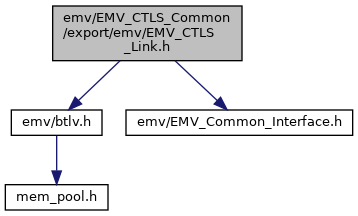
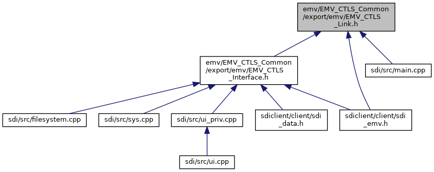

[Macros](#define-members) \| [Typedefs](#typedef-members) \| [Functions](#func-members)

`#include "`<a href="btlv_8h_source.md">emv/btlv.h</a>`"`
`#include "`<a href="_e_m_v___common___interface_8h_source.md">emv/EMV_Common_Interface.h</a>`"`

Include dependency graph for EMV_CTLS_Link.h:

This graph shows which files directly or indirectly include this file:

<a href="_e_m_v___c_t_l_s___link_8h_source.md">Go to the source code of this file.</a>

|  |  |
|----|----|
| Macros |  |
| #define  | [DLL_CLL](#a0aab3b78e27ba7f6f94e6d5aad4fde6a) |
| #define  | <a href="group___t_l_v___c_a_l_l_b_c_k.md#gab83b6cd59e38e79162f08a0b1628935d">EMV_CTLS_CALLBACK_STACK_SIZE</a>   0xC000 |
| #define  | [FS_CALLBACK_CTLS_DATA_RECORD](#a6218d5d8a6642bf3e19f69a54692f91e)   0xFF |

|  |  |
|----|----|
| Typedefs |  |
| typedef void()  | <a href="group___t_l_v___c_a_l_l_b_c_k.md#ga8099f858729a6abaca5890d8631d547a">EMV_CTLS_CALLBACK_Func</a>(unsigned char \*pucSend, unsigned short sSendSize, unsigned char \*pucReceive, unsigned short \*psReceiveSize, void \*externalData) |
|   | Common callback function: send/receive TLV stream to/from calling application. <a href="group___t_l_v___c_a_l_l_b_c_k.md#ga8099f858729a6abaca5890d8631d547a">More...</a>  |
| typedef <a href="group___t_l_v___c_a_l_l_b_c_k.md#ga8099f858729a6abaca5890d8631d547a">EMV_CTLS_CALLBACK_Func</a> \*  | <a href="group___t_l_v___c_a_l_l_b_c_k.md#ga6557e914101768d67635ca44e54362ab">EMV_CTLS_CALLBACK_FnT</a> |
|   | pointer to <a href="group___t_l_v___c_a_l_l_b_c_k.md#ga8099f858729a6abaca5890d8631d547a">EMV_CTLS_CALLBACK_Func</a> <a href="group___t_l_v___c_a_l_l_b_c_k.md#ga6557e914101768d67635ca44e54362ab">More...</a>  |

|  |  |
|----|----|
| Functions |  |
| <a href="group___a_d_k___r_e_t___c_o_d_e.md#gaa5ed8ecc7a31f36a8927e6e258187810">EMV_ADK_INFO</a>  | [EMV_CTLS_Interface](#a03dbac47e40ce21289457627c13ed13b) (const unsigned char \*dataIn, unsigned short dataInLen, unsigned char \*dataOut, unsigned short \*dataOutLen) |
|   | Serial interface to EMV functions. [More\...](#a03dbac47e40ce21289457627c13ed13b)  |
| <a href="group___a_d_k___r_e_t___c_o_d_e.md#gaa5ed8ecc7a31f36a8927e6e258187810">EMV_ADK_INFO</a>  | [EMV_CTLS_IF_Header](#aaf9b0ea6917fe33a90e269c4e07b400a) (const unsigned char \*header, const unsigned char \*dataIn, unsigned short dataInLen, unsigned char \*response, unsigned short \*responseLen) |
|   | Serial interface to EMV functions. [More\...](#aaf9b0ea6917fe33a90e269c4e07b400a)  |
| <a href="group___a_d_k___r_e_t___c_o_d_e.md#gaa5ed8ecc7a31f36a8927e6e258187810">EMV_ADK_INFO</a>  | [EMV_CTLS_IF_BERTLV](#a2c8764a2424d833faba7f715176e8557) (const unsigned char \*header, const struct <a href="struct_b_t_l_v_node.md">BTLVNode</a> \*dataIn, struct <a href="struct_b_t_l_v_node.md">BTLVNode</a> \*dataOut) |
|   | Serial interface to EMV functions. [More\...](#a2c8764a2424d833faba7f715176e8557)  |
| void  | <a href="group___f_u_n_c___f_l_o_w.md#ga6455193dd87247fc50cab29f410e7e06">EMV_CTLS_Disconnect</a> (unsigned char options) |
|   | Disconnect from EMV server. <a href="group___f_u_n_c___f_l_o_w.md#ga6455193dd87247fc50cab29f410e7e06">More...</a>  |
| void  | <a href="group___f_u_n_c___f_l_o_w.md#ga539b903c1b51eeb98dd660d3d88095a7">EMV_CTLS_SetClientMode</a> (enum <a href="_e_m_v___common___interface_8h.md#aa5ecae39726aadf1805b96849d3d28f5">EMV_CLIENT_MODE</a> mode) |
|   | Switch to client mode. <a href="group___f_u_n_c___f_l_o_w.md#ga539b903c1b51eeb98dd660d3d88095a7">More...</a>  |
| enum <a href="_e_m_v___common___interface_8h.md#aa5ecae39726aadf1805b96849d3d28f5">EMV_CLIENT_MODE</a>  | <a href="group___f_u_n_c___f_l_o_w.md#ga8b21722ef2dcc6d06c4b3c947200b6c8">EMV_CTLS_GetClientMode</a> () |
|   | Query the client mode. <a href="group___f_u_n_c___f_l_o_w.md#ga8b21722ef2dcc6d06c4b3c947200b6c8">More...</a>  |
| void  | <a href="group___f_u_n_c___f_l_o_w.md#gab60c67c1d2b40c6aebbe5a2aad88e0f8">EMV_CTLS_SetCallback</a> (<a href="group___t_l_v___c_a_l_l_b_c_k.md#ga6557e914101768d67635ca44e54362ab">EMV_CTLS_CALLBACK_FnT</a> EMV_Callback, void \*context) |
|   | Set Callback Function and activate Callback <a href="class_thread.md">Thread</a>. <a href="group___f_u_n_c___f_l_o_w.md#gab60c67c1d2b40c6aebbe5a2aad88e0f8">More...</a>  |
| unsigned long  | <a href="group___f_u_n_c___f_l_o_w.md#ga297309e3cacb1ff58b5c3101b27782ec">EMV_CTLS_GetInitOptions</a> (void) |
|   | Getter to Init Options from EMV_CTLS_Init_Framework. <a href="group___f_u_n_c___f_l_o_w.md#ga297309e3cacb1ff58b5c3101b27782ec">More...</a>  |
| unsigned  | <a href="group___f_u_n_c___f_l_o_w.md#ga2e8f70069fd23dad84c4ea6bce6a5ac7">EMV_CTLS_GetSdiSW12</a> () |
|   | Access SDI status word. <a href="group___f_u_n_c___f_l_o_w.md#ga2e8f70069fd23dad84c4ea6bce6a5ac7">More...</a>  |

## MacroDefinition Documentation {#macro-definition-documentation}

## DLL_CLL 

#define DLL_CLL

## FS_CALLBACK_CTLS_DATA_RECORD 

#define FS_CALLBACK_CTLS_DATA_RECORD   0xFF

## FunctionDocumentation {#function-documentation}

## EMV_CTLS_IF_BERTLV() 

<a href="group___a_d_k___r_e_t___c_o_d_e.md#gaa5ed8ecc7a31f36a8927e6e258187810">EMV_ADK_INFO</a> EMV_CTLS_IF_BERTLV

Serial interface to EMV functions.

### Author

GSS R&D Germany

**Parameters**

\[in\] **header** for serial interface, 4 byte: CLA, INS, P1, P2. If CLA=CLA_EMV and INS=INS_CBCK_TRACE, the function is used to trace data encapsulated in \"F0/DF02\" tag contained in dataIn field \[in\] **dataIn** input TLV Node (may be NULL) \[out\] **dataOut** output TLV (may be NULL and may be same as input)

### Returns

<a href="group___a_d_k___r_e_t___c_o_d_e.md#gab0e8158b5e7019f0da44c5cbc37bae3d">EMV_ADK_INTERNAL</a>, <a href="group___a_d_k___r_e_t___c_o_d_e.md#ga4837e54c589150debdef49afb8f9b5db">EMV_ADK_TLV_BUILD_ERR</a>, or return code of EMV function given in `header`

## EMV_CTLS_IF_Header() 

<a href="group___a_d_k___r_e_t___c_o_d_e.md#gaa5ed8ecc7a31f36a8927e6e258187810">EMV_ADK_INFO</a> EMV_CTLS_IF_Header

Serial interface to EMV functions.

### Author

GSS R&D Germany

**Parameters**

\[in\] **header** for serial interface, 4 byte: CLA, INS, P1, P2 \[in\] **dataIn** input TLV buffer (may be NULL) \[in\] **dataInLen** length of dataIn \[out\] **response** output TLV buffer (may be NULL) \[in,out\] **responseLen** length of dataOut

### Returns

<a href="group___a_d_k___r_e_t___c_o_d_e.md#gab0e8158b5e7019f0da44c5cbc37bae3d">EMV_ADK_INTERNAL</a>, <a href="group___a_d_k___r_e_t___c_o_d_e.md#ga89c11346e5e636e7c9d42c6a772674bf">EMV_ADK_PARAM</a>, or return code of EMV function given in `header`

## EMV_CTLS_Interface() 

<a href="group___a_d_k___r_e_t___c_o_d_e.md#gaa5ed8ecc7a31f36a8927e6e258187810">EMV_ADK_INFO</a> EMV_CTLS_Interface

Serial interface to EMV functions.

### Author

GSS R&D Germany

**Parameters**

\[in\] **dataIn** input TLV buffer \[in\] **dataInLen** length of dataIn \[out\] **dataOut** output TLV buffer \[in,out\] **dataOutLen** length of dataOut

### Returns

<a href="group___a_d_k___r_e_t___c_o_d_e.md#gab0e8158b5e7019f0da44c5cbc37bae3d">EMV_ADK_INTERNAL</a>, <a href="group___a_d_k___r_e_t___c_o_d_e.md#ga89c11346e5e636e7c9d42c6a772674bf">EMV_ADK_PARAM</a>, or return code of EMV function given in `dataIn`
