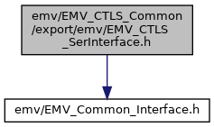
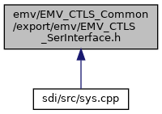

[Macros](#define-members) \| [Functions](#func-members)

Interface of CTLS-Framework. [More\...](#details)

`#include "`<a href="_e_m_v___common___interface_8h_source.md">emv/EMV_Common_Interface.h</a>`"`

Include dependency graph for EMV_CTLS_SerInterface.h:

This graph shows which files directly or indirectly include this file:

<a href="_e_m_v___c_t_l_s___ser_interface_8h_source.md">Go to the source code of this file.</a>

|          |                                               |
|----------|-----------------------------------------------|
| Macros   |                                               |
| #define  | [DLL_CLF](#a2f0bd8ac24ba34e8586df5a784e92539) |

|  |  |
|----|----|
| Functions |  |
| [DLL_CLF](#a2f0bd8ac24ba34e8586df5a784e92539) <a href="group___a_d_k___r_e_t___c_o_d_e.md#gaa5ed8ecc7a31f36a8927e6e258187810">EMV_ADK_INFO</a>  | [EMV_CTLS_HandleCallback](#a27717a16ba1426c41655362ca975b475) (unsigned char \*data, unsigned short \*dataLen) |
| [DLL_CLF](#a2f0bd8ac24ba34e8586df5a784e92539) <a href="group___a_d_k___r_e_t___c_o_d_e.md#gaa5ed8ecc7a31f36a8927e6e258187810">EMV_ADK_INFO</a>  | [EMV_CTLS_SerInterface](#a540b4e23317a9808730510cf39224588) (const unsigned char \*dataIn, unsigned short dataInLen, unsigned char \*dataOut, unsigned short \*dataOutLen) |
|   | Serial interface to EMV functions. [More\...](#a540b4e23317a9808730510cf39224588)  |

## DetailedDescription {#detailed-description}

Interface of CTLS-Framework.

## MacroDefinition Documentation {#macro-definition-documentation}

## DLL_CLF 

#define DLL_CLF

## FunctionDocumentation {#function-documentation}

## EMV_CTLS_HandleCallback() 

[DLL_CLF](#a2f0bd8ac24ba34e8586df5a784e92539) <a href="group___a_d_k___r_e_t___c_o_d_e.md#gaa5ed8ecc7a31f36a8927e6e258187810">EMV_ADK_INFO</a> EMV_CTLS_HandleCallback

## EMV_CTLS_SerInterface() 

[DLL_CLF](#a2f0bd8ac24ba34e8586df5a784e92539) <a href="group___a_d_k___r_e_t___c_o_d_e.md#gaa5ed8ecc7a31f36a8927e6e258187810">EMV_ADK_INFO</a> EMV_CTLS_SerInterface

Serial interface to EMV functions.

### Author

GSS R&D Germany

**Parameters**

\[in\] **dataIn** input TLV buffer \[in\] **dataInLen** length of dataIn \[out\] **dataOut** output TLV buffer \[in,out\] **dataOutLen** length of dataOut

### Returns

EMV_ADK_OK, EMV_ADK_INTERNAL, EMV_ADK_PARAM
