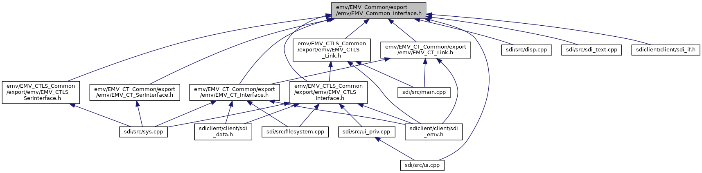

[Data Structures](#nested-classes) \| [Macros](#define-members) \| [Typedefs](#typedef-members) \| [Enumerations](#enum-members)

This graph shows which files directly or indirectly include this file:

<a href="_e_m_v___common___interface_8h_source.md">Go to the source code of this file.</a>

|  |  |
|----|----|
| Data Structures |  |
| struct   | [EMV_ADK_TXT_TYPE](#struct_e_m_v___a_d_k___t_x_t___t_y_p_e) |

|  |  |
|----|----|
| Macros |  |
| #define  | <a href="group___a_d_k___l_i_m_i_t_s.md#ga574c13b5401ae9f6875d2becafc73337">EMV_ADK_MAX_LANG</a>   20 |
|   | maximum number of languages to be configured <a href="group___a_d_k___l_i_m_i_t_s.md#ga574c13b5401ae9f6875d2becafc73337">More...</a>  |
| #define  | <a href="group___a_d_k___l_i_m_i_t_s.md#ga451b76d7c9854647febe4f89c53fa57a">EMV_ADK_DEFAULT_AIDSUPP</a>   20 |
|   | default maximum number of supported AIDs <a href="group___a_d_k___l_i_m_i_t_s.md#ga451b76d7c9854647febe4f89c53fa57a">More...</a>  |
| #define  | <a href="group___a_d_k___l_i_m_i_t_s.md#ga5049b813ed8f9aa33e607835e30a176c">EMV_ADK_MAX_AIDSUPP</a>   <a href="group___a_d_k___l_i_m_i_t_s.md#ga451b76d7c9854647febe4f89c53fa57a">EMV_ADK_DEFAULT_AIDSUPP</a> |
| #define  | <a href="group___a_d_k___l_i_m_i_t_s.md#ga1de1c8d68d575ee04c4f271f4b075e99">EMV_ADK_LIMIT_AIDSUPP</a>   255 |
|   | maximum number of supported AIDs for extended AID support <a href="group___a_d_k___l_i_m_i_t_s.md#ga1de1c8d68d575ee04c4f271f4b075e99">More...</a>  |
| #define  | <a href="group___a_d_k___l_i_m_i_t_s.md#gaa08617397087858bb1ca9c3a7830bb12">EMV_ADK_MAX_LG_DDOL</a>   80 |
|   | max. length of DDOL (<a href="group___d_e_f___c_o_n_f___a_p_p_l_i.md#a27e03203f154c52be3abc2db49842a93">EMV_CT_APPLIDATA_STRUCT::Default_DDOL</a>) <a href="group___a_d_k___l_i_m_i_t_s.md#gaa08617397087858bb1ca9c3a7830bb12">More...</a>  |
| #define  | <a href="group___a_d_k___l_i_m_i_t_s.md#ga35fcdb8dd0661988e68a90ced11a8db6">EMV_ADK_MAX_LG_TDOL</a>   80 |
|   | max. length of TDOL (<a href="group___d_e_f___c_o_n_f___a_p_p_l_i.md#a9741f7d86efbb9dc20f687b6cad55f4c">EMV_CT_APPLIDATA_STRUCT::Default_TDOL</a>) <a href="group___a_d_k___l_i_m_i_t_s.md#ga35fcdb8dd0661988e68a90ced11a8db6">More...</a>  |
| #define  | <a href="group___a_d_k___l_i_m_i_t_s.md#gab820d19be0790eb2e15c5388ba3903fc">EMV_ADK_MAX_PRIO_APP</a>   5 |
|   | max. number of priority applications (see <a href="group___d_e_f___c_o_n_f___a_p_p_l_i.md#aafdd60748ec764b0398657d3a87e0d19">EMV_CT_APPLIDATA_STRUCT::xAIDPrio</a>) <a href="group___a_d_k___l_i_m_i_t_s.md#gab820d19be0790eb2e15c5388ba3903fc">More...</a>  |
| #define  | <a href="group___a_d_k___l_i_m_i_t_s.md#gaa286e1585fdb397b7731314abb2fe690">EMV_ADK_MAX_DOM_CHP</a>   5 |
|   | max. number of domestic chip applications (see <a href="group___a_d_k___t_r_x___e_x_e_c.md#a383caf30fab1895ac0b58becb208a758">EMV_CT_APPS_SELECT_STRUCT::xDomestic_Chip</a>) <a href="group___a_d_k___l_i_m_i_t_s.md#gaa286e1585fdb397b7731314abb2fe690">More...</a>  |
| #define  | <a href="group___a_d_k___l_i_m_i_t_s.md#ga32af480e45f8fd565ef45241cda5864c">EMV_ADK_MAX_FB_MSR</a>   20 |
|   | max. number of assigned magstripe fallback applications per transaction (see <a href="group___a_d_k___t_r_x___e_x_e_c.md#a0ce15f8ce270bd4f01e39c8c8dd5953b">EMV_CT_APPS_SELECT_STRUCT::xFallback_MS</a>) . Candidates are every credit card, Maestro and maybe local applications. <a href="group___a_d_k___l_i_m_i_t_s.md#ga32af480e45f8fd565ef45241cda5864c">More...</a>  |
| #define  | <a href="group___a_d_k___l_i_m_i_t_s.md#ga8985e58be6c1a0568bcf5dc777ff2e37">EMV_ADK_MAX_CHP_TO_MSR</a>   3 |
|   | max. number of assigned magstripe fallback applications per chip application (see <a href="group___d_e_f___c_o_n_f___a_p_p_l_i.md#afe1309924816c148ef5665647e4b3f53">EMV_CT_APPLIDATA_STRUCT::tucFallbackMIDs</a>) <a href="group___a_d_k___l_i_m_i_t_s.md#ga8985e58be6c1a0568bcf5dc777ff2e37">More...</a>  |
| #define  | <a href="group___a_d_k___l_i_m_i_t_s.md#gafe3c054e399fe8a12f67d8201cc67db5">EMV_ADK_IAD_MAX_LEN</a>   16 |
|   | max. length of issuer authentic. data (EMVCo tag 91) because <a href="group___a_d_k___t_r_x___e_x_e_c.md#a9c0d8eae37200d205013e0a17f2d2ff1">EMV_CT_HOST_STRUCT::AuthData</a> includes \"91xx\" it has a maximum length of EMV_ADK_IAD_MAX_LEN + 2 <a href="group___a_d_k___l_i_m_i_t_s.md#gafe3c054e399fe8a12f67d8201cc67db5">More...</a>  |
| #define  | <a href="group___a_d_k___l_i_m_i_t_s.md#gaf9bd4a2a5e99c9e5564c55204280a9f8">EMV_ADK_SCRIPT_RESULT_LEN</a>   5 |
|   | Max. length of issuer script result data (output of <a href="group___f_u_n_c___f_l_o_w.md#ga42f570d2b8e66841ab9e8de7736e92d4">EMV_CT_ContinueOnline()</a>, see also <a href="group___a_d_k___t_r_x___e_x_e_c.md#a6257b8c91140f05c572607aff48a301e">EMV_CT_TRANSRES_STRUCT::scriptresults</a>) (not used for contactless) <a href="group___a_d_k___l_i_m_i_t_s.md#gaf9bd4a2a5e99c9e5564c55204280a9f8">More...</a>  |
| #define  | <a href="group___a_d_k___l_i_m_i_t_s.md#ga1ec5682c80c6a268dd18a054c231c5e7">EMV_ADK_SCRIPT_RESULT_MAX</a>   10 |
|   | L2 kernel: Max. number of issuer script results (output of <a href="group___f_u_n_c___f_l_o_w.md#ga42f570d2b8e66841ab9e8de7736e92d4">EMV_CT_ContinueOnline()</a>, see also <a href="group___a_d_k___t_r_x___e_x_e_c.md#a6257b8c91140f05c572607aff48a301e">EMV_CT_TRANSRES_STRUCT::scriptresults</a>) Used for <a href="group___a_d_k___l_i_m_i_t_s.md#ga1ec5682c80c6a268dd18a054c231c5e7">EMV_ADK_SCRIPT_RESULT_MAX</a> (not used for contactless) <a href="group___a_d_k___l_i_m_i_t_s.md#ga1ec5682c80c6a268dd18a054c231c5e7">More...</a>  |
| #define  | <a href="group___a_d_k___l_i_m_i_t_s.md#ga9b9c110ea297c64e70f6847acd351032">EMV_ADK_CHECKSUM_ASCII_SIZE</a>   33 |
|   | EMV L2 kernel: Size of EMVCo checksum in ASCII representation (incl. zero termination) Used for <a href="group___d_e_f___c_o_n_f___a_p_p_l_i.md#ae6aab5905479e56d87c421779d57b603">EMV_CT_APPLIDATA_STRUCT::ChksumASCIIEMVCO</a>. <a href="group___a_d_k___l_i_m_i_t_s.md#ga9b9c110ea297c64e70f6847acd351032">More...</a>  |
| #define  | <a href="group___a_d_k___l_i_m_i_t_s.md#ga94c28d1831d5df59ec7e7e44b7f39528">EMV_ADK_VERSION_ASCII_SIZE</a>   128 |
|   | Size of EMVCo Kernel version, Framework version and L1 Driver version information in ASCII representation (see <a href="group___d_e_f___c_o_n_f___t_e_r_m.md#a808cb5cde9cf6ac837ef81977f4a751c">EMV_CT_TERMDATA_STRUCT::KernelVersion</a>, EMV_CT_TERMDATA_STRUCT::FrameworkVersiona and <a href="group___d_e_f___c_o_n_f___t_e_r_m.md#a534424c16f043292e2b4bf000b07ead3">EMV_CT_TERMDATA_STRUCT::L1DriverVersion</a>) <a href="group___a_d_k___l_i_m_i_t_s.md#ga94c28d1831d5df59ec7e7e44b7f39528">More...</a>  |
| #define  | <a href="group___a_d_k___l_i_m_i_t_s.md#ga32efd5748824ecdc236506ff0b7d5a38">EMV_ADK_CHECKSUM_SIZE</a>   4 |
|   | L2 kernel: Size of EMVCo checksum in bytes Used internally. <a href="group___a_d_k___l_i_m_i_t_s.md#ga32efd5748824ecdc236506ff0b7d5a38">More...</a>  |
| #define  | <a href="group___a_d_k___l_i_m_i_t_s.md#gad1f3a82ce1270c4cdef0688274514219">EMV_ADK_CHECKSUM_SIZE_NEW</a>   16 |
|   | L2 kernel: Size of new EMVCo checksum in bytes Used internally. <a href="group___a_d_k___l_i_m_i_t_s.md#gad1f3a82ce1270c4cdef0688274514219">More...</a>  |
| #define  | <a href="group___a_d_k___l_i_m_i_t_s.md#gad5cac2b5abf312efe65c8dba287b7e33">EMV_ADK_BCD_AMOUNT_LEN</a>   6 |
| #define  | <a href="group___a_d_k___l_i_m_i_t_s.md#ga738e39b250b1635be85fbbd117df6c47">EMV_ADK_BIN_AMOUNT_LEN</a>   4 |
| #define  | <a href="group___a_d_k___l_i_m_i_t_s.md#gac3556a77138a4d38cd8f4adc3ed5e9dc">EMV_ADK_BCD_COUNTRY_CURRENCY_CODE_LEN</a>   2 |
| #define  | <a href="group___a_d_k___l_i_m_i_t_s.md#ga6e8567321ccb6b0e0ead17f9e227ef24">EMV_ADK_BCD_DATE_OR_TIME_LEN</a>   3 |
| #define  | <a href="group___a_d_k___l_i_m_i_t_s.md#ga7d096e27feca56f2d8d04c0c7a24dbe9">EMV_ADK_MAX_CVM</a>   10 |
|   | Number of CVM given in parameter `pucCvmList` of <a href="group___t_l_v___c_a_l_l_b_c_k.md#ga3ff52ae040bd291d348e505e057f02ef">EMV_CT_CALLBACK_FnT()</a> (<a href="adk__emv__contactless__programmers__guide_8dox.md#ac82fa7e4064512e71e63fd647b817d97">TAG_BF06_CBK_LOCAL_CHECKS</a>, <a href="adk__emv__contactless__programmers__guide_8dox.md#af335a870e9d2f299c848f76b843907f7">TAG_BF07_CBK_DCC</a>). Also used in <a href="group___a_d_k___t_r_x___e_x_e_c.md#a43475fc383c8af04a791babac2e7d139">EMV_CT_TRANSRES_STRUCT::T_8E_CVM_List</a>. Length in bytes: <a href="group___a_d_k___l_i_m_i_t_s.md#ga46764397b0b65ae83c015e4d1f570cf6">EMV_ADK_MAX_CVM_LIST_LEN</a> (not used for contactless) <a href="group___a_d_k___l_i_m_i_t_s.md#ga7d096e27feca56f2d8d04c0c7a24dbe9">More...</a>  |
| #define  | <a href="group___a_d_k___l_i_m_i_t_s.md#ga46764397b0b65ae83c015e4d1f570cf6">EMV_ADK_MAX_CVM_LIST_LEN</a>   (8 + <a href="group___a_d_k___l_i_m_i_t_s.md#ga7d096e27feca56f2d8d04c0c7a24dbe9">EMV_ADK_MAX_CVM</a> \* 2) |
|   | Length in bytes of parameter `pucCvmList` of <a href="group___t_l_v___c_a_l_l_b_c_k.md#ga3ff52ae040bd291d348e505e057f02ef">EMV_CT_CALLBACK_FnT()</a> (<a href="adk__emv__contactless__programmers__guide_8dox.md#afd0adcc12331559863dd65d8f7558645">TAG_BF05_CBK_DOM_APPS</a> and <a href="adk__emv__contactless__programmers__guide_8dox.md#af335a870e9d2f299c848f76b843907f7">TAG_BF07_CBK_DCC</a>). Also used in <a href="group___a_d_k___t_r_x___e_x_e_c.md#a43475fc383c8af04a791babac2e7d139">EMV_CT_TRANSRES_STRUCT::T_8E_CVM_List</a>. Number of included CVMs: <a href="group___a_d_k___l_i_m_i_t_s.md#ga7d096e27feca56f2d8d04c0c7a24dbe9">EMV_ADK_MAX_CVM</a> (not used for contactless) <a href="group___a_d_k___l_i_m_i_t_s.md#ga46764397b0b65ae83c015e4d1f570cf6">More...</a>  |
| #define  | <a href="group___a_d_k___l_i_m_i_t_s.md#ga0b43710811c6f8b8aa7110abdf771269">EMV_ADK_MAX_PAN_LANGUAGES</a>   6 |
|   | Maximum number of languages to give back in `pucReducedLanguageList` of <a href="group___t_l_v___c_a_l_l_b_c_k.md#ga3ff52ae040bd291d348e505e057f02ef">EMV_CT_CALLBACK_FnT()</a> (<a href="adk__emv__contactless__programmers__guide_8dox.md#afd0adcc12331559863dd65d8f7558645">TAG_BF05_CBK_DOM_APPS</a>) (Not used for contactless) <a href="group___a_d_k___l_i_m_i_t_s.md#ga0b43710811c6f8b8aa7110abdf771269">More...</a>  |
| #define  | <a href="group___a_d_k___r_e_t___c_o_d_e.md#ga1456bb13b42906927f8a8942169b62e7">EMV_ADK_OK</a>   0 |
|   | Function successful, no error. <a href="group___a_d_k___r_e_t___c_o_d_e.md#ga1456bb13b42906927f8a8942169b62e7">More...</a>  |
| #define  | <a href="group___a_d_k___r_e_t___c_o_d_e.md#gaae0cf180db0eb31571483f68f247b395">EMV_ADK_APP_REQ_START</a>   0xA0 |
|   | CT Reentrance mode: Application requested return start reserved codes. <a href="group___a_d_k___r_e_t___c_o_d_e.md#gaae0cf180db0eb31571483f68f247b395">More...</a>  |
| #define  | <a href="group___a_d_k___r_e_t___c_o_d_e.md#gaed9d54e360dbfb4a72c615596c8a87fc">EMV_ADK_APP_REQ_CANDIDATE</a>   0xA1 |
|   | CT Reentrance mode: Application requested return application selection. <a href="group___a_d_k___r_e_t___c_o_d_e.md#gaed9d54e360dbfb4a72c615596c8a87fc">More...</a>  |
| #define  | <a href="group___a_d_k___r_e_t___c_o_d_e.md#ga7e8709216fe47553fc0c129f71846579">EMV_ADK_APP_REQ_READREC</a>   0xA2 |
|   | CT Reentrance mode: Application requested return read records. <a href="group___a_d_k___r_e_t___c_o_d_e.md#ga7e8709216fe47553fc0c129f71846579">More...</a>  |
| #define  | <a href="group___a_d_k___r_e_t___c_o_d_e.md#ga3ebf5cde005e4770514ac5b6c4a93cf0">EMV_ADK_APP_REQ_DATAAUTH</a>   0xA3 |
|   | CT Reentrance mode: Application requested return data authentication. <a href="group___a_d_k___r_e_t___c_o_d_e.md#ga3ebf5cde005e4770514ac5b6c4a93cf0">More...</a>  |
| #define  | <a href="group___a_d_k___r_e_t___c_o_d_e.md#ga50c0c0b8fa6d7b1356c1604ad4f04e2e">EMV_ADK_APP_REQ_ONL_PIN</a>   0xA4 |
|   | CT Reentrance mode: Application requested return for online PIN entry. <a href="group___a_d_k___r_e_t___c_o_d_e.md#ga50c0c0b8fa6d7b1356c1604ad4f04e2e">More...</a>  |
| #define  | <a href="group___a_d_k___r_e_t___c_o_d_e.md#ga9f24ffaff279cf995620ec108e5f43ae">EMV_ADK_APP_REQ_OFL_PIN</a>   0xA5 |
|   | CT Reentrance mode: Application requested return for offline PIN entry. <a href="group___a_d_k___r_e_t___c_o_d_e.md#ga9f24ffaff279cf995620ec108e5f43ae">More...</a>  |
| #define  | <a href="group___a_d_k___r_e_t___c_o_d_e.md#gae60344ca125866bbf74c921df04c6a15">EMV_ADK_APP_REQ_PLAIN_PIN</a>   0xA6 |
|   | CT Reentrance mode: Application requested return for plaintext PIN entry. <a href="group___a_d_k___r_e_t___c_o_d_e.md#gae60344ca125866bbf74c921df04c6a15">More...</a>  |
| #define  | <a href="group___a_d_k___r_e_t___c_o_d_e.md#gabdfc095e6577d12f82285f938328b678">EMV_ADK_APP_REQ_CVM_END</a>   0xA7 |
|   | CT Reentrance mode: Application requested return cardholder verification. <a href="group___a_d_k___r_e_t___c_o_d_e.md#gabdfc095e6577d12f82285f938328b678">More...</a>  |
| #define  | <a href="group___a_d_k___r_e_t___c_o_d_e.md#gaeec298e8f5ee75843d4b029f06334038">EMV_ADK_APP_REQ_RISK_MAN</a>   0xA8 |
|   | CT Reentrance mode: Application requested return riskmanagement. <a href="group___a_d_k___r_e_t___c_o_d_e.md#gaeec298e8f5ee75843d4b029f06334038">More...</a>  |
| #define  | <a href="group___a_d_k___r_e_t___c_o_d_e.md#gac34718369beab5534c0bf9407179298e">EMV_ADK_APP_REQ_CUST_CVM</a>   0xA9 |
|   | CT Reentrance mode: Application requested return for customCVM method. <a href="group___a_d_k___r_e_t___c_o_d_e.md#gac34718369beab5534c0bf9407179298e">More...</a>  |
| #define  | <a href="group___a_d_k___r_e_t___c_o_d_e.md#ga6f0928c2fe4216f6c7b8d95a295ea27a">EMV_ADK_APP_REQ_APPS_PREPROC</a>   0xAA |
|   | CT Reentrance mode: Application requested return for candidate list manipulation. <a href="group___a_d_k___r_e_t___c_o_d_e.md#ga6f0928c2fe4216f6c7b8d95a295ea27a">More...</a>  |
| #define  | <a href="group___a_d_k___r_e_t___c_o_d_e.md#ga68763f74d49df69973ffe93e17db5df2">EMV_ADK_APP_REQ_AFTER_GPO</a>   0xAB |
|   | CT Reentrance mode: Application requested return for return after GPO. <a href="group___a_d_k___r_e_t___c_o_d_e.md#ga68763f74d49df69973ffe93e17db5df2">More...</a>  |
| #define  | <a href="group___a_d_k___r_e_t___c_o_d_e.md#ga5d8068fba481cd994ad90650868e134b">EMV_ADK_APP_REQ_BUILD_LIST</a>   0xAC |
|   | CT Reentrance mode: Application requested return before terminal candidate list build. <a href="group___a_d_k___r_e_t___c_o_d_e.md#ga5d8068fba481cd994ad90650868e134b">More...</a>  |
| #define  | <a href="group___a_d_k___r_e_t___c_o_d_e.md#ga41a87a27c017cfc748b95d4406eecfd3">EMV_ADK_APP_REQ_END</a>   0xAF |
|   | CT Reentrance mode: Application requested return end of reserved codes. <a href="group___a_d_k___r_e_t___c_o_d_e.md#ga41a87a27c017cfc748b95d4406eecfd3">More...</a>  |
| #define  | <a href="group___a_d_k___r_e_t___c_o_d_e.md#ga69f396193e4def503c935de027b5dd9e">EMV_ADK_EMPTY_CONFIG</a>   0xC6 |
|   | Empty configuration. <a href="group___a_d_k___r_e_t___c_o_d_e.md#ga69f396193e4def503c935de027b5dd9e">More...</a>  |
| #define  | <a href="group___a_d_k___r_e_t___c_o_d_e.md#gab35b36c5f7adc118eeb46c0a43fe3e45">EMV_ADK_TERMINATE_CDCVM_RETRY</a>   0xC7 |
|   | DPAS CDCVM has not been performed. Terminate the transaction, prompt the Cardholder to remove the card, perform CDCVM, and try again. <a href="group___a_d_k___r_e_t___c_o_d_e.md#gab35b36c5f7adc118eeb46c0a43fe3e45">More...</a>  |
| #define  | <a href="group___a_d_k___r_e_t___c_o_d_e.md#gab74c96109e0d2e68a62673286075c560">EMV_ADK_TIMEOUT</a>   0xC8 |
|   | Timeout. <a href="group___a_d_k___r_e_t___c_o_d_e.md#gab74c96109e0d2e68a62673286075c560">More...</a>  |
| #define  | <a href="group___a_d_k___r_e_t___c_o_d_e.md#ga3adc70d672a6da9dff5859785e2fe955">EMV_ADK_MAX_CFG_NUMBER_EXCEEDED</a>   0xC9 |
|   | CTLS: Number of keys uploaded to VFI Reader exceeded (appears when number of keys more than 99, all next keys are ignored) <a href="group___a_d_k___r_e_t___c_o_d_e.md#ga3adc70d672a6da9dff5859785e2fe955">More...</a>  |
| #define  | <a href="group___a_d_k___r_e_t___c_o_d_e.md#ga826808ff642e703f810898847e031b98">EMV_ADK_VFI_FAIL</a>   0xCA |
| #define  | <a href="group___a_d_k___r_e_t___c_o_d_e.md#ga526c9428888487636a2f61b14533b0c4">EMV_ADK_CTLS_OFFLINE_PIN</a>   0xCB |
|   | Transaction to be continued after PIN input for girocard (German debit card) Offline PIN CVM. <a href="group___a_d_k___r_e_t___c_o_d_e.md#ga526c9428888487636a2f61b14533b0c4">More...</a>  |
| #define  | <a href="group___a_d_k___r_e_t___c_o_d_e.md#ga863ac8601603cfa61ef0d6d794742ded">EMV_ADK_NOT_ACCEPTED</a>   0xCC |
|   | Transaction / Payment type not accepted. <a href="group___a_d_k___r_e_t___c_o_d_e.md#ga863ac8601603cfa61ef0d6d794742ded">More...</a>  |
| #define  | <a href="group___a_d_k___r_e_t___c_o_d_e.md#ga0ea2dfe4133a48c8ba1c2c6f083456b2">EMV_ADK_CANCELLED</a>   0xCD |
|   | Contactless only Transaction was cancelled by <a href="group___f_u_n_c___f_l_o_w.md#ga2b4820be53959b56fb7f672bd54f4e63">EMV_CTLS_Break()</a> <a href="group___a_d_k___r_e_t___c_o_d_e.md#ga0ea2dfe4133a48c8ba1c2c6f083456b2">More...</a>  |
| #define  | <a href="group___a_d_k___r_e_t___c_o_d_e.md#ga5a816be637c4bea49241c5adb1251921">EMV_ADK_CARD_LOG_LOG_OK</a>   0xCE |
|   | Return code for successful read of cards transaction log (currently qPBOC only) <a href="group___a_d_k___r_e_t___c_o_d_e.md#ga5a816be637c4bea49241c5adb1251921">More...</a>  |
| #define  | <a href="group___a_d_k___r_e_t___c_o_d_e.md#ga58557878ed94f8e27c606a675afdd5e6">EMV_ADK_CTLS_LOW_BATTERY</a>   0xCF |
|   | Return code for EMV_CTLS_SetupTransaction indicating mobile device\'s battery too low for contactless transaction. <a href="group___a_d_k___r_e_t___c_o_d_e.md#ga58557878ed94f8e27c606a675afdd5e6">More...</a>  |
| #define  | <a href="group___a_d_k___r_e_t___c_o_d_e.md#ga40078f8164a34afef771e922a935a5e7">EMV_ADK_NOT_ALLOWED_WRONG_CFG_INTF</a>   0xD0 |
|   | CTLS: The function is not allowed when using this config interface. <a href="group___a_d_k___r_e_t___c_o_d_e.md#ga40078f8164a34afef771e922a935a5e7">More...</a>  |
| #define  | <a href="group___a_d_k___r_e_t___c_o_d_e.md#ga7c824fdc6135c521a5d9bfc1a2a71c85">EMV_ADK_VIRTTERMMAP_WRONG_INIT</a>   0xD1 |
|   | Virtual terminal map is configured, but transaction is started with virtual terminal != 0. <a href="group___a_d_k___r_e_t___c_o_d_e.md#ga7c824fdc6135c521a5d9bfc1a2a71c85">More...</a>  |
| #define  | <a href="group___a_d_k___r_e_t___c_o_d_e.md#gabe41cb42142b83678146fe6ee1547152">EMV_ADK_TOO_MANY_TAPS</a>   0xD2 |
|   | CTLS: card holder exceeded the number of taps allowed for one transaction (Interac to show \"Cannot Process transaction - too many taps\") <a href="group___a_d_k___r_e_t___c_o_d_e.md#gabe41cb42142b83678146fe6ee1547152">More...</a>  |
| #define  | <a href="group___a_d_k___r_e_t___c_o_d_e.md#ga3175b735efc182d22c99accc1fe86a96">EMV_ADK_CAN_NOT_PROCESS</a>   0xD3 |
|   | (will appear only if the CTLS kernel is configured in that way that Contact Chip is not supported) <a href="group___a_d_k___r_e_t___c_o_d_e.md#ga3175b735efc182d22c99accc1fe86a96">More...</a>  |
| #define  | <a href="group___a_d_k___r_e_t___c_o_d_e.md#ga1d74ac7463ef972f6fb458bdade5cfd8">EMV_ADK_USE_ANOTHER_CTLS_CARD</a>   0xD4 |
|   | CTLS: advice the customer to use another CTLS card (will appear only if the CTLS kernel is configured in that way that Contact Chip is not supported) <a href="group___a_d_k___r_e_t___c_o_d_e.md#ga1d74ac7463ef972f6fb458bdade5cfd8">More...</a>  |
| #define  | <a href="group___a_d_k___r_e_t___c_o_d_e.md#gab7ba6c5087c4dbeb0d5c99312c38ab49">EMV_ADK_USE_OTHER_TERMINAL</a>   0xD5 |
|   | CTLS: advice the merchant to use another terminal to process the transaction (Interac spec requirement) <a href="group___a_d_k___r_e_t___c_o_d_e.md#gab7ba6c5087c4dbeb0d5c99312c38ab49">More...</a>  |
| #define  | <a href="group___a_d_k___r_e_t___c_o_d_e.md#ga4ec730a0bbd30cf666d84eb6f02d1473">EMV_ADK_SCRIPT_PROCESSING_COMPLETE</a>   0xD6 |
|   | CTLS: explicit script processing completed (CTLS, e.g. Discover DPAS) <a href="group___a_d_k___r_e_t___c_o_d_e.md#ga4ec730a0bbd30cf666d84eb6f02d1473">More...</a>  |
| #define  | <a href="group___a_d_k___r_e_t___c_o_d_e.md#ga9c3ffa7ae38648dda00a7f3d65775d2f">EMV_ADK_FALLBACK_CHIP_ONLY</a>   0xD7 |
|   | CTLS: Fallback to chip (CTLS), no msr allowed. <a href="group___a_d_k___r_e_t___c_o_d_e.md#ga9c3ffa7ae38648dda00a7f3d65775d2f">More...</a>  |
| #define  | <a href="group___a_d_k___r_e_t___c_o_d_e.md#ga1dacd808ce3e0d37daea5d3162e4f5ce">EMV_ADK_READER_CMD_NOT_ALLOWED</a>   0xD8 |
| #define  | <a href="group___a_d_k___r_e_t___c_o_d_e.md#ga3a1d800696b9d7a86c0e39068d3fde57">EMV_ADK_NOT_ALLOWED</a>   0xD9 |
|   | Parallel function call not allowed. <a href="group___a_d_k___r_e_t___c_o_d_e.md#ga3a1d800696b9d7a86c0e39068d3fde57">More...</a>  |
| #define  | <a href="group___a_d_k___r_e_t___c_o_d_e.md#ga4ea6891b4dd6c0d8d8703b8654453cbf">EMV_ADK_CTLS_NOT_AVAILABLE</a>   0xDA |
|   | CTLS not present on hardware per OS information. <a href="group___a_d_k___r_e_t___c_o_d_e.md#ga4ea6891b4dd6c0d8d8703b8654453cbf">More...</a>  |
| #define  | <a href="group___a_d_k___r_e_t___c_o_d_e.md#ga73ac1b36b24d6c30117cc4a62585edc3">EMV_ADK_USR_BCKSPC_KEY_PRESSED</a>   0xDB |
|   | Application requested return for E_USR_BACKSPACE_KEY_PRESSED, not used anymore. <a href="group___a_d_k___r_e_t___c_o_d_e.md#ga73ac1b36b24d6c30117cc4a62585edc3">More...</a>  |
| #define  | <a href="group___a_d_k___r_e_t___c_o_d_e.md#ga9d45b7eb80fa296f2932eef3ffe1bd8a">EMV_ADK_CEILING_LIMIT</a>   0xDC |
|   | CTLS: amount is above the ceiling limit for CTLS (either terminal ceiling limit or highest scheme ceiling limit) <a href="group___a_d_k___r_e_t___c_o_d_e.md#ga9d45b7eb80fa296f2932eef3ffe1bd8a">More...</a>  |
| #define  | <a href="group___a_d_k___r_e_t___c_o_d_e.md#ga96d411b44e6e9da54f7645925d49450c">EMV_ADK_CTLS_RETAP_SAME</a>   0xDD |
|   | CTLS: start over with re-tapping the same card (deactivation/activation/start txn) <a href="group___a_d_k___r_e_t___c_o_d_e.md#ga96d411b44e6e9da54f7645925d49450c">More...</a>  |
| #define  | <a href="group___a_d_k___r_e_t___c_o_d_e.md#ga5ac7394992bf95374fa70bc6a86298f4">EMV_ADK_CTLS_DOMESTIC_APP</a>   0xDE |
|   | CTLS: Domestic Application Kernel selected. <a href="group___a_d_k___r_e_t___c_o_d_e.md#ga5ac7394992bf95374fa70bc6a86298f4">More...</a>  |
| #define  | <a href="group___a_d_k___r_e_t___c_o_d_e.md#ga2e738502a536ed7190406ce0e7c6916d">EMV_ADK_NO_CARD</a>   0xDF |
|   | CTLS: No card processing so far. <a href="group___a_d_k___r_e_t___c_o_d_e.md#ga2e738502a536ed7190406ce0e7c6916d">More...</a>  |
| #define  | <a href="group___a_d_k___r_e_t___c_o_d_e.md#ga14713da8fe0512c8700f524279d2e573">EMV_ADK_NOAPP</a>   0xE0 |
|   | CT: Return code if application not found by <a href="group___f_u_n_c___f_l_o_w.md#gad55c11dd44dbba66d6fefeb48b01a9e4">EMV_CT_CheckSupportedAID()</a>. CTLS: Empty terminal candidate list (e.g. all application\'s ceiling limits exceeded) at <a href="group___f_u_n_c___f_l_o_w.md#ga1a86c76dcf8fec6e97ead6cf8f2717ff">EMV_CTLS_SetupTransaction()</a>. <a href="group___a_d_k___r_e_t___c_o_d_e.md#ga14713da8fe0512c8700f524279d2e573">More...</a>  |
| #define  | <a href="group___a_d_k___r_e_t___c_o_d_e.md#ga7ffea44a30b0451d393487eae4035b4e">EMV_ADK_NO_EXEC</a>   0xE1 |
|   | CT & CTLS: not executable. <a href="group___a_d_k___r_e_t___c_o_d_e.md#ga7ffea44a30b0451d393487eae4035b4e">More...</a>  |
| #define  | <a href="group___a_d_k___r_e_t___c_o_d_e.md#ga493578e3e0e9112d42d209b783fe1f60">EMV_ADK_ARQC</a>   0xE2 |
|   | CT & CTLS: Transaction must be performed online. <a href="group___a_d_k___r_e_t___c_o_d_e.md#ga493578e3e0e9112d42d209b783fe1f60">More...</a>  |
| #define  | <a href="group___a_d_k___r_e_t___c_o_d_e.md#ga555e8c267be8402d0b540253a991e1ee">EMV_ADK_TC</a>   0xE3 |
|   | CT & CTLS: Transaction performed (offline / online) <a href="group___a_d_k___r_e_t___c_o_d_e.md#ga555e8c267be8402d0b540253a991e1ee">More...</a>  |
| #define  | <a href="group___a_d_k___r_e_t___c_o_d_e.md#ga956701431c0cef09072c040d816e5d7b">EMV_ADK_AAC</a>   0xE4 |
|   | CT & CTLS: Transaction declined. <a href="group___a_d_k___r_e_t___c_o_d_e.md#ga956701431c0cef09072c040d816e5d7b">More...</a>  |
| #define  | <a href="group___a_d_k___r_e_t___c_o_d_e.md#ga43a6dcc45fcf91c2ef8e73afc38ea121">EMV_ADK_AAR</a>   0xE5 |
|   | CT: Transaction cancellation (former \"card referral\"), not used anymore. <a href="group___a_d_k___r_e_t___c_o_d_e.md#ga43a6dcc45fcf91c2ef8e73afc38ea121">More...</a>  |
| #define  | <a href="group___a_d_k___r_e_t___c_o_d_e.md#ga89c11346e5e636e7c9d42c6a772674bf">EMV_ADK_PARAM</a>   0xE6 |
|   | CT & CTLS: Parameter error (wrong parameter was passed to the function) <a href="group___a_d_k___r_e_t___c_o_d_e.md#ga89c11346e5e636e7c9d42c6a772674bf">More...</a>  |
| #define  | <a href="group___a_d_k___r_e_t___c_o_d_e.md#ga5db7ec54114a9799fb2f75892215ad0a">EMV_ADK_CARDERR</a>   0xE7 |
|   | CT & CTLS: Proprietary card error (actually converted to <a href="group___a_d_k___r_e_t___c_o_d_e.md#ga5f6c47c1042b70f3753191850219e745">EMV_ADK_FALLBACK</a>) <a href="group___a_d_k___r_e_t___c_o_d_e.md#ga5db7ec54114a9799fb2f75892215ad0a">More...</a>  |
| #define  | <a href="group___a_d_k___r_e_t___c_o_d_e.md#gab2bd25812bbdf301a668a2b1c07f63d9">EMV_ADK_BADAPP</a>   0xE8 |
|   | CT: Repeat EMV_Select function call-up because selected application on the proprietary card is erroneous. The currently selected application must be transferred (not NO_APPLI) -\> this leads to new application selection but the candidate list is not reconstructed. <a href="group___a_d_k___r_e_t___c_o_d_e.md#gab2bd25812bbdf301a668a2b1c07f63d9">More...</a>  |
| #define  | <a href="group___a_d_k___r_e_t___c_o_d_e.md#ga23fcc197f78dfa83f4c93f97faaa729e">EMV_ADK_CVM</a>   0xE9 |
|   | CT: User abort during PIN input (cancel button, timeout, card removed) <a href="group___a_d_k___r_e_t___c_o_d_e.md#ga23fcc197f78dfa83f4c93f97faaa729e">More...</a>  |
| #define  | <a href="group___a_d_k___r_e_t___c_o_d_e.md#ga7045deba09a19eea4f7df8881a08b807">EMV_ADK_ABORT</a>   0xEA |
|   | On transaction function it means that current transaction must be aborted. On configuration function it represents \"failed\". <a href="group___a_d_k___r_e_t___c_o_d_e.md#ga7045deba09a19eea4f7df8881a08b807">More...</a>  |
| #define  | <a href="group___a_d_k___r_e_t___c_o_d_e.md#ga1dfbf84d77767d546775d51566cb9b3d">EMV_ADK_CARD_BLOCKED</a>   0xEB |
|   | CT & CTLS: Blocked card, regional dependent if fallback to magstripe should be done. <a href="group___a_d_k___r_e_t___c_o_d_e.md#ga1dfbf84d77767d546775d51566cb9b3d">More...</a>  |
| #define  | <a href="group___a_d_k___r_e_t___c_o_d_e.md#gacf4f664d525a588d4a4e549002e454cd">EMV_ADK_CARDERR_FORMAT</a>   0xEC |
|   | Card error e.g. erroneous TLV coding, incorrect data -\> no transaction cancellation. <a href="group___a_d_k___r_e_t___c_o_d_e.md#gacf4f664d525a588d4a4e549002e454cd">More...</a>  |
| #define  | <a href="group___a_d_k___r_e_t___c_o_d_e.md#gab0e8158b5e7019f0da44c5cbc37bae3d">EMV_ADK_INTERNAL</a>   0xED |
|   | CT & CTLS: e.g. erroneous communication to PINPad, internal error, not (completely) initialized (function not allowed due to <a href="group___f_u_n_c___i_n_i_t.md#ga514e39585c5a6b79632ac317593ff592">EMV_CT_Init_Framework()</a> with <a href="group___c_t_i_n_i_t___o_p_t_i_o_n_s.md#gaddbf06b75108654b48044e5f701fcbfc">EMV_CT_INIT_OPT_BASE_INIT()</a>) <a href="group___a_d_k___r_e_t___c_o_d_e.md#gab0e8158b5e7019f0da44c5cbc37bae3d">More...</a>  |
| #define  | <a href="group___a_d_k___r_e_t___c_o_d_e.md#ga1c45091db79e3fb0564afd1c0fde9820">EMV_ADK_ONLINE_PIN_RETRY</a>   0xEE |
|   | CT: Online PIN reentered (PIN check). <a href="group___f_u_n_c___f_l_o_w.md#ga42f570d2b8e66841ab9e8de7736e92d4">EMV_CT_ContinueOnline()</a>will return this value in the following scenario: Online PIN was entered. Host returned \"PIN wrong\". Calling application must contact host again. And afterwards call <a href="group___f_u_n_c___f_l_o_w.md#ga42f570d2b8e66841ab9e8de7736e92d4">EMV_CT_ContinueOnline()</a>once again. <a href="group___a_d_k___r_e_t___c_o_d_e.md#ga1c45091db79e3fb0564afd1c0fde9820">More...</a>  |
| #define  | <a href="group___a_d_k___r_e_t___c_o_d_e.md#ga19d5dde29e85ada4f706ca65644df705">EMV_ADK_SAVE_ERROR</a>   0xEF |
|   | Writing config files failed. ANSI C functions fopen(), fwrite(), or fclose() gave back error. Make sure that file access rights are setup correctly. <a href="group___a_d_k___r_e_t___c_o_d_e.md#ga19d5dde29e85ada4f706ca65644df705">More...</a>  |
| #define  | <a href="group___a_d_k___r_e_t___c_o_d_e.md#gab48a793910e1f71ce30d16a19f6af3e8">EMV_ADK_APP_BLOCKED</a>   0xF0 |
|   | Application blocked: AID evaluation at fallback, no global fallback because it is not allowed for this special blocked application. <a href="group___a_d_k___r_e_t___c_o_d_e.md#gab48a793910e1f71ce30d16a19f6af3e8">More...</a>  |
| #define  | <a href="group___a_d_k___r_e_t___c_o_d_e.md#gaa385b17c04a9c6bbc0093a7ccfc3b11a">EMV_ADK_READ_ERROR</a>   0xF1 |
|   | Error while reading EMV configuration. <a href="group___a_d_k___r_e_t___c_o_d_e.md#gaa385b17c04a9c6bbc0093a7ccfc3b11a">More...</a>  |
| #define  | <a href="group___a_d_k___r_e_t___c_o_d_e.md#ga61d626babfbbb727f0e45d7219031947">EMV_ADK_ERR_HSM</a>   0xF2 |
|   | E.g. erroneous communication to PINPad, internal error, not used anymore. <a href="group___a_d_k___r_e_t___c_o_d_e.md#ga61d626babfbbb727f0e45d7219031947">More...</a>  |
| #define  | <a href="group___a_d_k___r_e_t___c_o_d_e.md#ga4837e54c589150debdef49afb8f9b5db">EMV_ADK_TLV_BUILD_ERR</a>   0xF3 |
|   | CT & CTLS: Error in TLV data object = internal error. <a href="group___a_d_k___r_e_t___c_o_d_e.md#ga4837e54c589150debdef49afb8f9b5db">More...</a>  |
| #define  | <a href="group___a_d_k___r_e_t___c_o_d_e.md#ga5f6c47c1042b70f3753191850219e745">EMV_ADK_FALLBACK</a>   0xF4 |
|   | CT & CTLS: Fallback to chip/msr (for CTLS) respectively magstripe (for CT) must be done. <a href="group___a_d_k___r_e_t___c_o_d_e.md#ga5f6c47c1042b70f3753191850219e745">More...</a>  |
| #define  | <a href="group___a_d_k___r_e_t___c_o_d_e.md#gae80d82057fc9057a5555c08cbe1a013a">EMV_ADK_ONL_PIN_REPEAT</a>   0xF5 |
|   | CT: wrong Online-PIN, repeat transaction (reduced) beginning with <a href="group___f_u_n_c___f_l_o_w.md#gac13472c2a4aea6475fe7bb52627e97eb">EMV_CT_StartTransaction()</a> <a href="group___a_d_k___r_e_t___c_o_d_e.md#gae80d82057fc9057a5555c08cbe1a013a">More...</a>  |
| #define  | <a href="group___a_d_k___r_e_t___c_o_d_e.md#ga25a3deb540cc7a021b162caf736cedd6">EMV_ADK_MAND_ELEM_MISSING</a>   0xF6 |
|   | CT: mandatory (TLV) element missing (EMV-configuration), not used anymore. <a href="group___a_d_k___r_e_t___c_o_d_e.md#ga25a3deb540cc7a021b162caf736cedd6">More...</a>  |
| #define  | <a href="group___a_d_k___r_e_t___c_o_d_e.md#ga63b90cf63f7b9e1b55766589576e434e">EMV_ADK_INVALID_TERM_CAP</a>   0xF7 |
|   | CT & CTLS: invalid terminal capabilities (EMV-configuration), not used anymore. <a href="group___a_d_k___r_e_t___c_o_d_e.md#ga63b90cf63f7b9e1b55766589576e434e">More...</a>  |
| #define  | <a href="group___a_d_k___r_e_t___c_o_d_e.md#ga448fd17086a0da2e18f340086983c120">EMV_ADK_REFERRAL</a>   0xF8 |
|   | CT: a referral of the application decides if the TRX is approved or not. <a href="group___a_d_k___r_e_t___c_o_d_e.md#ga448fd17086a0da2e18f340086983c120">More...</a>  |
| #define  | <a href="group___a_d_k___r_e_t___c_o_d_e.md#gae6c14e614a295de7546c3311fe157186">EMV_ADK_2_CTLS_CARDS</a>   0xF9 |
|   | CTLS: 2 CTLS cards in the field detected. If this is reported after a call to ContinueOffline 2 cards have been detected in the field. The transaction is terminated in this case and must be restarted with a new call of SetupTransaction. This is mandatory for the VFI-Reader ADK and optional (but works as well) for teh Velocity/VERTX based ADK. <a href="group___a_d_k___r_e_t___c_o_d_e.md#gae6c14e614a295de7546c3311fe157186">More...</a>  |
| #define  | <a href="group___a_d_k___r_e_t___c_o_d_e.md#gaf213d2b31adbe9f1e124292da4e2d4fe">EMV_ADK_TXN_CTLS_L1_ERR</a>   0xFA |
|   | CTLS: level 1 problem, retap necessary. <a href="group___a_d_k___r_e_t___c_o_d_e.md#gaf213d2b31adbe9f1e124292da4e2d4fe">More...</a>  |
| #define  | <a href="group___a_d_k___r_e_t___c_o_d_e.md#ga2a847e1e4db9a2b11008f0df23abbcd6">EMV_ADK_TXN_CTLS_MOBILE</a>   0xFB |
|   | CTLS: mobile device, retap necessary. <a href="group___a_d_k___r_e_t___c_o_d_e.md#ga2a847e1e4db9a2b11008f0df23abbcd6">More...</a>  |
| #define  | <a href="group___a_d_k___r_e_t___c_o_d_e.md#ga4f8a5311a9bbc3494c299411622c78be">EMV_ADK_TXN_CTLS_EMPTY_LIST</a>   0xFC |
|   | CTLS: empty candidate list. The application shall display \"please use other interface\" and (depending on regional market requirements) additionally \"or tap another card\". <a href="group___a_d_k___r_e_t___c_o_d_e.md#ga4f8a5311a9bbc3494c299411622c78be">More...</a>  |
| #define  | <a href="group___a_d_k___r_e_t___c_o_d_e.md#ga321bbf465c50cf89772989dec678ae60">EMV_ADK_TXN_EMPTY_LIST</a>   <a href="group___a_d_k___r_e_t___c_o_d_e.md#ga4f8a5311a9bbc3494c299411622c78be">EMV_ADK_TXN_CTLS_EMPTY_LIST</a> |
|   | CT & CTLS: Empty candidate List = no common application between card and terminal. For CT usually <a href="group___a_d_k___r_e_t___c_o_d_e.md#ga5f6c47c1042b70f3753191850219e745">EMV_ADK_FALLBACK</a> is returned in any case, card error and empty list. If the caller needs to distinguish these cases, she has to enable this return code via <a href="group___a_d_k___t_r_x___e_x_e_c.md#ac9ddf19e79cf70f6331fdb822fdf1d4f">EMV_CT_SELECT_STRUCT::TxnOptions</a> bit EMV_CT_SELOP_DETECT_EMPTY_LIST. <a href="group___a_d_k___r_e_t___c_o_d_e.md#ga321bbf465c50cf89772989dec678ae60">More...</a>  |
| #define  | <a href="group___a_d_k___r_e_t___c_o_d_e.md#gabd933d2fe0912fe347e1c872333d2e3d">EMV_ADK_TXN_CTLS_EMV_USE_OTHER_CARD</a>   0xFD |
|   | CTLS: insert, swipe or try another card. <a href="group___a_d_k___r_e_t___c_o_d_e.md#gabd933d2fe0912fe347e1c872333d2e3d">More...</a>  |
| #define  | <a href="group___a_d_k___r_e_t___c_o_d_e.md#gad4f43a6192069315fd85563505616d8d">EMV_ADK_CTLS_DOMESTIC_ONLY_NOT_READABLE</a>   0xFE |
|   | CTLS: domestic not readable (no AID and EMV not configured) <a href="group___a_d_k___r_e_t___c_o_d_e.md#gad4f43a6192069315fd85563505616d8d">More...</a>  |
| #define  | <a href="group___a_d_k___r_e_t___c_o_d_e.md#gab0311c0ec011b5d79651a56a8eb5f35c">EMV_ADK_CONTINUE</a>   0xFF |
|   | CT & CTLS: Transaction can be continued (e.g. CTLS Commit) <a href="group___a_d_k___r_e_t___c_o_d_e.md#gab0311c0ec011b5d79651a56a8eb5f35c">More...</a>  |
| #define  | <a href="group___v_i_r_t_u_a_l_t_e_r_m_m_a_p___m_o_d_e.md#ga95979a2d5283fa88774b4e4178d2acd5">EMV_ADK_VIRTUALTERMMAP_APPEND</a>   0x01 |
|   | append one entry to virtual terminal map. <a href="group___v_i_r_t_u_a_l_t_e_r_m_m_a_p___m_o_d_e.md#ga95979a2d5283fa88774b4e4178d2acd5">More...</a>  |
| #define  | <a href="group___v_i_r_t_u_a_l_t_e_r_m_m_a_p___m_o_d_e.md#gae4a964129fdb7a4cee6b8e1c90a8444e">EMV_ADK_VIRTUALTERMMAP_DELETE_ALL</a>   0x20 |
|   | delete whole virtual terminal map. <a href="group___v_i_r_t_u_a_l_t_e_r_m_m_a_p___m_o_d_e.md#gae4a964129fdb7a4cee6b8e1c90a8444e">More...</a>  |
| #define  | <a href="group___r_e_a_d___a_p_p_l_i___t_y_p_e.md#ga40a890ba6edd28fab817806283a8ca92">EMV_ADK_READ_AID</a>   0 |
|   | read data of a given AID. Remark: If the same AID is configured with multiple param sets (Velocity CTLS only, see <a href="group___a_p_p_l_i___c_o_n_f___m_o_d_e.md#ga03b37fb330503ac5075d026a14dea68b">EMV_ADK_FORCE_NEW_PARAMSET</a>) only the first AID is presented here. To read all of the AIDs in this case please use first, next mechanism. <a href="group___r_e_a_d___a_p_p_l_i___t_y_p_e.md#ga40a890ba6edd28fab817806283a8ca92">More...</a>  |
| #define  | <a href="group___r_e_a_d___a_p_p_l_i___t_y_p_e.md#ga2c6c3134ae0c799d1137ab8ca7a7ad39">EMV_ADK_READ_FIRST</a>   1 |
|   | read first AID <a href="group___r_e_a_d___a_p_p_l_i___t_y_p_e.md#ga2c6c3134ae0c799d1137ab8ca7a7ad39">More...</a>  |
| #define  | <a href="group___r_e_a_d___a_p_p_l_i___t_y_p_e.md#gadc2d6261a8f38bd106479075960539c8">EMV_ADK_READ_NEXT</a>   2 |
|   | read next AID <a href="group___r_e_a_d___a_p_p_l_i___t_y_p_e.md#gadc2d6261a8f38bd106479075960539c8">More...</a>  |
| #define  | <a href="group___r_e_a_d___a_p_p_l_i___t_y_p_e.md#gaadf16f68e844bb5ab52e088e6ba1c1e9">EMV_ADK_READ_MAX_APPLI</a>   3 |
|   | future use <a href="group___r_e_a_d___a_p_p_l_i___t_y_p_e.md#gaadf16f68e844bb5ab52e088e6ba1c1e9">More...</a>  |
| #define  | <a href="group___a_p_p_l_i___c_o_n_f___m_o_d_e.md#ga23c45127a7eea719c5e7a1937e069393">EMV_ADK_SET_ONE_RECORD</a>   1 |
|   | Set record for 1 AID, If the AID exists, the parameters included are updated, not included parameters will be untouched. If the AID does not exist, not included parameters will be set with ADK default values. It is highly recommended to configure all parameters on initial setup. Remark: If the AID is existing and the AID is configured with multiple param sets (CTLS velocity only) all instances of this AID are updated \--\> if the AIDs need to be reconfigured independently it is necessary to delete this AID and confgure again from scratch, see <a href="group___a_p_p_l_i___c_o_n_f___m_o_d_e.md#ga03b37fb330503ac5075d026a14dea68b">EMV_ADK_FORCE_NEW_PARAMSET</a>. <a href="group___a_p_p_l_i___c_o_n_f___m_o_d_e.md#ga23c45127a7eea719c5e7a1937e069393">More...</a>  |
| #define  | <a href="group___a_p_p_l_i___c_o_n_f___m_o_d_e.md#gada23f8ea45fb3bff71514365e7e7eb81">EMV_ADK_SET_TWO_RECORDS</a>   2 |
|   | Set same record for 2 AIDS. <a href="group___a_p_p_l_i___c_o_n_f___m_o_d_e.md#gada23f8ea45fb3bff71514365e7e7eb81">More...</a>  |
| #define  | <a href="group___a_p_p_l_i___c_o_n_f___m_o_d_e.md#ga531217492bce96564682f663bf2dd6db">EMV_ADK_SET_THREE_RECORDS</a>   3 |
|   | Set same record for 3 AIDs. <a href="group___a_p_p_l_i___c_o_n_f___m_o_d_e.md#ga531217492bce96564682f663bf2dd6db">More...</a>  |
| #define  | <a href="group___a_p_p_l_i___c_o_n_f___m_o_d_e.md#ga7e6dc313c4fc78654280203a33b824d5">EMV_ADK_SET_FOUR_RECORDS</a>   4 |
|   | Set same record for 4 AIDs. <a href="group___a_p_p_l_i___c_o_n_f___m_o_d_e.md#ga7e6dc313c4fc78654280203a33b824d5">More...</a>  |
| #define  | <a href="group___a_p_p_l_i___c_o_n_f___m_o_d_e.md#ga95cbf6c47ee5e570bc4a0e58c36b035f">EMV_ADK_SET_FIVE_RECORDS</a>   5 |
|   | Set same record for 5 AIDs. <a href="group___a_p_p_l_i___c_o_n_f___m_o_d_e.md#ga95cbf6c47ee5e570bc4a0e58c36b035f">More...</a>  |
| #define  | <a href="group___a_p_p_l_i___c_o_n_f___m_o_d_e.md#gac718528312e36e056ff6e19624871716">EMV_ADK_CLEAR_ONE_RECORD</a>   0x10 |
|   | Clear data of an AID record by AID. Remark: If the same AID is configured with multiple param sets (CTLS velocity only) all instances of this AID are deleted \--\> one record in this respect means: one AID with its multiple parameters sets, see <a href="group___a_p_p_l_i___c_o_n_f___m_o_d_e.md#ga03b37fb330503ac5075d026a14dea68b">EMV_ADK_FORCE_NEW_PARAMSET</a>. <a href="group___a_p_p_l_i___c_o_n_f___m_o_d_e.md#gac718528312e36e056ff6e19624871716">More...</a>  |
| #define  | <a href="group___a_p_p_l_i___c_o_n_f___m_o_d_e.md#ga7bc8a670f539230cb315ba2cb7442ea8">EMV_ADK_CLEAR_ALL_RECORDS</a>   0x20 |
|   | Clear all data. <a href="group___a_p_p_l_i___c_o_n_f___m_o_d_e.md#ga7bc8a670f539230cb315ba2cb7442ea8">More...</a>  |
| #define  | <a href="group___a_p_p_l_i___c_o_n_f___m_o_d_e.md#ga03b37fb330503ac5075d026a14dea68b">EMV_ADK_FORCE_NEW_PARAMSET</a>   0x30 |
|   | This is for the CTLS EntryPoint \--\> Force a new parameterset for an existing AID but having different kernel ID. This is for Velocity CTLS only since the entry point architecture allows to have different kernels (and therefore parameter sets) used for the same AID. So each AID can be configured mutiple times. <a href="group___a_p_p_l_i___c_o_n_f___m_o_d_e.md#ga03b37fb330503ac5075d026a14dea68b">More...</a>  |
| #define  | <a href="group___a_p_p_l_i___c_o_n_f___m_o_d_e.md#ga9014b9bb4c7b8ebf61ee98a26a7666ce">EMV_ADK_TEMP_UPDATE</a>   0xF0 |
| #define  | [EMV_ADK_ADD_TAG_SIZE](#a9107c96b920b33b2e87a300066027170)   255 |
|   | Maximum field size for `Additional_Tags`. [More\...](#a9107c96b920b33b2e87a300066027170)  |
| #define  | [EMV_ADK_DEBUG_DATA_SIZE](#a78fc9d5a1a4be4b58b6eb86a53580f49)   32 |
|   | size for L2 kernel debug data + RFU + 2 byte framework status [More\...](#a78fc9d5a1a4be4b58b6eb86a53580f49)  |
| #define  | <a href="group___s_p_e_c_i_a_l___t_r_x_s.md#ga7202569b2762f206a2285efa29fb2bc2">EMV_ADK_EMV_ADK_MANUAL_REVERSAL_BYTE</a>   0 |
|   | byte for configuration of manual reversal <a href="group___s_p_e_c_i_a_l___t_r_x_s.md#ga7202569b2762f206a2285efa29fb2bc2">More...</a>  |
| #define  | <a href="group___s_p_e_c_i_a_l___t_r_x_s.md#gafa96196deed546963b891e4e003c4af9">EMV_ADK_MANUAL_REVERSAL_NIBBLE</a>   \>\> 4 & 0x0F |
|   | nibble for configuration of manual reversal <a href="group___s_p_e_c_i_a_l___t_r_x_s.md#gafa96196deed546963b891e4e003c4af9">More...</a>  |
| #define  | <a href="group___s_p_e_c_i_a_l___t_r_x_s.md#gaaeca402b298b32204ccd7ead5099711a">EMV_ADK_REFUND_BYTE</a>   0 |
|   | byte for configuration of refund <a href="group___s_p_e_c_i_a_l___t_r_x_s.md#gaaeca402b298b32204ccd7ead5099711a">More...</a>  |
| #define  | <a href="group___s_p_e_c_i_a_l___t_r_x_s.md#ga7039e7109163f62d9e9b1ae75d2c5b9e">EMV_ADK_REFUND_NIBBLE</a>   & 0x0F |
|   | nibble for configuration of refund <a href="group___s_p_e_c_i_a_l___t_r_x_s.md#ga7039e7109163f62d9e9b1ae75d2c5b9e">More...</a>  |
| #define  | <a href="group___s_p_e_c_i_a_l___t_r_x_s.md#gae346012c0d19fa6f7eb45b91931cdd2a">EMV_ADK_EMV_ADK_RESERVATION_BYTE</a>   1 |
|   | byte for configuration of reservation <a href="group___s_p_e_c_i_a_l___t_r_x_s.md#gae346012c0d19fa6f7eb45b91931cdd2a">More...</a>  |
| #define  | <a href="group___s_p_e_c_i_a_l___t_r_x_s.md#ga8883a4abbc4c9a4ff1d0d04d293551fe">EMV_ADK_RESERVATION_NIBBLE</a>   \>\> 4 & 0x0F |
|   | nibble for configuration of reservation <a href="group___s_p_e_c_i_a_l___t_r_x_s.md#ga8883a4abbc4c9a4ff1d0d04d293551fe">More...</a>  |
| #define  | <a href="group___s_p_e_c_i_a_l___t_r_x_s.md#ga94e977d7738de920e0fb4014df66e4fb">EMV_ADK_TIP_BYTE</a>   1 |
|   | byte for configuration of tip (gratuity) <a href="group___s_p_e_c_i_a_l___t_r_x_s.md#ga94e977d7738de920e0fb4014df66e4fb">More...</a>  |
| #define  | <a href="group___s_p_e_c_i_a_l___t_r_x_s.md#ga7244e0c110d753f37865fa24333fd2ec">EMV_ADK_TIP_NIBBLE</a>   & 0x0F |
|   | nibble for configuration of tip (gratuity) <a href="group___s_p_e_c_i_a_l___t_r_x_s.md#ga7244e0c110d753f37865fa24333fd2ec">More...</a>  |
| #define  | <a href="group___s_p_e_c_i_a_l___t_r_x_s.md#gaf93007826337d6c58ca7b846b84fa656">EMV_ADK_REFERRAL_BYTE</a>   2 |
|   | byte for configuration of referral not used for contactless <a href="group___s_p_e_c_i_a_l___t_r_x_s.md#gaf93007826337d6c58ca7b846b84fa656">More...</a>  |
| #define  | <a href="group___s_p_e_c_i_a_l___t_r_x_s.md#gae1efb0a95d1fc749c9cbf26346ca1719">EMV_ADK_REFERRAL_NIBBLE</a>   \>\> 4 & 0x0F |
|   | nibble for configuration of referral not used for contactless <a href="group___s_p_e_c_i_a_l___t_r_x_s.md#gae1efb0a95d1fc749c9cbf26346ca1719">More...</a>  |
| #define  | <a href="group___s_p_e_c_i_a_l___t_r_x_s.md#ga38142b9746b0c7f21dbc5fc636384b54">EMV_ADK_VOICEAUT_BYTE</a>   2 |
|   | byte for configuration of voice authorization not used for contactless <a href="group___s_p_e_c_i_a_l___t_r_x_s.md#ga38142b9746b0c7f21dbc5fc636384b54">More...</a>  |
| #define  | <a href="group___s_p_e_c_i_a_l___t_r_x_s.md#gaae6e9d4466ac1cd32a3ada32c5bbe102">EMV_ADK_VOICEAUT_NIBBLE</a>   & 0x0F |
|   | nibble for configuration of voice authorization not used for contactless <a href="group___s_p_e_c_i_a_l___t_r_x_s.md#gaae6e9d4466ac1cd32a3ada32c5bbe102">More...</a>  |
| #define  | <a href="group___s_p_e_c_i_a_l___t_r_x_s.md#gab455093efe9c7c5404afe5c80c7e1287">EMV_ADK_RFU_MODE_BYTE</a>   3 |
|   | byte RFU <a href="group___s_p_e_c_i_a_l___t_r_x_s.md#gab455093efe9c7c5404afe5c80c7e1287">More...</a>  |
| #define  | <a href="group___s_p_e_c_i_a_l___t_r_x_s.md#ga4f7664a4f1a2bef9a63546146558b649">EMV_ADK_RFU_MODE_NIBBLE</a>   \>\> 4 & 0x0F |
|   | nibble RFU <a href="group___s_p_e_c_i_a_l___t_r_x_s.md#ga4f7664a4f1a2bef9a63546146558b649">More...</a>  |
| #define  | <a href="group___s_p_e_c_i_a_l___t_r_x_s.md#gabacf717c5dc2ac7384db3e832da09477">EMV_ADK_FALLBACK_AFTER_CVM_BYTE</a>   3 |
|   | byte for configuration of \"fallback to magstripe after start of cardholder verification or early PIN entry allowed\" not used for contactless <a href="group___s_p_e_c_i_a_l___t_r_x_s.md#gabacf717c5dc2ac7384db3e832da09477">More...</a>  |
| #define  | <a href="group___s_p_e_c_i_a_l___t_r_x_s.md#ga5f66d7a538a6c040c5a82ca9715938cb">EMV_ADK_FALLBACK_AFTER_CVM_NIBBLE</a>   & 0x0F |
|   | nibble for configuration of \"fallback to magstripe after start of cardholder verification or early PIN entry allowed\" not used for contactless <a href="group___s_p_e_c_i_a_l___t_r_x_s.md#ga5f66d7a538a6c040c5a82ca9715938cb">More...</a>  |
| #define  | <a href="group___s_p_e_c_i_a_l___t_r_x_s.md#gaad39a4d4fb662a2ea5e08f0701b230e0">EMV_ADK_IGNORE_CARD_ERROR_BYTE</a>   4 |
|   | byte for configuration of \"ignore card error after issuer authorization\" <a href="group___s_p_e_c_i_a_l___t_r_x_s.md#gaad39a4d4fb662a2ea5e08f0701b230e0">More...</a>  |
| #define  | <a href="group___s_p_e_c_i_a_l___t_r_x_s.md#gab1f5eb6ff8bb92e90599b438f237e479">EMV_ADK_IGNORE_CARD_ERROR_NIBBLE</a>   \>\> 4 & 0x0F |
|   | nibble for configuration of \"ignore card error after issuer authorization\" <a href="group___s_p_e_c_i_a_l___t_r_x_s.md#gab1f5eb6ff8bb92e90599b438f237e479">More...</a>  |
| #define  | <a href="group___s_p_e_c_i_a_l___t_r_x_s.md#ga0b59fb801ea7d0de4aa6ec06be4af62b">EMV_ADK_MANUAL_REVERSAL_NO</a>   0 |
|   | future use <a href="group___s_p_e_c_i_a_l___t_r_x_s.md#ga0b59fb801ea7d0de4aa6ec06be4af62b">More...</a>  |
| #define  | <a href="group___s_p_e_c_i_a_l___t_r_x_s.md#ga251deb35698ee246d759cb28afa0c08b">EMV_ADK_MANUAL_REVERSAL_A</a>   1 |
|   | future use <a href="group___s_p_e_c_i_a_l___t_r_x_s.md#ga251deb35698ee246d759cb28afa0c08b">More...</a>  |
| #define  | <a href="group___s_p_e_c_i_a_l___t_r_x_s.md#ga997cfbf7b11c32d41485cefcc76a9dde">EMV_ADK_MANUAL_REVERSAL_B</a>   2 |
|   | future use <a href="group___s_p_e_c_i_a_l___t_r_x_s.md#ga997cfbf7b11c32d41485cefcc76a9dde">More...</a>  |
| #define  | <a href="group___s_p_e_c_i_a_l___t_r_x_s.md#ga086e86c03cd9784d34e4bcfae8f7a359">EMV_ADK_REFUND_NO</a>   0 |
|   | refund forbidden <a href="group___s_p_e_c_i_a_l___t_r_x_s.md#ga086e86c03cd9784d34e4bcfae8f7a359">More...</a>  |
| #define  | <a href="group___s_p_e_c_i_a_l___t_r_x_s.md#gab876922d002680ba54292d9a0d59ab58">EMV_ADK_REFUND_YES</a>   1 |
|   | refund allowed <a href="group___s_p_e_c_i_a_l___t_r_x_s.md#gab876922d002680ba54292d9a0d59ab58">More...</a>  |
| #define  | <a href="group___s_p_e_c_i_a_l___t_r_x_s.md#ga525d5e9bfd74f7bfb40f3423497177d7">EMV_ADK_RESERVATION_NO</a>   0 |
|   | reservation forbidden <a href="group___s_p_e_c_i_a_l___t_r_x_s.md#ga525d5e9bfd74f7bfb40f3423497177d7">More...</a>  |
| #define  | <a href="group___s_p_e_c_i_a_l___t_r_x_s.md#ga8da532b9a94cf32b2c8adb5202c3928c">EMV_ADK_RESERVATION_A</a>   1 |
|   | reservation variant a (without partial reversal) allowed, no amount increment (Reservierung-Erhoehung) according <a href="group___d_e_f___f_l_o_w___i_n_p_u_t.md#ae9357fb5fbb42943ac347ea3b2cd4d6a">EMV_CTLS_START_STRUCT::TransType</a>: <a href="group___t_r_a_n_s___t_y_p_e_s.md#ga627576793b48b221be2b730980fbd249">EMV_ADK_TRAN_TYPE_INIT_RESERVATION_A</a> for exception case see <a href="adk__emv__contactless__programmers__guide_8dox.md#afd6620501e88ce7edf4aa584ee0151b6">EMV_CT_SELOP_RESERV_ALLOW_B_ON_A</a> <a href="group___s_p_e_c_i_a_l___t_r_x_s.md#ga8da532b9a94cf32b2c8adb5202c3928c">More...</a>  |
| #define  | <a href="group___s_p_e_c_i_a_l___t_r_x_s.md#ga1293a1632952de877c91dbc35ccf1aa8">EMV_ADK_RESERVATION_A_PLUS</a>   2 |
|   | reservation variant a (without partial reversal) allowed, amount increment (Reservierung-Erhoehung) allowed according <a href="group___d_e_f___f_l_o_w___i_n_p_u_t.md#ae9357fb5fbb42943ac347ea3b2cd4d6a">EMV_CTLS_START_STRUCT::TransType</a>: <a href="group___t_r_a_n_s___t_y_p_e_s.md#ga627576793b48b221be2b730980fbd249">EMV_ADK_TRAN_TYPE_INIT_RESERVATION_A</a> and <a href="group___t_r_a_n_s___t_y_p_e_s.md#gae4dfcb64069c00ea212290887d63d39b">EMV_ADK_TRAN_TYPE_INCREMENT_A</a> for exception case see <a href="adk__emv__contactless__programmers__guide_8dox.md#afd6620501e88ce7edf4aa584ee0151b6">EMV_CT_SELOP_RESERV_ALLOW_B_ON_A</a> <a href="group___s_p_e_c_i_a_l___t_r_x_s.md#ga1293a1632952de877c91dbc35ccf1aa8">More...</a>  |
| #define  | <a href="group___s_p_e_c_i_a_l___t_r_x_s.md#ga7bf02e9a784f8cc7eb06f291bb18f27f">EMV_ADK_RESERVATION_B</a>   3 |
|   | reservation variant b (with partial reversal) allowed, no amount increment (Reservierung-Erhoehung) according <a href="group___d_e_f___f_l_o_w___i_n_p_u_t.md#ae9357fb5fbb42943ac347ea3b2cd4d6a">EMV_CTLS_START_STRUCT::TransType</a>: <a href="group___t_r_a_n_s___t_y_p_e_s.md#ga9a4143056a3510f541555b4412ebe24b">EMV_ADK_TRAN_TYPE_INIT_RESERVATION_B</a> for exception case see <a href="adk__emv__contactless__programmers__guide_8dox.md#afd6620501e88ce7edf4aa584ee0151b6">EMV_CT_SELOP_RESERV_ALLOW_B_ON_A</a> <a href="group___s_p_e_c_i_a_l___t_r_x_s.md#ga7bf02e9a784f8cc7eb06f291bb18f27f">More...</a>  |
| #define  | <a href="group___s_p_e_c_i_a_l___t_r_x_s.md#gaefbc5d6d550c056bc098390f3d1c4fa3">EMV_ADK_RESERVATION_B_PLUS</a>   4 |
|   | reservation variant b (with partial reversal) allowed, amount increment (Reservierung-Erhoehung) allowed according <a href="group___d_e_f___f_l_o_w___i_n_p_u_t.md#ae9357fb5fbb42943ac347ea3b2cd4d6a">EMV_CTLS_START_STRUCT::TransType</a>: <a href="group___t_r_a_n_s___t_y_p_e_s.md#ga9a4143056a3510f541555b4412ebe24b">EMV_ADK_TRAN_TYPE_INIT_RESERVATION_B</a> and <a href="group___t_r_a_n_s___t_y_p_e_s.md#gaef5a04977330d6ec069bf2564719c018">EMV_ADK_TRAN_TYPE_INCREMENT_B</a> for exception case see <a href="adk__emv__contactless__programmers__guide_8dox.md#afd6620501e88ce7edf4aa584ee0151b6">EMV_CT_SELOP_RESERV_ALLOW_B_ON_A</a> <a href="group___s_p_e_c_i_a_l___t_r_x_s.md#gaefbc5d6d550c056bc098390f3d1c4fa3">More...</a>  |
| #define  | <a href="group___s_p_e_c_i_a_l___t_r_x_s.md#gadd05b4bb20c8cf6a5adafd82e7835578">EMV_ADK_RESERVATION_B_OFFLINE</a>   5 |
|   | reservation variant b (with partial reversal) allowed, no amount increment (Reservierung-Erhoehung) offline allowed (will be without partial reversal) according <a href="group___d_e_f___f_l_o_w___i_n_p_u_t.md#ae9357fb5fbb42943ac347ea3b2cd4d6a">EMV_CTLS_START_STRUCT::TransType</a>: <a href="group___t_r_a_n_s___t_y_p_e_s.md#ga9a4143056a3510f541555b4412ebe24b">EMV_ADK_TRAN_TYPE_INIT_RESERVATION_B</a> for exception case see <a href="adk__emv__contactless__programmers__guide_8dox.md#afd6620501e88ce7edf4aa584ee0151b6">EMV_CT_SELOP_RESERV_ALLOW_B_ON_A</a> <a href="group___s_p_e_c_i_a_l___t_r_x_s.md#gadd05b4bb20c8cf6a5adafd82e7835578">More...</a>  |
| #define  | <a href="group___s_p_e_c_i_a_l___t_r_x_s.md#ga89c93daaa639b2689e0e8b09acb9d20a">EMV_ADK_TIP_NO</a>   0 |
|   | tip (gratuity) forbidden: Transactions with <a href="group___t_r_a_n_s___t_y_p_e_s.md#ga12c06bd005321a960ce0dbc67bfae76a">EMV_ADK_TRAN_TYPE_TIP</a> are handled like ordinary <a href="group___t_r_a_n_s___t_y_p_e_s.md#ga9641f6f9edd014d72d3011013c9f2c1c">EMV_ADK_TRAN_TYPE_GOODS_SERVICE</a> <a href="group___s_p_e_c_i_a_l___t_r_x_s.md#ga89c93daaa639b2689e0e8b09acb9d20a">More...</a>  |
| #define  | <a href="group___s_p_e_c_i_a_l___t_r_x_s.md#ga5e02b6d92609cbf2d289012106089195">EMV_ADK_TIP_YES</a>   1 |
|   | tip (gratuity) allowed: Transactions with <a href="group___t_r_a_n_s___t_y_p_e_s.md#ga12c06bd005321a960ce0dbc67bfae76a">EMV_ADK_TRAN_TYPE_TIP</a> are forced online and marked with <a href="group___s_t_a_t_u_s___i_n_f_o.md#ga0dbf5267bd45cb900a9fcbf27337f5a0">EMV_ADK_SI_GICC_TIPPABLE</a> if applicable <a href="group___s_p_e_c_i_a_l___t_r_x_s.md#ga5e02b6d92609cbf2d289012106089195">More...</a>  |
| #define  | <a href="group___s_p_e_c_i_a_l___t_r_x_s.md#gaff3b2a33376323bc4abee4ef8ab8d31f">EMV_ADK_TIP_MODE_TIPPABLE</a>   1 |
|   | tip (gratuity) same as <a href="group___s_p_e_c_i_a_l___t_r_x_s.md#ga5e02b6d92609cbf2d289012106089195">EMV_ADK_TIP_YES</a> <a href="group___s_p_e_c_i_a_l___t_r_x_s.md#gaff3b2a33376323bc4abee4ef8ab8d31f">More...</a>  |
| #define  | <a href="group___s_p_e_c_i_a_l___t_r_x_s.md#ga2c1a34c82897d34377bbcdfd85b00f56">EMV_ADK_TIP_MODE_MIXED</a>   2 |
|   | tip (gratuity) tip mode depends on CVM <a href="group___s_p_e_c_i_a_l___t_r_x_s.md#ga2c1a34c82897d34377bbcdfd85b00f56">More...</a>  |
| #define  | <a href="group___s_p_e_c_i_a_l___t_r_x_s.md#ga95fafffcf4a95f2bbc339b8034f62d8f">EMV_ADK_TIP_MODE_INPUT</a>   3 |
|   | tip (gratuity) allowed as payment with tip input <a href="group___s_p_e_c_i_a_l___t_r_x_s.md#ga95fafffcf4a95f2bbc339b8034f62d8f">More...</a>  |
| #define  | <a href="group___s_p_e_c_i_a_l___t_r_x_s.md#ga1424282b7ee853b27158d4195bcf484e">EMV_ADK_TIP_NON_REFUSED</a>   3 |
|   | tip (gratuity) allowed if the card holder did not explicitly disliked it, that is there was a tip amount input dialog and she confirmed zero amount. <a href="group___s_p_e_c_i_a_l___t_r_x_s.md#ga1424282b7ee853b27158d4195bcf484e">More...</a>  |
| #define  | <a href="group___s_p_e_c_i_a_l___t_r_x_s.md#ga0979f67a348b1e176b3de5ea597f494d">EMV_ADK_REFERRAL_NO</a>   0 |
|   | voice referral forbidden Will only take effect in case <a href="adk__emv__contactless__programmers__guide_8dox.md#a12aa86ad3046acf00e6471607b47af26">REFERRAL_AFTER_TRX</a> is set <a href="group___d_e_f___c_o_n_f___a_p_p_l_i.md#a760a1211f0f7f2df285879a21e2fa9d8">EMV_CT_APPLIDATA_STRUCT::App_FlowCap</a> not used for contactless <a href="group___s_p_e_c_i_a_l___t_r_x_s.md#ga0979f67a348b1e176b3de5ea597f494d">More...</a>  |
| #define  | <a href="group___s_p_e_c_i_a_l___t_r_x_s.md#gae9e243d4a817340c4ff493d32af9eeeb">EMV_ADK_REFERRAL_YES</a>   1 |
|   | voice referral allowed not used for contactless <a href="group___s_p_e_c_i_a_l___t_r_x_s.md#gae9e243d4a817340c4ff493d32af9eeeb">More...</a>  |
| #define  | <a href="group___s_p_e_c_i_a_l___t_r_x_s.md#gafa1365ea839eb381398645d7f0b3ac41">EMV_ADK_VOICE_NO</a>   0 |
|   | voice authorization forbidden not used for contactless <a href="group___s_p_e_c_i_a_l___t_r_x_s.md#gafa1365ea839eb381398645d7f0b3ac41">More...</a>  |
| #define  | <a href="group___s_p_e_c_i_a_l___t_r_x_s.md#gaf4dbcbf4d83287ffa0838b64b9105809">EMV_ADK_VOICE_YES</a>   1 |
|   | voice authorization (part of TAC-IAC-default handling) allowed *Preconditions:* - terminal is attended - <a href="adk__emv__contactless__programmers__guide_8dox.md#a12aa86ad3046acf00e6471607b47af26">REFERRAL_AFTER_TRX</a> is set (<a href="group___d_e_f___c_o_n_f___a_p_p_l_i.md#a760a1211f0f7f2df285879a21e2fa9d8">EMV_CT_APPLIDATA_STRUCT::App_FlowCap</a>) not used for contactless <a href="group___s_p_e_c_i_a_l___t_r_x_s.md#gaf4dbcbf4d83287ffa0838b64b9105809">More...</a>  |
| #define  | <a href="group___s_p_e_c_i_a_l___t_r_x_s.md#ga9415cd28524e3d7ddf572591090e92a4">EMV_ADK_FALLBACK_AFTER_CVM_NO</a>   0 |
|   | No fallback to magstripe after start cardholder verification or early PIN entry. Take care: <a href="group___d_e_f___c_o_n_f___a_p_p_l_i.md#a9d0d4cedf99a248f40af087fdfa40b51">EMV_CT_APPLIDATA_STRUCT::uc_FallBack_Handling</a> must be set to <a href="adk__emv__contactless__programmers__guide_8dox.md#abad71f7d9fd5a4875f7806317632ba87">FB_GERMAN_POS_SPEC</a>. not used for contactless. <a href="group___s_p_e_c_i_a_l___t_r_x_s.md#ga9415cd28524e3d7ddf572591090e92a4">More...</a>  |
| #define  | <a href="group___s_p_e_c_i_a_l___t_r_x_s.md#gaf275cc990cffcb01ac21d09d97303089">EMV_ADK_FALLBACK_AFTER_CVM_YES</a>   1 |
|   | Fallback to magstripe after start cardholder verification or early PIN entry. Take care: <a href="group___d_e_f___c_o_n_f___a_p_p_l_i.md#a9d0d4cedf99a248f40af087fdfa40b51">EMV_CT_APPLIDATA_STRUCT::uc_FallBack_Handling</a> must be set to <a href="adk__emv__contactless__programmers__guide_8dox.md#abad71f7d9fd5a4875f7806317632ba87">FB_GERMAN_POS_SPEC</a>. not used for contactless. <a href="group___s_p_e_c_i_a_l___t_r_x_s.md#gaf275cc990cffcb01ac21d09d97303089">More...</a>  |
| #define  | <a href="group___s_p_e_c_i_a_l___t_r_x_s.md#ga70b113f6808165477ba42a659a8a414c">EMV_ADK_IGNORE_CARD_ERROR_NO</a>   0 |
|   | Transaction decline on card error after issuer authorization. <a href="group___s_p_e_c_i_a_l___t_r_x_s.md#ga70b113f6808165477ba42a659a8a414c">More...</a>  |
| #define  | <a href="group___s_p_e_c_i_a_l___t_r_x_s.md#ga2d671f16ded078a3e1d379bd81316e19">EMV_ADK_IGNORE_CARD_ERROR_YES</a>   1 |
|   | Ignore card errors after issuer authorization. Anyhow approve the transaction. <a href="group___s_p_e_c_i_a_l___t_r_x_s.md#ga2d671f16ded078a3e1d379bd81316e19">More...</a>  |
| #define  | <a href="group___s_p_e_c_i_a_l___t_r_x_s.md#ga6cc01afa0601ada21584df60dd9a5a2a">EMV_ADK_TRX_CONFIG_DEFAULT</a>   \"\\x21\\x20\\x11\\x00\\x00\\x00\\x00\\x00\" |
|   | Default setting, for interpretation see <a href="pg_emv_contactless_users_guide.md#subsec_emv_ctls_config_applidata_specialtrx">Configuration of application data: special transaction</a> . <a href="group___s_p_e_c_i_a_l___t_r_x_s.md#ga6cc01afa0601ada21584df60dd9a5a2a">More...</a>  |
| #define  | <a href="group___a_p_p_l_i___t_e_x_t_s.md#gabc10182641e2b92d8a8beee6041cdb04">EMV_ADK_TXT_NO_TXT</a>   0x00 |
|   | no text (internal use) <a href="group___a_p_p_l_i___t_e_x_t_s.md#gabc10182641e2b92d8a8beee6041cdb04">More...</a>  |
| #define  | <a href="group___a_p_p_l_i___t_e_x_t_s.md#ga390ca86e7ed5d542c7939a64012e066d">EMV_ADK_TXT_REFUND_CONF_AMOUNT</a>   0x01 |
|   | Refund EUR XXXXXX,XX Please confirm Needed in case <a href="group___t_r_a_n_s___t_y_p_e_s.md#gaf341bd2190b00ce5ee3a8acf6d5311ab">EMV_ADK_TRAN_TYPE_REFUND</a> `AND` <a href="adk__emv__contactless__programmers__guide_8dox.md#a4edf2c5ac7045ec648b60ad31aee30d5">REFUND_CONFIRM_AMOUNT</a>. <a href="group___a_p_p_l_i___t_e_x_t_s.md#ga390ca86e7ed5d542c7939a64012e066d">More...</a>  |
| #define  | <a href="group___a_p_p_l_i___t_e_x_t_s.md#ga0558cc3b6c6248c66a7f807b1d435647">EMV_ADK_TXT_AMOUNT</a>   0x02 |
|   | AMOUNT EUR XXXXXX,XX PLEASE CONFIRM. <a href="group___a_p_p_l_i___t_e_x_t_s.md#ga0558cc3b6c6248c66a7f807b1d435647">More...</a>  |
| #define  | <a href="group___a_p_p_l_i___t_e_x_t_s.md#gacbaa960b8006833639293641293bca87">EMV_ADK_TXT_3AMO_TIP</a>   0xA1 |
|   | second part for 3 amounts for payment with tip input <a href="group___a_p_p_l_i___t_e_x_t_s.md#gacbaa960b8006833639293641293bca87">More...</a>  |
| #define  | <a href="group___a_p_p_l_i___t_e_x_t_s.md#ga0c45413f78ee57ef8a9de6d1e178df79">EMV_ADK_TXT_3AMO_CASHBACK</a>   0xA2 |
|   | second part for 3 amounts for payment with cash back <a href="group___a_p_p_l_i___t_e_x_t_s.md#ga0c45413f78ee57ef8a9de6d1e178df79">More...</a>  |
| #define  | <a href="group___a_p_p_l_i___t_e_x_t_s.md#gad26ca3c6d7d4ba03afbd9f69cbb4df9c">EMV_ADK_TXT_APPROVED</a>   0x03 |
|   | APPROVED. <a href="group___a_p_p_l_i___t_e_x_t_s.md#gad26ca3c6d7d4ba03afbd9f69cbb4df9c">More...</a>  |
| #define  | <a href="group___a_p_p_l_i___t_e_x_t_s.md#ga23a08236bbdbc14612824ea163b35842">EMV_ADK_TXT_AUTH_APPROVED</a>   0xA3 |
|   | like <a href="group___a_p_p_l_i___t_e_x_t_s.md#gad26ca3c6d7d4ba03afbd9f69cbb4df9c">EMV_ADK_TXT_APPROVED</a>, but for reservation <a href="group___a_p_p_l_i___t_e_x_t_s.md#ga23a08236bbdbc14612824ea163b35842">More...</a>  |
| #define  | <a href="group___a_p_p_l_i___t_e_x_t_s.md#ga173c88a3195a0a2b2f92991558425599">EMV_ADK_TXT_DECLINED</a>   0x04 |
|   | DECLINED. <a href="group___a_p_p_l_i___t_e_x_t_s.md#ga173c88a3195a0a2b2f92991558425599">More...</a>  |
| #define  | <a href="group___a_p_p_l_i___t_e_x_t_s.md#ga962b68fb44b77ae67a05d02048f6bd1d">EMV_ADK_TXT_AUTH_DECLINED</a>   0xA4 |
|   | like <a href="group___a_p_p_l_i___t_e_x_t_s.md#ga173c88a3195a0a2b2f92991558425599">EMV_ADK_TXT_DECLINED</a>, but for reservation <a href="group___a_p_p_l_i___t_e_x_t_s.md#ga962b68fb44b77ae67a05d02048f6bd1d">More...</a>  |
| #define  | <a href="group___a_p_p_l_i___t_e_x_t_s.md#ga991b99b910359dd1e10cededa6dab633">EMV_ADK_TXT_NOT_ACCEPTED</a>   0x05 |
|   | NOT ACCEPTED. <a href="group___a_p_p_l_i___t_e_x_t_s.md#ga991b99b910359dd1e10cededa6dab633">More...</a>  |
| #define  | <a href="group___a_p_p_l_i___t_e_x_t_s.md#ga57a4be310e970d3500560e2e8731b12f">EMV_ADK_TXT_CARD_ERROR</a>   0x06 |
|   | CARD ERROR. <a href="group___a_p_p_l_i___t_e_x_t_s.md#ga57a4be310e970d3500560e2e8731b12f">More...</a>  |
| #define  | <a href="group___a_p_p_l_i___t_e_x_t_s.md#gafc7f3b612dd3b550ffe3c68c5cf091cb">EMV_ADK_TXT_PROCESSING_ERROR</a>   0x07 |
|   | PROCESSING ERROR. <a href="group___a_p_p_l_i___t_e_x_t_s.md#gafc7f3b612dd3b550ffe3c68c5cf091cb">More...</a>  |
| #define  | <a href="group___a_p_p_l_i___t_e_x_t_s.md#gad7e7de5f5a50e905dabfd69425b5576f">EMV_ADK_TXT_CARD_READ_OK</a>   0x08 |
|   | card read ok <a href="group___a_p_p_l_i___t_e_x_t_s.md#gad7e7de5f5a50e905dabfd69425b5576f">More...</a>  |
| #define  | <a href="group___a_p_p_l_i___t_e_x_t_s.md#ga379015f0f9cbf0d45dfdf7d1335764a1">EMV_ADK_TXT_AUTHORIZING</a>   0x09 |
|   | authorizing <a href="group___a_p_p_l_i___t_e_x_t_s.md#ga379015f0f9cbf0d45dfdf7d1335764a1">More...</a>  |
| #define  | <a href="group___a_p_p_l_i___t_e_x_t_s.md#gae9a6dcc7dff865a5dc948c5ff0dd93ae">EMV_ADK_TXT_REMOVE_CARD</a>   0x10 |
|   | REMOVE CARD. <a href="group___a_p_p_l_i___t_e_x_t_s.md#gae9a6dcc7dff865a5dc948c5ff0dd93ae">More...</a>  |
| #define  | <a href="group___a_p_p_l_i___t_e_x_t_s.md#ga78850f4ea87126d2fcb62419b42b4eb2">EMV_ADK_TXT_USE_CHIP_READER</a>   0x11 |
| #define  | <a href="group___a_p_p_l_i___t_e_x_t_s.md#ga95a1de69cab8cc41e2d5dfa721a4acf0">EMV_ADK_TXT_USE_MAG_STRIPE</a>   0x12 |
| #define  | <a href="group___a_p_p_l_i___t_e_x_t_s.md#gac4470540bcffb5f541338816b193677c">EMV_ADK_TXT_VOICEAUT</a>   0x13 |
|   | Voice authorization in case of communication problem. <a href="group___a_p_p_l_i___t_e_x_t_s.md#gac4470540bcffb5f541338816b193677c">More...</a>  |
| #define  | <a href="group___a_p_p_l_i___t_e_x_t_s.md#gaa06ce44c0d2088762672aa1aa477fde3">EMV_ADK_TXT_SEE_PHONE</a>   0x14 |
|   | CTLS only: \"See phone for instructions\". <a href="group___a_p_p_l_i___t_e_x_t_s.md#gaa06ce44c0d2088762672aa1aa477fde3">More...</a>  |
| #define  | <a href="group___a_p_p_l_i___t_e_x_t_s.md#gadfb2cecaf8f3b16eb989316465100c6d">EMV_ADK_TXT_RETAP_SAME</a>   0x15 |
|   | CTLS only: \"Retap (same) card\", probable reason: torn transaction. <a href="group___a_p_p_l_i___t_e_x_t_s.md#gadfb2cecaf8f3b16eb989316465100c6d">More...</a>  |
| #define  | <a href="group___a_p_p_l_i___t_e_x_t_s.md#ga8bb77717dbe26d78fb082d5a91d9bb3c">EMV_ADK_TXT_RETAP_SAME_L1</a>   0x16 |
|   | CTLS only: \"Retap (same) card\", reason: L1 error Only sent in case <a href="group___c_l_t_r_x___o_p_t_i_o_n_s.md#ga9b11cdf8f106efd6a9e36f849e450cbe">CLTRXOP_L1_ERROR_CALLBACK()</a> is activated Dependency to <a href="group___t_e_r_m___f_l_o_w___o_p_t_i_o_n_s.md#gab76a9e8e1c16629067e6c5ec8296636a">INPUT_CTLS_TRM_FLOWOPT_UI_SCHEME_DEFAULT()</a> <a href="group___a_p_p_l_i___t_e_x_t_s.md#ga8bb77717dbe26d78fb082d5a91d9bb3c">More...</a>  |
| #define  | <a href="group___a_p_p_l_i___t_e_x_t_s.md#gaca116091371024d852c383cf9c9ff674">EMV_ADK_TXT_2_CARDS_IN_FIELD</a>   0x17 |
|   | CTLS only: 2 card detected in the field Only sent in case <a href="group___c_l_t_r_x___o_p_t_i_o_n_s.md#ga9b11cdf8f106efd6a9e36f849e450cbe">CLTRXOP_L1_ERROR_CALLBACK()</a> is activated. <a href="group___a_p_p_l_i___t_e_x_t_s.md#gaca116091371024d852c383cf9c9ff674">More...</a>  |
| #define  | <a href="group___a_p_p_l_i___t_e_x_t_s.md#gaa413f62fdbb9c0c97871b27cf2bc04be">EMV_ADK_TXT_CARD_READ_COMPLETE</a>   0x18 |
|   | CTLS only: waiting for Card Removal in the ADK , App should display Card Read Complete, Remove Card Only sent in case CTLS_WAIT_CARD_REMOVAL_END() in application flow capabilties is activated. <a href="group___a_p_p_l_i___t_e_x_t_s.md#gaa413f62fdbb9c0c97871b27cf2bc04be">More...</a>  |
| #define  | <a href="group___t_f___l_a_n_g_u_a_g_e_s.md#ga9e83b1f8e484986ecf6e7a0a7b250bb5">EMV_ADK_LANG_NO_LANG</a>   0x00 |
|   | internal use only <a href="group___t_f___l_a_n_g_u_a_g_e_s.md#ga9e83b1f8e484986ecf6e7a0a7b250bb5">More...</a>  |
| #define  | <a href="group___t_f___l_a_n_g_u_a_g_e_s.md#gae7c616c6a25408d5742f15368da9c5e1">EMV_ADK_LANG_ENGLISH</a>   0x01 |
|   | English. <a href="group___t_f___l_a_n_g_u_a_g_e_s.md#gae7c616c6a25408d5742f15368da9c5e1">More...</a>  |
| #define  | <a href="group___t_f___l_a_n_g_u_a_g_e_s.md#ga74845327ffaff04d296835aa8975a210">EMV_ADK_LANG_GERMAN</a>   0x02 |
|   | German. <a href="group___t_f___l_a_n_g_u_a_g_e_s.md#ga74845327ffaff04d296835aa8975a210">More...</a>  |
| #define  | <a href="group___t_f___l_a_n_g_u_a_g_e_s.md#gaa326c62a809e1b3ea563e0cda248415e">EMV_ADK_LANG_FRENCH</a>   0x03 |
|   | French. <a href="group___t_f___l_a_n_g_u_a_g_e_s.md#gaa326c62a809e1b3ea563e0cda248415e">More...</a>  |
| #define  | <a href="group___t_f___l_a_n_g_u_a_g_e_s.md#ga1d704413dcb7bd79cb95f9a53b01ea41">EMV_ADK_LANG_SPANISH</a>   0x04 |
|   | Spanish. <a href="group___t_f___l_a_n_g_u_a_g_e_s.md#ga1d704413dcb7bd79cb95f9a53b01ea41">More...</a>  |
| #define  | <a href="group___t_f___l_a_n_g_u_a_g_e_s.md#ga69825b3a4c806c4cfce18b5ef6b93078">EMV_ADK_LANG_ITALIAN</a>   0x05 |
|   | Italian. <a href="group___t_f___l_a_n_g_u_a_g_e_s.md#ga69825b3a4c806c4cfce18b5ef6b93078">More...</a>  |
| #define  | <a href="group___t_f___l_a_n_g_u_a_g_e_s.md#gaf669bf13f04e939abecd801f21a00bec">EMV_ADK_LANG_CZECH</a>   0x06 |
|   | Czech. <a href="group___t_f___l_a_n_g_u_a_g_e_s.md#gaf669bf13f04e939abecd801f21a00bec">More...</a>  |
| #define  | <a href="group___t_f___l_a_n_g_u_a_g_e_s.md#ga10569333d3de1a7641939051509d4bb2">EMV_ADK_LANG_SLOVAK</a>   0x07 |
|   | Slovak. <a href="group___t_f___l_a_n_g_u_a_g_e_s.md#ga10569333d3de1a7641939051509d4bb2">More...</a>  |
| #define  | <a href="group___t_f___l_a_n_g_u_a_g_e_s.md#gaa3d9d425dfe820e3122234825497ed54">EMV_ADK_LANG_SWEDISH</a>   0x08 |
|   | Swedish. <a href="group___t_f___l_a_n_g_u_a_g_e_s.md#gaa3d9d425dfe820e3122234825497ed54">More...</a>  |
| #define  | <a href="group___t_f___l_a_n_g_u_a_g_e_s.md#gad33d760632ba49e8927b898312547e29">EMV_ADK_LANG_POLISH</a>   0x09 |
|   | Polish. <a href="group___t_f___l_a_n_g_u_a_g_e_s.md#gad33d760632ba49e8927b898312547e29">More...</a>  |
| #define  | <a href="group___t_f___l_a_n_g_u_a_g_e_s.md#ga7f617215faa842017fef0c6ada9b9fb1">EMV_ADK_LANG_GREEK</a>   0x0A |
|   | Greek. <a href="group___t_f___l_a_n_g_u_a_g_e_s.md#ga7f617215faa842017fef0c6ada9b9fb1">More...</a>  |
| #define  | <a href="group___t_f___l_a_n_g_u_a_g_e_s.md#ga0a2d9293b24ea2aa29fe7e42c850aeb7">EMV_ADK_LANG_TURKISH</a>   0x0B |
|   | Turkish. <a href="group___t_f___l_a_n_g_u_a_g_e_s.md#ga0a2d9293b24ea2aa29fe7e42c850aeb7">More...</a>  |
| #define  | <a href="group___t_f___l_a_n_g_u_a_g_e_s.md#gaa3693261e03ad3e86fc60eed2c2a3d9a">EMV_ADK_LANG_DANSK</a>   0x0C |
|   | Dansk. <a href="group___t_f___l_a_n_g_u_a_g_e_s.md#gaa3693261e03ad3e86fc60eed2c2a3d9a">More...</a>  |
| #define  | <a href="group___t_f___l_a_n_g_u_a_g_e_s.md#ga161fff5980de7c5fb85b893c33fba82f">EMV_ADK_LANG_DUTCH</a>   0x0D |
|   | Dutch. <a href="group___t_f___l_a_n_g_u_a_g_e_s.md#ga161fff5980de7c5fb85b893c33fba82f">More...</a>  |
| #define  | <a href="group___t_f___l_a_n_g_u_a_g_e_s.md#ga60bc7bc61eb10db193fc81ffeb38c090">EMV_ADK_LANG_NORWEGIAN</a>   0x0E |
|   | Norwegian. <a href="group___t_f___l_a_n_g_u_a_g_e_s.md#ga60bc7bc61eb10db193fc81ffeb38c090">More...</a>  |
| #define  | <a href="group___t_f___l_a_n_g_u_a_g_e_s.md#ga562198efe042d4de6476d33481b27b45">EMV_ADK_LANG_PORTUGUESE</a>   0x0F |
|   | Portuguese. <a href="group___t_f___l_a_n_g_u_a_g_e_s.md#ga562198efe042d4de6476d33481b27b45">More...</a>  |
| #define  | <a href="group___t_f___l_a_n_g_u_a_g_e_s.md#ga76f17ea23f614646b3070cb6481763da">EMV_ADK_LANG_AUSTRIAN</a>   0x10 |
|   | Austrian. <a href="group___t_f___l_a_n_g_u_a_g_e_s.md#ga76f17ea23f614646b3070cb6481763da">More...</a>  |
| #define  | <a href="group___t_f___l_a_n_g_u_a_g_e_s.md#gaffa6ad844badbbd1994b3c37398d2fe8">EMV_ADK_LANG_ESTONIAN</a>   0x11 |
|   | Estonian. <a href="group___t_f___l_a_n_g_u_a_g_e_s.md#gaffa6ad844badbbd1994b3c37398d2fe8">More...</a>  |
| #define  | <a href="group___t_f___l_a_n_g_u_a_g_e_s.md#ga69a73e996307e07b6c100b30695a2ef0">EMV_ADK_LANG_FINNISH</a>   0x12 |
|   | Finnish. <a href="group___t_f___l_a_n_g_u_a_g_e_s.md#ga69a73e996307e07b6c100b30695a2ef0">More...</a>  |
| #define  | <a href="group___t_f___l_a_n_g_u_a_g_e_s.md#gae3eb05772f3987e8bd192712a7bf70c0">EMV_ADK_LANG_LATVIA</a>   0x13 |
|   | Latvia. <a href="group___t_f___l_a_n_g_u_a_g_e_s.md#gae3eb05772f3987e8bd192712a7bf70c0">More...</a>  |
| #define  | <a href="group___t_f___l_a_n_g_u_a_g_e_s.md#gaa968831688564c0d6268ec303997153d">EMV_ADK_LANG_LITHUANIA</a>   0x14 |
|   | Lithuania. <a href="group___t_f___l_a_n_g_u_a_g_e_s.md#gaa968831688564c0d6268ec303997153d">More...</a>  |
| #define  | <a href="group___t_f___l_a_n_g_u_a_g_e_s.md#ga0fed9c081a8bbd4ceead091bffa86304">EMV_ADK_LANG_RUSSIAN</a>   0x15 |
|   | Russian. <a href="group___t_f___l_a_n_g_u_a_g_e_s.md#ga0fed9c081a8bbd4ceead091bffa86304">More...</a>  |
| #define  | <a href="group___t_f___l_a_n_g_u_a_g_e_s.md#gad6a8c3b9be6e504f866c469cacb833c2">EMV_ADK_LANG_BULGARIAN</a>   0x16 |
|   | Bulgarian. <a href="group___t_f___l_a_n_g_u_a_g_e_s.md#gad6a8c3b9be6e504f866c469cacb833c2">More...</a>  |
| #define  | <a href="group___t_f___l_a_n_g_u_a_g_e_s.md#gaf990ca20ec44bc013a6dcd66a58a4569">EMV_ADK_LANG_CROATIAN</a>   0x17 |
|   | Croatian. <a href="group___t_f___l_a_n_g_u_a_g_e_s.md#gaf990ca20ec44bc013a6dcd66a58a4569">More...</a>  |
| #define  | <a href="group___t_f___l_a_n_g_u_a_g_e_s.md#gadccf58310f5c3c28630eb2358e5deeb0">EMV_ADK_LANG_HUNGARIAN</a>   0x18 |
|   | Hungarian. <a href="group___t_f___l_a_n_g_u_a_g_e_s.md#gadccf58310f5c3c28630eb2358e5deeb0">More...</a>  |
| #define  | <a href="group___t_f___l_a_n_g_u_a_g_e_s.md#gaad5c489412570a8a87f12d58024c8e05">EMV_ADK_LANG_MOLDAVIAN</a>   0x19 |
|   | Moldavian. <a href="group___t_f___l_a_n_g_u_a_g_e_s.md#gaad5c489412570a8a87f12d58024c8e05">More...</a>  |
| #define  | <a href="group___t_f___l_a_n_g_u_a_g_e_s.md#ga4fda6f752e99850ba766b55ea9f1ec5d">EMV_ADK_LANG_ROMANIAN</a>   0x1A |
|   | Romanian. <a href="group___t_f___l_a_n_g_u_a_g_e_s.md#ga4fda6f752e99850ba766b55ea9f1ec5d">More...</a>  |
| #define  | <a href="group___t_f___l_a_n_g_u_a_g_e_s.md#gac4b8e1dc7907e40a205fba685c8d9f52">EMV_ADK_LANG_SERBIAN</a>   0x1B |
|   | Serbian. <a href="group___t_f___l_a_n_g_u_a_g_e_s.md#gac4b8e1dc7907e40a205fba685c8d9f52">More...</a>  |
| #define  | <a href="group___t_f___l_a_n_g_u_a_g_e_s.md#ga83f54bb349025e84bca5bf06dca092d5">EMV_ADK_LANG_SLOVENIAN</a>   0x1C |
|   | Slovenian. <a href="group___t_f___l_a_n_g_u_a_g_e_s.md#ga83f54bb349025e84bca5bf06dca092d5">More...</a>  |
| #define  | <a href="group___t_f___l_a_n_g_u_a_g_e_s.md#ga48463453ca15b90bee0e31d2b35367cb">EMV_ADK_LANG_HEBREW</a>   0x1D |
|   | Hebrew. <a href="group___t_f___l_a_n_g_u_a_g_e_s.md#ga48463453ca15b90bee0e31d2b35367cb">More...</a>  |
| #define  | <a href="group___t_f___l_a_n_g_u_a_g_e_s.md#ga3c975a5b010f20b2d35fc92f1c3f38c1">EMV_ADK_LANG_UNKNOWN</a>   0xFF |
|   | internal use only <a href="group___t_f___l_a_n_g_u_a_g_e_s.md#ga3c975a5b010f20b2d35fc92f1c3f38c1">More...</a>  |
| #define  | <a href="group___t_e_r_m___t_y_p_e_s.md#gaed96b50ee2af4036e682351dc778e0d2">EMV_ADK_TT_BANK_ATTENDED_ONL_ONLY</a>   0x11 |
|   | Operational Control Provided By Financial Institution attended terminal, online only. <a href="group___t_e_r_m___t_y_p_e_s.md#gaed96b50ee2af4036e682351dc778e0d2">More...</a>  |
| #define  | <a href="group___t_e_r_m___t_y_p_e_s.md#gafb337516a3877a09f1763041857c5258">EMV_ADK_TT_BANK_ATTENDED_OFFL_ONL</a>   0x12 |
|   | Operational Control Provided By Financial Institution attended terminal, offline with online capability. <a href="group___t_e_r_m___t_y_p_e_s.md#gafb337516a3877a09f1763041857c5258">More...</a>  |
| #define  | <a href="group___t_e_r_m___t_y_p_e_s.md#ga3b81b952bb16af9c35fa800f769db57a">EMV_ADK_TT_BANK_ATTENDED_OFFL_ONLY</a>   0x13 |
|   | Operational Control Provided By Financial Institution attended terminal, offline only. <a href="group___t_e_r_m___t_y_p_e_s.md#ga3b81b952bb16af9c35fa800f769db57a">More...</a>  |
| #define  | <a href="group___t_e_r_m___t_y_p_e_s.md#ga0cdfa2aa468d1b6d71d48083fe0e5474">EMV_ADK_TT_BANK_UNATTENDED_ONL_ONLY</a>   0x14 |
|   | Operational Control Provided By Financial Institution unattended terminal, online only ATM. <a href="group___t_e_r_m___t_y_p_e_s.md#ga0cdfa2aa468d1b6d71d48083fe0e5474">More...</a>  |
| #define  | <a href="group___t_e_r_m___t_y_p_e_s.md#ga6cfb6422f0ea2884d3abd1cb560c52e6">EMV_ADK_TT_BANK_UNATTENDED_OFFL_ONL</a>   0x15 |
|   | Operational Control Provided By Financial Institution unattended terminal, offline with online capability ATM. <a href="group___t_e_r_m___t_y_p_e_s.md#ga6cfb6422f0ea2884d3abd1cb560c52e6">More...</a>  |
| #define  | <a href="group___t_e_r_m___t_y_p_e_s.md#ga6eb6fefadbfbf4bc3cea87fcde04209b">EMV_ADK_TT_BANK_UNATTENDED_OFFL_ONLY</a>   0x16 |
|   | Operational Control Provided By Financial Institution unattended terminal, offline only ATM. <a href="group___t_e_r_m___t_y_p_e_s.md#ga6eb6fefadbfbf4bc3cea87fcde04209b">More...</a>  |
| #define  | <a href="group___t_e_r_m___t_y_p_e_s.md#ga4c13efa806bbabd16e2ebe58aeff2946">EMV_ADK_TT_ATTENDED_ONL_ONLY</a>   0x21 |
|   | Operational Control Provided By Merchant attended terminal, online only. <a href="group___t_e_r_m___t_y_p_e_s.md#ga4c13efa806bbabd16e2ebe58aeff2946">More...</a>  |
| #define  | <a href="group___t_e_r_m___t_y_p_e_s.md#ga8d00812e5ddf5ba442ec8f9f543e1051">EMV_ADK_TT_ATTENDED_OFFL_ONL</a>   0x22 |
|   | Operational Control Provided By Merchant attended terminal, offline with online capability. <a href="group___t_e_r_m___t_y_p_e_s.md#ga8d00812e5ddf5ba442ec8f9f543e1051">More...</a>  |
| #define  | <a href="group___t_e_r_m___t_y_p_e_s.md#ga4786850089d632b0b8fcecd5b993fcc1">EMV_ADK_TT_ATTENDED_OFFL_ONLY</a>   0x23 |
|   | Operational Control Provided By Merchant attended terminal, offline only. <a href="group___t_e_r_m___t_y_p_e_s.md#ga4786850089d632b0b8fcecd5b993fcc1">More...</a>  |
| #define  | <a href="group___t_e_r_m___t_y_p_e_s.md#ga9f13dbefd62eddd43d83e7f3320289b2">EMV_ADK_TT_UNATTENDED_ONL_ONLY</a>   0x24 |
|   | Operational Control Provided By Merchant unattended terminal, online only. <a href="group___t_e_r_m___t_y_p_e_s.md#ga9f13dbefd62eddd43d83e7f3320289b2">More...</a>  |
| #define  | <a href="group___t_e_r_m___t_y_p_e_s.md#gae6235608541e1fd381396d93bb08296f">EMV_ADK_TT_UNATTENDED_OFFL_ONL</a>   0x25 |
|   | Operational Control Provided By Merchant unattended terminal, offline with online capability. <a href="group___t_e_r_m___t_y_p_e_s.md#gae6235608541e1fd381396d93bb08296f">More...</a>  |
| #define  | <a href="group___t_e_r_m___t_y_p_e_s.md#ga44e9282cdd2549d91c2915d1444ea052">EMV_ADK_TT_UNATTENDED_OFFL_ONLY</a>   0x26 |
|   | Operational Control Provided By Merchant unattended terminal, offline only. <a href="group___t_e_r_m___t_y_p_e_s.md#ga44e9282cdd2549d91c2915d1444ea052">More...</a>  |
| #define  | <a href="group___t_e_r_m___t_y_p_e_s.md#ga022809202e29c4a36f3567bd0885f406">EMV_ADK_TT_CRDHC_UNATTENDED_ONL_ONLY</a>   0x34 |
|   | Operational Control Provided By Cardholder unattended terminal, online only. <a href="group___t_e_r_m___t_y_p_e_s.md#ga022809202e29c4a36f3567bd0885f406">More...</a>  |
| #define  | <a href="group___t_e_r_m___t_y_p_e_s.md#ga64f48f64b01475cec95bbfc60590071b">EMV_ADK_TT_CRDHC_UNATTENDED_OFFL_ONL</a>   0x35 |
|   | Operational Control Provided By Cardholder unattended terminal, offline with online capability. <a href="group___t_e_r_m___t_y_p_e_s.md#ga64f48f64b01475cec95bbfc60590071b">More...</a>  |
| #define  | <a href="group___t_e_r_m___t_y_p_e_s.md#ga28c3c56b17a2209c97741af7153ce651">EMV_ADK_TT_CRDHC_UNATTENDED_OFFL_ONLY</a>   0x36 |
|   | Operational Control Provided By Cardholder unattended terminal, offline only. <a href="group___t_e_r_m___t_y_p_e_s.md#ga28c3c56b17a2209c97741af7153ce651">More...</a>  |
| #define  | <a href="group___t_r_a_n_s___t_y_p_e_s.md#ga9641f6f9edd014d72d3011013c9f2c1c">EMV_ADK_TRAN_TYPE_GOODS_SERVICE</a>   0x00 |
|   | Goods and services. <a href="group___t_r_a_n_s___t_y_p_e_s.md#ga9641f6f9edd014d72d3011013c9f2c1c">More...</a>  |
| #define  | <a href="group___t_r_a_n_s___t_y_p_e_s.md#ga07981ed86c15f8a4f97bf1ceddece20a">EMV_ADK_TRAN_TYPE_CASH</a>   0x01 |
|   | Cash advance. <a href="group___t_r_a_n_s___t_y_p_e_s.md#ga07981ed86c15f8a4f97bf1ceddece20a">More...</a>  |
| #define  | <a href="group___t_r_a_n_s___t_y_p_e_s.md#gac5f44598edf676cdfefe97189e67b043">EMV_ADK_TRAN_TYPE_CASHBACK</a>   0x09 |
|   | Cashback (payment with cash hand out) <a href="group___t_r_a_n_s___t_y_p_e_s.md#gac5f44598edf676cdfefe97189e67b043">More...</a>  |
| #define  | <a href="group___t_r_a_n_s___t_y_p_e_s.md#gad2463fa57381109ecae6edecd922a8c4">EMV_ADK_TRAN_TYPE_VISA_QUASI_CASH</a>   0x11 |
|   | Quasi Cash as defined by Visa, VCPS 2.2 (only output, transaction to be started as cash) <a href="group___t_r_a_n_s___t_y_p_e_s.md#gad2463fa57381109ecae6edecd922a8c4">More...</a>  |
| #define  | <a href="group___t_r_a_n_s___t_y_p_e_s.md#gaaaff2a2a52533142208e47b486c962a4">EMV_ADK_TRAN_TYPE_MANUAL_CASH</a>   0x12 |
|   | manual cash (PP3 testcase) <a href="group___t_r_a_n_s___t_y_p_e_s.md#gaaaff2a2a52533142208e47b486c962a4">More...</a>  |
| #define  | <a href="group___t_r_a_n_s___t_y_p_e_s.md#ga3db75cbf58899ee5f717540b65615e53">EMV_ADK_TRAN_TYPE_MASTERCARD_CASH</a>   0x17 |
|   | Cash for MasterCard (only output, transaction to be started as cash) <a href="group___t_r_a_n_s___t_y_p_e_s.md#ga3db75cbf58899ee5f717540b65615e53">More...</a>  |
| #define  | <a href="group___t_r_a_n_s___t_y_p_e_s.md#gaf341bd2190b00ce5ee3a8acf6d5311ab">EMV_ADK_TRAN_TYPE_REFUND</a>   0x20 |
|   | Refund. <a href="group___t_r_a_n_s___t_y_p_e_s.md#gaf341bd2190b00ce5ee3a8acf6d5311ab">More...</a>  |
| #define  | <a href="group___t_r_a_n_s___t_y_p_e_s.md#gae7c6629294ae36267bfa128f4b25b434">EMV_ADK_TRAN_TYPE_AMEX_PREAUTH</a>   0x30 |
|   | Pre-Authorization for Amex (only output) <a href="group___t_r_a_n_s___t_y_p_e_s.md#gae7c6629294ae36267bfa128f4b25b434">More...</a>  |
| #define  | <a href="group___t_r_a_n_s___t_y_p_e_s.md#ga1558c972336a0796488676fc4322afe5">EMV_ADK_TRAN_TYPE_INTERNAL_LIMIT</a>   0x99 |
| #define  | <a href="group___t_r_a_n_s___t_y_p_e_s.md#ga627576793b48b221be2b730980fbd249">EMV_ADK_TRAN_TYPE_INIT_RESERVATION_A</a>   0xF0 |
|   | Reservation variant a (without partial reversal) <a href="group___t_r_a_n_s___t_y_p_e_s.md#ga627576793b48b221be2b730980fbd249">More...</a>  |
| #define  | <a href="group___t_r_a_n_s___t_y_p_e_s.md#gae4dfcb64069c00ea212290887d63d39b">EMV_ADK_TRAN_TYPE_INCREMENT_A</a>   0xF1 |
|   | Reservation increment variant a. <a href="group___t_r_a_n_s___t_y_p_e_s.md#gae4dfcb64069c00ea212290887d63d39b">More...</a>  |
| #define  | <a href="group___t_r_a_n_s___t_y_p_e_s.md#ga59de01a90c7963b985a913853e5279e8">EMV_ADK_TRAN_TYPE_ERHOEHUNG_A</a>   <a href="group___t_r_a_n_s___t_y_p_e_s.md#gae4dfcb64069c00ea212290887d63d39b">EMV_ADK_TRAN_TYPE_INCREMENT_A</a> |
| #define  | <a href="group___t_r_a_n_s___t_y_p_e_s.md#gac3058be0feb5e6f647dfb653cb110e77">EMV_ADK_TRAN_TYPE_BOOKING_A</a>   0xF2 |
|   | Booking (reservation) <a href="group___t_r_a_n_s___t_y_p_e_s.md#gac3058be0feb5e6f647dfb653cb110e77">More...</a>  |
| #define  | <a href="group___t_r_a_n_s___t_y_p_e_s.md#gaaafcb81dbdff99313d10b53166a3033f">EMV_ADK_TRAN_TYPE_BUCHUNG_A</a>   <a href="group___t_r_a_n_s___t_y_p_e_s.md#gac3058be0feb5e6f647dfb653cb110e77">EMV_ADK_TRAN_TYPE_BOOKING_A</a> |
| #define  | <a href="group___t_r_a_n_s___t_y_p_e_s.md#ga9a4143056a3510f541555b4412ebe24b">EMV_ADK_TRAN_TYPE_INIT_RESERVATION_B</a>   0xF3 |
|   | Reservation variant b (with partial reversal) <a href="group___t_r_a_n_s___t_y_p_e_s.md#ga9a4143056a3510f541555b4412ebe24b">More...</a>  |
| #define  | <a href="group___t_r_a_n_s___t_y_p_e_s.md#gaef5a04977330d6ec069bf2564719c018">EMV_ADK_TRAN_TYPE_INCREMENT_B</a>   0xF4 |
|   | Reservation increment variant a. <a href="group___t_r_a_n_s___t_y_p_e_s.md#gaef5a04977330d6ec069bf2564719c018">More...</a>  |
| #define  | <a href="group___t_r_a_n_s___t_y_p_e_s.md#gacb17e1ae8eb000921640de0c48365d49">EMV_ADK_TRAN_TYPE_ERHOEHUNG_B</a>   <a href="group___t_r_a_n_s___t_y_p_e_s.md#gaef5a04977330d6ec069bf2564719c018">EMV_ADK_TRAN_TYPE_INCREMENT_B</a> |
| #define  | <a href="group___t_r_a_n_s___t_y_p_e_s.md#ga14ae8daf8dd6168067160e79dd63aa36">EMV_ADK_TRAN_TYPE_BOOKING_B</a>   0xF5 |
|   | Booking (reservation) <a href="group___t_r_a_n_s___t_y_p_e_s.md#ga14ae8daf8dd6168067160e79dd63aa36">More...</a>  |
| #define  | <a href="group___t_r_a_n_s___t_y_p_e_s.md#ga6e2455446afc284d8e8acd527f37ba37">EMV_ADK_TRAN_TYPE_BUCHUNG_B</a>   <a href="group___t_r_a_n_s___t_y_p_e_s.md#ga14ae8daf8dd6168067160e79dd63aa36">EMV_ADK_TRAN_TYPE_BOOKING_B</a> |
| #define  | <a href="group___t_r_a_n_s___t_y_p_e_s.md#ga12c06bd005321a960ce0dbc67bfae76a">EMV_ADK_TRAN_TYPE_TIP</a>   0xE0 |
|   | Tip (gratuity) - Transaction forced online and marked as initial transaction for tip follow-up. <a href="group___t_r_a_n_s___t_y_p_e_s.md#ga12c06bd005321a960ce0dbc67bfae76a">More...</a>  |
| #define  | <a href="group___t_r_a_n_s___t_y_p_e_s.md#gae61beb9da6b52b6cd03016917eb12458">EMV_ADK_TRAN_TYPE_MANUAL_REVERSAL</a>   0xD0 |
|   | Manual reversal. <a href="group___t_r_a_n_s___t_y_p_e_s.md#gae61beb9da6b52b6cd03016917eb12458">More...</a>  |
| #define  | <a href="group___t_r_a_n_s___t_y_p_e_s.md#gaf9627230628de0ff86cb534e385654f1">EMV_ADK_TRAN_TYPE_APPROVAL_PHONE</a>   0xD1 |
|   | Approval by phone. <a href="group___t_r_a_n_s___t_y_p_e_s.md#gaf9627230628de0ff86cb534e385654f1">More...</a>  |
| #define  | <a href="group___t_r_a_n_s___t_y_p_e_s.md#ga10f4233c84dcf3c6602d29f97fffcb54">EMV_ADK_TRAN_TYPE_READ_CARD_LOG</a>   0xD2 |
|   | Try to read the card log (CUP CTLS feature) <a href="group___t_r_a_n_s___t_y_p_e_s.md#ga10f4233c84dcf3c6602d29f97fffcb54">More...</a>  |
| #define  | <a href="group___t_r_a_n_s___t_y_p_e_s.md#gae0e3dc5d03cdc24cd8767d6f372c8cc4">EMV_ADK_TRAN_TYPE_READ_CARD_DATA</a>   0xD3 |
|   | Read card transaction for retrieval of special tags defined by applications flow capabilities. <a href="group___t_r_a_n_s___t_y_p_e_s.md#gae0e3dc5d03cdc24cd8767d6f372c8cc4">More...</a>  |
| #define  | <a href="group___t_r_a_n_s___t_y_p_e_s.md#gab5f15e4e41cdc579aaf9e237b128531c">EMV_ADK_TRAN_TYPE_TRANSIT</a>   0xD4 |
|   | Card Validation, e.g. Visa VCKTS mode. <a href="group___t_r_a_n_s___t_y_p_e_s.md#gab5f15e4e41cdc579aaf9e237b128531c">More...</a>  |
| #define  | <a href="group___t_r_a_n_s___t_y_p_e_s.md#ga14164fd8bf698557140067c50bcf7709">EMV_ADK_TRAN_TYPE_REPEAT_ONLINE_PIN</a>   0xC0 |
|   | Transaction repetition after wrong online PIN entry. <a href="group___t_r_a_n_s___t_y_p_e_s.md#ga14164fd8bf698557140067c50bcf7709">More...</a>  |
| #define  | <a href="group___t_r_a_n_s___t_y_p_e_s.md#gac505daa3b605ab4a797b9b84296fb1a4">EMV_ADK_TRAN_TYPE_REPEAT_AMOUNT_CHANGE</a>   0xB0 |
|   | Contact only: Transaction repetition after amount change (requirement detected in <a href="adk__emv__contactless__programmers__guide_8dox.md#ac82fa7e4064512e71e63fd647b817d97">TAG_BF06_CBK_LOCAL_CHECKS</a>). Examples: domestic TIP (Austria) or cashback (Sweden). <a href="group___t_r_a_n_s___t_y_p_e_s.md#gac505daa3b605ab4a797b9b84296fb1a4">More...</a>  |
| #define  | <a href="group___t_r_a_n_s___t_y_p_e_s.md#ga82cd8d9a5c42444fa1461d5afc5a311a">EMV_ADK_TRAN_TYPE_REPEAT_TRX_INTERCEPT</a>   0xA0 |
|   | Contact only: Transaction repetition after CR request (requirement detected in <a href="adk__emv__contactless__programmers__guide_8dox.md#ac82fa7e4064512e71e63fd647b817d97">TAG_BF06_CBK_LOCAL_CHECKS</a>, <a href="adk__emv__contactless__programmers__guide_8dox.md#a24620bac9d70ac65d32489a717944433">DOM_OPTION_TRX_INTERCEPT</a>). Examples: CR was asked after reading the PAN (Austria EPA). not used for contactless. <a href="group___t_r_a_n_s___t_y_p_e_s.md#ga82cd8d9a5c42444fa1461d5afc5a311a">More...</a>  |
| #define  | <a href="group___t_r_a_n_s___t_y_p_e_s.md#gab5feff09cef349422fc3210c1ab21bd8">EMV_ADK_TRAN_TYPE_REPEAT_TRX_DCC</a>   0xA1 |
|   | Contact only: Transaction repetition after DCC handling. Shall be used after break at <a href="adk__emv__contactless__programmers__guide_8dox.md#af335a870e9d2f299c848f76b843907f7">TAG_BF07_CBK_DCC</a>. <a href="group___t_r_a_n_s___t_y_p_e_s.md#gab5feff09cef349422fc3210c1ab21bd8">More...</a>  |
| #define  | <a href="group___c_r_y_p___e_m_v___a_d_k___i_n_f___a_d_d.md#gabeada254d90b8dba3bc804aa0c4db374">EMV_ADK_CARD_REQUESTS_ADVICE</a>   0x08 |
|   | Card requests advice. <a href="group___c_r_y_p___e_m_v___a_d_k___i_n_f___a_d_d.md#gabeada254d90b8dba3bc804aa0c4db374">More...</a>  |
| #define  | <a href="group___c_r_y_p___e_m_v___a_d_k___i_n_f___a_d_d.md#gab52a61222397d5acba24c38c6393e7b2">EMV_ADK_CARD_ADDITIONAL_INFO</a>   0x07 |
|   | Mask for \"service not allowed\", \"PIN try limit exceeded\", \"Issuer authentication failed\". <a href="group___c_r_y_p___e_m_v___a_d_k___i_n_f___a_d_d.md#gab52a61222397d5acba24c38c6393e7b2">More...</a>  |
| #define  | <a href="group___s_t_a_t_u_s___i_n_f_o.md#gad65bcb7485b33d671da3acadc03ce784">EMV_ADK_SI_ONLINE_PIN_REQUIRED</a>   0x00000001u |
|   | this means Online PIN CVM was performed during the transaction (CT: already done in a callback by the app, CTLS: to be performed by the app once the card is out of the field) \--\> Online PIN processing (host encryption) is required if the transaction is not declined or if there is no fallback. <a href="group___s_t_a_t_u_s___i_n_f_o.md#gad65bcb7485b33d671da3acadc03ce784">More...</a>  |
| #define  | <a href="group___s_t_a_t_u_s___i_n_f_o.md#ga2732bae61a0c16cf1866d56c3e346b15">EMV_ADK_SI_SIGNATURE_REQUIRED</a>   0x00000002u |
|   | this means signature CVM was performed and the signature line must be printed on the receipt if the transaction is not declined or if there is no fallback. <a href="group___s_t_a_t_u_s___i_n_f_o.md#ga2732bae61a0c16cf1866d56c3e346b15">More...</a>  |
| #define  | <a href="group___s_t_a_t_u_s___i_n_f_o.md#ga02ea17cfcf2b0c800d585423e7d0d7e7">EMV_ADK_SI_FORCED_ACCEPTANCE</a>   0x00000004u |
|   | Forced acceptance transaction. <a href="group___s_t_a_t_u_s___i_n_f_o.md#ga02ea17cfcf2b0c800d585423e7d0d7e7">More...</a>  |
| #define  | <a href="group___s_t_a_t_u_s___i_n_f_o.md#ga4ad4fcd529a3b5d241064e5a0281c245">EMV_ADK_SI_USER_DEFINED_CVM</a>   0x00000008u |
|   | user defined CVM, this means that a custom CVM was performed and according to custom/domestic rules additional steps may apply <a href="group___s_t_a_t_u_s___i_n_f_o.md#ga4ad4fcd529a3b5d241064e5a0281c245">More...</a>  |
| #define  | <a href="group___s_t_a_t_u_s___i_n_f_o.md#ga9f6c1c1aa96433213ad2517ec8b77515">EMV_ADK_SI_ON_DEVICE_CVM</a>   0x00000010u |
|   | An On-Device CVM was performed (Amex: \"Mobile CVM\", Visa: \"Consumer device CVM\"). Caution, obsolete: For VFI-Reader it indicates if CVM has been performed on the consumer device even if transaction flow CVM was no CVM (e.g. because below CVM-Limit). But for VERTEX this bit is set if CD-CVM is indicated in the kernel outcome with exception for Amex. Replaced by <a href="group___s_t_a_t_u_s___i_n_f_o.md#ga1946562eed2579151cf49ba0e38862eb">EMV_ADK_SI_CONSUMER_DEVICE</a> and <a href="group___s_t_a_t_u_s___i_n_f_o.md#ga61d0ab29cbf381f77c241ada0046b698">EMV_ADK_SI_OUTCOME_CD_CVM</a> with a consistent behaviour. <a href="group___s_t_a_t_u_s___i_n_f_o.md#ga9f6c1c1aa96433213ad2517ec8b77515">More...</a>  |
| #define  | <a href="group___s_t_a_t_u_s___i_n_f_o.md#ga3fe171a4dcf3ea9fcc16de350e68c4e6">EMV_ADK_SI_CUSTOMER_CARDWITHDRAWL</a>   0x00000080u |
|   | Result is EMV_ADK_ABORT because customer has pulled out the card. <a href="group___s_t_a_t_u_s___i_n_f_o.md#ga3fe171a4dcf3ea9fcc16de350e68c4e6">More...</a>  |
| #define  | <a href="group___s_t_a_t_u_s___i_n_f_o.md#ga0dbf5267bd45cb900a9fcbf27337f5a0">EMV_ADK_SI_GICC_TIPPABLE</a>   0x00000100u |
|   | A tip transaction may follow this payment. <a href="group___s_t_a_t_u_s___i_n_f_o.md#ga0dbf5267bd45cb900a9fcbf27337f5a0">More...</a>  |
| #define  | <a href="group___s_t_a_t_u_s___i_n_f_o.md#ga666cfd7bff72b97ff90eb3423ad2244e">EMV_ADK_SI_PTC_EXCEEDED</a>   0x00000200u |
|   | PIN try counter exceeded. <a href="group___s_t_a_t_u_s___i_n_f_o.md#ga666cfd7bff72b97ff90eb3423ad2244e">More...</a>  |
| #define  | <a href="group___s_t_a_t_u_s___i_n_f_o.md#gabfd30f612c05e3c1edbd1be81e37dde1">EMV_ADK_SI_PIN_FAILURE</a>   0x00000400u |
|   | Last entered offline PIN was wrong. <a href="group___s_t_a_t_u_s___i_n_f_o.md#gabfd30f612c05e3c1edbd1be81e37dde1">More...</a>  |
| #define  | <a href="group___s_t_a_t_u_s___i_n_f_o.md#gae0bb83c4d41e1a5ac3a083411c84cb4f">EMV_ADK_SI_CONTACTLESS_CHIP</a>   0x00000800u |
|   | A contactless chip transaction. <a href="group___s_t_a_t_u_s___i_n_f_o.md#gae0bb83c4d41e1a5ac3a083411c84cb4f">More...</a>  |
| #define  | <a href="group___s_t_a_t_u_s___i_n_f_o.md#ga5a5eb8b54a6ada0ee197dff969a8e77e">EMV_ADK_SI_CONTACTLESS_MSR</a>   0x00001000u |
|   | A contactless magstripe txn. <a href="group___s_t_a_t_u_s___i_n_f_o.md#ga5a5eb8b54a6ada0ee197dff969a8e77e">More...</a>  |
| #define  | <a href="group___s_t_a_t_u_s___i_n_f_o.md#ga202c022e1f99b07a41f39df09d45842c">EMV_ADK_SI_TORN_CREATED</a>   0x00002000u |
|   | A torn transaction was created (PP3) not used for contact. <a href="group___s_t_a_t_u_s___i_n_f_o.md#ga202c022e1f99b07a41f39df09d45842c">More...</a>  |
| #define  | <a href="group___s_t_a_t_u_s___i_n_f_o.md#gaebc149513b3c3523986050067b4f8c18">EMV_ADK_SI_TORN_TRY_RECOVER</a>   0x00004000u |
|   | A torn transaction was tried to recover not used for contact. <a href="group___s_t_a_t_u_s___i_n_f_o.md#gaebc149513b3c3523986050067b4f8c18">More...</a>  |
| #define  | <a href="group___s_t_a_t_u_s___i_n_f_o.md#gadd79ecaf9a0c271293f2bdc8082dd90f">EMV_ADK_SI_CONTACTLESS_WAITING</a>   0x00008000u |
|   | The contactless transaction is still in the card waiting phase. <a href="group___s_t_a_t_u_s___i_n_f_o.md#gadd79ecaf9a0c271293f2bdc8082dd90f">More...</a>  |
| #define  | <a href="group___s_t_a_t_u_s___i_n_f_o.md#ga9b39eb5b72d77d5c9f378ce87ae5c665">EMV_ADK_SI_CONTACT_ONGOING</a>   0x00008000u |
|   | The contact transaction is still ongoing. <a href="group___s_t_a_t_u_s___i_n_f_o.md#ga9b39eb5b72d77d5c9f378ce87ae5c665">More...</a>  |
| #define  | <a href="group___s_t_a_t_u_s___i_n_f_o.md#ga8e9dfda8ddb3162139c4f8a527126157">EMV_ADK_SI_CTLS_LONG_TAP</a>   0x00010000u |
|   | Contactless \"Long Tap\" / Present And Hold , only appears if transaction goes online, card has to remain in field until <a href="group___f_u_n_c___f_l_o_w.md#ga297b6843994afaa2e7a6f5e0e4a8af3e">EMV_CTLS_ContinueOnline()</a> returned, see <a href="pg_emv_contactless_users_guide.md#subsec_emv_ctls_scenarios_and_use_cases_present_and_hold">Present And Hold Transaction ("Long Tap")</a>. <a href="group___s_t_a_t_u_s___i_n_f_o.md#ga8e9dfda8ddb3162139c4f8a527126157">More...</a>  |
| #define  | <a href="group___s_t_a_t_u_s___i_n_f_o.md#ga0cb67eee3060e84efce62bdbdca0dfb3">EMV_ADK_SI_ARQC_RESTART_ANY</a>   0x00020000u |
|   | Contactless kernel asks for second activation after online request in any case even in case of online problem (e.g. girocard OUT.ORD=ANY) <a href="group___s_t_a_t_u_s___i_n_f_o.md#ga0cb67eee3060e84efce62bdbdca0dfb3">More...</a>  |
| #define  | <a href="group___s_t_a_t_u_s___i_n_f_o.md#ga97193a2db4f6980833a51dbf189b859d">EMV_ADK_SI_ARQC_RESTART_UTGO</a>   0x00040000u |
|   | Contactless kernel set OUT.ORD to EMV&OTGO and conditions for offline approval are valid. Retap required if unable to go online or script/auth data available. <a href="group___s_t_a_t_u_s___i_n_f_o.md#ga97193a2db4f6980833a51dbf189b859d">More...</a>  |
| #define  | <a href="group___s_t_a_t_u_s___i_n_f_o.md#ga1946562eed2579151cf49ba0e38862eb">EMV_ADK_SI_CONSUMER_DEVICE</a>   0x00080000u |
|   | Contactless transaction performed by a consumer device (smart phone, tablet, watch) supporting CD-CVM (Consumer Device Cardholder Verification Method). <a href="group___s_t_a_t_u_s___i_n_f_o.md#ga1946562eed2579151cf49ba0e38862eb">More...</a>  |
| #define  | <a href="group___s_t_a_t_u_s___i_n_f_o.md#ga9ba43b041e6f025b0dcc2ab6abb6aa34">EMV_ADK_SI_CONTACTLESS_ONLY</a>   0x00100000u |
|   | Contactless device, key fob or mini card without alternate interfaces. Note: This bit is derived from various card properties like \"switch interface\" or form factor indicators and is not reliable for all schemes. Don\'t use this information for control flow. It is intended as additional information or for statistics. <a href="group___s_t_a_t_u_s___i_n_f_o.md#ga9ba43b041e6f025b0dcc2ab6abb6aa34">More...</a>  |
| #define  | <a href="group___s_t_a_t_u_s___i_n_f_o.md#ga61d0ab29cbf381f77c241ada0046b698">EMV_ADK_SI_OUTCOME_CD_CVM</a>   0x00200000u |
|   | Contactless set if kernel Outcome Parameter CVM = Confirmation Code Verified (Consumer Device CVM successfully performed, see Book A) <a href="group___s_t_a_t_u_s___i_n_f_o.md#ga61d0ab29cbf381f77c241ada0046b698">More...</a>  |
| #define  | <a href="group___s_t_a_t_u_s___i_n_f_o.md#ga4c6a2a7ae690592cfc500177035c7a20">EMV_ADK_SI_OUTCOME_RECEIPT</a>   0x00400000u |
|   | Contactless set if kernel Outcome Parameter Receipt = Yes (provide a receipt, see Book A). Note: For instance only supported for MasterCard, girocard, JCB and RuPay. <a href="group___s_t_a_t_u_s___i_n_f_o.md#ga4c6a2a7ae690592cfc500177035c7a20">More...</a>  |
| #define  | <a href="group___s_t_a_t_u_s___i_n_f_o.md#ga8e2db24b3ec09503ca536c9f53e950f6">EMV_ADK_SI_WRITE_DS_FAILED</a>   0x00800000u |
|   | Contact Write data storage has failed. <a href="group___s_t_a_t_u_s___i_n_f_o.md#ga8e2db24b3ec09503ca536c9f53e950f6">More...</a>  |
| #define  | <a href="group___s_t_a_t_u_s___i_n_f_o.md#gab518dcdaeea12b66fe2a862834f8b273">EMV_ADK_SI_ARQC_RESTART_FORBIDDEN</a>   0x01000000u |
|   | Do not prompt for re-tap, no matter if there are issuer authentication data or scripts. This is a requirement for JCB online outcome neither 2 presentments nor present and hold and other kernels (e.g. Gemalto-PURE). It is also set for kernels that do not process issuer update at all (e.g. MasterCard, Visa, Amex, CUP, \...) and contactless mag. stripe transactions. <a href="group___s_t_a_t_u_s___i_n_f_o.md#gab518dcdaeea12b66fe2a862834f8b273">More...</a>  |
| #define  | <a href="group___s_t_a_t_u_s___i_n_f_o.md#gaaffb473bb6d4861b0c04ab5f71bf1734">EMV_ADK_SI_ARQC_RESTART_NO_IAUTHD</a>   0x02000000u |
|   | Only prompt for re-tap in case issuer scripts are present, that is discard Issuer Authentication Data (IAuD, tag \'91\'). This flag is set for Discover and WISE transactions. <a href="group___s_t_a_t_u_s___i_n_f_o.md#gaaffb473bb6d4861b0c04ab5f71bf1734">More...</a>  |
| #define  | <a href="group___s_t_a_t_u_s___i_n_f_o.md#ga33df5f730f55290b103a1ba8458db70e">EMV_ADK_SI_TRANSIT_APPROVED</a>   0x04000000u |
|   | Indicates that transit transaction has been approved ((TC or ARQC) and successful ODA). Additional checks could be needed at application level (exception file, etc.). <a href="group___s_t_a_t_u_s___i_n_f_o.md#ga33df5f730f55290b103a1ba8458db70e">More...</a>  |
| #define  | <a href="group___s_m_a_r_t___s_t_a_t_u_s.md#ga7096828cd20d1b879bf0c781ba8405be">EMV_ADK_SMART_STATUS_OK</a>   0 |
|   | okay (== comms ok == card in == card activated \... ) <a href="group___s_m_a_r_t___s_t_a_t_u_s.md#ga7096828cd20d1b879bf0c781ba8405be">More...</a>  |
| #define  | <a href="group___s_m_a_r_t___s_t_a_t_u_s.md#gab2981c023e8f5e8e7bfce9ea2b9ce4a4">EMV_ADK_SMART_STATUS_REMOVED</a>   1 |
|   | card removed = error caused by cardholder <a href="group___s_m_a_r_t___s_t_a_t_u_s.md#gab2981c023e8f5e8e7bfce9ea2b9ce4a4">More...</a>  |
| #define  | <a href="group___s_m_a_r_t___s_t_a_t_u_s.md#ga9c85e2c1c3fe0190874f7aa21ec780b4">EMV_ADK_SMART_STATUS_OVERFLOW</a>   2 |
|   | error caused by terminal - response buffer too small <a href="group___s_m_a_r_t___s_t_a_t_u_s.md#ga9c85e2c1c3fe0190874f7aa21ec780b4">More...</a>  |
| #define  | <a href="group___s_m_a_r_t___s_t_a_t_u_s.md#ga1ab637fe61cf0bd785bb273e6bf044ad">EMV_ADK_SMART_STATUS_EXCHG_ERR</a>   3 |
|   | error caused by ICC <a href="group___s_m_a_r_t___s_t_a_t_u_s.md#ga1ab637fe61cf0bd785bb273e6bf044ad">More...</a>  |
| #define  | <a href="group___s_m_a_r_t___s_t_a_t_u_s.md#ga61f32e1e9ac93ecce91e791a84688a15">EMV_ADK_SMART_TWO_CARDS</a>   4 |
|   | Contactless: Two cards in the field. <a href="group___s_m_a_r_t___s_t_a_t_u_s.md#ga61f32e1e9ac93ecce91e791a84688a15">More...</a>  |
| #define  | <a href="group___s_m_a_r_t___s_t_a_t_u_s.md#gac25c7b9cfd4e5733434ec856f263407a">EMV_ADK_SMART_ERR_INIT</a>   5 |
|   | error caused for initialization <a href="group___s_m_a_r_t___s_t_a_t_u_s.md#gac25c7b9cfd4e5733434ec856f263407a">More...</a>  |
| #define  | <a href="group___s_m_a_r_t___s_t_a_t_u_s.md#ga9ca3d3b4a71217a4c952b036a33fdf16">EMV_ADK_SMART_INV_PARAM</a>   6 |
|   | error caused passing invalid parameters <a href="group___s_m_a_r_t___s_t_a_t_u_s.md#ga9ca3d3b4a71217a4c952b036a33fdf16">More...</a>  |
| #define  | <a href="group___s_m_a_r_t___s_t_a_t_u_s.md#ga4d45db2a077d687a6a5ae419dcef90d7">EMV_ADK_SMART_WRONG_ATR</a>   7 |
|   | customer slot only: ATR is not EMV conform, in contrast to missing ATR, detection to be enabled by EMV_CT_DETECT_WRONG_ATR <a href="group___s_m_a_r_t___s_t_a_t_u_s.md#ga4d45db2a077d687a6a5ae419dcef90d7">More...</a>  |
| #define  | <a href="group___f_e_t_c_h___t_a_g_s___o_p_t_i_o_n_s.md#ga21aa8da8d69f7acd9d8e13b9543df5c0">EMV_ADK_FETCHTAGS_NO_EMPTY</a>   (1 \<\< 0) |
|   | In case no data is found for a given TLV tag: don\'t include this tag in the output. <a href="group___f_e_t_c_h___t_a_g_s___o_p_t_i_o_n_s.md#ga21aa8da8d69f7acd9d8e13b9543df5c0">More...</a>  |
| #define  | <a href="group___f_e_t_c_h___t_a_g_s___o_p_t_i_o_n_s.md#gaf2ba6457aff8e9f5bc3acc1b84715061">EMV_ADK_FETCHTAGS_KERNEL</a>   (1 \<\< 1) |
|   | Search tags only in kernel database, excluding kernel private tags (\"readHypTag\"). <a href="group___f_e_t_c_h___t_a_g_s___o_p_t_i_o_n_s.md#gaf2ba6457aff8e9f5bc3acc1b84715061">More...</a>  |
| #define  | <a href="group___f_e_t_c_h___t_a_g_s___o_p_t_i_o_n_s.md#gaa31b37586c799160f1439280de97c8cc">EMV_ADK_FETCHTAGS_ADK</a>   (1 \<\< 2) |
|   | Search tags only in the ADK configuration database. <a href="group___f_e_t_c_h___t_a_g_s___o_p_t_i_o_n_s.md#gaa31b37586c799160f1439280de97c8cc">More...</a>  |
| #define  | <a href="group___f_e_t_c_h___t_a_g_s___o_p_t_i_o_n_s.md#gafb7d6f4621362bf0576cc8ec0dee96e7">EMV_ADK_FETCHTAGS_KERNEL_PRV</a>   (1 \<\< 3) |
|   | Search tags only in kernel private database (\"readHypTag\"). <a href="group___f_e_t_c_h___t_a_g_s___o_p_t_i_o_n_s.md#gafb7d6f4621362bf0576cc8ec0dee96e7">More...</a>  |
| #define  | <a href="group___f_e_t_c_h___t_a_g_s___o_p_t_i_o_n_s.md#ga4aaa4083df605146b8ca652c6ceee553">EMV_ADK_FETCHTAGS_GET_DATA</a>   (1 \<\< 4) |
|   | Issue Get Data command \'80 CA\' to directly read the information from the chip card. <a href="group___f_e_t_c_h___t_a_g_s___o_p_t_i_o_n_s.md#ga4aaa4083df605146b8ca652c6ceee553">More...</a>  |
| #define  | <a href="group___u_p_d_a_t_e___t_a_g_s___o_p_t_i_o_n_s.md#gae7bb655952bbdcc1dd6c3ce90bde9f49">EMV_ADK_UPDATETAGS_ERROR_ON_NOT_ALLOWED_TAG</a>   (1 \<\< 0) |
|   | return error <a href="group___a_d_k___r_e_t___c_o_d_e.md#ga89c11346e5e636e7c9d42c6a772674bf">EMV_ADK_PARAM</a> if one or several tags are not allowed to be updated. If bit is not set, not allowed tags will be silently ignored. <a href="group___u_p_d_a_t_e___t_a_g_s___o_p_t_i_o_n_s.md#gae7bb655952bbdcc1dd6c3ce90bde9f49">More...</a>  |

|  |  |
|----|----|
| Typedefs |  |
| typedef unsigned char  | <a href="group___a_d_k___r_e_t___c_o_d_e.md#gaa5ed8ecc7a31f36a8927e6e258187810">EMV_ADK_INFO</a> |
|   | type of return code <a href="group___a_d_k___r_e_t___c_o_d_e.md#gaa5ed8ecc7a31f36a8927e6e258187810">More...</a>  |
| typedef unsigned char  | <a href="group___v_i_r_t_u_a_l_t_e_r_m_m_a_p___m_o_d_e.md#ga8549dc337b3e6382af882edd8a4ef5dc">EMV_ADK_VIRTUALTERMMAP_TYPE</a> |
|   | typedef for \"virtual terminal map type\" (<a href="group___f_u_n_c___c_o_n_f.md#gab5d29810043af901c08736d4e9337353">EMV_CT_MapVirtualTerminal()</a>) <a href="group___v_i_r_t_u_a_l_t_e_r_m_m_a_p___m_o_d_e.md#ga8549dc337b3e6382af882edd8a4ef5dc">More...</a>  |
| typedef unsigned char  | <a href="group___r_e_a_d___a_p_p_l_i___t_y_p_e.md#ga10b4ef6968ff77acaf7f70ff9d95ad03">EMV_ADK_READAPPLI_TYPE</a> |
|   | typedef for \"read appli type\" (<a href="group___f_u_n_c___c_o_n_f.md#ga363163e375895b7d3ad03ace5df5d0d3">EMV_CT_GetAppliData()</a>) <a href="group___r_e_a_d___a_p_p_l_i___t_y_p_e.md#ga10b4ef6968ff77acaf7f70ff9d95ad03">More...</a>  |
| typedef unsigned char  | <a href="group___a_p_p_l_i___c_o_n_f___m_o_d_e.md#gadcf8867daf908d411db4651db09aaa54">EMV_ADK_HANDLE_RECORD_TYPE</a> |
|   | Type for handle application data setting (SetAppliData()) <a href="group___a_p_p_l_i___c_o_n_f___m_o_d_e.md#gadcf8867daf908d411db4651db09aaa54">More...</a>  |

|  |  |
|----|----|
| Enumerations |  |
| enum   | [EMV_CLIENT_MODE](#aa5ecae39726aadf1805b96849d3d28f5) { [EMV_CLIENT_MODE_LIBRARY](#aa5ecae39726aadf1805b96849d3d28f5a734eca1bc48bbf53190086d7238c18b1), [EMV_CLIENT_MODE_SERVER](#aa5ecae39726aadf1805b96849d3d28f5af2cf755d9a54e6697c39cdd5b69af5e9), [EMV_CLIENT_MODE_GATEWAY](#aa5ecae39726aadf1805b96849d3d28f5a29ce82ab149b2affc20e7cee75aa2bc1), [EMV_CLIENT_MODE_SDI](#aa5ecae39726aadf1805b96849d3d28f5aaf0ee82626c70656d071e14fcdfa3758) } |
|   | definitions for <a href="group___f_u_n_c___f_l_o_w.md#ga2204cedafe3383303c043852f3ceebb9">EMV_CT_SetClientMode()</a> and <a href="group___f_u_n_c___f_l_o_w.md#ga539b903c1b51eeb98dd660d3d88095a7">EMV_CTLS_SetClientMode()</a> [More\...](#aa5ecae39726aadf1805b96849d3d28f5)  |

------------------------------------------------------------------------

## DataStructure Documentation {#data-structure-documentation}

## EMV_ADK_TXT_TYPE 

struct EMV_ADK_TXT_TYPE

| Data Fields   |            |     |
|---------------|------------|-----|
| unsigned char | byLanguage |     |
| unsigned char | byTxt1     |     |
| unsigned char | byTxt2     |     |

## MacroDefinition Documentation {#macro-definition-documentation}

## EMV_ADK_ADD_TAG_SIZE 

#define EMV_ADK_ADD_TAG_SIZE   255

Maximum field size for `Additional_Tags`.

## EMV_ADK_DEBUG_DATA_SIZE 

#define EMV_ADK_DEBUG_DATA_SIZE   32

size for L2 kernel debug data + RFU + 2 byte framework status

## EnumerationType Documentation {#enumeration-type-documentation}

## EMV_CLIENT_MODE 

enum [EMV_CLIENT_MODE](#aa5ecae39726aadf1805b96849d3d28f5)

definitions for <a href="group___f_u_n_c___f_l_o_w.md#ga2204cedafe3383303c043852f3ceebb9">EMV_CT_SetClientMode()</a> and <a href="group___f_u_n_c___f_l_o_w.md#ga539b903c1b51eeb98dd660d3d88095a7">EMV_CTLS_SetClientMode()</a>

| Enumerator |  |
|----|----|
| EMV_CLIENT_MODE_LIBRARY  | 
Directly use EMV framework library. This is the default setting.
 |
| EMV_CLIENT_MODE_SERVER  | 
Connect to an EMV server.
 |
| EMV_CLIENT_MODE_GATEWAY  | 
Use the gateway client library which uses a single connection to an EMV gateway server for both, contact and contactless.
 |
| EMV_CLIENT_MODE_SDI  | 
Use SDI Server to execute EMV functions.
 |
