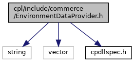
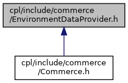

[Data Structures](#nested-classes) \| [Namespaces](#namespaces)

interface of class EnvironmentDataProvider Implementation with default values exists in vficpl User can overwrite each function to get another value. All environment variables can be set by user except schema and API version. [More\...](#details)

`#include <string>`
`#include <vector>`
`#include "`<a href="cpdllspec_8h_source.md">cpdllspec.h</a>`"`

Include dependency graph for EnvironmentDataProvider.h:

This graph shows which files directly or indirectly include this file:

<a href="_environment_data_provider_8h_source.md">Go to the source code of this file.</a>

|  |  |
|----|----|
| Data Structures |  |
| class   | <a href="classvficpl_1_1_environment_data_provider.md">EnvironmentDataProvider</a> |

|            |                                                  |
|------------|--------------------------------------------------|
| Namespaces |                                                  |
|            | <a href="namespacevficpl.md">vficpl</a> |

## DetailedDescription {#detailed-description}

interface of class EnvironmentDataProvider Implementation with default values exists in vficpl User can overwrite each function to get another value. All environment variables can be set by user except schema and API version.
