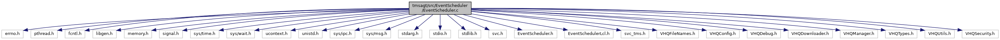

[Data Structures](#nested-classes) \| [Macros](#define-members) \| [Typedefs](#typedef-members) \| [Enumerations](#enum-members) \| [Functions](#func-members) \| [Variables](#var-members)

`#include <errno.h>`
`#include <pthread.h>`
`#include <fcntl.h>`
`#include <libgen.h>`
`#include <memory.h>`
`#include <signal.h>`
`#include <sys/time.h>`
`#include <sys/wait.h>`
`#include <ucontext.h>`
`#include <unistd.h>`
`#include <sys/ipc.h>`
`#include <sys/msg.h>`
`#include <stdarg.h>`
`#include <stdio.h>`
`#include <stdlib.h>`
`#include <svc.h>`
`#include "EventScheduler.h"`
`#include "EventSchedulerLcl.h"`
`#include "VHQFileNames.h"`
`#include "VHQConfig.h"`
`#include "VHQDebug.h"`
`#include "VHQDownloader.h"`
`#include "VHQManager.h"`
`#include "VHQTypes.h"`
`#include "VHQUtils.h"`
`#include "VHQSecurity.h"`

Include dependency graph for EventScheduler.c:



|                 |                                                 |
|-----------------|-------------------------------------------------|
| Data Structures |                                                 |
| struct          | [\_running_event_t](#struct__running__event__t) |
| struct          | [callback_stack_t](#structcallback__stack__t)   |

|  |  |
|----|----|
| Macros |  |
| #define  | [MAX_CONCURRENT_EVENTS](#a3221a640df87591a436a0460df732805)   1 |
| #define  | [REBOOT_EVENT_AFTER_LAST_DL_IN_OP_SET](#a0981eccd00e4beb9bf10a1590b13b7fc)   1 |
| #define  | [MIDNIGHT](#abc7899affd386ef7900c847dbeeab4a3)   (24 \* 3600) |
| #define  | [SEVENTY_YEAR_OFFSET](#ad9407057ca0915cb462e0d98758aea98)   (2208988800) |
| #define  | [PRINT_EVENT_SET_TABLE](#a42e50623ecd2ee20af7f9286e4bcb05c)(a)   PrintEventSetTable(a) |
| #define  | [COMPARE_EVENT_SET_TABLE_DEBUG](#ac967252b2d9e29dc063628edf75d95e8)   0 |
| #define  | [COMPARE_EVENT_SET_TABLE_DEBUG_PRINT](#a15f7090c0c71a6af42ae3c65a00ac978)(arg\...) |
| #define  | [NO_EVENTS_TABLES](#aee19e14cf1f6312bfa7f2a830780988c)   3 |
| #define  | [EVENTS_TABLE_FILE_LENGTH](#a5d7041cb075a605241316790da5e151a)   64 |
| #define  | [DEFAULT_WAIT](#a49cc942bb646de5cedadd52be0c431d8)   (86400) |

|  |  |
|----|----|
| Typedefs |  |
| typedef struct [\_running_event_t](#struct__running__event__t)  | [running_event_t](#ae183d296904392aef11d467e7a38b037) |

|  |  |
|----|----|
| Enumerations |  |
| enum   | [process_event_sets_state_t](#a3363138f7723e04024b5d5d5e1ab714c) { [PES_STATE_INITIAL](#a3363138f7723e04024b5d5d5e1ab714ca311161859d03acceaa61f305d774057c), [PES_STATE_RUNNING](#a3363138f7723e04024b5d5d5e1ab714ca7db86ccd7727481416bbab7357114086), [PES_STATE_EVENT_COMPLETED](#a3363138f7723e04024b5d5d5e1ab714caffdbbb3cb31ee0e837b06cd1ae24a277), [PES_STATE_COMPLETED](#a3363138f7723e04024b5d5d5e1ab714ca06d29cab2f4173ba4ded51e52268cb63) } |

|  |  |
|----|----|
| Functions |  |
| void  | [SaveEventSetTable](#adb8fb5cd2323a175072341c00457351a) (void) |
|   | Save the event set table for restoration after rebooting. [More\...](#adb8fb5cd2323a175072341c00457351a)<br/> |
| bool  | [RestoreEventSetTable](#ac9194966fa7b39016bdcb3afc619679b) (void) |
|   | Restore the event set table at start. [More\...](#ac9194966fa7b39016bdcb3afc619679b)<br/> |
| void \*  | [EventSchedulerInitCallbackTable](#a7101b4a88f78442eda98f6365281a281) (char \*pszOperatingMode) |
| void  | [sighandler](#af527a44de9de12ab2d86fe582a05d77d) (int signum, siginfo_t \*siginfo, void \*context) |
| bool  | [GetTimerExpired](#abd02a5cf4a023f80830bba89001a2c45) () |
| char \*  | [pesStateToStr](#a7751718dbb8453224e713da617123c91) ([process_event_sets_state_t](#a3363138f7723e04024b5d5d5e1ab714c) state) |
| bool  | [ProcessEventSets](#a5a8c06a47fd796c525bd85b4c1c120be) (void) |
|   | Calls the appropriate callbacks for event sets that have expired. [More\...](#a5a8c06a47fd796c525bd85b4c1c120be)<br/> |
| void \*  | [EventScheduler](#a3d853fa6f31e30c35451a53624dba4bc) (void \*pvData) |
|   | The event sheduler task\'s main loop. [More\...](#a3d853fa6f31e30c35451a53624dba4bc)<br/> |
| bool  | [EventSchedulerInitialized](#aeece40defaff577942adebc7b45ca072) (void) |
| event_set_id_t  | [ScheduleEventSet](#aa57f4ac0d537b9a86d73ec930bd3f6ff) (bool bRecurring, long int dwFirstRun, recur_unit_t recurUnits, uint32 dwRecurPeriod, long int tExpiration, uint32 dwRetryFreq, uint32 opSetId, operation_set_event_t psOpSetData\[\], uint32 dwOpSetDataArraySize, event_set_id_t dependency_event_set_id, event_timer_t timerType, char \*pszServerInstance, pre_post_callback_t preEventCbType, pre_post_callback_t postEventCbType, bool keyExchangeEventSet) |
| bool  | [CancelEventSet](#a636ae0e877282dcaf7cbd4c07a0245aa) (event_set_id_t event_set_id, bool cancel_dependent_events) |
|   | Cancels a pending event set. [More\...](#a636ae0e877282dcaf7cbd4c07a0245aa)<br/> |
| vhq_result_t  | [CancelEventSetByOpId](#aebd0382eb19a81b27e1c9ef11fc120c9) (uint32 opSetId) |
|   | Cancels a pending event set by Operation Set ID. [More\...](#aebd0382eb19a81b27e1c9ef11fc120c9)<br/> |
| uint32  | [GetInitialTimerVal](#a804732cf9ec603753125a9b245a9403a) (void) |
| void  | [LockEventScheduler](#adfedf406d19d3898937515904e7d51b7) (bool lock) |
| bool  | [FileRequiredByEvent](#a46943f46089fd5eb8a237716175913a7) (char \*fn) |
| bool  | [DownloadOpSetInProgress](#a631a4c3b4f0ebc1276e4c1d47edbe4e1) (void) |
| char \*  | [GetOperationIdForEvent](#afe2c1c65af7f47fd1d2cf5a7530b6e24) (int event_set_index, int event_index) |
| void  | [SetCompleteFlag](#ad0cd9982744732224a6013e8fd151798) (uint32 opSetId, char \*OpId, bool continuation_required, bool event_failed) |
| char \*  | [GetApprovalMaskStr](#ae6f45f5cc5d402c19c4b2df33bee1e81) (uint32 approval_mask) |
| void  | [SetApprovalFlag](#ac77a2f156fc9f0918d2cda0c03c1fa54) (event_set_id_t event_set_id, event_id_t event_id, uint32 approval_mask) |
| bool  | [GetApprovalFlag](#a778d644cbc58b0ce5c6b0e8bd9c5d2c1) (uint32 opSetId, char \*OpId, uint32 mask, bool \*isLastOp) |
| bool  | [GetExecutingIndex](#ab392c94911089845c07106149f73ec14) (uint32 opSetId, int \*executing_index) |
| void  | [SetEventSchedulerTimerExpired](#a28073f69e1f658a77b057767fdf7b835) (bool timer_exp_val) |
| void  | [StartEventTimer](#a2c86faa3034cd8aab63a89938a343b67) (struct itimerval new_tv) |
| bool  | [EventSchedulerLock](#acb96fb6bd0a10104911786099b314728) (int timeout) |
| bool  | [EventSchedulerUnlock](#a8b01e29bab2ffcf325b32a95099f8b17) (void) |
| uint32  | [GetSecondsToNextEvent](#a2603fd407a7ba480eb8866dff44ca031) (bool include_running_event) |
| void  | [EventSchedulerPetWatchdog](#a8581bcdb463e7813aa8d368849615e60) (event_set_id_t event_set_id, event_id_t event_id) |
| time_t  | [GetEventExpiryTime](#a953cb45f15b2265f216ed87cb8458755) (event_set_id_t event_set_id, event_timer_t timer_type) |
| bool  | [ClearInstanceEventSetsTable](#ad4b45621db77089dbe5d01ffa6a4899d) (char \*serverInstance, bool isForKeysExchangeReset) |
| void  | [ClearEventsTable](#a11aeaec936d5c12e593b97f47d6e4681) (void) |

|  |  |
|----|----|
| Variables |  |
| const struct timespec  | [MONITOR_THREAD_CHECK_PERIOD](#aacb56063e96dd2e3d1a27deaa2e1af42) |
| int  | [request_Qid](#a3b2dcf74e5db5d8dded9b16f4877ea02) |
| int  | [response_Qid](#a06d9180560d76eb8df03478b85303c47) |
| EventSchedulerCB  | [acbCallbackTable](#a0417615202a7745f4128557a901ac04b) \[\] |
| [callback_stack_t](#structcallback__stack__t)  | [callback_stack](#a0b9b4750a3fb18238a741fb731af3552) \[cbMAXTypes\] |

## DetailedDescription {#detailed-description}

Main <a href="libevt_8h.md#struct_event">Event</a> Scheduler operations

------------------------------------------------------------------------

## DataStructure Documentation {#data-structure-documentation}

## \_running_event_t <a href="#struct__running__event__t" id="struct__running__event__t"></a>

<p>struct \_running_event_t</p>

| Data Fields         |                  |     |
|---------------------|------------------|-----|
| event_thread_arg \* | arg_p            |     |
| callback_t          | eCallback        |     |
| event_id_t          | event_id         |     |
| event_set_id_t      | event_set_id     |     |
| time_t              | expire_time      |     |
| bool                | in_use           |     |
| bool                | release_instance |     |
| time_t              | start_time       |     |
| event_result_t      | static_result    |     |
| event_result_t      | status           |     |
| pthread_t           | thread_id        |     |
| pthread_mutex_t     | wd_mutex         |     |

## callback_stack_t <a href="#structcallback__stack__t" id="structcallback__stack__t"></a>

<p>struct callback_stack_t</p>

| Data Fields             |          |     |
|-------------------------|----------|-----|
| pre_post_event_result_t | cbResult |     |
| pre_post_callback_t     | cbType   |     |

## MacroDefinition Documentation {#macro-definition-documentation}

## COMPARE_EVENT_SET_TABLE_DEBUG <a href="#ac967252b2d9e29dc063628edf75d95e8" id="ac967252b2d9e29dc063628edf75d95e8"></a>

<p>#define COMPARE_EVENT_SET_TABLE_DEBUG   0</p>

## COMPARE_EVENT_SET_TABLE_DEBUG_PRINT <a href="#a15f7090c0c71a6af42ae3c65a00ac978" id="a15f7090c0c71a6af42ae3c65a00ac978"></a>

<p>#define COMPARE_EVENT_SET_TABLE_DEBUG_PRINT</p>

## DEFAULT_WAIT <a href="#a49cc942bb646de5cedadd52be0c431d8" id="a49cc942bb646de5cedadd52be0c431d8"></a>

<p>#define DEFAULT_WAIT   (86400)</p>

## EVENTS_TABLE_FILE_LENGTH <a href="#a5d7041cb075a605241316790da5e151a" id="a5d7041cb075a605241316790da5e151a"></a>

<p>#define EVENTS_TABLE_FILE_LENGTH   64</p>

## MAX_CONCURRENT_EVENTS <a href="#a3221a640df87591a436a0460df732805" id="a3221a640df87591a436a0460df732805"></a>

<p>#define MAX_CONCURRENT_EVENTS   1</p>

## MIDNIGHT <a href="#abc7899affd386ef7900c847dbeeab4a3" id="abc7899affd386ef7900c847dbeeab4a3"></a>

<p>#define MIDNIGHT   (24 \* 3600)</p>

Local definitions

## NO_EVENTS_TABLES <a href="#aee19e14cf1f6312bfa7f2a830780988c" id="aee19e14cf1f6312bfa7f2a830780988c"></a>

<p>#define NO_EVENTS_TABLES   3</p>

## PRINT_EVENT_SET_TABLE <a href="#a42e50623ecd2ee20af7f9286e4bcb05c" id="a42e50623ecd2ee20af7f9286e4bcb05c"></a>

<p>#define PRINT_EVENT_SET_TABLE</p>

Local functions

## REBOOT_EVENT_AFTER_LAST_DL_IN_OP_SET <a href="#a0981eccd00e4beb9bf10a1590b13b7fc" id="a0981eccd00e4beb9bf10a1590b13b7fc"></a>

<p>#define REBOOT_EVENT_AFTER_LAST_DL_IN_OP_SET   1</p>

## SEVENTY_YEAR_OFFSET <a href="#ad9407057ca0915cb462e0d98758aea98" id="ad9407057ca0915cb462e0d98758aea98"></a>

<p>#define SEVENTY_YEAR_OFFSET   (2208988800)</p>

## TypedefDocumentation {#typedef-documentation}

## running_event_t <a href="#ae183d296904392aef11d467e7a38b037" id="ae183d296904392aef11d467e7a38b037"></a>

<p>typedef struct [\_running_event_t](#struct__running__event__t) [running_event_t](#ae183d296904392aef11d467e7a38b037)</p>

## EnumerationType Documentation {#enumeration-type-documentation}

## process_event_sets_state_t <a href="#a3363138f7723e04024b5d5d5e1ab714c" id="a3363138f7723e04024b5d5d5e1ab714c"></a>

<p>enum [process_event_sets_state_t](#a3363138f7723e04024b5d5d5e1ab714c)</p>

| Enumerator                 |     |
|----------------------------|-----|
| PES_STATE_INITIAL          |     |
| PES_STATE_RUNNING          |     |
| PES_STATE_EVENT_COMPLETED  |     |
| PES_STATE_COMPLETED        |     |

## FunctionDocumentation {#function-documentation}

## CancelEventSet() <a href="#a636ae0e877282dcaf7cbd4c07a0245aa" id="a636ae0e877282dcaf7cbd4c07a0245aa"></a>

<p>bool CancelEventSet</p>

Cancels a pending event set.

**Parameters**

**event_set_id** - the ID of the event set to cancel **cancel_dependent_events** - whether to cancel events that depend on this event set

### Returns

TRUE if successful, FALSE otherwise

## CancelEventSetByOpId() <a href="#aebd0382eb19a81b27e1c9ef11fc120c9" id="aebd0382eb19a81b27e1c9ef11fc120c9"></a>

<p>vhq_result_t CancelEventSetByOpId</p>

Cancels a pending event set by Operation Set ID.

**Parameters**

**opSetId** - the Operation Set ID of the event to cancel

### Returns

vhq_result_t from VHQTypes.h

## ClearEventsTable() <a href="#a11aeaec936d5c12e593b97f47d6e4681" id="a11aeaec936d5c12e593b97f47d6e4681"></a>

<p>void ClearEventsTable</p>

This function calls [ClearInstanceEventSetsTable()](#ad4b45621db77089dbe5d01ffa6a4899d) and sets Device Registration.

## ClearInstanceEventSetsTable() <a href="#ad4b45621db77089dbe5d01ffa6a4899d" id="ad4b45621db77089dbe5d01ffa6a4899d"></a>

<p>bool ClearInstanceEventSetsTable</p>

This function removes an event set with a given server instance and update the event table.

**Parameters**

\[in\] **serverInstance** = server instance \[in\] **isForKeysExchangeReset** = TRUE, if it is for a key exchange reset.

### Returns

TRUE, if event set cleared.

## DownloadOpSetInProgress() <a href="#a631a4c3b4f0ebc1276e4c1d47edbe4e1" id="a631a4c3b4f0ebc1276e4c1d47edbe4e1"></a>

<p>bool DownloadOpSetInProgress</p>

This function searches for a download operation set in running events.

### Returns

TRUE, if download event is present.

## EventScheduler() <a href="#a3d853fa6f31e30c35451a53624dba4bc" id="a3d853fa6f31e30c35451a53624dba4bc"></a>

<p>void \* EventScheduler</p>

The event sheduler task\'s main loop.

**Parameters**

**pvData** - void\* pointer used in pthread_create functions

### Returns

should never return

## EventSchedulerInitCallbackTable() <a href="#a7101b4a88f78442eda98f6365281a281" id="a7101b4a88f78442eda98f6365281a281"></a>

<p>void\* EventSchedulerInitCallbackTable</p>

This function initializes the event scheduler callback table to launch an event.

**Parameters**

\[in\] **pszOperatingMode** = operating mode

### Returns

pointer to callback table.

## EventSchedulerInitialized() <a href="#aeece40defaff577942adebc7b45ca072" id="aeece40defaff577942adebc7b45ca072"></a>

<p>bool EventSchedulerInitialized</p>

This function checks whether event scheduler is initialized or not and returns the status; TRUE, if initialized.

### Returns

TRUE, if event scheduler is initialized.

## EventSchedulerLock() <a href="#acb96fb6bd0a10104911786099b314728" id="acb96fb6bd0a10104911786099b314728"></a>

<p>bool EventSchedulerLock</p>

This function tries to lock the event scheduler mutex, event_sched_lock_mutex.

**Parameters**

\[in\] **timeout** = timeout to lock the event scheduler mutex.

### Returns

TRUE, if locked.

## EventSchedulerPetWatchdog() <a href="#a8581bcdb463e7813aa8d368849615e60" id="a8581bcdb463e7813aa8d368849615e60"></a>

<p>void EventSchedulerPetWatchdog</p>

This function sets the watchdog timer for an event.

**Parameters**

\[in\] **event_set_id** = event set ID \[in\] **event_id** = event ID of the event

### Returns

void

## EventSchedulerUnlock() <a href="#a8b01e29bab2ffcf325b32a95099f8b17" id="a8b01e29bab2ffcf325b32a95099f8b17"></a>

<p>bool EventSchedulerUnlock</p>

## FileRequiredByEvent() <a href="#a46943f46089fd5eb8a237716175913a7" id="a46943f46089fd5eb8a237716175913a7"></a>

<p>bool FileRequiredByEvent</p>

This function checks if a file is required by any of the download events in event set table.

**Parameters**

\[in\] **fn** = filename

### Returns

TRUE, if required.

## GetApprovalFlag() <a href="#a778d644cbc58b0ce5c6b0e8bd9c5d2c1" id="a778d644cbc58b0ce5c6b0e8bd9c5d2c1"></a>

<p>bool GetApprovalFlag</p>

This function checks for the pre approval mask for events.

**Parameters**

\[in\] **opSetId** = operation set ID \[in\] **OpId** = operation ID \[in\] **mask** = mask to be checked. \[out\] **isLastOp** = flag to be set true in case of Last Op in the Set

### Returns

TRUE, if mask matches.

## GetApprovalMaskStr() <a href="#ae6f45f5cc5d402c19c4b2df33bee1e81" id="ae6f45f5cc5d402c19c4b2df33bee1e81"></a>

<p>char\* GetApprovalMaskStr</p>

## GetEventExpiryTime() <a href="#a953cb45f15b2265f216ed87cb8458755" id="a953cb45f15b2265f216ed87cb8458755"></a>

<p>time_t GetEventExpiryTime</p>

This function gets event expire time

**Parameters**

\[in\] **event_set_id** = event set ID \[in\] **event_id** = event ID of the event \[in\] **time_type** = RTC or DATE/TIME

### Returns

<a href="libevt_8h.md#struct_event">Event</a> expiry date in RTC or DATE/TIME

## GetExecutingIndex() <a href="#ab392c94911089845c07106149f73ec14" id="ab392c94911089845c07106149f73ec14"></a>

<p>bool GetExecutingIndex</p>

This function to get executing index in a set.

**Parameters**

\[in\] **opSetId** = operation set ID \[out\] **executing_index** = Index of current executing event

### Returns

TRUE, if OpSetId matches.

## GetInitialTimerVal() <a href="#a804732cf9ec603753125a9b245a9403a" id="a804732cf9ec603753125a9b245a9403a"></a>

<p>uint32 GetInitialTimerVal</p>

## GetOperationIdForEvent() <a href="#afe2c1c65af7f47fd1d2cf5a7530b6e24" id="afe2c1c65af7f47fd1d2cf5a7530b6e24"></a>

<p>char\* GetOperationIdForEvent</p>

This function returns the opeartion ID of an event in an event set.

**Parameters**

\[in\] **event_set_index** = event set index in event table. \[in\] **event_index** = event index in event set.

### Returns

operation ID.

## GetSecondsToNextEvent() <a href="#a2603fd407a7ba480eb8866dff44ca031" id="a2603fd407a7ba480eb8866dff44ca031"></a>

<p>uint32 GetSecondsToNextEvent</p>

This function returns the number of seconds to execute the next event.If next event is a recurring event, the recurring frequency is returned.

**Parameters**

\[in\] **ignore_executing_event** =TRUE, to ignore executing event when calculating the time to next event.

### Returns

uint32 seconds to next event.

## GetTimerExpired() <a href="#abd02a5cf4a023f80830bba89001a2c45" id="abd02a5cf4a023f80830bba89001a2c45"></a>

<p>bool GetTimerExpired</p>

## LockEventScheduler() <a href="#adfedf406d19d3898937515904e7d51b7" id="adfedf406d19d3898937515904e7d51b7"></a>

<p>void LockEventScheduler</p>

## pesStateToStr() <a href="#a7751718dbb8453224e713da617123c91" id="a7751718dbb8453224e713da617123c91"></a>

<p>char\* pesStateToStr</p>

## ProcessEventSets() <a href="#a5a8c06a47fd796c525bd85b4c1c120be" id="a5a8c06a47fd796c525bd85b4c1c120be"></a>

<p>bool ProcessEventSets</p>

Calls the appropriate callbacks for event sets that have expired.

### Returns

TRUE if successful, FALSE oterwise

## RestoreEventSetTable() <a href="#ac9194966fa7b39016bdcb3afc619679b" id="ac9194966fa7b39016bdcb3afc619679b"></a>

<p>void RestoreEventSetTable</p>

Restore the event set table at start.

### Returns

None: on failure, simply run as if no scheduled events are present

## SaveEventSetTable() <a href="#adb8fb5cd2323a175072341c00457351a" id="adb8fb5cd2323a175072341c00457351a"></a>

<p>static void SaveEventSetTable</p>

Save the event set table for restoration after rebooting.

### Returns

None

## ScheduleEventSet() <a href="#aa57f4ac0d537b9a86d73ec930bd3f6ff" id="aa57f4ac0d537b9a86d73ec930bd3f6ff"></a>

<p>event_set_id_t ScheduleEventSet</p>

This function is used by outside processes to schedule operation sets for now or the future

**Parameters**

\[in\] **bRecurring** - boolean indicating if this event is recurring \[in\] **dwFirstRun** - seconds until the callback should be run the first time (0 = now) \[in\] **recurUnits** - recurring unit of event \[in\] **dwRecurPeriod** - period of recurrence \[in\] **tExpiration** - expiration of the event \[in\] **dwRetryFreq** - How often to retry the first attempt in case of a failure (in seconds, 0 = no retry) \[in\] **opSetId** - operation ID. \[in\] **psOpSetData** - an array of operations that will be performed in this operation set \[in\] **dwOpSetDataArraySize** - number of operations in the operation set array \[in\] **dependency_event_set_id** - if this depends on another event (like install later) then this event will be cancelled if the dependency event fails \[in\] **timerType** - RTC or date/time - RTC events will not be affected if the system clock changes \[in\] **pszServerInstance** - the server instance that this event set is scheduled for \[in\] **preEventCbType** - used for pre-event callbacks that are common across all events in the event set like CommNetConnect, etc. \[in\] **postEventCbType** - used for post-event callbacks that are common across all events in the event set like CommNetDisconnect, etc. \[in\] **keyExchangeEventSet** - used to determine when \"Device Registration Mode\" is completed

### Returns

event_set_id_t, The new event_id for the operation set that was just added

## SetApprovalFlag() <a href="#ac77a2f156fc9f0918d2cda0c03c1fa54" id="ac77a2f156fc9f0918d2cda0c03c1fa54"></a>

<p>void SetApprovalFlag</p>

This function set a pre-approval mask to a download event and saves the event table.

**Parameters**

\[in\] **event_set_id** = event set ID of event \[in\] **event_id** = event ID of event \[in\] **approval_mask** = approval mask to set

### Returns

void

## SetCompleteFlag() <a href="#ad0cd9982744732224a6013e8fd151798" id="ad0cd9982744732224a6013e8fd151798"></a>

<p>void SetCompleteFlag</p>

This function saves the executing flag with continue/complete, when there is a chance of losing executing flag because of a reboot after a download or install operation

**Parameters**

\[in\] **opSetId** = operation set ID of event \[in\] **OpId** = operation ID \[in\] **continuation_required** = TRUE, if continuation required for operation.

### Returns

void

## SetEventSchedulerTimerExpired() <a href="#a28073f69e1f658a77b057767fdf7b835" id="a28073f69e1f658a77b057767fdf7b835"></a>

<p>void SetEventSchedulerTimerExpired</p>

## sighandler() <a href="#af527a44de9de12ab2d86fe582a05d77d" id="af527a44de9de12ab2d86fe582a05d77d"></a>

<p>void sighandler</p>

This function handles a particular signal.

**Parameters**

\[in\] **signum** = The number of the signal that caused invocation of the handler. \[in\] **siginfo** = which is a structure containing further information about the signal \[in\] **context** = contains signal context information that was saved on the user-space stack by the kernel.

### Returns

none

## StartEventTimer() <a href="#a2c86faa3034cd8aab63a89938a343b67" id="a2c86faa3034cd8aab63a89938a343b67"></a>

<p>void StartEventTimer</p>

This function starts a timer to wakeup.In low power mode, we should make sure we use the <a href="namespacevfisyspm.md#ab6864fd6fce20f5e804d9a9a6fe01239">sys_SetWakeupTime()</a> API so that we get woken up from deep sleep state.

**Parameters**

\[in\] **new_tv** = value to set the timer with.

### Returns

void

## VariableDocumentation {#variable-documentation}

## acbCallbackTable <a href="#a0417615202a7745f4128557a901ac04b" id="a0417615202a7745f4128557a901ac04b"></a>

<p>EventSchedulerCB acbCallbackTable\[\]</p>

**Initial value:**

``` cpp
= { LaunchDownloader, GetDataProcessor,
   SetDataProcessor, TermActProcessor, FileUploader, Heartbeat,
   GetDiagDataProcessor, AppActionProcessor, DelFileProcessor,
   DeviceEventProcessor, GetParamUpdateProcessor, GetSwUpdateProcessor, }
```

## callback_stack <a href="#a0b9b4750a3fb18238a741fb731af3552" id="a0b9b4750a3fb18238a741fb731af3552"></a>

<p>[callback_stack_t](#structcallback__stack__t) callback_stack\[cbMAXTypes\]</p>

## MONITOR_THREAD_CHECK_PERIOD <a href="#aacb56063e96dd2e3d1a27deaa2e1af42" id="aacb56063e96dd2e3d1a27deaa2e1af42"></a>

<p>const struct timespec MONITOR_THREAD_CHECK_PERIOD</p>

**Initial value:**

``` cpp
= { .tv_sec = 0, .tv_nsec =
   50000000 }
```

## request_Qid <a href="#a3b2dcf74e5db5d8dded9b16f4877ea02" id="a3b2dcf74e5db5d8dded9b16f4877ea02"></a>

<p>int request_Qid</p>

## response_Qid <a href="#a06d9180560d76eb8df03478b85303c47" id="a06d9180560d76eb8df03478b85303c47"></a>

<p>int response_Qid</p>
