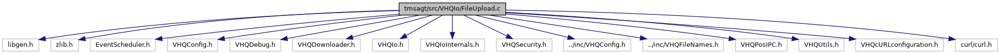

[Macros](#define-members) \| [Functions](#func-members)

`#include <libgen.h>`
`#include <zlib.h>`
`#include "EventScheduler.h"`
`#include "VHQConfig.h"`
`#include "VHQDebug.h"`
`#include "VHQDownloader.h"`
`#include "VHQIo.h"`
`#include "VHQIoInternals.h"`
`#include "VHQSecurity.h"`
`#include "../inc/VHQConfig.h"`
`#include "../inc/VHQFileNames.h"`
`#include "VHQPosIPC.h"`
`#include "VHQUtils.h"`
`#include "VHQcURLconfiguration.h"`
`#include <curl/curl.h>`

Include dependency graph for FileUpload.c:

|          |                                                     |
|----------|-----------------------------------------------------|
| Macros   |                                                     |
| #define  | [CHUNK](#a25022864dfc8ec428e7128282e57b136)   16384 |

|  |  |
|----|----|
| Functions |  |
| void  | [cleanupHandler](#a52c4a85b2a16ab733db4178eade67bbd) (void \*arg) |
| vhq_result_t  | [UploadFile](#aa5606dfa84fa414e17f2f5c95dfe1e6a) (upload_method_t eMethod, char \*pszFileName, char \*pszUser, char \*pszPw, char \*pszUrl, bool compressionEnabled, char \*ulFileName, event_set_id_t event_set_id, event_id_t event_id) |
| vhq_result_t  | [UploadFileWebMethod](#a0a2e99b4c44bcc1dea07eaa6c9b50832) (const char \*pszFileName, const char \*pszUrl, const char \*pszWebMethod, char \*\*pszUploadMethodXML, const char \*ulFileName, int \*comm_id, int \*srv_msg_id, char \*operation_id, bool close_comm_id, event_set_id_t event_set_id, event_id_t event_id) |

## DetailedDescription {#detailed-description}

Upload file given to URL

## MacroDefinition Documentation {#macro-definition-documentation}

## CHUNK 

#define CHUNK   16384

## FunctionDocumentation {#function-documentation}

## cleanupHandler() 

void cleanupHandler

## UploadFile() 

vhq_result_t UploadFile

This function is wrapper function for UploadFileDirect()

**Parameters**

\[in\] **eMethod** = upload method \[in\] **pszFileName** = local filename \[in\] **pszUser** = name of user \[in\] **pszPw** = PW \[in\] **pszUrl** = server URL \[in\] **compressionEnabled** = TRUE, if compression enabled. \[in\] **ulFileName** = upload filename \[in\] **event_set_id** = event set id \[in\] **event_id** = event id

### Returns

vhq_result_t, VHQ_SUCCESS on success.

## UploadFileWebMethod() 

vhq_result_t UploadFileWebMethod

This function is for uploading file process for HTTP Post transfer to the VHQ server

**Parameters**

\[in\] **pszFileName** = local file name to be uploaded to server \[in\] **pszUrl** = server address \[in\] **pszWebMethod** = transfer method, should be web service \[in\] **pszUploadMethodXML** = header information for transmission \[in\] **ulFileName** = the expected file name by the server \[in\] **comm_id** = communication ID \[in\] **msg_id** = message ID \[in\] **srv_msg_id** = server message ID \[in\] **operation_id** = operation ID \[in\] **close_comm_id** = TRUE, if close comm_id \[in\] **event_set_id** = event set id of event \[in\] **event_id** = event ID of event

### Returns

vhq_result_t, VHQ_SUCCESS on success.
