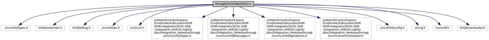

[Macros](#define-members) \| [Functions](#func-members) \| [Variables](#var-members)

`#include "../inc/VHQTypes.h"`
`#include "VHQIoInternals.h"`
`#include "VHQDebug.h"`
`#include "../inc/VHQIo.h"`
`#include "../inc/VHQConfig.h"`
`#include <string.h>`
`#include "ComIntf.h"`
`#include "VHQDownloader.h"`

Include dependency graph for IOinit.c:

|          |                                                              |
|----------|--------------------------------------------------------------|
| Macros   |                                                              |
| #define  | [\_MAIN_LOOP_EXTERNS\_](#a0c0b5276fb82904fa5f9885c7f8e58ba)  |
| #define  | [stricmp](#a4e0be90a3757e352f42612d09a7d1aa5)   strcasecmp   |
| #define  | [strnicmp](#a16a19b1831112e876b010468ec15916f)   strncasecmp |

|  |  |
|----|----|
| Functions |  |
| bool  | [SerOpen](#a23b2bd37bcdaf463461bd318c0bd0f52) (char \*pszPort) |
| void  | [SerClose](#a645e58ddb6b583511d180b7299309454) () |
| void \*  | [EventSchedulerInitCallbackTable](#a7101b4a88f78442eda98f6365281a281) (char \*pszOperatingMode) |
| bool  | [VHQioInitialize](#ac38679fae359d1639612f04bc0d751eb) (void) |
| void  | [VHQioDeinitialize](#a3bef93bf6b09257a1517b262d02b0345) () |
| char \*  | [GetServerURL](#aadfc901514c1a797fd3ba88d32f9b18d) (void) |
| void  | [VHQOpenComms](#a51a0f28c1f99e0f208d65c0480200d0e) (void) |
| void  | [VHQCloseComms](#affe7c3f0c12e69f85332e6834792902b) (void) |

|                |                                                           |
|----------------|-----------------------------------------------------------|
| Variables      |                                                           |
| int            | [g_ui32CommError](#a4095508fc0881b9e1b167a95eb8a6576) = 0 |
| IO_Properties  | [g_sIoProperties](#ae59f61de0086c11d79a1783b9c1d9043)     |

## DetailedDescription {#detailed-description}

Implements the wrappers for web services exported by VHQ server

## MacroDefinition Documentation {#macro-definition-documentation}

## \_MAIN_LOOP_EXTERNS\_ 

#define \_MAIN_LOOP_EXTERNS\_

## stricmp 

#define stricmp   strcasecmp

## strnicmp 

#define strnicmp   strncasecmp

## FunctionDocumentation {#function-documentation}

## EventSchedulerInitCallbackTable() 

void\* EventSchedulerInitCallbackTable

This function initializes the event scheduler callback table to launch an event.

**Parameters**

\[in\] **pszOperatingMode** = operating mode

### Returns

pointer to callback table.

## GetServerURL() 

char\* GetServerURL

This function gets the active server

### Returns

void

## SerClose() 

void SerClose

## SerOpen() 

bool SerOpen

## VHQCloseComms() 

void VHQCloseComms

## VHQioDeinitialize() 

void VHQioDeinitialize

This function de-initializes the IO properties with data from config file.

### Returns

void

## VHQioInitialize() 

bool VHQioInitialize

This function initializes the IO properties with data from config file.

### Returns

void

## VHQOpenComms() 

void VHQOpenComms

## VariableDocumentation {#variable-documentation}

## g_sIoProperties 

IO_Properties g_sIoProperties

## g_ui32CommError 

int g_ui32CommError = 0

