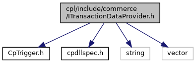

[Data Structures](#nested-classes) \| [Namespaces](#namespaces) \| [Enumerations](#enum-members)

`#include "`<a href="_cp_trigger_8h_source.md">CpTrigger.h</a>`"`
`#include "`<a href="cpdllspec_8h_source.md">cpdllspec.h</a>`"`
`#include <string>`
`#include <vector>`

Include dependency graph for ITransactionDataProvider.h:

This graph shows which files directly or indirectly include this file:

<a href="_i_transaction_data_provider_8h_source.md">Go to the source code of this file.</a>

|  |  |
|----|----|
| Data Structures |  |
| interface   | <a href="classvficpl_1_1_i_transaction_data_provider.md">ITransactionDataProvider</a> |

|            |                                                  |
|------------|--------------------------------------------------|
| Namespaces |                                                  |
|            | <a href="namespacevficpl.md">vficpl</a> |

|  |  |
|----|----|
| Enumerations |  |
| enum   | <a href="namespacevficpl.md#a6c410aee3c873fc45fe7bccf53c6b8d5">TransactionOriginator</a> { <a href="namespacevficpl.md#a6c410aee3c873fc45fe7bccf53c6b8d5a57d1b749897c258ca15d4aaa47f0ddda">ORIGINATOR_MIN_VALUE</a> = -1, <a href="namespacevficpl.md#a6c410aee3c873fc45fe7bccf53c6b8d5a36bb1c296647604d38b010a4ddf2c908">ORIGINATOR_UNDEFINED</a> = 0, <a href="namespacevficpl.md#a6c410aee3c873fc45fe7bccf53c6b8d5af005728e8702c6d948f1ad9dbea2c10a">ORIGINATOR_PAYMENT_APPLICATION</a>, <a href="namespacevficpl.md#a6c410aee3c873fc45fe7bccf53c6b8d5a2ea03fb9cd1b9c5bcb98e37dda60eb5c">ORIGINATOR_CP_APPLICATION</a> } |
| enum   | <a href="namespacevficpl.md#aa7a2e64697569804f14626bbb2649a58">TransactionType</a> {   <a href="namespacevficpl.md#aa7a2e64697569804f14626bbb2649a58ac9cf59a5cdefcf034807f0f020df4f2a">TRX_TYPE_MIN_VALUE</a> = -1, <a href="namespacevficpl.md#aa7a2e64697569804f14626bbb2649a58a1ba076296397909c41255f4114341d79">TRX_TYPE_UNDEFINED</a> = 0, <a href="namespacevficpl.md#aa7a2e64697569804f14626bbb2649a58af270ea53198f751c6402d0a8d90cca55">TRX_TYPE_PAYMENT</a>, <a href="namespacevficpl.md#aa7a2e64697569804f14626bbb2649a58aec2452e792b76e52b9927dc91447d24b">TRX_TYPE_DEFERRED_PAYMENT</a>,   <a href="namespacevficpl.md#aa7a2e64697569804f14626bbb2649a58a1e62629897315391e5de35fc048375b1">TRX_TYPE_DEFERRED_PAYMENT_COMPLETION</a>, <a href="namespacevficpl.md#aa7a2e64697569804f14626bbb2649a58a22871ee1fd2d70ab6c6ac05d02ab8a27">TRX_TYPE_REFUND</a>, <a href="namespacevficpl.md#aa7a2e64697569804f14626bbb2649a58add9aeec252d4fd2d5faf318b8044c079">TRX_TYPE_VOID</a>, <a href="namespacevficpl.md#aa7a2e64697569804f14626bbb2649a58a77669dabacaa14496ba6a2201700ee79">TRX_TYPE_PRE_AUTHORISATION</a>,   <a href="namespacevficpl.md#aa7a2e64697569804f14626bbb2649a58a4895cde5668e8f442bd2af653a99d574">TRX_TYPE_PRE_AUTHORISATION_COMPLETION</a>, <a href="namespacevficpl.md#aa7a2e64697569804f14626bbb2649a58aff0710c0e5dd208cccfd86da620a99e3">TRX_TYPE_CASH_ADVANCE</a>, <a href="namespacevficpl.md#aa7a2e64697569804f14626bbb2649a58a6f7ff053755d76095c8522e545d8b1c9">TRX_TYPE_CASHBACK</a>, <a href="namespacevficpl.md#aa7a2e64697569804f14626bbb2649a58afe81d94cb9377bccf3c1412d602018a4">TRX_TYPE_CASH_PAYMENT</a>,   <a href="namespacevficpl.md#aa7a2e64697569804f14626bbb2649a58ae6bbf21e449163eef511de208b8d345a">TRX_TYPE_REVERSAL</a> } |
| enum   | <a href="namespacevficpl.md#a76b9e96d86b331202dcc0fba38b758cd">CardType</a> {   <a href="namespacevficpl.md#a76b9e96d86b331202dcc0fba38b758cdaf7d5e92a30556fba27496de1bf6642b4">CARD_TYPE_MIN_VALUE</a> = -1, <a href="namespacevficpl.md#a76b9e96d86b331202dcc0fba38b758cdabcc6b5795166223d8528bae2aff81530">CARD_TYPE_UNDEFINED</a> = 0, <a href="namespacevficpl.md#a76b9e96d86b331202dcc0fba38b758cda4c54f3a51230fc4a4b559e0f31764854">CARD_TYPE_MAG_STRIPE</a>, <a href="namespacevficpl.md#a76b9e96d86b331202dcc0fba38b758cdab29ecf453018fe08b2e64f11a77b249d">CARD_TYPE_CHIP</a>,   <a href="namespacevficpl.md#a76b9e96d86b331202dcc0fba38b758cda4a99e20b47e3ddd7c9ef05eb282d6dec">CARD_TYPE_CTLS_CARD</a>, <a href="namespacevficpl.md#a76b9e96d86b331202dcc0fba38b758cda336d510be7ce5671579cf4f206f616c2">CARD_TYPE_CTLS_PHONE</a>, <a href="namespacevficpl.md#a76b9e96d86b331202dcc0fba38b758cdab811da325f709369606e17aa1cb76a6e">CARD_TYPE_MANUAL</a> } |
| enum   | <a href="namespacevficpl.md#abf880d7292973573c80d9fd18ea77453">AuthEntity</a> {   <a href="namespacevficpl.md#abf880d7292973573c80d9fd18ea77453ac1d44979f9e4d61f5665842ae60d1d77">AUTH_ENTITY_MIN_VALUE</a> = -1, <a href="namespacevficpl.md#abf880d7292973573c80d9fd18ea77453a2a5e1608827ba47ba87f1e4078e24f91">AUTH_ENTITY_UNDEFINED</a> = 0, <a href="namespacevficpl.md#abf880d7292973573c80d9fd18ea77453a44efc0ba541427fbd13046e3947413a8">AUTH_ENTITY_MERCHANT</a>, <a href="namespacevficpl.md#abf880d7292973573c80d9fd18ea77453a7e302c6b734137707dfe0e21fd7e3a39">AUTH_ENTITY_ACQUIRER</a>,   <a href="namespacevficpl.md#abf880d7292973573c80d9fd18ea77453a7de55871016aee7b476dca6297852ab9">AUTH_ENTITY_CARD_SCHEME</a>, <a href="namespacevficpl.md#abf880d7292973573c80d9fd18ea77453a6e17f5499de4132067c9d89914aae499">AUTH_ENTITY_ISSUER</a> } |
| enum   | <a href="namespacevficpl.md#a87ba9bd5edfd749f4729620dbadd5fce">AuthResult</a> {   <a href="namespacevficpl.md#a87ba9bd5edfd749f4729620dbadd5fcea844d7e8f9402ac043df58f084eda0469">AUTH_RESULT_MIN_VALUE</a> = -1, <a href="namespacevficpl.md#a87ba9bd5edfd749f4729620dbadd5fcea01842cc50c96d8ebcce3899f7a6be8e8">AUTH_RESULT_UNDEFINED</a> = 0, <a href="namespacevficpl.md#a87ba9bd5edfd749f4729620dbadd5fcea4d44bf75d544f749d365460565869af6">AUTH_RESULT_AUTHORIZED_ONLINE</a>, <a href="namespacevficpl.md#a87ba9bd5edfd749f4729620dbadd5fceaed5a15f881bd37b4c9cab122342a2acc">AUTH_RESULT_AUTHORIZED_OFFLINE</a>,   <a href="namespacevficpl.md#a87ba9bd5edfd749f4729620dbadd5fcea6f0a10fdb47368de754a4692d8e251f2">AUTH_RESULT_REJECTED_ONLINE</a>, <a href="namespacevficpl.md#a87ba9bd5edfd749f4729620dbadd5fcea5225877e26989921a6e46138cb7e2153">AUTH_RESULT_CASH_VERIFIED</a>, <a href="namespacevficpl.md#a87ba9bd5edfd749f4729620dbadd5fceaae3961729e7ceaed899d2fed1e343f5e">AUTH_RESULT_ABORTED</a> } |
| enum   | <a href="namespacevficpl.md#abc1dfb7e5d03f66392b0b4e8be15af50">HolderAuth</a> {   <a href="namespacevficpl.md#abc1dfb7e5d03f66392b0b4e8be15af50a13520fee927c826e79b8ad410da80073">HOLDER_AUTH_MIN_VALUE</a> = -1, <a href="namespacevficpl.md#abc1dfb7e5d03f66392b0b4e8be15af50a79279bc7212777399c5ccd893b0bc4e7">HOLDER_AUTH_UNDEFINED</a> = 0, <a href="namespacevficpl.md#abc1dfb7e5d03f66392b0b4e8be15af50a14528ba74d694ba44ea333e6b09fd890">HOLDER_AUTH_PIN</a>, <a href="namespacevficpl.md#abc1dfb7e5d03f66392b0b4e8be15af50a1be4162610288474eb7b780ddc8eacd6">HOLDER_AUTH_SIGNATURE</a>,   <a href="namespacevficpl.md#abc1dfb7e5d03f66392b0b4e8be15af50a73e3c991c566bed502f11806976ad4eb">HOLDER_AUTH_ID</a>, <a href="namespacevficpl.md#abc1dfb7e5d03f66392b0b4e8be15af50a51404dd4ab95fe214db01db10b175424">HOLDER_AUTH_OTHER</a>, <a href="namespacevficpl.md#abc1dfb7e5d03f66392b0b4e8be15af50a7b17b16b4e52aee87d875b5e7ef382d9">HOLDER_AUTH_NONE</a> } |
| enum   | <a href="namespacevficpl.md#affde3f05c6a4a5092ccd40ec3e830d43">TransactionResult</a> { <a href="namespacevficpl.md#affde3f05c6a4a5092ccd40ec3e830d43abbadbf8eba95d9a193040157896529c5">TRX_RESULT_MIN_VALUE</a> = -1, <a href="namespacevficpl.md#affde3f05c6a4a5092ccd40ec3e830d43aa728f7be1f30330de91724598e48c351">TRX_RESULT_UNDEFINED</a> = 0, <a href="namespacevficpl.md#affde3f05c6a4a5092ccd40ec3e830d43a9d468b203514876d033fb5d0897719f4">TRX_RESULT_SUCCESS</a>, <a href="namespacevficpl.md#affde3f05c6a4a5092ccd40ec3e830d43a838dd830728627f70f8214d27d5c20ce">TRX_RESULT_CANCELLED</a> } |
