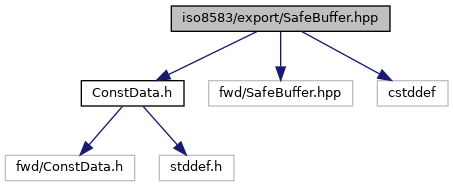
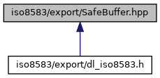

[Data Structures](#nested-classes) \| [Namespaces](#namespaces) \| [Macros](#define-members)

Class to provide a safe wrapper over binary buffer. [More\...](#details)

`#include "`<a href="_const_data_8h_source.md">ConstData.h</a>`"`
`#include "fwd/SafeBuffer.hpp"`
`#include <cstddef>`

Include dependency graph for SafeBuffer.hpp:

This graph shows which files directly or indirectly include this file:

<a href="_safe_buffer_8hpp_source.md">Go to the source code of this file.</a>

|  |  |
|----|----|
| Data Structures |  |
| class   | <a href="classcom__verifone___t_l_v_lite_1_1_safe_buffer.md">SafeBuffer</a> |

|  |  |
|----|----|
| Namespaces |  |
|   | <a href="namespacecom__verifone___t_l_v_lite.md">com_verifone_TLVLite</a> |

|          |                                                    |
|----------|----------------------------------------------------|
| Macros   |                                                    |
| #define  | [ISO_EXP_DECL](#afd0131fdb432c83b6a30719f866ef15a) |

## DetailedDescription {#detailed-description}

Class to provide a safe wrapper over binary buffer.

### Author

Tomasz Saniawa (<a href="#">tomas.nosp@m.z_s1.nosp@m.@veri.nosp@m.fone.nosp@m..com</a>)

### Remarks

This file should be compliant with Verifone EMEA R&D C++ Coding
Standard 1.0.x

## MacroDefinition Documentation {#macro-definition-documentation}

## ISO_EXP_DECL 

#define ISO_EXP_DECL

