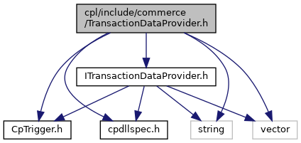
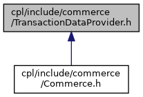

[Data Structures](#nested-classes) \| [Namespaces](#namespaces) \| [Enumerations](#enum-members)

`#include "`<a href="_i_transaction_data_provider_8h_source.md">ITransactionDataProvider.h</a>`"`
`#include "`<a href="_cp_trigger_8h_source.md">CpTrigger.h</a>`"`
`#include "`<a href="cpdllspec_8h_source.md">cpdllspec.h</a>`"`
`#include <string>`
`#include <vector>`

Include dependency graph for TransactionDataProvider.h:

This graph shows which files directly or indirectly include this file:

<a href="_transaction_data_provider_8h_source.md">Go to the source code of this file.</a>

|  |  |
|----|----|
| Data Structures |  |
| struct   | <a href="namespacevficpl.md#structvficpl_1_1_technology_data">TechnologyData</a> |
| interface   | <a href="classvficpl_1_1_transaction_data_provider.md">TransactionDataProvider</a> |

|            |                                                  |
|------------|--------------------------------------------------|
| Namespaces |                                                  |
|            | <a href="namespacevficpl.md">vficpl</a> |

|  |  |
|----|----|
| Enumerations |  |
| enum   | <a href="namespacevficpl.md#a1c203ac3c282fe7696ce695935e2b5dc">TechnologyType</a> {   <a href="namespacevficpl.md#a1c203ac3c282fe7696ce695935e2b5dcac5a65639585b536f37777f79406af14d">TECH_TYPE_MIN_VALUE</a> = -1, <a href="namespacevficpl.md#a1c203ac3c282fe7696ce695935e2b5dca4ccc6b41ad2600ced68dfeb148b23cf2">TECH_TYPE_UNDEFINED</a> = 0, <a href="namespacevficpl.md#a1c203ac3c282fe7696ce695935e2b5dca5dd330b60714e956ae967b6a1e021f0e">TECH_TYPE_MIFARE_CLASSIC</a>, <a href="namespacevficpl.md#a1c203ac3c282fe7696ce695935e2b5dca6d218ee88f58c18c28310d00b57993f9">TECH_TYPE_MIFARE_ULTRALIGHT</a>,   <a href="namespacevficpl.md#a1c203ac3c282fe7696ce695935e2b5dca239f60140c3e28771a22f59c83fed4e8">TECH_TYPE_ISO7816</a> } |

------------------------------------------------------------------------

## DataStructure Documentation {#data-structure-documentation}

## vficpl::TechnologyData 

struct vficpl::TechnologyData

| Data Fields |  |  |
|----|----|----|
| string | aid | 
Iso7816 AID that was selected on the card
 |
| string | appdata | 
Mifare application data
 |
| string | ats | 
Iso7816 Response from the card answer to select (ATS) the command
 |
| string | handle | 
A unqiue identifier for this device during this session
 |
| string | histbytes | 
Mifare historical bytes
 |
| <a href="namespacevficpl.md#a1c203ac3c282fe7696ce695935e2b5dc">TechnologyType</a> | type | 
The type of interface used to communicate with this technology
 |
