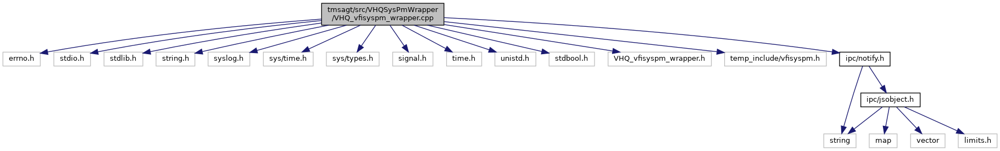

[Macros](#define-members) \| [Functions](#func-members) \| [Variables](#var-members)

`#include <errno.h>`
`#include <stdio.h>`
`#include <stdlib.h>`
`#include <string.h>`
`#include <syslog.h>`
`#include <sys/time.h>`
`#include <sys/types.h>`
`#include <signal.h>`
`#include <time.h>`
`#include <unistd.h>`
`#include <stdbool.h>`
`#include "VHQ_vfisyspm_wrapper.h"`
`#include "temp_include/vfisyspm.h"`
`#include "`<a href="notify_8h_source.md">ipc/notify.h</a>`"`

Include dependency graph for VHQ_vfisyspm_wrapper.cpp:



|  |  |
|----|----|
| Macros |  |
| #define  | [VHQ_VFISYSPM_WRAPPER_LIB_NAME](#a7dbe7d5d20b07914112c5b23436e37c7)   \"vhq_syspm_wrapper\" |

|  |  |
|----|----|
| Functions |  |
| char \*  | [vfisyspmTypeToStr](#ab24ec12a4db4e75400e675967c8ef575) (<a href="namespacevfisyspm.md#a12f0755f1d6c6a1c2116fd1d626a36b2">vfisyspmNotificationType</a> type) |
| char \*  | [vfisyspmNotificationToStr](#af0bb1c70d2b505c050a14b769c44df1c) (<a href="namespacevfisyspm.md#a40ea12a9b19b561cd7403fc1362c49d0">vfisyspmNotifications</a> notification) |
| void  | [VHQ_vfisyspmCallback](#a28158010f7a3a39fb62d08b855840ba8) (<a href="namespacevfisyspm.md#a12f0755f1d6c6a1c2116fd1d626a36b2">vfisyspmNotificationType</a> type, <a href="namespacevfisyspm.md#a40ea12a9b19b561cd7403fc1362c49d0">vfisyspmNotifications</a> notification) |
|   | [\_\_attribute\_\_](#a9e4fa62755aeaea9c141cacda826fbcd) ((visibility(\"default\"))) void VHQ_vfisyspm_wrapper_lib_RegTimerCb(TimerCb CbFunc) |
|   | [if](#a70aa738d3c50b0bbed156ee52c84679d) (vfisyspm_inited==0) |
|   | [if](#a12d403643236776c26b6081a4e570a27) (new_tv.it_value.tv_sec \> 0) |
|   | [return](#abe95a00f8e60264f7043a99eed75eba0) (int) res |

|               |                                                 |
|---------------|-------------------------------------------------|
| Variables     |                                                 |
| struct tm \*  | [wakeup_tm](#a64b9004a35300a6fe606cba361c82abe) |

## DetailedDescription {#detailed-description}

Wrapper functions for libvfisyspm. This is required due to versioning/compatibility issues in libvfisyspm.

## MacroDefinition Documentation {#macro-definition-documentation}

## VHQ_VFISYSPM_WRAPPER_LIB_NAME <a href="#a7dbe7d5d20b07914112c5b23436e37c7" id="a7dbe7d5d20b07914112c5b23436e37c7"></a>

<p>#define VHQ_VFISYSPM_WRAPPER_LIB_NAME   \"vhq_syspm_wrapper\"</p>

## FunctionDocumentation {#function-documentation}

## \_\_attribute\_\_() <a href="#a9e4fa62755aeaea9c141cacda826fbcd" id="a9e4fa62755aeaea9c141cacda826fbcd"></a>

<p>\_\_attribute\_\_</p>

new

SDI plugin entry function

### Returns

<a href="class_s_d_i_plugin.md">SDIPlugin</a> object

## if()\[1/2\] <a href="#a12d403643236776c26b6081a4e570a27" id="a12d403643236776c26b6081a4e570a27"></a> {#if-12}

<p>if</p>

## if()\[2/2\] <a href="#a70aa738d3c50b0bbed156ee52c84679d" id="a70aa738d3c50b0bbed156ee52c84679d"></a> {#if-22}

<p>if</p>

## return() <a href="#abe95a00f8e60264f7043a99eed75eba0" id="abe95a00f8e60264f7043a99eed75eba0"></a>

<p>return</p>

## vfisyspmNotificationToStr() <a href="#af0bb1c70d2b505c050a14b769c44df1c" id="af0bb1c70d2b505c050a14b769c44df1c"></a>

<p>char\* vfisyspmNotificationToStr</p>

## vfisyspmTypeToStr() <a href="#ab24ec12a4db4e75400e675967c8ef575" id="ab24ec12a4db4e75400e675967c8ef575"></a>

<p>char\* vfisyspmTypeToStr</p>

## VHQ_vfisyspmCallback() <a href="#a28158010f7a3a39fb62d08b855840ba8" id="a28158010f7a3a39fb62d08b855840ba8"></a>

<p>void VHQ_vfisyspmCallback</p>

## VariableDocumentation {#variable-documentation}

## wakeup_tm <a href="#a64b9004a35300a6fe606cba361c82abe" id="a64b9004a35300a6fe606cba361c82abe"></a>

<p>struct tm\* wakeup_tm</p>

**Initial value:**

``` cpp
{
  vfisyspmError res = SYS_PM_ERR_UNSUPPORTED
```
