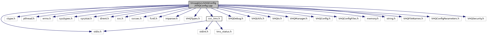

[Macros](#define-members) \| [Functions](#func-members) \| [Variables](#var-members)

`#include <stdio.h>`
`#include <ctype.h>`
`#include "pthread.h"`
`#include <errno.h>`
`#include <sys/types.h>`
`#include <sys/stat.h>`
`#include <dirent.h>`
`#include <svc.h>`
`#include <svcsec.h>`
`#include <fcntl.h>`
`#include <iniparser.h>`
`#include "VHQTypes.h"`
`#include "`<a href="svc__tms_8h_source.md">svc_tms.h</a>`"`
`#include "VHQDebug.h"`
`#include "VHQUtils.h"`
`#include "VHQIo.h"`
`#include "VHQManager.h"`
`#include "VHQConfig.h"`
`#include "VHQConfigFiles.h"`
`#include "VHQConfigParameters.h"`
`#include "VHQSecurity.h"`

Include dependency graph for VHQConfig.cpp:

|  |  |
|----|----|
| Macros |  |
| #define  | [INFO_SVC_NODE_NAME_CONV](#a4b2473c6c8ad58e5ca398e7e44e2b270)(a, b, c) |
| #define  | [GET_NODE](#a32c9d3a3469ad2f3279ee1b251c58bf2)(a, b) |
| #define  | [infosvc_setval](#a7b904c930f96e2fc330fd6a34bbef81f)(a, b, c, d, e) |
| #define  | [GetInfoSvcDBLock](#af7fb5eea01961379e66e01f44ffa7bc2)() |
| #define  | [ReleaseInfoSvcDBLock](#a507750c60787636c27e272aa0c3e6253)() |
| #define  | [ASCIILINESZ](#aeb84e295ec3307b215991d4bf88bceb7)   (1024) |
| #define  | [VHQ_INI_FILE_BACKUP_EXTENSION](#a6d11c64e711a1893e7e10115d5f5a0fa)   \".bk\" |
| #define  | [MAX_FILE_SIZE_COMPARE](#a31d74a8b494f92ed810f69465f963b89)   (50 \* 1024) |

|  |  |
|----|----|
| Functions |  |
| void  | [setSvcDBLock](#a30ed0fd33e8a5cbadd2e04fde4f82266) () |
| void  | [setSvcDBUnLock](#a5f72bf0b7fca2fb9dde3c54ba511c745) () |
| int  | [iniparser_setstr](#a605a88057bac4c3249513fc588421c32) (dictionary \*ini, char \*entry, char \*val) |
| bool  | [\_VHQGetParameterBool](#ad11b626e1d6c919d6f3adc2dd0fd2439) (const char \*FUNC, const unsigned int LINE, uint32 ui32ParameterID, bool \*pbData) |
| bool  | [\_VHQSetParameterBool](#a2ee63c9045436f7c88d3194c4462fb74) (const char \*FUNC, const unsigned int LINE, uint32 ui32ParameterID, bool bData, bool bSaveNow) |
| bool  | [\_VHQGetParameterUint32](#a1128f8405df656da34f081924d4e77f8) (const char \*FUNC, const unsigned int LINE, uint32 ui32ParameterID, uint32 \*pdwData, int base) |
| bool  | [\_VHQSetParameterUint32](#a73aaa50c9772cf94aa8d27e641c9cd9b) (const char \*FUNC, const unsigned int LINE, uint32 ui32ParameterID, uint32 dwData, bool bSaveNow) |
| bool  | [\_VHQGetParameterString](#a57bba20342cd94b99fb5a5aa8f718b66) (const char \*FUNC, const unsigned int LINE, uint32 ui32ParameterID, char \*pData, uint32 ui32Size) |
| bool  | [\_VHQSetParameterString](#a384ebeabc69d4b0a1a984c67ffe22793) (const char \*FUNC, const unsigned int LINE, uint32 ui32ParameterID, char \*pData, uint32 ui32Size, bool bSaveNow) |
| int  | [VHQGetParameter](#a39cbd8f683e018bb35d31359d6befd93) (char \*pSection, char \*pParam, char \*pData, uint32 pDataSize) |
| bool  | [VHQGetNameInfo](#a0ab40fe549808cda763206a8585cd91c) (char \*pName, char \*pSection, uint32 \*pui32ParameterID, uint32 \*pui32ParameterType) |
| bool  | [VerifyFilePermissions](#a8166845a077b1e758e747c9e3f061ee1) (char \*pszConfigFile) |
| bool  | [IsInMaintenanceWindow](#a7d60a5c4fca71665eb6a45c5a9dd62b7) (time_t Time, bool \*MWIsAllDay) |
|   | checks to see if requested time is in the mainanence window.Time is in UTC, times in config file are local, and tzset for platform. [More\...](#a7d60a5c4fca71665eb6a45c5a9dd62b7)  |
| uint32  | [VHQRunTimeForDownload](#a661558e5bf1f2eda85a234c502b96a87) (time_t expiry_time, time_t run_time, uint8 timer_type) |
| int  | [GetSecondsToNextHeartbeat](#a589f284f9ab4f5f515bbab9b01680e29) (uint32 hb_rate) |
|   | checks to see if the heartbeat rate would always fall in the maintenance window [More\...](#a589f284f9ab4f5f515bbab9b01680e29)  |
| int  | [VHQDataAccessCB](#a4121945bbdd85bae6e921a1b38796735) (char \*paramName, char \*paramValue, size_t paramValueLen) |
| bool  | [VHQMergeConfigFile](#a3201b4f4a1cc99aa86e0a634f3c1252e) (char \*pszConfigFile, CALLBACK_INI_EVENT pfnIniCallback) |
| bool  | [VHQLoadConfigData](#a8eda29dfdbba118e2a9d1fee40a55496) (bool processUpdateFiles, CALLBACK_INI_EVENT pfnIniCallback) |
| vhq_logging_level_t  | [GetLoggingLevel](#a8816969cf1877588191d19be307cc9c9) (void) |
| uint32  | [GetLogSize](#a2a2e5df47b5953d767909781984e399b) (void) |
| void  | [InstanceRebootEventRequired](#a5c62f926d2fa258c0d36a20bd943e478) (bool sendReboot) |
| device_id_backup_source_t  | [GetDeviceIdBackupSource](#a460ffe37623ec06ab5c4de5df22bdfa5) (bool DIDReqdForKeyExch) |
| uint32  | [VHQConfigGetTimeInterval](#a4978b35dd97dec406793e39f80c99476) (uint32 ui32ParameterID, uint32 \*pdwData) |
| char \*  | [GetCurrentInstance](#aa67082322cb4ea104367dd95914ab953) (void) |
| void  | [VHQReloadConfigData](#a8de8bee4d45cad1ade7e8d61d39c146f) (bool syncInfoSvcFirst, bool processUpdateFiles) |
| vhq_result_t  | [DeleteAllInstanceFiles](#a9a4961dd44587ec063f8185c66c99782) () |
| vhq_result_t  | [TestLockServerInstance](#a7a2273cf58db379d25e1883aa3875b16) (char \*serverInstance) |
| vhq_result_t  | [LockServerInstance](#ad4238cc9d9a91158e1e6a91b58790445) (char \*serverInstance, int mlsecTimeout, char \*currentInstance) |
| vhq_result_t  | [ReleaseServerInstanceLock](#a91ac5e0f8d7ad4277bfcaea86cc51e5e) (char \*originalInstance) |
| vhq_result_t  | [DeleteServerInstance](#afee0bd20f63ea4bc9d976fea573aae17) (char \*deleteInstance, bool force_delete) |
| void  | [GetFileNameForInstance](#acf25078f1b1913ea703b1762a920d9b0) (char \*InstanceFileName, char \*OrigFileName, const char \*InstanceName) |
| param_file_reporting_t  | [GetParamFileReportingType](#a2493ff4899b6fcd655662ae00080b4a5) () |
| void  | [GetServerInstanceList](#afcb779f27ed4c00492a5075bf304dfaa) (char \*\*\*ServerInstances, int \*numInstances) |
| void  | [CleanupServerInstanceList](#aea26cafd2bc32bdefa8356afee885e7a) (char \*\*\*ServerInstances, int numInstances) |
| void  | [GetInstanceFromFilename](#a17977dc55a636582963142483be82470) (char \*filename, char \*InstanceName, int InstanceNameSize) |

|  |  |
|----|----|
| Variables |  |
| pthread_mutex_t  | [configMutex](#ab105747ff2bd8f096af2998ce8d7fb09) = PTHREAD_MUTEX_INITIALIZER |
| pthread_mutex_t  | [instanceMutex](#aefe3a7a3291bc369e4cafd22b2203f68) = PTHREAD_MUTEX_INITIALIZER |
| MAINT_WINDOW_T  | [maint_schedule](#ad859525bb76f1ce75f81c048ed628a96) |
| const int  | [ciNumParams](#a1a7434b7cd213fc5449f9009d511b735) = sizeof(asParams) / sizeof(asParams\[0\]) |

## DetailedDescription {#detailed-description}

Some utility functions shared between platforms

## MacroDefinition Documentation {#macro-definition-documentation}

## ASCIILINESZ 

#define ASCIILINESZ   (1024)

## GET_NODE 

#define GET_NODE

## GetInfoSvcDBLock 

#define GetInfoSvcDBLock

## INFO_SVC_NODE_NAME_CONV 

#define INFO_SVC_NODE_NAME_CONV

## infosvc_setval 

#define infosvc_setval

## MAX_FILE_SIZE_COMPARE 

#define MAX_FILE_SIZE_COMPARE   (50 \* 1024)

## ReleaseInfoSvcDBLock 

#define ReleaseInfoSvcDBLock

## VHQ_INI_FILE_BACKUP_EXTENSION 

#define VHQ_INI_FILE_BACKUP_EXTENSION   \".bk\"

## FunctionDocumentation {#function-documentation}

## \_VHQGetParameterBool() 

bool \_VHQGetParameterBool

This function get a bool type ini parameter value

**Parameters**

\[in\] **FUNC** : function name \[in\] **LINE** : line number \[in\] **ui32ParameterID** : parameter ID to fetch the value for \[out\] **pbData** : buffer to save returned parameter

### Returns

TRUE indicates parameter found, FALSE indicates unknown parameter

## \_VHQGetParameterString() 

bool \_VHQGetParameterString

This function is the getter function for string based ini file parameters

**Parameters**

\[in\] **FUNC** : function name \[in\] **LINE** : line number \[in\] **ui32ParameterID** : parameter ID to fetch the value for \[out\] **pData** : buffer to save returned parameter \[in\] **ui32Size** size of string buffer

### Returns

TRUE indicates parameter found, FALSE indicates unknown parameter

## \_VHQGetParameterUint32() 

bool \_VHQGetParameterUint32

This function is getter function for unsigned int ini file parameters

**Parameters**

\[in\] **FUNC** : function name \[in\] **LINE** : line number \[in\] **ui32ParameterID** : parameter ID to fetch the value for \[out\] **pdwData** : buffer to save returned parameter \[out\] **base** : base

### Returns

TRUE indicates parameter found, FALSE indicates unknown parameter

## \_VHQSetParameterBool() 

bool \_VHQSetParameterBool

This is setter function for boolean ini file parameters

**Parameters**

\[in\] **FUNC** : function name \[in\] **LINE** : line number \[in\] **ui32ParameterID** : parameter ID to fetch the value for \[out\] **bData** : bool to save returned parameter \[in\] **bSaveNow** : if true, flushed contents of in memory ini file copy to flash storage

### Returns

TRUE indicates parameter found, FALSE indicates unknown parameter

## \_VHQSetParameterString() 

bool \_VHQSetParameterString

This function is the setter function for string based ini file parameters

**Parameters**

\[in\] **FUNC** : function name \[in\] **LINE** : line number \[in\] **ui32ParameterID** : parameter ID to fetch the value for \[out\] **pData** : buffer to save returned parameter \[in\] **ui32Size** : size of string buffer \[in\] **bSaveNow** : if true, flushed contents of in memory ini file copy to flash storage

### Returns

TRUE indicates parameter found, FALSE indicates unknown parameter

## \_VHQSetParameterUint32() 

bool \_VHQSetParameterUint32

This function is the setter function for unsigned int ini file parameters.

**Parameters**

\[in\] **FUNC** : function name \[in\] **LINE** : line number \[in\] **ui32ParameterID** : parameter ID to fetch the value for \[out\] **dwData** : buffer to save returned parameter \[in\] **bSaveNow** : if true, flushed contents of in memory inifile copy to flash storage

### Returns

TRUE indicates parameter found, FALSE indicates unknown parameter

## CleanupServerInstanceList() 

void CleanupServerInstanceList

This function cleans the list of server instances.

**Parameters**

\[in\] **ServerInstances** = pointer to list of server instances. \[in\] **numInstances** = number of instances.

### Returns

void

## DeleteAllInstanceFiles() 

vhq_result_t DeleteAllInstanceFiles

This function deletes all files related to all the instances from agent mnt/flash/system/vhq.

### Returns

void

## DeleteServerInstance() 

vhq_result_t DeleteServerInstance

This function deletes a server instance and removes all files belonging to that server instance.

**Parameters**

\[in\] **receiver** = calling application name. \[in\] **deleteInstance** = instance to be deleted.

### Returns

vhq_result_t, VHQ_SUCCESS if success.

## GetCurrentInstance() 

char\* GetCurrentInstance

This function returns the current instance.

### Returns

void

## GetDeviceIdBackupSource() 

device_id_backup_source_t GetDeviceIdBackupSource

This function returns the device ID source if not provided by application.

### Returns

device_id_backup_source_t device ID source

## GetFileNameForInstance() 

void GetFileNameForInstance

This function gets the instance file name for an instance

**Parameters**

\[out\] **InstanceFileName** = file name according to current instance \[in\] **OrigFileName** = original file name for instance \[in\] **InstanceName** = current instance

### Returns

void

## GetInstanceFromFilename() 

void GetInstanceFromFilename

This function gets the instance from file name.

**Parameters**

\[in\] **filename** = filename \[out\] **InstanceName** = instance name \[in\] **InstanceNameSize** = size of instance name

### Returns

void

## GetLoggingLevel() 

vhq_logging_level_t GetLoggingLevel

## GetLogSize() 

uint32 GetLogSize

## GetParamFileReportingType() 

param_file_reporting_t GetParamFileReportingType

This function returns the VHQ parameter file reporting type.

### Returns

param_file_reporting_t

## GetSecondsToNextHeartbeat() 

bool GetSecondsToNextHeartbeat

checks to see if the heartbeat rate would always fall in the maintenance window

**Parameters**

**hb_rate** - frequency in seconds of the heartbeat

### Returns

seconds to next heatrbeat to perform at least one inside of maintenance window \'0\' means that HB can be scheduled any time, since we always will have at least one inside of maintenance window

## GetServerInstanceList() 

void GetServerInstanceList

This function gets the list of server instances.

**Parameters**

\[out\] **ServerInstances** = pointer to list of server instances \[out\] **numInstances** = number of server instances found

### Returns

void

## iniparser_setstr() 

int iniparser_setstr

## InstanceRebootEventRequired() 

void InstanceRebootEventRequired

## IsInMaintenanceWindow() 

bool IsInMaintenanceWindow

checks to see if requested time is in the mainanence window.Time is in UTC, times in config file are local, and tzset for platform.

**Parameters**

**Time** - time to check **MWIsAllDay** - optional flag passed to this function - will get set to true if the MW is 24 hours

### Returns

TRUE = in maintanence window

FALSE = not in maintenance window, or error

## LockServerInstance() 

vhq_result_t LockServerInstance

This function locks a server instance before processing an event.

**Parameters**

\[in\] **serverInstance** = server instance to be locked. \[in\] **mlsecTimeout** = time out in millisecond \[in\] **currentInstance** = current server instance expected to exist.

### Returns

vhq_result_t VHQ_SUCCESS,if success

## ReleaseServerInstanceLock() 

vhq_result_t ReleaseServerInstanceLock

This function unlocks a server instance.

**Parameters**

\[in\] **originalInstance** = instance to unlock.

### Returns

vhq_result_t VHQ_SUCCESS,if success

## setSvcDBLock() 

void setSvcDBLock

## setSvcDBUnLock() 

void setSvcDBUnLock

## TestLockServerInstance() 

vhq_result_t TestLockServerInstance

This function is copy of [LockServerInstance()](#ad4238cc9d9a91158e1e6a91b58790445) but just test do we have ability to lock mentioned instance or not.

**Parameters**

\[in\] **serverInstance** = pointer to instance name string.

### Returns

VHQ_SUCCESS - in case if we can lock instance VHQ_API_SERVER_INSTANCE_LOCK_ERROR - in case if instance already occupied

## VerifyFilePermissions() 

bool VerifyFilePermissions

This function verifies the agent has permissions to the file.

**Parameters**

\[in\] **pszConfigFile** - config file name

### Returns

TRUE if the permissions seem correct, FALSE if not

## VHQConfigGetTimeInterval() 

uint32 VHQConfigGetTimeInterval

This function returns the config parameter value with a parameter ID.

**Parameters**

\[in\] **ui32ParameterID** = parameter ID in VHQconfig. \[out\] **pdwData** = parameter value

### Returns

uint32, returns the parameter value.

## VHQDataAccessCB() 

int VHQDataAccessCB

## VHQGetNameInfo() 

bool VHQGetNameInfo

This function is the getter function for details about a requested parameter

**Parameters**

\[in\] **pName** : name of parameter to look up \[in\] **pSection** : section name for parameter \[out\] **pui32ParameterID** : parameter ID \[out\] **pui32ParameterType** : parameter type

### Returns

TRUE indicates parameter found

## VHQGetParameter() 

int VHQGetParameter

Gets parameter value by section and parameter as a string.

**Parameters**

\[in\] **pSection** INI file section \[in\] **pParam** parameter name \[out\] **pData** buffer to save returned parameter \[in\] **pDataSize** size of string buffer

### Returns

TMS_STATUS_SUCCESS indicates parameter found

TMS_STATUS_HASH_GEN_PARAM_DOESNT_EXIST indicates unknown parameter

TMS_STATUS_ERROR indicates the parameter was found, but unable to be read

## VHQLoadConfigData() 

bool VHQLoadConfigData

This function loads config files, set any necessary variables anywhere

**Parameters**

\[in\] **processUpdateFiles** = boolean to tell whether updates should be processed when loading the config. \[in\] **pfnIniCallback** = callback.

### Returns

TRUE ,if ini file loading success.Varibles would be set to defaults on fail ini load.

## VHQMergeConfigFile() 

bool VHQMergeConfigFile

This function merges data from the Usr config file into the current INI file Assumes the caller has allocated the config mutex, or that we\'re called when we\'re the only thread.

**Parameters**

\[in\] **pszConfigFile** = config file name \[in\] **pfnIniCallback** = ini callback

## VHQReloadConfigData() 

void VHQReloadConfigData

This function reloads the config data when there is a config update from server.

**Parameters**

\[in\] **syncInfoSvcFirst** If the InfoSvc DB was updated, it will need to be synched first \[in\] **processUpdateFiles** boolean to tell whether updates should be processed when loading the config.

### Returns

void

## VHQRunTimeForDownload() 

uint32 VHQRunTimeForDownload

This function returns a random time to perform download.

**Parameters**

\[in\] **expiry_time** = download expiry time \[in\] **runtime** = current runtime of the download \[in\] **timer_type** = RTC or Date/time

### Returns

new run time.

## VariableDocumentation {#variable-documentation}

## ciNumParams 

const int ciNumParams = sizeof(asParams) / sizeof(asParams\[0\])

## configMutex 

pthread_mutex_t configMutex = PTHREAD_MUTEX_INITIALIZER

## instanceMutex 

pthread_mutex_t instanceMutex = PTHREAD_MUTEX_INITIALIZER

## maint_schedule 

MAINT_WINDOW_T maint_schedule

