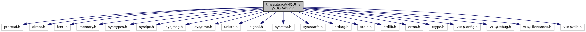

[Macros](#define-members) \| [Functions](#func-members) \| [Variables](#var-members)

`#include <pthread.h>`
`#include <dirent.h>`
`#include <fcntl.h>`
`#include <memory.h>`
`#include <sys/types.h>`
`#include <sys/ipc.h>`
`#include <sys/msg.h>`
`#include <sys/time.h>`
`#include <unistd.h>`
`#include <signal.h>`
`#include <sys/stat.h>`
`#include <sys/statfs.h>`
`#include <stdarg.h>`
`#include <stdio.h>`
`#include <stdlib.h>`
`#include <errno.h>`
`#include <ctype.h>`
`#include "VHQConfig.h"`
`#include "VHQDebug.h"`
`#include "VHQFileNames.h"`
`#include "VHQUtils.h"`

Include dependency graph for VHQDebug.c:

|  |  |
|----|----|
| Macros |  |
| #define  | [MSEC_RESOLUTION_IN_DEBUG_STATEMENTS](#aab91e6c3195452fe2bba5d13f7f0866a)   0 |
| #define  | [MAX_DBG_MSG_LEN](#a7458b5ee0664ce393b8fcc78c75050ed)   (5 \* 1024) |
| #define  | [LOG_TYPE_SIZE](#a0b3bd681c6e8fc179c6ec63715137327)   10 |
| #define  | [TRUNC_MSG](#a96ed5fd87ad7607b835846769553de5d)   \" - message TRUNCATED\\n\" |
| #define  | [FREE_FLASH_GAP](#a01b46c854a833c66bf2d708eaab0c269)   64\*1024 |

|  |  |
|----|----|
| Functions |  |
| void  | [LogTypetoStr](#ae01d6472eba9485c77da72f62974b3c1) (int LogType, char \*logstr) |
| int  | [LogMsgEx](#ad9e7ead2fe6a6f0006634059149e28ea) (const char \*fname, char \*logstr, const char \*string, va_list ap) |
| int  | [LogMsg](#a7c07b5aab40fa1935e6f5923c8e2094c) (int msgType, const char \*string,\...) |
| int  | [DebugMsg](#a7e0d32acf1665f3178b96ed7bd0ba0e3) (vhq_logging_level_t logLevel, const char \*string,\...) |
| int  | [vDebugMsg](#aa4b17b95864e497ea1b49a810be2b95b) (const char \*LogStr, const char \*string, va_list ap) |
| void  | [DebugMsgBuffer](#aa13ec5a5ad25cc5e05f32c375e562ee1) (const char \*string, const char \*buffer, int buffer_size, DebugMsgBufType type) |
| void  | [DebugVoid](#a84cfe496dc4e08febce6bdd34919ad60) (const char \*string,\...) |

|           |                                                        |
|-----------|--------------------------------------------------------|
| Variables |                                                        |
| bool      | [bVerbose](#ad0fc9bc4e88662c79c9d563df8cd4097) = FALSE |

## DetailedDescription {#detailed-description}

Main <a href="libevt_8h.md#struct_event">Event</a> Scheduler operations

## MacroDefinition Documentation {#macro-definition-documentation}

## FREE_FLASH_GAP 

#define FREE_FLASH_GAP   64\*1024

## LOG_TYPE_SIZE 

#define LOG_TYPE_SIZE   10

## MAX_DBG_MSG_LEN 

#define MAX_DBG_MSG_LEN   (5 \* 1024)

## MSEC_RESOLUTION_IN_DEBUG_STATEMENTS 

#define MSEC_RESOLUTION_IN_DEBUG_STATEMENTS   0

## TRUNC_MSG 

#define TRUNC_MSG   \" - message TRUNCATED\\n\"

## FunctionDocumentation {#function-documentation}

## DebugMsg() 

int DebugMsg

This function prints a debug message out the debug port (same as printf) but DebugMsg calls are stripped out of release versions.

**Parameters**

\[in\] **logLevel** = incoming log level. \[in\] **string** = log string and contents.

### Returns

message length written into log file.

## DebugMsgBuffer() 

void DebugMsgBuffer

This function prints a debug message buffer in its hex or character format.

**Parameters**

\[in\] **string** = description printed before the data buffer. \[in\] **buffer** = pointer to the buffer to be printed. \[in\] **buffer_size** = the size of the buffer to be printed. \[in\] **type** = debug display format

### Returns

void

## DebugVoid() 

void DebugVoid

This function is a void function to suppress compiler warnings

## LogMsg() 

int LogMsg

This function determines the type of log file where the incoming logs should go to.

**Parameters**

\[in\] **msgType** = incoming log level. \[in\] **string** = log content and list.

### Returns

message length written into log file.

## LogMsgEx() 

int LogMsgEx

This function displays and writes the logs into files.

**Parameters**

\[in\] **fname** = incoming log type. \[in\] **logstr** = log string. \[in\] **string** = log \[in\] **ap** = list with log contents.

### Returns

message length written into log file.

## LogTypetoStr() 

void LogTypetoStr

This function adds a log type to be displayed in logs.

**Parameters**

\[in\] **LogType** = incoming log type. \[out\] **logstr** = log string to display.

### Returns

void

## vDebugMsg() 

int vDebugMsg

This function prints a debug message out the debug port (same as printf) but DebugMsg calls are stripped out of release versions.

**Parameters**

\[in\] **LogStr** = log type string. \[in\] **string** = string. \[in\] **ap** = log content list.

### Returns

number of bytes written.

## VariableDocumentation {#variable-documentation}

## bVerbose 

bool bVerbose = FALSE

