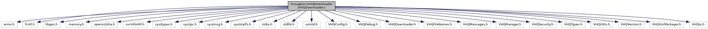

[Data Structures](#nested-classes) \| [Macros](#define-members) \| [Functions](#func-members) \| [Variables](#var-members)

`#include <errno.h>`
`#include <fcntl.h>`
`#include <libgen.h>`
`#include <memory.h>`
`#include <openssl/sha.h>`
`#include <svcInfoAPI.h>`
`#include <sys/types.h>`
`#include <sys/ipc.h>`
`#include <sys/msg.h>`
`#include <sys/statfs.h>`
`#include <stdio.h>`
`#include <stdlib.h>`
`#include <unistd.h>`
`#include "VHQConfig.h"`
`#include "VHQDebug.h"`
`#include "VHQDownloader.h"`
`#include "VHQFileNames.h"`
`#include "VHQMessages.h"`
`#include "VHQManager.h"`
`#include "VHQSecurity.h"`
`#include "VHQTypes.h"`
`#include "VHQUtils.h"`
`#include "VHQVersion.h"`
`#include "VHQXmlPackager.h"`
`#include "VHQIo.h"`

Include dependency graph for VHQDownloader.c:



|                 |                                                     |
|-----------------|-----------------------------------------------------|
| Data Structures |                                                     |
| struct          | [suppressed_action_t](#structsuppressed__action__t) |

|  |  |
|----|----|
| Macros |  |
| #define  | [VHQ_DOWNLOADER_WAIT_TIME_MIN](#a0f9f57d238f9b7fd8679993fae1aa5d1)   10 |
| #define  | [VHQ_DOWNLOADER_WAIT_TIME_SEC](#abbd3b16ae0d244f4c0b45a47d2f9fdec)   ([VHQ_DOWNLOADER_WAIT_TIME_MIN](#a0f9f57d238f9b7fd8679993fae1aa5d1) \* 60) |
| #define  | [VHQ_DOWNLOADER_SLEEP_TIME](#a1df47bae58ff4ad04d23d0550ca9da23)   10 |
| #define  | [LOW_BATTERY_THRESHOLD](#ae261f8baf39c426b98928d7db1de966e)   15 |
| #define  | [TRUNCATE_BLOCK_SIZE](#a7f170badaa5082e89c1008ea20c29a6e)   (128 \* 1024) |
| #define  | [BINTBL_EXTENSION](#afebb1759eefd520df0c3ada0d1d7d864)   \".bintbl\" |

|  |  |
|----|----|
| Functions |  |
| void  | [URLUnescape](#aac6734b36de8157853341542b24c2ba9) (char \*pBuffer, int \*piLen) |
| bool  | [CheckFreeMemForDownload](#a5962aed860ee9f91347ad8ccb00c08c2) (char \*fileLocation, int fileSize) |
| vhq_result_t  | [dl_main](#a23a182e1762345dd27b5ec18c9141311) (int parameter, event_set_id_t event_set_id, event_id_t event_id) |
| void  | [SetSuppressedAction](#adea13d479ad99e933ad4292dd4254750) (term_action_t action, event_set_id_t event_set_id) |
| term_action_t  | [SuppressedActionRequired](#a5dd2c0714d85dd33193e9de891c98a82) (event_set_id_t event_set_id) |

|  |  |
|----|----|
| Variables |  |
| struct [suppressed_action_t](#structsuppressed__action__t)  | [suppressed_action](#ab1dd6786a37f463da8aa89c91c9859d5) |

## DetailedDescription {#detailed-description}

This is the VHQ downlaoder program. It runs separate from the vhq agent itself to make it easier to update the VHQ agent

------------------------------------------------------------------------

## DataStructure Documentation {#data-structure-documentation}

## suppressed_action_t <a href="#structsuppressed__action__t" id="structsuppressed__action__t"></a>

<p>struct suppressed_action_t</p>

| Data Fields    |                   |     |
|----------------|-------------------|-----|
| term_action_t  | action            |     |
| bool           | action_suppressed |     |
| event_set_id_t | event_set_id      |     |

## MacroDefinition Documentation {#macro-definition-documentation}

## BINTBL_EXTENSION <a href="#afebb1759eefd520df0c3ada0d1d7d864" id="afebb1759eefd520df0c3ada0d1d7d864"></a>

<p>#define BINTBL_EXTENSION   \".bintbl\"</p>

## LOW_BATTERY_THRESHOLD <a href="#ae261f8baf39c426b98928d7db1de966e" id="ae261f8baf39c426b98928d7db1de966e"></a>

<p>#define LOW_BATTERY_THRESHOLD   15</p>

## TRUNCATE_BLOCK_SIZE <a href="#a7f170badaa5082e89c1008ea20c29a6e" id="a7f170badaa5082e89c1008ea20c29a6e"></a>

<p>#define TRUNCATE_BLOCK_SIZE   (128 \* 1024)</p>

## VHQ_DOWNLOADER_SLEEP_TIME <a href="#a1df47bae58ff4ad04d23d0550ca9da23" id="a1df47bae58ff4ad04d23d0550ca9da23"></a>

<p>#define VHQ_DOWNLOADER_SLEEP_TIME   10</p>

## VHQ_DOWNLOADER_WAIT_TIME_MIN <a href="#a0f9f57d238f9b7fd8679993fae1aa5d1" id="a0f9f57d238f9b7fd8679993fae1aa5d1"></a>

<p>#define VHQ_DOWNLOADER_WAIT_TIME_MIN   10</p>

## VHQ_DOWNLOADER_WAIT_TIME_SEC <a href="#abbd3b16ae0d244f4c0b45a47d2f9fdec" id="abbd3b16ae0d244f4c0b45a47d2f9fdec"></a>

<p>#define VHQ_DOWNLOADER_WAIT_TIME_SEC   ([VHQ_DOWNLOADER_WAIT_TIME_MIN](#a0f9f57d238f9b7fd8679993fae1aa5d1) \* 60)</p>

## FunctionDocumentation {#function-documentation}

## CheckFreeMemForDownload() <a href="#a5962aed860ee9f91347ad8ccb00c08c2" id="a5962aed860ee9f91347ad8ccb00c08c2"></a>

<p>bool CheckFreeMemForDownload</p>

This function checks if we have enough flash to download a file from server.

**Parameters**

\[in\] **fileLocation** = File location \[in\] **filesize** = size of file to download

### Returns

TRUE, if memory available; FALSE, otherwise

## dl_main() <a href="#a23a182e1762345dd27b5ec18c9141311" id="a23a182e1762345dd27b5ec18c9141311"></a>

<p>vhq_result_t dl_main</p>

This function is the main entry point of the downloader application.

**Parameters**

\[in\] **parameter** = number of parameters argc - The argv length. argv - The application command line arguments. \[in\] **event_set_id** = event set ID of downloader event \[in\] **event_id** = event ID of downloader event

### Returns

VHQ_SUCCESS, if success; FALSE, otherwise

## SetSuppressedAction() <a href="#adea13d479ad99e933ad4292dd4254750" id="adea13d479ad99e933ad4292dd4254750"></a>

<p>void SetSuppressedAction</p>

This function will suppress an action.

**Parameters**

\[out\] **action** = terminal action type to suppress. \[out\] **event_set_id** = event set id of event.

### Returns

void

## SuppressedActionRequired() <a href="#a5dd2c0714d85dd33193e9de891c98a82" id="a5dd2c0714d85dd33193e9de891c98a82"></a>

<p>term_action_t SuppressedActionRequired</p>

This function is used to get a suppressed action.

**Parameters**

\[in\] **event_set_id** = event set id to check for.

### Returns

void

## URLUnescape() <a href="#aac6734b36de8157853341542b24c2ba9" id="aac6734b36de8157853341542b24c2ba9"></a>

<p>void URLUnescape</p>

## VariableDocumentation {#variable-documentation}

## suppressed_action <a href="#ab1dd6786a37f463da8aa89c91c9859d5" id="ab1dd6786a37f463da8aa89c91c9859d5"></a>

<p>struct [suppressed_action_t](#structsuppressed__action__t) suppressed_action</p>

**Initial value:**

``` cpp
= { FALSE, TERM_ACTION_NONE,
   EVENT_SET_ID_INVALID }
```
