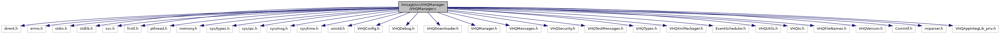

[Data Structures](#nested-classes) \| [Macros](#define-members) \| [Typedefs](#typedef-members) \| [Functions](#func-members) \| [Variables](#var-members)

`#include <dirent.h>`
`#include <errno.h>`
`#include <stdio.h>`
`#include <stdlib.h>`
`#include <svc.h>`
`#include <fcntl.h>`
`#include <pthread.h>`
`#include <memory.h>`
`#include <sys/types.h>`
`#include <sys/ipc.h>`
`#include <sys/msg.h>`
`#include <sys/time.h>`
`#include <unistd.h>`
`#include "VHQConfig.h"`
`#include "VHQDebug.h"`
`#include "VHQDownloader.h"`
`#include "VHQManager.h"`
`#include "VHQMessages.h"`
`#include "VHQSecurity.h"`
`#include "VHQTestMessages.h"`
`#include "VHQTypes.h"`
`#include "VHQXmlPackager.h"`
`#include "EventScheduler.h"`
`#include "VHQUtils.h"`
`#include "VHQIo.h"`
`#include "VHQFileNames.h"`
`#include "VHQVersion.h"`
`#include "ComIntf.h"`
`#include <iniparser.h>`
`#include "VHQAppIntegLib_priv.h"`

Include dependency graph for VHQManager.c:

|  |  |
|----|----|
| Data Structures |  |
| struct   | [\_heart_beat_event_id_t](#struct__heart__beat__event__id__t) |
| struct   | [\_lock_thread_info_t](#struct__lock__thread__info__t) |
| struct   | [\_set_config_info_t](#struct__set__config__info__t) |

|  |  |
|----|----|
| Macros |  |
| #define  | [TRACK_MEM_USAGE](#abeb80842f84d8bfe9ea207ac53f8b268)   0 |
| #define  | [CONTACT_TEST_SERVER](#a3d5d277c849afd793d4368001c32b02c)   1 |
| #define  | [USE_RESPONSE_RECV_QUEUE](#af693a1d22d4d2bc9f5f68f9012bc5978)   1 |
| #define  | [MAX_SET_CONFIG_REQ](#a8871a1778a6515e978339e86b802ba71)   5 |
| #define  | [temp_flash_dl_dir_str](#a2af9faeffe3dd2c042a2a0f13216a3e3)   \"/home/usr1/vhq/\" |
| #define  | [DEVICE_EVENT_RETRY_FREQ](#a041b90b2fdf89b99f085e9b7ef565485)   300 |
| #define  | [MAX_CONSECUTIVE_ERRORS](#a0f51553c710580b9899756f7ad472c93)   3 |

|  |  |
|----|----|
| Typedefs |  |
| typedef struct [\_heart_beat_event_id_t](#struct__heart__beat__event__id__t)  | [heart_beat_event_id_t](#a19b552fe14992b34c9d9c0a03b3312b7) |
| typedef struct [\_lock_thread_info_t](#struct__lock__thread__info__t)  | [lock_thread_info_t](#aa38b2343bb87652bbe69235608362ebc) |
| typedef struct [\_set_config_info_t](#struct__set__config__info__t)  | [set_config_info_t](#ad7b4c38ea429ebadb19d209171e870a5) |

|  |  |
|----|----|
| Functions |  |
| bool  | [StopCommWatcherThread](#ae7afa77c758cb1210971d441c3718d55) (void) |
| bool  | [VC_CheckForDownloadNeedsResumption](#ad6a78a21f393db24d13c0d2829a6413d) () |
| void  | [InitHeartBeatEventID](#afe90e436cf6c4dd89e344b32de6ac761) (void) |
| event_set_id_t  | [GetHeartBeatEventID](#a471e63ef9aa27d3c4a7c20146c8d3135) (const char \*serverInstance) |
| bool  | [SetHeartBeatEventID](#a9c0cdd784b55180463b8ecfdff7cb154) (const char \*serverInstance, event_set_id_t event_set_id) |
| bool  | [DeleteHeartBeatEventID](#a6ce65d0bbfecdb2892294a45aa9f140b) (const char \*serverInstance) |
| bool  | [IsHeartBeatEventID](#a14469a098850bee1339c249f81c5af4d) (event_set_id_t event_set_id) |
| void  | [CleanupTempDownloads](#aecab840269cfd1924c5abc304e4471a2) (void) |
| event_result_t  | [DeviceEventProcessor](#a9128d5cdba4dc1b9b5826f92f82f0df0) (void \*arg) |
| vhq_result_t  | [sendEvents](#a17eae65e1be2d105e5eb5b26c2b1a450) (event_mask_t event_mask, device_event_content_t \*device_event_content) |
| event_result_t  | [GetSwUpdateProcessor](#aa0499176040984549ff671acadafd4dc) (void \*arg) |
| vhq_result_t  | [ScheduleGetSwUpdate](#a67e3c5b4efe88728a34028003df68fea) (char \*receiver, char \*update_type, char \*sw_ref_no, char \*reference) |
| event_result_t  | [Heartbeat](#a4f821b38127edebc7cfb488f490f3326) (void \*arg) |
| vhq_result_t  | [SendFailedMessages](#a0f26a42d66374d8ba0419d1c2216d2e6) (void) |
| vhq_result_t  | [VHQManagerContactServer](#a0fc6f8b1c598efeeaad0698dbd2e3139) (char \*\*pszDeviceMessage, int \*iDeviceMessageLength, event_id_t event_id, int \*comm_id, int \*msg_id, int \*srv_msg_id, char \*operation_id, bool close_comm_id, bool savePayloadOnFailure, bool isKeyExchange) |
| void \*  | [LockServerInstanceThread](#aa7e67e6e76549f261c3bfe1da9dfd407) (void \*arg) |
| void \*  | [SetConfigThread](#a7e990d5c89b51d1991ecdc90aff1e139) (void \*arg) |
| void  | [ProcessServerRequests](#a48c49e92aafd1c64e296dad826694a44) (bool blockMode) |
| event_set_id_t  | [ScheduleSingleHeartbeat](#a56c1676bea839d5167e19f1e71d58732) (uint32 secondsToHB, int flags, int retryFreq, char \*serverInstance) |
| void  | [ScheduleRecurringHeartbeat](#a6d8cd1251ec062373ac4347ab04c5d23) (bool AllowHBNow) |
| vhq_result_t  | [ScheduleRecurringDeviceEvent](#a1cae749f3ec3566f98749c158868d5fe) (event_mask_t event_mask, device_event_content_t \*device_event_content) |
| int  | [VHQManagerLoop](#a682b2edccb892b9d51409d680979b78a) (bool bSendRebootEvent) |
| bool  | [GetRestartStatus](#a99d56462c3eb0a7f9c7d42ed9ad494a0) () |
| pthread_t  | [GetManagerThreadId](#a2cad7743ca312987fd17f2c598b92ad1) () |
| void  | [SetRebootEventRequired](#a1043ce9a33ba1af1a44ffaa22f952565) (void) |
| void  | [ClearDeviceRegistrationMode](#a13cc92cead1d47c38addcfeb4773c6b1) (void) |
| bool  | [RequestDeviceRegistrationMode](#adc54a75d785d3aab33a1d6b7a66fc0d2) (void) |
| bool  | [GetDeviceRegistrationMode](#a5767f56797c59e480a9fe880ead5aa87) () |

|  |  |
|----|----|
| Variables |  |
| int  | [responseSend_Qid](#a7eec7d6a247b4caf5d31b5f110d653be) |
| int  | [responseRecv_Qid](#aa3064d6b88ce56288620581ae6c3245d) = -1 |
| volatile int  | [cur_comm_id](#a54995c96bad4b5b943cb88f3534cc743) = 1 |
| int  | [request_Qid](#a3b2dcf74e5db5d8dded9b16f4877ea02) |
| int  | [response_Qid](#a06d9180560d76eb8df03478b85303c47) |
| pthread_mutex_t  | [appArrayMutex](#a0488b68c064a3854e5f68accadd9a19e) |
| [lock_thread_info_t](#aa38b2343bb87652bbe69235608362ebc)  | [lock_thread_info_array](#a1175a93568ba9bf6a9e23071a63dd71e) \[<a href="svc__tms_8h.md#a0cd2e54d35b218f0417a377de1f37691">MAX_SERVER_INSTANCE_LOCK_REQ</a>\] |
| [set_config_info_t](#ad7b4c38ea429ebadb19d209171e870a5)  | [set_config_info_array](#ad1f5d5ee69b1f847759feebd0357cca3) \[[MAX_SET_CONFIG_REQ](#a8871a1778a6515e978339e86b802ba71)\] |
| void(\*  | [ExtractFn](#a3867a980bd5fc09fadc61228633b83fc) )(int iOp, void \*pData) = NULL |

## DetailedDescription {#detailed-description}

The VHQ Agent\'s main processing loop

------------------------------------------------------------------------

## DataStructure Documentation {#data-structure-documentation}

## \_heart_beat_event_id_t 

struct \_heart_beat_event_id_t

| Data Fields |  |  |
|----|----|----|
| event_set_id_t | event_set_id |  |
| char | serverInstance\[<a href="svc__tms_8h.md#ac954c1213335537d01d968c250154928">MAX_SERVER_INSTANCE_NAME_LEN</a>\] |  |
| bool | slotFilled |  |

## \_lock_thread_info_t 

struct \_lock_thread_info_t

| Data Fields |  |  |
|----|----|----|
| bool | in_use |  |
| vhq_result_t | lock_ret_val |  |
| pthread_t | lock_thread_id |  |
| char | prev_server_instance\[<a href="svc__tms_8h.md#ac954c1213335537d01d968c250154928">MAX_SERVER_INSTANCE_NAME_LEN</a>\] |  |
| VHQRootRequestMsg | requestMsg |  |

## \_set_config_info_t 

struct \_set_config_info_t

| Data Fields       |                      |     |
|-------------------|----------------------|-----|
| bool              | in_use               |     |
| VHQRootRequestMsg | requestMsg           |     |
| uint32            | sec_timeout          |     |
| int               | set_config_ret_val   |     |
| pthread_t         | set_config_thread_id |     |

## MacroDefinition Documentation {#macro-definition-documentation}

## CONTACT_TEST_SERVER 

#define CONTACT_TEST_SERVER   1

## DEVICE_EVENT_RETRY_FREQ 

#define DEVICE_EVENT_RETRY_FREQ   300

## MAX_CONSECUTIVE_ERRORS 

#define MAX_CONSECUTIVE_ERRORS   3

## MAX_SET_CONFIG_REQ 

#define MAX_SET_CONFIG_REQ   5

## temp_flash_dl_dir_str 

#define temp_flash_dl_dir_str   \"/home/usr1/vhq/\"

## TRACK_MEM_USAGE 

#define TRACK_MEM_USAGE   0

## USE_RESPONSE_RECV_QUEUE 

#define USE_RESPONSE_RECV_QUEUE   1

## TypedefDocumentation {#typedef-documentation}

## heart_beat_event_id_t 

typedef struct [\_heart_beat_event_id_t](#struct__heart__beat__event__id__t) [heart_beat_event_id_t](#a19b552fe14992b34c9d9c0a03b3312b7)

## lock_thread_info_t 

typedef struct [\_lock_thread_info_t](#struct__lock__thread__info__t) [lock_thread_info_t](#aa38b2343bb87652bbe69235608362ebc)

## set_config_info_t 

typedef struct [\_set_config_info_t](#struct__set__config__info__t) [set_config_info_t](#ad7b4c38ea429ebadb19d209171e870a5)

## FunctionDocumentation {#function-documentation}

## CleanupTempDownloads() 

void CleanupTempDownloads

This function checks for temporary download files to remove. Old temp files may be present because of downloads that were cancelled or any failure before installations.

### Returns

void

## ClearDeviceRegistrationMode() 

void ClearDeviceRegistrationMode

The device moves out of registration mode after a successful key exchange. A recurring heartbeat is scheduled after a successful Keys Exchange.

### Returns

void.

## DeleteHeartBeatEventID() 

bool DeleteHeartBeatEventID

## DeviceEventProcessor() 

event_result_t DeviceEventProcessor

Function is the thread routine DeviceEventProcessor.It creates device event message to send to server.

**Parameters**

\[in\] **arg** = thread argument with device event information

### Returns

event_result_t-EVENT_SUCCESS, if success

## GetDeviceRegistrationMode() 

bool GetDeviceRegistrationMode

## GetHeartBeatEventID() 

event_set_id_t GetHeartBeatEventID

## GetManagerThreadId() 

pthread_t GetManagerThreadId

## GetRestartStatus() 

bool GetRestartStatus

## GetSwUpdateProcessor() 

event_result_t GetSwUpdateProcessor

Function is the thread routine DeviceEventProcessor.It creates device event message to send to server.

**Parameters**

\[in\] **arg** = thread argument with device event information

### Returns

event_result_t-EVENT_SUCCESS, if success

## Heartbeat() 

event_result_t Heartbeat

This is the heartbeat thread routine.

**Parameters**

\[in\] **arg** = routine arguments for thread.

### Returns

EVENT_SUCCESS, if success

## InitHeartBeatEventID() 

void InitHeartBeatEventID

## IsHeartBeatEventID() 

bool IsHeartBeatEventID

## LockServerInstanceThread() 

void\* LockServerInstanceThread

This is the thread routine for server instance lock request.It calls the lock server instance function.

**Parameters**

\[in\] **arg** = thread argument containing server instance information.

### Returns

void

## ProcessServerRequests() 

void ProcessServerRequests

This function process incoming messages from root MQ

**Parameters**

\[in\] **blockMode** = TRUE, We will not set IPC_NOWAIT flag so this call will block us.

### Returns

void

## RequestDeviceRegistrationMode() 

bool RequestDeviceRegistrationMode

Moves the device into registration state and schedules single heartbeat for registration.

### Returns

TRUE, if device not already in registration mode.

## ScheduleGetSwUpdate() 

vhq_result_t ScheduleGetSwUpdate

Function schedules Get Update events

**Parameters**

\[in\]

## ScheduleRecurringDeviceEvent() 

vhq_result_t ScheduleRecurringDeviceEvent

This function schedules recurring device events.

**Parameters**

\[in\] **event_mask** = recurring event. \[in\] **device_event_content** = device event content

### Returns

event_result_t-EVENT_SUCCESS, if success

## ScheduleRecurringHeartbeat() 

void ScheduleRecurringHeartbeat

This function cancels regular HBs and creates new once once key exchange is successful.

**Parameters**

\[in\] **AllowHBNow** = forces start of HB event now.

### Returns

void

## ScheduleSingleHeartbeat() 

event_set_id_t ScheduleSingleHeartbeat

This function schedules single HB with time delay.This HB is has not retries and could be easy lost. TODO: Shall we support retrying of single HBs?

**Parameters**

\[in\] **secondsToHB** = seconds to HB processing. \[in\] **flags** = options for HB processing. \[in\] **retryFreq** = HB retry frequency in case of Failure.

### Returns

new event ID

## sendEvents() 

vhq_result_t sendEvents

Function schedules device and application events.

**Parameters**

\[in\] **event_mask** = event mask to be send \[in\] **device_event_content_t** = device event content

### Returns

event_result_t-EVENT_SUCCESS, if success

## SendFailedMessages() 

vhq_result_t SendFailedMessages

This function sends the messages which had failed when sent earlier.The details are taken from failed payload file.Failed messages are sent first, before recent messages.

### Returns

vhq_result_t, VHQ_SUCCESS if success.

## SetConfigThread() 

void\* SetConfigThread

This is the thread routine running for config update.

**Parameters**

\[in\] **arg** = thread arguments containing config update details.

### Returns

void

## SetHeartBeatEventID() 

bool SetHeartBeatEventID

## SetRebootEventRequired() 

void SetRebootEventRequired

## StopCommWatcherThread() 

bool StopCommWatcherThread

## VC_CheckForDownloadNeedsResumption() 

bool VC_CheckForDownloadNeedsResumption

## VHQManagerContactServer() 

vhq_result_t VHQManagerContactServer

This function manages the server contact after xml tree gets copied to memory buffer.

**Parameters**

\[in\] **pszDeviceMessage** = string with xml data. \[in\] **iDeviceMessageLength** = length of the string. \[in\] **event_id** = event ID \[in\] **comm_id** = communication ID \[in\] **msg_id** = message ID \[in\] **srv_msg_id** = server message ID \[in\] **operation_id** = operation ID \[in\] **close_comm_id** = TRUE, if close comm_id \[in\] **savePayloadOnFailure** = TRUE, if payload should be saved on failure to contact server. \[in\] **isKeyExchange** = TRUE, if keys exchange message

### Returns

vhq_result_t = VHQ_SUCCESS, if success.

## VHQManagerLoop() 

int VHQManagerLoop

Main VHQ Agent processing loop, it starts the EventScheduler thread.

### Returns

Should never return

## VariableDocumentation {#variable-documentation}

## appArrayMutex 

pthread_mutex_t appArrayMutex

## cur_comm_id 

volatile int cur_comm_id = 1

## ExtractFn 

void(\* ExtractFn) (int iOp, void \*pData) = NULL

## lock_thread_info_array 

[lock_thread_info_t](#aa38b2343bb87652bbe69235608362ebc) lock_thread_info_array\[<a href="svc__tms_8h.md#a0cd2e54d35b218f0417a377de1f37691">MAX_SERVER_INSTANCE_LOCK_REQ</a>\]

## request_Qid 

int request_Qid

## response_Qid 

int response_Qid

## responseRecv_Qid 

int responseRecv_Qid = -1

## responseSend_Qid 

int responseSend_Qid

## set_config_info_array 

[set_config_info_t](#ad7b4c38ea429ebadb19d209171e870a5) set_config_info_array\[[MAX_SET_CONFIG_REQ](#a8871a1778a6515e978339e86b802ba71)\]

