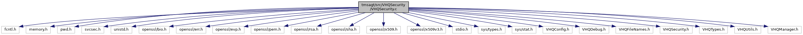

[Macros](#define-members) \| [Functions](#func-members) \| [Variables](#var-members)

`#include <fcntl.h>`
`#include <memory.h>`
`#include <pwd.h>`
`#include <svcsec.h>`
`#include <unistd.h>`
`#include <openssl/bio.h>`
`#include <openssl/err.h>`
`#include <openssl/evp.h>`
`#include <openssl/pem.h>`
`#include <openssl/rsa.h>`
`#include <openssl/sha.h>`
`#include <openssl/x509.h>`
`#include <openssl/x509v3.h>`
`#include <stdio.h>`
`#include <sys/types.h>`
`#include <sys/stat.h>`
`#include "VHQConfig.h"`
`#include "VHQDebug.h"`
`#include "VHQFileNames.h"`
`#include "VHQSecurity.h"`
`#include "VHQTypes.h"`
`#include "VHQUtils.h"`
`#include "VHQManager.h"`

Include dependency graph for VHQSecurity.c:

|  |  |
|----|----|
| Macros |  |
| #define  | [OPENSSL_NO_SHA256](#ad9d20261502cc111f476db968c3b0239)   1 |
| #define  | [VALIDATE_AGENT_PUB_KEY_CERTFILE](#a2d258f5cdc07ec2863a7e4e38c88c751)   1 |
| #define  | [USE_X509_V3_EXTENSIONS](#a5366e6bcd1d6f0d68372274755b70d47)   1 |
| #define  | [CONFFileName1\_](#ae42fe99dabf6cd6620e61e9d09e34735)(x)   #x |
| #define  | [CONFFileName\_](#a06c7015ad1745241ce08a77f3daee997)(x)   [CONFFileName1\_](#ae42fe99dabf6cd6620e61e9d09e34735)(x) |
| #define  | [CONFFileName](#a08ab33c14f0263471a0cbe2fd1140a82)   [CONFFileName\_](#a06c7015ad1745241ce08a77f3daee997)(OPENSSL_CNF_FILE_NAME) |
| #define  | [lib_VfiSecCrypto](#a97977865819e7ccdc8c66e3c361ca86b)   \"libvfiVaultapi.so\" |
| #define  | [vfiSecCryptoReadFn](#a36c739d091f7274750d6009f7d9bc4e0)   \"vfiSec_CwkRead\" |
| #define  | [vfiSecCryptoWriteFn](#a088ffbf48ee2fd8f15ab7d19bc139b4b)   \"vfiSec_CwkWrite\" |
| #define  | [DEBUG_AES_CMAC](#ade5d472b300abf17cf9facf13476778f)   0 |
| #define  | [ENABLE_CRYPTO_RD_WR](#ab80d9463e945f22fd4d1f0b3209866c1) |
| #define  | [SUBJ_KEY_ID_OBJ](#a10e7e94564a62b7e1c397c46ee623540)   \"X509v3 Subject Key Identifier\" |
| #define  | [JULY_30_2012](#a20899b937a16ba58997d8cdbec863384)   1343606400 |
| #define  | [SHA256_SIGNATURE](#a53a1c71ba07478eabafdad7a656e6a9b)   1 |
| #define  | [MAX_MALLOC_SIZE](#a93c5f2f47e24553e52a40852c7c25c93)   (1024 \* 1024) |
| #define  | [COMMON_NAME_START_STR](#aa4e38cf09cb23cb7050c5f3da52acf7a)   \"/CN=\" |
| #define  | [HOST_NAME_START_STR](#a06f99151643941d71f64109eef683d33)   \"://\" |

|  |  |
|----|----|
| Functions |  |
| bool  | [GetCertSerNum](#accb8cb96a63c3b2481eca771daa53ac2) (char \*certfile, char \*serial_num, int serial_num_len) |
| bool  | [GetPubKeyID](#a14ec216733eca01b5c40973c918780e9) (char \*certfile, char \*pubkey_id, int pubkey_id_len) |
| int  | [rand_serial](#a7a139be7a11cb7f35aef619c2fadd815) (BIGNUM \*b, ASN1_INTEGER \*ai) |
| bool  | [AgentKeysExist](#afdbfc885d0ca6d5e2c3324e2d2359f0c) (void) |
| int  | [ReadPubKeyCertfile](#a8b595be14dc0e1de14ded83c24ccad74) (char \*\*CertFile) |
| bool  | [EncryptAgentKeys](#a99e1a9f115f523eb7aeed8870d44e3f9) (int flen, char \*input, char \*output, char \*signature) |
| vhq_result_t  | [GenerateAgentKeys](#ad4537714f1bbccdacdc63078efebcc20) (char \*CertFile) |
| void  | [RemoveAgentKeys](#a0804e67f8294f16a0af8a1b6a813a944) (void) |
| void  | [VHQSecurityInit](#a8f293f39a49114ef1324ca50fb833982) (void) |
| void  | [VHQSecurityReloadKeys](#afda52c9fc3f7bddeaaed44fa0a70096d) (void) |
| bool  | [VHQSecurityGenSig](#ab2c6389474751089c72aedc6b9b40b12) (unsigned char \*data_p, int data_len, unsigned char \*sigbuf, int sigbuf_size) |
| bool  | [VHQSecurtiyVerifySignatureKey](#a4cdb8eb49d106c170959556d8fcad443) (char \*signing_key_id) |
| bool  | [VHQSecurtiyGetSignatureKeyID](#a8859f97bec0deda0341882499529c7a4) (char \*signing_key_id, int signing_key_id_len) |
| void  | [VHQSecurityCalculateFileHash](#ae3e831287d87f19b9df01c0f2ed5dfbc) (const char \*pszFileName, dl_file_hash_algo_t eHashAlgo, unsigned char \*pszFileHash, int pszFileHashSize, int \*genHashLen) |
| bool  | [VHQSecurityVerifyFileSignature](#a08495d01c4b9fba2e2ab46519fa9dd0a) (const char \*pszFileName, dl_file_hash_algo_t eHashAlgo, char \*pszHash) |
| bool  | [VHQSecurityGenSha1](#a92f023d88017b65d3dcfe9068d8c72a5) (const char \*filename, unsigned char \*sha1_digest) |
| time_t  | [GetCertExpiration](#a8ae81cce94b4abcbfdc4add0354c5d8a) (char \*file) |

|  |  |
|----|----|
| Variables |  |
| vhq_key_data_t  | [VHQKeyData](#ab2b922388c5c14e747c1236bdcc6a9ca) |
| pthread_mutex_t  | [securityMutex](#ace61880349f2723138198c40d828e2da) = PTHREAD_MUTEX_INITIALIZER |

## DetailedDescription {#detailed-description}

The VHQ security module for: Generating Keys Generating Signatures Validating Signatures

## MacroDefinition Documentation {#macro-definition-documentation}

## COMMON_NAME_START_STR 

#define COMMON_NAME_START_STR   \"/CN=\"

## CONFFileName 

#define CONFFileName   [CONFFileName\_](#a06c7015ad1745241ce08a77f3daee997)(OPENSSL_CNF_FILE_NAME)

## CONFFileName1\_ 

#define CONFFileName1\_

## CONFFileName\_ 

#define CONFFileName\_

## DEBUG_AES_CMAC 

#define DEBUG_AES_CMAC   0

## ENABLE_CRYPTO_RD_WR 

#define ENABLE_CRYPTO_RD_WR

## HOST_NAME_START_STR 

#define HOST_NAME_START_STR   \"://\"

## JULY_30_2012 

#define JULY_30_2012   1343606400

## lib_VfiSecCrypto 

#define lib_VfiSecCrypto   \"libvfiVaultapi.so\"

## MAX_MALLOC_SIZE 

#define MAX_MALLOC_SIZE   (1024 \* 1024)

## OPENSSL_NO_SHA256 

#define OPENSSL_NO_SHA256   1

## SHA256_SIGNATURE 

#define SHA256_SIGNATURE   1

## SUBJ_KEY_ID_OBJ 

#define SUBJ_KEY_ID_OBJ   \"X509v3 Subject Key Identifier\"

## USE_X509_V3_EXTENSIONS 

#define USE_X509_V3_EXTENSIONS   1

## VALIDATE_AGENT_PUB_KEY_CERTFILE 

#define VALIDATE_AGENT_PUB_KEY_CERTFILE   1

## vfiSecCryptoReadFn 

#define vfiSecCryptoReadFn   \"vfiSec_CwkRead\"

## vfiSecCryptoWriteFn 

#define vfiSecCryptoWriteFn   \"vfiSec_CwkWrite\"

## FunctionDocumentation {#function-documentation}

## AgentKeysExist() 

bool AgentKeysExist

This function checks if agent keys exists in memory or not.

### Returns

void.

## EncryptAgentKeys() 

bool EncryptAgentKeys

This function encrypts agent keys to be send to server.

**Parameters**

\[in\] **flen** = length of agent key buffer. \[in\] **input** = agent keys buffer. \[out\] **output** = encrypted keys. \[in\] **signature** = signature from file.

### Returns

TRUE, if keys encrypted.

## GenerateAgentKeys() 

vhq_result_t GenerateAgentKeys

This function generates agent keys and loads the keys into memory.

**Parameters**

**Certificate** file

### Returns

TRUE, if keys generated.

## GetCertExpiration() 

time_t GetCertExpiration

This function gets the certificate expiration time to send to server.

**Parameters**

\[in\] **file** = filename

### Returns

expiration time.

## GetCertSerNum() 

bool GetCertSerNum

This function gets serial number from a certificate.

**Parameters**

\[in\] **certfile** = file name \[out\] **serial_num** = serial number. \[in\] **serial_num_len** = length of serial number buffer.

### Returns

TRUE, if serial number found.

## GetPubKeyID() 

bool GetPubKeyID

This function gets the public key ID to send to server.

**Parameters**

\[in\] **certfile** = file name. \[out\] **pubkey_id** = public key ID buffer. \[in\] **pubkey_id_len** = public key ID buffer length.

### Returns

TRUE, if key found.

## rand_serial() 

int rand_serial

## ReadPubKeyCertfile() 

int ReadPubKeyCertfile

This function reads the public key certificate from file to be sent to server.

**Parameters**

\[out\] **CertFile** = pointer to public key read.

### Returns

number of objects read from public key file, if success.

## RemoveAgentKeys() 

void RemoveAgentKeys

This function removes the agent keys from memory and request for re-registration if required.

### Returns

void.

## VHQSecurityCalculateFileHash() 

void VHQSecurityCalculateFileHash

This function computes the SHA1 hash for a file.

**Parameters**

\[in\] **pszFileName** = file name. \[in\] **eHashAlgo** = hash algorithm type \[out\] **pszFileHash** = calculated hash \[in\] **pszFileHashSize** = expected calculated file hash size. \[out\] **genHashLen** = calculated hash length.

### Returns

void

## VHQSecurityGenSha1() 

bool VHQSecurityGenSha1

This function computes the SHA1 message digest for data in a file.

**Parameters**

\[in\] **filename** = file name \[out\] **sha1_digest** = sha1 message.

### Returns

TRUE ,if success

## VHQSecurityGenSig() 

bool VHQSecurityGenSig

This function generates the signature.

**Parameters**

\[in\] **data_p** = input string \[in\] **data_len** = length of data_p \[in\] **sigbuf** = buffer to store signature data into \[in\] **sigbuf_size** = size of signature data buffer

### Returns

TRUE, if success; FALSE, otherwise

## VHQSecurityInit() 

void VHQSecurityInit

This function removes the agent keys and reloads it if the device is tampered.

### Returns

void.

## VHQSecurityReloadKeys() 

void VHQSecurityReloadKeys

This function reloads all the agent keys.

### Returns

void

## VHQSecurityVerifyFileSignature() 

bool VHQSecurityVerifyFileSignature

This function compares the the SHA1 message digest for file and the hash received from server.

**Parameters**

\[in\] **pszFileName** = file name. \[in\] **eHashAlgo** = hash algorithm type \[in\] **pszHash** = received hash value from server.

### Returns

TRUE ,if hash matched.

## VHQSecurtiyGetSignatureKeyID() 

bool VHQSecurtiyGetSignatureKeyID

This function gets the signature key ID to send to server.

**Parameters**

\[out\] **signing_key_id** = signing key ID found. \[in\] **signing_key_id_len** = expected length of signing key id.

### Returns

TRUE, if found.

## VHQSecurtiyVerifySignatureKey() 

bool VHQSecurtiyVerifySignatureKey

This function compares the signature key received from server with expected key.

**Parameters**

\[in\] **signing_key_id** = signature recieved.

### Returns

TRUE, if signature matches.

## VariableDocumentation {#variable-documentation}

## securityMutex 

pthread_mutex_t securityMutex = PTHREAD_MUTEX_INITIALIZER

## VHQKeyData 

vhq_key_data_t VHQKeyData

