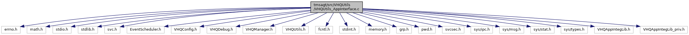

[Data Structures](#nested-classes) \| [Macros](#define-members) \| [Functions](#func-members) \| [Variables](#var-members)

`#include <errno.h>`
`#include <math.h>`
`#include <stdio.h>`
`#include <stdlib.h>`
`#include <svc.h>`
`#include "EventScheduler.h"`
`#include "VHQConfig.h"`
`#include "VHQDebug.h"`
`#include "VHQManager.h"`
`#include "VHQUtils.h"`
`#include <fcntl.h>`
`#include <stdint.h>`
`#include <memory.h>`
`#include <grp.h>`
`#include <pwd.h>`
`#include <svcsec.h>`
`#include <sys/ipc.h>`
`#include <sys/msg.h>`
`#include <sys/stat.h>`
`#include <sys/types.h>`
`#include "VHQAppIntegLib.h"`
`#include "VHQAppIntegLib_priv.h"`

Include dependency graph for VHQUtils_AppInterface.c:

|                 |                                 |
|-----------------|---------------------------------|
| Data Structures |                                 |
| struct          | [appData_t](#structapp_data__t) |

|  |  |
|----|----|
| Macros |  |
| #define  | [VHQ_APP_INFO_REQUEST_PERIOD_DEF](#ab80ee190578653009e637895a0ba0232)   86400 |
| #define  | [MIN_APP_RESPONSE_TIMEOUT](#a115e38fe8473a630881aa2441518462f)   5 |
| #define  | [APP_RESPONSE_RETRY](#a29f988d89f0842052e90c24ae4ac3461)   1 |
| #define  | [APP_RESPONSE_RETRY_DELAY](#ae5732b7842ad8292ae1f37b07dc3eabc)   1 |

|  |  |
|----|----|
| Functions |  |
| <a href="svc__tms_8h.md#a317e53c1d967d8bf7790a855726aab63">tms_apptype_t</a>  | [GetReceiverType](#a412c43cf6ca872179d25ef5ecd0008a7) (int index) |
| void  | [GetRegisteredAppVersion](#a384d3e384c8d3acae2852b0c86d93cf2) (int index, char \*AppVersion) |
| void  | [GetRegisteredAppCustomType](#aaf8fe48955e44cd714561bf4b037ab98) (int index, char \*CustomType) |
| void  | [GetRegisteredAppAddInfo](#ac2cf4ce750d654eaa6eeec00b399ac6d) (int index, char \*AddInfo) |
| void  | [GetRegisteredAppName](#a8e9e609851fe040aa440e51cbe7b0a69) (int i, char \*AppName) |
| int  | [FindUser](#aeb40848c5555a6c851234932adfa8602) (int start_index, char \*user) |
| vhq_result_t  | [RegisterApp](#acca8f73440d65550e78e910887f10c2e) (bool reg, char \*user_name, int event_mask, char \*receiver_name, long pid, bool use_TMS_API, char \*app_pipe_name, <a href="svc__tms_8h.md#a317e53c1d967d8bf7790a855726aab63">tms_apptype_t</a> app_type, char \*app_version, char \*app_customType, char \*app_additionalInfo) |
| vhq_result_t  | [UnRegisterUserApp](#aecf36bf14f3edf020d6c789e38c91942) (char \*user_name, char \*receiver_name) |
| void  | [UnRegisterUserApps](#af373ecc5a615c0dcb7e8fabe7b5abda9) (void) |
| bool  | [AppRegistered](#ae6f81bce62db1e12d96544e33cbfa293) (char \*name) |
| bool  | [GetRecevierUser](#af5c1674f5d6ffd0a129efd283dfa508e) (char \*receiver, char \*user_name) |
| char \*  | [GetRecevierPipeName](#aec66abf72a0f9a4512158abe71ed67b4) (char \*receiver) |
| bool  | [GetAppParameters](#a6ae71becfc2adf53d49128553a23b5fe) (char \*receiver_name, app_param_update_info_t \*param_update_info) |
| bool  | [GetAppParameterFilesHash](#aee4dea66b2140390f8ba96e7000457f8) (char \*receiver_name, app_param_files_t \*ParamFileArray, int ArraySize, uint8 \*num_param_files, bool \*value_based) |
| vhq_result_t  | [ClearAppCustomData](#a45c05f219879015274826b64ddbf2c42) (char \*receiver_name, customAppInfo_t appInfo\[<a href="svc__tms_8h.md#ac8d1ce1f93c7d41105b9eaa7c2eda03a">TMS_MAX_REGISTERED_APPS</a>\]) |
| bool  | [EraseCompleteAppsData](#a8a03fdc6f57a48cf73f90c2dd94dc1e9) (void) |
| void  | [GetAppCustomData](#a4b5fc89a593af86ce9d4c7c07c359a66) (customAppInfo_t appInfo\[<a href="svc__tms_8h.md#ac8d1ce1f93c7d41105b9eaa7c2eda03a">TMS_MAX_REGISTERED_APPS</a>\], uint32 param_mask, bool DIDReqdForKeyExch) |
| bool  | [GetAppParameterFileByName](#a35bf9729ea50e33d6f7bcea8ee24d614) (char \*receiver_name, char \*param_filename, char \*full_filename, uint32 full_filename_len, bool \*remove_file) |
| vhq_result_t  | [PutAppParameterFileByName](#a87bddc827195ac9c4a1d41232c7a2b5b) (char \*receiver_name, char \*param_filename, char \*additional_info, uint32 additional_info_size, dl_file_dl_type_t param_update_type) |
| bool  | [AppActionPerform](#a289523c465c2f340b92354e1f06e61be) (app_action_type_t app_action) |
| vhq_result_t  | [NotifyApps](#ab868f084d7ced3d2cdf1ebdb60b59c01) (int event_mask, char \*filename, int notificationDataInteger, vhq_result_t vhq_result, event_set_id_t event_set_id, event_id_t event_id, bool app_approval_required) |
| void  | [FlushAppIPCs](#a1aa690dd35e0e36c58ea99da201f9ed1) (void) |
| bool  | [AppDelFile](#a1242cfb769daf3076180e45b34a10a22) (char \*receiver_name, char \*filename, char \*additional_info, uint32 additional_info_size) |
| void  | [SetAppState](#a2b6082bd658bcab18741273ed97f8e10) (char \*receiver, int appState) |
| vhq_result_t  | [DoContentCallback_New](#a9662e3623f95cff82e876978e10128da) (char \*user, char \*pszContentFile, char \*pszContentDest, dl_file_dl_type_t eType, char \*additional_info, uint32 additional_info_size) |
| vhq_result_t  | [SendMsgToApp](#ad8f235d4060c43965db1fbe425b8df30) (const char \*receiver, int evtType, int messageID, int result, const char \*fileName, const char \*fileLocation, int eventMask, char \*transactionType, int notificationDataInteger, unsigned char responseExpected, int putFileType) |

|  |  |
|----|----|
| Variables |  |
| pthread_mutex_t  | [appArrayMutex](#a0488b68c064a3854e5f68accadd9a19e) = PTHREAD_MUTEX_INITIALIZER |

## DetailedDescription {#detailed-description}

Some utility functions for application integration

------------------------------------------------------------------------

## DataStructure Documentation {#data-structure-documentation}

## appData_t 

struct appData_t

| Data Fields |  |  |
|----|----|----|
| char | app_additionalInfo\[32\] |  |
| char | app_customType\[32\] |  |
| char | app_pipe_name\[32\] |  |
| int | app_state |  |
| <a href="svc__tms_8h.md#a317e53c1d967d8bf7790a855726aab63">tms_apptype_t</a> | app_type |  |
| char | app_version\[32\] |  |
| uint32 | event_mask |  |
| bool | in_use |  |
| long | pid |  |
| char | receiver_name\[128\] |  |
| bool | use_TMS_API |  |
| char | user_name\[64\] |  |

## MacroDefinition Documentation {#macro-definition-documentation}

## APP_RESPONSE_RETRY 

#define APP_RESPONSE_RETRY   1

## APP_RESPONSE_RETRY_DELAY 

#define APP_RESPONSE_RETRY_DELAY   1

## MIN_APP_RESPONSE_TIMEOUT 

#define MIN_APP_RESPONSE_TIMEOUT   5

## VHQ_APP_INFO_REQUEST_PERIOD_DEF 

#define VHQ_APP_INFO_REQUEST_PERIOD_DEF   86400

## FunctionDocumentation {#function-documentation}

## AppActionPerform() 

bool AppActionPerform

This function sends an event TMS_EVT_DO_TRANSACTION and app action perform type string to application.

**Parameters**

\[in\] **app_action** = app_action_type_t enum

### Returns

TRUE if event is send.

FALSE if event not send.

## AppDelFile() 

bool AppDelFile

This function sends an event TMS_EVT_DEL_FILE to application to delete a file.

**Parameters**

\[in\] **receiver_name** = receiver name of application \[in\] **filename** = filename to be deleted. \[in\] **additional_info** = additional information \[in\] **additional_info_size** = size of additional_info array

### Returns

TRUE if event is send.

FALSE if event not send.

## AppRegistered() 

bool AppRegistered

This function checks if an application with a given receiver name is registered or not.

**Parameters**

\[in\] **name** = receiver name of application.

### Returns

TRUE if application is found

FALSE if application is not found

## ClearAppCustomData() 

vhq_result_t ClearAppCustomData

This function clears the memory for storing parameters of an application.

**Parameters**

\[in\] **receiver_name** = receiver name of application. \[in\] **appInfo** = application parameter information about app with receiver_name in this structure is cleared.

### Returns

vhq_result_t

## DoContentCallback_New() 

vhq_result_t DoContentCallback_New

This function sends an event TMS_EVT_PUT_FILE to application to do content updates.

**Parameters**

\[in\] **user** = user \[in\] **pszContentFile** = download file location \[in\] **pszContentDest** = destination location to copy \[in\] **eType** = dl_file_dl_type_t type of download package \[in\] **additional_info** = contains additional information. Details from application are stored to this array. \[in\] **additional_info_size** = size of additional_info array

### Returns

vhq_result_t

## EraseCompleteAppsData() 

bool EraseCompleteAppsData

This function clears the memory for storing parameters of all the application.

### Returns

bool - TRUE if successful, FALSE if failed

## FindUser() 

int FindUser

This function checks for an application with a given user name in the registered application array.

**Parameters**

\[in\] **start_index** = Starting index of registered application array from where search should start. \[in\] **user** = user name of the application to search for.

### Returns

index of application in registered application array.

-1 if user name not found

## FlushAppIPCs() 

void FlushAppIPCs

## GetAppCustomData() 

void GetAppCustomData

This function checks if the parameters or masks are expired.If expired the function loads appInfo\[\] with new parameters fetched from application. It sends an event TMS_EVT_SET_APP_INFO to application.

**Parameters**

\[in\] **appInfo** = array into which parameters are stored to. \[in\] **param_mask** = application event masks.

### Returns

void

## GetAppParameterFileByName() 

bool GetAppParameterFileByName

This function fetches parameter filename by sending an event TMS_EVT_GET_FILE to application.

**Parameters**

\[in\] **receiver_name** = receiver app name \[in\] **param_filename** = parameter filename \[out\] **full_filename** = full filename from app. \[out\] **full_filename_len** = expected file name length \[out\] **remove_file** = TRUE, if remove file. from app.

### Returns

TRUE if filename received from application.

FALSE if filename not received.

## GetAppParameterFilesHash() 

bool GetAppParameterFilesHash

This function loads application parameters.

**Parameters**

\[in\] **receiver_name** = receiver name of application. \[in\] **ParamFileArray** = structure into which parameters are stored. \[in\] **ArraySize** = array size of structure app_param_files_t \[in\] **num_param_files** = number of parameter files. \[in\] **value_based** = true if parameters are value based

### Returns

TRUE if application parameters is loaded

FALSE if application is not loaded

## GetAppParameters() 

bool GetAppParameters

## GetReceiverType() 

<a href="svc__tms_8h.md#a317e53c1d967d8bf7790a855726aab63">tms_apptype_t</a> GetReceiverType

## GetRecevierPipeName() 

char\* GetRecevierPipeName

## GetRecevierUser() 

bool GetRecevierUser

This function returns the username of a registered application.

**Parameters**

\[in\] **receiver** = receiver name of application. \[out\] **user_name** = user name of application.

### Returns

TRUE if receiver available

## GetRegisteredAppAddInfo() 

void GetRegisteredAppAddInfo

## GetRegisteredAppCustomType() 

void GetRegisteredAppCustomType

## GetRegisteredAppName() 

void GetRegisteredAppName

This function checks for an application at a particular index in the registered application array.

**Parameters**

\[in\] **i** = Index to be checked in registered application array. \[in\] **AppName** = Application name found

### Returns

void

## GetRegisteredAppVersion() 

void GetRegisteredAppVersion

## NotifyApps() 

vhq_result_t NotifyApps

This function sends an event TMS_EVT_NOTIFICATION to application.

**Parameters**

\[in\] **event_mask** = event mask of event which needs to be notified of to app. \[in\] **filename** = filename \[in\] **notificationDataInteger** = \[in\] **hbResult** = vhq_result_t enum type \[in\] **event_set_id** = event_set_id \[in\] **event_id** = event_id \[in\] **app_approval_required** = bool, whether application approval is required.

### Returns

vhq_result_t VHQ_SUCCESS, if success

## PutAppParameterFileByName() 

vhq_result_t PutAppParameterFileByName

This function passes an event TMS_EVT_PUT_FILE to application for an application parameter installation.

**Parameters**

\[in\] **receiver_name** = receiver name of application \[in\] **param_filename** = filename to be passed to application \[in\] **additional_info** = additional information \[in\] **additional_info_size** = sizeof additional_info array \[in\] **param_update_type** = parameter update type of enum dl_file_dl_type_t.

### Returns

vhq_result_t

## RegisterApp() 

vhq_result_t RegisterApp

This function registers or unregisters an application from the registered application array.

**Parameters**

\[in\] **reg** = checks function is for registering or unregistering \[in\] **user_name** = name of the user \[in\] **event_mask** = event mask \[in\] **receiver_name** = receiver name of application \[in\] **pid** = pid of the application \[in\] **use_TMS_API** = uses TMS_API or not \[in\] **app_pipe_name** = pipe name of application

### Returns

struct vhq_result_t

## SendMsgToApp() 

vhq_result_t SendMsgToApp

This function sends messages and events to application.

**Parameters**

\[in\] **receiver** = receiver name of application \[in\] **evtType** = event which should be sent to application \[in\] **messageID** = meesage ID which will be sent to application, and same messageID will be received back from application. \[in\] **result** = tms_status \[in\] **fileName** = filename given to application for processing. \[in\] **fileLocation** = file location \[in\] **eventMask** = mask of events for TMS_EVT_NOTIFICATION event \[in\] **transactionType** = type of transaction to perform in TMS_EVT_DO_TRANSACTION event \[in\] **notificationDataInteger** = \[in\] **responseExpected** = TRUE if a response is expected; FLASE, if not. \[in\] **putFileType** = defines for put file type for TMS_EVT_PUT_FILE event.

### Returns

vhq_result_t VHQ_SUCCESS,if message sent

## SetAppState() 

void SetAppState

This function sets a state to a registered application.

**Parameters**

\[in\] **receiver** = receiver name of application \[in\] **appState** = state of the application- BUSY/FREE/BUSY/POSTPONE.

### Returns

void

## UnRegisterUserApp() 

vhq_result_t UnRegisterUserApp

This function unregisters specified application from the registered application array.

### Returns

void

## UnRegisterUserApps() 

void UnRegisterUserApps

This function unregisters all the application from the registered application array.

### Returns

void

## VariableDocumentation {#variable-documentation}

## appArrayMutex 

pthread_mutex_t appArrayMutex = PTHREAD_MUTEX_INITIALIZER

