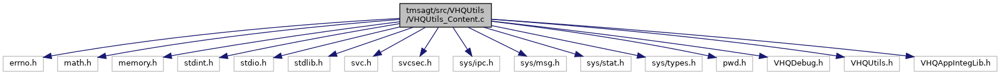

[Data Structures](#nested-classes) \| [Macros](#define-members) \| [Typedefs](#typedef-members) \| [Functions](#func-members)

`#include <errno.h>`
`#include <math.h>`
`#include <memory.h>`
`#include <stdint.h>`
`#include <stdio.h>`
`#include <stdlib.h>`
`#include <svc.h>`
`#include <svcsec.h>`
`#include <sys/ipc.h>`
`#include <sys/msg.h>`
`#include <sys/stat.h>`
`#include <sys/types.h>`
`#include <pwd.h>`
`#include "VHQDebug.h"`
`#include "VHQUtils.h"`
`#include "VHQAppIntegLib.h"`

Include dependency graph for VHQUtils_Content.c:

|                 |                                                          |
|-----------------|----------------------------------------------------------|
| Data Structures |                                                          |
| struct          | <a href="struct__user__cb__t.md">_user_cb_t</a> |

|  |  |
|----|----|
| Macros |  |
| #define  | [MAX_CONTENT_CONSUMERS](#aabe07b905814d93f86cdf3181fb54e45)   16 |
| #define  | [CONTENT_RESPONSE_MAX_DELAY](#aca57f21fafdac229dd4ad3b6cdf6f7fc)   180 |
| #define  | [CONTENT_RESPONSE_RETRY_DELAY](#af81ced33f705a2a1e6292e56f76c944a)   5 |

|  |  |
|----|----|
| Typedefs |  |
| typedef struct <a href="struct__user__cb__t.md">_user_cb_t</a>  | [user_cb_t](#a2e92c350b5106ce04fc71e25292acd86) |

|  |  |
|----|----|
| Functions |  |
| int  | [SetupContentCallback](#a752b21f88516b5a48e378ec662191799) (long client_pid, uid_t user_id, void(\*callback)(char \*ContentData)) |
| int  | [GetContentCallbackRoot](#a87850b224ec88431d69ec79e18263d33) (long \*client_pid, uid_t user_id, void(\*\*callback)(char \*ContentData)) |
| int  | [SetContentResult](#a1c7d765bc7a399573e0eb041bfbb7e50) (uid_t user_id, int content_id, int content_status) |
| int  | [GetContentResultRoot](#a7bb01bd1ea7812cdc824235f38b87886) (uid_t user_id, int content_id, int \*content_status) |
| vhq_result_t  | [DoContentCallback](#ae8b362639ea3278d16c027c3bd949224) (char \*user, char \*pszContentFile, char \*pszContentDest, dl_file_dl_type_t eType) |

## DetailedDescription {#detailed-description}

Some utility functions for content management

## MacroDefinition Documentation {#macro-definition-documentation}

## CONTENT_RESPONSE_MAX_DELAY 

#define CONTENT_RESPONSE_MAX_DELAY   180

## CONTENT_RESPONSE_RETRY_DELAY 

#define CONTENT_RESPONSE_RETRY_DELAY   5

## MAX_CONTENT_CONSUMERS 

#define MAX_CONTENT_CONSUMERS   16

## TypedefDocumentation {#typedef-documentation}

## user_cb_t 

typedef struct <a href="struct__user__cb__t.md">_user_cb_t</a> [user_cb_t](#a2e92c350b5106ce04fc71e25292acd86)

## FunctionDocumentation {#function-documentation}

## DoContentCallback() 

vhq_result_t DoContentCallback

This function sends a content event and passes the download file to app.

**Parameters**

\[in\] **user** = username \[in\] **pszContentFile** = downloaded file \[in\] **pszContentDest** = downloaded destination \[in\] **eType** = file type

### Returns

vhq_result_t VHQ_SUCCESS, if success

## GetContentCallbackRoot() 

int GetContentCallbackRoot

## GetContentResultRoot() 

int GetContentResultRoot

## SetContentResult() 

int SetContentResult

## SetupContentCallback() 

int SetupContentCallback

