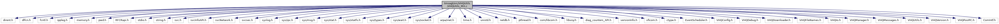

[Data Structures](#nested-classes) \| [Macros](#define-members) \| [Typedefs](#typedef-members) \| [Functions](#func-members) \| [Variables](#var-members)

`#include <dirent.h>`
`#include <dlfcn.h>`
`#include <fcntl.h>`
`#include <ippleg.h>`
`#include <memory.h>`
`#include <pwd.h>`
`#include <RFCRapi.h>`
`#include <stdio.h>`
`#include <string.h>`
`#include <svc.h>`
`#include <svcInfoAPI.h>`
`#include <svcNetwork.h>`
`#include <svcsec.h>`
`#include <syslog.h>`
`#include <sys/ipc.h>`
`#include <sys/msg.h>`
`#include <sys/stat.h>`
`#include <sys/statfs.h>`
`#include <sys/types.h>`
`#include <sys/wait.h>`
`#include <sys/socket.h>`
`#include <arpa/inet.h>`
`#include <time.h>`
`#include <unistd.h>`
`#include <netdb.h>`
`#include <pthread.h>`
`#include "com/libcom.h"`
`#include <libvoy.h>`
`#include "diag_counters_API.h"`
`#include "versionInfo.h"`
`#include <vficom.h>`
`#include <ctype.h>`
`#include "EventScheduler.h"`
`#include "VHQConfig.h"`
`#include "VHQDebug.h"`
`#include "VHQDownloader.h"`
`#include "VHQFileNames.h"`
`#include "VHQIo.h"`
`#include "VHQManager.h"`
`#include "VHQMessages.h"`
`#include "VHQUtils.h"`
`#include "VHQVersion.h"`
`#include "VHQPosIPC.h"`
`#include "ComIntf.h"`

Include dependency graph for VHQUtils_MX.c:



|  |  |
|----|----|
| Data Structures |  |
| struct   | [UNUSED_FILE_INFO](#struct_u_n_u_s_e_d___f_i_l_e___i_n_f_o) |
| struct   | [\_proc_data_t](#struct__proc__data__t) |

|  |  |
|----|----|
| Macros |  |
| #define  | [\_GNU_SOURCE](#a369266c24eacffb87046522897a570d5) |
| #define  | [stricmp](#a4e0be90a3757e352f42612d09a7d1aa5)   strcasecmp |
| #define  | [IP_ADDR_GREP_OUTFILE](#a154df9ed7ee0a1c54ab15c1ea3f56c57)   \"/var/tmp/pc_ip_addr\" |
| #define  | [VCL_PATH](#a4da1f22ac322da5b0d2b33f08233528b)   \"/bin/semtekd\" |
| #define  | [VCL_KMAILMAN_PATH](#a3910e3d4fcf9f5a7159334e530363b44)   \"/home/usr1/kmailman\" |
| #define  | [GREP_EXECUTABLE](#a8ef60112e5183cd1459b32fe1d0a02bf)   \"/bin/grep\" |
| #define  | [GUI_MGR_LIB_FILE](#a85321304e7b4164b923b5e9e47780c00)   \"/home/usr1/lib/libguimgr.so\" |
| #define  | [DIAG_START_FW_MAJ_VER](#a8dc4f36c948b2a971bd9a985a351c9aa)   3 |
| #define  | [DIAG_START_FW_MID_VER](#a1517f7963d7851daf29e02fc1b7d026a)   2 |
| #define  | [DIAG_START_FW_MIN_VER](#a0f090d2ea8454f2602ed387a264d3958)   \"0011\" |
| #define  | [FILE_LIST_EXECUTABLE](#abf2061c6f55688b1790ef910937791d6)   \"/bin/ls\" |
| #define  | [VCL_VERSION_GREP_OUTFILE](#a1d7d890b2d13dea38ae6aa6fe81b63f1)   \"vcl_version_info\" |
| #define  | [VCL_VERSION_GREP_STR](#a32f721e5568611c1fcd4ff6903a6d002)   \"BUILD DATE\" |
| #define  | [VCL_VERSION_HEADER_STR](#a03902f3950313d52db603e66201e32c2)   \"SEMTEKD\" |
| #define  | [VCL_GREP_RESULTS_DELAY_SEC](#a35f518f0a944ce1c6f5b46851f81f688)   10 |
| #define  | [VCL_NAME_STRING](#aa24313cc1d5e3b5572fb0667aefe6296)   \"Verishield Crypto Library\" |
| #define  | [VCL_KMAILMAN_VERSION_GREP_STR](#a36feb9468c30b3cb0da269c1cd126d27)   \"Remote Key Distribution Client\" |
| #define  | [VCL_KMAILMAN_VERSION_HEADER_STR](#ac7c4b54e8c11aa0026dce9961dab14a9)   \"KMAILMAN - Remote Key Distribution Client -\" |
| #define  | [VCL_KMAILMAN_NAME_STRING](#ac450db3fec37badd012a4a75537f7925)   \"Verishield Crypto Library - Mailman\" |
| #define  | [MEM_FREE_SEARCH_STRING](#a8ffaf463441eaca4770a014164142c93)   \"MemFree:\" |
| #define  | [MEM_TOTAL_SEARCH_STRING](#aafafa936266999f3f425d419bf8f8a96)   \"MemTotal:\" |
| #define  | [MEMORY_FILE](#ac67bb9eceaf0f06c8c4c6b409ea3e61f)   \"/proc/meminfo\" |
| #define  | [HANDLE_FILE](#ac08c7b7fd0ea6c8c878eebb7f80ef14b)   \"/proc/sys/fs/file-nr\" |
| #define  | [GREP_FOR_VCL_INFO](#a73a38367007aa4d98f69cd2cce1a6ffb)   0 |
| #define  | [GREP_FOR_KMAILMAN_INFO](#a598918af8d4275547c06a43384d22f66)   1 |
| #define  | [USB_PERIPH_DEVICE_INFO_MAX_TAG_LEN](#a87010e53d3548e6054d6f6e2ecc72689)   32 |
| #define  | [SEARCH_END](#a242552d38e0eafc349b7b8d3d24de403)   \"SEARCH_END\" |
| #define  | [PTP_host](#ac66b6ca5b7157a92bc80987167d0a7db)   \"P-t-P:\" |
| #define  | [Mask](#ad2f88532a222959577ebc7cafd6ea608)   \"Mask:\" |
| #define  | [PACKAGE_SEARCH_STRING](#ab53f9d7066359a8c9bbdab7cd2443196)   \"Package:\" |
| #define  | [PACKAGE_VERSION_SEARCH_STRING](#ac59b0fc334be57b39b8ef0f4f3b460a5)   \"Version:\" |
| #define  | [PACKAGE_SECTION_SEARCH_STRING](#a3b9b0bcd6c80165d5aaa9b740c1d51e3)   \"Section:\" |
| #define  | [PACKAGE_SIZE_SEARCH_STRING](#adbaa254b8457e8d6c3393f32872aec28)   \"Size:\" |
| #define  | [PACKAGE_FILE](#a08a0761418d5be66e58333e88603de36)   \"/ipkg/status\" |
| #define  | [MX_BRIDGE_PATH](#ab1c11e2e4f43e016679bb01440aa2ac7)   \"/home/usr1/MXBridge\" |
| #define  | [MAXNBSCRIPT](#a772eef992d587ba35c0b32f841facbd3)   192 |
| #define  | [DF_EXECUTABLE](#a0a209af4bf22545cc762482a3d950f9f)   \"/bin/df\" |
| #define  | [MNT_SRAM](#a2ae2a674a46a2126a4551adbb2907883)   \"/mnt/sram\" |
| #define  | [MNT_SD](#aa70e192c9d1019724bb2ec112250b3c4)   \"/mnt/SD\" |
| #define  | [PAGES_TO_KB](#a5cf1e2356a2064e2bf44937d94644eff)(n)   (unsigned long)( (n) \<\< page_to_kb_shift ) |
| #define  | [RPT_FULL](#a2909d2d4f3219db8cb7182da97b87c7a)   0x01 |
| #define  | [RPT_CONCISE](#a8e638d2e083998d0801f000d9a1c2b8a)   0x02 |
| #define  | [RPT_XML](#a40575fb78f137bba5bdc3efca92982fc)   0x04 |
| #define  | [RPT_ALL](#a33b481353aa3d7d8dbf3ded0f059235d)   0xff |
| #define  | [TWENTY_FOUR_HOURS](#ad3552b5729b287034c4db2fe333c8492)   (60 \* 60 \* 24) |
| #define  | [PROC_DIRECTORY](#a3377a5f6fe537f0473ab27e5e5d592f4)   \"/proc/\" |
| #define  | [PROC_CMD_LINE](#ad1e08b3a5cfd7bb75497969e8d5e0e5f)   \"/cmdline\" |
| #define  | [CASE_SENSITIVE](#a6094f5f4a8aa099faa6d80b4f020927b)   1 |
| #define  | [CASE_INSENSITIVE](#a73dbf9d86ec7a319f372cb1ae227a54b)   0 |
| #define  | [EXACT_MATCH](#a06fe2ca7e49ff16440f06620f863deaf)   1 |
| #define  | [INEXACT_MATCH](#a3c2153d6cb79c7fe7e7c3ebac71c9d99)   0 |
| #define  | [OS_CONFIG_FILE_OUT_NAME](#aca30f3c6379d6656d2f58274f7f6536a)   \"/tmp/OSConfigFiles.tgz\" |
| #define  | [OS_LOG_FILE_OUT_NAME](#ad322e57e6363a973b4fe1c99907c51db)   \"/tmp/OSLogs.tgz\" |
| #define  | [USR_LOG_FILE_OUT_NAME](#ae162cb1c325e323963b1c1695a94f187)   \"/tmp/UsrLogs.tgz\" |
| #define  | [HTTPS_TYPE](#a4761b3319c0b42fe0f1fc0f53a888fb1)   \"https://\" |
| #define  | [PING_REQ_STR](#a15d21cc50cd6ddff52b07dbf83eaa5f1)   \"ping connection\" |
| #define  | [RESET_REQ_STR](#a2124937bd815b1cc9995ab4c40317292)   \"reset\" |
| #define  | [MAX_CRASH_CLEANUP_STACK_ENTRIES](#aa1a092565fc84c322416a05b3de9257d)   10 |

|  |  |
|----|----|
| Typedefs |  |
| typedef void(\*  | [Event_Callback_Function](#a472f11a6dfe63c3ce4ade90e70d9ea63)) (char \*pszFormName, int iControlID, void \*pData) |
| typedef struct [\_proc_data_t](#struct__proc__data__t)  | [proc_data_t](#aa7f4551484c02b1e86732c48a336e6c6) |

|  |  |
|----|----|
| Functions |  |
| int  | [test_encrypt](#abb0bf342b138e0182e610f0f78bb9acc) (int, char \*, char \*, int, char \*) |
| short  | [CMDiag](#a62057181e4cafb5faf0b2370047da947) (short diagOption, char \*data, short \*dataLength) |
| bool  | [GetProcessRAMData](#a832110186f01ab60dcf3bfb3a796eaf4) (char \*process_status_file, int \*MemUsed) |
| void  | [connectSerialPPP](#ab7ad94ee94c074b52f9f539ea1080c06) (char \*pszPort, char \*pszOptions, int iBaud) |
| void  | [CleanupUnusedFiles](#a0d2ba746547d041b0b150ba315983355) (void) |
| bool  | [GrepForPCipaddr](#ae80dd10c46c8e2c800218380186edb7b) (char \*pszAddr) |
| int  | [GetBatteryStatus](#ace5c0bcfaa8cca77cf120758bd070108) (int \*voltage) |
| int  | [GetModelNumber](#a5e795a39184979255cff8cb5a6e6d82e) (char \*pszModelNum, uint32 iModelNumBufLen) |
| int  | [GetCommonName](#a293493a71a085e5bf15486208ef5ac47) (char \*pszCommonName, int iCommonNameBufLen) |
| int  | [getPCipAddr](#acc116337f88cb6cede8fd823477d5f41) (char \*pszAddr) |
| int  | [internal_GetIPAddress](#afb24d619e9278eec2d27a3c03376d1c3) (char \*pszIPAddress, int iIPAddressBufLen) |
| int  | [internal_GetMACAddress](#a07cc05691d9ade5eac44bf6759c347fb) (char \*pszMACAddress, int iMACAddressBufLen) |
| void  | [GetNetworkConfig](#a243a26c1daef3abcc5f6ebd94860e12e) (device_profile_t \*devProfile) |
| int  | [GetSerialNumber](#a92bad009043650285ff7c40ff0166473) (char \*pszSerialNumber) |
| bool  | [GetUsrAppInfo](#adcfe7e11b0a87a796eb112de686f3265) (list_head_t \*UsrAppData) |
| bool  | [GetApplications](#af4e37bd238dec8630b85a1da90e71f0d) (list_head_t \*ApplicationList) |
| void  | [CleanApplicationsList](#a1d334dcba9d6ad140a3238be0b0be87d) (list_head_t \*ApplicationList) |
| void \*  | [app_main](#a35ddb4e0776cf986ca13ad8b0c7a4eed) (void \*pData) |
| bool  | [GetDeviceProfile](#aa5f17f0de5206ff43d09e008891c5369) (device_profile_t \*dev_profile) |
| bool  | [GetDiagCounters](#afbb836f4cac27d4c39199752b9834e1e) (diag_counter_t \*CountersArray, uint8 ArraySize, uint16 \*num_counters) |
| bool  | [GetHandleInfo](#adfcec2a435d671e00b5e209af78f0228) (int \*OpenHandles, int \*MaxHandles) |
| bool  | [ReadProcData](#a235e244ae2c42f5fafbd5ada54234e46) (char \*stat_file, char proc_name\[MAX_PROCESS_NAME_LENGTH\], unsigned long \*utime, long \*stime) |
| bool  | [GetProcessInfo](#a3ce9ee84c24c11c3e3e2eea2c9b3d612) (process_info_t \*ProcessArray, uint8 ArraySize, uint16 \*num_processes) |
| bool  | [CreateFileListing](#a2653d8f8c9c9315a92bead87e16f3218) (char \*OutputFileName, char \*directory) |
| vhq_result_t  | [GetKeyDataLegacy](#acb084ca281a56d4621d8f31bfaa94f27) (key_data_t \*KeyDataArray, uint8 \*ArraySize, uint8 MaxKeys) |
| bool  | [GetMemoryProfile](#a5ee919985d35efbeccbc9eb3a8c6ee2c) (memory_profile_t \*mem_profile) |
| bool  | [GetRAMData](#a56d7eb03eeccdef1e304c981cc0ab846) (int \*totalRAM, int \*freeRAM) |
| int  | [GetMPCStatus](#a2b4331c99dfc92c13b84bb2bd5e9c033) () |
| vhq_result_t  | [GetVSRCertTree](#abffcea0c50ae7523e165d2bab15d1491) (vsr_cert_data_t \*VSRCertArray, uint8 \*NumVSRCerts) |
| bool  | [GetVCLInfo](#a290d293efe7e1e9b0b48b8650f408147) (vcl_info_t \*VCLInfo, bool bDoDiags) |
| bool  | [DailyBatteryCheckReqd](#a882efd66d82f042388c1721124ebb59c) (void) |
| bool  | [DailyTSCalLogReqd](#ad7f9030574e1e3ccfb2395d835ccd895) (void) |
| event_mask_t  | [CheckForEvents](#a49f508a12c9cdf15b92756893aae1158) (event_mask_t event_mask, device_event_content_t \*device_event_content) |
| int  | [GenerateInvalidCommID](#abebd428d8dca487f95fe462daad70ad7) (void) |
| void  | [WriteResponseToTempFile](#a184a710836df3fd4fe0c736bcd7add0c) (char \*file_name, VHQResponseSendMsg \*responseMsg) |
| int  | [IsNumeric](#a288fa31f4a817d82e9758d7f3a594a23) (const char \*ccharptr_CharacterList) |
| int  | [strcmp_Wrapper](#a2ef85aa7cb5bb0d2d11470ddae08f825) (const char \*s1, const char \*s2, int intCaseSensitive) |
| int  | [strstr_Wrapper](#ad260a45bc1876fd3d4fb6ecb88657934) (const char \*haystack, const char \*needle, int intCaseSensitive) |
| pid_t  | [GetPIDbyName](#a9335509246101f38cb588271517efa31) (const char \*cchrptr_ProcessName, int intCaseSensitiveness, int intExactMatch, int \*piCount) |
| void  | [CheckForInstance](#a903eda61b8fd928acb79935771c55393) (char \*AppName) |
| uint32  | [GetMessageID](#ab5de5714c8738f14d87254c993f770b5) (int comm_id, uint32 rx_msg_id, const char \*operation_id, bool comm_id_closed) |
| time_t  | [GetRTC](#aa819f99d2520a9f0c6116e9f229991b5) (void) |
| int  | [RebootDevice](#a7b9587b0eee192b1ae69a3266e2f7e0f) (event_set_id_t event_set_id, event_id_t event_id, bool app_approval_required) |
| vhq_result_t  | [RestartApp](#a566ca6bfb27bc7a0d6165c4a96a6f3d9) (event_set_id_t event_set_id, event_id_t event_id, bool app_approval_required) |
| vhq_result_t  | [ProcessAction](#ac36a1fcec555ea4eb60beca93beffccc) (term_act_content_t \*action_content, int comm_id, int message_id, int op_set_id, char \*operation_id, srv_msg_type_t srv_msg_type, srv_op_type_t srv_op_type, event_set_id_t event_set_id, event_id_t event_id, bool continuation_required, bool app_approval_required) |
| vhq_result_t  | [ProcessDelFile](#a66248ea9268361c7c1132c970b388c3f) (del_file_content_t \*del_file_content, char \*additional_info, uint32 additional_info_size) |
| int  | [CopyFileAsRoot](#a40a9ba8618554b9087e120e2e5548b31) (const char \*pszSrc, const char \*pszDest) |
| void  | [TarFiles](#af98eab60ed1694afd627c5602da2b530) (const char \*filesPath, const char \*outputFile) |
| bool  | [VHQRootGetFileList](#ac4659c30d781024246c693597ca3e4ea) (file_list_t list_type, char \*OutFileName, int OutFileNameSize) |
| bool  | [VHQGetFileList](#a8053649cc2aee643b8e28179059273e9) (file_list_t list_type, char \*OutFileName, int OutFileNameSize) |
| bool  | [VHQScreenCapture](#a31f0b7d6e8c2797268ef2fce20aa7c71) (char \*outfile) |
| bool  | [GetHostName](#a70e95f0a98f1aa43d9a2fb8318cd6a21) (char \*szStrHost) |
| void  | [VerifyConnection](#a8267abafa922cbd6c4703b00ef32c483) () |
| int  | [check4pppd](#a9d9ec147fd9fccbdd56065a66833d693) (void) |
| int  | [PosAgentResetPeer](#a76e7e15eb799a21dd4db7649e7bc6c8a) (void) |
| int  | [PosAgentPeerPingServer](#aba2715e2a0d2626ad4d39a4ad5d06287) (char \*pszIpAddr, char \*pszPOSagentVer, char \*pszPOSOsVer, int iBufLen) |
| void  | [WaitForAppRegistration](#ab96c005614ad619678bf11b0c9c09747) (void) |
| bool  | [getManfactureDate](#a1cba62d0c38a42cab79511c62c793f52) (char \*manufacture_date_string, int buf_size) |
| char \*  | [os_basename](#a135db9808bd88be3f705927cba4b1ffe) (const char \*path) |
| void  | [crash_cleanup_push](#a6a536e596979226989c2075cb87dacb3) (void(\*routine)()) |
| void  | [crash_cleanup_pop](#ae094c69fa8d20a63a736bcb36addb226) (int execute) |
| void  | [crash_cleanup_popall](#a74cdfe1570409e25045ea838ec14271a) () |
| uint32  | [GetParamUpdateFileNum](#a2e80d8ba5c2dcc9fc0565a83ad1b7537) (void) |
| void  | [ResetParamUpdateFileSearch](#a252a7f453c08981597e0cec77c98aa46) (void) |
| char \*  | [GetNextParamUpdateFile](#af94338a66cdaa3b026378acb97d8b397) (char \*cur_file_name) |
| bool  | [is_temp_dl_file](#a3362cf45c084229cdabe369e72251f34) (char \*fn) |
| void  | [RemoveFailedMessages](#a15e9fcf3bca1afad063dc1d1999c0617) (void) |

|  |  |
|----|----|
| Variables |  |
| VHQPOS_INFO  | [g_sPosInfo](#ae5ac8e73aef001dba188c963134da19b) |
| bool  | [g_bPosInfoInited](#a50fe83de2b5ce7946c398c16cd515d81) = FALSE |
| [UNUSED_FILE_INFO](#struct_u_n_u_s_e_d___f_i_l_e___i_n_f_o)  | [unused_files](#a3a6a1fe32f8055fa03de252913bbf404) \[\] |
| list_head_t \*  | [\_local_ApplicationList](#ae76f167c818066a2c853a3e0b6a1aef5) |
| [Event_Callback_Function](#a472f11a6dfe63c3ce4ade90e70d9ea63)  | [cb_Functions](#a555d97bf7c4cf5922b276b5095ae334c) \[\] = { 0, } |

## DetailedDescription {#detailed-description}

Some platform dependent utility functions

------------------------------------------------------------------------

## DataStructure Documentation {#data-structure-documentation}

## UNUSED_FILE_INFO <a href="#struct_u_n_u_s_e_d___f_i_l_e___i_n_f_o" id="struct_u_n_u_s_e_d___f_i_l_e___i_n_f_o"></a>

<p>struct UNUSED_FILE_INFO</p>

| Data Fields |                |     |
|-------------|----------------|-----|
| bool        | exact_match    |     |
| char        | filename\[32\] |     |
| char        | path\[32\]     |     |

## \_proc_data_t <a href="#struct__proc__data__t" id="struct__proc__data__t"></a>

<p>struct \_proc_data_t</p>

| Data Fields   |                                 |     |
|---------------|---------------------------------|-----|
| char          | name\[MAX_PROCESS_NAME_LENGTH\] |     |
| int           | pid                             |     |
| unsigned long | stime1                          |     |
| unsigned long | stime2                          |     |
| unsigned long | utime1                          |     |
| unsigned long | utime2                          |     |

## MacroDefinition Documentation {#macro-definition-documentation}

## \_GNU_SOURCE <a href="#a369266c24eacffb87046522897a570d5" id="a369266c24eacffb87046522897a570d5"></a>

<p>#define \_GNU_SOURCE</p>

## CASE_INSENSITIVE <a href="#a73dbf9d86ec7a319f372cb1ae227a54b" id="a73dbf9d86ec7a319f372cb1ae227a54b"></a>

<p>#define CASE_INSENSITIVE   0</p>

## CASE_SENSITIVE <a href="#a6094f5f4a8aa099faa6d80b4f020927b" id="a6094f5f4a8aa099faa6d80b4f020927b"></a>

<p>#define CASE_SENSITIVE   1</p>

## DF_EXECUTABLE <a href="#a0a209af4bf22545cc762482a3d950f9f" id="a0a209af4bf22545cc762482a3d950f9f"></a>

<p>#define DF_EXECUTABLE   \"/bin/df\"</p>

## DIAG_START_FW_MAJ_VER <a href="#a8dc4f36c948b2a971bd9a985a351c9aa" id="a8dc4f36c948b2a971bd9a985a351c9aa"></a>

<p>#define DIAG_START_FW_MAJ_VER   3</p>

## DIAG_START_FW_MID_VER <a href="#a1517f7963d7851daf29e02fc1b7d026a" id="a1517f7963d7851daf29e02fc1b7d026a"></a>

<p>#define DIAG_START_FW_MID_VER   2</p>

## DIAG_START_FW_MIN_VER <a href="#a0f090d2ea8454f2602ed387a264d3958" id="a0f090d2ea8454f2602ed387a264d3958"></a>

<p>#define DIAG_START_FW_MIN_VER   \"0011\"</p>

## EXACT_MATCH <a href="#a06fe2ca7e49ff16440f06620f863deaf" id="a06fe2ca7e49ff16440f06620f863deaf"></a>

<p>#define EXACT_MATCH   1</p>

## FILE_LIST_EXECUTABLE <a href="#abf2061c6f55688b1790ef910937791d6" id="abf2061c6f55688b1790ef910937791d6"></a>

<p>#define FILE_LIST_EXECUTABLE   \"/bin/ls\"</p>

## GREP_EXECUTABLE <a href="#a8ef60112e5183cd1459b32fe1d0a02bf" id="a8ef60112e5183cd1459b32fe1d0a02bf"></a>

<p>#define GREP_EXECUTABLE   \"/bin/grep\"</p>

## GREP_FOR_KMAILMAN_INFO <a href="#a598918af8d4275547c06a43384d22f66" id="a598918af8d4275547c06a43384d22f66"></a>

<p>#define GREP_FOR_KMAILMAN_INFO   1</p>

## GREP_FOR_VCL_INFO <a href="#a73a38367007aa4d98f69cd2cce1a6ffb" id="a73a38367007aa4d98f69cd2cce1a6ffb"></a>

<p>#define GREP_FOR_VCL_INFO   0</p>

## GUI_MGR_LIB_FILE <a href="#a85321304e7b4164b923b5e9e47780c00" id="a85321304e7b4164b923b5e9e47780c00"></a>

<p>#define GUI_MGR_LIB_FILE   \"/home/usr1/lib/libguimgr.so\"</p>

## HANDLE_FILE <a href="#ac08c7b7fd0ea6c8c878eebb7f80ef14b" id="ac08c7b7fd0ea6c8c878eebb7f80ef14b"></a>

<p>#define HANDLE_FILE   \"/proc/sys/fs/file-nr\"</p>

## HTTPS_TYPE <a href="#a4761b3319c0b42fe0f1fc0f53a888fb1" id="a4761b3319c0b42fe0f1fc0f53a888fb1"></a>

<p>#define HTTPS_TYPE   \"https://\"</p>

## INEXACT_MATCH <a href="#a3c2153d6cb79c7fe7e7c3ebac71c9d99" id="a3c2153d6cb79c7fe7e7c3ebac71c9d99"></a>

<p>#define INEXACT_MATCH   0</p>

## IP_ADDR_GREP_OUTFILE <a href="#a154df9ed7ee0a1c54ab15c1ea3f56c57" id="a154df9ed7ee0a1c54ab15c1ea3f56c57"></a>

<p>#define IP_ADDR_GREP_OUTFILE   \"/var/tmp/pc_ip_addr\"</p>

## Mask <a href="#ad2f88532a222959577ebc7cafd6ea608" id="ad2f88532a222959577ebc7cafd6ea608"></a>

<p>#define Mask   \"Mask:\"</p>

## MAX_CRASH_CLEANUP_STACK_ENTRIES <a href="#aa1a092565fc84c322416a05b3de9257d" id="aa1a092565fc84c322416a05b3de9257d"></a>

<p>#define MAX_CRASH_CLEANUP_STACK_ENTRIES   10</p>

## MAXNBSCRIPT <a href="#a772eef992d587ba35c0b32f841facbd3" id="a772eef992d587ba35c0b32f841facbd3"></a>

<p>#define MAXNBSCRIPT   192</p>

## MEM_FREE_SEARCH_STRING <a href="#a8ffaf463441eaca4770a014164142c93" id="a8ffaf463441eaca4770a014164142c93"></a>

<p>#define MEM_FREE_SEARCH_STRING   \"MemFree:\"</p>

## MEM_TOTAL_SEARCH_STRING <a href="#aafafa936266999f3f425d419bf8f8a96" id="aafafa936266999f3f425d419bf8f8a96"></a>

<p>#define MEM_TOTAL_SEARCH_STRING   \"MemTotal:\"</p>

## MEMORY_FILE <a href="#ac67bb9eceaf0f06c8c4c6b409ea3e61f" id="ac67bb9eceaf0f06c8c4c6b409ea3e61f"></a>

<p>#define MEMORY_FILE   \"/proc/meminfo\"</p>

## MNT_SD <a href="#aa70e192c9d1019724bb2ec112250b3c4" id="aa70e192c9d1019724bb2ec112250b3c4"></a>

<p>#define MNT_SD   \"/mnt/SD\"</p>

## MNT_SRAM <a href="#a2ae2a674a46a2126a4551adbb2907883" id="a2ae2a674a46a2126a4551adbb2907883"></a>

<p>#define MNT_SRAM   \"/mnt/sram\"</p>

## MX_BRIDGE_PATH <a href="#ab1c11e2e4f43e016679bb01440aa2ac7" id="ab1c11e2e4f43e016679bb01440aa2ac7"></a>

<p>#define MX_BRIDGE_PATH   \"/home/usr1/MXBridge\"</p>

## OS_CONFIG_FILE_OUT_NAME <a href="#aca30f3c6379d6656d2f58274f7f6536a" id="aca30f3c6379d6656d2f58274f7f6536a"></a>

<p>#define OS_CONFIG_FILE_OUT_NAME   \"/tmp/OSConfigFiles.tgz\"</p>

## OS_LOG_FILE_OUT_NAME <a href="#ad322e57e6363a973b4fe1c99907c51db" id="ad322e57e6363a973b4fe1c99907c51db"></a>

<p>#define OS_LOG_FILE_OUT_NAME   \"/tmp/OSLogs.tgz\"</p>

## PACKAGE_FILE <a href="#a08a0761418d5be66e58333e88603de36" id="a08a0761418d5be66e58333e88603de36"></a>

<p>#define PACKAGE_FILE   \"/ipkg/status\"</p>

## PACKAGE_SEARCH_STRING <a href="#ab53f9d7066359a8c9bbdab7cd2443196" id="ab53f9d7066359a8c9bbdab7cd2443196"></a>

<p>#define PACKAGE_SEARCH_STRING   \"Package:\"</p>

## PACKAGE_SECTION_SEARCH_STRING <a href="#a3b9b0bcd6c80165d5aaa9b740c1d51e3" id="a3b9b0bcd6c80165d5aaa9b740c1d51e3"></a>

<p>#define PACKAGE_SECTION_SEARCH_STRING   \"Section:\"</p>

## PACKAGE_SIZE_SEARCH_STRING <a href="#adbaa254b8457e8d6c3393f32872aec28" id="adbaa254b8457e8d6c3393f32872aec28"></a>

<p>#define PACKAGE_SIZE_SEARCH_STRING   \"Size:\"</p>

## PACKAGE_VERSION_SEARCH_STRING <a href="#ac59b0fc334be57b39b8ef0f4f3b460a5" id="ac59b0fc334be57b39b8ef0f4f3b460a5"></a>

<p>#define PACKAGE_VERSION_SEARCH_STRING   \"Version:\"</p>

## PAGES_TO_KB <a href="#a5cf1e2356a2064e2bf44937d94644eff" id="a5cf1e2356a2064e2bf44937d94644eff"></a>

<p>#define PAGES_TO_KB</p>

## PING_REQ_STR <a href="#a15d21cc50cd6ddff52b07dbf83eaa5f1" id="a15d21cc50cd6ddff52b07dbf83eaa5f1"></a>

<p>#define PING_REQ_STR   \"ping connection\"</p>

## PROC_CMD_LINE <a href="#ad1e08b3a5cfd7bb75497969e8d5e0e5f" id="ad1e08b3a5cfd7bb75497969e8d5e0e5f"></a>

<p>#define PROC_CMD_LINE   \"/cmdline\"</p>

## PROC_DIRECTORY <a href="#a3377a5f6fe537f0473ab27e5e5d592f4" id="a3377a5f6fe537f0473ab27e5e5d592f4"></a>

<p>#define PROC_DIRECTORY   \"/proc/\"</p>

## PTP_host <a href="#ac66b6ca5b7157a92bc80987167d0a7db" id="ac66b6ca5b7157a92bc80987167d0a7db"></a>

<p>#define PTP_host   \"P-t-P:\"</p>

## RESET_REQ_STR <a href="#a2124937bd815b1cc9995ab4c40317292" id="a2124937bd815b1cc9995ab4c40317292"></a>

<p>#define RESET_REQ_STR   \"reset\"</p>

## RPT_ALL <a href="#a33b481353aa3d7d8dbf3ded0f059235d" id="a33b481353aa3d7d8dbf3ded0f059235d"></a>

<p>#define RPT_ALL   0xff</p>

## RPT_CONCISE <a href="#a8e638d2e083998d0801f000d9a1c2b8a" id="a8e638d2e083998d0801f000d9a1c2b8a"></a>

<p>#define RPT_CONCISE   0x02</p>

## RPT_FULL <a href="#a2909d2d4f3219db8cb7182da97b87c7a" id="a2909d2d4f3219db8cb7182da97b87c7a"></a>

<p>#define RPT_FULL   0x01</p>

## RPT_XML <a href="#a40575fb78f137bba5bdc3efca92982fc" id="a40575fb78f137bba5bdc3efca92982fc"></a>

<p>#define RPT_XML   0x04</p>

## SEARCH_END <a href="#a242552d38e0eafc349b7b8d3d24de403" id="a242552d38e0eafc349b7b8d3d24de403"></a>

<p>#define SEARCH_END   \"SEARCH_END\"</p>

## stricmp <a href="#a4e0be90a3757e352f42612d09a7d1aa5" id="a4e0be90a3757e352f42612d09a7d1aa5"></a>

<p>#define stricmp   strcasecmp</p>

## TWENTY_FOUR_HOURS <a href="#ad3552b5729b287034c4db2fe333c8492" id="ad3552b5729b287034c4db2fe333c8492"></a>

<p>#define TWENTY_FOUR_HOURS   (60 \* 60 \* 24)</p>

## USB_PERIPH_DEVICE_INFO_MAX_TAG_LEN <a href="#a87010e53d3548e6054d6f6e2ecc72689" id="a87010e53d3548e6054d6f6e2ecc72689"></a>

<p>#define USB_PERIPH_DEVICE_INFO_MAX_TAG_LEN   32</p>

## USR_LOG_FILE_OUT_NAME <a href="#ae162cb1c325e323963b1c1695a94f187" id="ae162cb1c325e323963b1c1695a94f187"></a>

<p>#define USR_LOG_FILE_OUT_NAME   \"/tmp/UsrLogs.tgz\"</p>

## VCL_GREP_RESULTS_DELAY_SEC <a href="#a35f518f0a944ce1c6f5b46851f81f688" id="a35f518f0a944ce1c6f5b46851f81f688"></a>

<p>#define VCL_GREP_RESULTS_DELAY_SEC   10</p>

## VCL_KMAILMAN_NAME_STRING <a href="#ac450db3fec37badd012a4a75537f7925" id="ac450db3fec37badd012a4a75537f7925"></a>

<p>#define VCL_KMAILMAN_NAME_STRING   \"Verishield Crypto Library - Mailman\"</p>

## VCL_KMAILMAN_PATH <a href="#a3910e3d4fcf9f5a7159334e530363b44" id="a3910e3d4fcf9f5a7159334e530363b44"></a>

<p>#define VCL_KMAILMAN_PATH   \"/home/usr1/kmailman\"</p>

## VCL_KMAILMAN_VERSION_GREP_STR <a href="#a36feb9468c30b3cb0da269c1cd126d27" id="a36feb9468c30b3cb0da269c1cd126d27"></a>

<p>#define VCL_KMAILMAN_VERSION_GREP_STR   \"Remote Key Distribution Client\"</p>

## VCL_KMAILMAN_VERSION_HEADER_STR <a href="#ac7c4b54e8c11aa0026dce9961dab14a9" id="ac7c4b54e8c11aa0026dce9961dab14a9"></a>

<p>#define VCL_KMAILMAN_VERSION_HEADER_STR   \"KMAILMAN - Remote Key Distribution Client -\"</p>

## VCL_NAME_STRING <a href="#aa24313cc1d5e3b5572fb0667aefe6296" id="aa24313cc1d5e3b5572fb0667aefe6296"></a>

<p>#define VCL_NAME_STRING   \"Verishield Crypto Library\"</p>

## VCL_PATH <a href="#a4da1f22ac322da5b0d2b33f08233528b" id="a4da1f22ac322da5b0d2b33f08233528b"></a>

<p>#define VCL_PATH   \"/bin/semtekd\"</p>

## VCL_VERSION_GREP_OUTFILE <a href="#a1d7d890b2d13dea38ae6aa6fe81b63f1" id="a1d7d890b2d13dea38ae6aa6fe81b63f1"></a>

<p>#define VCL_VERSION_GREP_OUTFILE   \"vcl_version_info\"</p>

## VCL_VERSION_GREP_STR <a href="#a32f721e5568611c1fcd4ff6903a6d002" id="a32f721e5568611c1fcd4ff6903a6d002"></a>

<p>#define VCL_VERSION_GREP_STR   \"BUILD DATE\"</p>

## VCL_VERSION_HEADER_STR <a href="#a03902f3950313d52db603e66201e32c2" id="a03902f3950313d52db603e66201e32c2"></a>

<p>#define VCL_VERSION_HEADER_STR   \"SEMTEKD\"</p>

## TypedefDocumentation {#typedef-documentation}

## Event_Callback_Function <a href="#a472f11a6dfe63c3ce4ade90e70d9ea63" id="a472f11a6dfe63c3ce4ade90e70d9ea63"></a>

<p>typedef void(\* Event_Callback_Function) (char \*pszFormName, int iControlID, void \*pData)</p>

## proc_data_t <a href="#aa7f4551484c02b1e86732c48a336e6c6" id="aa7f4551484c02b1e86732c48a336e6c6"></a>

<p>typedef struct [\_proc_data_t](#struct__proc__data__t) [proc_data_t](#aa7f4551484c02b1e86732c48a336e6c6)</p>

## FunctionDocumentation {#function-documentation}

## app_main() <a href="#a35ddb4e0776cf986ca13ad8b0c7a4eed" id="a35ddb4e0776cf986ca13ad8b0c7a4eed"></a>

<p>void\* app_main</p>

## check4pppd() <a href="#a9d9ec147fd9fccbdd56065a66833d693" id="a9d9ec147fd9fccbdd56065a66833d693"></a>

<p>int check4pppd</p>

## CheckForEvents() <a href="#a49f508a12c9cdf15b92756893aae1158" id="a49f508a12c9cdf15b92756893aae1158"></a>

<p>event_mask_t CheckForEvents</p>

Function checks for different mask values to send the information to server.

**Parameters**

\[in\] **event_mask** = event mask

### Returns

event mask

## CheckForInstance() <a href="#a903eda61b8fd928acb79935771c55393" id="a903eda61b8fd928acb79935771c55393"></a>

<p>void CheckForInstance</p>

This function checks for number of instances with same PID.

**Parameters**

\[in\] **AppName** = Application name.

### Returns

void

## CleanApplicationsList() <a href="#a1d334dcba9d6ad140a3238be0b0be87d" id="a1d334dcba9d6ad140a3238be0b0be87d"></a>

<p>void CleanApplicationsList</p>

Function clears the application list after sending to server.

**Parameters**

\[out\] **ApplicationList** = pointer to application data. \[in\] **ArraySize** = maximum number of applications

### Returns

TRUE, if success.

## CleanupUnusedFiles() <a href="#a0d2ba746547d041b0b150ba315983355" id="a0d2ba746547d041b0b150ba315983355"></a>

<p>void CleanupUnusedFiles</p>

This cleans up an unused file in a given location. A file with an exact match or a partial match can be removed.

### Returns

void

## CMDiag() <a href="#a62057181e4cafb5faf0b2370047da947" id="a62057181e4cafb5faf0b2370047da947"></a>

<p>short CMDiag</p>

## connectSerialPPP() <a href="#ab7ad94ee94c074b52f9f539ea1080c06" id="ab7ad94ee94c074b52f9f539ea1080c06"></a>

<p>void connectSerialPPP</p>

## CopyFileAsRoot() <a href="#a40a9ba8618554b9087e120e2e5548b31" id="a40a9ba8618554b9087e120e2e5548b31"></a>

<p>int CopyFileAsRoot</p>

Function copies a file from source to destination.

**Parameters**

\[out\] **pszSrc** = source file \[out\] **pszDest** = destination file.

### Returns

0 if copied.

## crash_cleanup_pop() <a href="#ae094c69fa8d20a63a736bcb36addb226" id="ae094c69fa8d20a63a736bcb36addb226"></a>

<p>void crash_cleanup_pop</p>

This function is similar to pthread_cleanup_pop() but delivered to unregister callback which will be processed once application receives SIGSEGV.

**Parameters**

\[in\] **execute** = if non-zero invokes routine.

### Returns

void

## crash_cleanup_popall() <a href="#a74cdfe1570409e25045ea838ec14271a" id="a74cdfe1570409e25045ea838ec14271a"></a>

<p>void crash_cleanup_popall</p>

This function is similar to pthread_cleanup_pop() but delivered to unregister and invoke all callbacks once application receives SIGSEGV.

### Returns

void

## crash_cleanup_push() <a href="#a6a536e596979226989c2075cb87dacb3" id="a6a536e596979226989c2075cb87dacb3"></a>

<p>void crash_cleanup_push</p>

This function is similar to pthread_cleanup_push() but delivered to register callback which will be processed once application receives SIGSEGV.

**Parameters**

\[in\] **routine** = pointer to callback.

### Returns

void

## CreateFileListing() <a href="#a2653d8f8c9c9315a92bead87e16f3218" id="a2653d8f8c9c9315a92bead87e16f3218"></a>

<p>bool CreateFileListing</p>

This function lists the files in a directory.

**Parameters**

\[out\] **OutputFileName** = output filename to which directory files should be copied. \[in\] **directory** = name of the directory from where files should be listed.

### Returns

TRUE, if success; FALSE, otherwise.

## DailyBatteryCheckReqd() <a href="#a882efd66d82f042388c1721124ebb59c" id="a882efd66d82f042388c1721124ebb59c"></a>

<p>bool DailyBatteryCheckReqd</p>

Function logs the daily battery check, each time it is done.

### Returns

TRUE, if battery check done.

## DailyTSCalLogReqd() <a href="#ad7f9030574e1e3ccfb2395d835ccd895" id="ad7f9030574e1e3ccfb2395d835ccd895"></a>

<p>bool DailyTSCalLogReqd</p>

Function logs the TS caliberation time, each time it is done.

### Returns

TRUE, if TS caliberation done.

## GenerateInvalidCommID() <a href="#abebd428d8dca487f95fe462daad70ad7" id="abebd428d8dca487f95fe462daad70ad7"></a>

<p>int GenerateInvalidCommID</p>

## GetApplications() <a href="#af4e37bd238dec8630b85a1da90e71f0d" id="af4e37bd238dec8630b85a1da90e71f0d"></a>

<p>bool GetApplications</p>

Function gather the application data to send to server.

**Parameters**

\[out\] **ApplicationList** = pointer to application data. \[in\] **ArraySize** = maximum number of applications \[out\] **num_apps** = number of applications

### Returns

TRUE, if success.

## GetBatteryStatus() <a href="#ace5c0bcfaa8cca77cf120758bd070108" id="ace5c0bcfaa8cca77cf120758bd070108"></a>

<p>int GetBatteryStatus</p>

This function gathers the battery status info to send to server.

**Parameters**

\[out\] **voltage** = voltage

### Returns

battery status

## GetCommonName() <a href="#a293493a71a085e5bf15486208ef5ac47" id="a293493a71a085e5bf15486208ef5ac47"></a>

<p>int GetCommonName</p>

This function gets a common name with model number and serial number.

**Parameters**

\[out\] **pszCommonName** = buffer to store common name. \[in\] **iCommonNameBufLen** = length of buffer.

### Returns

length of common name string.

## GetDeviceProfile() <a href="#aa5f17f0de5206ff43d09e008891c5369" id="aa5f17f0de5206ff43d09e008891c5369"></a>

<p>bool GetDeviceProfile</p>

Function gather the device profile details to send to server.

**Parameters**

\[out\] **dev_profile** = pointer to dev_profile data

### Returns

TRUE, if success.

## GetDiagCounters() <a href="#afbb836f4cac27d4c39199752b9834e1e" id="afbb836f4cac27d4c39199752b9834e1e"></a>

<p>bool GetDiagCounters</p>

Function gather the diagnostic counter data to send to server.

**Parameters**

\[out\] **CountersArray** = pointer to diagnostic counters data. \[in\] **ArraySize** = maximum number of diagnostic counters \[out\] **num_counters** = number of counters

### Returns

TRUE, if success.

## GetHandleInfo() <a href="#adfcec2a435d671e00b5e209af78f0228" id="adfcec2a435d671e00b5e209af78f0228"></a>

<p>bool GetHandleInfo</p>

Function gather the file handle information.

**Parameters**

\[out\] **OpenHandles** = points to number of open file handles \[out\] **MaxHandles** = maximum number of handles.

### Returns

TRUE, if success.

## GetHostName() <a href="#a70e95f0a98f1aa43d9a2fb8318cd6a21" id="a70e95f0a98f1aa43d9a2fb8318cd6a21"></a>

<p>bool GetHostName</p>

## GetKeyDataLegacy() <a href="#acb084ca281a56d4621d8f31bfaa94f27" id="acb084ca281a56d4621d8f31bfaa94f27"></a>

<p>vhq_result_t GetKeyDataLegacy</p>

This function gathers the key data to send to server.

**Parameters**

\[out\] **KeyDataArray** = pointer to key data obtained. \[out\] **ArraySize** = number of keys.

### Returns

vhq_result_t

## getManfactureDate() <a href="#a1cba62d0c38a42cab79511c62c793f52" id="a1cba62d0c38a42cab79511c62c793f52"></a>

<p>bool getManfactureDate</p>

This function checks if VRK is installed or not

### Returns

int

This function saves the manufacture date string to the buffer.

**Parameters**

\[out\] **manufacture_date_string** = pointer to manufacture date string \[in\] **buf_size** = size of manufacture date string.

### Returns

TRUE, if found

## GetMemoryProfile() <a href="#a5ee919985d35efbeccbc9eb3a8c6ee2c" id="a5ee919985d35efbeccbc9eb3a8c6ee2c"></a>

<p>bool GetMemoryProfile</p>

This function gathers the memory profile data to send to server.

**Parameters**

\[out\] **mem_profile** = pointer to memory data obtained.

### Returns

TRUE,if success.

## GetMessageID() <a href="#ab5de5714c8738f14d87254c993f770b5" id="ab5de5714c8738f14d87254c993f770b5"></a>

<p>uint32 GetMessageID</p>

This function returns the message id for communication.

**Parameters**

\[in\] **comm_id** = communication ID \[in\] **rx_msg_id** = message ID \[in\] **operation_id** = operation ID \[in\] **comm_id_closed** = TRUE, if communication ID should be closed.

### Returns

uint32

## GetModelNumber() <a href="#a5e795a39184979255cff8cb5a6e6d82e" id="a5e795a39184979255cff8cb5a6e6d82e"></a>

<p>int GetModelNumber</p>

This function gets the model number.

**Parameters**

\[out\] **pszModelNum** = buffer to store model number. \[in\] **iModelNumBufLen** = model number buffer length.

### Returns

int

## GetMPCStatus() <a href="#a2b4331c99dfc92c13b84bb2bd5e9c033" id="a2b4331c99dfc92c13b84bb2bd5e9c033"></a>

<p>int GetMPCStatus</p>

## GetNetworkConfig() <a href="#a243a26c1daef3abcc5f6ebd94860e12e" id="a243a26c1daef3abcc5f6ebd94860e12e"></a>

<p>void GetNetworkConfig</p>

Function gather the network configuration information according to operating mode. to send to server.

**Parameters**

\[out\] **devProfile** = pointer to device profile

### Returns

void

## GetNextParamUpdateFile() <a href="#af94338a66cdaa3b026378acb97d8b397" id="af94338a66cdaa3b026378acb97d8b397"></a>

<p>char\* GetNextParamUpdateFile</p>

This function searches and returns the next parameter update file for reading.

**Parameters**

\[in\] **cur_file_name** = current filename

### Returns

char\*, returns the next parameter filename after current param file.

## GetParamUpdateFileNum() <a href="#a2e80d8ba5c2dcc9fc0565a83ad1b7537" id="a2e80d8ba5c2dcc9fc0565a83ad1b7537"></a>

<p>uint32 GetParamUpdateFileNum</p>

This function reads the number of parameter update files.

### Returns

0, if error; The number of param update files otherwise.

## getPCipAddr() <a href="#acc116337f88cb6cede8fd823477d5f41" id="acc116337f88cb6cede8fd823477d5f41"></a>

<p>int getPCipAddr</p>

## GetPIDbyName() <a href="#a9335509246101f38cb588271517efa31" id="a9335509246101f38cb588271517efa31"></a>

<p>pid_t GetPIDbyName</p>

This Function searches for process PID. The number of instances with same process name is represented by counter.

**Parameters**

\[in\] **cchrptr_ProcessName** = pointer to process name. \[in\] **intCaseSensitiveness** = with/without case sensitivity rule. \[in\] **intExactMatch** = search/compare rule definition \[out\] **piCount** = pointer to counter of active PIDs with the same process name

### Returns

PID of last founded process Error codes: -1 : process no found -2 : error of procFS processing -3 : incorrect input data

## GetProcessInfo() <a href="#a3ce9ee84c24c11c3e3e2eea2c9b3d612" id="a3ce9ee84c24c11c3e3e2eea2c9b3d612"></a>

<p>bool GetProcessInfo</p>

Function gather the process usage data.

**Parameters**

\[out\] **ProcessArray** = process usage information \[in\] **ArraySize** = maximum number of processes \[out\] **num_processes** = number of processes

### Returns

TRUE, if success.

## GetProcessRAMData() <a href="#a832110186f01ab60dcf3bfb3a796eaf4" id="a832110186f01ab60dcf3bfb3a796eaf4"></a>

<p>bool GetProcessRAMData</p>

Function gather RAM data of a process.

**Parameters**

\[in\] **process_status_file** = process status file name \[out\] **MemUsed** = memory used.

### Returns

TRUE if process RAM data gathered successfully, FALSE otherwise

## GetRAMData() <a href="#a56d7eb03eeccdef1e304c981cc0ab846" id="a56d7eb03eeccdef1e304c981cc0ab846"></a>

<p>bool GetRAMData</p>

Function gather parses the /proc/meminfo file to find memory information.

**Parameters**

\[out\] **totalRAM** = total RAM \[out\] **freeRAM** = free RAM.

### Returns

TRUE if file was parsed successfully, FALSE otherwise

## GetRTC() <a href="#aa819f99d2520a9f0c6116e9f229991b5" id="aa819f99d2520a9f0c6116e9f229991b5"></a>

<p>time_t GetRTC</p>

This function returns the RTC time.

### Returns

time_t, returns the RTC time

## GetSerialNumber() <a href="#a92bad009043650285ff7c40ff0166473" id="a92bad009043650285ff7c40ff0166473"></a>

<p>int GetSerialNumber</p>

Function gather the serial number info.

**Parameters**

\[out\] **pszSerialNumber** = pointer to serial number info.

### Returns

int, length of serial number.

## GetUsrAppInfo() <a href="#adcfe7e11b0a87a796eb112de686f3265" id="adcfe7e11b0a87a796eb112de686f3265"></a>

<p>bool GetUsrAppInfo</p>

Function gather the user application data

**Parameters**

\[out\] **UsrAppData** = pointer to user application details.

### Returns

TRUE, if success.

## GetVCLInfo() <a href="#a290d293efe7e1e9b0b48b8650f408147" id="a290d293efe7e1e9b0b48b8650f408147"></a>

<p>bool GetVCLInfo</p>

Function gathers information about VCL info to send to server.

**Parameters**

\[out\] **VCLInfo** = pointer to VCL info \[in\] **bDoDiags** = TRUE, to get diag data.

### Returns

TRUE, if VCL info sent.

## GetVSRCertTree() <a href="#abffcea0c50ae7523e165d2bab15d1491" id="abffcea0c50ae7523e165d2bab15d1491"></a>

<p>vhq_result_t GetVSRCertTree</p>

## GrepForPCipaddr() <a href="#ae80dd10c46c8e2c800218380186edb7b" id="ae80dd10c46c8e2c800218380186edb7b"></a>

<p>bool GrepForPCipaddr</p>

## internal_GetIPAddress() <a href="#afb24d619e9278eec2d27a3c03376d1c3" id="afb24d619e9278eec2d27a3c03376d1c3"></a>

<p>int internal_GetIPAddress</p>

Function gather the IP address information.

**Parameters**

\[out\] **pszIPAddress** = pointer to IP address \[out\] **iIPAddressBufLen** = IP address buffer length

### Returns

int 0, if success

## internal_GetMACAddress() <a href="#a07cc05691d9ade5eac44bf6759c347fb" id="a07cc05691d9ade5eac44bf6759c347fb"></a>

<p>int internal_GetMACAddress</p>

Function gather the MAC address information.

**Parameters**

\[out\] **pszMACAddress** = pointer to MAC address \[out\] **iMACAddressBufLen** = MAC address buffer length

### Returns

int 0,if success

## is_temp_dl_file() <a href="#a3362cf45c084229cdabe369e72251f34" id="a3362cf45c084229cdabe369e72251f34"></a>

<p>bool is_temp_dl_file</p>

This function checks if the filename given is a partially downloaded file.

**Parameters**

\[in\] **fn** = filename to check.

### Returns

TRUE, if filename is a temp download file

## IsNumeric() <a href="#a288fa31f4a817d82e9758d7f3a594a23" id="a288fa31f4a817d82e9758d7f3a594a23"></a>

<p>int IsNumeric</p>

## os_basename() <a href="#a135db9808bd88be3f705927cba4b1ffe" id="a135db9808bd88be3f705927cba4b1ffe"></a>

<p>char\* os_basename</p>

## PosAgentPeerPingServer() <a href="#aba2715e2a0d2626ad4d39a4ad5d06287" id="aba2715e2a0d2626ad4d39a4ad5d06287"></a>

<p>int PosAgentPeerPingServer</p>

## PosAgentResetPeer() <a href="#a76e7e15eb799a21dd4db7649e7bc6c8a" id="a76e7e15eb799a21dd4db7649e7bc6c8a"></a>

<p>int PosAgentResetPeer</p>

## ProcessAction() <a href="#ac36a1fcec555ea4eb60beca93beffccc" id="ac36a1fcec555ea4eb60beca93beffccc"></a>

<p>vhq_result_t ProcessAction</p>

This function processes the terminal action events like reboot/set clock.

**Parameters**

\[in\] **action_content** = terminal action details. \[in\] **comm_id** = communication ID \[in\] **message_id** = message ID \[in\] **op_set_id** = operation set ID. \[in\] **operation_id** = operation ID. \[in\] **srv_msg_type** = server message type. \[in\] **srv_op_type** = server operation type. \[in\] **event_set_id** = event set ID of event. \[in\] **event_id** = event ID of event \[in\] **continuation_required** = TRUE, if need to save the exicuting flag before a reboot. \[in\] **app_approval_required** = TRUE, if application approval required.

### Returns

VHQ_SUCCESS, if success.

## ProcessDelFile() <a href="#a66248ea9268361c7c1132c970b388c3f" id="a66248ea9268361c7c1132c970b388c3f"></a>

<p>vhq_result_t ProcessDelFile</p>

This function processes the delete file event

**Parameters**

\[in\] **del_file_content** = pointer to delete file details \[out\] **additional_info** = additional info to send to server. \[out\] **additional_info_size** = additional info size.

### Returns

VHQ_SUCCESS, if success.

## ReadProcData() <a href="#a235e244ae2c42f5fafbd5ada54234e46" id="a235e244ae2c42f5fafbd5ada54234e46"></a>

<p>bool ReadProcData</p>

Function gather the process data.

**Parameters**

\[in\] **stat_file** = process data location \[out\] **proc_name** = process name \[out\] **utime** = utime of Process. \[out\] **stime** = stime

### Returns

TRUE, if success.

## RebootDevice() <a href="#a7b9587b0eee192b1ae69a3266e2f7e0f" id="a7b9587b0eee192b1ae69a3266e2f7e0f"></a>

<p>int RebootDevice</p>

## RemoveFailedMessages() <a href="#a15e9fcf3bca1afad063dc1d1999c0617" id="a15e9fcf3bca1afad063dc1d1999c0617"></a>

<p>void RemoveFailedMessages</p>

## ResetParamUpdateFileSearch() <a href="#a252a7f453c08981597e0cec77c98aa46" id="a252a7f453c08981597e0cec77c98aa46"></a>

<p>void ResetParamUpdateFileSearch</p>

This function resets the parameter update file details for reading.

### Returns

void

## RestartApp() <a href="#a566ca6bfb27bc7a0d6165c4a96a6f3d9" id="a566ca6bfb27bc7a0d6165c4a96a6f3d9"></a>

<p>vhq_result_t RestartApp</p>

This function unregister and restarts the applications.

**Parameters**

\[in\] **event_set_id** = event set ID of event \[in\] **event_id** = event ID \[in\] **app_approval_required** = TRUE, if application approval required for event.

### Returns

VHQ_SUCCESS, if success.

## strcmp_Wrapper() <a href="#a2ef85aa7cb5bb0d2d11470ddae08f825" id="a2ef85aa7cb5bb0d2d11470ddae08f825"></a>

<p>int strcmp_Wrapper</p>

## strstr_Wrapper() <a href="#ad260a45bc1876fd3d4fb6ecb88657934" id="ad260a45bc1876fd3d4fb6ecb88657934"></a>

<p>int strstr_Wrapper</p>

## TarFiles() <a href="#af98eab60ed1694afd627c5602da2b530" id="af98eab60ed1694afd627c5602da2b530"></a>

<p>void TarFiles</p>

## test_encrypt() <a href="#abb0bf342b138e0182e610f0f78bb9acc" id="abb0bf342b138e0182e610f0f78bb9acc"></a>

<p>int test_encrypt</p>

## VerifyConnection() <a href="#a8267abafa922cbd6c4703b00ef32c483" id="a8267abafa922cbd6c4703b00ef32c483"></a>

<p>void VerifyConnection</p>

## VHQGetFileList() <a href="#a8053649cc2aee643b8e28179059273e9" id="a8053649cc2aee643b8e28179059273e9"></a>

<p>bool VHQGetFileList</p>

This function gets the filename to upload to server.

**Parameters**

\[in\] **list_type** = type of file \[out\] **OutFileName** = filename \[in\] **OutFileNameSize** = size of filename string.

### Returns

TRUE, if file found.

## VHQRootGetFileList() <a href="#ac4659c30d781024246c693597ca3e4ea" id="ac4659c30d781024246c693597ca3e4ea"></a>

<p>bool VHQRootGetFileList</p>

This function gets the filename to upload to server.

**Parameters**

\[in\] **list_type** = type of file \[out\] **OutFileName** = filename \[in\] **OutFileNameSize** = size of filename string.

### Returns

TRUE, if file found.

## VHQScreenCapture() <a href="#a31f0b7d6e8c2797268ef2fce20aa7c71" id="a31f0b7d6e8c2797268ef2fce20aa7c71"></a>

<p>bool VHQScreenCapture</p>

This function captures screen

**Parameters**

\[out\] **outName** = filename

### Returns

TRUE, if file found.

## WaitForAppRegistration() <a href="#ab96c005614ad619678bf11b0c9c09747" id="ab96c005614ad619678bf11b0c9c09747"></a>

<p>void WaitForAppRegistration</p>

This function reads the installed users list from SI and wiats for PARAM_APP_REG_WAIT_TIME for the applications to get registered.

### Returns

void

## WriteResponseToTempFile() <a href="#a184a710836df3fd4fe0c736bcd7add0c" id="a184a710836df3fd4fe0c736bcd7add0c"></a>

<p>void WriteResponseToTempFile</p>

This function writes a download and install event result response to a file.

**Parameters**

\[in\] **file_name** = filename. \[in\] **responseMsg** = pointer to response.

### Returns

void

## VariableDocumentation {#variable-documentation}

## \_local_ApplicationList <a href="#ae76f167c818066a2c853a3e0b6a1aef5" id="ae76f167c818066a2c853a3e0b6a1aef5"></a>

<p>list_head_t\* \_local_ApplicationList</p>

This function gathers the kernel info and OS type application info to send to server.

**Parameters**

\[out\] **ApplicationList** = pointer to application data. \[in\] **ArraySize** = maximum number of applications \[out\] **num_apps** = number of applications.

### Returns

void

## cb_Functions <a href="#a555d97bf7c4cf5922b276b5095ae334c" id="a555d97bf7c4cf5922b276b5095ae334c"></a>

<p>[Event_Callback_Function](#a472f11a6dfe63c3ce4ade90e70d9ea63) cb_Functions\[\] = { 0, }</p>

## g_bPosInfoInited <a href="#a50fe83de2b5ce7946c398c16cd515d81" id="a50fe83de2b5ce7946c398c16cd515d81"></a>

<p>bool g_bPosInfoInited = FALSE</p>

## g_sPosInfo <a href="#ae5ac8e73aef001dba188c963134da19b" id="ae5ac8e73aef001dba188c963134da19b"></a>

<p>VHQPOS_INFO g_sPosInfo</p>

## unused_files <a href="#a3a6a1fe32f8055fa03de252913bbf404" id="a3a6a1fe32f8055fa03de252913bbf404"></a>

<p>[UNUSED_FILE_INFO](#struct_u_n_u_s_e_d___f_i_l_e___i_n_f_o) unused_files\[\]</p>

**Initial value:**

``` cpp
=
{
  { SEARCH_END, "", FALSE}}
```
