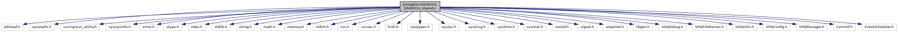

[Data Structures](#nested-classes) \| [Macros](#define-members) \| [Typedefs](#typedef-members) \| [Functions](#func-members) \| [Variables](#var-members)

`#include <pthread.h>`
`#include <sys/statfs.h>`
`#include <svcmgr/svc_utility.h>`
`#include <sys/sysinfo.h>`
`#include <errno.h>`
`#include <ctype.h>`
`#include <stdio.h>`
`#include <stdlib.h>`
`#include <string.h>`
`#include <math.h>`
`#include <memory.h>`
`#include <stdint.h>`
`#include <svc.h>`
`#include <svcsec.h>`
`#include <fcntl.h>`
`#include <sys/types.h>`
`#include <sys/ipc.h>`
`#include <sys/msg.h>`
`#include <sys/time.h>`
`#include <sys/stat.h>`
`#include <unistd.h>`
`#include <signal.h>`
`#include <arpa/inet.h>`
`#include <libgen.h>`
`#include "VHQDebug.h"`
`#include "VHQFileNames.h"`
`#include "VHQUtils.h"`
`#include "VHQConfig.h"`
`#include "VHQManager.h"`
`#include "ComIntf.h"`
`#include "EventScheduler.h"`

Include dependency graph for VHQUtils_shared.c:



|                 |                                                    |
|-----------------|----------------------------------------------------|
| Data Structures |                                                    |
| struct          | [\_CommMsgIdPair_t](#struct___comm_msg_id_pair__t) |

|  |  |
|----|----|
| Macros |  |
| #define  | [VHQ_REG_DELAY_TIMEOUT_BUFFER](#aa055fba554710bf886d90ab90598c7cd)   120 |
| #define  | [MAX_RENAME_RETRIES](#a6574c8edd1aab69e8fe50ebf58941c6a)   30 |
| #define  | [ADE_NUM_KEYS](#abaa424f845d000c33946bbd960701e4a)   10 |
| #define  | [CHAR_SI](#ab29cd69b820a502bb3a535e46f0d41ea)   0x0F |
| #define  | [MSKEY_PRESENT](#a5443c4d0e19152f0ef3a51b6e9290508)   \'<a href="md5_8cpp.md#a96d73bbd7af15cb1fc38c3f4a3bd82e9">F</a>\' |
| #define  | [TMS_MAX_PARAM_UPDATE_COUNT](#ad4aada5fdef16b6836aedbcd2a332a02)   200 |
| #define  | [RM_FILE_CNT](#aadedbae59fac7c9ff4d15f72e5c4402b)   100 |
| #define  | [CREATE_DIR_CNT](#af9bcdf85447ace9329a86b8ae42cf3ff)   5 |
| #define  | [MAX_CID_REFERENCES](#aa318a7a6b4b4c6ad15d4f784ae2e99f0)   20 |
| #define  | [PCI_REBOOT_GAP](#a807cde75ba7dae30ab6d0ebe83b1519e)   300 |

|  |  |
|----|----|
| Typedefs |  |
| typedef struct [\_CommMsgIdPair_t](#struct___comm_msg_id_pair__t)  | [CommMsgIdPair_t](#a8d49acd604c9adb9ad974effbc94aacb) |

|  |  |
|----|----|
| Functions |  |
| char \*  | [base64_encode](#ae0d00abe3dd1da92f34957ce79c1d6b8) (const char \*data, size_t input_length, size_t \*output_length) |
| void  | [build_decoding_table](#a0ff93d87e55e69b8cb5397c30cd10b51) () |
| char \*  | [base64_decode](#a1303970bd23eab0f6c41cf1a74428c44) (const char \*data, size_t input_length, size_t \*output_length) |
| void  | [base64_cleanup](#a24c1b02f2e403468ce12faa8374877c1) () |
| char \*  | [trim_whitespace](#ab836fce9c84274630630632a9ed7548e) (char \*s) |
| bool  | [FileExists](#a603879f5941a5b348c3d2e22aa9ada96) (const char \*pszName) |
| bool  | [removeFile](#a5b036df1be1ec3c95ce8a57692e2b8c8) (const char \*fname) |
| bool  | [DirExists](#a973b49053277a6ec732030aa82f50789) (char \*pszName) |
| bool  | [CreateDir](#a2e098388f665cdebdb57860680621d95) (char \*pszName, mode_t mode) |
| bool  | [removeDir](#a1c6beef1d29da5a7ef6bd0c78afa014a) (const char \*<a href="pathutil_8h.md#a9181ca7ec40f7d471eb410a1215a2321">dirname</a>) |
| bool  | [TestFileSignature](#a704fdea02400e376fa5c0ff020639b61) (const char \*pszFile) |
| void  | [SafeMsgSndWrapper](#a913ba53ada28a76bd93a36041be5833d) (int outQid, void \*pMsg, int iMsgSize, int flags) |
| int  | [SafeMsgRcvWrapper](#aa7b24962fc561ad7225565973f925635) (int inQid, void \*pMsg, int iMsgSize, long msgtyp, int flags, bool returnOnEINTR) |
| bool  | [ConvertHexStringToBinary](#a45e959e286a0f8df784358e90b046695) (char \*pszHexString, char \*bin_data, uint16 bin_data_len) |
| bool  | [ConvertBinaryToHexString](#aa18c2ae7db3dc325b32bd67faeffb70f) (char \*bin_data, uint16 bin_data_len, char \*pszHexString, uint16 hex_str_buf_size) |
| bool  | [ConvertVHQResultToStr](#a39181809d1b887a77785f1e956eed250) (vhq_result_t result, char \*ResultStr, int ResultStrLen) |
| uint32  | [GetCurrentMessageID](#af4996d4bb0ec6ed38830f98c2b7ef9bc) (int comm_id, uint32 rx_msg_id, int operation_id, bool comm_id_closed) |
| event_result_t  | [ConvertVHQResultToEventResult](#aa1a155e7e2a67c13bd89d22993ad45ca) (vhq_result_t vhq_result) |
| uint32  | [FileSize](#a7769a418be0f435df41164c0ca0d6421) (char \*pszName) |
| int  | [CopyFile](#a1ba5e708dc37fdf6f3c65bade56fabce) (const char \*pszSrc, const char \*pszDest) |
| int  | [MoveFile](#a16414c6a48d989b1f550bba744a7c640) (const char \*pszSrc, const char \*pszDest) |
| int  | [ConcatenateFile](#a9d3f8b4d9c193694ca4eadb97ae4dcaa) (const char \*pszSrc, const char \*pszDest) |
| void  | [openHbResult](#ab5c01f84a9d03f4e13931e70b4a65d06) () |
| void  | [closeHbResult](#a0eef5bd8c9b6750ba3deb0c35891a2eb) () |
| void  | [writeHbResult](#a530c2d38f67d3a0b06bc18a55edd89e9) (const char \*string,\...) |
| vhq_result_t  | [EventNotification](#ac39f797a2d75bc977a404daeadb8eadc) (int event_mask, char \*filename, int notificationDataInteger, vhq_result_t vhq_result, event_set_id_t event_set_id, event_id_t event_id, bool app_approval_required) |
| bool  | [VHQGetParamFileName](#aa3108752a35561ab98bec601d69b783d) (char \*receiver, char \*filename, char \*full_filename, size_t full_filename_len, bool \*remove_file) |
| vhq_result_t  | [ProcessAppAction](#af1d2a9f13c79bec2150675026ab83b62) (app_action_content_t \*app_action_content) |
| bool  | [IsComTypeSet](#a4e625a325759c4beb5e4381f0e4c63e2) (com_type_t comtype) |
| com_type_t  | [GetComType](#a9888c0755dd772bdd6056ddbee3dab7c) (void) |
| void  | [SetComType](#a4d4573d8fac31345ab5e3d3e2634bc7a) (com_type_t type) |
| const char \*  | [get_ComType_name](#a1c287d30caf984e3f014a8c6abd2f7fe) (com_type_t comtype) |
| int  | [GetIPAddress](#a811051257f853a442af31fa405c34bc6) (char \*pszIPAddress, int iIPAddressBufLen) |
| int  | [GetMACAddress](#af1ee6d38b86f3fecc892ed951291d48f) (char \*pszMACAddress, int iMACAddressBufLen) |
| int  | [VCLDiagDataParserGetOneLine](#a963a34bd7da35c01e406a3aed41143dc) (char \*input_string, char \*\*nextline) |
| int  | [VCLDiagDataParserGetParam](#ae283afcc73fe6b1fa15392b3e9299139) (char \*inputline, char \*\*name, char \*\*<a href="_web_service_wrappers_8c.md#a6e248376c0290338633d8137822eb209">value</a>) |
| void  | [CreateVHQRebootFile](#ade0398725c4bf7b8bae5507da845e384) () |
| void  | [RemoveVHQRebootFile](#aa5bc1870ec421e880733acb1a1fbd136) () |
| bool  | [RequestAppRegistrationDelay](#a0074ccabd79d553d81a88a19201b3d6f) () |
| bool  | [BlockAllSignals](#af0dec49e894eccde5f94a9ed961e7c33) (bool unblockSIGUSR1) |
| bool  | [ISvalidIP](#ae008583a3df14025105a16f901b79b14) (const char \*ip) |
| bool  | [ISvalidMAC](#a826a3b2eba20028aa0d7ffe7f4c77e42) (const char \*mac) |
| time_t  | [linux_time](#a16fef971ef213425f86e87c272f974b9) (time_t \*pTime) |
| time_t  | [linux_mktime](#a63077d6a8d7ed67c12cf6a4eb57eb192) (struct tm \*t) |
| struct tm \*  | [linux_localtime](#abbbb7ef51e5d4020e5c23e1d94959266) (time_t \*pTime, struct tm \*local_time) |
| struct tm \*  | [linux_gmtime](#a21489232e0b390e526a5b688ce5ee7e4) (time_t \*pTime, struct tm \*local_time) |
| time_t  | [linux_timegm](#a60dfc7e583ac79bff938ff580bc45e3e) (struct tm \*t) |
| time_t  | [convert_tm_to_time_t](#a8ad225a588b6beb4aa3df958b32c0667) (const struct tm \*t) |
| long  | [GenerateNonce](#a8c204a3fac75f9d9e48c7809f3fb67e1) (void) |
| bool  | [lowPowerMode](#a9fbf2968a895235ac2f51e4a0f04e0b6) () |
| long long int  | [u32subu32](#a4c52b1745f4d3c8830a75fdf6c81a0a1) (unsigned int a, unsigned int b) |
| char \*  | [tmtoa](#a020ad21a5f1ca89ff4d47a22204dc6b5) (const struct tm \*tm) |
| char \*  | [lltoa](#adf0b0fe7c8e4d141beda921a6f923de3) (long long int i) |
| bool  | [isValidXMLData](#ac33d58eac0dcb5d0220a618e8359910e) (const char \*data) |
| uint32  | [GetHBFreq](#aeb62d0af718d972cb2cb3ddeb651c0c9) (uint32 \*hbFailureRetryThresh, const com_type_t com_type) |
| bool  | [HeartbeatRescheduleRequired](#af0c3da76ae4ac5cc58a8391bf8b9b1ba) (uint32 oldHBFreq, uint32 oldHBFailureRetryThresh) |
| time_t  | [ConvertServerLocalTimeToDeviceUTC](#a4ebffa518aa91ddda309fc99f61cf1a8) (char \*description, time_t input_loc_time) |
| time_t  | [ConvertDeviceUTCToServerLocalTime](#acae1b2c91f4f87686e9aa53e8f84d654) (char \*description, time_t input_UTC_time) |
| void  | [SetOSBootTime](#a2cc88d847a9deda743d7aeb43a83a19c) (time_t boot_time) |
| time_t  | [GetOSBootTime](#a9d06aef961f06ca519411acc42c0e84c) (void) |
| bool  | [isPCIreboot](#a00e2a8b25b242ca5049397910e19f971) (void) |
| int  | [CreateAdkComDialXmlProfile](#ac0fd51284886fa3be9182e4d26aedb53) (char \*fullFilename, char \*pszPhoneNumber) |
| int  | [CreateAdkComXmlProfile](#a69ccef5b9611d73dead6d736d786f76b) (char \*fullFilename, char \*url, char \*port, char \*type) |
| bool  | [GenerateAppParamUpdateEvent](#ac10b9981c6bceedbaae4f57dc4dcbb18) (app_param_update_info_t \*updateInfo) |
| int  | [ReqParamUploadRead](#aa083f0bd8a5aabdfec72f58b85e5add0) (char \*\*param_buffer, char \*param_update_file_name, int \*param_update_count, time_t \*param_update_time, size_t \*tot_param_update_size) |
| void  | [ReadParamUpdateFile](#a9782ab9053b7f3482b365b8b7ad5b4d7) (app_param_update \*param_update_list, size_t param_update_list_size, int \*param_update_count, time_t \*param_update_time, char \*param_update_file_name) |
| int  | [ProcessAppGeneratedParameterUpdate](#a7d9767400e21778bbef439e1a9914e2a) (char \*receiver, char \*param_update_info_file, int param_update_count, time_t param_update_time, bool agentRequested, char \*processedFilename) |
| char \*  | [mallocProcessingStatusFileName](#ab80db28b42382ee6549412b863031ca5) (event_id_t event_id) |
| int  | [utility_PutenvFilename](#af42e0d043501e09aff2f156087ff15fd) (const char \*file_name, const char \*section, const char \*param, const char \*<a href="_web_service_wrappers_8c.md#a6e248376c0290338633d8137822eb209">value</a>) |

|  |  |
|----|----|
| Variables |  |
| volatile char  | [tokenHbResult](#ab1e979834ad7f3bd170b59b68d1caf52) = 0 |
| [CommMsgIdPair_t](#a8d49acd604c9adb9ad974effbc94aacb)  | [comm_msg_id_pair_table](#a56649f45c7dd4981c2733f8f42b9fc68) \[MAX_EVENTS\] |
| time_t  | [\_agent_boot_time](#a7fa5594126ed0ef6db3783f20e86fc04) = (time_t) -1 |
| const char  | [szDialConfig](#a4c84318f2e03db5c24e54f7fb06dda29) \[\] |

## DetailedDescription {#detailed-description}

Some utility functions shared between platforms

------------------------------------------------------------------------

## DataStructure Documentation {#data-structure-documentation}

## \_CommMsgIdPair_t <a href="#struct___comm_msg_id_pair__t" id="struct___comm_msg_id_pair__t"></a>

<p>struct \_CommMsgIdPair_t</p>

| Data Fields |  |  |
|----|----|----|
| int | comm_id |  |
| bool | in_use |  |
| uint32 | msg_id |  |
| int | references\[[MAX_CID_REFERENCES](#aa318a7a6b4b4c6ad15d4f784ae2e99f0)\] |  |

## MacroDefinition Documentation {#macro-definition-documentation}

## ADE_NUM_KEYS <a href="#abaa424f845d000c33946bbd960701e4a" id="abaa424f845d000c33946bbd960701e4a"></a>

<p>#define ADE_NUM_KEYS   10</p>

## CHAR_SI <a href="#ab29cd69b820a502bb3a535e46f0d41ea" id="ab29cd69b820a502bb3a535e46f0d41ea"></a>

<p>#define CHAR_SI   0x0F</p>

## CREATE_DIR_CNT <a href="#af9bcdf85447ace9329a86b8ae42cf3ff" id="af9bcdf85447ace9329a86b8ae42cf3ff"></a>

<p>#define CREATE_DIR_CNT   5</p>

## MAX_CID_REFERENCES <a href="#aa318a7a6b4b4c6ad15d4f784ae2e99f0" id="aa318a7a6b4b4c6ad15d4f784ae2e99f0"></a>

<p>#define MAX_CID_REFERENCES   20</p>

## MAX_RENAME_RETRIES <a href="#a6574c8edd1aab69e8fe50ebf58941c6a" id="a6574c8edd1aab69e8fe50ebf58941c6a"></a>

<p>#define MAX_RENAME_RETRIES   30</p>

## MSKEY_PRESENT <a href="#a5443c4d0e19152f0ef3a51b6e9290508" id="a5443c4d0e19152f0ef3a51b6e9290508"></a>

<p>#define MSKEY_PRESENT   \'<a href="md5_8cpp.md#a96d73bbd7af15cb1fc38c3f4a3bd82e9">F</a>\'</p>

## PCI_REBOOT_GAP <a href="#a807cde75ba7dae30ab6d0ebe83b1519e" id="a807cde75ba7dae30ab6d0ebe83b1519e"></a>

<p>#define PCI_REBOOT_GAP   300</p>

## RM_FILE_CNT <a href="#aadedbae59fac7c9ff4d15f72e5c4402b" id="aadedbae59fac7c9ff4d15f72e5c4402b"></a>

<p>#define RM_FILE_CNT   100</p>

## TMS_MAX_PARAM_UPDATE_COUNT <a href="#ad4aada5fdef16b6836aedbcd2a332a02" id="ad4aada5fdef16b6836aedbcd2a332a02"></a>

<p>#define TMS_MAX_PARAM_UPDATE_COUNT   200</p>

## VHQ_REG_DELAY_TIMEOUT_BUFFER <a href="#aa055fba554710bf886d90ab90598c7cd" id="aa055fba554710bf886d90ab90598c7cd"></a>

<p>#define VHQ_REG_DELAY_TIMEOUT_BUFFER   120</p>

## TypedefDocumentation {#typedef-documentation}

## CommMsgIdPair_t <a href="#a8d49acd604c9adb9ad974effbc94aacb" id="a8d49acd604c9adb9ad974effbc94aacb"></a>

<p>typedef struct [\_CommMsgIdPair_t](#struct___comm_msg_id_pair__t) [CommMsgIdPair_t](#a8d49acd604c9adb9ad974effbc94aacb)</p>

## FunctionDocumentation {#function-documentation}

## base64_cleanup() <a href="#a24c1b02f2e403468ce12faa8374877c1" id="a24c1b02f2e403468ce12faa8374877c1"></a>

<p>void base64_cleanup</p>

## base64_decode() <a href="#a1303970bd23eab0f6c41cf1a74428c44" id="a1303970bd23eab0f6c41cf1a74428c44"></a>

<p>char\* base64_decode</p>

## base64_encode() <a href="#ae0d00abe3dd1da92f34957ce79c1d6b8" id="ae0d00abe3dd1da92f34957ce79c1d6b8"></a>

<p>char\* base64_encode</p>

This function encodes a string in base 64.

**Parameters**

\[in\] **data** = string to encode. \[in\] **input_length** = length of input string. \[out\] **output_length** = length of output encoded string.

### Returns

encoded data.

## BlockAllSignals() <a href="#af0dec49e894eccde5f94a9ed961e7c33" id="af0dec49e894eccde5f94a9ed961e7c33"></a>

<p>bool BlockAllSignals</p>

## build_decoding_table() <a href="#a0ff93d87e55e69b8cb5397c30cd10b51" id="a0ff93d87e55e69b8cb5397c30cd10b51"></a>

<p>void build_decoding_table</p>

## closeHbResult() <a href="#a0eef5bd8c9b6750ba3deb0c35891a2eb" id="a0eef5bd8c9b6750ba3deb0c35891a2eb"></a>

<p>void closeHbResult</p>

This function closes the heartbeat result file after an attempt to do heart beat.

### Returns

void

## ConcatenateFile() <a href="#a9d3f8b4d9c193694ca4eadb97ae4dcaa" id="a9d3f8b4d9c193694ca4eadb97ae4dcaa"></a>

<p>int ConcatenateFile</p>

This function is a wrapper function for CopyFileWorker(). It adds a+ file opening mode.

## convert_tm_to_time_t() <a href="#a8ad225a588b6beb4aa3df958b32c0667" id="a8ad225a588b6beb4aa3df958b32c0667"></a>

<p>time_t convert_tm_to_time_t</p>

## ConvertBinaryToHexString() <a href="#aa18c2ae7db3dc325b32bd67faeffb70f" id="aa18c2ae7db3dc325b32bd67faeffb70f"></a>

<p>bool ConvertBinaryToHexString</p>

This function converts a binary string to hex string .

**Parameters**

\[in\] **bin_data** = binary data \[in\] **bin_data_len** = length of binary data \[out\] **pszHexString** = hex string \[out\] **hex_str_buf_size** = hex string size

### Returns

TRUE, if SUCCESS

## ConvertDeviceUTCToServerLocalTime() <a href="#acae1b2c91f4f87686e9aa53e8f84d654" id="acae1b2c91f4f87686e9aa53e8f84d654"></a>

<p>time_t ConvertDeviceUTCToServerLocalTime</p>

The server does not send time values to the device as UTC time, they are actually converted to the local time for the device. This causes issues on devices with a time zone set. The server also expects time values from the device to come up as local time of the device so this function converts the UTC time the agent will get from the OS for time() API to the local time of the device so that the server will understand it

**Parameters**

\[in\] **description** = a description string printed as part of DebugMsg call \[in\] **input_UTC_time** = the UTC time of the device to convert to local time

### Returns

time_t, the local time equivalent of the UTC value passed to this API.

## ConvertHexStringToBinary() <a href="#a45e959e286a0f8df784358e90b046695" id="a45e959e286a0f8df784358e90b046695"></a>

<p>bool ConvertHexStringToBinary</p>

This function converts a hex string to a binary string.

**Parameters**

\[in\] **pszHexString** = hex string \[out\] **bin_data** = binary data \[in\] **bin_data_len** = length of binary data

### Returns

TRUE, if SUCCESS

## ConvertServerLocalTimeToDeviceUTC() <a href="#a4ebffa518aa91ddda309fc99f61cf1a8" id="a4ebffa518aa91ddda309fc99f61cf1a8"></a>

<p>time_t ConvertServerLocalTimeToDeviceUTC</p>

The server does not send time values to the device as UTC time, they are actually converted to the local time for the device. This causes issues on devices with a time zone set, so this function converts the \"localtime\" sent from server to a UTC time that is universal across all devices regardless of whether the time zone is set or not

**Parameters**

\[in\] **description** = a description string printed as part of DebugMsg call \[in\] **input_loc_time** = the time sent from the server to convert

### Returns

time_t, the true UTC time_t value of the time sent by server.

## ConvertVHQResultToEventResult() <a href="#aa1a155e7e2a67c13bd89d22993ad45ca" id="aa1a155e7e2a67c13bd89d22993ad45ca"></a>

<p>event_result_t ConvertVHQResultToEventResult</p>

## ConvertVHQResultToStr() <a href="#a39181809d1b887a77785f1e956eed250" id="a39181809d1b887a77785f1e956eed250"></a>

<p>bool ConvertVHQResultToStr</p>

This function converts the VHQ result to string.

**Parameters**

\[in\] **result** = VHQ result to convert. \[out\] **ResultStr** = string obtained after converting. \[in\] **ResultStrLen** = length of result string.

### Returns

TRUE, if conversion success.

## CopyFile() <a href="#a1ba5e708dc37fdf6f3c65bade56fabce" id="a1ba5e708dc37fdf6f3c65bade56fabce"></a>

<p>int CopyFile</p>

This function is a wrapper function for CopyFileWorker(). It adds file opening mode.

## CreateAdkComDialXmlProfile() <a href="#ac0fd51284886fa3be9182e4d26aedb53" id="ac0fd51284886fa3be9182e4d26aedb53"></a>

<p>int CreateAdkComDialXmlProfile</p>

## CreateAdkComXmlProfile() <a href="#a69ccef5b9611d73dead6d736d786f76b" id="a69ccef5b9611d73dead6d736d786f76b"></a>

<p>int CreateAdkComXmlProfile</p>

## CreateDir() <a href="#a2e098388f665cdebdb57860680621d95" id="a2e098388f665cdebdb57860680621d95"></a>

<p>bool CreateDir</p>

This function creates dir by retrying.

**Parameters**

\[in\] **pszName** = directory name. \[in\] **mode** = directory mode to be set.

### Returns

TRUE, if created.

## CreateVHQRebootFile() <a href="#ade0398725c4bf7b8bae5507da845e384" id="ade0398725c4bf7b8bae5507da845e384"></a>

<p>void CreateVHQRebootFile</p>

This function opens a reboot file.

### Returns

void

## DirExists() <a href="#a973b49053277a6ec732030aa82f50789" id="a973b49053277a6ec732030aa82f50789"></a>

<p>bool DirExists</p>

This function check whether a directory exists or not.

**Parameters**

\[in\] **pszName** = directory name.

### Returns

TRUE, if found.

## EventNotification() <a href="#ac39f797a2d75bc977a404daeadb8eadc" id="ac39f797a2d75bc977a404daeadb8eadc"></a>

<p>vhq_result_t EventNotification</p>

This function gets the parameter file name for uploading to server.

**Parameters**

\[in\] **event_mask** = event mask \[in\] **filename** = filename to send to app \[out\] **notificationDataInteger** = notification data \[out\] **hbResult** = server message result \[out\] **event_set_id** = event set id \[out\] **event_id** = event id \[out\] **app_approval_required** = TRUE, if application approval required

### Returns

TRUE ,if success

## FileExists() <a href="#a603879f5941a5b348c3d2e22aa9ada96" id="a603879f5941a5b348c3d2e22aa9ada96"></a>

<p>bool FileExists</p>

Trim all whitespace from a string in-place.

This function check whether a file exists or not.

**Parameters**

\[in\] **pszName** = file name.

### Returns

TRUE, if found.

## FileSize() <a href="#a7769a418be0f435df41164c0ca0d6421" id="a7769a418be0f435df41164c0ca0d6421"></a>

<p>uint32 FileSize</p>

This function checks the size of the file name.

**Parameters**

\[in\] **pszName** = file name.

### Returns

size of file.

## GenerateAppParamUpdateEvent() <a href="#ac10b9981c6bceedbaae4f57dc4dcbb18" id="ac10b9981c6bceedbaae4f57dc4dcbb18"></a>

<p>bool GenerateAppParamUpdateEvent</p>

This function calls a function to schedule application parameter update event.

**Parameters**

\[in\] **updateInfo** = application parameter details

### Returns

TRUE, if success; FALSE, otherwise

## GenerateNonce() <a href="#a8c204a3fac75f9d9e48c7809f3fb67e1" id="a8c204a3fac75f9d9e48c7809f3fb67e1"></a>

<p>long GenerateNonce</p>

Function generates a Nonce for communicating with server.

### Returns

long, the nonce generated.

## get_ComType_name() <a href="#a1c287d30caf984e3f014a8c6abd2f7fe" id="a1c287d30caf984e3f014a8c6abd2f7fe"></a>

<p>const char\* get_ComType_name</p>

This function returns the com type string.

**Parameters**

\[in\] **comtype** = Current connection type.

### Returns

com string.

## GetComType() <a href="#a9888c0755dd772bdd6056ddbee3dab7c" id="a9888c0755dd772bdd6056ddbee3dab7c"></a>

<p>com_type_t GetComType</p>

This function provides value of latest success connection type. This value provided on connection establishing stage.

### Returns

Latest success connection type.

## GetCurrentMessageID() <a href="#af4996d4bb0ec6ed38830f98c2b7ef9bc" id="af4996d4bb0ec6ed38830f98c2b7ef9bc"></a>

<p>uint32 GetCurrentMessageID</p>

## GetHBFreq() <a href="#aeb62d0af718d972cb2cb3ddeb651c0c9" id="aeb62d0af718d972cb2cb3ddeb651c0c9"></a>

<p>uint32 GetHBFreq</p>

This function finds the current com interface type and returns heart beat freq according to com type.

**Parameters**

\[in\] **hbFailureRetryThresh** = stores the heart beat failure retry threshold. \[in\] **com_type** = com interface type.

### Returns

heartbeat frequency based on communication interface type used.

## GetIPAddress() <a href="#a811051257f853a442af31fa405c34bc6" id="a811051257f853a442af31fa405c34bc6"></a>

<p>int GetIPAddress</p>

This function get the MAC address.

**Parameters**

\[out\] **pszIPAddress** = IP address string \[out\] **iIPAddressBufLen** = IP address string length

### Returns

int 0,if success

## GetMACAddress() <a href="#af1ee6d38b86f3fecc892ed951291d48f" id="af1ee6d38b86f3fecc892ed951291d48f"></a>

<p>int GetMACAddress</p>

This function get the MAC address.

**Parameters**

\[out\] **pszMACAddress** = MAC address string \[out\] **iMACAddressBufLen** = MAC address string length

### Returns

int

## GetOSBootTime() <a href="#a9d06aef961f06ca519411acc42c0e84c" id="a9d06aef961f06ca519411acc42c0e84c"></a>

<p>time_t GetOSBootTime</p>

This function returns the agent Boot time.

### Returns

agent boot time.

## HeartbeatRescheduleRequired() <a href="#af0c3da76ae4ac5cc58a8391bf8b9b1ba" id="af0c3da76ae4ac5cc58a8391bf8b9b1ba"></a>

<p>bool HeartbeatRescheduleRequired</p>

Determines whether or not the HB needs to be re-scheduled after a config update. If either the HB frequency or the failure threshold changed, we will cancel the current recurring HB and reschedule it.

**Parameters**

\[in\] **oldHBFreq** = the old HB frequency before config update. \[in\] **oldHBFailureRetryThresh** = the old failure threshold before the update.

### Returns

TRUE if the HB needs to be re-scheduled, FALSE otherwise

## IsComTypeSet() <a href="#a4e625a325759c4beb5e4381f0e4c63e2" id="a4e625a325759c4beb5e4381f0e4c63e2"></a>

<p>bool IsComTypeSet</p>

## isPCIreboot() <a href="#a00e2a8b25b242ca5049397910e19f971" id="a00e2a8b25b242ca5049397910e19f971"></a>

<p>bool isPCIreboot</p>

This function checks the event is a PCI Reboot to send to server

### Returns

TRUE, if PCI reboot; FALSE, otherwise

## ISvalidIP() <a href="#ae008583a3df14025105a16f901b79b14" id="ae008583a3df14025105a16f901b79b14"></a>

<p>bool ISvalidIP</p>

Function calls a function to validate an IPv4/IPv6 address.

**Parameters**

\[in\] **ip** = pointer to string

### Returns

TRUE, if valid.

## ISvalidMAC() <a href="#a826a3b2eba20028aa0d7ffe7f4c77e42" id="a826a3b2eba20028aa0d7ffe7f4c77e42"></a>

<p>bool ISvalidMAC</p>

Function validates a MAC address.

**Parameters**

\[in\] **mac** = pointer to string

### Returns

TRUE, if valid.

## isValidXMLData() <a href="#ac33d58eac0dcb5d0220a618e8359910e" id="ac33d58eac0dcb5d0220a618e8359910e"></a>

<p>bool isValidXMLData</p>

This function verifies for ASCII symbols.

**Parameters**

\[out\] **data** = pointer to string.

### Returns

FALSE, in case if non readable ASCII is detected

## linux_gmtime() <a href="#a21489232e0b390e526a5b688ce5ee7e4" id="a21489232e0b390e526a5b688ce5ee7e4"></a>

<p>struct tm\* linux_gmtime</p>

## linux_localtime() <a href="#abbbb7ef51e5d4020e5c23e1d94959266" id="abbbb7ef51e5d4020e5c23e1d94959266"></a>

<p>struct tm\* linux_localtime</p>

## linux_mktime() <a href="#a63077d6a8d7ed67c12cf6a4eb57eb192" id="a63077d6a8d7ed67c12cf6a4eb57eb192"></a>

<p>time_t linux_mktime</p>

## linux_time() <a href="#a16fef971ef213425f86e87c272f974b9" id="a16fef971ef213425f86e87c272f974b9"></a>

<p>time_t linux_time</p>

## linux_timegm() <a href="#a60dfc7e583ac79bff938ff580bc45e3e" id="a60dfc7e583ac79bff938ff580bc45e3e"></a>

<p>time_t linux_timegm</p>

## lltoa() <a href="#adf0b0fe7c8e4d141beda921a6f923de3" id="adf0b0fe7c8e4d141beda921a6f923de3"></a>

<p>char\* lltoa</p>

## lowPowerMode() <a href="#a9fbf2968a895235ac2f51e4a0f04e0b6" id="a9fbf2968a895235ac2f51e4a0f04e0b6"></a>

<p>bool lowPowerMode</p>

## mallocProcessingStatusFileName() <a href="#ab80db28b42382ee6549412b863031ca5" id="ab80db28b42382ee6549412b863031ca5"></a>

<p>char\* mallocProcessingStatusFileName</p>

This function returns the processing_status.ini filename

**Parameters**

\[in\] **event_id** = event ID

### Returns

char\*

## MoveFile() <a href="#a16414c6a48d989b1f550bba744a7c640" id="a16414c6a48d989b1f550bba744a7c640"></a>

<p>int MoveFile</p>

This function moves a file from a given source to destination.

**Parameters**

\[in\] **pszSrc** = source of file \[in\] **pszDest** = destination of file.

### Returns

0, if success; -1, if error.

## openHbResult() <a href="#ab5c01f84a9d03f4e13931e70b4a65d06" id="ab5c01f84a9d03f4e13931e70b4a65d06"></a>

<p>void openHbResult</p>

This function removes the last heart beat result file before processing a new heart beat.

### Returns

void

## ProcessAppAction() <a href="#af1d2a9f13c79bec2150675026ab83b62" id="af1d2a9f13c79bec2150675026ab83b62"></a>

<p>vhq_result_t ProcessAppAction</p>

This function sends an the app action type message to app.

**Parameters**

\[in\] **app_action_content** = application action type

### Returns

vhq_result_t VHQ_SUCCESS,if success

## ProcessAppGeneratedParameterUpdate() <a href="#a7d9767400e21778bbef439e1a9914e2a" id="a7d9767400e21778bbef439e1a9914e2a"></a>

<p>int ProcessAppGeneratedParameterUpdate</p>

This function processes the application generated parameter updates request messages.It extracts each of the parameter info received.

**Parameters**

\[in\] **receiver** = application name \[in\] **param_update_info_file** = parameter update filename \[in\] **param_update_count** = parameter count \[in\] **param_update_time** = parameter update request time

### Returns

int 0, if success

## ReadParamUpdateFile() <a href="#a9782ab9053b7f3482b365b8b7ad5b4d7" id="a9782ab9053b7f3482b365b8b7ad5b4d7"></a>

<p>void ReadParamUpdateFile</p>

This function reads the application parameter update file for sending to server.

**Parameters**

\[out\] **param_update_list** = parameter updated list \[in\] **param_update_list_size** = size of parameter update list \[out\] **param_update_count** = parameter update count \[out\] **param_update_time** = parameter update time \[in\] **param_update_file_name** = parameter filename to be read

### Returns

void

## removeDir() <a href="#a1c6beef1d29da5a7ef6bd0c78afa014a" id="a1c6beef1d29da5a7ef6bd0c78afa014a"></a>

<p>bool removeDir</p>

This function removes a directory.

**Parameters**

\[in\] **dirname** = directory name to be removed.

### Returns

TRUE, if removed.

## removeFile() <a href="#a5b036df1be1ec3c95ce8a57692e2b8c8" id="a5b036df1be1ec3c95ce8a57692e2b8c8"></a>

<p>bool removeFile</p>

This function removes a file.

**Parameters**

\[in\] **fname** = file name to be removed.

### Returns

TRUE, if removed.

## RemoveVHQRebootFile() <a href="#aa5bc1870ec421e880733acb1a1fbd136" id="aa5bc1870ec421e880733acb1a1fbd136"></a>

<p>void RemoveVHQRebootFile</p>

This function removes a reboot file.

### Returns

void

## ReqParamUploadRead() <a href="#aa083f0bd8a5aabdfec72f58b85e5add0" id="aa083f0bd8a5aabdfec72f58b85e5add0"></a>

<p>int ReqParamUploadRead</p>

This function reads the application parameter update file for sending to server.

**Parameters**

\[out\] **param_update_list** = read parameter update buffer \[in\] **param_update_file_name** = parameter filename \[out\] **param_update_count** = parameter update count \[out\] **param_update_time** = parameter update time \[out\] **tot_param_update_size** = total size of parameter update

### Returns

version of parameter file

## RequestAppRegistrationDelay() <a href="#a0074ccabd79d553d81a88a19201b3d6f" id="a0074ccabd79d553d81a88a19201b3d6f"></a>

<p>bool RequestAppRegistrationDelay</p>

Function creates message queues and sends VHQ_REQUEST_REGISTRATION_DELAY message and waits for a particular time for application registration to respond with VHQ_REQUEST_REGISTRATION_DELAY response message.

**Parameters**

\[in\] **void**

### Returns

void

## SafeMsgRcvWrapper() <a href="#aa7b24962fc561ad7225565973f925635" id="aa7b24962fc561ad7225565973f925635"></a>

<p>int SafeMsgRcvWrapper</p>

This function is a wrapper function for receiving message from Queues.

**Parameters**

\[in\] **inQid** = queue ID. \[in\] **pMsg** = message received, \[in\] **iMsgSize** = size of message received. \[in\] **msgtyp** = message type \[in\] **flags** = flags. \[in\] **returnOnEINTR** = TRUE, if return error if EINTR.

### Returns

-1, if error.

## SafeMsgSndWrapper() <a href="#a913ba53ada28a76bd93a36041be5833d" id="a913ba53ada28a76bd93a36041be5833d"></a>

<p>void SafeMsgSndWrapper</p>

This function is a wrapper function for sending messages in Queues.

**Parameters**

\[in\] **outQid** = queue ID. \[in\] **pMsg** = message to be send. \[in\] **iMsgSize** = size of message received. \[in\] **flags** = flags.

### Returns

void

## SetComType() <a href="#a4d4573d8fac31345ab5e3d3e2634bc7a" id="a4d4573d8fac31345ab5e3d3e2634bc7a"></a>

<p>void SetComType</p>

This function stores value of latest success connection type. Should be used connection establishing stage.

**Parameters**

\[in\] **type** = Current connection type.

### Returns

void

## SetOSBootTime() <a href="#a2cc88d847a9deda743d7aeb43a83a19c" id="a2cc88d847a9deda743d7aeb43a83a19c"></a>

<p>void SetOSBootTime</p>

This function saves the agent boot time.

**Parameters**

\[in\] **boot_time** = time.

### Returns

void

## TestFileSignature() <a href="#a704fdea02400e376fa5c0ff020639b61" id="a704fdea02400e376fa5c0ff020639b61"></a>

<p>bool TestFileSignature</p>

This function tests the signature of a file.

**Parameters**

\[in\] **pszFile** = file name.

### Returns

TRUE, if passed.

## tmtoa() <a href="#a020ad21a5f1ca89ff4d47a22204dc6b5" id="a020ad21a5f1ca89ff4d47a22204dc6b5"></a>

<p>char\* tmtoa</p>

## trim_whitespace() <a href="#ab836fce9c84274630630632a9ed7548e" id="ab836fce9c84274630630632a9ed7548e"></a>

<p>char\* trim_whitespace</p>

This function trim the leading and trailing whitespace from a string in-place.

**Parameters**

\[in\] **s** = string

### Returns

trimmed string.

## u32subu32() <a href="#a4c52b1745f4d3c8830a75fdf6c81a0a1" id="a4c52b1745f4d3c8830a75fdf6c81a0a1"></a>

<p>long long int u32subu32</p>

## utility_PutenvFilename() <a href="#af42e0d043501e09aff2f156087ff15fd" id="af42e0d043501e09aff2f156087ff15fd"></a>

<p>int utility_PutenvFilename</p>

This function creates or updates the dictionary section.

**Parameters**

\[in\] **file_name** = filename to be updated. \[in\] **section** = section name \[in\] **param** = entry name to modify \[in\] **value** = new value associated with entry.

### Returns

0, if success; -1, otherwise

## VCLDiagDataParserGetOneLine() <a href="#a963a34bd7da35c01e406a3aed41143dc" id="a963a34bd7da35c01e406a3aed41143dc"></a>

<p>int VCLDiagDataParserGetOneLine</p>

This function parses the VCLDiag Data to send to server.

**Parameters**

\[in\] **input_string** = VCL info data \[out\] **nextline** = pointer to parsed

### Returns

int 0, if error; 1,if success

## VCLDiagDataParserGetParam() <a href="#ae283afcc73fe6b1fa15392b3e9299139" id="ae283afcc73fe6b1fa15392b3e9299139"></a>

<p>int VCLDiagDataParserGetParam</p>

This function parses the VCLDiag Data to send to server.

**Parameters**

\[in\] **inputline** = input line \[out\] **name** = name \[out\] **value** = value

### Returns

int 0, if error; 1,if success

## VHQGetParamFileName() <a href="#aa3108752a35561ab98bec601d69b783d" id="aa3108752a35561ab98bec601d69b783d"></a>

<p>bool VHQGetParamFileName</p>

This function gets the parameter file name for uploading to server.

**Parameters**

\[in\] **receiver** = receiver application name \[in\] **filename** = filename \[out\] **full_filename** = full filename \[out\] **full_filename_len** = filename length \[out\] **remove_file** = TRUE, if remove file

### Returns

TRUE ,if success

## writeHbResult() <a href="#a530c2d38f67d3a0b06bc18a55edd89e9" id="a530c2d38f67d3a0b06bc18a55edd89e9"></a>

<p>void writeHbResult</p>

This function write the heart beat result to the file after an attempt to do HB.

**Parameters**

\[in\] **string** = string list to write to file.

### Returns

void

## VariableDocumentation {#variable-documentation}

## \_agent_boot_time <a href="#a7fa5594126ed0ef6db3783f20e86fc04" id="a7fa5594126ed0ef6db3783f20e86fc04"></a>

<p>time_t \_agent_boot_time = (time_t) -1</p>

## comm_msg_id_pair_table <a href="#a56649f45c7dd4981c2733f8f42b9fc68" id="a56649f45c7dd4981c2733f8f42b9fc68"></a>

<p>[CommMsgIdPair_t](#a8d49acd604c9adb9ad974effbc94aacb) comm_msg_id_pair_table\[MAX_EVENTS\]</p>

## szDialConfig <a href="#a4c84318f2e03db5c24e54f7fb06dda29" id="a4c84318f2e03db5c24e54f7fb06dda29"></a>

<p>const char szDialConfig\[\]</p>

**Initial value:**

``` cpp
= "<CONNECTION_PROFILE>"
   " <NAME>\"RAW_DIAL\"</NAME>"
   " <CONNECTION>"
   " <TYPE>RAW_MODEM</TYPE>"
   " <DEVICE_NAME>MDM_INT</DEVICE_NAME>"
   " <PABX_CODE></PABX_CODE>"
   " <ADDRESS>%s</ADDRESS>"
   " <TIMEOUT>60000 </TIMEOUT >"
   " <DIAL_MODE>async</DIAL_MODE>"
   " <DIAL_TYPE>tone</DIAL_TYPE>"
   " <MODULATION>v32bis</MODULATION>"
   " <BLIND_DIALING>no</BLIND_DIALING>"
   " <COMPRESSION>auto</COMPRESSION>"
   " <ERROR_CORRECTION>auto</ERROR_CORRECTION>"
   " <COUNTRY_CODE>1</COUNTRY_CODE>"
   " <BAUDRATE>115200</BAUDRATE>"
   " </CONNECTION>"
   " <CONNECTION>"
   " <TYPE>RAW_MODEM</TYPE>"
   " <DEVICE_NAME>BT_DUN</DEVICE_NAME>"
   " <PABX_CODE></PABX_CODE>"
   " <ADDRESS>%s</ADDRESS>"
   " <TIMEOUT>60000</TIMEOUT >"
   " <DIAL_MODE>async</DIAL_MODE>"
   " <DIAL_TYPE>tone</DIAL_TYPE>"
   " <MODULATION>v32bis</MODULATION>"
   " <BLIND_DIALING>no</BLIND_DIALING>"
   " <COMPRESSION>auto</COMPRESSION>"
   " <ERROR_CORRECTION>auto</ERROR_CORRECTION>"
   " <COUNTRY_CODE>1</COUNTRY_CODE>"
   " <BAUDRATE>115200</BAUDRATE>"
   " </CONNECTION>"
   "</CONNECTION_PROFILE>"
```

## tokenHbResult <a href="#ab1e979834ad7f3bd170b59b68d1caf52" id="ab1e979834ad7f3bd170b59b68d1caf52"></a>

<p>volatile char tokenHbResult = 0</p>
