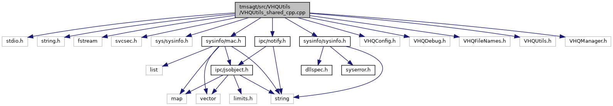

[Macros](#define-members) \| [Functions](#func-members)

`#include <stdio.h>`
`#include <string.h>`
`#include <fstream>`
`#include <svcsec.h>`
`#include <sys/sysinfo.h>`
`#include "`<a href="mac_8h_source.md">sysinfo/mac.h</a>`"`
`#include "`<a href="sysinfo_8h_source.md">sysinfo/sysinfo.h</a>`"`
`#include "`<a href="notify_8h_source.md">ipc/notify.h</a>`"`
`#include "VHQConfig.h"`
`#include "VHQDebug.h"`
`#include "VHQFileNames.h"`
`#include "VHQUtils.h"`
`#include "VHQManager.h"`

Include dependency graph for VHQUtils_shared_cpp.cpp:

|          |                                                    |
|----------|----------------------------------------------------|
| Macros   |                                                    |
| #define  | [\_GNU_SOURCE](#a369266c24eacffb87046522897a570d5) |

|  |  |
|----|----|
| Functions |  |
| void  | [InitMainBatteryStatus](#a5b4c9dc2be0419a394ed9dba7c2bcb27) (void) |
| int  | [GetMainBatteryStatus](#a05ace49c3ef77482731a023a3c38d8ad) (batt_info_t \*pBatt) |
| bool  | [isMobileDevice](#a4baedd005b310e8f45d524c8835dd30f) () |
| bool  | [isDocked](#a415450d266de124d51ea6d7ed83b21b3) () |
| void  | [UpdateCPInstalledApps](#a5eded2588b30fa2f80f56d8c0f77a228) (void) |
| bool  | [GetDockingStationInfo](#a4a24dd13764363fb26e4061cc00ef01f) (dock_station_t \*dock_station_info) |
| void  | [ipcSetAppIDwrapper](#aced4ea0cbea11d5441974db61fe3da33) () |
| bool  | [GetCPApplications](#a19b926a942c3eec19dfc011eab955023) (list_head_t \*ApplicationList) |
| bool  | [IScURLversionCompatible](#a130a5832888a45992fe86663874bc156) (const CURL \*curl, const unsigned int min_version_num) |
| int  | [VHQGetVRKPubKeyFile](#a4925c300757366125d81d7cc5d9d15f0) (char \*full_file_name, int full_file_name_len) |
| bool  | [isVRKv2](#ad2c8b5b0f6ac416915cdef3c8754c1fd) () |
| vhq_result_t  | [GetKeyData](#aac882099a71aa9dfe310b2cd14aab935) () |

## DetailedDescription {#detailed-description}

Unpublished -- rights reserved under the copyright laws of the United States and other countries.

Some platform dependent utility functions

## MacroDefinition Documentation {#macro-definition-documentation}

## \_GNU_SOURCE 

#define \_GNU_SOURCE

## FunctionDocumentation {#function-documentation}

## GetCPApplications() 

bool GetCPApplications

## GetDockingStationInfo() 

bool GetDockingStationInfo

## GetKeyData() 

vhq_result_t GetKeyData

## GetMainBatteryStatus() 

int GetMainBatteryStatus

## InitMainBatteryStatus() 

void InitMainBatteryStatus

## ipcSetAppIDwrapper() 

void ipcSetAppIDwrapper

This function sets application ID which will be used as source address when sending notifications.

### Returns

void

## IScURLversionCompatible() 

bool IScURLversionCompatible

## isDocked() 

bool isDocked

## isMobileDevice() 

bool isMobileDevice

## isVRKv2() 

bool isVRKv2

## UpdateCPInstalledApps() 

void UpdateCPInstalledApps

## VHQGetVRKPubKeyFile() 

int VHQGetVRKPubKeyFile

This function gets the VRK public key file.

**Parameters**

\[out\] **full_file_name** = VRK public key file name \[in\] **full_file_name_len** = file name length.

### Returns

int
