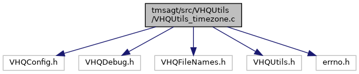

[Data Structures](#nested-classes) \| [Macros](#define-members) \| [Functions](#func-members)

`#include "VHQConfig.h"`
`#include "VHQDebug.h"`
`#include "VHQFileNames.h"`
`#include "VHQUtils.h"`
`#include <errno.h>`

Include dependency graph for VHQUtils_timezone.c:

|                 |                         |
|-----------------|-------------------------|
| Data Structures |                         |
| struct          | [tzhead](#structtzhead) |

|  |  |
|----|----|
| Macros |  |
| #define  | [TZ_MAGIC](#a362553502b52b7e26d09dfd80fa0f5a4)   \"TZif\" |
| #define  | [ZIC_VERSION](#a042f89a46703d9543b28fd0581ba9714)   \'2\' |
| #define  | [TZ_MAX_ZONES](#a45533befffc176af76d7a7fed3799833)   2 |
| #define  | [DST_MAX_ENTR](#a0c0aef51b6bac32607f5b33a4a6543b9)   4 |
| #define  | [TM_SUNDAY](#ac12d450721362983d03aa909cd4d4f07)   0 |
| #define  | [TM_MONDAY](#abfd73ba2c1a691d4387f8b601efc02da)   1 |
| #define  | [TM_TUESDAY](#a5d4b2067b074c145894496e179bf07cb)   2 |
| #define  | [TM_WEDNESDAY](#aa1f447d8a340e172e33fc437b5beda79)   3 |
| #define  | [TM_THURSDAY](#a4b1d1ad4eda8672a61b69a93079b9ca0)   4 |
| #define  | [TM_FRIDAY](#a72ecfaf4d920c569d26877d46f375896)   5 |
| #define  | [TM_SATURDAY](#a9965a81d13cc94d5ca80337b571a3e82)   6 |
| #define  | [SECSPERMIN](#a4fbe1b6bbb5e5f3ff7300e9ea9991f36)   60 |
| #define  | [MINSPERHOUR](#ab86ce8e9674b0f354c5491b71148a867)   60 |
| #define  | [HOURSPERDAY](#a77e3c323dfbddadb30abe56bc5395f91)   24 |
| #define  | [DAYSPERWEEK](#a9bcc879e9358166ad8cb333bd23baf65)   7 |
| #define  | [DAYSPERNYEAR](#a2c13c5660e97dc3fc82bc43cd752178a)   365 |
| #define  | [DAYSPERLYEAR](#ad30f8828a03f696f87110f35e402737e)   366 |
| #define  | [SECSPERHOUR](#a235e72e63a254ecde04f29148b3333fb)   ([SECSPERMIN](#a4fbe1b6bbb5e5f3ff7300e9ea9991f36) \* [MINSPERHOUR](#ab86ce8e9674b0f354c5491b71148a867)) |
| #define  | [SECSPERDAY](#a0711b3fc9ababc38239df227d1bd1e62)   ((long) [SECSPERHOUR](#a235e72e63a254ecde04f29148b3333fb) \* [HOURSPERDAY](#a77e3c323dfbddadb30abe56bc5395f91)) |
| #define  | [SECSPERWEEK](#a66e439955f393c9e47ef9d3be10f1e06)   ((long) [SECSPERDAY](#a0711b3fc9ababc38239df227d1bd1e62) \* [DAYSPERWEEK](#a9bcc879e9358166ad8cb333bd23baf65)) |
| #define  | [MONSPERYEAR](#a60cf8c25165a6cc0fb5dd90685ebe8ba)   12 |

|  |  |
|----|----|
| Functions |  |
| vhq_result_t  | [VHQWriteZone](#a6fcf50b2f356cb6f9765b1cb7a3e7da1) (const char \*string, const int year) |

## DetailedDescription {#detailed-description}

Main Time Zone settings operations

------------------------------------------------------------------------

## DataStructure Documentation {#data-structure-documentation}

## tzhead 

struct tzhead

| Data Fields |                     |     |
|-------------|---------------------|-----|
| char        | tzh_charcnt\[4\]    |     |
| char        | tzh_leapcnt\[4\]    |     |
| char        | tzh_magic\[4\]      |     |
| char        | tzh_reserved\[15\]  |     |
| char        | tzh_timecnt\[4\]    |     |
| char        | tzh_ttisgmtcnt\[4\] |     |
| char        | tzh_ttisstdcnt\[4\] |     |
| char        | tzh_typecnt\[4\]    |     |
| char        | tzh_version\[1\]    |     |

## MacroDefinition Documentation {#macro-definition-documentation}

## DAYSPERLYEAR 

#define DAYSPERLYEAR   366

## DAYSPERNYEAR 

#define DAYSPERNYEAR   365

## DAYSPERWEEK 

#define DAYSPERWEEK   7

## DST_MAX_ENTR 

#define DST_MAX_ENTR   4

## HOURSPERDAY 

#define HOURSPERDAY   24

## MINSPERHOUR 

#define MINSPERHOUR   60

## MONSPERYEAR 

#define MONSPERYEAR   12

## SECSPERDAY 

#define SECSPERDAY   ((long) [SECSPERHOUR](#a235e72e63a254ecde04f29148b3333fb) \* [HOURSPERDAY](#a77e3c323dfbddadb30abe56bc5395f91))

## SECSPERHOUR 

#define SECSPERHOUR   ([SECSPERMIN](#a4fbe1b6bbb5e5f3ff7300e9ea9991f36) \* [MINSPERHOUR](#ab86ce8e9674b0f354c5491b71148a867))

## SECSPERMIN 

#define SECSPERMIN   60

## SECSPERWEEK 

#define SECSPERWEEK   ((long) [SECSPERDAY](#a0711b3fc9ababc38239df227d1bd1e62) \* [DAYSPERWEEK](#a9bcc879e9358166ad8cb333bd23baf65))

## TM_FRIDAY 

#define TM_FRIDAY   5

## TM_MONDAY 

#define TM_MONDAY   1

## TM_SATURDAY 

#define TM_SATURDAY   6

## TM_SUNDAY 

#define TM_SUNDAY   0

## TM_THURSDAY 

#define TM_THURSDAY   4

## TM_TUESDAY 

#define TM_TUESDAY   2

## TM_WEDNESDAY 

#define TM_WEDNESDAY   3

## TZ_MAGIC 

#define TZ_MAGIC   \"TZif\"

## TZ_MAX_ZONES 

#define TZ_MAX_ZONES   2

## ZIC_VERSION 

#define ZIC_VERSION   \'2\'

## FunctionDocumentation {#function-documentation}

## VHQWriteZone() 

vhq_result_t VHQWriteZone

This function performs all activity to setup time zone for device.

**Parameters**

\[in\] **string** = pointer to Linux TZ variable value \[in\] **year** = this year will consist of correct DST switching dates, for Linux.

### Returns

VHQ_SUCCESS, if success.
