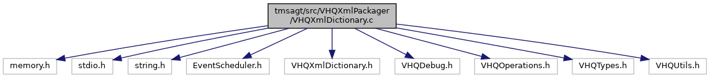

[Data Structures](#nested-classes) \| [Macros](#define-members) \| [Typedefs](#typedef-members) \| [Functions](#func-members)

`#include <memory.h>`
`#include <stdio.h>`
`#include <string.h>`
`#include "EventScheduler.h"`
`#include "VHQXmlDictionary.h"`

Include dependency graph for VHQXmlDictionary.c:

|  |  |
|----|----|
| Data Structures |  |
| struct   | [\_srv_msg_type_xml_conv_t](#struct__srv__msg__type__xml__conv__t) |
| struct   | [\_srv_msg_ident_xml_conv_t](#struct__srv__msg__ident__xml__conv__t) |
| struct   | [\_srv_op_type_xml_conv_t](#struct__srv__op__type__xml__conv__t) |
| struct   | [\_op_identifier_xml_conv_t](#struct__op__identifier__xml__conv__t) |
| struct   | [\_op_handler_xml_conv_t](#struct__op__handler__xml__conv__t) |
| struct   | [\_op_on_error_xml_conv_t](#struct__op__on__error__xml__conv__t) |
| struct   | [\_get_data_mask_xml_conv_t](#struct__get__data__mask__xml__conv__t) |
| struct   | [\_dl_file_method_xml_conv_t](#struct__dl__file__method__xml__conv__t) |
| struct   | [\_dl_file_hash_algo_xml_conv_t](#struct__dl__file__hash__algo__xml__conv__t) |
| struct   | [\_dl_file_dl_type_xml_conv_t](#struct__dl__file__dl__type__xml__conv__t) |
| struct   | [\_dl_file_param_type_xml_conv_t](#struct__dl__file__param__type__xml__conv__t) |
| struct   | [\_ul_file_type_xml_conv_t](#struct__ul__file__type__xml__conv__t) |
| struct   | [\_ul_file_mehod_xml_conv_t](#struct__ul__file__mehod__xml__conv__t) |
| struct   | [\_set_data_indent_xml_conv_t](#struct__set__data__indent__xml__conv__t) |
| struct   | [\_action_type_xml_conv_t](#struct__action__type__xml__conv__t) |
| struct   | [\_app_action_type_xml_conv_t](#struct__app__action__type__xml__conv__t) |
| struct   | [\_recur_unit_type_xml_conv_t](#struct__recur__unit__type__xml__conv__t) |

|  |  |
|----|----|
| Macros |  |
| #define  | [SRV_MSG_TYPE_CONV_TABLE_SIZE](#ac35f2c3298f260c6bda4ad0c6bdabbc0)   (sizeof(srv_msg_type_xml_conv) / sizeof([srv_msg_type_xml_conv_t](#a0187d79cd34320db0c6303e24e06facc))) |
| #define  | [SRV_MSG_IDENT_CONV_TABLE_SIZE](#a6db9cce3bd378582a396bdfa1cf62223)   (sizeof(srv_msg_ident_xml_conv) / sizeof([srv_msg_ident_xml_conv_t](#a30baf68db28d73acdc70b05b283c68d3))) |
| #define  | [SRV_OP_TYPE_CONV_TABLE_SIZE](#a3ac295294efb779ddad034e3ee9c6a31)   (sizeof(srv_op_type_xml_conv) / sizeof([srv_op_type_xml_conv_t](#a157dffc62e9689617049317563d2e594))) |
| #define  | [OP_IDENTIFIER_CONV_TABLE_SIZE](#a625694de79acae7d94b43c022ae03cec)   (sizeof(op_identifier_xml_conv) / sizeof([op_identifier_xml_conv_t](#a170528c0ecb6a2bedc71833f1420b3a4))) |
| #define  | [OP_HANDLER_CONV_TABLE_SIZE](#a3d303318797407f05f8616341d34a399)   (sizeof(op_handler_xml_conv) / sizeof([op_handler_xml_conv_t](#ab0e4d49dd15b4031751e61b5edd114f1))) |
| #define  | [OP_ON_ERROR_CONV_TABLE_SIZE](#af1d3a04f29e9d4c283dc770448dfb776)   (sizeof(op_on_error_xml_conv) / sizeof([op_on_error_xml_conv_t](#ab641778b14e43b69f10548a5e5bad95e))) |
| #define  | [GET_DATA_MASK_CONV_TABLE_SIZE](#acce2948e31ad50169d40cb7da3cbf643)   (sizeof(get_data_mask_xml_conv) / sizeof([get_data_mask_xml_conv_t](#a0834849d027af942829c6c26bd560264))) |
| #define  | [DL_FILE_METHOD_CONV_TABLE_SIZE](#a230903743c9d7c9e6d1c16da483ebc37)   (sizeof(dl_file_method_xml_conv) / sizeof([dl_file_method_xml_conv_t](#aa9ac4b1ed9f27d62eafa71aeba3eea26))) |
| #define  | [DL_FILE_HASH_ALGO_CONV_TABLE_SIZE](#a673ce31e33ce451f1315db762d135754)   (sizeof(dl_file_hash_algo_xml_conv) / sizeof([dl_file_hash_algo_xml_conv_t](#a3c8bde476667f89177d6b27e0fce09f9))) |
| #define  | [DL_FILE_DL_TYPE_CONV_TABLE_SIZE](#a2f3bcb4f5f0c835fb962790a7ace0b11)   (sizeof(dl_file_dl_type_xml_conv) / sizeof([dl_file_dl_type_xml_conv_t](#a64574c4f7ee63c8334914974f02bbeb3))) |
| #define  | [DL_FILE_PARAM_TYPE_CONV_TABLE_SIZE](#ac829f82a9eecb5585af3cd57b2636fce)   (sizeof(dl_file_param_type_xml_conv) / sizeof([dl_file_param_type_xml_conv_t](#ad7699a06edacdb5f7e1b4682d6c09240))) |
| #define  | [UL_FILE_TYPE_CONV_TABLE_SIZE](#aa4db176cff20fa6d25f294d3d662d6ba)   (sizeof(ul_file_type_xml_conv) / sizeof([ul_file_type_xml_conv_t](#a36f6e8cac49ceacc9ceb2d1b1515801d))) |
| #define  | [UL_FILE_METHOD_CONV_TABLE_SIZE](#ae103eac25bb6c706fad5331e5f9a6897)   (sizeof(ul_file_method_xml_conv) / sizeof([ul_file_method_xml_conv_t](#ab7cb150d66032a81ece0abd1f0ee2534))) |
| #define  | [SET_DATA_IDENTIFIER_CONV_TABLE_SIZE](#a663c39927a58ec38399a298609c459ea)   (sizeof(set_data_indent_xml_conv) / sizeof([set_data_indent_xml_conv_t](#aaddc9bc9a057181ddba29a6ff38281d0))) |
| #define  | [ACTION_TYPE_CONV_TABLE_SIZE](#a238241559820c788a47b68482cb73c93)   (sizeof(action_type_xml_conv) / sizeof([action_type_xml_conv_t](#a348b7b6e271e71afd31ebda3f9d4a983))) |
| #define  | [APP_ACTION_TYPE_CONV_TABLE_SIZE](#a5758c21a7b8a175ab0c68d9ddd1cfa2d)   (sizeof(app_action_type_xml_conv) / sizeof([app_action_type_xml_conv_t](#a4372250935b25812298165504eb3cdd8))) |
| #define  | [RECUR_UNIT_TYPE_CONV_TABLE_SIZE](#ab5cb91cffe82957a09a797a48c4c870d)   (sizeof(recur_unit_type_xml_conv) / sizeof([recur_unit_type_xml_conv_t](#a219acb4c715f42797f14506d1254ada8))) |

|  |  |
|----|----|
| Typedefs |  |
| typedef struct [\_srv_msg_type_xml_conv_t](#struct__srv__msg__type__xml__conv__t)  | [srv_msg_type_xml_conv_t](#a0187d79cd34320db0c6303e24e06facc) |
| typedef struct [\_srv_msg_ident_xml_conv_t](#struct__srv__msg__ident__xml__conv__t)  | [srv_msg_ident_xml_conv_t](#a30baf68db28d73acdc70b05b283c68d3) |
| typedef struct [\_srv_op_type_xml_conv_t](#struct__srv__op__type__xml__conv__t)  | [srv_op_type_xml_conv_t](#a157dffc62e9689617049317563d2e594) |
| typedef struct [\_op_identifier_xml_conv_t](#struct__op__identifier__xml__conv__t)  | [op_identifier_xml_conv_t](#a170528c0ecb6a2bedc71833f1420b3a4) |
| typedef struct [\_op_handler_xml_conv_t](#struct__op__handler__xml__conv__t)  | [op_handler_xml_conv_t](#ab0e4d49dd15b4031751e61b5edd114f1) |
| typedef struct [\_op_on_error_xml_conv_t](#struct__op__on__error__xml__conv__t)  | [op_on_error_xml_conv_t](#ab641778b14e43b69f10548a5e5bad95e) |
| typedef struct [\_get_data_mask_xml_conv_t](#struct__get__data__mask__xml__conv__t)  | [get_data_mask_xml_conv_t](#a0834849d027af942829c6c26bd560264) |
| typedef struct [\_dl_file_method_xml_conv_t](#struct__dl__file__method__xml__conv__t)  | [dl_file_method_xml_conv_t](#aa9ac4b1ed9f27d62eafa71aeba3eea26) |
| typedef struct [\_dl_file_hash_algo_xml_conv_t](#struct__dl__file__hash__algo__xml__conv__t)  | [dl_file_hash_algo_xml_conv_t](#a3c8bde476667f89177d6b27e0fce09f9) |
| typedef struct [\_dl_file_dl_type_xml_conv_t](#struct__dl__file__dl__type__xml__conv__t)  | [dl_file_dl_type_xml_conv_t](#a64574c4f7ee63c8334914974f02bbeb3) |
| typedef struct [\_dl_file_param_type_xml_conv_t](#struct__dl__file__param__type__xml__conv__t)  | [dl_file_param_type_xml_conv_t](#ad7699a06edacdb5f7e1b4682d6c09240) |
| typedef struct [\_ul_file_type_xml_conv_t](#struct__ul__file__type__xml__conv__t)  | [ul_file_type_xml_conv_t](#a36f6e8cac49ceacc9ceb2d1b1515801d) |
| typedef struct [\_ul_file_mehod_xml_conv_t](#struct__ul__file__mehod__xml__conv__t)  | [ul_file_method_xml_conv_t](#ab7cb150d66032a81ece0abd1f0ee2534) |
| typedef struct [\_set_data_indent_xml_conv_t](#struct__set__data__indent__xml__conv__t)  | [set_data_indent_xml_conv_t](#aaddc9bc9a057181ddba29a6ff38281d0) |
| typedef struct [\_action_type_xml_conv_t](#struct__action__type__xml__conv__t)  | [action_type_xml_conv_t](#a348b7b6e271e71afd31ebda3f9d4a983) |
| typedef struct [\_app_action_type_xml_conv_t](#struct__app__action__type__xml__conv__t)  | [app_action_type_xml_conv_t](#a4372250935b25812298165504eb3cdd8) |
| typedef struct [\_recur_unit_type_xml_conv_t](#struct__recur__unit__type__xml__conv__t)  | [recur_unit_type_xml_conv_t](#a219acb4c715f42797f14506d1254ada8) |

|  |  |
|----|----|
| Functions |  |
| bool  | [ConvertSrvMsgType](#a7267bf539769d6c24469235cbef26f58) (char \*srv_msg_type_xml, srv_msg_type_t \*srv_msg_type) |
| bool  | [ConvertSrvMsgIdentifier](#a90dfbfc035a27ca5ea4bb564352b8076) (char \*srv_msg_ident_xml, srv_msg_identifier_t \*srv_msg_identifier) |
| bool  | [ConvertSrvOpType](#ae9cd6743dd04495a9eebe5e0594aa60b) (char \*srv_op_type_xml, srv_op_type_t \*srv_op_type) |
| bool  | [ConvertOperationIdentifier](#a61fd1c0a13b8c88bd850b0f97b0c80b6) (char \*op_ident_xml, operation_identifier_t \*op_ident) |
| bool  | [ConvertOperationHandler](#a87f3764e9e3db096280fd795ddb57802) (char \*op_handler_xml, operation_handler_t \*op_handler) |
| bool  | [ConvertOperationOnError](#a0c4815ece3b47dfdbac6afecc224089a) (char \*op_on_error_xml, operation_on_error_t \*op_on_error) |
| bool  | [ConvertDownloadFileMethod](#ac79f3a8be2b18138aed2d7cdad21865e) (char \*dl_file_method_xml, dl_file_method_t \*dl_file_method) |
| bool  | [ConvertDownloadHashAlgo](#a5b553d25f1c452787635b56988fdfff3) (char \*dl_file_hash_algo_xml, dl_file_hash_algo_t \*dl_file_hash_algo) |
| bool  | [ConvertDownloadFileDownloadType](#a3e75c1ddba1b15378e8095291c692a49) (char \*dl_file_dl_type_xml, dl_file_dl_type_t \*dl_file_dl_type) |
| bool  | [ConvertDownloadFileParameterType](#a63df3f65d545b2fd800f2da017200973) (char \*dl_file_param_type_xml, dl_file_dl_type_t \*dl_file_param_type) |
| bool  | [ConvertUploadFileType](#a8c1f089f25be6dd52b543a7b2d40795a) (char \*ul_file_type_xml, upload_type_t \*ul_file_type) |
| bool  | [ConvertUploadFileMethod](#a1d8b3c53adf8e38eed120123e3a6787a) (char \*ul_file_method_xml, upload_method_t \*ul_file_method) |
| bool  | [ConvertGetDataIndentifierToMask](#a2b1bfec27283bb1689de296d78f24b44) (char \*identifier_xml, get_data_mask_t \*get_data_mask, char \*app_name, get_data_subquery_mask_t \*get_data_subquery_mask) |
| bool  | [ConvertIncludeParamToBool](#aa0ede8664ce1d087fff819415f115a14) (char \*include_param) |
| bool  | [ConvertSetDataIndentifierToType](#a06e045075e9d290c9a9d2446168b16c8) (char \*identifier_xml, set_data_type_t \*set_data_type) |
| bool  | [ConvertActionType](#a7ce7eaa67bad34d8f4fa2a534d75ec37) (char \*action_type_xml, term_action_t \*action_type) |
| bool  | [ConvertAppActionType](#a9a8acb0dfbde6b4c89bb590af7d2e106) (char \*app_action_type_xml, app_action_type_t \*app_action_type) |
| bool  | [ConvertTrueFalse](#a38d426a0c8c8aaa14e11adeaf1544eab) (char \*tf_xml, bool \*tf_val) |
| char \*  | [ConvertAppTypeToString](#a5f4912a4b74b5d248173b683ed7b94b3) (app_type_t type) |
| char \*  | [ConvertAppActivationStatusToString](#a2bb3c863916022746bb101e36eb54111) (app_activation_status_t status) |
| char \*  | [ConvertKeyTypeToString](#ad02556336d65e215842541c0af1d9db6) (key_type_t type) |
| char \*  | [ConvertEventMaskToString](#a09d2ed537fccaab89313772a709fbe47) (uint32 mask) |
| char \*  | [ConvertSrvMsgTypeToString](#afac57d99678bdbed0daad7ef4197a513) (srv_msg_type_t type) |
| char \*  | [ConvertSrvMsgIdentifierToString](#adb6dc95feaea83f25a4f63ee956c5dce) (srv_msg_identifier_t ident) |
| char \*  | [ConvertSrvOpTypeToString](#affbc10c50266ec5812a59a003e434b6a) (srv_op_type_t srv_op_type) |
| char \*  | [ConvertUploadTypeToString](#aaac512acff26f2d4971ed406b8d27290) (upload_type_t ul_type) |
| char \*  | [ConvertUploadFileTypeToString](#a38e480c640b9bd64f0f3d348d6104098) (upload_file_type_t ul_file_type) |
| bool  | [ConvertRecurUnitType](#acda6f593e7ac493276656f41018f26db) (char \*recur_unit_type_xml, recur_unit_t \*recur_unit_type) |
| char \*  | [ConvertSeverityToString](#af1d0f1e9e8dcbf78c78725c18b79d995) (int severity) |

## DetailedDescription {#detailed-description}

Dictionary for converting XML strings to useful C types

------------------------------------------------------------------------

## DataStructure Documentation {#data-structure-documentation}

## \_srv_msg_type_xml_conv_t 

struct \_srv_msg_type_xml_conv_t

Debug Stuff Local definitions

| Data Fields    |              |     |
|----------------|--------------|-----|
| srv_msg_type_t | srv_msg_type |     |
| char \*        | xml_data     |     |

## \_srv_msg_ident_xml_conv_t 

struct \_srv_msg_ident_xml_conv_t

| Data Fields          |               |     |
|----------------------|---------------|-----|
| srv_msg_identifier_t | srv_msg_ident |     |
| char \*              | xml_data      |     |

## \_srv_op_type_xml_conv_t 

struct \_srv_op_type_xml_conv_t

| Data Fields   |             |     |
|---------------|-------------|-----|
| srv_op_type_t | srv_op_type |     |
| char \*       | xml_data    |     |

## \_op_identifier_xml_conv_t 

struct \_op_identifier_xml_conv_t

| Data Fields            |               |     |
|------------------------|---------------|-----|
| operation_identifier_t | op_identifier |     |
| char \*                | xml_data      |     |

## \_op_handler_xml_conv_t 

struct \_op_handler_xml_conv_t

| Data Fields         |            |     |
|---------------------|------------|-----|
| operation_handler_t | op_handler |     |
| char \*             | xml_data   |     |

## \_op_on_error_xml_conv_t 

struct \_op_on_error_xml_conv_t

| Data Fields          |             |     |
|----------------------|-------------|-----|
| operation_on_error_t | op_on_error |     |
| char \*              | xml_data    |     |

## \_get_data_mask_xml_conv_t 

struct \_get_data_mask_xml_conv_t

| Data Fields     |               |     |
|-----------------|---------------|-----|
| get_data_mask_t | get_data_mask |     |
| char \*         | xml_data      |     |

## \_dl_file_method_xml_conv_t 

struct \_dl_file_method_xml_conv_t

| Data Fields      |                |     |
|------------------|----------------|-----|
| dl_file_method_t | dl_file_method |     |
| char \*          | xml_data       |     |

## \_dl_file_hash_algo_xml_conv_t 

struct \_dl_file_hash_algo_xml_conv_t

| Data Fields         |                   |     |
|---------------------|-------------------|-----|
| dl_file_hash_algo_t | dl_file_hash_algo |     |
| char \*             | xml_data          |     |

## \_dl_file_dl_type_xml_conv_t 

struct \_dl_file_dl_type_xml_conv_t

| Data Fields       |                 |     |
|-------------------|-----------------|-----|
| dl_file_dl_type_t | dl_file_dl_type |     |
| char \*           | xml_data        |     |

## \_dl_file_param_type_xml_conv_t 

struct \_dl_file_param_type_xml_conv_t

| Data Fields       |                    |     |
|-------------------|--------------------|-----|
| dl_file_dl_type_t | dl_file_param_type |     |
| char \*           | xml_data           |     |

## \_ul_file_type_xml_conv_t 

struct \_ul_file_type_xml_conv_t

| Data Fields   |          |     |
|---------------|----------|-----|
| upload_type_t | ul_type  |     |
| char \*       | xml_data |     |

## \_ul_file_mehod_xml_conv_t 

struct \_ul_file_mehod_xml_conv_t

| Data Fields     |           |     |
|-----------------|-----------|-----|
| upload_method_t | ul_method |     |
| char \*         | xml_data  |     |

## \_set_data_indent_xml_conv_t 

struct \_set_data_indent_xml_conv_t

| Data Fields     |               |     |
|-----------------|---------------|-----|
| set_data_type_t | set_data_type |     |
| char \*         | xml_data      |     |

## \_action_type_xml_conv_t 

struct \_action_type_xml_conv_t

| Data Fields   |             |     |
|---------------|-------------|-----|
| term_action_t | action_type |     |
| char \*       | xml_data    |     |

## \_app_action_type_xml_conv_t 

struct \_app_action_type_xml_conv_t

| Data Fields       |                 |     |
|-------------------|-----------------|-----|
| app_action_type_t | app_action_type |     |
| char \*           | xml_data        |     |

## \_recur_unit_type_xml_conv_t 

struct \_recur_unit_type_xml_conv_t

| Data Fields  |                 |     |
|--------------|-----------------|-----|
| recur_unit_t | recur_unit_type |     |
| char \*      | xml_data        |     |

## MacroDefinition Documentation {#macro-definition-documentation}

## ACTION_TYPE_CONV_TABLE_SIZE 

#define ACTION_TYPE_CONV_TABLE_SIZE   (sizeof(action_type_xml_conv) / sizeof([action_type_xml_conv_t](#a348b7b6e271e71afd31ebda3f9d4a983)))

## APP_ACTION_TYPE_CONV_TABLE_SIZE 

#define APP_ACTION_TYPE_CONV_TABLE_SIZE   (sizeof(app_action_type_xml_conv) / sizeof([app_action_type_xml_conv_t](#a4372250935b25812298165504eb3cdd8)))

## DL_FILE_DL_TYPE_CONV_TABLE_SIZE 

#define DL_FILE_DL_TYPE_CONV_TABLE_SIZE   (sizeof(dl_file_dl_type_xml_conv) / sizeof([dl_file_dl_type_xml_conv_t](#a64574c4f7ee63c8334914974f02bbeb3)))

## DL_FILE_HASH_ALGO_CONV_TABLE_SIZE 

#define DL_FILE_HASH_ALGO_CONV_TABLE_SIZE   (sizeof(dl_file_hash_algo_xml_conv) / sizeof([dl_file_hash_algo_xml_conv_t](#a3c8bde476667f89177d6b27e0fce09f9)))

## DL_FILE_METHOD_CONV_TABLE_SIZE 

#define DL_FILE_METHOD_CONV_TABLE_SIZE   (sizeof(dl_file_method_xml_conv) / sizeof([dl_file_method_xml_conv_t](#aa9ac4b1ed9f27d62eafa71aeba3eea26)))

## DL_FILE_PARAM_TYPE_CONV_TABLE_SIZE 

#define DL_FILE_PARAM_TYPE_CONV_TABLE_SIZE   (sizeof(dl_file_param_type_xml_conv) / sizeof([dl_file_param_type_xml_conv_t](#ad7699a06edacdb5f7e1b4682d6c09240)))

## GET_DATA_MASK_CONV_TABLE_SIZE 

#define GET_DATA_MASK_CONV_TABLE_SIZE   (sizeof(get_data_mask_xml_conv) / sizeof([get_data_mask_xml_conv_t](#a0834849d027af942829c6c26bd560264)))

## OP_HANDLER_CONV_TABLE_SIZE 

#define OP_HANDLER_CONV_TABLE_SIZE   (sizeof(op_handler_xml_conv) / sizeof([op_handler_xml_conv_t](#ab0e4d49dd15b4031751e61b5edd114f1)))

## OP_IDENTIFIER_CONV_TABLE_SIZE 

#define OP_IDENTIFIER_CONV_TABLE_SIZE   (sizeof(op_identifier_xml_conv) / sizeof([op_identifier_xml_conv_t](#a170528c0ecb6a2bedc71833f1420b3a4)))

## OP_ON_ERROR_CONV_TABLE_SIZE 

#define OP_ON_ERROR_CONV_TABLE_SIZE   (sizeof(op_on_error_xml_conv) / sizeof([op_on_error_xml_conv_t](#ab641778b14e43b69f10548a5e5bad95e)))

## RECUR_UNIT_TYPE_CONV_TABLE_SIZE 

#define RECUR_UNIT_TYPE_CONV_TABLE_SIZE   (sizeof(recur_unit_type_xml_conv) / sizeof([recur_unit_type_xml_conv_t](#a219acb4c715f42797f14506d1254ada8)))

## SET_DATA_IDENTIFIER_CONV_TABLE_SIZE 

#define SET_DATA_IDENTIFIER_CONV_TABLE_SIZE   (sizeof(set_data_indent_xml_conv) / sizeof([set_data_indent_xml_conv_t](#aaddc9bc9a057181ddba29a6ff38281d0)))

## SRV_MSG_IDENT_CONV_TABLE_SIZE 

#define SRV_MSG_IDENT_CONV_TABLE_SIZE   (sizeof(srv_msg_ident_xml_conv) / sizeof([srv_msg_ident_xml_conv_t](#a30baf68db28d73acdc70b05b283c68d3)))

## SRV_MSG_TYPE_CONV_TABLE_SIZE 

#define SRV_MSG_TYPE_CONV_TABLE_SIZE   (sizeof(srv_msg_type_xml_conv) / sizeof([srv_msg_type_xml_conv_t](#a0187d79cd34320db0c6303e24e06facc)))

## SRV_OP_TYPE_CONV_TABLE_SIZE 

#define SRV_OP_TYPE_CONV_TABLE_SIZE   (sizeof(srv_op_type_xml_conv) / sizeof([srv_op_type_xml_conv_t](#a157dffc62e9689617049317563d2e594)))

## UL_FILE_METHOD_CONV_TABLE_SIZE 

#define UL_FILE_METHOD_CONV_TABLE_SIZE   (sizeof(ul_file_method_xml_conv) / sizeof([ul_file_method_xml_conv_t](#ab7cb150d66032a81ece0abd1f0ee2534)))

## UL_FILE_TYPE_CONV_TABLE_SIZE 

#define UL_FILE_TYPE_CONV_TABLE_SIZE   (sizeof(ul_file_type_xml_conv) / sizeof([ul_file_type_xml_conv_t](#a36f6e8cac49ceacc9ceb2d1b1515801d)))

## TypedefDocumentation {#typedef-documentation}

## action_type_xml_conv_t 

typedef struct [\_action_type_xml_conv_t](#struct__action__type__xml__conv__t) [action_type_xml_conv_t](#a348b7b6e271e71afd31ebda3f9d4a983)

## app_action_type_xml_conv_t 

typedef struct [\_app_action_type_xml_conv_t](#struct__app__action__type__xml__conv__t) [app_action_type_xml_conv_t](#a4372250935b25812298165504eb3cdd8)

## dl_file_dl_type_xml_conv_t 

typedef struct [\_dl_file_dl_type_xml_conv_t](#struct__dl__file__dl__type__xml__conv__t) [dl_file_dl_type_xml_conv_t](#a64574c4f7ee63c8334914974f02bbeb3)

## dl_file_hash_algo_xml_conv_t 

typedef struct [\_dl_file_hash_algo_xml_conv_t](#struct__dl__file__hash__algo__xml__conv__t) [dl_file_hash_algo_xml_conv_t](#a3c8bde476667f89177d6b27e0fce09f9)

## dl_file_method_xml_conv_t 

typedef struct [\_dl_file_method_xml_conv_t](#struct__dl__file__method__xml__conv__t) [dl_file_method_xml_conv_t](#aa9ac4b1ed9f27d62eafa71aeba3eea26)

## dl_file_param_type_xml_conv_t 

typedef struct [\_dl_file_param_type_xml_conv_t](#struct__dl__file__param__type__xml__conv__t) [dl_file_param_type_xml_conv_t](#ad7699a06edacdb5f7e1b4682d6c09240)

## get_data_mask_xml_conv_t 

typedef struct [\_get_data_mask_xml_conv_t](#struct__get__data__mask__xml__conv__t) [get_data_mask_xml_conv_t](#a0834849d027af942829c6c26bd560264)

## op_handler_xml_conv_t 

typedef struct [\_op_handler_xml_conv_t](#struct__op__handler__xml__conv__t) [op_handler_xml_conv_t](#ab0e4d49dd15b4031751e61b5edd114f1)

## op_identifier_xml_conv_t 

typedef struct [\_op_identifier_xml_conv_t](#struct__op__identifier__xml__conv__t) [op_identifier_xml_conv_t](#a170528c0ecb6a2bedc71833f1420b3a4)

## op_on_error_xml_conv_t 

typedef struct [\_op_on_error_xml_conv_t](#struct__op__on__error__xml__conv__t) [op_on_error_xml_conv_t](#ab641778b14e43b69f10548a5e5bad95e)

## recur_unit_type_xml_conv_t 

typedef struct [\_recur_unit_type_xml_conv_t](#struct__recur__unit__type__xml__conv__t) [recur_unit_type_xml_conv_t](#a219acb4c715f42797f14506d1254ada8)

## set_data_indent_xml_conv_t 

typedef struct [\_set_data_indent_xml_conv_t](#struct__set__data__indent__xml__conv__t) [set_data_indent_xml_conv_t](#aaddc9bc9a057181ddba29a6ff38281d0)

## srv_msg_ident_xml_conv_t 

typedef struct [\_srv_msg_ident_xml_conv_t](#struct__srv__msg__ident__xml__conv__t) [srv_msg_ident_xml_conv_t](#a30baf68db28d73acdc70b05b283c68d3)

## srv_msg_type_xml_conv_t 

typedef struct [\_srv_msg_type_xml_conv_t](#struct__srv__msg__type__xml__conv__t) [srv_msg_type_xml_conv_t](#a0187d79cd34320db0c6303e24e06facc)

Debug Stuff Local definitions

## srv_op_type_xml_conv_t 

typedef struct [\_srv_op_type_xml_conv_t](#struct__srv__op__type__xml__conv__t) [srv_op_type_xml_conv_t](#a157dffc62e9689617049317563d2e594)

## ul_file_method_xml_conv_t 

typedef struct [\_ul_file_mehod_xml_conv_t](#struct__ul__file__mehod__xml__conv__t) [ul_file_method_xml_conv_t](#ab7cb150d66032a81ece0abd1f0ee2534)

## ul_file_type_xml_conv_t 

typedef struct [\_ul_file_type_xml_conv_t](#struct__ul__file__type__xml__conv__t) [ul_file_type_xml_conv_t](#a36f6e8cac49ceacc9ceb2d1b1515801d)

## FunctionDocumentation {#function-documentation}

## ConvertActionType() 

bool ConvertActionType

This function convert the terminal action string into an enum. Used for terminal actions or post install actions.

**Parameters**

\[in\] **action_type_xml** = terminal action string. \[out\] **action_type** = terminal action enum value

### Returns

TRUE, if terminal action string found and conversion success. FALSE, otherwise

## ConvertAppActionType() 

bool ConvertAppActionType

This function convert the app action string into an enum.

**Parameters**

\[in\] **app_action_type_xml** = app action string. \[out\] **app_action_type** = app action enum value

### Returns

TRUE, if app action string found and conversion success. FALSE, otherwise

## ConvertAppActivationStatusToString() 

char\* ConvertAppActivationStatusToString

This function convert the application activation status enum to a string.

**Parameters**

\[in\] **status** = app activation status.

### Returns

char\*, the app activation string; NULL, if not found.

## ConvertAppTypeToString() 

char\* ConvertAppTypeToString

This function convert the an incoming enum application type to string.

**Parameters**

\[in\] **type** = application type.

### Returns

char\*, converted app type string; NULL, if not found.

## ConvertDownloadFileDownloadType() 

bool ConvertDownloadFileDownloadType

This function convert the download file type string into an enum

**Parameters**

\[in\] **dl_file_dl_type_xml** = download file string. \[out\] **dl_file_dl_type** = enum of download file type stored.

### Returns

TRUE, if download file type string found and conversion success. FALSE, otherwise

## ConvertDownloadFileMethod() 

bool ConvertDownloadFileMethod

This function convert the download method into an enum

**Parameters**

\[in\] **dl_file_method_xml** = download method string \[out\] **dl_file_method** = enum of download method stored.

### Returns

TRUE, if download method found and conversion success. FALSE, otherwise

## ConvertDownloadFileParameterType() 

bool ConvertDownloadFileParameterType

This function convert Download File Parameter Type string into an enum

**Parameters**

\[in\] **dl_file_param_type_xml** = download file parameter string. \[out\] **dl_file_param_type** = enum of download file parameter type stored.

### Returns

TRUE, if download file parameter type string found and conversion success. FALSE, otherwise

## ConvertDownloadHashAlgo() 

bool ConvertDownloadHashAlgo

This function convert the hash algorithm string into an enum

**Parameters**

\[in\] **dl_file_hash_algo_xml** = hash algo string \[out\] **dl_file_hash_algo** = enum of hash algo stored.

### Returns

TRUE, if hash algo string found and conversion success. FALSE, otherwise

## ConvertEventMaskToString() 

char\* ConvertEventMaskToString

This function convert the event mask to a string.

**Parameters**

\[in\] **mask** = event mask value.

### Returns

char\*, if event type string found; NULL, if not found.

## ConvertGetDataIndentifierToMask() 

bool ConvertGetDataIndentifierToMask

This function convert the query mask string into an enum.

**Parameters**

\[in\] **identifier_xml** = data set query string. \[out\] **get_data_mask** = data mask value \[out\] **app_name** = application name \[out\] **get_data_subquery_mask** = data sub query mask

### Returns

TRUE, if data set query string found and conversion success. FALSE, otherwise

## ConvertIncludeParamToBool() 

bool ConvertIncludeParamToBool

## ConvertKeyTypeToString() 

char\* ConvertKeyTypeToString

This function convert the key type to a string for sending Key Data.

**Parameters**

\[in\] **type** = key type enum.

### Returns

char\*, the converted key type string; NULL, if not found.

## ConvertOperationHandler() 

bool ConvertOperationHandler

This function convert the operation handler into an enum

**Parameters**

\[in\] **op_handler_xml** = operation handler string \[out\] **op_handler** = enum of operation identifier stored into.

### Returns

TRUE, if operation name found and conversion done. FALSE, otherwise

## ConvertOperationIdentifier() 

bool ConvertOperationIdentifier

This function convert the operation identifier into an enum.

**Parameters**

\[in\] **op_ident_xml** = pointer to string in an attribute in xml. \[out\] **op_ident** = location operation identifier stored into .

### Returns

TRUE, if operation name found. FALSE, otherwise

## ConvertOperationOnError() 

bool ConvertOperationOnError

This function convert the operation on error into an enum

**Parameters**

\[in\] **op_on_error_xml** = operation on error string. \[out\] **op_on_error** = enum of operation identifier stored.

### Returns

TRUE, if error name found and conversion success. FALSE, otherwise

## ConvertRecurUnitType() 

bool ConvertRecurUnitType

This function convert the a recurring unit type string to an enum.

**Parameters**

\[in\] **recur_unit_type_xml** = recurring unit type string. \[out\] **recur_unit_type** = recurring unit enum

### Returns

TRUE, if recurring unit string found and converted to enum; FASLE, if not found.

## ConvertSetDataIndentifierToType() 

bool ConvertSetDataIndentifierToType

This function convert the set data string into an enum.

**Parameters**

\[in\] **identifier_xml** = set data string. \[out\] **set_data_type** = set data enum value

### Returns

TRUE, if set data string found and conversion success. FALSE, otherwise

## ConvertSeverityToString() 

char\* ConvertSeverityToString

This function convert the a int severity level to corresponding string.

**Parameters**

\[in\] **severity** = int type severity level.

### Returns

char\*, converted severity level string; NULL, if not found.

## ConvertSrvMsgIdentifier() 

bool ConvertSrvMsgIdentifier

This function convert the server message identifier type string to an enum.

**Parameters**

\[in\] **srv_msg_ident_xml** = server message identifier type string. \[out\] **srv_msg_identifier** = server message identifier enum.

### Returns

TRUE, server message identifier string found and conversion done. FALSE, otherwise

## ConvertSrvMsgIdentifierToString() 

char\* ConvertSrvMsgIdentifierToString

This function convert the server message identifier enum to a string.

**Parameters**

\[in\] **ident** = server message identifier enum.

### Returns

char\*, if server message identifier type string found; NULL, if not found.

## ConvertSrvMsgType() 

bool ConvertSrvMsgType

Local functions Global functions

This function convert the server message type string to an enum.

**Parameters**

\[in\] **srv_msg_type_xml** = server message type string. \[out\] **srv_msg_type** = server message type enum.

### Returns

TRUE, if server message type string found and conversion done. FALSE, otherwise

## ConvertSrvMsgTypeToString() 

char\* ConvertSrvMsgTypeToString

This function convert the server message type enum to a string.

**Parameters**

\[in\] **type** = server message type enum.

### Returns

char\*, if server message type string found; NULL, if not found.

## ConvertSrvOpType() 

bool ConvertSrvOpType

This function convert the server operation type string to an enum.

**Parameters**

\[in\] **srv_op_type_xml** = server operation type string. \[out\] **srv_op_type** = server operation type enum .

### Returns

TRUE, server operation string found and conversion done. FALSE, otherwise

## ConvertSrvOpTypeToString() 

char\* ConvertSrvOpTypeToString

This function convert the server operation type enum to a string.

**Parameters**

\[in\] **srv_op_type** = server operation type enum.

### Returns

char\*, if server operation type string found; NULL, if not found.

## ConvertTrueFalse() 

bool ConvertTrueFalse

This function convert the an incoming string \"TRUE\"/\"FALSE\" to its bool.

**Parameters**

\[in\] **tf_xml** = incoming string. \[out\] **tf_val** = converted bool value

### Returns

TRUE, if string found and conversion success. FALSE, otherwise

## ConvertUploadFileMethod() 

bool ConvertUploadFileMethod

This function convert upload File method into an enum

**Parameters**

\[in\] **ul_file_method_xml** = upload file method string. \[out\] **ul_file_method** = enum of upload file method stored.

### Returns

TRUE, if upload file method string found and conversion success. FALSE, otherwise

## ConvertUploadFileType() 

bool ConvertUploadFileType

This function convert upload File type string into an enum

**Parameters**

\[in\] **ul_file_type_xml** = upload file type string. \[out\] **ul_file_type** = enum of upload file type stored.

### Returns

TRUE, if upload file type string found and conversion success. FALSE, otherwise

## ConvertUploadFileTypeToString() 

char\* ConvertUploadFileTypeToString

This function convert the upload file type to a string.

**Parameters**

\[in\] **ul_file_type** = upload file type enum.

### Returns

char\*, if upload file type string found; NULL, if not found.

## ConvertUploadTypeToString() 

char\* ConvertUploadTypeToString

This function convert the upload type to a string.

**Parameters**

\[in\] **ul_type** = upload type enum.

### Returns

char\*, if upload type string found; NULL, if not found.
