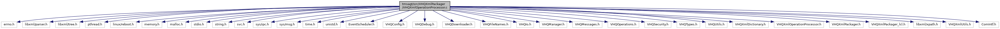

[Macros](#define-members) \| [Functions](#func-members) \| [Variables](#var-members)

`#include <errno.h>`
`#include <libxml/parser.h>`
`#include <libxml/tree.h>`
`#include <pthread.h>`
`#include <linux/reboot.h>`
`#include <memory.h>`
`#include <malloc.h>`
`#include <stdio.h>`
`#include <string.h>`
`#include <svc.h>`
`#include <sys/ipc.h>`
`#include <sys/msg.h>`
`#include <time.h>`
`#include <unistd.h>`
`#include "EventScheduler.h"`
`#include "VHQConfig.h"`
`#include "VHQDebug.h"`
`#include "VHQDownloader.h"`
`#include "VHQFileNames.h"`
`#include "VHQIo.h"`
`#include "VHQManager.h"`
`#include "VHQMessages.h"`
`#include "VHQOperations.h"`
`#include "VHQSecurity.h"`
`#include "VHQTypes.h"`
`#include "VHQUtils.h"`
`#include "VHQXmlDictionary.h"`
`#include "VHQXmlOperationProcessor.h"`
`#include "VHQXmlPackager_lcl.h"`
`#include "VHQXmlUtils.h"`
`#include "ComIntf.h"`

Include dependency graph for VHQXmlOperationProcessor.c:

|  |  |
|----|----|
| Macros |  |
| #define  | [CopyStrAttrFromNode](#ac51c5f61eebfd3689519e57fdb070db5)(dest, top_node, attr)   { char \*pszTmp=<a href="_v_h_q_xml_utils_8c.md#a0f8044c829e87a8c2394569b27403892">GetStrAttrFromNode</a>(top_node, attr); <a href="_v_h_q__vfisyspm__wrapper_8cpp.md#a12d403643236776c26b6081a4e570a27">if</a> (pszTmp){ strcpy(dest, pszTmp); xmlFree(pszTmp);} } |
| #define  | [NULL_STR](#a4e344b56b80d155c5821a556099f96a7)   \"Null\" |
| #define  | [MAX_DL_FILE_OPERATIONS](#a817c39fc8d19814b7156b6657a7808fb)   5 |
| #define  | [MAX_UL_FILE_OPERATIONS](#a09f16408ea88a07d83932bcfbe78770a)   5 |
| #define  | [MAX_GET_DATA_OPERATIONS](#a9cf8d12538bc1f491bbde25839350671)   2 |
| #define  | [MAX_SET_DATA_OPERATIONS](#af1f2d4b0c6b490c827f00b95f656e7a0)   1 |
| #define  | [KMAILMAN_VERSION_STR](#a11ee4924e655431af75d0d132b0b0116)   \"kmailman_Version\" |
| #define  | [KMAILMAN_VERSION_UNKNOWN_STR](#a33e7b88f98019ab20a15c0c79e09385d)   \"Kmailman version unknown \" |
| #define  | [MAX_KEYS](#a3077ecca3770bdee50e6a17dfb55d002)   50 |

|  |  |
|----|----|
| Functions |  |
| int  | [reboot](#a55ea6c527be10382bb077aab88e57d0c) (int) |
| pre_post_event_result_t  | [StandardPreEventCallback](#a4449210a51db13654012701f215981eb) (callback_t eCallback, event_set_id_t event_set_id, event_id_t event_id, bool app_approval_required) |
| pre_post_event_result_t  | [StandardPostEventCallback](#a36ea9f236385d98259f68863639c4d39) (void) |
| event_result_t  | [LaunchDownloader](#a23e9bd8c2782536136188c1699a521f0) (void \*arg) |
| event_result_t  | [GetDataProcessor](#a5196124e4f81a7eadad57cd44aa6113b) (void \*arg) |
| event_result_t  | [GetDiagDataProcessor](#a33e9cf65007b8bd4caecc197f3ddcc13) (void \*arg) |
| event_result_t  | [SetDataProcessor](#ab5522eda36a9a6756ce023947c9f440f) (void \*arg) |
| bool  | [RequestDirListFromRoot](#a73635585ad2aacd2a118dbad2a7458df) (char \*directory) |
| event_result_t  | [TermActProcessor](#a84058fcb8c826c60677dac609c9ca8f9) (void \*arg) |
| event_result_t  | [DoFileUpload](#a3bca898d4b7e3484429460ec5647e880) (void \*arg) |
| event_result_t  | [FileUploader](#a4872b03ebbcaff321ae41e0db5360ec5) (void \*arg) |
| event_result_t  | [AppActionProcessor](#a528ff321babe63a0e26a08312defa173) (void \*arg) |
| event_result_t  | [DelFileProcessor](#a6aa04c553e7b73aae909e0aab553a966) (void \*arg) |
| event_result_t  | [GetParamUpdateProcessor](#a497a25243a0caf78ebd3b98264400709) (void \*arg) |
| vhq_result_t  | [ScheduleDownload](#a1687a68b8d54016b95b6863ee60ddad8) (operation_t \*operation, download_file_content_t \*dl_file_content, int comm_id, int message_id, srv_msg_type_t srv_msg_type, srv_op_type_t srv_op_type, operation_set_event_t \*\*<a href="_v_h_q_xml_packager_8c.md#afa29bd72ad171acdfa84fc984379b3ac">op_set_events</a>, uint32 \*num_events_extracted) |
| vhq_result_t  | [ScheduleGetData](#ad82370916a7d319a0506ed5aa2b6c68e) (operation_t \*operation, get_data_content_t \*get_data_content, int comm_id, int message_id, srv_msg_type_t srv_msg_type, srv_op_type_t srv_op_type, operation_set_event_t \*\*<a href="_v_h_q_xml_packager_8c.md#afa29bd72ad171acdfa84fc984379b3ac">op_set_events</a>, uint32 \*num_events_extracted) |
| vhq_result_t  | [ScheduleGetDiagData](#aaa0799d13cb1431ceb36ca88f8a9b249) (operation_t \*operation, get_data_content_t \*get_data_content, int comm_id, int message_id, srv_msg_type_t srv_msg_type, srv_op_type_t srv_op_type, operation_set_event_t \*\*<a href="_v_h_q_xml_packager_8c.md#afa29bd72ad171acdfa84fc984379b3ac">op_set_events</a>, uint32 \*num_events_extracted) |
| vhq_result_t  | [ScheduleSetData](#a7ca27986c5482b2900ecf6f9f4daaf31) (operation_t \*operation, set_data_content_t \*set_data_content, int comm_id, int message_id, srv_msg_type_t srv_msg_type, srv_op_type_t srv_op_type, operation_set_event_t \*\*<a href="_v_h_q_xml_packager_8c.md#afa29bd72ad171acdfa84fc984379b3ac">op_set_events</a>, uint32 \*num_events_extracted) |
| vhq_result_t  | [ScheduleAction](#aab04d35558288fa04f5989737f897b08) (operation_t \*operation, term_act_content_t \*action_content, int comm_id, int message_id, srv_msg_type_t srv_msg_type, srv_op_type_t srv_op_type, operation_set_event_t \*\*<a href="_v_h_q_xml_packager_8c.md#afa29bd72ad171acdfa84fc984379b3ac">op_set_events</a>, uint32 \*num_events_extracted) |
| vhq_result_t  | [ScheduleAppAction](#ab2082c9aaab13cea9ffcc6e29fa5d96d) (operation_t \*operation, app_action_content_t \*app_action_content, int comm_id, int message_id, srv_msg_type_t srv_msg_type, srv_op_type_t srv_op_type, operation_set_event_t \*\*<a href="_v_h_q_xml_packager_8c.md#afa29bd72ad171acdfa84fc984379b3ac">op_set_events</a>, uint32 \*num_events_extracted) |
| vhq_result_t  | [ScheduleDeleteFile](#a65483ed7b1a364497ead4b97066d4d51) (operation_t \*operation, del_file_content_t \*del_file_content, int comm_id, int message_id, srv_msg_type_t srv_msg_type, srv_op_type_t srv_op_type, operation_set_event_t \*\*<a href="_v_h_q_xml_packager_8c.md#afa29bd72ad171acdfa84fc984379b3ac">op_set_events</a>, uint32 \*num_events_extracted) |
| vhq_result_t  | [ScheduleCallback](#a8c235cadfb760ce1d7b98fb4d0efb205) (operation_t \*operation, int comm_id, int message_id, srv_msg_type_t srv_msg_type, srv_op_type_t srv_op_type, operation_set_event_t \*\*<a href="_v_h_q_xml_packager_8c.md#afa29bd72ad171acdfa84fc984379b3ac">op_set_events</a>, uint32 \*num_events_extracted) |
| vhq_result_t  | [ScheduleGetParamUpdates](#a66ae8928ef1d33910a3755b08d1d93e5) (operation_t \*operation, int comm_id, int message_id, srv_msg_type_t srv_msg_type, srv_op_type_t srv_op_type, operation_set_event_t \*\*<a href="_v_h_q_xml_packager_8c.md#afa29bd72ad171acdfa84fc984379b3ac">op_set_events</a>, uint32 \*num_events_extracted) |
| vhq_result_t  | [ScheduleUpload](#a2a7bded192648ed95f3103ccabe044c7) (operation_t \*operation, upload_file_content_t \*ul_file_content, int comm_id, int message_id, srv_msg_type_t srv_msg_type, srv_op_type_t srv_op_type, operation_set_event_t \*\*<a href="_v_h_q_xml_packager_8c.md#afa29bd72ad171acdfa84fc984379b3ac">op_set_events</a>, uint32 \*num_events_extracted) |
| void  | [VHQXmlOperationProcessorInit](#a682750bd6289422730fa53acbbf4c547) (void) |
| vhq_result_t  | [ProcessOperation](#a8c29cea60413ff96b51e61ec932bc827) (xmlNode \*operation_element, xmlDocPtr \*status_report_doc, int comm_id, int message_id, srv_msg_type_t srv_msg_type, uint32 op_set_id, operation_set_event_t \*\*<a href="_v_h_q_xml_packager_8c.md#afa29bd72ad171acdfa84fc984379b3ac">op_set_events</a>, uint32 \*num_events_extracted) |
| void  | [SendFailureResponse](#a48852460078e2efc4acad9e5d68e59a6) (vhq_result_t failure, int comm_id, char \*operation_id, int message_id, srv_msg_type_t srv_msg_type, srv_op_type_t srv_op_type, uint32 operation_set_id, uint32 recur_id) |
| void  | [VHQXmlExtractProcessingInformation](#a331be71b2bc8d7f84366e8bff9138bb7) (const char \*DeviceMessageXMLData, const char \*ServerResponseXMLData, event_id_t event_id) |
| void  | [VHQXmlExtractServerError](#a402af02ee2fb10e337eaac8a64adb333) (const char \*XMLData, int XMLDataSize, char \*error, unsigned int error_size) |

|  |  |
|----|----|
| Variables |  |
| customAppInfo_t  | [customAppInfo](#a4fa07e1af7c095b467c1cb9590babc26) \[<a href="svc__tms_8h.md#ac8d1ce1f93c7d41105b9eaa7c2eda03a">TMS_MAX_REGISTERED_APPS</a>\] |
| pthread_mutex_t  | [appInfoMutex](#a01df92b1953c3495dbfe4cf121a68ca0) |

## DetailedDescription {#detailed-description}

Processes Xml Operations from the server

## MacroDefinition Documentation {#macro-definition-documentation}

## CopyStrAttrFromNode 

#define CopyStrAttrFromNode

Local definitions

## KMAILMAN_VERSION_STR 

#define KMAILMAN_VERSION_STR   \"kmailman_Version\"

## KMAILMAN_VERSION_UNKNOWN_STR 

#define KMAILMAN_VERSION_UNKNOWN_STR   \"Kmailman version unknown \"

## MAX_DL_FILE_OPERATIONS 

#define MAX_DL_FILE_OPERATIONS   5

## MAX_GET_DATA_OPERATIONS 

#define MAX_GET_DATA_OPERATIONS   2

## MAX_KEYS 

#define MAX_KEYS   50

## MAX_SET_DATA_OPERATIONS 

#define MAX_SET_DATA_OPERATIONS   1

## MAX_UL_FILE_OPERATIONS 

#define MAX_UL_FILE_OPERATIONS   5

## NULL_STR 

#define NULL_STR   \"Null\"

## FunctionDocumentation {#function-documentation}

## AppActionProcessor() 

event_result_t AppActionProcessor

This is the starting of AppActionProcessor event. Called by CommonOperationLauncher, if pre-event callback is a success.

**Parameters**

\[in\] **arg** = argument containing the information about the event.

### Returns

event_result_t, result of the event.

## DelFileProcessor() 

event_result_t DelFileProcessor

This is the starting of DelFileProcessor event. Called by CommonOperationLauncher, if pre-event callback is a success.

**Parameters**

\[in\] **arg** = argument containing the information about the event.

### Returns

event_result_t, result of the event.

## DoFileUpload() 

event_result_t DoFileUpload

This function performs the fileuploader operation.

**Parameters**

\[in\] **arg** = argument containing the information about the event.

### Returns

event_result_t, result of the event.

## FileUploader() 

event_result_t FileUploader

This is the starting of FileUploader event. Called by CommonOperationLauncher, if pre-event callback is a success.

**Parameters**

\[in\] **arg** = argument containing the information about the event.

### Returns

event_result_t, result of the event.

## GetDataProcessor() 

event_result_t GetDataProcessor

This is the starting of GetDataProcessor event. Called by CommonOperationLauncher, if pre-event callback is a success.

**Parameters**

\[in\] **arg** = argument containing the information about the event.

### Returns

event_result_t, result of the event.

## GetDiagDataProcessor() 

event_result_t GetDiagDataProcessor

This is the starting of GetDiagDataProcessor event. Called by CommonOperationLauncher, if pre-event callback is a success.

**Parameters**

\[in\] **arg** = argument containing the information about the event.

### Returns

event_result_t, result of the event.

## GetParamUpdateProcessor() 

event_result_t GetParamUpdateProcessor

This is the starting of GetParamUpdateProcessor event. Called by CommonOperationLauncher, if pre-event callback is a success.

**Parameters**

\[in\] **arg** = argument containing the information about the event.

### Returns

event_result_t, result of the event.

## LaunchDownloader() 

event_result_t LaunchDownloader

This is the starting of LaunchDownloader event callback. Called by CommonOperationLauncher, if pre-event callback is a success.

**Parameters**

\[in\] **arg** = argument containing the information about the event.

### Returns

event_result_t, result of the event.

## ProcessOperation() 

vhq_result_t ProcessOperation

This function schedules event depending on the operation_identifier_t received from management plan.

**Parameters**

\[in\] **operation_element** = pointer to xml node under which operation related data are present. \[in\] **status_report_doc** = pointer to xml doc to be created as response to server. \[in\] **comm_id** = communication ID of message \[in\] **message_id** = message ID \[in\] **srv_msg_type** = server message type \[in\] **op_set_id** = operation set ID \[in\] **op_set_events** = operation sets event data \[in\] **num_events_extracted** = number of events extracted.

### Returns

vhq_result_t

## reboot() 

int reboot

## RequestDirListFromRoot() 

bool RequestDirListFromRoot

This function lists the files from the root process.

**Parameters**

\[in\] **directory** = directory from which filenames should be copied.

### Returns

TRUE, if success; FALSE, otherwise

## ScheduleAction() 

vhq_result_t ScheduleAction

This function schedules terminal action event if the management plan contains a terminal action operation.

**Parameters**

\[in\] **operation** = operation related data \[in\] **action_content** = terminal action type details \[in\] **comm_id** = communication ID \[in\] **message_id** = message ID \[in\] **srv_msg_type** = server message type \[in\] **srv_op_type** = server operation type \[in\] **op_set_events** = event data \[in\] **num_events_extracted** = number of events

### Returns

vhq_result_t, VHQ_SUCCESS, if success.

## ScheduleAppAction() 

vhq_result_t ScheduleAppAction

This function schedules app action event if the management plan contains a app action operation.

**Parameters**

\[in\] **operation** = operation related data \[in\] **app_action_content** = app action type details \[in\] **comm_id** = communication ID \[in\] **message_id** = message ID \[in\] **srv_msg_type** = server message type \[in\] **srv_op_type** = server operation type \[in\] **op_set_events** = event data \[in\] **num_events_extracted** = number of events

### Returns

vhq_result_t, VHQ_SUCCESS, if success.

## ScheduleCallback() 

vhq_result_t ScheduleCallback

## ScheduleDeleteFile() 

vhq_result_t ScheduleDeleteFile

This function schedules delete file action event if the management plan contains a delete file operation.

**Parameters**

\[in\] **operation** = operation related data \[in\] **del_file_content** = delete file details \[in\] **comm_id** = communication ID \[in\] **message_id** = message ID \[in\] **srv_msg_type** = server message type \[in\] **srv_op_type** = server operation type \[in\] **op_set_events** = event data \[in\] **num_events_extracted** = number of events

### Returns

vhq_result_t, VHQ_SUCCESS, if success.

## ScheduleDownload() 

vhq_result_t ScheduleDownload

Function schedules download event if the management plan contains a download operation.

**Parameters**

\[in\] **operation** = operation information \[in\] **dl_file_content** = download requirements received from server extracted \[in\] **comm_id** = communication ID \[in\] **message_id** = message ID \[in\] **srv_msg_type** = server message type. \[in\] **srv_op_type** = server operation type \[in\] **op_set_events** = event data to be stored into \[in\] **num_events_extracted** = number of events extracted

### Returns

vhq_result_t VHQ_SUCCESS, if success

## ScheduleGetData() 

vhq_result_t ScheduleGetData

This function schedules getdata event if the management plan contains a getdata operation.

**Parameters**

\[in\] **operation** = operation related data \[in\] **get_data_content** = data mask \[in\] **comm_id** = communication ID \[in\] **message_id** = message ID \[in\] **srv_msg_type** = server message type \[in\] **srv_op_type** = server operation type \[in\] **op_set_events** = event data \[in\] **num_events_extracted** = number of events

### Returns

vhq_result_t, VHQ_SUCCESS, if success.

## ScheduleGetDiagData() 

vhq_result_t ScheduleGetDiagData

This function schedules get Diagnostic data event if the management plan contains a get diagnostic data operation.

**Parameters**

\[in\] **operation** = operation related data \[in\] **get_data_content** = data mask \[in\] **comm_id** = communication ID \[in\] **message_id** = message ID \[in\] **srv_msg_type** = server message type \[in\] **srv_op_type** = server operation type \[in\] **op_set_events** = event data \[in\] **num_events_extracted** = number of events

### Returns

vhq_result_t, VHQ_SUCCESS, if success.

## ScheduleGetParamUpdates() 

vhq_result_t ScheduleGetParamUpdates

This function schedules get parameter update event.

**Parameters**

\[in\] **operation** = operation related data \[in\] **comm_id** = communication ID \[in\] **message_id** = message ID \[in\] **srv_msg_type** = server message type \[in\] **srv_op_type** = server operation type \[in\] **op_set_events** = event data \[in\] **num_events_extracted** = number of events

### Returns

vhq_result_t, VHQ_SUCCESS, if success.

## ScheduleSetData() 

vhq_result_t ScheduleSetData

This function schedules get set data event if the management plan contains a get set data operation.

**Parameters**

\[in\] **operation** = operation related data \[in\] **set_data_content** = config data to be set \[in\] **comm_id** = communication ID \[in\] **message_id** = message ID \[in\] **srv_msg_type** = server message type \[in\] **srv_op_type** = server operation type \[in\] **op_set_events** = event data \[in\] **num_events_extracted** = number of events

### Returns

vhq_result_t, VHQ_SUCCESS, if success.

## ScheduleUpload() 

vhq_result_t ScheduleUpload

This function schedules an event to upload file.

**Parameters**

\[in\] **operation** = operation related data \[in\] **ul_file_content** = upload file details \[in\] **comm_id** = communication ID \[in\] **message_id** = message ID \[in\] **srv_msg_type** = server message type \[in\] **srv_op_type** = server operation type \[in\] **op_set_events** = event data \[in\] **num_events_extracted** = number of events

### Returns

vhq_result_t, VHQ_SUCCESS, if event scheduled.

## SendFailureResponse() 

void SendFailureResponse

This function is used by event scheduler to send failures to the server that happen at the event scheduler level and affect jobs.

**Parameters**

\[in\] **failure** = operation set node \[in\] **comm_id** = communication ID \[in\] **operation_id** = operation ID \[in\] **message_id** = message ID \[in\] **srv_msg_type** = server message type \[in\] **srv_op_type** = server operation type \[in\] **operation_set_id** = operation set ID \[in\] **recur_id** = recurring ID.

### Returns

void

## SetDataProcessor() 

event_result_t SetDataProcessor

This is the starting of SetDataProcessor event. Called by CommonOperationLauncher, if pre-event callback is a success.

**Parameters**

\[in\] **arg** = argument containing the information about the event.

### Returns

event_result_t, result of the event.

## StandardPostEventCallback() 

pre_post_event_result_t StandardPostEventCallback

This function calls the post-event callback.

### Returns

pre_post_event_result_t PRE_POST_EVENT_SUCCESS, if success.

pre_post_event_result_t PRE_POST_EVENT_FAILURE, if failure.

## StandardPreEventCallback() 

pre_post_event_result_t StandardPreEventCallback

Local functions

This function calls the standard pre-event callback. Standard pre-event callback is establishing a connection

**Parameters**

\[in\] **event_set_id** = event sed ID of the event. \[in\] **event_id** = event ID of the event. \[in\] **app_approval_required** = TRUE, if application approval is required for event to happen.

### Returns

pre_post_event_result_t PRE_POST_EVENT_SUCCESS, if success.

pre_post_event_result_t PRE_POST_EVENT_FAILURE, if failure.

## TermActProcessor() 

event_result_t TermActProcessor

This is the starting of TermActProcessor event callback. Called by CommonOperationLauncher, if pre-event callback is a success.

**Parameters**

\[in\] **arg** = argument containing the information about the event.

### Returns

event_result_t, result of the event.

## VHQXmlExtractProcessingInformation() 

void VHQXmlExtractProcessingInformation

This function Extract MessageType from device message and Status, ErrorId, AdditionalInformation from server message and save data for status processing

**Parameters**

\[in\] **DeviceMessageXMLData** = device message xml data. \[in\] **ServerResponseXMLData** = server response xml data. \[in\] **event_id** = event ID

### Returns

void

## VHQXmlExtractServerError() 

void VHQXmlExtractServerError

## VHQXmlOperationProcessorInit() 

void VHQXmlOperationProcessorInit

Global functions

## VariableDocumentation {#variable-documentation}

## appInfoMutex 

pthread_mutex_t appInfoMutex

## customAppInfo 

customAppInfo_t customAppInfo\[<a href="svc__tms_8h.md#ac8d1ce1f93c7d41105b9eaa7c2eda03a">TMS_MAX_REGISTERED_APPS</a>\]

