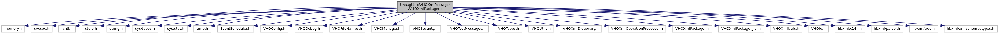

[Macros](#define-members) \| [Functions](#func-members) \| [Variables](#var-members)

`#include <memory.h>`
`#include <svcsec.h>`
`#include <fcntl.h>`
`#include <stdio.h>`
`#include <string.h>`
`#include <sys/types.h>`
`#include <sys/stat.h>`
`#include <time.h>`
`#include "EventScheduler.h"`
`#include "VHQConfig.h"`
`#include "VHQDebug.h"`
`#include "VHQFileNames.h"`
`#include "VHQManager.h"`
`#include "VHQSecurity.h"`
`#include "VHQTestMessages.h"`
`#include "VHQTypes.h"`
`#include "VHQUtils.h"`
`#include "VHQXmlDictionary.h"`
`#include "VHQXmlOperationProcessor.h"`
`#include "VHQXmlPackager.h"`
`#include "VHQXmlPackager_lcl.h"`
`#include "VHQXmlUtils.h"`
`#include "VHQIo.h"`
`#include <libxml/c14n.h>`
`#include <libxml/parser.h>`
`#include <libxml/tree.h>`
`#include <libxml/xmlschemastypes.h>`

Include dependency graph for VHQXmlPackager.c:

|  |  |
|----|----|
| Macros |  |
| #define  | [LIBXML_SCHEMAS_ENABLED](#a7bb265f4313bb33594f4abba9feb2787) |
| #define  | [COMM_MESSAGE_ID_CHECKING](#a0901fd6a9b89834efa075978836f47c4)   0 |
| #define  | [NONCE_CHECKING](#a80a7e9388ee39463809a3f8a27c06bca)   1 |
| #define  | [ENABLE_SIGNATURE_VALIDATION](#a8337de1be7973ec4e88e07f247cacb41)   1 |
| #define  | [XSDFileName1\_](#ac3a26b88d55cebd24a003e7977ba9098)(x)   #x |
| #define  | [XSDFileName\_](#a42f0d231d4209b42d7d390b6e4f61719)(x)   [XSDFileName1\_](#ac3a26b88d55cebd24a003e7977ba9098)(x) |
| #define  | [XSDFileName](#afe921b536a4959e0b6663802cc2a6d1f)   [XSDFileName\_](#a42f0d231d4209b42d7d390b6e4f61719)(XSD_FILE_NAME) |
| #define  | [SETUP_LIBXML_FOR_MEMWATCH](#af7b0cb8d907f0124fdb99ca413952011)   0 |
| #define  | [DEBUG_SIGNATURE_VALIDATION](#a816f7429e924e7c46074c6085cb532a8)   1 |

|  |  |
|----|----|
| Functions |  |
| void  | [AddBatteryInfo](#a561c089e39ca02de40e89f373e202cb1) (xmlNodePtr ParentNode) |
| void  | [ResetServerNONCE](#aa63037d9c4ff06f6b9ee9e7b9ce5b54f) (void) |
| void  | [ClearOpSetAckArray](#a601e5096322b7d9057bf0b8a3c7fb6df) (void) |
| void  | [AddOpSetAck](#ae8f729e31168600ca8bf8834bb642972) (uint32 OpSetId) |
| void  | [VHQXmlPackagerInit](#a162953c78d916a1da4421166f1671e89) (void) |
| int  | [VHQXmlPackageCreate](#ad985152b166fb6a9c5b33298f586ea57) (vhq_xml_operation_t operation, char \*\*XMLData, event_data_t \*event_data) |
| vhq_result_t  | [VHQXmlProcessServerMessage](#a04c9c0c25167e200ecc3e3d669d08cb2) (const char \*XMLData, int XMLDataSize, int \*comm_id, uint32 \*srv_message_id, char \*\*XMLResponse, int \*XMLResponseLen, const char \*operation_id, bool close_comm_id, bool isKeyExchange) |
| int  | [VHQXmlCreateErrorResponse](#aa6a96421fc16f3d135f401f749773899) (xmlDocPtr server_doc, char \*\*XMLData, vhq_result_t result, int \*<a href="_v_h_q_manager_8c.md#a54995c96bad4b5b943cb88f3534cc743">cur_comm_id</a>, uint32 \*srv_message_id) |
| int  | [VHQXmlCreateDownloadResponse](#ad89392f0cb8f811d4af6d70647c207b9) (char \*\*XMLData, int comm_id, int message_id, char \*operation_id, srv_msg_type_t srv_msg_type, srv_op_type_t srv_op_type, vhq_result_t result, uint32 operation_set_id, uint32 recur_id, char \*additional_info, uint32 dl_duration, uint32 dl_attempts) |
| int  | [VHQXmlCreateUploadResponse](#a6a04da6d212c117aef8f6217d6461475) (char \*\*XMLData, int comm_id, int message_id, uint32 operation_set_id, char \*operation_id, srv_msg_type_t srv_msg_type, srv_op_type_t srv_op_type, uint32 recur_id, vhq_result_t result, char \*local_filename, char \*ul_filename, upload_type_t ul_tpye, upload_file_type_t ul_file_type, xmlDocPtr \*response_doc_p) |
| bool  | [ValidateXml](#aafebf9dcb2aad4f20e174a05fd06a2ed) (xmlDocPtr doc_p) |
| xmlNode \*  | [AddOperationResult](#a7afedde7eab7edc87b4fb1c4bda2d19f) (xmlNode \*op_results_node, char \*op_id, vhq_result_t result, uint32 operation_set_id, uint32 recur_id, srv_op_type_t srv_op_type) |
| vhq_result_t  | [CreateResponseXml](#ae243c860b9c0ba1a2690a96328cb5ab3) (xmlDocPtr \*status_report_doc, int comm_id, char \*operation_id, int message_id, srv_msg_type_t srv_msg_type, srv_op_type_t srv_op_type, bool create_op_res_node) |
| bool  | [XMLGenerateSignature](#a7e9186c8218fe299e54d3b47d00a9c20) (xmlDocPtr doc, unsigned char \*sigbuf, uint32 sigbuf_size) |
| vhq_result_t  | [XMLVerifySignature](#aad6a507701d27f2eb46a7b01af93a805) (xmlDocPtr doc) |
| int  | [VHQXmlUpdateNonce](#a114aa57d9a41b44ada61905d71f94cb6) (char \*XMLData, int XMLDataSize, char \*\*XMLResponse, bool Validate) |
| bool  | [FinalizeXMLDoc](#a0881ded8d929f6ff035777e00bba7c7c) (xmlDocPtr XML_doc_p, bool final_update) |
| int  | [SaveXMLDoc](#a765447f7856ac1374a2b152ad3aaba64) (xmlDocPtr XMLDoc, char \*filename) |
| void  | [RemoveXMLDoc](#aec7caa6d981875bff883da84fc28d2b2) (char \*filename) |
| xmlDocPtr  | [RestoreXMLDoc](#a544a5bca98997f97fbf396f7eca74553) (char \*filename) |

|  |  |
|----|----|
| Variables |  |
| customAppInfo_t  | [customAppInfo](#a4fa07e1af7c095b467c1cb9590babc26) \[<a href="svc__tms_8h.md#ac8d1ce1f93c7d41105b9eaa7c2eda03a">TMS_MAX_REGISTERED_APPS</a>\] |
| pthread_mutex_t  | [appInfoMutex](#a01df92b1953c3495dbfe4cf121a68ca0) = PTHREAD_MUTEX_INITIALIZER |
| operation_set_event_t \*  | [op_set_events](#afa29bd72ad171acdfa84fc984379b3ac) = NULL |
| operation_set_event_t \*  | [op_set_install_events](#a30e189493d2446b3874cf62acaabb573) = NULL |
| launch_downloader_parms \*  | [install_downloader_parms](#a86d92efdd998f2fea7172841f3c1c124) = NULL |
| operation_set_event_t \*  | [op_set_expiring_events](#aec1e5236fff96702a89a49a2ba15a3c5) = NULL |
| launch_downloader_parms \*  | [expiring_downloader_parms](#a398ad9f60e03f92a77d2904733bc4b36) = NULL |
| long long int  | [last_server_nonce](#a701e889745978a201b7d08144e781435) = 0 |
| uint32  | [OpSetAckArray](#a3bdb87d4107fe4416e41b85efbadbf65) \[MAX_TOTAL_EVENTS\] |
| uint16  | [NumOpSetAcks](#a399e529ba9f1a619ec4699535f27c2ae) |

## DetailedDescription {#detailed-description}

Main VHQ XML Packager operations

## MacroDefinition Documentation {#macro-definition-documentation}

## COMM_MESSAGE_ID_CHECKING 

#define COMM_MESSAGE_ID_CHECKING   0

## DEBUG_SIGNATURE_VALIDATION 

#define DEBUG_SIGNATURE_VALIDATION   1

## ENABLE_SIGNATURE_VALIDATION 

#define ENABLE_SIGNATURE_VALIDATION   1

## LIBXML_SCHEMAS_ENABLED 

#define LIBXML_SCHEMAS_ENABLED

## NONCE_CHECKING 

#define NONCE_CHECKING   1

## SETUP_LIBXML_FOR_MEMWATCH 

#define SETUP_LIBXML_FOR_MEMWATCH   0

Global functions

## XSDFileName 

#define XSDFileName   [XSDFileName\_](#a42f0d231d4209b42d7d390b6e4f61719)(XSD_FILE_NAME)

## XSDFileName1\_ 

#define XSDFileName1\_

## XSDFileName\_ 

#define XSDFileName\_

## FunctionDocumentation {#function-documentation}

## AddBatteryInfo() 

void AddBatteryInfo

This function creates node containing battery details.

**Parameters**

\[in\] **ParentNode** = pointer to parent node to which battery node should be created.

### Returns

void

## AddOperationResult() 

xmlNode\* AddOperationResult

This function adds the operation result to the passed in node.

**Parameters**

\[in\] **op_results_node** = pointer to the node to add the results to. \[in\] **op_id** = the operation ID to add in the result. \[out\] **result** = the result of the operation. \[in\] **operation_set_id** = operation set ID \[in\] **recur_id** = recurring ID \[in\] **srv_op_type** = operation type to send to server

### Returns

pointer to node where operation result is added.

## AddOpSetAck() 

void AddOpSetAck

This function adds operation set id to operation set acknowledgment array, to be send with acknowledgment to server about a fail/success.

**Parameters**

\[in\] **OpSetId** = operation set Id to be inserted to array.

### Returns

void

## ClearOpSetAckArray() 

void ClearOpSetAckArray

## CreateResponseXml() 

vhq_result_t CreateResponseXml

This function creates a response xml package tp send to server, adds server message type, operation set ID and operation result to it.

**Parameters**

\[out\] **status_report_doc** = pointer to new xml doc created. \[in\] **comm_id** = communication ID. \[in\] **operation_id** = operation ID. \[in\] **message_id** = message ID \[in\] **srv_msg_type** = server message type \[in\] **srv_op_type** = server operation type \[in\] **create_op_res_node** = if MP is cancel operation, no acknowledgment needed. \[in\] **param_mask** = mask for fetching application parameters.

### Returns

vhq_result_t, SERVER_RESPONSE_SUCCESS on success, otherwise an error ID.

## FinalizeXMLDoc() 

bool FinalizeXMLDoc

This function finalizes the XML by adding the nonce and the signature to it.It will always get replaced just before we send the message

**Parameters**

\[out\] **XML_doc_p** = The pointer to XML document we are finalizing \[in\] **final_update** = TRUE, if final update. If FALSE, add a fake Signature node for validation purposes only - it will always get replaced just before we send the message.

### Returns

TRUE if XML validates after this call - FALSE otherwise

## RemoveXMLDoc() 

void RemoveXMLDoc

This function removes an XML document file

**Parameters**

\[in\] **filename** = The name of the XML doc file to delete

### Returns

void

## ResetServerNONCE() 

void ResetServerNONCE

## RestoreXMLDoc() 

xmlDocPtr RestoreXMLDoc

This function restores an XML doc pointer from a file

**Parameters**

\[in\] **filename** = The name of the XML doc file to restore

### Returns

xmlDockPtr to the XML doc read from the file

## SaveXMLDoc() 

int SaveXMLDoc

This function saves an XML Document to a file

**Parameters**

\[in\] **XMLDoc** = The XML documemnt to save \[in\] **filename** = The name of the file to save the XML doc to.

### Returns

negative value in case of error

## ValidateXml() 

bool ValidateXml

This function validates the XML doc against the schema

**Parameters**

\[in\] **doc_p** = pointer to XML doc to validate

### Returns

TRUE, TRUE if successful

FLASE, if failed

## VHQXmlCreateDownloadResponse() 

int VHQXmlCreateDownloadResponse

This function creates the Download Status Report response to send to server.

**Parameters**

\[out\] **XMLData** = location in memory \[in\] **comm_id** = communication ID to put in response \[in\] **message_id** = message ID to put in response \[in\] **operation_id** = operation ID to put in response \[in\] **srv_msg_type** = server message type \[in\] **srv_op_type** = server operation type \[in\] **result** = General server message result codes \[in\] **operation_set_id** = operation set ID \[in\] **recur_id** = recurring ID \[in\] **additional_info** = additional information \[in\] **dl_duration** = total download duration \[in\] **dl_attempts** = number of download attempts.

### Returns

int, size in bytes of the XML response

## VHQXmlCreateErrorResponse() 

int VHQXmlCreateErrorResponse

This function creates an error response package to send to server.

**Parameters**

\[in\] **server_doc** = pointer to document tree. \[out\] **XMLData** = pointer to memory location \[in\] **result** = server message result code to be add \[in\] **cur_comm_id** = communication ID \[in\] **cur_message_id** = message id \[in\] **srv_message_id** = server message ID

### Returns

0, if unable to create package.

the length of the XML data

## VHQXmlCreateUploadResponse() 

int VHQXmlCreateUploadResponse

This function creates the upload Status Report response to server.It includes all the details of the uploaded file in the xml message, if result is success.

**Parameters**

\[out\] **XMLData** = location in memory \[in\] **comm_id** = communication ID to put in response \[in\] **message_id** = message ID to put in response \[in\] **operation_set_id** = operation set ID to put in response \[in\] **operation_id** = operation ID to put in response \[in\] **srv_msg_type** = server message type \[in\] **srv_op_type** = server operation type \[in\] **recur_id** = recurring ID \[in\] **result** = upload file result \[in\] **local_filename** = local filename to be uploaded \[in\] **ul_filename** = upload filename \[in\] **ul_tpye** = upload type of upload_type_t \[in\] **ul_file_type** = upload file type. \[out\] **response_doc_p** = pointer to xml document address, to create response xml.

### Returns

int, size in bytes of the XML response

## VHQXmlPackageCreate() 

int VHQXmlPackageCreate

This function creates an XML document package for the passed in operation type.

**Parameters**

\[in\] **operation** = The type of package to create (Heartbeat, Status, Event) \[out\] **XMLData** = pointer to the buffer where the XML data should be copied to. \[in\] **comm_id** = communication ID \[out\] **message_id** = message ID, When we create messages, they start at message ID 1 \[in\] **event_mask** = event mask \[in\] **appName** = name of the application which generated an alert to be sent to server. \[in\] **severity** = severity of the alert \[in\] **description** = additional information sent to server \[in\] **details** = details sent to server about an event \[in\] **iFlags** = sent to server for heartbeat operation \[in\] **param_update_info** = pointer to parameter update details.

### Returns

0, if unable to create package.

the length of the device message XML data copied to the buffer.

## VHQXmlPackagerInit() 

void VHQXmlPackagerInit

## VHQXmlProcessServerMessage() 

vhq_result_t VHQXmlProcessServerMessage

This function processes a response message from the server.It parse file and build a xml document.

**Parameters**

\[in\] **XMLData** = pointer to the server response message to process \[in\] **XMLDataSize** = The length of the server response message buffer to process \[in\] **comm_id** = communication ID \[in\] **message_id** = message ID \[in\] **srv_message_id** = server message id \[out\] **XMLResponse** = device message buffer to save data \[out\] **XMLResponseLen** = length of device message \[in\] **operation_id** = operation ID \[in\] **close_comm_id** = TRUE, if communication ID needs to be closed. \[in\] **isKeyExchange** = TRUE, if key exchange message

### Returns

vhq_result_t, SERVER_RESPONSE_SUCCESS on success, otherwise an error ID

## VHQXmlUpdateNonce() 

int VHQXmlUpdateNonce

This function adds nonce and signature details to the xml message to send to server.

**Parameters**

\[in\] **XMLData** = The XML message buffer to update NONCE with \[in\] **XMLDataSize** = The length of the passed in XML message buffer \[out\] **XMLResponse** = pointer to returned XML buffer with updated NONCE \[in\] **Validate** = TRUE, validate xml doc after updating nonce.

### Returns

0, on error; otherwise length of XML data

## XMLGenerateSignature() 

bool XMLGenerateSignature

This function generates signature and stores it into buffer.

**Parameters**

\[in\] **doc** = pointer to xml doc to which signature needs to be added. \[out\] **sigbuf** = buffer into which signature is added. \[in\] **sigbuf_size** = size of the signature buffer

### Returns

TRUE on success; FALSE, otherwise.

## XMLVerifySignature() 

vhq_result_t XMLVerifySignature

This function verify the signature in the message from server.

**Parameters**

\[in\] **doc** = pointer to xml doc from server for which signature is to be verified.

### Returns

vhq_result_t, SERVER_RESPONSE_SUCCESS on success, otherwise an error ID.

## VariableDocumentation {#variable-documentation}

## appInfoMutex 

pthread_mutex_t appInfoMutex = PTHREAD_MUTEX_INITIALIZER

## customAppInfo 

customAppInfo_t customAppInfo\[<a href="svc__tms_8h.md#ac8d1ce1f93c7d41105b9eaa7c2eda03a">TMS_MAX_REGISTERED_APPS</a>\]

## expiring_downloader_parms 

launch_downloader_parms\* expiring_downloader_parms = NULL

## install_downloader_parms 

launch_downloader_parms\* install_downloader_parms = NULL

## last_server_nonce 

long long int last_server_nonce = 0

## NumOpSetAcks 

uint16 NumOpSetAcks

## op_set_events 

operation_set_event_t\* op_set_events = NULL

## op_set_expiring_events 

operation_set_event_t\* op_set_expiring_events = NULL

## op_set_install_events 

operation_set_event_t\* op_set_install_events = NULL

## OpSetAckArray 

uint32 OpSetAckArray\[MAX_TOTAL_EVENTS\]

