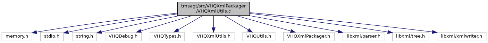

[Functions](#func-members)

`#include <memory.h>`
`#include <stdio.h>`
`#include <string.h>`
`#include "VHQDebug.h"`
`#include "VHQTypes.h"`
`#include "VHQXmlUtils.h"`
`#include "VHQUtils.h"`
`#include "VHQXmlPackager.h"`
`#include <libxml/parser.h>`
`#include <libxml/tree.h>`
`#include <libxml/xmlwriter.h>`

Include dependency graph for VHQXmlUtils.c:

|  |  |
|----|----|
| Functions |  |
| bool  | [GetIntAttrFromNode](#ae4dff941d8f413f1e091139b1ce17d59) (xmlNode \*node, char \*attr_name, int \*<a href="_web_service_wrappers_8c.md#a6e248376c0290338633d8137822eb209">value</a>) |
| bool  | [GetLongIntAttrFromNode](#a54bb6bf6d72879709768450b65c7b07f) (xmlNode \*node, char \*attr_name, long long int \*<a href="_web_service_wrappers_8c.md#a6e248376c0290338633d8137822eb209">value</a>) |
| char \*  | [GetStrAttrFromNode](#a0f8044c829e87a8c2394569b27403892) (xmlNode \*node, char \*attr_name) |
|   | Finds the attribute of node that contains the passed in name. [More\...](#a0f8044c829e87a8c2394569b27403892)  |
| xmlNode \*  | [GetNodeByName](#a3e27309a34f9979130da9be022f68601) (xmlNode \*top_node, const char \*element_name) |
| void  | [addBinaryNode](#a0db9b48f9036e7e8002127420c24fb8b) (xmlDocPtr doc, xmlNode \*top_node, char \*element_name, unsigned char \*bin_data, uint16 bin_data_len, bool base64) |
| bool  | [GetBinaryFromNode](#a34bc605d9243c492d880577ff21e20d8) (xmlNode \*bin_node, char \*bin_data, uint16 bin_data_len, bool base64) |
|   | Gets Binary Data from a node by converting the string to binary. [More\...](#a34bc605d9243c492d880577ff21e20d8)  |
| xmlNode \*  | [addIntegerNode](#a6aef3c9e009750386e0008d7ac8db14d) (xmlNode \*top_node, char \*element_name, int element_int_value) |
|   | Adds an integer to a node by converting it to a string. [More\...](#a6aef3c9e009750386e0008d7ac8db14d)  |
| bool  | [addIntegerAttr](#a398574e582c4c94496f051a8957bdde1) (xmlNode \*top_node, char \*element_name, int element_int_value) |
|   | Adds an integer attribute to a node by converting it to a string. [More\...](#a398574e582c4c94496f051a8957bdde1)  |
| bool  | [addUnsignedIntegerAttr](#a4de90108a1e387035e46f637581771f9) (xmlNode \*top_node, char \*element_name, uint32 element_int_value) |
| xmlNode \*  | [addTimeNode](#aefa1bdfe9ccf098486399f3b46a43fa3) (xmlNode \*top_node, char \*element_name, time_t element_time) |
|   | Adds an integer to a node by converting it to a string. [More\...](#aefa1bdfe9ccf098486399f3b46a43fa3)  |
| bool  | [addTimeAttr](#a9f90cb793473c85543690672d8913d49) (xmlNode \*top_node, char \*element_name, time_t element_time, bool conv_to_local) |
| bool  | [addBinaryAttr](#a734d2be1ae2fdb85ba741c5db2f910c5) (xmlNode \*top_node, char \*element_name, unsigned char \*bin_data, uint16 bin_data_len, bool base64) |

## DetailedDescription {#detailed-description}

XML Utilty functions

## FunctionDocumentation {#function-documentation}

## addBinaryAttr() 

bool addBinaryAttr

This function adds a binary attribute to a node by converting it to a string.

**Parameters**

\[in\] **top_node** = pointer to the top node to add this node to \[in\] **element_name** = name of the new attribute \[in\] **bin_data** = binary input data \[in\] **bin_data_len** = length of binary input data \[in\] **base64** = TRUE, if base conversion

### Returns

TRUE if successful, FALSE otherwise

## addBinaryNode() 

void addBinaryNode

This function adds Binary Data in HEX format to a node by converting it to a string.

**Parameters**

\[in\] **doc** = pointer to xml doc \[in\] **top_node** = pointer to the top node to add this node to \[in\] **element_name** = name of the new attribute \[in\] **bin_data** = binary data to be added \[in\] **bin_data_len** = length of binary data \[in\] **base64** = TRUE, if conversion

### Returns

void

## addIntegerAttr() 

bool addIntegerAttr

Adds an integer attribute to a node by converting it to a string.

**Parameters**

**top_node** - pointer to the top node to add this node to **element_name** - name of the new attribute **element_int_value** - integer to convert to a string for the new attribute

### Returns

TRUE if successful, FALSE otherwise

## addIntegerNode() 

static xmlNodePtr addIntegerNode

Adds an integer to a node by converting it to a string.

**Parameters**

**top_node** - pointer to the top node to add this node to **element_name** - name of the new element **element_value** - integer to convert to a string for the new node

### Returns

pointer to the node that matches the passed in name

## addTimeAttr() 

bool addTimeAttr

This function adds a time attribute to a node by converting it to a string.

**Parameters**

\[in\] **top_node** = pointer to the top node to add this node to. \[in\] **element_name** = name of the new attribute. \[in\] **element_time** = integer to convert to a string for the new time attribute. \[in\] **conv_to_local** = TRUE, if UTC time should be converted to local time.

### Returns

TRUE if successful, FALSE otherwise

## addTimeNode() 

static xmlNodePtr addTimeNode

Adds an integer to a node by converting it to a string.

**Parameters**

**top_node** - pointer to the top node to add this node to **element_name** - name of the new element **element_time** - time_t to convert to a string for the new node

### Returns

pointer to the node that matches the passed in name

## addUnsignedIntegerAttr() 

bool addUnsignedIntegerAttr

This function adds an unsigned integer attribute to a node by converting it to a string.

**Parameters**

\[in\] **top_node** = pointer to the top node to add this node to \[in\] **element_name** = name of the new attribute \[in\] **element_int_value** = value to be converted and added

### Returns

TRUE if successful, FALSE otherwise

## GetBinaryFromNode() 

bool GetBinaryFromNode

Gets Binary Data from a node by converting the string to binary.

**Parameters**

**bin_node** - pointer to the node to read bin data from **bin_data** - pointer to the binary data buffer **bin_data_len** - length of the binary data buffer **base64** - TRUE if data is base 64 data, FALSE for hex data

### Returns

pointer to the node that matches the passed in name

## GetIntAttrFromNode() 

bool GetIntAttrFromNode

Debug Stuff Local definitions Local functions Global functions

This function finds the attribute of node that contains the passed in name

**Parameters**

\[in\] **node** = pointer to the top node to search under \[in\] **attr_name** = string to search for in the name field \[out\] **value** = value contained in attribute

### Returns

TRUE, if found

## GetLongIntAttrFromNode() 

bool GetLongIntAttrFromNode

This function finds the attribute of node that contains the passed in name

**Parameters**

\[in\] **node** = pointer to the top node to search under \[in\] **attr_name** = string to search for in the name field \[out\] **value** = value contained in attribute

### Returns

TRUE, if found

## GetNodeByName() 

xmlNode\* GetNodeByName

This function Finds the node under top_node that contains the passed in name.

**Parameters**

\[in\] **top_node** = pointer to the top node to search under \[in\] **element_name** = string to search for in the name field

### Returns

pointer to the node that matches the passed in name

## GetStrAttrFromNode() 

char \* GetStrAttrFromNode

Finds the attribute of node that contains the passed in name.

**Parameters**

**node** - pointer to the node to search under **attr_name** - string to search for in the attribute field

### Returns

pointer to the string contained in the attribute
