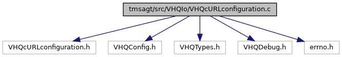

[Functions](#func-members)

`#include "VHQcURLconfiguration.h"`
`#include "VHQConfig.h"`
`#include "VHQTypes.h"`
`#include "VHQDebug.h"`
`#include <errno.h>`

Include dependency graph for VHQcURLconfiguration.c:

|  |  |
|----|----|
| Functions |  |
| int  | [cURLsetMandatoryConfig](#a7e1cf6889ac428c9c18f62549f52498d) (CURL \*curl) |

## DetailedDescription {#detailed-description}

Main cURL configuration settings operations

## FunctionDocumentation {#function-documentation}

## cURLsetMandatoryConfig() 

int cURLsetMandatoryConfig

This function sets the different configurations for curl handle.

**Parameters**

\[in\] **curl** =a CURL easy handle returned by curl initialization.

### Returns

int 0, if success; -1, if error
