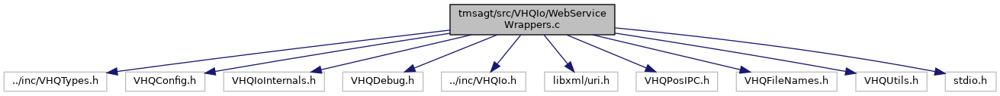

[Macros](#define-members) \| [Functions](#func-members)

`#include "../inc/VHQTypes.h"`
`#include "VHQConfig.h"`
`#include "VHQIoInternals.h"`
`#include "VHQDebug.h"`
`#include "../inc/VHQIo.h"`
`#include <libxml/uri.h>`
`#include "VHQPosIPC.h"`
`#include "VHQFileNames.h"`
`#include "VHQUtils.h"`
`#include <stdio.h>`

Include dependency graph for WebServiceWrappers.c:

|          |                                                             |
|----------|-------------------------------------------------------------|
| Macros   |                                                             |
| #define  | [\_MAIN_LOOP_EXTERNS\_](#a0c0b5276fb82904fa5f9885c7f8e58ba) |
| #define  | [LF_ERROR](#a4433ee04f3fb4f8a246fee30fc8a4829)   1          |
| #define  | [LF_INFO](#ae47d0ee7f867d23a564d391850602e70)   2           |
| #define  | [LF_DETAIL](#a2f8640511499099f8c1b105d3fb3587a)   3         |

|  |  |
|----|----|
| Functions |  |
| bool  | [isbase64](#a5887f31e1cbe65c00807a2605075acdd) (char c) |
| char  | [value](#a6e248376c0290338633d8137822eb209) (char c) |
| int  | [UnBase64](#a43a36d429fa3d939ffc2ae91532541a6) (unsigned char \*dest, const unsigned char \*src, int srclen) |
| bool  | [TryMessageType](#a0e5085ec3a406927825307c114b37b05) (const char \*pszMsgType, char \*pszPayload, char \*\*ppszStart, char \*\*ppszEnd) |
| vhq_result_t  | [PostPayload](#a02b30940054f1980e6eb755934e10952) (const char \*pszPayload, char \*\*pszReturnPayload) |
| vhq_result_t  | [PostUpload](#accfb9c141193e73bee596406d96fbd31) (const char \*pszURL, const char \*pszWebMethod, const char \*\*pszUpload, char \*\*pszReturnPayload, const char \*pszFileName) |

## DetailedDescription {#detailed-description}

Implements the wrappers for web services exported by VHQ server

## MacroDefinition Documentation {#macro-definition-documentation}

## \_MAIN_LOOP_EXTERNS\_ 

#define \_MAIN_LOOP_EXTERNS\_

## LF_DETAIL 

#define LF_DETAIL   3

## LF_ERROR 

#define LF_ERROR   1

## LF_INFO 

#define LF_INFO   2

## FunctionDocumentation {#function-documentation}

## isbase64() 

bool isbase64

## PostPayload() 

vhq_result_t PostPayload

This function passes the device message and fetches response from server in pszReturnPayload buffer.

**Parameters**

\[in\] **pszPayload** = device message buffer to be send. \[out\] **pszReturnPayload** = points to buffer in which server message is to be saved.

### Returns

TRUE, if success; FALSE, otherwise

## PostUpload() 

vhq_result_t PostUpload

This function does the upload to the server.

**Parameters**

\[in\] **pszURL** = server address \[in\] **pszWebMethod** = transfer method \[in\] **pszUpload** = header information for transmission \[in\] **pszReturnPayload** = server response to be stored \[in\] **pszFileName** = local filename

### Returns

TRUE, if success; FALSE, otherwise

## TryMessageType() 

bool TryMessageType

This function checks the server response message type.

**Parameters**

\[in\] **pszMsgType** = incoming message tag type to compare. \[in\] **pszPayload** = response from server \[out\] **ppszStart** = pointer to starting of server response \[out\] **ppszEnd** = pounter to end of response

### Returns

TRUE, if SUCCESS; FALSE, otherwise

## UnBase64() 

int UnBase64

## value() 

char value

inline

### Examples

<a href="demo-sysinfo_8cpp-example.md#a14">demo-sysinfo.cpp</a>, <a href="mac_demo1_8cpp-example.md#a0">mac_demo1.cpp</a>, and <a href="mac_demo2_8cpp-example.md#a0">mac_demo2.cpp</a>.
