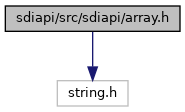
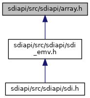

[Data Structures](#nested-classes) \| [Namespaces](#namespaces) \| [Macros](#define-members)

`#include <string.h>`

Include dependency graph for array.h:

This graph shows which files directly or indirectly include this file:

<a href="array_8h_source.md">Go to the source code of this file.</a>

|  |  |
|----|----|
| Data Structures |  |
| struct   | <a href="structvfisdi_1_1_array.md">Array< N ></a> |
| struct   | <a href="structvfisdi_1_1_bit_mask.md">BitMask< NBITS, ITYPE ></a> |
| class   | <a href="classvfisdi_1_1_bit_mask_1_1_bit_access.md">BitMask< NBITS, ITYPE >::BitAccess</a> |

|            |                                                  |
|------------|--------------------------------------------------|
| Namespaces |                                                  |
|            | <a href="namespacevfisdi.md">vfisdi</a> |

|          |                                               |
|----------|-----------------------------------------------|
| Macros   |                                               |
| #define  | [DllSpec](#ad7c2e1cb200073ed64c64285a5f37231) |

## MacroDefinition Documentation {#macro-definition-documentation}

## DllSpec 

#define DllSpec

