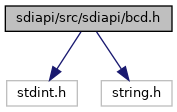
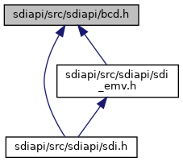

[Data Structures](#nested-classes) \| [Namespaces](#namespaces) \| [Macros](#define-members) \| [Functions](#func-members)

`#include <stdint.h>`
`#include <string.h>`

Include dependency graph for bcd.h:

This graph shows which files directly or indirectly include this file:

<a href="bcd_8h_source.md">Go to the source code of this file.</a>

|                 |                                                          |
|-----------------|----------------------------------------------------------|
| Data Structures |                                                          |
| class           | <a href="classvfisdi_1_1_b_c_d.md">BCD< N ></a> |

|            |                                                  |
|------------|--------------------------------------------------|
| Namespaces |                                                  |
|            | <a href="namespacevfisdi.md">vfisdi</a> |

|          |                                               |
|----------|-----------------------------------------------|
| Macros   |                                               |
| #define  | [DllSpec](#ad7c2e1cb200073ed64c64285a5f37231) |

|  |  |
|----|----|
| Functions |  |
| <a href="sound_8h.md#ad7c2e1cb200073ed64c64285a5f37231">DllSpec</a> bool  | <a href="namespacevfisdi.md#a6d0c9b9881eeb4602b2121ad61bd2d6e">bcdset</a> (unsigned char \*buffer, unsigned size, int64_t <a href="_web_service_wrappers_8c.md#a6e248376c0290338633d8137822eb209">value</a>) |
| <a href="sound_8h.md#ad7c2e1cb200073ed64c64285a5f37231">DllSpec</a> int64_t  | <a href="namespacevfisdi.md#a0e899cfc7577a4b2f8b16aef3ec3017a">bcdget</a> (const unsigned char \*buffer, unsigned size) |

## MacroDefinition Documentation {#macro-definition-documentation}

## DllSpec 

#define DllSpec

