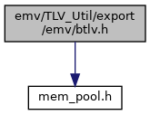
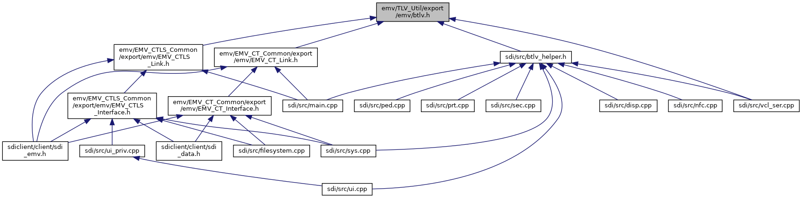

[Data Structures](#nested-classes) \| [Macros](#define-members) \| [Typedefs](#typedef-members) \| [Enumerations](#enum-members) \| [Functions](#func-members)

`#include "`<a href="mem__pool_8h_source.md">mem_pool.h</a>`"`

Include dependency graph for btlv.h:

This graph shows which files directly or indirectly include this file:

<a href="btlv_8h_source.md">Go to the source code of this file.</a>

|                 |                                                        |
|-----------------|--------------------------------------------------------|
| Data Structures |                                                        |
| struct          | <a href="struct_b_t_l_v_node.md">BTLVNode</a> |

|  |  |
|----|----|
| Macros |  |
| #define  | [TLV_UTIL_INTERFACE](#ae809ada9194252356dbaa46410dfbb39) |
| #define  | [MAX_TAGSIZE](#a50b52ae3c35fc20556babf890cfac1e8)   3 |
| #define  | [BTLVTagBufSize](#af6af4054a4c0b2b6aa3af16ad0a59262)   9 |
| #define  | [ULTAG2ASC](#a5ac8dbc13c1b366634608e665414cb0b)(ulTag)   [pcBTLVTagStr2](#a898c1c73324c3f1b98dadc47e1d3d8ca)(ulTag,\_ULTAG2ASC_BUF) |
| #define  | [ULTAG2ASCBUF](#ab33e2864700c667b7fab74ab32e1f661)   [BTLVTagBufType](#a57d6632fcc401eae0143b396bc37f610) \_ULTAG2ASC_BUF; |

|  |  |
|----|----|
| Typedefs |  |
| typedef char  | [BTLVTagBufType](#a57d6632fcc401eae0143b396bc37f610)\[[BTLVTagBufSize](#af6af4054a4c0b2b6aa3af16ad0a59262)\] |

|  |  |
|----|----|
| Enumerations |  |
| enum   | {   [CONTEXT_CLASS](#adf764cbdea00d65edcd07bb9953ad2b7a8b1b8e2a4bd05998a61ed69992a18db8) =0x80, [PRIVATE_CLASS](#adf764cbdea00d65edcd07bb9953ad2b7a5f6e319a5eb9707d04a8955d9ba84b2d) =0xC0, [CONSTRUCTET_TAG](#adf764cbdea00d65edcd07bb9953ad2b7a175c9159bc44eb41d367c6f1bc91c6f0) =0x20, [CONSTRUCTED_TAG](#adf764cbdea00d65edcd07bb9953ad2b7aa6555b39404374518c52c9f1d4b287cf) =0x20,   [PRIMITIVE_TAG](#adf764cbdea00d65edcd07bb9953ad2b7ac55c03a8fda74e99b525713117c28871) =0x00 } |
| enum   | [BTLV_ERROR](#a7e2d1907ba985dee09f6663cce879c58) {   [BTLV_ERR_INVALID](#a7e2d1907ba985dee09f6663cce879c58ab53077a5cd8bc50b231c04553e5ac97b) =-1, [BTLV_ERR_BUFFER](#a7e2d1907ba985dee09f6663cce879c58afd2d74e17ce837ffe98816c0e724665c) =-2, [BTLV_ERR_MEMORY](#a7e2d1907ba985dee09f6663cce879c58a9d176f568ac26baa1822807703e39740) =-3, [BTLV_ERR_FILE](#a7e2d1907ba985dee09f6663cce879c58a17c7ff08d171600533cc70ed7af4a7b2) =-4,   [BTLV_ERR_NOT_FOUND](#a7e2d1907ba985dee09f6663cce879c58ad6ba5273ebac2b6f0af83185288e9dd2) =-5, [BTLV_ERR_CONSTRUCTED](#a7e2d1907ba985dee09f6663cce879c58ae4cafe8ec6a55dddce06c8bef4bfad8b) =-6, [BTLV_ERR_DONE_FILTER](#a7e2d1907ba985dee09f6663cce879c58a43a54deda383d1e35f540f493309ca42) =-7, [BTLV_ERR_ABORT_FILTER](#a7e2d1907ba985dee09f6663cce879c58ad922de81b82504919cc59f94e84eff63) =-8 } |
| enum   | [BTLVFilter](#aa47b9ee960be926bcd97dddca1c30029) { [BTLV_FLTR_KEEP](#aa47b9ee960be926bcd97dddca1c30029a9250de9dbb34e118938b8e0d5e664f9c) =0, [BTLV_FLTR_DONE](#aa47b9ee960be926bcd97dddca1c30029a5711695a0bb77f606ef391b7d66c7ecb) =-1, [BTLV_FLTR_REMOVE](#aa47b9ee960be926bcd97dddca1c30029ac9c5cd9b5f377cb0fd163e48efb26db8) =-2, [BTLV_FLTR_ABORT](#aa47b9ee960be926bcd97dddca1c30029a09e440cadf77ed22c9a3da990666100b) =-3 } |
| enum   | [BTLVContext](#a03946fb744cc22a5454713443cbfd3ac) { [BTLV_IMPORT_START](#a03946fb744cc22a5454713443cbfd3aca8fab1c50c71f0f46dfdaf6ce4d4677bd), [BTLV_IMPORT_DONE](#a03946fb744cc22a5454713443cbfd3aca9343874b0dcc419155af849b42f0b184) } |
| enum   | [BTLVMatch](#afebb9e8dd2052cbbb5f4287ade3ed4a1) { [BTLV_MISMATCH](#afebb9e8dd2052cbbb5f4287ade3ed4a1a3aaffa1128ac43539538bb379aacedf4), [BTLV_MATCH](#afebb9e8dd2052cbbb5f4287ade3ed4a1a9940bdcc624f2ff3ee4a429b9146cce7), [BTLV_CHILDMATCH](#afebb9e8dd2052cbbb5f4287ade3ed4a1a503f2757551d14a8dd66e04a0169bd4d), [BTLV_PARENTMATCH](#afebb9e8dd2052cbbb5f4287ade3ed4a1a1e184691119c4b9324f7c112e3a35ad1) } |

|  |  |
|----|----|
| Functions |  |
| <a href="mem__pool_8h.md#ae809ada9194252356dbaa46410dfbb39">TLV_UTIL_INTERFACE</a> void  | [vBTLVInit](#af6c59b296fd3283b94548f090f171844) (struct <a href="struct_b_t_l_v_node.md">BTLVNode</a> \*pxNode, struct <a href="mem__pool_8h.md#struct_memory_pool">MemoryPool</a> \*pxMempool) |
| <a href="mem__pool_8h.md#ae809ada9194252356dbaa46410dfbb39">TLV_UTIL_INTERFACE</a> struct <a href="struct_b_t_l_v_node.md">BTLVNode</a> \*  | [pxBTLVAppendTag](#a0c33e9a258ab58a2ad1662ab7ab8e60d) (struct <a href="struct_b_t_l_v_node.md">BTLVNode</a> \*pxRoot, const char \*pcPath, const unsigned char \*pucData, unsigned uSize) |
| <a href="mem__pool_8h.md#ae809ada9194252356dbaa46410dfbb39">TLV_UTIL_INTERFACE</a> struct <a href="struct_b_t_l_v_node.md">BTLVNode</a> \*  | [pxBTLVWriteTag](#a9819b6c9e4d8be3c412cf251e564d31d) (struct <a href="struct_b_t_l_v_node.md">BTLVNode</a> \*pxRoot, const char \*pcPath, const unsigned char \*pucData, unsigned uSize) |
| <a href="mem__pool_8h.md#ae809ada9194252356dbaa46410dfbb39">TLV_UTIL_INTERFACE</a> int  | [iBTLVWriteData](#a4aa4b3d47babeb7783fecc723e404e21) (struct <a href="struct_b_t_l_v_node.md">BTLVNode</a> \*pxNode, unsigned char \*pucData, unsigned uSize) |
| <a href="mem__pool_8h.md#ae809ada9194252356dbaa46410dfbb39">TLV_UTIL_INTERFACE</a> struct <a href="struct_b_t_l_v_node.md">BTLVNode</a> \*  | [pxBTLVFindTag](#ac74569eef6689e6b833ec7f9fe53e5ab) (struct <a href="struct_b_t_l_v_node.md">BTLVNode</a> \*pxRoot, const char \*pcPath) |
| <a href="mem__pool_8h.md#ae809ada9194252356dbaa46410dfbb39">TLV_UTIL_INTERFACE</a> struct <a href="struct_b_t_l_v_node.md">BTLVNode</a> \*  | [pxBTLVFindNextTag](#a977bdec574dab7f629a9044b39d14760) (struct <a href="struct_b_t_l_v_node.md">BTLVNode</a> \*pxRoot, const char \*pcPath, struct <a href="struct_b_t_l_v_node.md">BTLVNode</a> \*pxPrev) |
| <a href="mem__pool_8h.md#ae809ada9194252356dbaa46410dfbb39">TLV_UTIL_INTERFACE</a> void  | [vBTLVClear](#ae064b0803b734441d055f6b1e3fa3e2b) (struct <a href="struct_b_t_l_v_node.md">BTLVNode</a> \*pxNode) |
| <a href="mem__pool_8h.md#ae809ada9194252356dbaa46410dfbb39">TLV_UTIL_INTERFACE</a> void  | [vBTLVRemoveNode](#aefad2bd854223903fd4ce35850c78a57) (struct <a href="struct_b_t_l_v_node.md">BTLVNode</a> \*pxNode) |
| <a href="mem__pool_8h.md#ae809ada9194252356dbaa46410dfbb39">TLV_UTIL_INTERFACE</a> void  | [vBTLVMoveNode](#a33fd877746b3f147f99ba1046c22fe05) (struct <a href="struct_b_t_l_v_node.md">BTLVNode</a> \*pxRoot, struct <a href="struct_b_t_l_v_node.md">BTLVNode</a> \*pxNode) |
| <a href="mem__pool_8h.md#ae809ada9194252356dbaa46410dfbb39">TLV_UTIL_INTERFACE</a> unsigned  | [uBTLVContentSize](#afe9285fc51ca05d0cb7a308d89b0e79f) (struct <a href="struct_b_t_l_v_node.md">BTLVNode</a> \*pxRoot) |
| <a href="mem__pool_8h.md#ae809ada9194252356dbaa46410dfbb39">TLV_UTIL_INTERFACE</a> int  | [iBTLVExport](#ae2fe6355ed919824ce036153083febcb) (struct <a href="struct_b_t_l_v_node.md">BTLVNode</a> \*pxRoot, unsigned char \*pucBuffer, unsigned uMaxSize) |
| <a href="mem__pool_8h.md#ae809ada9194252356dbaa46410dfbb39">TLV_UTIL_INTERFACE</a> int  | [iBTLVExportFile](#ad8678f771c3915f4f49e938e528c72bf) (struct <a href="struct_b_t_l_v_node.md">BTLVNode</a> \*pxRoot, const char \*pcFilename) |
| <a href="mem__pool_8h.md#ae809ada9194252356dbaa46410dfbb39">TLV_UTIL_INTERFACE</a> int  | [iBTLVAppendFile](#a6bcdff952c962b9ea166f7fbc474072c) (struct <a href="struct_b_t_l_v_node.md">BTLVNode</a> \*pxRoot, const char \*pcFilename) |
| <a href="mem__pool_8h.md#ae809ada9194252356dbaa46410dfbb39">TLV_UTIL_INTERFACE</a> int  | [iBTLVImport](#a1186828a015bfce0db9bf478349a7480) (struct <a href="struct_b_t_l_v_node.md">BTLVNode</a> \*pxRoot, const unsigned char \*pucBuffer, unsigned uSize, enum [BTLVFilter](#aa47b9ee960be926bcd97dddca1c30029)(\*pxFilter)(void \*, struct <a href="struct_b_t_l_v_node.md">BTLVNode</a> \*, enum [BTLVContext](#a03946fb744cc22a5454713443cbfd3ac)), void \*pvData) |
| <a href="mem__pool_8h.md#ae809ada9194252356dbaa46410dfbb39">TLV_UTIL_INTERFACE</a> int  | [iBTLVImportFile](#a75c2c0f386df0d159be41f49146c78ff) (struct <a href="struct_b_t_l_v_node.md">BTLVNode</a> \*pxRoot, const char \*pcFilename, enum [BTLVFilter](#aa47b9ee960be926bcd97dddca1c30029)(\*pxFilter)(void \*, struct <a href="struct_b_t_l_v_node.md">BTLVNode</a> \*, enum [BTLVContext](#a03946fb744cc22a5454713443cbfd3ac)), void \*pvData) |
| <a href="mem__pool_8h.md#ae809ada9194252356dbaa46410dfbb39">TLV_UTIL_INTERFACE</a> int  | [iBTLVExtractTag](#a9cc36410c15461fea9d73c7773bedda3) (struct <a href="struct_b_t_l_v_node.md">BTLVNode</a> \*pxRoot, const char \*pcPath, unsigned char \*pucBuffer, unsigned uSize) |
| <a href="mem__pool_8h.md#ae809ada9194252356dbaa46410dfbb39">TLV_UTIL_INTERFACE</a> enum [BTLVMatch](#afebb9e8dd2052cbbb5f4287ade3ed4a1)  | [xBTLVMatchPath](#acf449e96c5391ef94ada65ae1a246909) (struct <a href="struct_b_t_l_v_node.md">BTLVNode</a> \*pxRoot, const char \*pcPath) |
| <a href="mem__pool_8h.md#ae809ada9194252356dbaa46410dfbb39">TLV_UTIL_INTERFACE</a> int  | [iBTLVGetPath](#a308f326bb12d98ba27901c8c7b337c3e) (struct <a href="struct_b_t_l_v_node.md">BTLVNode</a> \*pxRoot, char \*pcBuffer, int iMaxsize) |
| <a href="mem__pool_8h.md#ae809ada9194252356dbaa46410dfbb39">TLV_UTIL_INTERFACE</a> char \*  | [pcBTLVTagStr2](#a898c1c73324c3f1b98dadc47e1d3d8ca) (unsigned long ulTag, [BTLVTagBufType](#a57d6632fcc401eae0143b396bc37f610) tcTagBuf) |
| <a href="mem__pool_8h.md#ae809ada9194252356dbaa46410dfbb39">TLV_UTIL_INTERFACE</a> char \*  | [pcBTLVTagStr](#a1b418cf187e4f149ea7caeeae687eca5) (unsigned long ulTag) \_\_attribute((deprecated)) |
| <a href="mem__pool_8h.md#ae809ada9194252356dbaa46410dfbb39">TLV_UTIL_INTERFACE</a> unsigned long  | [ulBTLVTagNum](#ace353f55cd1d0a53a729184ed82ae418) (const char \*pcTag) |
| <a href="mem__pool_8h.md#ae809ada9194252356dbaa46410dfbb39">TLV_UTIL_INTERFACE</a> void  | [vBTLVBuildTag](#a511e4f76699d656bdba14dced30bc3dd) (unsigned char ucbyte1, unsigned long tag_number, char \*pcTag) |
| <a href="mem__pool_8h.md#ae809ada9194252356dbaa46410dfbb39">TLV_UTIL_INTERFACE</a> void  | [vBTLVGetTagNumber](#a814714ea6ec61664cad4337db999242b) (unsigned char \*ucTag, unsigned long \*ptag_number) |
| <a href="mem__pool_8h.md#ae809ada9194252356dbaa46410dfbb39">TLV_UTIL_INTERFACE</a> unsigned long  | [ulBTLVGetTagNumber](#abb24425dcf4f8a780a014247b2dad8c7) (const char \*Tag) |
| <a href="mem__pool_8h.md#ae809ada9194252356dbaa46410dfbb39">TLV_UTIL_INTERFACE</a> struct <a href="struct_b_t_l_v_node.md">BTLVNode</a> \*  | [pxBTLVGetChild](#a52cd9eb8cdb1868c6cba4d733f219a1d) (const struct <a href="struct_b_t_l_v_node.md">BTLVNode</a> \*pxParent, int n) |
| <a href="mem__pool_8h.md#ae809ada9194252356dbaa46410dfbb39">TLV_UTIL_INTERFACE</a> int  | [iBTLVGetChildOffset](#a9e8c58882510a966fa32b91a2ec8accb) (const struct <a href="struct_b_t_l_v_node.md">BTLVNode</a> \*pxParent, const struct <a href="struct_b_t_l_v_node.md">BTLVNode</a> \*pxChild) |
| <a href="mem__pool_8h.md#ae809ada9194252356dbaa46410dfbb39">TLV_UTIL_INTERFACE</a> int  | [iBTLVGetChildCount](#add6f494e76f568567d9a9d346e8d7ba1) (const struct <a href="struct_b_t_l_v_node.md">BTLVNode</a> \*pxParent) |
| <a href="mem__pool_8h.md#ae809ada9194252356dbaa46410dfbb39">TLV_UTIL_INTERFACE</a> struct <a href="struct_b_t_l_v_node.md">BTLVNode</a> \*  | [pxBTLVGetParent](#a09a6ac5853977837f126c5c9af05de77) (const struct <a href="struct_b_t_l_v_node.md">BTLVNode</a> \*pxChild) |
| <a href="mem__pool_8h.md#ae809ada9194252356dbaa46410dfbb39">TLV_UTIL_INTERFACE</a> void  | [vBTLVWipeAndClear](#ad64bc62b62bf5375b2b4813f76ee8f26) (struct <a href="struct_b_t_l_v_node.md">BTLVNode</a> \*pxNode) \_\_attribute((deprecated)) |
| <a href="mem__pool_8h.md#ae809ada9194252356dbaa46410dfbb39">TLV_UTIL_INTERFACE</a> void  | [vBTLVWipeAndRemoveNode](#acadee218eb35d1eecce639c637496953) (struct <a href="struct_b_t_l_v_node.md">BTLVNode</a> \*pxNode) \_\_attribute((deprecated)) |
| <a href="mem__pool_8h.md#ae809ada9194252356dbaa46410dfbb39">TLV_UTIL_INTERFACE</a> void  | [vBTLVSetWipeCallback](#aa6cb90004fb1fab00ac3afbc7a9493b3) (void(\*cb)(void \*, unsigned)) |

## MacroDefinition Documentation {#macro-definition-documentation}

## BTLVTagBufSize 

#define BTLVTagBufSize   9

## MAX_TAGSIZE 

#define MAX_TAGSIZE   3

maximum size of the (binary) tag name in bytes constants for [vBTLVBuildTag()](#a511e4f76699d656bdba14dced30bc3dd):

## TLV_UTIL_INTERFACE 

#define TLV_UTIL_INTERFACE

## ULTAG2ASC 

#define ULTAG2ASC

## ULTAG2ASCBUF 

#define ULTAG2ASCBUF   [BTLVTagBufType](#a57d6632fcc401eae0143b396bc37f610) \_ULTAG2ASC_BUF;

## TypedefDocumentation {#typedef-documentation}

## BTLVTagBufType 

typedef char BTLVTagBufType\[[BTLVTagBufSize](#af6af4054a4c0b2b6aa3af16ad0a59262)\]

## EnumerationType Documentation {#enumeration-type-documentation}

## anonymousenum  {#anonymous-enum}

anonymous enum

| Enumerator |  |
|----|----|
| CONTEXT_CLASS  | 
context class (used for [vBTLVBuildTag()](#a511e4f76699d656bdba14dced30bc3dd))
 |
| PRIVATE_CLASS  | 
private class (used for [vBTLVBuildTag()](#a511e4f76699d656bdba14dced30bc3dd))
 |
| CONSTRUCTET_TAG  |  |
| CONSTRUCTED_TAG  | 
constructed tag (used for [vBTLVBuildTag()](#a511e4f76699d656bdba14dced30bc3dd))
 |
| PRIMITIVE_TAG  | 
primitive tag (used for [vBTLVBuildTag()](#a511e4f76699d656bdba14dced30bc3dd))
 |

## BTLV_ERROR 

enum [BTLV_ERROR](#a7e2d1907ba985dee09f6663cce879c58)

| Enumerator |  |
|----|----|
| BTLV_ERR_INVALID  | 
invalid data was found, e.g. invalid tag, length, \...
 |
| BTLV_ERR_BUFFER  | 
buffer is too small
 |
| BTLV_ERR_MEMORY  | 
failed to allocate memory
 |
| BTLV_ERR_FILE  | 
failed to access/write file
 |
| BTLV_ERR_NOT_FOUND  | 
the tag has not been found
 |
| BTLV_ERR_CONSTRUCTED  | 
tried to extract data from a constructed node
 |
| BTLV_ERR_DONE_FILTER  | 
the import filter has prematurely finished importing data
 |
| BTLV_ERR_ABORT_FILTER  | 
the import filter has aborted the import of data
 |

## BTLVContext 

enum [BTLVContext](#a03946fb744cc22a5454713443cbfd3ac)

context in which the filter callback was called

| Enumerator |  |
|----|----|
| BTLV_IMPORT_START  | 
the node is just to be imported, i.e. it is created but still empty
 |
| BTLV_IMPORT_DONE  | 
the node has been completely imported
 |

## BTLVFilter 

enum [BTLVFilter](#aa47b9ee960be926bcd97dddca1c30029)

result codes for filter callbacks

| Enumerator |  |
|----|----|
| BTLV_FLTR_KEEP  | 
keep current node and continue
 |
| BTLV_FLTR_DONE  | 
keep current node and stop importing further nodes. When scanning files for information this can be used to stop reading the file when the desired information has been found.
 |
| BTLV_FLTR_REMOVE  | 
remove current node and its children
 |
| BTLV_FLTR_ABORT  | 
remove current node and stop importing further nodes
 |

## BTLVMatch 

enum [BTLVMatch](#afebb9e8dd2052cbbb5f4287ade3ed4a1)

result when matching paths to nodes

| Enumerator |  |
|----|----|
| BTLV_MISMATCH  | 
the path to the node does not match
 |
| BTLV_MATCH  | 
the path to the node is a perfect match
 |
| BTLV_CHILDMATCH  | 
the node is a child of a matching path
 |
| BTLV_PARENTMATCH  | 
the node may be a parent of a matching path
 |

## FunctionDocumentation {#function-documentation}

## iBTLVAppendFile() 

<a href="mem__pool_8h.md#ae809ada9194252356dbaa46410dfbb39">TLV_UTIL_INTERFACE</a> int iBTLVAppendFile

append data to the end of the file. Incomplete nodes at the end of the file (e.g. resulting from a power failure) are removed first. As long as the data to be written has only one node on the topmost level, this function is atomic: Either this node is written completely or it is removed when the next node is appended or ignored when the file is read.

**Parameters**

\[in\] **pxRoot** root node; \[in\] **pcFilename** file name

### Returns

number of written bytes. If an error happens a negative value is returned:

\[unsupported block\]

### Date

12.3.2007

### Author

M. Meixner

## iBTLVExport() 

<a href="mem__pool_8h.md#ae809ada9194252356dbaa46410dfbb39">TLV_UTIL_INTERFACE</a> int iBTLVExport

Write the data found in a tree to a buffer in BER-TLV format

**Parameters**

\[in\] **pxRoot** root node \[out\] **pucBuffer** destination buffer \[in\] **uMaxSize** size of the destination buffer

### Returns

number of written bytes. If an error happens a negative value is returned:

\[unsupported block\]

### Date

4.12.2006

### Author

M. Meixner

## iBTLVExportFile() 

<a href="mem__pool_8h.md#ae809ada9194252356dbaa46410dfbb39">TLV_UTIL_INTERFACE</a> int iBTLVExportFile

Write the data found in a tree to a file in BER-TLV format. The data is first written to a temporary file (suffix \".TMP\") and then renamed to the original file name. By this an error or power failue while writing the file does not corrupt any data.

**Parameters**

\[in\] **pxRoot** root node \[in\] **pcFilename** file name

### Returns

number of written bytes. If an error happens a negative value is returned:

\[unsupported block\]

### Date

30.1.2007

### Author

M. Meixner

## iBTLVExtractTag() 

<a href="mem__pool_8h.md#ae809ada9194252356dbaa46410dfbb39">TLV_UTIL_INTERFACE</a> int iBTLVExtractTag

extract data from a primitive node

**Parameters**

\[in\] **pxRoot** root node \[in\] **pcPath** path consisting of one or several tags separated by \'/\'. The tags are given as C-string (i.e. hex-dump of the tag), e.g. \'20/DF01\'. If a tag occurs several times, the path will descend into the first (left) subtree. (See also TLV Path names) \[out\] **pucBuffer** destination buffer to which the result will be written \[in\] **uSize** size of the buffer

### Returns

number of written bytes. If an error happens a negative value is returned:

\[unsupported block\]

If the tag was not found pucBuffer remains unmodified.

### Date

5.12.2006

### Author

M. Meixner

## iBTLVGetChildCount() 

<a href="mem__pool_8h.md#ae809ada9194252356dbaa46410dfbb39">TLV_UTIL_INTERFACE</a> int iBTLVGetChildCount

get number of child elements from parent

**Parameters**

\[in\] **pxParent** parent node

### Returns

number of children

## iBTLVGetChildOffset() 

<a href="mem__pool_8h.md#ae809ada9194252356dbaa46410dfbb39">TLV_UTIL_INTERFACE</a> int iBTLVGetChildOffset

get offset of child element

**Parameters**

\[in\] **pxParent** parent node \[in\] **pxChild** child node

### Returns

child offset within parent (-1 on error)

## iBTLVGetPath() 

<a href="mem__pool_8h.md#ae809ada9194252356dbaa46410dfbb39">TLV_UTIL_INTERFACE</a> int iBTLVGetPath

extract the path from the root to the current node

**Parameters**

\[in\] **pxRoot** current node \[out\] **pcBuffer** buffer that is filled with the path \[in\] **iMaxsize** size of pcBuffer in bytes

### Returns

error code, 0 in case of success

### Date

6.2.2007

### Author

M. Meixner

## iBTLVImport() 

<a href="mem__pool_8h.md#ae809ada9194252356dbaa46410dfbb39">TLV_UTIL_INTERFACE</a> int iBTLVImport

read data from a buffer in BER-TLV format.

**Parameters**

\[out\] **pxRoot** root node that will receive the input. If the node has child nodes these are released prior to reading the data. \[in\] **pucBuffer** source buffer \[in\] **uSize** size of the source buffer \[in\] **pxFilter** import filter callback, see also: Import filter callback. The pointer may be set to 0 to disable filtering. \[in\] **pvData** pointer to data that is passed on to the import filter, not used when no callback was given.

### Returns

error code:

\[unsupported block\]

### Date

4.12.2006

### Author

M. Meixner

## iBTLVImportFile() 

<a href="mem__pool_8h.md#ae809ada9194252356dbaa46410dfbb39">TLV_UTIL_INTERFACE</a> int iBTLVImportFile

read data from a file in BER-TLV format.

**Parameters**

\[out\] **pxRoot** root node that will receive the input. If the node has child nodes these are released prior to reading the data. \[in\] **pcFilename** name of the file \[in\] **pxFilter** import filter callback, see also: Import filter callback. The pointer may be set to 0 to disable filtering. \[in\] **pvData** pointer to data that is passed on to the import filter, not used when no callback was given.

### Returns

number of bytes read. In case of an error a negative value is returned:

\[unsupported block\]

When reading fails, pxRoot-\>uSize contains the number of bytes read without considering incomplete nodes.

### Date

30.1.2007

### Author

M. Meixner

## iBTLVWriteData() 

<a href="mem__pool_8h.md#ae809ada9194252356dbaa46410dfbb39">TLV_UTIL_INTERFACE</a> int iBTLVWriteData

write data to a node

**Parameters**

\[in\] **pxNode** node to which to write data \[in\] **pucData** pointer to data to be stored into the tree. Note that only primitive nodes may contain data. \[in\] **uSize** size of the data to be stored into the tree.

### Returns

1 in case of success, else 0

### Date

15.5.2007

### Author

M. Meixner

## pcBTLVTagStr() 

<a href="mem__pool_8h.md#ae809ada9194252356dbaa46410dfbb39">TLV_UTIL_INTERFACE</a> char\* pcBTLVTagStr

convert tag from number to string

**Parameters**

\[in\] **ulTag** tag number

### Returns

tag string

### Date

04.02.2013

### Author

T. Buening

**<a href="deprecated.md#_deprecated000159">Deprecated:</a>** This function is not thread safe! It is strongly recommended to use pcBTLVTagStr2 or macro ULTAG2ASC

## pcBTLVTagStr2() 

<a href="mem__pool_8h.md#ae809ada9194252356dbaa46410dfbb39">TLV_UTIL_INTERFACE</a> char\* pcBTLVTagStr2

convert tag from number to string with Buffer provided by caller

**Parameters**

\[in\] **ulTag** tag number \[in\] **tcTagBuf** pointer to Buffer (content will be modified)

### Returns

tag string (pointer to tcTagBuf+offset)

### Date

2014-04-17

### Author

J. Weckmann


this is for avoiding trouble if pcBTLVTagStr2 is called several times


## pxBTLVAppendTag() 

<a href="mem__pool_8h.md#ae809ada9194252356dbaa46410dfbb39">TLV_UTIL_INTERFACE</a> struct <a href="struct_b_t_l_v_node.md">BTLVNode</a>\* pxBTLVAppendTag

append a tag to the tree

**Parameters**

\[in,out\] **pxRoot** root node of the tree \[in\] **pcPath** path consisting of one or several tags separated by \'/\'. The tags are given as C-string (i.e. hex-dump of the tag), e.g. \'20/DF01\'. Intermediate nodes will be created as required. If a tag occurs several times, it will append the node in the tree where the best (longest) match was found. If this is not desired, pxBTLVFindTag() may be used to navigate to the desired node and use a path relative to this node to insert data. (See also TLV Path names) \[in\] **pucData** pointer to data to be stored into the tree. Note that only primitive nodes may contain data. For constructed tags pucData is ignored and should be set to 0. For primitive nodes pucData may be set to 0 to just allocate the memory without initialization. The data may be inserted later using the pointer from the return value. \[in\] **uSize** size of the data to be stored into the tree. For constructed nodes uSize is ignored and should be set to 0.

### Returns

pointer to the newly allocated node.

### Date

4.12.2006

### Author

M. Meixner

## pxBTLVFindNextTag() 

<a href="mem__pool_8h.md#ae809ada9194252356dbaa46410dfbb39">TLV_UTIL_INTERFACE</a> struct <a href="struct_b_t_l_v_node.md">BTLVNode</a>\* pxBTLVFindNextTag

Search for the next tag of the same path in the tree. Within a tree nodes with the same name may occur several times. pxBTLVFindTag only finds the first match. [pxBTLVFindNextTag()](#a977bdec574dab7f629a9044b39d14760) allows to search for other nodes with the same path name.

**Parameters**

\[in,out\] **pxRoot** root node of the tree \[in\] **pcPath** path consisting of one or several tags separated by \'/\'. The tags are given as C-string (i.e. hex-dump of the tag), e.g. \'20/DF01\'. If a tag occurs several times, the path will descend into the first (left) subtree. The member pxNext may be used to access successive (right) siblings of this node. (See also TLV Path names) \[in\] **pxPrev** previous node in the tree. If set to 0 pxBTLVFindNextTag is the same as pxBTLVFindTag.

### Returns

pointer to the found node or 0.

### Date

4.12.2006

### Author

M. Meixner

## pxBTLVFindTag() 

<a href="mem__pool_8h.md#ae809ada9194252356dbaa46410dfbb39">TLV_UTIL_INTERFACE</a> struct <a href="struct_b_t_l_v_node.md">BTLVNode</a>\* pxBTLVFindTag

Search for a tag in the tree

**Parameters**

\[in,out\] **pxRoot** root node of the tree \[in\] **pcPath** path consisting of one or several tags separated by \'/\'. The tags are given as C-string (i.e. hex-dump of the tag), e.g. \'20/DF01\'. If a tag occurs several times, the path will descend into the first (left) subtree. The member pxNext may be used to access successive (right) siblings of this node. (See also TLV Path names)

### Returns

pointer to the found node or 0.

### Date

4.12.2006

### Author

M. Meixner

## pxBTLVGetChild() 

<a href="mem__pool_8h.md#ae809ada9194252356dbaa46410dfbb39">TLV_UTIL_INTERFACE</a> struct <a href="struct_b_t_l_v_node.md">BTLVNode</a>\* pxBTLVGetChild

get nth. child element from parent

**Parameters**

\[in\] **pxParent** parent node \[in\] **n** child element index (starting with zero)

### Returns

pointer to the found node or 0.

## pxBTLVGetParent() 

<a href="mem__pool_8h.md#ae809ada9194252356dbaa46410dfbb39">TLV_UTIL_INTERFACE</a> struct <a href="struct_b_t_l_v_node.md">BTLVNode</a>\* pxBTLVGetParent

get parent of a child

**Parameters**

\[in\] **pxChild** child node

### Returns

pointer to the found parent node or 0.

## pxBTLVWriteTag() 

<a href="mem__pool_8h.md#ae809ada9194252356dbaa46410dfbb39">TLV_UTIL_INTERFACE</a> struct <a href="struct_b_t_l_v_node.md">BTLVNode</a>\* pxBTLVWriteTag

Write a tag in the tree. If the tag already exists it gets overwritten. If it does not yet exist, it is appended.

**Parameters**

\[in,out\] **pxRoot** root node of the tree \[in\] **pcPath** path consisting of one or several tags separated by \'/\'. (see pxBTLVAppendTag()) (See also TLV Path names) \[in\] **pucData** pointer to data to be stored into the tree. Note that only primitive nodes may contain data. For constructed tags pucData is ignored and should be set to 0. For primitive nodes pucData may be set to 0 to just allocate the memory without initialization. The data may be inserted later using the pointer from the return value. \[in\] **uSize** size of the data to be stored into the tree. For constructed nodes uSize is ignored and should be set to 0.

### Returns

pointer to the newly allocated node.

### Date

4.12.2006

### Author

M. Meixner

## uBTLVContentSize() 

<a href="mem__pool_8h.md#ae809ada9194252356dbaa46410dfbb39">TLV_UTIL_INTERFACE</a> unsigned uBTLVContentSize

calculate the size that will be required to export the tree into a flat, BER-TLV encoded buffer. As a side effect the uSize entry in the nodes is updated.

**Parameters**

\[in,out\] **pxRoot** node to be removed

### Date

4.12.2006

### Author

M. Meixner

## ulBTLVGetTagNumber() 

<a href="mem__pool_8h.md#ae809ada9194252356dbaa46410dfbb39">TLV_UTIL_INTERFACE</a> unsigned long ulBTLVGetTagNumber

recover reference number from tag name

**Parameters**

\[in\] **Tag** buffer with tag name (ASCII string)

### Returns

tag number

### Date

13.04.2010

### Author

A. Groennert

## ulBTLVTagNum() 

<a href="mem__pool_8h.md#ae809ada9194252356dbaa46410dfbb39">TLV_UTIL_INTERFACE</a> unsigned long ulBTLVTagNum

convert tag from string to number

**Parameters**

\[in\] **pcTag** tag string

### Returns

tag number

### Date

10.12.2014

### Author

T. Buening

## vBTLVBuildTag() 

<a href="mem__pool_8h.md#ae809ada9194252356dbaa46410dfbb39">TLV_UTIL_INTERFACE</a> void vBTLVBuildTag

build tag name from given number

**Parameters**

\[in\] **ucbyte1** tag type definition, e.g. (PRIVATE_CLASS \| PRIMITIVE_TAG), or (CONTEXT_CLASS \| CONSTRUCTET_TAG) \[in\] **tag_number** reference number to build the tag \[out\] **pcTag** buffer where to put the tag name (ASCII string)

### Date

13.04.2010

### Author

A. Groennert

\[unsupported block\]

## vBTLVClear() 

<a href="mem__pool_8h.md#ae809ada9194252356dbaa46410dfbb39">TLV_UTIL_INTERFACE</a> void vBTLVClear

Remove the content of a node including child nodes, the node itself is not released. The node stays initialized, i.e. it is not required to call [vBTLVInit()](#af6c59b296fd3283b94548f090f171844) after [vBTLVClear()](#ae064b0803b734441d055f6b1e3fa3e2b).

**Parameters**

\[in,out\] **pxNode** node to be removed

### Date

2.4.2007

### Author

M. Meixner

## vBTLVGetTagNumber() 

<a href="mem__pool_8h.md#ae809ada9194252356dbaa46410dfbb39">TLV_UTIL_INTERFACE</a> void vBTLVGetTagNumber

recover reference number from tag name

**Parameters**

\[in\] **ucTag** buffer with tag name (ASCII string) \[out\] **ptag_number** buffer where to put the reference number

### Date

13.04.2010

### Author

A. Groennert

## vBTLVInit() 

<a href="mem__pool_8h.md#ae809ada9194252356dbaa46410dfbb39">TLV_UTIL_INTERFACE</a> void vBTLVInit

Initialize the root node of the tree. The root node of the tree may reside on the stack or in the global data segment. If nodes have been created in the tree the memory allocated for them must be released using [vBTLVClear()](#ae064b0803b734441d055f6b1e3fa3e2b) when done.

**Parameters**

\[in\] **pxNode** pointer to the root node \[in\] **pxMempool** memory pool from which memory is allocated for the child nodes and data or null pointer to allocate memory from the heap

### Date

4.12.2006

### Author

M. Meixner


When using vBTLVInit on already initialized nodes, a memory leak may result.


## vBTLVMoveNode() 

<a href="mem__pool_8h.md#ae809ada9194252356dbaa46410dfbb39">TLV_UTIL_INTERFACE</a> void vBTLVMoveNode

Move a node including subnodes from one tree to another. The node is appended as a child to the supplied node. This function must not be called for root nodes. NOTE: Don\'t allocate child nodes with malloc on your own. Instead always use [pxBTLVAppendTag()](#a0c33e9a258ab58a2ad1662ab7ab8e60d).

**Parameters**

\[in,out\] **pxRoot** node to which the subtree is appended \[in\] **pxNode** node that is moved to another tree

### Date

18.2.2009

### Author

M. Meixner

## vBTLVRemoveNode() 

<a href="mem__pool_8h.md#ae809ada9194252356dbaa46410dfbb39">TLV_UTIL_INTERFACE</a> void vBTLVRemoveNode

Remove a node from the tree and release the memory allocated for this node. This function must not be called for root nodes that were allocated on the stack, use [vBTLVClear()](#ae064b0803b734441d055f6b1e3fa3e2b) in this case.

**Parameters**

\[in,out\] **pxNode** node to be removed

### Date

4.12.2006

### Author

M. Meixner

## vBTLVSetWipeCallback() 

<a href="mem__pool_8h.md#ae809ada9194252356dbaa46410dfbb39">TLV_UTIL_INTERFACE</a> void vBTLVSetWipeCallback

Set a function, which wipes data of BTLV notes before the memory is released. After setting the wipe function the user needs no longer care about the wipe of sensitive data in BTLV buffers with special functions [vBTLVWipeAndClear()](#ad64bc62b62bf5375b2b4813f76ee8f26) and [vBTLVWipeAndRemoveNode()](#acadee218eb35d1eecce639c637496953), since this will be handled implicitely, if BTLV nodes are removed (e.g. with the normal use of [vBTLVClear()](#ae064b0803b734441d055f6b1e3fa3e2b)).

**Parameters**

**cb** callback function, which is invoked to overwrite BTLV data, before the memory for this data is released. The function is passed a pointer and the size of the memory, so that the wipe function might simply memset() to overwrite the old BTLV data.


This function is not thread-safe, therefore, it is recommended to invoke it as one of the very first functions in <a href="main_8cpp.md#a0ddf1224851353fc92bfbff6f499fa97">main()</a>, before any BTLV functions are used.


## vBTLVWipeAndClear() 

<a href="mem__pool_8h.md#ae809ada9194252356dbaa46410dfbb39">TLV_UTIL_INTERFACE</a> void vBTLVWipeAndClear

Wipe data and remove the content of a node including child nodes, the node itself is not released. The node stays initialized, i.e. it is not required to call [vBTLVInit()](#af6c59b296fd3283b94548f090f171844) after [vBTLVWipeAndClear()](#ad64bc62b62bf5375b2b4813f76ee8f26).

**Parameters**

\[in,out\] **pxNode** node to be removed

### Date

05.09.2018

### Author

J. Zaragoza

**<a href="deprecated.md#_deprecated000160">Deprecated:</a>** [vBTLVWipeAndClear()](#ad64bc62b62bf5375b2b4813f76ee8f26) does not consider BTLV data, which was overwritten by [pxBTLVWriteTag()](#a9819b6c9e4d8be3c412cf251e564d31d), therefore, it is recommended to use [vBTLVSetWipeCallback()](#aa6cb90004fb1fab00ac3afbc7a9493b3) instead.

## vBTLVWipeAndRemoveNode() 

<a href="mem__pool_8h.md#ae809ada9194252356dbaa46410dfbb39">TLV_UTIL_INTERFACE</a> void vBTLVWipeAndRemoveNode

Wipe data and remove a node including child nodes and release the memory allocated for this node and its child nodes. This function must not be called for root nodes that were allocated on the stack, use [vBTLVWipeAndClear()](#ad64bc62b62bf5375b2b4813f76ee8f26) in this case.

**Parameters**

\[in,out\] **pxNode** node to be removed

### Date

05.09.2018

### Author

J. Zaragoza

**<a href="deprecated.md#_deprecated000161">Deprecated:</a>** [vBTLVWipeAndRemoveNode()](#acadee218eb35d1eecce639c637496953) does not consider BTLV data, which was overwritten by [pxBTLVWriteTag()](#a9819b6c9e4d8be3c412cf251e564d31d), therefore, it is recommended to use [vBTLVSetWipeCallback()](#aa6cb90004fb1fab00ac3afbc7a9493b3) instead.

## xBTLVMatchPath() 

<a href="mem__pool_8h.md#ae809ada9194252356dbaa46410dfbb39">TLV_UTIL_INTERFACE</a> enum [BTLVMatch](#afebb9e8dd2052cbbb5f4287ade3ed4a1) xBTLVMatchPath

match a node against a path.

**Parameters**

\[in\] **pxRoot** node \[in\] **pcPath** path consisting of one or several tags separated by \'/\'. (See also TLV Path names)

### Returns

one of:

\[unsupported block\]

### Date

6.2.2007

### Author

M. Meixner
