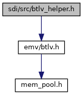
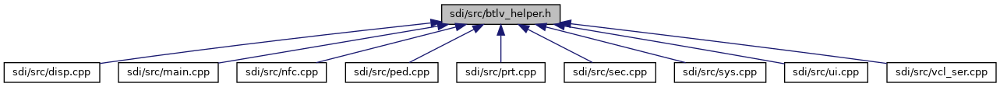

[Data Structures](#nested-classes)

`#include "`<a href="btlv_8h_source.md">emv/btlv.h</a>`"`

Include dependency graph for btlv_helper.h:

This graph shows which files directly or indirectly include this file:

<a href="btlv__helper_8h_source.md">Go to the source code of this file.</a>

|  |  |
|----|----|
| Data Structures |  |
| struct   | <a href="struct_b_t_l_v_root_node.md">BTLVRootNode</a> |
