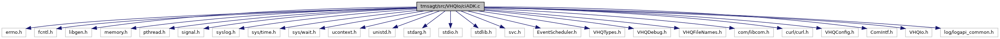

[Macros](#define-members) \| [Functions](#func-members) \| [Variables](#var-members)

`#include <errno.h>`
`#include <fcntl.h>`
`#include <libgen.h>`
`#include <memory.h>`
`#include <pthread.h>`
`#include <signal.h>`
`#include <syslog.h>`
`#include <sys/time.h>`
`#include <sys/wait.h>`
`#include <ucontext.h>`
`#include <unistd.h>`
`#include <stdarg.h>`
`#include <stdio.h>`
`#include <stdlib.h>`
`#include <svc.h>`
`#include "EventScheduler.h"`
`#include "VHQTypes.h"`
`#include "VHQDebug.h"`
`#include "VHQFileNames.h"`
`#include "com/libcom.h"`
`#include "curl/curl.h"`
`#include "VHQConfig.h"`
`#include "ComIntf.h"`
`#include "VHQIo.h"`
`#include "log/logapi_common.h"`

Include dependency graph for ciADK.c:

|  |  |
|----|----|
| Macros |  |
| #define  | [ARRAY_SIZEOF](#a083b03c5af4ad6035a7b2879c523150c)(x)   (sizeof(x)/sizeof(x\[0\])) |
| #define  | [CURL_SOCKOPT_ALREADY_CONNECTED](#ab8ca8814344440cc2b4c774d5ef656d1)   2 |
| #define  | [INFOSVC_TAG](#aaa30870a8a4867cfda99e92e171e35ae)   \"infosvc@\" |
| #define  | [COM_EVENT_NETWORK_ATTACH](#a771d52401f2de7f0c44045381b86c657)   26 |
| #define  | [COM_EVENT_NETWORK_DETACH](#a0e00f1bff0429e1111910edf1fabfd74)   27 |

|  |  |
|----|----|
| Functions |  |
| void  | [CheckAndInitLog](#a4dd68818b6d7d663ab24c7b866f6d52a) (void) |
| int  | [InitVXComms](#a63a54b0dd95a1b95c327144de73f8e0b) (bool NWIF_start) |
| void  | [StartNetwork](#a14218cafcf8cb7b241304a53c65c98a9) (void) |
| void  | [StartCommEngine](#a4e9cf7d5bfbf9b781773b0f768525a5d) (void) |
| int  | [internal_GetMACAddress](#a07cc05691d9ade5eac44bf6759c347fb) (char \*pszMACAddress, int iMACAddressBufLen) |
| int  | [internal_GetIPAddress](#afb24d619e9278eec2d27a3c03376d1c3) (char \*pszIPAddress, int iIPAddressBufLen) |
| bool  | [GetRestartStatus](#a99d56462c3eb0a7f9c7d42ed9ad494a0) () |
| const char \*  | [GetCommErrWrapper](#a88578bc5651d04ba6474943c963cb3e0) (enum <a href="libcom_8h.md#a332bd39910a20de262a2321a456e4a58">com_ErrorCodes</a> com_errno_in) |
| com_type_t  | [get_comtype_by_interface](#a264684fe3e10e9debdcc560c286a7cbf) (enum <a href="libcom_8h.md#af5a039e966328fc65a4de3506050898e">com_Interfaces</a> interface) |
| const char \*  | [get_NetworkEvent_description](#addc371761c51a05059a5cc567640ff4b) (enum <a href="libcom_8h.md#a0496cb54a878b5e873baabcb337f3b67">com_NetworkEvent</a> nwEvent) |
| void  | [DirectADK_statuscallback](#a53c99ee269bb7c9949f3695cdbbf0884) (enum <a href="libcom_8h.md#a8239249db998e4aac1b0477ec2e1b40f">com_ConnectionEvent</a> event, enum <a href="libcom_8h.md#ad8ed41376d7876324c9101abf3cdd75c">com_ConnectionType</a> type, const void \*data, void \*priv, enum <a href="libcom_8h.md#a332bd39910a20de262a2321a456e4a58">com_ErrorCodes</a> com_errno) |
| void  | [ConfigureConnectionProfile](#a9b04009d734df35bae738326dd9f1594) (char \*pszDefaultPath) |
| int  | [DirectADK_init](#a9100e3514092f49bb9cbbb2234758f04) (char \*pszSettings1, char \*pszSettings2, char \*pszSettings3, char \*pszSettings4) |
| int  | [DirectADK_deinit](#a4c8b1447f733dfc68b995e9b0ad8753e) (void) |
| int  | [closesocket_callback](#a1750ae75de0cf41c067a0365f1b26b93) (void \*clientp, curl_socket_t item) |
| int  | [DirectADK_open](#ad15c47f904402af998ce91aa083afcd3) (CommOpenData \*pData) |
| int  | [DirectADK_close](#ac1c1c2a9496ccf9554346f4f71745c92) (CommOpenData \*pData) |
| int  | [DirectADK_status](#a0d66b33a0e606847049f08dee7403773) (void \*pData, bool \*bUp, char \*pszIpAddress, char \*pszMacAddr) |
| int  | [DirectADK_NetConn](#a2bd3df1a2e07d3c471b2f8446f44be95) (void) |
| int  | [DirectADK_NetDisconn](#a61cff86bb8cb19df0bf3a906755c0e12) (bool bForceDisconnect) |
| const char \*  | [DirectADK_ErrString](#a143341710d3e44104487f08b113e1bc1) (int err) |

|            |                                                                |
|------------|----------------------------------------------------------------|
| Variables  |                                                                |
| int        | [g_iRefCount](#ac84b53de20ee2dea29d1cc5c43880c5e) = 0          |
| char \*    | [pszConnectionFile](#a5d847c4bab1b1a9108829112298d746f) = NULL |
| const int  | [netFieldLen](#a76079c39f1616f2ed37830b98d25cf54) = 9          |

## DetailedDescription {#detailed-description}

Main ADK connectivity related file.

## MacroDefinition Documentation {#macro-definition-documentation}

## ARRAY_SIZEOF 

#define ARRAY_SIZEOF

## COM_EVENT_NETWORK_ATTACH 

#define COM_EVENT_NETWORK_ATTACH   26

## COM_EVENT_NETWORK_DETACH 

#define COM_EVENT_NETWORK_DETACH   27

## CURL_SOCKOPT_ALREADY_CONNECTED 

#define CURL_SOCKOPT_ALREADY_CONNECTED   2

## INFOSVC_TAG 

#define INFOSVC_TAG   \"infosvc@\"

## FunctionDocumentation {#function-documentation}

## CheckAndInitLog() 

void CheckAndInitLog

## closesocket_callback() 

int closesocket_callback

This callback function gets called by libcurl when sockets are closed.

**Parameters**

\[out\] **clientp** = socket descriptor set with CURLOPT_CLOSESOCKETDATA. \[out\] **item** = item is the socket libcurl wants to be closed.

### Returns

int 0, if socket closed.

## ConfigureConnectionProfile() 

void ConfigureConnectionProfile

This function configures the connection profile to establish a connection with the help of ADK COM. It checks for multiple locations for connection profiles and update the current connection profile g_szCurrentConnectionProfile.

**Parameters**

\[in\] **pszDefaultPath** = pointer to connection profile.

### Returns

void

## DirectADK_close() 

int DirectADK_close

This function closes the connection using ADK functions and displays error message returned if any.

**Parameters**

\[in\] **pData** = pointer to curl details.

### Returns

int 0, if connection closed

## DirectADK_deinit() 

int DirectADK_deinit

## DirectADK_ErrString() 

const char\* DirectADK_ErrString

## DirectADK_init() 

int DirectADK_init

This function initializes the ADK COM connections.

**Parameters**

\[in\] **pszSettings1** \[in\] **pszSettings2** \[in\] **pszSettings3** \[in\] **pszSettings4**

### Returns

int 0, if initialization success

## DirectADK_NetConn() 

int DirectADK_NetConn

This function establishes connection to network if operating mode is ADK.It calls ADK function to connect the network.

### Returns

0, if network connect is successful.

## DirectADK_NetDisconn() 

int DirectADK_NetDisconn

This function is the disconnect from network if operating mode is ADK.It calls ADK function to disconnect the network.

**Parameters**

\[in\] **bForceDisconnect** =TRUE, if force disconnect is active

### Returns

0, if network disconnect is successful.

## DirectADK_open() 

int DirectADK_open

This function opens the connection using ADK functions and displays error message returned if any.

**Parameters**

\[in\] **pData** = pointer to curl details.

### Returns

int -1, if error

## DirectADK_status() 

int DirectADK_status

This function returns the IP address and Mac address if connection status is active

**Parameters**

\[in\] **pData** = pointer to curl details. \[out\] **bUp** = to store status, TRUE if active/IP address is present \[out\] **pszIpAddress** = to store IP Address \[out\] **pszMacAddr** = to store Mac address

### Returns

int -1, if not attached; 0, if connection attached

## DirectADK_statuscallback() 

void DirectADK_statuscallback

This is a callback function that will be called by ADK COM when an event is generated.

**Parameters**

\[out\] **event** = event thrown by the network layer \[out\] **type** = type of connection \[out\] **data** = data \[out\] **priv** = network profile \[out\] **com_errno** = ADK COM error code returned.

### Returns

void

## get_comtype_by_interface() 

com_type_t get_comtype_by_interface

This function sets the enum value corresponding to the network type we got from ADK COM.

**Parameters**

\[in\] **interface** = Available communication interfaces in the system

### Returns

com_type_t

## get_NetworkEvent_description() 

const char\* get_NetworkEvent_description

## GetCommErrWrapper() 

const char\* GetCommErrWrapper

This function returns a zero-terminated string with a description matching the input com_errno by using ADK COM functions and displays the error if any.

**Parameters**

\[in\] **com_errno_in** = error codes

### Returns

void

## GetRestartStatus() 

bool GetRestartStatus

## InitVXComms() 

int InitVXComms

## internal_GetIPAddress() 

int internal_GetIPAddress

Function gather the IP address information.

**Parameters**

\[out\] **pszIPAddress** = pointer to IP address \[out\] **iIPAddressBufLen** = IP address buffer length

### Returns

int 0, if success

## internal_GetMACAddress() 

int internal_GetMACAddress

Function gather the MAC address information.

**Parameters**

\[out\] **pszMACAddress** = pointer to MAC address \[out\] **iMACAddressBufLen** = MAC address buffer length

### Returns

int 0,if success

## StartCommEngine() 

void StartCommEngine

## StartNetwork() 

void StartNetwork

## VariableDocumentation {#variable-documentation}

## g_iRefCount 

int g_iRefCount = 0

## netFieldLen 

const int netFieldLen = 9

## pszConnectionFile 

char\* pszConnectionFile = NULL

