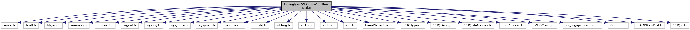

[Macros](#define-members) \| [Functions](#func-members) \| [Variables](#var-members)

`#include <errno.h>`
`#include <fcntl.h>`
`#include <libgen.h>`
`#include <memory.h>`
`#include <pthread.h>`
`#include <signal.h>`
`#include <syslog.h>`
`#include <sys/time.h>`
`#include <sys/wait.h>`
`#include <ucontext.h>`
`#include <unistd.h>`
`#include <stdarg.h>`
`#include <stdio.h>`
`#include <stdlib.h>`
`#include <svc.h>`
`#include "EventScheduler.h"`
`#include "VHQTypes.h"`
`#include "VHQDebug.h"`
`#include "VHQFileNames.h"`
`#include "com/libcom.h"`
`#include "VHQConfig.h"`
`#include "log/logapi_common.h"`
`#include "ComIntf.h"`
`#include "ciADKRawDial.h"`
`#include "VHQIo.h"`

Include dependency graph for ciADKRawDial.c:

|  |  |
|----|----|
| Macros |  |
| #define  | [ARRAY_SIZEOF](#a083b03c5af4ad6035a7b2879c523150c)(x)   (sizeof(x)/sizeof(x\[0\])) |
| #define  | [INFOSVC_TAG](#aaa30870a8a4867cfda99e92e171e35ae)   \"infosvc@\" |

|  |  |
|----|----|
| Functions |  |
| void  | [CheckAndInitLog](#a4dd68818b6d7d663ab24c7b866f6d52a) (void) |
| int  | [InitVXComms](#a63a54b0dd95a1b95c327144de73f8e0b) (bool NWIF_start) |
| void  | [StartNetwork](#a14218cafcf8cb7b241304a53c65c98a9) (void) |
| void  | [StartCommEngine](#a4e9cf7d5bfbf9b781773b0f768525a5d) (void) |
| int  | [internal_GetMACAddress](#a07cc05691d9ade5eac44bf6759c347fb) (char \*pszMACAddress, int iMACAddressBufLen) |
| int  | [internal_GetIPAddress](#afb24d619e9278eec2d27a3c03376d1c3) (char \*pszIPAddress, int iIPAddressBufLen) |
| bool  | [GetRestartStatus](#a99d56462c3eb0a7f9c7d42ed9ad494a0) () |
| const char \*  | [get_NetworkEvent_description_frormat](#a737f4e0def81d1a07ac9ecefbfc02b2c) (enum <a href="libcom_8h.md#a0496cb54a878b5e873baabcb337f3b67">com_NetworkEvent</a> nwEvent) |
| const char \*  | [GetCommErrWrapper](#a88578bc5651d04ba6474943c963cb3e0) (enum <a href="libcom_8h.md#a332bd39910a20de262a2321a456e4a58">com_ErrorCodes</a> com_errno_in) |
| void  | [RawDial_statuscallback](#a6a8c914f7cac99a3822ee73519f04517) (enum <a href="libcom_8h.md#a8239249db998e4aac1b0477ec2e1b40f">com_ConnectionEvent</a> event, enum <a href="libcom_8h.md#ad8ed41376d7876324c9101abf3cdd75c">com_ConnectionType</a> type, const void \*data, void \*priv, enum <a href="libcom_8h.md#a332bd39910a20de262a2321a456e4a58">com_ErrorCodes</a> com_errno) |
| bool  | [CheckADKConnectionFileReadPermissions](#a1c2994fa1bb9babc967b90e24c59217e) (char \*pszProfile) |
| int  | [RawDial_init](#a9a25965960242f36cfd3bc235c5d51a0) (char \*pszSettings1, char \*pszSettings2, char \*pszSettings3, char \*pszSettings4) |
| int  | [RawDial_deinit](#a1d9e27e869a2f4734df72415616256e0) (void) |
| int  | [RawDial_open](#a14ef5ef9954656dfc4af98ef10f54ecb) (CommOpenData \*pData) |
| int  | [RawDial_close](#a67dab2a0577df70f19b65ee3fffad1f1) (CommOpenData \*pData) |
| int  | [RawDial_status](#a4f4c9abda53d4dfa973eeb7b52da0a07) (void \*pData, bool \*bUp, char \*pszIpAddress, char \*pszMacAddr) |
| int  | [RawDial_NetConn](#aaf6d701fe13aebb155c9c3eec072c4d2) (void) |
| int  | [RawDial_NetDisconn](#a4405320c3da052c042aa5039b33719cd) (bool bForceDisconnect) |

|  |  |
|----|----|
| Variables |  |
| struct com_ConnectHandle \*  | [g_hADK](#aabc4f2ad6e0e8ca13ba7d7424f9a2874) = NULL |

## DetailedDescription {#detailed-description}

Main <a href="libevt_8h.md#struct_event">Event</a> Scheduler operations

## MacroDefinition Documentation {#macro-definition-documentation}

## ARRAY_SIZEOF 

#define ARRAY_SIZEOF

## INFOSVC_TAG 

#define INFOSVC_TAG   \"infosvc@\"

## FunctionDocumentation {#function-documentation}

## CheckADKConnectionFileReadPermissions() 

bool CheckADKConnectionFileReadPermissions

## CheckAndInitLog() 

void CheckAndInitLog

## get_NetworkEvent_description_frormat() 

const char\* get_NetworkEvent_description_frormat

## GetCommErrWrapper() 

const char\* GetCommErrWrapper

This function returns a zero-terminated string with a description matching the input com_errno by using ADK COM functions and displays the error if any.

**Parameters**

\[in\] **com_errno_in** = error codes

### Returns

void

## GetRestartStatus() 

bool GetRestartStatus

## InitVXComms() 

int InitVXComms

## internal_GetIPAddress() 

int internal_GetIPAddress

Function gather the IP address information.

**Parameters**

\[out\] **pszIPAddress** = pointer to IP address \[out\] **iIPAddressBufLen** = IP address buffer length

### Returns

int 0, if success

## internal_GetMACAddress() 

int internal_GetMACAddress

Function gather the MAC address information.

**Parameters**

\[out\] **pszMACAddress** = pointer to MAC address \[out\] **iMACAddressBufLen** = MAC address buffer length

### Returns

int 0,if success

## RawDial_close() 

int RawDial_close

## RawDial_deinit() 

int RawDial_deinit

## RawDial_init() 

int RawDial_init

## RawDial_NetConn() 

int RawDial_NetConn

## RawDial_NetDisconn() 

int RawDial_NetDisconn

## RawDial_open() 

int RawDial_open

## RawDial_status() 

int RawDial_status

## RawDial_statuscallback() 

void RawDial_statuscallback

## StartCommEngine() 

void StartCommEngine

## StartNetwork() 

void StartNetwork

## VariableDocumentation {#variable-documentation}

## g_hADK 

struct com_ConnectHandle\* g_hADK = NULL

